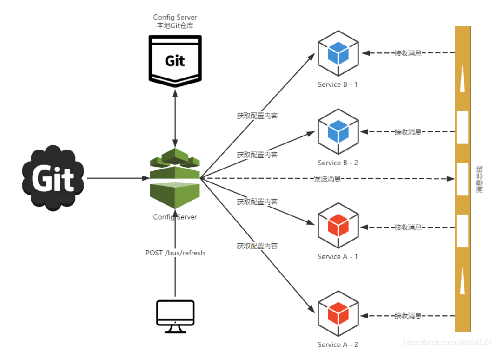

# Config

> 基于[【Config 官网】](https://cloud.spring.io/spring-cloud-static/spring-cloud-config/2.2.1.RELEASE/reference/html/)、[【Bus 官网】](https://docs.spring.io/spring-cloud-bus/docs/current/reference/html/)、[Spring Cloud Config 统一配置中心详解](https://blog.csdn.net/qq_41946216/article/details/127422810)

## 一、基本概念

**情景 1**：

微服务意味着要将单体应用中的业务拆分成一个个的子服务，每个服务的粒度相对较小，因此系统中会出现大量的服务。而每个服务都需要必要的配置信息才能运行，大量的微服务也意味着大量的配置文件，常规的配置管理会有如下问题：

- 硬编码：每个微服务的配置文件或多或少会有一些公共的配置，一旦这些公共配置更改，就需要手动去更改所有相关的配置文件。
- 当配置文件更改时，需要重新打包和重启。

所以**一套集中式的、动态的配置管理设施是必不可少的**。

---

Config 是 SpringCloud 提供的**集中式的配置管理中心**，用来实现微服务系统中服务配置的统一管理。

**有以下作用**：

- 集中管理配置文件。
- 不同环境不同配置，动态化的配置更新，分环境部署，例如：dev、test、prod。
- 运行期间动态调整配置，不再需要在每个服务部署的机器上编写配置文件，服务会向配置中心统一拉取自己的配置。
- 当配置发生变动时，服务不需要重启即可感知到配置的变化并应用新的配置。
- 将配置信息以 REST 接口的形式暴露。

## 二、Config 使用

### （一）Config 结构


SpringCloud Config 在微服务分布式系统中，采用 Server 服务端和 Client 客户端的组件方式来提供可扩展的配置服务：

- Server 服务端：Server 服务端也称为**分布式配置中心**，是一个独立的微服务引用，用来连接配置服务器（例如：Git、SVN 或本地文件）并为客户端提供配置信息。
- Client 客户端：Client 客户端通过 Server 来管理应用资源，以及与业务相关的配置内容，并在启动时从 Server 获取和加载配置信息。

> 配置服务器推荐采用 Git 来存储配置信息，有助于对环境配置进行版本管理，并且可以通过 Git 客户端工具去更加方便地管理和访问配置内容。

#### 1、Server 端配置

（1）新建 [Git 仓库](https://github.com/onezilin/StudyNotes-SpringCloudConfig.git)，添加配置文件。

> 注意：配置文件的命名方式是有规范的，后面讲解。


（2）引入依赖，编写启动类

```xml
<!-- Config服务端 -->
<dependency>
    <groupId>org.springframework.cloud</groupId>
    <artifactId>spring-cloud-config-server</artifactId>
</dependency>
```

```java
@SpringBootApplication
// 开启配置中心服务端
@EnableConfigServer
public class ConfigCenterMain3344 {

    public static void main(String[] args) {
        SpringApplication.run(ConfigCenterMain3344.class, args);
    }
}
```

@EnableConfigServer 是 SpringCloud Config 提供的注解，作用于类上，用来开启 Config Server 服务端功能，让应用可以从 Git、SVN 或本地文件中读取配置信息。

（3）编写 application.yml [配置文件](https://zhuanlan.zhihu.com/p/433201039)

```yml
spring:
  application:
    name: cloud-config-center
  cloud:
    config:
      server:
        git:
          # 私有仓库需要配置账号密码
          # username: xxxx
          # password: xxxx
          uri: https://github.com/onezilin/StudyNotes-SpringCloudConfig.git
          # 当仓库下有子文件夹时，需要配置搜索路径，子文件夹中的同名文件会覆盖父文件夹中的同名文件
          search-paths:
            - foo
          # 默认请求的 git 分支名称，当请求中没有配置 label 时使用该值，例如：http://localhost:3344/config-dev.yml
          default-label: master
```

（4）通过 REST 方式访问配置服务器中的配置文件

虽然官网上介绍了 5 中访问配置文件的方式，但是这里只介绍 2 种：

```txt
[/{label}]/{application}-{profile}.yml

[/{label}]/{application}-{profile}.properties
```

其中 label 是指 git 的分支名称，上面说 Git 配置服务器中的配置文件命名是由规范的，其中必须带有 `-`：

- 例如 config-dev.yml，其中 {application} 就是 config，{profile} 就是 dev，中间用 `-` 隔开。
- 例如 foo-config-dev.yml，因为有两个 `-`，可以将 foo-config 作为 {application}，dev 作为 {profile}；也可以将 foo 作为 {application}，将 config-dev 作为 {profile}。

通过 `localhost:3344/{label}/{application}-{profile}.yml` 的方式访问，也就是 `http://localhost:3344/master/config-dev.yml` 查看配置文件。

#### 2、Client 端配置

（1）引入依赖

```xml
<!-- SpringCloud Config 客户端依赖 -->
<dependency>
    <groupId>org.springframework.cloud</groupId>
    <artifactId>spring-cloud-starter-config</artifactId>
</dependency>
```

（2）编写 bootstrap.yml 配置文件

> 下面再解释为什么是 bootstrap.yml 配置文件。

① 硬编码方式

```yml
spring:
  application:
    name: cloud-config-client
  cloud:
    config:
      label: master # 分支名称
      name: config # 配置文件名称
      profile: dev # 读取后缀名称
      uri: http://localhost:3344 # 配置中心的地址，组合起来就是：http://localhost:3344/master/config-dev.yml
```

其中 label 对应着 {label}，name 对应着 {application}，profile 对应着 {profile}，url 就是 Server 服务端的地址，组合起来就是 `http://localhost:3344/master/config-dev.yml`。

② 服务注册中心

上面通过 url 属性指定配置中心的地址，若 Server 端使用集群模式，可以通过注册中心发现配置中心服务：

```yml
spring:
  application:
    name: cloud-config-client
  cloud:
    config:
      label: master # 分支名称
      name: config # 配置文件名称
      profile: dev # 读取后缀名称
      #      uri: http://localhost:3344  # 配置中心的地址，组合起来就是：http://localhost:3344/master/config-dev.yml
      discovery:
        service-id: CLOUD-CONFIG-CENTER # 从服务注册中心发现配置中心服务
        enabled: true # 开启服务注册中心

eureka:
  client:
    register-with-eureka: true # 是否注册进 eureka 服务注册中心
    fetch-registry: true # 是否从 eureka 服务注册中心抓取已有的注册信息
    service-url:
      defaultZone: http://eureka7001.com:7001/eureka/,http://eureka7002.com:7002/eureka/
```

> 注意：eureka 的配置需要写在 boostrap.yml 中，并且是硬编码方式。

（3）使用配置服务器下配置文件中的配置

① 在配置文件中使用

使用 `${eureka.client.service-url.defaultZone}` 获取 Server 服务端的配置：

```yml
server:
  port: 3355

eureka:
  client:
    register-with-eureka: true # 是否注册进 eureka 服务注册中心
    fetch-registry: true # 是否从 eureka 服务注册中心抓取已有的注册信息
    service-url:
      defaultZone: ${eureka.client.service-url.defaultZone}
```

② 在代码中使用

通过 @Value 获取 Server 服务端的配置：

```yml
@RestController
public class ConfigController {

    @Value("${config.info}")
    private String configInfo;

    @GetMapping("/configInfo")
    public String getConfigInfo() {
        return configInfo;
    }
}
```

（4）通过 `http://localhost:3355/configInfo` 访问接口

### （二）[bootstrap.yml 文件](https://cloud.tencent.com/developer/article/1612392)

SpringCloud 构建在 SpringBoot 之上，它会创建一个 **Bootstrap Context** 作为 Spring 应用的 **Application Context** 的**父上下文**，初始化时 Bootstrap Context 负责从外部加载配置属性并解析配置，这两个上下文共享一个从外部获取的 Environment。

Boostrap 属性有高优先级，**默认情况下不会被本地配置覆盖**。Bootstrap Context 和 Application Context 有着不同的约定，所有新增了一个 bootstrap.yml 文件，保证 Bootstrap Context 和 Application Context 分离。

**bootstrap.yml 有以下特点**：

- bootstrap.yml 是 SpringCloud 中支持的配置文件。
- bootstrap.yml 先于 application.yml 加载，bootstrap.yml 中的配置不会被 application.yml 覆盖。

**典型应用场景**：

- 在 Config Client 端中添加连接到配置中心的配置属性，**用于先加载外部配置中心的配置信息**。
- 一些固定的不能被覆盖的属性。
- 一些加密 / 解密的场景。

### （三）手动刷新配置

当修改配置服务器中的配置文件时，会发现 Server 端的配置更新了，但是 Client 端的配置没有更新，需要手动重启服务才能获取最新的配置，然而某些服务重启很麻烦或者耗时长，此时就需要能让 **Client 端不需要重启就能获取最新配置的功能**。

SpringCloud 提供手动刷新配置的功能，对 Client 进行以下调整：

（1）添加 Actuator 依赖

```xml
<dependency>
    <groupId>org.springframework.boot</groupId>
    <artifactId>spring-boot-starter-actuator</artifactId>
</dependency>
```

（2）修改 yml 配置文件

```yml
# 暴露监控端点 否则 curl -X POST "http://localhost:3355/actuator/refresh" 不可使用
management:
  endpoints:
    web:
      exposure:
        include: "*"
```

（3）代码中添加 @RefreshScope 注解

> 注意：只对在代码中使用的 Config 配置生效，对于配置文件中使用的配置不生效。

@RefreshScope 是 SpringCloud 提供的注解，用来实现 Config、Nacos 更改配置服务器下的配置文件时，动态刷新 Bean 中依赖的配置属性。

```java
@RestController
@RefreshScope // 支持 Config、Nacos 的动态刷新功能
public class ConfigController {

    @Value("${config.info}")
    private String configInfo;

    @GetMapping("/configInfo")
    public String getConfigInfo() {
        return configInfo;
    }
}
```

（4）POST 请求 `http://localhost:3355/actuator/refresh/` 接口，手动刷新获取最新配置


## 三、Bus

上面的手动刷新方式虽然可以在不重启服务的前提下刷新 Client 端的配置，但是会有一个问题：假如有很多 Client 端，那么就要为每个端执行一次 POST 请求，极其不灵活，因此提出了**服务总线**的概念。

在微服务架构中的系统中，通常会使用**轻量级的消息代理**来构建一个**共用的消息主题**，并让系统中所有的微服务实例都连接上来。由于**该主题中产生的消息会被所有实例监听和消费，所以称它为消息总线**。在总线上的各个实例，都可以方便地广播一些消息，让其他实例接收。

SpringCloud Bus 能管理和传播分布式系统键的消息，就像一个分布式执行器，可用于广播状态更改、事件推送等，也可以当作微服务间的通信通道，用来实现微服务架构中的服务总线功能。

> SpringCloud Bus 只支持 RabbitMQ 和 Kafka。

### （一）应用

SpringCloud Bus 配合 SpringCloud Config 使用可以实现配置的自动刷新配置，有两种实现方式：

1、通过 Client 触发自动刷新


Config Client 端监听同一个 Topic（默认是 springCloudBus），当**通过 POST 请求手动刷新某个 Client 时**，同时会向该 Topic 发送一条消息，其他监听该 Topic 的 Client 接收到消息后，会自动去更新配置。

2、通过 Server 触发自动刷新



Config Client 端监听同一个 Topic（默认是 springCloudBus），当**通过 POST 请求 Server** 时，会向该 Topic 发送一条消息，监听该 Topic 的 Client 接收到消息后，会自动去更新配置。

---

通过 Server 触发自动刷新显然更加合适，第一种不适合的原因如下：

- 打破了微服务的职责单一性，因为微服务本身是业务模块，它本不应该承担配置刷新的职责。
- 破坏了微服务各节点的对等性。

### （二）自动刷新配置

#### 1、通过 Client 触发自动刷新

Client 端进行以下调整：

（1）添加 Bus 和 Actuator 依赖，使用 Kafka 消息队列

```xml
<!-- SpringCloud Bus 消息总线依赖，使用 Kafka 消息队列 -->
<dependency>
    <groupId>org.springframework.cloud</groupId>
    <artifactId>spring-cloud-starter-bus-kafka</artifactId>
</dependency>

<dependency>
    <groupId>org.springframework.boot</groupId>
    <artifactId>spring-boot-starter-actuator</artifactId>
</dependency>
```

（2）修改 yml 文件

```yml
spring:
  cloud:
    stream:
      kafka:
        binder:
          brokers: 192.168.190.134:9092 # kafka 服务地址

# 暴露监控端点 否则 curl -X POST 不可使用
management:
  endpoints:
    web:
      exposure:
        include: "*" # 暴露所有端点
```

（3）代码中添加 @RefreshScope 注解

```java
@RestController
@RefreshScope // 支持 Config、Nacos 的动态刷新功能
public class ConfigController {

    @Value("${config.info}")
    private String configInfo;

    @GetMapping("/configInfo")
    public String getConfigInfo() {
        return configInfo;
    }
}
```

（4）POST 请求 `http://localhost:3355/actuator/bus-refresh/` 接口

该操作可以手动刷新当前 Client 配置，同时会向 springCloudBus 发送一条消息，其他监听该 Topic 的 Client 接收到消息后，会自动去更新配置。

#### 2、通过 Server 触发自动刷新

Server 进行以下调整：

（1）和上面 Client 前两步一致

（2）POST 请求 `http://localhost:3344/actuator/bus-refresh/` 接口

> 注意：这里 3344 是 Server 端口号。

使用 POST 请求 `http://localhost:3344/actuator/bus-refresh/{spring-application-name}:{端口号}` 可以刷新指定 Client 配置，例如：`http://localhost:3344/actuator/bus-refresh/cloud-config-client:3355` 只刷新端口号为 3355 的 Client 配置。
