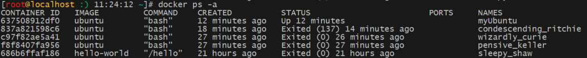
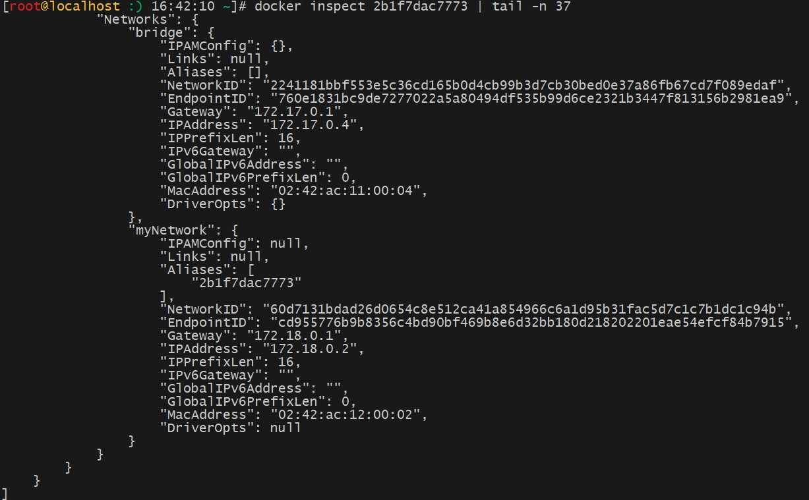
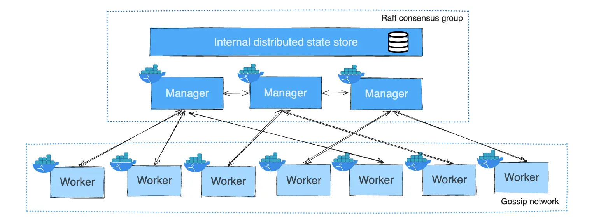

# Docker

> 基于《尚硅谷 Docker 实战教程》、《Docker 技术入门与实战》
>
> 以下版本为 CentOS 7、docker-ce-24.0.7-1.el7.x86_64

## 一、基本概念

**情景 1**：

在 SpringCloud 篇章，我们使用 SpringBoot + MySQL + Nacos + Sentinel 来搭建微服务架构，传统做法是需要安装 MySQL、Nacos、Sentinel 软件及配置它们运行的环境，之后再测试能否正常运行，如果不正常，则进行调试追踪，意味着更多的时间代价和不可控的风险。如果使用的应用变多，例如又使用 Redis、Kafka 等中间件，事情会变得更加难以处理。

假如我们学习了虚拟机，尝试将原本 Windows 上的环境迁移到 Linux 中，往往需要对每个应用进行重新部署和测试。这些琐碎而无趣的体力活，极大地降低了用户的工作效率。**究其根源，是这些应用直接运行在底层操作系统上，无法保证同一份应用在不同的环境中行为一致。**

Docker 提供了一种更为聪明的方式，**通过容器来打包应用、解耦应用和运行平台**。这意味着迁移的时候，只需要在新的服务器上启动需要的容器就可以了，无论新旧服务器是否是同一类型的平台，即跨平台的事情由 Docker 去处理，我们只需要操作 Docker 就行。这无疑将帮助我们节约大量的宝贵时间，并降低部署过程出现问题的风险。

> 就像我们只需要提供 .class 文件，就可以在 Windows、Linux 等系统中运行 Java，具体的跨平台实现由 JVM 去处理。

---

Docker 是基于 Go 语言实现的开源**容器**项目。

> **容器技术有效地将由单个操作系统管理的资源划分到孤立的组中，以更好地在孤立的组之间平衡有冲突的资源使用需求。**与虚拟化相比，这样既不需要指令级模拟，也不需要即时编译。容器可以在核心 CPU 本地运行指令，而不需要任何专门的解释机制。此外，也避免了准虚拟化（para-virtualization）和系统调用替换中的复杂性。

Docker 的构想是要实现 “Build, Ship and Run Any App, Anywhere"，即通过对应用的封装（Packaging）、分发（Distribution）、部署（Deployment）、运行（Runtime）生命周期进行管理，**达到应用组件级别的一次封装，到处运行**。

> 这里的应用组件，既可以是一个 Web 应用、一个编译环境，也可以是一套数据库平台服务，甚至是一个操作系统或集群。

**有以下优点：**

- **更快速的应用交付和部署**：应用开发完成后，传统做法是：开发人员需要提供一堆安装程序和配置说明文档，运维人员安装部署后需根据配置文档进行繁杂的配置才能正常运行。Docker 化之后，开发人员只需要交付少量容器镜像文件（应用安装配置在镜像里已经内置好），运维人员在正式生产环境加载镜像并运行即可，大大节省部署配置和测试验证时间。
- **更简单的系统运维**：应用容器化运行后，生产环境运行的应用可与开发、测试环境的应用高度一致，容器会将应用程序相关的环境和状态完全封装起来，不会因为底层基础架构和操作系统的不一致给应用带来影响、产生新的 bug。当出现程序异常时，也可以通过测试环境的相同容器进行快速定位和修复。
- **更便捷的升级和扩缩容**：Docker 容器几乎可以在任意的平台上运行，包括物理机、虚拟机、公有云等，同时支持主流的操作系统发行版本。这种兼容性让用户可以在不同平台之间轻松地迁移应用。当现有的容器不足以支撑业务处理时，可通过镜像运行新的容器进行快速扩容，使应用系统的扩容时间从原先的天级变成分钟级甚至秒级。
- **更高效的计算资源利用**：运行 Docker 容器不需要额外的虚拟化管理程序 (例如 VMware) 的支持， Docker 是内核级的虚拟化，可以实现更高的性能，同时对资源的额外需求很低。与传统虚拟机方式相比，Docker 的性能要提高 1~2 个数量级。

### （一）虚拟化

在计算机技术中，虚拟化（Virtualization）是一种资源管理技术。它是将计算机的各种实体资源，如：服务器、网络、内存及存储等，予以抽象、转换后呈现出来，打破实体结构间的不可切割的障碍，使用户可以用更好的方式来利用这些资源。

虚拟化是通过软件的方式模拟实体服务器，其初衷是为了解决**一种应用占用一台服务器模式**所带来的服务器数量剧增的问题，从而降低数据中心复杂度，简化管理难度。在虚拟化的发展过程中，出现过以下主要虚拟化技术或产品：

- **KVM**：KVM 是一个 Linux kernel 模块，可以使用 modprobe 来加载 KVM，加载后还需要通过其他工具创建虚拟机。KVM 是一个全虚拟化的解决方案，但需要 CPU 支持虚拟化功能。
- **VMWare**：VMWare 是一家非常出名虚拟化软件公司，其产品涵盖服务器、桌面等各种虚拟化领域，如：**VMware Workstation** 是一款桌面虚拟机软件，可以**在一台实体机器上模拟完整的硬件环境**，并可运行多个 Windows、DOS、Linux 或 Mac 系统，是非常好的开发、测试、部署解决方案。从技术角度来说，VMware Workstation 是一款完全虚拟化产品，可借助硬件辅助在不修改用户操作系统的情况下完整虚拟化操作系统。
- **LXC**：LXC（Linux Container、Linux 容器）是一种轻量级的虚拟化的手段，**它可以提供轻量级的虚拟化，以隔离进程和资源**，而且不需要提供指令解释机制以及全虚拟化的其他复杂性。容器会有效地将由单个操作系统管理的资源划分到孤立的组中，以更好地在孤立的组之间平衡有冲突的资源使用需求。

### （二）[虚拟机和 Docker 的对比](https://pdai.tech/md/devops/docker/docker-01-docker-vm.html)

虚拟机（Virtual Machine）与容器化技术（例如 Docker）都是虚拟化技术，两者的区别在于虚拟化的程度不同：


**虚拟机：**

- 虚拟机最初的设计目的是允许多个操作系统在一台物理机上运行，目标是允许用户创建与底层硬件相隔离的虚拟环境。
- 虚拟机利用 Hypervisor 虚拟化 CPU、内存、IO 设备等硬件设备，然后在其上运行完整的操作系统，再在该系统上运行所需的应用。
- 虚拟机模拟了操作系统所需的一整套操作环境，并实现 OS 级别的资源隔离。
- 虚拟机资源占用多、冗杂步骤多（例如需要进行引导设置）、启动慢（相当于启动一个操作系统）。

**Docker：**

- Docker 旨在提供一种轻量级便携方式，**以便在隔离且可重现的环境中打包和运行应用程序**。
- Docker 利用 Linux 内核本身支持的容器方式实现资源和环境隔离，容器中的应用直接运行于宿主机的内核，容器共享宿主机的内核，容器内部运行的是 Linux 副本，没有自己的内核，直接使用物理机的硬件资源，因此 CPU/内存利用率上有一定优势。
- Docker 利用 Linux 内核本身支持的容器方式实现资源和环境隔离，相比虚拟机少了一层 guest OS。
- Docker 资源占用少（仅包含容器运行的所需资源）、启动快（相当于启动一个应用程序）。

### （三）Docker 架构


- Docker 是一个 Client-Server 结构的系统，Docker 守护进程运行在主机上，**是一个容器运行载体或称之为管理引擎**，客户端可以与之通信并发送命令。
- **Images（Docker 镜像）**：Docker 镜像是一个只读模板，包含创建 Docker 容器的说明。镜像可以用来创建 Docker 容器，一个镜像可以创建很多容器。
- **Container（Docker 容器）**：Docker 容器类似于一个轻量级的沙箱，Docker 利用容器来运行和隔离应用。容器是从镜像创建的应用运行实例。它可以启动、开始、停止、删除，而这些容器都是彼此相互隔离、互不可见的。
- **Repository（Docker 仓库）**：Docker 仓库类似于代码仓库，是 Docker 集中存放镜像文件的场所。
- **Registry（Docker 注册服务器）**：Docker 注册服务器是存放仓库的具体服务器，一个注册服务器上可以有多个仓库，而每个仓库下面可以有多个镜像。Docker Hub 是官方提供的注册服务器，国内不少云服务商都提供第三方注册服务器，包括：腾讯云、阿里云、网易云等，一般这些第三方注册服务器内的镜像会与 Docker Hub 中官方镜像同步。

## 二、Docker 使用

### （一）[安装配置](https://docs.docker.com/engine/install/centos/)

> 注意：Docker 并非是一个通用的容器工具，它**依赖已存在并运行的 Linux 内核环境**。想在其它系统上运行 Docker，就必须有 Linux 内核环境，例如：Windows 的 [WSL](https://blog.csdn.net/m0_57236802/article/details/131540728)（Windows Subsystem for Linux、Windows 上的 Linux 子系统），WSL、虚拟机（例如 VMware）都是在 Windows 上运行 Linux 环境的通用方式。

#### 1、YUM 方式安装

通过 YUM 安装管理 Docker CE 版本：

```shell
# 1、卸载旧版本
yum remove docker \
                  docker-client \
                  docker-client-latest \
                  docker-common \
                  docker-latest \
                  docker-latest-logrotate \
                  docker-logrotate \
                  docker-engine

# 2、安装 gcc 相关依赖
yum install -y gcc gcc-c++

# 3、安装 Docker 需要的软件
yum install -y yum-utils

# 4、设置 stable 镜像仓库
# 4.1、官网提供的 stable 镜像仓库配置：
yum-config-manager --add-repo https://download.docker.com/linux/centos/docker-ce.repo
# 4.2、阿里云提供的 stable 镜像仓库配置：
yum-config-manager --add-repo http://mirrors.aliyun.com/docker-ce/linux/centos/docker-ce.repo

# 5、更新 yum 软件包索引
yum makecache fast

# 6、安装 Docker CE 版本
# 6.1、安装最新版本：
yum install docker-ce docker-ce-cli containerd.io docker-buildx-plugin docker-compose-plugin
# 6.2、安装指定版本：
yum list docker-ce --showduplicates | sort -r

# 7、启动
systemctl start docker

# 8、测试是否安装、配置、启动成功
docker run hello-world
```

#### 2、镜像加速配置

国内从 Docker Hub 拉取镜像有时会遇到困难，此时可以通过配置镜像加速器来加快从 Docker Hub 或其他注册服务器拉取镜像的速度，Docker 官方和国内很多云服务商都提供了国内加速器服务，例如：阿里云（[个人镜像服务配置](https://cr.console.aliyun.com/cn-hangzhou/instances/mirrors)）、[网易](http://hub-mirror.c.163.com)。配置如下：

```shell
# 1、添加 docker 目录
mkdir -p /etc/docker

# 2、修改 daemon.json 内容
vim /etc/docker/daemon.json
{
  "registry-mirrors": [
    "https://y6ki7gyt.mirror.aliyuncs.com",
    "https://docker.m.daocloud.io",
    "https://registry.docker-cn.com",
    "https://docker.mirrors.ustc.edu.cn",
    "https://hub-mirror.c.163.com",
    "https://hub.uuuadc.top",
    "https://docker.anyhub.us.kg",
    "https://dockerhub.jobcher.com",
    "https://dockerhub.icu",
    "https://docker.ckyl.me",
    "https://docker.awsl9527.cn",
    "https://mirror.baidubce.com"
  ]
}

# 3、重载配置
systemctl daemon-reload

# 4、重启 Docker
systemctl restart docker

# 5、查看配置是否生效
docker info
```

### （二）基本命令


#### 1、Docker 管理命令

```shell
# 开启 Docker
[root@www ~]# systemctl start docker

# 停止 Docker
[root@www ~]# systemctl stop docker

# 重启 Docker
[root@www ~]# systemctl restart docker

# 查看 Docker 状态
[root@www ~]# systemctl status docker

# Docker 开机自启动
[root@www ~]# systemctl enable docker
```

#### 2、docker info

查看 Docker 的版本、宿主机硬件等信息。

```shell
[root@www ~]# docker info
```

#### 3、docker --help

查看 Docker 帮助文档。

```shell
# 查看全部命令帮助文档
[root@www ~]# docker --help

# 查看具体命令帮助文档
[root@www ~]# docker 命令 --help
```

#### 4、docker system df

查看 Docker 镜像、容器、数据卷数量和所占的磁盘大小。

```shell
[root@www ~]# docker system df
```

#### 5、镜像命令

##### （1）docker images

查看本地 Docker 中的镜像。

```shell
[root@www ~]# docker images [-aq]
```

| 选项 | 说明                               |
| ---- | ---------------------------------- |
| -a   | 展示本地所有的镜像（含历史映像层） |
| -q   | 只显示镜像 ID                      |


**各列参数说明：**

- REPOSITORY：镜像的仓库源，格式为 `注册服务器/仓库名`，如果是 Docker Hub 注册服务器，则格式为 `仓库名`。
- TAG：镜像的版本号。同一仓库源可以有多个 TAG 版本，表示这个仓库源的不同版本，使用 `REPOSITORY:TAG` 来表示不同的镜像名称，如果不指定镜像的 TAG，就等同于 `REPOSITORY:latest`。
- IMAGE ID：镜像 ID，唯一。
- CREATED：镜像创建时间。
- SIZE：镜像大小。

##### （2）docker pull

下载指定镜像的指定版本。

```shell
[root@www ~]# docker pull 镜像名称
```

严格地讲，镜像的仓库名称中还应该添加注册服务器地址（即 Registry）作为前缀，不加前缀时默认使用的是官方 Docket Hub 服务。

```shell
[root@www ~]# docker pull ubuntu:18.04
# 等同于
[root@www ~]# docker pull registry.hub.docker.com/ubuntu:18.04
```

如果从非官方的仓库下载，则需要在仓库名称前指定完整的注册服务器地址。例如从网易蜂巢的镜像源来下载 ubuntu:18.04 镜像：

```shell
[root@www ~]# docker pull hub.c.163.com/public/ubuntu:18.04
```

##### （3）docker tag

为镜像起一个别名。

```shell
[root@www ~]# docker tag 源镜像名称 目标镜像名称
```

例如：为 `ubuntu:18.04` 镜像起一个别名。

```shell
[root@www ~]# docker tag ubuntu:18.04 myubuntu:latest
```


> `ubuntu:18.04` 和 `myubuntu:latest` 都指向同一个镜像文件，类似于 Linux 中的硬链接。

##### （4）docker search

搜索远程仓库中的指定镜像。

```shell
[root@www ~]# docker search [--limit] 镜像名称
```

| 选项         | 说明                           |
| ------------ | ------------------------------ |
| --limit 数字 | 只展示前 N 个镜像，默认值为 25 |


**各列参数说明：**

- NAME：镜像名称。
- DESCRIPTION：镜像说明。
- STARS：点赞数量。
- OFFICIAL：是否是官方提供的镜像。
- AUTOMATED：是否是自动构建的镜像。

##### （5）docker rmi

删除镜像。

```shell
[root@www ~]# docker rmi <镜像ID | 镜像名称[ 镜像ID | 镜像名称 ...]>
```

| 选项 | 说明     |
| ---- | -------- |
| -f   | 强制删除 |

```shell
# 强制删除所有的镜像
[root@www ~]# docker rmi -f $(docker images -aq)
```

##### （6）docker save

将镜像文件保存在本地。

```shell
[root@www ~]# docker save [-o 文件路径] 镜像ID
```

| 选项        | 说明                                                  |
| ----------- | ----------------------------------------------------- |
| -o 文件路径 | 默认将输出流写入到标准输出，-o 将输出流写入到指定文件 |

##### （7）docker load

将 `docker save` 保存的 tar 文件重新导入到本地镜像库，这将导入镜像及其相关的元数据信息（包括标签等）。

```shell
[root@www ~]# docker load [-i 文件路径]
```

| 选项        | 说明             |
| ----------- | ---------------- |
| -i 文件路径 | 从指定文件中读取 |

#### 6、容器命令

##### （1）docker ps

查看本地 Docker 中的容器。

```shell
[root@www ~]# docker ps [-aq] [-n 数字]
```

| 选项    | 说明                                                 |
| ------- | ---------------------------------------------------- |
| -a      | 展示所有创建的容器，包括当前正在运行和已经退出的容器 |
| -n 数字 | 展示最近 N 个创建的容器                              |
| -q      | 只显示容器 ID                                        |



**各列参数说明：**

- CONTAINER ID：容器 ID。
- IMAGE：容器所使用的镜像。
- COMMAND：容器启动时使用的命令。
- CREATED：容器创建时间。
- STATUS：容器状态，UP 为正在运行，Exited 为已退出。
- PORTS：容器映射的端口号。
- NAMES：容器名称，未指定时为随机值。

##### （2）[docker run](https://docs.docker.com/reference/cli/docker/container/run/)

创建并启动容器。

```shell
[root@www ~]# docker run [--name 容器名称] [-itd] [-p|-P] <镜像ID | 镜像名称> [命令] [参数]
```

| 选项            | 说明                                                                                    |
| --------------- | --------------------------------------------------------------------------------------- |
| --name 容器名称 | 为容器指定一个名称                                                                      |
| -i              | 保持标准输入打开，通常与 -t 同时使用                                                    |
| -t              | 为容器重新分配一个 tty 终端，通常与 -i 同时使用                                         |
| -d              | 在后台运行容器                                                                          |
| -p              | 指定端口映射，格式为 `-p 主机端口:容器端口`，访问主机指定端口，就可以访问到对应容器端口 |
| -P              | 随机端口映射，随机分配主机端口                                                          |

以交互模式启动容器，在交互模式下，用户可以通过所创建的终端来输入命令。

```shell
# 启动 ubuntu 容器，名称为 myubuntu，使用 bash 进行交互式操作
[root@www ~]# docker run --name myubuntu -it ubuntu bash
```

> 有两种方式退出交互界面：
>
> - 输入 exit 命令：退出交互界面，容器停止。
> - Ctrl + p + q 或 Ctrl + d 快捷键：退出交互界面，容器继续运行。

以后台模式启动容器，Docker 容器在后台以守护态运行。

```shell
[root@www ~]# docker run ／bin/sh -c "while rue; do echo hello world; sleep 1; done"
```

> [注意](https://www.jerrymei.cn/docker-container-run-not-stop-automatically/)：以后台模式运行容器，如果镜像运行的命令不是那些一直挂起的命令，就会自动退出。

##### （3）docker logs

查看容器日志。

```shell
[root@www ~]# docker logs 容器ID
```

##### （4）docker top

查看容器内的进程。

```shell
[root@www ~]# docker top 容器ID
```

##### （5）docker inspect

以 JSON 形式展示容器信息（例如：容器 ID、创建时间、使用的镜像、状态等）。

```shell
[root@www ~]# docker inspect 容器ID
```

##### （6）docker attach 和 docker exec

两者都可以进入正在运行的容器进行操作。

```shell
[root@www ~]# docker attach 容器ID

# 进入正在运行的容器并执行命令
[root@www ~]# docker exec -it 容器ID 命令
```

有以下区别：

- attach 直接进入**容器启动时的命令终端**，不会启动新的进程，用 exit 退出时，会导致容器停止。
- exec 是在容器中**打开新的终端**，并且可以启动新的进程，用 exit 退出时，不会导致容器停止。

##### （7）docker rm

删除容器。

```shell
[root@www ~]# docker rm 容器ID [容器ID ...]
```

| 选项 | 说明     |
| ---- | -------- |
| -f   | 强制删除 |

```shell
# 强制删除所有的容器
[root@www ~]# docker rm -f $(docker ps -aq)
```

##### （8）docker cp

在容器和宿主机之间复制文件。

```shell
# 将文件从容器内拷贝到宿主机内
[root@www ~]# docker cp 容器ID:容器内路径 宿主机内路径
# 将文件从宿主机内拷贝到容器内
[root@www ~]# docker cp 宿主机内路径 容器ID:容器内路径
```

##### （9）docker export

将容器打包成 tar 文件。

```shell
[root@www ~]# docker export [-o 文件路径] 容器ID
```

| 选项        | 说明                                                    |
| ----------- | ------------------------------------------------------- |
| -o 文件路径 | 默认会将输出流写入到标准输出，-o 将输出流写入到指定文件 |

```shell
[root@www ~]# docker export -o myubuntu.tar 686b6ffaf186
# 等同于
[root@www ~]# docker export 686b6ffaf186 > myubuntu.tar
```

##### （10）docker import

基于本地 Tarball 文件创建 Docker 镜像。

> Tarball 是指将软件的所有源码打包成 tar 文件，再进行压缩后生成的文件，即我们使用 `tar -xzvf` 打包压缩生成的文件，在这里是指 `docker export` 打包生成的 tar 文件。

```shell
[root@www ~]# docker import 文件路径 [REPOSITORY[:TAG]]
```

例如：将上面生成的 myubuntu.tar 导入到 Docker 中，生成镜像。

```shell
[root@www ~]# docker import myubuntu.tar ubuntu:1.0.0
# 等同于
[root@www ~]# cat myubuntu.tar | docker import - ubuntu:1.0.0
```

##### （11）docker commit

基于已有的容器创建 Docker 镜像。

```shell
[root@www ~]# docker commit [选项] 容器ID [REPOSITORY[:TAG]]
```

| 选项    | 说明                                             |
| ------- | ------------------------------------------------ |
| -a      | 作者信息                                         |
| -m      | 该容器的说明                                     |
| -p      | commit 操作时暂停容器运行                        |
| -c 指令 | 提交的时候执行 Dockerfile 指令，包括 CMD、ENV 等 |

例如：基于已有的 ubuntu 容器创建 `commitubuntu:latest` 镜像。

```shell
[root@www ~]# docker commit -m "commit command test" -a "onezilin" 4ef550970739 commitubuntu:latest
```


### （三）容器生命周期

通过 `docker run` 运行容器后，可以通过以下命令对容器进行管理。

#### 1、docker pause

暂停运行容器。

```shell
[root@www ~]# docker pause 容器ID [容器ID ...]
```

继续运行容器。

```shell
[root@www ~]# docker unpause 容器ID [容器ID ...]
```

#### 2、docker stop

停止运行容器。

```shell
[root@www ~]# docker stop 容器ID [容器ID ...]
```

#### 3、docker kill

强制停止运行容器。

```shell
[root@www ~]# docker kill 容器ID [容器ID ...]
```

> [pause、stop 和 kill 三者的区别](https://signoz.io/blog/docker-container-lifecycle/)：
>
> - pause 命令会发送 SIGSTOP 信号用于**暂停容器中的所有进程**。暂停状态下，内存数据保持不变。
> - stop 命令先向容器发送 SIGTERM 信号，容器会进行终止前准备工作（清除内存数据、持久化磁盘、释放资源），经过一段时间后（默认为 10s），再发送 SIGKILL 信号，容器立刻停止。停止状态下，内存数据会被清除。
> - kill 命令会发送 SIGKILL 信号给容器主进程，主进程接收到 SIGKILL 信号后会直接停止，不会执行终止前准备工作。

#### 4、docker start

启动已停止的容器。

```shell
[root@www ~]# docker start 容器ID [容器ID ...]
```

#### 5、docker restart

重启容器。

```shell
[root@www ~]# docker restart 容器ID [容器ID ...]
```

### （四）镜像推送到仓库

Docker 提供将本地镜像推送到仓库的功能。

#### 1、远程仓库

阿里云提供容器镜像服务，可以作为远程仓库存储本地 Docker 镜像。

> 先在[阿里云个人容器镜像服务](https://cr.console.aliyun.com/cn-hangzhou/instances)中创建个人空间，再在个人空间中创建个人仓库，一个仓库用于存储一个镜像的多个版本。

（1）修改镜像名称

推送时的镜像名称需要按照特定格式：`Registry地址/Namespace个人空间名/仓库名:版本号`，如果是 Docker Hub 的仓库就可以省略 Registry 地址：`Namespace个人空间名/仓库名:版本号`。

我这里创建的 Namespace 为 onezilin，个人仓库名为 my_docker_image。将本地 `onezilin/my_docker_image:1.0.0.snapshot` 改为 `registry.cn-hangzhou.aliyuncs.com/onezilin/my_docker_image:1.0.0.snapshot`。

```shell
[root@www ~]# docker tag onezilin/my_docker_image:1.0.0.snapshot registry.cn-hangzhou.aliyuncs.com/onezilin/my_docker_image:1.0.0.snapshot
```

（2）登录账户

登录指定 Docker Registry 的名称和地址。

```shell
[root@www ~]# docker login --username=onezilin registry.cn-hangzhou.aliyuncs.com
```

（3）推送镜像

```shell
[root@www ~]# docker push registry.cn-hangzhou.aliyuncs.com/onezilin/my_docker_image:1.0.0.snapshot
```

（4）拉取镜像

私有仓库需要先登录后才能 pull，公有仓库是任何人都可以拉取。

```shell
[root@www ~]# docker pull registry.cn-hangzhou.aliyuncs.com/onezilin/my_docker_image:1.0.0.snapshot
```

#### 2、本地仓库

如果不想将 Docker 镜像推送到远程仓库，Docker 也提供 Docker Registry 用于构建本地私人仓库。

（1）拉取 Docker Registry

```shell
[root@www ~]# docker pull registry
```

（2）运行私有 Docker Registry

- `-p 5000:5000`：设置容器端口与主机的端口映射。
- `--privileged=true`：设置为 true，使 Container 内的 root 拥有真正的 root 权限，否则 Container 内的 root 只是外部的一个普通用户。
- `-v /onezilin/my_docker_image:/tmp/registry`：使用数据卷容器。

```shell
[root@www ~]# docker run -d -p 5000:5000 -v /onezilin/my_docker_image:/tmp/registry --privileged=true registry
```

（3）修改本地 daemon.json 配置

Docker Registry 默认不支持 HTTP 形式的推送，修改 `/etc/docker/daemon.json` 配置文件使其支持：

```json
{
  "registry-mirrors": ["https://y6ki7gyt.mirror.aliyuncs.com", "http://hub-mirror.c.163.com"],
  "insecure-registries": ["192.168.190.137:5000"]
}
```

修改后重启 Docker 并重新运行 Registry 容器。

（4）修改镜像名称

推送时的镜像名称需要按照特定格式：`本地Registry地址/Namespace个人空间名/仓库名:版本号`。

我这里创建的 Namespace 为 onezilin，个人仓库名为 my_docker_image。将本地 `onezilin/my_docker_image:1.0.0.snapshot` 改为 `192.168.190.137:5000/onezilin/my_docker_image:1.0.0.snapshot`。

```shell
[root@www ~]# docker tag onezilin/my_docker_image:1.0.0.snapshot 192.168.190.137:5000/onezilin/my_docker_image:1.0.0.snapshot
```

（5）推送镜像

```shell
[root@www ~]# docker push 192.168.190.137:5000/onezilin/my_docker_image:1.0.0.snapshot
```

（6）查看本地私人仓库

通过 curl 命令查看本地私人仓库。

```shell
[root@www ~]# curl -XGET http://192.168.190.137:5000/v2/_catalog
```

（7）拉取镜像

```shell
[root@www ~]# docker pull 192.168.190.137:5000/onezilin/my_docker_image:1.0.0.snapshot
```

### （五）数据管理

在生产环境中使用 Docker，往往**需要对数据进行持久化，或者需要在多个容器之间进行数据共享**，这必然涉及容器的数据管理操作。

容器中的管理数据主要有两种方式：

- 数据卷 (Data Volumes) ：容器内数据直接映射到本地主机环境。
- 数据卷容器 (Data Volume Containers)：使用特定容器维护数据卷。

**它们有以下特点：**

- 数据卷可以在容器之间共享和重用，容器间传递数据将变得高效与方便。
- 容器内和本地都可以对数据卷中的数据进行读写。
- 对数据卷的更新不会影响镜像，解耦应用和数据。
- 卷会一直存在，直到没有容器使用，可以手动安全地卸载它。

#### 1、数据卷

数据卷 (Data Volumes) 是一个可供容器使用的特殊目录，它将主机操作系统目录直接映射进容器，类似于 Linux 中的 mount 行为。

##### （1）[docker volume](https://docs.docker.com/reference/cli/docker/volume/)

Docker 提供 volume 子命令来管理数据卷，数据卷默认存放在 `var/lib/docker/volumes` 目录下。

```shell
# 1、创建数据卷
[root@www ~]# docker volume create 数据卷名称

# 2、查看数据卷信息
[root@www ~]# docker volume inspect 数据卷名称

# 3、查看所有数据卷
[root@www ~]# docker volume ls

# 4、删除数据卷
[root@www ~]# docker volume rm 数据卷名称

# 5、清理没有任何容器引用的数据卷
[root@www ~]# docker volume prune
```

#### 2、数据卷容器

数据卷的目的是持久化容器的数据，我们可以在启动时为容器设置数据卷。

##### （1）启动数据卷容器

`docker run` 提供 -v 参数用于为容器配置数据卷：

① 第一种写法

```shell
# -v 数据卷名称:容器路径

# 例如：
[root@www ~]# docker run -it --privileged=true -v myVolume2:/useVolume2 ubuntu bash
```

将容器路径挂载到指定数据卷，如果没有该数据卷则会先创建。

> 注意：
>
> - 容器路径必须是绝对地址，即从根目录 `/` 开始。
> - 最好添加 `--privileged=true` 参数，否则容器内 root 权限会被当作主机的普通用户。

② 第二种写法

```shell
# -v 主机路径:容器路径

# 例如：
[root@www ~]# docker run -it --privileged=true -v /myVolume2:/useVolume2 ubuntu bash
```

将容器路径挂载到指定主机路径，如果没有该主机目录则会先创建。

> 注意：
>
> - 这种方式创建的数据卷不能通过 docker volume 命令管理。
> - 主机路径必须是绝对地址，即从根目录 `/` 开始。

③ 第三种写法（不推荐）

```shell
# -v 名称

# 例如：
[root@www ~]# docker run -it --privileged=true -v useVolume3 ubuntu bash
# 等同于
[root@www ~]# docker run -it --privileged=true -v 随机数据卷UUID:/useVolume3 ubuntu bash
```

##### （2）读写权限

默认情况下，我们的数据卷容器对挂载的路径都有读写权限：

```shell
# -v 数据卷名称:容器路径
# 等同于
# -v 数据卷名称:容器路径:rw
```

加了 `:ro` 后，容器内对所挂载的容器路径只有读取权限：

```shell
# -v 数据卷名称:容器路径:ro
```

##### （3）数据卷容器继承

`docker run` 提供 --volumes-from 参数用于继承其它容器的数据卷配置：

```shell
# --volumes-from 容器1 [--volumes-from 容器2 ......]

# 例如：
[root@www ~]# docker run -it --privileged=true --volumes-from=0f9ffef3c1ba --volumes-from=f7d59415717f -v useVolume10 ubuntu bash
```

该容器继承了 0f9ffef3c1ba 和 f7d59415717f 的数据卷容器配置，同时自己设置了 useVolume10 数据卷：


## 三、Docker 应用

Docker 镜像包含应用程序与该程序的依赖，不同于以前繁琐地程序安装流程，使用 Docker 可以通过命令形式，更加方便快捷地启动指定容器（相当于安装对应程序）。

> 注意：对于微服务应用，容器化是非常容易和平滑的，因为这些应用是无状态的，而且它们在微服务架构中可以在很短时间内完成启停，高度保证了整个服务的可用性。**传统数据库或有状态的应用、对网络吞吐性能有高要求的应用，并不适合容器化。**

### （一）Tomcat

```shell
# 1、搜索 tomcat 镜像
[root@www ~]# docker search tomcat
# 2、拉取 tomcat 镜像
[root@www ~]# docker pull tomcat
# 3、查看拉取的 tomcat 镜像
[root@www ~]# docker images
# 4、启动 tomcat 容器
[root@www ~]# docker run -d -p 8080:8080 --name t1 tomcat
```

启动后就可以通过 `localhost:8080` 访问 Tomcat。

### （二）MySQL

#### 1、单机 MySQL

```shell
# 1、拉取 MySQL 5.7.28 镜像
[root@www ~]# docker pull mysql:5.7.28
# 2、创建 my.cnf 配置文件
[root@www ~]# vim /onezilin/mysql/conf/my.cnf

[client]
default_character_set=utf8
[mysqld]
character_set_server=utf8
collation_server=utf8_general_ci

# 3、启动 MySQL 容器
[root@www ~]# docker run -d -p 3306:3306 --privileged=true \
-v /onezilin/mysql/log:/var/log/mysql \
-v /onezilin/mysql/data:/var/lib/mysql \
-v /onezilin/mysql/conf:/etc/mysql/conf.d \
-e MYSQL_ROOT_PASSWORD=xxxxxx \
--name mysql \
mysql:5.7.28
```

#### 2、主从复制 MySQL

（1）主 MySQL 配置及容器启动

```shell
# 1、创建 my.cnf 配置文件
[root@www ~]# mkdir -p /mydata/mysql-master/conf
[root@www ~]# vim /mydata/mysql-master/conf/my.cnf

[client]
default_character_set=utf8
[mysqld]
character_set_server=utf8
collation_server=utf8_general_ci
# 设置server_id，同一局域网中需要唯一
server_id=101
# 指定不需要同步的数据库名称
binlog-ignore-db=mysql
# 开启二进制日志功能
log-bin=mall-mysql-bin
# 设置二进制日志使用内存大小(事务)
binlog_cache_size=1M
# 设置使用的二进制日志格式
binlog_format=mixed
# 二进制日志过期清理时间。默认值为0，表示不自动清理
expire_logs_days=7
# 跳过主从复制中遇到的所有错误或指定类型的错误，避免slave端复制中断
# 如:1062错误是指一些主键重复，1032错误是因为主从数据库数据不一致
slave_skip_errors=1062

# 2、启动 MySQL 容器
[root@www ~]# docker run -d -p 3307:3306 --privileged=true \
-v /mydata/mysql-master/log:/var/log/mysql \
-v /mydata/mysql-master/data:/var/lib/mysql \
-v /mydata/mysql-master/conf:/etc/mysql/conf.d \
-e MYSQL_ROOT_PASSWORD=xxxxxx \
--name mysql-master \
mysql:5.7.28
```

（2）从 MySQL 配置及容器启动

```shell
# 1、创建 my.cnf 配置文件
[root@www ~]# mkdir -p /mydata/mysql-slave/conf
[root@www ~]# vim /mydata/mysql-slave/conf/my.cnf

[client]
default_character_set=utf8
[mysqld]
character_set_server=utf8
collation_server=utf8_general_ci
# 设置server_id，同一局域网中需要唯一
server_id=102
# 指定不需要同步的数据库名称
binlog-ignore-db=mysql
# 开启二进制日志功能
log-bin=mall-mysql-bin
# 设置二进制日志使用内存大小(事务)
binlog_cache_size=1M
# 设置使用的二进制日志格式
binlog_format=mixed
# 二进制日志过期清理时间。默认值为0，表示不自动清理
expire_logs_days=7
# 跳过主从复制中遇到的所有错误或指定类型的错误，避免slave端复制中断
# 如:1062错误是指一些主键重复，1032错误是因为主从数据库数据不一致
slave_skip_errors=1062

# 2、启动 MySQL 容器
[root@www ~]# docker run -d -p 3308:3306 --privileged=true \
-v /mydata/mysql-slave/log:/var/log/mysql \
-v /mydata/mysql-slave/data:/var/lib/mysql \
-v /mydata/mysql-slave/conf:/etc/mysql/conf.d \
-e MYSQL_ROOT_PASSWORD=xxxxxx \
--name mysql-slave \
mysql:5.7.28
```

（3）主从 MySQL 实例配置

**在 3307 主 MySQL 实例中：**

```shell
# 1、进入 MySQL 容器
[root@www ~]# docker exec -it mysql-master /bin/bash
# 2、连接 MySQL
root@26fa23c04870:/# mysql -uroot -pxxxxxx
# 3、创建数据同步用户
mysql> USE mysql;
mysql> CREATE USER 'slave'@'%'IDENTIFIED BY'xxxxxx';
mysql> GRANT REPLICATION SLAVE, REPLICATION CLIENT ON *.* TO 'slave'@'%';
# 4、查看主 MySQL 状态
mysql> show master status;
```


**在 3308 从 MySQL 实例中：**

```shell
# 1、进入 MySQL 容器
[root@www ~]# docker exec -it mysql-master /bin/bash
# 2、连接 MySQL
root@26fa23c04870:/# mysql -uroot -pxxxxxx
# 3、添加主数据库配置
mysql> change master to master_host='192.168.190.137', master_port=3307, master_user='slave', master_password='xxxxxx', master_log_file='mall-mysql-bin.000003', master_log_pos=400, master_connect_retry=30;
# 4、开启主从同步
mysql> START SLAVE;
# 5、查看从 MySQL 状态
mysql> SHOW SLAVE STATUS \G;
```


设置完后就可以在主数据库中添加数据，查看从数据库中是否同步。

### （三）Redis

#### 1、单机 Redis

```shell
# 1、拉取 Redis 6.2.4 镜像
[root@www ~]# docker pull redis:6.2.4
# 2、创建 redis.conf 配置文件
[root@www ~]# mkdir -p /app/redis
[root@www ~]# vim /app/redis/redis.conf

bind 127.0.0.1 -::1
port 6379
dir /data
pidfile /var/run/redis_6379.pid
# 需要将后台运行模式置为 no，否则和 docker run -d 冲突
daemonize no
appendonly yes

# 3、启动 Redis 容器
[root@www ~]# docker run -d -p 6379:6379 --privileged=true \
-v /app/redis/redis.conf:/etc/redis/redis.conf \
-v /app/redis/data:/data \
--name myr3 \
redis:6.2.4 \
redis-server /etc/redis/redis.conf
# 4、进入 Redis 容器
[root@www ~]# docker exec -it myr3 /bin/bash
# 5、使用 redis-cli 客户端连接
root@01b9f364e133:/data# redis-cli
```

### （四）Portainer

由于使用命令行的方式操作 Docker 服务器不是很方便，因此我们可以通过 Portainer 提供的 Dashboard 仪表盘操作 Docker。

```shell
# 启动 Portainer 容器
[root@www ~]# docker run -p 8000:8000 -p 9000:9000 -v /docker/portainer/data:/data -v /var/run/docker.sock:/var/run/docker.sock --name portainer portainer/portainer
```

访问虚拟机的 9000 端口便可以使用 Portainer 操作 Docker：


Portainer 除了可以管理同一台宿主机下的 Docker 服务器，还可以连接远程的 Docker 进行管理，此时远程 Docker 服务器需要开启远程访问功能：

```shell
# 1、修改 docker.service 文件
[root@www ~]# vim /usr/lib/systemd/system/docker.service
# 1.1、修改前
ExecStart=/usr/bin/dockerd -H fd:// --containerd=/run/containerd/containerd.sock
# 1.2、修改后
ExecStart=/usr/bin/dockerd -H fd:// -H tcp://0.0.0.0:2375 -H unix://var/run/docker.sock --containerd=/run/containerd/containerd.sock

# 重新加载并重启 Docker
[root@www ~]# systemctl daemon-reload
[root@www ~]# systemctl restart docker
```

开启远端访问功能后，Portainer 可以通过 API `ip:2375` 访问远程的 Docker。

> 注意：上面 Docker 开启远程访问功能配置仅限于内网，因为没有身份校验的功能，不可在外网的 Docker 上开启。

## 四、[Dockerfile 构建](https://docs.docker.com/reference/dockerfile/)

Dockerfile 是用来构建 Docker 镜像的文本文件，是由一条条构建新镜像所需的指令和参数组成的脚本。


> 当我们对一个容器进行修改并 commit 生成一个新的镜像，使用起来和 Dockerfile 的作用一致，但是这会带来许多问题：
>
> - 对容器的操作不透明且没有记录，除了 commit 提交生成镜像的人，其他人无法知道提交者具体做了哪些操作。
> - 每次 commit 生成新的镜像层时，都不会修改上一层的镜像，这样每一次修改提交都会让镜像更加臃肿。

### （一）规范

在学习如何编写 Dockerfile 文件前，需要知道一些规范：

- Dockerfile 文件名称通常为 `Dockerfile`。
- Dockerfile 提供的指令不区分大小写，但是为方便和参数做区分，**通常指令使用大写字母**，指令单独成一行且后面要跟随至少一个参数。
- Dockerfile 中指令按顺序**从上至下依次执行**，每条指令都会创建一个新的镜像层并 commit 提交。
- `#` 表示注释，通常注释需要单独成一行，避免 Dockerfile 执行时误解为参数。

### （二）[指令](https://yeasy.gitbook.io/docker_practice/image/build)

Dockerfile 是一个文本文件，其内包含了一条条的 **指令(Instruction)**，每一条指令构建一层镜像，因此每一条指令的内容，就是描述该层应当如何构建。

#### 1、FROM

FROM 用于指定**基础镜像**，即 Dockerfile 是基于哪个镜像构建的。

```dockerfile
FROM 镜像名称
```

> 注意：Dockerfile 中第一个非注释行必须是 FROM 指令。

Docker Hub 上提供许多可以直接拿来使用的服务类镜像，如：nginx、redis、mysql 等，也可以使用更为基础的操作系统镜像，如：ubuntu、debian、centos 等。

除了选择现有镜像为基础镜像外，Docker 还存在一个特殊的镜像，名为 `scratch`。这个镜像是虚拟的概念，并不实际存在，它表示一个空白的镜像，大小也为 0B。

```dockerfile
FROM scratch
```

如果你以 `scratch` 为基础镜像的话，意味着你不以任何镜像为基础，接下来所写的指令将作为镜像第一层开始存在。

不以任何系统为基础，直接将可执行文件复制进镜像的做法并不罕见，对于 Linux 下静态编译的程序来说，并不需要有操作系统提供运行时支持，所需的一切库都已经在可执行文件里了，因此直接 `FROM scratch` 会让镜像体积更加小巧。使用 Go 语言 开发的应用很多会使用这种方式来制作镜像。

#### 2、RUN

Dockerfile **构建新镜像时需要执行的命令**，有两种格式：

```dockerfile
# 第一种 shell 格式：
RUN Linux 终端中的 shell 命令 [, "参数1", "参数2" ......]

# 第二种 exec 格式：
RUN ["可执行文件" [, "参数1", "参数2" ......]]
```

一个 Dockerfile 文件中可以有多个 RUN 指令：

```dockerfile
RUN apt-get update
RUN apt-get install -y gcc libc6-dev make wget
RUN wget -O redis.tar.gz "http://download.redis.io/releases/redis-5.0.3.tar.gz"
RUN mkdir -p /usr/src/redis
RUN tar -xzf redis.tar.gz -C /usr/src/redis --strip-components=1
RUN make -C /usr/src/redis
RUN make -C /usr/src/redis install
```

由于 Dockerfile 中每个指令都会新建一个镜像层，上面这种写法会创建多个镜像层，而且很多运行时不需要的东西，都被装进了镜像里，比如编译环境、更新的软件包等等。结果就是产生非常臃肿、非常多层的镜像，不仅仅增加了构建部署的时间，也很容易出错。

建议使用如下写法：

```dockerfile
RUN set -x; buildDeps='gcc libc6-dev make wget' \
    && apt-get update \
    && apt-get install -y $buildDeps \
    && wget -O redis.tar.gz "http://download.redis.io/releases/redis-5.0.3.tar.gz" \
    && mkdir -p /usr/src/redis \
    && tar -xzf redis.tar.gz -C /usr/src/redis --strip-components=1 \
    && make -C /usr/src/redis \
    && make -C /usr/src/redis install \
    && rm -rf /var/lib/apt/lists/* \
    && rm redis.tar.gz \
    && rm -r /usr/src/redis \
    && apt-get purge -y --auto-remove $buildDeps
```

> 镜像构建时，一定要确保每一层只添加真正需要添加的东西，任何无关的东西都应该清理掉。

#### 3、WORKDIR

指定**WORKDIR 命令之后的镜像层的工作目录**，有两个作用：

（1）不指定路径的情况，使用工作目录作为默认目录。

```dockerfile
WORKDIR /app1
RUN cd /app2
RUN echo "hello" > world.txt
```

虽然使用 `RUN cd /app2` 指令，但是每个指令都会创建一个新的镜像层，`RUN cd /app2` 和 `RUN echo "hello" > world.txt` 执行环境不同处于两个镜像，`cd /app2` 的命令不会影响到 `echo "hello" > world.txt`。而我们又使用 `WORKDIR /app1` 指定工作目录，`world.txt` 默认存放在 `/app1` 目录下。

（2）终端登录时的当前目录。

tomcat 的 WORKDIR 值为 `/usr/local/tomcat`，当我们使用 `docker exec -it tomcat /bin/bash` 登录 tomcat 容器时，pwd 所在的目录就是 `/usr/local/tomcat`。

#### 4、COPY

将构建上下文目录下的 `源路径文件` 复制到新的一层镜像内的 `目标路径`，并且源文件的各种元数据都会保留，例如：读、写、执行权限等。

```dockerfile
COPY 源路径文件 目标路径
```

> 注意：如果源路径为文件夹，复制的时候不是直接复制该文件夹，而是将文件夹中的内容复制到目标路径。

#### 5、ADD

和 COPY 指令一样具有复制功能，但额外增加一些功能：

- 如果 `源路径` 是一个 URL，ADD 指令会试图下载这个链接的文件并放到目标路径，默认权限为 600。
- 如果 `源路径` 是一个 tar 包，压缩格式为 `gzip、bzip2 或 xz`，ADD 指令将会自动解压到目标路径。

> 一般情况下推荐使用 COPY 指令，仅在需要自动解压缩的场合使用 ADD 指令。

#### 6、CMD

Dockerfile 构建的**新镜像启动后执行的命令（即容器启动时执行的命令）**，有三种格式：

```dockerfile
# 第一种 shell 格式：
CMD Linux 终端中的 shell 命令 [, "参数1", "参数2" ......]

# 第二种 exec 格式：
CMD ["可执行文件" [, "参数1", "参数2" ......]]

# 第三种参数列表格式（ENTRYPOINT 指令中生效）：
CMD ["参数1" [, "参数2" ......]]
```

> 注意：
>
> - 如果存在多个 CMD 指令，则只有最后一个 CMD 指令生效。
> - 如果使用 `docker run` 指令时，在镜像名称后面添加 `[命令] [参数]`，则会覆盖 CMD 指令后面的命令和参数。

例如通过 Dockerfile 构建 `nginx:test` 镜像：

```dockerfile
FROM nginx

CMD service nginx start
# 在实际执行中，会将其变更为：
CMD [ "sh", "-c", "service nginx start"]
```

我们会发现通过上面 Dockerfile 构建镜像并启动容器，容器执行后就立即退出了。甚至在容器内去使用 `systemctl` 命令结果却发现根本执行不了。这就是因为没有搞明白前台、后台的概念，没有区分容器和虚拟机的差异，依旧在以传统虚拟机的角度去理解容器。

Docker 不是虚拟机，**容器中的应用都应该以前台执行**，而不是像虚拟机、物理机里面那样，用 systemd 去启动后台服务，容器内没有后台服务的概念。对于容器而言，其启动程序就是容器应用进程，容器就是为了主进程而存在的，主进程退出，容器就失去了存在的意义，从而退出，其它辅助进程不是它需要关心的东西。

而使用 `service nginx start` 命令，则是希望 init 系统以后台守护进程的形式启动 nginx 服务。而刚才说了 `CMD service nginx start` 会被理解为 `CMD [ "sh", "-c", "service nginx start"]`，因此主进程实际上是 `sh`。那么当 `service nginx start` 命令结束后，`sh` 也就结束了，`sh` 作为主进程退出了，自然就会令容器退出。

正确的做法是直接执行 `nginx` 可执行文件，并且要求以前台形式运行。例如：

```dockerfile
CMD ["nginx", "-g", "daemon off;"]
```

#### 7、ENTRYPOINT

ENTRYPOINT 和 CMD 一样，都是用于**容器启动时执行的命令**，有两种格式：

```dockerfile
# 第一种 shell 格式：
ENTRYPOINT Linux 终端中的 shell 命令 [, "参数1", "参数2" ......]

# 第二种 exec 格式：
ENTRYPOINT ["可执行文件" [, "参数1", "参数2" ......]]
```

当使用 ENTRYPOINT 指令后，CMD 后面的参数就不再是可执行的命令，而是作为 ENTRYPOINT 后面命令的参数：

```dockerfile
# 第三种参数列表格式：
CMD ["参数1" [, "参数2" ......]]
```

CMD 和 ENTRYPOINT 相互作用关系如下：

- Dockerfile 中必须至少有一个 CMD 或 ENTRYPOINT 指令。
- 如果想将该容器作为一个可执行文件，即在镜像名称后面添加 `[参数]` 启动容器，就必须使用 ENTRYPOINT。
- CMD 应该作为 ENTRYPOINT 的默认参数，或在容器中执行临时命令的一种方式。
- 如果使用 `docker run` 指令时，在镜像名称后面添加 `[命令] [参数]`，则会覆盖 CMD 指令后面的命令和参数。

下表是不同 `ENTRYPOINT / CMD` 组合时的执行情况：

|                            | No ENTRYPOINT              | ENTRYPOINT exec_entry p1_entry | ENTRYPOINT ["exec_entry", "p1_entry"]          |
| -------------------------- | -------------------------- | ------------------------------ | ---------------------------------------------- |
| No CMD                     | 报错，至少有一个           | /bin/sh -c exec_entry p1_entry | exec_entry p1_entry                            |
| CMD ["exec_cmd", "p1_cmd"] | exec_cmd p1_cmd            | /bin/sh -c exec_entry p1_entry | exec_entry p1_entry exec_cmd p1_cmd            |
| CMD exec_cmd p1_cmd        | /bin/sh -c exec_cmd p1_cmd | /bin/sh -c exec_entry p1_entry | exec_entry p1_entry /bin/sh -c exec_cmd p1_cmd |

#### 8、ENV

用于定义环境变量，在 ENV 后面以及容器中都可以使用该环境变量，有两种格式：

```dockerfile
ENV <key> <value>

ENV <key1>=<value1> <key2>=<value2>...
```

例如 tomcat 的 Dockerfile 中定义环境变量：

```dockerfile
ENV CATALINA_HOME /usr/local/tomcat
ENV PATH $CATALINA_HOME/bin:$PATH
RUN mkdir -p "$CATALINA_HOME"
```

#### 9、ARG

ARG 和 ENV 效果一样，都是设置环境变量，但不同的是 ARG 设置的环境变量只能在 Dockerfile 中使用，不会存在于容器中。通过 ARG 指令定义的环境变量会被 `docker build --build-arg <key>=<value>` 覆盖。

ARG 指令有生效范围，如果在 FROM 指令之前指定，那么只能用于 FROM 指令中：

```dockerfile
ARG DOCKER_USERNAME=library

FROM ${DOCKER_USERNAME}/alpine

RUN set -x ; echo ${DOCKER_USERNAME}
```

使用上述 Dockerfile 会发现无法输出 `${DOCKER_USERNAME}` 变量的值，要想正常输出，你必须在 FROM 之后再次指定 ARG：

```dockerfile
# 只在 FROM 中生效
ARG DOCKER_USERNAME=library

FROM ${DOCKER_USERNAME}/alpine

# 要想在 FROM 之后使用，必须再次指定
ARG DOCKER_USERNAME=library

RUN set -x ; echo ${DOCKER_USERNAME}
```

#### 10、VOLUME

定义匿名卷，也就是在宿主机上定义匿名数据卷，**将容器中的指定路径挂载到匿名数据卷**上，有两种格式：

```dockerfile
VOLUME ["<路径1>", "<路径2>"...]

VOLUME <路径>
```

容器运行时应该尽量保持容器存储层不发生写操作，对于数据库类需要保存动态数据的应用，其数据库文件应该保存于卷（volume）中。为了防止运行时用户忘记将动态文件所保存目录挂载为卷，在 `Dockerfile` 中，我们可以事先指定某些目录挂载为匿名卷，这样在运行时如果用户不指定挂载，其应用也可以正常运行，不会向容器存储层写入大量数据。

```dockerfile
VOLUME /data
```

也可以在启动容器时覆盖 VOLUME 指令：

```shell
[root@www ~]# docker run -d -v mydata:/data xxxx
```

#### 11、EXPOSE

用于声明容器运行时提供服务的端口：

```dockerfile
EXPOSE <端口1> [<端口2>...]
```

EXPOSE 指令有两个作用：

- 帮助镜像使用者理解这个镜像服务的守护端口，以方便配置端口映射。
- 在运行时使用随机端口映射时，也就是 `docker run -P` 时，会自动随机映射 `EXPOSE` 的端口。

> 注意：EXPOSE 只是声明容器打算使用的端口，有可能不是容器真正提供服务的端口，并不会自动在宿主进行端口映射，我们需要使用 `docker run -p` 手动地将映射宿主端口和容器端口。

#### 12、LABEL

给镜像添加一些元数据（具体的键名[参考](https://github.com/opencontainers/image-spec/blob/master/annotations.md)）：

```dockerfile
LABEL <key>=<value> <key>=<value> <key>=<value> ...
```

#### 13、SHELL

指定 RUN、ENTRYPOINT、CMD 指令的 shell：

```dockerfile
SHELL ["executable", "parameters"]
```

Linux 中默认为 `["/bin/sh", "-c"]`，可以使用 SHELL 指令进行覆盖：

```dockerfile
SHELL ["/bin/sh", "-c"]

RUN lll ; ls

SHELL ["/bin/sh", "-cex"]

RUN lll ; ls
```

### （三）[docker build](https://docs.docker.com/reference/cli/docker/image/build/)

编写 **Dockerfile** 文件的目的是用于构建**镜像**，Docker 提供 build 命令用于构建镜像：

```shell
[root@www ~]# docker build -t 镜像名称 [-f Dockerfile文件] <上下文路径/URL/->
```

| 选项               | 说明                                                                                                                                                    |
| ------------------ | ------------------------------------------------------------------------------------------------------------------------------------------------------- |
| -t 镜像名称        | 设置构建后的镜像名称，格式为 `REPOSITORY:TAG`                                                                                                           |
| -f Dockerfile 文件 | 指定 Dockerfile 文件，默认值为当前执行构建命令时所在路径下的 Dockerfile 文件。<br />注意：文件名可以不是 Dockerfile，但是推荐使用 Dockerfile 作为文件名 |

#### 1、构建流程

Dockerfile 构建大致流程如下：


- Docker 通过 Dockerfile 的 FROM 指令从基础镜像运行一个容器。
- 执行一条指令并对容器作出修改。
- 执行类型 `docker commit` 的操作提交一个新的镜像层。
- Docker 再基于刚提交的镜像运行一个新容器。
- 执行 Dockerfile 中的下一条指令直到所有指令都执行完成。

#### 2、构建上下文

通过 Dockerfile 构建镜像时，`docker build` 命令最后有一个 `.`，`.` 表示以当前目录作为构建时的上下文路径。

```shell
[root@www ~]# docker build -t myNginx:test .
```

构建上下文有两个作用：

（1）前文说过 Docker 是一个 Client-Server 结构的系统，我们执行 `docker build` 命令实际上都是使用的远程调用形式在服务端（Docker 引擎）完成，而 `docker build` 命令会**将该上下文目录下的内容打包发送给 Docker 引擎**以帮助构建镜像。

> 注意：**构建新镜像时最好新建一个目录作为构建上下文，用于存储构建过程中所需的文件**，否则构建命令会打包整个上下文目录并发送。

（2）在 Dockerfile 中我们可能使用 COPY、ADD 指令用于将源路径文件复制到新的镜像层中：

```dockerfile
COPY ./package.json /app/
```

上面的 COPY 指令是将上下文路径下的 `package.json` 文件复制到新的镜像层中。

> 注意：COPY 这类指令中的源文件的路径都是**相对路径**，不能使用 `/test/package.json` 这种绝对路径，因为这些路径已经超出了上下文的范围，Docker 引擎无法获得这些位置的文件。如果真的需要那些文件，应该将它们复制到上下文目录中去。

#### 3、虚悬镜像

虚悬镜像（dangling images）是指 REPOSITORY、TAG 都是 `<none>` 的镜像，通常是在 build 过程中发生错误后产生的镜像。


虚悬镜像不能用于启动容器，一般推荐手动删除：

```shell
# 查看虚悬镜像
[root@www ~]# docker image ls -f dangling=true

# 删除虚悬镜像
[root@www ~]# docker image prune
```

## 五、[Network 网络](https://docs.docker.com/network/)

Docker 服务启动时首先会在宿主机上创建一个 **docker0 虚拟网桥，用于在宿主机与容器之间、容器与容器之间进行通信**，并且 Docker 随机分配一个本地未占用的私有网段中的一个地址给 docker0 虚拟网桥，此后启动的容器内的 eth0 网口也会自动分配一个该网段的地址。

当创建一个 Docker 容器的时候，同时会创建一对 veth pair 互联网接口。当向任一个接口发送包时，另一个接口自动收到相同的包。互联接口的一端位于容器内，即 eth0；另一端在本地并被挂载到 docker0 网桥，名称以 veth 开头。通过这种方式，主机可以与容器通信，容器之间也可以相互通信。如此一来， Docker 就创建了在主机和所有容器之间一个虚拟共享网络。


### （一）容器访问控制

容器的访问控制主要通过 Linux 上的 iptables 防火墙软件来进行管理和实现。

> iptables 是 Linux 系统流行的防火墙软件，在大部分发行版中都自带。

#### 1、容器访问外部网络

容器默认可以通过 docker0 虚拟网桥访问到宿主机本地网络，如果容器要想通过宿主机访问到外部网络，则需要宿主机进行辅助转发。通过以下配置：

```shell
# 1、查看 ip 转发是否开启
[root@www ~]# cat /proc/sys/net/ipv4/ip_forward

# 2、如果值为 0 则说明没有开启，开启 ip 转发
[root@www ~]# vim  /etc/sysctl.conf

net.ipv4.ip_forward=1

# 3、重启网络服务
[root@www ~]# systemctl restart network

# 4、重启 Docker
[root@www ~]# systemctl restart docker
```

同时 Docker 服务也需要将 `--ip-forward` 参数设置为 true（默认值），即启用 `net.ipv4.ip _forward` 转发功能。

#### 2、容器之间访问

容器之间相互访问需要两方面的支持：

- 网络拓扑是否巳经连通：默认情况下，所有容器都会连接到 docker0 网桥上，这意味着默认情况下拓扑是互通的。

- 本地系统的防火墙软件 iptables 是否允许访问通过，这取决于防火墙的默认规则是允

  许（大部分情况）还是禁止。

Docker 服务需要将 `--icc` 参数设置为 true（默认值），即允许容器之间互相访问。

### （二）[docker network](https://docs.docker.com/reference/cli/docker/network/)

Docker 网络相关操作都作为 network 的子命令出现，主要包括以下命令：

```shell
# 1、创建一个网络，默认使用 bridge 驱动类型
[root@www ~]# docker network create 网络名

# 2、删除指定网络，当没有容器连接该网络时，才能删除成功
[root@www ~]# docker network rm 网络名1 [网络名2 .....]

# 3、清理没有容器使用的网络
[root@www ~]# docker network prune

# 4、查看网络相关信息：Driver 驱动类型、连接的容器信息、IP地址等
[root@www ~]# docker network inspect 网络名

# 5、列出所有的网络
[root@www ~]# docker network ls
```

使用 `docker network inspect` 查看网络信息：


```shell
# 1.1 将容器连接到一个已存在的网络
[root@www ~]# docker network connect 网络名 容器名

# 1.2 也可以使用 --network 选项在启动时指定连接的网络
[root@www ~]# docker run --network=网络名 镜像名

# 2、将容器从已连接的网络上断开
[root@www ~]# docker network disconnect 网络名 容器名
```

连接到网络上的容器可以跟同一网络中其他容器互通，同一个容器可以同时接入多个网络：



### （三）[网络驱动类型](https://docs.docker.com/network/drivers/)

Docker 提供多种驱动类型的网络，每种驱动类型功能不同，容器连接后的效果也不同。Docker 默认已创建三种 driver 驱动类型的网络：


#### 1、bridge

每个 bridge 驱动类型的网络都有一个虚拟网桥，例如：上面 NAME 为 bridge 的网络，就是 Docker 默认创建的 bridge 类型的网络，Docker 服务在启动时会创建 docker0 的虚拟网桥与之对应。


在启动容器时，该容器默认会连接到 bridge 网络，容器可以通过 docker0 网桥访问宿主机、其他容器、外部网络（通过宿主机转发）。

```shell
[root@www ~]# docker run -d -p 8080:8080 --network=bridge tomcat
# --network 参数默认值就是 bridge 网络，等同于
[root@www ~]# docker run -d -p 8080:8080 tomcat
```

我们也可以先使用 `docker network create -d` 创建指定驱动类型的网络，再通过 `--network` 选项手动指定初始连接的网络：

```shell
[root@www ~]# docker network create -d bridge myBridge
# -d 参数默认值就是 bridge 驱动类型，等同于
[root@www ~]# docker network create myBridge
```

在创建完 bridge 驱动类型的网络后，也会创建一个虚拟网桥与之对应：


```shell
# 连接到 myBridge 自定义网络
[root@www ~]# docker run -d -p 8080:8080 --network=myBridge tomcat
```

> 注意：
>
> - 如果两个容器连接到不同的 bridge 网络，则不能互通。例如：t1 连接到 bridge 网络、t2 连接到 myBridge 网络，则两者不能互相 ping 通，需要通过 `docker network connect` 连接到相同的网络才能互通。
> - 默认的 bridge 网络只允许容器通过 IP 进行互通，而**自定义的 bridge 驱动类型的网络允许容器通过容器名进行互通**。

#### 2、host

容器连接到 host 驱动类型网络之后，容器和宿主机共享同一个网络，容器完全使用主机的网络，不对网络资源做任何隔离。


- 优点是性能好。
- 缺点是：容器网络缺少隔离性，增加风险；由于容器和宿主机使用同一网络，当宿主机容器多时，网络资源会受到限制。

```shell
# 连接到 host 网络，使用宿主机 IP 192.168.190.137，容器暴露的端口 8080
[root@www ~]# docker run -d --network=host tomcat
```

> 注意：host 网络模式不会为容器进行网络地址转换（NAT），也不会为每个端口设置代理，完全使用宿主机网络，并且启动时 `-p` 选项会被忽略，直接使用容器暴露的端口，如果容器端口已被占用，则自动递增。

#### 3、none

容器连接到 none 驱动类型网络后，会使容器禁用网络功能，只保留一个 localhost 回环地址，即宿主机和其他容器不能访问该容器。

```shell
[root@www ~]# docker run -d --network=none tomcat
```

#### 4、container 模式

新创建的容器共享指定的已存在容器的网络命名空间，两个容器内的网络配置共享，但其他资源（如进程空间、文件系统等）还是相互隔离的。

> 注意：container 不是 Network Driver（网络驱动），只是 `docker run --network` 选项的一种模式。


```shell
[root@www ~]# docker run -it --name=a1 alpine sh
# 容器启动时连接到 myTomcatContainer 容器
[root@www ~]# docker run -it --name=a2 --network=container:a1 alpine sh
```

> 注意：
>
> - 由于 container 模式下的容器共享网络资源，当发生端口冲突时会启动失败。
> - 当被共享的容器（a1）关闭后，共享的网络配置也会从 a2 中移除，即共享的 IP 会从 a2 中移除。

## 六、[Compose 编排](https://docs.docker.com/compose/)

[Compose](https://github.com/docker/compose) 是 Docker 官方的开源项目，负责实现对基于 Docker 容器的多应用服务的快速编排，编排意味着用户可以灵活地对各种容器资源实现定义和管理。

> Dockerfile 用于构建镜像；Docker Compose 用于启动容器及启动时的参数设置。

Compose 中有两个重要的概念：

- Service（服务）：用于配置应用容器实例的属性（启动参数、网络、数据卷等），可以简单认为服务是一个容器的抽象。
- Project（项目）：由一组关联的应用容器组成的**完整业务单元**。

> 
>
> [注意](https://docs.docker.com/compose/intro/history/)： Docker 官方用 Go 语言重写了 Docker Compose，并将其作为了 Docker CLI 的子命令，称为 Compose V2。当前 Docker 版本已自带 Docker Compose V2 组件，并且调用命令 `docker-compose` 改为 `docker compose`，依赖的 yml 配置文件命名推荐为 `compose.yml`，但为了兼容早期版本，也可以使用 `docker-compose.yml` 命名。

### （一）[yml 配置文件](https://docs.docker.com/compose/compose-file/)

Docker Compose 依赖于 `compose.yml` 配置文件，该配置文件用于定义**运行其容器的运行时约束和要求，即一个应用中多个容器的启动方式及参数**。yml 配置文件中提供以下顶级（top-level）属性，每个顶级属性有自己的子属性：

```yml
version: '3'
name: myAppName
services: ......
networks: ......
volumes: ......
configs: ......
secrets: ......
```

#### 1、[version](<https://github.com/docker/compose/tree/v1/docs/Compose%20file%20reference%20(legacy)>)

在 Compose V1 中，yml 中的语法格式做过几次迭代（版本向后兼容），通过 version 属性可以指定当前 yml 文件的版本，Docker Engine 版本和 Compose yml 文件版本对应关系如下：

| Compose file format   | Docker Engine release |
| :-------------------- | :-------------------- |
| Compose specification | 19.03.0+              |
| 3.8                   | 19.03.0+              |
| 3.0                   | 1.13.0+               |
| 2.4                   | 17.12.0+              |
| 2.0                   | 1.10.0+               |

> 注意：在 Compose V2 中，该属性已被废弃。

#### 2、[name](https://docs.docker.com/compose/compose-file/04-version-and-name/#name-top-level-element)

用于设置项目名称，可以作为 `COMPOSE_PROJECT_NAME` 环境变量被使用：

```yml
name: myapp

services:
  foo:
    image: busybox
    command: echo "I'm running ${COMPOSE_PROJECT_NAME}"
```

#### 3、services

Service 是 Compose 中最重要的配置单元，用于定义一个或多个容器的配置，每个 Service 都有一个名称，用于在项目中唯一标识该 Service。services 顶级属性下可以定义多个 Service 服务，每个 Service 都可以设置子属性，Compose 可以使用这些属性配置来启动容器：

```yml
services:
  myServiceName: # 自定义服务名
    ...... # 服务的子属性
```

##### （1）image

设置镜像名称或镜像 ID，并通过该镜像启动容器：

```yml
# image: 镜像名称或镜像ID
image: mysql:5.7.28
```

##### （2）[build](https://docs.docker.com/compose/compose-file/build)

设置 Dockerfile（及上下文）文件路径，可以是绝对路径，或者基于 compose.yml 文件的相对路径，使用 build 构建的镜像启动容器：

```yml
# build: Dockerfile（及上下文）文件路径
build: ./dir
# build: URL 路径
build: https://github.com/mycompany/example.git#branch_or_tag:subdirectory
```

除了上面指定 Dockerfile 的方式，build 属性也提供很多子属性，用于更加详情的进行配置：

```yml
build:
  # 上下文路径
  context: ./dir
  # Dockerfile 名称（可以是上下文的相对路径，不推荐使用绝对路径）
  dockerfile: Dockerfile-app
```

args：用于覆盖或赋值给 Dockerfile 中定义的 ARG 环境变量：

```dockerfile
# Dockerfile 中只定义 GIT_COMMIT 环境变量，通过 compose.yml 或 build --build-arg 赋值
ARG GIT_COMMIT
RUN echo "Based on commit: $GIT_COMMIT"
```

```yml
build:
  context: .
  args:
    - GIT_COMMIT=cdc3b19
```

privileged：在 Compose v2.15.0 引入，用于将容器内的角色权限提升至宿主机权限。

pull：不使用本地镜像，每次都重新拉取 Dockerfile 中 FROM 指令指定的镜像。

network：设置容器启动时连接的网络：

```yml
build:
  context: .
  # 等同于 run --network
  network: myNetwork
```

tags：用于指定 build 构建生成镜像的镜像名称：

```yml
tags:
  - 'myimage:mytag'
```

##### （3）pull_policy

镜像的拉取策略，有以下值：

- always：每次都从 Registry 拉取镜像，不使用本地镜像。
- never：只使用本地镜像，不从 Registry 拉取，如果本地没有则报错。
- missing：默认值，如果有 image 属性，先使用本地镜像；如果没有本地镜像则从 Registry 拉取；如果都没有，再使用 build 属性构建的镜像。
- build：使用 build 属性构建的镜像。

##### （4）command

可以覆盖容器启动后默认执行的命令，值可以是字符串格式或 JSON 数组格式：

```yml
command: bundle exec thin -p 3000
# 或者
command: [ "bundle", "exec", "thin", "-p", "3000" ]
```

##### （5）entrypoint

可以覆盖容器启动后默认的入口命令：

```yml
entrypoint:
  - python app.py
```

##### （6）environment

设置传入容器的环境变量：

```yml
environment:
  - RACK_ENV=development
  - SESSION_SECRET # 会自动从当前运行 Compose 主机上获取 ${SESSION_SECRET} 变量值
```

##### （7）env_file

有时候为了统一管理传递给容器的 environment 环境变量，我们可以将环境变量写在一个文件中，通过 env_file 传递给容器。

```yml
# 单个文件
env_file: hello.env

# 传递多个文件
env_file:
  - ./a.env
  - ./b.env
```

文件中的环境变量的写法：

```properties
# 这是注释符
VAR="VAL" -> 环境变量名为 VAR，值为 VAL
# 单引号：单引号中不能识别变量、转义字符等，输入值是什么就是什么。
# 双引号：双引号中能识别变量、转义字符等，获取对应的值后返回。
VAR="${OTHER}" -> OTHER 变量的值
VAR='$OTHER' -> $OTHER
```

##### （8）network_mode

设置容器启动时连接的网络，有以下值：

```yml
network_mode: "none"
network_mode: "bridge"
network_mode: "host"
network_mode: "container:容器名"
network_mode: "service:服务名"
```

##### （9）networks

设置容器连接的 network 网络，该 network 网络在顶级 networks 属性中定义：

```yml
services:
  some-service:
    networks:
      # 网络名
      - some-network
      - other-network
```

networks 属性也提供很多子属性，用于更加详情的进行配置。

aliases：设置该容器在网络中的别名，**其他容器在同一网络下可以通过该别名或 Service 名与该容器连接**：

```yml
services:
  some-service:
    networks:
      some-network:
        aliases:
          - alias1
          - alias3
      other-network:
        aliases:
          - alias2
```

ipv4_address：连接网络时指定一个静态 IP：

```yml
services:
  frontend:
    image: example/webapp
    networks:
      front-tier:
        ipv4_address: 172.16.238.10
        ipv6_address: 2001:3984:3989::10

networks:
  front-tier:
    ipam:
      driver: default
      config:
        - subnet: '172.16.238.0/24'
        - subnet: '2001:3984:3989::/64'
```

##### （10）ports

设置主机和容器之间的端口映射。

```yml
ports:
  # 指定容器端口，宿主机随机映射
  - '3000'
  - '8000:8000'
  # 宿主机端口:容器端口，并指定 udp 协议
  - '6060:6060/udp'
  - '127.0.0.1:8001:8001'
```

##### （11）privileged

默认值为 false，用于将容器内的角色权限提升至宿主机权限。

##### （12）restart

当容器停止时的应对策略，对应 `run --restart` 选项：

- no：默认值，不会自动重启。
- always：总是会重新启动容器，直到该容器被删除。
- on-failure[:max-retries]：由于异常（exit 状态码非 0）导致容器停止，才会重新启动，还可以设置 max-retries 最大重试次数。
- unless-stopped：总是会重新启动容器，直到该容器被主动 stop 或删除。

##### （13）volumes

为容器配置 volume 数据卷，值可以是主机路径或数据卷名：

```yml
volumes:
  # 主机路径:容器路径[:访问模式]
  - /hostDir:/constainerDir:ro
  # 数据卷名:容器路径[:访问模式]
  - myVolume:/constainerDir
```

volumes 属性也提供很多子属性，用于更加详情的进行配置。

type：用于设置不同的挂载类型，值有 volume、bind、tmpfs、npipe。

source：当 type 值为 volume 时，该值为 volumes 顶级属性中定义的 volume 名称；当 type 值为 bind 时，该值为主机绝对路径。

> 注意：这里 volume 名称为 **volumes 顶级属性中定义的 volume 名称**，而不是 `docker volume` 中的数据卷名称。

target：容器中的挂载路径。

```yml
services:
  backend:
    image: example/backend
    volumes:
      - type: volume
        source: db-data
        target: /data
        volume:
          nocopy: true
          subpath: sub
      - type: bind
        source: /var/run/postgres/postgres.sock
        target: /var/run/postgres/postgres.sock

volumes:
  db-data:
```

##### （14）volumes_from

引用其他 Service 或容器的数据卷配置，对应 `run --volumes-from` 选项：

```yml
volumes_from:
  - service_name
  # 服务名[:访问模式]
  - service_name:ro
  - container:container_name
  # container:容器名[:访问模式]
  - container:container_name:rw
```

##### （15）working_dir

设置容器中的工作目录，对应 `run --workdir` 选项：

```yml
# working_dir: 容器中的路径
working_dir: /path/to/dir/
```

##### （16）configs

设置 Service 使用的 config 配置，该 config 可以是平台（通过 `docker config create` 创建）或在顶级 configs 属性中定义的：

> 注意：config 仅在 Swarm 模式下生效。

```yml
services:
  redis:
    image: redis:latest
    configs:
      # 配置名
      - my_config
      - my_other_config
configs:
  my_config:
    file: ./my_config.txt
  my_other_config:
    external: true
```

configs 属性也提供很多子属性，用于更加详情的进行配置。

source：config 配置名称。

target：设置 config 配置在容器中的挂载路径，默认是挂载到容器的 `/` 目录下。

mode：设置在配置文件在容器中的权限，默认值为 0444（全局可读）。可写权限必须忽略，可执行权限可以设置。

```yml
services:
  redis:
    image: redis:latest
    configs:
      - source: my_config
        target: /redis_config
        uid: '103'
        gid: '103'
        mode: 0440
configs:
  my_config:
    external: true
  my_other_config:
    external: true
```

##### （17）container_name

设置容器名称，注意容器名称唯一：

```yml
# container_name：容器名称
container_name: myContainerName
```

##### （18）depends_on

设置当前 Service 依赖的 Service 服务，启动时会先启动被依赖 Service，反过来，停止的时候当前 Service 先停止：

```yml
services:
  web:
    build: .
    depends_on:
      - db # 服务名 db
      - redis # 服务名 redis
  redis:
    image: redis
  db:
    image: postgres
```

除了上面的方法直接使用外，depends_on 属性也提供很多子属性，用于更加详情的进行配置：

restart：在 Compose v2.17.0 引入，当设置为 true 后，被依赖的 Service 更新后会重启当前服务。

required：在 Compose v2.20.0 引入，当设置为 false 后，被依赖的服务未启动或不可用时，Compose 只会发出警告。

condition：设置被依赖服务成功启动的条件，有以下值：

- service_started：默认值，被依赖的服务已启动，当前服务才能启动。
- service_healthy：被依赖的服务已启动，且处于健康状态（avaliable），当前服务才能启动。
- service_completed_successfully：被依赖的服务已成功启动，当前服务才能启动。

```yml
services:
  web:
    build: .
    depends_on:
      db:
        condition: service_healthy
        restart: true
      redis:
        condition: service_started
  redis:
    image: redis
  db:
    image: postgres
```

##### （19）[deploy](https://docs.docker.com/compose/compose-file/deploy/)

在 Swarm 模式下部署和管理 Service 的方式，有以下子属性：

```yml
services:
  frontend:
    image: example/webapp
    ports:
      - '8080:80'
    deploy:
      mode: replicated
      replicas: 2
      endpoint_mode: vip
```

mode：Service 服务的模式，值有 replicated（默认值）和 global。

replicas：当 Service 服务模式为 replicated，Service 对应 Task 副本数量。

##### （20）extends

继承其他模板文件或 Service 的属性配置：

```yml
# 继承其他模板文件
extends:
  file: 文件名
  service: 属性名

# 继承其他 Service 配置
extends:
  service: 服务名
```

定义一个基础模板文件为 common.yml：

```yml
myWebapp:
  build: ./webapp
  environment:
    - DEBUG=false
    - SEND_EMAILS=false
```

再编写一个新的 compose.yml 文件，继承 common.yml 中 myWebapp 的子属性：

```yml
web:
  extends:
    file: comrnon.yrnl
    service: myWebapp # 继承 common.yml 中 myWebapp 的子属性
  ports:
    - '8000:8000'
  environment:
    - DEBUG＝true
```

> 注意：
>
> - 要避免出现循环依赖，即 A 依赖 B、B 依赖 C、C 依赖 A 的情况。
> - extends 不会继承 links 和 volumes_from 属性中定义的容器和数据卷资源。
> - 对于键值对形式的属性，当前属性值会覆盖引用的属性值；对于数组形式的属性，当前属性的数组会与引用属性的数组进行合并。

#### 4、networks

networks 可以让应用中连接该网络的 Service 服务彼此互通，Compose 默认会创建一个网络（名称为 `项目名_default`），service 默认会加入该网络。networks 顶级属性下可以定义多个 network 网络，每个 network 属性都可以设置子属性，Compose 可以使用这些属性配置来创建 network：

```yml
networks:
  myNetworkName: # 自定义网络名
    ...... # 网络的子属性
```

##### （1）driver

设置网络的驱动类型：

```yml
networks:
  myNetworkName:
    driver: host
```

##### （2）attachable

如果 attachable 设置为 true，那么除了 Service 服务之外，独立容器（即手动 run 启动的容器）也可以连接到这个网络。如果一个独立容器连接到网络，它可以与服务和其他也连接到网络的独立容器通信：

```yml
networks:
  mynet1:
    driver: overlay
    attachable: true
```

##### （3）external

默认 Compose 会通过 network 属性创建 network 网络，如果 external 设置为 true：

- external 属性指定该 network 网络的生命周期由外部管理，Compose 不会自己创建该 network，如果该 network 不存在则报错。
- 使用 external 属性之后，不能再设置其他子属性，否则将 Compose 文件视为无效。

```yml
services:
  proxy:
    image: example/proxy
    networks:
      - outside
      - default
  app:
    image: example/app
    networks:
      - default

networks:
  outside:
    # 该网络是外部网络
    external: true
```

#### 5、volumes

volumes 用于创建数据卷，service 可以将容器路径挂载到指定数据卷，这些数据卷由 Compose 创建并管理。volumes 顶级属性下可以定义多个 volume 数据卷，每个 volume 属性都可以设置子属性，Compose 可以使用这些属性配置来创建 volume：

```yml
volumes:
  myVolumeName: # 自定义数据卷名
    ...... # 数据卷的子属性
```

##### （1）external

默认 Compose 会通过 volume 属性创建 volume 数据卷，如果 external 设置为 true：

- external 属性指定该 volume 数据卷的生命周期由外部管理，Compose 不会自己创建该 volume，如果该 volume 不存在则报错。
- 使用 external 属性之后，不能再设置其他子属性，否则将 Compose 文件视为无效。

```yml
services:
  backend:
    image: example/database
    volumes:
      - db-data:/etc/data

volumes:
  db-data:
    external: true
```

##### （2）name

Compose 创建的 volume 数据卷名称为 `项目名_数据卷名`，使用 name 属性可以自定义数据卷名：

> 注意：只有 Compose 文件中定义的 volume 数据卷被挂载，Compose 才会创建数据卷。

```yml
name: myComposeName

volumes:
  # 数据卷名称为 myComposeName_db-data
  db-data:
  # 数据卷名称为 myComposeName_hello-web
  web-data:
    name: hello-web
```

#### 6、configs

和 volumes 数据卷一样，configs 也会作为文件挂载到容器的文件系统中，config 配置可以在不需要重新构建 Docker 镜像情况下，对 Service 服务进行调整。configs 顶级属性下可以定义多个 config 配置，每个 config 属性都可以设置子属性，Compose 可以使用这些属性配置来创建 config：

> 注意：config 仅在 Swarm 模式下生效。

```yml
configs:
  myConfigName: # 自定义配置名
    ...... # 配置的子属性
```

##### （1）file

config 配置是通过指定路径的文件创建的：

```yml
configs:
  http_config:
    # `<project_name> _http_config` 是通过将 httpd.conf 的内容注册为 config 配置数据时创建的
    file: ./httpd.conf
```

##### （2）external

默认 Compose 会通过 config 属性创建 config 配置（等同于 `docker config create`），如果 external 设置为 true：

- external 属性指定该 config 配置的生命周期由外部管理，Compose 不会自己创建该 config，如果该 config 不存在则报错。
- 使用 external 属性之后，不能再设置其他子属性，否则将 Compose 文件视为无效。

```yml
configs:
  http_config:
    external: true
```

### （二）[docker compose](https://docs.docker.com/compose/reference/)

对于 Compose 来说，大部分命令的对象既可以是项目本身，也可以指定为项目中的服务或容器。如果没有指定 Service 名称，命令对象将是 project，这意味着 Project 中所有的 Service 都会受到影响。

```shell
[root@www ~]# docker compose [-f Compose配置文件名] [-p 项目名] [options] [COMMAND] [ARGS...]
```

| 选项          | 说明                                                                                                                                                                         |
| ------------- | ---------------------------------------------------------------------------------------------------------------------------------------------------------------------------- |
| -f 配置文件名 | 设置 Compose 配置文件名，默认是 `compose.yml` 或 `docker-compose.yml`。                                                                                                      |
| -p 项目名     | 设置项目名，优先级如下：<br />1、`-p` 选项；<br />2、`COMPOSE_PROJECT_NAME` 环境变量；<br />3、Compose 配置文件中的 name 属性。<br />4、`-f 配置文件` 所在的目录名，默认值。 |

Compose 命令大部分和 Docker 功能和用法类似，例如：`docker compose run 和 docker run` 、`docker compose exec 和 docker exec` 等，因此只介绍几种常用的 Compose 命令：

> 注意：`docker compose` 命令执行时必须指定 Compose 配置文件或当前目录下有 Compose 配置文件。

#### 1、docker compose up

`docker compose up` 会根据 Compose 配置文件，完成构建镜像、拉取镜像、启动容器等一系列操作，一般使用该命令即可。

```shell
[root@www ~]# docker compose up [options] [SERVICE...]
```

| 选项                              | 说明                                                                                                                                                                  |
| --------------------------------- | --------------------------------------------------------------------------------------------------------------------------------------------------------------------- |
| -d                                | 在后台运行容器                                                                                                                                                        |
| --build                           | 容器启动前构建镜像，镜像名称为 `项目名-服务名`。当修改 Dockerfile 文件后，如果本地已存在该镜像，`docker compose up` 不会重新构建，需要添加 --build 选项强制重新构建。 |
| --pull=<pull \| missing \| never> | 对应 pull_policy 拉取策略                                                                                                                                             |
| --no-recreate                     | 默认值，如果服务容器存在且处于运行状态，则不会被重新创建，**只会创建不存在或启动已停止的服务容器**。                                                                  |
| --no-deps                         | 不启动关联的服务。如果只想启动指定服务，不影响到其所依赖的服务，需要添加 --no-deps 选项。                                                                             |

#### 2、docker compose down

`docker compose down` 命令用于停止并删除容器，删除由 up 创建的 networks、volumes 和 images。默认只删除由 Compose 文件创建的容器和 network，其他就需要添加对应选项进行删除。

> 注意：子属性 external 为 true 的外部网络和外部数据卷不会被删除。

```shell
[root@www ~]# docker compose down [OPTIONS] [SERVICES]
```

| 选项                         | 说明                                                                                                                                                                                                          |
| ---------------------------- | ------------------------------------------------------------------------------------------------------------------------------------------------------------------------------------------------------------- |
| --rmi=<none \| local \| all> | 删除 Compose 构建、拉取或使用（up 启动前镜像已经存在）的镜像，有以下值：<br />1、none：默认值，不删除镜像。<br />2、local：只删除没有自定义 tag 的镜像，即只删除 `:latest` 镜像。<br />3、all：删除所有镜像。 |
| --v                          | 删除由 Compose 创建的命名数据卷和匿名（名称为 UUID）数据卷                                                                                                                                                    |

#### 3、docker compose config

`docker compose config` 可以解析并以规范格式输出 Compose 文件中的内容（例如：使用的 environment 环境变量、images 镜像等）。

```shell
[root@www ~]# docker compose config [OPTIONS] [SERVICE...]
```

| 选项                    | 说明                                        |
| ----------------------- | ------------------------------------------- |
| --environment           | 输出 Compose 文件中的环境变量               |
| -o                      | 输出到指定文件，默认是输出到控制台          |
| --format <yaml \| json> | 以指定格式输出，默认值是 yaml               |
| -q                      | 只验证 Compose 文件中的配置，不输出任何东西 |

## 七、[Swarm 集群](https://docs.docker.com/engine/swarm/)

[Swarm](https://github.com/moby/swarmkit) 是 Docker 官方的开源项目，用于 Docker Engine 集群管理和 Docker Container 容器编排。Compose 是单机上 Docker Engine 上的容器编排工具，Swarm 是多主机上 Docker Engine 上的容器编排工具，两者可以分别单独使用，也可以联合使用（Compose 文件内的 deploy 属性）。



**Swarm 中有一些重要的概念：**

- Nodes（节点）：在 Swarm 集群模式下，一个 Docker Engine 实例就是一个节点（Node）。节点又可分为**管理节点（Manager）**和**工作节点（Worker）**：
  - 管理节点（Manager）：负责响应外部对集群的操作请求，并维持集群中资源，分发任务（Task）给工作节点。Manager 使用 Raft 协议选举出一个 Leader，它为集群做出所有的管理和编排决策。
  - 工作节点（Worker）：接收并执行 Manager 分发的 Task。Manager 默认也会作为工作节点去执行服务，也可以通过配置让 Manager 只有管理功能。
- Service（服务）：服务用于定义任务的属性，相当于一组任务的集合。
- Task（任务）：任务是 Swarm 中的最小调度单位，相当于一个通过 Service 定义的属性启动的容器。任务一旦分配给一个节点，就不能移动到另一个节点，它只能在指定的节点上运行，否则会失败。

> 从 Docker 1.12.0 版本开始，Docker Swarm 已经包含在 Docker Engine 引擎中，调用命令为 `docker swarm`，并且已经内置了服务发现工具来管理集群中的各个节点，不需要再配置服务注册发现组件（如 Consul）。

Swarm 集群有以下特点：

- **弹性伸缩**：可以简单地 Service 对应的 Task 副本数量，Swarm 会自动添加或减少 Task 以适应需求。
- **负载均衡**：Swarm 集群中的节点会默认创建一个 ingress 网络（网络驱动类型为 overlay），服务默认会连接该网络。当有请求发送到任意一个节点的指定端口（服务对外暴露的端口）时，该请求会被负载均衡地路由转发到 Service 对应的各个 Task 所在节点。
- **通信安全**：集群中的每个节点都强制执行 TLS 相互认证和加密，以确保自身与所有其他节点之间的通信安全。

### （一）[docker swarm](https://docs.docker.com/reference/cli/docker/swarm/)

`docker swarm` 是 Docker 提供用于管理 Swarm 集群的命令。

> 注意：`docker swarm` 相关命令都只能在 Manager 节点上执行，`docker swarm leave` 除外。

#### 1、docker swarm init

创建一个新的 Swarm 集群，当前节点会作为 Manager 节点加入该集群。

```shell
[root@www ~]# docker swarm init [OPTIONS]
```

| 选项                                      | 说明                                                                                                                                                       |
| ----------------------------------------- | ---------------------------------------------------------------------------------------------------------------------------------------------------------- |
| --advertise-addr <ip \| interface>[:port] | 指定服务监听的地址和端口，用于和其他节点进行通信。默认 IP 为当前主机 IP，默认端口号为 2377，此外还需要 7946 和 4789 端口用于集群的成员发现和外部服务映射。 |
| --availability <active \| pause \| drain> | 当前节点加入集群时的可用性，默认值为 active。pause 表示该节点不可用；drain 表示该节点只有管理功能，不会被分配执行任务。                                    |

通过 `docker info` 可以查看当前当前 Docker Engine 及集群信息。

#### 2、docker swarm join

当前节点加入指定 Swarm 集群。

```shell
[root@www ~]# docker swarm join [OPTIONS]
```

| 选项                                      | 说明                                                                                                                                                                                                                                                                                                                                   |
| ----------------------------------------- | -------------------------------------------------------------------------------------------------------------------------------------------------------------------------------------------------------------------------------------------------------------------------------------------------------------------------------------- |
| --advertise-addr <ip \| interface>[:port] | 指定服务监听的地址和端口，用于和其他节点进行通信。默认 IP 为当前主机 IP，默认端口号为 2377，此外还需要 7946 和 4789 端口用于集群的成员发现和外部服务映射。                                                                                                                                                                             |
| --availability <active \| pause \| drain> | 当前节点加入集群时的可用性，默认值为 active。<br />1、active：调度器能够安排任务到该节点。<br />2、pause：调度器不会安排新的任务到该节点，但是已经存在的任务会继续运行。<br />3、drain：调度器不能够安排任务到该节点，而且会停止已存在的任务，并将这些任务分配到其他 Active 状态的节点。这样该节点只有管理功能，不会被分配并执行任务。 |
| --token                                   | 加入 Swarm 时的 token 口令                                                                                                                                                                                                                                                                                                             |

我们可以通过以下命令获取指定 Swarm 集群的 token 口令：

```shell
# 加入 Swarm 集群，并作为 worker 或 manager
[root@www ~]# docker swarm join-token <worker | manager>
```

#### 3、docker swarm leave

当前节点离开 Swarm 集群。

```shell
# -f 强制离开 Swarm 集群
[root@www ~]# docker swarm leave [-f]
```

Manager 节点离开集群时需要添加 `-f` 选项，用于强制离开。但是 Manager 节点强制离开后，不会重新配置集群以确保有足够数量（超过一半）且可用的 Manager，即当 Manager 强制离开后，Swarm 集群会认为该节点因异常下线，当集群超过一半的 Manager 节点异常下线后，**Swarm 集群便不能正常向外提供服务**。

正确的做法是使用 `docker node demote 节点名` 将 Manager 节点降级为 Worker 节点，然后再使用 `docker swarm leave` 离开集群。

只有当 Swarm 集群不再使用，最后一个 Manager 节点离开 Swarm 离开时，才可以使用 `docker swarm leave -f` 强制离开集群。

### （二）[docker node](https://docs.docker.com/reference/cli/docker/node/)

`docker node` 是 Docker 提供用于管理 Swarm 集群中具体节点的命令。

> 注意：`docker node` 相关命令都只能在 Manager 节点上执行。

#### 1、docker node ls

展示当前 Swarm 集群内所有的节点信息。

```shell
[root@www ~]# docker node ls
```

#### 2、docker node ps

展示指定节点上所有运行的任务（Task）。

```shell
# 不指定节点名时，默认为当前节点
[root@www ~]# docker node ps [节点名1 节点名2...]
```

#### 3、docker node rm

移除**停止**的 **Worker** 节点，可以在 `docker swarm leave` 节点离开后，使用该命令删除停止的节点。

```shell
# -f 表示强制移除运行中的 Worker 节点
[root@www ~]# docker node rm [-f] 节点名1 [节点名2...]
```

#### 4、docker node update

更新节点的相关配置信息。

```shell
[root@www ~]# docker node update [OPTIONS] 节点名
```

| 选项                                      | 说明                                                                                                                                                                                                                                                                                                                                   |
| ----------------------------------------- | -------------------------------------------------------------------------------------------------------------------------------------------------------------------------------------------------------------------------------------------------------------------------------------------------------------------------------------- |
| --availability <active \| pause \| drain> | 当前节点加入集群时的可用性，默认值为 active。<br />1、active：调度器能够安排任务到该节点。<br />2、pause：调度器不会安排新的任务到该节点，但是已经存在的任务会继续运行。<br />3、drain：调度器不能够安排任务到该节点，而且会停止已存在的任务，并将这些任务分配到其他 Active 状态的节点。这样该节点只有管理功能，不会被分配并执行任务。 |
| --role <worker \| manager>                | 修改当前节点的角色                                                                                                                                                                                                                                                                                                                     |

### （三）[docker service](https://docs.docker.com/reference/cli/docker/service/)

`docker service` 是 Docker 提供用于管理 Swarm 集群中 Service 服务的命令。

> 注意：`docker service` 相关命令都只能在 Manager 节点上执行。

#### 1、docker service create

创建指定参数所描述的 Service 服务，该命令部分选项和 `docker run` 类型，不再赘述。

```shell
[root@www ~]# docker service create [OPTIONS] IMAGE [COMMAND] [ARG...]
```

| 选项                                                          | 说明                                             |
| ------------------------------------------------------------- | ------------------------------------------------ |
| -d                                                            | 直接退出，而不是等待该服务对应的所有任务启动成功 |
| --mode <replicated \| global \| replicated-job \| global-job> | 服务模式，默认值为 replicated。                  |
| --name 服务名称                                               | 设置服务名称，未指定时名称随机。                 |
| --replicas 副本数                                             | 设置任务副本数，默认值为 1                       |
| --network 网络名                                              | 任务对应容器连接的网络                           |

Service 会根据不同模式创建不同数量的 Task，Server、Task 和 Container 对应关系如下：


通过 `--mode` 设置服务的模式，值有：

- replicated：副本模式，和 `--replicas` 搭配使用，用于设置任务副本数，这些副本会被管理节点按照调度策略分发到集群中的工作节点上。默认策略为 spread，即选择运行容器最少的节点。
- golbal：全局模式，每个节点都会被分配到一个任务。和 replicated 不同的是，即便后加入的节点，也会被分配到一个任务。
- replicated-job：replicated-job 和 replicated 效果类似。
  - 注意：Job 是一种特殊类型的服务，用于运行操作直到完成，然后停止，而不是运行长时间运行的守护进程。当属于某个 Job 的 Task 成功退出（返回值 0）时，该 Task 被标记为 [Completed](https://docs.docker.com/engine/swarm/how-swarm-mode-works/swarm-task-states/)，并且不会再次运行。
- golbal-job：golbal-job 和 global 类似。
  - 注意：当有新节点加入时，会创建一个 Job 对应的 Task 在该节点上，此时该 Job 的状态不为 done，直到该 Job 对应的所有 Task 都被标记为 Completed 状态。

通过 `--network` 连接 overlay 驱动类型的网络，在该网络内的容器都可以通信：

> 注意：只有 Swarm 模式下的 Manager 节点才可以添加 overlay 驱动类型的网络。

```shell
# --attachable 独立容器也可以加入网络，否则只有 Service 才能连接 overlay 驱动类型的网络
[root@www ~]# docker network create --driver overlay --attachable my-network

# 该 Service 对应的 Task 容器会连接到 ingress、my-network 网络
[root@www ~]# docker service create --replicas 3 --network my-network --name my-web nginx
```

#### 2、docker service ls

展示 Swarm 集群中的所有 Service。

```shell
[root@www ~]# docker service ls
```

#### 3、docker service ps

查看指定 Service 的任务情况。

```shell
[root@www ~]# docker service ps 服务名1 [服务名2...]
```

#### 4、docker service update

修改 Service 的配置，和 create 时的选项基本一样。update 更新后，会删除原有的任务，并创建新的任务替代。

```shell
# -f 即使没有更新，也会删除原有的任务，并创建新的任务替代。
[root@www ~]# docker service update [-f] [OPTIONS] 服务名
```

#### 5、docker service rm

删除指定 Service 及其相关联的 Task（包括已停止的）。

```shell
[root@www ~]# docker service rm 服务名1 [服务名2...]
```

### （四）[docker stack](https://docs.docker.com/reference/cli/docker/stack/)

`docker stack` 用于在 Swarm 模式下，使用 Dockerfile 文件将完整的应用级别的容器部署到 Swarm 集群中并进行管理。

> [注意](https://docs.docker.com/engine/swarm/stack-deploy/)：
>
> - `docker stack deploy` 部署的 Compose 文件是 Compose V1 组件的 v3 版本格式，[新版本规范](https://docs.docker.com/compose/compose-file/)不适用于该命令。
> - `docker stack deploy` 部署时，在 Compose 文件中不能使用 build 构建镜像，它需要已经构建好的镜像。应该先 `docker compose up` 先构建好镜像，再在 Dockerfile 文件中指定构建好的镜像，最后 `docker compose down` 关闭编排好的容器并 `docker stack deploy` 进行部署。

#### 1、docker stack deploy

在 Swarm 模式下，使用 Dockerfile 将完整的应用部署到集群中。

```shell
[root@www ~]# docker stack deploy [OPTIONS] 栈名
```

| 选项            | 说明                                             |
| --------------- | ------------------------------------------------ |
| -c 配置文件名称 | 部署时使用的 Dockerfile 配置文件                 |
| -d              | 直接退出，而不是等待该服务对应的所有任务启动成功 |

#### 2、docker stack rm

移除部署的应用及其相关的 Service、networks 和 secrets。

```shell
[root@www ~]# docker stack rm 栈名1 [栈名2...]
```

## 八、[原理](https://www.cnblogs.com/crazymakercircle/p/15400946.html)

Linux 的 **Namespace 命名空间、CGroups 控制组、UnionsFS 联合文件系统**三大技术是实现 Docker 的前提。

### （一）Namespace 命名空间

命名空间（namespace）是 Linux 内核的一个强大特性，为容器虚拟化的实现带来极大便利。利用这一特性，每个容器都可以拥有自己单独的命名空间，运行在其中的应用都像是在独立的操作系统环境中一样。**Namespace 机制保证了容器之间彼此互不影响，不同的 Namespace 进程彼此不可见，可以享有一份独立的系统资源。**

Linux 的命名空间机制提供了七种不同的命名空间，简单介绍以下几种：

#### 1、进程命名空间（PID）

Linux 通过进程命名空间管理 PID，每个进程命名空间有一套自己的进程号管理方法，对于同一进程，在不同的命名空间中，看到的 PID 不相同。**进程命名空间是一个父子关系的结构，子空间中的进程对于父空间是可见的，而子空间中的进程都对父空间的进程一无所知。**

例如以下例子，通过一个镜像启动两个容器，可以发现容器 1 和容器 2 中都有相同 PID 的进程，但是在宿主机中看来，进程的 PID 是不同的：


#### 2、网络命名空间（Network）

通过网络命名空间，可以实现网络隔离。一个网络命名空间为进程提供了一个完全独立的网络协议栈的视图，包括网络设备接口、 IPv4 IPv6 协议栈、 IP 路由表、防火墙规则、 sockets 等，这样每个容器的网络就能隔离开来。

Docker 采用虚拟网络设备 (Virtual Network Device, VND) 的方式，将不同命名空间的网络设备连接到一起。默认情况下， Docker 在宿主机上创建多个虚机网桥（如默认的网桥 docker0) ，容器中的虚拟网卡通过网桥进行连接。


### （二）CGroups 控制组

我们通过 Linux 的命名空间为新创建的进程隔离了文件系统、网络并与宿主机器之间的进程相互隔离，**但是命名空间并不能够为我们提供物理资源上的隔离，比如 CPU 或者内存**。

如果在同一台机器上运行了多个对彼此以及宿主机器一无所知的容器，这些容器却共同占用了宿主机器的物理资源。其中的某一个容器正在执行 CPU 密集型的任务，那么就会影响其他容器中任务的性能与执行效率，导致多个容器相互影响并且抢占资源。如何对多个容器的资源使用进行限制就成了解决进程虚拟资源隔离之后的主要问题，而 **Control Groups（简称 CGroups）就是能够隔离宿主机器上的物理资源，例如 CPU、内存、磁盘 I/O 和网络带宽，系统管理员能够为多个容器合理的分配资源并且不会出现多个容器互相抢占资源的问题。**


Linux 的 CGroup 能够为一组进程分配资源，也就是我们在上面提到的 CPU、内存、网络带宽等资源，通过对资源的分配。
Linux 使用文件系统来实现 CGroup，我们可以直接使用下面的命令查看当前的 CGroup 中有哪些子系统：

### （三）UnionsFS 联合文件系统

UnionFS 其实是一种为 Linux 操作系统设计的用于把多个文件系统联合到同一个挂载点的文件系统服务。

Docker 中使用的 AUFS（Advanced Multi-Layered Unification Filesystem）就是一种联合文件系统实现，它能够提供更优秀的性能和效率。AUFS 作为先进联合文件系统，它能够将不同文件夹中的层联合（Union）到了同一个文件夹中，这些文件夹在 AUFS 中称作分支，整个联合的过程被称为联合挂载（Union Mount）。

---

例如有以下两个目录结构：

```txt
.
|-- company
|   |-- code
|   `-- meeting
`-- home
    |-- eat
    `-- sleep
```

通过 mount 命令把 home 和 company 两个目录**联合**起来，建立一个 AUFS 的文件系统，并挂载到当前目录下的 mnt 目录下，mnt 目录结构如下：

```shell
[root@www /]# mount -t aufs -o dirs=./home:./company none ./mnt

[root@www /]# tree ./mnt/
./mnt/
|-- code
|-- eat
|-- meeting
`-- sleep
```

**可以看到 home 和 conpany 目录下的内容都整合到 mnt 目录下，Linux 根据从前到后的顺序将第一个目录（home）指定为可读写，其余的（company）都为只读。**当我们修改 company/code 只读文件：

```shell
[root@www /]# echo apple > ./mnt/code

[root@www /]# cat company/code

[root@www /]# cat home/code
```

会发现 company/code 的文件没有改变，反而是在 home 目录下创建了名为 code 的文件，`echo apple > ./mnt/code` 只会将数据写入到 home/code 中。

---

**UnionFS 作用在于：当你对只读的目录下文件内容进行修改的时候，修改的数据只会保存在可读写的目录下，不会影响只读文件目录，避免污染只读目录中的内容。**

#### 1、Docker 镜像分层机制

Docker 镜像采用分层机制，结构如下：


Docker Image 是一个层级（Layer）结构，最底层的 Layer 称为 BaseImage，BaseImage 不依赖任何镜像，能作为 BaseImage 的通常是各种 Linux 发行版（例如：CentOS、Ubuntu、Debian 等）的 Docker 镜像，这些 BaseImage 只包含最基本的命令、工具和程序，因此占用空间不大。

Docker 镜像运行在 Linux Kernel 上，当 Docker 容器启动时，一个新的可写层（Writable）被加载到镜像的顶部，这一层称为容器层（Container），容器层之下都称为镜像层（Image），镜像层都是只读的。UnionFS 是 Docker 镜像的基础，所有对容器层的改动都只会发生在容器层中。


当我们对 Docker 容器进行修改操作后，可以通过 `docker commit` 命令基于当前运行的 Docker 容器生成新的镜像，新的镜像是从原有的镜像上一层一层叠加生成的，而我们可以在镜像顶部，看到该镜像所有分层整合后的内容。


**镜像分层最大的一个好处是共享资源**，当不同的镜像包括相同的层时，本地仅存储了层的一份内容，减小了存储空间。

> 注意：镜像大小信息只是表示了该镜像的逻辑体积大小，物理上占用的存储空间会小于各镜像逻辑体积之和。
