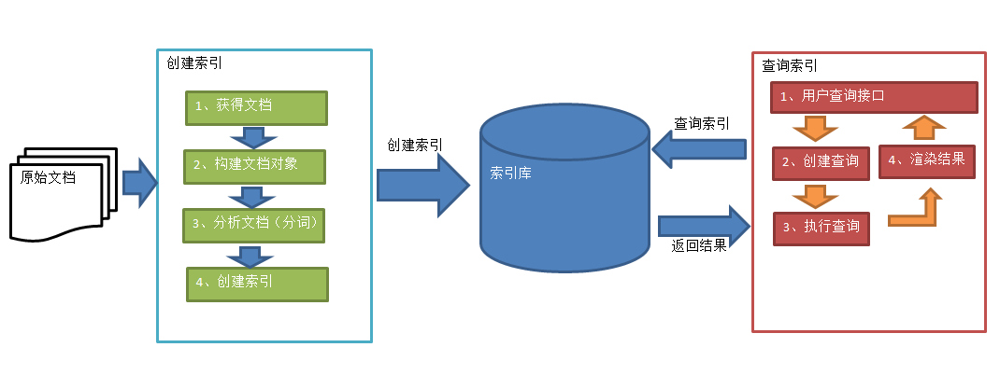
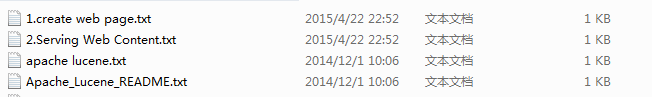
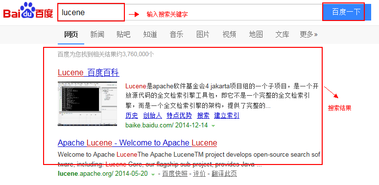

# Elasticsearch

> 基于[【官网】](https://www.elastic.co/guide/en/elasticsearch/reference/current/index.html)、[搜索引擎](https://www.cnblogs.com/leeSmall/category/1210814.html)
>
> 以下操作都是在 Kibana 6.8.16，Elasticsearch 6.8.16 上进行操作，index 名为 user，type 名为 \_doc。
>
> 注意 ：每个版本的 ES 部分参数及操作都会有所不同，注意每个版本的差别。

## 一、基本概念

ElasticSearch 是 Apache 下的一个顶级开源项目， 是**基于 Lucene、采用 Java 开发、使用 RESTful 风格的近实时分布式搜索服务器**。它提供了一个分布式多用户能力的全文搜索引擎，具有实时搜索、稳定、可靠、快速、安装和使用方便的优点。基于 Lucene 构建的 Elasticsearch，不仅能对海量规模的数据完成分布式索引与检索，还提供数据聚合和分析的功能。据国际权威的数据库产品评测机构 DBEngines 的统计：在 2016 年 1 月，Elasticsearch 已超过 Solr 等，成为排名第一的搜索引擎类应用。

### （一）[RESTful 是什么](https://blog.csdn.net/wl_1013/article/details/81049691)

RESTful 是一种软件设计风格而不是标准，只是提供了一组设计原则和约束条件，主要用于客户端和服务器交互类的软件。基于这个风格设计的软件可以更简洁、更有层次、更易于实现缓存等机制。在目前主流的三种 Web 服务交互方案中，REST 相比于 SOAP（Simple Object Access protocol，简单对象访问协议）以及 XML-RPC 更加简单明了。前后端分离主要是以 API 为界限进行解耦的，这就会产生大量的 API，采用 RESTful 来设计 API 主要有以下好处：

- 表现力更强，更易于理解。
- RESRful 是无状态，所以不管前端是何种设备何种状态都可以无差别的请求资源。

简单的说，RESTful 是一种架构的规范、约束和原则，符合这种规范的架构就是 RESTful 架构。RESTful 的核心就是服务端将**资源**发布为**URI**，前端通过 URI 访问资源，并通过 HTTP 动词（GET/POST/PUT/DELETE 这种请求方式）表示要对资源进行的操作，类似于这种的 url 都是符合 RESTful 设计架构。

### （二）[重要知识点](https://www.cnblogs.com/luxiaoxun/p/4869509.html)

- **接近实时（Near Real Time）**：Elasticsearch 是一个接近实时的搜索平台。这意味着，从索引一个文档直到这个文档能够被搜索到（增改操作）有一个**轻微的延迟（通常是 1 秒）**。

- **集群（Cluster）**：一个集群就是由一个或多个节点组织在一起，它们共同持有你整个的数据，并一起提供索引和搜索功能。一个 Elasticsearch 集群由一个唯一的名字标识（默认是**elasticsearch**）。这个名字是重要的，因为一个节点只能通过指定某个集群的名字，来加入这个集群。在产品环境中显式地设定这个名字是一个好习惯，但是使用默认值来进行测试/开发也是不错的。

- **节点（Node）**：一个节点是集群中的一个服务器，作为集群的一部分，它存储你的数据，参与集群的索引和搜索功能。和集群类似，一个节点也是由一个名字来标识的，默认情况下，这个名字是一个随机的漫威漫画角色的名字，这个名字会在启动的时候赋予节点。这个名字对于管理工作来说挺重要的，因为在这个管理过程中，你会去确定网络中的哪些服务器对应于 Elasticsearch 集群中的哪些节点。在一个集群里，只要你想，可以拥有任意多个节点。

  - 一个节点可以通过配置集群名称的方式来加入一个指定的集群。默认情况下，每个节点都会被安排加入到一个叫做 elasticsearch 的集群中，这意味着，如果你在你的网络中启动了若干个节点，并假定它们能够相互发现彼此，它们将会自动地形成并加入到一个叫做 elasticsearch 的集群中。
  - 如果当前你的网络中没有运行任何 Elasticsearch 节点，这时启动一个节点，会默认创建并加入一个叫做 elasticsearch 的集群。

- **索引（Index）**：一个索引就是一个拥有几份相似特征的文档的集合。比如：你可以有一个客户数据的索引，一个产品目录的索引，还有一个订单数据的索引。一个索引由一个名字来标识（必须全部是小写字母的），并且当我们要对对应于这个索引中的文档进行索引、搜索、更新和删除的时候，都要使用到这个名字。索引类似于关系型数据库中 Database 的概念（只是拿来类比，不可以简单的认为索引就是 Database，下面的类比也一样）。在一个集群中，如果你想，可以定义任意多的索引。

- **类型（Type）**：在一个索引中，你可以定义一种或多种类型。一个类型是你的索引的一个逻辑上的分区，其语义完全由你来定。通常，会为具有一组共同字段的文档定义一个类型。比如：我们假设你运营一个博客平台并且将你所有的数据存储到一个索引中，在这个索引中，你可以为用户数据定义一个类型，为博客数据定义另一个类型，当然，也可以为评论数据定义另一个类型。类型类似于关系型数据库中 Table 的概念。

- **文档（Document）**：由于 ES 存储的数据是文档型的，一条数据对应一个文档即相当于 MySQL 数据库中的一行数据，一个文档中可以有多个字段也就是 MySQL 数据库一行可以有多列。一个文档是一个可被索引的基础信息单元。比如：你可以拥有某一个客户的文档，某一个产品的一个文档，当然，也可以拥有某个订单的一个文档。文档以 JSON（Javascript Object Notation）格式来表示，而 JSON 是一个到处存在的互联网数据交互格式。在一个 `index/type` 里面，只要你想，你可以存储任意多的文档。文档类似于关系型数据库中 Record 的概念。

  > 注意：
  >
  > - 尽管一个文档，物理上存在于一个索引之中，文档必须被赋予一个索引的 type。
  > - 实际上一个文档除了用户定义的数据外，还包括 `_index`、`_type` 和 `_id` 默认字段数据。

- **字段（Field）**：字段类似于关系型数据库中 Field 的概念，而一个文档可以被视为多个字段的集合。

- **映射（Mapping）**：mapping 是 ES 中的一个很重要的内容，它类似于传统关系型数据中 table 的 schema，用于定义一个索引的某个类型的数据结构以及这些字段如何分词等相关属性。在 ES 中，我们可以无需手动创建 type 和 mapping，在默认配置下，ES 可以根据插入的数据自动地创建 type 及其 mapping，mapping 中主要包括字段名、字段数据类型和字段索引类型。有些时候 ES 中的 mapping 增加了动态识别功能，感觉很强大的样子，其实实际生产环境上不建议使用，最好还是开始制定好了对应的 schema 为主。

- **分片和副本（Shards & Replicas）**：一个索引可能存储超出单个结点硬件限制的大量数据。比如：一个具有 10 亿文档的索引占据 1TB 的磁盘空间，而任一节点都没有这样大的磁盘空间；或者单个节点处理搜索请求，响应太慢。为了解决这个问题，Elasticsearch 提供了将索引划分成多份的能力，这些份就叫做分片。当你创建一个索引的时候，你可以指定你想要的分片的数量。每个分片本身也是一个功能完善并且独立的索引，这个索引可以被放置到集群中的任何节点上。分片之所以重要，主要有两方面的原因：

  - 允许你水平分割或扩展你的内容容量。
  - 允许你在分片（位于多个节点上的分片）之上进行分布式的、并行的操作，进而提高性能和吞吐量，至于一个分片怎样分布，它的文档怎样聚合回搜索请求，是完全由 Elasticsearch 管理的，对于作为用户的你来说，这些都是透明的。

  在一个网络环境中，失败随时都可能发生，在某个分片或节点不知怎么的就处于离线状态，或者由于任何原因消失了。这种情况下，有一个故障转移机制是非常有用并且是强烈推荐的。为此目的，Elasticsearch 允许你为索引下的每个分片创建一份或多份拷贝，这些拷贝叫做副本，副本之所以重要，主要有两方面的原因：

  - 在分片或节点失败的情况下，提供了高可用性。因为这个原因，**副本分片不与主分片（primary shards）置于同一节点上**。
  - 扩展你的搜索性能和吞吐量，因为搜索可以在副本上并行运行。

  总之，每个索引可以被分成多个分片，一个分片可以创建 0 个或多个副本。一旦创建了副本，每个索引就有了主分片（作为复制源的原来的分片）和副本分片（主分片的拷贝）之别。分片和副本的数量可以在索引创建的时候指定。在索引创建之后，你可以在任何时候动态地改变复制数量，但是不能改变分片的数量。

  默认情况下，Elasticsearch 中的每个索引被分为 5 个主分片和 1 个索引副本，这意味着，如果你的集群中至少有两个节点，你的索引将会有 5 个主分片和另外 5 个副本分片（索引下的每个分片创建一个副本），这样的话每个索引总共就有 10 个分片。一个索引的多个分片可以存放在集群中的一台主机上，也可以存放在多台主机上，这取决于你的集群机器数量。主分片和副本分片的具体位置是由 ES 内在的策略所决定的。

- **indexed**：就是名义上的建立索引。MySQL 中一般会对经常使用的列添加相应的索引用于提高查询速度，而在 ES 中默认为每一列的数据添加索引，除非你特殊制定不建立索引只是进行存储或展示，这个需要看你具体的需求和业务进行设定了。

### （三）Elasticsearch 的架构


- **Gateway 层**：ES 用来存储索引文件的一个文件系统，它支持很多类型，例如：本地磁盘、共享存储（做 snapshot 的时候需要用到）、hadoop 的 hdfs 分布式存储、亚马逊的 S3。它的主要职责是用来对数据进行持久化以及整个集群重启之后可以通过 Gateway 重新恢复数据。
- **Distributed Lucene Directory**：Gateway 上层就是一个 Lucene 的分布式框架，Lucene 是做检索的，但是它是一个单机的搜索引擎，像这种 ES 分布式搜索引擎系统，虽然底层用 Lucene，但是需要在每个节点上都运行 Lucene 进行相应的索引、查询以及更新，所以需要做成一个分布式的运行框架来满足业务的需要。
- **四大模块组件**：DLD 之上就是一些 ES 的模块：
  - Index Module 是索引模块，就是对数据建立索引也就是通常所说的建立一些倒排索引等；
  - Search Module 是搜索模块，就是对数据进行查询搜索；
  - Mapping 模块是数据映射与解析模块，就是你的数据的每个字段可以根据你建立的表结构通过 mapping 进行映射解析，如果你没有建立表结构，ES 就会根据你的数据类型推测你的数据结构之后自己生成一个 mapping，然后都是根据这个 mapping 进行解析你的数据。
  - River 模块在 ES2.0 之后应该是被取消了，它的意思表示是第三方插件，例如：可以通过一些自定义的脚本，将传统的数据库等数据源通过格式化转换后直接同步到 ES 集群里。这个 river 大部分是自己写的，写出来的东西质量参差不齐，将这些东西集成到 ES 中会引发很多内部 bug，严重影响了 ES 的正常应用，所以在 ES2.0 之后考虑将其去掉。
- **Discovery、Script**：四大模块组件之上有 Discovery 模块，ES 集群包含很多节点，很多节点需要互相发现对方，然后组成一个集群（包括选主集群），这些 ES 都是用的 Discovery 模块，默认使用的是 Zen，也可是使用 EC2；ES 查询还可以支撑多种 script 即脚本语言，包括 Mvel、JS、Python 等等。
- **Transport 协议层**：再上一层就是 ES 的通讯接口 Transport，支持的协议也比较多：Thrift、Memcached 以及 HTTP（默认的是 HTTP）；JMX 就是 Java 的一个远程监控管理框架，因为 ES 是通过 Java 实现的。
- **RESTful 接口层**：最上层就是 ES 暴露给我们的访问接口，官方推荐的方案就是这种 Restful 接口，直接发送 HTTP 请求，方便后续使用 Nginx 做代理、分发包括可能后续会做权限的管理，通过 HTTP 很容易做这方面的管理。如果使用 Java 客户端它是直接调用 API，在做负载均衡以及权限管理还是不太好做。

## 二、[Lucene](http://lucene.apache.org/)

Lucene 是 Apache 的顶级开源项目，是一个**可以构建全文检索引擎系统的全文检索工具包**（一堆 jar 包），提供了完整的查询引擎、索引引擎和部分文本分词引擎。

Lucene 的目的是为软件开发人员提供一个简单易用的工具包，以方便在目标系统中实现全文检索的功能。可以使用它来构建全文检索引擎系统，对外提供全文检索服务。应用领域：

- 互联网全文检索引擎（比如百度、 谷歌、必应（必应是微软的搜索引擎））。
- 站内全文检索引擎（淘宝， 京东搜索功能）。
- 优化数据库查询（因为数据库中使用 like 关键字是全表扫描也就是顺序扫描算法，查询慢）。

### （一）数据的基本分类

- 结构化数据：有固定类型或者有固定长度的数据。例如：数据库中的数据（MySQL、Oracle 等）， 元数据（描述数据的数据，相当于 MySQL 中字段约束）等。结构化数据搜索方法：
  - 数据库中数据通过 SQL 语句可以搜索。
- 非结构化数据：没有固定类型和固定长度的数据。例如：world 文档中的数据， 邮件中的数据等。非结构化数据搜索方法：
  - 顺序扫描法： 拿到搜索的关键字，去文档中逐字匹配，直到找到和关键字一致的内容为止。优缺点：
    - 如果文档中存在要找的关键字就一定能找到想要的内容。
    - 效率低。
  - 全文检索法（[倒排索引](https://developer.aliyun.com/article/38228)）：将文件中的内容提取出来， 进行分词操作，将这些分词组成索引（类似于字典中的目录）， 搜索的时候先搜索索引，通过索引找文档，这个过程就叫做全文检索。

### （二）全文检索的流程

#### 1、相关概念

- 分词：就是一个字 / 单词，是 lucene 中词的最小单位，不同的 Field 中的 Field 值是不同的分词。分词中包含两部分，一部分是文档的 Field 名，另一部分是单词的内容。优缺点：
  - 搜索速度快。
  - 因为创建的索引需要占用磁盘空间，所以这个算法会使用掉更多的磁盘空间（空间换时间）。
- 文档：Document 对象，一个 Document 中可以有多个 Field 对象，Field 对象中是 key-value 键值对的形式，有 Field 名和 Field 值，一个 Document 就是数据库表中的一条记录， 一个 Filed 对象就是数据库表中的一行一列，这是一个通用的存储结构。
- 索引：相当于字典，分为目录和正文两部分，查询的时候通过先查目录，然后通过目录上标注的页数去正文页查找需要的内容。`字段名: 分词` 这样的形式，它里面有指针执行这个词来源的文档
- 索引库：放索引的文件夹(这个文件夹可以自己随意创建，在里面放索引就是索引库)

#### 2、索引和搜索流程



##### （1）创建索引

对用户要搜索的文档内容索引，索引存储在对应的索引库（index）中。以搜索磁盘上的文本文件为例：若要通过文件名或文件内容的关键字查找对应文本文件，需要对文件名和文件内容创建索引。

###### ① 获得原始文档

原始文档是指要创建索引并进行搜索的内容（包括互联网上的网页、数据库中的数据、磁盘上的文件等）。



###### ② 创建文档对象

先创建 Lucene 的 Document 对象，Document 中包含多个 Field 对象，Field 中存储原始文档相关数据。如下图：


> 注意：每个 Document 可以有多个 Field，不同的 Document 可以有不同的 Field，同一个 Document 可以有相同的 Field（Field 名和 Field 值都可以相同），每个 Document 都有一个唯一的编号，就是文档 id。

###### ③ 文档分词

使用分词器对 Field 中的内容进行分词操作，这操作是对原始文档提取单词、将字母转为小写、去除标点符号、去除停用词（例如：啊、哦、a、an、and、or 等）等操作，生成最终的语汇单元（可以理解为单词或由单词组成的短句）。

```
// 1、原文档内容：
Lucene is a Java full-text search engine.  Lucene is not a complete
application， but rather a code library and API that can easily be used
to add search capabilities to applications.

// 2、分词后得到的语汇单元：
lucene、java、full、search、engine.....
```

> 注意：创建索引和搜索索引时所用的分词器必须一致。

###### ④ 创建索引

对分词创建索引，索引的目的是为了搜索，最终实现只搜索创建了索引的分词，进而找到分词所在的 Document。

这种索引的结构叫**倒排索引**，包括索引和 Document 两部分：索引即分词表，它的规模较小；而 Document 集合较大。


##### （2）查询索引

查询索引也是搜索的过程，搜索就是用户输入关键字，从索引（index）中进行搜索的过程。根据关键字搜索索引，根据索引找到对应的文档，从而找到要搜索的内容。

###### ① 用户查询接口

全文检索系统提供用户搜索的界面供用户提交搜索的关键字，搜索完成展示搜索结果。



> 注意：Lucene 只是个 jar 包，不提供制作用户搜索界面的功能，需要根据自己的需求开发搜索界面。

###### ② 创建查询

用户输入查询关键字执行搜索之前需要先构建一个查询对象，查询对象中可以指定查询要搜索的 Field 名、查询关键字等，查询对象会生成具体的查询语法。

```
语法 "fileName:spring.txt" 表示要搜索 Field 的内容为 "spring.txt" 的 Document

语法 "lucene AND java" 表示要搜索即包括关键字 "lucene" 和 "java" 的 Dodument
```

###### ③ 执行查询

执行查询分为以下三个步骤：


- 根据搜索关键字在倒排索引词典表中分别找出对应搜索词的索引，从而找到索引所链接的文档链表。比如搜索语法为 `lucene AND java` 表示搜索出的文档中即要包括 lucene 也要包括 java。
- 由于是 AND，所以要对包含 lucene 或 java 词语的链表进行交集，得到文档链表应该包括每一个搜索词语。
- 获取文档中的 Field 值。

###### ④ 渲染结果

以一个友好的界面将查询结果展示给用户，用户根据搜索结果找自己想要的信息，为了帮助用户很快找到自己的结果，提供了很多展示的效果，比如搜索结果中将关键字高亮显示，百度提供的快照等。


### （三）Lucene 的配置和代码实现

Lucene 是开发全文检索功能的工具包，要求 jdk1.8 及以上。

#### 1、创建索引库

##### （1）Field 类及属性

- Analyzed ：是否对 Field 值进行分词处理，分词操作后索引中存储的是分词，而不直接是 Field 值，搜索时的关键字也是搜索分词。
- Indexed ：是否对 Field 的分词或未分词的值创建索引，只有创建索引才可以在搜索中搜索。
- Stored ：是否将 Field 值单独存储在索引中，存储后可以在搜素时通过返回的 Document 获取查看 Field 值，但是会占用空间。是否存储的标准为是否要将内容展示给用户。

| Field 类                                                                  | 数据类型               | Analyzed | Indexed | Stored | 说明                                                                                                                                                 |
| ------------------------------------------------------------------------- | ---------------------- | -------- | ------- | ------ | ---------------------------------------------------------------------------------------------------------------------------------------------------- |
| StringField(FieldName, FieldValue, Store.YES))                            | 字符串                 | N        | Y       | Y 或 N | 这个 Field 用来构建一个字符串 Field，但是不会进行分词，会将整个串存储在索引中，例如：订单号、姓名等；是否存储在文档中用 Store.YES 或 Store.NO 决定。 |
| LongField(FieldName, FieldValue, Store.YES)                               | Long 型                | Y        | Y       | Y 或 N | 这个 Field 用来构建一个 Long 数字型 Field，进行分词和索引，例如：价格。                                                                              |
| StoredField(FieldName, FieldValue)                                        | 重载方法，支持多种类型 | N        | N       | Y      | 这个 Field 用来构建不同类型 Field。 不分词，不索引，但要 Field 存储在文档中，例如：图片地址                                                          |
| TextField(FieldName, FieldValue, Store.NO)或 TextField(FieldName, reader) | 字符串或流             | Y        | Y       | Y 或 N | 如果是一个 Reader，lucene 猜测内容比较多，会采用 Unstored 的策略。                                                                                   |

##### （2）代码实现

```java
//创建索引
@Test
public void createIndex() throws Exception {
    // 指定索引库存放的路径
    Directory directory = FSDirectory.open(new File("D:\\temp\\0108\\index"));
    // 索引库还可以存放到内存中
    // Directory directory = new RAMDirectory();
    // 创建一个标准分词器
    Analyzer analyzer = new StandardAnalyzer();
    // 创建indexwriterCofig对象
    // 第一个参数： Lucene 的版本信息，可以选择对应的 Lucene 版本也可以使用 LATEST；第二根参数：分词器对象
    IndexWriterConfig config = new IndexWriterConfig(Version.LATEST, analyzer);
    // 创建indexwriter对象
    IndexWriter indexWriter = new IndexWriter(directory, config);
    // 原始文档的路径
    File dir = new File("E:\\searchsource");
    for (File f : dir.listFiles()) {
        // 文件名
        String fileName = f.getName();
        // 文件内容
        String fileContent = FileUtils.readFileToString(f);
        // 文件路径
        String filePath = f.getPath();
        // 文件的大小
        long fileSize  = FileUtils.sizeOf(f);
        // 创建文件名
        // 第一个参数：Field的名称；第二个参数：Field 值；第三个参数：是否存储
        Field fileNameField = new TextField("filename", fileName, Store.YES);
        Field fileContentField = new TextField("content", fileContent, Store.YES);
        Field filePathField = new StoredField("path", filePath);
        Field fileSizeField = new LongField("size", fileSize, Store.YES);

        // 创建document对象
        Document document = new Document();
        document.add(fileNameField);
        document.add(fileContentField);
        document.add(filePathField);
        document.add(fileSizeField);
        // 这里通过分词器分词Document，建立索引（`Field名：分词` 的形式，并有指针指向原始文档），并写入索引库
        indexWriter.addDocument(document);
    }
    //关闭indexwriter
    indexWriter.close();
}
```

##### （3）使用 Luke 工具查看索引文件

- 使用命令提示符进入 luke 目录
- 执行 jar 包命令，java -jar lukeall-4.10.3.jar
- 选择索引库的目录


#### 2、查询索引

```java
//查询索引库
@Test
public void searchIndex() throws Exception {
  // 指定索引库存放的路径
  Directory directory = FSDirectory.open(new File("D:\\temp\\0108\\index"));
  // 创建indexReader对象
  IndexReader indexReader = DirectoryReader.open(directory);
  // 创建indexsearcher对象
  IndexSearcher indexSearcher = new IndexSearcher(indexReader);
  // 创建查询，创建查询的时候要使用和创建查询一致的分词器
    Analyzer analyzer = new StandardAnalyzer();
  QueryParse queryParse = new QueryParse("content",analyzer);
    // 从Field名为myFilename中查询关键字，若这里不指定Field名只传"apache"，则默认搜索上面的默认搜索Field名为"content"
    Query query = queryParse.parse("filename:apache");
  // 执行查询
  // 第一个参数是查询对象，第二个参数是查询结果返回的最大值
  TopDocs topDocs = indexSearcher.search(query, 10);
  // 查询结果的总条数
  System.out.println("查询结果的总条数："+ topDocs.totalHits);
  // 遍历查询结果
  // topDocs.scoreDocs存储了document对象的id
  for (ScoreDoc scoreDoc : topDocs.scoreDocs) {
    // scoreDoc.doc属性就是document对象的id
    // 根据document的id找到document对象
    Document document = indexSearcher.doc(scoreDoc.doc);
    System.out.println(document.get("filename"));
    System.out.println(document.get("content"));
    System.out.println(document.get("path"));
    System.out.println(document.get("size"));
  }
  // 关闭indexreader对象
  indexReader.close();
}
```

#### 3、中文分词

##### （1）Analyzer 的执行过程

如下图是语汇单元的生成过程：


从一个 Reader 字符流开始，创建一个基于 Reader 的 Tokenizer 分词器，经过三个 TokenFilter 生成语汇单元 Token。要看分词器的分词效果，只需要看 Tokenstream 中的内容就可以了。每个分词器都有一个 tokenStream()方法，返回一个 tokenStream 对象。

##### （2）分词器的分词效果

```java
// 查看标准分词器的分词效果
public void testTokenStream() throws Exception {
  // 创建一个标准分词器对象
  Analyzer analyzer = new StandardAnalyzer();
  // 获得tokenStream对象
  // 第一个参数：Field名，可以随便给一个；第二个参数：要分词的文本内容
  TokenStream tokenStream = analyzer.tokenStream("test", "The Spring Framework provides a comprehensive programming and configuration model.");
  // 添加一个引用，可以获得每个关键词
  CharTermAttribute charTermAttribute = tokenStream.addAttribute(CharTermAttribute.class);
  // 添加一个偏移量的引用，记录了关键词的开始位置以及结束位置
  OffsetAttribute offsetAttribute = tokenStream.addAttribute(OffsetAttribute.class);
  // 将指针调整到列表的头部
  tokenStream.reset();
  // 遍历关键词列表，通过incrementToken方法判断列表是否结束
  while(tokenStream.incrementToken()) {
    // 关键词的起始位置
    System.out.println("start->" + offsetAttribute.startOffset());
    // 取关键词
    System.out.println(charTermAttribute);
    // 结束位置
    System.out.println("end->" + offsetAttribute.endOffset());
  }
  tokenStream.close();
}
```

##### （3）中文分词器

- Lucene 自带中文分词器：
  - StandardAnalyzer：单字分词：就是按照中文一个字一个字地进行分词。如：“我爱中国”，效果：“我”、“爱”、“中”、“国”
  - CJKAnalyzerL：二分法分词：按两个字进行切分。如：“我是中国人”，效果：“我是”、“是中”、“中国”、“国人”
  - SmartChineseAnalyzer：上边两个分词器无法满足需求，SmartChineseAnalyzer 对中文支持较好，但扩展性差，扩展词库，禁用词库和同义词库等不好处理。
- 第三方中文分词器：
  - [IK-analyzer](https://code.google.com/p/ik-analyzer/)：最初，它是以开源项目 Luence 为应用主体的，结合词典分词和文法分词算法的中文分词组件。从 3.0 版本开 始，IK 发展为面向 Java 的公用分词组件，独立于 Lucene 项目，同时提供了对 Lucene 的默认优化实现。在 2012 版本中，IK 实现了简单的分词 歧义排除算法，标志着 IK 分词器从单纯的词典分词向模拟语义分词衍化。

#### 4、Analyzer 使用时机

##### （1）索引时使用 Analyzer

输入关键字进行搜索，当需要让该关键字与 Field 值所包含的词进行匹配时，就需要先对 Document 中 Field 值进行分词并创建索引。当 Field 的属性 tokenized（是否分词）为 true 时，Analyzer 分词器对 Field 值分词，生成语汇单元（Token）：


对于一些 Field 值可以不用分词：

- 不作为查询条件的内容，比如文件路径（路径是一个整体，分词后就无意义）。
- 不是匹配内容中的词而匹配 Field 的整体内容，比如订单号、身份证号等。

##### （2）搜索时使用 Analyzer

对搜索关键字进行分词和索引分词一样，使用 Analyzer 对搜索关键字进行分词处理，使用分词操作后的每个词语进行搜索，找到索引链接到 Document，解析 Document 内容。对于匹配整体 Field 值的查询可以在搜索时不分词，比如根据订单号、身份证号查询等。

> 注意：搜索使用的分词器要和索引使用的分词器一致。

## 三、[Solr](http://lucene.apache.org/solr/)

Solr 是 Apache 下的一个顶级开源项目，是**基于 Lucene、采用 Java 开发的全文搜索服务器**。Solr 可以独立运行在 Jetty、Tomcat 等这些 Servlet 容器中，提供了比 Lucene 更为丰富的查询语言，同时实现了可配置、可扩展，并对索引、搜索性能进行了优化。

在一些大型门户网站、电子商务网站等都需要站内搜索功能，使用传统的数据库查询方式实现搜索无法满足一些高级的搜索需求。比如：搜索速度要快、搜索结果按相关度排序、搜索内容格式不固定等，这里就需要使用搜索引擎实现搜索功能；一般企业中将数据全部放入数据库中，由于查询的时候需要使用 like 模糊查询，模糊查询数据库中使用的是全表扫描算法，这样效率低级，所以需要使用全文检索来优化查询速度。

**Solr 与 Lucene 的区别：**

- Lucene：

  - Lucene 开源的**全文检索引擎工具包**，它不是一个完整的全文检索引擎，Lucene 提供了完整的查询引擎和索引引擎，目的是为软件开发人员提供一个简单易用的工具包，以方便的在目标系统中实现全文检索的功能，或者以 Lucene 为基础构建全文检索引擎。
  - 单独使用 Lucene 实现站内搜索需要开发的工作量较大，主要表现在：索引维护、索引性能优化、搜索性能优化等，因此不建议采用。

- Solr
  - Solr 的目标是打造一款企业级的搜索引擎系统，它是一个搜索引擎服务，可以独立运行，通过 Solr 可以非常快速的**构建企业的搜索引擎**，通过 Solr 也可以高效的完成站内搜索功能。
  - 基于 Solr 实现站内搜索扩展性较好并且可以减少程序员的工作量，因为 Solr 提供了较为完备的搜索引擎解决方案，因此在门户、论坛等系统中常用此方案。


### （一）[Solr 安装及配置](https://www.w3cschool.cn/solr_doc/)

从 Solr[官网](http://lucene.apache.org/solr/)下载，根据运行环境分为 Linux 和 Windows 版。

#### 1、Solr 的文件夹结构


> bin -> Solr 的运行脚本
>
> contrib -> Solr 的一些软件/插件，用于增强 solr 的功能。
>
> dist -> 该目录包含 build 过程中产生的 war 和 jar 文件，以及相关的依赖文件。
>
> docs -> Solr 的 API 文档
>
> licenses -> Solr 相关的一些许可信息
>
> example -> Solr 工程的例子目录：
>
> > example/solr -> 该目录是一个包含了默认配置信息的 Solr 的 Core 目录。
> >
> > example/multicore -> 该目录包含了在 Solr 的 multicore 中设置的多个 Core 目录。
> >
> > example/webapps -> 该目录中包括一个 solr.war，该 war 可作为 Solr 的运行实例工程。

#### 2、Solr 整合 tomcat

Solr 默认提供 Jetty 作为 Servlet 容器运行。

##### （1）Solr Home 与 Solr Core

创建一个 Solr Home 目录，Solr Home 是 Solr 运行的主目录，目录中包括了运行 Solr 实例所有的配置文件和数据文件，Solr 实例就是 Solr Core（相当于 MySQL 的 table），一个 Solr Home 可以包括多个 Solr Core（Solr 实例），每个 Solr Core 提供单独的搜索和索引服务。

example/solr 是一个 Solr Home 目录结构，如下：


Solr Core 名称不固定，一个 Solr 运行实例对外单独提供索引和搜索接口。Solr Home 中可以创建多个 Solr 运行实例（Solr Core）。一个 Solr Core 对应一个索引目录，conf 是 SolrCore 的配置文件目录，需要创建 data 目录存放索引文件。

##### （2）整合步骤

- 把 Solr 的 dist 目录下的 war 包复制到 tomcat 的 webapp 目录下，改名为 solr.war。

- solr.war 解压，使用压缩工具解压或者启动 tomcat 自动解压，解压之后删除 solr.war。

- 把 `example\lib\ext` 目录下的所有的 jar 包添加到 tomcat 下 `solr\WEB-INF\lib` 工程中。

- 配置 Solr Home 和 Solr Core：

  - 创建一个名称为 mySolrHome 的文件夹（存放 solr 所有配置文件），复制 `example/solr` 目录下的文件到 mySolrHome。

  - 在 `mySolrHome/solr` 下有一个文件夹叫做 collection1 这就是一个 Solr Core(solr 的实例)。一个 Solr Core 相当于 MySQL 中一个数据库，Solr Core 之间是相互隔离。

  - 在 Solr Core 中有一个文件夹叫做 conf，包含了索引 Solr Core(的配置信息。在 conf 文件夹下有一个 solrconfig.xml，配置实例的相关信息。solrconfig.xml 的配置信息（如果使用默认配置可以不用做任何修改）：

    | 标签           | 说明                                                                                           |
    | -------------- | ---------------------------------------------------------------------------------------------- |
    | lib            | solr 服务依赖的扩展包，默认的路径是 collection1\lib 文件夹，如果没有就创建一个                 |
    | dataDir        | 配置了索引库的存放路径，默认路径是 collection1\data 文件夹，如果没有 data 文件夹，会自动创建。 |
    | requestHandler | 不同搜索操作时配置的 url，                                                                     |

    

    

- 修改 tomcat 的 `/webapp/solr/WEB-INF/web.xml`，使用 jndi（类似于创建依赖配置文件）的方式配置 mySolrHome 的位置。

  

- 启动 tomcat，访问 <http://localhost:8080/solr/>。

#### 3、Solr 后台管理

Solr 索引的实现方法很简单，用 POST 方法向 Solr 服务器发送一个描述 Field 及其内容的 XML 文档，Solr 根据 xml 文档添加、删除、更新索引 。Solr 搜索只需要发送 HTTP GET 请求，然后对 Solr 返回 Xml、json 等格式的查询结果进行解析，组织页面布局。

Solr 提供了一个管理界面，通过管理界面可以查询 Solr 的配置和运行情况。


- Dashboard：仪表盘，显示了该 Solr 实例开始启动运行的时间、版本、系统资源、jvm 等信息。

- Logging：Solr 运行日志信息。

- Cloud：Solr Cloud（Solr 云（集群）），当使用 Solr Cloud 模式运行时会显示此菜单，如下图是 Solr Cloud 的管理界面：

  

- Core Admin：Solr Core 的管理界面。Solr Core 是 Solr 的一个独立运行实例单位，它可以对外提供索引和搜索服务，一个 Solr 工程可以运行多个 Solr Core（Solr 实例），一个 Solr Core 对应一个索引目录。添加 Solr Core 步骤：

  - 复制 collection1 文件夹改名为 collection2
  - 修改 collection2 文件下 core.properties 文件的配置为 `name=collection2`。
  - 重启 tomcat

- Java Properties：Solr 在 JVM 运行环境中的属性信息，包括类路径、文件编码、jvm 内存设置等信息。

- Tread Dump：显示 Solr Server 中当前活跃线程信息，同时也可以跟踪线程运行栈信息。

- Core selector：选择一个 Solr Core 进行详细操作。

  

- Analysis：通过此界面可以测试索引分词器和搜索分词器的执行情况。

  

- Dataimport：可以定义数据导入处理器，从关系数据库将数据导入到 Solr 索引库中。

- Document：通过此菜单 Solr 可以对原始文档创建索引、更新索引和删除索引等操作，文档和索引的增加和修改必须要有主键（默认为 id），没有则会报错。界面如下：

  

- Query：通过/select 执行搜索索引。

  

### （二）中文分词器

#### 1、配置 Schema.xml

schema.xml 在 Solr Core 的 conf 目录下，它是 Solr 数据表配置文件，它定义了加入索引的数据的数据类型的。主要包括 FieldTypes、Fields 和其他的一些缺省设置。

##### （1）FieldType 类型定义

Solr 索引字段类型，主要是声明指定的 Solr 数据类型在建立索引和进行查询的时候要使用的 Analyzer 分词器类型（其下包括分词器和过滤器）。Solr 提供默认的 FieldType：


FieldType 标签属性：

| 标签属性             | 说明                                                                                                                                                                                                                                        |
| -------------------- | ------------------------------------------------------------------------------------------------------------------------------------------------------------------------------------------------------------------------------------------- |
| name                 | FieldType 的名称                                                                                                                                                                                                                            |
| class                | 存储在 Solr 索引上的字段类型                                                                                                                                                                                                                |
| positionIncrementGap | 可选属性，定义在同一个文档中此类型数据的空白间隔，避免短语匹配错误，此值相当于 Lucene 的短语查询设置 slop 值（slop 是指两个 term 的位置之间允许的最大间隔距离），根据经验设置为 100（设置为 100 相当于两个 term 之间最多可以有 100 单词）。 |

##### （2）Field 定义

Solr 索引字段（对应 Lucene 中的 Field，相当于 MySQL 的表字段），在 `<fields/>` 标签内定义具体的 `<field>`，`<field>` 包含 name、type（可以是 FieldType 名称，也可以是 Solr 提供的字段类型）、indexed（是否被索引）、stored（是否被储存）、multiValued（是否以数组形式存储）等属性。

```xml
<fields>
  <field name="name" type="text_general" indexed="true" stored="true"/>
  <field name="features" type="text_general" indexed="true" stored="true" multiValued="true"/>
</fields>
```

##### （3）uniqueKey

定义主键，Solr 中默认主键名为 id，创建索引时必须指定主键。

##### （4）copyField 复制字段

可以将多个 Field 的值复制到指定字段中，以便进行统一的检索及展示。

```xml
// 比如：输入关键字搜索title标题content内容，定义title、content、text的字段：
<fields>
  <field name="title" type="text_general" indexed="true" stored="true"/>
  <field name="content" type="text_general" indexed="true" stored="true" multiValued="true"/>
    <field name="text" type="text_general" indexed="true" stored="true"/>
</fields>

// 根据关键字只搜索text字段的内容就相当于搜索title和content，将title和content复制到text中
<copyFoeld source="title" dest="text"/>
<copyFoeld source="content" dest="text"/>
```

##### （5）dynamicField 动态字段

定义字段名称的规则，不指定具体的字段名称，只要插入数据的字段名符合此规则，便会使用此字段配置。

```xml
// 定义一个 dynamicField，任何以_i结尾的字段符合这个定义，例如：product_title_t
<dynamicField name="*_t" type="text_general" indexed="true" stored="true"/>
```

#### 2、安装配置中文分词器

使用 IKAnalyzer 中文分析器。

- 把 IKAnalyzer2012FF_u1.jar 添加到 solr/WEB-INF/lib 目录下。

- 复制 IKAnalyzer 的配置文件和自定义词典和停用词词典到 solr 的新建的一个 classes 文件夹下。

- 在 schema.xml 中添加一个自定义的 fieldType，使用中文分析器。

  ```xml
  <fieldType name="text_ik" class="solr.TextField">
      <analyzer class="org.wltea.analyzer.lucene.IKAnalyzer"/>
  </fieldType>
  ```

- 定义 field，指定 field 的 type 属性为 text_ik

  ```xml
  <field name="title_ik" type="text_ik" indexed="true" stored="true" />
  <field name="content_ik" type="text_ik" indexed="true" stored="false" multiValued="true"/>
  ```

- 重启 tomcat，测试。

  

### （三）维护索引

#### 1、添加/更新文档


#### 2、批量导入数据

使用 dataimport 插件批量导入数据。

- 把 Solr 的 dist 目录下的 dataimport 插件依赖的 jar 包和 MySQL 的数据库驱动添加到 Solr Core 的 lib 文件夹中。

- 配置 solrconfig.xml 文件，添加一个 requestHandler。

  ```xml
  <requestHandler name="/dataimport"
                  class="org.apache.solr.handler.dataimport.DataImportHandler">
      <lst name="defaults">
          <str name="config">data-config.xml</str>
      </lst>
  </requestHandler>
  ```

- 创建一个 data-config.xml，保存到 `collection1/conf` 目录下。

  ```xml
  <?xml version="1.0" encoding="UTF-8" ?>
  <dataConfig>
      <dataSource type="JdbcDataSource"
                  driver="com.mysql.jdbc.Driver"
                  url="jdbc:mysql://localhost:3306/lucene"
                  user="root"
                  password="root"/>
      <document>
          <entity name="product" query="SELECT pid,name,catalog_name,price,description,picture FROM products ">
              <field column="pid" name="id"/>
              <field column="name" name="product_name"/>
              <field column="catalog_name" name="product_catalog_name"/>
              <field column="price" name="product_price"/>
              <field column="description" name="product_description"/>
              <field column="picture" name="product_picture"/>
          </entity>
      </document>
  </dataConfig>
  ```

- 重启 tomcat 后进入 Solr 后台管理界面的 Dataimport 模块，点击 execute 按钮导入数据。

  

  > 注意：导入数据前会先清空索引库，然后再导入。

#### 3、删除文档

在 Solr 后台管理界面的 Documents 模块中的 Document(s)中书写。

（1）删除制定 ID 的索引

```xml
<delete>
  <id>8</id>
</delete>

<commit/>
//需要进行保存
```

（2）删除查询到的索引数据

```xml
<delete>
  <query>product_catalog_name:幽默杂货</query>
</delete>
```

（3）删除所有索引数据

```xml
 <delete>
  <query>*:*</query>
</delete>
```

#### 4、查询索引

在 Solr 后台管理界面的 Query 模块中操作。

（1）q

查询字符串。

```
// 查询所有
*:*

// 查询指定字段的指定值
name:浪漫樱花 AND country:韩国

// 查询指定价格的数据
price:[1 TO 20]
```

（2）fq

过滤查询，只查询符合条件的数据，不参与评分。

```
// 查询指定价格的数据
price:[1 TO 20]

// 20以上
product_price:[20 TO *]

// 20以下
product_price:[* TO 20]
```

（3）sort

排序规则，格式：`字段名 desc|asc[,字段名 desc|asc]...`。

（4）start 和 rows

start（分页起始）和 rows（指定返回结果最多有多少条记录）配合使用可以达到分页效果。

（5）fl

指定返回字段，格式：`字段名1[,字段名2]...`。

（6）df

当 q 区域中只写入一个字符串时，df 中需要指定一个搜索 Field。

```
q:
"苹果"
df:
name
```

也可以在 Solr Core 的 `conf/solrconfig.xml` 文件中指定默认搜索 Field。


（7）wt（writer type）

指定输出格式，可以有 xml、json、php 和 phps。

（8）hl

指定高亮的字段，可以返回的字段值的前缀和后缀。


### （四）使用 SolrJ 管理索引库

SolrJ 是访问 Solr 服务的 Java 客户端，提供索引和搜索的请求方法。SolrJ 通常在嵌入在业务系统中，通过 SolrJ 的 API 接口操作 Solr 服务。


#### 1、新增文档

```java
//向索引库中添加索引
@Test
public void addDocument() throws Exception {
    //和solr服务器创建连接
    //参数：solr服务器的地址
    SolrServer solrServer = new HttpSolrServer("http://localhost:8080/solr");
    //创建一个文档对象
    SolrInputDocument document = new SolrInputDocument();
    //向文档中添加字段
    //第一个参数：字段的名称，字段的名称必须是在schema.xml中定义的
    //第二个参数：字段的值
    document.addField("id", "c0001");
    document.addField("title_ik", "使用solrJ添加的文档");
    document.addField("content_ik", "文档的内容");
    document.addField("product_name", "商品名称");
    //把document对象添加到索引库中
    solrServer.add(document);
    //提交修改
    solrServer.commit();
}
```

#### 2、删除文档

（1）根据 id 删除

```java
//删除文档，根据id删除
@Test
public void deleteDocumentByid() throws Exception {
    //根据id删除文档
    solrServer.deleteById("c0001");
    //提交修改
    solrServer.commit();
}
```

（2）根据查询删除

查询语法完全支持 Lucene 的查询语法。

```java
//根据查询条件删除文档
@Test
public void deleteDocumentByQuery() throws Exception {
    //根据查询条件删除文档
    solrServer.deleteByQuery("*:*");
    //提交修改
    solrServer.commit();
}
```

#### 3、修改文档

在 SolrJ 中修改没有对应的 update 方法，只有 add 方法，只需要添加一条新的文档，和被修改的文档 id 一致就可以修改了，本质上就是先删除后添加。

#### 4、查询文档

```java
//查询索引
@Test
public void queryIndex() throws Exception {
    //创建连接
    SolrServer solrServer = new HttpSolrServer("http://localhost:8080/solr");
    //创建一个query对象
    SolrQuery query = new SolrQuery();
    //设置查询条件
    query.setQuery("*:*");
    //执行查询
    QueryResponse queryResponse = solrServer.query(query);
    //取查询结果
    SolrDocumentList solrDocumentList = queryResponse.getResults();
    //共查询到商品数量
    System.out.println("共查询到商品数量:" + solrDocumentList.getNumFound());
    //遍历查询的结果
    for (SolrDocument solrDocument : solrDocumentList) {
        System.out.println(solrDocument.get("id"));
        System.out.println(solrDocument.get("product_name"));
        System.out.println(solrDocument.get("product_price"));
        System.out.println(solrDocument.get("product_catalog_name"));
        System.out.println(solrDocument.get("product_picture"));
    }
}
```

### （五）[SolrCloud 使用教程和原理介绍](https://eksliang.iteye.com/blog/2110676)

SolrCloud 是基于 Solr 和 Zookeeper 的分布式搜索方案，它的主要思想是使用 Zookeeper 作为集群的配置信息中心实现分布式。它有几个特色功能：

- 集中式的配置信息：使用 Zookeeper 进行集中配置，启动时可以指定把 Solr 的相关配置文件上传 Zookeeper，多机器共用。这些 Zookeeper 中的配置不会再拿到本地缓存，Solr 直接读取 Zookeeper 中的配置信息，配置文件的变动，所有机器都可以感知到。另外，Solr 的一些任务也是通过 Zookeeper 作为媒介发布的，目的是为了容错：接收到任务，但在执行任务时崩溃的机器，在重启后，或者集群选出候选者时，可以再次执行这个未完成的任务。
- 自动容错：SolrCloud 对索引分片，并对每个分片创建多个 Replication。每个 Replication 都可以对外提供服务。一个 Replication 挂掉不会影响索引服务。更强大的是，它还能自动的在其它机器上帮你把失败机器上的索引 Replication 重建并投入使用。
- 近实时搜索：立即推送式的 replication（也支持慢推送），可以在秒内检索到新加入索引。
- 查询时自动负载均衡：SolrCloud 索引的多个 Replication 可以分布在多台机器上，均衡查询压力。如果查询压力大，可以通过扩展机器，增加 Replication 来减缓。

SolrCloud 能够通过参数让你建立起一个高可用、容错的 Solr 服务集群。当你需要大规模，容错，分布式索引和检索能力时使用 SolrCloud(Solr 云)。SolrCloud 的基本概念：

- **Collection**：在 SolrCloud 集群中逻辑意义上的完整的索引。它常常被划分为一个或多个 Shard，它们使用相同的 Config Set。如果 Shard 数超过一个，它就是分布式索引，SolrCloud 让你通过 Collection 名称引用它，而不需要关心分布式检索时需要使用的和 Shard 相关参数。
- **Config Set**：Solr Core 提供服务必须的一组配置文件。每个 config set 有一个名字。最小需要包括 solrconfig.xml (SolrConfigXml)和 schema.xml (SchemaXml)，除此之外，依据这两个文件的配置内容，可能还需要包含其它文件。它存储在 Zookeeper 中。Config sets 可以重新上传或者使用 upconfig 命令更新，使用 Solr 的启动参数 bootstrap_confdir 指定可以初始化或更新它。
- **Core**：也就是 Solr Core，一个 Solr 中包含一个或者多个 Solr Core，每个 Solr Core 可以独立提供索引和查询功能，每个 Solr Core 对应一个索引或者 Collection 的 Shard，Solr Core 的提出是为了增加管理灵活性和共用资源。在 SolrCloud 中有个不同点是它使用的配置是在 Zookeeper 中的，传统的 Solr core 的配置文件是在磁盘上的配置目录中。
- **Leader**：赢得选举的 Shard replicas。每个 Shard 有多个 Replicas，这几个 Replicas 需要选举来确定一个 Leader。选举可以发生在任何时间，但是通常他们仅在某个 Solr 实例发生故障时才会触发。当索引 documents 时，SolrCloud 会传递它们到此 Shard 对应的 leader，leader 再分发它们到全部 Shard 的 replicas。
- **Replica**：Shard 的一个拷贝。每个 Replica 存在于 Solr 的一个 Core 中。一个命名为 `test` 的 collection 以 numShards=1 创建，并且指定 replicationFactor 设置为 2，这会产生 2 个 replicas，也就是对应会有 2 个 Core，每个在不同的机器或者 Solr 实例。一个会被命名为 test_shard1_replica1，另一个命名为 test_shard1_replica2。它们中的一个会被选举为 Leader。
- **Shard**：Collection 的逻辑分片。每个 Shard 被化成一个或者多个 replicas，通过选举确定哪个是 Leader。
- **Zookeeper**：Zookeeper 提供分布式锁功能，对 SolrCloud 是必须的。它处理 Leader 选举。Solr 可以以内嵌的 Zookeeper 运行，但是建议用独立的，并且最好有 3 个以上的主机。

## 四、Mapping

ES6 之后慢慢废弃 mapping types（也就是 type）的概念，为了兼容 ES5 的 type，还保留 type 的概念，之后的 ES7 完全废弃 type。但是 ES6 一个 index 只能创建一个 type，默认 type 名称为 `_doc`。

### （一）Mapping 操作

#### 1、[创建类型和 mapping](https://www.elastic.co/guide/en/elasticsearch/reference/6.8/indices-put-mapping.html)

```json
// 创建 index 名称为 user 的索引，并且创建 mapping
PUT /user?include_type_name=false
{
  "mappings": {
    // 当 include_type_name = false 时，type 名默认为 _doc
    "properties": {
      "name": { "type": "text" }
    }
  }
}
```

ES6 提供 include_type_name 参数，在创建 mapping 时，表示是否自定义 type 的名称；在查询 mapping 时，表示请求路径中是否包含 type 的名称。

```json
PUT /user?include_type_name=true
{
  "mappings": {
    // 当 include_type_name = true 时，自定义 _doc 别名为 my_doc
    "my_doc": {
      "properties": {
        "name": { "type": "text" }
      }
    }
  }
}
```

#### 2、修改 mapping

一般来说，只可以添加新字段或为已存在的字段添加属性，不可修改已经存在的字段 mapping（包括字段类型和字段其他属性），除了以下：

- 当 fields 属性存在时，可以添加新的字段定义。
- ignore_above 属性可以修改。

```json
PUT user/_doc/_mapping
{
  "properties": {
    // 对象定义会和已存在的字段定义进行合并
    "myObject": {
      "properties": {
        "chain": {
          "type": "keyword"
        },
        // 要添加的新字段
        "id2": {
          "type": "keyword"
        }
      }
    },
    // 新增字段及定义
    "content3": {
      "type": "keyword"
    }
  }
}
```

#### 3、查看类型的 mapping

```json
// 语法：GET /index名称/_mapping/type名称
GET /user/_mapping/_doc?include_type_name=true

// 查看 index 下所有 mapping types
GET user?include_type_name=false
```

### （二）[数据类型](https://www.elastic.co/guide/en/elasticsearch/reference/6.8/mapping-types.html)

#### 1、核心数据类型（Core datatypes）

- 字符串型：字符串类型分为 text 和 keyword 类型。
  - text 类型被用来索引长文本，ES 会将 text 类型数据进行分词并建立索引，允许 ES 使用分词后的数据进行检索；text 类型字段不能用来排序和聚合。
  - keyword 类型数据不会进行分词，只能用数据本身来进行检索；可以被用来检索过滤、排序和聚合。
- 数字型：byte、short、integer、long、float、double。
- 日期型：date。date 类型默认可以接收字符串类型（当然得符合时间格式）、long 类型（时间戳）、时间类型，也可以在定义时定义 format 格式，这样只能接收符合格式的字符串。
- 布尔型：boolean
- 二进制型：binary。binary 类型接受二进制值作为 Base64 编码的字符串。该字段默认情况下不存储，并且不可搜索。
- 范围型：integer_range、long_range、float_range、double_range、date_range、ip_range。
  - 存储一个范围数据，在查询时查询条件落在范围区间内就可匹配。
  - 范围数据进行 range 范围查询时，可以接收 relation 参数进行更精确的匹配，参数值为：WITHIN、CONTAINS、INTERSECTS（默认）。

#### 2、复杂数据类型（Complex datatypes）

- 对象类型（Object datatype）：可以用于接收 JSON 对象。

  ```json
  PUT user?include_type_name=true
  {
   "mappings": {
      "_doc": {
        "properties": {
          // 对象类型
          "myObject": {
            "properties": {
              "chain": {
                "type": "keyword"
              },
              "id": {
                "type": "keyword"
              },
              "value": {
                "type": "keyword",
                "index": false
              }
            }
          }
        }
      }
    }
  }

  PUT user/_doc/1
  {
    "xxbh": "1",
    "myObject": {
      "id": "01",
      "value": "对象",
      "chain": "1.01"
    }
  }

  // ES 文档底层的存储结构：会将对象扁平化，以键值对形式存储
  {
    "xxbh": "1",
    "myObject.id": "01",
    "myObject.value": "对象",
    "myObject.chain": "1.01",
  }
  ```

- 数组类型（Array datatype）：ES 没有专门的数组类型，只需要传入某类型的数组就是数组类型。

  ```json
  // 传入对象的数组
  PUT user/_doc/1
  {
    "xxbh": ["1", "2"],
    "myObject": [{
      "id": "01",
      "value": "对象",
      "chain": "1.01"
    },{
      "id": "02",
      "value": "数组",
      "chain": "1.02"
    }]
  }

  // ES 文档底层的存储结构
  {
    "xxbh": ["1", "2"],
    "myObject.id": ["01", "02"],
    "myObject.value": ["对象", "数组"],
    "myObject.chain": ["1.01", "1.02"]
  }
  ```

- [嵌套类型（Nested datatype）](https://www.elastic.co/guide/en/elasticsearch/reference/6.8/nested.html#_how_arrays_of_objects_are_flattened)：nested。nested 是一种特殊的对象类型，主要是在对象数组中起作用。在查询 nested 数组类型的数据时，会将数组中的每个对象看成一个整体，而不是扁平化的数据，它允许以一种可以相互独立查询的方式对对象数组进行索引。

  ```json
  PUT user?include_type_name=true
  {
   "mappings": {
      "_doc": {
        "properties": {
          // 嵌套类型
          "myObject": {
            "type": "nested",
            "properties": {
              ......
            }
          }
        }
      }
    }
  }
  
  // 插入数据
  PUT user/_doc/1
  {
    "myObject": [{
      "id": "01",
      "value": "对象",
      "chain": "1.01"
    },{
      "id": "02",
      "value": "数组",
      "chain": "1.02"
    }]
  }
  
  PUT user/_doc/2
  {
    "myObject": [{
      "id": "01",
      "value": "对象",
      "chain": "1.01"
    },{
      "id": "02",
      "value": "数组",
      "chain": "1.01"
    }]
  }
  
  // 进行查询
  GET user/_doc/_search
  {
    "query": {
      // 添加 nested 路径
      "nested": {
        "path": "myObject",
        "query": {
          "bool": {
            "must": [
              {
                "term": {
                  "myObject.id": {
                    "value": "02"
                  }
                }
              },
              {
                "term": {
                  "myObject.chain": {
                    "value": "1.01"
                  }
                }
              }
            ]
          }
        }
      }
    },
    "sort": [
      {
        "myObject.id": {
          "order": "desc",
          // 若下面的 nested 查询返回多个结果，可以选取最大值
          "mode": "max",
          // 排序发生在查询执行结束后，若不加 nested 条件，则会以该文档中 myObject nested 数组中所有对象的 id 进行 mode 操作后再排序；
          // 加了 nested 条件，则会以该文件中 myObject nested 数组中某个或某些符合条件的对象 id 进行排查
          "nested": {
            "path": "myObject",
            // 注意：这里必须用 filter
            "filter": {
              "bool": {
                "must": [
                  {
                    "term": {
                      "myObject.chain": {
                        "value": "1.01"
                      }
                    }
                  }
                ]
              }
            }
          }
        }
      }
    ]
  }
  ```

  > 注意：嵌套类型的查询、聚合、排序和高亮操作都是和普通对象不同的。

#### 3、地理位置类型（Geo datatypes）

- [地理坐标类型（Geo-point datatype）](https://blog.csdn.net/zhou870498/article/details/80529255)： geo_point。geo_point 类型 用于存储经纬度坐标。
- 地理形状类型（Geo-Shape datatype）： geo_shape。geo_shape 类型用于存储类似于多边形的复杂形状。

#### 4、特定类型（Specialised datatypes）

- IPv4 类型（IPv4 datatype）：ip。ip 类型用于 IPv4 和 IPv6 地址。
- Completion 类型（Completion datatype）：completion。completion 类型提供自动补全建议。
- Token count 类型（Token count datatype）：token_count。completion 类型用于统计做了标记的字段的 index 数目，该值会一直增加，不会因为过滤条件而减少。
- mapper-murmur3 类型：通过插件，可以通过 murmur3 来计算 index 的 hash 值。
- 附加类型（Attachment datatype）：采用 mapper-attachments 插件，可支持 attachments 索引，例如：Microsoft Office 格式、pen Document 格式、ePub 和 HTML 等。

#### 5、[支持的属性](https://www.elastic.co/guide/en/elasticsearch/reference/6.8/mapping-params.html)

定义字段时，除了用 type 属性定义字段类型，还有其他属性：

##### （1）index

是否创建索引，默认为 true，只有创建索引后才可通过此字段进行索引。

##### （2）[store](https://www.cnblogs.com/wynjauu/articles/9326168.html)

是否额外存储字段值，默认为 false。当插入或更新一条数据时，原始数据以 JSON 对象的形式存储在 `_source` 字段，但是若某些字段值占用空间大、使用次数少时，获取此条数据的开销很大（因为是先获取 `_source` 整个值，再根据 [source filter](https://www.elastic.co/guide/en/elasticsearch/reference/6.8/search-request-source-filtering.html) 过滤）。此时可以设置此字段不存在 `_source` 中，将 store 设置 true。

```json
PUT user?include_type_name=true
{
 "mappings": {
    "_doc": {
      "_source": {
        // _source 原始文档中不存储 content 字段
        "excludes": [
          "content"
        ]
      },
      "properties": {
        "name": {
          "type": "text",
        },
        "content": {
          "type": "text",
          // 额外存储 content 字段
          "store": true
        }
      }
    }
 }
}

// _source 中不存在 content 字段
GET user/_search/1

GET user/_search
{
  // 获取 store 为 true 的字段值，
  "stored_fields": [ "content", "name" ]
}
```

##### （3）analyzer

指定分词器，默认分词器为 `standard analyzer`。

##### （4）search_analyzer

指定搜索时的分词器，默认需要和跟 ananlyzer 是一致的。

##### （5）[doc_values](https://blog.csdn.net/u013501457/article/details/86009050)

doc_values 是对倒排索引补充，在构建倒排索引时，会额外为字段创建正排索引（倒排索引是通过索引查找文档，正排索引是倒排索引的反转，通过文档查找索引）。doc_values 对排序、分组和一些聚合操作能够大大提升性能，当然，若不分词字段不使用排序、分组和聚合操作，也可以设为 false 用来节省磁盘空间。

> 注意：
>
> - 只对不分词字段有效（默认为 true），对分词字段（例如：text 类型）使用时会报错。
> - 设置为 false 后，该字段不能再用来进行排序、分组和聚合操作，可以用来查询操作。

##### （6）[fielddata](https://blog.csdn.net/CSDN_WYL2016/article/details/118941029)

doc_values 对分词字段无效，ES 提供 fielddata 属性，可以让分词字段也进行排序、分组和聚合操作。fielddata 会让字段在内存生成正排索引，会大量占用内存。

> 注意：
>
> - 只对分词字段有效（默认为 false），对不分词字段使用时会报错。
> - 设置为 true 后，该字段可以用来进行排序、分组和聚合操作。不过不推荐设置为 true，因为设置为 true 后，此文档的分词字段会对应多个分词索引，通常得不到想要的结果。

##### （7）fields

fields 可以为一个字段提供多种不同的字段定义。

```json
PUT user?include_type_name=true
{
 "mappings": {
    "_doc": {
      "properties": {
        "name": {
          "type": "text",
          "fields": {
            // name.one 代表 name 字段的其他定义
            "one": {
              "type": "keyword"
            },
            // name.two 代表 name 字段的其他定义
            "two": {
              "type": "integer"
            }
          }
        }
      }
    }
  }
}

GET user/_doc/_search
{
  // name 是分词字段，不可进行聚合
  "aggs": {
    "nameOne": {
      "terms": {
        // 使用 name.one 进行分词
        "field": "name.one"
      },
      "aggs": {
        "nameTwo": {
          "terms": {
            "field": "name.two"
          }
        }
      }
    }
  }
}
```

> 注意：
>
> - 提供的不同字段定义仅在查询时有效，插入的值还是必须满足原始字段的类型。
> - 虽然可以为一个字段提供多种不同的字段定义，但是在定义不同的字段类型时，需要先考虑到插入的值**能否通过类型转换满足其他字段类型**。例如：name 字段类型为 text，name.one 为 keyword，name.two 为 integer，插入 `"name": "20"`，这时字段值可以通过类型转换变成 keyword 和 integer 类型；插入 `"name": "zhang san"`时，就会报错。

##### （8）ignore_above

ignore_above 作用在 keyword 类型上，用于指定最大字符数，当字符串或字符串数组中的单个字符串（不是数组长度，不是数组中所有字符串加起来的长度）超过指定字符数，则此字符串或字符串数组中的单个字符串值将会被忽略，不被索引或存储。

##### （9）null_value

当字段值为 null、[]（空数组）或[null, null, ...]（都为 null 值的数组）时，ES 在索引和查询时就会把它看做为 null 值，null 值不会创建索引、不可被搜索。当字段值为 null（[] 和 [null, null, ...] 在存储时不等同于 null），null_value 提供默认值用于为该字段创建索引。

> 注意：
>
> - null_value 作用在不分词类型上，默认值的类型必须和字段值类型相同。
> - null_value 值不会向 MySQL 的 default 一样替代 null 值作为字段值，而是仅仅为该字段生成索引值，使得该字段在查询、排序、分组和聚合操作时可以使用 null_value 值。
> - 不设置 null_value 时，仍然可以通过 bool 的 must_not 和 exists 的组合查询到字段值为 null 的文档，但是在排序、分组和聚合操作时，会忽略字段值为 null 的文档。

##### （10）copy_to

将字段值复制到指定字段，用于创建索引和搜索。

> 注意：
>
> - 需要先考虑到插入的值**能否通过类型转换满足指定字段类型**。
> - 会将本字段的值和指定字段值组成数组用于创建索引，不会覆盖或改变指定字段的原始值。

##### （11）[norms](https://www.cnblogs.com/hapjin/p/11254535.html)

是否开启字段长度规范（field-length norm），开启后，字段值长度也是影响文档查询后最终得分的一个因素。text 类型字段默认为 true，keyword 类型字段默认为 false。


> 注意：
>
> - 开启 norms 后，每个字段通常需要一个字节用于存储 norms 对应的字段长度值（即使某文档此字段不存在）。
> - 当修改 mapping 时，将 text 类型字段由默认值 true 显示地改为 false 后，norms 对应的字段长度值不会被立即删除，只有当 index 覆盖更新文档导致旧 segments 和新 segments 合并时，norms 才会被删除。

## 五、[Analysis and Analyzers](https://www.elastic.co/guide/en/elasticsearch/reference/6.8/analysis.html)

分词（Analysis）是 ES 创建倒排索引的一个重要的步骤，使用分词器（Analyzer）完成对分词类型（例如 text）字段的分词操作。分词器由以下三部分组成：

- Character filters：字符过滤器用于过滤原始文本中的字符，会对原始文本中的字符进行增删改以及去除 HTML 标签的操作。一个分词器中包含大于等于 0 个的 Character filters，按配置的先后顺序执行。
- Tokenizer：将经过 Character filters 处理的原始文本看成一串字符流，分词器（和上面的 Analyzer 不一样，只是习惯这种叫法）将此字符流切割成一个一个单独的分词（token，和 term 不一样），同时记录最终生成的 term 在原始文本中的位置。一个分词器有且仅包含 1 个 Tokenizer。
- Tokenizer filters：将经过 Tokenizer 处理生成的一组 token 再做进一步的增删改处理，例如：lowercase token 过滤器将 token 转化为小写，stop token 过滤器去除停用词（也就是啊、哦、a、an、and、or 等）token，synonym token 过滤器生成 token 同义词放入 token 数组。一个分词器包含大于等于 0 个的 Tokenizer filters，按配置的先后顺序执行。

### （一）测试 Analyzers

使用内置的 analyzer 测试分词效果：

```json
POST _analyze
{
  // 使用 whitespace analyzer
  "analyzer": "whitespace",
  "text": "The quick brown fox."
}

POST _analyze
{
  // 不指定 analyzer 时，默认使用 standard analyzer
  // 使用 standard tokenizer 覆盖默认 analyzer 的 tokenizer
  "tokenizer": "standard",
  // tokenizer filter 使用 lowercase、asciifolding
  "filter": [ "lowercase", "asciifolding" ],
  "text": "Is this déja vu?"
}
```

也可以使用 index 中自定义的 analyzer 测试分词效果：

```json
PUT my_index
{
  "settings": {
    "analysis": {
      // 自定义 Analyzers 分词器
      "analyzer": {
        "std_folded": {
          // 表示自定义分词器，也可以使用内置的分词器
          "type": "custom",
          "tokenizer": "standard",
          "filter": [
            "lowercase",
            "asciifolding"
          ]
        }
      }
    }
  },
  "mappings": {
    "_doc": {
      "properties": {
        "my_text": {
          "type": "text",
          // 分词时使用自定义分词器
          "analyzer": "std_folded"
        }
      }
    }
  }
}

GET my_index/_analyze
{
  // 使用 index 中自定义的分词器
  "analyzer": "std_folded",
  "text":     "Is this déjà vu?"
}

GET my_index/_analyze
{
  // 使用 my_text 字段上的分词器
  "field": "my_text",
  "text":  "Is this déjà vu?"
}
```

### （二）Analyzers 配置和使用

ES 内部提供了一些 analyzer：standard analyzer（默认）、simple analyzer 等，可以在分词类型字段中直接引用。

```json
PUT /user
{
  "mappings": {
    "_doc": {
      "properties": {
        "name": {
          "type": "text",
          // 为 name 建立索引时使用的分词器
          "analyzer": "simple",
          // 搜索 name 字段时使用的分词器
          "search_analyzer": "simple"
        }
      }
    }
  }
}
```

但是 ES 提供的 analyzer 可能不满足需求，就可以自定义 analyzer。

```json
PUT user
{
  "settings": {
    "analysis": {
      // 自定义 character filter
      "char_filter": {
        "my_char_filter": {
          // 基于 html_strip character filter 做一些小修改
          "type": "html_strip",
          "escaped_tags": ["b"]
        }
      },
      // 自定义 tokenizer
      "tokenizer": {
        "my_tokenizer": {
          // 基于 standard tokenizer 做一些小修改
          "type": "standard",
          "max_token_length": 5
        }
      },
      // 自定义 tokenizer filter
      "filter": {
        "my_ascii_folding": {
          // 基于 standard tokenizer filter 做一些小修改
          "type": "asciifolding",
          "preserve_original": true
        }
       },
      "analyzer": {
        //
        "my_analyzer": {
          // 自己创建一个 analyzer
          "type": "custom",
          "tokenizer": "my_tokenizer"
        },
        "std_english": {
          "type": "standard",
          "stopwords": "_english_",
          // 基于 standard analyzer，使用自定义的 tokenizer filter
          "filter": [
            "my_ascii_folding"
          ]
        }
      }
    }
  },
  "mappings": {
    "_doc": {
      "properties": {
        "my_text": {
          "type":     "text",
          "analyzer": "standard",
          "fields": {
            "english": {
              "type": "text",
              "analyzer": "std_english"
            }
          }
        }
      }
    }
  }
}
```

### （三）Normalizers 配置和使用

analyzers（无论是 ES 内置的，还是自己创建的）只可以对分词数据类型（例如 text）进行分词，对于不分词的数据类型（例如 keyword），ES 提供 normalizer 进行处理。normalizer 不提供 Tokenizer（不需要分词操作），只提供 character filters 和 tokenizer filters，用于在对不分词类型创建索引时进行操作。

ES 没有提供内置的 normalizers（也不能直接使用内置的 analyzers），因此只可以自己创建 normalizers，其中只包含 character filters 和 tokenizer filters。和 analyzers 只能用在分词数据类型的 analyzer 属性上一样，normalizers 只能用在不分词数据类型的 normalizer 上。

normalizers 主要作用是对于不分词的数据在创建索引时进行处理，例如：写入数据时，一条文档 category 字段（类型为 keyword）的数据为 apple，一条文档的数据为 Apple，一条文档的数据为 aPple，若想通过 apple 关键字就可以查询到三条文档，需要添加 normalizers，用于在为字段创建索引时，将字母全转换为小写。

```json
PUT user
{
  "settings": {
    "analysis": {
      "char_filter": {
        "quote": {
          "type": "mapping",
          "mappings": [
            "« => \"",
            "» => \""
          ]
        }
      },
      "normalizer": {
        // 自定义 normalizers
        "my_normalizer": {
          "type": "custom",
          "char_filter": ["quote"],
          "filter": ["lowercase", "asciifolding"]
        }
      }
    }
  },
  "mappings": {
    "_doc": {
      "properties": {
        "foo": {
          "type": "keyword",
          "normalizer": "my_normalizer"
        }
      }
    }
  }
}
```

## 六、[Document 操作](https://www.elastic.co/guide/en/elasticsearch/reference/6.8/docs.html)

`_id` 字段是关联文档的元字段，在同一个 type 下唯一。

### （一）新增文档

```json
// 指定 _id 的值：PUT /index名称/type名称/_id字段值
PUT /user/_doc/1
{
    "first_name":  "Jane"
}

// 不指定 _id 的值：POST /index名称/type名称/
POST /user/_doc
{
  "first_name":  "Douglas"
}
```

es 生成的 `_id` 长度为 20 个字符。使用的是 base64 编码，URL 安全；使用的是 GUID 算法，分布式下并发生成 `_id` 值时不会冲突。

### （二）删除文档

```json
// 直接通过 _id 删除：DELETE /index名称/type名称/_id字段值
DELETE /user/_doc/1

// 通过 _delete_by_query 删除查找到的数据
POST user/_delete_by_query
{
  "query": {
    "match": {
      "first_name": "Jane"
    }
  }
}
```

### （三）修改文档

ES 中文档时不可改变的，也就是插入文档后，此文档数据不变。修改文档操作实际上是：

1. 从旧文档构建 JSON
2. 更改该 JSON
3. 删除旧文档
4. 插入新文档

唯一的区别在于：update 操作仅仅通过一个客户端请求来实现这些步骤，而不需要单独的 get 和 index 请求。

#### 1、覆盖更新

和插入操作一样，当已存在 `_id` 值时，会直接覆盖原文档。

```json
// 格式：PUT /index名称/type名称/_id字段值
PUT /user/_doc/1
{
  "name":"lisi"
}
```

#### 2、doc 部分更新

会将 doc 中的内容与文档中的内容递归合并。

```json
// 格式：POST /index名称/type名称/_id字段值/_update
POST /user/_doc/1/_update
{
  "doc": {
    "myObject": {
      "id": "03"
    }
  }
}
```

- 当 myObject 是数组时，会直接覆盖。例如：`"myObject": [{"id": "01", "value": "zhangsan"}, {"id": "02", "value": "lisi"}]`，在上面 doc 更新后变成 `"myObject": {"id": "03"}`。
- 当 myObject 是对象时，会进行递归合并。例如：`{"id": "01", "value": "zhangsan"}`，在上面 doc 更新后变成 `{"id": "03", "value": "zhangsan"}`。

当 doc 部分更新的内容不会导致文档数据产生任何变化，ES 就会忽略此次更新请求，并且响应体中有 `"result": "noop"` 表示忽略此次更新。ES 提供 `"detect_noop": false` 属性用于关闭文档没有任何更新的检查，意思是每次 doc 部分更新都会更新文档。

```json
POST /user/_doc/1/_update
{
  "doc": {
    "name": "老数据"
  },
  "detect_noop": false
}
```

当文档不存在时，直接使用 doc 部分更新会报错，ES 提供 upsert 属性作为新文档插入。

```json
POST user/_doc/1/_update
{
  "upsert": {
    "name": "1"
  },
  "doc": {
    "myObject": {
      "id": "03"
    }
  }
}
```

不过有 upsert 就不会执行 doc 部分更新了，ES 提供 `"doc_as_upsert": true` 属性，忽略 upsert 内容，用于将 doc 内容看成 upsert 作为新文档插入。

```json
POST user/_doc/1/_update
{
  "upsert": {
    "name": "1"
  },
  "doc": {
    "myObject": {
      "id": "03"
    }
  },
  // 忽略 upsert 内容，将 doc 内容作为新增文档数据
  "doc_as_upsert": true
}
```

#### 3、script 脚本更新

使用 script 脚本更新，ctx 表示文档上下文，可以获取文档中的全部字段。除 `_source` 外，通过 ctx 映射还可以使用以下变量：`_index, _type, _id, _version, _routing, _parent 和 _now（当前时间戳）`。

> 注意：当 script 和 doc 同时存在时，只执行 script 脚本更新。

```json
// 格式：POST /index名称/type名称/_id字段值/_update
POST /user/_doc/1/_update
{
  "script": {
    "source": "ctx._source.name = params.name",
    // 使用painless脚本语言
    "lang": "painless",
    "params": {
      "name": "lisi"
    }
  }
}
```

当文档不存在时，直接使用 script 脚本更新会报错，也可以添加 upsert 属性作为新文档插入。

```json
// 格式：POST /index名称/type名称/_id字段值/_update
POST /user/_doc/1/_update
{
  "upsert": {
    "age": 20
  },
  "script": {
    "source": "ctx._source.name = params.name",
    "lang": "painless",
    "params": {
      "name": "lisi"
    }
  }
}
```

当文档不存在时，则会将 upsert 的内容作为新文档插入，不会执行 script 脚本更新；如果文档存在时，那么会忽略 upsert，直接执行 script 脚本更新。可以看出 upsert 和 script 不会同时执行。ES 提供 `"scripted_upsert": true` 属性，当文档不存在时，在将 upsert 的内容作为新文档插入后，也会执行 script 脚本更新。

#### 4、update_by_query 查询更新

上面的几种更新都是只能更新指定 id 的文档，update_by_query 可以通过 script 脚本和 query 脚本批量更新所有符合条件的文档。

```json
// conflicts=proceed 表示遇见冲突时跳过
POST user/_update_by_query?conflicts=proceed
{
  "script": {
    "source": "ctx._source.age++",
    "lang": "painless"
  },
  "query": {
    "term": {
      "name": "kimchy"
    }
  }
}
```

#### 5、版本控制

当插入一条数据时，会默认为此数据添加一个 `_version` 版本字段（long 类型，初始值是 1，取值范围为 `1 ~ 2^63-1`），每次更新操作都会使版本号加 1。

```json
 // 获取文档的版本号
 GET /user/_doc/_search
 {
   "version": true
 }

 // 通过文档 id 获取文档的版本号
 GET /user/_doc/4QWeI4IBQXk0sgHRRUeL
```

当多个用户对数据进行并发更新操作时，ES 采用了乐观锁来保证数据的一致性，并不需要对该数据进行加锁和解锁的操作，只需要指定要操作的版本即可。版本控制分为以下两种：

##### （1）内部版本控制

传入的 version 参数与 ES 内部文档的版本号比较：当版本号一致时，ES 会允许该操作顺利执行；而当版本号存在冲突时，ElasticSearch 会提示冲突并抛出异常（VersionConflictEngineException 异常）。

```json
 POST /user/_doc/4QWeI4IBQXk0sgHRRUeL?version=1
```

在 ES6 及之后的版本，添加了 `_seq_no` 和 `_primary_term` 字段，使用 if_seq_no 和 if_primary_term 参数替代 version 参数做内部版本控制，当参数值和文档内部两个字段值一致时，ES 会允许该操作顺利执行。若新版本仍使用 version 参数作内部版本控制，则会报警告或抛异常。

- `_seq_no`：和 `_version` 一样是个整数，初始值是 0，每次更新操作都会使此字段加 1。
- `_primary_term`：和 `_version` 一样是个整数，每当 Primary Shard 发生重新分配时，比如：重启、Primary 选举等，值会加 1。

```json
 PUT /user/_doc/4QWeI4IBQXk0sgHRRUeL?if_seq_no=1&if_primary_term=1
```

##### （2）外部版本控制

使用 `version_type=external` 参数改为外部版本控制，ES 在处理外部版本号时会与对内部版本号的处理有些不同，它不再是检查请求中 version 参数值与 `_version` 是否与相同，而是检查请求中 version 参数值是否大于当前文档的 `_version` 值。如果大于则操作成功，且外部的版本号就会被存储到文档中的 `_version` 中。

```json
 // 如果当前文档的版本是 1，而传入的值是 3，则更新后当前文档的版本号变成 3
 POST /user/_doc/4QWeI4IBQXk0sgHRRUeL?version=3&version_type=external

 // external_gte 表示 version 参数值是否大于当前文档的 `_version` 值
 // 如果当前文档的版本是 1，而传入的值是 1，则更新后当前文档的版本号变成 1
 POST /user/_doc/4QWeI4IBQXk0sgHRRUeL?version=3&version_type=external_gte
```

##### （3）版本冲突时的解决策略

当操作失败时，需要由客户端重新执行此次操作。可以重新获取文档数据和版本信息进行更新，使用 retry_on_conflict 控制产生冲突时重试的最多次数。

```json
 // 最多重试 3 次
 POST /user/_doc/4QWeI4IBQXk0sgHRRUeL/_update?retry_on_conflict=3
 {
   // 只能后接 _update，使用 doc 和 script 方式更新
   "doc": {
     "xxbh": "1"
   }
 }
```

### （四）查询文档

通过 `_id` 获取对应文档：

```json
// 语法： GET /index名称/type名称/_id字段值
GET /user/_doc/1
```

也可以通过 \_mget 获取多个文档：

```json
// 通过多个 _id 值获取多个文档
GET /user/_doc/_mget
{
  "ids": ["1","2"]
}
```

获取指定字段：

```json
GET /_mget
{
  "docs":[
    {
      "_index": "user",
      "_type": "_doc",
      "_id": 1
    },
    {
      "_index": "user",
      "_type": "_doc",
      "_id": 2,
      // 获取指定字段
      "_source": ["age", "interests"]
    }
  ]
}
```

### （五）批处理操作

ES 支持对数据进行批处理曹组，批处理操作的格式：

```json
POST index名称/type名称/_bulk
{action操作: {"_id": "_id字段值"}}
// 请求体中的数据要写在一行，不能回车
{请求体}

// 第二种方式
POST /_bulk
{action操作: {"_index": "index名称", "_type": "type名称", "_id": "_id字段值"}}
{请求体}
```

action 操作支持增删改查四种：

- create：文档不存在时新增。如果文档存在，使用 create 操作失败，会提示文档已经存在，使用 index 则可以成功执行。
- update：更新文档。
- index：新增文档或替换已有文档。
- delete：删除文档。

```json
POST /user/_doc/_bulk
{"index": {"_id": 1}}
{"name": "ww", "age": 18}
// 不指定 _id 字段值则默认 uuid
{"index": {}}
{"name": "zl", "age": 25}
{"update": {"_id": "1"}}
// 可以使用 doc 和 script 更新
{"doc": {"name": "wwwww"}, "_source": true}
```

### （六）reindex 重索引

ES 支持将一个 index 中的数据导入到另一个 index 中。

```json
POST _reindex
{
  "source": {
    "index": "twitter"
  },
  "dest": {
    "index": "new_twitter"
  }
}
```

### （七）[refresh 刷新策略](https://www.elastic.co/guide/en/elasticsearch/reference/6.8/docs-refresh.html)

ES 是一个接近实时的搜索平台，从创建一个文档直到这个文档能够被搜索到（增改操作）有一个**轻微的延迟（通常是 1 秒）**。ES 提供 refresh 参数用于设置不同的刷新策略：

- true：`refresh=true` 或 `refresh` 表示在请求向 ES 提交数据后，立刻强制进行数据刷新，然后结束请求。响应体中包含 `"forced_refresh": true` 表示此次请求进行了强制刷新。优缺点：

  - 实时性高、操作延时短。
  - 强制进行刷新会影响 ES 性能。

- wait_for：`refresh=wait_for` 表示在请求向 ES 提交数据后，等待 ES 自己进行数据刷新后，然后结束请求。

  > `refresh=wait_for` 的监听队列是有长度限制，其受限于系统中参数 index.max_refresh_listeners 的配置值的影响，默认是 1000，如果由于过多的 `refresh=wait_for` 请求导致该除列满了，则新的 wait_for 请求不能够放在该监听队列中，就只能够立即返回。由于 ES 对 wait_for 的设计理念是只要返回了就表示已经刷新了，因而此时就会在返回前立即触发刷新操作，此时就相当于 `refresh=true`。

- false：`refresh=false` 表示在请求向 ES 提交数据后，直接结束请求。优缺点：

  - 操作延时短、资源消耗低。
  - 实时性低。

## 七、深入搜索

ES 的搜索有两种方式：

- 通过 URL 参数进行搜索，将查询条件作为参数放在 GET 的 URL 请求后。

  ```json
  GET /user/_doc/_count?q=user:kimchy
  ```

- 通过 DSL（Domain-Specific Language，领域特定语言，ES 的 DSL 用于操作 ES）进行搜索。

  ```json
  GET /user/_doc/_count
  {
    "query": {
      "term": { "name": "zhangsan" }
     }
  }
  ```

数据准备：

```json
PUT /user
{
  "settings": {
    "number_of_shards": 5,
    "number_of_replicas": 1
  },
  "mappings": {
    "_doc": {
      "properties": {
        "name": {"type": "text"},
        "address": {"type": "text"},
        "age": {"type": "integer"},
        "interests": {"type": "text"},
        "birthday": {"type": "date"}
      }
    }
  }
}
```

### （一）[基本搜索（Search 搜索）](https://www.elastic.co/guide/en/elasticsearch/reference/6.8/search.html)

#### 1、[source 过滤](https://www.elastic.co/guide/en/elasticsearch/reference/6.8/search-request-source-filtering.html)

原始数据都存在文档的 `_source` 字段中，在获取到符合条件的文档后，可以对 `_source` 字段中的 JSON 数据进行过滤。

```json
GET /user/_doc/_search
{
  "_source": ["address", "name"],
    "query": {
    "match_all": {}
  }
}
```

includes 属性用于展示指定字段，excludes 不展示指定字段。

```json
GET /user/_doc/_search
{

  "_source": {
    "includes": ["name", "address"],
    "excludes": ["age", "birthday"]
  },
  "query": {
    "match_all": {}
  },
}
```

#### 2、[highlight 高亮](https://www.elastic.co/guide/en/elasticsearch/reference/6.8/search-request-highlighting.html)

对于类似 match 这种查询，会对返回结果中的指定字段指定值添加 highlight 标签，将值返回给前端后，前端就可以对这高亮标签添加样式。

```json
GET /user/_doc/_search
{
  "query": {
    "match": {
      "name": "zhang"
    }
  },
  "highlight": {
    "fields": {
      // 会对 name 字段的 zhang 添加 highlight 标签
      "name": {},
      "address": {}
    }
  }
}

// 返回结果例如：
{
  "took": 5,
  "timed_out": false,
  "_shards": {
    "total": 5,
    "successful": 5,
    "skipped": 0,
    "failed": 0
  },
  "hits": {
    "total": 1,
    "max_score": 0.2876821,
    "hits": [
      {
        "_index": "user",
        "_type": "_doc",
        "_id": "1",
        "_score": 0.2876821,
        "_source": {
          "name": "zhang san",
          "address": "shanghai"
        },
        "highlight": {
          "name": [
            // 会给 zhang 添加高亮标签
            "<em>zhang</em> san"
          ],
        }
      }
    ]
  }
}
```

#### 3、[sort 排序](https://www.elastic.co/guide/en/elasticsearch/reference/6.8/search-request-sort.html)

使用 sort 实现排序：desc（降序），asc（升序）。

> 注意：
>
> - 能进行 sort 排序的字段必须是有正排索引的，因此字段必须为不分词类型或 fielddata 属性为 true。
> - 若排序的字段是数组，则可以通过 mode 获取排序值，不加 mode 时，会先对数组进行 order 排序，获取第一个值后进行排序。

```json
GET /user/_doc/_search
{
  "query": {
    "match_all": {}
  },
  "sort": [
    {
      "age": {
        "order": "asc",
        // 当年龄是数组时取平均值作为排序值
        "mode": "avg"
      }
    }
  ]
}
```

也可以使用 script 脚本进行排序：

```json
GET /user/_doc/_search
{
  "sort": {
    "_script": {
      // 脚本返回值类型：number 和 string
      "type": "number",
      "script": {
        "lang": "painless",
        "source": "doc['age'].value * params.factor",
        "params": {
          "factor": 1.1
        }
      },
      "order": "asc"
    }
  }
}
```

#### 4、[form / size 分页](https://blog.csdn.net/alex_xfboy/article/details/103427820)

from：获取的第一个结果的偏移量；size：获取的个数。

```json
GET /user/_doc/_search
{
  "from":0,
  "size":2,
  "query": {
    "terms": {
      "interests": ["drink", "sing"]
    }
  }
}
```

分页查询的页数很多很深（deep paging）时，比如一个 index 有 5 个 shard，需要获取第 100 页（每页 10 条）的数据：在每个 shard 中搜索 0~999 条数据，排序后取 0~999 这 1000 条数据，全部返回给 coordinate node（协调节点），协调节点一共获取到 5000（`shardNumber * offset * size`）条数据，按 `_score` 分数排序后，取出第 990~999 这 10 条数据，然后返回给客户端。缺点：

- 耗费网络带宽：因为搜索过深的话，各 shard 要把数据传送给 coordinate node，这个过程是有大量数据传递。
- 消耗内存：各 shard 要把数据传送给 coordinate node，这个传递回来的数据，是被 coordinate node 保存在内存中的，这样会大量消耗内存。
- 消耗 CPU：coordinate node 要把传回来的数据进行排序，这个排序过程很占 CPU。

##### （1）scroll 分页

第一次初始化 scroll 时和普通的 from / size 类似，但是还会给所有符合查询条件数据生成的一个**快照**，然后每次滑动向后翻页就是通过游标 scroll_id 移动，获取下一页下一页这样子，性能会比上面说的那种分页性能要高很多很多，基本上都是毫秒级的。优缺点：

- 在深度分页的情况下，scroll 的性能更好。
- 不能随机地跳跃分页。
- 保存搜索结果的时间超时会导致 scroll 查询失败。
- scroll 通过游标 scroll_id 查询的是快照数据，若在查询时快照对应的数据进行了增删改，scroll 是不可知的。

scroll 并不适合用来做实时搜索，而更适用于后台批处理任务（接受明显的延迟）。

```json
// 初始化 scroll
POST /user/_doc/_search?scroll=1m
{
  "size":3,
  // 不按照分数排序，按照id排序，提高性能
  "sort":["_doc"],
  "query": {
    "match_all": {}
  }
}

// 接着上一次 scroll 查询返回的 scroll_id 进行查询
POST /_search/scroll
{
   // 重置 scroll 的过期时间
   "scroll": "1m",
   // 上次 scroll 查询后的返回值
   "scroll_id": "DnF1ZXJ5VGhlbkZldGNoAwAAAAAAAAAdFkEwRENOVTdnUUJPWVZUd1p2WE5hV2cAAAAAAAAAHhZBMERDTlU3Z1FCT1lWVHdadlhOYVdnAAAAAAAAAB8WQTBEQ05VN2dRQk9ZVlR3WnZYTmFXZw=="
}
```

scroll 还提供 slice（切片），通过将 scroll 切割成多个 slice，使消费者可以并发消费 scroll。

```json
GET /user/_doc/_search?scroll=1m
{
  "slice": {
    // 切片的 id，唯一
    "id": 0,
    // 切片最大数量
    "max": 2
  },
  "query": {
    "match": {
      "title": "elasticsearch"
    }
  }
}
GET /user/_doc/_search?scroll=1m
{
  "slice": {
    "id": 1,
    "max": 2
  },
  "query": {
    "match": {
        "title": "elasticsearch"
    }
  }
}
```

##### （2）search_after 分页

ES5 提供了 search_after 用于解决 from / size 的性能和 scroll 的时效性问题，search_after 提供了一个活的游标来拉取从上次返回的最后一个请求开始拉取下一页的数据。优缺点：

- 比 scroll 好在不会生成快照，而是实时查询，若在查询时数据进行了增删改，可以感知到。
- 必须添加 sort 排序条件，并且排序时至少提供一个唯一字段用于排序。

```json
GET user/_search
{
  "size": 2,
  "sort": [
    {
      // 排序时至少提供一个唯一值字段
      "_id": {
        "order": "asc"
      }
    }
  ],
  "query": {
    "match": {
      "name": "li"
    }
  },
  "search_after": ["3"]
}

// 返回值
{
  "took": 4,
  "timed_out": false,
  "_shards": {
    "total": 5,
    "successful": 5,
    "skipped": 0,
    "failed": 0
  },
  "hits": {
    "total": 10,
    "max_score": null,
    "hits": [
      {
        "_index": "user",
        "_type": "_doc",
        "_id": "1",
        "_score": null,
        "_source": {
          "name": "zhan san"
        },
        "sort": [
          "1"
        ]
      },
      {
        "_index": "user",
        "_type": "_doc",
        "_id": "10",
        "_score": null,
        "_source": {
          "name": "li si"
        },
        // search_after 取这个 sort 数组中的数据，就会从这里开始查询
        "sort": [
          "10"
        ]
      }
    ]
  }
}

// 第二次查询
GET user/_search
{
  "size": 2,
  "sort": [
    {
      // 排序时至少提供一个唯一值字段
      "_id": {
        "order": "asc"
      }
    }
  ],
  "query": {
    "match": {
      "name": "li"
    }
  },
  // search_after 中的数据是上次查询时获取的最后一个文档的的 sort 数组数据
  "search_after": ["3"]
}
```

#### 5、post_filter 过滤

post_filter 在查询请求的最后执行（在 query、aggregation 后），主要用于在 aggregation 聚合后再过滤一遍文档。

post_filter 中可以使用叶子查询子句或组合查询子句。

```json
GET /shirts/_search
{
  "query": {
    "bool": {
      "filter": {
        // 只查询 brand 值为 gucci 的文档
        "term": { "brand": "gucci" }
      }
    }
  },
  "aggs": {
    // 获取每种 color 的 aggregation 聚合
    "colors": {
      "terms": { "field": "color" }
    }
  },
  // 在 query、aggregation 后，再只获取 color 值为 red 的数据
  "post_filter": {
    "term": { "color": "red" }
  }
}
```

### （二）[基本查询（Query 查询）](https://www.elastic.co/guide/en/elasticsearch/reference/6.8/query-dsl.html)

ES 的提供了极其繁多和复杂的查询方式，用于满足各种查询场景。

#### 1、term 相关查询子句

term 相关查询不会对搜索参数值进行分词，直接作为 term 进行查询。

##### （1）term 和 terms

```json
GET /user/_doc/_search/
{
  "query": {
    "term": {"interests": "changge"}
  }
}
```

查询某个字段里含有多个关键词的文档，相当于数据库中的 in 查询

```json
GET /user/_doc/_search
{
  "query": {
    "terms": {
      "interests": ["drink", "sing"]
    }
  }
}
```

##### （2）fuzzy 模糊查询

搜索的时候，可能输入的搜索 term 参数值会出现误拼写的情况，fuzzy 自动将拼写错误的搜索文本进行纠正，纠正以后去尝试匹配索引中的数据，纠正是在一定的范围内如果差别大无法搜索出来。

[原理](https://blog.csdn.net/weixin_42692506/article/details/101555035)

- value：查询的关键字

- boost：查询的权值，默认值是 1.0，也就是影响查询的评分。

- [fuzziness](https://blog.csdn.net/qq_42383787/article/details/100077606)：对参数值纠正的次数，最多纠正 2 次。

- max_expansions：参数值可以被纠正生成的 term 数，默认 50 个。

  例如：使用参数值 adpt 去查询，fuzziness 为 2 时，可以纠正成 ad、at、adapt、adept、adopt。

- prefix_length：定义从参数值开头开始算起，不会被**模糊**的字符/文字的数量，默认为 0。

  例如：查询包含 pineapple 的字段，使用参数值 pinapple 去查询。当 prefix_length 为 0 时，从第 1 个字符开始进行纠正；当 prefix_length 为 3 时，跳过前 3 个字符，从第 4 个字符开始纠正，在 pin（看成一个整体）和 apple 之间插入 e 就可以匹配 pineapple；当 prefix_length 为 4 时，跳过前 4 个字符，从第 5 个字符开始纠正，在 pina（看成一个整体）和 pple 中不能纠正成 pineapple，匹配失败。

  设置 prefix_length 长度可以加快匹配速度，因为你已经告诉了 ES 前 prefix_length 个字符是完全相同的，自然查询速度加快了。但是要注意，若设置的值不合适，可能导致模糊查询失败。

- transpositions：是否启用 Damerau-Levenshtein 算法，允许参数值中字符/文字交换，默认为 false。例如：ab -> ba。

```json
GET /user/_doc/_search
{
  "query": {
    "fuzzy": {
      "interests": {
      "value": "chagge"
      }
    }
  }
}
```

##### （3）wildcard 通配符查询

通配符查询，允许使用通配符 `*`（代表 0 个或多个字符）和 `?`（代表任意一个字符）来进行查询。

```json
GET /user/_doc/_search
{
  "query": {
    "wildcard": {
      "name": "zhao*"
    }
  }
}
```

##### （4）range 范围查询

范围查询，提供 gt、gte（大于等于）、lt、lte（小于等于）设置范围。

当范围查询的字段类型为范围型（例如 integer_range）时，需要使用 relation 属性用于判断两个范围区间匹配规则：

- WITHIN：范围查询参数值完全包含文档中范围字段数据。
- CONTAINS：文档中范围字段数据完全包含范围查询参数值。
- INTERSECTS：文档中范围字段数据和范围查询参数值相交。

```json
GET /user/_doc/_search
{
  "query": {
    "range": {
      "age": {
        "gte": 20,
        "let": 25,
        // 当要查询的字段类型为范围类型时，使用这个 relation 属性
        "relation": "WITHIN"
      }
    }
  }
}
```

#### 2、match 相关查询子句

match 相关查询会对搜索参数值进行分词，将分词后的结果进行查询。

##### （1）match_all

查询所有文档

```json
GET /user/_doc/_search
{
  "query": {
    "match_all": {}
  }
}
```

##### （2）match

match 会将查询参数值进行分词。

```json
GET /user/_doc/_search
{
  "query": {
    "match": {
      "name": {
        "query": "san zhang",
        "operator": "and",
        "zero_terms_query": "all"
      }
    }
  }
}
```

- query：match 会将 `"san zhang"` 进行分词，生成 `["san", "zhang"]` 数组（当然分词结果也是分词器决定），只要和目标字段（分词后的结果或不分词的值）有交集，则匹配成功。
- operator：operator 值为 or / and，默认为 or 时，表示参数值分词后的结果和目标字段有交集时，则匹配成功；为 and 时，表示目标字段包含参数值分词后的结果，例如：目标字段包含 `"san"、"zhang"` 才匹配成功。
- zero_terms_query：zero_terms_query 值为 none / all，当参数值全部为停用词时（例如：to be or not to be），分词器分词时会将停用词全部去除，默认为 none 时，匹配不到任何文档；为 all 时，相当于 match_all。
- fuzziness：match 还支持模糊查询。

##### （3）multi_match

可以指定多个字段，只要任意一个字段匹配搜索参数值，则匹配成功。

```json
GET /user/_doc/_search
{
  "query": {
    "multi_match": {
      "query": "lvyou",
      "fields": ["interests", "name"]
    }
  }
}
```

##### （4）match_phrase

match_phrase 短语查询首先分析（analyze）查询参数值，从分析后的文本中构建索引值，这意味着必须匹配短语中的所有分词，并且保证各个分词的相对位置不变。

提供 slop 属性，表示两个分词之间最多间隔几个分词，默认为 0（表示分词必须都是连续的）。

```json
GET user/_doc/_search
{
"query": {
  "match_phrase": {
    "name": {
      // 查询 "my name is Allen Wan"
      "query": "my Wan",
      // my 和 wan 之间最多可以间隔 3 个 term
      "slop": 3
    }
  }
}
```

##### （5）[match_phrase_prefix](https://zhuanlan.zhihu.com/p/142641300)

match_phrase_prefix 和 match_phrase 一样，不过对于搜索参数值分词后的最后一个分词会进行前缀扩展。例如：`"li s"` 分词后的最后一个分词是 `"s"`，可以前缀扩展成 `"s、si、suo...."`。

提供 max_expansions 属性，表示最后一个分词前缀最大可以扩展的分词数，默认为 50。

```json
GET /user/_doc/_search
{
  "query": {
    "match_phrase_prefix": {
      "name": "li s",
      "max_expansions": 2
    }
  }
}
```

#### 3、bool 组合查询

在用法上，ES 将 query 查询子句分为两种：

- Leaf query clauses：叶子查询子句包括 term 相关查询子句和 match 相关查询子句，可以直接放在 query 下。
- Compound query clauses：组合查询子句由其他组合查询子句和叶子查询子句组成，包括 bool 查询、dis_max 查询等。

```json
// bool 查询格式
POST _search
{
  "query": {
    "bool": {
      "must": {
        "term": { "name": "li" }
      },
      "filter": {
        "term": { "interests": "drink" }
      },
      "must_not": {
        "range": {
          "age": { "gte": 10, "lte": 40 }
        }
      },
      "should": [
        { "term": { "content": "1" } },
        { "term": { "content1": "11" } }
      ],
      "minimum_should_match": 1,
      "boost": 1.0
    }
  }
}
```

- must：文档必须匹配 must 中所有子句，并且会对 `_score` 得分产生影响。

- filter：文档必须匹配 filter 中所有子句，运行在 filter context（filter 上下文）中，其中的所有子句不会对 `_score` 得分产生影响。

- should：当 bool 下有 must、filter 或 must_not 时，文档可以匹配 should 中 0 到多个子句，此时 should 中的子句只用来影响最终文档 `_score` 得分，匹配 should 中子句越多，最终文档得分越高；当 bool 下只有 should 时，文档至少匹配 should 中的 1 个子句，匹配 should 中子句越多，最终文档得分越高。

- must_not：文档必须不能匹配 must_not 中任一个子句（相当于非 filter），must_not 运行在 filter context 中，其中的所有子句不会对 `_score` 得分产生影响。

- minimum_should_match：bool 下还提供 minimum_should_match 属性，用来指定文档至少匹配 should 中的几个子句。当有 must、filter、must_not 时，默认值为 0；没有时，默认值为 1。

  > 注意：若没有 should 子句，并且 minimum_should_match 大于 0，则匹配不到任何文档。

#### 4、filter context

在查询子句的行为上，ES 将查询子句分为两种：

- Query context：在 query context 中，除了决定文档是否匹配，还会计算相关分数。

- Filter context：在 filter context（filter 上下文）中，查询子句是不计算分数的，频繁使用的 filters 会被 ES 自动缓存（缓存 filter context 和 文档 `_id`），以便提升性能。filter context 包括：bool 下的 filter、must_not，constant_score 下的 filter，和 filter aggregation。

  > 可以看出并不包括 post_filter，post_filter 也不会计算分数，但是不会被 ES 缓存。

```json
GET /user/_doc/_search
{
  "post_filter": {
    "bool": {
      "should": [
        {"term": {"price":25}},
        {"term": {"itemID": "id100123"}}
      ],
      "must_not": {
        "term": {"price": 30}
      }
    }
  }
}
```

##### （1）[清除缓存](https://www.elastic.co/guide/en/elasticsearch/reference/6.8/indices-clearcache.html)

[ES 提供三种缓存](https://blog.csdn.net/a745233700/article/details/118055871)：

- Request cache：当一个搜索请求发送给协调节点，协调节点转发给其他节点并在相应分片上进行搜索，**把分片上的搜索结果称为本地结果集**，其他节点将本地结果集返回给协调节点，经协调节点处理后返回给客户端。其中每个分片所在节点缓存了本地结果集中除 hits 以外的查询结果。
- Query cache：也叫 filter cache，就是对查询中包含的 filter context 的执行结果进行缓存，缓存在节点查询缓存中，以便快速查找。每个节点都有一个所有分片共享的查询缓存。当缓存空间存满时，使用 LRU 策略清理最近最少使用的查询结果，以腾出空间存放新结果数据。
- Fielddata cache：当需要对搜索后的数据进行排序、聚合时，需要将字段值的 fielddata 正排索引加载到内存中，这些字段加载到内存中的正排索引就是 fielddata cache。

```json
// 清除 user 上的所有 cache
POST user/_cache/clear

// 单独清除指定索引指定类型的 cache
POST /user/_cache/clear?query=true

POST /user/_cache/clear?request=true

POST /user/_cache/clear?fielddata=true
```

## 八、 [Aggregation 聚合](https://www.elastic.co/guide/en/elasticsearch/reference/6.8/search-aggregations.html)

聚合框架用于提供基于搜索查询的聚合数据，ES 提供许多类型的 Aggregation，每种 Aggregation 有它自己的作用和结果，可以简单地分为四组：

- Bucketing（桶）：Bucket aggregation 获取满足特定条件的文档的集合，包含了关键字 key 和落入桶内的文档数量。当 aggregation 执行时，Buckets 会和满足条件的文档关联起来，最终文档放入关联的 bucket 中，生成一组 buckets 结果。
- Metric（指标）：Metrics aggregation 用于对一组文档进行跟踪和指标计算。
- Matrix（矩阵）：Matrix aggregation 作用于多个字段，可以生成一组文档的矩阵结果。
- Pipeline（管道）：Pipeline aggregation 用于对其他聚合的聚合结果进行指标计算。

```json
// 聚合格式
// aggregations 可以简写成 aggs
"aggregations": {
  // 聚合名称
  "<aggregation_name>": {
    // 聚合类型
    "<aggregation_type>": {
      <aggregation_body>
    }
    [,"meta": {  [<meta_data_body>] } ]?
    // 子聚合
    [,"aggregations": { [<sub_aggregation>]+ } ]?
  }
  [,"<aggregation_name_2>": { ... } ]*
}
```

### （一）Metric Aggregations（指标聚合）

Metric aggregations 用于计算一组文档的指标，通常是取某个字段的指标（包括：min、max、avg 等），也可以是 script 脚本的返回值。

Numeric metric aggregation 是一种特殊的指标聚合，只返回数值型结果。返回单个数值指标的叫 single-value 指标聚合（例如：avg aggregation），返回多个指标的叫 multi-value 指标聚合（例如：stats aggregation）。

#### 1、Avg Aggregation

Avg Aggregations（平均值聚合）用于计算一组文档某个字段的平均值。

> 注意：当文档此字段没有值、null、[]（空数组）或[null, null, ...]（都为 null 值的数组）时，指标聚合时会忽略此文档；当字段值为数组时，会将每个值作为单独 key 加入指标计算。

```json
GET /user/_doc/_search
{
  // size不设置为0，除了返回聚合结果外，还会返回 hits 结果，因此一般聚合查询时 size 都为 0
  "size": 0,
  "aggs": {
    "myAvgAgg": {
      // 聚合类型
      "avg": {
        "field": "age"
      }
    }
  }
}
```

```json
// 5 个文档 age 值分别为：30、30、30、null、[50, 100]
{
  ...
  "aggregations": {
    "termAgg": {
      "doc_count_error_upper_bound": 0,
      "sum_other_doc_count": 0,
      "buckets": [
        {
          "key": 30,
          "doc_count": 3
        },
        {
          "key": 50,
          "doc_count": 1
        },
        {
          "key": 100,
          "doc_count": 1
        }
      ]
    },
    "sumAgg": {
      "value": 240.0
    },
    "avgAgg": {
      "value": 48
    }
  }
}
```

使用 script 脚本：

```json
GET /user/_doc/_search
{
  "size": 0,
  "aggs": {
    "myAvgAgg": {
      "avg": {
        "script": {
          "source": "doc.age.value"
        }
      }
    }
  }
}
```

当文档上聚合的字段没有值或为 null 时，聚合时会忽略此文档（也就是该文档不会被纳入平均值指标计算中），平均值提供 missing 属性用于设置聚合字段的缺省值。

```json
GET /user/_doc/_search
{
  "size": 0,
  "aggs": {
    "myAvgAgg": {
      "avg": {
        "field": "age",
        // 例如：四个文档 age 值分别为：7、8、9、undefined（表示没有值）
        // 正常忽略了 age 值不存在的文档，avg 返回值为 8；
        // 设置了 missing 后，age 值不存在时设置为 missing 值，avg 返回值为 8.5
        "missing": 10
      }
    }
  }
}
```

##### （1）Weighted Avg Aggregation

Weighted Avg Aggregation（加权平均值）可以为指定字段进行加权重 weight，计算方程式为 `∑(value * weight) / ∑(weight)`，普通的平均值聚合相当于将 weight 看成 1。

```json
GET /user/_doc/_search
{
  "size": 0,
  "aggs": {
    "myWeightAvgAgg": {
      "weighted_avg": {
        "value": {
          "field": "grade"
        },
        "weight": {
          // 也可以使用 script 脚本
          "field": "weight"
        }
      }
    }
  }
}
```

#### 2、Cardinality Aggregation

Cardinality Aggregation（基数聚合）也就是去重查询，可以获取到某字段不同值的**近似数量**。

```json
GET /user/_doc/_search
{
  "size":0,
  "aggs": {
    "myCardinalityAgg": {
      "cardinality": {
        "field": "age"
      }
    }
  }
}
```

基数聚合获取的是去重后的近似数量，ES 提供 precision_threshold 属性，允许使用内存换取去重后的数量精度。

> 注意：由于基数聚合获取的是近似值，也就是最终获取的去重结果不一定正确，precision_threshold 用于控制最终获取的去重结果 value 值在此阈值内时保证正确。默认值为 3000，最大值为 40000。

```json
GET /user/_doc/_search
{
  "size":0,
  "aggs": {
    "myCardinalityAgg": {
      "cardinality": {
        "field": "age",
        // 当去重结果在 100 以内是保证正确的
        "precision_threshold": 100
      }
    }
  }
}
```

### （二）Bucket Aggregations（桶聚合）

Bucket Aggregations 对一组数组聚合时，将符合条件的文档放入同一个桶中，桶聚合最终返回每个桶中的条件 key 和文档、文档的数量。

> 注意：桶聚合下可以嵌套子聚合。

#### 1、Histogram Aggregation

Histogram Aggregation（柱状图聚合）设置一个区间，满足 interval 区间内的条件的文档都会放入同一个桶中，可以生成一个类似柱状图的聚合结果。桶中的 key 可以使用以下公式表示：

```json
bucket_key = Math.floor((value - offset) / interval) * interval + offset
```

以 `interval=10` 为区间，获取 age 字段的年龄区间：

```json
GET user/_doc/_search
{
  "size": 0,
  "aggs": {
    "myHistogramAgg": {
      "histogram": {
        "field": "age",
        "interval": 10
      }
    }
  }
}

// 结果区间为：[0, 10)、[10, 20)、[20, 30)、[30, 40)、[40, 50)
{
  ......
  "aggregations": {
    "mySgeHistogram": {
      "buckets": [
        {
          "key": 0.0,
          "doc_count": 1
        },
        {
          "key": 10.0,
          "doc_count": 0
        },
        {
          "key": 20.0,
          "doc_count": 0
        },
        {
          "key": 30.0,
          "doc_count": 2
        },
        {
          "key": 40.0,
          "doc_count": 3
        }
      ]
    }
  }
}
```

ES 提供 min_doc_count 属性，用于去除桶内文档数小于 min_doc_count 的桶结果，默认为 0：

```json
GET user/_doc/_search
{
  "size": 0,
  "aggs": {
    "myHistogramAgg": {
      "histogram": {
        "field": "age",
        "interval": 10,
        // 当桶内文档数小于 1 时，此桶会被从结果中去除
        "min_doc_count": 1
      }
    }
  }
}

{
  ......
  "aggregations": {
    "mySgeHistogram": {
      // 去除了 [10, 20)、[20, 30) 区间的桶
      "buckets": [
        {
          "key": 0.0,
          "doc_count": 1
        },
        {
          "key": 30.0,
          "doc_count": 2
        },
        {
          "key": 40.0,
          "doc_count": 3
        }
      ]
    }
  }
}
```

ES 也提供 extended_bounds 属性，用来扩展柱状图聚合的计算范围，因为 ES 默认统计 field 最大值和最小值之间的所有数据。

> 注意：
>
> - min_doc_count 用于去除桶内文档数小于 min_doc_count 的桶结果，extended_bounds 用于生成指定区间的柱状聚合结果。当 min_doc_count 大于 0 时，可能导致 extended_bounds 中桶中文档数为 0 的桶结果被过滤，导致没有效果。
> - extended_bounds 的 min 实际上属性值为 `Math.min(min属性值, field最小值)`，max 实际上属性值为 `Math.max(max属性值, field最大值)`。

```json
GET user/_doc/_search
{
  "size": 0,
  "aggs": {
    "myHistogramAgg": {
      "histogram": {
        "field": "age",
        "interval": 10,
        // 当文档中 age 只有 0~50 年龄区间的文档，但是想生成 0~110 年龄区间的柱状聚合结果
        "extended_bounds": {
          "min": 0,
          "max": 100
        }
      }
    }
  }
}

{
  ......
  "aggregations": {
    "mySgeHistogram": {
      "buckets": [
        {
          "key": 0.0,
          "doc_count": 1
        },
        {
          "key": 10.0,
          "doc_count": 0
        },
        {
          "key": 20.0,
          "doc_count": 0
        },
        {
          "key": 30.0,
          "doc_count": 2
        },
        {
          "key": 40.0,
          "doc_count": 3
        },
        // 若既设置了 extended_bounds，又设置了 min_doc_count = 1，会导致 doc_count 为 0 的桶被过滤
        {
          "key": 50.0,
          "doc_count": 0
        },
        {
          "key": 60.0,
          "doc_count": 0
        },
        {
          "key": 70.0,
          "doc_count": 0
        },
        {
          "key": 80.0,
          "doc_count": 0
        },
        {
          "key": 90.0,
          "doc_count": 0
        },
        {
          "key": 100.0,
          "doc_count": 0
        }
      ]
    }
  }
}
```

ES 的 offset 属性用于设置柱状图区间偏移量，默认为 0：

```json
// 例如：offset = 0（默认为 0，或者模 interval 等于 0）, interval = 10，生成的区间如下：
// [0, 10)、[10, 20)、[20, 30)、[30, 40)...

// 4~14 年龄段原本会被分在[0, 10)、[10, 20)中，当想要放在同一个区间，需要设置 offset 偏移量

// 例如：offset = 4, interval = 10，生成的区间如下：
// [-6, 4)、[4, 14)、[14, 24)、[24, 34)...
```

柱状图聚合返回值中默认是以数组形式存储，ES 提供 keyed 属性以 hash 形式存储：

```json
GET user/_doc/_search
{
  "size": 0,
  "aggs": {
    "myHistogramAgg": {
      "histogram": {
        "field": "age",
        "interval": 10,
        "min_doc_count": 1,
        "keyed": true
      }
    }
  }
}

{
  ......
  "aggregations": {
    "mySgeHistogram": {
      // 以 hash 形式存储
      "buckets": {
        "0.0": {
          "key": 0.0,
          "doc_count": 1
        },
        "30.0": {
          "key": 30.0,
          "doc_count": 2
        },
        "40.0": {
          "key": 40.0,
          "doc_count": 3
        }
      }
    }
  }
}
```

#### 2、Range Aggregation

Range Aggregation（范围聚合）设置一个或多个范围区间（左闭右开），一个区间范围内的文档放入一个桶中。

```json
GET user/_doc/_search
{
  "size": 0,
  "aggs": {
    "myRangeAgg": {
      "range": {
        "field": "age",
        "ranges": [
          { "to": 20 },
          { "from": 20, "to": 30.0 },
          { "from": 30.0 }
        ]
      }
    }
  }
}

{
  {
    ......
    "myRangeAgg": {
      "buckets": [
        {
          "key": "*-20.0",
          "to": 20.0,
          "doc_count": 1
        },
        {
          "key": "20.0-30.0",
          "from": 20.0,
          "to": 30.0,
          "doc_count": 0
        },
        {
          "key": "30.0-*",
          "from": 30.0,
          "doc_count": 5
        }
      ]
    }
  }
}
```

也可以为每个区间取别名，和 keyed 属性搭配看起来效果更好：

```json
GET user/_doc/_search
{
  "size": 0,
  "aggs": {
    "myRangeAgg": {
      "range": {
        "field": "age",
        "keyed": true,
        "ranges": [
          // key 属性起别名，和 keyed 搭配使用效果更好
          { "key": "yound", "to": 20 },
          { "key": "middle", "from": 20, "to": 30.0 },
          { "key": "old", "from": 30.0 }
        ]
      }
    }
  }
}

{
  {
    ......
    "myRangeAgg": {
      "buckets": {
        "yound": {
          "to": 20.0,
          "doc_count": 1
        },
        "middle": {
          "from": 20.0,
          "to": 30.0,
          "doc_count": 0
        },
        "old": {
          "from": 30.0,
          "doc_count": 5
        }
      }
    }
  }
}
```

#### 3、Filter Aggregation

Filter Aggregation（过滤聚合）对查询后的结果再进行一次过滤，获取符合条件的文档。

```json
GET user/_doc/_search
{
  "size": 0,
  "aggs": {
    "myFilterAgg": {
      "filter": {
        "match": {
          "name": "li si"
        }
      },
      // 获取 name 是 "li si" 的文档中，再对 age 的 avg 聚合
      "aggs": {
        "nameIsLisiAvgAgg": {
          "avg": {
            "field": "age"
          }
        }
      }
    }
  }
}

{
  ......
  "aggregations": {
    "myFilterAgg": {
      "doc_count": 7,
      "nameIsLisiAvgAgg": { "value": 34.57142857142857 }
    }
  }
}
```

##### （1）Filters Aggregation

上面 Filter Aggregation 只有一个过滤条件，返回结果只会生成一个桶。Filters Aggregation 可以添加多个过滤条件，生成多个桶，满足条件的文档放入对应桶中。

```json
GET user/_doc/_search
{
  "size": 0,
  "aggs": {
    "myFiltersAgg": {
      // filters 聚合
      "filters": {
        // filters 属性
        "filters": {
          "drink":   { "term": { "interests": "drink" }},
          "sing": { "term": { "interests": "sing" }}
        }
      }
    }
  }
}

{
  ......
  "aggregations": {
    "messages": {
      // filters 聚合生成多个 buckets 桶
      "buckets": {
        "drink": {
          "doc_count": 1
        },
        "sing": {
          "doc_count": 2
        }
      }
    }
  }
}
```

ES 提供 other_bucket 属性用于将不满足 filters 条件的文档全部放入一个桶中，此桶默认名字为 \_other\_。other_bucket_key 属性可以为此桶设置一个名字，若只设置了 other_bucket_key 属性，默认将 other_bucket 视为 true。

```json
GET user/_doc/_search
{
  "size": 0,
  "aggs": {
    "myFiltersAgg": {
      // filters 聚合
      "filters": {
        "other_bucket_key": "other_interests",
        "filters": {
          "drink": { "term": { "interests": "drink" }},
          "sing": { "term": { "interests": "sing" }}
        }
      }
    }
  }
}

{
  ......
  "aggregations": {
    "messages": {
      // filters 聚合生成多个 buckets 桶
      "buckets": {
        "drink": {
          "doc_count": 1
        },
        "sing": {
          "doc_count": 2
        },
        "other_interests": {
          "doc_count": 4
        }
      }
    }
  }
}
```

#### 4、Terms Aggregation

Terms Aggregation（分词聚合）是对字段的分词进行聚合，拥有同一个分词的文档放入一个桶中。

```json
GET /user/_doc/_search
{
  "size":0,
  "aggs": {
    "myTermAgg": {
      "terms": {
        "field": "age",
        "size": 10
      }
    }
  }
}

{
  {
    "myTermAgg" : {
      "doc_count_error_upper_bound" : 0,
      "sum_other_doc_count" : 0,
      "buckets" : [
        {
          "key" : 35,
          "doc_count" : 3
        },
        {
          "key" : 31,
          "doc_count" : 2
        },
        {
          "key" : 1,
          "doc_count" : 1
        },
        {
          "key" : 23,
          "doc_count" : 1
        },
        {
          "key" : 30,
          "doc_count" : 1
        },
        {
          "key" : 32,
          "doc_count" : 1
        }
      ]
    }
  }
}
```

ES 提供 size 属性用于设置返回给客户端的桶聚合个数，默认值为 10，表示分词聚合只会返回前 10 个（先按照 doc_count 降序排序，再按照 key 升序排序）桶聚合结果。shard_size 属性用于设置分片返回给协调节点的桶聚合个数，默认值为 `size * 1.5 + 10`。当 shard_size 比 size 小时没意义，ES 会其设置为 size 值。

默认情况下，协调节点会获取每个分片的前 shard_size 个桶，在进行合并（相同 key 的桶合并）和排序后，将前 size 个桶返回给客户端。分词聚合返回的桶聚合结果并不是精确的，而是近似的。例如：有 5 个分片，年龄为 30 的文档在每个分片上的数量分别为：10、10、10、10、1，第 5 个分片上年龄为 30 的桶（文档数量为 1）可能不在前 shard_size 个桶中，因此没有返回给协调节点，协调节点返回给客户端的年龄为 30 的桶中文档数为 40，和实际上的 41 有误差。

若想要获取精确的分词聚合结果，有以下几种方式：

- 索引不进行分片，这样进行分词聚合后，每个桶中就是对应的全部文档数。可行性不高。
- 调大 size 或 shard_size 的值，这样获取的桶聚合个数更多，但是也会影响聚合的性能。

[分词聚合结果中参数值分析](https://segmentfault.com/a/1190000022025890?utm_source=tag-newest)：

- sum_other_doc_count：表示此处聚合中没有统计到的文档数，就是**索引中文档总数**减去**聚合后返回的桶中文档数之和**。
- doc_count_error_upper_bound：表示没有在这次聚合中返回，但是可能存在的潜在聚合结果。

### （三）Pipeline Aggregation

Pipeline Aggregation（管道聚合）以其他聚合的返回结果作为输入，最终返回聚合结果。

#### 1、Avg Bucket Aggregation

Avg Bucket Aggregation（平均值桶聚合）用于计算同级下指定路径桶聚合（buckets_path）结果的平均值。

> 注意：桶聚合必须是多桶聚合，指定路径桶聚合结果必须是数值型指标聚合结果。

buckets_path 语法如下：

```json
AGG_SEPARATOR       =  '>' ;
METRIC_SEPARATOR    =  '.' ;
AGG_NAME            =  <the name of the aggregation> ;
METRIC              =  <the name of the metric (in case of multi-value metrics aggregation)> ;
PATH                =  <AGG_NAME> [ <AGG_SEPARATOR>, <AGG_NAME> ]* [ <METRIC_SEPARATOR>, <METRIC> ] ;

// 例如：my_bucket>my_stats.avg
// 获取 my_bucket 所有桶聚合下的 my_stats 子聚合的 avg 指标值
```

对 interests 字段进行分词聚合后，获取统计数据聚合结果，再使用平均值桶聚合对统计数据聚合中的平均值指标取平均值：

```json
GET user/_doc/_search
{
  "size": 0,
  "aggs": {
    "myTermAgg": {
      "terms": {
        "field": "interests"
      },
      "aggs": {
        // 获取统计数据
        "myAgeStats": {
          "stats": {
            "field": "age"
          }
        }
      }
    },
    // 和 myTermAgg 同级
    "myAvgBucketAgg": {
      "avg_bucket": {
        // 对 myTermAgg 所有桶下的 myAgeStats 统计结果的 avg 指标计算平均值
        "buckets_path": "myTermAgg>myAgeStats.avg"
      }
    }
  }
}

{
  {
    "myTermAgg" : {
      "doc_count_error_upper_bound" : 0,
      "sum_other_doc_count" : 0,
      "buckets" : [
        {
          "key" : "A",
          "doc_count" : 12,
          "myAgeAvg" : {
            "count" : 12,
            "min" : 20.0,
            "max" : 29.0,
            "avg" : 24.583333333333332,
            "sum" : 295.0
          }
        },
        {
          "key" : "B",
          "doc_count" : 6,
          "myAgeAvg" : {
            "count" : 6,
            "min" : 40.0,
            "max" : 45.0,
            "avg" : 42.0,
            "sum" : 252.0
          }
        },
        {
          "key" : "D",
          "doc_count" : 6,
          "myAgeAvg" : {
            "count" : 0,
            "min" : null,
            "max" : null,
            "avg" : null,
            "sum" : null
          }
        },
        {
          "key" : "C",
          "doc_count" : 5,
          "myAgeAvg" : {
            "count" : 5,
            "min" : 30.0,
            "max" : 31.0,
            "avg" : 30.6,
            "sum" : 153.0
          }
        }
      ]
    },
    "myAvgBucketAgg" : {
      "value" : 32.394444444444446
    }
  }
}
```

ES 提供 gap_policy 属性，对于指定路径桶聚合结果不存在时，默认为 skip 时会跳过此结果，当值设置为 insert_zeros 时，会将此看成 0 加入指标计算。

format 属性用于对结果值进行格式化，默认为 null，参考 [Numeral formatting](https://www.elastic.co/guide/en/kibana/master/numeral.html#numeral)。

### （四）Matrix Aggregation

> Matrix Aggregation 在 ES7 之后会并入 Metric Aggregation 中。

#### 1、Matrix Stats

Matrix Stats（矩阵统计）可以作用于多个字段（字段类型必须为数值型），可以生成对应矩阵统计结果，包括：count（存在此字段的文档个数）、mean（平均值）、variance（方差）、covariance（协方差）等。

```json
GET user/_doc/_search
{
  "size": 0,
  "aggs": {
    "myMatrixAgg": {
      "matrix_stats": {
        "fields": ["age"]
      }
    }
  }
}

{
  {
    "myMatrixAgg" : {
      "doc_count" : 24,
      "fields" : [
        {
          "name" : "age",
          // age 为空或为 null 时则不会被统计在里面
          "count" : 23,
          "mean" : 29.208333333333332,
          "variance" : 93.82427536231883,
          "skewness" : -0.5603388573251405,
          "kurtosis" : 4.303831521928973,
          "covariance" : {
            "age" : 93.82427536231883
          },
          "correlation" : {
            "age" : 1.0
          }
        }
      ]
    }
  }
}
```

## 九、[Script](https://www.elastic.co/guide/en/elasticsearch/reference/6.8/modules-scripting.html)

ES 中可以自定义 script 脚本，默认 script 脚本语言是 painless，当然也支持其他脚本语言：expression、mustache 和 java。ES script 脚本格式如下：

```json
"script": {
  "lang": "painless", // 选择使用的脚本语言
  "source" | "id": "......", // 脚本内容字符串（称为 inline script）或脚本模板id（称为 stored script）
  "params": {......} // 脚本参数，可以在 source 使用
}
```

### （一）Stored scripts

直接在 source 中属性写脚本内容的称为 inline scripts，将 script 脚本单独存储在 ES 中的称为 stored scripts。

```json
// 创建 stored scripts
POST _scripts/myScripts
{
  "script": {
     "lang": "painless",
     "source": "doc['age'].value * params.weight"
  }
}

// 查看
GET _scripts/myScripts

// 删除
DELETE _scripts/myScripts
```

使用时传入 stored scripts 的 id，添加对应的 params 参数：

```json
GET user/_doc/_search
{
  "script_fields" : {
    "myWeightAge" : {
      "script" : {
        "id": "myScripts",
        "params": {
          "weight": 3
        }
      }
    }
  }
}
```

### （二）文档字段使用

在 script 中获取文档字段值，有以下几种方式：

#### 1、update scripts

在 update、update by query 和 reindex 中使用 script 脚本时，只可以通过 ctx 获取文档的相关信息。例如：

- `ctx._source`：获取文档的 `_source` 字段，也可以对文档字段内容进行更改，例如：`ctx._source.age = 30`。
- `ctx._index`：文档的 `_index` 元字段，也有获取其他的元字段的方式，例如：`ctx._id` 等，有些元字段只能进行更改。

#### 2、search and aggregation scripts

在 search 或 aggregation 中使用 script 脚本时，通过 doc_value、`_source` 字段和属性为 stored 的字段，获取文档的相关信息。

##### （1）doc values

可以使用 `doc[字段名]` 或 `doc.字段名` 从 doc values（正排索引）中获取指定字段的值。使用这种方式用有几种限制：

- 因为是从 doc values 中获取字段值，因此字段必须有 doc values。
  - 当字段为不分词类型时，只可以获取 doc_value 为 true 的字段值。
  - 当字段为分词类型时，fielddata 需要设置为 true 才能获取字段值。并且不是此字段的原始值，而是分词后的所有分词。例如：name 字段值为 "wo shi li si"，通过 `doc['name']` 获取的值为 ["wo", "shi", "li", "si"]，通过 `doc['name'].value` 获取的值为 ["li"]。
- 只能获取简单类型的字段值，例如：数值型、日期型、geo-points、term 等，或者这些简单类型的数组值。不可以获取对象类型，例如：获取 `doc['myObject']` 时会报错。
- 当通过 `doc[字段名]` 获取不存在的字段时会抛异常，使用前可以先判断是否包含此字段，例如：`doc.containsKey('field')`。

更多用法[参考](https://www.elastic.co/guide/en/elasticsearch/reference/6.8/modules-scripting-expression.html)。

##### （2）`_source`

通过 `params._source[字段名]` 或 `params._source.字段名` 从 `_source` 元字段中获取字段值，因为 ES 是将 `_source` 字段作为 Map 映射方式加载，因此可以获取所有字段值及字段值为对象的属性值。例如：`params._source.name.lastName`。

> 注意：通过 `_source` 获取字段值比通过 doc values 获取字段值的方式慢得多，因为 doc values 是为访问多个文档的指定字段而优化的。因此一般推荐使用 doc values。

##### （3）stored field

字段属性 store 为 true 的字段，可以通过 `params._fields[字段名].value` 或 `params._fields.字段名.value` 获取。

```json
PUT user
{
  "mappings": {
    "doc": {
      "_source": {
        "excludes": [
          "content"
        ]
      },
      "properties": {
        "content": {
          "type": "text",
          // store 字段为 true
          "store": true
        }
      }
    }
  }
}

GET user/_doc/_search
{
  "query": {
    "exists": {
      "field": "content"
    }
  },
  "script_fields" : {
    "myWeightAge" : {
      "script" : {
        "source": "params._fields.content.value"
      }
    }
  }
}
```

#### 3、[painless](https://www.elastic.co/guide/en/elasticsearch/reference/6.8/preload-data-to-file-system-cache.html)

painless 是一个为 ES 设计，简单、安全的脚本语言，是 ES 默认的脚本语言。扩展 Java 语法以提供 Groovy 风格的脚本语言特性，使脚本更容易编写。正如它名字一样，学习和使用起来是没痛苦的。

## 十、ES 进阶

### （一）计算相关度分数

相关度分数 `_score` 用于决定在搜索完成后文档的排名，分数越高文档排名越靠前。ES 提供 explain 参数用于查看相关度分数的计算过程：

```json
GET /user/_doc/_search?explain=true
{
  "query":{
    "match":{
      "interests": "drink, sing"
    }
  }
}
```

查看指定 `_id` 文档的分数计算：

```json
GET /user/_doc/1/_explain
{
  "query":{
    "match":{
      "interests": "drink, sing"
    }
  }
}
```

#### 1、[相关度分数计算原理](https://lucene.apache.org/core/4_9_0/core/org/apache/lucene/search/similarities/TFIDFSimilarity.html)

计算相关度分数时由多个因素决定：

（1）Term Frequency

Term Frequency（分词频率）表示查询的分词在一个文档中出现的次数，出现次数越多，相关度分数越高。

```json
// 搜索内容：hello

Hello, I love china.

Hello hello, how are you!

// 索引词条在第二条文档出现 2 次，第二条文档的 tf(t in d) 得分更高
```

另外，查询的分词（经过 analyzer 分析后生成的分词）在一个文档中出现的个数越多，相关度分数越高。

```json
// 搜索内容：hello world

Hello, I love china.

Hello World, how are you!

// 索引词条在第二条文档出现 2 个，第二条文档的 coord(q,d) 得分更高
```

（2）Inverse Document Frequency

Inverse Document Frequency（逆文档频率）表示查询的分词在所有文档中出现的次数，出现的次数越多，相关度越低。

```json
// 搜索内容：hello world

hello, what are you doing?

I like the world.

// 假如 hello 在所有文档中出现了 500 次 ，world 出现了 100 次，这样第二条文档的 idf(t) 得分更高
```

（3）Field-length Norm

Field-length Norm（字段长度规范）查询的分词所在字段值越长，相关度越低。

```json
// 搜索内容：hello world

{"title": "hello,what's your name?", "content": {"owieurowieuolsdjflk"}}

{"title": "hi,good morning", "content": {"lkjkljkj.......world"}}

// 第二条文档的 content 字段值长度比第一条字段的 title 字段值长，所以第一条文档的 norm(t,d) 得分更高
```

#### 2、自定义分数计算

除了以上几种自动计算分数的因素，ES 还提供手动控制文档分数：

##### （1）[boost](https://www.elastic.co/guide/en/elasticsearch/reference/6.8/mapping-boost.html)

可以在定义 mapping 时使用 boost 参数（默认值为 1.0）单独控制字段在查询时的分数。

```json
PUT user
{
  "mappings": {
    "_doc": {
      "properties": {
        "name": {
          "type": "text",
          // 在查询时，认为 name 字段权重值为 2.0
          "boost": 2
        },
        "content": {
          "type": "text"
        }
      }
    }
  }
}
```

也可以在查询（prefix、range 和 fuzzy 除外）时，使用 boost 参数达到上面相同的效果。

> 若字段上已设置 boost 属性，在查询中又使用了 boost 属性，则两个 boost 值会相乘。

```json
GET user/_search?explain=true
{
  "sort": [
    {
      "_id": {
        "order": "desc"
      }
    }
  ],
  "query": {
    "match": {
      "name": {
        "query": "lisi",
        "boost": 2.0
      }
    }
  }
}
```


> 注意：
>
> 在 ES5 之前，可以在[创建文档时添加 boost（index-time boosting）](https://subscription.packtpub.com/book/big-data-and-business-intelligence/9781849518444/4/ch04lvl1sec39/when-does-index-time-boosting-make-sense)，ES5 废弃了 index-time boosting 用法，原因如下：
>
> - index-time boost 无法改变，只能 reindex 所有文档。
> - search time boosting 的效果和 index time boosting 是一样的，并且 search time boosting 能够动态指定 boosting 因子(但计算文档得分时更消耗 CPU)，灵活性更大，而 index time boosting 需要额外的存储空间。
> - index time boosting 因子存储在 norms 字段，它影响了 field length normalization，从而导致文档相似度计算结果不太准确。

##### （2）[Constant Score Query](https://www.elastic.co/guide/en/elasticsearch/reference/6.8/query-dsl-constant-score-query.html)

Constant score query 是一个 Query 组合查询，包含一个 filter 查询和 boost 属性，filter 查询是不计算相关分数的，boost 可以为其中的 filter 查询子句设置一个常量分数（默认值为 1.0）。

```json
GET user/_search?explain=true
{
  "query": {
    {
      "constant_score": {
        "filter": {
          "term": {
            "name": {
              "value": "lisi"
            }
          }
        },
        "boost": 1.5
      }
    }
  }
}
```

##### （3）[Boosting Query](https://www.elastic.co/guide/en/elasticsearch/reference/6.8/query-dsl-boosting-query.html)

Boosting query 是一个 Query 组合查询，必须包含 positive、negative 和 negative_boost 属性。

- positive：类似于 bool 组合查询中的 must 属性，查询时必须包含此属性，并且文档必须满足 positive 中的查询条件。
- negative：类似于 bool 组合查询中的 must 属性存在时的 should 属性，可以不用满足 negative 中的查询条件。
- negative_boost：negative_boost 会为满足 negative 查询条件的文档设置一个分数，此分数会和 positive 中查询条件生成的分数相乘，生成最终 Boosting query 的分数。

```json
GET user/_search?explain=true
{
  "query": {
    "boosting": {
      "positive": {
        "bool": {
          "must": [
            {
              "term": {
                "termTest": {
                  "value": "C"
                }
              }
            }
          ],
          "should": [
            {
              "term": {
                "age": {
                  "value": 30
                }
              }
            }
          ]
        }
      },
      "negative": {
        "term": {
          "name": {
            "value": "lisi"
          }
        }
      },
      "negative_boost": 0.2
    }
  }
}
```


##### （4）[Function Score Query](https://blog.csdn.net/weixin_40341116/article/details/80913045)

Function score query 是一个 Query 组合查询，不同于 **boost / boosting query** 中只可以提升或降低 query 查询最终得分的 **boost / negative_boost** 属性，function score query 可以直接修改 query 查询的得分。相关属性如下：

① score function 分数函数

<font color="orange">weight</font>：设置一个数值型常量值作为分数值。

<font color="orange">field_value_factor</font>：指定数值类型字段的值作为分数函数的分数值。

- field：使用指定字段的值用于分数计算，必须为数值类型。
- missing：指定字段的缺省值，当指定的字段值不存在或为 null，并且没有指定 missing 值时，会报错。
- factor：和 field 指定的字段值相乘，默认值为 1.0。计算公式为 `(doc[字段名].value ? : missing) * factor`。
- modifier：对上面的计算结果再次操作，生成最终分数，值为：none（默认值）、square、sqrt、log 等。计算公式为：`modifier操作((doc[字段名].value ? : missing) * factor)`。

```json
GET user/_search?explain=true
{
  "query": {
    "function_score": {
      "field_value_factor": {
        "field": "age",
        "factor": 1.2,
        "modifier": "square",
        "missing": 1
      }
    }
  }
}

// 例如：age 值是 45，套入计算公式：sqrt(doc['age'].value?:1.0 * factor=1.2)
// _score 值为 7.3484693
```

<font color="orange">random_score</font>：产生一个 [0, 1) 的随机分数，它并不是完全随机的，而是根据随机数种子 seed、指定字段 field、索引名、分片名来生成的随机数，所以当这四个值相同时，得到的分其实是不变的。

- seed：随机数种子。
- field：指定字段。字段的 fielddata 属性必须为 true，默认值为 `_id`，但是加载 `_id` 字段值的 fielddata 正向索引时很耗内存，推荐使用 `_seq_no`。

```json
GET user/_search?explain=true
{
  "query": {
    "function_score": {
      "random_score": {
        "seed": 10,
        "field": "_seq_no"
      }
    }
  }
}
```

[<font color="orange">decay function（衰减函数）</font>](https://blog.nomango.cn/2020/09/10/elastic-function-query/)：对于指定字段，使用衰减公式生成一个 [0, 1] 的分数。

衰减函数分类：

- linear：线性衰减，每个单位距离衰减的程度是相同的。
- exp：指数衰减，刚开始衰减时衰减速度较快，随后逐渐减缓。
- gauss：高斯函数衰减，有一个类似 sin 的曲线，刚开始衰减速度较缓，然后突然变快，最后又逐渐变缓。


衰减函数属性：

- origin：原点值，字段类型可以为：数值型、date 和 geo_point 类型。
- offset：偏移量，默认值为 0，字段值落在 [origin-offset, origin+offset] 区间内时，分数为 1。
- scale：衰减率，当字段值不在 [origin-offset, origin+offset] 区间内时，分数开始衰减。scale 决定了字段值的衰减速度，scale 越大，衰减速度越慢。
- decay：衰减值，默认值为 0.5，表示从 origin 衰减到 `origin - offset - scale` / `origin + offset + scale` 时的分数。

```json
GET user/_search?explain=true
{
  "size": 20,
  "query": {
    "function_score": {
      // 高斯曲线
      "gauss": {
        // age 字段
        "age": {
          "origin": 30,
          "offset": 2,
          "scale": 5,
          "decay": 0.5
        }
      }
    }
  }
}
```

当衰减函数指定的字段值为数组时，默认情况下会选择数组中最接近 origin 的值用于评分，当然 ES 也提供 multi_value_mode 属性用于获取数组中合适的值，multi_value_mode 值有：min、max、avg 和 sum。

<font color="orange">script_score</font>：当上面几种函数仍然不满足需求时，可以使用 script 脚本控制评分计算，script 脚本的返回值作为分数值。

② functions

除了将分数函数直接放在 function_score 下，ES 也提供 functions 属性，可以放入 0 个或多个分数函数。

```json
GET user/_search?explain=true
{
  "size": 20,
  "query": {
    "function_score": {
      "functions": [
        {
          "random_score": {
            "seed": 10,
            "field": "_seq_no"
          }
        },
        {
          "filter": {
            "term": {
              "age": 30
            }
          },
          "weight": 2
        }
      ],
      "score_mode": "multiply"
    }
  }
}
```

functions 中 filter 属性表示：只有在文档满足此 filter 的要求，此 filter 的加强函数才会应用到文挡上，也可以不指定 filter，这样的话此加强函数就会应用到全部的文挡上。

③ score_mode

functions 中每个分数函数的得分单独计算，ES 提供 boost_mode 属性，用于决定如何计算 functions 的总得分，属性值有：

- multiply：默认值，functions 中所有分数函数的得分相乘生成 functions 的总得分
- sum、avg、max、min
- first：取第一个分数函数的分数作为 functions 的总得分。

④ max_boost

用于限制分数函数或 functions 的最大分数。

⑤ query

query 查询用于获取符合查询条件的文档。

```json
GET user/_search?explain=true
{
  "size": 20,
  "query": {
    "function_score": {
      "query": {
        "bool": {
          "must": [
            {
              "term": {
                "name": {
                  "value": "lisi"
                }
              }
            }
          ]
        }
      },
      "boost": 2
    }
  }
}
```

⑥ boost

boost 乘以 query 查询的分数生成 query 查询的总得分。

⑦ boost_mode

boost_mode 用于决定如何合并 **query 查询的总分数（以下简称 qScore）**和**分数函数或 function 总分数（以下简称 fScore）**，生成 function score query 的最终得分，属性值为：

- multipy、sum、min、max
- replace：使用 fScore 替代 qScore，生成最终得分。

⑧ min_score

过滤掉最终得分小于 min_score 的文档，将剩余文档结果返回给客户端。为了使 min_score 发挥作用，需要对查询返回的所有文档进行评分，然后逐一过滤。

### （二）ES 分布式架构

#### 1、解析 ES 的分布式结构

##### （1）分布式架构的透明隐藏特性

ES 是一套分布式系统，隐藏了复杂的处理机制：

- 分片路由机制：插入一条数据时，不用关心数据怎么进行分片、最后出入哪个分片。
- 集群发现机制（Cluster discovery）：启动一个 ES 进程时（当然得先配置好），此进程会作为一个 node 自动发现并加入已存在的集群。
- 分片负载均衡：ES 会自动将所有分片均衡地分配给集群中的每个节点，以保持每个节点均衡地负载请求。当有节点加入或退出集群时，也会将分片重新分配。

##### （2）master 节点

master 节点的主要职责是和集群操作相关的内容，例如：创建或删除索引；维护索引元数据；节点的增加或移除，维护集群的元数据；分片负载均衡等。稳定的主节点对集群的健康是非常重要的。

默认情况下，会自动选择出一个节点作为 master 节点，除了负责维护元数据外，和其他节点无任何区别，所以不会出现单点瓶颈。

##### （3）节点对等

- 节点对等：每个节点都能接收增删改查请求。
- 自动路由请求：如果请求的节点没有所需数据，请求的节点会自动路由到有数据的节点。
- 响应收集：当节点路由到有请求所需数据的节点后，会主动收集并处理所需的数据，并响应给客户端。

#### 2、分片和副本机制

- index 包含多个 shard。
- 每个 shard 都是一个最小工作单元，承载部分数据。每个 shard 都是一个 lucene 实例，有完整的建立索引和处理请求的能力。
- 增减节点时，shard 会自动在 nodes 中负载均衡。
- primary shard 和 replica shard，每个 document 肯定只存在于某一个 primary shard 以及其对应的 replica shard 中，不可能存在于多个 primary shard 中。
- replica shard 是 primary shard 的副本，负责容错，以及承担读请求负载。
- primary shard 的数量在创建索引的时候就固定了，replica shard 的数量可以随时修改。
- primary shard 的默认数量是 5，replica 默认是 1（也就是把每个主分片复制一份），默认有 10 个 shard，5 个 primary shard，5 个 replica shard。
- primary shard 不能和自己的 replica shard 放在同一个节点上（否则节点宕机，primary shard 和副本都丢失，起不到容错的作用），但是可以和其他 primary shard 的 replica shard 放在同一个节点上。

#### 3、扩容机制

扩容是为了提高系统的吞吐量，同时也要考虑容错性，也就是让尽可能多的服务器宕机还能保证数据不丢失。

- 垂直扩容：更换新机器，提高节点的磁盘、内存等性能。
- 水平扩容：添加新机器，启动新的 ES 进程并加入集群。
  - 扩容后 primary shard 和 replica shard 会自动的负载均衡。
  - 扩容后每个节点上的 shard 会减少，那么分配给每个 shard 的 CPU、内存、IO 资源会更多，性能提高。
  - 扩容的极限，如果有 6 个 shard，扩容的极限就是 6 个节点，每个节点上一个 shard，如果想超出扩容的极限，比如说扩容到 9 个节点，那么可以增加 replica shard 的个数。

#### 4、ElasticSearch 的容错机制

当 master node 宕机后，集群会进行以下操作：

- 选举一台服务器作为 master。

- 新选举出的 master 会把挂掉的 primary shard 的某个 replica shard 提升为 primary shard，此时集群的状态为 yellow，因为少了一个 replica shard，并不是所有的 replica shard 都是 active status。

- 重启故障机，新 master 会把所有的 primary shard 都复制一份副本到该节点上（同步一下宕机后发生的修改），此时集群的状态为 green，因为所有的 primary shard 和 replica shard 都是 Active status。

### （三）[分片路由](https://www.elastic.co/guide/en/elasticsearch/reference/6.8/mapping-routing-field.html)

一个索引由多个分片构成，增删改查文档前，ES 需要先使用路由算法确定文档所在分片，再进行之后操作，路由算法公式为：

```json
// shard_num 是增删改查操作所在的分片
shard_num = hash(_routing) % num_primary_shards
```

#### 1、routing 的使用

增删改查时 `_routing` 默认值为文档的 `_id` 值，也可以自定义。

```json
PUT user/_doc/1?routing=myRoutingValue1
{
  "name": "lisi"
}

PUT user/_doc/1?routing=myRoutingValue2
{
  "name": "lisi"
}
```

> 注意：
>
> - 一旦新增文档时自定义了 routing 值，在修改删除时也需要提供对应的 routing 值才能修改删除指定的文档。
> - 对于同一 `_id` 值的两个文档，若使用不同的 routing 值导致这两个文档落在不同的分片上，这也是可行的。不过应避免同一个索引中有两个相同 `_id` 文档的情况发生。

通过 `_id` 获取文档时，routing 默认值为 `_id`。若插入时定义了 routing，则通过 `_id` 获取文档时必须添加 routing，否则可能查询不到。

```json
GET user/_doc/1?routing=myRoutingValue1
```

query 查询时指定 `_routing` 值，表示只查询对应分片上的数据；不指定 `routing` 值，表示查询所有分片的数据。

```json
// 1、直接 query 查询 _routing 字段
GET user/_doc/_search
{
  "query": {
    "terms": {
      "_routing": [ "myRoutingValue1", "myRoutingValue2" ]
    }
  }
}

// 2、使用 routing 参数查询
GET user/_doc/_search?routing=myRoutingValue1,myRoutingValue2
{
  "query": {
    "match": {
      "name": "lisi"
    }
  }
}
```

#### 2、`_routing` 配置

若想使用自定义 routing 值，在增删改查又容易遗忘添加，可以在 mapping 中将 routing 值设为必需，表示在对文档进行增删改查时需要指定路由，否则报错。

```json
PUT user/_doc/_mapping
{
  "_routing": {
    "required": true
  }
}
```

#### 3、routing_partition_size 配置

ES 使用随机 id 和 Hash 算法来确保文档均匀地分配给分片。当使用自定义 routing 时，routing 值可能不够随机，造成数据倾斜，部分分片过大。在这种情况下，可以使用 `index.routing_partition_size` 配置来减少倾斜的风险。使用该配置后的路由算法：

```
shard_num = (hash(_routing) + hash(_id) % routing_partition_size) % num_primary_shards
```

routing_partition_size 取值范围是 [1, number_of_shards)，值越大，数据在分片上分布地越均匀。

当使用自定义 routing 时，同一 routing 值不再会落在单一分片上，而是分布到指定个数（routing_partition_size + 1）分片上，既提高了请求效率，也减小单一分片数据量过大的问题。

> 设置`index.routing_partition_size` 配置后，要注意：
>
> - routing 相同时，文档也可能不在同一分片上。
> - 必须将 `_routing` 的 require 设为 true。
> - 索引中的字段类型不能为 join 类型。

```json
PUT user
{
  "mappings": {
    "_doc":{
      "_routing":{
        "required": true
      }
    }
  },
  "settings": {
    "index": {
      "number_of_shards" : 5,
      "number_of_replicas" : 1,
      // routing_partition_size 设置为 3
      "routing_partition_size": 3
    }
  }
}
```

### （四）[写一致性原理](https://www.elastic.co/guide/en/elasticsearch/guide/2.x/distrib-write.html)

create、index、delete 请求都是写请求，它们必须在主分片上请求成功完成才能复制到相关的复制分片上。写请求在集群中的执行流程：


- 客户端发送写请求，任意一个节点接收到请求，此节点就变成协调节点（coordinating node）。
- 协调节点 node1 获取到文档 `_id`，使用路由算法找到主分片 shard0 所在节点 node3，node1 将请求转发给 node3。
- node3 在主分片上执行请求，执行成功后，将请求并行转发给各个副分片所在节点 node1 和 node2。当所有副分片执行成功后，node3 将成功响应给协调节点 node1，node1 将成功响应给客户端。

ES 有很多可选的请求参数允许你更改这一过程，你可能想牺牲一些安全来提高性能，但是这些选项很少使用，因为 ES 已经足够快。

#### 1、replication

replication 表示主分片将请求转发给各个副分片后，是否等待副分片的响应后才返回，值有：

- sync：等待副分片的响应后才返回。
- async：不等待副分片的响应就返回，导致客户端不知道副分片请求是否执行成功。

> 注意：ES5 之后被废弃。

#### 2、consistency

写操作前，consistency 规定有多少个可用的分片才可以执行写操作，值有：

- quorum：默认值，大部分分片是可用的才能执行写操作，计算公式为：`int((primary + number_of_replica) / 2) + 1`。例如：1 个主分片，5 个副分片，需要 3 个分片（1 个主分片 + 2 个副分片）可用才可以执行写操作。

  > 注意：创建索引时，number_of_replica 默认值为 1，按照上面的公式，需要 2 个分片可用才可以执行写操作。但是当集群中只有 1 个节点时，会导致 ES 不能执行写操作，因此规定 number_of_replicas 大于 1 时 quorum 才生效。

- one：只要主分片可用就可以执行写操作。

- all：所有分片（主分片+所有副分片）可用才可以执行写操作。

> 注意：ES5 之后被废弃。

#### 3、[wait_for_active_shards](https://www.elastic.co/guide/en/elasticsearch/reference/6.8/indices-create-index.html#create-index-wait-for-active-shards)

consistency 是在写操作之前检查分片是否可用，虽然在检查时满足 consistency 条件，但是在执行写操作过程中，仍然可能出现主分片或副分片写操作失败的情况，而响应体中仍然显示 success 操作成功。因此，既然 consistency 不能保证写操作的成功执行，ES5 之后就改为 wait_for_active_shards 参数，因为这个表述更清楚，表示等待的可用分片数，没有歧义。[原文](https://github.com/elastic/elasticsearch/pull/19454)。

```json
// 1、在 index 配置中添加
PUT user
{
    "settings": {
        "index.write.wait_for_active_shards": "2"
    }
}

// 2、在写操作中添加 wait_for_active_shards 参数
POST user/_doc/1?wait_for_active_shards=2
{
  "name": "lisi"
}
```

#### 4、timeout

当可用的分片数不足时，ES 会等待更多的分片出现，默认等待 1m（1 分钟），ES 也提供 timeout 参数用于自定义等待的时长。

```json
// 等待 10s
POST user/_doc/33?wait_for_active_shards=2&timeout=10s
{
  "name": "lisi"
}
```

### （五）[数据预热](https://www.elastic.co/guide/en/elasticsearch/reference/6.8/preload-data-to-file-system-cache.html)

filesystem cache 是内存的一部分，位于 ES 和磁盘之间。默认情况下，ES 完全依赖**操作系统的 filesystem cache 来缓存 IO 操作**。 ES 查询时，会自动将查询到的数据（包括文档、索引等）缓存到 filesystem cache 中，下次查询时先从 filesystem cache 中获取对应的数据，获取不到的数据再从磁盘获取。

数据预热是在 ES 开启时，告诉操作系统将索引文件内容加载到 filesystem cahe 中。这样可以在下次搜索此索引时，直接从内存中获取，而不用查询磁盘，可以提高索引的查询性能。通过 `index.store.preload` 设置要加载的数据，值为 `[]` 表示不进行预加载；值为 `[*]` 表示预加索引中所有文件；其他数组元素有：

- nvd：norms
- dvd：doc values
- tim：term dictionaries
- doc：postings lists
- dim：points

```json
PUT /user
{
  "settings": {
    "index.store.preload": ["nvd", "dvd"]
  }
}
```

> 注意：
>
> - 预加载会降低索引的打开速度，因为只有在数据加载到物理内存之后，索引才可用。
> - 预加载配置可能不起作用，主要取决于文件系统存储类型和主机操作系统，
> - 当索引比内存还大时，这将导致文件系统缓存在大型合并后重新打开时被丢弃，使索引和搜索速度变慢。

### （六）增删改查内部原理

#### 1、基本概念

##### （1）[segment](https://www.elastic.co/guide/en/elasticsearch/reference/6.8/index-modules-merge.html#merge-scheduling)

ES 上的一个分片（主分片或副分片，下同）底层实际上就是一个 Lucene 索引，Lucene 索引又是由多个 segment 和一个 commit point 组成。segment 是 Lucene 索引的内部存储单元，它用于存储索引的数据并且是不可变的。为了保持索引的大小在一定范围内，较小的 segment 会周期性地合并成一个更大的 segment，较小的 segment 合并后被删除。

Merge scheduler（ConcurrentMergeScheduler）在需要时用于控制 merge 操作的执行。merge 操作运行在单独的线程中，当线程数达到最大时，最早的 merge 操作会阻塞等待，直到有线程空闲。使用 `index.merge.scheduler.max_thread_count` 配置用于设置一个分片上合并时最大线程数，默认值为 `Math.max(1, Math.min(4, Runtime.getRuntime().availableProcessors() / 2))`。

ES 也支持[手动触发 merge](https://www.elastic.co/guide/en/elasticsearch/reference/6.8/_blocks_during_a_force_merge.html)。

##### （2）[translog](https://www.elastic.co/guide/en/elasticsearch/reference/6.8/index-modules-translog.html)

只有当 Lucene 执行 commit 时，Lucene 上的写操作才会持久化到磁盘，然而每次执行写操作后就 commit 非常消耗性能。并且若两次 commit 之间进程退出或硬件故障，写操作的数据也会丢失。基于以上两点原因，每个分片都有个事务日志叫做 translog，所有的写操作都是在被 Lucene 索引处理之后、被确认之前（也就是 ES 响应之前），写入 translog。在宕机的情况下，当分片恢复时，可以从 translog 中恢复最近被确认但未包含在上次 Lucene 提交中的事务。

当 ES flush 操作执行时，内部会执行一次 Lucene commit 操作，并且创建一个新的 translog。为了保证 translog 文件不会过大，flush 操作会自动地在后台执行。因为当 tanslog 过大时，会在分片恢复期间的花费大量时间去重现 translog 中的操作。ES 也提供手动 flush 的功能，但是很少使用。

flush 包含 fsync（文件同步，将内存中的 translog 持久化到磁盘）和 commit（将 filesystem cache 中的数据和索引持久化到磁盘，并生成一个 Lucene commit point 提交点）两个操作，只有 fsync 和 commit 之后，translog 中的数据才会持久化到磁盘。在宕机的情况下，执行 commit 操作之前的数据都会丢失。

###### ① translog 配置

由以下参数控制 translog 的 fsync 和 commot

- `index.translog.sync_interval`：不管 ES 有没有写操作，此参数只决定执行 fsync 和 commit 操作的间隔，默认值是 5s，不可以小于 100ms。
- `index.translog.durability`：是否在每次写操作后执行 fsync 和 commit 操作。参数有：
  - request：默认值，表示每次写操作后都执行 fsync 和 commit 操作。因此即使在宕机的情况下，已确认的写操作都意味着已持久化到磁盘。
  - async：每隔 sync_interval 时间，在后台执行一次 fsync 和 commit。因此在宕机的情况下，已确认的写操作有可能并没有实际上持久化到磁盘。
- `index.translog.flush_threshold_size`：translog 中记录着所有没有安全地持久化到磁盘的写操作（也就是没有执行 commit），即便这些写入的数据在客户端看来可读，但是在宕机发生后后，分片恢复时仍然需要为 translog 上的数据重建索引。为了防止恢复时间过长，translog 文件达到 flush_threshold_size 时，执行 flush 操作，并生成一个 Lucene commit point（提交点）。默认值为 512mb。
- [`index.translog.retention.size`](https://stackoverflow.com/questions/56108350/how-to-tune-translog-retention-for-small-indices)：保存在磁盘上 translog 文件的大小，文件越大，越有利于数据恢复，但是占的空间也越大，恢复的时间也更久。默认值为 512mb。
- `index.translog.retention.age`：translog 保存的最长时间。默认值为 12h。

###### ② translog 损坏后恢复

在某些情况下（磁盘损坏或人为操作失误）导致分片上的 translog 损坏，当 ES 通过校验和机制发现了此损坏后，ES 会认为此分片不合格并拒绝使用此分片上的数据。

如果有其他副分片可用，ES 将使用**[分片分配](https://www.elastic.co/guide/en/elasticsearch/reference/6.8/shards-allocation.html#_shard_allocation_settings)和恢复机制**，自动选择其中一个分片恢复损坏的分片；如果损坏的是主分片，ES 会将其中一个副分片提升为主分片；如果没有副分片或备份可用，可以使用 Elasticsearch-Translog 命令行工具，恢复分片中的部分数据。

##### （3）[refresh](https://www.elastic.co/guide/en/elasticsearch/reference/8.4/near-real-time.html)

写操作中的文档会存入内存中的索引缓冲区，refresh 操作会先为缓冲区中的文档创建索引并存入一个新的 segment 中，再将此新的 segment 写入 filesystem cache 中，然后清空缓冲区。此时 filesystem cache 中的文档可以被搜索到，但是还没有 commit，只有在 flush 操作后才会进行 commit —— 将 filesystem cache 中的数据持久化到磁盘。

refresh 执行间隔是 1s，因此文档从存入 ES 到创建索引并能真正的被搜索到之间是近实时的（1s 内）。提供以下配置：

- [`index.refresh_interval`](https://www.elastic.co/guide/en/elasticsearch/reference/6.8/index-modules.html#index-refresh-interval-setting)：执行 refresh 的间隔，默认值是 1s。当值为-1 时，不会自动执行 refresh 操作，需要手动添加 refresh 参数。当插入某个文档，需要在下次 refresh 执行时才能搜索到。
- [`index.search.idle.after`](https://www.elastic.co/guide/en/elasticsearch/reference/7.17/index-modules.html)：ES7 新增的配置，表示在多久没收到 search 或 get 请求后，分片会被认为是搜索空闲的，搜索空闲时的分片不会定时执行 refresh。默认值为 30s。如果没有显式地设置 `index.refresh_interval` 值，那么在 `index.search.idle.after` 时间内没有收到搜索请求时，将不会自动周期地执行 refresh 操作，直到收到一个搜索请求。此设置的目的是不执行搜索请求时，默认优化 bulk 批量写操作。

#### 2、新增


新增请求会先通过分片路由找到指定的分片。在分片内部会执行以下操作：

- 新增请求中的文档经过 Lucene 索引处理后，会存到内存中的索引缓冲区。

  - 每隔 `index.refresh_interval` 时间（默认 1s），会执行一次 refresh 操作。refresh 操作有以下三个动作：
    - 为缓冲区中的文档创建索引并存入一个新的 segment 中。
    - 将此新的 segment 写入 filesystem cache 中。虽然此 segment 还没有 commit，但它是开放的，内容可以被搜索到但不可以修改。
    - 清空缓冲区。

- 在新增请求中的文档存入内存后，此新增请求会写入 translog 文件中（内存中的 translog），然后响应客户端。
  - 根据 `index.translog.durability` 配置值决定：是每次写请求后就 flush；还是每隔 `index.translog.sync_interval` 时间就 flush。flush 操作有以下两个动作：
    - 将此 translog 进行 fsync（文件同步）操作，持久化到磁盘上，在内存中创建一个新的 translog。
    - 执行 commit 操作，将 filesystem cache 中上次 commit point（提交点）之后的文档持久化到磁盘上，生成一个新的 Lucene commit point。
- 发生故障时，ES 会从 translog 最后一次 commit point 开始，恢复未提交的数据，保证数据的一致性。

#### 3、删除

删除请求在分片内部会执行以下操作：

- 删除请求找到对应的文档，将文档标记为 deleted，然后此删除请求会写入 translog 文件，之后的 flush 操作和上面一致。
  - 此时标记为 deleted 文档还没有真正的删除。
- ES 会周期性地执行 merge 操作，在将小 segment 合并为大 segment 时，标记为 deleted 的文档不会被复制到新 segment 中，也就相当于删除了。

> [注意](https://www.elastic.co/guide/en/elasticsearch/reference/6.8/consistent-scoring.html)：标记为 deleted 的文档仍然可以被查询到，并且参与评分，不过在结果中会被过滤掉。

#### 4、[修改](https://blog.csdn.net/xiaoyu_BD/article/details/81950081)

Lucene 不支持直接修改文档中的数据，ES 的修改功能都是直接覆盖或查询合并后覆盖。

- 获取修改请求后，ES 会获取符合条件的文档，将文档内容与修改内容合并，生成新文档。
- 使用版本控制判断合并后的文档是否是最新版本：
  - 如果是，则更新合并后的文档版本号，删除原文档，新增合并后的文档。
  - 如果不是，则更新失败。

#### 5、查询

客户端发送查询请求，任意一个节点接收到请求，此节点就变成协调节点（coordinating node）。协调节点将查询请求转发到索引分片所在节点，由于一个分片可能有 0 到多个副本，查询请求有两种负载均衡方式：

- 使用轮询调度算法（Round-Robin Scheduling），将查询请求轮询地转发给主分片和副分片。
- ES 也提供[自适应副本选择](https://www.elastic.co/guide/en/elasticsearch/reference/6.8/search.html#search-adaptive-replica)，自动根据一些条件来选择最合适的分片，然后将查询请求转发给此分片，通过 `cluster.routing.use_adaptive_replica_selection` 设置来开启。

ES 中的查询按是否实时的（NRT）分为两类：

- [Get 请求](https://www.elastic.co/guide/en/elasticsearch/reference/6.8/docs-get.html#realtime)：通过 id 查询指定文档，Get 请求是 realtime（实时的），不受 refresh 操作影响。如果文档已经更新但还没有 refresh，Get 请求将直接触发 refresh 操作，使文档可见。可以将 realtime 参数设置为 false，用于禁用 Get 请求实时的功能。
  - [查询的时候](https://www.cnblogs.com/luxiaoxun/p/4869509.html)是先查询内存中的 translog，如果找到就立即返回；如果没找到再查询磁盘上的 translog；如果还没有则再去查询磁盘上的 Segment。
- Search 请求：通过 Query 查询获取满足条件的文档，Search 请求是 near realtime（近实时的）。对于 Search 请求，查询的时候是一起查询内存和磁盘上的 Segment，最后将结果合并后返回。这种查询是近实时的，主要是由于内存中的文档需要一段时间后才会 refresh 到 filesystem cache。

> 注意：在特殊情况时，请求的文档还在建立索引的过程中，primary shard 上存在，但 replica shar 上不存在。若请求被转发到了 replica shard 上，这时就会提示找不到文档。

最后所有处理查询请求的节点把结果返回给协调节点，协调节点汇总并处理后再返回给客户端。

## 十一、[ES Java 客户端](https://www.elastic.co/guide/en/elasticsearch/client/java-rest/6.8/index.html)

> 注意：不同版本之间 Client 创建及使用会有差异，具体使用方法需查看官网。

### （一）[TransportClient](https://www.elastic.co/guide/en/elasticsearch/client/java-api/6.8/java-api.html)

TransportClient 与 ES 集群的 Transport 协议层进行远程连接（9300 端口），它不加入集群，而是简单地获取一个或多个初始传输地址，并在每次操作时以轮询方式与它们通信。

> 注意：
>
> - TransportClient 使用时，大版本必须相同，小版本大于等于 ES 版本。但是如果小版本不同，可能某些特性使用不了，因此 TransportClient 最好使用和 ES 相同版本。
> - TransportClient 将在 ES7 弃用，在 ES8 彻底移除。

### （二）[Java Rest Client](https://www.elastic.co/guide/en/elasticsearch/client/java-rest/6.8/java-rest-overview.html)

Java Rest Client 与 ES 集群的 RESTful 接口层进行远程连接（9200 端口），使用 HTTP 方式进行连接。具体又提供了两种风格：

#### 1、Java Low Level REST Client

ES5.0.0 中首次发布，用户需自己对请求进行编码以及对响应进行解码，。

> 注意：
>
> - 适用于所有 ES 版本。

#### 2、Java High Level REST Client

ES6.0.0 中首次发布，基于 Java Low Level REST Client，增加了对请求进行编码以及对响应进行解码等相关 API。

> 注意：
>
> - HLRC 使用时，大版本必须相同，小版本大于等于 ES 版本，最好使用和 ES 相同版本。
> - 和 LLRC 相比：
>   - HLRC 的 Client 连接是基于 LLRC 的，LLRC 维护一个连接池，并开启一些线程。
>   - LLRC 需要自己构建请求头、请求参数和请求体，并对响应进行解析。
>   - HLRC 和 TransportClient 操作上一样，使用面向对象的思想，为用户提供了大量 ES 操作对应的 API。有可能还是有少量 ES 操作没有对应的 API，这时候可以使用 LLRC 自己构建 JSON 请求来实现，并且后续的 HLRC 版本可能会对这些 API 进行补充。
> - 和 TransportClient 相比：
>   - TransportClient 是基于 TCP 连接，与 ES 集群的 Transport 协议层连接，直接连接到某些指定节点；HLRC 使用 HTTP 方式进行连接，与 ES 集群的 RESTful 接口层连接，
>   - HLRC 提供了比 TransportClient 更多更全的 API。

### （三）[Java Client](https://www.elastic.co/guide/en/elasticsearch/client/java-api-client/7.16/introduction.html)

ES7.15 开始废弃了 HLRC，提供了 Java Client。Java Client 和 HLRC 没有关联，使用 LLRC 创建 Client 以及进行身份验证，它提供了一个独立于 ES 服务器代码的库，并且为所有 ES 特性提供了一个非常一致且易于使用的 API。

## 十二、疑问

### （一）爬虫是什么？

从互联网上、数据库或文件系统等渠道获取需要的原始信息，这个过程就是信息采集。采集信息的软件通常称为爬虫（也称为网络机器人），爬虫访问并存储指定渠道的数据。Lucene 不提供信息采集的类库，如果需要测试的数据源需要自己编写一个爬虫程序实现信息采集，也可以通过一些开源软件实现信息采集：

- [Nutch](http://lucene.apache.org/nutch)：Nutch 是 apache 的一个子项目，包括大规模爬虫工具，能够抓取和分辨 web 网站数据。

- [jsoup](http://jsoup.org/)：jsoup 是一款 Java 的 HTML 解析器，可直接解析某个 URL 地址或 HTML 文本内容。它提供了一套非常省力的 API，可通过 DOM、CSS 以及类似于 jQuery 的操作方法来取出和操作数据。

- [Heritrix](http://sourceforge.net/projects/archive-crawler/files/)：Heritrix 是一个由 Java 开发的、开源的网络爬虫，用户可以使用它来从网上抓取想要的资源。其最出色之处在于它良好的可扩展性，方便用户实现自己的抓取逻辑。

### （二）mapping types 移除的原因？

mapping types（也就是之前说的索引中的 type）这个概念将在 ES6 之后逐步被废弃，详细说明可以参考[官方文档](https://www.elastic.co/guide/en/elasticsearch/reference/6.8/removal-of-types.html)。

ES 设计之初，index 是对标数据库，type 是对标数据表，但是数据表中的字段及数据是隔离的，而 type 只是 index 的逻辑分区，不同 type 中的数据仍然存储在同一个索引文件中，这样会造成两个问题：typeA 已经定义 mapping 字段 value 为 long 类型，typeB 再想将 value 定义为 string 类型时会报错；typeB 再想插入的 value 数据为 string 类型时会报错。因为同一个 index 中，一个字段名只能有唯一的字段定义，并且不同 type 的同名字段在 index 看来是同一个字段。

而若想避免上面的情况发生，type 只能避免拥有相同的字段名，当两个 type 中字段很少相同或完全不同时，则会导致数据稀疏，并干扰 Lucene 有效压缩文档的能力，所以直接移除这个概念。

> 注意：文档的 `_id` 字段值底层是以 `type名 + _id值` 形式存储的，因此不同 type 可以有相同 `_id` 值。

### （三）bulk 一次最大处理多少数据量？

bulk 会把将要处理的数据载入内存中，所以数据量是有限制的，最佳的数据量不是一个确定的数值，它取决于硬件、文档大小以及复杂性、索引以及搜索的负载。一般建议是 1000-5000 个文档，大小建议是 5-15MB，默认不能超过 100M，可以在 es 的配置文件（即 `$ES_HOME/config/elasticsearch.yml` ）中修改。

### （四）script 脚本参数 params 的优点？

当 ES 第一次执行 script 脚本时，会进行编译并缓存编译的版本，编译脚本是很重量级的过程。

当使用硬编码将参数直接写在 script 脚本中时，每次改变写入脚本内容的参数值，都会导致 script 脚本重新编译，例如：

```json
// 将 age 字段值乘以 2，执行此脚本时，ES 会编译一次此脚本
"source": "doc['age'].value * 2"

// 将 age 字段值乘以 3，执行此脚本时，ES 又会编译一次此脚本
"source": "doc['age'].value * 3"

// 总共编译了 2 次，每次改变 script 脚本都会导致 ES 重新编译
```

当在短时间内编译太多的 script 脚本，ES 会拒绝执行新的 script 脚本并报错。默认情况下，每分钟最多只能编译 15 个 inline script 脚本，通过 `script.max_compilations_rate` 配置。

当通过 params 属性传递参数给 script 脚本时，只需要修改 params 中属性的参数值，而不会重新编译脚本，例如：

```json
// 只会在第一次执行时编译一次
"source": "doc['age'].value * params.weight"
"params": {
  // 修改 weight 值不会导致重新编译
  "weight": 2
}
```
