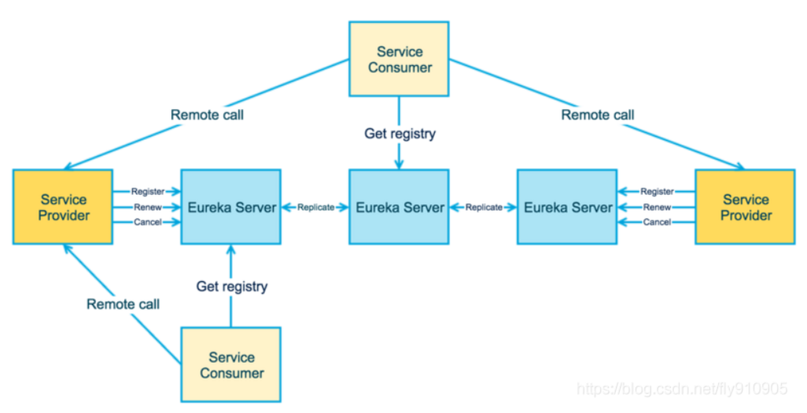

# Eureka

> 基于《尚硅谷 SpringCloud 框架开发教程》

## 一、基本概念

**情景 1**：

随着技术发展，程序架构也在变化：


- 单一应用架构：当网站流量很小时，只需要一个应用，将所有功能都部署在一起，可以减少部署的节点和成本。
  - 用于简化增删改查工作量的数据访问框架（ORM）是关键。
- 垂直应用架构：当访问量逐渐增大，单一应用增加机器带来的加速度越来越小，将应用拆成互不相干的几个应用，以提高效率。
  - 此时，用于加速前端页面开发的 WEB 框架（MVC）是关键
- 分布式服务架构：当垂直应用越来越多，应用之间交互不可避免，将核心业务抽取出来，作为独立的服务，逐渐形成稳定的服务中心，使前端应用能更快的响应多变的市场需求。
  - 此时，用于提高业务复合及整合的分布式服务框架（RPC）是关键。
- 流动计算架构：当服务越来越多，容量的评估，小服务资源的浪费等问题逐渐显现，此时需增加一个调度中心基于访问压力实时管理集群容量，提高集群利用率。
  - 此时用于提高机器利用率的资源调度和治理中心（SOA）是关键。

**情景 2**：

在分布式服务架构中，我们通过 HTTP 调用服务的 API 接口，当服务越来越多时，服务之间的依赖关系比较复杂、管理比较复杂，并且同时通过写死的 HTTP 地址去调用服务，有以下问题：

- 需要手动去设置服务提供者 HTTP 地址。
- 当服务地址更改时，需要手动地去更改所有关联的 HTTP 地址。
- 在分布式服务架构中，无法做到自动负载均衡。

---

SpringCloud 封装了 Netflix 公司开发的 Eureka 模块来实现服务治理。

Eureka 使用 Java 语言开发，采用 CS（Client-Server，客户端-服务端）的设计架构，遵循 AP 原则。

> [CAP 原则](https://blog.csdn.net/yeyazhishang/article/details/80758354)：是指在一个分布式系统中，Consistency（一致性）、 Availability（可用性）、Partition tolerance（分区容错性），最多只能同时三个特性中的两个，三者不可兼得。
>
> - C（Consistency，一致性）：所有节点在同一时间的数据完全一致。
> - A（Availability，可用性）：保证每个请求在一定时间内得到正确的响应。
> - P（Partition Tolerance，分区容错性）：在分布式系统中，遇到某节点或网络分区故障的时候，仍然能够对外提供满足一致性或可用性的服务。

### （一）重要知识点

- **服务治理**：在传统的 RPC（Remote Procedure Call，远程过程调用）框架中，每个服务与服务之间的依赖关系比较复杂、管理比较复杂，所以需要使用**服务治理**，管理服务与服务之间的依赖关系，可以**实现服务调用、负载均衡、容错等，实现服务注册与发现**。
- **注册中心**：负责服务网络地址的注册与查找，相当于目录服务，服务提供者和消费者只在启动时与注册中心进行交互，注册中心不转发请求，只是进行服务提供者址的记录并提供给消费者。
- **服务注册**：服务提供者将服务信息注册进注册中心。
- **服务发现**：从注册中心获取所需的服务信息。

### （二）Eureka 的架构

#### 1、单机架构


Eureka 中有两个重要的角色，**Eureka Server 和 Eureka Client**：

- Eureka Server：Eureka Server 作为服务注册功能的服务器，它是服务注册中心，各个微服务节点（Eureka Client）通过配置启动后，会在 Eureka Server 中进行注册，Eureka Server 中的**服务注册表**中会存储所有可用服务节点的消息，可以通过 Eureka Server 来监控系统中各个微服务是否正常运行。
- Eureka Client：Eureka Client 实际上是一个 Java 服务，同时也就是一个内置的、使用轮询(round-robin)负载算法的负载均衡器，启动后会把当前服务器的信息自动注册（例如：服务地址、通讯录地址等以别名方式注册）到 Eureka Server。

#### 2、[集群架构](https://blog.csdn.net/fly910905/article/details/100023415)



Eureka 集群不像 Zookeeper 中 Master-Slave 架构，而是**采用 Peer-to-Peer 对等通信**，这是一种去中心化的架构，无 master / slave 之分，每一个 Peer 都是对等的。在这种架构风格中，节点通过**彼此互相注册**来提高可用性，每个节点需要添加一个或多个有效的 serviceUrl 指向其他节点。每个节点都可被视为其他节点的副本。

在集群环境中如果某台 Eureka Server 宕机，Eureka Client 的请求会自动切换到新的 Eureka Server 节点上，当宕机的服务器重新恢复后，Eureka 会再次将其纳入到服务器集群管理之中。当节点开始接受客户端请求时，所有的操作都会在节点间进行复制（replicate To Peer）操作，**将请求复制到该 Eureka Server 当前所知的其它所有节点中**。

当一个新的 Eureka Server 节点启动后，会首先尝试从邻近节点获取所有注册列表信息，并完成初始化。

### （三）[自我保护模式](https://github.com/Netflix/eureka/wiki/Understanding-Eureka-Peer-to-Peer-Communication)

默认情况下，Eureka Client 定时（默认 30s）向 Eureka Server 发送心跳包，如果 Eureka Server 在一定时间（默认 90s）没有收到 Client 发送的心跳包，则会认为此服务已下线，便会直接从服务注册列表中剔除该服务。

由于 **Eureka 遵循 AP 原则**，Eureka Server 节点在短时间内（15 分钟）丢失过多（超过 85%）的服务实例心跳，那么 Eureka 则认为 Client 和 Server 出现网络故障，此时**进入自我保护模式**：

- Eureka 不再从注册表中移除因为长时间没有收到心跳而过期的服务，**保护注册表中的信息**。
- Eureka 仍然能够接受新服务注册和查询请求，但是不会被同步到其它节点上（即保证当前节点依然可用）。
- 当网络稳定时，当前实例新注册的信息会被同步到其它节点中。

**自我保护模式可以很好的应对因网络故障导致部分节点失去联系的情况**，默认情况下，Eureka 开启自我保护模式：


Eureka 关闭自我保护模式：

```yml
# Eureka Server 关闭自我保护
eureka:
  server:
    enable-self-preservation: false # 是否开启自我保护机制，保证不可用服务被及时踢除，默认开启
    eviction-interval-timer-in-ms: 2000 # 2000ms 内没有收到心跳，则剔除
```

```yml
# Eureka Client 关闭自我保护模式
eureka:
  instance:
    lease-renewal-interval-in-seconds: 1 # Eureka客户端向服务端发送心跳的时间间隔，单位为秒(默认是30秒)
    lease-expiration-duration-in-seconds: 2 # Eureka服务端在收到最后一次心跳后等待时间上限，单位为秒(默认是90秒)，超时将剔除服务
```

### （四）[停更说明](https://github.com/Netflix/eureka/wiki)

Eureka 2.0 现有的开源工作已停止，作为 2.x 分支上现有工作存储库的一部分发布的代码库和工件被认为使用时需要您自担风险。

Eureka 1.x 是 Netflix 服务发现系统的核心部分，并且仍然是一个活跃的项目。
