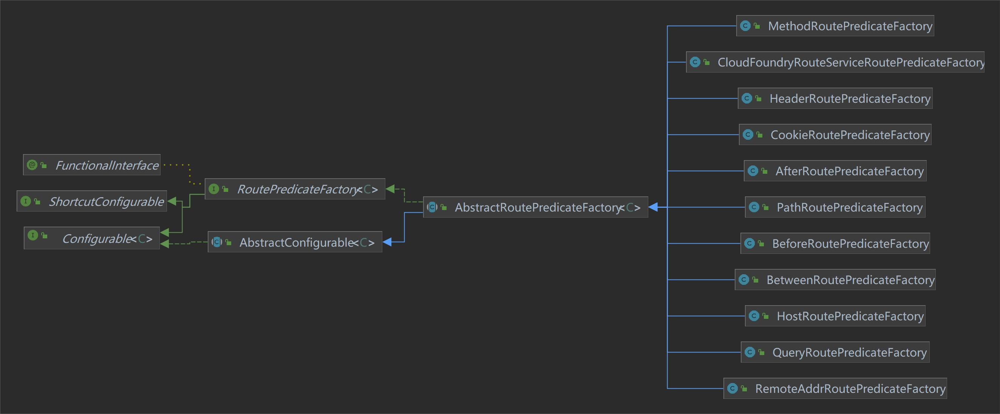

# Gateway

> 基于[【官网】](https://cloud.spring.io/spring-cloud-static/spring-cloud-gateway/2.2.1.RELEASE/reference/html/)、[SpringCloud gateway （史上最全）](https://www.cnblogs.com/crazymakercircle/p/11704077.html)、《尚硅谷 SpringCloud 框架开发教程》

## 一、基本概念

**情景 1**：

假如有三个业务服务：登录服务 A、订单服务 B、支付服务 C，每个业务服务的地址端口都不一样，客户端需要输入服务 A 的地址进行登录，输入服务 B 的地址进行购买，输入服务 C 的地址进行支付，客户端请求不同的业务服务都要输入不同的网址，增加客户端代码和配置的复杂性，提高了客户端和服务端的耦合度。

因此我们就想，能不能有一个中间者，客户端只需要向这个中间者发送对应的业务请求，由这个中间者根据这个业务请求找到指定的业务服务？

---

Gateway 是在 Spring 生态系统之上构建的 **API 网关服务**，基于 Spring 5、SpringBoot 2 和 Project Reactor 等技术，旨在为微服务架构提供一种简单有效的统一的 API 路由管理方式。

Gateway 提供了**路由转发**、鉴权、路径重写、日志监控等功能，还内置了限流过滤器，实现了**限流**的功能。并且还可以与 Eureka、Ribbon、Hystrix 等组件配合使用，实现负载均衡、熔断等功能。

**网关在微服务中的位置**：


### （一）[重要知识点](https://www.51cto.com/article/711361.html)


Gateway 中有 3 个重要的术语：

- Route（路由）：Gateway 配置中路由的基本组成模块，一个 Route 模块由 一个 ID、一个目标服务 URL 地址、一组断言和一组过滤器组成。
- Predicate（断言）：当请求与断言匹配则进行**路由**（也就是请求转发到目标服务 URL 地址）。
- Filter（过滤）：在请求被路由之前或之后，可以对请求进行其它操作。

### （二）[执行流程](https://www.jianshu.com/p/f5f6cebcdf88)


1. 客户端向 Gateway 发送请求，Gateway 通过 HttpWebHandlerAdapter 对请求进行封装。
2. DispatcherHandler 遍历 AbstractHandlerMapping 的实现类，获取到 RoutePredicateHandlerMapping。
3. RoutePredicateHandlerMapping 遍历配置中的 routes，通过断言校验找到第一个匹配的 route。
4. 再通过 FilteringWebHandler 创建 route 对应的过滤器链，过滤器转发请求之前（pre）执行 pre 过滤器逻辑，转发请求之后（post）执行 post 过滤器逻辑。
5. Gateway 处理完毕后将响应返回给客户端。

## 二、Gateway 使用

### （一）Route 配置方式

route 有两种配置方式：

#### 1、配置文件

route 配置中包含 id、url、predicates、filters 等属性。

```yml
server:
  port: 9527

spring:
  cloud:
    gateway:
      routes:
        - id: payment_routh # 路由的id，没有固定规则但要求唯一，建议配合服务名
          uri: http://localhost:8001 # 目标服务地址
          predicates:
            - Path=/payment/get/** # 路径相匹配的断言条件
```

上面的配置也就是说：发送 `http://localhost:9527/payment/get/1` 请求时，由于路径中包含 `/payment/get/1`，匹配到 id 为 payment_routh 的 route，会被 Gateway 转发到 `http://localhost:8001/payment/get/1`。

> 注意：predicates 的配置不能为空。

#### 2、编码方式

@Bean 注入一个 RouteLocator：

```java
@Configuration
public class MyRoutes {

    @Bean
    public RouteLocator customRouteLocator1(RouteLocatorBuilder builder) {
        return builder.routes()
                .route("path_route_atguigu1", r -> r.path("/guonei").uri("http://news.baidu.com/guonei"))
                .build();
    }

    @Bean
    public RouteLocator customRouteLocator2(RouteLocatorBuilder builder) {
        return builder.routes()
                .route("path_route_atguigu2", r -> r.path("/guoji").uri("http://news.baidu.com/guoji"))
                .build();
    }
}
```

#### 3、负载均衡的动态路由

与注册中心、负载均衡结合时，可以实现负载均衡的动态路由：

```yml
spring:
  application:
    name: cloud-gateway
  cloud:
    gateway:
      routes:
        # http://localhost:9527/payment/lb
        - id: payment_routh2
          uri: lb://CLOUD-PAYMENT-SERVICE # lb://服务注册中心的微服务名称，这种方式开启负载均衡
          predicates:
            - Path=/payment/lb # 路径相匹配的断言条件
```

> 负责均衡配置方式和 Ribbon 篇章中的配置方式一致。

### （二）[Predicate 断言](https://docs.spring.io/spring-cloud-gateway/docs/current/reference/html/#gateway-request-predicates-factories)

客户端发送请求时，Gateway 会使用 predicate 断言对请求进行校验，找到配置中第一个匹配的 route 配置。Gateway 有 RoutePredicateFactory 接口用于实现断言，有如下实现类：



> predicates 下所有断言匹配结果取交集，若有多个 route 匹配，则取第一个 route。

1、After

匹配指定时间之后的请求，也就是说客户端在指定时间之后发出的请求才会匹配此 predicate 所在的 route。

```yml
predicates: # 断言
  - After=2022-06-11T16:30:40.785+08:00[Asia/Shanghai] # 值为 ZonedDateTime 类型的时间
```

2、Before

匹配指定时间之前的请求。

```yml
predicates: # 断言
  - Before=2022-06-11T15:30:40.785+08:00[Asia/Shanghai]
```

3、Between

匹配两个时间区间内的请求。

```yml
predicates: # 断言
  # 第一个为开始时间，第二个为结束时间
  - Between=2022-06-11T15:30:40.785+08:00[Asia/Shanghai],2022-06-11T16:30:40.785+08:00[Asia/Shanghai]
```

4、Cookie

请求中的 Cookie 包含指定键值对，可以有多个。

```yml
predicates: # 断言
  - Cookie=name,[a-z]+ # 匹配Cookie的key和value（正则表达式）表示任意字母
  - Cookie=value,[a-z]+
```

5、Header

请求中的 Header 包含指定键值对，可以有多个。

```yml
predicates: # 断言
  - Header=headerName, \d+ # \d表示数字
```

6、Host

对应 HTTP 的 Header 请求头中的 Host 属性值，

> Host 表示客户端想与指定的服务端通信，例如：`Host:localhost:9527`，表示该请求只能被 localhost 接收。

```yml
predicates: # 断言
  - Host=localhost:9527 # Header 中 Host 值必须为 localhost:9527
```

7、Method

可以设置一个或多个参数，匹配 HTTP 请求方式。

```yml
predicates: # 断言
  - Method=POST,PUT,GET,DELETE
```

8、Query

请求参数中的键值对值，例如：`http://localhost:9527?id=myId`，可以有多个。

```yml
predicates: # 断言
  - Query=id,.+ # 匹配任意请求参数
```

9、RemoteAddr

允许访问的客户端地址，参数由 CIDR 表示法（IPv4 或 IPv6）字符串组成。

```yml
predicates: # 断言
  - RemoteAddr=192.168.1.1/24
```

### （三）[Filter 过滤器](https://docs.spring.io/spring-cloud-gateway/docs/current/reference/html/#global-filters)

GateWay 本身就提供了丰富的 [filter 过滤器](https://docs.spring.io/spring-cloud-gateway/docs/current/reference/html/#gatewayfilter-factories)，

filter 根据转发请求前后，分为两种：

- pre（前置过滤器）：处理前置逻辑，也就是 Gateway 将请求转发到目标 URL 之前执行。
- post（后置过滤器）：处理后置逻辑，也就是请求转发到目标 URL，收到指定业务服务的响应之后执行。

filter 根据作用范围，[分为两种](https://blog.csdn.net/qq_31960623/article/details/125017312)：

- 局部过滤器：局部过滤器是针对单个 route 的过滤器。
- 全局过滤器：全局过滤器作用于所有路由，无需配置。通过全局过滤器可以实现对权限的统一校验、安全性验证等功能。

#### 1、[配置文件](https://www.cnblogs.com/crazymakercircle/p/11704077.html)

在配置文件中的配置方式，可以在 route 下添加 filters，表示只作用于该 route；也可以在 gateway 下添加 default-filters，表示作用于所有的 route。

```yml
spring:
  cloud:
    gateway:
      default-filters: # 默认过滤器
        - PrefixPath=/mypath
      routes:
        # http://localhost:9527/payment/lb
        - id: payment_routh2
          uri: lb://CLOUD-PAYMENT-SERVICE # lb://服务注册中心的微服务名称，这种方式开启负载均衡
          predicates:
            - Path=/payment/lb # 路径相匹配的断言条件
          filters:
            - SetStatus=401 # 设置响应状态码
```

#### 2、编码方式

##### （1）自定义局部过滤器

自定义局部过滤器需要实现 GatewayFilter 和 Ordered 接口，并且需要添加到 GatewayFilterFactory 过滤器工厂。

```java
/**
 * Description: 自定义局部过滤器
 */
@Slf4j
public class MyPartialFilter implements GatewayFilter, Ordered {

    /**
     * Description: 只有当请求中携带了 user-id 头部信息时，才能访问
     *
     * @param exchange 封装了request 和 response 对象
     * @param chain 过滤器链
     * @return reactor.core.publisher.Mono<java.lang.Void>
     */
    @Override
    public Mono<Void> filter(ServerWebExchange exchange, GatewayFilterChain chain) {

        ServerHttpRequest request = exchange.getRequest();
        String url = request.getURI().toString();

        log.info("局部过滤器：url：{}，method：{}", url, request.getMethodValue());
        //获取header
        String userId = exchange.getRequest().getHeaders().getFirst("user-id");
        log.info("userId：" + userId);

        if (StringUtils.isBlank(userId))
        {
            log.info("*****头部验证不通过，请在头部输入 user-id");
            //终止请求，直接回应
            exchange.getResponse().setStatusCode(HttpStatus.NOT_ACCEPTABLE);
            return exchange.getResponse().setComplete();
        }
        return chain.filter(exchange);
    }

    /**
     * Description: 过滤器优先级，值越小，优先级越高
     */
    @Override
    public int getOrder() {
        return 0;
    }
}
```

```java
/**
 * Description: 自定义局部过滤器工厂，并且注入到 spring 容器中，自定义过滤器需要加入到过滤器工厂
 */
@Component
public class MyPartialFilterFactory extends AbstractGatewayFilterFactory<Object> {

    /**
     * Description: 指定自定义局部过滤器
     *
     * @param config 配置文件中传入的参数，写法可以参考 Gateway 提供的过滤器工厂，例如：AddRequestHeaderGatewayFilterFactory
     */
    @Override
    public MyPartialFilter apply(Object config) {
        System.out.println(config);
        return new MyPartialFilter();
    }

    /**
     * Description: 指定过滤器的名称
     */
    @Override
    public String name() {
        return "MyPartialFilter";
    }
}
```

```yml
filters:
  - MyPartialFilter
```

##### （2）自定义全局过滤器

自定义全局过滤器需要实现 GlobalFilter 和 Ordered 接口，并注入到 Spring 容器。

```java
/**
 * Description: 自定义全局过滤器
 */
@Component
@Slf4j
public class MyGlobalFilter implements GlobalFilter, Ordered {

    /**
     * Description: 过滤器逻辑
     */
    @Override
    public Mono<Void> filter(ServerWebExchange exchange, GatewayFilterChain chain) {
        log.info("AFilter前置逻辑");
        return chain.filter(exchange).then(Mono.fromRunnable(() ->
        {
            log.info("AFilter后置逻辑");
        }));
    }

    /**
     * Description: 过滤器优先级，值越小，优先级越高
     */
    @Override
    public int getOrder() {
        return HIGHEST_PRECEDENCE + 100;
    }
}
```

#### 3、超时服务降级

Gateway 提供 HystrixGatewayFilterFactory 用于处理**服务超时时的服务降级操作**。

（1）引入 Hystrix 依赖

```xml
<dependency>
    <groupId>org.springframework.cloud</groupId>
    <artifactId>spring-cloud-starter-netflix-hystrix</artifactId>
</dependency>
```

（2）添加配置

```yml
spring:
  cloud:
    gateway:
      routes:
        - id: payment_routh3
          uri: lb://CLOUD-PAYMENT-SERVICE
          predicates:
            - Path=/payment/**
          filters:
            # 设置 Hystrix 过滤器
            - name: Hystrix # 开启熔断
              args:
                name: fallbackcmd # 熔断后执行的命令
                fallbackUri: forward:/payment/fallback # 熔断后转发到的地址，必须能匹配 Path 断言

hystrix:
  command:
    fallbackcmd: # 熔断后执行的命令
      execution:
        isolation:
          thread:
            timeoutInMilliseconds: 2000 #服务超时时间
```

#### 4、[服务限流](https://www.cnblogs.com/crazymakercircle/p/11704077.html)

Gateway 提供 RequestRateLimiterGatewayFilterFactory 用于实现服务限流，其原理是通过在 Redis 内执行 Lua 脚本实现令牌桶算法。

**令牌桶算法**：


1. 在令牌桶算法中，存在一个桶，用来存放固定数量的令牌。
2. 每次初始化时，都会往桶中预先放满令牌，并且之后会按照一定速率向桶中存放令牌，超出容量的令牌会被丢弃。
3. 每次请求调用需要先获取令牌，只有拿到令牌，才有机会继续执行，否则选择等待可用的令牌、或者直接拒绝。

使用令牌桶算法后，服务启动完成对外提供服务时，可以抵挡瞬时的 100 个请求。只有桶中没有令牌时，请求才会进行等待，最后相当于以一定的速率执行。

Gateway 内置的 Lua 脚本：


1、RequestRateLimiterGatewayFilterFactory 依赖 Redis，先引入 Redis。

```xml
<!-- redis -->
<dependency>
    <groupId>org.springframework.boot</groupId>
    <artifactId>spring-boot-starter-data-redis-reactive</artifactId>
</dependency>
```

2、yml 配置

```yml
spring:
  application:
    name: cloud-gateway
  redis:
    host: 192.168.190.134
    port: 6379
    database: 0
  cloud:
    gateway:
      routes:
        # http://localhost:9527/payment/timeout?rateLimiter=true
        - id: payment_routh4
          uri: lb://CLOUD-PAYMENT-SERVICE
          predicates:
            - Path=/payment/get/**
            - Query=rateLimiter,true
          filters:
            - name: RequestRateLimiter # 进行服务限流
              args:
                redis-rate-limiter.replenishRate: 1 # 令牌每秒填充数量
                redis-rate-limiter.burstCapacity: 3 # 令牌桶总容量
                key-resolver: "#{@pathKeyResolver}" # 自定义的 MyPathKeyResolver 的 Bean 名称
```

RequestRateLimiter 限流过滤器有三个重要的参数：

- redis-rate-limiter.burstCapacity：令牌桶的总容量。
- redis-rate-limiter.replenishRate：令牌每秒填充数量。
- key-resolver：自定义的 KeyResolver 键解析器的 Bean 对象名称，使用 SpEL 表达式根据 `#{@bean名称}` 从 Spring 容器中获取 Bean 对象。

3、自定义 KeyResolver

KeyResolver 键解析器指定一个限流的 key，会根据这个 key 进行限流，**并且请求中必须包含这个 key，否则直接过滤此请求**：

```java
@Component("pathKeyResolver")
public class MyPathKeyResolver implements KeyResolver {

    @Override
    public Mono<String> resolve(ServerWebExchange exchange) {
        String value = exchange.getRequest().getQueryParams().getFirst("myName");
        System.out.println(value);
        return Mono.just(value);
    }
}
```

例如：`http://localhost:9527/payment/get/31?rateLimiter=true&myName=hello` 请求中，使用 myName 请求参数作为 key，表示带了 myName 请求参数的请求进来时，除了初始可以直接获取的 3 个令牌，之后每个 myName 值每秒最多只能发送 1 个请求，若超过 1 个/s 请求，则超出的直接返回，响应状态码为 429。


