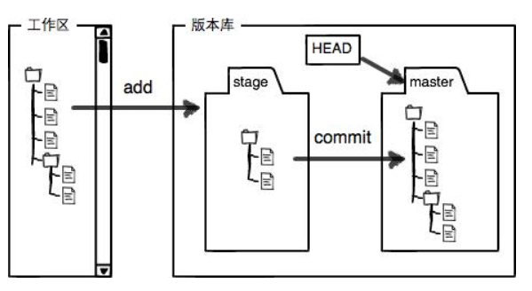
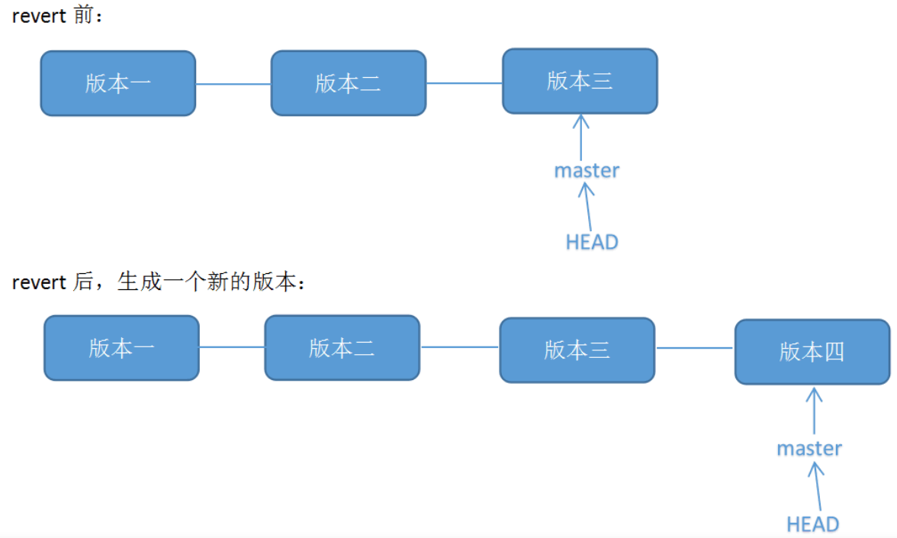
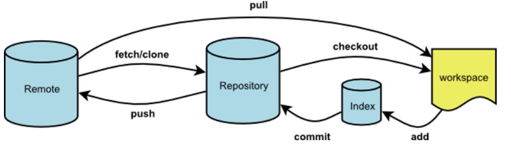

# Git 学习

> 基于[Git 教程](https://www.liaoxuefeng.com/wiki/896043488029600/896067008724000)

## 一、基本概念

[Git](https://git-scm.com/)是目前世界上最先进的分布式版本控制系统。

> 版本控制系统可以记录系统中，每次文件改动并提交的版本，这样可以看到每次文件的历史版本及改动。

## 二、Git 命令

### （一）初始化操作

在安装完成 Git 后，需要进行一些初始化操作。

#### 1、ssh-keygen -t rsa -C "备注"

用于生成密钥（其实这不是 git 的指令），将公钥添加到远程仓库，便可以进行 `push / pull` 操作

> 注意：`-C "备注"` 其实是这个密钥的备注，一般来说都是远程仓库的邮箱

#### 2、[git config [--global | --local] 配置名 配置值](https://www.cnblogs.com/fireporsche/p/9359130.html)

为 git 设置一些配置：

- `--globe` 表示这配置全局仓库都会使用。
- `--local` 表示这配置只针对当前仓库，可以覆盖 `--global` 的配置。

```bash
// 添加用户名、邮箱的全局配置
git config --global user.name "我的名字"
git config --global user.email "我的邮箱"
```

##### （1）git config [--global | --local] --unset 配置名

去除自定义配置。

```bash
// 删除用户名、邮箱的全局配置
git config --global --unset user.name
git config --global --unset user.email
```

> 注意：user.name 和 user.email 只是当前 git 用户的名字（用于表示 commit 的人名）和邮箱（用于联系），不一定需要和远程仓库的用户名和邮箱一致（虽然一般来说都一样）

### （二）仓库操作

#### 1、git init

将当前文件夹初始化为 git 仓库。

> 注意：最好是空文件夹。

#### 2、git add 文件名

将文件添加到暂存区。



#### 3、git commit -m "提交说明"

将暂存区文件添加提交到 git 仓库进行版本管理。

##### （1）git commit --amend

修改最近一次 commit 的提交说明（也就是-m "提交说明"）。

> 原理：创建一个新的 commit，再让 HEAD 重新指向这个新的 commit。
>
> 情景 1：当我们完成一次 commit 时，但还没有推送到公共的分支。发现 commit 的提交说明写的不够好，想修改，可以使用 `git commit --amend` 进入 vim 操作页面修改。
>
> 情景 2：当我们完成一次 commit 时，但已经推送到远程仓库，再次执行 `git push` 就会被拒绝（因为这是一个新的 commit）。如果是私人的分支：可以直接 `git push -f` 强制推送；如果是公共分支：先 `git pull` 再 `git push`（推荐）。

#### 4、git rm 文件名[^tracked]

删除指定文件，并添加到暂存区。相当于 `rm 文件名 + git add 文件名` 或 `rm 文件名 + git rm 文件名`（直接 git rm 不香吗）的组合。

#### 5、git log [--oneline] [--graph]

查看提交的版本的日志。

- `--oneline` 相当于 `--pretty=oneline --abbrev-commit`，表示输出格式为一行并且只展示版本的前几位。
- `--graph` 图形化输出版本记录。

#### 6、git reflog

查看所有改动仓库版本的操作日志。

#### 7、git stash

当暂存区、工作区中有内容时，需要切换到另外一个分支（切换到其他分支时，暂存区、工作区中不能有内容），使用 `git stash` 将暂存区、工作区的内容存储起来，同时恢复到当前最近的一个版本。

##### （1）git stash list

查看存储的 stash 版本号（stash 数字越小表示越新）和存储时的版本号。

> 注意：其他分支 stash 的版本号也可以看到。

##### （2）git stash apply `stash版本号`

将存储的 stash 版本号对应的内容恢复到工作区。

> 注意：只能恢复当前分支存储的 stash 内容，恢复其他分支 stash 内容时会报错。

##### （3）git stash drop `stash版本号`

删除指定的 stash 版本号及内容。

##### （4）git stash pop

相当于 `git stash apply stash@{0} + git stash drop stash@{0}`，将最新的 stash 恢复到工作区，同时删除这条 stash 版本号及内容（推荐用这个）。

#### 8、git tag

标签相当于某个 commit 版本的别名，使用 `git tag` 查看所有标签（按照标签字典排序展示）。

##### （1）git tag 标签名 [-m "说明"] [版本名]

给指定版本设置标签，不写版本名时默认是当前版本。

##### （2）git show 标签名

查看指定标签名对应的版本的详细信息。

##### （3）git tag -d 标签名

删除指定标签。

### （三）分支与合并操作

#### 1、git branch

使用 `git branch` 查看所有分支及当前 HEAD 所在的分支，`git branch -a` 查看本地分支和远程仓库分支。

##### （1）git branch 分支名

创建一个分支。

##### （2）git checkout 分支名

切换到指定分支。

##### （3）git checkout -b 分支名

创建一条分支，并切换到分支上。相当于 `git branch 分支名 + git checkout 分支名`。

##### （4）git checkout -b 分支名 远程仓库名/分支名

创建并切换到本地分支，设置本地分支跟踪远程仓库的分支。

##### （5）git branch [-d |-D] 分支名

删除指定分支，当分支没有合并到当前分支时，需要使用 `-D` 强制删除。

#### 2、git merge [--ff | --no-ff | --squash] -m "说明" 分支名

用于将指定分支合并到当前分支上（不会删除指定分支）。

[合并分支时主要有三种合并模式](https://www.cnblogs.com/damoblog/p/13144379.html)：

- `--ff` 也就是 fast-forward（快进，默认的合并模式），如果顺着一个分支走下去可以到达另外一个分支的话，那么 git 在合并两者时，只会简单的把 master 的指针右移，此时可以不用写 `-m "说明"`（写了也会忽略，也没有合并信息）。

  > 优点：合并快，只需要把 master 指针右移就行。
  >
  > 缺点：删除分支时，会丢失分支信息（合并后删除分支，看不出来合并过）；由于只是 master 指针移动，会把分支的提交记录合并到 master 分支，污染 master 分支。

- `--no-ff` 关闭 fast-forward，合并时需要写 `-m "说明"`，没有 `--ff` 的缺点。

- `--squash` 把一些不必要的 commit 进行压缩，在 master 建立一个新的提交点。例如：当前分支开发时 commit 很乱，在合并时不希望把这些历史 commit 带过来，于是使用 `--squash` 进行合并，此时文件已经同合并后一样了，但是不移动 HEAD、不提交，而是相当于在 master 建立一个新的提交点。需要进行一次额外的 commit 来"总结"一下，然后完成最终的合并。

  > 缺点：删除分支时需要使用 `git branch -D 分支名` 强制删除；不会保留一点对分支的引用，删除后就完全看不到分支信息，只看得到这次合并的提交点。

#### 3、git cherry-pick 版本号

将指定的版本内容合并到当前分支，当主分支版本大于当前分支版本时可以这样写。

> 注意：合并的不是分支而是指定的版本内容。

#### 4、[git rebase](https://www.waynerv.com/posts/git-rebase-intro/#contents:%E4%B8%8D%E4%BB%85%E4%BB%85%E6%98%AF%E5%88%86%E6%94%AF)

// TODO:

### （四）重置操作

#### 1、git reset [--hard | --mixed | --soft] [ HEAD~数字 | 版本号 ]

`HEAD~数字` 数字回到前几个版本（若只写 `HEAD` 表示回到当前版本，可以用于重置工作区、暂存区文件），或者回到指定版本。

[重置时的三种重置模式](https://blog.csdn.net/tbluhongxuan/article/details/107302352)[^tracked] ：

- `--hard` 删除指定版本中已 commit 文件在工作区、暂存区和版本之后的修改，指定版本之后的所有文件及其修改。
- `--mixed` 保存指定版本中已 commit 文件在工作区、暂存区和版本之后的修改，指定版本之后的所有文件及其修改。所有在工作区、暂存区的文件返回工作区，指定版本中已 commit 文件在版本之后的修改都放回工作区，指定版本之后的所有已 commit 文件变成未被跟踪的文件放在工作区。
- `--soft` 保存指定版本中已 commit 文件在工作区、暂存区和版本之后的修改，指定版本之后的所有文件及其修改。所有在工作区、暂存区的文件仍在工作区、暂存区，指定版本中已 commit 文件在版本之后的修改都放回暂存区，指定版本之后的所有已 commit 文件变成未被跟踪的文件放在暂存区。

##### （1）git reset [ HEAD~数字] 文件名[^tracked]

将指定版本的、指定的文件 commit 操作放回暂存区，将当前指定的文件从暂存区放回工作区。主要是 `git reset HEAD 文件名` 将指定文件从暂存区放回工作区。

##### （2）git checkout -- 文件名[^tracked]

撤销指定文件或路径下文件在工作区的修改，只对在工作区的文件有效。

- 文件修改后还没有被放到暂存区。撤销修改就回到和版本库一模一样的状态，相当于清除指定文件在工作区的修改，包括还原删除的文件。
- 文件修改后已经添加到暂存区后，又作了修改。撤销修改就回到添加到暂存区后的状态，相当于只清除在工作区的修改，保留已经在暂存区的修改。

> 配合 `git reset HEAD 文件名`，将指定文件添加到暂存区的修改放回工作区，然后 `git checkeout -- 文件名`，可以删除已添加到暂存区的文件的修改。

#### 2、git revert [-n] 版本号



用于回滚指定版本号的 commit 内容，也可以使用例如 `git revert HEAD^3..HEAD` 回滚前三个版本到当前版本区间的 commit 内容。

当回滚非当前版本的 commit 内容时，会遇见冲突，此时需要使用 `git revert [--continue | --quit | --abort]`：

- `--continue`：当解决完冲突后，将文件 add 到暂存区，使用 `continue` 进行提交操作并退出 revert 进程。

  > 当然也可以直接进行 commit 操作，不过不会显示地退出 revert 进程。

- `--quit`：退出 revert 进程，但会保留暂存区、工作区中（解决冲突时）的内容。

- `--abort`：退出 revert 进程，并且不保留暂存区、工作区的内容。

### （五）远程命令

#### 1、git clone `远程仓库url`

当先创建远程仓库时，可以将远程仓库克隆到本地，这样本地仓库和远程仓库直接就产生关联。

#### 2、git remote

当先创建本地仓库，后创建远程仓库时，使用 remote 将本地仓库和远程仓库关联，可以进行 `push / pull` 将本地仓库和远程仓库进行同步的操作。

##### （1）git remote -v

查看本地仓库和远程仓库的关联情况。

##### （2）git remote add 远程仓库名 `远程仓库url`

为远程仓库取仓库名（一般为 origin），将远程仓库 url 和本地仓库关联。可以添加多个远程仓库（取不一样的远程仓库名就可以），本地仓库关联多个远程仓库，可以分别进行 `push / pull`。

##### （3）git remote rm 远程仓库名

删除本地仓库和指定远程仓库的关联（不会删除远程仓库，只是删除关联关系）。

##### （4）git remote set-url --add 远程仓库名 `远程仓库url`

> 情景 1：使用 `git remote add 远程仓库名 远程仓库url` 可以为本地仓库关联多个远程仓库，但是 `push` 只能推送给一个远程仓库名对应的远程仓库 url。例如：每一个仓库名对应一个远程仓库 url，我要给十个远程仓库推送，就要 push 十次。
>
> 情景 2：使用 `git remote set-url -add 远程仓库名 远程仓库 url` 可以给一个远程仓库名添加多个对应的 url，`push` 推送给一个远程仓库名对应的远程仓库 url。例如：每一个仓库名对应十个远程仓库 url，我要给十个远程仓库推送，只需要 push 一次。
>
> 注意：虽然一个远程仓库名能对应多个远程仓库 url，能同时 `push` 到多个远程仓库，但是 `pull` 只会从第一个远程仓库 url 拉取。

##### （5）git remote set-url --delete 远程仓库名 `远程仓库url`

删除指定远程仓库名的指定远程仓库 url

##### （6）git remote set-url 远程仓库名 `旧的远程仓库url` `新的远程仓库url`

修改指定远程仓库名的指定远程仓库 url。

#### 3、git push

将当前分支上的所有本地提交推送到远程库。

> 注意：push 操作会同时操作此远程仓库名对应的所有 url。

##### （1）git push [-u] 远程仓库名 本地分支名[:远程分支名]

将指定分支的所有本地提交推送到远程库的分支（没有写远程分支名默认就是同名）。当第一次推送时，本地有此分支，远程没有此分支，使用 `-u` 用于推送时将本地分支和远程分支关联起来，默认将此分支推送到指定远程库的分支，以后就可以使用 `git push` 代替 `git push 远程仓库名 分支名`。

> 注意：使用 `git branch --unset-upstream` 取消关联，以后就不能直接使用 `git push`；使用 `git branch --set-upstream-to 本地分支名 远程仓库名/远程分支名` 设置关联。

##### （2）git push -d 远程仓库名 分支名

删除远程仓库的指定分支。

##### （3）git check -b 本地分支名 远程仓库名/远程分支名

当第一次克隆时，远程有此分支，本地没有此分支，将远程仓库的分支拉取到本地，并取名为本地分支名，同时建立关联。

##### （4）git push 远程仓库名 标签名

将本地创建的标签推送到远程仓库。

##### （5）git push 远程仓库名 :refs/tags/标签名

先删除本地标签，再推送到远程仓库，就可以删除远程仓库的指定标签。

##### （6）[git push -f](https://www.jianshu.com/p/b03bb5f75250)

将本地仓库版本推送到远程仓库，并覆盖远程仓库的版本。

> 注意：除非当前分支只有自己用，否则禁止使用 `git push -f`，因为会影响其他人。

#### 4、git pull

拉取远程仓库的最新版本到本地仓库。若发生冲突，先 commit 本地文件，然后 `git pull`，解决完冲突并 commit 后再 `git push`。

##### （1）git pull -f

拉取远程仓库最新版本到本地仓库，并覆盖本地仓库的版本。

#### 5、[git fetch [远程仓库名 分支名]](https://www.cnblogs.com/runnerjack/p/9342362.html)

`git fetch` 是将远程主机的最新内容拉到本地，用户在检查了以后决定是否合并到工作本机分支中。而 `git pull` 则是将远程主机的最新内容拉下来后直接合并，相当于 `git fetc + git merge`，这样可能会产生冲突，需要手动解决。



---

[^tracked]: 只对已跟踪的文件有效

## 三、疑问

### （一）SVN 与 Git 的最主要的区别？

- SVN 是集中式版本控制系统，版本库是集中放在中央服务器。
- Git 是分布式版本控制系统，没有中央服务器，每个人的电脑就是一个完整的版本库。
- SVN 分支是主干的一个完整 copy 的副本，因此无论是创建分支还是合并分支，都是重量级操作；Git 分支创建分支、合并分支主要是操作指针，操作较为轻量级。
- Git 在断网情况下，仍然可以进行 commit、分支等版本管理，因为本地就是一个完整的版本库。
