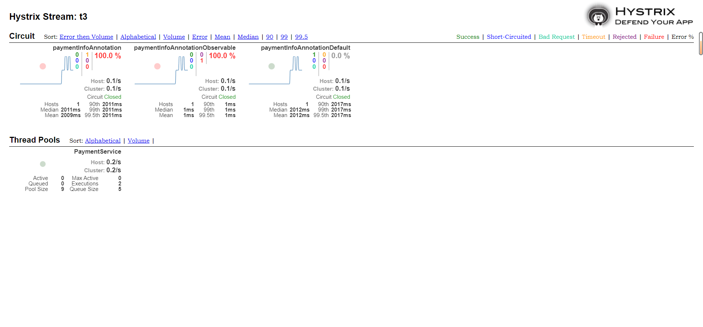

# Hystrix

> 基于[【官网】](https://github.com/Netflix/Hystrix)、《尚硅谷 SpringCloud 框架开发教程》

## 一、基本概念

**情景 1**：

当用户同时请求多个微服务，一切正常时，请求流如下：


**情景 2**：

当用户同时请求多个微服务，有某个服务调用失败时，会**阻塞整个请求**：


**情景 3**：

在分布式微服务架构中，每个服务都是潜在失败的来源，越长的、越多的服务调用会导致整个请求的故障风险增加。

例如：多个微服务之间调用的时候，假设微服务 A 调用了微服务 B 和微服务 C，微服务 B 和微服务 C 又调用其它地方的微服务，这就是所谓的**扇出**，如果扇出的链路上某个微服务的调用响应时间过长或者不可用，对微服务 A 的请求就会占用越来越多的系统资源，进而引起系统崩溃，这就是所谓的**雪崩效应**。

在高并发情况下，单个服务故障可能导致所有服务器上的所有资源在几秒钟内饱和：


比故障更糟糕的是，这些应用程序还会导致服务之间延迟增加，这会阻塞队列、线程和其他系统资源，从而导致更多的系统级联故障。此时就需要一个**对故障和延迟进行隔离和管理**的方案，以便单个依赖（可以理解为一个业务方法）关系的失败，不会导致整个应用程序和系统崩溃。

---

Hystrix 是 Netflix 公司开发的、用于处理分布式系统的**延迟和容错**的开源库。在分布式系统中，许多依赖（服务）不可避免的会调用失败，比如：超时、异常等，**Hystrix 能够保证在某个依赖出问题的情况下，不会导致整体服务失败，避免级联故障，以提高分布式系统的容错能力**。

### （一）重要知识点

1、服务降级

正常情况下，服务器能正常响应客户端请求；服务器异常时，不能在指定时间内进行响应，为了不让客户端一直等待或报错，服务器退而求其次，会立刻调用 fallback 方法返回一个友好提示。

产生服务降级的原因：

- 程序运行异常。
- 超时。
- 线程池 / 消耗量消耗殆尽。

2、服务熔断

服务熔断是服务降级的特殊情况：当短时间内服务降级次数过多，那么就可以认为此服务器短时间内无法正常提供服务，就会产生服务熔断。服务熔断发生后，每次客户端请求时，会直接跳过正常的方法，立刻调用 fallback 方法返回一个友好提示。

3、服务限流

高并发情况下，通过控制请求的速率或次数来达到保护服务的目的。

## 二、Hystrix 使用

传统的编码方式：

```java
@Service
public class PaymentService {
    /**
     * Description: id 为 0 时抛异常；不为 0  时，执行时间耗时 3000 ms
     */
    public String paymentInfo(Integer id) {
        int age = 10 / id;

        int second = 3;
        long start = System.currentTimeMillis();
        try {
            TimeUnit.SECONDS.sleep(second);
        } catch (InterruptedException e) {
            e.printStackTrace();
        }
        long end = System.currentTimeMillis();
        System.out.println(end - start);
        return "线程池：" + Thread.currentThread().getName() + " paymentInfoOK，id：" + id + " O(∩_∩)O哈哈~" + " 耗时(秒): " + second;
    }
}
```

```java
/**
 * Description: 不使用服务降级
 */
@GetMapping("/hystrix/timeout/{id}")
public String paymentInfoTimeOut(@PathVariable("id") Integer id) {
    String result = paymentService.paymentInfo(id);
    log.info("result: " + result);
    return result;
}
```

当我们调用这个接口的时候，会面临两种问题：超时和报错，在单机架构中可能不是毁灭级的问题，但是在分布式微服务架构中，就可能会导致服务雪崩。

Hystrix 提供两种方式来实现服务降级：编程方式和注解方式。

### （一）编程方式

继承 HystrixCommand 或 HystrixObservableCommand 类：

```java
public class PaymentOrignalService extends HystrixCommand<String> {

    private final PaymentService paymentService;

    private Integer id;

    public PaymentOrignalService(PaymentService paymentService, Integer id) {
        super(Setter
                .withGroupKey(HystrixCommandGroupKey.Factory.asKey("orderService"))
                .andCommandKey(HystrixCommandKey.Factory.asKey("queryByOrderId"))
                .andCommandPropertiesDefaults(HystrixCommandProperties.Setter().withExecutionTimeoutEnabled(true))
                .andThreadPoolPropertiesDefaults(HystrixThreadPoolProperties.Setter().withCoreSize(10)));

        this.paymentService = paymentService;
        this.id = id;
    }

    @Override
    protected String run() {
        return paymentService.paymentInfo(id);
    }

    @Override
    protected String getFallback() {
        return paymentService.paymentInfoTimeOutHandler(id);
    }
}
```

```java
@Resource
private PaymentService paymentService;

/**
 * Description: 继承 HystrixCommand 的方式实现服务降级
 */
@GetMapping("/hystrix/timeoutOrignal/{id}")
public String paymentInfoTimeOutOrignal(@PathVariable("id") Integer id) {
    String result = new PaymentOrignalService(paymentService, id).execute();
    log.info("result: " + result);
    return result;
}
```

#### 1、[Hystrix 处理流程](https://github.com/Netflix/Hystrix/wiki/How-it-Works)

HystrixCommand 执行流程如下：


1. 创建 HystrixCommand 或 HystrixObservableCommand（需要重写 construct() 和 resumeWithFallback() 方法）对象。下面未做区分时统称为 Command。
2. 执行命令，Hystrix 提供 4 种执行命令的方法，后面详解。
3. 是否开启缓存，如果开启并且该命令（请求）缓存命中，则直接返回。
4. 是否开启断路器，如果开启，则 Hystrix 不会执行命令，而是转换到 fallback 处理逻辑（第 8 步）；否则，继续执行。
5. 线程池 / 请求队列 / 消耗量是否占满，如果命令依赖服务的专有线程池和请求队列，或者信号量（不使用线程池的时候）已经被占满，那么 Hystrix 也不会执行命令，而是转换到 fallback 处理逻辑（第 8 步）；否则，继续执行。
6. Hystrix 最终调用重写的 run() 或 construct() 方法：HystrixCommand.run() 返回一个单一的结果，或者抛出异常；HystrixObservableCommand.construct() 返回一个 Observable 被观察者对象，Observable 通过 onNext 发送结果，或者通过 onError 发送错误通知。
7. Hystrix 会将成功、失败、拒绝、超时等信息报告给断路器，断路器根据这些统计的数据判断是否需要开启断路器，来对某个依赖服务的请求进行**熔断**。
8. 当命令执行失败（**异常、拒绝、超时、线程池 / 请求队列 / 消耗量是否占满**）时，Hystrix 会调用指定的 fallback 的方法返回友好提示，其中第 4、5、6 步都可能会引起服务降级。
9. 当 Hystrix 命令执行成功后，会将处理结果直接返回或是以 Observable 的形式返回。

> 注意：在 HystrixObservableCommand 中没有重写 resumeWithFallback()方法时，如果命令执行时超时或抛异常，Hystrix 不会抛异常，而是依然会返回一个 Observable 对象，并且执行 onError() 回调方法。

#### 2、Hystrix 构造方法的属性

Command 构造方法中有一些重要的参数需要说明：

- goupkey：表示一组 Hystrix 命令的集合， 用来统计、报告，默认取类名，可不配置。
- commandkey：Command 的 Key，默认使用当前类名作为 commandkey。Command 内维护一个 Map，会为每个 commandKey 指定一个 CircuitBreaker（熔断器），相同的 commandKey 使用同一个 CircuitBreaker。
- commandProperties：设置 Command 的配置，覆盖默认配置。例如：是否开启超时、断路器的相关配置等。
- threadPoolKey：线程池的 Key，默认使用 goupkey 作为 threadPoolKey 值。Command 内部维护一个 Map，会为每个 threadPoolKey 指定一个 threadPool，相同的 threadPoolKey 使用同一个 threadPool。
- threadPool：可以传入 HystrixThreadPoolKey 的实现类，用于自定义线程池，默认使用 HystrixThreadPool.HystrixThreadPoolDefault。
- threadPoolProperties：设置线程池的配置，覆盖默认配置。例如：核心线程数、存活时间等。

#### 3、Hystrix 命令的执行方法

从上面的执行流程中可以看出，Hystrix 将请求封装成命令（Command），需要使用对应的命令执行方法，才能开启 Hystrix 功能。Hystrix 提供 4 种执行命令的方法：execute()、queue()、observe()、toObservable()，HystrixObservableCommand 只能使用后 2 种，HystrixCommand 可以使用全部 4 种。

- execute：以同步阻塞方式执行 run()，Hystrix 会从线程池取出一个线程来执行 run()，并等待返回值。
- queue：以异步非阻塞方式执行 run()，直接返回一个 Future 对象，可以通过 Future.get() 同步获取值。
- observe：会返回一个 hot Observable，也就是调用 observe() 方法就会执行 run() / construct()，无论是否存在订阅者。
  - 如果是 HystrixCommand 执行 observe()，Hystrix 会从线程池中取出一个线程以非阻塞方式执行 run()。
  - 如果是 HystrixObservableCommand 执行 observe()，Hystrix 会根据 Observable.subscribeOn() 指定的线程执行 construct()。
- toObservable：会返回一个 cold Observable，也就是调用 toObservable() 方法不会立刻执行 run() / construct()，必须 Observable.subscribe() 注册观察者才会执行。

这 4 种方法存在如下的关系：


- execute：实际调用了 queue().get()。
- queue：实际上调用了 toObservable().toBlocking().toFuture()
- observe：实际上调用 toObservable() 返回一个 cold Observable，再创建 ReplaySubject 对象订阅 Observable，相当于转换成 hot Observable，也就是自动触发 run() / construct()。

> Hystrix 总是返回 Observable 类型的值，从上面执行流程图就可以看出，不同的命令执行方法之间只是进行了相应的转换。

#### 4、[资源隔离](https://juejin.cn/post/6844903912869199885)

Hystrix 采用隔离模式来隔离彼此的依赖关系，**限制依赖的并发量**、**防止阻塞扩散**。Hystrix 提供两种隔离模式：**线程池**和**信号量**。

##### （1）线程池

Hystrix 为每个类型的 Command 分配一个线程池，请求在单独的线程上执行，这将它们与调用线程（Tomcat 线程池）隔离开来，这样调用者就可以避开耗时过长的依赖项调用，实现发送请求和执行请求的解耦。


**优缺点**：

- 应用程序完全免受失控依赖的影响。给定的 Command 线程池可以填满，而不会影响应用程序的其余部分。也就是说服务的阻塞不会影响到调用线程，从而阻止阻塞扩散。
  - 阻塞扩散，例如：Tomcat 线程池中的每个线程都因为业务类执行请求的阻塞而阻塞，没有空闲线程来接收后续请求，会导致后续请求也发生阻塞。
- 当失败的依赖恢复正常时，线程池将被清理，应用程序将立即恢复正常的性能，而不是在整个 Tomcat 容器不堪重负时进行长时间的恢复。
- 除了隔离优势外，Hystrix 拥有专门的线程池可提供内置的并发功能，使得可以在同步调用之上构建异步门面（外观模式），为异步编程提供了支持（Hystrix 引入了 Rxjava 异步框架）。
- 每个命令的执行都在单独的线程完成，增加了排队、调度和上下文切换的开销。

##### （2）信号量

上面提到了线程池隔离的缺点，当依赖延迟极低的服务时，线程池隔离技术引入的开销超过了它所带来的好处。这时候可以使用信号量隔离技术来代替，通过设置信号量来限制对任何给定依赖的并发调用量。


信号量隔离配置：

```java
public PaymentOrignalService(PaymentService paymentService, Integer id) {
    super(Setter
          .withGroupKey(HystrixCommandGroupKey.Factory.asKey("orderService"))
          .andCommandKey(HystrixCommandKey.Factory.asKey("queryByOrderId"))
          .andCommandPropertiesDefaults(
              HystrixCommandProperties.Setter()
              .withExecutionTimeoutEnabled(true)
              .withExecutionIsolationStrategy(HystrixCommandProperties.ExecutionIsolationStrategy.SEMAPHORE) // 信号量隔离
              .withExecutionIsolationSemaphoreMaxConcurrentRequests(10) // 信号量最大并发数
          ));

    this.paymentService = paymentService;
    this.id = id;
}
```

信号量隔离和线程池隔离的异同点：

- 信号量和线程池都可以控制并发请求量，当线程池拒绝或信号量耗尽时，都会直接执行 fallback 方法。
- 使用线程池时，发送请求的线程和执行依赖服务的**线程不是同一个**；而使用信号量时，发送请求的线程和执行依赖服务的**线程是同一个**——都是发起请求的线程。
- 信号量主要是通过控制并发请求量，防止请求线程大面积阻塞，从而达到限流和防止雪崩的目的。但是信号量不支持异步，也就是发生阻塞时，同时也会导致请求线程的阻塞。

#### 5、断路器

断路器（Circuit Breaker）本身是一种开关装置，当某个服务发生故障后，通过断路器的故障监控，**向调用方返回一个符合预期的、可处理的备选响应（Fallback）而不是长时间的等待或者抛出调用方法无法处理的异常**，这样就保证了调用方的线程不会被长时间、不必要地占用，从而避免故障在分布式系统中的蔓延，乃至雪崩。

Hystrix 提供 HystrixCircuitBreaker 断路器用于实现服务熔断的功能：

```java
public PaymentOrignalService(PaymentService paymentService, Integer id) {
    super(Setter
          .withGroupKey(HystrixCommandGroupKey.Factory.asKey("orderService"))
          .andCommandKey(HystrixCommandKey.Factory.asKey("queryByOrderId"))
          .andCommandPropertiesDefaults(
              HystrixCommandProperties.Setter()
              .withExecutionTimeoutEnabled(true)
              .withExecutionTimeoutInMilliseconds(2000)
              .withCircuitBreakerEnabled(true) // 开启断路器
              .withCircuitBreakerRequestVolumeThreshold(10) // 请求总数阈值
              .withCircuitBreakerSleepWindowInMilliseconds(10000) // 时间窗口期
              .withCircuitBreakerErrorThresholdPercentage(50) // 错误率
          ));

    this.paymentService = paymentService;
    this.id = id;
}
```

断路器有一些重要的配置：

- circuitBreaker.enabled：是否开启断路器，默认为 true。
- circuitBreaker.forceOpen：强制开启断路器，也就是断路器直接且一直处于开启状态，默认为 false。
- circuitBreaker.forceClosed：强制关闭断路器，也就是断路器直接且一直处于关闭状态，默认为 false。
- circuitBreaker.errorThresholdPercentage：错误率，默认值为 50%。
- circuitBreaker.sleepWindowInMilliseconds：时间窗口期，默认值为 5000ms。
- circuitBreaker.requestVolumeThreshold：请求总数阈值，默认值为 20。

**断路器执行流程如下**：


1. 断路器是否为 Closed（关闭，初始状态为 Closed）状态：
   1. 如果是，则判断 sleepWindowInMilliseconds 时间内，请求数大于 requestVolumeThreshold ，且失败率大于等于 errorThresholdPercentage，则熔断器由 Closed 状态变成 Open（开启）状态。
   2. 否则，请求执行成功，直接返回。
2. 断路器处于 Open 状态时，请求不会被处理，会直接调用 fallback 方法。当距离**断路器打开的时间**或**上一次试探请求的时间**超过 sleepWindowInMilliseconds 值时，断路器由 Open 状态变成 Half Open（半开启）状态。
3. 熔断器处于 Half Open 状态时，会允许放行一个试探请求：
   1. 如果此试探请求执行成功，则断路器由 Half Open 状态变成 Closed 状态。
   2. 否则，断路器认为依赖仍然不足与处理请求，由 Half Open 状态变成 Open 状态。

#### 6、[Hystrix 相关配置](https://edgar615.github.io/spring-cloud-circuit-hystrix.html)

Hystrix 有两个配置类：HystrixCommandProperties 和 HystrixThreadPoolProperties，分别存储 Hystrix 的基本配置和 HystrixThreadPool 的基本配置。

### （二）注解方式

使用 Hystrix 编程方式实现服务熔断、服务降级等功能时很繁琐，需要为每个依赖创建一个对应的 Command 实现类，因此，Hystrix 提供了注解方式替代编程方式。

#### 1、@EnableHystrix 和 [@EnableCircuitBreaker](https://blog.csdn.net/u012129558/article/details/83821272)

@EnableHystrix 是 Hystrix 提供的注解，查看源码其上添加了 @EnableCircuitBreaker 注解，@EnableCircuitBreaker 是 SpringCloud 提供的注解，两者效果相同——都是开启断路器，推荐使用 @EnableCircuitBreaker。

在 Hystrix 中 @EnableCircuitBreaker 会对 @HystrixCommand 注解所在的方法进行 AOP 增强，实现上面编程方式一样的功能。

```java
@SpringBootApplication
// 等同于 @EnableHystrix，开启断路器功能，
// 在 Hystrix 中会对 @HystrixCommand 注解所在的方法进行 AOP 增强
@EnableCircuitBreaker
public class PaymentHystrixMain8001 {
    public static void main(String[] args) {
        SpringApplication.run(PaymentHystrixMain8001.class, args);
    }
}
```

#### 2、@HystrixCommond 和 @HystrixProperty

@HystrixCommond 和 @HystrixProperty 都是 Hystrix 提供的注解。

@HystrixProperty 作用于方法上，用于指定 Command 配置，有 name 和 value 属性，分别用于指定配置名和配置值，具体[查看](https://www.cnblogs.com/cangqinglang/p/11708556.html)。

@HystrixCommond 作用在方法上，SpringCloud 会对@HystrixCommond 所在的方法进行 AOP 增强，根据参数生成对应的 Command 类，调用对应的命令执行方法，有如下属性：

- groupKey、commandKey、threadPoolKey
- fallbackMethod：用于指定 fallback 容错方法名，**指定的 fallback 方法的参数需要和原本的方法一致，否则会报错**。
- commandProperties：也就是 Command 的配置，值为 @HystrixProperty 注解数组。
- threadPoolProperties：也就是 HystrixThreadPool 的配置，值为 @HystrixProperty 注解数组。
- ignoreExceptions：忽略的异常，默认 Hystrix 在执行方法时捕获到异常时执行回退，并统计失败率以修改熔断器的状态，而被忽略的异常则会直接抛到外层，不会执行回退方法，也不会影响熔断器的状态。
- ObservableExecutionMode：当 Hystrix 命令被包装成 RxJava 的 Observer 异步执行时，此配置指定了 Observable 被执行的模式，默认是 `ObservableExecutionMode.EAGER`，等同于 observe；`ObservableExecutionMode.LAZY` 时等同于 toObservable。

下面是使用的例子：

```java
@HystrixCommand(fallbackMethod = "paymentInfoTimeOutHandler", commandProperties = {
    // 设置超时时间为 2000 ms
    @HystrixProperty(name = "execution.isolation.thread.timeoutInMilliseconds", value = "2000")
    @HystrixProperty(name = "circuitBreaker.enabled", value = "true"), // 是否开启断路器
    @HystrixProperty(name = "circuitBreaker.requestVolumeThreshold", value = "10"), // 请求总数阈值
    @HystrixProperty(name = "circuitBreaker.sleepWindowInMilliseconds", value = "10000"), // 时间窗口期
    @HystrixProperty(name = "circuitBreaker.errorThresholdPercentage", value = "60"), // 错误率
}, observableExecutionMode = ObservableExecutionMode.EAGER // observe方式
   // , observableExecutionMode = ObservableExecutionMode.LAZY // toObservable方式
)
// 用的是注解写的是 HystrixCommand，其实实现的是 HystrixObservableCommand
public Observable<String> paymentInfoAnnotationObservable(Integer id) {
    return Observable.create(new Observable.OnSubscribe<String>() {
        public void call(Subscriber<? super String> observer) {
            try {
                // 这里不需加判断，可以删掉判断
                if (!observer.isUnsubscribed()) {
                    observer.onNext(paymentInfo(id));
                }
            } catch (Exception e) {
                observer.onError(e);
            }
        }
    });
}
```

```java
@GetMapping("/hystrix/timeoutAnnotationObservable/{id}")
public String paymentInfoTimeOutAnnotationObservable(@PathVariable("id") Integer id) {
    Observable<String> observable = paymentService.paymentInfoAnnotationObservable(id);
    List<String> resultList = new ArrayList<>();
    Action1<String> action = result -> {
        log.info("result: " + result);
        resultList.add(result);
    };

    observable.subscribe(action);
    return CollectionUtils.isEmpty(resultList) ? "" : resultList.get(0);
}
```

#### 3、@DefaultProperties

通过在方法上添加 @HystrixCommand 注解并配置注解的参数来实现配置，但有的时候一个类里面会有多个 Hystrix 方法，每个方法都是类似配置的话会冗余很多代码，这时候我们可以在 @HystrixCommand 所在的类上使用 @DefaultProperties 注解来给整个类的 Hystrix 方法设置一个默认值。

```java
@Service
// defaultFallback 指定的方法为无参方法
@DefaultProperties(defaultFallback = "paymentGlobalFallbackMethod")
public class PaymentService {

    @HystrixCommand
    public String paymentInfoAnnotationDefault(Integer id) {
        return paymentInfo(id);
    }

    public String paymentGlobalFallbackMethod() {
        return "Global 异常处理信息，请稍后再试，o(╥﹏╥)o";
    }
}
```

### （三）[配置文件](https://github.com/Netflix/Hystrix/wiki/Configuration)

当然 SpringCloud 也提供配置文件的配置方式，覆盖默认配置：

```yml
hystrix:
  command:
    # 全局配置
    default:
      execution:
        timeout:
          enable: true
        isolation:
          thread:
            timeoutInMilliseconds: 3000
    # 自定义配置
    myCommandkey: # 对应 commandkey 字段
      circuitBreaker:
        requestVolumeThreshold: 10
        errorThresholdPercentage: 50
        sleepWindowInMilliseconds: 5000
        enabled: true
```

### （四）[Feign 对 Hystrix 的支持](https://blog.51cto.com/u_16012040/6130762)

SpringCloud 默认已为 Feign 整合了 Hystrix，要使用 Feign 的 Hystrix 支持，在配置文件中启用：

```yml
feign:
  # feign 中启用 hystrix
  hystrix:
    enabled: true
```

只要 Hystrix 在项目的 classpath 中，Feign 默认就会用断路器包裹所有方法，也就是表现在：

- 原本的异常信息为 `feign.RetryableException: Read timed out`。
- 现在当没有为 @FeignClient 提供 fallback 时，会抛出 `hystrix.HystrixRuntimeException: Xxxxxxx failed and no fallback available.`。

使用示例：

```java
/**
 * Description: Feign 声明式接口，通过 Feign 调用服务提供者的接口
 */
@FeignClient(value = "CLOUD-PROVIDER-HYSTRIX-PAYMENT", path = "/payment", fallback =
        PaymentHystrixServiceFallBack.class)
public interface PaymentHystrixService {

    @GetMapping("/hystrix/timeout/{id}")
    String queryById(@PathVariable("id") Long id);
}

/**
 * Description: 服务降级处理类
 */
@Component
public class PaymentHystrixServiceFallBack implements PaymentHystrixService {

    @Override
    public String queryById(Long id) {
        return "服务降级返回,---PaymentHystrixService";
    }
}
```

```java
@RestController
@RequestMapping("/consumer")
public class OrderController {

    @Resource
    private PaymentHystrixService paymentHystrixService;

    @GetMapping("/payment/hystrix/timeout/{id}")
    public String get(@PathVariable("id") Long id) {
        return paymentHystrixService.queryById(id);
    }

}
```

#### 1、[超时时间配置](https://blog.csdn.net/zhang33565417/article/details/122712409)

Feign 中结合了 Ribbon、Hystrix，三者的超时时间规则如下：

（1）没有设置过 Feign 超时，也就是等于默认值的时候，就会读取 Ribbon 的配置（读取超时默认为 1000ms）。

（2）Feign 和 Ribbon 的超时时间只会有一个生效两者是二选一的，且 OpenFeign 优先。

```yml
ribbon:
  ReadTimeout: 6000
  ConectTimeout: 6000

feign:
  client:
    config:
      default:
        connectTimeout: 8000
        readTimeout: 8000
```

（3）Feign/Ribbon（优先 Feign，底层就是使用 Ribbon） 和 Hystrix 中超时时间取两者的最小值

```yml
hystrix:
  command:
    default:
      execution:
        isolation:
          thread:
            timeoutInMilliseconds: 4000
```

一般来说，会**设置 Ribbon 的超时时间小于 Hystrix**， 这是因为 Ribbon 有重试机制。(这里说的 Ribbon 超时时间是包括重试在内的，即最好要让 Ribbon 的重试全部执行，直到 Ribbon 超时被触发)。

## 三、Hystrix Dashboard 使用

Hystrix 提供准实时的仪表盘图形化界面 Hystrix Dashboard，Dashboard 会持续地记录所有通过 Hystrix 发起的请求执行信息，并以统计报表和图形的形式展示。

搭建步骤如下：

1、引入依赖

```xml
<!--新增hystrix dashboard-->
<dependency>
    <groupId>org.springframework.cloud</groupId>
    <artifactId>spring-cloud-starter-netflix-hystrix-dashboard</artifactId>
</dependency>

<dependency>
    <groupId>org.springframework.boot</groupId>
    <artifactId>spring-boot-starter-actuator</artifactId>
</dependency>
```

2、添加 @EnableHystrixDashboard 注解位于启动类上，开启 Hystrix Dashboard。

> 注意： 被监控的 Hystrix 项目需要添加 spring-web-starter 和 actuator 监控依赖。

3、新版本 Hystrix 需要在被监控的 Hystrix 主启动类中添加指定监控路径，否则报 `Unable to connect to command Metric Stream 404` 错误提示。

```java
/**
 * 注意：新版本Hystrix需要在主启动类中指定监控路径
 * 此配置是为了服务监控而配置，与服务容错本身无关，SpringCloud 升级后的坑
 * ServletRegistrationBean 因为 springboot的默认路径不是 "/hystrix.stream"，
 * 只要在自己的项目里配置上下面的 servlet 就可以了
 *
 * @return ServletRegistrationBean
 */
@Bean
public ServletRegistrationBean getServlet() {
    HystrixMetricsStreamServlet streamServlet = new HystrixMetricsStreamServlet();
    ServletRegistrationBean<HystrixMetricsStreamServlet> registrationBean =
        new ServletRegistrationBean<>(streamServlet);

    // 一启动就加载
    registrationBean.setLoadOnStartup(1);
    // 添加url
    registrationBean.addUrlMappings("/hystrix.stream");
    // 设置名称
    registrationBean.setName("HystrixMetricsStreamServlet");
    return registrationBean;
}
```

4、配置


5、[面板参数](https://blog.csdn.net/qq_41125219/article/details/121370276)



## 四、[停更说明](https://github.com/Netflix/Hystrix)

Hystrix 已处于维护阶段，也就是不再主动更新。


