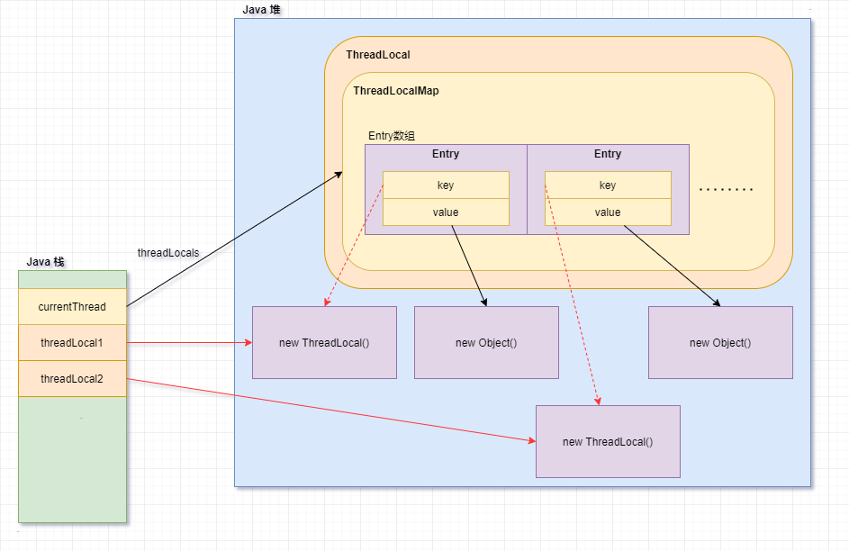

# JavaConcurrency

> 以下需要记住两个关键词的意思：**执行**是指代码运行到这一行，**调用**是指一个对象调用了一个方法。
>
> ```java
> public void test() {
>     Object o = new Object();
>     // 线程 A 执行了 o.toString() 这一行代码，主体是线程 A；
>     // Object 对象调用了 toString()方法，主体是对象 o。
>     o.toString();
> }
> ```

## 一、Java 线程

### （一）wait() 和 notify()

wait() 和 notify() 是 Object 类中提供的方法，因此所有类都拥有这两个方法。

#### 1、wait()

执行 wait()方法的线程会释放锁，并进入无限期等待状态（WAITING），直到被唤醒或被中断。

> 注意：
>
> - **是执行 wait()方法的线程会释放锁并进入等待状态，不是调用 wait()方法的锁对象**。
> - 执行 wait()方法的线程会立刻释放锁并进入等待状态，当其他线程执行对应锁对象的 notify()后，当前等待的线程才会被唤醒，重新竞争获取锁后，继续执行代码。
> - wait()方法需要写在 synchronized 代码块中，锁对象就是调用 wait()方法的对象。

#### 2、notify() / notifyAll()

调用 notify()方法时，会唤醒因为执行锁对象 wait()方法而进入等待状态的线程。

> 注意：
>
> - notify()方法会唤醒某一个该锁对象对应 ObjectMonitor 上等待线程，有可能唤醒的不是想要的线程，因此需要使用 notifyAll()唤醒所有线程。
> - 执行 notify()后，等待的线程并没有立刻执行，而是要等待当前线程执行完后释放锁，才能继续从执行 wait()处运行。
> - notify()方法需要写在 synchronized 代码块中，锁对象就是调用 notify()方法的对象。

### （二）Thread 类常用方法

Java 使用 Thread 类来表示线程，有两种方式创建线程：

- 继承 Thread 类，重写 run()方法。
- 实现 Runnable 接口，重写 run()方法，传入 Thread 有参构造中。

#### 1、setDaemon(Boolean)

是否设置当前线程为守护线程，守护线程是为主线程服务的，主线程执行完，守护线程也被停止。

> GC 就是守护线程，当 JVM 退出后，GC 也会终止。

> 注意：
>
> - 线程 start()前设置为守护线程，否则抛异常。
> - 执行 setDaemon 的线程是主线程；调用此方法的线程是守护线程。
> - 使用守护线程不要访问共享资源，因为它任何时间可能挂掉。
> - 守护线程中产生的新线程也是守护线程。

#### 2、setPriority(int)

设置线程优先级，优先级高的先执行的概率更大，而不是一定先执行。

#### 3、sleep(long)

sleep(long)是静态方法，会让执行 Thread.sleep(long)方法的线程计时等待，并且该线程不会释放同步锁，而且这期间不会阻碍其他线程继续执行，只是竞争同步锁的线程会被继续阻塞。计时结束后系统会唤醒计时等待的线程，重新竞争 CPU 资源。

#### 4、yield()

yield()是静态方法，会让执行 Thread.yield()的线程让出 CPU，进入就绪状态，重新竞争 CPU 资源。

> 有可能执行线程让出 cpu 后，又被执行自己竞争到 cpu，导致看起来没效果一样。

#### 5、join()

join()会让执行 join()的父线程 A 等待，会让调用 join()的线程 B 执行完后，再去执行父线程 A，看起来就像线程 B 加入了线程 A 一样。

```java
@Test
public void test() {
    System.out.println("主线程开启...");
    Thread thread1 = new Thread(new Plugin1());
    Thread thread2 = new Thread(new Plugin2());
    try {
        // 开始插件 1 的安装
        thread1.start();
        // 等插件 1 的安装线程结束
        // main 线程会在这里阻塞，直到 thread1 执行完毕后才会继续执行
        thread1.join();
    } catch (InterruptedException e) {
        e.printStackTrace();
    }
    System.out.println("主线程结束，程序安装完成！");
}

class Plugin1 implements Runnable {
    @Override
    public void run() {
        System.out.println("插件1开始安装.");
        System.out.println("安装中...");
        try {
            Thread.sleep(1000);
        } catch (InterruptedException e) {
            e.printStackTrace();
        }
        System.out.println("插件1完成安装.");
    }
}
```

#### 6、[interrupt()](https://stackoverflow.com/questions/3590000/what-does-java-lang-thread-interrupt-do)

interrupt()方法会将调用线程的中断标志位 InterruptStatus 设置为 true，并且中断等待状态线程并抛出 InterruptedException 异常。

> 处于等待状态的线程也会轮询 InterruptStatus 标志位。

```java
Object o = new Object();
Thread t = new Thread(() -> {
    log.info("子线程启动");
    synchronized (o) {
        try {
            log.info("子线程 wait");
            o.wait();
        } catch (InterruptedException e) {
            // InterruptedException 异常被捕获后，InterruptStatus 置为 false
            log.info("子线程中断，中断状态：{}", Thread.currentThread().isInterrupted()); // false
        }
    }
    log.info("子线程执行完成");
});
t.start();

new Scanner(System.in).nextInt();

log.info("子线程中断，中断状态：{}", t.isInterrupted()); // false
t.interrupt();
log.info("子线程中断，中断状态：{}", t.isInterrupted()); // true
```

> 注意：
>
> - interrupt()方法只有在线程启动后调用才有效。
> - interrupt()方法除了中断等待状态（WAITING 和 TIME_WAITING）的线程，不会对其他状态（正常或 BLOCKED）的线程产生任何影响。
>   - InterruptedException 异常被捕获后，会重置 InterruptStatus 为 false。
>   - 被中断的线程会变成运行态，重新竞争 CPU，运行后面的代码。

此外也提供了 interrupted() 和 isInterrupted() 方法，用于获取中断标志位 InterruptStatus 的值：

- interrupted()方法返回当前中断状态，并清除中断状态（置为 false）；
- isInterrupted()方法返回当前中断状态，不清除。

因此也可以通过这些方法用于线程间的通信：

```java
Object o = new Object();
Thread t = new Thread(() -> {
    log.info("子线程启动");

    // 被中断时则会停止运行
    while (!Thread.currentThread().isInterrupted()) {
        log.info("睡一下，做一下");
        Thread.yield();
    }

    log.info("子线程中断，中断状态：{}", Thread.currentThread().isInterrupted()); // true
    log.info("子线程执行完成");
});
t.start();


log.info("子线程中断，中断状态：{}", t.isInterrupted()); // false
try {
    Thread.sleep(500);
    t.interrupt();
} catch (InterruptedException e) {
    throw new RuntimeException(e);
}

log.info("子线程中断，中断状态：{}", t.isInterrupted()); // true
```

#### 7、[stop()](https://blog.csdn.net/chizaoku499646/article/details/100938185)

会直接让调用 stop()的线程死亡，并且会释放此线程所持有的所有锁对象。

> 注意：此方法已被 deprecate，不推荐使用这种方式结束线程。

## 二、线程安全

### （一）线程基础问题

1、使用多线程可能遇到的问题

- 线程安全问题（数据跟我们想象中运行的结果不一致）。
- 性能问题（没有把握得当，会带来严重的性能问题）。

2、保证线程安全的方法

- 无状态（没有共享变量）：只要我们保证不要在栈（方法）上发布对象，保证每个变量的作用域仅仅停留在当前的方法上，那么我们的线程就是安全的。
- 使用 final 使该共享变量不可变。
- 加锁：内置 synchronized 锁，显示 Lock 锁。
- 使用 JDK 为我们提供的类来实现线程安全：
  - atomic 包下的原子类：保证原子性。
  - volatile：保证可见性和防止指令重排序。

### （二）[Java 主流锁的分类及概念](https://tech.meituan.com/2018/11/15/java-lock.html)

锁是用来控制多个线程访问共享资源的方式，线程拿到锁才能继续执行同步代码。

- 线程要不要锁住：
  - 悲观锁
  - 乐观锁
- 竞争锁失败时，要不要阻塞线程：
  - 阻塞
  - 不阻塞：自旋锁、适应性自旋锁、CAS。
- 锁的优化：
  - 锁粗化
  - 锁消除
  - 锁升级：（原理在 JavaVirtualMachine 篇章中）
    - 无锁
    - 偏向锁
    - 轻量级锁
    - 重量级锁
- 多个线程要不要按先到先得竞争锁：
  - 公平锁
  - 非公平锁：先尝试竞争锁，竞争失败后放入同步队列中阻塞等待唤醒。
- 一个线程中的多个流程能不能重复获取同一把锁：
  - 可重入锁
  - 非可重入锁
- 多个线程能不能共享一把锁：
  - 独占锁/互斥锁/排他锁
  - 共享锁

### （三）死锁

在 Java 中使用多线程，就会有可能导致死锁问题。死锁会让程序一直卡住，不再程序往下执行。我们只能通过中止并重启的方式来让程序重新执行。

1、产生条件

- 互斥：锁是互斥锁。
- 请求和保持：线程保持手中的锁同时请求其他线程的锁。
- 不可剥夺：线程获取的锁不可以强行被剥夺。
- 循环等待：若干进程或线程形成首尾相接的循环等待的资源关系。

2、常见的死锁场景

- 锁顺序导致的死锁：上锁的时候，没有规定顺序。
- 动态锁顺序死锁：调用时参数位置不同，就可能发生死锁。
- 协作对象之间发生死锁：互相调用方法时发生死锁。

3、避免死锁的方法

- 固定加锁的顺序：得到对应的 hash 值来固定加锁的顺序。
- 开放调用(针对对象之间协作造成的死锁)：在调用某个方法时不需要持有锁，那么这种调用被称为开放调用（其实就是缩小同步的范围）。
- 使用定时锁。

4、[死锁检测](https://www.cnblogs.com/flyingeagle/articles/6853167.html)

- JconsoleJDK 自带的图形化界面工具，使用 JDK 给我们的的工具 JConsole。
- Jstack 是 JDK 自带的命令行工具，主要用于线程 Dump 分析。

### （四）synchronized

synchronized 是 Java 的关键字，可以将方法 / 代码锁起来，实现同步功能，保证线程安全。（原理在 JavaVirtualMachine 篇章中）

**特点**：

- synchronized 是一种互斥锁，一次只允许一个线程进入被锁住的代码。
- synchronized 是一种内置锁，每个对象或类的 class 对象都有称为锁的潜力。
- 具有原子性、可见性和可重入性。

**分类**：

- 类锁：以当前类的 Class 对象作为锁，一个类和一个类加载器只会生成一个类的 Class 对象。
- 对象锁：以当前调用的对象作为锁。

**用法**：

1、修饰类代码块或静态方法

synchronized 修饰静态代码块时，只有一个线程可以拥有类锁，访问被 synchronized（类锁）修饰的代码块；synchronized 修饰静态方法时，相当于该类的类锁，同时只有一个线程可以进入 synchronized 静态方法

```java
public static void exec() {
    // 被类锁修饰的代码块
    synchronized (Example.class) {
        for (int i = 0; i < 10; i++) {
            try {
                TimeUnit.MILLISECONDS.sleep(3000);
            } catch (InterruptedException ex) {
                ex.printStackTrace();
            }
            System.out.printf("%s,Hello%d\n", Thread.currentThread().getName(), i);
        }
    }
}
```

2、修饰代码块或对象方法

synchronized 修饰代码块时，多个线程同时只能有一个线程拥有对象锁，访问被 synchronized(对象锁)修饰的代码块，不同的对象没有锁竞争；synchronized 修饰方法时，相当于本身对象是一个对象锁，因此多个线程同时只有一个线程进入该对象的 synchronized 方法，不同的对象没有锁竞争。

```java
public synchronized void exec3() {
    for (int i = 0; i < 10; i++) {
        try {
            TimeUnit.MILLISECONDS.sleep(3000);
        } catch (InterruptedException ex) {
            ex.printStackTrace();
        }
        System.out.printf("%s,Hello%d\n", Thread.currentThread().getName(), i);
    }
}
```

## 三、JUC 包

java.util.concurrent 包下包含许多并发类，其中主要的接口及类如下：


- <font color="orange">Executor</font>：提供了 execute(Runnable)方法，用于执行已提交的 Runnable 任务。
  - <font color="orange">ExecutorService</font>：提供线程池生命周期管理的方法。
    - <font color="green">AbstractExecutorService</font>：提供了 ExecutorService 接口的默认实现。
      - ThreadPoolExecutor：是最基础、最常用的线程池实现。
      - ForkJoinPool：JDK7 中新增的线程池，使用[工作窃取算法](https://cloud.tencent.com/developer/article/1512982)，将大任务分成若干个小任务，之后再对这些小任务进行计算，最终汇总这些任务的结果，返回最终结果。广泛应用于 Stream 中。
    - <font color="orange">ScheduledExecutorService</font>：
      - [ScheduledThreadPoolExecutor](https://www.jianshu.com/p/925dba9f5969)：可安排在给定的延迟后运行任务或定期执行任务。
- <font color="orange">Future</font>：表示异步计算的未来结果，可以对结果和执行计算的任务进行操作。
  - <font color="orange">RunnableFuture</font>：RunnableFuture 继承了 Runnable 和 Future 接口，可以作为 Future 和 Runnable 使用。
    - FutureTask：RunnableFuture 的实现类，最常用的 Future。
  - <font color="orange">CompletableFuture</font>：JDK8 提供的新特性，可以更好地处理多个 Future 之间的处理结果。
- <font color="orange">Callable</font>：与 Runnable 接口的差别是内部为 call()方法，可以返回结果、抛异常，一般是作为参数传入 ThreadPoolExecutor.submit(Callable)中执行。

### （一）ThreadPoolExecutor

线程的创建和销毁开销大，可能比执行任务的时间还长，因此提出线程池的概念。线程池可以看做线程的集合，在没有任务时线程处于空闲状态，当请求到来时，线程池给这个请求分配一个空闲的线程，任务完成后回到线程池中等待下个任务（而不是销毁），实现的线程的重用。线程池不仅可以提高性能，也可以更好的管理线程。

```java
public static void main(String[] args) throws InterruptedException, IOException {
    int corePoolSize = 2;
    int maximumPoolSize = 4;
    long keepAliveTime = 10;
    TimeUnit unit = TimeUnit.SECONDS;
    BlockingQueue<Runnable> workQueue = new ArrayBlockingQueue<>(2);
    ThreadFactory threadFactory = new NameTreadFactory();
    RejectedExecutionHandler handler = new MyIgnorePolicy();

    ThreadPoolExecutor executor = new ThreadPoolExecutor(corePoolSize, maximumPoolSize, keepAliveTime, unit,
                                                         workQueue, threadFactory, handler);
    executor.prestartAllCoreThreads(); // 预启动所有核心线程

    for (int i = 1; i <= 10; i++) {
        MyTask task = new MyTask(String.valueOf(i));
        executor.execute(task);
    }
    // 关闭
    executor.shutdown();
}

// 自定义 ThreadFactory
static class NameTreadFactory implements ThreadFactory {

    private final AtomicInteger mThreadNum = new AtomicInteger(1);

    @Override
    public Thread newThread(Runnable r) {
        Thread t = new Thread(r, "my-thread-" + mThreadNum.getAndIncrement());
        System.out.println(t.getName() + " has been created");
        return t;
    }
}

// 自定义拒绝策略
public static class MyIgnorePolicy implements RejectedExecutionHandler {

    public void rejectedExecution(Runnable r, ThreadPoolExecutor e) {
        doLog(r, e);
    }

    private void doLog(Runnable r, ThreadPoolExecutor e) {
        // 可做日志记录等
        System.err.println(r.toString() + " rejected");
    }
}

// 自定义 Runnable 任务
static class MyTask implements Runnable {
    private String name;

    public MyTask(String name) {
        this.name = name;
    }

    @Override
    public void run() {
        try {
            System.out.println(this.toString() + " is running!");
            Thread.sleep(3000); // 让任务执行慢点
        } catch (InterruptedException e) {
            e.printStackTrace();
        }
    }

    public String getName() {
        return name;
    }

    @Override
    public String toString() {
        return "MyTask [name=" + name + "]";
    }
}
```

#### 1、基础属性

推荐使用线程池创建线程去处理并发任务，ThreadPoolExecutor 线程池核心属性如下：


- corePoolSize：核心线程池大小，规定常驻在线程池的线程数量。
- maximumPoolSize：最大线程池大小，任务队列满时，允许线程池创建的最大线程数。
- keepAliveTime：空闲线程存活时间，只有在线程数大于 corePoolSize 时，**多余的空闲线程**超过 keepAliveTime，会自动销毁。
- unit：keepAliveTime 的时间单位。
- workQueue：任务队列，用于存放被添加到线程池中，但尚未被执行的任务。
- threadFactory：线程工厂，线程池中通过 threadFactory 创建线程。默认值为 Executors.DefaultThreadFactory，创建的线程属于同一线程组，优先级相同，非守护线程。
- handler：任务解决策略。当线程池达到最大线程数，并且阻塞队列也满了，线程池无法处理新的任务时，会执行解决策略。默认值为 AbortPolicy。

#### 2、[执行机制](https://tech.meituan.com/2020/04/02/java-pooling-pratice-in-meituan.html)

任务和线程之间的执行关系：

##### （1）[运行状态](https://blog.51cto.com/yeatsliao/5878520)

线程池的运行状态如下：


- RUNNING：能接受处理新的任务，并且也能处理阻塞队列中的任务。
- SHUTDOWN：线程池调用 shutdown()方法，shutdown()方法中执行 advanceRunState(SHUTDOWN)和 interruptIdleWorkers()方法。
  - advanceRunState(SHUTDOWN)方法会将线程池状态设置为 SHUTDOWN，此时线程池不会接受新的任务（在 execute()中表现为直接执行拒绝策略），但是会继续处理阻塞队列中的任务。
  - interruptIdleWorkers()方法会中断所有空闲的（被阻塞队列阻塞的）Workers。
- STOP：线程池调用 shutdownNow()方法，shutdownNow()方法中执行 advanceRunState(STOP)和 interruptIdleWorkers()方法。
  - advanceRunState(STOP)会将线程池状态设置为 STOP，此时线程池不会接受新的任务，也不会继续处理阻塞队列中的任务（在 getTask()中表现为直接返回 null）。
- TIDYING：shutdown()和 shutdownNow()中最后都会执行 tryTerminate()方法，将线程池状态设置为 TIDYING，并中断所有空闲的 Workers。
- TERMINATED：tryTerminate()最后会执行 terminated()方法，并将线程池状态设置为 TERMINATED。用户可以重写 terminated()用于在线程池完全关闭前（此时线程池中已没有线程），实现自己的业务逻辑。

##### （2）任务缓冲

在线程数到达核心线程数时（workCount >= corePoolSize），会将新到来的任务放入阻塞队列中，阻塞队列分为以下几种：

- 直接提交队列：SynchronousQueue
- 有界任务队列：LinkedBlockingQueue、LinkedBlockingDeque、ArrayBlockingQueue
- 无界任务队列：LinkedTransferQueue
- 优先任务队列：PriorityBlockingQueue

##### （3）任务拒绝

当**阻塞队列已满并且线程池中的数量达到 maximumPoolSize**，或**线程池状态为 SHUTDOWN、STOP、TIDYING 和 TERMINATED**时，线程池会采取任务拒绝策略去处理新到达的任务，<font color="orange">RejectedExecutionHandler</font> 分为以下几种：

- AbortPolicy：丢弃此任务并抛出 RejectExecutionExcrption 异常。
- DiscardPolicy：丢弃任务但不抛出异常。
- DiscardOldestPolicy：丢弃阻塞队列中最老的任务，然后重新提交被拒绝的任务。
- CallerRunsPolicy：由提交任务的线程去执行该任务。
  - 例如：线程 1 去执行 `threadPoolExecutor.executor(runnable)`，采用此拒绝策略后，会由线程 1 本身去执行此任务。
- 也可以自己实现 `RejectedExecutionHandler.rejectedExecution()`。

#### 3、[原理](https://www.jianshu.com/p/87bff5cc8d8c)

##### （1）execute()方法

ThreadPoolExecutor 调用 execute()方法，内部执行流程：

1. 运行线程数称为 workerCount，如果 `workerCount < corePoolSize`，则执行 addWorker(command, true)方法创建新线程处理任务；否则，则直接将任务放入阻塞队列中。
1. 若阻塞队列满了时，执行 addWorker(command, false)方法创建新线程处理任务。
1. 若阻塞队列和线程池都满了时，则会执行 reject(command)方法进行任务拒绝。

> 注意：很多地方都把线程池的线程分为核心线程和非核心线程，这只是方便我们理解，在线程池看来两者（都是 Worker）都一样，只是**最后存活并常驻**在线程池的线程通常称为核心线程。

##### （2）addWorker()

可以知道 execute()的核心功能是由 addWorker 实现的，先了解 ThreadPoolExecutor.Worker 类的结构：

- 继承抽象类 AbstractQueuedSynchronizer，可以方便的实现工作线程的中止操作。
- 实现了 Runnable 接口。
- 内部持有 Thread thread 属性，由 ThreadFactory 创建，可以将 Worker 看成一个线程，可以去单独执行任务。
- 内部持有 Runnable firstTask 属性，存储并执行初次传入的任务。

> 注意：继承 AQS 是使用公平锁，runWorker()执行任务时上锁。

继续深入看 addWorker()方法：

1. 活动线程数 +1，创建 Worker 工作线程，初始化 thread 和 firstTask。将 Worker 加入 HashSet 中，使用 HashSet 管理所有的 Worker。
2. 完成上面的操作后再启动 Worker 线程，执行 runWorker()方法。
   1. 启动 Worker 中的 thread 线程，先执行初次传入的 firstTask，再从阻塞队列中循环执行 getTask()方法自旋地获取任务。
   2. ThreadPoolExecutor 提供 beforeExecutor(..) 和 afterExecutor(..)，可以进行重写，分别在执行任务前和执行任务后实现自己的业务逻辑。
   3. 当获取不到任务时（返回 null），则会执行 processWorkerExit()方法将当前 Worker 从 HashSet 中移除。
3. 若上面执行失败，则会执行 addWorkerFailed()方法，尝试从 HashSet 移除 Worker，活动线程数-1。

##### （3）[getTask()](https://developer.aliyun.com/article/840715)

getTask()方法功能是从阻塞队列中获取任务，也有以下作用：

方法.png>)

1. 当前线程池状态至少为 SHUTDOWN 且阻塞队列为空，或状态至少为 STOP 时，将 Worker 工作线程数-1，返回 null，执行上面 addWorker()中的 2.3。
2. 当工作线程数大于 maximumPoolSize，或工作线程已超时且阻塞队列为空时，将 Worker 工作线程数-1，返回 null，执行上面 addWorker()中的 2.3。
   - 这里保证了 `workerCount >= corePoolSize` 时，空闲线程会被回收。
3. 这里是真正的从阻塞队列中获取任务，当 `workerCount < corePoolSize` 时，Worker 会执行 `workQueue.take()` 获取任务，没有任务时则会无限等待，也就是我们说的核心线程常驻在线程池；否则，会执行 `workQueue.poll(keepAliveTime, TimeUtil)` 获取任务，没有任务时则会计时等待，超时后会将 timedOut 置为 true，下轮循环在步骤 2 中返回 null。

##### （4）submit()方法

submit()方法会将 Runnable 或 Callable 封装成 FutureTask，返回 Future。

### （二）[Future](https://www.jianshu.com/p/5b2f4575fcc4)

Future 表示的是异步计算的结果，提供了查看任务是否完成，取消任务，获取结果等方法。

1、[FutureTask](https://zhuanlan.zhihu.com/p/54459770)

实现了 <font color="orange">RunnableFuture</font> 接口，实现 get()、isCancelled()、isDone()等方法，构造方法允许传入 Callable（`FutureTask(Callable<V> callable)`）或 Runnable 加返回值（FutureTask(Runnable runnable, V result)），执行完毕后，通过 futureTask.get()获取值。

```java
Instant start = Instant.now();
FutureTask<Integer> futureTask1 = new FutureTask<>(() -> {
    Thread.sleep(3000);
    return 5;
});

FutureTask<Integer> futureTask2 = new FutureTask<>(() -> {
    Thread.sleep(2000);
    return 3;
});

// 线程开启
new Thread(futureTask1).start();
new Thread(futureTask2).start();

try {
    // 获取 future 返回值，这里会阻塞 main 线程，会等待任务执行完
    int futureResult1 = futureTask1.get();
    int futureResult2 = futureTask2.get();
    log.info("结果：{}，用时：{}s", futureResult1 - futureResult2,
             Duration.between(start, Instant.now()).get(ChronoUnit.SECONDS)); // 结果：2，用时：3s
} catch (InterruptedException e) {
    e.printStackTrace();
} catch (ExecutionException e) {
    e.printStackTrace();
}
```

原理：

1. FutureTask 内部维护一个 state 字段，表示当前所处的状态（NEW、COMPLETING、NORMAL 等），初始化状态为 NEW；维护一个 waitNode 字段，是一个 Thread 类型的单链表，所有被 FutureTask 阻塞的线程都会被放入此单链表。
2. FutureTask 会作为一个 Runnable 任务执行其中的 run()方法。
3. 当其他线程去执行 `futureTask.get()` 时，若 FutureTask 任务还没有执行完（NEW 或 COMPLETING 状态），则将此线程放入 waitNode 链表中等待；当执行完 FutureTask 任务时（或抛异常时），才会将 state 置为 NORMAL，设置返回值并唤醒所有被阻塞的线程。

### （三）CompletableFuture

虽然 Future 提供了异步计算的能力，但是遇到多个 Future 时，难以编写这些 Future 之间的计算关系，于是便有了 CompletableFuture。

CompletableFuture 是 Java8 中的新特性，实现 <font color="orange">CompletionStage</font> 和 <font color="orange">Future</font> 接口，提供多个异步之间的处理结果，并且可以传入回调函数。作用：

- 可以串行或并行地执行多个异步任务，将多个异步计算的结果合并为一个。
  - 和前端 Promise 的用法有点类似。
- 等待所有异步任务都完成。
  - 只要还是 CompletableFuture，不调用 get() / join()方法，就不会阻塞执行 `completableFuture.join()` 代码的线程。
- 可以添加异步任务完成事件 (即，任务完成以后触发执行动作)。

[使用方式](https://colobu.com/2016/02/29/Java-CompletableFuture/)如下：

#### 1、创建 CompletableFuture

CompletableFuture 提供 runAsync、supplyAsync、completedFuture 静态方法用于创建 CompletableFuture 对象。

- completedFuture：直接传入参数，返回值为 `CompletableFuture<U>`，相当于将一个普通的值转换为 CompletableFuture。
- runnAsync：传入一个 Runnable，返回值为 `CompletableFuture<Void>`，意味着只执行其中的 run()方法，CompletableFuture 中附带的结果为 null。
- supplyAsync：传入一个 Supplier 函数，返回值为 `CompletableFuture<U>`，CompletableFuture 中附带的结果为 Supplier 函数的返回值。

```java
CompletableFuture<String> f1 = CompletableFuture.completedFuture("hello");
System.out.println(f1.join()); // hello

CompletableFuture<Void> f2 = CompletableFuture.runAsync(() -> {
    System.out.println("runAsync method");
});
System.out.println(f2.join()); // null

CompletableFuture<String> f3 = CompletableFuture.supplyAsync(() -> {
    System.out.println("runAsync method");
    return "hello";
});
System.out.println(f3.join()); // hello
```

#### 2、[join() 和 get()](https://www.cnblogs.com/july-sunny/p/12706473.html)

join() 和 get()方法都可以从 CompletableFuture 中获取值，会阻塞执行 `completableFuture.get() / completableFuture.join()` 的线程。有以下区别：

- join()方法不会显式地抛出异常（uncheck 异常），当程序内部发生故障时才会抛出异常，也可以放在 try-catch 中，异常为 CompletionException。
- get()方法会显式地抛出异常（checked 异常），需要放在 try-catch 中，异常为 ExecutionException、InterruptedException。

#### 3、complete()

若 CompletableFuture 还没有返回结果，使用 complete()不会继续等待异步结果，而是唤醒被 get()或 join()阻塞的线程，以传给 complete()的参数值作为 get()或 join()结果返回。

> 例如：例如：当超过一定时间时，异步还没有获取结果，但是必须立马返回指定值时，可以使用 complete()。

#### 4、action

通常把 CompletableFuture 中已 when、handler、then 开头的方法称为 action，当 CompletableFuture 的异步执行完成或抛出异常时，会去执行注册好的 action 动作。


action 有以下特点：

（1）可以链式执行，若是链式的 action，正常情况下，需要等待上一个 action 执行完，才能执行当前的 action。

（2）方法名中是否以 async 结尾的 action 的区别：

- **以 async 结尾**的 action 会使用线程池中的线程执行任务，不自定义线程池时，默认值为 `ForkJoinPool.commonPool()`。

  > [注意](https://my.oschina.net/u/4389636/blog/4338290)：由于 CompletableFuture 中 ForkJoinFool 线程池创建的线程是守护线程，当所有非守护线程关闭时，JVM 也会退出，导致非守护线程中断执行。

- **不以 async 结尾**的 action，正常情况下和上一个 CompletableFuture 使用的是同一个线程。

（3）[complete()方法](https://blog.csdn.net/leon_wzm/article/details/80560081)

下面的结论仅针对不以 async 结尾的 action 生效：若在 complete()执行前将 action 注册到 CompleteFuture 中（也就是将 action 添加到执行链中），则使用 complete()方法所在的线程执行这些 action；否则，使用注册 action 时所在的线程执行这些 action。

```java
CompletableFuture<Integer> f = new CompletableFuture<Integer>();

new Thread(() -> {
    // 子线程A启动
    log.info("子线程A启动");
    try {
        log.info("子线程A沉睡5s");
        Thread.sleep(5000l);
    } catch (InterruptedException e) {
        e.printStackTrace();
    }
    log.info("子线程A令future完成");
    f.complete(100);  // 当子线程A执行到f.complete的时候，会去看是否有注册好的f的then或者when（非async的），如果有的话，会顺次去执行。
    log.info("子线程A结束");
}).start();;


// 当前线程（主线程）执行到这里的时候，如果子线程还没有执行到f.complete(100)，
// 那么当前线程会把whenComplete事件注册起来，并且说好哪个线程执行了f.complete(100)，
// 哪个线程就负责执行whenComplete的内容。
// 如果当前线程（主线程）执行到这里的时候，f.complete(100)已经被其他线程执行完毕了。
// 那么只有当前线程自己来执行whenComplete里面的内容了。
f.whenComplete((i, ex) -> {
    // 这个场景下，whenComplete的回调的执行线程会是子线程A
    log.info("do something after complete begin");
    try {
        log.info("沉睡10s");
        Thread.sleep(10000l);
    } catch (InterruptedException e) {
        e.printStackTrace();
    }
    log.info("do something after complete end");
});


log.info("main over");
System.in.read();
```

#### 5、[原理](https://www.jianshu.com/p/abfa29c01e1d)

### （四）[LockSupport](https://pdai.tech/md/java/thread/java-thread-x-lock-LockSupport.html#object-wait-%E5%92%8Clocksupport-park-%E7%9A%84%E5%8C%BA%E5%88%AB)

LockSupport 是一个线程阻塞工具类，所有方法都是静态方法，提供 park / unpark 方法用于阻塞和唤醒线程。

```java
public static void main(String[] args) {
    MyThread myThread = new MyThread(Thread.currentThread());
    myThread.start();
    System.out.println("before park");
    // 可以向 LockSupport 传入参数，并阻塞当前线程
    LockSupport.park("ParkAndUnparkDemo");
    System.out.println("after park");
}

static class MyThread extends Thread {
    private final Object object;

    public MyThread(Object object) {
        this.object = object;
    }

    public void run() {
        System.out.println("before unpark");
        try {
            Thread.sleep(1000);
        } catch (InterruptedException e) {
            e.printStackTrace();
        }
        // 获取线程存储的 bloker 参数
        System.out.println("Blocker info " + LockSupport.getBlocker((Thread) object));
        // 唤醒线程
        LockSupport.unpark((Thread) object);
        // 休眠500ms，保证先执行park中的 setBlocker(t, null);
        try {
            Thread.sleep(500);
        } catch (InterruptedException e) {
            e.printStackTrace();
        }
        // 再次获取 blocker
        System.out.println("Blocker info " + LockSupport.getBlocker((Thread) object));
        System.out.println("after unpark");
    }
}
```

LockSupport 底层使用 **Unsafe** 类中的本地方法来实现阻塞和唤醒的功能，其中有部分方法需要注意：

1、park 方法

park 用于阻塞当前执行的线程，park 有几个重载的方法：park()方法表示无限期等待；park(object)方法可以向内存中存储线程相关的数据并阻塞线程，通过 getBloker(thread)方法获取指定线程的数据；parkNanos / parkUtil 让线程进入计时等待状态。

> 注意：**park 方法不需要获取锁，不会抛出 InterruptedException 异常**，因此需要自己通过 `Thread.currentThread().isInterrupted()` 判断当前线程是否被中断了。

2、unpark 方法

unpark 用于唤醒指定的、被阻塞的线程。

> 注意：若 unpark 在 park 之后执行，可以唤醒被阻塞的线程；若在 park 之前执行，可以保证线程下一次执行 park 时不会被阻塞。

### （五）[CountDownLatch](https://www.cnblogs.com/dolphin0520/p/3920397.html)

CountDownLatch 通过有参构造函数传入一个正整数 count，count 大于 0 时，线程执行 `countDownLatch.await()` 时会阻塞当前线程；当其他线程执行一次 `countDownLatch.count()` 时，count 便会减 1，直到为 0 时，被阻塞的线程才会被唤醒继续执行。

```java
static final int COUNT = 5;

static final CountDownLatch LATCH = new CountDownLatch(COUNT);

public static void main(String[] args) {
    for (int i = 0; i < COUNT; i++) {
        new Thread(() -> {
            System.out.println("线程启动，等待3秒");
            try {
                Thread.sleep(3000);
            } catch (InterruptedException e) {
                e.printStackTrace();
            }
            // 调用一次，COUNT 减 1
            LATCH.countDown();
            System.out.println("线程执行完毕");
        }).start();
    }

    System.out.println("主线程等待");
    // COUNT 为 0 时，才会唤醒被阻塞的线程
    try {
        LATCH.await();
    } catch (InterruptedException e) {
        e.printStackTrace();
    }
    System.out.println("主线程继续执行");
}
```

### （六）CyclicBarrier

CyclicBarrier 通过有参构造传入一个正整数 count，当某个线程执行到 `cyclicBarrier.await()` 屏障时，会阻塞等待；当其他 count -1 个线程也执行到 `cyclicBarrier.await()` 时，所有线程才会继续执行之后的代码。

```java
private static final int COUNT = 5;
private static final CyclicBarrier BARRIER = new CyclicBarrier(COUNT);

public static void main(String[] args) {
    for (int i = 0; i < COUNT; i++) {
        try {
            Thread.sleep(i * 1000);
        } catch (InterruptedException e) {
            e.printStackTrace();
        }
        new Thread(() -> {
            System.out.println("线程启动");
            try {
                Thread.sleep(3000);
                System.out.println("线程" + Thread.currentThread().getName() + "写入数据完毕，等待其他线程写入完毕");
                BARRIER.await(1, TimeUnit.SECONDS);
            } catch (InterruptedException | BrokenBarrierException | TimeoutException e) {
                e.printStackTrace();
            }
            System.out.println("所有线程写入完毕，继续处理其他任务...");
        }).start();
    }
}
```

其中提供 await(timeout, TimeUnit)重载方法，作用是当有线程到达 `cyclicBarrier.await(...)` ，而其他线程没有在规定时间内到达屏障点，则会抛出 TimeoutException 异常，同时会导致 CyclicBarrier 屏障被打破。后续其他线程执行 `cyclicBarrier.await(...)` 时，会直接抛 BrokenBarrierException 异常。可以通过 `cyclicBarrier.reset()` 重置 CyclicBarrier 屏障，让屏障重新生效。

和 CountDownLatch 的区别：

- CountDownLatch
  - CountDownLatch 通过 `countDownLatch.await()` 阻塞当前线程，由其他线程执行 `countDownLatch.countDown()` 让 count 减为 0 时，唤醒所有被阻塞的线程。
  - CountDownLatch 只会生效一次，也就是 `countDownLatch.countDown()` 将 count 减为 0 时，后续再使用 `countDownLatch.await()` 也不会起阻塞作用了。
- CyclicBarrier
  - CyclicBarrier 通过 `cyclicBarrier.await()` 阻塞当前线程，在 count 个线程都到达屏障点前，这些线程都会被阻塞，直到所有线程都到达屏障点，才会唤醒所有被阻塞的线程。
  - CyclicBarrier 会在所有线程到达屏障点后，重置屏障，也就是说 `cyclicBarrier.await()` 重新生效了。

### （七）[Semaphore](https://mp.weixin.qq.com/s?__biz=MzI4Njg5MDA5NA==&mid=2247484296&idx=1&sn=6bc82072500dda2798f567f1442f25ab&chksm=ebd74289dca0cb9fece89bedeede895b6058c46289b05b918ef5115b3204fbef2e38ac47d7b3&scene=21###wechat_redirect)

Semaphore 通过有参构造传入一个正整数 count，可以用来控制同时访问的线程个数。使用 `semaphore.acquire()` 消耗信号量 count，当 count 为 0 时，其他线程再通过 `semaphore.acquire()` 获取信号量时会被阻塞；使用 `semaphore.release()` 释放信号量，唤醒阻塞的线程竞争信号量。

```java
private static final int COUNT = 5;

private static final Semaphore SEMAPHORE = new Semaphore(COUNT);

public static void main(String[] args) {
    for (int i = 0; i < COUNT * 2; i++) {
        new Thread(() -> {
            try {
                // 需要获取信号量才能执行下一步，消耗一个信号量
                SEMAPHORE.acquire();
                System.out.println(Thread.currentThread().getName() + "线程启动");
                Thread.sleep(3000);
                System.out.println(Thread.currentThread().getName() + "线程执行完毕");
                // 释放信号量
                SEMAPHORE.release();
            } catch (InterruptedException e) {
                e.printStackTrace();
            }
        }).start();
    }
}
```

### （八）[<font color="green">AbstractQueuedSynchronizer</font>](https://blog.csdn.net/javazejian/article/details/75043422)

AbstractQueueSynchronizer（以下简称 AQS）是 JUC 包下的一个抽象类，是一个可以用来实现获取锁 / 释放锁的一个并发框架，其中获取锁（以 tryAcquire 开头的方法）和释放锁（以 tryRelease 开头的方法）并没有提供默认实现，需要子类重写这两个方法实现具体逻辑。

**其中有几个部件：**

（1）state

state 代表同步状态，可以理解为锁。当 state 为 0 时，所有线程都可以通过 CAS 去修改 state 值，如果修改成功，则代表此线程获取该锁；否则，进入同步队列。当 state 不为 0 时，会判断是否是当前线程拥有此锁，如果是，则将 state 加 1（具有可重入性）；否则，进入同步队列。

（2）Node

AQS 中维护一个 Node 类型的**同步队列**（Node 是 AQS 的一个内部类），其中分别有 head 和 tail 属性指向队头和队尾，结构如下：


**主要属性：**

- 是否独占：
  - `static final Node SHARED = new Node()` 表示当前 Node 是共享模式。
  - `static final Node EXCLUSIVE = null` 表示当前 Node 是独占模式。
- waitStatus：当前 Node 的状态，为 0 表示初始状态，其余值如下：
  - `static final int CANCELLED = 1` 为结束状态。例如：当执行 `reentrantLock.lockInterruptibly()` 方法时，线程突然被中断，AQS 会将此 Node 置为 CANCELLED 状态并将该节点从同步队列中移除。
  - `static final int SIGNAL = -1` 为信号状态。当节点 acquire 获取锁失败时，为了防止竞争，会将前一个节点的状态置为 SIGNAL，然后 park 阻塞当前节点上的线程；前一个节点 release 释放锁时，会判断是否是 SIGNAL 状态，如果是，则唤醒后继节点。
  - `static final int CONDITION = -2` 为条件状态，表示 Node 处于条件队列中。当线程执行 `conditionObject.await()` 时，会将当前线程封装为 Node 放入条件队列。
  - `static final int PROPAGATE = -3` 为传播状态，与共享模式相关，在共享模式中，该状态标识结点的线程处于可运行状态。
- prev / next：在同步队列中表示当前 Node 的上一个或下一个节点。
- nextWaiter：在条件队列中表示当前 Node 的下一个节点。
- thread：节点上的线程。

#### 1、ReentrantLock

ReentrantLock 就是基于 AQS 实现获取锁 / 释放锁的功能，结构如下：


其中可以看出 ReentrantLock 中包含 FairSync 和 NonfairSync 两个内部类，分别用于实现公平锁和非公平锁。其中释放锁的操作由 Sync 内部类实现，获取锁的操作分别由 FairSync 和 NonfairSync 实现。

NonfairSync 中的 lock 和 unlock 的执行流程：


FariSync 实现了公平锁的功能，也就是锁先到先得，和 NonfairSync 最主要的区别是 tryAcquire 中有个 hasQueuedPredecessors()方法，其作用是：判断是否存在同步队列，如果存在，则再判断当前线程在同步队列中并且是 head 的后驱节点；否则，获取锁失败。

方法.png>)

#### 2、ConditionObject

ConditionObject 是 AQS 中的内部类，用于实现 Object 中的 wait / notify 功能。

**两者的异同：**

- Object 的 wait / notify：
  - 使用前需要获取 object 锁。
  - 一个 ObjectMonitor 上只存在一个 waitSet 阻塞队列。
- ConditionObject 的 await / signal：
  - 使用前需要获取 reentrantLock 锁。
  - 一个 ReentrantLock 上可以存在多个 ConditionObject 条件队列。

ConditionObject 中维护了一个 Node 类型的**条件队列**，其中分别有 firstWaiter 和 lastWaiter 指向队头和队尾，结构如下：


从上面的结构可以看出条件队列和同步队列都是 Node 类型，只是结构不一样，使用的 Node 中的字段也不一样。

ConditionObject 中 await 和 signal 的执行流程：


signal()方法中，将条件队列中的 Node 添加到同步队列中的过程：


#### 3、[ReentrantReadWriteLock](https://javadoop.com/post/reentrant-read-write-lock)

ReentrantReadWriteLock 也是基于 AQS 实现获取锁 / 释放锁的功能，和 ReentrantLock 不同的是，ReentrantReadWriteLock 不仅提供了独占锁（WriteLock）功能，还提供了共享锁（ReadLock）功能。

> 注意：读写锁也分为公平模式和非公平模式

```java
private static final ReentrantReadWriteLock READ_WRITE_LOCK = new ReentrantReadWriteLock();

public static void main(String[] args) {
    Thread t1 = new Thread(() -> {
        READ_WRITE_LOCK.writeLock().lock();
        System.out.println("线程1获取写锁");
        try {
            Thread.sleep(3000);
        } catch (InterruptedException e) {
            e.printStackTrace();
        }
        READ_WRITE_LOCK.writeLock().unlock();
        System.out.println("线程1释放写锁");
    });

    Thread t2 = new Thread(() -> {
        READ_WRITE_LOCK.readLock().lock();
        System.out.println("线程2获取读锁");
        READ_WRITE_LOCK.readLock().unlock();
        System.out.println("线程2释放读锁");
    });

    t1.start();
    t2.start();
}
```

[读写锁的升降级](https://blog.csdn.net/yuhongye111/article/details/39055531)：

（1）同一个线程中，没有释放读锁的情况下就申请写锁，称为**锁升级**，会产生死锁。

```java
void upgrade() {
    ReentrantReadWriteLock readWriteLock = new ReentrantReadWriteLock();
    readWriteLock.readLock().lock();
    System.out.println("获取读锁"); // 线程阻塞，死锁
    readWriteLock.writeLock().lock();
    System.out.println("获取写锁");
}
```

（2）同一个线程中，没有释放写锁的情况下就申请读锁，称为**锁降级**。

```java
void readWriteLock() {
    final ReadWriteLock readWriteLock = new ReentrantReadWriteLock();
    Thread wt = new Thread(() -> {
        readWriteLock.writeLock().lock();
        System.out.println("writeLock");

        readWriteLock.readLock().lock();
        System.out.println("readLock");

        readWriteLock.readLock().unlock();
        try {
            System.out.println("block");
            Thread.sleep(5000);
            readWriteLock.writeLock().unlock();
        } catch (Exception e) {
            e.printStackTrace();
        }
    });

    wt.start();

    try {
        Thread.sleep(1000);
    } catch (InterruptedException e) {
        e.printStackTrace();
    }

    readWriteLock.readLock().lock(); // 写锁未被释放，主线程阻塞
    System.out.println("main thread get writelock");
}
```

**源码分析**：

- 线程获取写锁时，若读锁 / 写锁空闲或写锁被当前线程占用，则直接获取写锁；否则，线程进入同步队列阻塞等待。
  - 若此时当前线程已获取读锁，则当前线程也会进入同步队列阻塞等待，因此发生死锁。
- 线程获取读锁时，若写锁空闲或被当前线程占用，则直接获取读锁；否则，线程进入同步队列阻塞等待。

### （九）[atomic 包](https://mp.weixin.qq.com/s?__biz=MzI4Njg5MDA5NA==&mid=2247484416&idx=1&sn=540c0714263f8ee8b80ba90535162657&chksm=ebd74501dca0cc179e66c34cf3fa647f18860c670b47b0612fac0cb2c26b6cb17ad6824f0808&token=465096859&lang=zh_CN###rd)

传统在多线程环境下操作共享变量，可能会造成线程安全问题，因此会为共享变量操作的代码添加锁，进行同步操作：

```java
public static void main(String[] args) throws InterruptedException {
    ExecutorService service = Executors.newCachedThreadPool();

    Count count = new Count();
    // 100个线程对共享变量进行加1
    for (int i = 0; i < 100; i++) {
        service.execute(() -> count.increase());
    }

    // 等待上述的线程执行完
    service.shutdown();
    service.awaitTermination(1, TimeUnit.DAYS);

    System.out.println(count.getCount());
}

static class Count{
    // 共享变量
    private Integer count = 0;
    public Integer getCount() {
        return count;
    }
    // 加锁，进行同步操作
    public synchronized void increase() {
        count++;
    }
}
```

然而对于简单的操作加锁会影响系统性能，因此 JDK 5 开始引入 atomic 包，atomic 包位于 JUC 包下，其中的 Atomic 类提供原子性操作。Atomic 类提供的操作大同小异，基本都是 Unsafe 类中的 CAS 操作实现。

#### 1、[Unsafe](https://tech.meituan.com/2019/02/14/talk-about-java-magic-class-unsafe.html)

Unsafe 是位于 sun.misc 包下的一个类，主要提供一些用于执行低级别、不安全操作的方法，如直接访问系统内存资源、自主管理内存资源等，这些方法在提升 Java 运行效率、增强 Java 语言底层资源操作能力方面起到了很大的作用。

#### 2、CAS

CAS（Compare And Swap， 比较并交换），是原子操作的一种，可以让线程不阻塞的情况下进行线程安全地操作。该操作通过将内存中的值与预期值进行比较，当数值一样时将内存中的数据替换为要修改的新值。

CAS 有 3 个操作数：

- 内存值 V
- 旧的预期值 A
- 要修改的新值 B

当多个线程尝试使用 CAS 并发修改同一个变量时，只有其中一个线程能修改成功（内存值 V 和预期值 A 相同时，将内存值 V 修改为 B），而其他线程修改失败。修改失败的线程在失败后可以进行自旋操作，这就是 Unsafe 类中的 CAS 操作原理。

（1）ABA 问题

CAS 有个缺点就是 ABA 问题，例如：

- 现在有 3 个线程 A、B、C 同时修改变量 `count = 10`。
- 线程 A 和线程 C 同时读到 count 变量，所以线程 A 和线程 C 的内存值和预期值都为 10。
  - 此时线程 A 使用 CAS 将 count 值修改成 100。
- 修改完后，就在这时，线程 B 进来了，读取得到 count 的值为 100(内存值和预期值都是 100)，将 count 值修改成 10。
- 线程 C 拿到执行权，发现内存值是 10，预期值也是 10，将 count 值修改成 11。

上面的操作都可以正常执行完的，这样会发生什么问题呢？？线程 C 无法得知线程 A 和线程 B 修改过的 count 值，这样是有**风险**的。

（2）解决 ABA 问题

为变量添加一个版本号，每次 CAS 的时候都会比较版本号，操作成功后还要将版本号自增，这样就避免了 ABA 的问题。

#### 3、Atomit 类分类

（1）基本数据类型：AtomicBoolean、AtomicInteger、AtomicLong。

```java
public static AtomicInteger num = new AtomicInteger(0);

public static void increase() {
    num.incrementAndGet();
}

private static final int THREAD_COUNT = 30;

public static void main(String[] args) {
    for (int i = 0; i < THREAD_COUNT; i++) {
        new Thread(() -> {
            for (int j = 0; j < 1000; j++) {
                increase();
            }
        }).start();
    }

    while (Thread.activeCount() > 2) {
        Thread.yield();
    }
    System.out.println(num);
}
```

（2）引用类型：AtomicReference、AtomicStampedReference、AtomicMarkableReference。

（3）数组类型：AtomicIntegerArray、AtomicLongArray、AtomicReferenceArray。

（4）对象的属性：AtomicIntegerFieldUpdater、AtomicLongFieldUpdater、AtomicReferenceFieldUpdater，也就是为指定类的指定属性添加原子操作。

```java
@Test
void fieldUpdater() {
    AtomicIntegerFieldUpdater<Demo26_Atomic> updater1 = AtomicIntegerFieldUpdater.newUpdater(Demo26_Atomic.class, "outerIntVal");
    updater1.compareAndSet(this, 0, 1);
    System.out.println(updater1.get(this));

    AtomicIntegerFieldUpdater<TestClass> updater2 = AtomicIntegerFieldUpdater.newUpdater(TestClass.class, "innerIntVal");
    TestClass testClass = new TestClass();
    updater2.compareAndSet(testClass, 0, 1);
    System.out.println(updater2.get(testClass));
}

// 需要被 volatile 修饰
// private int outerIntVal;
private volatile int outerIntVal;

static class TestClass {
    // 需要能被访问到
    // private volatile int innerIntVal;
    volatile int innerIntVal
}
```

> 注意：访问的属性需要被 volatile 修饰，否则抛 IllegalArgumentException 异常；访问的属性需要有访问权限，否则抛 IllegalAccessException 异常。

（5）解决 ABA 问题：AtomicStampedReference、AtomicMarkableReference。

## 四、其他

### （一）ThreadLocal

ThreadLocal 可以为每个线程单独存储属于自己的变量，此变量可以在当前线程任意位置使用，但是不与其他线程共享。

> 注意：ThreadLocal 设计的目的是为了能够在当前线程中有属于自己的变量，并不是为了解决并发或者共享变量的问题。

```java
private static final ThreadLocal<Object> threadLocal = new ThreadLocal<Object>() {
    /**
     * ThreadLocal没有被当前线程赋值时或当前线程刚调用remove方法后调用get方法，返回此方法值
     */
    @Override
    protected Object initialValue() {
        System.out.println("调用get方法时，当前线程共享变量没有设置，调用initialValue获取默认值！");
        return null;
    }
};

public static void main(String[] args) {
    new Thread(new MyIntegerTask("IntegerTask1")).start();
    new Thread(new MyIntegerTask("IntegerTask2")).start();
}

public static class MyIntegerTask implements Runnable {
    private String name;

    MyIntegerTask(String name) {
        this.name = name;
    }

    @Override
    public void run() {
        for (int i = 0; i < 2; i++) {
            // ThreadLocal.get方法获取线程变量
            if (null == Demo31_ThreadLocal.threadLocal.get()) {
                // ThreadLocal.et方法设置线程变量
                Demo31_ThreadLocal.threadLocal.set(0);
                System.out.println("线程" + name + ": 0");
            } else {
                int num = (Integer) Demo31_ThreadLocal.threadLocal.get();
                Demo31_ThreadLocal.threadLocal.set(num + 1);
                System.out.println("线程" + name + ": " + Demo31_ThreadLocal.threadLocal.get());
                if (i == 3) {
                    Demo31_ThreadLocal.threadLocal.remove();
                }
            }
            try {
                Thread.sleep(1000);
            } catch (InterruptedException e) {
                e.printStackTrace();
            }
        }
    }
}
```

**存储结构**：



ThreadLocalMap 是 ThreadLocal 的内部类，ThreadLocalMap 中又维护着一个 `Entry[] table` 属性，Entry 又是 ThreadLocalMap 的内部类，Entry 的 key 为 ThreadLocal，value 为存储的值。每个 Thread 中都有一个 `ThreadLocal.ThreadLocalMap threadLocals` 属性，这个属性指向一个 ThreadLocalMap 实例。

- 当执行 `threadLocal.set()` 时，若 threadLocals 不存在，则创建一个 ThreadLocalMap 实例，然后将当前 threadLocal 作为 key，生成一个 Entry，添加到 table 数组中；若 table 中已存在 key 为 threadLocal 的 Entry，则覆盖上面的值。
- 当执行 `threadLocal.get()` 时，从 table 中获取 key 为 threadLocal 的 Entry 对应的值；若 Entry 不存在，则执行 initialValue()方法初始化值。

#### 1、ThreadLocal 内存泄漏

查看 Entry 的数据结构，会发现 Entry 的 key 是弱引用，意味着当变量 threadLocal1 超出作用域时，其指向的 ThreadLocal 实例会被回收。但是因为 Thread 中的 threadLocals 仍然强引用着 ThreadLocalMap 实例，Entry 数组不会被回收，Entry 上的 value 超出作用域并且访问不到，造成内存泄漏。

为了避免内存泄漏的问题，应该在 threadLocal 超出作用域前调用 remove()方法，主动将此 Entry 删除。


## 五、疑问

### （一）[为什么 join()方法会让父线程等待，直到子线程执行完后再执行](https://juejin.cn/post/6844903624842149895)？


在 join()方法源码中，会调用 this.isAlive()判断子线程是否存活，若存活则循环执行 this.wait()方法，防止假唤醒（例如：其他线程调用了此子线程的 notifyAll()）。特别注意——这里的**this**是子线程，但是 join()方法是在父线程的栈帧中调用，因此会让父线程无限期等待（WAITING），此时就会继续执行子线程的任务。

当子线程执行完后会执行 exit()方法，其中会调用 notifyAll()方法，去唤醒此子线程对象锁对应的 ObjectMonitor 上等待的线程，父线程被唤醒后重新竞争 CPU。

### （二）park / unpark 和 wait / notify 的区别

- 是否需要在 synchronize 中执行：
  - wait / notify 都需要获取锁，在 synchronize 同步代码块中执行，并且线程执行 wait 后会释放锁。
  - park / unpark 不需要获取锁，不需要在 synchronize 中执行。
- 是否抛出 InterruptedException 异常：
  - wait 方法会抛出 InterruptedException 异常，可以在 catch 中处理中断后的逻辑
  - park 方法不会抛中断异常，需要自己通过 `Thread.currentThread().isInterrupted()` 判断当前线程是否被中断，并处理中断异常。
- 执行顺序：
  - notify 方法必须要在 wait 后执行，否则不能生效。
  - unpark 可以在 park 前执行，并且会保证下一次 park 时，线程不会阻塞。
- park / unpark 和 wait / notify 虽然都可以阻塞 / 唤醒线程，但是功能并不交叉，也就是说 unpark 不会对 wait 起作用，notify 不会对 park 起作用。

### （三）Thread 类中 run()和 start()有什么区别

run()中仅仅封装了线程执行的代码，直接调用还是普通方法；start()则调用本地方法启动线程，再由 JVM 调用该线程的 run()方法。

### （四）JVM 启动时是多线程还是单线程

jvm 启动时，通常会有一个 main 线程启动，同时还会启动 GC 守护线程。

### （五）为什么 wait()和 notify()是 Object 中的方法

因为 sychronized 中使用的是对象锁，所有对象或类的 class 对象都有成为锁的潜力，任何线程都可以调用对象的 wait()和 notify()方法，使当前线程阻塞等待或唤醒其他线程。若只有 Thread 类有 wait()方法，则表示只有线程类实例能作为锁，若想让锁对象调用 wait()方法，只能先继承 Thread 类，多此一举。

### （六）[为什么 volatile 保证了可见性，还是有线程安全问题](https://www.cnblogs.com/dolphin0520/p/3920373.html)

因为 volatile 没有保证原子性，inc++时，这个操作其实细分为三步：读 inc 的值给 temp；将 temp+1；赋值给 inc。会有如下问题：

1. 当线程 1 将 inc 读入内存，然后被阻塞。
2. 线程 2 也将 inc 读入内存中，然后执行第二步，temp+1，然后被阻塞。
3. 线程 1 被唤醒，此时并没有对 inc 执行写操作，所以线程 1 不需要重新从内存读，所以执行完+1 操作被赋值后重新写入主存中。
4. 线程 2 被唤醒，由于 inc 执行了写操作，导致线程 2 中的 inc 缓存失效，所以从内存中重新读进来此时的 inc 值，由于已经执行过第二步了，此时将最新的 temp 赋值给 inc，然后重新写入内存。就在步骤 3 发生了数据不一致性，此时的 inc 总共被加了一次。

### （七）为什么 ThreadLocal 的 Entry 会继承 WeakRefrence

Entry 继承 WeakRefrence 是为了将 key 设为弱引用，当 ThreadLocal 强引用超出作用域后，ThreadLocal 实例会被回收。思考以下几个例子：

（1）若 Entry 的 key 是强引用

当 ThreadLocal 超出作用域后，Entry 的 key 仍然强引用着 ThreadLocal 实例，造成 ThreadLocal 对象内存泄漏。

（2）若 Entry 的 key 是弱引用

当 ThreadLocal 超出作用域后，Entry 的 key 弱引用着的 ThreadLocal 实例被回收，但是 Entry 的 value 是强引用，造成 Entry、value 内存泄漏。

（3）若 Entry 的 value 是弱引用

若 Object 作为局部变量，当 Object 超出作用域后，Entry 的 value 弱引用着的 Object 实例被回收，这时会发现 `threadLocal.get()` 获取不到值，因为 value 指向的实例被回收了；若 Object 作为对象属性，又会作为共享变量被所有线程访问，造成线程安全问题，让 ThreadLocal 失去原本的作用。

从上面的例子可以得出结论：Java 为了最小化内存泄漏的可能性和影响，因此将 Entry 的 key 设为弱引用。而不将 value 也设为弱引用，是为了防止 Object 局部变量超出作用域后，Object 实例被回收。

为了防止内存泄漏的情况发生，需要在 ThreadLocal 超出作用域前调用 remove()方法。
