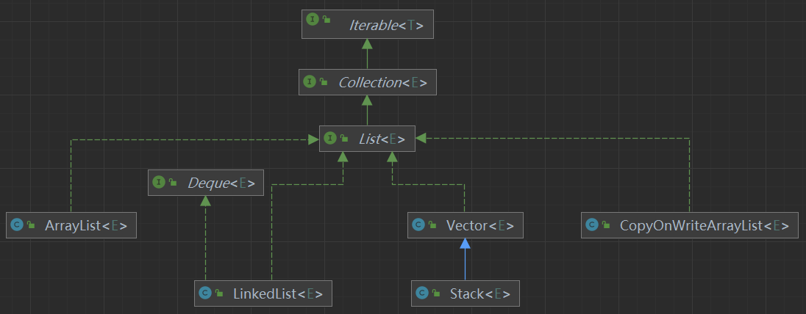
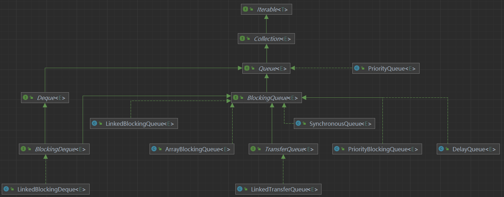
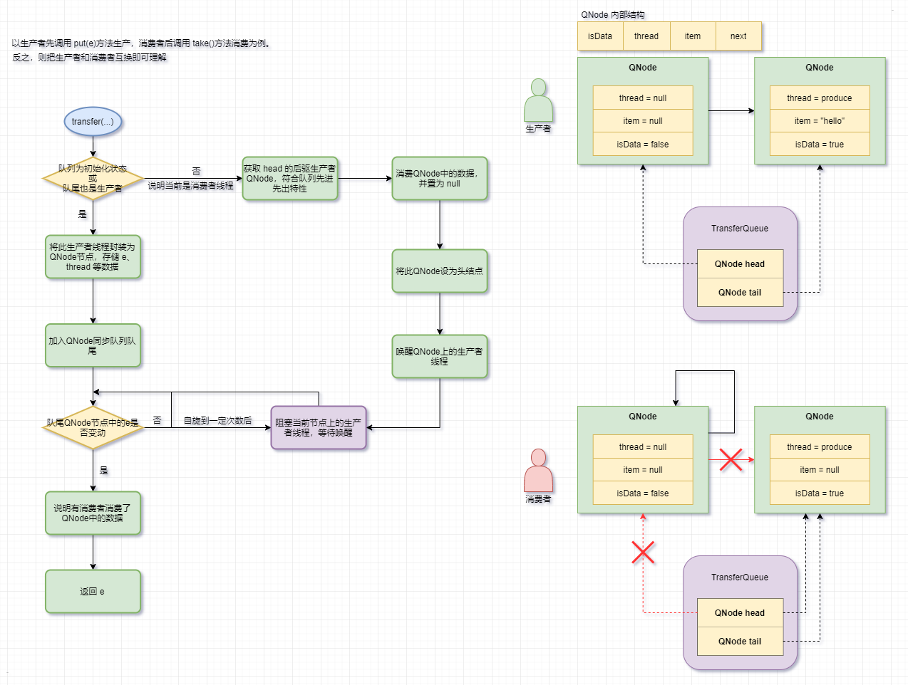
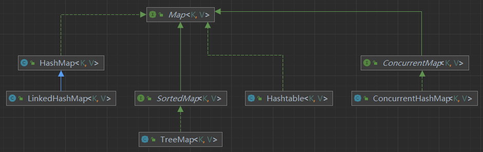
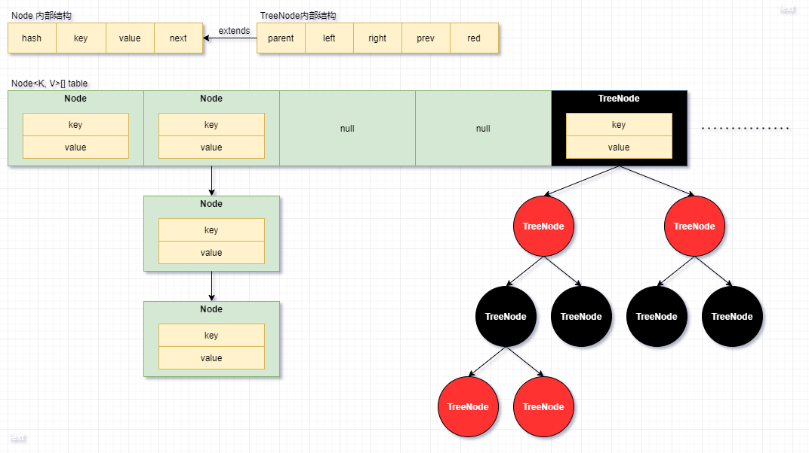
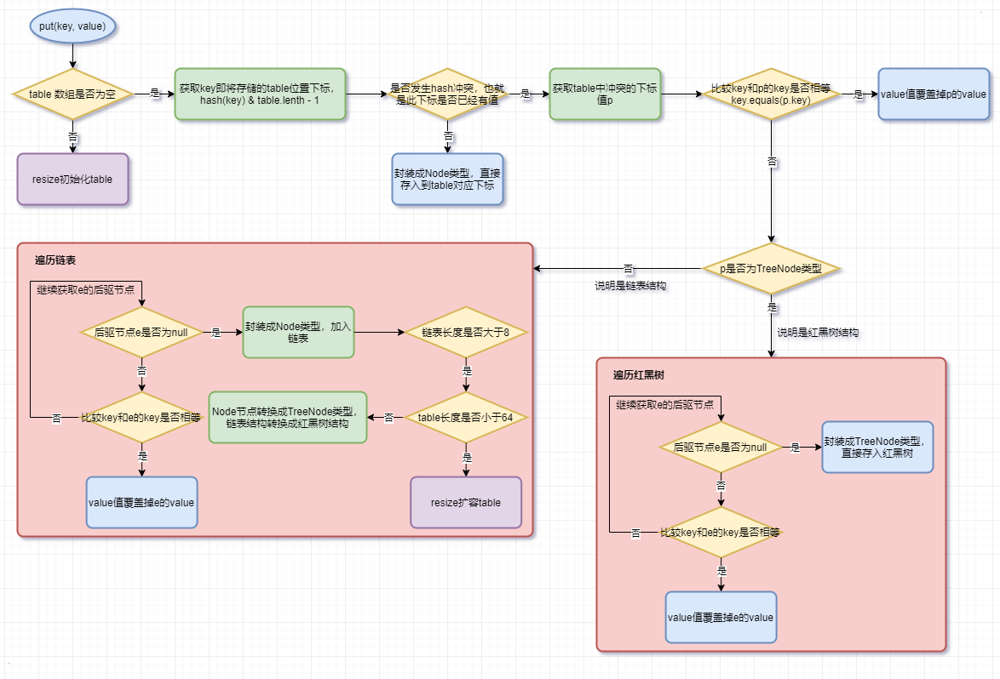
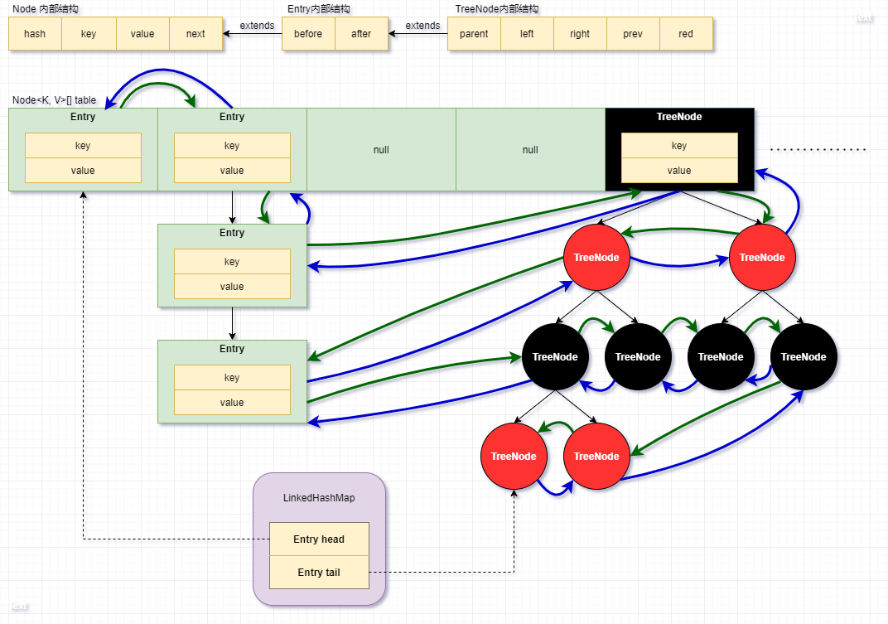
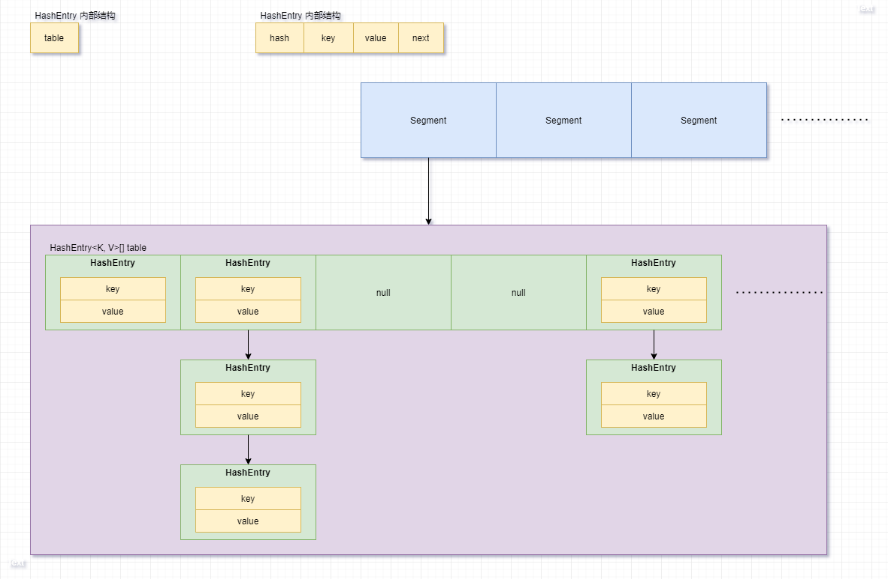
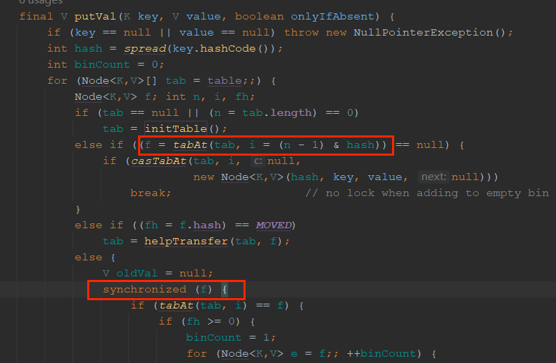

# JavaContainer

> 所有的继承图都做了简化，只展示关键的关系。
>
> Chrome 的[Guava 包](https://github.com/google/guava)其中有很多工具类，对现在没有设计好的容器类做出了很好地补充和优化，可以考虑了解引用。

## 一、比较器和迭代器

### （一）[比较器](https://blog.csdn.net/u011240877/article/details/53399019)

用于比较两个元素的大小，返回一个 int 值：**返回值小 0 时，第一个元素放前面**；返回值等于 0 时，按照出现的先后顺序。Java 提供两个比较器接口：Comparable 和 Comparator。

#### 1、Comparable

Comparable 也叫内部排序，其中只有一个 comparaTo(Object o)方法。实体类可以实现 Comparable 接口，将来在支持排序的容器中可以按照重写的 comparaTo()方法排序，比如 `Collections.sort()` 方法。

```java
public static void main(String[] args) {
    Person p0 = new Person("张三", 3);
    Person p2 = new Person("张四", 2);
    Person p = new Person("张三", 1);
    Person p1 = new Person("张三", 2);
    Person p3 = new Person("张四", 2);

    TreeSet<Person> treeSet = new TreeSet<Person>();
    Collections.addAll(treeSet, p0, p, p1, p2, p3);

    Iterator<Person> iterator = treeSet.iterator();
    while (iterator.hasNext()) {
        Person next = iterator.next();
        System.out.println(next);
    }
}


@Data
@AllArgsConstructor
static class Person implements Comparable<Person> {
    private String name;
    private int age;

    // 按照年龄排序
    @Override
    public int compareTo(Person o) {
        if (this.age < o.age) {
            return -1;
        } else if (this.age == o.age) {
            return this.name.compareTo(o.name);
        } else {
            return 1;
        }
    }
}
```

#### 2、Comparator

Comparator 也叫外部排序，其中有一个 compare(Object o1, Objecto2)方法。实现 Comparator 接口作为定制排序，传入支持定制排序的容器中，比如：TreeMap、PriorityQueue，实现自己想要的排序方式，比 Comparable 更加解耦。

```java
public static void main(String[] args) {
    Person p0 = new Person("张三", 3);
    Person p = new Person("张三", 1);
    Person p1 = new Person("张三", 2);
    Person p2 = new Person("张四", 2);
    Person p3 = new Person("张四", 2);

    TreeSet<Person> treeSet = new TreeSet<>(new Com());
    Collections.addAll(treeSet, p0, p, p1, p2, p3);

    Iterator<Person> iterator = treeSet.iterator();
    while (iterator.hasNext()) {
        Person next = iterator.next();
        System.out.println(next);
    }
}

static class Com implements Comparator<Person> {

    @Override
    public int compare(Person o1, Person o2) {
        if (o1.age < o2.age) {
            return -1;
        } else if (o1.age == o2.age) {
            return o1.name.compareTo(o2.name);
        } else {
            return 1;
        }
    }
}

@Data
@AllArgsConstructor
static class Person {
    private String name;
    private int age;
}
```

### （二）[迭代器](https://blog.csdn.net/u013277209/article/details/101456447)

#### 1、Iterator

Iterator 是迭代器接口，每个容器的实现类中都有一个直接或间接实现 Iterator 接口的内部类，可以可以使用 Iterator 迭代器遍历集合。

#### 2、Iterable

Iterable 表示可迭代的接口，内部提供 iterator()方法，用于返回容器内实现 Iterator 接口的内部类实例。

> 增强 for 循环其实 java 的语法糖，原理也是调用了容器中的 iterator()返回一个 iterator 实例，从而进行迭代循环。所以没有实现 Iterator 是不能使用增强 for 循环。

## 二、Collection

Collection 用于存储元素的集合。

### （一）List

List 相当于一个可以自动扩容的数组。



#### 1、ArrayList

ArrayList 内部是一个 Object 数组。

**注意细节**：

ArrayList 无参构造不传入初始长度或有参构造传入值为 0 时，会创建一个长度为 0 的数组，在第一次添加元素时进行扩容，扩容后的长度为 10（DEFAULT_CAPACITY）；其它情况下，每次扩容都将 element 扩容为原数组 1.5 倍（`newCapacity = oldCapacity + oldCapacity >> 1`）。默认扩容的最大数组长度是 MAX_ARRAY_SIZE（`Integer.MAX_VALUE - 8`，防止添加数组头部信息后内存溢出），若有参构造传入的值大于 MAX_ARRAY_SIZE，则会扩容为 Integer.MAX_VALUE。

每次扩容、删除或插入到指定位置，都会调用 System.arraycopy(...)方法，将数组内容复制到新的数组中并返回，所有以上操作比较消耗性能。

**特点**：

- 底层是数组，增删慢，查询快。
- 线程不安全。
- 有序（存入的顺序和获取的顺序一致）。
- 可存 null 值。

#### 2、LinkedList

LinkedList 底层是一个双向链表（内部类 Node 类型，存储 element、prev、next 信息），并且实现了 Deque 接口，可以当做双向队列使用，其实内部还是对双向链表进行操作。

**注意细节**：

获取指定下标元素时，会查看下标是否小于链表长度的一半，是的话就从头部开始遍历；否则，从尾部开始遍历。

**特点**：

- 底层是双向链表，增删快，查询慢。
- 线程不安全。
- 有序。
- 可存 null 值。

#### 3、Vector

Vector 内部是一个 Object 数组，基本和 ArrayList 原理一致。

**注意细节**：

Vector 无参构造不传入参数时，默认会创建一个长度为 10 的 Object 数组。可以通过有参构造传入 capacityIncrement，用于设置每次扩容的长度 `newCapacity = oldCapacity + ((capacityIncrement > 0) ? capacityIncrement : oldCapacity)`。

Vector 内部的增删改查方法都是被 synchronized 修饰的同步方法，所以线程安全。不过 `Collections.synchronized(Collection)` 也可以将线程不安全的集合转化线程为安全的，底层原理就是在内部类的方法中用同步代码块调用了集合中的方法。

**特点**：

- 内部增删操作为 sychronized 方法，所以线程安全，不过有性能损失。
- 有序。
- 可存 null 值。

##### （1）Stack

Stack 提供 push / pop 方法，可以当作先进后出的栈来使用，其实内部还是对 Vector 中的 Object 数组进行操作。

#### 4、[CopyOnWriteArrayList](https://mp.weixin.qq.com/s?__biz=MzI4Njg5MDA5NA==&mid=2247484380&idx=1&sn=c1aa61d29818005f886c61575d2a5d36&chksm=ebd742dddca0cbcb4c8d5792cccfb774a268e64d2b65a94dd0781c17a73bfadf4f930c33f4be&scene=21###wechat_redirect)

CopyOnWirteArrayList 是 JUC 包下的线程安全的集合类，CopyOnWrite 是一种写入时复制的思想：多个线程读同一个资源时，不用上锁，只有当修改这个资源时才会另外复制一份原资源并进行修改，然后替换原资源。

**注意细节**：

CopyOnWriteArrayList 底层是被 volatile 修饰的 Object 数组，保证了可见性，get 时线程都会获取最新的数据。

CopyOnWriteArrayList 中有 ReentrantLock 属性，用于在写操作（增删改）时加锁，保证线程安全。同时在写操作时，都会调用 System.arraycopy(...)方法创建一份原数组数据的副本，在此副本上操作完后替换原数组。

COWIterator 是 CopyOnWriteArrayList 的内部类，是 Iterator 接口的实现类，会存储原数组数据作为 COWIterator 自己的成员变量进行遍历，所以看到的数据都是老的数据，无法实时的看到最新的数据，并且 COWIterator 不提供 add()和 remove()方法。

**特点**：

- 进行写操作时会频繁 CopyOnWrite 操作，消耗资源。
- CopyOnWriteArrayList 只能保证数据的最终一致性，不能保证实时的一致性，比如 Iterator 遍历就是不能保证实时一致性。
- CopyOnWriteArrayList 在写操作时加锁，线程安全；在读时不加锁，因此适用于读多写少的场景，读性能优于 Vector。

### （二）Queue

作为先进先出的队列使用。



#### 1、BlockingQueue

先了解 BlockingQueue 中提供的几种读写方法：

- 写操作：将数据插入队尾，并唤醒被阻塞的消费线程。
  - put：当阻塞队列满时，当前线程被阻塞。
  - offer：当阻塞队列满时，直接返回 false。
  - add：当阻塞队列满时，抛出 IllegalStateException 异常。
- 读操作：获取队头的数据，并唤醒被阻塞的生产线程。
  - take：获取并删除队头元素，当阻塞队列为空时，当前线程被阻塞。
  - poll：获取并删除队头元素，当阻塞队列为空时，返回 null。
    - poll 也提供了重载方法，当阻塞队列为空时，计时等待。
  - peek：获取队头元素，当阻塞队列为空时，返回 null。

使用 put()和 take()，才相当于使用了阻塞队列；其他方法没有阻塞功能，就是一个线程安全方法。

##### （1）ArrayBlockingQueue

底层是一个 Object 数组，由头指针 takeIndex 和尾指针 putIndex 表示数组的头尾，因此整个数组可以循环读取数据。

**注意细节**：

没有提供无参构造，需要指定阻塞队列长度，默认使用公平锁。

内部使用 ReentrantLock 保证读取数据时的线程安全，使用 ConditionObject 维护一个生产者条件队列（notFull）、一个消费者条件队列（notEmpty），这样保证当队列为空时只能往里面添加数据，取数据的消费线程会被阻塞；当队列满时只能取数据，添加数据的生产线程会被阻塞。

##### （2）LinkedBlockingQueue

LinkedBlockingQueue 内部是一个单向链表（内部类 Node 类型，存储 item、next 信息），提供先进先出的方式。

**注意细节**：

LinkedBlockingQueue 是有边界的阻塞队列，当无参构造不传入长度时，此链表的最大长度为 Integer.MAX_VALUE。

**内部使用了两把锁 putLock 和 takeLock** ，以及锁对应的生产者条件队列（notFull）和消费者条件队列（notEmpty）。因为使用的是两把锁，因此可以同时从链表头部读取数据和从链表尾部写入数据。

##### （3）LinkedBlockingDeque

Deque 和 Queue 的区别：Queue 是单向队列，只能先进先出；Deque 可以作为双向队列使用，也就是队头和队尾都能读写数据。

LinkedBlockingDeque 实现类 Deque 接口，底层是一个双向链表（内部类 Node 类型，存储 item、pre、next 信息），因此可以对队头和队尾进行读写操作。和 LinkedBlockingQueue 一样，也是个有边界的阻塞队列。

**注意细节**：

和 LinkedBlockingQueue 不同的是，内部只有一把锁，因此不能同时读写数据。

##### （4）[SynchronousQueue](https://www.cnblogs.com/wangzhongqiu/archive/2018/03/06/8514910.html)

SynchronousQueue 是一个无界直接提交队列，提供公平模式（相当于队列结构，先进先出）和非公平模式（相当于栈结构，先进后出）。**以下只分析公平模式**：公平模式下，内部是一个单向链表（内部类 QNode 类型，存储 isData（表示当前是否是生产者）、thread、item、next），提供先进先出的方式。

在应用中，生产者线程向 SynchronousQueue 阻塞队列生产数据时，会被阻塞，直到有消费者线程消费了此数据，这样可以保证数据被消费后生产者才继续后面的代码；消费者线程向 SynchronousQueue 阻塞队列消费数据时，会被阻塞，直到有生产者生产了数据。

```java
public static void main(String[] args) throws IOException, InterruptedException {
    // 生产者线程
    new Thread(() -> {
        try {
            synchronousQueue.put("hello");
            System.out.println("put hello");
        } catch (InterruptedException e) {
            throw new RuntimeException(e);
        }
    }).start();

    Thread.sleep(5000);

    // 消费者线程
    new Thread(() -> {
        try {
            System.out.println(synchronousQueue.take());
            System.out.println("take hello");
        } catch (InterruptedException e) {
            throw new RuntimeException(e);
        }
    }).start();

    System.in.read();
}
```

**注意细节**：



QNode 内部使用 CAS 算法保证线程安全。

SynchronousQueue 内部的 TransferQueue 维护一个同步队列：

- 在生产者线程生产数据时，若同步队列队尾是生产者节点，则当前线程封装成 QNode 节点，加入同步队列并阻塞等待；若队尾是消费者节点（也就是有消费者在等待），则唤醒此节点上的消费者线程，并将生产的数据**直接**传递给消费者。

- 消费者线程同理。

  从上面的执行流程来看，同步队列中只会存在一种类型（生产者或消费者）的节点。

QNode 使用 isData 判断当前节点是否是生产者。

size()方法直接返回 0，也就是说，官方不认为 SynchronousQueue 是用于存储数据的，只是 put / take 操作会阻塞节点线程及相关数据。

不允许传入 null 值。

##### （5）[LinkedTransferQueue](https://blog.csdn.net/qq877728715/article/details/122732011)

LinkedTransferQueue 是一个无界直接提交队列，它的功能类似于 LinkedBlockingQueue 和 SynchronousQueue 的结合。内部是一个单向链表（内部类 Node 类型，存储 isData、thread、item、next），提供先进先出的方式。

**注意细节**：

从宏观上看 LinkedTransferQueue ，它的读取过程就和 SynchronousQueue 的公平模式原理差不多。从微观上来看：

- 使用 put()方法时，就类似于一个无边界的 LinkedBlokingQueue，如果有消费者在等待，则直接传递给消费者；否则将数据封装成 Node 节点入队列，不会阻塞生产者。
- 此外，LinkedTransferQueue 实现了 TransferQueue 接口，提供 transfer() 和 tryTransfer()方法，transfer()就像 SynchronousQueue 中的 put()方法一样，如果有消费者在等待，则直接传递给消费者；否则，将数据封装成 Node 节点入队列，会阻塞生产者。tyrTransfer()方法会让生产者计时等待，若超时没有被消费，则主动从队列中移除。

size()方法返回 isData 为 true 的节点数量，也就是生产者 Node 的数量，并且当队列长度大于 `Integer.MAX_VALUE` 时，也只会返回 `Integer.MAX_VALUE`。

##### （6）[PriorityBlockingQueue](https://www.cnblogs.com/duanxz/archive/2012/10/22/2733947.html)

PriorityBlockingQueue 是无边界队列，底层是一个**使用小顶堆的排序方式**的对象数组，按照自然排序或外部排序进行排序，排在前面的元素可以先出队列。

**注意细节**：

内部使用 ReentrantLock 锁保证线程安全。

PriorityBlockingQueue 可以指定初始化时的大小，没有边界，因为底层会使用 tryGrow()方法进行扩容。每次扩容都会调用 System.arraycopy(...)方法，将数组内容复制到新的数组中并返回，所有以上操作比较消耗性能。

传入 PriorityBlockingQueue 时，**元素需要实现 Comparable 接口**或**在有参构造是设置比较器 Comparator**。

##### （7）DelayQueue

DelayQueue 是无边界延时队列，底层使用 PriorityQueue 优先级队列保证元素的有序。主要用于执行简单的延时任务。

```java
private static final DelayQueue<ItemDelayed<String>> DELAY_QUEUE = new DelayQueue<>();

public static void main(String[] args) throws InterruptedException {
    ItemDelayed<String> itemDelayed = new ItemDelayed<>(5, "hello");
    DELAY_QUEUE.put(itemDelayed);

    while (true) {
        ItemDelayed<String> item = DELAY_QUEUE.take();
        System.out.println(new Date() + " " + item.getData());
    }
}

@Data
static class ItemDelayed<T> implements Delayed {
    private final long expire;

    private final T data;

    private String itemId;

    private long startTime;

    public ItemDelayed(long secondsDelay, T data) {
        this.startTime = System.currentTimeMillis();
        this.expire = this.startTime + secondsDelay * 1000;
        this.data = data;
    }

    @Override
    public long getDelay(java.util.concurrent.TimeUnit unit) {
        return unit.convert(this.expire - System.currentTimeMillis(), unit);
    }

    @Override
    public int compareTo(Delayed o) {
        return (int) (this.getDelay(TimeUnit.MILLISECONDS) - o.getDelay(TimeUnit.MILLISECONDS));
    }
}
```

**注意细节**：

内部使用 ReentrantLock 锁保证线程安全。

传入 DelayQueue 的元素必须实现 Delayed 接口，其中 compareTo()方法用于控制 PriorityQueue 的排序，排在前面的元素可以先出队列；getDelay()方法用于设置消费者 take 时的阻塞等待时间。

使用 leader 属性用于表示当前获取队头元素时计时等待的线程。

#### 2、[PriorityQueue](https://blog.csdn.net/weixin_41755556/article/details/122705184)

优先级队列，底层是一个**使用小顶堆的排序方式**的对象数组，按照自然排序或外部排序进行排序，排在前面的元素可以先出队列。

### （三）Set

Set 相当于一个不包含重复变量的、自动扩容数组。

#### 1、TreeSet

内部就是一个 TreeMap，使用键写入读取数据，值是一个 `static final Object`。

#### 2、HashSet

内部就是一个 HashMap，使用键写入读取数据，值是一个 `static final Object`。

#### 3、CopyOnWriteArraySet

内部就是一个 CopyOnWriteArrayList。

**注意细节**：

提供了 addIfAbsent()和 addAllAbsent()方法，在新增修改时，会先判断元素是否存在，不存在时才会添加。

## 三、Map

Map 可以用来存储键值对数据。



### （一）[HashMap](https://www.cnblogs.com/doufuyu/p/10874689.html)

HashMap 内部是一个数组加链表加红黑树的结构。



**注意细节**：



无参构造会在第一次 put 的时候自动初始化一个长度为 16 的数组；有参构造会将传入的初始容量转换为大于等于该参数的最小的 2 的幂次方，例如：`new HashMap(17)`，HashMap 的初始容量是 32。

HashMap 是采用 `hash() & (length - 1)` 的方式确定键值对存储的数组下标，hash()方法会调用 Object 中的 hashCode()方法。**当对应下标有值时，就会发生 hash 冲突，HashMap 使用冲突链的形式解决 hash 冲突**。每次 hash 冲突后都会将新元素插入到对应下标的 Node 节点后，形成一个链表。当链表太长时，获取元素的性能较低，所以 JDK8 后引入红黑树，当链表长度大于 8（TREEIFY_THRESHOLD）并且 size 大于 64（MIN_TREEIFY_CAPACITY）后，则会将链表转化为红黑树；当树节点小于 6 时，红黑树会转化为链表。

HashMap 在 JDK7 之前冲突链表是头插法，也就是新的 Node 节点放在链表头部；在 JDK8 之后是尾插法，新的 Node 节点放在链表尾部。

当 HashMap 内的元素个数大于 threshold（阈值，值为 `loadFactor * capacity`）时，会调用 resize()方法对 HashMap 进行扩容，将 table 数组扩容为原数组的 2 倍，最大值为 MAXIMUM_CAPACITY。扩容时会遍历原数组，将数组、链表、红黑树上的元素重新计算位置，放在 原下标 j 或 `j + oldCap（原数组长度）` 的位置。

**特点**：

- 线程不安全。
- 无序。
- 键或值都可以为 null。

### （二）LinkedHashMap

LinkedHashMap 继承了 HashMap，。底层是在 HashMap 数据结构基础上加了双向链表的数据结构。LinkedHashMap 内部类 Entry 继承了 HashMap 的 Node 内部类，其中有 `Entry before`  和 `Entry after`  属性，用于记录前驱后驱节点，并且 LinkedHashMap 的 head 和 tail 分别指向双向链表的头尾。



**注意细节**：

LinkedHashMap 并没有重写 put()方法，所以也是正常的散列表和冲突链表的结构。但是重写了 newNode()方法，插入的数据除了组成上面的数据结构外，还维护着双向链表的关系，每次插入的时候调用 LinkedHashMap 的 newNode()方法将数据插入在双向链表尾部，这样可以通过遍历双向链表保证有序。

LinkedHashMap 中有个 accessOrder 属性，通过有参构造赋值，当 accessOrder 为 true 时，每次使用 get()方法访问 LinkedHashMap 中的元素后，都会将该元素移动到链表尾部，**这样是为实现最近最少使用（LRU）的算法做铺垫**。

```java
@Test
public void testAccessOrder() {
    LinkedHashMap<Integer, String> accessOrder = new LinkedHashMap<>(16, 0.75f, true);
    IntStream.range(0, 5).forEach(i -> accessOrder.put(i, "value" + i));
    System.out.println(accessOrder); // {0=value0, 1=value1, 2=value2, 3=value3, 4=value4}
    accessOrder.get(3);
    System.out.println(accessOrder); // {0=value0, 1=value1, 2=value2, 4=value4, 3=value3}
}
```

在 accessOrder 为 true 时，使用 get()方法也是结构性的修改，会导致 modCount 增加，在 Iterator 迭代器中遍历时会抛异常。

```java
@Test
public void testModCount() {
    LinkedHashMap<Integer, String> accessOrder = new LinkedHashMap<>(16, 0.75f, true);
    IntStream.range(0, 5).forEach(i -> accessOrder.put(i, "value" + i));

    // 抛异常
    for (Integer i : accessOrder.keySet()) {
        System.out.println(accessOrder.get(i));
    }
}
```

**特点**：

- 线程不安全。
- 有序。
- 键或值都可以为 null。

### （三）[TreeMap](https://www.cnblogs.com/CarpenterLee/p/5503882.html)

TreeMap 底层结构为红黑树，可以传入 Comparator 实现类从而进行排序。

### （四）[HashTable](https://www.cnblogs.com/data-magnifier/p/14078943.html)

HashTable 底层是数组加链表的数据结构。

**注意细节**：

HashTable 无参构造时，初始容量是 11。

Hashtable 中的先判断元素长度是否大于 threshold，扩容后再将元素 put 到数组中，然后元素长度+1，留到下次 put 的判断是否要扩容。每次 rehash()扩容是 `oldCap*2 + 1`，所以不必按照长度是 2 的次幂来算。

采用 `(hash & 0x7FFFFFFF) % length` 来确定键值对存储的位置，发生 hash 冲突时采用头插法，插入冲突链头部，比尾插法性能高。

增删改方法被 synchronized 关键字修饰，是线程安全的。

**特点**：

- 线程安全。
- 值不能为 null。
- Hashtable 是一个过时的集合类，可以用 ConcurrentHashMap 替代，并且基本数据类型和操作和 HashMap 类似，不用深入学习。

### （五）ConcurrentHashMap

ConcurrentHashMap 在 JDK8 时发生过大改动，因此分为 JDK7 及之前和 JDK8 两个：

#### 1、[JDK7 及之前](https://www.cnblogs.com/chengxiao/p/6842045.html)

底层是分段（Segment）数组，Segment 内又维护着数组（又称散列表）加链表（又称冲突链）的数据结构。



**注意细节**：

无参构造会自动初始化一个长度为 16 的 Sgement 数组，最大是 2 的 16 次幂；有参构造会将传入的初始 Sgement 数组大小转换为大于等于该参数的最小的 2 的幂次方，**一旦初始化 Sgement 数组后，它是不可以扩容的**。每个分段的散列表默认最小长度是 2（是为了防止插入第一个元素就进行扩容），扩容的最大长度是 2 的 30 次幂；整个 ConcurrentHashMap 的长度是每个**散列表长度 \* 分段表长度**，可有参传入的最大长度是 2 的 30 次幂。

在 Segment 为空初始化初值（初始化分段上散列表的 capcacity 和 loadFactor）时，会用到 CAS 算法保存原子性。

Sgement 继承了 ReentrantLock，每次 put 时都需要获取对应的 Segment 锁，有多少个 Segment 就支持多少个线程同时修改 ConcurrentHashMap。

`(hash >>> segmentShift) & segmentMask`，将 hash 值移位后与分段数组长度-1 相与后确定所在分段（其实就相当于以前 HashMap 是取低位与数组长度-1 相与，ConcurrentHashMap 取高多少位与分段数组长度-1 相与）。操作分段表上对应分段的散列表，就是 JDK7 操作 HashMap 一样的，会进行 hash 找在散列表的位置，会进行头插法，会 rehash 扩容。

get 时无需加锁，由于其中涉及到的共享变量都使用 volatile 修饰，volatile 可以保证内存可见性，所以不会读取到过期数据。

#### 2、[JDK8](https://www.cnblogs.com/zerotomax/p/8687425.html)

底层是数组加链表加红黑树的数据结构。

**注意细节**：

有参构造中的 concurrencyLevel 参数是为了兼容 JDK7 版本的 ConcurrentHashMap，其实没什么作用。

初始化数组的时候，若未被初始化，则进行初始化并记录一个标记为-1，其他线程读到这个-1 标记时会让出 cpu 执行权。

put 操作时，若插入位置没有值，则 casTabAt()原子操作的插入；若当前位置的节点状态为 MOVED，表示当前位置正在转移，会让当前线程也参与扩容，提高性能；若当前位置有元素，则在同步代码块中进行 hash 冲突操作，**在这里，使用 Node 节点作为锁**。



**特点**：

- 线程安全。
- 键值都不可为 null。
- 当没有 hash 冲突时，使用 CAS 操作插入散列表；当发生 hash 冲突时，使用散列表上的 Node 节点作为锁进行同步操作，比 JDK7 的颗粒度更小。

## 四、疑问

### （一）为什么可以在迭代器中进行删除，而 foreach 中会抛异常

在 for 循环中删除容器中的元素，通常会碰见以下问题：

```java
static ArrayList<Integer> list = new ArrayList<>();
static {
    IntStream.range(0, 10).forEach(list::add);
}

@Test
public void testFailFast() {
    for (int i = 0; i < list.size(); i++) { // 只删除一半元素
        System.out.println(list.get(i));
        list.remove(i);
    }
}

@Test
public void testFailFast2() {
    int size = list.size();
    for (int i = 0; i < size; i++) { // 抛异常
        System.out.println(list.get(i));
        list.remove(i);
    }
}

@Test
public void testFailFast3() {
    for (Integer i : list) { // 抛异常
        System.out.println(i);
        list.remove(i);
    }
}
```

前两个好理解，但第三个需要进行分析：

容器类中基本都有一个实现 Iterator 接口的内部类，用于遍历容器中元素。Iterator 又遵循了 fail-fast 机制：fail-fast 机制是一种快速失败机制，当迭代器每次迭代时，都会监测当前集合有没有被外部修改或其他线程修改，如果被修改就会抛出异常。

从源码上看，容器类中有一个 modCount 属性，每次进行增删改操作时，都会让 modCount++。而 Iterator 中也有一个 expectedModCount 属性，当创建 Iterator 对象时值和 modCount 相等。每次执行 `iterator.next()`  前，都会比较 expectedModCount 和 modCount 是否相等，若不相等，则表示外部更改过容器，此时抛出 ConcurrentModificationException 异常。

增强 for 循环其实是语法糖，其内部还是通过容器的 Iterator 迭代器实现类进行迭代遍历。从第三个例子可以看出，外部使用的是迭代器进行遍历，但是内部又是直接调用 `list.remove()` 进行删除，此时 expectedModCount 不等于 modCount，抛出异常。

### （二）为什么 HashMap 有参构造会将 tableSizeFor()返回给 threshold 而不是 capacity

虽然这个值会被返回给 threshold（阈值，map 的 size 超过这个值则会进行扩容），但是在第一次 put 时在 resize()中被赋值给 Node<K,V> table 数组，而后 threshold 也会被重新赋值成 `capacity * loadFactor`。

### （三）为什么要求 HashMap 要求数组数组长度为 2 的次幂

当 put 一个键值对后，会将 `hash() & (length - 1)`，将键值对存入数组与逻辑计算后的索引中，减少 hash 碰撞。

### （四）为什么 HashMap 的 size 大于 64 并且链表长度大于 8 才转换成红黑树

size 大于 64 是防止初期 size 小时同一个链表长造成不必要的转换，浪费性能。

### （五）为什么要重写 equals() 和 hashCode()方法

在 Map 实现类中，通过 hashCode()方法判断是否发生 hash 冲突，若发生 hash 冲突，则将通过 equals()方法判断是否已经存在，若已经存在，则覆盖掉旧值，也就是说——只有 hashCode() 和 equals() 相等时，才会判定 key 已经存在。

hashCode()方法用于计算键值对放在 hash 表中的位置，好的 hashCode 可以减少冲突。

### （六）为什么 Arrays.asList()方法将数组转换为 ArrayList 后，再进行操作时会报错

Arrays.asList()将数组转换为的 ArrayList 是 Arrays 的一个内部类，和真正的 ArrayList 同名，并且一样继承 AbstractList，但是并没有重写 remove() 和 add()方法，所以报错。
