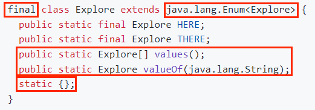
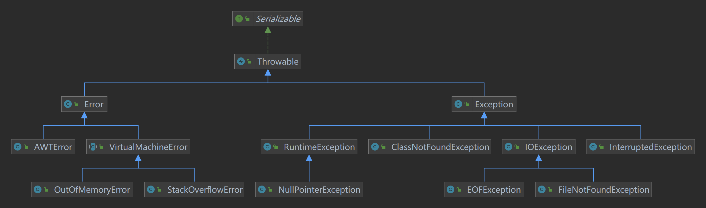
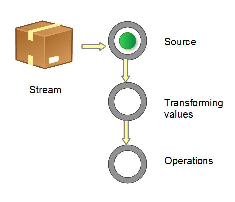
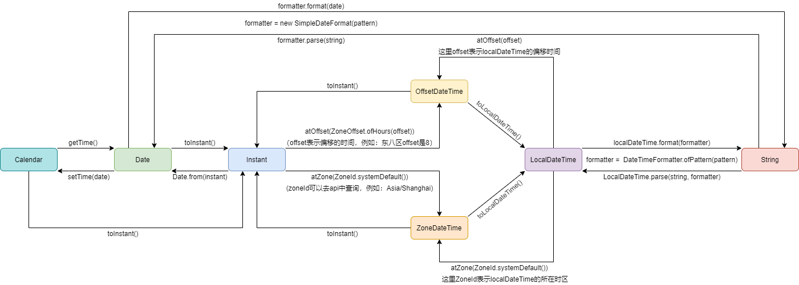
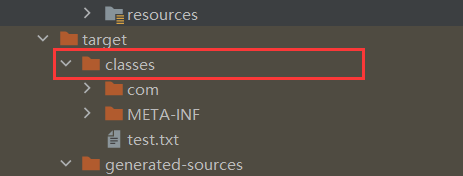

# JavaCore

> 基于[《On Java 8》](https://github.com/muyuxx/onJava8)
>
> 以下版本为 jdk1.8.0_131
>
> 没有特别说明的情况下，以下出现的【类】这个词含义包括：类、接口、抽象类；【实现】这个词含义包括：继承、实现，具体含义根据上下文理解。

## 一、访问权限

访问权限用于控制外部能否调用被修饰者，Java 中有四种访问权限：public、protected、default、private。

### （一）public

public 修饰符能够修饰**类**、构造器、属性、方法、内部类，被修饰者可以**在任何地方访问**。

### （二）[protected](https://www.runoob.com/w3cnote/java-protected-keyword-detailed-explanation.html)

protected 修饰符能够修饰构造器、属性、方法、内部类，被修饰者可以**在相同包（package）内或子类中访问**。

相同包下可以正常访问，不同包下不可以访问：

- **不能修饰类**：若被 protected 修饰，虽然有不同包的子类访问权限，但是其他包看不到被 protected 修饰的类，不能继承当然就没有子类了，和 default 没区别，因此不采用这种用法，编译报错。
- 构造器：其他包下不能进行实例化；子类中可以以 super() 的形式调用。
- 属性、方法：**子类仅能在内部使用继承自父类的 protected 属性或方法，不能使用父类实例去调用 protected 属性或方法**。
- 内部类：修饰内部类虽然不报错，但是和修饰类时有一样的问题，因此更加推荐使用 default 替代。

**情景 1**：

父类和子类不同包的情况：

```java
package demo01;

public class Father {
    protected int b;

    protected void method2() {
        System.out.println("protected method");
    }
}
```

```java
package demo02;

public class Son extends Father {
    @Test
    void test() {
        Son son = new Son();
        son.b = 2;
        son.method2();
    }

    @Test
    void test2() {
        Father father = new Father();
        father.b = 1; // 编译报错
        father.method2(); // 编译报错
    }
}
```

在子类内部，可以使用继承的 protected 方法、属性；但是使用父类实例去调用 protected 方法、属性时，Father（弱化父类的概念，就把他看成一个普通的、毫无相关的类）的 protected 方法、属性仅包内有访问权限，因此报错。

**情景 2**：

调用者和 Father 同包，和 Son 不同包：

```java
package demo01;

public class Demo03 {
    @Test
    void test() {
        Son son = new Son();
        son.b = 2;
        son.method2();
    }

    @Test
    void test2() {
        Father father = new Father();
        father.b = 1;
        father.method2();
    }
}
```

因为 Demo03 和 Father 同包，所以可以正常使用 protected 方法、属性。但是会发现 Demo03 和 Son 不同包，为什么仍然可以使用 protected 方法、属性呢？因为**虽然看起来是 Son 的 protected 方法、属性，但是其实是继承自 Father 的**，访问权限仍然在 demo01 包下，Demo03 和 Father 同包下仍然具有访问权限。

**情景 3**：

调用者和 Father 不同包，和 Son 同包：

```java
package demo02;

public class Demo04 {
    @Test
    void test() {
        Son son = new Son();
        son.b = 2; // 编译报错
        son.method2(); // 编译报错
    }

    @Test
    void test2() {
        Father father = new Father();
        father.b = 1; // 编译报错
        father.method2(); // 编译报错
    }
}
```

Demo04 和 Father 不同包，因此不具有 protected 的访问权限，所以报错。Demo04 和 Son 同包，又为什么报错呢？还是上面那句话，protected 方法、属性仍然在 demo01 包下，因此不同包不具有 protected 访问权限。

### （三）default

default 修饰符（也就是不加权限修饰符）能够修饰**类**、构造器、属性、方法、内部类，被修饰者可以**在相同包（package）内使用**。

相同包下可以正常访问，不同包下不可以访问：

- **类**：default 修饰类时，其他包下无法访问。
- 构造器：仅可以在同包使用。
- 属性、方法：仅可以在同包访问，不同包的子类无法继承 default 属性或方法。。
- 内部类：仅可以在同包访问。

> 和 protected 不同的是，不同包的子类不会继承 default 访问权限的属性、方法。

### （四）private

private 修饰符能够修饰构造器、属性、方法、内部类，被修饰者仅可以**在类内部使用**。

- **不能修饰类**：private 修饰类时，则表示此类不可以在任何地方被调用，此类完全没有意义，因此不采用这种用法，编译报错。
- 构造器：仅可以在类内部使用，其他地方无法使用 private 的构造器进行实例化。
- 属性、方法：仅可以在类内部使用，子类无法继承 private 属性或方法。
- 内部类：仅可以在类内部使用，其他地方无法访问。

## 二、关键字

### （一）static

Java 提供 static（静态）关键字，static 可以修饰成员变量、成员方法、代码块、内部类，修饰后就称为**静态变量、静态方法、静态代码块、静态内部类**，表示属于这个类，可以被所有对象共享。

```java
public class Demo01_Static {

    static int a = 1;

    static {
        System.out.println("静态代码块");
        // test(); // 静态代码块中不能调用非静态方法
    }

    static void method() {
        System.out.println("静态方法");
        // test(); // 静态方法中不能调用非静态方法
    }

    static class InnerClass {
        private int innerA;
    }

    void test() {
    }
}
```

**有以下特点**：

- **静态代码块、静态方法、静态内部类**不能调用非静态成员、this。
  - 静态代码块、静态方法、静态内部类与类生命周期一致，执行时对象实例可能还没有创建，因此不能使用非静态成员（也就是对象成员）。
- 成员方法、成员内部类可以调用静态成员。
- 静态方法可以被继承，不能被重写，但是会被覆盖。
  - 虽然静态方法可以被继承，但是不推荐使用子对象去调用父类的静态方法。
  - 静态方法拥有者是类，在编译期间就会确定将此方法的调用版本，而重写的意义是为了实现多态，而多态的作用是在运行期间才确定方法的调用版本，因此重写静态方法没有意义。

```java
public class Demo02_StaticMethod {

    public static void main(String[] args) {
        Father father = new Son();
        // 在编译期间，就确定是调用 Father 的 method1() 方法
        father.method1(); // 父类静态方法1
        father.method2(); // 父类静态方法2

        // 在编译期间，就确定是调用 Son 的 method1() 方法
        Son son = new Son();
        son.method1(); // 子类静态方法
        son.method2(); // 父类静态方法2
    }

    static class Father {

        static void method1() {
            System.out.println("父类静态方法1");
        }

        static void method2() {
            System.out.println("父类静态方法2");
        }
    }

    static class Son extends Father {

        // @Override // 不能使用 @Override 表明重写，只能在使用时覆盖
        static void method1() {
            System.out.println("子类静态方法");
        }
    }
}
```

> **不推荐使用对象去调用静态方法、获取静态属性**，因为静态方法被类的所有对象实例所拥有，应该使用类直接去调用状态方法。

### （二）final

final 可以修饰成员变量、局部变量、参数、方法、类。

1、final 修饰成员变量、局部变量、参数，有以下特点：

- 变量值所在的地址不可变，也就是不能修改。
- final 修饰的变量必须马上赋值，例如：修改成员变量时，如果不在定义时赋值，就必须在构造器中赋值。

2、final 修饰方法时，此方法不能被重写覆盖，也就是子类中不能有一样的方法签名。

3、final 修饰的类时，表示该类是最终类，不能被继承。

### （三）this

this 是 Java 提供的关键字，是指向当前类实例的指针，可以用来访问当前类的成员变量、成员方法。

**有以下特点**：

- this 只能在类内部使用，用于表示当前类实例。
- 不可以在静态方法中使用 this；可以使用 this 调用静态方法、获取静态属性，但是**不推荐**。
- 正常情况下可以省略 this，直接使用成员属性、成员方法，当有局部变量和成员变量同名时，需要用 this 来区分。

```java
private int i;

private int j;

private int k;

void method1(int k) {
    this.i = 1;

    /**
     * 也可以省略 this，等价于 this.j = 2;
     */
    j = 2;

    /**
     * 当有局部变量和成员变量同名时，需要用 this 来区分
     */
    this.k = k;
    System.out.println("method1");
}

void method2() {
    method1(3);
    this.method3(); // 可以调用静态方法，但是不推荐
    System.out.println("method2");
}

static void method3() {
    // this.i = 1; // 静态方法中不能使用 this
}
```

#### 1、this()

this(参数) 表示**调用本类中指定参数的构造方法**，一般用于执行本构造方法之前，先执行其他构造函数。

> 注意：**只能在构造方法中使用，且必须在构造方法的第一行**。

```java
class Person {
    Person() {
        // System.out.println("Person"); // 会报错，this() 必须放在构造方法的第一行
        this(2);
    }

    private Person(int i) {
        System.out.println("Person " + i);
    }
}
```

### （四）super

super 是 Java 提供的关键字，是指向当前类**超类（离自己最近的一个父类）**实例的指针，可以访问父类**有访问权限的**成员属性、成员方法。

**有以下特点**：

- super 只能在类内部使用，表示当前类父类实例。
- 不可以在静态方法中使用 super；可以使用 super 调用静态方法、获取静态属性，但是**不推荐**。

```java
static class GrandFather {
    void method() {
        System.out.println("GrandFather method");
    }
}

static class Father extends GrandFather {
    void method() {
        System.out.println("Father method");
    }
}

static class Son extends Father {
    @Test
    void method() {
        super.method(); // super 可以调用父类(离自己最近的一个父类)的成员变量和成员方法
        System.out.println("Son method");
    }
}
```

#### 1、super()

super(参数) 表示**调用父类中指定参数的构造方法**，一般用于执行本构造方法之前，先执行父类构造函数。

> 注意：**只能在构造方法中使用，且必须在构造方法的第一行**。

在 Java 的语法规则中，new 一个类实例前，都会先去 new 该类父类的实例。在构造方法中，默认情况 Java 会调用父类无参构造方法，不过可以省略书写。

```java
static class Father {
    Father() {
        System.out.println("Father");
    }

    Father(int i) {
        System.out.println("Father " + i);
    }
}

static class Son extends Father {

    Son() {
        /**
         * // 默认情况会调用父类无参构造方法，可以省略书写
         */
        // super();
    }

    Son(int i) {
        super(i); // 调用父类指定参数的构造方法
        System.out.println("Son");
    }
}
```

## 三、内部类

在 Java 中，可以将**一个类定义在另一个类内部或一个方法内部，这样的类叫内部类**。

> 只要是类都会编译成 .class 文件，包括内部类，内部类的 Class 对象名称为：`外部类名$内部类名`。

### （一）内部类类型

内部类又可以分为成员内部类、静态（静态成员）内部类、局部内部类和匿名内部类：

#### 1、成员内部类

像一个成员变量一样定义在成员内部：

```java
public class Demo01_InnerClass {

    private int a;

    private static int b;

    private void method() {
        // 创建成员内部类对象
        InnerClass innerClass = new InnerClass();
        innerClass.innerA = 1;
        innerClass.innerMethod();
    }

    class InnerClass {

        private int innerA;

        // static int innerB; // 编译报错，成员内部类不能定义静态成员

        private void innerMethod() {
            System.out.println(a);
            System.out.println(b);
        }
    }
}
```

**有以下特点**：

- 成员内部类可以访问外部类的所有成员，包括私有成员、静态成员。
- 外部类可以访问成员内部类实例（也就是先创建一个内部类对象才能通过此对象访问）的所有成员，包括私有成员。
- 成员内部类不能定义静态成员。
  - 原因：想要使用 static 静态成员时，类必须要加载到 JVM 中，而在加载外部类时，并不会加载成员内部类。若使用未加载到 JVM 中的成员内部类的静态成员，这显然是矛盾的，因此成员内部类不能定义静态成员。

##### （1）访问成员内部类

访问成员内部类有以下两种情况：

- 在外部类中访问成员内部类：
  - 在成员方法中访问：先创建成员内部类的实例，然后通过实例访问内部类的成员。
  - 在静态成员方法中访问：先创建外部类的实例，然后通过外部类的实例来创建内部类实例，然后通过实例访问内部类的成员。
- 在外部类的外部访问成员内部类：先创建外部类的实例，然后通过外部类的实例来创建内部类实例，然后通过实例访问内部类的成员。

> 在外部类中访问时，可以不使用 `OuterClassName.InnerClassName` 的形式。

```java
public class Demo02_InnerClassAccess {

    public static void main(String[] args) {
        Demo01_InnerClass demo01 = new Demo01_InnerClass();
        Demo01_InnerClass.InnerClass innerClass1 = demo01.new InnerClass();
        // innerClass1.innerA = 1; // 不是内部类所在的外部类，无访问权限

        Demo02_InnerClassAccess demo02 = new Demo02_InnerClassAccess();
        InnerClass innerClass2 = demo02.new InnerClass(); // 可以不使用 OuterClassName.InnerClassName 的形式
        innerClass2.innerA = 1; // 仍然在同一个类中，可以访问
    }

    private void method() {
        // 创建成员内部类对象
        InnerClass innerClass = new InnerClass();
        innerClass.innerA = 1;
    }

    static void method2() {
        // 先创建外部类对象，再通过外部类对象创建成员内部类对象
        InnerClass innerClass = new Demo02_InnerClassAccess().new InnerClass();
        innerClass.innerA = 1;
    }

    class InnerClass {
        private int innerA;
    }
}
```

##### （2）获取外部类对象引用

内部类可以直接访问外部类的所有成员，然而当有同名的成员时，内部类的成员优先级更高，可以通过 `外部类名.this` 获取外部类对象，再通过该对象获取外部类成员

```java
public class Demo04_InnerClassCallOuter {

    private int a = 1;

    private void getA() {
        System.out.println(a); // 1
    }

    class InnerClass {

        private int a = 2;

        private void getA() {
            System.out.println(a); // 2
            /**
             * 获取外部类实例
             */
            System.out.println(Demo04_InnerClassCallOuter.this.a); // 1
        }
    }

    public static void main(String[] args) {
        Demo04_InnerClassCallOuter outerClass = new Demo04_InnerClassCallOuter();
        outerClass.getA();
        InnerClass innerClass = outerClass.new InnerClass();
        innerClass.getA();
    }
}
```

#### 2、静态内部类

像一个静态成员一样定义在类内部：

```java
public class Demo08_StaticInnerClass {

    private int a;

    private static int b;

    private void method() {
        InnerClass innerClass = new InnerClass();
        innerClass.innerA = 1;
        innerClass.innerMethod();
    }

    static class InnerClass {
        private int innerA;

        private static int innerB;

        private void innerMethod() {
            // System.out.println(a); // 编译报错，静态内部类不能访问外部类的非静态成员
            System.out.println(b);
        }
    }
}
```

**有以下特点**：

- 静态内部类可以访问外部类的所有**静态成员**，包括私有成员。
- 外部类可以访问静态内部类的所有**静态成员**，包括私有成员。
- 静态内部类中可以定义**普通成员或静态成员**。

```java
public class Demo08_StaticInnerClass {

    private int a;

    private static int b;

    private void method() {
        InnerClass innerClass = new InnerClass();
        innerClass.innerA = 1;
        innerClass.innerMethod();
        System.out.println(InnerClass.innerB);
    }

    static class InnerClass {
        private int innerA;

        private static int innerB;

        private void innerMethod() {
            // System.out.println(a); // 编译报错，静态内部类不能访问外部类的非静态成员
            System.out.println(b);
            // System.out.println(Demo08_StaticInnerClass.this); // 静态内部类中不可以通过 `外部类的类名.this` 访问外部类对象
        }
    }
}
```

##### （1）访问静态内部类

访问静态内部类不用像成员内部类那样——需要先创建外部类对象，而是直接通过外部类创建静态内部类对象。

> 在外部类中访问时，可以不使用 `OuterClassName.InnerClassName` 的形式。
>
> 注意： 静态内部类中不可以通过 `外部类的类名.this` 访问外部类对象。

```java
public class Demo09_StaticInnerClassAccess {

    public static void main(String[] args) {
        /**
         * 通过外部类创建静态内部类对象
         */
        Demo09_StaticInnerClassAccess.InnerClass innerClass2 = new Demo09_StaticInnerClassAccess.InnerClass();
        innerClass2.innerA = 1; // 仍然在同一个类中，可以访问
        /**
         * 由于静态内部类是静态的，所以可以直接通过类名访问
         */
        System.out.println(Demo09_StaticInnerClassAccess.InnerClass.innerB);
    }

    private void method() {
        /**
         * 直接创建成员内部类对象
         */
        InnerClass innerClass = new InnerClass();
        innerClass.innerA = 1;
    }

    static void method2() {
        /**
         * 直接创建静态内部类对象
         */
        InnerClass innerClass = new InnerClass(); // 也可以这样写
        innerClass.innerA = 1;
    }

    static class InnerClass {

        private int innerA;

        private static int innerB;
    }
}
```

#### 3、局部内部类

定义在代码块中的类称为局部内部类：

```java
public class Demo_MthodInnerClass {

    private int a;

    private static int b;

    public void hasInnerClass() {
        /**
         * Description: 局部内部类访问代码块中的局部变量，局部变量必须是final类型的
         */
        final int c = 1;

        class InnerClass {

            private int innerA;

            private void innerMethod() {
                /**
                 * Description: 获取外部类的成员变量
                 */
                System.out.println(a);
                System.out.println(b);
                System.out.println(c);
            }
        }

        InnerClass innerClass = new InnerClass();
        innerClass.innerMethod();
    }

    public void method() {
        // int a = new InnerClass("").innerA; // 局部内部类只能在定义它的代码块中使用
    }
}
```

**有以下特点**：

- 可以访问外部类的所有成员，包括私有成员、静态成员。
- 定义在代码块（一般是方法）中，作用范围也在代码块中，超出作用域就不能使用。
- 局部内部类不能定义静态成员。
- 局部内部类访问代码块中的**局部变量**（是局部变量，不是成员变量、静态变量）必须是 final 类型的。
  - [原因](https://blog.csdn.net/sf_climber/article/details/78326984)：当代码块执行结束时，局部变量就会被销毁，但是局部内部类对象可能还存在，这就导致内部类对象访问一个不存在的变量。Java 解决方法是在编译时将**局部变量复制了一份作为局部内部类的成员变量**，这样当局部变量销毁时，局部内部类仍然可以访问到对应复制的变量。这又会导致一个问题：假如内部类中修改了该**复制的成员变量**，方法中的局部变量没有跟着改，就会导致两者不一致！为了防止这种情况发生，干脆就设置为 final 类型，不让你去更改。

> 注意：JDK8 局部内部类引用**局部变量**时，局部变量会隐式地添加 final，因此不用显式地添加，不过它依然是 final 类型。

#### 4、匿名内部类

当我们需要实现一个接口时，传统的做法可能就是写一个 class 类去实现该接口：

```java
interface MyInterface {}

class MyInerfaceImpl1 implements MyInterface {}

class MyInerfaceImpl2 implements MyInterface {}

public void test() {
    MyInterface impl1 = new MyInerfaceImpl1();
    MyInterface impl2 = new MyInerfaceImpl2();
}
```

然而现实是：有多个接口，每个接口需要有多个实现类，并且每个实现类只会在特定地方使用一次，这样就会让我们的编码非常冗余，为每个实现类起名也是个非常痛苦的过程，因此提出匿名内部类概念。

匿名内部类是某个类的具体实现，和局部内部类特点一样，除此之外还有以下特点：

- 匿名内部类会直接创建一个接口（或类、抽象类）的实现类对象，对象的类型为接口类型。
- 必须实现（或继承）且只能实现一个类。
- 不能定义构造器。

```java
public class Demo07_AnoymousInnerClass {

    public void test() {
        /**
         * 有参构造方法的匿名内部类
         */
        MyClass myClass = new MyClass("哈哈") {
            @Override
            public void method() {
                System.out.println("匿名内部类的方法");
            }

            public void method2() {
                System.out.println("匿名内部类的方法2");
            }
        };

        /**
         * 虽然匿名内部类中自己定义了 method2() 方法，但是由于匿名内部类静态类型为 MyClass，所以不能调用 method2() 方法
         */
        // myClass.method2(); // 编译报错

        MyAbstractClass myAbstractClass = new MyAbstractClass() {
        };

        MyInterface myInterface = new MyInterface() {
        };
    }

    class MyClass {

        public MyClass(String name) {
            System.out.println("MyClass(String name)");
        }

        public void method() {
            System.out.println("method");
        }
    }

    abstract class MyAbstractClass {
    }

    interface MyInterface {
    }
}
```

> 注意：虽然匿名内部类中可以自己添加方法，但是由于匿名内部类的类型为所实现的接口，因此即便添加了也访问不到。

### （二）继承内部类

成员内部类和静态内部类也可以有继承类：

#### 1、继承静态内部类

继承静态内部类的方式比较简单：

```java
public class Demo11_ExtendsInnerClass {

    static class InnerClass {
        private int innerA;
    }
}

class SubClass2 extends Demo11_ExtendsInnerClass.InnerClass {

    private int subA;
}
```

#### 2、继承成员内部类

然而继承成员内部类时比较复杂：

```java
public class Demo10_ExtendsInnerClass {

    class InnerClass {
        private int innerA;
    }
}

class SubClass1 extends Demo10_ExtendsInnerClass.InnerClass {

    private int subA;

    /**
     * 固定写法
     */
    public SubClass1(Demo10_ExtendsInnerClass outerClass) {
        outerClass.super();
    }
}
```

因为内部类的构造器必须连接到指向其外围类对象的引用，所以在继承内部类的时候，必须传递一个外部类的对象引用，并且在构造器中使用 `outerClass.super()` 的写法才能通过编译。

## 四、抽象类和接口

抽象类和接口可以为多个类似的 class 类型建立一个基本形式，以此表达所有派生类的共同部分。

### （一）抽象类

Java 中有个关键字 abstract（抽象的），可以用于修饰类和方法，修饰类时称为抽象类，修饰方法时称为抽象方法。

```java
/**
 * 抽象类
 */
abstract class MyClass {
    /**
     * 抽象方法
     */
    abstract void method();
}
```

**有以下特点**：

- 抽象类包含零个或多个抽象方法；有抽象方法的类必定是抽象类。
- 抽象类写法和普通类差不多，但是不能被实例化。
- 抽象类可以**继承抽象类或普通类**，抽象类或普通类也可以继承抽象类。
  - 子类通过 extends 继承抽象类，子类必须实现所有的抽象方法，否则必须也将子类定义为抽象类。
- 抽象方法只有声明，没有方法体。
- 抽象类中的抽象方法可以被 default、protected、public 修饰，不能为 private。

### （二）接口

Java 中使用 interface 创建接口。

```java
interface MyInterface {}
```

**有以下特点**：

- 接口中的所有方法都是抽象方法，包含零个或多个抽象方法。
- 接口中的属性**默认且只能**被 `public static final` 修饰，可以不用手动添加。
- 接口中的抽象方法**默认且只能**被 `public abstract` 修饰，可以不用手动添加。
- 接口作为内部类时**默认**被 `static` 修饰，可以不用手动添加。

```java
public class Demo03_Interface {

    interface MyInterface {

        /**
         * 默认被 public static final 修饰，可以不用手动添加
         */
        int MY_NUMBER = 1;

        /**
         * 默认被 public abstract 修饰，可以不用手动添加
         */
        void method();
    }
}
```

#### 1、默认方法

Java 8 为关键字 **default** 增加了一个新的用途（之前只用于 **switch** 语句和注解中），可以在接口中添加 default 修饰的默认方法，实现类对象可以直接调用接口中的默认方法。

**有以下特点**：

- default 方法**只能**被 `public default` 修饰，可以不用写 public 修饰符。
- 子类可以重写 default 方法。

```java
public class Demo04_InterfaceDefaultMethod {

    @Test
    void test() {
        MyClass myClass = new MyClass();

        myClass.firstMethod();
        myClass.defaultMethod();
    }

    interface MyInterface {

        void firstMethod();

        /**
         * 默认方法，子类可以重写，也可以不用重写直接调用
         */
        default void defaultMethod() {
            System.out.println("newMethod");
        }
    }

    class MyClass implements MyInterface {

        @Override
        public void firstMethod() {
            System.out.println("firstMethod");
        }

        /**
         * 子类可以重写接口中的默认方法
         */
        @Override
        public void defaultMethod() {
            System.out.println("myNewMethod");
        }
    }
}
```

#### 2、静态方法

Java 8 中可以为接口添加静态方法，让接口成为一个工具接口。

**有以下特点**：

- static 方法**只能**被 `public static` 修饰，可以不用写 public 修饰符。
- 接口中的静态方法不能通过实现类的对象调用。

```java
public class Demo05_InterfaceStaticMethod {

    @Test
    void test() {
        MyInterface.method();

        MyInterface myInterface = new MyClass();

        // myInterface.method(); // 接口中的静态方法不能通过实现类的对象调用
    }

    interface MyInterface {

        static void method() {
            System.out.println("interface static method");
        }
    }

    static class MyClass implements MyInterface {

        static void method() {
            System.out.println("class static method");
        }
    }
}
```

#### 3、多继承

不同于类的单继承，接口可以多继承，一个类可以**实现**多个接口，一个接口也可以**继承**多个接口。

```java
public class Demo06_MultiImplInterface {

    @Test
    void test() {
        MI mi = new MI();
        mi.first();
        mi.second();
    }

    interface One {
        default void first() {
            System.out.println("first");
        }
    }

    interface Two {
        default void second() {
            System.out.println("second");
        }
    }

    /**
     * 一个接口可以继承多个接口
     */
    interface All extends One, Two {
    }

    /**
     * 一个类可以实现多个接口
     */
    class MI implements One, Two {
    }
}
```

##### （1）多继承下的抽象方法

当**一个类实现**或**一个接口继承**多个接口时，会产生一个问题——父接口存在一样的方法签名：

① 当 return 类型一样时，没有任何问题。

② 当 return 类型不一样时，这时候无论如何都会编译报错，不能实现或继承。

```java
public class Demo07_DefaultMethodsProblem {

    interface MyInterface1 {
        int method(int i);
    }

    interface MyInterface2 {
        void method(int i);
    }

    /**
     * 父接口存在一样的方法签名，不能实现或继承
     */
    // interface Sam extends MyInterface1, MyInterface2 {
    //
    // }
}
```

##### （2）多继承下的默认方法

父接口存在一样的 default 默认方法签名时：

① 当 return 类型一样时，子类不知道继承哪个 default 方法，因此会编译报错。不过 Java 提供重写的方式，通过 `接口名.super.方法名` 的方式调用指定父接口的 default 方法：

```java
public class Demo08_MultiImplInterfaceProblem {

    interface Bob1 {
        default void bob() {
            System.out.println("Bob1::bob");
        }
    }

    interface Bob2 {
        default void bob() {
            System.out.println("Bob2::bob");
        }
    }

    /**
     * 父接口存在一样的 default 方法名时，需要重写，否则编译报错
     */
    class Bob implements Bob1, Bob2 {
        @Override
        public void bob() {
            /**
             * 通过 `接口名.super.方法名` 的方式调用指定父接口的方法
             */
            Bob1.super.bob();
            Bob2.super.bob();
        }
    }
}
```

② 当 return 类型不一样时，这时候无论如何都会编译报错，不能实现或继承。

#### 4、内部类

接口中可以定义内部类，**默认且只能**被 `public static` 修饰，可以不用手动添加：

> 这里面内部类也可以添加 final 关键字修饰，也就是 `public static final`。

```java
interface MyInterface {
    /**
     * 默认且只能被 public static 修饰，可以不用手动添加
     */
    public static class InnerClass {
    }
}
```

## 五、枚举

Java 提供 enum 关键字，可以将一组具名值的有限集合创建为一种新的类型——枚举类型，而这些具名的值可以作为常规的程序组件使用。

```java
public class Demo01_Enum {

    enum MyEnum {
        RED, GREEN, BLUE;

        /**
         * 只能被 private 修饰，因此不能被实例化
         */
        MyEnum() {

        }
    }

    static void test() {
        /**
         * 枚举常量是 public static final 类型，因此可以直接通过类名.常量名进行访问
         */
        System.out.println(MyEnum.RED);
    }

    /**
     * enum 是最终类，不可以被继承
     */
    // enum Son1 extends MyEnum {
    // }


    /**
     * 枚举类不能继承其他类，但是可以实现接口
     */
    // enum Son2 extends Demo01_Enum {
    // }

    /**
     * 枚举类不能继承其他类，但是可以实现接口
     */
    enum Son3 implements Runnable {

        /**
         * 注意：如果没有枚举常量，但是又有属性、方法时，必须要有这个分号，否则会报错。
         */
        ;

        @Override
        public void run() {

        }
    }
}
```

- 枚举类是最终类，不能被继承。
- 枚举类中可以添加构造函数，**默认且只能**被 `private` 修饰，可以不用手动添加，因此不能被实例化。
- 枚举类中的枚举常量是 public static final 类型，因此可以直接通过类名.常量名进行访问。
- 枚举类不能继承其他类，但是可以实现接口。
- 如果没有枚举常量，但是又有属性、方法时，必须要在类最前面加个分号 `;`，否则会编译报错。
- 枚举类作为内部类时**默认**被 `static` 修饰，可以不用手动添加。

enum 中的构造器与方法和普通的类没有区别，因为除了有少许限制之外，enum 就是一个普通的类。

### （一）使用

#### 1、初始化

枚举常量是定义在 enum 中的常量，是 public static final 类型，中间用逗号 `,` 隔开，它就相当于枚举类的实例。枚举类不能在外部进行实例化，但是可以在枚举常量中进行实例化：

```java
enum MyEnum {
    RED, GREEN("绿色"), BLUE("蓝色", "#0000ff");

    private String name;

    private String rgb;

    MyEnum() {
    }

    MyEnum(String name) {
        this.name = name;
    }

    MyEnum(String name, String rgb) {
        this.name = name;
        this.rgb = rgb;
    }
}
```

#### 2、switch

枚举类最常见的用法是在 switch 中使用：

```java
public class Demo02_Switch {

    @Test
    void test() {
        for (int i = 0; i < 7; i++) {
            System.out.println(color);
            change();
        }
    }

    Signal color = Signal.RED;

    public void change() {
        switch (color) {
            /**
             * case 后的值就不用再写枚举类型的名称了，直接写枚举常量
             */
            case RED:
                color = Signal.GREEN;
                break;
            case GREEN:
                color = Signal.YELLOW;
                break;
            case YELLOW:
                color = Signal.RED;
                break;
        }
    }

    enum Signal {GREEN, YELLOW, RED,}
}
```

#### 3、内部方法

枚举类中提供 values()、valueOf()、ordinal() 等基本方法：

```java
enum Explore {
    Here, There
}

public static void main(String[] args) {
    // values()方法返回一个包含全部枚举常量的数组
    Explore[] values = Explore.values();
    for (Explore value : values) {
        System.out.println(value);
    }

    // valueOf()方法返回指定名称的枚举常量
    Explore.valueOf("A");

    // ordinal()方法返回枚举常量的下标
    System.out.println(Explore.Here.ordinal());

    // getDeclaringClass()方法返回枚举常量所属的枚举类
    System.out.println(Explore.Here.getDeclaringClass());
}
```

#### 4、EnumSet 和 EnumMap

EnumSet 和 EnumMap 是专门用来操作枚举类的集合：

```java
enum MyEnum {
    A, B, C;
}

public static void main(String[] args) {
    EnumSet<MyEnum> enumSet = EnumSet.allOf(MyEnum.class);

    // EnumMap 的键是枚举类型
    EnumMap<MyEnum, String> enumMap = new EnumMap<>(MyEnum.class);
    enumMap.put(MyEnum.A, "AAA");
    System.out.println(enumMap.get(MyEnum.A));
}
```

### （二）进一步使用

#### 1、values() 和 valueOf()

我们可能会发现，enum 类中并没有写这么多方法，这些方法怎么来的呢？枚举类 Explore 编译后的结构如下：



可以发现枚举类 Explore 编译后被 final 修饰，并且继承 `Enum<T>` 类，此外编译器还默认添加了 values() 和 valueOf(String) 静态方法。

#### 2、getEnumConstants()

由于编译后枚举类继承 Enum 类，因此可以向上转型为 Enum，但是会产生一个问题：枚举类在编译后才会生成 values() 静态方法，而 Enum 中并没有 values() 方法，因此 Enum 实例不能使用 values() 方法。

不过可以通过枚举类 Class 对象的 getEnumConstants() 方法获取枚举常量数组：

```java
enum MyEnum {
    A, B, C;
}

@Test
void test() {
    MyEnum[] myEnum = MyEnum.values();

    /**
     * 向上转型为 Enum 后，实例中没有 values() 方法，编译报错
     */
    Enum e = MyEnum.A;
    // e.values();

    /**
     * 通过枚举类 Class 对象的 getEnumConstants() 方法获取枚举常量数组
     */
    for (Enum en : e.getClass().getEnumConstants()) {
        System.out.println(en);
    }
}
```

#### 3、abstract

枚举类内部可以定义 abstract 方法，让枚举常量实现该方法，赋予各自不同的行为：

```java
enum MyEnum {
    A {
        @Override
        void method() {
            System.out.println("A");
        }
    }, B {
        @Override
        void method() {
            System.out.println("B");
        }
    }, C {
        @Override
        void method() {
            System.out.println("C");
        }
    };

    // 枚举类中可以定义抽象方法，但是枚举常量必须实现该方法
    abstract void method();
}

public static void main(String[] args) {
    MyEnum.A.method();
}
```

## 六、注解

注解（也被称为元数据）为我们在代码中添加信息提供了一种形式化的方式，使我们可以在稍后的某个时刻更容易的使用这些数据。

### （一）基本语法

Java 提供 @interface 定义注解，定义注解属性时需要在变量名后加 `()`，使用 default 声明默认值，如果不声明默认值，则必须在使用时指定值。

```java
@interface MyAnnotation {

    String value();

    String name() default "zhangsan";
}

@MyAnnotation(value = "lisi")
public void test() {
}
```

#### 1、注解属性

其中注解属性只能为以下类型：

- 八种基本类型
- String
- Class
- enum
- Annotation
- 以上类型的数组

```java
@interface MyAnnotation {

    int number();

    String string();

    Class<MyClass> myclass();

    MyEnum myenum();

    AnotherAnnotation annotation();

    String[] strings();
}

class MyClass {
}

enum MyEnum {
    RED, GREEN, BLUE;
}

@interface AnotherAnnotation {
}
```

当注解中有且仅有一个名称为 **value** 的属性时，在使用注解时可以不用指定属性名，而是直接输入值，例如：`@MyTest(value = "hello")` 等同于 `@MyTest("hello")`。

#### 2、元注解

Java 提供 5 种**元注解**，元注解是描述注解的注解，用于限定被描述的注解的使用方式：

##### （1）[@Retention](https://www.cnblogs.com/liufei1983/p/9987084.html)

用于描述此注解的作用时间，存活的生命周期：

- RetentionPolicy.SOURCE：只保留在源文件，在编译后被遗弃，若只想在编码期做一些检查性的操作，使用此属性。
- RetentionPolicy.CLASS：注解被保留到编译期，在运行期被抛弃，若要在编译时进行一些预处理操作。
- RetentionPloicy.RUNTIME：注解被保留到运行期，一般如果需要在运行时动态获取注解信息。

> 生命周期长度：SOURCE < CLASS < RUNTIME。

##### （2）@Documented

将此注解保存在 Javadoc 中。

##### （3）@Target

限定此注解应用的场景，可以多选：

- ElementType.ANNOTATION_TYPE：给注解进行注解。
- ElementType.CONSTRUCTOR：给构造方法进行注解。
- ElementType.FIELD：给属性进行注解。
- ElementType.LOCAL_VARIABLE：给局部变量进行注解。
- ElementType.METHOD：给方法进行注解。
- ElementType.PACKAGE：给包进行注解。
- ElementType.PARAMETER：给方法的参数进行注解。
- ElementType.TYPE：可以给类型（类、接口、枚举）进行注解。

##### （4）@Inherited

被 @Inherited 注解过的注解对类进行注解的话，若此类的子类没有被任何注解进行注解，则此子类默认继承父类的该注解。

##### （5）[@Repeatable](https://www.jianshu.com/p/4f65fae2510b)

在 Java 8 之前，一个注解只能在一个地方注解一次，我们想重复使用某个注解时，要通过容器注解的方式使用：

```java
@interface MyValidates {
    ValidateField[] value();
}

/**
 * Description: 用于验证字段值的注解
 */
@interface ValidateField {
    String fieldName();

    String fieldValue();
}

/**
 * Description: 使用容器注解，重复使用 ValidateField 注解
 */
@MyValidates({
    @ValidateField(fieldName = "name", fieldValue = "zhangsan"),
    @ValidateField(fieldName = "age", fieldValue = "18")
})
void test() {
}
```

在 Java 8 之后， @Repeatable 可以用来多次使用同一个注解：

```java
@interface MyValidates {
    // 必须要有一个 value 方法，且值为 @Repeatable 所在的注解数组
    ValidateField[] value();
}

/**
 * Description: 用于验证字段值的注解
 */
@Repeatable(MyValidates.class) // 容器注解的 Class 对象
@interface ValidateField {
    String fieldName();

    String fieldValue();
}

/**
 * Description: 直接重复使用注解
 */
@ValidateField(fieldName = "name", fieldValue = "zhangsan")
@ValidateField(fieldName = "age", fieldValue = "18")
void test() {
}
```

可以看出 @Repeatable 就是个语法糖，省略掉使用容器注解这一步骤，而是可以直接重复使用同一注解。

### （二）注解处理器

注解仅仅只是在代码中添加某种额外的信息，**如果没有用于读取注解的工具，那么注解不会比注释更有用**。注解处理器可以通过反射，获取注解的属性值，这样我们可以对被注解的代码进行进一步的处理。

```java
@Retention(RetentionPolicy.RUNTIME)
@interface MyAnnotation {

    String value();
}

@MyAnnotation("lisi")
void method() {
}

@Test
void test() {
    for (Method m : Demo05_Operator.class.getDeclaredMethods()) {
        // 获取方法上的注解信息
        MyAnnotation annotation = m.getAnnotation(MyAnnotation.class);
        if (annotation != null) {
            log.info("获取方法 {} 上 MyAnnotation 注解的 value 值：{}", m.getName(), annotation.value());
        }
    }
}
```

## 七、泛型

普通的类和方法只能使用特定的类型——基本数据类型或类类型。如果编写的代码需要应用于多种类型，这种严苛的限制对代码的束缚就会很大。

例如我们设计一个类，可以传入一个类型数据，也可以返回此类型数据：

```java
public class Demo01_Generic {

    private Integer a;

    public Integer getA() {
        return a;
    }

    public void setA(Integer a) {
        this.a = a;
    }
}
```

上面的类只能接收 Integer 类型的数据，局限性太大，当我们想传入 Double 类型时，不得不重写编写代码。泛型便应运而生，我们可以使用下面的写法：

```java
public class Demo02_Generic<T> {

    private T a;

    public T getA() {
        return a;
    }

    public void setA(T a) {
        this.a = a;
    }
}
```

**泛型表示类或方法适用于所有类型，使得类或方法具备最宽泛的表达力。**

### （一）泛型的写法

泛型可以在类、方法上使用，通常使用 `<T>` 的形式表示，当然也可以使用 `<T, R, U>` 表示多个不同的泛型。

> 其中 T、R、U 只是表示泛型的占位符，不具备任何实际含义，你也可以 `<A, B, C>` 的形式表示。

#### 1、泛型类

泛型可以作用在类上，表示这是一个泛型类，并且其中的属性也可以定义为泛型：

> 注意：static 静态属性不能是泛型。

```java
class MyClass<T> {
    T a; // T 泛型表示所有类型
}

class MyInterface<T> {}
```

**子类实现泛型类有以下场景**：

```java
interface Myinterface<A> {}
```

（1）子类实现泛型类时，可以不指定父类泛型的类型，此时默认为 Object 类型。（不推荐这种写法）

```java
static class MyClass1 implements Myinterface {}
```

（2）子类实现泛型类时，可以指定父类泛型的类型，表示父类只能接收 String 类型

```java
static class MyClass2 implements Myinterface<String> {}
```

（3）子类实现泛型类时，可以不指定父类泛型的类型，继续作为泛型类。

> 注意：其中子泛型类的泛型必须要包括父类所有泛型，表示子类和父类的泛型一样。

```java
static class MyClass3<A> implements Myinterface<A> {}
```

（4）子类实现泛型类时，可以不指定父类泛型的类型，并且可以增加新的泛型。

```java
static class MyClass4<A, B> implements Myinterface<A> {}
```

（5）子类实现泛型类时，可以指定父类泛型的类型，并且可以增加新的泛型。

```java
static class MyClass5<B, C> implements Myinterface<String> {}
```

#### 2、泛型方法

泛型可以作用在方法上，表示这是一个泛型方法，并且传入的参数也可以定义为泛型：

```java
<T> void test(T t) {}
```

（1）和泛型类相同的泛型时，可以省略泛型 `<A>`。

```java
public class MyClass<A> {
   public <A> void f(A x) {
        System.out.println(x.getClass().getName());
    }
}
```

（2）在普通类中或者与泛型类不同的泛型时，必须要加上泛型 `<B>`。

```java
public class MyClass<A> {
    public <B> void g(B x) {
        System.out.println(x.getClass().getName());
    }
}
```

（3）在静态方法中，必须要加上泛型 `<A>`。

```java
public class MyClass<A> {
    public static <A> void h(A x) {
        System.out.println(x.getClass().getName());
    }
}
```

> 注意：虽然上面泛型静态方法中泛型占位符都是 A，但是并不意味着这两者是相同的泛型。

### （二）使用

泛型最常见的使用场景是集合类，集合类也是促成泛型出现的最主要的动机之一。使用时写法是类型后面接 `<具体的类型>`，使用时就可以传入指定类型或其派生类。

```java
public class Demo03 {
    static class Father {
    }

    static class Son extends Father {
    }

    @Test
    void test() {
        // List<Father> list = new ArrayList<Father>(); // 右边的 `<Father>` 可以缩写为 `<>`
        List<Father> list = new ArrayList<>();
        list.add(new Father());
        list.add(new Son());
    }
}
```

### （三）泛型擦除

泛型只在编码期起作用——**进行类型检查**，而在编译期会进行泛型擦除，也就是编译后不包含泛型信息，只将它看作为一个 Object 对象，在使用时才将其强转为泛型实际的类型。

> 因为在泛型设计之初，为了兼容之前未泛化的代码，才有了在编译期擦除泛型的实现方式。

泛型擦除带来以下限制：

- 不支持原始类型：目前编译器擦除泛型信息时，擦除到边界（默认是 Object），边界类型要求是类，不支持原始类型。
- 不能用占位符创建实例或数组：Java 编译后会擦除泛型信息，占位符被边界类型（默认是 Object）代替，所以不能用 new 关键字创建占位符 T 的实例或者数组，只能用占位符声明对象。
- 无法知道泛型是什么类型，无法执行泛型的方法和属性。
- 无法对对象使用 `arg instanceof T`，需要使用 `arg.isInstance(class)`。

#### 1、泛型边界

由于泛型在编译期会进行泛型擦除，并向上转型为 Object 类型，我们只能使用 Object 中的方法。因此需要协助泛型类，给定泛型类一个边界，以此告诉编译器只能接受遵循这个边界的类型，换来的便利是：我们可以认为泛型就是此边界的多态，可以使用该泛型边界中的方法。

**有以下特点**：

- 可以继承多重边界 `<T extends 类 & 接口 & 接口>`，然后可以使用边界的方法和变量，使用时 T 泛型对应的实际类型必须实现边界的类和接口。
- 子类可以在继承父类的泛型后，再加以边界。

#### 2、通配符

泛型通配符是一种特殊的类型参数，用于表示未知类型，**通常用在方法参数或变量上**，有以下三种写法：

> 注意：用在方法参数上时，并不意味着这是一个泛型方法，只是表示这个参数是泛型通配符参数，可以用于接收多种具体泛型的数据。

```java
<?>

<? extends 泛型或具体类型>

<? super 泛型或具体类型>
```

（1）无界通配符 `<?>`

当使用 `<?>` 这种形式时，就相当于 `<? extends Object>`，声明一个可以是任何类型的泛型类型。

```java
class MyClass {
    Class<?> clazz;
}
```

（2）上界通配符

`<? extends 泛型或具体类型>` 使用 extends 方式为通配符泛型设定一个上边界，例如：`List<? extends Number>` 就可以代表持有 Number 及其派生类实例的 List 集合。

```java
@Test
void foreach(List<? extends Father> list) {
    for (Object o : list) {
        System.out.println(o);
    }
    list.add(null);
    // list.add(new Father()); // 编译报错
    // list.add(new Son()); // 编译报错
    // list.add(new Daughter()); // 编译报错
}

static class Father {}

static class Son extends Father {}

static class Daughter extends Father {}
```

> 注意：`List<? extends Father> list` 参数，不能对 list 执行 add()方法（add(null) 除外，但是没有意义），因为不能确定传入哪种泛型的 List，例如：`List<Son>` 作为实参传入时，`list.add(new Daughter())` 明显就是错误的；但是可以执行 get()方法，因为可以确定获取的都是 Father 及其派生类。

（3）下界通配符

`<? super 泛型或具体类型>` 使用 super 方式为通配符泛型设定一个下边界，例如：`List<? super Number>` 就可以代表持有 Number 及其超类实例的 List 集合。

```java
@Test
void test(List<? super MyClass> list) {
    Object o = list.get(0); // 只能获取Object类型
    list.add(new MyClass()); // 可以添加MyClass及其子类
    list.add(new MyClassSon()); // 编译报错
}

interface MyInterface1 {}

interface MyInterface2 {}

static class MyClass implements MyInterface1, MyInterface2 {}

static class MyClassSon extends MyClass {}
```

> 注意：`List<? super MyClass> list` 参数，执行 get()方法时，只能获取 Object 类型，因为只知道 List 内存储的是 MyClass 的超类，不知道具体的类型，只能向上转型为 Object 类型；执行 add()时，因为 List 中存储的都是 MyClass 及其超类，当然可以传入 MyClass 及其派生类的实例，向上转型。

---

泛型边界和泛型通配符看起来很相似，但又有一点点不同：

- 泛型边界只能在泛型类或泛型方法中使用；通配符可以不在泛型类或泛型方法中，但是只能修饰变量。
- 泛型边界只有上边界；通配符有上边界、下边界。
- 泛型边界可以拥有多个边界；通配符只能有一个边界。

最令人困惑的就是下面这种情况：

```java
<T extends Number> void test1(List<T> list) {
    for (T t : list) {
        System.out.println(t);
    }
}

void test2(List<? extends Number> list) {
    for (Number t : list) {
        System.out.println(t);
    }
}
```

看起来没有什么太大的区别，使用起来也没有什么区别，**其实就是没有什么区别**，在参数只使用一次的情况下，上面两种形式作用一致。

```java
/**
 * 当使用两个泛型时，就会有区别了，其中 list、list2 是相同的泛型
 */
<T extends Number> void test3(List<T> list, List<T> list2) {
    for (T t : list) {
        System.out.println(t);
    }
}

/**
 * 使用通配符是，list、list2 是不同的泛型
 */
void test4(List<? extends Number> list, List<? extends Number> list2) {
    for (Number t : list) {
        System.out.println(t);
    }
}
```

使用这种写法时，两者就有不同了：使用泛型边界时，list、list2 是相同的泛型 T；使用通配符时，通配符只表示 List 内存储的是 Number 的派生类，不一定相同。

## 八、[异常机制](https://pdai.tech/md/java/basic/java-basic-x-exception.html)



Java 异常（指的是程序执行到某处时，发生意料之外的错误）是 Java 提供的一种识别及响应错误的一致性机制，Java 异常机制可以使程序中异常处理代码和正常业务代码分离，保证程序代码更加优雅，并提高程序健壮性。

- Throwable：是 Java 中所有错误和异常的超类，它包含了其线程创建时线程执行堆栈的快照，它提供了 printStackTrace() 等接口用于获取堆栈跟踪数据等信息。
- Error：表示程序无法处理的错误，编译器不会检查 Error 异常，程序也无法处理 Error 异常，当此类异常发生时，可能导致系统停止运行。
- Exception：程序本身可以捕获并且可以处理的异常。Exception 这种异常又分为两类：**运行时异常**和**编译时异常**。
  - RuntimeException：运行时异常，这些异常是在程序运行时产生的，**一般由程序逻辑错误引起**。运行时异常是无法预测的（可能产生也可能不产生），因此编译器不会检查它，程序应该从逻辑角度尽可能避免这类异常的发生。
  - 非运行时异常：Exception 下除了 RuntimeException 类（及其子类），其他都称为非运行时异常。非运行时异常可以在程序还没有运行时就预测到，因此编译器必须检查它，并进行处理。

根据能否通过编译器编译，异常又分为以下两种：

- 检查异常（Checked Exceptions）：在程序还没有运行时就可以预测到的异常，为了预防这些异常产生时，造成程序的中断或得到不正确的结果，**编译器要求必须处置异常**。可以使用 throws 关键字抛出异常，交由其它地方处理；也可以使用 try-catch 语句捕获它，自己处理。
- 非检查异常（Unchecked Exceptions）：编译器不要求强制处置的异常，包括 **RuntimeException 和 Error** 及其子类。

### （一）try、catch、finally

- try：try 代码块监控代码，出现异常时停止执行语句块后续代码，将异常移交给 catch 语句块处理。
- catch：**try 中产生异常时，才会跳转到 catch 代码块**，catch 中捕获对应的异常，进一步处理。
- finally： finally 语句块总是会被执行，它主要用于回收在 try 块里打开的资源（例如：数据库连接、网络连接和磁盘文件）。
  - 执行 try 或者 catch 块中的 return 或者 throw 语句前，也就是即将离开 try-catch 代码块前，会先执行 finally 块。如果 finally 中使用了 return 或者 throw 等终止方法的语句，则就不会跳回执行，直接停止。

有以下几种组合形式：`try-catch`、`try-finally`、`try-catch-finally`。

#### 1、多重捕获

try 代码块中可能会产生多种异常，需要设置对应的 catch 代码块进行捕获：

```java
// 原本写法
@Test
void test1() {
    try {
        x();
    } catch (EBase1 e) {
        // ...
    } catch (EBase2 e) {
        // ...
    } catch (EBase3 e) {
        // ...
    }
}

void x() throws EBase1, EBase3, EBase2 {
}

static class EBase1 extends Exception {
}

static class EBase2 extends Exception {
}

static class EBase3 extends Exception {
}
```

从 Java 7 开始，可以使用 `|` 在一个 catch 中捕获多个异常：

```java
void test2() {
    try {
        x();
    } catch (EBase1 | EBase2 | EBase3 e) {
        // ...
    }
}

// 多个异常也可以任意组合
void test3() {
    try {
        x();
    } catch (EBase1 | EBase2 e) {
        // ...
    } catch (EBase3 e) {
        // ...
    }
}
```

> 注意：异常的捕捉顺序要从子类到父类，若是父类到子类则会编译出错。

#### 2、try-with-resource

在 Java 规范中，资源类一般在使用完成后需要调用 close()方法关闭。

```java
@Test
void test1() {
    FileInputStream in = null;
    try {
        in = new FileInputStream("test.txt");
        int contents = in.read();
        // Process contents
    } catch (Exception e) {
        // Handle the error
    } finally {
        try {
            if (in != null) in.close();
        } catch (Exception e) {
            // Handle the error
        }
    }
}
```

以前的写法极其冗余繁杂，在 Java 7 中，`try-with-resources` 语句被引入，它会自动调用 close()方法，以确保任何资源在语句结束时都被关闭。

```java
@Test
void test2() {
    try (FileInputStream in = new FileInputStream("test.txt");
         FileInputStream in2 = new FileInputStream("test2.txt")) {
        int contents = in.read();
        // Process contents
    } catch (Exception e) {
        // Handle the error
    }
}
```

> 注意：
>
> - 能使用 `try-with-resources` 语句的资源类必须实现 AutoCloseable 接口，该接口包含一个名为 close() 的方法。
> - 在 try 执行完毕后（无论正常或异常）都会先去调用 close 方法，然后再去 catch，也就是 try 之后 catch 之前执行 close()方法。
> - `try-with-resources` 中资源类创建时是正序执行，close 时是倒序执行。

### （二）throw、throws

- throw：用于抛出异常。
- throws：用在方法签名中，用于声明该方法可能抛出的异常。

#### 1、异常抛出 throw

如果代码可能会引发某种错误，可以创建一个合适的异常类实例并抛出它，让使用者知道这里可能产生异常，这就是抛出异常。

```java
public static double method(int value) throws Exception {
    if(value == 0) {
        throw new Exception("参数不能为0"); //抛出一个异常
    }
    return 5.0 / value;
}
```

当 throw 抛出异常后，可以不进行处理，直接在方法中继续 throws 该异常，让调用者处理；也可以使用 try-catch 自己处理。

```java
public static double method(int value)  {
    if (value == 0) {
        try {
            throw new Exception("参数不能为0");
        } catch (Exception e) {
            // 抛出一个运行时异常
            throw new RuntimeException(e);
        }
    }
    return 5.0 / value;
}
```

当 throw 一个 RuntimeException 异常时，可以不用 try-catch 或 throws 进一步处理，因为 RuntimeException 是非检查异常。

#### 2、异常声明 throws

throws 在方法签名中声明异常，让调用者使用去处理。

```java
public static void method() throws IOException, FileNotFoundException{
    //something statements
}
```

## 九、类型信息

RTTI（RunTime Type Information，运行时类型信息）**让程序能够在运行时发现和使用类型信息**。RTTI 把我们从只能在编译期进行面向类型操作的禁锢中解脱了出来，并且让我们可以使用某些非常强大的程序。

Java 在运行时识别对象和类信息，有两种方式：

- **传统的 RTTI**：假定我们在编译时已经知道了所有的类型。
- **反射机制**：允许我们在运行时发现和使用类的信息。

### （一）Class 对象

Java 使用类的 Class 对象来实现 RTTI，即便是类型转换这样的操作都是用类的 Class 对象实现的。

#### 1、获取 Class 对象

四种获取类的 Class 对象方式：

```java
void test() {
    // 1. 通过类名获取
    Class<?> clazz1 = Demo01_ClassObject.class;
    System.out.println(clazz1);

    // 2. 通过对象获取
    Demo01_ClassObject user = new Demo01_ClassObject();
    Class<?> clazz2 = user.getClass();
    System.out.println(clazz2);

    // 3. 通过全类名获取
    Class<?> clazz3 = Class.forName("com.studynotes.java_se.java21_TypeInfo_Unread.demo01.Demo01_ClassObject");
    System.out.println(clazz3);

    // 4. 通过类加载器获取
    ClassLoader classLoader = Demo01_ClassObject.class.getClassLoader();
    Class<?> clazz4 = classLoader.loadClass("com.studynotes.java_se.java21_TypeInfo_Unread.demo01" +
                                            ".Demo01_ClassObject");
    System.out.println(clazz4);
}
```

第一种方式通过**类字面常量**（也就是 `Demo01_ClassObject.class`）生成 Class 对象，后三种虽然实现方式不一样，但是原理差不多，都是通过 ClassLoader 加载类后生成 Class 对象。

现在来细看两者的区别：

```java
@SneakyThrows
public static void main(String[] args) {
    Class<Initable1> initable1 = Initable1.class; // 没有触发类的初始化

    Class<Initable2> initable2 = (Class <Initable2>)Class.forName("com.studynotes.java_se.java21_TypeInfo.Demo02_ClassObject$Initable2"); // Initializing Initable2，说明触发了初始化
}

static class Initable1 {
    static {
        System.out.println("Initializing Initable1");
    }
}

static class Initable2 {
    static {
        System.out.println("Initializing Initable2");
    }
}
```

- 类字面量 `.class`：
  - 可以直接获取对应泛型的 Class 对象。
  - 不会触发类的初始化步骤。
- forName()：
  - 需要进行转型才能获取对应泛型的 Class 对象。
  - 会触发类的初始化步骤。

通过类字面获取 Class 对象方式会比 forName() 方式简单、安全（不会抛 ClassNotFoundException 异常）；但是 forName 方式也有好处，forName(String) 有一个重载方法 forName(String, boolean, ClassLoader)，boolean 可以指定是否触发初始化，ClassLoader 可以指定类加载器，让我们实现自定义的类加载逻辑。

#### 2、TYPE

类字面常量 class 不仅可以应用于普通类，也可以应用于接口、数组以及基本数据类型。另外，对于基本数据类型的包装类，还有一个标准字段 TYPE。TYPE 字段是一个引用，指向对应的基本数据类型的 Class 对象。

| 等价于         |               |
| -------------- | ------------- |
| Boolean.TYPE   | boolean.class |
| Character.TYPE | char.class    |
| Byte.TYPE      | byte.class    |
| Short.TYPE     | short.class   |
| Integer.TYPE   | int.class     |
| Long.TYPE      | long.class    |
| Float.TYPE     | float.class   |
| Double.TYPE    | double.class  |
| Void.TYPE      | void.class    |

建议是使用 `.class` 的形式，以保持与普通类的一致性。

#### 3、泛型

Class 是泛型类，可以通过泛型指定某种类型 Class 对象：

```java
@Test
void test1() {
    /**
     * 没有使用泛型的 Class 对象，可以指向任何类型的 Class 对象
     */
    Class intClass = int.class;
    intClass = Integer.class; // 指向 Integer.class
    intClass = double.class;
}

void test2() {
    /**
     * 使用泛型的 Class 对象，只能指向指定类型的 Class 对象
     */
    Class<Integer> genericIntClass = int.class;
    genericIntClass = Integer.class; // 指向 Integer.class
    /**
         * 不能将 Class<Double> 赋值给 Class<Integer>，因为泛型不具备协变性，编译报错
         */
    // genericIntClass = double.class;
}

void test3() {
    /**
     * extends Number 表示泛型参数的上界，即泛型参数必须是 Number 或 Number 的子类
     */
    Class<? extends Number> bounded = int.class;
    bounded = double.class;
    bounded = Number.class;
}
```

### （二）类型检测

#### 1、instanceof

instanceof 关键字可以判断一个对象是否是某个类或子类的实例。

```java
class Father {
}

class Son extends Father {
}

@Test
void test() {
    Father father = new Father();
    System.out.println(father instanceof Father); // true
    System.out.println(father instanceof Son); // false

    Father son = new Son();
    System.out.println(son instanceof Father); // true
    System.out.println(son instanceof Son); // true

    Son son1 = new Son();
    System.out.println(son1 instanceof Father); // true
}
```

#### 2、isInstance()

Class 类提供 isInstance()方法，和 instanceof 效果一致，判断一个对象是否是某个类或子类的实例。

```java
class Father {
}

class Son extends Father {
}

@Test
void test() {
    Father father = new Father();
    System.out.println(Father.class.isInstance(father)); // true
    System.out.println(Son.class.isInstance(father)); // false

    Father son = new Son();
    System.out.println(Father.class.isInstance(son)); // true
    System.out.println(Son.class.isInstance(son)); // true

    Son son1 = new Son();
    System.out.println(Father.class.isInstance(son1)); // true
}
```

## 十、[反射](https://pdai.tech/md/java/basic/java-basic-x-reflection.html)

RTTI 虽然可以在运行期去获取对象的确切类型（请查看《JavaVirtualMachine》第五章），但是有个限制——必须在编译时知道类型，也就是编译期在编译时会打开并检查 class 字节码文件。

现在有个这种情况：有个接口 MyInterface 的实现类 MyClass，它并不在本地的项目中，而是在远端，每次运行项目时都需要从远端获取 class 字节码文件，然后加载到 JVM 中，你可能会这样写：

```java
MyInterface myClass = new MyClass();
```

但是本地并没有这个类，在编译期就会报错。**反射**的出现让上面的场景可以实现：**在编译期不检查 class 字节码文件，由运行时环境打开并检查**。

Class 类支持反射的概念，由于类的 Class 对象包含 class 字节码文件的所有信息，我们可以通过类的 Class 对象获取成员变量、方法、构造方法等信息。java.lang.reflect 包下就提供：Field、Method 和 Construct 等，用于映射类的相关信息。

### （一）Class

通过类的 Class 对象可以获取类的全部信息：父类、实现接口、注解、类名、构造方法、字段、方法等信息。

```java
interface MyInterface {}

static class Father {}

static class Son extends Father implements MyInterface {}

@Test
@SneakyThrows
void test() {
    Class<Son> clazz = Son.class;

    System.out.println("全限定类名：" + clazz.getName());

    System.out.println("标准全限定类型：" + clazz.getCanonicalName());

    System.out.println("类名：" + clazz.getSimpleName());

    // 调用无参构造方法，创建对象
    Son user = clazz.newInstance();

    // 获取父类的 Class 对象
    Class<? super Son> fatherClazz = clazz.getSuperclass();

    // 获取实现的接口的 Class 对象数组
    Class<?>[] interfaceClazz = clazz.getInterfaces();
}
```

### （二）Constructor

Constructor 表示类的构造方法，可以获取构造方法的参数类型、修饰符等详细信息，也可以通过 Constructor 实例化对象。

```java
static class MyClass {
    public MyClass() {
    }

    public MyClass(String name) {
        System.out.println("name = " + name);
    }

    private MyClass(int age) {
        System.out.println("age = " + age);
    }

    protected MyClass(String name, int age) {
        System.out.println("name = " + name + ", age = " + age);
    }

    MyClass(int age, String name) {
        System.out.println("name = " + name + ", age = " + age);
    }
}

@Test
@SneakyThrows
void test() {
    Class<MyClass> clazz = MyClass.class;

    // 获取所有 public 构造方法
    Constructor<?>[] publicConstructor = clazz.getConstructors();

    // 获取所有构造方法，包括 protected、default、private
    Constructor<?>[] declaredConstructor = clazz.getDeclaredConstructors();

    // 获取指定参数类型的 public 构造方法
    Constructor<?> definedConstructor = clazz.getConstructor(String.class);
    definedConstructor.newInstance("张三");
}
```

### （三）Field

Field 表示类的字段，可以获取字段的参数类型、修饰符等信息，也可以通过 Field 设置值。

```java
static class Father {

    public String publicFatherField;

    protected String protectedFatherField;
}

static class Son extends Father {

    public String publicField;

    protected String protectedField;

    String defaultField;

    private String privateField;
}

@Test
@SneakyThrows
void test() {
    Class<Son> clazz = Son.class;

    // 获取所有 public 字段，包含继承字段
    Field[] fieldArray = clazz.getFields();

    // 获取所有字段，包含 protected、default、private，但不包含继承字段
    Field[] declaredFieldArray = clazz.getDeclaredFields();

    // 获取指定名称的 public 字段，包含继承字段
    Field publicField = clazz.getField("publicField");

    Son son = new Son();
    // 为指定对象的对应字段设置值
    publicField.set(son, "反射设置 public 字段");
    System.out.println("son.publicField = " + son.publicField);

    // 获取指定名称的字段，包含 protected、default、private，但不包含继承字段
    Field declaredField = clazz.getDeclaredField("privateField");
}
```

### （四）Method

Method 表示类的方法，可以获取方法的参数类型、修饰符、返回值等信息，也可以通过 Method 调用方法。

```java
class Father {

    public void publicFatherMethod() {
        System.out.println("publicFatherMethod");
    }

    protected void protectedFatherMethod() {
        System.out.println("protectedFatherMethod");
    }
}

class Son extends Father {

    public void publicMethod() {
        System.out.println("publicMethod");
    }

    protected void protectedMethod() {
        System.out.println("protectedMethod");
    }

    void defaultMethod() {
        System.out.println("defaultMethod");
    }

    private void privateMethod() {
        System.out.println("privateMethod");
    }
}

@Test
@SneakyThrows
void test() {

    Class<Son> clazz = Son.class;

    // 获取所有 public 方法，包含继承方法（注意还有 Object 内的方法）
    Method[] methodArray = clazz.getMethods();

    // 获取所有方法，包含 protected、default、private，但不包含继承方法
    Method[] declaredMethodArray = clazz.getDeclaredMethods();

    // 获取指定名称及参数的 public 方法，包含继承方法
    Method publicMethod = clazz.getMethod("publicMethod");
    Son son = new Son();
    // 调用指定对象的对应方法
    publicMethod.invoke(son);

    // 获取指定名称及参数方法，包含 protected、default、private，但不包含继承方法
    Method declaredMethod = clazz.getDeclaredMethod("privateMethod");
}
```

## 十一、函数式编程

其它语言中可以将函数（对应 Java 的方法）作为参数传递，以 JS 为例：

```js
function sum(fun1, fun2) {
  let a = fun1("1");
  let b = fun2("2");

  return (c) => a + b + c;
}

function toNumber(string) {
  return Number(string);
}
```

Java 8 中也提出了 Lambda 表达式和函数式编程的概念。

### （一）Lambda

上面说过匿名内部类的概念，Lambda 就相当于匿名内部类的简写：

```java
interface InterfaceA {
   String getString();
}

void test {
    InterfaceA i1 = new InterfaceA() {
        @Override
        public String getString() {
            return "hello";
        }
    }

    // 使用 Lambda 的写法就变成
    InterfaceA i2 = () -> "hello";
}
```

Lambda 表达式在 Java 中又称为闭包或匿名函数，与匿名内部类具有相同的特点，此外**还有以下特点**：

- Lambda 只能实现接口，并且接口中**有且仅有一个**抽象方法。
- Lambda 表达式引用外部变量时，外部变量必须是 final 常量。
- Lambda 会根据接口方法，自动推导参数类型，不用显示地声明

Lambda 写法如下：

```java
// 没有参数时，必须添加 () 表示没有形参
() -> {};

// 有一个参数时，可以添加 ()，也可以不添加
a -> {};

(a) -> {};

// 有两个及以上参数时，必须添加 ()
(a, b) -> {};

// {} 花括号内的代码块只有一行代码，也就是没有出现 ; 分号时，花括号可以省略
() -> "hello"; // 表示返回值为 String 类型
(a, b) -> System.out.println(a + b); // 表示返回值为 void
```

### （二）[方法引用](https://blog.csdn.net/fromthewind/article/details/84658037)

Java 8 的新特性，类名或对象名，后面跟 `::`，然后跟方法名称，相当于 Lambda 的简写。有以下几种写法：

#### 1、类方法引用

`类名::静态方法名` 的方式：

```java
// ========== 类名::静态方法名 ==========

public static void main(String[] args) {
    Interface1 i1 = (a) -> System.out.println(a);

    // 类名::静态方法名
    Interface1 i2 = Demo::method;
}

static void method(int a) {
    System.out.println(a);
}

interface Interface1 {
    void method(int a);
}
```

`类名::非静态方法名` 的方式：

```java
// ========== 类名::非静态方法名 ==========

public static void main(String[] args) {
    Interface1 i1 = (demo, a) -> System.out.println(demo.toString() + a);
    // 相当于上面的写法，不过要额外传入类对象
    Interface1 i2 = Demo::method;
}

void method(int a) {
    System.out.println(a);
}

interface Interface1 {
    void method(Demo demo, int a);
}
```

#### 2、构造器引用

`类名::new` 的方式：

```java
// ========== 类名::new ==========
Demo(int a) {
    System.out.println(a);
}

public static void main(String[] args) {
    Interface1 i1 = (a) -> new Demo(a);
    // 类名::new
    Interface1 i2 = Demo::new;
}

interface Interface1 {
    Demo method(int a);
}
```

> 如果多个有参构造，JVM 会根据参数自动确定引用的构造器。

#### 3、成员方法引用

`this::成员方法` 或 `对象::成员方法` 的方式：

```java
public static void main(String[] args) {
    Interface1 i1 = (a) -> System.out.println(a);

    Demo demo = new Demo();
    // 对象::成员方法
    Interface1 i2 = demo::method;
}

void method(int a) {
    System.out.println(a);
}

interface Interface1 {
    void method(int a);
}
```

### （三）函数式接口

创建**包含所需行为的对象**作为参数传递给方法，方法默认会去**调用对象中的行为**。达到和回调函数类似的功能，这些接口被称为函数（下面统称为 Function 接口）。

也就是说 Java 使用函数接口实现了函数式编程，即将一个方法（实际上是函数接口）作为参数或返回值的方式传递。

#### 1、@FunctionalInterface

Java 8 提供 @FunctionalInterface 注解用于声明函数式接口，**有以下特点**：

- @FunctionalInterface 只能用于注解接口。
- @FunctionalInterface 注解所在的接口只能有一个抽象方法。

```java
public static void main(String[] args) {
    Demo fa = new Demo();

    Functional f = fa::goodbye;
    FunctionalNoAnn fna = fa::goodbye;

    Functional fl = a -> "Goodbye, " + a;
    FunctionalNoAnn fnal = a -> "Goodbye, " + a;
}

public String goodbye(String arg) {
    return "Goodbye, " + arg;
}

@FunctionalInterface
interface Functional {
    /**
         * Description: 函数式接口中只能有一个抽象方法
         */
    String goodbye(String arg);
}

@FunctionalInterface
interface FunctionalNoAnn {
    String goodbye(String arg);
}
```

#### 2、函数接口

Java 8 提供以下函数式接口，每种函数式接口有很多种变种，具体在 `java.util.function` 包下查看。

##### （1）Supplier

没有参数，提供返回值，相当于一个生产者。

```java
public static void main(String[] args) {

    Supplier<Out> supplier = Out::new;

    Out out = supplier.get();
}

static class Out {}
```

##### （2）Consumer

接收参数，没有返回值，相当于一个消费者。

```java
public static void main(String[] args) {
    BiConsumer<In1, In2> bic;

    bic = Demo::accept;
    bic.accept(new In1(), new In2());

    bic = Demo::someOtherName;
    bic.accept(new In1(), new In2());
}

static void accept(In1 i1, In2 i2) {
    System.out.println("accept()");
}

static void someOtherName(In1 i1, In2 i2) {
    System.out.println("someOtherName()");
}

static class In1 {
}

static class In2 {
}
```

##### （3）Function

Function 用于接收一种类型的参数，返回一种类型的参数，相当于一个转换器。

```java
public static void main(String[] args) {
    Function<I, O> f1 = i -> {
        System.out.println(i);
        return new O();
    };

    Function<I, O> f2 = transform(f1);
    O o = f2.apply(new I());
}

static Function<I, O> transform(Function<I, O> in) {
    return in.andThen(o -> {
        System.out.println(o);
        return o;
    });
}

static class I {
    @Override
    public String toString() {
        return "I";
    }
}

static class O {
    @Override
    public String toString() {
        return "O";
    }
}
```

##### （4）Operator

Operator 相当于一个特殊的 Function，接收类型和返回类型相同。

```java
public static void main(String[] args) {
    UnaryOperator<Integer> unaryOperator = (i) -> {
        System.out.println(i);
        return i;
    };
}
```

##### （5）Predicate

Predicate 也相当于一个特殊的 Function，接收一种类型参数，返回值类型为 boolean，主要用于判断。

```java
public static void main(String[] args) {
    Predicate<Integer> predicate = (i) -> {
        System.out.println(i);
        return i > 0;
    };
}
```

#### 3、其他概念

##### （1）高阶函数

高阶函数是一个消费或产生函数的函数，即参数或返回值类型为函数式接口的方法。

```java
/**
 * Description: 用于生成 Function 函数，produce 就称为高阶函数
 */
static Function<Integer, String> produce() {
    return Object::toString;
}

/**
 * Description: 用于消费 Function 函数，consume 就称为高阶函数
 */
static void consume(Function<Integer, String> function) {
    System.out.println(function.apply(11111111));
}

public static void main(String[] args) {
    consume(produce());
}
```

##### （2）函数组合

有些函数接口中提供了一些静态方法或 default 方法，用于组合多个函数接口，返回值也是函数接口。

```java
static Function<String, String> f1 = s -> {
    System.out.println(s);
    return s.replace('A', '_');
};

static Function<String, String> f2 = s -> s.substring(3);

static Function<String, String> f3 = s -> s.toLowerCase();

/**
 * Description: Function 接口中提供 compose() 和 andThen() 方法
 */
static Function<String, String> f4 = f1.compose(f2).andThen(f3);
```

##### （3）柯里化

将一个多参 Function 接口，转换为一系列单参 Function 接口，这一过程称为柯里化。

```java
public String uncurried(String a, String b, String c) {
    return a + b + c;
}

public Function<String, Function<String, Function<String, String>>> curried() {
    return a -> b -> c -> a + b + c;
}

// 柯里化
Function<String, Function<String, Function<String, String>>> curry = a -> b -> c -> a + b + c;

// 可以这样看， 每次都是返回一个Function，最后才返回String
// a -> {
//     return b -> {
//         return c-> {
//             return a + b + c;
//         }
//     }
// }
```

## 十二、Stream

Java 8 提出了 **Stream 流**的概念，流是关于一组对象的处理，从数据源获取数据，通过管道将值传输进行下一次操作。



**有以下特点**：

- 流只能遍历一次，且只能单向。也就是说 Stream 只可以使用一次，若想再次使用，则需要产生新的 Stream，并且对流只能从头到尾进行操作。
- 不会修改数据源，总是返回新的 Stream。当然若元素是引用类型，当然会修改其内部属性。
- Stream 操作是延迟执行的，这就意味着它们等到有结果的时候，才会执行。和集合或数组不同，Stream 代表的是任意 Java 对象的序列，且 Stream 输出的元素可能并没有预先存储在内存中，而是实时计算出来的。它可以**存储**有限个或无限个元素。例如：我们想表示一个全体自然数的集合，使用集合是不可能写出来的，因为自然数是无限的，不管内存多大，也没法放到 list 中，但是使用 Sream 就可以。

### （一）Stream 使用

Java 中 Stream 流有很多相关接口，例如：Stream、IntStream、LongStream 等。以下主要介绍 Stream 接口，根据 Stream 接口中方法的功能，大致可以分为三类：

#### 1、创建 Stream 流

我们不用自己去实现 Stream 接口，因为 Java 已经提供许多创建 Stream 对象的方式。

##### （1）stream()

Java 许多类（例如：集合类、Arrays 等）都提供 stream()方法，用于转换成 Stream 流。

```java
void test() {
    List<String> list = new ArrayList<>();
    list.add("1");
    list.add("hello stream");
    list.add("2");

    Stream<String> stream = list.stream();
}
```

##### （2）of()

Stream 中提供 of()静态方法，用于获取可变参数，转换为 Stream 流。

```java
public static void main(String[] args) {
     Stream.of("11111", "22222222", "333333333")
         .forEach(System.out::println);

     String[] arr = {"11111", "22222222", "333333333"};
     Stream.of(arr).forEach(System.out::println);
 }
```

#### 2、中间操作

中间操作用于从一个流中获取对象，并将对象作为另一个流从后端输出，以连接到其他操作。

##### （1）peek()

peek() 主要用于查看流中的元素，但是不会对流整体进行修改，但是对引用类型的修改还是有效的。

```java
Stream.of("11111", "22222222", "333333333")
        .peek(System.out::println)
        .forEach(System.out::println)
```

##### （2）map()

map() 用于将一种类型的数据转化为另一种类型的数据。

```java
public static void main(String[] args) {
    Stream.of(1, 5, 7, 9, 11, 13)
        .map(Demo::new)
        .forEach(System.out::println);
}

static class Demo {
    final int n;

    Demo(int n) {
        this.n = n;
    }

    @Override
    public String toString() {
        return "Numbered(" + n + ")";
    }
}
```

##### （3）flatMap()

flatMap() 用于将 Stream 流扁平化，也就是将 `Stream<Steam<T>>` 形式的流转化为 `Stream<T>`。

```java
Stream.of(1, 2, 3)
    // 将Integer类型的元素转化为Stream类型的元素
    .map(i -> Stream.of("Gonzo", "Kermit", "Beaker"))
    .map(e -> e.getClass().getName())
    .forEach(System.out::println);

Stream.of(1, 2, 3)
    // 将产生流的函数应用到每个元素上,然后将每个流进行扁平化为元素,
    .flatMap(i -> Stream.of("Gonzo", "Fozzie", "Beaker"))
    .forEach(System.out::println);
```

##### （4）filter()

用于过滤流中的元素，保留 filter()返回值为 true 的元素。

```java
public static void main(String[] args) {
    LongStream.iterate(2, i -> i + 1)
        .filter(Demo::isPrime)
        .skip(90)
        .limit(10)
        .forEach(n -> System.out.format("%d ", n));
}

// 判断是否是素数
static void filter(long n) {
    // range是左闭右开，rangClosed是左闭右闭
    return LongStream.rangeClosed(2, (long) Math.sqrt(n))
        // 将流中每个元素进行Predicate计算，若都是false，则返回true
        .noneMatch(i -> n % i == 0);
}
```

#### 3、终端操作

终端操作将会获取流的最终结果，至此我们无法再继续往后传递流。可以说，终端操作总是我们在流管道中所做的最后一件事。

##### （1）forEach

```java
Stream.of("11111", "22222222", "333333333")
         .forEach(System.out::println);
```

##### （2）collect()

可以将 Stream 中元素收集起来，转换为集合、String、进行分组、sum 等。

```java
public static void main(String[] args) {
    List<Pair> pairList = Demo.stream()
        .limit(8)
        // 注意这里：capChars 是 Iterator，多线程情况下可能会抛异常
        // .parallel()
        // 第 1 个参数是 Supplier，用于创建容器
        // 第 2 个参数是 BiConsumer，用于将流中元素放入容器
        // 第 3 个参数是 BiConsumer，用于将两个容器合并，parallel() 时才会用到
        .collect(ArrayList::new,
                 ArrayList::add,
                 ArrayList::addAll);

    Map<Integer, Character> map = Demo.stream()
        .limit(8)
        // 第 1 个参数是 key
        // 第 2 个参数是 value
        // 第 3 个参数是当 key 重复时，如何处理
        // 第 4 个参数是创建指定类型的 Map
        .collect(Collectors.toMap(Pair::getI,
                                  Pair::getC,
                                  (oldVal, newVal) -> newVal));
}

public static Stream<Pair> stream() {
    Random rand = new Random(47);
    return rand.ints(100, 1000).distinct()
        .mapToObj(i -> new Pair(capChars.next(), i));
}
```

##### （3）findFirst()

获取流中第一个元素，转换为 Optional 类型。

```java
Optional<String> optional = Stream.of("11111", "22222222", "333333333").findFirst();
```

### （二）Optional

在以前的代码中，常常会出现很多 NPE 相关的问题，为了避免这个问题，我们在使用这些值可能为 null 的变量前，都会对其进行验证：

```java
if(myName != null) {
    ......
    if(myAge != null) {
        ......
        if(myAddress != null) {
            ......
        } else {
            ......
        }
    } else {
        ......
    }
} else {
    ......
}
```

然而我们从代码中可能会发现一个问题，太多 if-else 了，互相嵌套着，让代码从阅读上就不太方便，于是 Java 8 推出了 Optional 类。

Optional 可以很好的解决 NPE 的问题，让代码可读性变高，同时还提供一些方法，让我们更方便地处理数据。

#### 1、创建 Optional

##### （1）of()

将 value 值包装成 Optional，当 value 值为 null 时抛出 NPE 异常。

```java
Optional<String> optional = Optional.of(value);
```

##### （2）ofNullable()

当 value 值不为空时包装成 Optional；为 null 时，调用 empty() 生成 value 为 null 的 Optional。

```java
Optional<String> optional = Optional.of(value);
```

#### 2、中间操作

##### （1）map()

map() 用于接收一种类型，返回一种类型。当 value 值不为 null 时，才会执行 map()方法。

```java
 Optional<String> optional = Optional.of(value).map(str -> {
    return str + str;
 });
```

##### （2）flatMap()

flatMap() 用于将 Optional 扁平化，也就是将 `Optional<Optional<T>>` 形式的流转化为 `Optional<T>`。

```java
Optional<String> optional = Optional.of("sss").flatMap(s -> Optional.of("[" + s + "]"));
```

#### 3、终端操作

##### （1）orElse()

当 value 值不为 null 时，返回 value；否则，返回 orElse() 中的参数。

```java
String test = Optional.of(value).orElse("NULL");
```

##### （2）ifPresent()

Optional 中有 ifPresent() 和 ifPresent(Consumer) 两个方法，其中 ifPresent() 用于判断 value 是否为 null，返回 boolean 值；ifPresent(Consumer) 是当 value 值不为 null 时，才会执行其中的 Consumer 函数。

```java
Optional.of(value).ifPresent(System.out::println);
```

## 十三、[SPI 机制](https://pdai.tech/md/java/advanced/java-advanced-spi.html)

**情景 1**：

项目 A 提供一个接口 ServiceInterface，A 内部并不实现这个接口，而是引入 jar 包 B，B 中有这个接口的实现类 BServiceInterfaceImpl，引入之后编码如下：

```java
ServiceInterface service = new BServiceInterfaceImpl();
```

jar 包 C 也提供这个接口的实现类 CServiceInterfaceImpl，这时我不想用 B 依赖了，想换成 C：

```java
ServiceInterface service = new CServiceInterfaceImpl();
```

我们可能就会发现一个问题：更换一次依赖，就要修改一次代码，非常麻烦，尤其是 A 也打成 jar 包后，更不能时时刻刻地修改了。

此时我们会想：A 并不直接去 new 实现类，而是去扫描依赖，查看依赖 B 中是否有 ServiceInterface 接口的实现类，有的话我通过 ClassLoader 加载进来并 newInstance() 创建对象；就算更换成依赖 C，我 A 也不用做改动，此时 SPI 就应运而生。

---

SPI（Service Provider Interface）是 JDK6 引进的**服务提供发现机制**，可以用来启用框架扩展和替换组件。Java 中 SPI 机制主要思想是**将装配的控制权移到程序之外**，在模块化设计中这个机制尤其重要，其核心思想就是**解耦**。

**整体流程如下**：


1. 在 resources 目录下创建 `META-INF/services` 目录。
2. 在 `resources/META-INF/services` 目录下创建文件，文件名就是接口全路径名，例如：`com.test.ServiceInterface`。
3. 在 `com.test.ServiceInterface` 文件中写入要加载的实现类的全路径，例如：`com.test.BServiceInterfaceImpl`。
4. 调用 `ServiceLoader.load(ServiceInterface.class)` 方法，可以获取接口对应在 META-INF/services/ 目录下以接口全限定名命名的文件，然后读取文件中的内容，加载实现类。

```java
public interface Demo01_Search {
    void searchDoc(String keyword);
}

public class Demo02_FileSearch implements Demo01_Search{
    @Override
    public void searchDoc(String keyword) {
        System.out.println("文件搜索 "+keyword);
    }
}

public class Demo03_DatabaseSearch implements Demo01_Search {
    @Override
    public void searchDoc(String keyword) {
        System.out.println("数据库搜索 " + keyword);
    }
}
```

```java
@Test
void spiTest() {
    ServiceLoader<Demo01_Search> serviceLoader = ServiceLoader.load(Demo01_Search.class);
    for (Demo01_Search search : serviceLoader) {
        search.searchDoc("hello"); // 文件搜索 hello
    }
}
```

## 十四、其他

### （一）Object

Object 是 Java 所有类的基类，提供以下方法：

#### 1、finalize()

在对象被 GC 回收、变成不可达对象前，会调用 finalize()，若此对象重写 finalize()，则此对象会被放在 F-Queue 队列中，并由 JVM 创建一个低优先级的 Finalizer 线程执行 finalize()，在 finalize()中若对象被重新引用，则可以继续存活。

**有以下特点**：

- 一个对象的 finalize()只会被执行一次。
- 若 finalize()中即将被 GC 的对象重新被引用的时间大于 GC 的时间，则此对象仍然会被回收。
- 若 F-Queue 中某个对象的 finalize()执行太慢或死循环，则会影响整个 JVM 的 GC。

```java
public static void main(String[] args) {
    Book novel = new Book(true);
    novel.checkIn();

    Book b = new Book(true);
    b = null;
    System.gc();
}

static class Book {
    boolean checkOut = false;

    Book(boolean checkOut) {
        this.checkOut = checkOut;

    }

    void checkIn() {
        checkOut = false;
    }

    @Override
    protected void finalize() throws Throwable {
        super.finalize();
        if (this.checkOut) {
            System.out.println("Error: check out");
        }
    }
}
```

#### 2、clone()

Object 中的 clone()是本地方法，浅拷贝当前调用对象，并返回 Object 类型对象。在 Java 中有两种拷贝方式：

- 浅拷贝：只克隆基本类型属性值和引用类型引用地址。
- 深拷贝：克隆基本类型属性值，克隆引用类型，并生成一个新的对象。

### （二）日期类

#### 1、Date

java.util.Date 类是 jdk 中最早的日期类，表示 UTC+0 时区从 `1970-01-01 00:00:00` 到现在的 timestamp 时间戳，Date 中会根据当前所在时区进行调整展示的日期值。

> 例如：时间戳值为 1700730900 秒，表示零时区时间为 `2023-11-23 09:15:00`，代码运行在北京（东八区）Date 值为 `2023-11-23 17:15:00`，代码运行在纽约（西五区）Date 值为 `2023-11-23 05:15:00`。

Date 设计的很失败，例如：获取年份是从 1900 开始算差值、难以对日期进行加减修改、修改时区复杂等。

#### 2、Calendar

Date 类中有许多过时的方法，其中大部分都被 Calendar 实现类中的方法所取代。Calendar 中提供许多对时间的操作，例如：修改年月日、获取年月日、设置时间等。

#### 3、java.time 包

Java 8 提供 java.time 包，提供更多的日期相关类。

##### （1）LocalDate、LocalDateTime

LocalDate、LocalDateTime 可以更加灵活的操作日期，例如：加减日期、设置时区等。

##### （2）Instant

Instant 表示 UTC+0 时区从 `1970-01-01 00:00:00` 到现在的 timestamp 时间戳，和 Date 不同的是，Instant 不会根据当前所在时区进行调整展示的日期值。

> 例如：时间戳值为 1700730900 秒，表示零时区时间为 `2023-11-23 09:15:00`，代码运行在北京（东八区）Instant 值为 `2023-11-23 09:15:00`，代码运行在纽约（西五区）Instant 值为 `2023-11-23 09:15:00`。

##### （3）Duration

Duration 用来表示两个时间戳之间差值。

##### （4）Period

Period 用来表示两个日期之间的差值，比如：年与年的差值，月与月的差值，日与日的差值。



## 十五、疑问

### （一）为什么 Object 下的 clone() 是 protected，并且需要子类实现 Cloneable 接口？

主要是为了安全方面考虑，用 protected 修饰 clone()方法，主要是为了让子类去重写它，实现深拷贝，以防在其他任何地方随意调用后修改。

实现 Cloneable 接口主要是为了表示这个子类重写了 clone()方法。

### （二）重载（overload）和重写（overwrite）

重载是在一个方法中，可以定义多个同名的方法，但是要求这些同名方法的**特征签名（方法的参数列表，包括：数量、类型以及顺序）唯一**。

> 注意：
>
> - 若参数是泛型，则会有泛型擦除的问题。
> - 在 .java 文件中，特征签名唯一就可以通过编译；在 .class 文件中，描述符（返回值 + 特征签名）唯一就可以运行。

重写是指子类重写基类中的同名方法，除了方法体以及权限修饰符可以不同，其他必须完全相同。

> 注意：子类重写方法的访问权限要大于等于父类方法的访问权限。

### （三）自动装箱拆箱的原理

其实是编译后调用了对应包装类型的 valueOf（装箱）和 intValue（拆箱）方法，进行基本数据类型和包装类型的转换，是一种语法糖。

### （四）方法中的变量有默认初始化吗

方法中的变量只被声明后才能使用，是不会像类属性一样有默认初始化的，未初始化就使用时在编码期就会报错。

### （五）[classpath 指的是哪个文件](https://blog.csdn.net/javaloveiphone/article/details/51994268)

代码编译后，resource 和 src 下的文件或文件夹都会被放在 `target/classes` 文件夹中，因此在运行时，classpath 指的是此文件夹路径。

在 IDEA 中查看，就是如下位置：



### （六）组合操作符，例如 `+=` 的注意事项

类似于 `+=` 的操作符称为组合操作符，组合操作符有个特性——会自动将结果转型为左边的变量的类型。

```java
short i = 1;
// 这里相当于 i = (short) (i + 1)
i += 1;

short i = 1;
// 在操作过程中，变量会向上转型为更长字节的类型，在这里 i 就转型为 int 类型，重新赋值时会报类型不匹配异常
i = i +1;
```

### （七）Java 中的数据类型长度和取值

| 类型   | 字节长度 | 取值范围                                                                  |
| ------ | -------- | ------------------------------------------------------------------------- |
| byte   | 1 bytes  | [-2^(8-1), 2^(8-1) - 1]，即 [-128, 127]                                   |
| short  | 2 bytes  | [-2^(16-1), 2^(16-1) - 1]，即 [32768, 32767]                              |
| int    | 4 bytes  | [-2^(32-1), 2^(32-1) - 1]，即 [-2147483648, 2147483647]                   |
| long   | 8 bytes  | [-2^(64-1), 2^(64-1) - 1]，即 [-9223372036854775808, 9223372036854775807] |
| float  | 4 bytes  | 大约 ±3.40282347E+38F(6~7 位有效数字)                                     |
| double | 8 bytes  | 大约 ±1.79769313486231570E+308(15 位有效数字)                             |
| char   | 2 bytes  |                                                                           |

> Java 基本数据类型中的整型和浮点型都是需要有一位符号位，不支持设置无符号数据。
>
> [浮点型取值范围的的计算方式](https://www.jianshu.com/p/be3e15352485)

### （八）[Class.getResource() 与 ClassLoader.getResource() 获取 URL 资源的相同点与区别](https://blog.csdn.net/qq_38240227/article/details/121910461)

```java
URL url = xxx.class.getResource("路径名");

URL url = xxx.class.getClassLoader().getResource("/路径名");
```

两者都可以从 classpath 中获取对应路径的资源，两者的区别是：

- Class.getResource()：路径如果以 `/` 开头，那么会**以 classpath 为根路径**去查找资源；如果不以 `/` 开头，那么会**以这个类的 class 文件所在的路径为根路径**去查找资源。
- ClassLoader.getResource()：ClassLoader 并不关心包路径，它永远会**以 classpath 为根路径**去查找资源，并且路径不需要以 `/` 开头，所有以 `/` 开头的路径都返回 null。

> getResource() 方法会返回指定路径上**碰见的第一个资源**。

ClassLoader 除了会查找 classpath 路径下的资源，也会去查找其他路径下的资源，根据加载器不同分为三类，每种类加载器中都有 `URLClassPath ucp` 属性，用于记录可以查找资源的路径：

- 启动类加载器（Bootstrap ClassLoader）：记录 `java/jre/lib` 下的 jar 包路径。
- 扩展类加载器（Extension ClassLoader）：记录 `java/jre/lib/ext` 下的 jar 包路径。
- 应用程序类加载器（Application ClassLoader）：记录 classpath 路径以及依赖的 jar 包路径（如果使用 Maven 管理依赖，那么也会存储 Maven 仓库中依赖的 jar 包路径）。

此外 ClassLoader 还提供 getResources() 方法，可以用于获取路径下所有的指定名称的资源：

```java
public static final String FACTORIES_RESOURCE_LOCATION = "META-INF/spring.factories";

public static void main(String[] args) throws IOException {
    ClassLoader classLoader = Demo07_ClassLoader.class.getClassLoader();
    Enumeration<URL> urls = classLoader.getResources(FACTORIES_RESOURCE_LOCATION);
    while (urls.hasMoreElements()) {
        URL url = urls.nextElement();
        System.out.println(url);
    }

    URL url = Demo07_ClassLoader.class.getResource("/" + FACTORIES_RESOURCE_LOCATION);
    System.out.println(url);
}
```
