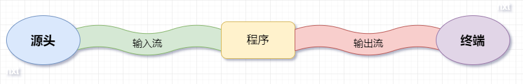
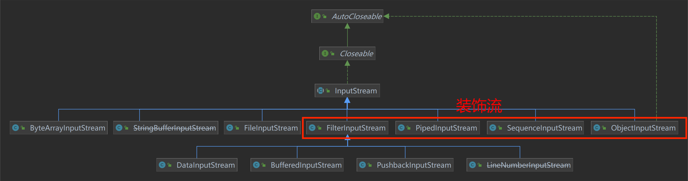
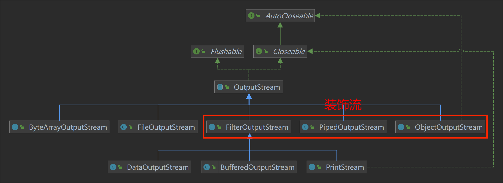
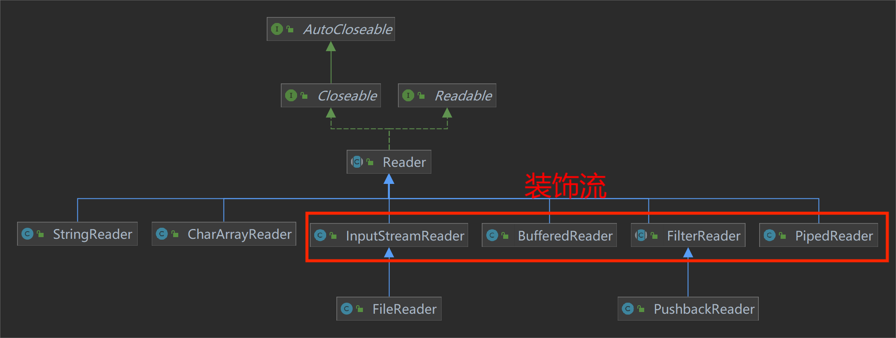
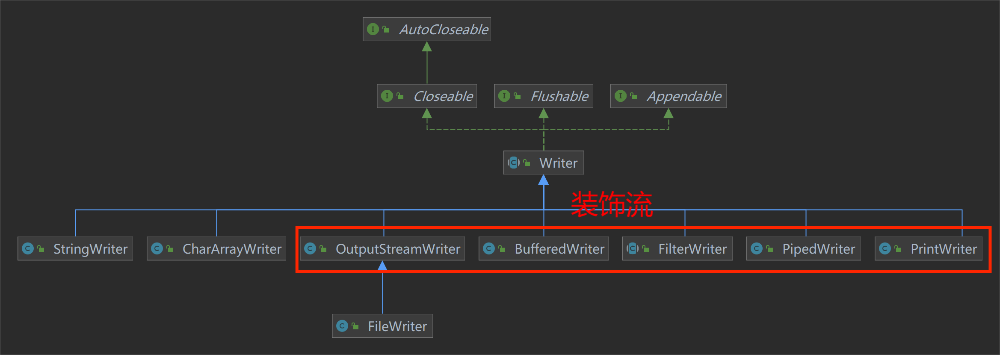

# JavaIO

> 所有的继承图都做了简化，只展示关键的关系。

## 一、基本概念

IO 是（I/O，Input/Output，输入/输出）广义上表示计算机从源头输入数据或输出数据到终端的一系列操作，通常用来描述计算机与外界进行交互的过程。

现在 Java 中的 IO 狭义上是指 java.io 包下的各种操作类，这些操作类用于实现输入/输出的这部分操作，主要关注的是从原始数据源的读取以及输出原始数据到目标媒介。

### （一）流

在 Java IO 中，流是一个核心的概念。流（Stream）是一组有顺序的，有起点和终点的数据集合，是对数据传输的总称或抽象， 即数据在两设备间的传输称为流。



采用数据流的目的就是使得输出输入独立于设备，**让用户只关心流的操作，而不用关心源头和中断是谁，不用关心怎样输入或输出数据。**

流的本质是数据传输，根据数据传输特性将流抽象为各种类，方便更直观的进行数据操作。流中的数据既可以是未加工的原始二进制数据，也可以是经过一定编码处理后的符合某种格式规定的特定数据。根据不同划分标准，对 java.io 包下有以下分类：

**数据类型分类**：

- 字节流（InputStream、OutputStream）
  - 字节流中的计量单位是**字节（1 byte）**。
  - 字节流中没有缓冲区，是直接输出的。因此在输出时，字节流不调用 colse()方法时，信息已经输出了。
  - 字节流能处理所有类型的数据（如图片、avi 等）。
- 字符流（Reader、Writer）
  - 字符流中的计量单位是**字符（1 char，2 byte）**，Java 中 char 使用 Unicode 字符集，采用 UTF-16 的编码方式，**2 个字节（16 位）来表示一个字符， 无论是汉字还是数字字母，或其他语言**。
    - 若对于一些达到 3 或 4 个字节的生僻字，会将其拆分成 2 个字符进行读写。
  - 字符流是输出到缓冲区的，字符流只有在调用 close()方法关闭缓冲区时，信息才输出。要想字符流在未关闭时输出信息，则需要手动调用 flush()方法。
  - 字符流只能处理文本类型的数据。

**数据流向分类**：

- 输入流（InputStream、Reader）
  - 有能力产出数据的数据源对象，程序从输入流（有能力产出数据的数据源对象）中读取数据。就是将数据源读入到程序的通信通道 ，不需要知道数据源从哪里来。
- 输出流（OutputStream、Writer）
  - 程序向输出流（有能力接受数据的接收端对象）写入数据，将程序中的数据输出到外界（显示器、打印机、文件、网络…）的通信通道，不需要知道数据流向哪里。

### （二）装饰者模式

装饰者模式是 Java IO 中最常用的设计模式，它可以在不改变原对象的基础上，将功能附加到对象上。

有以下优点：

- 装饰者模式可以动态的将功能加到想要增强的对象上。
- 可以使用多个装饰器持续装饰同一个对象，实现不同的效果。
- 可以有效防止使用继承导致类爆炸。

```java
public static void main(String[] args) {
    ABattercake aBattercake;
    aBattercake = new Battercake();
    // 比如这里，我第一次使用装饰者增强一个煎饼，如果继承也是可以这样写增强一个煎饼
    aBattercake = new EggDecorator(aBattercake);
    // 第二次装饰者又使用同样的手法去增强一个煎饼，如果继承的话要重新写一个类去继承增强煎饼
    aBattercake = new EggDecorator(aBattercake);
    // 以此类推
    aBattercake = new SausageDecorator(aBattercake);

    System.out.println(aBattercake.getDesc() + " 销售价格:" + aBattercake.cost());

}

// 抽象被装饰者
static abstract class ABattercake {
    protected abstract String getDesc();

    protected abstract int cost();

}

// 具体被装饰者
static class Battercake extends ABattercake {
    @Override
    protected String getDesc() {
        return "煎饼";
    }

    @Override
    protected int cost() {
        return 8;
    }
}

// 抽象装饰者
// 抽象装饰者继承抽象类以保持接口规范,也就是需要拥有被装饰者中的方法
// 包含被装饰类的引用,可以通过多态的方式对被装饰类进行装饰
static class AbstractDecorator extends ABattercake {
    private ABattercake aBattercake;

    public AbstractDecorator(ABattercake aBattercake) {
        this.aBattercake = aBattercake;
    }

    @Override
    protected String getDesc() {
        return this.aBattercake.getDesc();
    }

    @Override
    protected int cost() {
        return this.aBattercake.cost();
    }
}

// 具体装饰者
static class EggDecorator extends AbstractDecorator {
    public EggDecorator(ABattercake aBattercake) {
        super(aBattercake);
    }

    @Override
    protected String getDesc() {
        return super.getDesc() + " 加一个鸡蛋";
    }

    @Override
    protected int cost() {
        return super.cost() + 1;
    }
}

// 具体装饰者
static class SausageDecorator extends AbstractDecorator {
    public SausageDecorator(ABattercake aBattercake) {
        super(aBattercake);
    }

    @Override
    protected String getDesc() {
        return super.getDesc() + " 加一根香肠";
    }

    @Override
    protected int cost() {
        return super.cost() + 2;
    }
}
```

## 二、流实现类

### （一）File、Path 和 Files

- [File](https://blog.csdn.net/qq_35326718/article/details/64934934)：File 是非流式文件类，是对文件系统的映射，可以对表示为系统中的文件或目录，提供对文件或目录进行增删改查（查看文件属性）操作。
  - File 主要是表示文件系统中的一个目录或文件，而不是其内容。
- [Path](https://dengchengchao.com/?p=863)：JDK 7 中 Path 主要是用来替代 File 类，也表示为一个文件或目录路径。
  - Path 与 File 对比，增强了对文件或目录路径的操作功能，但是没有了增删改查的功能。
- [Files](https://blog.csdn.net/qq_35326718/article/details/65447561)：JDK 7 中 Files 主要提供 static 方法，和 Path 搭配使用，达到对文件或目录增删改查的操作。
  - Files 主要是操作 Path 对应的文件或目录，并且还提供了获取文件流的方法（其实就是封装 new InputStream(path, decoder)这种，省得自己写）。

> JDK 7 使用 Path 和 Files 替代 File，主要是将 File 功能划分的更加明显，Path 单纯的表示为目录或文件路径，Files 对文件或目录进行操作。

### （二）InputStream

InputStream 是字节输入流，用于从源头获取数据，输入到程序中，程序通过 read 方法获取输入流中字节类型的数据。

具体实现类如下：



#### 1、ByteArrayInputStream

将 byte 数组转化为字节输入流。

> 下面使用 try-with-resources 关闭流。

```java
void test() {
    byte[] buffer = new byte[]{0, 2, 4, 6, 8, 1, 3, 5, 7, 9};

    try (ByteArrayInputStream inputStream = new ByteArrayInputStream(buffer)) {
        int readData = 0;
        while ((readData = inputStream.read()) != -1) {
            System.out.println((byte) readData);
        }
    } catch (IOException e) {
        e.printStackTrace();
    }
}
```

#### 2、~~StringBufferInputStream~~

将字符串转化为字节输入流。

```java
@Test
void test() {

    try (StringBufferInputStream inputStream = new StringBufferInputStream("1234567890");) {
        int readData;
        while((readData = inputStream.read()) != -1) {
            System.out.println((char) readData);
        }
    } catch (IOException e) {
        throw new RuntimeException(e);
    }
}
```

#### 3、FileInputStream

将本地文件转化为字节输入流，从本地文件中读取数据，提供 read() 方法用于**读取下一个字节的数据**，如果没有读取到数据则返回 -1；read(byte []) 用于**读取下一个 byte 数组长度的字节数据**，返回值为存入 byte 数组中的字节个数，如果没有读取到数据则返回 -1。

```java
// 获取位于 resources 文件夹下的 test.txt 文件
public static File getFile() {
    String fileName = "test.txt";
    String projectClassDirName = Demo04_File.class.getResource("/").getPath();
    return new File(projectClassDirName.substring(1) + fileName);
}

@Test
public void testRead() {
    try (FileInputStream inputStream = new FileInputStream(getFile())) {
        int readData = 0;
        // while 循环读取下一个字节的数据
        while ((readData = inputStream.read()) != -1) {
            System.out.println((char) readData);
        }
    } catch (IOException e) {
        throw new RuntimeException(e);
    }
}

@Test
public void testReadByte() {
    try (FileInputStream inputStream = new FileInputStream(getFile())) {
        int readLen = 0;
        byte[] buf = new byte[8];
        while ((readLen = inputStream.read(buf)) != -1) {
            System.out.println(new String(buf, 0, readLen));
        }
    } catch (IOException e) {
        throw new RuntimeException(e);
    }
}
```

#### 4、FilterInputStream

FilterInputStream 使用装饰器模式，装饰 InputStream 类型的实现类，为其提供增强功能。不过 FilterInputStream 类本身并没有实现增强功能，例如：mark() 方法，而是作为抽象装饰者，提供几种子类实现具体的增强功能。

##### （1）DataInputStream

FileInputStream 的 read() 方法用于**读取 1 个字节**的数据并转化为 int 类型返回，DataInputStream 提供很多增强方法，用于返回其他基本类型的值，例如：readInt() 方法**读取 4 个字节**的数据，对二进制值进行移位操作后拼接成 int 类型，例如：一次性读取 "aaaa"，a 的二进制值为 "01100001"，4 个 a 的二进制值拼接成 "01100001011000010110000101100001"，最终返回 int 类型的值。

> 注意：readInt() 方法如果在读取 4 个字节之前到达末尾，则抛出 EOFException 异常，其他方法同理。

```java
@Test
void test() {
    String a = "01100001"; // 'a' 二进制
    System.out.println(Integer.parseInt(a + a + a + a, 2));

    byte[] array = new byte[]{'a', 'a', 'a', 'a'};
    try (ByteArrayInputStream inputStream = new ByteArrayInputStream(array);
         DataInputStream dataInputStream = new DataInputStream(inputStream);) {
        int readData = 0;
        while ((readData = dataInputStream.readInt()) != -1) {
            System.out.println(readData);
        }
    } catch (IOException e) {
        e.printStackTrace();
    }
}
```

##### （2）BufferedInputStream

BufferedInputStream 中维护一个缓存（byte[] buf），每次 read() 时都会优先从缓存中读取数据，若**缓存为空或已读取完缓存中的数据**，则将源头中新的数据存入缓存，再进行读取。可以减少访问源头（例如：磁盘文件）次数，提高性能。

```java
public static void main(String[] args) throws Exception {
    int size = 4;
    try (ByteArrayInputStream inputStream = new ByteArrayInputStream("1234567890".getBytes());
         BufferedInputStream bis = new BufferedInputStream(inputStream, size)) {
        System.out.println("Char : " + (char) bis.read());

        System.out.println("-------mark(3)----------");
        // 标记当前读取的位置 2，最多可以再读取 readlimit 字节的数据
        bis.mark(3);
        System.out.println("Char : " + (char) bis.read());
        System.out.println("Char : " + (char) bis.read());
        System.out.println("Char : " + (char) bis.read());
        // 若读取超出 Math.max(readlimit, size) 字节，则 mark 标记失效，调用 reset 时抛异常
        System.out.println("Char : " + (char) bis.read());
        // System.out.println("Char : " + (char) bis.read());

        System.out.println("-------reset()----------");
        bis.reset();
        int b;
        while ((b = bis.read()) != -1) {
            System.out.println("char : " + (char) b);
        }
    } catch (IOException e) {
        e.printStackTrace();
    }
}
```

> [注意](https://blog.csdn.net/liuxiao723846/article/details/117693340)：BufferedInputStream 类调用 mark(readlimit)方法后读取多少字节标记才失效，是取 readlimit 和 BufferedInputStream 类的缓冲区大小两者中的最大值，而并非完全由 readlimit 确定。

##### （3）PushbackInputStream

读取流中的数据时是顺序地、连续地、不可以被中断地，并且流中只可以被读取一次。对于其他 IO 流，流中的数据我们只能读取一次；PushbackInputStream 提供 unread() 方法，可以将指定的数据推回到流头部，在下次读取时再次获取。

```java
@Test
void test() {
    try (ByteArrayInputStream inputStream = new ByteArrayInputStream("1234567890".getBytes());
         PushbackInputStream pushbackInputStream = new PushbackInputStream(inputStream);) {
        int readData;
        while ((readData = pushbackInputStream.read()) != -1) {
            System.out.println((char) readData);
            if (readData == '5') {
                pushbackInputStream.unread(readData); // 将 5 推回到流头部，下次 read 时又可以读取到
            }
            readData = pushbackInputStream.read();
            System.out.println((char) readData);
        }
    } catch (IOException e) {
        throw new RuntimeException(e);
    }
}
// 1 2 3 4 5 5 6 7 8 9 0
```

##### （4）~~LineNumberInputStream~~

LineNumberInputStream 用于获取和设置行号，从 0 开始。

```java
@Test
void test() {
    try (FileInputStream inputStream = new FileInputStream(getFile());
         LineNumberInputStream lineNumberInputStream = new LineNumberInputStream(inputStream)) {
        int readData;
        lineNumberInputStream.setLineNumber(0);
        while ((readData = lineNumberInputStream.read()) != -1) {
            System.out.println((char) readData);
            if (readData == '\n') {
                System.out.println(lineNumberInputStream.getLineNumber());
            }
        }
    } catch (IOException e) {
        e.printStackTrace();
    }
}
```

#### 5、ObjectInputStream

ObjectInputStream 使用装饰器模式，提供增强的 readObject()方法，可以将读取的字节数据反序列化为对象。

> 注意：对象必须实现 Serializable 接口。

```java
private String fileName = "Person.bin";

// 将 Person 对象序列化为字节数据存储
@Test
void testOut() {
    try (FileOutputStream outputStream = new FileOutputStream(getFile(fileName));
         ObjectOutputStream objectOutputStream = new ObjectOutputStream(outputStream);) {
        Person person = new Person("zhangsan", 22);
        objectOutputStream.writeObject(person);
        objectOutputStream.flush();
    } catch (IOException e) {
        e.printStackTrace();
    }
}

// 将字节数据反序列化为 Person 对象
@Test
void testIn() {
    try (FileInputStream inputStream = new FileInputStream(getFile(fileName));
         ObjectInputStream objectInputStream = new ObjectInputStream(inputStream);) {
        Person person = (Person) objectInputStream.readObject();
        System.out.println(person);
    } catch (IOException | ClassNotFoundException e) {
        e.printStackTrace();
    }
}

@Data
@AllArgsConstructor
static class Person implements Serializable {
    private String name;

    private int age;
}
```

#### 6、SequenceInputStream

SequenceInputStream 使用装饰器模式，依次从多个输入流中读取数据。

```java
@Test
void test() throws FileNotFoundException {
    Vector<InputStream> vector = new Vector<>();
    vector.add(new ByteArrayInputStream("1234567890".getBytes()));
    vector.add(new FileInputStream(getFile()));
    Enumeration<InputStream> enumeration = vector.elements();

    try (SequenceInputStream sequenceInputStream = new SequenceInputStream(enumeration);) {
        byte[] buf = new byte[8];
        int readLen = 0;
        while ((readLen = sequenceInputStream.read(buf)) != -1) {
            System.out.println(new String(buf, 0, readLen));
        }
    } catch (IOException e) {
        e.printStackTrace();
    }
}
```

#### 7、[PipedInputStream](https://www.jianshu.com/p/8aefeb3a12cf)

PipedInputStream 和 PipedOutputStream 搭配使用，PipedInputStream 接收 PipedOutputStream 写入的数据，用于两个线程间的通信（字节数据传输）。

PipedInputStream 中维护一个缓存 buffer，PipedOutputStream 直接向 buffer 中写入数据，当 buffer 为空时，会唤醒所有 PipedOutputStream 的写入线程进行写入，并让读取线程计时等待 1000ms；当 buffer 满时，会唤醒所有 PipedInputStream 的读取线程进行读取，并让写入线程计时等待 1000ms。

```java
@Test
void test() {
    try (PipedOutputStream out = new PipedOutputStream();
         PipedInputStream in = new PipedInputStream(out, 4)) {
        new Thread(() -> {
            try {
                int count = 0;
                while (count++ < 100) {
                    // 写入数据
                    out.write("hello kl".getBytes(StandardCharsets.UTF_8));
                }
                out.close();
            } catch (IOException e) {
                e.printStackTrace();
            }
        }).start();
        int receive;
        // 读取数据
        while ((receive = in.read()) != -1) {
            System.err.print((char) receive);
        }

    } catch (IOException e) {
        e.printStackTrace();
    }
}
```

若单独使用 PipedInputStream ，会造成死锁（严格来说不叫死锁）的情况。因为 PipedInputStream 会循环判断是否 buffer 为空并且 PipedOutputStream 是否关闭（默认未关闭），当 buffer 为空并且 PipedOutputStream 未关闭时，则会计时等待 1000ms，并进入下次循环。

```java
public static void main(String[] args) {
    try (PipedInputStream in = new PipedInputStream()) {
        int receive;
        while ((receive = in.read()) != -1) {
            System.err.print((char) receive);
        }
        System.out.println("完成");
    } catch (IOException e) {
        e.printStackTrace();
    }
}
```

若单独使用 PipedOutputStream，**可能会**造成死锁的情况。因为 PipedOutputStream 会循环判断 buffer 是否已满，当 buffer 已满时，则会计时等待 1000ms，并进入下次循环。

```java
public static void main(String[] args) {
    try (PipedOutputStream out = new PipedOutputStream();
         // pipeSize 值改为 4，查看阻塞的情况
         PipedInputStream in = new PipedInputStream(out, 1000)) {

        out.write("hello kl".getBytes(StandardCharsets.UTF_8));

        int receive;
        while ((receive = in.read()) != -1) {
            System.err.print((char) receive);
        }

        System.out.println("完成");
    } catch (IOException e) {
        e.printStackTrace();
    }
}
```

### （三）OutputStream

OutputStream 是字节输出流，程序通过 write 方法向输出流中写入数据，输出到终端。



#### 1、ByteArrayOutputStream

将字节数据转化为字节输出流，写入 byte 数组缓存中。

```java
@Test
void test() {
    try (ByteArrayOutputStream outputStream = new ByteArrayOutputStream();
         FileOutputStream fileOutputStream = new FileOutputStream(getFile())) {
        byte[] buf = "1234567890".getBytes();
        for (byte writeData : buf) {
            outputStream.write(writeData);
        }
        outputStream.write(buf);
        // 输出到 FileOutputStream
        outputStream.writeTo(fileOutputStream);
    } catch (IOException e) {
        throw new RuntimeException(e);
    }
}
```

#### 2、FileOutputStream

将字节数据转化为文件输出流，并最终写入到文件中。

FileOutputStream 有参构造中提供一个 append 参数，当值为 false 时，write 写入的数据会覆盖掉原文件内容；当值为 true 时，write 写入的数据会追到写入原文件内容后面。

FileOutputStream 初始化时会获取对应的文件描述符（FileDescriptor），代码结束时需要主动调用 close() 方法，用于关闭此 FileOutputStream 并释放与此流链接的所有系统资源。

> [文件描述符](https://blog.csdn.net/qq_26222859/article/details/52068615)是由无符号整数表示的句柄，进程使用它来标识打开的文件。文件描述符与包括相关信息（如文件的打开模式、文件的位置类型、文件的初始类型等）的文件对象相关联，这些信息被称作文件的上下文。

```java
@Test
void test() {
    try (FileOutputStream outputStream = new FileOutputStream(getFile(), true)) {
        byte[] buf = "1234567890".getBytes();
        for (byte writeData : buf) {
            outputStream.write(writeData);
        }
    } catch (IOException e) {
        throw new RuntimeException(e);
    }
}
```

#### 3、FilterOutputStream

**FilterOutputStream 使用装饰器模式**，装饰 OutputStream 类型的实现类，为其提供增强功能。

##### （1）DataOutputStream

DataOutputStream 为 OutputStream 提供增强方法，可以传入其他基本类型的值，一般和 DataInputStream 搭配使用。

> 其底层还是调用 OutputStream 的 write() 方法，将传入的值解析为字节类型进行写入。

```java
@Test
void test() {
    try (FileOutputStream outputStream = new FileOutputStream(getFile(), true);
         DataOutputStream dataOutputStream = new DataOutputStream(outputStream);
         FileInputStream inputStream = new FileInputStream(getFile());
         DataInputStream dataInputStream = new DataInputStream(inputStream)) {

        dataOutputStream.writeChars("I Love 中国");

        char readData;
        while (dataInputStream.available() != 0) {
            readData = dataInputStream.readChar();
            System.out.println(readData);
        }

    } catch (IOException e) {
        throw new RuntimeException(e);
    }
}
// 文件中的值为：
//  I   L o v e  N-V�
```

##### （2）BufferedOutputStream

BufferedOutputStream 中维护一个 byte 数组缓存，每次写入数据时，都先将数据写入缓存，待缓存满时才会真正的写入终端，**可以减少写入磁盘次数**。若缓存未满时，程序便结束了，此时会发生缓存中的数据未写入终端的情况，需要显式地调用 flush() 或 close() 方法，将缓存中的数据写入终端。

```java
@Test
void test() {
    try {
        FileOutputStream outputStream = new FileOutputStream(getFile());
        BufferedOutputStream bufferedOutputStream = new BufferedOutputStream(outputStream);

        byte[] buf = "0123456789".getBytes();
        bufferedOutputStream.write(buf);

        // 需要刷新，才能在缓存未满时，将缓存中的数据写入终端
        bufferedOutputStream.flush();
    } catch (IOException e) {
        throw new RuntimeException(e);
    }
}
```

##### （3）PrintStream

PrintStream 为 OutputStream 提供增强方法，可以传入其他基本类型的值。

> `System.out` 就是 PrintStream 对象，装饰控制台输出流。
>
> 底层是使用 OutputStreamWriter 实现数据的写入，并且自动调用 flush() 方法刷新缓存中的数据，不需要手动调用。

和 DataOutputStream 不同点：

- PrintStream 提供 print() 和 println() 重载方法用于写入其他类型的值；DataOutputStream 提供 write 开头的方法写入其他类型的值。
- PrintStream 内部使用 Writer 字符输出流，将传入的值作为字符写入终端；DataOutputStream 将传入的值看做**二进制值进行移位操作后拼接成的值**，进行反向以为操作后，拆分成 byte 类型进行写入。

```java
@Test
void test() {
    try (FileOutputStream outputStream = new FileOutputStream(getFile());
         PrintStream printStream = new PrintStream(outputStream);) {

        printStream.print("I Love 中国");

    } catch (IOException e) {
        throw new RuntimeException(e);
    }
}

// 文件中的值为：
// I Love 中国
```

#### 4、ObjectOutputStream

ObjectOutputStream 使用装饰器模式，提供增强的 writeObject()方法，将对象序列化为字节数据写入终端，一般和 ObjectInputStream 搭配使用。

#### 5、PipedOutputStream

PipedOutputStream 用于线程之间的通信，和 PipedInputStream 搭配使用。

### （四）Reader

Reader 是字符输入流，用于从源头获取数据，输入到程序中，程序通过 read 方法获取输入流中字符类型的数据。

具体实现类如下：



#### 1、CharArrayReader

将 char 数组转化为字符输入流。

```java
@Test
void test() {
    // \uD834\uDF06 会分成 2 个 char 读取，并且没有对应的 unicode 码，因此展示不出来
    try (CharArrayReader charArrayReader = new CharArrayReader("0123456789中国龘\uD834\uDF06".toCharArray())) {

        int readData;
        while ((readData = charArrayReader.read()) != -1) {
            System.out.println((char) readData);
        }

         System.out.println(Integer.toBinaryString(57094)); // 获取 DF06 的二进制编码值
    } catch (IOException e) {
        throw new RuntimeException(e);
    }
}
```

#### 2、StringReader

将 String 转化为字符输入流，替代了 StringBufferInputStream。

```java
@Test
void test() {

    try (StringReader reader = new StringReader("0123456789中国龘\uD834\uDF06");) {
        int readData;
        while ((readData = reader.read()) != -1) {
            System.out.println((char) readData);
        }
    } catch (IOException e) {
        throw new RuntimeException(e);
    }
}
```

#### 3、InputStreamReader

InputStreamReader 用于将 InputStream 转换为 Reader，并且有参构造中可以传入 Charset，读取字节并将其解码为字符。

```java
@Test
void test() {
    try (FileInputStream inputStream = new FileInputStream(getFile());
         // 文件中使用 GBK 编码格式编码，在这里就需要传入 GBK 格式进行解码
         InputStreamReader inputStreamReader = new InputStreamReader(inputStream, Charset.forName("GBK"));) {

        int readData;
        while ((readData = inputStreamReader.read()) != -1) {
            System.out.println((char) readData);
        }
    } catch (IOException e) {
        throw new RuntimeException(e);
    }
}
```

##### （1）FileReader

FileReader 是 InputStreamReader 的子类，用于将 FileInputStream 转换为 Reader。

#### 4、BufferedReader

BufferedReader 中维护一个缓存（char[] cb），每次 read() 时都会优先从缓存中读取数据，若**缓存为空或已读取完缓存中的数据**，则将源头中新的数据存入缓存，再进行读取。可以减少访问源头（例如：磁盘文件）次数，提高性能。

此外 BufferedReader 中还提供一个 readLine() 方法，可以一次性读取一行数据（一次性读取直到读取到 ’\r‘、'\n' 或 '\r\n' 换行符）。

```java
@Test
void test() {
    try (StringReader reader = new StringReader("0123");
         BufferedReader bufferedReader = new BufferedReader(reader, 4);) {
        String readData;
        while ((readData = bufferedReader.readLine()) != null) {
            System.out.println(readData);
        }
    } catch (IOException e) {
        throw new RuntimeException(e);
    }
}
```

> [注意](https://www.jb51.net/article/231484.htm)：
>
> - 读入的数据要注意有 ’\r‘、'\n' 或 '\r\n' 换行符。
> - 没有数据时会阻塞，在数据流异常（EOFException）或断开（close）时才会返回 null。
> - 非必要时（socket 之类的数据流），要避免使用 readLine()，以免为了等待一个换行/回车符而一直阻塞。

### （五）Writer

Writer 是字符输出流，程序通过 write 方法向输出流中写入数据，输出到终端。



#### 1、CharArrayWriter

将字符数据转化为字符输出流，写入 char 数组缓存中。

```java
@Test
void test() {
    try (FileWriter fileWriter = new FileWriter(getFile());
         CharArrayWriter charArrayWriter = new CharArrayWriter()) {
        charArrayWriter.write("0123456789中国龘\uD834\uDF06");
        // 写入 fileWriter 中
        charArrayWriter.writeTo(fileWriter);
    } catch (IOException e) {
        throw new RuntimeException(e);
    }
}
```

#### 2、StringWriter

将字符数据转化为字符输出流，写入 StringBuffer 中。

```java
@Test
void test() {
    try (StringWriter stringWriter = new StringWriter()) {
        stringWriter.write("0123456789中国龘\uD834\uDF06");

        System.out.println(stringWriter);
    } catch (IOException e) {
        throw new RuntimeException(e);
    }
}
```

#### 3、OutputStreamWriter

OutputStreamWriter 用于将 OutputStream 转换为 Writer，并且有参构造中可以传入 Charset，将字符编码成对应编码格式字节。

```java
@Test
void test() {
    try (FileOutputStream outputStream = new FileOutputStream(getFile(), true);
         OutputStreamWriter outputStreamWriter = new OutputStreamWriter(outputStream);) {

        outputStreamWriter.write('\n');
        outputStreamWriter.write("I Love 祖国");
    } catch (IOException e) {
        throw new RuntimeException(e);
    }
}
```

##### （1）FileWriter

FileWriter 是 OutputStreamReader 的子类，用于将 FileOutputStream 转换为 Writer。

#### 4、BufferedWriter

BufferedWriter 中维护一个 char 数组缓存，每次写入数据时，都先将数据写入缓存，待缓存满时才会真正的写入终端，**可以减少写入磁盘次数**。若缓存未满时，程序便结束了，此时会发生缓存中的数据未写入终端的情况，需要显式地调用 flush() 或 close() 方法，将缓存中的数据写入终端。

```java
@Test
void test() throws IOException {
    FileWriter fileWriter = new FileWriter(getFile(), true);
    BufferedWriter bufferedWriter = new BufferedWriter(fileWriter);
    try {
        bufferedWriter.write('\n');
        bufferedWriter.write("new 的数据");
        // 需要刷新，才能在缓存未满时，将缓存中的数据写入终端
        bufferedWriter.flush();
    } catch (IOException e) {
        throw new RuntimeException(e);
    }
}
```

#### 5、PrintWriter

PrintWriter 为 Writer 提供增强方法，可以传入其他基本类型的值，此外也可以传入 OutputStream，将 OutputStream 转化为 Writer。

> 注意：PrintWriter 不像 PrintStream 一样自动调用 flush() 方法，需要显式地手动调用。

```java
@Test
void test() {
    PrintWriter printWriter = new PrintWriter(System.out);
    printWriter.println("new 数据");
    // 刷新
    printWriter.flush();
}
```

## 三、疑问

### （一）[read() 方法返回值为什么是 int 类型，而不是 byte 类型](https://blog.csdn.net/gao_zhennan/article/details/118935151)？

源头中数据存储的最基本单位是字节，值为 00000000 ~ 11111111，而在 Java 中是用 byte 表示字节类型，它是有符号整数，当二进制值为 11111111 时，在 Java 看来就就是 -1（byte 类型）的补码。而 read()方法在返回值为 -1 时，会认为输入流已读取完，为了避免这个误会，返回值为 int 类型，使用 int 值的后 8 位表示读取的 1 个字节。

### （二）IO 流同时对同一个文件进行读写操作时的问题

当同时使用 IO 对同一个文件进行读写时，可能会造成源文件内容全部丢失：

```java
@Test
void test() {
    // 同时对同一个文件定义输入输出流
    try (FileInputStream inputStream = new FileInputStream(getFile());
         // append 参数为 false
         FileOutputStream outputStream = new FileOutputStream(getFile());) {

        int readData;
        while ((readData = inputStream.read()) != -1) {
            outputStream.write(readData);
        }

    } catch (IOException e) {
        throw new RuntimeException(e);
    }
}
```

因为 FileOutputStream 有参构造中 append 参数为 false 时，会先将源文件中的内容清除，再进行写入。此时 FileInputStream 还没有读取数据，FileOutputStream 就将文件内容全部清除，当然获取不到数据了。

因此不要同时为同一个文件定义输入输出流，要有先后顺序：

```java
@Test
void test2() throws IOException {
    FileInputStream inputStream = new FileInputStream(getFile());

    // 先使用 ArrayList 缓存数据
    ArrayList<Byte> list = new ArrayList<>(1024);
    int readData;
    while ((readData = inputStream.read()) != -1) {
        list.add((byte) readData);
    }

    // append 参数为 false，会将源文件内容清空
    FileOutputStream outputStream = new FileOutputStream(getFile());
    for (byte data : list) {
        outputStream.write(data);
    }

    inputStream.close();
    outputStream.close();
}
```
