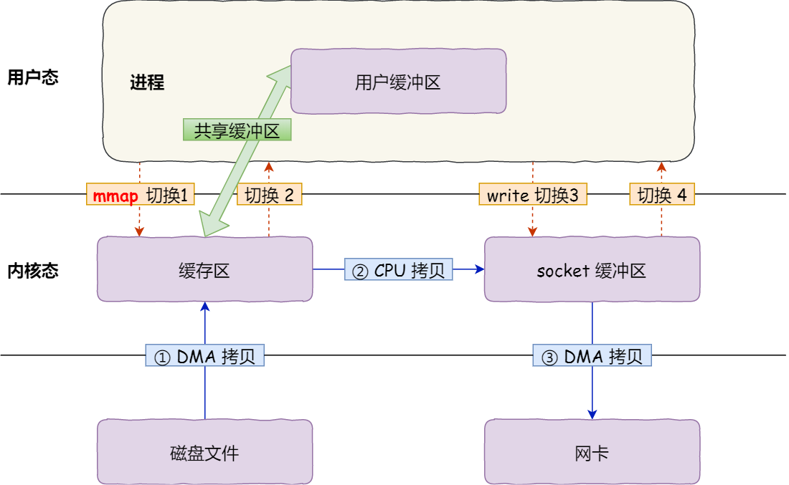

# JavaNIO

> 基于[尚硅谷 java 学习笔记——NIO（New IO）](https://blog.csdn.net/zxm1306192988/article/details/60581173)
>
> 所有的继承图都做了简化，只展示关键的关系。

## 一、基本概念

Java NIO（New IO 或 Non Blocking IO）是从 Java 1.4 版本开始引入的一个新的 java.nio 包，可以替代标准的 java.io 包。NIO 支持面向缓冲区的、基于通道的 IO 操作。**NIO 将以更加高效的方式进行文件的读写操作**。

与 OIO（Old IO，也可以称为 BIO，Blocking IO）的区别：

- OIO：
  - 面向流操作。
  - 阻塞 IO，对于文件 IO 和网络 IO，线程需要等待该流读写完数据，期间线程会阻塞。
- NIO：
  - 面向缓冲区操作。
  - 非阻塞 IO，主要体现在网络 IO，线程从某通道读写时没有数据，就会执行其他任务。文件 IO，FileChannel 没有非阻塞的方式。

NIO 中有三个重要的组件：

- Buffer 缓冲区：NIO 是以 Buffer 为最小单位读写数据的，Buffer 用于存储读写的字节数据。
- Channel 通道：Channel 通道主要是负责运输 Buffer，进行读写操作。相对于 OIO 而言，流是单向的，输入流类只有输入功能，输出流类只有输出功能；对于 NIO 来说，有了 Channel 通道概念，读写是双向的，也就是一个通道类可以创建一个输入通道对象执行输入功能，一个输出通道对象输出功能，也可以同时拥有输入和输出功能。
- Selector 选择器：用于监听注册了选择器的通道的感兴趣事件。

## 二、[五种 IO 模型](https://zhuanlan.zhihu.com/p/95550964)

在《UNIX 网络编程第 1 卷》中介绍了五种 IO（网络 IO）模型：

> 以下只关注 read 读数据时的表现，不关注 accept、connect 和 write 操作。
>
> 程序发起 read 读请求去读取 Socket 缓冲区的内容时，用户程序权限不足（用户程序不能直接操作硬件），需要执行系统调用，中断用户程序执行（阻塞开始）。当 CPU 从内核空间（Socket 缓冲区）获取数据并拷贝到用户空间后，用户程序继续执行（阻塞结束）。

### （一）阻塞 IO（Blocking IO）


在阻塞 IO 中，整个 read 请求期间程序都处于阻塞状态，在内核中阻塞主要表现在**等待数据**和**从内核拷贝到用户空间**。

**缺点**：

- CPU 理由率低。
- 高并发下需要创建大量线程，浪费资源；
- 网络 IO 下网络不稳定时，会造成线程上下文频繁切换，造成锯齿状系统负载。

```java
// 伪代码
{
    // 此处阻塞，直到用户空间获取数据
    while(socket.read(buffer) > 0) {
        ......
    }
}
```

### （二）非阻塞 IO（Non Blocking IO）


在非阻塞 IO 中，会将 Socket 设置为非阻塞模式，用户线程发起 read 请求后，并不需要等待内核数据准备就绪，而是直接返回一个结果 EWOULDBLOCK，让用户线程知道数据并没有准备好。用户线程可以发起下次 IO 请求，直到数据准备好。

```java
// 伪代码
{
    // 用户线程不知道什么时候数据准备好，只能在 while 中轮询等待
    while(read(socket, buffer) != SUCCESS){
        ......
    }
    process(buffer);
}
```

**优缺点**：

- 在网络 IO 中，不需要及时响应的网络应用开发，可以针对不同的返回结果让线程做不同的处理，而不会阻塞等待。
- 为了获取数据，需要轮询请求，造成频繁地上下文切换，消耗量大量的 CPU 资源。

**一般很少直接使用这种模型，而是在其他 IO 模型中使用非阻塞 IO 这一特性**。

### （三）多路复用 IO（IO Multiplexing）


多路是指多个 Socket 连接，复用表示使用同一个线程。多路复用就是使用一个线程监听多个 Socket 上的事件，当有事件就绪（例如：有数据可读）时，将数据从内核空间拷贝到用户空间。

从流程上来看，使用 select 函数进行 IO 请求和阻塞 IO 模型没有太大的区别，甚至还多了添加监视 Socket，以及调用 select 函数的额外操作，效率更差。但是，使用 select 以后最大的优势是用户可以在一个线程内同时处理多个 Socket 的 IO 请求。用户可以注册多个 socket，然后不断地调用 select 读取被激活的 Socket，即可达到在**同一个线程内同时处理多个 IO 请求的目的**。而在阻塞 IO 模型中，必须通过多线程的方式才能达到这个目的。

```java
// 伪代码
{
    // 监听是否有就绪事件，没有时阻塞
    while(selector.select(sockets) > 0) {
        events = selector.getEvents();
        for(event in events) {
            if(can_read(event)) {
                read(socket, buffer);
                process(buffer);
            }else if(can_write(event)){
                write(socket, buffer);
                process(buffer);
            }else{
                // ....
            }
        }
    }
}
```

**优缺点**：

- 一个线程可以对应多个 Socket 连接，减少开辟的线程数。
- 当一个 Socket 的请求体很大，也就是这个 Socket 的读写操作很慢时，会影响到后续 Socket 的读写操作。

### （四）信号驱动 IO（Signal Driven IO）


信号驱动就是内核在 FD（文件描述符）准备好时用信号 SIGIO 通知应用程序：

1. 套接字接口允许信号驱动 I/O，通过系统调用 sigacton 安装一个信号处理。此系统调用立即返回，进程继续工作，它是非阻塞的。
2. 当内核数据报准备好时，就为该进程生成一个 SIGIO 信号，给进程发信号。可以立即在信号处理程序中调用 recvfrom 程序读取数据报。

**由于信号驱动 IO 在实际中并不常用，在此不做具体分析。**

### （五）异步 IO（Asynchronous IO）


当用户发起 read 请求后，内核会立刻返回，让内核来操作整个数据过程：在内核把数据准备完成后，从内核拷贝到应用进程缓冲区，然后通知应用进程（调用回调函数）。

信号驱动 IO 是在数据准备好后，系统通知用户程序**主动**去读取数据，将数据从内核空间拷贝到用户空间（这一阶段阻塞）；异步 IO 全程由内核控制，直到数据拷贝到用户空间，然后通知应用程序，用户**被动**获取数据。

**优缺点**：

- 适合高性能高并发应用；
- 不阻塞，数据一步到位。
- 实现和开发应用难度大。

---


前四个模型都是同步 IO 操作，它们的区别在于第一阶段，而第二阶段操作（调用 recvfrom 函数）是一致的；而异步 IO 不会阻塞用户程序（数据准备和内核拷贝），当内核通知用户线程的时候，用户不需要主动去拷贝数据，内核已经拷贝给到用户线程。

## 三、Buffer

Buffer 是一块固定大小的缓冲区，用于存储和获取某种类型的数据，NIO 中提供多种不同类型的 Buffer 缓冲区实现类：


Buffer 类维护四个核心变量来提供关于缓冲区信息：


- capacity：缓冲区的最大长度。
- limit：
  - clear() 转换成写操作后，表示缓冲区的最大长度。
  - flip() 转换成读操作后，表示写操作时 positon 的值，也就是当前可读的数据长度。
- position：下一个读写的起始位置，flip() 和 clear() 后 position 被重置为 0。
- mark：记录上一次读写时 position 的位置，需要先 mark() 后才能 reset()。

Buffer 中的数据不会被删除，而是基于上面的四个变量，让数据被写覆盖或读不到。以 ByteBuffer 为例，其他类型的 Buffer 用法差不多：

```java
// 分配一个指定大小的缓冲区
private static ByteBuffer buf = ByteBuffer.allocate(1024);

public static void main(String[] args) {
    initBuffer();
    writeBuffer();
    readBuffer();
    repeatReadBuffer();
    clearBuffer();
}

public static void initBuffer() {
    System.out.println("--------------allocate()----------------");
    // 是下一个读写操作的下标。读时，下一个要读的位置；写时，下一个要写入的位置
    System.out.println(buf.position());
    // 写模式下，limit等于capacity
    // 读模式下，limit等于position，相当于缓冲区中数据的长度
    System.out.println(buf.limit());
    // 缓冲区的最大长度
    System.out.println(buf.capacity());
}

/**
 * put() 将数据写入 Buffer 中
 */
public static void writeBuffer() {
    buf.put("abcde".getBytes());

    System.out.println("-------------put()-------------");
    System.out.println(buf.position());
    System.out.println(buf.limit());
    System.out.println(buf.capacity());
}

/**
 * 切换为读模式，将 limit 置为 position，position 置为 0，mark 置为-1
 */
public static void readBuffer() {
    buf.flip();

    // 若在读模式下进行写入操作，
    // 1、会改变Buffer的position位置，get(buffer[])时会进行判断，然后报错
    //        buf.put("g".getBytes());
    // 2、若真的需要在读的时候改，需要使用rewind重置position的值
    //        buf.rewind();

    System.out.println("--------------flip()------------");
    System.out.println(buf.position());// 0
    System.out.println(buf.limit());// 5
    System.out.println(buf.capacity());// 1024

    byte[] dst = new byte[buf.limit()];
    // 将buf中的数据传输到目标dst
    buf.get(dst);
    System.out.println(new String(dst, 0, dst.length));

    System.out.println("--------------get()------------");
    System.out.println(buf.position());// 5
    System.out.println(buf.limit());// 5
    System.out.println(buf.capacity());// 1024
}

/**
 * 重置当前参数： 将position设置为0，mark设置为-1
 * 读模式下，从头开始读；写模式下，重新写入
 */
public static void repeatReadBuffer() {
    buf.rewind();

    System.out.println("--------------rewind()------------");
    System.out.println(buf.position());// 0
    System.out.println(buf.limit());// 5
    System.out.println(buf.capacity());// 1024
}

/**
 * close() 转换为写模式，将 position 置为 0，limit 置为 capacity，mark 置为-1
 */
public static void clearBuffer() {
    buf.clear();

    System.out.println("--------------clear()------------");
    System.out.println(buf.position());// 0
    System.out.println(buf.limit());// 1024
    System.out.println(buf.capacity());// 1024

    // 虽然执行clear()，但是buffer中的数据并没有被删除，仍然可以获取position或指定位置的数据
    System.out.println((char) buf.get());
}

/**
 * mark() 用于标记当前 position 位置，在 reset() 后 position 回到 mark 的位置
 */
@Test
void remainBuffer() {
    System.out.println("--------------mark()------------");
    String str = "abcde";
    ByteBuffer buf = ByteBuffer.allocate(1024);
    buf.put(str.getBytes());
    buf.flip();

    byte[] dst = new byte[buf.limit()];
    buf.get(dst, 0, 2);
    System.out.println(new String(dst, 0, 2));// ab
    System.out.println(buf.position());// 2

    // mark()，将mark置为当前的position
    buf.mark();

    buf.get(dst, 2, 2);// 再读两个位置
    System.out.println(new String(dst, 2, 2));// cd
    System.out.println(buf.position());// 4

    // reset()，将position置为mark，相当于回到上一个位置
    buf.reset();
    System.out.println(buf.position());// 2

    // 判断缓冲区中是否还有剩余数据
    if (buf.hasRemaining()) {
        // 获取缓冲区中可以操作的数量
        System.out.println(buf.remaining());// 3
    }
}

/**
 * 当前Buffer分配直接缓冲区
 */
@Test
void isDirectBuffer() {
    System.out.println("--------------allocateDirect()------------");
    buf = ByteBuffer.allocateDirect(1024);
    // 是否是直接缓冲区
    System.out.println(buf.isDirect());
}
```

> 注意：Buffer 是一块固定大小的缓存，当读写超出 capacity 时，会抛异常。

### （一）[非直接缓冲区和直接缓冲区](https://www.jianshu.com/p/8ae3e57a8aa9)

可以注意到，ByteBuffer 下有两个具体的实现类——HeapByteBuffer 和 DirectByteBuffer，其他类型的 Buffer 下也都有这两种类似的实现类，分别称为：**非直接缓冲区和直接缓冲区**。在用法上，这两种缓冲区并没有什么区别，但是在底层结构上有区别：

#### 1、非直接缓冲区

**缓存位于 JVM 的堆内存中**，受 JVM 管理，在文件 IO 操作中：

- 用户程序（用户态）进行系统调用（文件 IO），此时切换到内核程序（内核态）读取磁盘中的文件到物理内存中。
- 再由内核程序从物理内存拷贝到 JVM 内存中，切换回用户程序存储到具体的缓存。


例如：HeapByteBuffer 中维护着一个 byte 数组，这就是用于存储数据的缓存，这块数组内存由 JVM 进行管理。

#### 2、直接缓冲区

**缓存位于物理内存中**，不受 JVM 管理，在文件 IO 操作中：

- 在物理内存中申请一块指定大小的缓冲区。
- 用户程序（用户态）进行系统调用（文件 IO），此时切换到内核程序（内核态）读取磁盘中的文件到申请的缓冲区中。
- **不需要再拷贝到 JVM 内存中**，JVM 中维持这这块缓冲区的映射，可以直接进行读写操作。


**优缺点**：

- 由于直接缓冲区位于 JVM 内存之外，因此不会对占用 JVM 堆内存。
- 没有中间从物理内存拷贝到 JVM 内存的过程，读写速度更快，效率更高。
- 创建直接缓冲区时有更多的性能消耗。
- 数据进入直接缓冲区后，后续写入磁盘等操作就完全由操作系统决定了，不受我们控制。

因此只有缓冲区要长时间使用（数据本身需要长时间在内存或缓冲区复用率很高），或者大数据量的操作（大文件才能体现出速度优势）时使用。

## 四、Channel

Channel 通道和 IO 流一样，主要是负责运输 Buffer，进行读写操作。


### （一）FileChannel

FileChannel（其实是抽象类，真正实现类是 FileChannelImpl） 通道实现了 ReadableByteChannel 和 WritableByteChannel 接口，用于对文件进行 IO 操作。

Java 1.4 版本中 FileInputStream 和 FileOutputStream 中添加了 getChannel() 方法，用于获取 FileChannel 实例：

```java
@Test
public void test() {
    try (FileInputStream inputStream = new FileInputStream(getFile());
         FileChannel inChannel = inputStream.getChannel();
         FileOutputStream outputStream = new FileOutputStream(getFile("test1.txt"));
         FileChannel outChannel = outputStream.getChannel();) {

        // 通过 FileChannel 运输 ByteBuffer 的方式
        ByteBuffer byteBuffer = ByteBuffer.allocate(1024);
        while (inChannel.read(byteBuffer) != -1) {
            byteBuffer.flip();
            outChannel.write(byteBuffer);
            byteBuffer.clear();
        }
    } catch (IOException e) {
        throw new RuntimeException(e);
    }
}
```

也可以通过 FileChannel.open()静态方法获取 FileChannel 实例：

```java
@Test
public void test() {
    // StandardOpenOption 表示当前 Channel 支持的操作
    try (FileChannel inChannel = FileChannel.open(Paths.get(getFile().getPath()), StandardOpenOption.READ, StandardOpenOption.WRITE);
         FileChannel outChannel = FileChannel.open(Paths.get(getFile("test1.txt").getPath()), StandardOpenOption.READ, StandardOpenOption.WRITE, StandardOpenOption.CREATE);) {

        // 通过 FileChannel 运输 ByteBuffer 的方式
        ByteBuffer byteBuffer = ByteBuffer.allocate(1024);
        while (inChannel.read(byteBuffer) != -1) {
            byteBuffer.flip();
            outChannel.write(byteBuffer);
            byteBuffer.clear();
        }
    } catch (IOException e) {
        throw new RuntimeException(e);
    }
}
```

此外 FileChannel 还实现了 ScatteringByteChannel 和 GatheringByteChannel 接口，提供分散读取（Scatter）和聚集写出（Gather）功能。

Scatter 分散写入，ScatteringByteChannel 提供 read(ByteBuffer[])方法，也就是将文件内容读取到不同的 ByteBuffer 中。

```java
 @Test
void ScatterRead() {
    try (RandomAccessFile raf = new RandomAccessFile(getFile().getPath(), "rw");
         FileChannel fi = raf.getChannel();) {

        // 分配多个指定大小的缓冲区
        ByteBuffer buf1 = ByteBuffer.allocate(4);
        ByteBuffer buf2 = ByteBuffer.allocate(8);
        ByteBuffer buf3 = ByteBuffer.allocate(1024);

        // 分散读取
        ByteBuffer[] bufs = {buf1, buf2, buf3};
        fi.read(bufs);

        for (ByteBuffer byteBuffer : bufs) {
            byteBuffer.flip();
            System.out.println(new String(byteBuffer.array(), 0, byteBuffer.limit()));
            System.out.println("--------------------");
        }
    } catch (IOException e) {
        throw new RuntimeException(e);
    }
}
```

Gather 聚集写出，GatheringByteChannel 提供 write(ByteBuffer[])方法，就是将不同的 ByteBuffer 写到文件中。

```java
@Test
    void GatherWriter() {
        try (RandomAccessFile raf = new RandomAccessFile(getFile().getPath(), "rw");
             FileChannel fo = raf.getChannel();) {

            ByteBuffer buf1 = ByteBuffer.wrap("this is first Buffer \n".getBytes());
            ByteBuffer buf2 = ByteBuffer.wrap("this is second Buffer \n".getBytes());
            byte[] byteArray = "this is third Buffer \n".getBytes();
            ByteBuffer buf3 = ByteBuffer.allocate(byteArray.length);
            buf3.put(byteArray);
            // 切换到读模式
            buf3.flip();

            // 聚集写出
            ByteBuffer[] bufs = {buf1, buf2, buf3};
            fo.write(bufs);
        } catch (IOException e) {
            throw new RuntimeException(e);
        }
    }
```

### （二）SelectableChannel

#### 1、ServerSocketChannel 和 SocketChannel

ServerSocketChannel 和 SocketChannel 是用于网络 IO 的 Channel 通道，其中 SocketChannel 作为客户端与服务端进行网络通信，用于 TCP 连接中的**数据读写**；ServerSocketChannel 作为**服务器端监听指定端口，处理客户端 TCP 连接请求**，每个客户端连接在服务端中都有对应的 SocketChannel 通道连接。

> 其实 ServerSocketChannel 和 SocketChannel 都是对原始的 ServerSocket 和 Socket 进行封装，内部还是通过 Socket 和 native 方法进行网络通信，不过 SocketChannel 实现了 ReadableByteChannel 和 WritableByteChannel 接口，具有网络 IO 功能。

SocketChannel 的通信方式：

```java
private static final int PORT = 1234;

@Test
void test() throws IOException {
    // 1、实例化一个ServerSocketChannel，底层是将ServerSocket封装成ServerSocketChannel
    ServerSocketChannel serverSocketChannel = ServerSocketChannel.open();
    // 2、手动绑定监听的端口，ServerSocket是自动bind()了，监听客户端连接
    serverSocketChannel.bind(new InetSocketAddress(PORT));
    // 3、获取客户端连接，会阻塞直到有客户端进行连接
    SocketChannel socketChannel = serverSocketChannel.accept();
    // 4、获取客户端请求，像正常的FileChannel文件IO操作
    ByteBuffer byteBuffer = ByteBuffer.allocate(1024);
    while (socketChannel.read(byteBuffer) != -1) {
        byteBuffer.flip();
        System.out.println(new String(byteBuffer.array(), 0, byteBuffer.remaining()));
        byteBuffer.clear();
    }
    // 5、服务器也可以响应客户端
    byteBuffer.put("text is success!".getBytes());
    byteBuffer.flip();
    socketChannel.write(byteBuffer);
    /*
     * 6、主要要关闭SocketChannel，否则管道一直处于开启状态，服务器端不知道客户端有没有发完数据，也一直处于等待的状态，
     * 管道服务器可以主动关闭，客户端也可以主动关闭
     */
    socketChannel.close();
    // 7、关闭服务器
    serverSocketChannel.close();
}
```

```java
private static final String SERVER_NAME = "localhost";
private static final int PORT = 1234;

@Test
void test() throws IOException {
    // 1、连接到指定（主机+端口）
    SocketChannel socketChannel = SocketChannel.open(new InetSocketAddress(SERVER_NAME, PORT));
    // 2、像FileChannel的文件IO一样操作
    FileChannel fi = FileChannel.open(getFile().toPath(), StandardOpenOption.READ);
    ByteBuffer byteBuffer = ByteBuffer.allocate(1024);
    while (fi.read(byteBuffer) != -1) {
        byteBuffer.flip();
        socketChannel.write(byteBuffer);
        byteBuffer.clear();
    }
    /*
     * 3、客户端显示的告诉服务器端已经结束写数据了
     * 从Socket管道中读取从服务器端发回来的消息，但是因为服务器端一直在等待客户端继续输入，客户端一直等待服务器端的回复，导致阻塞了。
     */
    socketChannel.shutdownOutput();
    while (socketChannel.read(byteBuffer) != -1) {
        byteBuffer.flip();
        System.out.println(new String(byteBuffer.array(), 0, byteBuffer.limit()));
        byteBuffer.clear();
    }
    // 4、注意需要关闭FileChannel，否则管道一直处于开启状态，并且一直占有该文件读取，
    fi.close();
    /*
     * 5、注意需要关闭SocketChannel，否则管道一直处于开启状态，导致服务器端不知道客户端有没有发完数据，也一直处于等待的状态
     * 管道服务器可以主动关闭，客户端也可以主动关闭
     */
    socketChannel.close();
}
```

#### 2、DatagramChannel

DatagramChannel 是 UDP 连接通道，用于 UDP 连接时的数据读写。

```java
private static final String SERVER_NAME = "localhost";

private static final int PORT = 9999;

@Test
void send() throws IOException {
    DatagramChannel sendChannel = DatagramChannel.open();
    InetSocketAddress sendAddress = new InetSocketAddress(SERVER_NAME, PORT);

    // 发送
    ByteBuffer buffer = ByteBuffer.wrap("我是 UDP 连接".getBytes(StandardCharsets.UTF_8));
    sendChannel.send(buffer, sendAddress);
    System.out.println("已经发送完成");

    sendChannel.close();
}

@Test
void receive() throws IOException {
    // 打开 DatagramChannel
    DatagramChannel receiveChannel = DatagramChannel.open();
    // 绑定端口
    receiveChannel.bind(new InetSocketAddress(9999));
    // 关闭阻塞模式
    receiveChannel.configureBlocking(false);

    ByteBuffer buffer = ByteBuffer.allocate(1024);
    SocketAddress socketAddress;

    // 获取端口接收的数据，关闭阻塞模式后，receive() 方法不会阻塞
    while ((socketAddress = receiveChannel.receive(buffer)) != null) {
        buffer.flip();
        System.out.println(socketAddress);
        System.out.println(new String(buffer.array(), 0, buffer.remaining()));
        buffer.clear();
    }
}
```

### （三）[零拷贝](https://www.cnblogs.com/xiaolincoding/p/13719610.html)

**情景 1**：

在传统的 IO 操作过程中：

- CPU 需要将文件从磁盘（实际上是**磁盘控制器缓冲区**，CPU 和磁盘控制器交互，磁盘控制器和磁盘交互）**拷贝**到内核内存，再**拷贝**到用户内存中，发生 2 次拷贝。
- 用户处理完数据后，再 CPU 从用户内存**拷贝**到内核内存，再**拷贝**到磁盘，发生 2 次拷贝。


从上面的流程看来，读写操作共产生了 4 次上下文切换（用户态 ⇋ 内核态），4 次 CPU 拷贝，系统 I/O 期间 CPU 无法处理其他业务。

**情景 2**：

后面科学家们发现，CPU 在处理内存与磁盘之间拷贝的过程中，及其消耗性能，于是就产生 DMA（Direct Memmory Access，直接内存访问）技术。**在进行 I/O 设备和内存的数据传输的时候，CPU 只需要告诉 DMA 控制器数据大小和设备 ID，数据搬运的工作全部交给 DMA 控制器，而 CPU 不再参与任何与数据搬运相关的事情，这样 CPU 就可以去处理别的事务**。


从上面的流程看来，读写操作共产生了 4 次上下文切换（用户态 ⇋ 内核态），2 次 CPU 拷贝和 2 次 DMA 拷贝，DMA 控制器的加入减轻了 CPU 的压力。

> [现在 DMA 控制器已经被集成在硬件上](https://blog.csdn.net/zinnc/article/details/79019141)。

**情景 3**：

其实在大部分文件传输的应用场景中，**我们并不会对数据进行再加工**，所以数据实际上可以不用搬运到用户空间，因此**用户的缓冲区是没有必要存在的**，因而提出零拷贝（Zero Copy）的概念。

---

广义上的零拷贝是指**CPU 不会将数据在内核空间和用户空间之间进行拷贝**；狭义上的零拷贝是指**CPU 完全不会参与数据拷贝的过程**，完全由 DMA 进行 I/O 操作。零拷贝技术实现的方式通常有 2 种：

1、mmap + write

read 系统调用过程中会把内核内存的数据拷贝到用户内存，为了减少这一步开销，我们可以用 mmap 替换 read 系统调用。



mmap()系统调用函数会直接把内核缓冲区里的数据「**映射**」到用户空间，这样，操作系统内核与用户空间就不需要再进行任何的数据拷贝操作，也就是上面说的**直接缓冲区**。

从上面的流程看来，读写操作共产生了 4 次上下文切换（用户态 ⇋ 内核态），1 次 CPU 拷贝和 2 次 DMA 拷贝。

Java 中的 FileChannel.map 就使用到 mmap，**它适用于应用程序需要操作文件数据的场景**：

```java
@Test
public void test() {
    // StandardOpenOption 表示当前 Channel 支持的操作
    try (FileChannel inChannel = FileChannel.open(Paths.get(getFile().getPath()), StandardOpenOption.READ, StandardOpenOption.WRITE);
         FileChannel outChannel = FileChannel.open(Paths.get(getFile("test1.txt").getPath()), StandardOpenOption.READ, StandardOpenOption.WRITE, StandardOpenOption.CREATE);) {

        /*
         * FileChannel.MapMode：
         *  READ_ONLY：只读；
         *  READ_WRITE：对 MappedByteBuffer 的更改会写回对应文件；
         *  PRIVATE：对内存的更改不会写回文件。
         *
         * position：表示从文件第几个字节开始读取
         */
        // inChannel.size() 表示当前文件内容的字节数
        MappedByteBuffer bi = inChannel.map(FileChannel.MapMode.READ_WRITE, 0, inChannel.size());
        MappedByteBuffer bo = outChannel.map(FileChannel.MapMode.READ_WRITE, 0, inChannel.size());

        byte[] byteArray = new byte[bi.remaining()];
        bi.get(byteArray);
        bo.put(byteArray);
    } catch (IOException e) {
        throw new RuntimeException(e);
    }
}
```

> 若文件没有更新，运行后手动用记事本打开文件，就可以看到更改。

2、sendfile

在 Linux 内核版本 2.1 中，提供了一个专门发送文件的系统调用函数 sendfile()，函数形式如下：

```c
#include <sys/socket.h>
ssize_t sendfile(int out_fd, int in_fd, off_t *offset, size_t count);
```

它的前两个参数分别是目的端和源端的文件描述符，后面两个参数是源端的偏移量和复制数据的长度，返回值是实际复制数据的长度。

它可以替代前面的 `read()` 和 `write()` 这两个系统调用，这样就可以减少一次系统调用，也就减少了 2 次上下文切换的开销。该系统调用，可以直接把内核缓冲区里的数据拷贝到 socket 缓冲区里，不再拷贝到用户态，这样就只有 2 次上下文切换，和 3 次数据拷贝。


从上面的流程看来，读写操作共产生了 2 次上下文切换（用户态 ⇋ 内核态），1 次 CPU 拷贝和 2 次 DMA 拷贝。

Java 中的 FileChannel.transferTo 就使用到了 sendfile，**它适用于应用程序无需对文件数据进行任何操作的场景**：

```java
@Test
public void test() {
    try (FileChannel inChannel = FileChannel.open(Paths.get(getFile().getPath()), StandardOpenOption.READ, StandardOpenOption.WRITE);
         FileChannel outChannel = FileChannel.open(Paths.get(getFile("test1.txt").getPath()), StandardOpenOption.READ, StandardOpenOption.WRITE, StandardOpenOption.CREATE);) {

        inChannel.transferTo(0, inChannel.size(), outChannel);

    } catch (IOException e) {
        throw new RuntimeException(e);
    }
}
```

3、SG-DMA

以上两种并不是真正狭义上的零拷贝，仍然会有 CPU 参与拷贝的过程。如果网卡支持 SG-DMA（The Scatter-Gather Direct Memory Access）技术（和普通的 DMA 有所不同），我们可以进一步减少通过 CPU 把内核缓冲区里的数据拷贝到 socket 缓冲区的过程。

从 Linux 内核 2.4 版本开始起，对于支持网卡支持 SG-DMA 技术的情况下， sendfile() 系统调用的过程发生了点变化，具体过程如下：

- 通过 DMA 将磁盘上的数据拷贝到内核缓冲区里；
- 缓冲区描述符和数据长度传到 socket 缓冲区，这样网卡的 SG-DMA 控制器就可以直接将内核缓存中的数据拷贝到网卡的缓冲区里，此过程不需要将数据从操作系统内核缓冲区拷贝到 socket 缓冲区中，这样就减少了一次数据拷贝。


从上面的流程看来，读写操作共产生了 2 次上下文切换（用户态 ⇋ 内核态），2 次 DMA 拷贝。完全没有通过 CPU 搬运数据，所有数据都是由 DMA 进行数据传输，由此，**真正地可以被称为零拷贝**。

## 五、[Pipe](https://blog.csdn.net/newbieLCQ/article/details/108940823)

NIO 中 Pipe 管道是**两个线程的单向数据连接**（不像 Channel 是双向），通过 sink()方法获取 SinkChannel 实例，作为输出管道写入数据；通过 source()方法获取 SourceChannel 实例，作为输入管道读出数据。

Pipe 一般是在多线程环境下使用，不过也可以在单线程环境下执行：

```java
@Test
void test() {
    // 获取管道
    Pipe pipe = Pipe.open();

    // 通过SinkChannel写入数据
    Pipe.SinkChannel sinkChannel = pipe.sink();
    sinkChannel.write(ByteBuffer.wrap("通过管道单向传输的数据".getBytes(StandardCharsets.UTF_8)));

    // 通过SourceChannel读取数据
    Pipe.SourceChannel sourceChannel = pipe.source();
    ByteBuffer byteBuffer = ByteBuffer.allocate(100);
    sourceChannel.read(byteBuffer);
    byteBuffer.flip();
    System.out.println(new String(byteBuffer.array(), 0, byteBuffer.limit()));

    sourceChannel.close();
    sinkChannel.close();
}
```

## 六、Selector

Selector 选择器用于监听多个 SelectorChannel 的多个事件，可能这样子描述很抽象，直接上代码：

```java
public static void main(String[] args) throws IOException {
    // 简单点，直接调 run() 方法
    new MyServer(1234).run();
}

static class MyServer {
    private int port;

    MyServer(int port) {
        this.port = port;
    }

    public void run() throws IOException {
        // 1、实例ServerSocketChannel，监听对应端口
        ServerSocketChannel serverSocketChannel = ServerSocketChannel.open();
        serverSocketChannel.bind(new InetSocketAddress(port));
        // 2、切换非阻塞式模式
        serverSocketChannel.configureBlocking(false);
        // 4、获取选择器
        Selector selector = Selector.open();
        // 5、将通道注册到选择器上，并且指定“监听接收事件”
        serverSocketChannel.register(selector, SelectionKey.OP_ACCEPT);
        // 6.轮询式的获取选择器上已经“准备就绪”的事件
        while (selector.select() > 0) {
            // 7、获取当前选择器中所有注册的“selectedKeys（已就绪的监听事件）”
            Set<SelectionKey> set = selector.selectedKeys();
            Iterator<SelectionKey> iterator = set.iterator();
            while (iterator.hasNext()) {
                // 8、获取准备“就绪”的事件
                SelectionKey selectionKey = iterator.next();
                // 9、对不同的就绪事件进行业务逻辑处理
                if (selectionKey.isAcceptable()) {
                    handleAccept(selectionKey);
                } else if (selectionKey.isReadable()) {
                    handleRead(selectionKey);
                }
                // 10、selectedKeys 不会重置，需要手动将元素从 selectedKeys 中移除
                iterator.remove();
            }
        }
        // serverSocketChannel.close();
    }

    public void handleAccept(SelectionKey selectionKey) throws IOException {
        // 返回创建此键的通道，接受客户端建立连接的请求，并返回SocketChannel对象
        SocketChannel clientChannel = ((ServerSocketChannel) selectionKey.channel()).accept();
        clientChannel.configureBlocking(false);
        // 将clientChannel注册到服务端的selector中，并添加附属对象（相当于可以传值）
        clientChannel.register(selectionKey.selector(), SelectionKey.OP_READ);
    }

    public void handleRead(SelectionKey selectionKey) throws IOException {
        // 1、获取客户端通信的通道
        SocketChannel client = (SocketChannel) selectionKey.channel();
        ByteBuffer readBuffer = ByteBuffer.allocate(100);
        while ((client.read(readBuffer)) > 0) {
            // 2、从客户端通道读取信息到buffer缓冲区中(并返回读到信息的字节数)
            readBuffer.flip();
            String request = StandardCharsets.UTF_8.newDecoder().decode(readBuffer).toString();
            log.info("客户端：" + client.getRemoteAddress() + "，请求：" + request);
            readBuffer.clear();
            // 3、响应
            if ("end connect".equals(request) || "".equals(request)) {
                selectionKey.cancel();
                try {
                    Thread.sleep(1000);
                } catch (InterruptedException e) {
                    throw new RuntimeException(e);
                }
                client.close();
                break;
            } else {
                try {
                    log.info("消息处理中");
                    TimeUnit.SECONDS.sleep(1);
                } catch (InterruptedException e) {
                    e.printStackTrace();
                }
                String response = "已收到请求：" + request;
                if (client.isConnected()) {
                    client.write(ByteBuffer.wrap(response.getBytes(StandardCharsets.UTF_8)));
                }
            }
        }
        System.out.println("继续处理后面的事情");
    }
}
```

```java
private static final ExecutorService EXECUTOR = Executors.newFixedThreadPool(20);

public static void main(String[] args) {
    IntStream.range(0, 1).forEach(i -> EXECUTOR.execute(new MyClient(1234, "client" + i)));
    EXECUTOR.shutdown();
}

static class MyClient implements Runnable {
    private int port;
    private String clientName;

    MyClient(int port, String clientName) {
        this.port = port;
        this.clientName = clientName;
    }

    public void run() {
        try {
            SocketChannel client = SocketChannel.open(new InetSocketAddress("localhost", port));
            // 设置为非阻塞模式
            client.configureBlocking(false);
            String request = "这是" + clientName + "的请求";
            client.write(ByteBuffer.wrap(request.getBytes(StandardCharsets.UTF_8)));
            // 不需要关闭输出流
            // client.shutdownOutput();
            try {
                Thread.sleep(5000);
            } catch (InterruptedException e) {
                throw new RuntimeException(e);
            }
            client.write(ByteBuffer.wrap("等等，我还有话要说".getBytes(StandardCharsets.UTF_8)));
            log.info("请求完毕");
            // 注册SocketChannel到Selector
            Selector selector = Selector.open();
            client.register(selector, SelectionKey.OP_READ);
            // 在一定时间内，没有监听到事件便退出阻塞
            while (selector.select(5000) > 0) {
                Iterator<SelectionKey> iterator = selector.selectedKeys().iterator();
                while (iterator.hasNext()) {
                    SelectionKey selectionKey = iterator.next();
                    if (selectionKey.isReadable()) {
                        handleRead(selectionKey);
                    }
                    iterator.remove();
                }
            }
        } catch (IOException e) {
            e.printStackTrace();
        }
    }

    public void handleRead(SelectionKey selectionKey) {
        SocketChannel client = (SocketChannel) selectionKey.channel();
        try {
            // 获取响应
            ByteBuffer readBuffer = ByteBuffer.allocate(100);
            if (client.read(readBuffer) > 0) {
                readBuffer.flip();
                log.info("服务器响应：" + new String(readBuffer.array(), 0, readBuffer.limit()));
                readBuffer.clear();
            }
            // 自定义断开连接的逻辑
            client.write(ByteBuffer.wrap("end connect".getBytes(StandardCharsets.UTF_8)));
        } catch (IOException e) {
            // 服务器主动关闭 SocketChannel 时，IO 操作会抛异常，这里需要主动从 Selector 移除
            selectionKey.cancel();
            e.printStackTrace();
        }
    }
}
```

传统的写法（无论是第三章第（二）节中的例子，还是 Socket 通信），有下面的问题：

**情景 1**：

当服务端和一个客户端开始通信时，接收端总要等待发送端显式地调用 shutdownOutput() 方法关闭输出流，表示此次发送结束，当某个客户端发送大文件时，可能导致其他客户端需要一直等待此客户端通信完成（关闭连接）。

**情景 2**：

面对上面的情况，可以使用一个线程专门处理 accept() 连接的业务，将 IO 操作放入线程池中执行。现在又有问题：

- 一个服务器要面对很多客户端连接，若为每一个连接创建一个线程，维护大量的线程也是种开销。
- IO 操作是阻塞的，若因为发送端发送速度慢（例如：网络故障、大文件），可能导致该线程池中的线程长时间处于阻塞状态；
- 或者网络不好断断续续的接收数据，造成线程上下文频繁切换，浪费性能。

---

Selector 基于事件驱动模型，监听 SelectableChannel 注册的事件，实现**多路复用 IO + 非阻塞 IO**的网络通信。和 OIO 网络通信相比，Selector 只是在 select 时阻塞（也可以使用 select(long) 阻塞等待指定时间），不会在 IO 部分被阻塞。

### （一）详解 Selector

#### 1、configureBlocking()

SelectableChannel.configureBlocking(true)会将此 Channel 通道注册为非阻塞模式（Non Blocking），有以下[作用](https://blog.csdn.net/luzhensmart/article/details/108175128)：

（1）connect

如果 SocketChannel 在非阻塞模式下，此时调用 connect()，该方法可能在连接建立之前就返回了。为了确定连接是否建立，可以调用 finishConnect()的方法。

```java
socketChannel.configureBlocking(false);
socketChannel.connect(new InetSocketAddress("http://jenkov.com", 80));

while(! socketChannel.finishConnect() ){
    //wait, or do something else...
}
```

（2）read

在阻塞模式下，当输入流中没有数据时，read 所在的线程会被阻塞直到有数据。因为服务器/客户端不知道对方是否已经发送完消息（例如：网络故障导致消息晚到），只能阻塞等待，直到对方显式地调用 shutdownOutput()

非阻塞模式下，当输入流中没有数据时，直接返回 0。

（3）write

在阻塞模式下，如果已经有另一个现在在此 Channel 通道执行 write 操作，则当前 write 所在线程会被阻塞直到其他线程写入完成。

非阻塞模式下，多线程中的 write 则不会被阻塞，而是直接返回，返回值为 0，表示写入的字节数，所以需要在循环中调用 write()，例如前面的例子。

#### 2、register()

调用 SelectableChannel.register() 方法将此通道注册到 Selector 时，必须将此通道设置为非阻塞模式，否则会抛 IllegalBlockingModeException 异常。

当 SelectableChannel 调用 register(Selector selector, int ops, Object attach)方法将此通道注册到 Selector 上时，有 3 个参数：

- selector：SelectableChannel 要注册的 Selector，一个 SelectableChannel 可以注册到多个 Selector 上，多个 SelectableChannel 也可以注册到一个 Selector 上。

- [ops](https://blog.csdn.net/usagoole/article/details/82584851)：ops 表示此 Selector 需要监听 SelectableChannel 的事件，包括：

  - OP_ACCEPT：ServerSocketChannel 服务端收到 SocketChannel 客户端连接请求事件。
  - OP_CONNECT：客户端 SocketChannel 调用 connect()方法事件，**监听到此事件并不代表连接成功**。
  - OP_READ：**SocketChannel 中的读缓冲区有数据可读**、已到达流尾、已远程关闭 SocketChannel 或有待处理的错误时，该事件就绪。
  - OP_WRITE：**SocketChannel 中的写缓冲区有空闲空间**（大部分时候都有）、已远程关闭 SocketChannel 或有待处理的错误，该事件就绪。**一般情况下，不应该注册此事件**。

  ServerSocketChannel 服务端支持 OP_ACCEPT，SocketChannel 客户端支持 OP_CONNECT、OP_READ 和 OP_WRITE。

- attach：attach 是一个可选参数，为 SelectionKey 添加附属对象（相当于可以传值），也可以通过 SelectionKey.attach(Object) 添加 attach 值，通过 SelectionKey.attachment()方法获取 attach 值。

#### 3、[SelectionKey](https://iamxpy.github.io/2017/05/03/Java-NIO-%E5%AD%A6%E4%B9%A0%E4%B9%8BSelector/)

SelectionKey 表示的是 SelectableChannel 与 Selector 的关联，包含：SelectableChannel、Selector、interestOps（SelectableChannel 注册时的事件集）、readyOps（Selector 已监听到的事件集）。

Selector 中维护着三种 SelectionKey Set 集合：

- keys：当前所有注册到该 Selector 的 SelectableChannel 对应的 SelectionKey 集合。
- selectedKeys：此次 Selector.select() 监听到对应 SelectableChannel 的对应事件，则会将其放入 selectedKeys 集合。
- cancelledKeys：当调用 SelectionKey.cancel() 或 SelectableChannel.close() 时，则会将对应的 SelectionKey 放入 cancelledKeys 集合。

> 注意： 每次 Selector.select() 都**不会重置 selectedKeys**，而是向 Set 集合中添加 SelectionKey，因此很有必要在此次监听事件处理业务完成后，将其从 selectedKeys 中一次

Selector.select() 时三种 SelectionKey 集合的变化：

1. cancelledKeys 中的 SelectionKey 会被移除，在 keys 和 selectedKeys 中对应的 SelectionKey 也被移除。
2. 将 keys 中监听到对应事件的 SelectionKey 添加到 selectedKeys 中
   - 若 selectedKeys 中没有此 SelectionKey，则 SelectionKey 的 readyOps 置为当前已就绪的兴趣集。
   - 若 selectedKeys 中已有此 SelectionKey，则会将当前已就绪的兴趣集和 selectedKeys 中对应的 selectedKeys 兴趣集相与（也就是 readyOps 会进行累加）。一般来说，selectedKeys 中处理过一遍的 SelectionKey 应该要移除。
3. 在步骤 2 操作过程中，若 SelectionKey 被添加到 cancelledKeys，则会按照步骤 1 删除对应的 SelectionKey。

### （二）[Reactor 模型和 Proactor 模型](https://zhuanlan.zhihu.com/p/95662364)

上面结合 Selector 实现多路复用 IO 就是基于 Reactor 模型，下面讲一讲 Reactor 模型。

在 Web 服务中，处理 Web 请求通常有两种体系架构：**thread-based architecture（基于线程的架构）、event-driven architecture（事件驱动架构）**。

#### 1、基于线程的架构

基于线程的架构，每当服务器接收到一个客户端连接，都会创建一个线程去处理。这种架构一定程度上极大地提高了服务器的吞吐量，由于在不同线程中，之前的请求在 read 阻塞以后，不会影响到后续的请求。**但是**，仅适用于于并发量不大的场景，因为：

- 线程需要占用一定的内存资源
- 创建和销毁线程也需一定的代价
- 操作系统在切换线程也需要一定的开销
- 线程处理 I/O，在等待输入或输出的这段时间处于空闲的状态，同样也会造成 CPU 资源的浪费

**如果连接数太高，系统将无法承受**，也就正对应着上面**情景 2**（不再复述）。


#### 2、事件驱动架构

事件驱动架构是基于事件驱动的设计，其中，**事件是一种状态的改变**。这种方式会定义一系列的事件处理器，当有事件触发时，才会调用处理器进行数据处理（响应事件的发生），并且将**服务端接受连接**与**对事件的处理**分离。


事件驱动架构中有两种具体的实现：

##### （1）Reactor 模型

Reactor 基于**事件驱动机制**将一个或多个客户端请求分离（Demultiplex）并调度（Dispatch）给应用程序，使得应用程序能**同步**有序地处理同时接收的多个服务请求。

Reactor 模型中定义的三种角色：

- Reactor：负责监听和分配事件，将事件分派给对应的 Handler。新的事件包含连接建立就绪、读就绪、写就绪等。
- Acceptor：处理客户端新连接，并分派请求到处理器链中。
- Handler：将自身与事件绑定，执行非阻塞读/写任务，完成 channel 的读入，完成处理业务逻辑后，负责将结果写出 channel。可用资源池来管理。

Reactor 模型在具体应用中有三种不同的实现方式：

① 单 Reactor 单线程模型


一个 Reactor 线程负责处理所有事件：监听客户端连接（accept()）、注册并监听 Channel 感兴趣事件、处理感兴趣事件（进行读写操作）、处理 IO 流相关业务（对 IO 流进行操作）。上面 Selector 的例子就是单 Reactor 单线程模型。

**缺点**：

- 无法充分使用多核的优势。
- 若其中某个环节耗费时间长，也会影响到后续操作。

② 单 Reactor 多线程模型


将处理 IO 流相关业务交给线程池执行。

**优缺点**：

- 将不会因为耗时的 IO 流处理业务逻辑，影响到后续操作。
- 在高并发情况下，单 Reactor 负责连接、注册、监听和派发，仍然容易成为瓶颈。

③ 多 Reactor 多线程模型


将 Reactor 职责更加细化，mainReactor 用来注册监听服务器 ServerSocketChannel 的 accept 事件，并将连接的客户端 SocketChannel 发送给指定的 subReactor（sub Reactor 有多个，每个都是一个线程）。subReactor 负责 SocketChannel 的注册、监听和派发，将处理 IO 流相关业务交给线程池执行。

**优点**：

- 充分理由多核的优势。
- 每个 Reactor 的工作更加专一、耦合度更低、性能和稳定性得以提升，支持的并发客户端到百万级别。
  - Netty 中使用了多 Reactor 多线程模型。

##### （2）[Proactor 模型](https://cloud.tencent.com/developer/article/1488120)

Proactor 也是基于**事件驱动机制**将一个或多个客户端请求分离（Demultiplex）并调度（Dispatch）给应用程序，使得应用程序能**异步**地处理同时接收的多个服务请求。

[](https://blog.csdn.net/a745233700/article/details/122390285)

介绍一下 Proactor 模型的工作流程：

1. Proactor Initator 负责创建 Proactor 和 Handler 对象，并通过 Asynchronous operation processor 将两者注册到内核。
2. Asynchronous operation process 在完成内核完成 IO 操作后，通知 Proactor 并将数据放入 Proactor 的缓冲区（缓冲区由应用程序传递，也就是用户空间的 ByteBuffer）。
   - 这一步的时候数据已经传给了用户程序，不需要再等待从内核空间拷贝出来。
3. Proactor 根据不同的事件调用不同的 Handler 处理数据，Handler 可以直接从缓冲区读取数据，而不需要再进行读取操作。
   - Handler 也可以注册新的 Handler 到内核。

> 注意：Proactor 关注的不是就绪事件，而是完成事件，这是区分 Reactor 的关键点。

```java
static final int PORT = 1234;

public static void main(String[] args) {
    try (AsynchronousServerSocketChannel serverChannel = AsynchronousServerSocketChannel.open();) {
        serverChannel.bind(new InetSocketAddress(PORT));
        // 注册 AcceptHandler
        serverChannel.accept(null, new AcceptHandler(serverChannel));

        System.out.println("继续做其他事");
        System.in.read();
    } catch (IOException e) {
        throw new RuntimeException(e);
    }
}

@AllArgsConstructor
static class AcceptHandler implements CompletionHandler<AsynchronousSocketChannel, Object> {

    private AsynchronousServerSocketChannel serverChannel;

    @Override
    @SneakyThrows
    public void completed(AsynchronousSocketChannel socketChannel, Object attachment) {
        // 继续注册 AcceptHandler，如果不写这行代码后面的客户端连接连不上服务端
        serverChannel.accept(attachment, this);

        log.debug(String.valueOf(socketChannel.getRemoteAddress()));
        ByteBuffer buffer = ByteBuffer.allocate(1024);
        // 注册 ReadHandler
        socketChannel.read(buffer, attachment, new ReadHandler(socketChannel, buffer));
    }

    @Override
    public void failed(Throwable exc, Object attachment) {
        exc.printStackTrace();
    }
}

@AllArgsConstructor
static class ReadHandler implements CompletionHandler<Integer, Object> {

    private AsynchronousSocketChannel socketChannel;

    private ByteBuffer buffer;

    @Override
    @SneakyThrows
    public void completed(Integer result, Object attachment) {
        // -1 表示已读完
        if (result == -1) return;

        System.out.println("异步收到消息，开始处理");
        buffer.flip();
        log.info(new String(buffer.array(), 0, result));
        buffer.clear();

        socketChannel.write(ByteBuffer.wrap("HelloClient".getBytes()));

        // 注册 ReadHandler，继续读取后续内容
        socketChannel.read(buffer, buffer, this);
    }

    @Override
    public void failed(Throwable exc, Object attachment) {
        exc.printStackTrace();
    }
}
```

```java
private static final ExecutorService EXECUTOR = Executors.newFixedThreadPool(20);

public static void main(String[] args) {
    IntStream.range(0, 5).forEach(i -> {
        EXECUTOR.execute(new AIOClient(i));
    });
}

@AllArgsConstructor
static class AIOClient implements Runnable {

    private int i;

    @Override
    public void run() {
        try (AsynchronousSocketChannel socketChannel = AsynchronousSocketChannel.open();) {
            socketChannel.connect(new InetSocketAddress("127.0.0.1", PORT)).get();
            socketChannel.write(ByteBuffer.wrap(("It's client" + i + ", HelloServer").getBytes()));
            Thread.sleep(5000);
            socketChannel.write(ByteBuffer.wrap(("It's client" + i + ", After 5s, HelloServer").getBytes()));
            ByteBuffer buffer = ByteBuffer.allocate(512);
            Integer len = socketChannel.read(buffer).get();
            if (len != -1) {
                if (log.isInfoEnabled()) {
                    log.info("客户端收到信息：" + new String(buffer.array(), 0, len));
                }
            }
        } catch (IOException | ExecutionException | InterruptedException e) {
            e.printStackTrace();
        }
    }
}
```

**实现**：

- windows 下通过 IOCP 实现了异步 IO。
- Linux2.6 才引入异步 IO，并且是调用 epoll 实现。
- macOS 是调用 kqueue 实现。

**优缺点**：

- 理论上性能更好。
- 内存的使用：缓冲区在读或写操作的时间段内必须保持住，可能造成持续的不确定性，并且每个并发操作都要求有独立的缓存，相比 Reactor 模型，在 Socket 已经准备好读或写前，是不要求开辟缓存的。
- 操作系统的支持：Windows 下通过一套完整的支持 Socket 的异步编程接口，也就是通过 IOCP 实现了真正的异步，但 Linux 系统下的异步 IO 还不完善，AIO 系列函数是由 POSIX 定义的异步操作接口，不是真正的操作系统级别支持的，而是在用户空间模拟出来的异步，并且仅仅支持基于本地文件的 AIO 异步操作，网络编程中的 Socket 是不支持的。因此，Linux 系统下高并发网络编程都是以 Reactor 模型为主。

---

Reactor 和 Proactor 都是基于事件驱动机制，监听指定事件进行处理，有以下区别：

- Reactor 是非阻塞同步网络模型，感知的是**就绪事件**。当注册事件就绪时，会调用对应的方法进行处理，例如：可读事件就绪时，表示通道有数据可读，会执行对应方法从 Socket 缓冲区读取到用户内存。
- Proactor 是异步网络模型，感知的是**已完成的事件**。当注册事件完成时，会调用对应的方法进行处理，例如：可读事件完成时，表示数据已经存入用户内存，可以直接处理数据。

### （三）select、poll 和 epoll 函数

select、poll 和 epoll 函数分别是多路复用的三种实现。

> 参考：
>
> [如果这篇文章说不清 epoll 的本质，那就过来掐死我吧！ （1）](https://zhuanlan.zhihu.com/p/63179839)
>
> [彻底理解 IO 多路复用实现机制](https://juejin.cn/post/6882984260672847879)
>
> [高性能 IO 模型分析-浅析 Select、Poll、Epoll 机制（三）](https://zhuanlan.zhihu.com/p/95872805)

#### 1、[select](https://zhuanlan.zhihu.com/p/64138532)

select 函数定义：

```c
int select(int nfds, fd_set *readfds, fd_set *writefds, fd_set *exceptfds, struct timeval *timeout);
```

select 函数执行以下步骤：

1. 将 Socket 列表（实际上是文件描述符）从用户空间拷贝到内核空间。
2. 为了监视多个 Socket 的事件，会遍历 Socket 列表，将当前进程放入每个 Socket 上的等待队列并阻塞。
3. 只要至少有一个 Socket 有就绪事件，则会唤醒当前阻塞进程。
   - 因为不知道是哪个 Socket 有就绪事件，所以会将当前线程从所有 Socket 的等待队列中移除。
4. 将 Socket 列表从内核空间拷贝到用户空间，由程序遍历 Socket 列表，找到有就绪事件的 Socket。

优缺点：

- select 是标准的多路复用函数，几乎所有的平台都支持，包括 Windows。
- select 的实现简单，只需要遍历 Socket 列表，将当前进程放入每个 Socket 上的等待队列并阻塞，只要至少有一个 Socket 有就绪事件，则会唤醒当前阻塞进程。
- 每次调用 select 都需要将 Socket 列表从用户空间拷贝到内核空间，进行线程的添加和删除，而且每次都需要遍历 Socket 列表，效率较低。
- select 支持的最大 Socket 数量是有限的，一般是 1024 个，可以通过修改宏定义来扩大，但是也是有限的。
- select 支持的事件类型也是有限的，一般只支持可读、可写和异常事件，不支持其他事件类型。

#### 2、[poll](https://zhuanlan.zhihu.com/p/95872805)

为了解决 select 函数最大 Socket 数量有限的问题，Linux 提供了 poll 函数。

poll 函数定义：

```c
int poll(struct pollfd *fds, nfds_t nfds, int timeout);
```

poll 函数执行流程和 select 没有区别，唯一的区别是：select 函数使用的是 **fd_set 结构体**，而 poll 函数使用的是 **pollfd 结构体数组**。

fd_set 结构体的定义：

```c
typedef struct fd_set {
    u_int fd_count; // 文件描述符数量
    SOCKET fd_array[FD_SETSIZE]; // 文件描述符集合
} fd_set;
```

pollfd 结构体的定义：

```c
struct pollfd {
    int fd; // 文件描述符
    short events; // 等待的事件
    short revents; // 实际发生的事件
};
```

FD_SETSIZE 值为 1024，表示 select 函数支持的最大 Socket 数量是 1024 个，可以通过修改宏定义来扩大，但是也是有限的。而 poll 函数没有这个限制，pollfd 结构体数组的大小可以自定义。

#### 3、epoll

epoll 是 Linux 2.6 内核提供的多路复用机制，替代了 select 和 poll 函数。

epoll 函数定义：

```c
int epoll_create(int size);
int epoll_ctl(int epfd, int op, int fd, struct epoll_event *event);
int epoll_wait(int epfd, struct epoll_event *events, int maxevents, int timeout);
```

eventpoll 结构体的定义：

```c
struct eventpoll {
    struct list_head rdllist; // 就绪事件链表
    struct rb_root rbr; // 红黑树根节点
    ......
};
```

epoll 执行流程：

1. 调用 epoll_create 创建一个 eventpoll 对象，返回一个文件描述符 epfd。
2. 调用 epoll_ctl 将 Socket 列表从用户空间拷贝到内核空间，并添加到 eventpoll 对象的红黑树中。
   - 只有首次调用 epoll_ctl 时拷贝。
3. 只要 Socket 有就绪事件，就会调用回调函数，将自己添加到由 eventpoll 维护的对应的 rdllist 就绪事件列表中。
   - 和 select 不同的是：会调用回调函数主动加入到 rdList 中，而不是由线程去轮询所有的 Socket 的就绪事件。
4. 调用 epoll_wait 查看 eventpoll 对象的 rdllist，当 rdllist 为空时，将当前进程放入 eventloop 的等待队列中；当 rdllist 不为空时，唤醒被阻塞的进程，并返回 rdllist。
5. 当前线程遍历 rdList 就可以直接拿到有就绪事件的 Socket。

epoll 优缺点：

- epoll 没有最大 Socket 数量的限制。
- epoll 不会像 select 一样每次调用都需要将 Socket 列表从用户空间拷贝到内核空间，进行线程的添加和删除，而是只需要在首次调用 epoll_ctl 时拷贝。
- epoll 会主动地将有就绪事件的 Socket 加入到 rdList 中并返回给线程，而不是由线程去轮询所有的 Socket 的就绪事件。
- epoll 只能在 Linux 系统中使用。

## 七、疑问

### （一）[为什么要将 SelectorChannel 设置为非阻塞？](https://www.zhihu.com/question/37271342)

理论上 epoll 的 LT 模式能够支持阻塞模式的 socket，在阻塞模式下，当有数据到达，epoll_wait 返回 EPOLLIN 事件，此时的处理中调用 read 读取数据，请注意，第一次调用 read，可以保证 Socket 里面有数据(EPOLLIN 事件说明有数据)，read 不会阻塞。第二次调用，socket 里面有没有数据是不确定的，要是贸然调用，read 可能就阻塞了，因此不能进行第二次调用，必须等待 epoll_wait 再次返回 EPOLLIN 才能再次 read。因此阻塞 Socket 使用就必须 read/write 一次就转到 epoll_wait，这对于网络流量较大的应用效率是相当低的，而且一不小心就会阻塞在某个 Socket 上，因此多路复用+阻塞式 Socket 几乎不出现在实际应用中。

### （二）[为什么获取到 SelectionKey 后要从 selectedKeys 中移除](https://stackoverflow.com/questions/36041054/why-iterate-selectionkey-with-iterator-remove-in-java-nio-selector)？

select() 操作会将监听到的键添加到 selectedKeys 集中，不移除的话，此 SelectionKey 会一直在 selectedKeys 中，下次操作 selectedKeys 集的时候又会操作一次这个 SelectionKey，会有异常。例如：不移除上一次的读事件 SelectionKey，下一次又获取这个通道的读事件，但是对应的 SelectorChannel 中没有数据，就会读到空。

### （三）为什么一个服务器端口可以同时连接多个客户端 Socket？[而一个客户端 Socket 不能连接多个服务器](https://blog.csdn.net/u011580175/article/details/80306414)？

首先要有一个概念：一个端口只能同时被一个进程绑定。

内核是由 5 元信息组来标识不同 TCP 连接的：【源地址、源端口、目的地址、目的端口、协议号】。任何一个不同，都不叫**同一个 TCP 连接**，因此一个服务器和多个客户端生成了多条 TCP 连接。

理论上一个客户端可以连接多个服务器，但是从设计角度很鸡肋，所以一个客户端只能 Socket.connect()一次，连接一个服务器。

### （四）[若不显示使用 Socket.close()，而是等待程序运行完退出，Socket 是怎样断开 TCP 连接的](https://www.cnblogs.com/zhangdong92/p/7056539.html)？

执行完程序或程序意外中断时，会发送 RST 信号，让 TCP 重新连接。但是当服务器尝试重新连接已经停止的客户端时，会抛异常。

Socket 对象被 GC 回收时，Socket.close()会被自动调用。

### （五）Socket 什么时候会阻塞线程

SeverScoket.accept()和 Socket.connet()时，都会阻塞线程；服务器获取请求时或客户端获取响应时（也就是 read 请求）都会阻塞线程。

### （六）[为什么客户端正常调用 SocketChannel.close()时，服务器中对应的 SocketChannel 的 isReadable()和 isWritable()为 true](https://segmentfault.com/a/1190000018382477)？

当 SocketChannel.close()断开连接的时候，它就会返回断开连接信号-1。虽然这个断开连接信号也是可读数据（会使得 isReadable()为 true），但是这个信号无法被读入 byteBuffer。

当前此通道的 isWritable() 写缓冲区有空闲时为 true，一般来说写缓冲区总是有空闲的。
