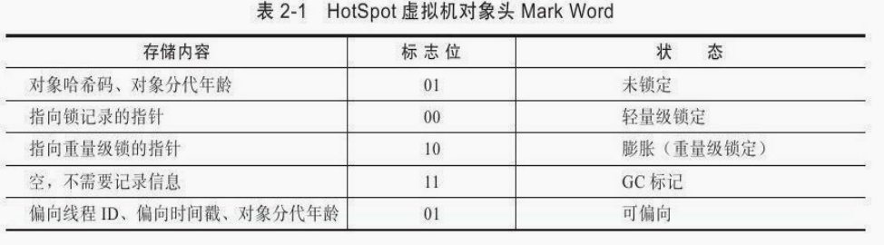
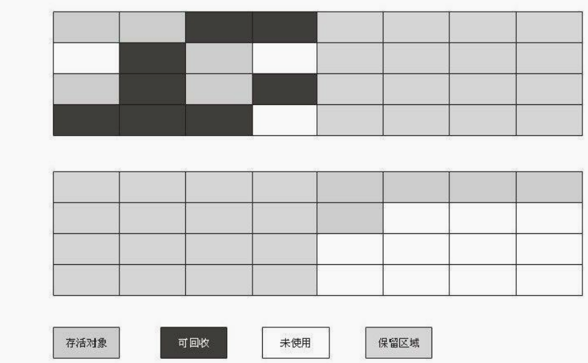
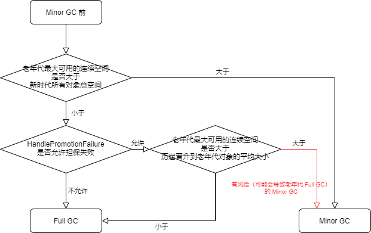
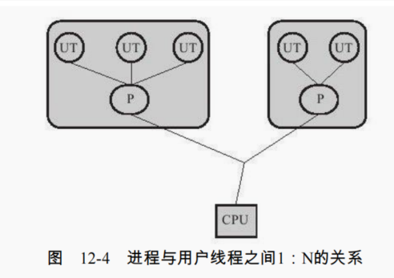

# JavaVirtualMachine

> 基于《深入理解 Java 虚拟机 JVM 高级特性与最佳实践(第 2 版)》

Java 在虚拟机层面隐藏了底层技术的复杂性以及机器与操作系统的差异性。运行程序的物理机器的情况千差万别，而 Java 虚拟机则在千差万别的物理机上建立了统一的运行平台，实现了在任意一台虚拟机上编译的程序都能在其他虚拟机上正常运行。

SUN（已被 Oracle 收购）提供了在不同操作系统平台上的虚拟机，这些虚拟机可以载入和执行一种和平台无关的字节码（其他语言也可以生产字节码让 JVM 运行），它摆脱了硬件平台的束缚，实现了：**一次编写，到处运行**。

## 一、自动内存管理机制

对于 Java 程序员来说，在虚拟机自动内存管理机制的帮助下，不再需要为每一个 new 操作去写配对的 delete / free 代码，不容易出现内存泄漏和内存溢出问题，由虚拟机管理内存。但是一旦出现内存溢出和内存泄漏，也会难以排查。

### （一）运行时数据区域

Java 虚拟机在执行 Java 程序的过程中会把它所管理的内存划分为若干个不同的数据区域。这些区域都有各自的用途，以及创建和销毁的时间，有的区域随着虚拟机进程的启动而存在，有些区域则依赖用户线程的启动和结束而建立和销毁。


#### 1、线程私有内存

依赖用户线程的启动和结束而建立和销毁，每个线程都有自己单独的内存区。

##### （1）程序计数器

是一块很小的内存空间，记录着当前线程所执行的 Java 字节码的行号，方便线程切换后能恢复到正确的执行位置。特点：

- 程序计数器具有线程隔离性，每个线程都有属于自己的程序计数器。
- 线程执行的是 Java 方法，这个计数器记录的是正在执行的虚拟机字节码指令的地址；如果正在执行的是 Native 方法，这个计数器值则为空（Undefined）。
- 是 Java 虚拟机中唯一一个没有规定任何 OutofMemeryError 的区域。

##### （2）Java 虚拟机栈（Java Virtual Machine Stack）

每个 Java 方法在执行的同时会创建一个栈帧（Stack frame）用于存储：局部变量表（基本数据类型和引用类型）、操作数栈、动态链接、方法出口等信息。栈帧是方法运行时的基础数据结构，每个方法从调用直到执行完成，都对应着一个栈帧在虚拟机栈中入栈到出栈的过程。特点：

- Java 虚拟机栈是线程私有的内存区域，生命周期和线程相同。
- 如果线程请求的栈深度大于虚拟机允许的深度，抛出 StackOverflowError；如果虚拟机栈可以动态扩展（目前虚拟机基本支持），但是扩展时无法申请到足够内存，就会抛出 OutofMemeryError 异常。
  - 无限递归调用方法就会 StackOverflowError。

##### （3）本地方法栈（Native Method Stack）

本地方法栈和 Java 虚拟机栈作用和特点类似，区别是：Java 虚拟机栈为虚拟机执行 Java 方法（也就是字节码）服务；而本地方法栈则为虚拟机使用到的 Native 方法服务。

在虚拟机规范中对本地方法栈中方法使用的语言、使用方式与数据结构并没有强制规定，因此具体的虚拟机可以自由实现它。

#### 2、线程共享内存

随着虚拟机启动而存在，由所有线程共享的内存。

##### （1）Java 堆（Java Heap）

Java 堆**唯一目的就是存放对象实例**，几乎所有的对象实例以及数组都在 Java 堆上分配内存。特点：

- Java 堆是虚拟机管理的内存中最大的一块，被所有线程共享，在虚拟机启动时创建。
- 可以处于物理上不连续的内存空间中，只要逻辑连续即可。
- 如果堆中没有内存完成实例分配，并且堆无法扩展时，抛出 OOM 异常（OutofMemeryError）。
  - -Xmx 设置最大堆内存；-Xms 设置最小堆内存。
- 若 new 对象的句柄（也就是变量）被清除，但 new 对象还存在，则表示此 new 对象不可控，造成内存泄漏。

##### （2）方法区（Method Area）

方法区用于存储：已被虚拟机加载的类信息（也就是 class 文件被加载编译后的信息）、常量、静态变量、即时编译后的代码等数据。虽然 Java 虚拟机规范把方法区描述为堆的一个逻辑部分，但是它却有一个别名叫做 Non-Heap（非堆），目的应该是与 Java 堆区分开来。

方法区是 JVM 的规范，每种虚拟机对于方法区都有自己的实现。**HotSpot 虚拟机的方法区被称为永久代（Permanent Generation）**，本质上两者并不等价，仅仅是因为 HotSpot 虚拟机的设计团队选择把 GC 分代收集扩展至方法区，或者说使用永久代来实现方法区，这样 GC 可以像管理堆一样管理方法区，省去要另外在方法区中编写 GC 的麻烦。

> [永久代也会发生垃圾回收](https://www.nowcoder.com/questionTerminal/8f393a761e0f4b67b1c442d092eb484d)，这区域的内存回收目标主要是针对常量池的回收和对类型的卸载，但是回收条件苛刻、回收效果差，有以下条件：
>
> - 该类的实例都被回收。
> - 加载该类的 ClassLoader 已经被回收。
> - 该类不能通过反射访问到其方法。
>
> 当满足上面三个条件时，可以进行回收，但会不会回收还得由 JVM 决定。

方法区中有两块重要的地方：运行时常量池和字符串常量池，不过首先得了解类文件中的常量池。

###### ① 类文件中的常量池

java 文件编译成 class 文件后，class 文件中包含一个叫常量池（Constant Pool Table）的东西，此常量池中主要存放编译器生成的**字面量和符号引用**。

- 字面量
  - 文本字符串，例如："aaaa"、"bbbbccc" 这种。
  - 八种基本类型的值。
  - 被声明为 final 的常量等。
- 符号引用
  - 类或接口及父类的全限定名。
  - 字段的名称和描述符。
  - 方法的名称和描述符。

###### ② 运行时常量池

当 class 文件被加载到 JVM 后，文件中的信息就会被解析到方法区中，类文件中的常量池大部分数据会被加载到运行时常量池。String 类型的数据除外，String 类型的数据会被存在字符串常量池。

###### ③ [字符串常量池](https://blog.csdn.net/zzzgd_666/article/details/87999870)

用于存储不重复的字符串字面量。JDK7 前后变化：

- JDK7 之前字符串常量池在方法区（永久代）中；JDK7 及之后字符串常量池移入堆中。
- JDK7 之前只存放字符串字面量；JDK7 及之后存放字符串字面量和指向堆中字符串对象的引用。

通过几个例子更好地理解字符串常量池：

```java
// 会将 "java" 字符串字面量存入字符串常量池中
String s = "java";

// 在编译期就会将字符串字面量拼接，将 "ja" + "va" 拼接成 "java"，查看字符串常量池是否存在 "java"，若存在则返回字面量地址；否则将字符串字面量存入。
String s1 = "ja" + "va";
System.out.println(s == s1); // true

// String s = new String("java"); 此时做了两件事：
// 1、在堆中创建一个字符串对象new String("java")，变量 s2 指向此字符串对象；
// 2、查看字符串常量池中是否存在 "java"，若不存在则将字符串字面量 "java" 放入字符串常量池中
String s2 = new String("java");
System.out.println(s == s2); // false

// String s3 = new String("ja") + new String("va"); 在编译后会转换成如下代码：
// StringBuilder sb = new StringBuilder();
// sb.append(new String("ja"));
// sb.append(new String("va"));
// String s3 = sb.toString(); // 在这里会创建一个 String 对象
String s3 = new String("ja") + new String("va");
System.out.println(s == s3); // false
System.out.println(s2 == s3); // false
```


String 类有个 intern()本地方法，当调用 intern()方法时，如果字符串常量池中已经包含等于此 String 对象的字符串（由 equals(Object)方法确定），则返回此字符串；否则，将此字符串对象对应的字符串字面量拷贝存入字符串常量池，并返回。

```java
// 在堆中创建了字符串对象 new String("1")；将 "1" 存入字符串常量池
String s = new String("1");

// "1" 已经存在于字符串常量池，此时 s1 指向字符串常量池中的 "1"
String s1 = s.intern();

// s2 也指向字符串常量池的 "1"
String s2 = "1";

System.out.println(s == s1); // false
System.out.println(s == s2); // false
System.out.println(s1 == s2); // true

// 在堆中创建了字符串对象 new String("11")；"1" 在池中已存在
String s3 = new String("1") + new String("1");

// "11" 在池中不存在，于是在生成 "11" 的拷贝存入池中并返回
String s4 = s3.intern();

// 指向池中的 "11"
String s5 = "11";

System.out.println(s3 == s4); // false
System.out.println(s3 == s5); // false
System.out.println(s4 == s5); // true
```

方法.png>)

JDK7 时，字符串常量池从方法区（永久代）移入堆中，执行 intern()方法时，字符串常量池就不需要额外地对字符串对象的字面量进行拷贝后再存储，而是只需要存储字符串对象的地址。

```java
// 在堆中创建了字符串对象 new String("11")；"1" 在池中已存在
String s3 = new String("1") + new String("1");

// "11" 在池中不存在，于是在池中存储着 new String("11") 对象的地址
String s4 = s3.intern();

// "11" 和池中存储着的地址指向的 new String("11") 相等（equals(Object)），并不存入将此字符串字面量存入，而是将变量 s5 执行此地址
String s5 = "11";

System.out.println(s3 == s4); // true
System.out.println(s3 == s5); // true
System.out.println(s4 == s5); // true
```

方法.png>)

##### （3）[元空间（Metaspace）](http://java-latte.blogspot.com/2014/03/metaspace-in-java-8.html)


JDK8 以后 HotSpot 就移除了永久代的概念，元空间与永久代之间最大的区别在于：元空间并不在虚拟机中，而是使用本地内存。也就是说元空间虽然由 JVM 管理，但是并不在 JVM 所在的内存中。

有以下原因：

- 由于永久代内存经常不够用或者发生内存泄露，爆出异常 java.lang.OutOfMemoryError: PermGen 。
- 字符串存在永久代中，容易出现性能问题和内存溢出。
- 类及方法的信息等比较难确定其大小，因此对于永久代的大小指定比较困难，太小容易出现永久代溢出，太大则容易导致老年代溢出。
- 永久代会位 GC 带来不必要的复杂度，而且回收效率偏低。
- Oracle 可能会将 HotSpot 和 JRockit 合二为一。

> 注意：永久代改为元空间后，永久代响应的参数 `-XX:PermSiz=`（永久代初始内存）和 `-XX:MaxPermSize`（永久代最大内存）就失效了，JVM 提供 `-XX:MetaspaceSize` 和 `-XX:MaxMetaspacesize`（默认没有限制，也就是本地最大内存）。

### （二）Java 堆中的对象

#### 1、对象的创建

- JVM 遇到 new 指令时，先去运行时常量池**找到对应类的符号引用**，并检查这个符号引用代表的类是否已被**加载、解析和初始化过**。如果没有，必须先执行相应的类加载过程。
- 在类加载检查通过后，接下来虚拟机为新生对象分配内存。**对象所需内存的大小在类加载完成后便可完全确定**，为新生对象分配内存有两种方式：**指针碰撞、空闲列表**。分配方式取决于垃圾回收器回收后是否会将空闲堆内存整理规整：Serial、ParNew 等带 Compact 过程的收集器使用的是指针碰撞；CMS 这种基于 Mark-Sweep 算法的收集器使用的空闲列表。
  - 指针碰撞：假设 Java 堆中内存是绝对规整的，所有用过的内存都放在一边，空闲的内存放在另外一边，中间放着一个指针作为分界点的指示器，为 new 对象分配内存时仅仅将指针向空闲空间那边挪动一段与对象大小相等的距离。由于堆被线程共享，因此可能多个线程并发操作此指针，导致线程 A 在分配内存还未修改指针，线程 B 又使用原来的指针来分配内存。有两种解决方案：
    - 使用 CAS 和失败重试的策略保证更新操作指针的原子性
    - 把内存分配的动作按线程划分在不同的内存空间进行，即每个线程在 Java 堆中预先分配一小块内存，称为本地线程分配缓存（Thread Local Allocation Buffer，TLAB）。每个线程在自己的 TLAB 上分配内存，只有 TLAB 用完并分配新的 TLAB 时，才需要同步锁定。使用 `-XX: +/-UseTLAB` 来设置是否使用。
  - 空闲列表：如果堆内存不是规整的，已使用的内存和空闲内存相互交错，则虚拟机必须维护一个记录空闲内存块的列表，在分配的时候从列表中找到一块足够大的内存分配给新生对象，并更新列表。
- 初始化对象属性值并设置对象头，执行 `<init>` 方法，赋值给成员变量。

#### 2、对象的内存布局

在 HotSpot 虚拟机中，对象在内存中存储的布局可以分为 3 块区域：

（1）对象头（Header）：对象头包括 Mark Word 和类型指针。

Mark Word：用于存储对象自身运行时的数据，包括：HashCode、GC 分代年龄、锁状态标志、持有偏向锁的线程 ID、偏向锁 ID、偏向时间戳等，长度在 32 位和 64 位的虚拟机中分别为 32bit 和 64bit。Mark Word 在不同锁标志状态下存储不同信息：



类型指针：对象指向它的类元数据指针，JVM 通过这个指针来确定是那个类的实例。

（2）实例数据（Instance Data）：存储本类中的成员属性信息和父类中的成员属性信息，在父类中定义的变量会出现在子类之前。

> 因此子类和父类有同名成员变量时，优先展示父类的成员变量。

（3）对齐填充（Padding）：由于 HotSpot VM 的自动内存管理系统要求对象起始地址必须是 8 字节的整数倍，因此通过对齐填充来补全。

#### 3、对象的访问定位

建立对象是为了使用对象，当我们需要通过栈（虚拟机栈和本地方法栈）上的引用来操作堆上的具体对象时，有以下两种主流实现方式：

（1）直接指针访问

HotSpot 使用直接指针访问对象，对象中需要储存指向方法区上当前对象类型的指针，从而获取到类的方法信息。


（2）句柄访问

如果使用句柄访问的话，那么 Java 堆中将会划分出一块内存来作为句柄池，reference 中存储的就是对象的句柄地址，而句柄中包含了对象实例数据与类型数据各自的具体地址信息。


两者优缺点：

- 直接指针访问：最大的好处是速度快，它节省了一次指针定位的时间开销。
- 句柄访问：reference 中存储的是稳定的句柄地址，在对象被移动（垃圾收集时移动对象是非常普遍的行为）时只会改变句柄中的实例数据指针，而 reference 本身不需要修改。

## 二、垃圾回收和内存分配策略

程序计数器、Java 虚拟机栈和本地方法栈属于线程私有内存，会随着线程生命周期而产生或归还，占用的内存是可知的、可控的。而 Java 堆和方法区则不一样，我们只有在程序处于运行期间时才能知道会创建哪些对象，这部分内存的分配和回收都是动态的，垃圾收集器所关注的是这部分内存。

### （一）判断对象是否死亡

#### 1、引用计数法

给对象中添加一个引用计数器，当被引用一次时，计数器加 1；当引用失效时，计数器减 1；任何时刻计数器为 0 表示此对象不可能再被使用。

> 引用计数法会产生相互引用的问题，JVM 没有采用这种方式。例如：对象 objA 和 objB 都有字段 instance，赋值令 `objA.instance = objB` 及 `objB.instance = objA`，除此之外，这两个对象再无任何引用，实际上这两个对象已经不可能再被访问，但是它们因为互相引用着对方，导致它们的引用计数都不为 0，于是引用计数算法无法通知 GC 收集器回收它们。

#### 2、可达性分析

从自己的 GC Roots 节点开始向下搜索，搜索走过的的路劲叫做引用链，当一个对象没有任何引用链与 GC Roots 相连，此对象不可达，表示此对象不可用，将会被判定为可回收的对象。


可作为 GC Roots 的对象（基本可以认为所有的对象都有成为 GC Root 的潜力）：

- 虚拟机栈中引用的对象
- 方法区中类静态引用的对象
- 方法区中常量引用的对象
- native 方法引用的对象

### （二）[对象引用](https://juejin.cn/post/7075893982953209887)

如果 reference 类型的数据中存储的数值代表的是另外一块内存的起始地址，就称这块内存代表着一个引用。JDK1.2 之后，Java 对引用的概念进行了扩充，将引用分为强引用、软引用、弱引用和虚引用，这 4 种引用强度依次逐渐减弱。

#### 1、强引用

```java
Object o = new Object();
o = null;
```

Java 默认声明的就是强引用，只要强引用存在（也就是变量 o 仍指向对象 `new Object()`），哪怕抛出 OOM 异常也不会回收此对象。如果想中断强引用与对象之间的联系，将强引用赋值为 null，JVM 会自行决定如何回收对象。

#### 2、软引用

软引用是用来描述一些还有用但并非必需的对象。对于软引用关联着的对象，当 JVM 内存空间不足，将会把这些对象列进回收范围之中进行第二次回收。 如果这次回收还没有足够的内存，才会抛出 OOM 异常。提供 SoftReference 类来实现软引用。

```java
// 设置 JVM 参数：-Xms10M -Xmx15M
SoftReference<byte[]> softReference = new SoftReference<byte[]>(new byte[1024*1024*10]);

System.out.println(softReference.get()); // [B@77afea7d
System.gc();
System.out.println(softReference.get()); // [B@77afea7d

byte[] bytes = new byte[1024 * 1024 * 10];
System.out.println(softReference.get()); // null
```

设置了 JVM 最大堆内存为 15M，软引用着 10M 的 byte 数组。第一次 GC 时，Java 堆内存足够，不会进行回收；后又添加了一个强引用的 10M 的 byte 数组，JVM 会进行 GC，将软引用指向的 byte 数组回收。

#### 3、弱引用

弱引用也是用来描述非必需对象的，但是它的强度比软引用更弱一些，被弱引用关联的对象只能生存到下一次垃圾收集发生之前。 当垃圾收集器工作时，无论当前内存是否足够，都会回收掉只被弱引用关联的对象。 提供了 WeakReference 类来实现弱引用。

```java
WeakReference<byte[]> weakReference = new WeakReference<byte[]>(new byte[1]);

System.out.println(weakReference.get()); // [B@77afea7d
System.gc();
System.out.println(weakReference.get()); // null
```

#### 4、虚引用

是最弱的一种引用关系。 一个对象是否有虚引用的存在，完全不会对其生存时间构成影响。**如果一个对象仅持有虚引用，那么它就和没有任何引用一样，在任何时候都可能被垃圾回收器回收。** 提供了 PhantomReference 类来实现弱引用，有以下特点：

- 无法通过虚引用的 get()方法来获取其引用的对象实例。
- 虚引用与软引用和弱引用的一个区别在于：虚引用必须和引用队列 ReferenceQueue 联合使用。当垃圾回收器准备回收一个对象时，如果发现它还有虚引用，就会在回收对象的内存之前，把这个虚引用加入到与之关联的引用队列中。

可以通过判断引用队列中是否已经加入了虚引用，来了解被引用的对象是否将要进行垃圾回收。如果程序发现某个虚引用已经被加入到引用队列，那么就可以在所引用的对象的内存被回收之前采取必要的行动。

虚引用主要用来跟踪对象被垃圾回收器回收的活动，能在这个对象被收集器回收时收到一个系统通知。

```java
public static void main(String[] args) {
    List<byte[]> bytes = new ArrayList<>();
    new Thread(() -> {
        for (int i = 0; i < 100; i++) {
            bytes.add(new byte[1024 * 1024]);
            try {
                Thread.sleep(1000);
            } catch (InterruptedException e) {
                throw new RuntimeException(e);
            }
        }
    }).start();

    ReferenceQueue<Student> queue = new ReferenceQueue<>();
    PhantomReference<Student> reference = new PhantomReference<>(new Student(), queue);
    new Thread(() -> {
        while (true) {
            Reference<? extends Student> poll = queue.poll();
            if (poll != null) {
                System.out.println("虚引用被回收了：" + poll);
            }
        }
    }).start();

    Scanner scanner = new Scanner(System.in);
    scanner.hasNext();
}

static class Student {
    // Java Object finalize() 方法用于实例被垃圾回收器回收的时触发的操作
    @Override
    protected void finalize() throws Throwable {
        System.out.println("Student 被回收了");
    }
}
```

### （三）垃圾回收算法

#### 1、标记-清除（Mark-Sweep）

标记出所有需要回收的对象，完成标记后再统一清除回收内存。

缺点：

- 标记和清除这两个操作过程效率不高。
- 会产生大量不连续的内存碎片。


#### 2、复制（Copying）

将内存分为大小相等的两块，当一块内存区域用完，就将存活的对象移到另外一块内存，然后把已使用过的内存空间一次清理掉。

优缺点：

- 简单高效：内存分配时也就不用考虑内存碎片等复杂情况，只要移动堆顶指针，按顺序分配内存即可。
- 由于将内存分为大小相等的两块，可用内存空间就会变小。

应用：

- 现实中，新生代中对象存活率低，并不需要对半划分内存空间，而是划分成一块较大的 Eden 空间和两块较小的 Survivor 空间。
- 每次 GC 都会将存活的对象从 Eden 空间和其中一块的 Survivor 空间复制到另外一块 Survivor 空间，然后清除刚才使用的 Eden 和 Survivor 空间。
- 当 Survivor 空间不够时，会将对象存储到老年代区域。



#### 3、标记-整理（Mark-Compact）

标记出需要回收的对象，完成标记后将所有存活的对象向内存一端移动，然后直接清除掉端边界以外的内存。


#### 4、分代收集

根据对象存活周期不同，将堆内存分成几块（新时代和老年代），再分别结合上面的算法进行垃圾回收：

- 新生代对象存活率低，使用复制算法，会有老年代区域为新生代内存分配担保，保证新生代内存不够分配时，将 Eden 区和 Survivor 存活的对象移动到老年代。
- 老年代存活率高、没有额外空间对它进行分配担保，必须使用标记-清除或标记-整理算法

JVM 相关参数配置：

- -XX:SurvivorRatio=数字，设置 Eden 和一个 Survivor 的比例。
- -XX:PretenureSizeThreshold=数字，晋升老年代对象的内存大小。
- -Xmn，指定新生代内存大小。
- -XX:MaxTenuringThreshold=数字，指定新生代进入老年代的年龄。

### （四）内存分配和回收策略

#### 1、内存分配策略

（1）对象优先在 Eden 区分配对象

大多数情况下，对象在新生代中分配内存，当 Eden 区没有足够空间分配时，进行一次 Minor GC，将存活的对象和 Survivor 区中的对象复制到另外一个 Survivor 区中，当另外的 Survivor 区中的空间不足时，会将 Eden 区和 From Survivor 中无法被 To Survivor 区容纳的对象移动到老年代。

（2）大对象直接分配在老年代

对于需要大量连续内存空间的 Java 对象，例如：很长的字符串或大数组，若存在于新时代中则会频繁地触发 Minor GC。JVM 提供 `-XX:PretenureSizeThreshold` 配置，大于此值的对象直接进入老年代。

（3）长期存活的对象分配到老年代

对象头中存储了**对象分代年龄**数据，新时代中的对象每存活过一次 Minor GC，年龄加 1，到指定年龄时会被移动到老年代。

**动态对象年龄判断**：JVM 不是强制要求对象的年龄必须到达指定的年龄才晋升老年代，如果 Survivor 中某一年龄的所有对象占用内存的总和大于 Survivor 空间的一半，年龄大于等于该年龄的对象进入老年代。

#### 2、空间分配担保

在每次 Minor GC 之前，都会检查老年代**最大可用的连续空间**是否大于**新生代所有对象总空间**，

- 若大于，则 Minor GC 可以确保是安全的；
- 若小于，则 JVM 会查看 HandlePromotionFailure 设置值是否允许担保失败，
  - 若允许，则判断老年代最大可用的连续空间是否大于**历次晋升到老年代对象的平均大小**
    - 若大于，则进行一次有风险（可能会导致老年代 Full GC）的 Minor GC。
    - 若小于，则进行一次 Full GC。
  - 若不允许，则进行一次 Full GC。



### （五）垃圾收集器

垃圾收集器是垃圾回收算法的具体实现，HotSpot 包含以下垃圾收集器：


> 因为直到现在为止还没有最好的收集器出现，更加没有万能的收集器，所以我们选择的只是对具体应用最合适的收集器。垃圾回收器回收时，都会暂停其他所有工作线程，各种收集器都为了降低这个停顿时间而努力。

#### 1、Serial 收集器

Serial 是最基本、历史最悠久的收集器，是一个单线程的收集器，垃圾收集过程会暂停其他所有的工作线程，使用复制算法回收新生代内存。

优缺点：

- 简单而高效，减少线程切换开销；
- 频繁 GC 会影响 java 程序性能。


#### 2、Serial Old 收集器

Serial Old 是 Serial 收集器的老年代版本，是一个单线程收集器，使用标记-整理算法。

#### 3、ParNew 收集器

ParNew 是 Serial 的多线程版本，除了多线程进行垃圾收集，其他和 Serial 基本一致。

优缺点：

- 在多核 CPU 下，可能比 Serial 更有优势。


#### 4、Parallel Old 收集器

Parallel Old 是 ParNew 收集器的老年代版本，使用标记-整理算法。

#### 5、Parallel Scavenge 收集器

和 ParNew 类似，不过关注点不一样，通过调节参数，让垃圾回收吞吐量达到最合适的比例，而其他收集器是让每次 STW 的时间最小。

> 吞吐量=运行用户代码时间 /（运行用户代码时间 + 垃圾收集时间）

#### 6、CMS 收集器

CMS（Concurrent Mark Sweep）收集器是以最短 STW（Stop The World，暂停其他工作线程）作为目标的收集器，运行在老年代，使用标记-清除算法，在 B/S 系统的服务端上应用更广。工作步骤：

- 初始标记：需要 STW，标记 GC Root**直接可达的对象**。
- 并发标记：进行可达性分析，可以和用户线程一起进行。
- 重新标记：需要 STW，修正并发标记期，程序运行导致标记修改的对象。
- 并发清除：使用标记-清除算法，和用户线程一起进行。


优缺点：

- STW 的时间短，因为并发标记和并发清除是和用户线程一起进行。
- 垃圾收集期间会和用户线程竞争 CPU 资源，导致程序性能下降，同时也会导致收集期间变长。
- 并发清除使用的是标记-清除算法，CMS 为了避免产生内存碎片，会在达到一定条件时进行内存整理，此时会增大 STW 时间。
  - `-XX:CMSFullGCsBeforeCompaction` 可以设置多少次 Full GC 后，进行一次碎片整理。

#### 7、[G1 收集器](https://juejin.cn/post/7010034105165299725)

一款面向服务端的收集器，可以作用在新生代和老年代，特点：

- 并发和并行：能利用多核 CPU 缩短 STW 的时间。
- 空间整合：整体上是标记-整理算法，局部是复制算法。
- 可预测的停顿：除了 CMS 最短停顿为目标外，还能建立可预测的停顿时间模型，能让使用者明确指定一个长度为 M 毫秒的时间片段内，消耗在垃圾收集上的时间不超过 N 毫秒。

## 三、class 字节码文件

字节码（ByteCode，也就是二进制）文件是构成平台无关性的基石，字节码存储格式和虚拟机也是实现语言无关性的基石。

JVM 不和包括 Java 在内的任何语言绑定，它并不关心**class 文件**来源是何种语言，它只与 class 文件这种特定的二进制文件格式所关联。只要符合规范和语法的 class 文件，就可以在 JVM 上运行。


### （一）class 字节码文件结构

任何 class 类（包括内部类、匿名内部类）或接口（interface、enum、annotation）编译后都会生成自己的 class 字节码文件，字节码文件结构如下：


```cmd
javac Demo.java // 编译 java 文件

java Demo // 执行 class 类

javap -v Demo.class // 分析 class 字节码文件
```

#### 1、魔数（magic）

魔数是每种类型文件的二进制文件的前几位，唯一且不可变，class 文件的魔数是 `0xCAFEBABE`。

#### 2、常量池（constant_pool）

constant_pool_count 用于表示常量池中有多少个常量项。

> 注意：在 class 文件格式规范制定之时，设计者将第 0 项常量空出来是有特殊考虑的，这样做的目的在于满足后面某些指向常量池的索引值的数据在特定情况下需要表达**不引用任何一个常量池项目**的含义，这种情况就可以把索引值置为 0 来表示。
>
> 例如：常量池容量（偏移地址：0x00000008）为十六进制数 0x0016，即十进制的 22，这就代表常量池中有 21 项常量，索引值范围为 1 ～ 21。

常量池是 class 文件的资源仓库，用于存储 class 类中出现的常量项（字面量和符号引用）：

- 字面量：基本数据类型字面值、文本字符串、声明为 final 的常量值等。
- 符号引用：
  - 类或接口的全限定名
  - 字段的名称和描述符
  - 方法的名称和描述符

#### 3、访问标志

用于识别一些类或者接口层次的访问信息。


#### 4、类索引、父类索引与接口索引集合（this_class、super_class、interfaces）

类索引、父类索引与接口索引集合都只是索引，指向常量池中的类或接口的全限定名信息。

类索引用于确定这个类的全限定名；父索引用于确定这个类的父类的全限定名；接口索引集合用于确定这个类的接口名。

#### 5、字段表集合（fields）

fields_count 用于表示有多少个字段表，相当于表示有多少个字段。

字段表存储着字段访问标志、名称索引、描述符索引和属性表集合。


> 注意：字段表集合中不会列出从超类或父接口中继承而来的字段，但有可能列出原本 Java 代码中不存在的字段，例如：内部类为了保持对外部类的访问性，会自动添加指向外部类实例的字段。

#### 6、方法表集合（methods）

methods_count 用于表示有多少个方法表，相当于表示有多少个方法。

方法表和属性表结构基本一致，存储着方法访问标志、名称索引、描述符索引和属性表集合。


> 注意：如果父类方法在子类中没有被重写（Override），方法表集合中就不会出现来自父类的方法信息。

#### 7、属性表集合

在 class 文件、字段表和方法表中都可以携带自己的属性表集合，以用于描述某些场景专有的信息。主要有以下几个：

（1）Code

Code 属性表在方法表中使用，主要存储 Java 代码编译生成的字节码指令。

（2）LineNumberTable

LineNumberTable 属性表在 class 文件中使用，存储源码行号和字节码行号的对应关系。

（3）ConstantValue

ConstantValue 属性表在字段表中使用，作用是通知虚拟机自动为静态变量赋值，只有被 static 关键字修饰的类变量**才可以**使用这项属性。

对于非 static 类型的变量（也就是实例变量）的赋值是在实例构造器 `<init>` 方法中进行的；而对于类变量，则有两种方式可以选择：在类构造器 `<clinit>` 方法中或者使用 ConstantValue 属性。目前 Sun Javac 编译器的选择是：**如果同时使用 final 和 static 来修饰一个变量**，并且这个变量的数据类型是基本类型或者字符串，就生成 ConstantValue 属性来进行初始化，如果这个变量没有被 final 修饰，或者并非**基本类型及字符串**，则将会选择在 `<clinit>` 方法中进行初始化。

（4）InnerClasses

InnerClasses 属性表在 class 文件中使用，用于记录内部类与宿主类之间的关联。

### （二）class 文件中的字节码指令

#### 1、同步指令

JVM 支持方法级的同步和方法内部一段指令序列的同步，这两种同步结构都是使用管程（Monitor）来支持的。

方法级的同步是隐式的，即无需通过字节码指令来控制，它实现在方法调用和返回操作中：

- 线程执行方法时，先去查看方法是否为同步方法，有 ACC_SYNCHRONIZED 标志的就是同步方法。
- 执行线程尝试获取同步方法对应的锁对象的 Monitor，获取成功则可以执行，其他线程不可以获取被持有的 Monitor，直到此 Monitor 被释放（方法执行完或抛异常后释放）。

方法内部一段指令序列的同步通常是由 Java 语言中的 synchronized 语句块来表示，JVM 中的指令集中有 monitorenter 和 monitorexit 两条指令来支持 synchronized 关键字的语义：

- 被 synchronized 修饰的代码块，编译后字节码文件中会生成 monitorenter 和 monitorexit 指令。
- 执行 monitorenter 指令时当前执行线程尝试获取同步代码块对应的锁对象的 Monitor，获取成功则可以执行，其他线程不可以获取被持有 Monitor，直到此 Monitor 被释放（执行 monitorexit 释放）。

## 四、类加载机制

JVM 把类或接口（为了方便，以下统称类）编译后的 class 文件加载到内存，并对数据进行校验、转换解析和初始化，最终形成可以被 JVM 直接使用的 Java 类型，这就是类的加载机制。


### （一）加载

加载阶段，JVM 主要有以下三个步骤：

- 通过类的全限定名获取此类对应的二进制字节流。
- 将这个字节流所代表的静态存储结构转化为方法区的运行时数据结构。
- 在内存中生成一个代表这个类的 java.lang.Class 类型的对象，作为方法区这个类的各种数据的访问入口。

#### 1、二进制字节流的分类

二进制字节流不一定要从 class 文件中获取，因此有以下的生成方式（只列出一些）：

- 最常见的方式是从压缩包中读取，例如：jar、ear、war。
- 从网络中获取，最典型的应用是 Applet。
- 运行时计算生成，这种场景使用得最多的就是动态代理技术。
- 由 JSP 文件生成对应的 class 类。

#### 2、类加载器

Java 将通过类的全限定名获取此类对应的二进制字节流的操作放到 JVM 外部实现，以便让应用程序自己决定如何去获取所需的类。实现这个动作的代码模块称为类加载器。

class 文件被加载器加载到内存后也会生成一个类的 Class 对象。对于任意一个类的 Class 对象，都需要由加载他的类加载器和这个类本身一同确定唯一性。也就是说同一个类被不同的类加载器加载到方法区，虽然是同一个 class 文件，在方法区中也会生成两个类的 Class 对象，并且必定不相等。

> 注意：
>
> - 并没有明确规定是在 Java 堆中，对于 HotSpot 虚拟机而言，Class 对象比较特殊，它虽然是对象，但是存放在方法区里面。
> - 相等包括类的 Class 对象的 equals()方法、isAssignableFrom()方法、isInstance()方法，也包括使用 instanceof 关键字做对象所属关系判定等情况。

```java
@Test
public void test() throws Exception {
    ClassLoader myLoader = new ClassLoader() {
        @Override
        public Class<?> loadClass(String name) throws ClassNotFoundException {
            try {
                String fileName = name.substring(name.lastIndexOf(".") + 1) + ".class";
                InputStream is = getClass().getResourceAsStream(fileName);
                if (is == null) {
                    return super.loadClass(name);
                }
                byte[] b = new byte[is.available()];
                is.read(b);
                return defineClass(name, b, 0, b.length);
            } catch (IOException e) {
                throw new ClassNotFoundException(name);
            }
        }
    };
    Object obj = myLoader.loadClass("com.studynotes.java_se.java27_JVM.Demo16_OverrideClassLoader").newInstance();

    System.out.println(obj.getClass()); // class com.studynotes.java_se.java27_JVM.Demo16_OverrideClassLoader

    // 证明自己写的类加载器和系统默认的类加载器加载生成的类的 Class 对象不一样
    System.out.println(obj instanceof Demo16_OverrideClassLoader); // false

    System.out.println(obj.getClass() == Object.class); // false

    System.out.println(obj.getClass().equals(Object.class)); // false
}
```

##### （1）双亲委派模型

系统中已实现的类加载器有以下三种：

- 启动类加载器（Bootstrap ClassLoader）：使用 C++实现，是 JVM 的一部分。
  - 负责将存放在 `<JAVA_HOME>\lib` 目录中或者被 -Xbootclasspath 参数所指定路径中的，并且是 JVM 识别的（仅按照文件名识别，名称不符合的类库不会被加载）加载到 JVM 中。
- 扩展类加载器（Extension ClassLoader）：由 `sun.misc.Launcher$ExtClassLoader` 实现，间接继承抽象类 ClassLoader。
  - 负责加载 `<JAVA_HOME>\lib\ext` 目录中或者被 java.ext.dirs 系统变量所指定路径中的所有类库。开发者可以直接使用扩展类加载器。
- 应用程序类加载器（Application ClassLoader）：由 `sun.misc.Launcher$AppClassLoader` 实现，间接继承抽象类 ClassLoader。
  - 负责加载用户类路径（classpath）上所指定的类库。开发者可以直接使用这个类加载器，如果应用程序中没有自定义过自己的类加载器，一般情况下这个就是程序中默认的类加载器。

我们的应用程序都是由这三种类加载器相互配合进行加载的，也可以加入自己定义的类加载器。


[双亲委派机制的实现原理](https://blog.csdn.net/qq_28082757/article/details/106719697)：

- 如果一个类加载器收到类加载请求，它并不会自己先去加载，而是把这个请求委托给父类的加载器去执行：
- 如果父类加载器还存在父类加载器，则进一步向上委托，依次请求，请求最终到达顶层的启动类加载器。
- 若父类加载器可以完成类加载任务，就成功返回；若父类加载器无法完成此加载任务，子加载器才会尝试自己去加载。

> 注意：这里父子并不是真正意义上的继承，而是一个代称，其实是组合调用。

优点：

- 当自定义一个和 Java 类库同名的类时，由于双亲委派机制，会让父加载器先去自己负责的地方加载这个同名类，防止用户自定义的同名类被加载，影响 JDK 的安全性。
- 防止一个类被重复多次加载。

##### （2）破坏双亲委派模型

双亲委派模型并不是一个强制性的约束模型，而是 Java 设计者推荐给开发者的类加载器实现方式。若不按照双亲委派的方式加载类，则称为**破坏双亲委派模型**。

双亲委派模型的**第一次被破坏**发生在双亲委派模型出现之前——即 JDK 1.2 发布之前。用户可以继承 java.lang.ClassLoader 来实现自定义类加载器，同时需要重写 loadClass()方法，此时就会发生不先去委托父类加载类的情况，破坏了双亲委派模型。后面为了解决这种情况，又添加了 findClass()方法，用户通过重写此方法可以避免上述情况发生。

双亲委派模型的第**二次被破坏**是由这个模型自身的缺陷所导致的，双亲委派很好地解决了各个类加载器的基础类的统一问题（越基础的类由越上层的加载器进行加载），基础类之所以称为“基础”，是因为它们总是作为被用户代码调用的 API，但世事往往没有绝对的完美，如果基础类又要调用回用户的代码，那该怎么办？

这并非是不可能的事情，一个典型的例子便是 JNDI 服务，JNDI 现在已经是 Java 的标准服务，它的代码由 Bootstrap ClassLoader 去加载（在 JDK1.3 时放进去的 rt.jar），但 JNDI 的目的就是对资源进行集中管理和查找，它需要调用由独立厂商实现并部署在应用程序的 ClassPath 下的 JNDI 接口提供者（SPI，Service Provider Interface）的代码，但 Bootstrap ClassLoader 不可能认识这些代码啊！那该怎么办？

为了解决这个问题，Java 设计团队只好引入了一个不太优雅的设计：线程上下文类加载器（Thread Context ClassLoader）。这个类加载器可以通过 java.lang.Thread 类的 setContextClassLoaser（）方法进行设置，如果创建线程时还未设置，它将会从父线程中继承一个，如果在应用程序的全局范围内都没有设置过的话，那这个类加载器默认就是系统类加载器（默认是 Application ClassLoader）。

> [以 JDBC 为例](https://www.jianshu.com/p/66d23537e48f)：Bootstrap ClassLoader 去调用 [DriverManager](https://www.cnblogs.com/liuligang/p/10519771.html) 去加载个数据库厂商实的 Driver 实现类时，启动类加载器无法加载 classPath 下的代码，此时会让 Thread Context ClassLoader（实际上就是 Application ClassLoader）加载。这样的话就相当于父加载器委托子加载器进行类加载，破坏了双亲委派模型。

双亲委派模型的**第三次被破坏**是由于用户对程序动态性的追求而导致的。

### （二）连接

加载阶段与连接阶段的部分内容（如一部分字节码文件格式验证动作）是交叉进行的，加载阶段尚未完成，连接阶段可能已经开始，但这些夹在加载阶段之中进行的动作，仍然属于连接阶段的内容，这两个阶段的开始时间仍然保持着固定的先后顺序。

#### 1、验证

确保 Class 文件的字节流中包含的信息符合当前虚拟机的要求（通过编译的 Class 仍然可能会有错误），并且不会危害虚拟机自身的安全。

#### 2、准备

为类的**静态成员变量**分配内存并设置初始值。

> 注意：不包括实例变量，实例变量将会在对象实例化时随对象一起分配在堆中。

通常情况下初始值并不是代码中赋予静态成员变量的值，而是基本数据类型的零值。

```java
static int value = 123; // 初始零值是 0
```


相对的有一些特殊情况：如果类字段的属性表中存在 ConstantValue 属性，那么在准备阶段变量 Value 就会被初始化为 ConstantValue 属性所指定的值。

#### 3、解析

解析阶段是虚拟机将常量池内的符号引用替换为直接引用的过程，也就是将常量池中类似于 `#1` 的符号引用，修改为直接存储地址。

### （三）初始化

#### 1、初始化条件

JVM 并没有对执行加载操作进行强制约束，这点可以交给 JVM 的具体实现来自由把握。但是对于初始化阶段，虚拟机规范则是严格规定了**有且只有  6 种情况**必须立即对类进行初始化：

- 遇到 new、getstatic（获取一个类的静态字段，被 static final 修饰、已在编译期把结果放入常量池的静态字段除外）、putstatic（设置一个类的静态字段）、invokestatic（调用静态方法）这 4 条字节码指令时。
- 使用 java.lang.reflect 包的方法对类进行反射调用时。
- 当初始化一个类时，如果发现其父类还没有进行初始化，则需要先触发其父类的初始化。
- 虚拟机启动时，用户需要指定一个要执行的主类（包含 main()方法的那个类），虚拟机会先初始化此类。
- 当使用 JDK7 的动态语言支持时，如果一个 java.lang.invoke.MethodHandle 实例最后的解析结果 REF_getStatic、 REF_putStatic、 REF_invokeStatic 的方法句柄，并且这个方法句柄所对应的类没有进行过初始化，则需要先触发其初始化。
- 当一个接口中定义了 JDK8 新加入的默认方法（被 default 关键字修饰的接口方法）时，如果有这个接口的实现类发生了初始化，那该接口要在其之前被初始化。

除了以上 6 种情况，其他所有引用类的方式都不会触发初始化，有以下的例子：

① 通过子类调用父类的类变量

```java
public class Parent {
    public static int a = 111111;

    static {
        System.out.println("Parent init");
    }
}

public class Son extends Parent {
    static {
        System.out.println("Son init");
    }
}

public class NotInit {
    public static void main(String[] args) {
        System.out.println(Son.a);
        // Parent init
        // 111111
    }
}
```

② 直接调用 static final 属性

```java
public class Constant {
    static{
        System.out.println("Constant clinit");
    }
    public static final int value = 33;
}

public class ConstantTest {
    public static void main(String[] args){
        System.out.print(Constant.value); // 33
    }
}
```

③ 创建对象数组，引用的对象不会初始化

```java
public class NotInit {
    public static void main(String[] args){
        Parent[] sc = new Parent[10];
    }
}
```

#### 2、初始化的特点

初始化阶段是执行类构造器 `<clinit>()` 方法的过程，`<clinit>()` 方法是由编译器自动收集类中所有的**类变量的赋值动作**和**静态代码块中的语句**合并产生的，编译器收集的顺序是由语句在源文件中出现的顺序所决定的。

> 注意：静态语句块中只能访问到定义在静态语句块之前的变量，定义在它之后的变量，在前面的静态语句块可以赋值，但是不能访问。
>
> ```java
> public static class Test {
>     static {
>         i = 0; // 给变量赋值可以正常编译通过
>         System.out.print(i); // 这句编译器会提示"非法向前引用"
>     }
>
>     static int i = 1;
> }
> ```

虚拟机会保证在子类的 `<clinit>()` 方法执行之前，父类的 `<clinit>()` 方法已经执行完毕。

`<clinit>()` 方法对于类或接口来说并不是必需的，如果一个类中没有静态语句块，也没有对变量的赋值操作，那么编译器可以不为这个类生成 `<clinit>()` 方法。

接口中不能使用静态语句块，但仍然有变量初始化的赋值操作，因此接口与类一样都会生成 `<clinit>()` 方法。但接口与类不同的是，执行接口的 `<clinit>()` 方法不需要先执行父接口的 `<clinit>()` 方法。只有当父接口中定义的变量使用时，父接口才会初始化。另外，接口的实现类在初始化时也一样不会执行接口的 `<clinit>()` 方法。

虚拟机会保证一个类的 `<clinit>()` 方法在多线程环境中被正确地加锁、同步，如果多个线程同时去初始化一个类，那么只会有一个线程去执行这个类的 `<clinit>()` 方法，其他线程都需要阻塞等待，直到活动线程执行 `<clinit>()` 方法完毕。如果在一个类的 `<clinit>()` 方法中有耗时很长的操作，就可能造成多个进程阻塞。

```java
static class DeadLoopClass {
    static {
        /*如果不加上这个if语句，编译器将提示"Initializer does not complete normally"并拒绝编译*/
        if (true) {
            System.out.println(Thread.currentThread() + "init DeadLoopClass");
            while (true) {
            }
        }
    }
}

public static void main(String[] args) {
    Runnable script = new Runnable() {
        public void run() {
            System.out.println(Thread.currentThread() + "start");
            DeadLoopClass dlc = new DeadLoopClass();
            System.out.println(Thread.currentThread() + "run over");
        }
    };
    Thread thread1 = new Thread(script);
    Thread thread2 = new Thread(script);
    thread1.start();
    thread2.start();

    /**
    Thread[Thread-0,5,main]start
    Thread[Thread-1,5,main]start
    Thread[Thread-0,5,main]init DeadLoopClass // 发生了阻塞
    **/
}
```

同一个类加载器下，一个类型只会初始化一次。如果执行 `<clinit>()` 方法的那条线程退出 `<clinit>()` 方法后，其他线程唤醒之后不会再次进入 `<clinit>()` 方法。

## 五、虚拟机字节码执行引擎

### （一）运行时栈帧结构

栈帧（Stack Frame）是用于虚拟机进行**方法调用和方法执行**的数据结构，它是 Java 虚拟机栈的栈元素，每一个方法从调用到执行完成的过程，都对应一个栈帧在虚拟机栈里面从入栈到出栈的过程。

> 栈帧中需要多大的局部变量表，多深的操作数栈都编译期已经完全确定了，并且写入到方法表的 Code 属性之中，因此一个栈帧需要分配多少内存是可知的。

在一个活动线程中，只有位于栈顶的栈帧才是有效的，称为**当前栈帧（Current Stack Frame）**，与当前栈帧关联的方法称为当前方法。执行引擎运行的所有字节码指令都只针对当前栈帧进行操作，包括以下结构：局部变量表、操作数栈、动态连接、方法返回地址等。


1、局部变量表（Local Variable Table）

局部变量表是一组变量值存储空间（存储的是八种基本类型和引用类型的地址），用于存放方法参数和方法内部定义的局部变量。

> 注意：方法的局部变量没有初始化过程，因此未赋值则会在编译期不通过。

2、操作数栈（Operand Stack）

存储对变量操作时，操作符对应字节码指令。例如：`+` 对应的字节码指令为 iadd。

3、动态连接（Dynamic Linking）

每个栈帧都包含一个指向常量池中该栈帧所属方法的引用，持有这个引用是为了支持方法调用过程中的动态连接。

class 字节码文件的常量池中符号引用，一部分会在类加载阶段或第一次使用的时候就转化为直接引用，这种称为静态解析；另外一部分将在每一次运行期间转化为直接引用，这部分称为动态连接。

4、方法返回地址（Return Address）

正常返回时，执行的操作有：恢复上层方法的局部变量表和操作数栈，把返回值（如果有的话）压入调用者栈帧的操作数栈中，调整 PC 计数器的值以指向方法调用指令后面的一条指令等。

异常退出，遇到没有 try-catch 处理的异常会退出方法，不产生返回值，同样会调整 PC 计数器的值以指向方法调用指令后面的一条指令等。

5、附加信息

存储一些额外的附加信息，取决于具体的 JVM。

### （二）调用

**方法调用并不等同于方法执行，方法调用阶段唯一的任务就是确定被调用方法的版本。**

class 文件的编译过程不包含传统编译中的[连接步骤](http://www.aiuxian.com/article/p-dueqnuvk-cg.html)，一切方法调用在 class 文件中存储的都只是符号引用，而不是方法在实际运行时的直接引用。这个特性给 Java 带来了更强大的动态扩展能力，但也使得 Java 方法调用过程变得相对复杂起来，需要在类加载期间，甚至到运行期间才能确定目标方法的直接引用。

#### 1、解析

在类加载的解析阶段，会将 class 文件中的一部分符号引用转化为直接引用，这种解析能成立的前提是：**方法在程序真正运行之前就有一个可确定的调用版本，并且这个方法的调用版本在运行期是不可改变的。**换句话说，调用目标在程序代码写好、编译器进行编译时就必须确定下来。这类方法的调用称为解析（Resolution）。

JVM 提供了 5 中方法调用指令：

- invokestatic：调用静态方法，也就是被 static 修饰的方法。
- invokespecial：调用实例构造器 `<init>` 方法、私有方法（private 修饰的方法）和父类方法。
- invokeinterface：调用接口方法，在运行时再确定一个实现此接口的对象。
- invokevirtual：用于调用虚方法（就是除了上述三种情况之外的方法）。
- invokedynamic：在运行时动态解析出调用点限定符所引用的方法之后，调用该方法；在 JDK1.7 中推出，主要用于支持 JVM 上的动态脚本语言（如 Groovy、Jython 等）。

只要能被 invokestatic 和 invokespecial 指令调用的方法，都可以在解析阶段中确定唯一的调用版本，符合这个条件的有静态方法、私有方法、实例构造器、父类方法 4 类，它们在类加载的时候就会把符号引用解析为该方法的直接引用。

#### 2、[分派](https://blog.csdn.net/u011116672/article/details/50086611)

分派是指在 Java 中对方法的调用。Java 中有三大特性：继承、封装和多态，分派是多态性的体现，JVM 底层提供了开发中的**重写（Override / Overwrite）和重载（Overload）**的实现。其中重载属于静态分派，而重写属于动态分派。

##### （1）静态分派

先了解有两个重要概念：

```java
Father son = new Son();
```

其中我们把 Father 称为变量的静态类型（Static Type），或者叫做外观类型（Apparent Type）；后面的 Son 称为变量的实际类型（Actual Type）。静态类型和实际类型在程序中都可以发生一些变化，区别是：

- 静态类型的变化仅仅在使用中发生（也就是强制类型转换），变量本身的静态类型不会被改变，并且最终的静态类型是在编译期可知的；
- 实际类型变化的结果在运行期才可确定，编译期并不知道一个对象的实际类型是什么。

```java
// 实际类型变化
Human man = new Man();
man = new Woman();

// 静态类型变化
sr.sayHello((Man) man);
sr.sayHello((Woman) man);
```

静态分派是指在变量在作为参数传递或能否获取方法、属性时，是以静态类型作为判断依据。最典型的应用是方法重载：

```java
class DispatchTest {
    static class Human {}

    static class Man extends Human {}

    static class Woman extends Human {}

    public void sayHi (Human human) {
        System.out.println("Human Hi");
    }

    public void sayHi (Man man) {
        System.out.println("Man Hi");
    }

    public void sayHi (Woman woman) {
        System.out.println("Woman Hi");
    }

    @Test
    public void test{
        Human man = new Man();
        Human woman = new Woman();
        sayHi(man); // Human Hi
        sayHi(woman); // Human Hi
    }
}
```

上面可以看出在编译阶段，编译器是以静态类型来定位重载方法的执行版本。但是很多情况下重载版本并不是唯一的，往往只能确定一个更加适合的版本，例如：通过类型自动向上转化寻找合适的重载方法。

> 注意：解析与分派这两者之间的关系并不是二选一的排他关系，它们是在不同层次上去筛选、确定目标方法的过程。例如：静态方法会在类加载期就进行解析，而静态方法显然也是可以拥有重载版本的，选择重载版本的过程也是通过静态分派完成的。

##### （2）动态分派

动态分派是指在运行期根据实际类型确定方法执行版本的分派过程。

```java
public static class Father {
    int i = 1;

    public static void sayHi() {
        System.out.println("Father Hi!");
    }
}

public static class Son extends Father {
    int i = 2;

    public static void sayHi() {
        System.out.println("Son Hi!");
    }
}

@Test
public void test() {
    Father son = new Son();
    System.out.println(son.sayHi()); // Son Hi!
}
```

执行 `son.sayHi()` 时，会调用 invokevirtual 字节码指令，执行以下操作：

- 找到操作数栈顶的第一个元素所指向的对象的实际类型，记作 C。
- 如果在类型 C 中找到与常量中的描述符或简单名称都相符的方法，则进行权限校验，如果通过则返回这个方法的直接引用，查询过程结束；如果不通过，则返回 java.lang.IllegalAccessError 异常。
- 否则，按照继承关系从下往上依次对 C 的各个父类进行第 2 步的搜索和验证过程。
- 如果始终没有找到合适的方法，则抛出 java.lang.AbstractMethodError 异常。

## 六、Java 内存模型与线程

### （一）硬件效率与一致性

绝大多数的运算任务都不只是仅靠处理器计算就能完成，处理器至少要与内存交互，如读取运算数据、存储运算结果等，这个 I/O 操作是很难消除的。**由于计算机的存储设备与处理器的运算速度有几个数量级的差距**，所以现代计算机系统都不得不加入一层读写速度尽可能**接近处理器运算速度的高速缓存（Cache）**来作为内存与处理器之间的缓冲：将运算需要使用到的数据复制到缓存中，让运算能快速进行，当运算结束后再从缓存同步回内存之中，这样处理器就无须等待缓慢的内存读写了。

基于高速缓存的存储交互很好地解决了处理器与内存的速度矛盾，但是也为计算机系统带来更高的复杂度，因为它引入了一个新的问题：**缓存一致性（Cache Coherence）**。在多处理器系统中，每个处理器都有自己的高速缓存，而它们又共享同一主内存（Main Memory）。当多个处理器的运算任务都涉及同一块主内存区域时，将可能导致各自的缓存数据不一致，如果真的发生这种情况，那同步回到主内存时以谁的缓存数据为准呢？为了解决一致性的问题，需要各个处理器访问缓存时都遵循一些协议，在读写时要根据协议来进行操作。


### （二）Java 内存模型

**内存模型**可以理解为在特定的操作协议下，对特定的内存或高速缓存进行读写访问的过程抽象。不同架构的物理机器可以拥有不一样的内存模型，而 JVM 也有自己的内存模型。

Java 内存模型（Java Memory Model，JMM）是用来屏蔽掉各种硬件和操作系统的内存访问差异，以实现让 Java 程序在各种平台下都能达到一致的内存访问效果。

Java 内存模型主要目标是定义程序中各个变量的访问规则，即在虚拟机中将变量存储到内存和从内存中取出变量这样的底层细节。

> 注意：Java 内存模型中存储的变量是值：实例字段、静态字段和构成数据对象的元素，不包括局部变量与方法参数，因为后者是线程私有的，不会被共享，自然不存在竞争问题。


Java 内存模型规定所有的变量都存储在主内存（Main Memory）中；每条线程有自己的工作内存（Working Memory）；工作内存保存了该线程使用到的变量在主内存中的部分副本拷贝。线程对变量的所有操作（读取、赋值等）都必须在工作内存中进行，不能直接读写主内存中的变量，不同的线程之间也无法访问对方工作内存，线程间变量值的传递均需要通过主内存来完成。

#### 1、内存交互操作

Java 内存模型定义了 8 种操作来进行工作内存与主内存间的交互协议：

- lock（锁定）：作用于主内存的变量，它把一个变量标识为一条线程独占的状态。
- unlock（解锁）：作用于主内存的变量，它把一个处于锁定状态的变量释放出来，释放后的变量才可以被其他线程锁定。
- read（读取）：作用于主内存的变量，它把一个变量的值从主内存传输到线程的工作内存中，以便随后的 load 动作使用。
- load（载入）：作用于工作内存的变量，它把 read 操作从主内存中得到的变量值放入工作内存的变量副本中。
- use（使用）：作用于工作内存的变量，它把工作内存中一个变量的值传递给执行引擎，每当虚拟机遇到一个需要使用到变量的值的字节码指令时将会执行这个操作。
- assign（赋值）：作用于工作内存的变量，它把一个从执行引擎接收到的值赋给工作内存的变量，每当虚拟机遇到一个给变量赋值的字节码指令时执行这个操作。
- store（存储）：作用于工作内存的变量，它把工作内存中一个变量的值传送到主内存中，以便随后的 write 操作使用。
- write（写入）：作用于主内存的变量，它把 store 操作从工作内存中得到的变量的值放入主内存的变量中。

以上 8 中操作需要遵循一下规则：

- read / load、store / write 必须同时且按先后顺序地出现，即不允许一个变量从主内存读取了但工作内存不接受，或从工作内存写回到主内存时主内存不接受的情况出现。但是不要求连续执行，即在 read 和 load、store 和 write 之间执行其他操作。
- 不允许一个线程丢弃它的最近的 assign 操作，即变量在工作内存中改变后必须把该变化同步回主内存。
- 不允许一个线程无原因地（没有发生过任何 assign 操作）把数据从工作内存同步回主内存。
- 一个新的变量只能在主内存中诞生，不允许在工作内存中直接使用一个未被初始化（load 或 assign）的变量，换句话说，就是对一个变量实施 use、store 操作之前，必须先执行过了 assign 和 load 操作。
- 一个变量在同一个时刻只允许一条线程对其进行 lock 操作，但 lock 操作可以被同一条线程重复执行多次，多次执行 lock 后，只有执行相同次数的 unlock 操作，变量才会被解锁。
- 如果对一个变量执行 lock 操作，那将会清空工作内存中此变量的值，在执行引擎使用这个变量前，需要重新执行 load 或 assign 操作初始化变量的值。
- 如果一个变量事先没有被 lock 操作锁定，那就不允许对它执行 unlock 操作，也不允许去 unlock 一个被其他线程锁定住的变量。
- 对一个变量执行 unlock 操作之前，必须先把此变量同步回主内存中（执行 store、write 操作）。

#### 2、volatile 关键字

volatile 关键字提供了最轻量级的同步机制，有以下两个特点：

（1）立即可见性

当对 volatile 变量进行读写的时候，每个线程先把变量从主内存中 read / load 到自己的工作内存中（保证当前工作内存该变量值最新）；在修改完后，将新值立即 store / write 到主内存中去（保证主内存中该变量值最新）。而其他线程想要使用这个变量时，必须先从主内存中获取这个变量的最新值。

（2）禁止指令重排序优化

计算机除了增加高速缓存之外，为了使得处理器内部的运算单元能尽量被充分利用，处理器可能会对输入代码进行乱序执行（Out-Of-Order Execution）优化，处理器会在计算之后将乱序执行的结果重组，保证该结果与顺序执行的结果是一致的，但并不保证程序中各个语句计算的先后顺序与输入代码中的顺序一致，因此，如果存在一个计算任务依赖另外一个计算任务的中间结果，那么其顺序性并不能靠代码的先后顺序来保证。与处理器的乱序执行优化类似，Java 虚拟机的即时编译器中也有类似的指令重排序（Instruction Reorder）优化。

JVM 会在 volatile 变量读写处生成内存屏障，保证在 volatile 修饰的变量之前的代码一定在 volatile 变量之前执行，volatile 修饰的变量之后的代码一定在 volatile 变量之后执行，防止出现指令重排。

#### 3、原子性、可见性和有序性

Java 内存模型是围绕着在并发过程中如何处理原子性、可见性和有序性这 3 个特征来建立的：

- 原子性（Atomicity）：由 Java 内存模型来直接保证的原子性变量操作包括 read、load、assign、use、store 和 write，我们大致可以认为基本数据类型的访问读写是具备原子性。
- 可见性（Visibility）：可见性是指当一个线程修改了主内存变量的值，其他线程能够立即得知这个修改。普通变量与 volatile 变量的区别是：volatile 的特殊规则保证了新值能立即同步到主内存，以及每次使用前立即从主内存刷新；而普通内存不能保证。
- 有序性（Ordering）：如果在本线程内观察，所有的操作都是有序的；如果在一个线程中观察另一个线程，所有的操作都是无序的。前半句是指**线程内表现为串行的语义（Within-Thread As-If-Serial Semantics）**，后半句是指**指令重排序现象和工作内存与主内存同步延迟现象**。

### （三）Java 线程

#### 1、进程和线程

**进程**：进程是独立功能的程序在一个数据集合上运行的过程（就是系统中正在运行的程序），是系统进行资源分配和调度的独立单位，每个进程都有它的内存空间和系统资源。

**线程**：进程创建、切换和撤销都是重量级的，占用较多资源，引入线程是为了提高系统的执行效率，减少处理机空转时间（例如：I/O 导致的 CPU 等待）和调度切换时间。
线程是进程执行任务的基本单位，进程中至少有一个线程。

> 注意：多线程不是提高进程的执行速度，而是提高占有 CPU 的概率。

**进程是系统资源分配的基本单位；线程是进程中资源调度的基本单位，是使用 CPU 的基本单位。**

#### 2、[用户态和内核态](https://learn.lianglianglee.com/%E4%B8%93%E6%A0%8F/%E9%87%8D%E5%AD%A6%E6%93%8D%E4%BD%9C%E7%B3%BB%E7%BB%9F-%E5%AE%8C/14%20%20%E7%94%A8%E6%88%B7%E6%80%81%E5%92%8C%E5%86%85%E6%A0%B8%E6%80%81%EF%BC%9A%E7%94%A8%E6%88%B7%E6%80%81%E7%BA%BF%E7%A8%8B%E5%92%8C%E5%86%85%E6%A0%B8%E6%80%81%E7%BA%BF%E7%A8%8B%E6%9C%89%E4%BB%80%E4%B9%88%E5%8C%BA%E5%88%AB%EF%BC%9F.md)

**内核是管理计算机和硬件操作的操作系统的核心组成部分，充当操作系统中应用连接硬件设备的桥梁**。对于一个现代的操作系统来说，它的内核至少应该提供以下 4 种基本能力：

- 管理进程、线程（决定哪个进程、线程使用 CPU）；
- 管理内存（决定内存用来做什么）；
- 连接硬件设备（为进程、和设备间提供通信能力）；
- 提供系统调用（接收进程发送来的系统调用）。

内核拥有很高的运行权限，若应用程序直接以内核的权限执行，出了问题会导致整个操作系统崩溃。因此操作系统安装权限管理的原则将内存分成了两个区域：

- 内核空间（Kernal Space）：这部分内存只有内核程序可以访问。
- 用户空间（User Space）：这部分内存专门给应用程序使用。

**当进程运行在内核空间时就处于内核态，而进程运行在用户空间时则处于用户态。**


如果用户态程序需要执行系统调用，就需要切换到内核态执行：

内核程序执行在内核态（Kernal Mode），用户程序执行在用户态（User Mode）。当发生系统调用时，用户态的程序发起系统调用。因为系统调用中牵扯特权指令，用户态程序权限不足，因此会中断执行，也就是 Trap（Trap 是一种中断）。

发生中断后，当前 CPU 执行的程序会中断，跳转到中断处理程序。内核程序开始执行，也就是开始处理系统调用。内核处理完成后，主动触发 Trap，这样会再次发生中断，切换回用户态工作。

#### 3、并发和并行

并行是指同时进行，在**同一时刻**发生的多个事件；并发是指同时发生，在**同一时间段内**发生的多个事件。**并行是在不同的实体（CPU）上的多个事件，并发是在同一实体上的多个事件。**

[通过多线程实现并发、并行](https://blog.csdn.net/qq_33290787/article/details/51790605)：

- 在 CPU 比较繁忙，资源不足的时候（开启了很多进程），操作系统只为一个含有多线程的进程分配仅有的 CPU 资源，这些线程就会为自己尽量多抢时间片，这就是通过多线程实现并发，线程之间会竞争 CPU 资源争取执行机会。
- 在 CPU 资源比较充足的时候，一个进程内的多线程，可以被分配到不同的 CPU 资源，这就是通过多线程实现并行。
- 至于多线程实现的是并发还是并行？上面所说，所写多线程可能被分配到一个 CPU 内核中执行，也可能被分配到不同 CPU 执行，分配过程是操作系统所为，不可人为控制。所以说，所写的多线程是并发还是并行的？都是有可能的！
- 不管并发还是并行，都提高了程序对 CPU 资源的利用率，最大限度地利用 CPU 资源。

#### 4、线程的实现

实现线程主要有 3 种方式：**使用内核线程实现**、**使用用户线程实现**和**使用用户线程加轻量级进程混合实现**。

（1）使用内核线程实现

**内核线程（Kernel-Level Thread，KLT）就是直接由操作系统内核支持的线程**。内核通过操纵调度器（Thread Scheduler）对线程进行调度和切换，并负责将线程的任务映射到各个 CPU 上。每个内核线程可以视为内核的一个分身，这样操作系统就有能力同时处理多件事情，支持多线程的内核叫做多线程内核（Multi-Threads Kernel）。

程序一般不会直接去使用内核线程（为了系统安全运行），而是去使用**内核线程的一种高级接口——轻量级进程（Low Weight Process，LWP），轻量级进程就是我们通常意义上所讲的线程**，每个轻量级进程都由一个内核线程支持。轻量级线程与内核线程之间的 1:1 关系称为一对一模型。


优缺点：

- 每个轻量级进程都是一个独立的调度单元，即使有一个轻量级进程在系统调用中阻塞，也不会影响整个进程继续工作。
- 由于是基于内核线程实现的，各种线程操作，例如：创建、析构和同步，都需要进行系统调用。而系统调用的代价相对较高，需要在用户态（User Mode）和内核态（Kernel Mode）中来回切换。
- 每个轻量级进程都需要有一个内核线程的支持，因此轻量级进程要消耗一定的内核资源（如内核线程的栈空间），因此一个系统支持轻量级进程的数量是有限的。

（2）使用用户线程实现

从广义上来讲，一个线程只要不是内核线程，就可以认为是用户线程（User Thread，UT）。因此，从这个定义上来讲，轻量级进程也属于用户线程，但轻量级进程的实现始终是建立在内核之上的，许多操作都要进行系统调用，效率会受到限制。

而狭义上的用户线程指的是完全建立在用户空间的线程库上，系统内核不能感知线程存在的实现。用户线程的建立、同步、销毁和调度完全在用户态中完成，不需要内核的帮助。进程和用户线程之间 1:N 的关系称为一对多的线程模型。



优缺点：

- 如果程序实现得当，用户线程不需要切换到内核态，因此操作可以是非常快速且低消耗的，也可以支持规模更大的线程数量。
- 用户线程的创建、切换和调度都需要应用程序自己实现，而且由于操作系统只把处理器资源分配到进程，那诸如**阻塞如何处理、多处理器系统中如何将线程映射到其他处理器上**这类问题解决起来将会异常困难，甚至不可能完成。因而使用用户线程实现的程序一般都比较复杂。Java 曾经使用过用户线程实现。
  - [例如](https://www.zhihu.com/question/528076353)：协程（用户线程这个名词，现在也被叫做协程）被阻塞时，它所属的进程后台管理的其他协程也可能会被阻塞，导致整个进程被阻塞。

（3）使用用户线程加轻量级进程混合实现

第三种是将以上两种方式结合，既存在用户线程，也存在轻量级进程。在这种混合模式中，用户线程和轻量级进程的数量比是不定的，即为 N:M 的关系。


优缺点：

- 用户线程还是完全建立在用户空间中，因此用户线程的创建、切换、析构等操作依然廉价，并且可以支持大规模的用户线程并发。
- 轻量级进程作为用户线程和内核线程之间的桥梁，可以使用内核提供的线程调度功能及处理器映射，并且用户线程的系统调用要通过轻量级线程来完成，大大降低了整个进程被完全阻塞的风险。

（4）Java 线程的实现

在 JDK1.2 之前，是基于绿色线程（Green Threads）的用户线程实现；而在 JDK1.2 中，**线程模型替换为基于操作系统原生线程模型（Native Threads）来实现**。

> **Green Threads** 是一种由运行环境或虚拟机（VM）调度，而不是由本地底层操作系统调度的线程。绿色线程并不依赖底层的系统功能，模拟实现了多线程的运行，这种线程的管理调配发生在用户空间而不是内核空间，所以它们可以在没有原生线程支持的环境中工作。
>
> 在 Java 1.1 中，绿色线程（至少在 Solaris 上）是 JVM 中使用的唯一一种线程模型。 由于绿色线程和原生线程比起来在使用时有一些限制，随后的 Java 版本中放弃了绿色线程，转而使用 **Native Threads**。

对于 Sun JDK 来说，它的 Windows 版本和 Linux 版本都使用一对一的线程模型实现，Java 线程就映射到一条轻量级进程之中；Solaris 同时支持一对一（-XX:+UseBoundThreads，默认值）和多对多（-XX:+UseLWPSynchronization）的线程模型。

#### 5、Java 线程调度

线程调度是指系统为线程分配处理器使用权的过程，主要分为：**协同式线程调度（Cooperative Threads-Scheduling）和抢占式线程调度（Preemptive Threads-Scheduling）**。

协同式线程调度中，系统不会主动监视每个线程的状态，也不会主动切换线程，线程的执行时间由线程本身控制，只有在当前线程工作执行完后，才会通知系统切换到另外一个线程上。优缺点：

- 实现简单，而且由于线程要把自己的工作做完后才会通知系统切换线程，切换操作是可知的，所以没有线程同步的问题。
- 若线程发生阻塞，系统也不会主动切换线程，会导致系统崩溃。

抢占式调度中，每个线程由系统来分配执行时间，线程的切换不由线程本身决定。线程可以主动阻塞自己来让出执行时间，但是不能主动获取执行时间。也可以为线程设置优先级，**优先级越高的线程越容易被系统选择执行**。

不过线程的优先级并不是太靠谱，也就是优先级越高不是一定比优先级低的先执行，有两点原因：

- Java 线程是通过映射到系统的原生线程上来实现的，所以线程调度最终还是取决于操作系统，Java 线程的优先级不一定和操作系统的优先级一一对应。
- 优先级可能会被系统自行改变，例如：Windows 系统上存在一个称为**优先级推进器的功能**，作用是当系统发现一个线程执行得特别勤奋努力的话，可能会越过优先级去为它分配执行时间。

#### 6、线程状态转换

大部分操作系统中线程的状态包括：创建、就绪、运行、阻塞和终止。


Java 定义了自己的 5 中线程状态，在任意一个时间点，一个线程有且只有其中的一种状态：

- 新建（NEW）：创建后尚未 start()启动的线程状态。
- 可运行（RUNNABLE）：RUNNABLE 包括操作系统状态中的就绪（Ready）和运行（Running）状态，也就是处于此状态的线程可能正在执行，也可能等待 CPU 为它分配执行时间。
- 无限期等待（WAITING）：不会被分配 CPU 执行时间，等待被其他线程显式地唤醒，线程进入 WAITING 的方法：
  - 没有设置 Timeout 参数的 Object.wait() 方法。
  - 没有设置 Timeout 参数的 Thread.join() 方法。
  - LockSupport.park() 方法。
- 计时等待（TIMED WAITING）：不会被分配 CPU 时间，在指定时间后由系统自动唤醒，线程进入 TIMED WAITING 的方法：
  - Thread.sleep() 方法。
  - 设置了 Timeout 参数的 Object.wait() 方法。
  - 设置了 Timeout 参数的 Thread.join() 方法。
  - LockSupport.parkNanos() 方法。
  - LockSupport.parkUtil() 方法。
- 阻塞（BLOCKED）：线程竞争锁失败会进入阻塞状态，当锁被释放时，系统会唤醒被阻塞的线程，重新竞争锁。
- 结束（TERMINATED）：线程工作执行完成后，进入结束状态。


#### 7、[阻塞和唤醒](https://blog.csdn.net/m0_73494896/article/details/126911380)

Linux 内核将线程当做一个进程进行 CPU 调度，内核维护了一个可运行的进程队列，所有处于 TASK_RUNNING 状态的进程都会被放入队列中，本质是用双向链表将 tast_struct 连接起来，排队使用 CPU 时间片，时间片用完重新调度 CPU。

调度就是在可运行进程列表中选择一个进程，在 CPU 列表中选择一个可用的 CPU，将进程的上下文（某一时间点 cpu 寄存器和程序计数器的内容）恢复到这个 cpu 的寄存器中，然后执行进程上下文指定的下一条指令。

（1）线程阻塞

阻塞的本质就是将进程的 task_struct 移出运行队列，添加到等待队列，并且将进程的状态设置为 task_uninterruptiable 或者 task_interruptible，重新触发一次 CPU 调度让出 CPU。

（2）线程唤醒

线程在加入等待队列的同时，向内核注册了回调函数，通知内核在等待这个 socket 上的数据，如果数据来了就唤醒我。在网卡接收到数据时，产生硬件中断，内核再通过调用回调函数唤醒进程。唤醒的过程是将进程的 task_struct 从等待队列中移到运行队列中，并将 task_struct 的状态设置为 task_running，这样进程就有机会重新获取时间片。

这个过程，内核还将数据从内核空间拷贝到用户空间的堆上。当 read 系统调用返回时，CPU 又从内核态切换到用户态，继续执行 read 调用的下一行代码，并且能从用户空间上的 buffer 读到数据。

## 七、线程安全与锁优化

### （一）线程安全

线程安全是指共享变量在多线程并发环境下操作时，无论调用方操作多少次都能获取正确的结果，那么就称这个共享变量是线程安全的。

保证线程安全有以下方式：

- 无状态（没有共享变量）：没有共享变量，保证每个变量的作用域仅仅停留在当前方法上，那么我们的线程就是安全的。
- 使用 final 使该引用变量不可变。
- 互斥同步：也就是加 synchronize 锁或 Lock 锁。
- 使用 JDK 提供的类来实现线程安全，例如：atomic 包下的类。

### （二）锁优化

高效并发是从 JDK 1.5 到 JDK 1.6 的一个重要改进，HotSpot 虚拟机开发团队在这个版本上花费了大量的精力去实现各种锁优化技术，如适应性自旋（Adaptive Spinning）、锁消除（Lock Elimination）、锁粗化（Lock Coarsening）、轻量级锁（Lightweight Locking）和偏向锁（Biased Locking）等，这些技术都是为了在线程之间更高效地共享数据，以及解决竞争问题，从而提高程序的执行效率。

#### 1、自旋锁和自适应自旋锁

由于线程的阻塞和唤醒都需要转入内核态中完成，会给操作系统的并发性带来很大的压力。同时，共享数据的锁定一般只会持续很短的时间，为了这段时间去挂起和恢复线程不值得。为了避免线程竞争锁失败直接进入阻塞状态，JDK 1.4.2 中引入了自旋锁的概念：**线程竞争锁失败后不会直接进入阻塞状态，而是执行一段忙循环（自旋），让线程继续持有 CPU 的执行时间**。使用 `-XX:+UseSpinning` 参数来开启自旋锁（JDK 1.6 后默认开启）。

自旋锁虽然避免了线程状态切换的开销，但是自旋的过程中是要占用处理器时间的，如果锁被占用时间短，自旋等待的效果会非常好，反之，如果锁被占用的时间很长，自旋的线程只会白白的消耗 CPU 字段，造成性能上的浪费。因此，引入了 `-XX:PreBlockSpin` （默认为 10）参数来控制自旋的次数，超过限定次数则会进入阻塞状态。

JDK 1.6 后又引入了自适应自旋锁概念。**自适应自旋锁的自旋次数不再固定，而是由前一次在同一个锁上自旋的次数及锁的拥有者的状态来决定的**。如果在同一个锁对象上，自旋等待刚刚成功获得过锁，并且持有锁的线程正在运行中，那么虚拟机就会认为这次自旋也很有可能再次成功，进而它将允许自旋等待持续相对更长的时间；如果对于某个锁，自旋很少成功获得过，那在以后要获取这个锁时将可能省略掉自旋过程，以避免浪费处理器资源。

#### 2、锁消除

锁消除是指 JVM 在编译期，对一些代码上要求同步，但是实际上不可能存在共享数据竞争的锁进行消除。

#### 3、锁粗化

原则上，我们在编写代码的时候，总是推荐将同步块的作用范围限制得尽量小——只在共享数据的实际作用域中才进行同步，这样是为了使得需要同步的操作数量尽可能变小，如果存在锁竞争，那等待锁的线程也能尽快拿到锁。

大部分情况下，上面的原则都是正确的，但是如果一系列的连续操作都对同一个对象反复加锁和解锁，甚至加锁操作是出现在循环体中的，那即使没有线程竞争，频繁地进行互斥同步操作也会导致不必要的性能损耗。

因此**JVM 探测到有这样一串零碎的操作都对同一对象加锁，将会把加锁同步的范围扩展（粗化）到整个操作序列的外部**。

#### 4、轻量级锁

轻量级锁是 JDK 1.6 之中加入的新型锁机制，轻量级锁是在没有多线程竞争的前提下，减少传统的重量级锁使用操作系统互斥量产生的性能消耗。


线程进入同步代码块时，如果此锁对象未锁定或为轻量级锁（锁标志位为 “01” 或 “00” 状态），JVM 首先将在当前线程的栈帧中建立一个名为锁记录（Lock Record）的空间，用于存储锁对象目前 Mark Word 的拷贝（称为 Displaced Mark Word），此时堆栈与对象头的状态如下：


JVM 使用 CAS 操作尝试将对象的 Mark Word 更新为指向 Lock Record 的指针，并将 Lock Record 中的 onwer 指向锁对象的 Mark Word。如果更新操作成功，那么此线程就拥有该对象锁，并且对象 Mark Word 的锁标志位转变为 “00”，即处于轻量级锁的状态，此时堆栈与对象头的状态如下：


如果更新操作失败，说明锁对象的 Mark Word 已经被更改过，那么 JVM 会检查 Mark Word 是否指向当前线程上的栈帧。如果是，说明当前线程已经拥有了这个对象的锁，那就可以直接进入同步代码块继续执行；否则，说明这个锁对象已经被其他线程抢占了，当前线程会先进行自旋并继续 CAS 更新操作，达到一定次数后仍然没有获取到锁，则将锁对象膨胀为重量级锁（锁标志位为 “10” 状态），Mark Word 更改为存储重量级锁的指针，后面等待锁的线程也要进入阻塞状态。

轻量级锁解锁过程也是通过 CAS 操作来进行的，如果对象的 Mark Word 仍然指向线程栈帧上的 Lock Record，那么就用 CAS 把当前对象的 Mark Word 和 Displaced Mark Word 替换回来。如果替换成功，整个同步操作完成；如果替换失败，则说明有其他线程尝试获取过该对象锁（导致锁记录更改），那么要在释放锁的同时唤醒被阻塞的线程。

优缺点：

- 当只有两个线程去执行很短的同步代码时，可以避免一个线程获取锁失败而直接进入阻塞状态。

- 若一个线程持有锁时间很长，另一个线程会进行自旋一段时间后进入阻塞状态，浪费 CPU 资源，性能可能还比不上重量级锁。

- 若只有一个线程，每次获取锁都需要进行 CAS 操作，造成性能浪费。

  > 注意：当锁是未锁定状态 “01” 时才需要 CAS；如果是轻量级锁状态 “00”，则只需要判断 Mark Word 是否指向当前线程上的栈帧。也就是说如果线程每次都是去获取同一个未锁定锁，则每次都需要执行一次 CAS。

#### 5、偏向锁

偏向锁也是 JDK 1.6 中引入的一项锁优化，**它的目的是消除数据在无竞争情况下的同步原语，进一步提高程序的运行性能**。如果说轻量级锁是在无竞争的情况下使用 CAS 操作去消除同步使用的互斥量，那偏向锁就是在无竞争的情况下把整个同步都消除掉，连 CAS 操作都不做了。使用 `-XX:+UseBiasedLocking` 开启偏向锁，默认开启；使用 [`-XX:BiasedLockingStartupDelay`](https://developer.aliyun.com/article/982693) 设置 JVM 启动后延时指定时间再使用偏向锁，默认为 4000 ms。

> [注意](https://blog.csdn.net/guanshengg/article/details/126435955)：偏向锁给 JVM 增加了巨大的复杂性，只有少数非常有经验的程序员才能理解整个过程，维护成本很高，大大阻碍了开发新特性的进程。JDK 15 之后，默认不开启偏向锁。

假如 JVM 开启偏向锁，当锁对象第一次被线程获取时，JVM 将锁标志位设为 “01” （可偏向，没错就是和未锁定一样的标志位），同时使用 CAS 操作将当前线程的 ID 记录在锁对象的 Mark Word 中，如果操作成功，持有偏向锁的线程以后每次进入此同步代码时，JVM 都可以不再进行任何同步操作（例如：Locking、UnLocking 以及对 Mark Word 的 Update 等）。

当有另外一个线程 B 去尝试获取这个锁时，偏向模式就宣告结束，开始执行[撤销偏向](https://blog.csdn.net/weixin_40910372/article/details/107752977)（Revoke Bias）操作。首先让原持有偏向锁的线程到达安全点，暂停原持有偏向锁的线程，检查此线程是否处于未活动状态（有可能已死亡）或已退出同步代码块，若是（表示没有竞争），则将锁对象**重偏向**为**未锁定、未偏向但是可偏向的状态**，线程 B 去执行获取偏向锁的操作；否则，撤销偏向锁为未锁定状态，再升级为轻量级锁，两个线程竞争轻量级锁。

> 注意：
>
> - 轻量级锁和重量级锁在退出同步代码块时，会释放锁，将锁标志位重置为为锁定状态。持有偏向锁的线程不会主动释放锁，只有其他线程去竞争此锁时，持有偏向锁的线程才会释放锁。
> - 所有线程到达安全点后才能进行撤销偏向操作，会导致 STW。

优缺点：

- 只有一个线程竞争锁时，只会发生一次 CAS，后续只需要线程 ID 是当前线程就可以执行同步代码，提升性能。

  > 注意：和轻量级锁中线程每次去获取同一个未锁定锁都需要 CAS 不同，偏向锁中线程每次去获取同一个状态为 “01” （未锁定或可偏向）的锁，只有第一次需要进行 CAS，后续都不需要再次进行 CAS 操作。

- 若多个线程竞争锁时，则会发生撤销偏向的操作，性能降低。

偏向锁对于单个线程的情况下，性能是很好的，但是有多个线程轮流获取锁（也就是说实际上没有竞争），会频繁地发生撤销偏向操作，造成性能降低，因此提出了批量重偏向和批量撤销的概念：

（1）[批量重偏向](https://juejin.cn/post/7007656138518822925)

以 class 类为单位，此类产生的对象锁（无论是否是同一个对象锁），撤销偏向的操作达到一定次数时（使用 `-XX:BiasedLockingBulkRebiasThreshold` 设置，默认为 20），JVM 就怀疑偏向的线程是否有问题（你这个锁对象偏向的线程以后不会在再使用了，还偏向这个线程就有点问题吧），会进行以下操作：

- 将类的 class 对象中的 epoch 自增，同时遍历此类对应的所有对象偏向锁。
- 对于正在使用中的对象锁，更新 Mark Word 中的 epoch（偏向时间戳）；其他没有使用中的对象锁不做操作。
- 当有其他线程尝试获取没有使用中的对象锁时，会比较类的 class 对象中的 epoch 和对象锁中 epoch 是否相等，若不相等，则认为过期，不会再执行撤销偏向操作，直接 CAS 获取偏向锁。

（2）批量撤销

和批量重偏向类似，以 class 类为单位，此类产生的对象锁，撤销偏向的操作达到一定次数时（使用 `-XX:BiasedLockingBulkRevokeThreshold` 设置，默认为 40），JVM 就认为此对象锁不适合再作为偏向锁（反正用了也会大量进行撤销偏向操作，浪费性能），会进行以下操作：

- 修改类的 class 对象中的偏向锁标记，更改为不支持偏向锁。
- 当有其他线程尝试获取没有使用中的对象锁时，检查类的 class 对象中的偏向锁标记值，若不允许偏向，则会升级为轻量级锁。

（3）[重置计数的延迟时间](https://blog.csdn.net/L__ear/article/details/106365869)

JVM 提供 `-XX:BiasedLockingDecayTime` 参数（默认 25000 ms），每隔 25000 ms，会重置 epoch 处于 [20, 40) 区间的计数。

> 注意：
>
> - 由于 epoch 会被重置，因此可以发生多次批量重偏向。
> - 发生批量撤销后，类会禁用可偏向属性，类产生的对象锁也都不支持偏向锁。

#### 6、[重量级锁](https://juejin.cn/post/7008026031550365704#heading-4)

当对象锁由轻量级锁升级为重量级锁时，会创建一个 ObjectMonitor 对象，通过 CAS 操作尝试将锁的标志位更新为 “10”（重量级锁）状态，如果更新成功，那么线程就拥有该对象锁。ObjectMonitor 会存储此时 Mark Word 指向的 Lock Record 中 Displaced Mark Word 的数据，将 Mark Word 更新为指向 ObjectMonitor 对象，ObjectMonitor 中的 owner 指向 Lock Record。


当有其他线程竞争重量级锁时，首先判断 ObjectMonitor 的 owner 是否是该线程，如果是，说明该线程已经拥有该锁，重入次数+1；否则，通过 CAS 操作更新 owner 为当前线程，如果更新成功，该线程就拥有该锁；如果更新失败，线程会进行自旋并继续 CAS 更新操作，达到一定次数后仍然没有获取该锁，当前线程会阻塞并放入 entryList 阻塞队列。

重量级锁释放时首先会判断当前线程是否是锁的 owner，如果是，则释放锁（将锁的 owner 置为 null），并唤醒 entryList 中的队头线程去竞争锁。

#### 7、[锁升级过程](https://www.jianshu.com/p/36eedeb3f912)

根据线程竞争情况的加剧，锁会从 `无锁 -> 偏向锁 -> 轻量级锁 -> 重量级锁` 升级，此升级过程是单向不可逆的：


## 八、相关名词

### （一）HotSpot 算法实现

#### 1、[OopMap](https://zhuanlan.zhihu.com/p/441867302)

在进行可达性分析过程中，需要对全局性的引用（例如：常量或类静态属性）与执行上下文（例如：栈帧中的本地变量表）进行扫描，并且扫描过程中需要暂停用户线程（保证对象的引用关系不变）。然而，若真的对整个 java 程序的栈进行扫描，显然很耗时间、影响性能，因此 HotSpot 采用空间换时间的方法，**使用 OopMap 来存储栈上的对象引用信息，每次 GC 时只需要遍历 OopMap 就知道哪些对象可达**。

#### 2、安全点（Safepoint）

随着程序的执行，意味着随时都要维护 OopMap，那么将会占用大量的内存空间，增加 GC 的空间成本。因此，HotSpot 引入安全点的概念：**程序执行时只有到达安全点时才能暂停进行 GC**。

对于 Safepoint，另一个需要关注的问题是如何在 GC 发生时让所有线程都跑到最近的安全点上再停顿下来，这里提供了两种方案：

- 抢占式中断（Preemptive Suspension）：在 GC 发生时，把所有线程全部中断，如果发现有线程中断的地方不在安全点上，就恢复线程，让它继续执行到安全点。现在几乎没有虚拟机采用。
- 主动式中断（Voluntary Suspension）：当 GC 需要中断线程时，不直接对线程操作，仅仅简单地设置一个中断标志，各个线程执行时主动去轮询中断标志，发现中断标志为真则中断挂起。轮询标志的地方和安全点是重合的，另外再加上创建对象需要分配内存的地方。

#### 3、安全区域（Safe Region）

执行中的线程可以去轮询中断标志，而对于挂起的线程（例如：Sleep 或 Blocked 状态）就不能响应 JVM 的中断请求，因此需要安全区域来解决。**安全区域是指一段代码片段中，引用关系不会发生变化，在这个区域的任意地方开始 GC 都是安全的**。

在线程执行到安全区域中的代码时，首先标志自己进入了安全区域。若此时 JVM 发起 GC，就不会管标志自己为 Safe Region 状态的线程。在线程要离开安全区域时，它会检查系统是否已经完成根节点枚举（或是整个 GC 过程）：如果完成，线程就可以继续执行；否则需要等待直到收到可以安全离开安全区域的信号。

### （二）动态类型语言

动态类型语言是指**类型检查的主体过程是在运行期而不是编译期**。例如：JavaScript、Groovy、Python、PHP 等。

### （三）[解释器和编译器](https://cloud.tencent.com/developer/article/1894284)

- 编译：将源代码一次性转换为机器码的过程（机器码有保存为文件，下次运行的时候直接运行机器码）。
- 解释：将源代逐行转换为机器码并运行的过程（机器码并没有保存下来）。
- 编译执行（编译器）：将一段程序直接翻译成机器码(对于 C/C++这种非跨平台的语言)或者中间码(Java 这种跨平台语言，需要 JVM 再将字节码编译成机器码)。编译执行是直接将所有语句都编译成了机器语言，并且保存成可执行的机器码。执行的时候，是直接进行执行机器语言，不需要再进行解释/编译。
- 解释执行（解释器）：在执行程序时，再将中间码（例如 Java 的字节码通过 JVM 解释成机器码）一行行的解释成机器码进行执行。这个运行过程是解释一行，执行一行。

## 九、疑问

### （一）[OpenJDK 和 JDK 的区别](https://www.pudn.com/news/628f82f4bf399b7f351e5b12.html)

在 2006 年 11 月 13 日的 JavaOne 大会上，Sun 公司宣布最终会将 Java 开源，并在随后的一年多时间内，陆续将 JDK 的各个部分在 GPL v2（GNU General Public License v2）协议下公开了源码，并建立了 OpenJDK 组织对这些源码进行独立管理。除了极少量的产权代码（Encumbered Code，这部分代码大多是 Sun 本身也无权限进行开源处理的）外，OpenJDK 几乎包括了 Sun JDK 的全部代码，OpenJDK 的质量主管曾经表示，在 JDK7 中，Sun JDK 和 OpenJDK 除了代码文件头的版权注释之外，代码基本上完全一样，所以 OpenJDK7 与 Sun JDK7 本质上就是同一套代码库开发的产品。

### （二）类全名、全限定名、简单名称、描述符和特征签名的区别

```java
// 以 com.study.Demo 类为例
public class Demo {
    private int m;

    public int add (int a, int b) {
        return a + b;
    }
}
```

- 类全名：`com.study.Demo`，类在项目中的位置。
- 全限定名：`com/study/Demo;`，将类全名中的 `.` 换成 `/`。
- 简单名称：`m` 和 `add`，就是字段名称或方法名称。
- 描述符：
  - 字段的描述符：`int`，就是字段的数据类型。
  - 方法的描述符：方法的参数列表（包括数量、类型以及顺序）和返回值。
- 特征签名：方法的特征签名就是方法的参数列表（包括数量、类型以及顺序）。重载的方法与原方法要有不同的特性签名。

### （三）[JNI 是什么？](https://www.jianshu.com/p/fe42aa3150a0)

使用 Java 调用 native 方法的一种技术。

### （四）Minor GC 和 Full GC（Major GC）区别？

Minor GC 指发生在新生代的垃圾收集动作，因为大部分对象存活时间短，所以 Minor GC 频繁，回收速度快；Full GC（Major GC）指发生在老年代的 GC，比 Minor GC 慢，通常一次 Full GC 都会伴随至少一次 Minor GC。

### （五）为什么要自定义类加载器

对于自定义路径中的 class 类文件的加载，需要自定义的 ClassLoader，可以重写 loadClass()或 findCLass()。

有时从网络中读取类（由于 Java 并不是一开始就生成连接文件，而是等待 JVM 启动时才会去加载 class 文件，所以可以读取网络中的 class 文件输入流），需要自定义一些加密解密操作，需要实现加载类的逻辑。

### （六）`<init>` 和 `<cinit>` 的概念和区别

`<init>` 是实例构造器，**非 static 修饰的对象属性及代码块在这里赋值和执行**，在实例化对象时执行。

`<cinit>` 是类构造器，**static 修饰的类属性及静态代码块在这里赋值和执行**，在类初始化时执行。

### （七）Java 类的初始化及实例化顺序

1. 父类静态变量和静态代码块（具体哪个先执行取决于他们代码的先后顺序）->
2. 子类静态变量和静态代码块（取决于先后顺序）->
3. 父类成员变量和代码块（取决于先后顺序）->
4. 父类构造 ->
5. 子类成员变量和代码块（取决于先后顺序）->
6. 子类构造。

### （八）OOM 会导致 JVM 退出吗？

JVM 中不存在非守护线程才会退出。
