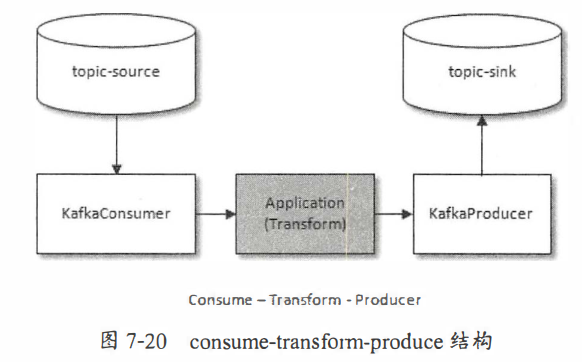

# Kafka

> 基于《Kafka 权威指南》、《深入理解 Kafka 核心设计与实践原理》
>
> 以下版本为 Kafka 2.13_2.7.1、Zookeeper 3.6.3
>
> Zookeeper 是安装 Kafka 集群的必要组件，Kafka 通过 ZooKeeper 来实施对元数据信息管理，包括集群、Broker、主题、 分区等内容。

## 一、基本概念

Kafka 是 Apache 开源的消息队列顶级项目之一，由 Scale 和 Java 编写，是一个分布式流式处理平台，它以高吞吐、可持久化、可水平扩展、支持流数据处理等多种特性而被广泛使用。

> Kafka 最初是 LinkedIn 的一个内部基础设施系统。最初开发的起因是，LinkedIn 虽然有了数据库和其他系统可以用来存储数据，但是缺乏一个可以帮助处理持续数据流的组件。所以在设计理念上，开发者不想只是开发一个能够存储数据的系统，如关系数据库、Nosql 数据库、搜索引擎等等，更希望把数据看成一个持续变化和不断增长的流，并基于这样的想法构建出一个数据系统，一个数据架构。

### （一）Kafka 作用

Kafka 之所以受到越来越受青睐，与它所扮演的三大角色是分不开的：

- 消息系统： Kafka 和传统的消息系统（也称作消息中间件〉都具备系统解耦、冗余存储、流量削峰、缓冲、异步通信、扩展性、 可恢复性等功能。与此同时，Kafka 还提供了大多数消息系统难以实现的消息顺序性保障及回溯消费的功能。
- 存储系统： Kafka 把消息持久化到磁盘，相比于其他基于内存存储的系统而言，有效地降低了数据丢失的风险。也正是得益于 Kafka 的消息持久化功能和多副本机制，我们可以把 Kafka 作为长期的数据存储系统来使用，只需要把对应的数据保留策略设置为**永久**或启用主题的日志压缩功能即可。
- 流式处理平台： Kafka 不仅为每个流行的流式处理框架提供了可靠的数据来源，还提供了一个完整的流式处理类库，比如窗口、连接、变换和聚合等各类操作。

### （二）基础结构


- 消息（Message）：消息可以看成是数据库里的一条数据，由字节数组组成，所以对于 Kafka 来说，消息里的数据没有特别的格式或含义。消息可以有个可选的元数据也就是键。键也是一个字节数组，与消息一样，对于 Kafka 来说也没有特殊的含义。当消息以一种可控的方式写入不同的分区时，会用到键。
- 主题（Topic）：Kafka 的消息通过 Topic 进行分类，Topic 类似于数据库表，一个 Topic 可以放在多个 Broker 上。
- 分区（Partition）：一个 Topic 包含若干个 Partition，一个分区就是一个提交日志。消息以追加的方式写入分区，然后以先入先出的顺序读取。
- 生产者（Producer）：负责生产消息，一条消息会被写入指定的 Topic 上，而生产者并不关心消息会被写入到哪个具体分区。默认情况下，Kafka 会均匀地把消息分布在 Topic 的所有分区上，也可以通过消息中附带的键值和自定义的分区器，将消息写入指定分区。
- 消费者（Consumer）：消费者可以订阅一个或多个 Topic，并按照消息先入先出顺序读取。消费者通过检查分区中的 offset 来区分已读的消息。
- 中间者（Broker）：一个独立的 Kafka 服务器被称为 Broker。接收来自生产者的消息，返回消费者读取的消息。
- 集群（Cluster）：多个 Broker 组成集群。每个集群中都有一个 Broker 充当集群控制器（Controller）的角色（由 Broker 们选举出来）。

## 二、主题和分区

主题作为消息的归类，可以再细分为一个或多个分区，分区也可以看做对消息的二次归类。分区不仅为 Kafka 提供了可伸缩性、水平扩展的功能，多副本机制还提高了数据可靠性。

### （一）主题的管理

主题的管理包括创建主题、查看主题信息、修改主题和删除主题等操作，可以通过 Kafka 提供的 kafka-topics.sh 脚本来执行这些操作。

> 也可以通过一些第三方客户端进行操作。
>
> 详情查看《深入理解 Kafka 核心设计与实践原理》第 4 章

#### 1、创建 Topic

主题的名称必须由大小写字母、数字、点 `.`、连接线 `-`、下划线 `_`组成，不能为空，且长度不能超过 249。

```shell
bin/kafka-topics.sh --zookeeper zk主机1:端口1/路径 --create --topic topic名 --replication-factor 副本因子数 --partitions 分区数
```

副本因子数包含主分区和副分区数量，例如：

```shell
bin/kafka-topics.sh --zookeeper 192.168.190.134:2181/kafka --create --topic myTopic --replication-factor 3 --partitions 3
```

其中创建一个名为 myTopic 的主题，其中包含 3 个主分区，每个主分区有 2（replication-factor - 1）个副分区。

> 注意：replication-factor 的值不能大于 Broker 数量，否则会报错。
>
> 

当 `auto.create.topics.enable` 为 true（默认值为 true），那么当生产者或消费者操作未创建的主题时，会自动创建分区数为 `num.partitions`（默认值为 1）和副本数 `default.replication.factor`（默认值为 1）的主题。

> 不推荐这种自动创建的方式，不便于 topic 管理。

创建主题时，Kafka 还提供一些其他的参数：

（1）手动指定分区副本所在的节点

```shell
bin/kafka-topics.sh --zookeeper zk主机1:端口1/路径 --create --topic topic名 --replics-assignment 主分区1所在broker_id[:副分区1-1所在broker_id:副分区1-2所在broker_id...[,主分区2所在broker_id[:副分区2-1所在broker_id:副分区2-2所在broker_id...]
```

创建 4 个分区，每个分区 2 个副本的主题：


> 注意：第一个 broker_id 就是主分区所在的节点。

（2）手动设置主题的配置

手动设置主题的配置，用来覆盖配置文件及默认值。

```shell
bin/kafka-topics.sh --zookeeper zk主机1:端口1/路径 --create --topic topic名 --replication-factor 副本因子数 --partitions 分区数 --config 配置项=值 [--config 配置项=值...]
```

（3）不存在时创建

添加 `--if-not-exists` 参数后创建已存在主题时，不会抛异常也不会进行任何处理。

```shell
bin/kafka-topics.sh --zookeeper zk主机1:端口1/路径 --create --topic topic名 --replication-factor 副本因子数 --partitions 分区数 --if-not-exists
```

#### 2、查看 Topic

```shell
bin/kafka-topics.sh --zookeeper zk主机1:端口1/路径 --describe --topic topic名
```


其中包含如下信息：

- Partition：表示各个分区的 id。
- Leader：表示主分区所在的 Broker 的 id，例如：分区 0 有 3 个副本（1 一个主分区，2 个副分区），其中主分区在 id 为 1 的 Broker 上，其它 2 个副分区分别在 id 为 0 和 2 的 Broker 上。
- Replicas：表示副本（主分区 + 副分区，以下统称副本）所在的 Broker 的 id。若某个 Broker 下线，也不会有变化。
- Isr：同步副本（In-Sync Replicas），表示此时所有与 Leader 保存一定程度同步的副本所在的 Broker id。若某个 Broker 下线，则会从 Isr 中去除。

id 为 1 和 2 的 Broker 下线后，Topic 信息的变化：


（1）查看所有的 Topic 名称

```shell
bin/kafka-topics.sh --zookeeper zk主机1:端口1/路径 --list
```

#### 3、修改 Topic

（1）修改主题分区数

```shell
bin/kafka-topics.sh --zookeeper zk主机1:端口1/路径 --alter --topic topic名 --partitions 新的分区数
```

> 注意：
>
> - 分区数只能增加，不能减少。若减少分区，难以处理被减少分区上的消息。
> - 分区数修改后，不会影响已经存储的消息，但是可能会导致新的消息分配到非预想的分区。
>
> **所以不推荐后续修改分区数。**

（2）修改主题配置

```shell
bin/kafka-topics.sh --zookeeper zk主机1:端口1/路径 --alter --topic topic名 --config 配置项=值 [--config 配置项=值...]
```

自定义主题配置，覆盖配置文件和默认值。

（3）删除主题配置

```shell
bin/kafka-topics.sh --zookeeper zk主机1:端口1/路径 --alter --topic topic名 --delete-config 配置项 [--delete-config 配置项]
```

#### 4、删除 Topic

```shell
bin/kafka-topics.sh --zookeeper zk主机1:端口1/路径 --delete --topic 主题名
```

若 `delete.topic.enable` 为 true 时才能删除主题，默认值为 true。删除主题后，其下的消息也一并删除。

### （二）分区

一个主题可以有若干个分区，消息以追加的方式写入分区末尾，然后以先入先出的顺序读取。

> 由于一个主题一般包含几个分区，消息进入主题后会被分区器分配到各个分区，因此无法在整个主题范围内保证消息的顺序，但可以保证消息在单个分区内的顺序。

在 Kafka 集群中，一个主题可以有多个分区，分区可以有多个副本，分区副本会尽可能均匀地分布到 Kafka 集群的各个 Broker 节点上，对应的 leader 副本的分配也比较均匀。分区副本又分为主分区（leader 副本）和副分区（follower 副本），有以下特点：

- 只有 leader 副本负责对外提供读写服务，follower 副本负责同步 leader 副本的消息。
- leader 副本会尽可能地、均匀地分布在集群的各个 Broker 节点。
- leader 副本不会和 follwer 副本在同一个 Broker。
- 当 leader 副本所在 Broker 节点发生故障时，会从 follower 副本中选举一个成为新的 leader 副本。当原 leader 副本所在的 Broker 节点恢复加入集群后，原 leader 副本会变成 follower 副本。

#### 1、优先副本的选举

为了保证 broker 节点负载均衡，leader 副本会尽可能地、均匀地分布在集群的各个 Broker 节点。当分区的 leader 节点发生故障时，其中一个 follower 节点就会成为新的 leader 节点，这样就可能会导致集群的负载不均衡，从而影响整体的健壮性和稳定性。当原来的 leader 节点恢复之后重新加入集群时，它只能成为一个新的 follower 节点而不再对外提供服务。某 leader 节点下线又重新上线后的 leader 副本变化：


可以看出节点 0 上有两个 leader 副本，leader 分布过于集中，就会造成集群负载不均衡。为了能够有效地治理负载失衡的情况，Kafka 引入了优先副本(Preferred Replica)的概念。

**所谓的优先副本是指在 AR（Assign Replicas）集合列表中的第一个副本**，就是上图中指示的地方。理想情况下，优先副本就是该分区的 leader 副本。Kafka 要确保所有主题的优先副本在 Kafka 集群中均匀分布，这样就保证了所有分区的 leader 均衡分布。但是如果某个 leader 节点宕机，就可能会导致 leader 副本不是优先副本。因此又提出了优先副本的选举的概念，**优先副本的选举是指通过一定的方式促使优先副本选举为 leader 副本，以此来促进集群的负载均衡，这一行为也可以称为分区平衡**。

##### （1）自动分区平衡

Kafka 可以提供自动优先副本选举，Kafka 控制器默认开启一个定时任务，每隔一段时间轮询一次，计算每个 broker 节点分区不平衡率是否超过配置值：若超过，则自动执行优先副本选举动作，以求分区平衡。

- 当 `auto.leader.rebalance.enable` 默认为 true 时，开启定时任务。
- 每隔 `leader.imbalance.check.interval.seconds` 默认是 5min，轮询一次。
- 不平衡率 = broker 中非优先副本的 leader 个数 / broker 上的分区总数。
- `leader.imbalance.per.broker.percentage` 默认值是 10%，是不平衡率的阈值。

##### （2）手动分区平衡

自动分区平衡执行的时间无法自主掌控，如果在关键时期（比如电商大促波峰期）执行关键任务的关卡上执行优先副本的自动选举操作，势必会有业务阻塞、 频繁超时之类的风险。因此一般都会关闭自动分区平衡，进行手动分区平衡，Kafka 提供以下命令：

```shell
 bin/kafka-preferred-replica-election.sh --zookeeper zk主机1:端口1/路径
```

上面命令会将集群上的所有分区都执行一遍优先副本的选举操作，比较消耗性能，因此可以通过外部 JSON 文件，来小批量的进行手动分区平衡：

```shell
bin/kafka-preferred-replica-election.sh --zookeeper zk主机1:端口1/路径 --path-to-json-file JSON文件路径

# JSON 文件内容，指定 topic 的指定分区进行分区平衡
{
  "partitions": [
    {
      "partition": 分区id,
      "topic": topic名
    },
    ...
  ]
}
```

#### 2、分区重分配

当要对集群中的一个节点进行有计划的下线操作时，为了保证分区及副本的合理分配，我们也希望通过某种方式能够将该节点上的分区副本迁移到其他的可用节点上。

当集群中新增 Broker 节点时，只有新创建的主题分区才有可能被分配到这个节点上，而之前的主题分区并不会自动分配到新加入的节点中，因为在它们被创建时还没有这个新节点，这样新节点的负载和原先节点的负载之间严重不均衡。

简而言之，**当集群中的 Broker 节点数量发生变化，为了分区副本再次进行合理的分配，也就是所谓的分区重分配**。有以下 3 个步骤：

（1）创建一个需要进行分区重分配 Topic 的 JSON 文件

```json
{
  "topics": [
    {
      "topic": "myTopic"
    }
  ],
  "version": 1
}
```

（2）根据 JSON 文件和所要分配的 Broker 节点列表来生成一份候选的重分配方案

```shell
bin/kafka-reassign-partitions.sh --zookeeper zk主机1:端口1/路径 --generate --topics-to-move-json-file JSON文件路径 --broker-list broker_id[,broker_id...]
```

broker-list 表示分区副本需要分配到的 Broker 节点，数量需要大于分区副本数。


第二步操作只是会输出一份**候选的分区副本分配方案**，并没有真正的执行重分配操作，可以将方案保存在 JSON 文件中，也可以自定义一份方案，格式如下：

```json
{
    "partitions": [
        "topic": topic名,
        "partition": 分区id,
        // 在这里设置分区副本所在的 broker_id
        "replicas": [broker_id, broker_id, ...],
        "log_dirs": ["any","any",....]
    ]
}
```

log_dirs 代表 Kafka 中的日志目录，对应于 Broker 端的 log.dir 或 log.dirs 参数的配置值，如果不需要关注此方面的细节，那么可以简单地设置为 any。

（3）执行具体的重分配操作

```shell
bin/kafka-reassign-partitions.sh --zookeeper zk主机1:端口1/路径 --execute --reassignment-json-file JSON文件路径
```

第三步操作使用第二步生成的方案，将分区副本重分配到指定的 Broker 上。

分区重分配的基本原理是先通过控制器为每个 分区添加新副本（增加副本因子 ） ，新的副本将从 分区的 leader 副本那里复制所有的数据。 根据分区的大小不同，复制过程可能需要花一些时间，因为数据是通过网络复制到新副本上的。在复制完成之后，控制器将旧副本从副本清单里移除（恢复为原先的副本因子数）。

> 注意：在重分配的过程中要确保有足够的空间。

分区重分配对集群的性能有很大的影响，需要占用额外的资源，比如网络和磁盘。 在实际操作中，我们将降低重分配的粒度，分成多个小批次来执行，以此来将负面的影响降到最低。

#### 3、修改副本因子

分区重分配操作不仅可以分配分区副本，并且可以修改（增减）副本因子数。

需要在第二步时调整分配方案：

```json
// 生成的候选的分区副本分配方案
{
    "partitions": [
        "topic": "reassign-topic",
        "partition": 0,
        "replicas": [0,1],
        "log_dirs": ["any","any"]
    ]
}

// 添加一个副本
{
    "partitions": [
        "topic": "reassign-topic",
        "partition": 0,
        // 在这里添加一个副本所在的 broker_id
        "replicas": [0,1,2],
        "log_dirs": ["any","any"]
    ]
}
```

然后正常的执行分区重分配第三步即可。

#### 4、主从复制

follower 副本为了与 leader 副本保持一致，会扮演消费者角色轮询地同步 leader 副本中的消息。leader 副本是同步副本，而对于 follower 副本来说，它需要满足以下条件才能被认为是**同步**的：

- 在 `zookeeper.session.timeout.ms`（默认 6000ms）时间内向 Zookeeper 发送心跳。
- 在 `replica.lag.time.max.ms`（默认 10s）时间内向 leader 副本发送过同步请求，并且同步的是最新消息。光从首领那里获取消息是不够的，它还必须是几乎零延迟的。

若不能满足以上任何一点条件，则 follower 副本被认定为是**不同步**的，**不同步的 follower 副本没有成为 leader 副本的资格**。

在 leader 节点失效时，不同步的 follower 副本没有成为 leader 副本的资格。

## 三、日志和存储

日志文件用于存储 Kafka 的消息数据。

### （一）日志


一个分区副本对应一个日志(Log)。 为了防止 Log 过大，Kafka 又引入了日志分段(LogSegment)的概念，将 Log 切分为多个 LogSegment, 相当于一个巨型文件被平均分配为多个相对较小的文件， 这样也便于消息的维护和清理。 事实上， Log 和 LogSegment 也不是纯粹物理意义上的概念：Log 实际上是一个文件夹，命名形式为 `topic名-分区id`，例如：myTopic-0；LogSegment 对应一个日志文件和两个索引文件，具体如下：


LogSegment 文件以基准偏移量（BaseOffset，也就是第一条消息的偏移量）命名，例如：00000000000000000251.log 日志文件基准偏移量为 251，表示之前可能有 250 条消息。

向 Log 中追加 消息时是顺序写入的，只有最后一个 LogSegment 才能执行写入操作，在此之前所有的 LogSegment 都不能写入数据。为了方便描述，我们将最后 一 个 LogSegment 称为**activeSegment**，即表示当前活跃的日志分段。随着消息的不断写入，当 activeSegment 满足一定的条件时，就需要创建新的 activeSegment，之后追加的消息将写入新的 activeSegment。

#### 1、日志索引

日志索引文件用来建立 offset 到物理地址间的映射关系，提高查找消息的效率。每个 LogSegment 对应两个索引文件，分别是：偏移量索引和时间戳索引。

##### （1）偏移量索引

以跳跃表形式【offset, 物理地址】存储映射关系，查找时找到小于 searchOffset 的最大 offset，获取到物理地址后再顺序查找到对应的物理地址。


##### （2）时间戳索引

以跳跃表形式【timestamp, 物理地址】存储映射关系，查找时找到小于 searchTimestamp 的最大 offset，再用此 offset 去偏移量索引文件找，**再执行上面的操作**。


#### 2、日志清理

Kafka 将消息存储在磁盘中，为了控制磁盘占用空间的不断增加就需要对消息做一定的清理操作。broker 提供 `log.cleanup.policy` 配置用来设置日志清理策略，用于清理磁盘中 kafka 的数据。参数的默认值为 delete，表示采用日志删除策略；参数值为 compact；表示采用日志压缩策略；也可以同时使用。

##### （1）日志删除

Kafka 控制器有日志删除任务轮询地检测和删除不符合保留条件的日志分段文件，轮询周期为 `log.retention.check.interval.ms`，默认 5min。有以下几种保留策略：

① 基于时间

通过 `log.retention.hours、log.retention.minutes、log.retention.ms` 配置日志最大保留时间，`log.retention.ms` 配置优先级最高，默认是开启 `log.retention.hours` 配置（默认值为 168，也就是 7 天）。

判断当前 LogSegment 是否过期：先查找 LogSegment 日志对应的时间戳索引文件，获取索引文件中最大的时间戳；若没有获取到，则再获取日志文件最后一次修改的时间戳。

若已过期，则会执行删除操作：

1. 首先会从 Log 对象中所维护**日志分段的跳跃表**（用于定位 baseOffset 对应的 LogSegment）中移除待删除的 LogSegment，以保证没有线程对这些 LogSegment 进行读取操作；
2. 然后将这些待删除的 LogSegment 文件（包括索引文件）添加 `.deleted` 后缀；
3. 最后交由一个名为 delete-file 的延时任务来删除这些 `.deleted` 为后缀的文件，延时时间通过 `file.delete.delay.ms` 参数来调配，默认值是 60000 毫秒。

② 基于日志大小

通过 `log.retention.bytes` 类配置日志最大保留大小，默认值为 -1，表示无穷大小。

判断当前 Log 日志文件的总大小和 retentionSize 的差值，即要删除的日志总大小；然后从日志文件中开始顺序获取需要删除的 LogSegment；然后执行删除操作。

③ 基于日志起始偏移量

一般情况下，日志文件的起始偏移量 logStartOffset 等于第一个日志分段的 baseOffset，但这并不是绝对的，logStartOffset 的值可以通过手动删除消息操作修改，除了将分区的起始偏移量（logStartOffset）修改为指定偏移量，同时也会执行日志删除操作。

**删除指定偏移量之前的所有消息的命令**：

```shell
bin/kafka-delete-records.sh --bootstrap-server broker主机1:端口1 --offset-json-file json文件名

# json 文件格式为：
{
  "partitions": [
    {
      "topic": 'topic-demo',
      "patition: 0
      "offset": 10
    }
  ],
  "version": 1
}
```

> 注意：只是将对应分区的起始偏移量修改为指定的偏移量，数据并没有真正的删除，需要等待日志删除操作。

某 LogSegment 的下一个 LogSegment 的起始偏移量 baseOffset 是否小于等于 logStartOffset，若是，则可以删除此日志分段。

##### （2）日志压缩

定期执行压缩操作，对于有相同 key 的不同 value 值，只保留最后一个版本。

### （二）磁盘存储

Kafka 在设计时采用了文件追加的方式来写入消息，即只能在日志文件的尾部追加新的消息，并且也不允许修改己写入的消息，这种方式属于典型的顺序写盘的操作，所以就算 Kafka 使用磁盘作为存储介质，它所能承载的吞吐量也不容小觑。 除此以外，还有一些其他的途径提高 Kafka 的性能：

#### 1、页缓存

和 MySQL 的页缓存类似，也是一组存储在磁盘中逻辑有序的数据，读写操作时都以整个页为单位进行操作：

- 读消息时，先检查对应的页是否在缓存中，若不在，则将页缓存到内存中，再进去读取。
- 写消息时，将消息追加写入对应页中，此时更改过但未持久化到磁盘的页称为**脏页**，操作系统会在合适的时间将脏页持久化到磁盘。

#### 2、零拷贝

Kafka 中零拷贝体现在磁盘文件拷贝到网卡过程中，具体查看 JavaNIO 篇章。

## 四、中间者

中间者（Broker）实际上是一个 Kafka 服务器，一个集群中会有一个或多个 Broker。每个 Broker 都有个 ID（通过 `broker.id` 配置或自动生成），Broker 启动时，会将 ID 注册到 Zookeeper 的注册路径 `/brokers/ids`，同时 Broker 也会订阅该注册路径。

### （一）控制器

每个集群中有且仅有一个控制器（Controller），它负责管理整个集群中所有分区和副本的状态。

#### 1、控制器竞选

每个 Broker 启动时都会尝试读取 Zookeeper 中`/Controller`节点下的 brokerid 值，如果值不为 -1，则表示已经有 Controller；否则就会尝试去创建 `/controller` 节点，只有创建成功的 Broker 才会成为 Controller。每个 Broker 都会在内存中保存当前控制器的 brokerid 值，这个值可以标识为 activeControllerId。

如果 Controller 被关闭或者与 Zookeeper 断开连接，Zookeeper 上的临时节点就会消失。集群里的其他 Broker 通过监听器得到控制器节点消失的通知，它们会尝试让自己成为新的 Controller。

控制器。

#### 2、控制器职责

Controller 有以下职责：

- 处理优先副本选取、分区重分配、ISR 集合变更、分区 leader 选举等动作。
  - 当某个 leader 节点下线后，Controller 会根据 AR 集合顺序选取下一个 follower 副本作为 leader 副本。
- 监听主题相关变化，为 Zookeeper 中 `/brokers/topics` 节点添加处理器，用来处理主题增减变化。
- 监听 Broker 相关变化，为 Zookeeper 中的 `/Brokers/ids` 节点添加处理器，用来处理 Broker 增减变化。

  - 当有 Broker 加入或退出集群时，其他 Broker 也会收到通知。关闭 Broker 时，该 Broker 的 ID 会被继续保存，当有相同 ID 的 Broker 加入集群时，会拥有与旧 broker 相同的分区和主题。

- 监听主题中的分区分配变化。
- 更新集群的元数据信息。

### （二）处理请求

Broker 的大部分工作是处理客户端、分区副本和控制器发送给分区首领的请求。

## 五、生产者

生产者主要用于向 kafka 中发送消息，通过 Kafka 提供的命令生产消息：

```shell
bin/kafka-console-producer.sh --broker-list broker主机1:端口1 --topic topic名
```


Java API 中提供 [KafkaProducer](https://kafka.apache.org/082/javadoc/org/apache/kafka/clients/producer/KafkaProducer.html) 类对应生产者。KafkaProducer 是**线程安全的**，可以在多线程中共享一个实例：

```java
public static final String DEFAULT_BROKER_LIST = "192.168.190.134:9092";
public static final String DEFAULT_TOPIC_NAME = "myTopic";
public static final Properties DEFAULT_PRODUCER_PROPERTIES;
static {
    // 必要的配置
    DEFAULT_PRODUCER_PROPERTIES = new Properties();
    DEFAULT_PRODUCER_PROPERTIES.put(ProducerConfig.KEY_SERIALIZER_CLASS_CONFIG, "org.apache.kafka.common.serialization.StringSerializer");
    DEFAULT_PRODUCER_PROPERTIES.put(ProducerConfig.VALUE_SERIALIZER_CLASS_CONFIG, "org.apache.kafka.common.serialization.StringSerializer");
    DEFAULT_PRODUCER_PROPERTIES.put(ProducerConfig.BOOTSTRAP_SERVERS_CONFIG, DEFAULT_BROKER_LIST);
}

public static void main(String[] args) {
    KafkaProducer<String, String> producer = new KafkaProducer<>(DEFAULT_PRODUCER_PROPERTIES);
    IntStream.range(0, 20).forEach(i -> {
        // 构建消息
        ProducerRecord<String, String> message = new ProducerRecord<>(DEFAULT_TOPIC_NAME, "" + i, "hello, java, Kafka! 2023/6/3-" + i);
        try {
            // 发送消息
            producer.send(message).get();
        } catch (InterruptedException | ExecutionException e) {
            e.printStackTrace();
        }
    });
    producer.close();
}
```

### （一）生产者的主要组件

构建 KafkaProducer 发送消息时，有以下组件：

#### 1、序列化器

生产者需要用**序列化器将消息（键和值）转换成字节数组**才能通过网络发送给 Kafka，Kafka 中存储的也是字节数组类型的数据，因此，消费者也需要**反序列化器将收到的字节数组转换成对应类型的消息**。

虽然 Kafka Java API 中已经实现了部分类型的序列化器，但是由于发送到 Kafka 的数据有可能不是简单的 String、int 等，需要自定义实现 `org.apache.kafka.common.serialization.Serializer` 接口的序列化器，例如：对 User 类进行序列化，需要自定义 User 类的序列化器，将对应字段转换为字节数组才能进行序列化。

> 注意：序列化器和反序列化器都是一一对应的， 如果生产者使用了某种序列化器，比如 StringSerializer, 而消费者使用了另 一种序列化器，比如 IntegerSerializer，那么是无法解析出想要的数据的。

[avro 序列化器](https://cloud.tencent.com/developer/article/1336568)：

当 User 类的属性修改后，也需要同步修改自定义序列化器的代码，avro 可以更加灵活的实现对象的序列化。当 User 类的属性修改后，只需要修改相应的 avro scheme 文件，并重新再次将对象序列化。

#### 2、分区器

当 ProducerRecord 没有指定消息要存储在哪个分区时，Kafka Java API 提供 `org.apache.kafka.clients.producer.Partitioner` 分区器接口，根据配置中分区器和消息的键，决定消息存储在哪个区。

Kafka Java API 中提供的默认分区器是 DefaultPartitioner，它实现了 Partitioner 接口：

- 消息的键为 null 时，分区器使用轮询算法将消息均衡地分布到各个分区。
  - 获取的分区号是**可用分区**中的任意一个
- 消息的键不为 null 时，分区器对键进行 hash，根据 hash 值将消息映射到特定分区。
  - 获取的分区号是**所有分区**中的任意一个

也可以实现 Partitioner 接口，自定义一个分区器：

```java
public static class MyPartioner implements Partitioner {
    private final AtomicInteger counter = new AtomicInteger(0);

    // 返回值用于指定消息存储的分区
    @Override
    public int partition(String topic, Object key, byte[] keyBytes, Object value, byte[] valueBytes,
                         Cluster cluster) {
        List<PartitionInfo> partitionInfoList = cluster.partitionsForTopic(topic);
        int numPartition = partitionInfoList.size();
        if (keyBytes == null) {
            return counter.getAndIncrement() % numPartition;
        } else {
            return Utils.toPositive(Utils.murmur2(keyBytes)) % numPartition;
        }
    }

    // 在关闭分区时用来回收一些资源
    @Override
    public void close() {

    }

    // 用于获取配置信息及初始化数据
    @Override
    public void configure(Map<String, ?> map) {

    }
}

public static void main(String[] args) {
    Properties properties = new Properties();
    // 将自定义分区器放在生产者配置中
    properties.put(ProducerConfig.PARTITIONER_CLASS_CONFIG, MyPartioner.class.getName());
}
```

#### 3、[拦截器](https://xie.infoq.cn/article/d4e29fef50c93f7a24b60228d)

拦截器主要用于发送消息前（序列化之前）做一些准备工作，提供了 `org.apache.kafka.clients.producer.ProducerInterceptor` 接口用于自定义实现生产者拦截器。

```java
public static class MyProducerInterceptor implements ProducerInterceptor<String, String> {
    private volatile AtomicInteger sendSuccess = new AtomicInteger();
    private volatile AtomicInteger sendFailure = new AtomicInteger();

    // 在发送消息前，对消息进行处理
    @Override
    public ProducerRecord<String, String> onSend(ProducerRecord<String, String> producerRecord) {
        String modifiedValue = "prefix1-" + producerRecord.value();
        return new ProducerRecord<>(producerRecord.topic(), producerRecord.partition(), producerRecord.timestamp(), producerRecord.key(), modifiedValue, producerRecord.headers());
    }

    // 在消息被应答之前（消息发送成功）或消息发送失败时调用
    @Override
    public void onAcknowledgement(RecordMetadata recordMetadata, Exception e) {
        if (e == null) {
            sendSuccess.getAndIncrement();
        } else {
            sendFailure.getAndIncrement();
        }
    }

    // 在关闭拦截器时做一些资源清理的工作
    @Override
    public void close() {
        double successRatio = (double) sendSuccess.get() / (sendFailure.get() + sendSuccess.get());
        log.info("消息发送成功率: {}%", successRatio * 100);
    }

    @Override
    public void configure(Map<String, ?> map) {

    }
}

public static void main(String[] args) {
    Properties properties = new Properties();
    // 将自定义分区器放在生产者配置中
    properties.put(ProducerConfig.INTERCEPTOR_CLASSES_CONFIG, MyProducerInterceptor.class.getName());
}
```

拦截器不是必需的，但是也可以在配置中添加多个拦截器，组成拦截链，用 `,` 逗号隔开。如果拦截链中的某个拦截器的执行需要依赖于前一个拦截器的输出，那么就有可能产生**副作用**：前一个拦截器由于异常而执行失败，那么这个拦截器也就跟着无法继续执行。若没有依赖关系，当某个拦截器执行失败时，那么下个拦截器会接着从上一个执行成功截器继续执行。

### （二）发送消息策略

1、fire-and-forget（发送并忘记）

生产者将消息发送给 kafka 服务器，但并不关心它是否正常到达。

```java
producer.send(message);
```

2、sync send（同步发送）

大多数情况下，消息会正常到达，因为 kafka 是高可用的，而且生产者会自动尝试重发，但少数情况会丢失一些消息。

send()方法返回值为 `Future<RecordMetadata>` 类型，RecordMetadata 对象中包含消息的一些元数据：消息的主题、分区号、分区中的偏移量（offset）、时间戳等。

```java
// 阻塞当前线程，直到返回值
producer.send(message).get();
```

3、async send（异步发送）

send()有个重载方法，可以在发送消息时指定一个回调函数 Callback，在发送成功并响应时调用该函数。

```java
// 添加回调函数
producer.send(message, (recordMetadata, exception) -> {
    if (exception != null) {
        log.info("发送消息出错: {}", exception.getMessage());
    } else {
        log.info("topic名: {}, partition名: {}, offset: {}", recordMetadata.topic(), recordMetadata.partition(), recordMetadata.offset());
    }
}));
```

### （三）生产者客户端执行流程


1. 消息经过拦截器、序列化器和分区器后，到达消息累加器 RecordAccumulator。
2. RecordAccumulator 主要用来缓存消息以便 Sender 线程可以批量发送，进而减少网络传输的资源消耗以提升性能。
   1. 通过 `buffer.memory` 配置缓存区大小，默认值为 33554432B（即 32MB）。当发送者发送消息的速度大于 Sender 线程取出并发送给 kafka 服务器速度时，导致 RecordAccumulator 缓存空间不足时，send()方法会被阻塞，阻塞时间大于出 `max.block.ms`（默认值为 6000 毫秒）时会抛异常。
   2. RecordAccumulator 中有个 `ConcurrentMap<TopicPartition, Deque<ProducerBatch>> batches` 属性用于维护消息对应的分区，新消息追加到 Deque 队尾，Sender 从队头读取消息进行发送。
   3. **ProducerBatch 是指一个消息批次**，其中包含一个或多个 ProducerRecord，通过 `batch.size` 配置大小，默认值为 16384B（即 16kB）。当一条 ProducerRecord 加入对应分区的 Deque 队尾时，会获取一个 ProducerBatch 并写入。若 ProducerRecord 大于配置，则以评估的大小来创建新的 ProducerBatch，此内存**不会被 BufferPool 管理复用**；否则以 batch.size 的大小创建，此内存**会被 BufferPool 管理复用**。
3. Sender 线程从 RecordAccumulator 中取出 ProducerBatch，进行一系列数据转换，再发送请求
   1. Sender 线程获取缓存消息后，将 `ConcurrentMap<TopicPartition, Deque<ProducerBatch>> batches` 转换为 `<Node, List< ProducerBatch>>`，这一步的目的是：对于网络连接来说，生产者客户端与 broker 建立连接，并不关系消息属于哪个分区；对于开发者来说，只需要关注向哪个分区发送消息。
   2. Sender 线程会进一步封装成 `<broker节点, Request>` 的形式并发往服务器，Request 中封装了数据和 Kafka 协议。
   3. 发送请求的同时，数据以 `Map<broker节点id, Deque<Request>>` 保存在 inFlightBatches，用于缓存已发送但未收到响应的请求。每个连接缓存的最大长度由 `max.in.flight.request.per.connnection` 决定，表示每个连接最多缓存的请求数（也就是 Deque 的长度），也就是 Sender 在收到响应前可以发送多少消息，超过阈值就不能向这个连接发送更多请求，默认值是 5。

### （四）幂等和事务

一般而言，消息中间件的消息传输保障有 3 个层级：

- at most once：至多一次，消息可能会丢失，但绝对不会重复传输。
- at least once：至少一次，消息绝不会丢失，但可能会重复传输。
- exactly once：恰好一次，消息肯定会被传输一次且仅传输一次。这里和 at most once 的区别是：exactly once 会保证这一次传输肯定成功。

网络不是百分百可靠的，若由于网络问题导致消息丢失，Kafka 无法确定网络故障期间发生了什么，但是生产者可以进行多次重试来确保消息已经写入 Kafka，这个重试过程中可能导致消息的重复写入，所以这里 Kafka 提供的消息传输保障为 at least once。

> 例如：某个网关由于大量数据包导致阻塞一段时间，生产者认为发送超时进行重试，这时网关又恢复正常，将阻塞的消息发送出去，导致 Kafka 接收到两条相同的消息。

对于消费者而言，若消费并处理完消息后，还未来得及提交消费位移，消费者就发生故障导致下线，待它重新上线后，会从上一次位移进行消费，就出现了重复消费，此时就对应 at least once；若先提交消费位移，还未来得及处理消息，消费者就发生故障导致下线，待它重新上线后，会从已提交的位移进行消费，但之前已消费的消息还未处理，如此就会发生消息丢失，此时就对应 at most once。

#### 1、幂等

**幂等是指对接口进行多次调用产生的结果和调用一次是一致的**，Kafka 提供幂等功能保证**生产者**实现 exactly once。生产者需要显式地将 `enable.idempotence` 设置为 true（默认为 false）开启幂等功能。

> 注意：开启幂等后，会对 `retries、acks、max.in.flight.request.per.connect` 参数值有要求，配置不当会导致报错并创建生产者失败，最好不要配置，系统会默认配置。

为了实现生产者的幂等性，Kafka 引入了 producer id（以下简称 PID）和序列号（sequence number）这两个概念：

- 每个生产者实例在初始化时都会被分配一个 PID，这个 PID 对用户而言是完全透明的。
- 对于每个 PID，消息发送到每个分区都有对应的序列号，这些序列号从 0 开始，每发送一条消息都会单调递增。

**Broker**中维护着 Map<<PID, 分区>, sequence> 的映射，每收到一条消息，会对比消息中的 new_sequence 和 Broker 中对应的 sequence：

- 若 `new_sequence < sequence + 1`：说明消息被重复写入，可以丢失。
- 若 `new_sequence = sequence + 1`：说明此 new_sequence 是预期的序号，Broker 接收并写入消息。
- 若 `new_sequence > sequence + 1`：说明中间有消息丢失，对应的生产者会抛出 OutOfOrderSequenceException，这个异常是个严重 异常，后续的诸如 send()、beginTransaction()、commitTransaction()方法的调用都会抛出 Illega!StateException 的异常。

> 注意：Producer 是在 send()后的消息设置 new_sequence，而不是 ProducerRecord，也就是说：同一个 ProducerRecord 被 send(ProducerRecord) 两次，是两个不同的 new_sequence。若是由 Sender 线程重发的消息，new_sequence 不变。

#### 2、事务

**幂等性并不能跨多个分区运行，事务可以保证对多个分区写入操作的原子性。**

通过 `transactional.id` 配置事务 id 并开启事务功能，配置后幂等功能也会自动开启（手动设置为 false 会报错）。事务 id 必须唯一，否则后创建的生产者会导致旧的生产者报错并关闭。

从生产者的角度分析，通过事务 Kafka 可以保证跨生产者会话的消息幕等发送，以及跨生产者会话的事务恢复。前者表示具有相同 transactionalld 新生产者实例被创建且工作的时候，旧的且拥有相同 transactionalld 的生产者实例将不再工作。后者指当某个生产者实例宕机后，新的生产者实例可以保证任何未完成的旧事务要么被提交（ Commit ），要么被中止（ Abort ），如此可以使新的生产者实例从 一个正常的状态开始工作。

而从消费者的角度分析，事务能保证的语义相对偏弱。出于以下原因，Kafka 并不能保证己提交的事务中的所有消息都能够被消费：

- 对采用日志压缩策略的主题而言，事务中的某些消息有可能被清理（相同 key 的消息，后写入的消息会覆盖前面写入的消息）。
- 事务中消息可能分布在同一个分区的多个日志分段（ LogSegment ）中，当老的日志分段被删除时，对应的消息可能会丢失。
- 消费者可以通过 seek()方法访问任意 offset 的消息，从而可能遗漏事务中的部分消息。
- 消费者在消费时可能没有分配到事务内的所有分区，如此它也就不能读取事务中的所有消息。

以下是使用事务的示例：

```java
public static Properties getConsumerProperties() {
    Properties props = DEFAULT_CONSUMER_PROPERTIES;
    // 设置消费者读已提交，只有生产者提交后才可消费
    props.put(ConsumerConfig.ISOLATION_LEVEL_CONFIG, "read_committed");
    return props;
}

public static Properties getProducerProperties() {
    Properties props = DEFAULT_PRODUCER_PROPERTIES;
    // 设置事务Id，同时默认会开启幂等
    props.put(ProducerConfig.TRANSACTIONAL_ID_CONFIG, "transactionalId");
    return props;
}

@Test
public void testTransaction() {
    KafkaProducer<String, String> producer = new KafkaProducer<>(getProducerProperties());
    producer.initTransactions();
    producer.beginTransaction();

    try {
        IntStream.range(0, 1000).forEach(i -> {
            ProducerRecord<String, String> message = new ProducerRecord<>(DEFAULT_TOPIC_NAME, "" + i, "hello, java, Kafka! 2023/6/14-" + i);
            try {
                producer.send(message).get();
            } catch (InterruptedException | ExecutionException e) {
                e.printStackTrace();
            }
        });
        // commitTransaction() 方法提交后，开启 read_committed 隔离级别的消费者可以消费
        producer.commitTransaction();
    } catch (ProducerFencedException e) {
        // abortTransaction() 方法遗弃后，开启 read_committed 隔离级别的消费者会跳过这些数据
        producer.abortTransaction();
        e.printStackTrace();
    }
}

@Test
public void testReadUncommitted() {
    KafkaConsumer<String, String> consumer = new KafkaConsumer<>(getConsumerProperties());
    consumer.subscribe(Collections.singletonList(DEFAULT_TOPIC_NAME));
    while (true) {
        ConsumerRecords<String, String> messages = consumer.poll(Duration.ofMillis(1000));
        messages.forEach(message -> {
            log.info("topic信息: {topic: {}, partition: {}, offset: {}}", message.topic(), message.partition(),
                     message.offset());
            log.info("消费者获取消息: {key: {}, value: {}}", message.key(), message.value());
        });
    }
}
```

和 MySQL 的事务不一样，无论是否提交事务，在事务中的生产者会成功发送消息给 Kafka。**事务唯一的作用是只针对 `isolation.level` 配置值为 read_committed（默认值为 read_uncommitted）的消费者**，在未执行 commitTransaction() 或 abortTransaction() 前，消费端应用是消费不到这些消息的，不过在 KafkaConsumer 内部会缓存这些消息：

- 如果生产者执行 commitTransaction()方法，它才能将这些消息推送给消费端应用；
- 如果生产者执行 abortTransaction() 方法，那么 KafkaConsumer 会将这些缓存的消息丢弃而不推送给消费端应用。

对流式应用（Stream Processing Applications）而言，一个典型的应用模式为 **consumer-transform-produce**。



在这种模式下消费和生产并存： 应用程序从某个主题中消费消息，然后经过一系列转换后写入另一个主题，消费者可能在提交消费位移的过程中出现问题而导致重复消费，也有可能生产者重复生产消息。Kafka 中的事务可以使应用程序将消费消息、生产消息提交消费位移当作原子操作来处理，同时成功或失败，即使该生产或消费会跨多个分区。

```java
private static final String TOPIC_SOURCE = "topic-source";

private static final String TOPIC_SINK = "topic-sink";

public static Properties getConsumerProperties() {
    Properties props = DEFAULT_CONSUMER_PROPERTIES;
    // 关闭自动提交，并且也不能手动提交消费位移
    props.put(ConsumerConfig.ENABLE_AUTO_COMMIT_CONFIG, false);
    return props;
}

public static Properties getProducerProperties() {
    Properties props = DEFAULT_PRODUCER_PROPERTIES;
    // 设置事务Id，同时默认会开启幂等
    props.put(ProducerConfig.TRANSACTIONAL_ID_CONFIG, "transactionalId");
    return props;
}

public static void main(String[] args) {
    KafkaConsumer<String, String> consumer = new KafkaConsumer<>(getConsumerProperties());
    consumer.subscribe(Collections.singleton(TOPIC_SOURCE));
    KafkaProducer<String, String> producer = new KafkaProducer<>(getProducerProperties());
    // 初始化事务
    producer.initTransactions();
    while (true) {
        ConsumerRecords<String, String> records = consumer.poll(Duration.ofMillis(1000));
        if (!records.isEmpty()) {
            Map<TopicPartition, OffsetAndMetadata> offsets = new HashMap<>();
            // 开启事务
            try {
                producer.beginTransaction();
                for (TopicPartition partition : records.partitions()) {
                    List<ConsumerRecord<String, String>> partitionRecords = records.records(partition);
                    for (ConsumerRecord<String, String> record : partitionRecords) {
                        // do some logical processing
                        ProducerRecord<String, String> producerRecord = new ProducerRecord<>(TOPIC_SINK, record.key(), record.value());
                        // 消费-生产模型
                        producer.send(producerRecord);
                    }
                    long lastCosumedOffset = partitionRecords.get(partitionRecords.size() - 1).offset();
                    offsets.put(partition, new OffsetAndMetadata(lastCosumedOffset + 1));
                }
                // 生产者事务提交位移
                producer.sendOffsetsToTransaction(offsets, DEFAULT_CONSUMER_GROUP);
                // 提交事务
                producer.commitTransaction();
            } catch (ProducerFencedException e) {
                // 中止事务
                producer.abortTransaction();
                throw new RuntimeException(e);
            }
        }
    }
}
```

### （五）[生产者配置](https://www.orchome.com/511)

- bootstrap.servers：配置 kafka 服务器地址和端口。
- key.serializer 和 value.serializer：消息键值通过不同类型序列器将不同类型数据，转换成字节数组（kafka 中消息就是字节数组类型）
- client.id：客户端 id，KafkaProducer 会自动为客户端生成（如：producer-数字）
- buffer.memory：设置消息缓冲区 RecordAccumulator 大小。
- max.block.ms：当消息缓冲区满时，阻塞 send()方法的时长。默认 60000 毫秒
- batch.size：batch.size 决定新建的 ProducerBatch 的大小。
- max.in.flight.requests.per.connection：表示每个连接最多缓存的请求数（也就是 Deque 的长度），也就是 Sender 在收到响应前可以发送多少消息，超过阈值就不能向这个连接发送更多请求，默认值是 5。
- acks：指定必须多少个副本（主分区+副分区）收到消息，生产者才认为消息写入成功。
  - 0：相当于异步操作，Producer 不需要 Leader 给予回复，发送完就认为成功，继续发送下一条（批）Message。**此机制具有最低延迟，但是持久性可靠性也最差，当服务器发生故障时，很可能发生数据丢失。**
  - 1： Kafka 默认的设置。表示 Producer 要 Leader 确认已成功接收数据才发送下一条（批）Message。不过 Leader 宕机，Follower 尚未复制的情况下，数据就会丢失。**此机制提供了较好的持久性和较低的延迟性。**
  - -1： Leader 接收到消息之后，还必须要求 ISR 列表里跟 Leader 保持同步的那些 Follower 都确认消息已同步，Producer 才发送下一条（批）Message。**此机制持久性可靠性最好，但延时性最差。**
- retries：当消息发送失败时，可以重发的次数，重试是在客户端内部进行。
- retry.backoff.ms：两次重试之间的时间间隔。
- metadata.max,age.ms：表示更新元数据的时间，若指定时间内没有更新元数据，则更新元数据。
- max.request.size：生产者发送消息的最大值。
- compression.type：指定消息压缩的方式，有：gzip、snappy、lz4、none，对消息压缩可以提高网络传输性能，但是压缩会耗时耗 CPU。默认为 none
- connections.max.idle.ms：指定时间后关闭闲置的连接。
- linger.ms：在 ProducerBatch 未满前提下，将指定时间范围内的 ProducerRecord 放入到一个 ProducerBatch 中。也就是说 Sender 会延时指定时间再发送 ProducerBatch。
- request.timeout.ms：生产者请求等待响应的最长时间，请求超时后便进行重试。

## 六、消费者

消费者主要用于向 Kafka 中**拉取**消息，通过 Kafka 提供的命令消费消息：

```shell
# --from-beginning 表示从主题分区头部开始消费
bin/kafka-console-consumer.sh --bootstrap-server broker主机1:端口1 --topic topic名 [--partition 分区id] [--from-beginning]
```

Java API 中提供 KafkaConsumer 类对应消费者。KafkaConsumer 是**线程不安全的**，不能在多线程中共享同一个实例：

```java
public static final String DEFAULT_BROKER_LIST = "192.168.190.134:9092";
public static final String DEFAULT_TOPIC_NAME = "myTopic";
// 指定消费者组名称
public static final String DEFAULT_CONSUMER_GROUP = "group.demo";
public static final Properties DEFAULT_CONSUMER_PROPERTIES;

static {
    DEFAULT_CONSUMER_PROPERTIES = new Properties();
    DEFAULT_CONSUMER_PROPERTIES.put("key.deserializer", "org.apache.kafka.common.serialization.StringDeserializer");
    DEFAULT_CONSUMER_PROPERTIES.put("value.deserializer", "org.apache.kafka.common.serialization.StringDeserializer");
    DEFAULT_CONSUMER_PROPERTIES.put("bootstrap.servers", DEFAULT_BROKER_LIST);
    DEFAULT_CONSUMER_PROPERTIES.put("group.id", DEFAULT_CONSUMER_GROUP);
}


public static void main(String[] args) {
    KafkaConsumer<String, String> consumer = new KafkaConsumer<>(DEFAULT_CONSUMER_PROPERTIES);
    // 消费者订阅topic
    DEFAULT_CONSUMER.subscribe(Collections.singletonList(DEFAULT_TOPIC_NAME));
    // 轮询消费消息
    while (true) {
        ConsumerRecords<String, String> messages = DEFAULT_CONSUMER.poll(Duration.ofMillis(1000));
        messages.forEach(message -> {
            log.info("topic信息: {topic: {}, partition: {}, offset: {}}", message.topic(), message.partition(), message.offset());
            log.info("消费者获取消息: {key: {}, value: {}}", message.key(), message.value());
        });
    }
}
```

### （一）消费者组

> 情景 1：每次创建消费者时，都需要指定 Topic 和 Partition，这时候就需要记住消费者和对应主题分区的映射关系，否则会造成多个消费者消费同一分区的情况。
>
> 情景 2：当某个主题分区唯一的消费者掉线时，会造成分区消息无法被消费的情况，直到新的消费者继续消费此主题分区。

和其他一些消息中间件不同的是，在 Kafka 消费理念中还有一层消费者组（Consumer Group）的概念，消费者和消费者组有以下特点：

- 消费者从属于消费者组，创建 KafkaConsumer 时，需要指定配置中的 `group.id`，表示加入此消费者加入指定群组。
  - 并不是所有的消费者都会从属于消费者组，例如：独立消费者，也就是上面使用 kafka-console-consumer.sh 创建的消费者，**独立消费者要手动配置消费的分区及手动管理偏移量**。
- 一个消费者组可以订阅多个 Topic，多个消费者组可以订阅一个 Topic，**添加消费者组或消费者可以增加消息整体消费能力**。
  - 真正的是消费者订阅 Topic。

同一个消费者组下的消费者不会消费同一个主题分区：


不同消费者组下的消费者可以消费同一主题分区，互不干扰：


#### 1、管理消费者组命令

```shell
bin/kafka-consumer-groups.sh --bootstrap-server broker主机1:端口1 [参数]
```

（1）查看 Consumer Group 列表

```shell
bin/kafka-consumer-groups.sh --bootstrap-server broker主机1:端口1 --list
```

（2）查看 Consumer Group 状态

```shell
bin/kafka-consumer-groups.sh --bootstrap-server broker主机1:端口1 --describe --group 消费者组名 --state
```

状态有：Dead、Empty、PreparingRebalance、CompletingRebalance、Stable（正常）。

（3）查看 Consumer Group 中的消费位移

```shell
bin/kafka-consumer-groups.sh --bootstrap-server broker主机1:端口1 --describe --group 消费者组名
```


其中包含如下信息：

- CURRENT-OFFSET：表示消费者组最新提交的消费位移。
- LOG-END-OFFSET：表示的是当前最新的一条数据的偏移量。
- LAG：表示消息滞后的数量，也就是还未消费的消息数量，是 LOG-END-OFFSET 和 CURRENT-OFFSET 的数值之差。

（4）查看 Consumer Group 中的 Consumer 列表及分区情况

```shell
bin/kafka-consumer-groups.sh --bootstrap-server broker主机1:端口1 --describe --group 消费者组名 --members --verbose
```

（5）删除 Consumer Group

```shell
bin/kafka-consumer-groups.sh --bootstrap-server broker主机1:端口1 --delte --group 消费者组名
```

若 Consumer Group 中有 Consumer 正常运行，则删除操作失败。

（6）修改消费者组中**所有主题分区的消费位移**

```shell
bin/kafka-consumer-groups.sh --bootstrap-server broker主机1:端口1 --group 消费者组名 --all-topics --reset-offsets 位移参数 --excute
```

位移参数有以下值：

- --to-earliest：消费位移调整至分区头部。

- --to-latest：消费位移调整至分区尾部，也就是最新的一条消息位置。

- --by-duration <String: duration>：消费位移调整到距离当前时间指定间隔的最早位移处，duration 的格式为 `PnDTnHnMnS`。

- --from-file <String: path to CSV file>：消费位移重置到 CSV 文件中定义的位置。

  ```csv
  # csv 文件格式为 主题,分区id,偏移量
  myTopic,0,0
  myTopic,1,1
  myTopic,2,0
  ```

- --shift-by <Long: number-of- offsets>：消费位移调整到当前位移＋ number-of-offsets 处，number-of-offsets 的值可以为负数。

- --to-current：消费位移调整到当前位置处。

- --to-datetime <String: datatime>：消费位移调整到大于给定时间的最早位移处。 datatime 的格式为 `YYYY-MM -DDTHH:mm:SS.ss`。

- --to-offset <Long: offset>：消费位移调整到指定位置。

> 注意：修改消费者组的消费位移时，消费者组必须为**非活动状态**。

### （二）消费者客户端执行流程

一个正常的消费者消费有以下几个步骤：

- 配置消费者客户端参数及创建相应的消费者实例。
- 订阅主题。
- 拉取消息并消费。
- 提交消费位移。
- 关闭消费者实例。

#### 1、订阅主题和分区

KafkaConsumer 提供 subscribe() 和 assign() 及其重载方法用于订阅主题。

（1）subscribe()方法

```java
public static final String DEFAULT_BROKER_LIST = "192.168.190.134:9092";
public static final String DEFAULT_TOPIC_NAME = "myTopic";
// 指定消费者组名称
public static final String DEFAULT_CONSUMER_GROUP = "group.demo";
public static final Properties DEFAULT_CONSUMER_PROPERTIES;

static {
    DEFAULT_CONSUMER_PROPERTIES = new Properties();
    DEFAULT_CONSUMER_PROPERTIES.put("key.deserializer", "org.apache.kafka.common.serialization.StringDeserializer");
    DEFAULT_CONSUMER_PROPERTIES.put("value.deserializer", "org.apache.kafka.common.serialization.StringDeserializer");
    DEFAULT_CONSUMER_PROPERTIES.put("bootstrap.servers", DEFAULT_BROKER_LIST);
    // 必须要加入消费者组
    DEFAULT_CONSUMER_PROPERTIES.put("group.id", DEFAULT_CONSUMER_GROUP);
}

public static void main(String[] args) {
    KafkaConsumer<String, String> consumer = new KafkaConsumer(DEFAULT_CONSUMER_PROPERTIES);
    // 消费者订阅topic
    DEFAULT_CONSUMER.subscribe(Collections.singletonList(DEFAULT_TOPIC_NAME));
    while (true) {
        ConsumerRecords<String, String> messages = DEFAULT_CONSUMER.poll(Duration.ofMillis(1000));
        messages.forEach(message -> {
            log.info("topic信息: {topic: {}, partition: {}, offset: {}}", message.topic(), message.partition(),
                     message.offset());
            log.info("消费者获取消息: {key: {}, value: {}}", message.key(), message.value());
        });
    }
}
```

subscribe()方法可以订阅多个主题，也可以通过 unsubscribe()方法取消订阅。使用 subscribe()方法前，KafkaConsumer 中必须添加 `group.id` 配置让此消费者加入消费者组，否则会抛异常。

（2）assign()方法

```java
public static final String DEFAULT_BROKER_LIST = "192.168.190.134:9092";
public static final String DEFAULT_TOPIC_NAME = "myTopic";
public static final Properties DEFAULT_CONSUMER_PROPERTIES;

static {
    DEFAULT_CONSUMER_PROPERTIES = new Properties();
    DEFAULT_CONSUMER_PROPERTIES.put("key.deserializer", "org.apache.kafka.common.serialization.StringDeserializer");
    DEFAULT_CONSUMER_PROPERTIES.put("value.deserializer", "org.apache.kafka.common.serialization.StringDeserializer");
    DEFAULT_CONSUMER_PROPERTIES.put("bootstrap.servers", DEFAULT_BROKER_LIST);
    // 不用加入消费者组
}

public static void main(String[] args) {
    // 指定订阅的主题分区， TopicPartition用于存储主题和分区
    List<TopicPartition> list = Collections.singletonList(new TopicPartition(DEFAULT_TOPIC_NAME, 0));
    KafkaConsumer<String, String> consumer = new KafkaConsumer(DEFAULT_CONSUMER_PROPERTIES);
    consumer.assign(list);
    while (true) {
        ConsumerRecords<String, String> messages = consumer.poll(Duration.ofMillis(1000));
        messages.forEach(message -> {
            log.info("topic信息: {topic: {}, partition: {}, offset: {}}", message.topic(), message.partition(),
                     message.offset());
            log.info("消费者获取消息: {key: {}, value: {}}", message.key(), message.value());
        });
    }
}
```

使用 assign()方法可以订阅主题的具体分区，KafkaConsumer 不需要配置 `group.id`，也就是作为独立消费者进行消费，**不具备消费者自动再均衡功能**：当增加新的分区，消费者也不会收到通知，需要使用 KafkaConsumer.partitionFor() 向集群重新请求可用的分区，并重新 assign()订阅。

#### 2、反序列化器

反序列化器用于将 Kafka 服务器响应返回的字节数组数据反序列化为对应类型的数据，Kafka 提供几种默认的反序列器，也可以实现 `org.apache.kafka.common.serialization.Deserializer` 接口自定义反序列化器。

#### 3、拉取消息并消费

Kafka 的消费是基于**拉模式**的，由消费者主动向服务器发起请求来拉取消息。

> 推模式是由服务器主动将消息推送给消费者，例如：Redis 的 SUBSCRIBE-PUBLISH。

poll()方法是消费者 API 的核心，通过 while 轮询向服务器请求还没有被消费的数据，通过 `max.poll.records` 设置一次 poll() 拉取的最大消息数，默认值为 500；通过 `max.poll.interval.ms` 设置两次 poll() 操作的最大时间间隔，例如：第一次通过 poll() 获取消息后，若业务操作的时间太长，导致第二次调用 poll()方法超出配置时间，则消费者被视为失败，并且消费者组将重新平衡。

poll(timeout)方法中有个时间参数 timeout，表示的是**消费者阻塞等待的最大时间**，也就是说在这个时间内，如果拉取到消息就直接返回；如果没有拉取到消息，则最多阻塞 timeout 时间后返回。

poll()方法除了拉取消息之外，内部也处理以下细节：群组协调（查找 Group 协调器，加入群组）、分区分配的分发、分区再均衡、发送心跳和获取数据。

##### （1）控制或关闭消费

在某些时候可能需要暂停某些分区的消费而先消费其他分区，Kafka 提供 pause() 暂停和 resume() 恢复方法。pause 暂停时返回的 records 为空，直到 resume 恢复消费。

```java
public static void main(String[] args) {
    DEFAULT_CONSUMER_PROPERTIES.setProperty("max.poll.records", "11");
    KafkaConsumer<String, String> consumer = new KafkaConsumer<>(DEFAULT_CONSUMER_PROPERTIES);
    consumer.subscribe(Collections.singletonList(DEFAULT_TOPIC_NAME));

    int count = 0;
    Set<TopicPartition> pausePartition = new HashSet<>();

    while (true) {
        ConsumerRecords<String, String> records = consumer.poll(Duration.ofMillis(1000));
        records.forEach(message -> {
            log.info("topic信息: {topic: {}, partition: {}, offset: {}}", message.topic(), message.partition(),
                     message.offset());
            log.info("消费者获取消息: {key: {}, value: {}}", message.key(), message.value());
        });

        count++;

        if (count == 5) {
            pausePartition = records.partitions();
            consumer.pause(pausePartition);
            log.info("暂停消费分区: {}", pausePartition);
        }

        if (count >= 5 && count <= 10) {
            // 进行其他业务
        }

        if (count == 10) {
            log.info("获取已暂停消费分区: {}", consumer.paused());
            consumer.resume(pausePartition);
        }
    }
}
```

##### （2）指定位移消费

\_consumer_offsets 中记录着各个分区的消费位移，当某个消费者下线，同组的消费者通过查找此 Topic 中对应分区的消费位移继续消费。如果此 Topic 中的消费位移因消息过期而被删除后，Kafka 会根据 `auto.offset.reset` 配置决定从分区的哪个位置开始消费：

- lastest：默认值，从分区末尾——最后一条消息的后一位开始消费，也就是将要写入的消息。
- none：抛异常。
- earliest：从第一条消息开始消费。

> 情景 1：若 kafka 中没有执行提交偏移量操作，而是将偏移量存储到数据库中，kafka 中没有存储偏移量，需要手动从指定偏移量读取。
>
> 情景 2：若发生再均衡时，kafka 需要从指定偏移量开始读取数据。

KafkaConsumer 提供 seek 相关方法用于从指定分区的 offset 开始消费：

```java
public static void main(String[] args) {
    KafkaConsumer<String, String> consumer = new KafkaConsumer<>(DEFAULT_CONSUMER_PROPERTIES);
    consumer.subscribe(Collections.singletonList(DEFAULT_TOPIC_NAME));
    Set<TopicPartition> assignment = new HashSet<>();
    // 进行分区分配：如果不为0, 则说明已经成功分配到了分区
    while (assignment.isEmpty()) {
        consumer.poll(Duration.ofMillis(100));
        // 获取当前消费者的分区
        assignment = consumer.assignment();
    }
    // 为分区指定 offset
    for (TopicPartition tp : assignment) {
        consumer.seek(tp, 10);
    }
    while (true) {
        ConsumerRecords<String, String> records = consumer.poll(Duration.ofMillis(1000));
        // consume the record
    }
}
```

在调用 seek()方法前必须调用 poll() 方法进行分区分配，获取当前分配的分区，如果对未分配的分区执行 seek()方法，那么会报 IllegalStateException 异常。

KafkaConsumer 也提供 seekToBeginning() 和 seekToEnd() 方法，用于将指定分区的开头或末尾位置设置为偏移量，让 poll()从分区开头或末尾读取消息。

#### 4、位移提交

分区中每条消息的都有唯一的下标叫做 offset，**消费者也会维护一个消费偏移量（消费位移）用于表示当前读取到的 offset**，消费者每次从消费偏移量位置开始继续读取分区中的消息。

Kafka 维护一个名为 \_consumer_offsets 的特殊 Topic，消费者消费完消息后都会往此 Topic 中发送消息，消息中包含每个分区的 offset。**把消费位移存储起来的动作称为提交**。


##### （1）lastConsumedOffset、committedOffset 和 position

要学习位移提交，首先要了解 lastConsumedOffset、committedOffset 和 position 的概念：

lastConsumedOffset 表示当前消费到的位置，例如：当前消费者获取到 7 条消息，最后一条消息 offset 下标为 6，因此 lastConsumedOffset 值为 6。

> 注意：**每次提交的消费位移都是 lastConsumedOffset + 1**。

committedOffset 表示已提交的消费偏移量，因此提交前后的值不一样，Kafka 提供 committed()方法获取。

position 表示下一次拉取的消息的 offset，值也是 lastConsumedOffset + 1，Kafka 提供 position()方法获取。

```java
public static void main(String[] args) {
    TopicPartition topicPartition = new TopicPartition(DEFAULT_TOPIC_NAME, 0);
    // TopicPartition用于存储主题和分区
    DEFAULT_CONSUMER.assign(Collections.singletonList(topicPartition));

    ConsumerRecords<String, String> messages = Demo03_Consumer.DEFAULT_CONSUMER.poll(Duration.ofSeconds(2));

    if(!messages.isEmpty()) {
        List<ConsumerRecord<String, String>> list = messages.records(topicPartition);
        long lastConsumedOffset = list.get(list.size() - 1).offset();
        System.out.println("lastConsumedOffset：" + lastConsumedOffset); // 6
        long committedOffset = DEFAULT_CONSUMER.committed(topicPartition).offset();
        System.out.println("提交前 committedOffset：" + committedOffset); // 0
        long position = DEFAULT_CONSUMER.position(topicPartition);
        System.out.println("提交前 position：" + position); // 7
    }

    DEFAULT_CONSUMER.commitSync();

    long committedOffset = DEFAULT_CONSUMER.committed(topicPartition).offset();
    System.out.println("提交后 committedOffset：" + committedOffset); // 7
    long position = DEFAULT_CONSUMER.position(topicPartition);
    System.out.println("提交后 position：" + position); // 7
}
```

##### （2）[位移提交的策略](https://blog.csdn.net/qq_35689573/article/details/86711265)

**① 自动提交**

Kafka 提供 `enable.auto.commit` 配置用于设置是否开启自动提交，默认为 true，也就是在 Kafka 中**默认的消费位移的提交方式是自动提交**。每过 `auto.commit.interval.ms` 自动提交一次，默认为 5000 毫秒。

自动提交是在 poll() 中进行，每次调用轮询都会检查是否提交该偏移量，符合后把上一次调用返回的偏移量提交上去，关闭自动提交后可以执行以下手动提交的方式。

**② 同步提交**

KafkaConsumer 提供 commitSync() 同步提交方法，让程序自动决定提交偏移量的时机，**只要没有发生不可恢复的错误，commitSync()方法会阻塞消费者线程直至位移提交完成**。

```java
@Test
public void commitSyncTest() {
    KafkaConsumer<String, String> consumer = getConsumer();
    int minBatchSize = 200;
    List<ConsumerRecord<String, String>> buffer = new ArrayList<>();
    while (true) {
        ConsumerRecords<String, String> records = consumer.poll(Duration.ofSeconds(1));
        for (ConsumerRecord<String, String> record : records) {
            buffer.add(record);
        }
        // 自定义的提交时机
        if (buffer.size() > minBatchSize) {
            consumer.commitSync();
            buffer.clear();
        }
    }
}

// 提交指定偏移量（当然需要知道指定分区）
@Test
public void commitSyncTest2() {
    KafkaConsumer<String, String> consumer = getConsumer();
    while (true) {
        ConsumerRecords<String, String> records = consumer.poll(Duration.ofSeconds(1));
        for (ConsumerRecord<String, String> record : records) {
            // 当前读取到的消息的偏移量
            long offset = record.offset();
            TopicPartition topicPartition = new TopicPartition(record.topic(), record.partition());
            // 注意：提交的偏移量的当前offset + 1
            /**
            * 具体的业务代码
            */
            consumer.commitSync(Collections.singletonMap(topicPartition, new OffsetAndMetadata(offset + 1)));
        }
    }
}

private KafkaConsumer<String, String> getConsumer() {
    // 关闭自动提交
    DEFAULT_CONSUMER_PROPERTIES.put("enable.auto.commit", false);
    KafkaConsumer<String, String> consumer = new KafkaConsumer<>(DEFAULT_CONSUMER_PROPERTIES);
    consumer.subscribe(Collections.singleton(DEFAULT_TOPIC_NAME));
    return consumer;
}
```

**消息丢失**：消费者已经读取到消息并提交了位移，但是当处理消息时发生故障，导致部分数据没有被处理。下次消费者又会从已提交的位移处开始消费消息，导致这些处理失败的消息永远不会被处理。

**重复消费**：消费者已经读取并处理了消息，但是在执行位移提交前发生故障，导致此次位移提交不成功。下次消费者从上次位移的位置开始消费消息，导致这次的消息被重复消费了。

**③ 异步提交**

KafkaConsumer 提供 commitAsync() 异步提交方法，提供回调函数用于处理位移提交后的操作，不会阻塞当前消费者线程。

```java
@Test
public void commitAsync1() {
    KafkaConsumer<String, String> consumer = getConsumer();
    consumer.subscribe(Collections.singletonList(Demo01_CommonKafka.DEFAULT_TOPIC_NAME));
    while (true) {
        ConsumerRecords<String, String> records = consumer.poll(Duration.ofSeconds(1));
        for (ConsumerRecord<String, String> record : records) {
            log.info("消息: partition: {}, offset: {}, value:{}", record.partition(), record.offset(),
                     record.value());
        }
        consumer.commitAsync((offsets, exception) -> {
            if (exception == null) {
                log.info("提交偏移量 {}", offsets);
            } else {
                log.error("fail to commit offset {}, exception {}", offsets, exception);
            }
        });
    }
}
```

#### 5、拦截器

消费者拦截器主要在获取到消息后或提交偏移量后进行定制化操作，通过实现 ConsumerInterceptor 接口，自定义实现消费者拦截器，和生产者拦截器使用基本类似。

```java
public static void main(String[] args) {
    DEFAULT_CONSUMER_PROPERTIES.put(ConsumerConfig.INTERCEPTOR_CLASSES_CONFIG, MyConsumerInterceptor.class.getName());
}

public static class MyConsumerInterceptor implements ConsumerInterceptor<String, String> {

    private static final long EXPIRE_INTERVAL = 10 * 1000;

    // 获取消息后触发
    @Override
    public ConsumerRecords<String, String> onConsume(ConsumerRecords<String, String> records) {
        long now = Instant.now().toEpochMilli();
        Map<TopicPartition, List<ConsumerRecord<String, String>>> newRecords = new HashMap<>();
        for (TopicPartition topicPartition : records.partitions()) {
            List<ConsumerRecord<String, String>> tpRecords = records.records(topicPartition);
            List<ConsumerRecord<String, String>> newTpRecords = new ArrayList<>();
            for (ConsumerRecord<String, String> record : tpRecords) {
                // 只有规定时间内的消息才有效
                if (now - record.timestamp() < EXPIRE_INTERVAL) {
                    newTpRecords.add(record);
                }
            }
            if (!newTpRecords.isEmpty()) {
                newRecords.put(topicPartition, newTpRecords);
            }
        }
        return new ConsumerRecords<>(newRecords);
    }

    // 提交偏移量后触发
    @Override
    public void onCommit(Map<TopicPartition, OffsetAndMetadata> offsets) {
        offsets.forEach((topicPartition, offset) -> {
            log.info("偏移量信息: 分区 {}, 偏移量{}", topicPartition.partition(), offset.offset());
        });
    }

    @Override
    public void close() {

    }

    @Override
    public void configure(Map<String, ?> configs) {

    }
}
```

#### 6、消费者退出

消费者是在一个 while(true)中轮询订阅的主题下的分区，若正常情况下（没有发生故障）不会主动退出，KafkaConsumer 提供 wakeup()方法告诉消费者退出 while(true)。

其他线程中执行 `consumer.wakeup()` 操作，会让消费者退出 poll()并抛出异常，从而跳出循环，需要使用 try...catch... 接收异常，在 finally 中使用 `consumer.close()` 关闭消费者。

### （三）[再均衡](https://blog.csdn.net/sinat_27143551/article/details/103033628)

**主题分区的所有权进行重新分配（分配给消费者）的过程叫做再均衡（Rebalance）**。

1、产生条件

- 当消费者组添加消费者或移除（主动关闭并移除或消费者发生崩溃后移除）消费者。
  - 例如：消费者会在 poll()接收消息时或提交偏移量时，向 cluster 协调器 broker 发送心跳，当业务处理时间过长，导致消费者没有发送心跳，协调器则会认为该消费者死亡，进行移除并再均衡。
- 消费者组订阅的主题分区数量改变时。
- 消费者组订阅的主题改变时。

2、特点

- 再均衡为消费者组带来了高可用性和伸缩性，让我们不再需要关注分区与消费者之间的映射关系。
- 再均衡期间不可以修改消费位移，消费者无法接收消息。
- 再均衡后，新的接管分区的同组消费者读取对应分区的最后一次提交的偏移量，然后从指定的地方继续处理。当分区被重新分配给另一个消费者时，前一个消费者若没有提交偏移量，该分区的当前读取状态（偏移量）丢失。

3、再均衡监听器

subscribe() 方法可以传入 ConsumerRebalanceListener 实现类参数，让消费者在再均衡之前，做一些清理工作。

```java
public static final AtomicBoolean isRunning = new AtomicBoolean(true);

public static void main(String[] args) {
    KafkaConsumer<String, String> consumer = new KafkaConsumer<>(DEFAULT_CONSUMER_PROPERTIES);
    Map<TopicPartition, OffsetAndMetadata> currentOffsets = new HashMap<>();
    consumer.subscribe(Collections.singletonList(DEFAULT_TOPIC_NAME), new ConsumerRebalanceListener() {

        // 在再均衡开始之前和消费者停止读取消息之后被调用
        @Override
        public void onPartitionsRevoked(Collection<TopicPartition> partitions) {
            consumer.commitSync(currentOffsets);
            currentOffsets.clear();
        }

        // 在重新分配分区之后和消费者开始读取消费之前
        @Override
        public void onPartitionsAssigned(Collection<TopicPartition> partitions) {

        }

        @Override
        public void onPartitionsLost(Collection<TopicPartition> partitions) {
            ConsumerRebalanceListener.super.onPartitionsLost(partitions);
        }
    });

    try {
        while (isRunning.get()) {
            ConsumerRecords<String, String> records = consumer.poll(Duration.ofMillis(100));
            for (ConsumerRecord<String, String> record : records) {
                // process the record.
                currentOffsets.put(
                    new TopicPartition(record.topic(), record.partition()),
                    new OffsetAndMetadata(record.offset() + 1));
                consumer.commitAsync(currentOffsets, null);
            }
        }
    } finally {
        consumer.close();
    }
}
```

### （四）分区分配策略

分区分配策略是指**同一个消费者组中的消费者**订阅 Topic（不同的消费者订阅的主题可以不同）时，主题分区如何分配给消费者的策略。消费者分区分配配置参数 `partition.assignment.strategy`，默认值为 `org.apache.kafka.clients.consumer.RangeAssignor`。

#### 1、RangeAssignor

将订阅此 Topic 的消费者按照名称字典序排序，然后为每个消费者划分固定的分区范围，如果不够平均分配，那么字典序靠前的消费者会被多分配一个分区。

假设 n = 分区数 / 消费者数量，m = 分区数 ％ 消费者数量，那么前 m 个消费者每个分配 n+1 个分区，后面的（消费者数量-m）个消费者每个分配 n 个分区。

情景 1：现有消费者 c0、c1 同时订阅 t0（分区为：p00、p01、p02、p03）、t1（p10、p11、p12、p13），分配结果为：

消费者 c0：p00、p01、p10、p11；消费者 c1：p02、p03、p12、p13。

> 注意：分配结果是上面这种，而不是下面这种：
>
> 消费者 c0：p00、**p02**、p10、**p12**；消费者 c1：**p01**、p03、**p11**、p13。因为该策略不是轮询的分配，而是计算好每个消费者可以获得几个分区后直接分配连续的几个分区。

---

情景 2：现有消费者 c0、c1 同时订阅 t0（分区为：p00、p01、p02）、t1（p10、p11、p12），分配结果为：

消费者 c0：p00、p01、p10、p11；消费者 c1：p02、p12。


RangeAssignor 策略分配速度快，但是可能导致分配不均，导致消费者过载。

#### 2、RoundRobinAssignor

和 RangeAssignor 不同只简单地以 Topic 为最小分配单位进行分区分配不同，RoundRobinAssignor 是将所有消费者及消费者订阅的所有主题分区按名称字典排序，然后通过轮询的方式将分区依次分配给每个消费者。

情景 1：现有消费者 c0、c1 同时订阅 t0（分区为：p00、p01、p02、p03）、t1（p10、p11、p12、p13），分配结果为：

消费者 c0：p00、p02、p10、p12；消费者 c1：p01、p03、p11、p13。

---

情景 2：现有消费者 c0、c1 同时订阅 t0（分区为：p00、p01、p02）、t1（p10、p11、p12），分配结果为：

消费者 c0：p00、p02、p11；消费者 c1：p01、p10、p12。

---

情景 3：现有消费者 c0、c1、c2 和主题 t0（分区为：p00）、t1（分区为：p10、p11）、t2（分区为：p20、p21、p22），c0 订阅 t0，c1 订阅 t0、t1，c2 订阅 t0、t1、t2，分配结果为：

消费者 c0：p00；消费者 c1：p10；消费者 c2：p11、p20、p21、p22。


可以看出 RoundRobinAssignor 策略比 RangeAssignor 粗略分配得更均匀一点，但并不是最优解，完全可以将分区 p11 分配给消费者 c1。

#### 3、StickyAssignor

StickyAssignor 遵循以下两条规则：

- 分区的分配要尽可能均匀。
- 若分区数改变或消费者退出群组导致的重平衡，分区分配也尽可能与上次分配保持相同。（第一条优先于第二条）

情景 1：仍然以上面情景 3 为例，现有消费者 c0、c1、c2 和主题 t0（分区为：p00）、t1（分区为：p10、p11）、t2（分区为：p20、p21、p22），c0 订阅 t0，c1 订阅 t0、t1，c2 订阅 t0、t1、t2。

使用 RoundRobinAssignor 策略：

消费者 c0：p00；消费者 c1：p10；消费者 c2：p11、p20、p21、p22。

使用 StickyAssignor 策略：

消费者 c0：p00；消费者 c1：p10、p11；消费者 c2：p20、p21、p22。

可以看出符合第一条规则，分区分配地更加均匀。

---

当 c0 掉线后，会进行新的分区分配：

使用 RoundRobinAssignor 策略：

消费者 c1：p00，p11；消费者 c2：p10、p20、p21、p22。

使用 StickyAssignor 策略：

消费者 c1：p10、p11、**p00**；消费者 c2：p20、p21、p22。

可以看出符合第二条规则，保留重分配前的分区分配，减少了不必要的分区移动（即一个分区剥离之前的消费者，转而分配给另一个新的消费者）。

#### 4、[自定义分区分配策略](https://blog.csdn.net/u013256816/article/details/81123858)

提供 PartitionAssignor 接口用于自定义实现分区分配策略。

#### 5、选举分区分配策略

每个消费者都可以配置一个或多个分区分配策略，对消费者组而言需要从各个消费者中选举一个彼此都信服的策略来进行整体上的分区分配，具体过程如下：

- 收集所有消费者的分区分配策略，组成候选集。
- 从候选集中选取出最多使用的分区分配策略，作为当前消费者组的策略。若各种策略出现次数都一样，则选取最先出现的策略作为当前消费者组的策略。
- 可能某些消费者不支持选举出的分区分配策略（这里的不支持是指该消费者的 `partition.assignment.strategy` 配置不包含选举出的分区分配策略），因此抛异常并创建消费者失败。

情景 1：3 个消费者使用 RangeAssignor 策略，1 个使用 StickyAssignor 策略，则最终选举出的是 RangeAssignor 策略，使用 StickyAssignor 策略的消费者创建失败。

情景 2：2 个消费者使用 RangeAssignor 策略，2 个使用 StickyAssignor 策略，先选举出 RangeAssignor 策略，使用 StickyAssignor 策略的消费者创建失败。

情景 3：1 个消费者使用 RangeAssignor 策略，消费者组已经选举出 RangeAssignor 策略；后面消费者组又准备添加 3 个使用 StickyAssignor 策略的消费者，但是消费者组已经选举出 RangeAssignor 策略，这 3 个消费者创建失败。

### （五）[消费者配置](https://www.orchome.com/535)

- bootstrap.servers：配置 kafka 服务器地址和端口。
- key.serializer 和 value.serializer：消息键值通过不同类型反序列化器，将字节数组类型转化成不同类型。
- group.id：指定消费者所在的消费者组。默认值为空字符串 `""`。
- fetch.min.bytes：Consumer 一次拉取时，能从 Kafka 拉取的最小数据量，若返回给 Consumer 的数据量小于参数值，则会等待直到大于此参数值。
- fetch.max.bytes：Consumer 一次能拉取时，能从 Kafka 拉取的最大数据量。若某条数据大于参数值，则此次通信只会返回此条数据。
- fetch.max.wait.ms：Consumer 一次拉取最大的等待时间。若一次拉取的数据不满足 fetch.min.bytes，则还是会在 fetch.max.wait.ms 时返回。
- max.partition.fetch.bytes：每个分区返回给 Consumer 的最大数据量。若某条数据大于参数值，则此次通信只会返回此条数据。
- auto.offset.reset：当消费者查找不到当前分区的偏移量时或者偏移量已经越界时，根据此参数决定从何处开始消费。参数值为：
  - lastest：默认值，从分区末尾——最后一条消息的后一位开始消费，也就是将要写入的消息。
  - none：抛异常。
  - earliest：从第一条消息开始消费。
- max.poll.records：Consumer 一次 poll 拉取时的最大消息数，默认值为 500。
- connections.max.idle.ms：多久之后关闭闲置的连接。
- request.timeout.ms：Consumer 请求等待的最长时间。
- isolation.level：设置消费者的隔离级别。值有：read_uncommitted 和 read_committed。

## 七、Kafka 应用

Kafka 除了作为消息中间件使用，还有许多其他的应用。

### （一）Kafka Connect

Kafka Connect 是一个 Kafka 工具，为 Kafka 和外部数据存储系统之间移动数据提供一种可靠且可伸缩的实现方式。Kafka Connect 可以简单快捷地将数据从 Kafka 中导入或导出，数据涵盖范围为：关系型数据库，NoSQL 数据库，日志和度量数据，搜索引擎等。


### （二）Kafka Mirror Marker

Kafka Mirror Marker 是 Kafka 提供的、用于在两个 Kafka 集群之间同步数据的工具。

> 原理是通过从源集群中消费消息，然后将消息生产到目标集群中，其实这几个应用的原理都是这样。


### （三）Kafka Streams

Kafka Streams 是一个用于处理和分析数据的客户端库。用户可以自定义一套 Streams 流处理程序，将 Kafka 中的消息进行处理和分析，将最终的数据结果写入其它 Topic 或发送到外部系统。

> 不过目前流式处理数据还是使用 Spark 为主。

下面例子可以统计源 Topic 消息中的每个单词出现的次数，然后发送给目标 Topic：

```java
private static final String SOURCE = "streams-plaintext-input";

private static final String SINK = "streams-wordcount-output";

private static Properties getStreamsProperties() {
    Properties props = new Properties();
    // streams 应用 id，唯一
    props.put(StreamsConfig.APPLICATION_ID_CONFIG, "streams-wordcount");
    props.put(StreamsConfig.BOOTSTRAP_SERVERS_CONFIG, DEFAULT_BROKER_LIST);
    props.put(StreamsConfig.CACHE_MAX_BYTES_BUFFERING_CONFIG, 0);
    // 序列化器
    props.put(StreamsConfig.DEFAULT_KEY_SERDE_CLASS_CONFIG, Serdes.String().getClass().getName());
    props.put(StreamsConfig.DEFAULT_VALUE_SERDE_CLASS_CONFIG, Serdes.String().getClass().getName());

    return props;
}

public static void main(String[] args) {
    StreamsBuilder builder = new StreamsBuilder();
    // 获取 source 的 KStream 流
    // KStream 是一个由键值对构成的抽象记录流，即使相同的 key 也不会被覆盖
    KStream<String, String> source = builder.stream(SOURCE);
    // KTable 是一个由键值对构成的抽象记录流，相同的 key 只保留最新的一个 value
    // KTable 和 KStream 可以互相转换
    KTable<String, Long> counts =
        source.flatMapValues(value -> Arrays.asList(value.toLowerCase((Locale.getDefault())).split(" ")))
        .groupBy((key, value) -> value)
        .count();
    // 写入 sink
    counts.toStream().to(SINK, Produced.with(Serdes.String(), Serdes.Long()));

    // 开启 Streams 流处理功能
    final KafkaStreams streams = new KafkaStreams(builder.build(), getStreamsProperties());
    final CountDownLatch latch = new CountDownLatch(1);
    Runtime.getRuntime().addShutdownHook(new Thread("streams-wordcount-shutdown-hook") {
        @Override
        public void run() {
            streams.close();
            latch.countDown();
        }
    });

    try {
        streams.start();
        latch.await();
    } catch (InterruptedException e) {
        System.exit(1);
        e.printStackTrace();
    }
    System.exit(0);
}
```

## 八、疑问

### （一）为什么在 Kafka 分布式集群中，创建 Topic 时 zookeeper 要传入多个地址？生产消费时 brokerList 要传入多个地址？

分布式集群中请求会被正确地转发到目标 Topic 所在的 Broker 上，其实也可以只传入一个有效地址。指定多个地址，是为了防止其中任意一个 Zookeeper 或 Broker 宕机时，请求仍能被正确地执行。

### （二）为什么要提交偏移量

提交偏移量主要是为了记录当前消费者读取当前分区消息的所在位置，防止再均衡时，接管分区的同组消费者重复消费或丢失消息。

### （三）[`broker.rack` 配置是什么？](https://www.jianshu.com/p/6fa99c5fd375)

`broker.rack` 是用来指定 Broker 端机架信息的配置，机架可以理解为 Broker 组，配置值相同的 Broker 会被分到同一个组。

机架主要用于创建 Topic 时，分区分配到 Broker 的过程，满足以下任一条件的 Broker，都不会被分配到分区：

- 如果此 Broker 所在的机架中已经存在一个 Broker 拥有该分区的副本， 并且还有其他的机架中没有任何一个 Broker 拥有该分区的副本。
- 如果此 Broker 中已经拥有该分区的副本， 并且还有其他 Broker 中没有该分区的副本。

若一些 Broker 配置了 `broker.rack`，一些没有配置，则会在创建主题时报错，可以在创建主题时添加 `--disable-rack-aware` 参数，用来忽略掉机架信息。

### （四）为什么使用 Controller 控制器管理 Kafka，而不是 Zookeeper？

在旧版 Kafka 中，主要使用 Zookeeper 来管理整个 Kafka 集群的状态。以消费者为例，每创建一个消费者，都会在 Zookeeper 下创建一个对应的节点：


每个消费者启动时都会在 `/consumers/<group>/ids` 和 `/brokers/ids` 节点上注册一个监听器，用于监听消费者组和 Broker 的变化，这种方式下每个消费者对 ZooKeeper 的相关路径分别进行监听，当触发再均衡操作时，一个消费组下的所有消费者会同时进行再均衡操作，而消费者之间并不知道彼此操作的结果，这样可能导致 Kafka 工作在一个不正确的状态。与此同时，这种严重依赖于 ZooKeeper 集群的做法还有两个比较严重的问题：

1、[羊群效应](https://cloud.tencent.com/developer/article/1678078)

羊群效应（Herd Effect）表面上是指：一只头羊动起来，其他的羊也会不假思索地一哄而上，比喻从众心理。在这里是指可能有 1000 个消费者同时在 `/brokers/ids` 节点上添加监听器，当某一个 Broker 下线时，会导致大量的 Watcher 通知被发送到客户端，客户端不得不先处理这些监听事件，导致在通知期间的其它操作延迟，也有可能发送类似死锁的情况。

2、[脑裂问题](https://cloud.tencent.com/developer/article/1758883)

脑裂问题（Split Brain）是指由于网络问题，导致 master 节点失联，当集群重新选举出一个 master 节点后，旧的 master 节点又重新连接上集群，造成一个集群中有两个 master 节点，就类似于有两个大脑。在这种前提下，每个消费者连接的 master 节点不一致，导致在同一时刻获取的状态也不一致。
