# Linux

> 基于[《鸟哥的 Linux 私房菜》](https://linux.vbird.org/)、[大陆台湾计算机术语对照表](https://zh.wikibooks.org/zh-hant/%E5%A4%A7%E9%99%86%E5%8F%B0%E6%B9%BE%E8%AE%A1%E7%AE%97%E6%9C%BA%E6%9C%AF%E8%AF%AD%E5%AF%B9%E7%85%A7%E8%A1%A8)
>
> 声明：
>
> - 由于该书写的时间比较早，可能部分知识点有点过时，但是大部分情况下意思大差不差，理解大概思想就行。——2023.10.27
> - 由于 Linux 发现版本不同，造成命令可能有微小差别。

## 一、知识储备

计算机其实是：**接受使用者输入指令与数据， 经由中央处理器的数学与逻辑单元运算处理后，以产生或储存成有用的信息**。因此，只要有输入设备（不管是键盘还是触控式屏幕）及输出设备（屏幕或直接打印出来），让你可以输入数据使该机器产生信息的， 那就是一部计算机。

### （一）CPU

计算机最主要的组件是中央处理器（CPU、Central Processing Unit），CPU 是一个具有特定功能的芯片，**主要用于管理与运算，里头含有微指令集**。

> 如果你想要让主机进行什么特殊的功能，就得要参考这颗 CPU 是否有相关的微指令集才可以。

根据微指令集设计理念的的不同，CPU 主要可以分为两种：

- **精简指令集（RISC、Reduced Instruction Set Computer）**：这种 CPU 的设计中，微指令集较为精简，每个指令的执行时间都很短，完成的动作也很单纯，指令的执行效能较佳； 但是若要做复杂的事情，就要由多个指令来完成。

  常见的 RISC 微指令集 CPU 主要有：Sun 公司的 SPARC 系列、 IBM 公司的 Power Architecture（包括 PowerPC）系列、ARM 系列等。

- **复杂指令集（CISC、Complex Instruction Set Computer）**：CISC 中微指令集的每个小指令可以执行一些较低阶的硬件操作，指令数目多而且复杂， 每条指令的长度并不相同。因为指令执行较为复杂所以每条指令花费的时间较长， 但每条个别指令可以处理的工作较为丰富。

  常见的 CISC 微指令集 CPU 主要有：AMD、Intel、VIA 等。

> 不过我们现在更多地不是直接称呼 RISC / CISC 这么官方的名字，而是以 arm 或 [x86](https://zh.wikipedia.org/w/index.php?title=X86&variant=zh-cn) 架构区分这两种 CPU。

CPU 与外部各组件（内存、硬盘等）的处理速度理论上应该要一致才好，但是 CPU 需要较强大的运算能力，因此 CPU 开发商就在 CPU 内部再加上一个加速功能，所以 CPU 有所谓的外频和倍频。所谓的**外频指的是 CPU 与外部组件进行数据传输时的速度，倍频则是 CPU 内部用来加速工作效能的一个倍数**， 两者相乘才是 CPU 的频率速度。例如：倍频为 9、外频为 333MHz，因此 CPU 的频率为 3GHz。

> 很多计算机硬件玩家很喜欢玩**超频**，所谓的超频指的是： **将 CPU 的倍频或者是外频通过主机板的配置更改成较高频率的一种方式**。但因为 CPU 的倍频通常在出厂时已经被锁定而无法修改， 因此较常被超频的为外频。继续上面的例子：将外频调整为 400MHz，这样 CPU 的频率就可到达 3.6GHz，却**因为频率并非正常速度，故可能会造成宕机等问题**。

频率是评判一个 CPU 优劣的重要指标（并不是唯一指标），例如：Intel 的 `Core 2 Duo 型号 E8400` 的 CPU 频率为 3.0GHz，表示这颗 CPU 能在一秒之内进行 3.0x10^9 次工作，每次工作都可以进行少数的指令运作。

> 注意：**生产厂家并不是以二进制作为计算单位，而是以十进制作为计算单位**，例如：1G=1000M，而不是 1024M。

CPU 每次能够处理的数据量称为字长大小（word size）， 字长大小依据 CPU 的设计而有 32 位（bit）与 64 位（bit）。

### （二）内存

CPU 所使用的数据都是来自于主内存，不论是软件还是数据，都必须要读入主内存后 CPU 才能利用。个人计算机的主内存主要组件为动态随机访问内存（DRAM、Dynamic Random Access Memory），随机访问内存只有在通电时才能记录与使用，断电后数据就消失了。

DRAM 根据技术的更新又分好几代，而使用上较广泛的有所谓的 SDRAM 与 DDR SDRAM 两种。 这两种内存的差别除了在于脚位与工作电压上的不同之外，DDR 是所谓的双倍数据传送速度（Double Data Rate）， **可以在一次工作周期中进行两次数据的传送，感觉上就好像是 CPU 的倍频**。

下面是部分 SDRAM 与 DDR SDRAM 的型号与频率以及频宽之间的关系：

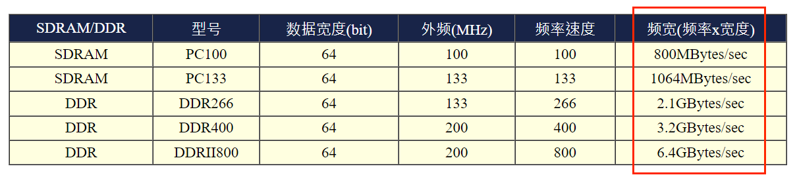

传统的系统总线宽度一般大约仅达 64 位，为了要加大这个宽度，于是就提出了**内存双通道技术**：就是在北桥芯片级里设计**两个内存控制器**，这两个内存控制器可相互独立工作，每个控制器控制一个内存通道。在这两个内存通道 CPU 可分别寻址、读取数据，从而使内存的带宽增加一倍，数据存取速度也相应增加一倍（理论上）。

### （三）显卡

显卡又称 VGA（Video Graphics Array），对于图形影像的显示扮演相当关键的角色。一般对于图形影像的显示重点在于解析度与色彩深度，因为每个图像显示的颜色会占用掉内存，因此显卡上面会有一个内存的容量，这个显卡内存容量将会影响到最终你的屏幕解析度与色彩深度。

由于 3D 游戏和 3D 动画的流行，显卡的运算能力也越来越重要，一些 3D 的运算早期是交给 CPU 去运作，CPU 并非完全针对这些 3D 运算来进行设计的，而且 CPU 平时已经非常忙碌。所以后来显卡厂商在显示卡上面嵌入一个 3D 加速的芯片，这就是所谓的 GPU（Graphic Processing Unit）称谓的由来。

> 集显、核显和独显的区别：
>
> - 集显：将显卡芯片集成（焊接）在主板北桥，与系统共享内存，无独立供电与散热。集显一般只出现在以前的老电脑，性能一般。
> - 核显：将显卡芯片与 CPU 封装在一起，与集显的区别是集成的位置不一样。比集显的性能好一点。
> - 独显：独显具备独立图像处理能力，具备独立内存，有独立供电与散热。性能比较高。

### （四）硬盘

硬盘是用于持久化存储数据的硬件设备，通过南桥接入主机。

根据硬盘的形态不同，可分为：

- 机械硬盘（HDD、Hard Disk Drive）：机械硬盘是一种传统硬盘，使用磁性盘片和磁头来存储和读取数据。它具有较高的容量和较慢的读写速度，但相对便宜。机械硬盘耐用性强，但容易受到磁盘的磨损。
- 固态硬盘（SSD、Solid State Disk）：SSD 是一种由控制单元和固态存储单元组成的硬盘，它采用固态存储技术，具有更快的读写速度和低功耗。固态硬盘的容量较小，价格较高。
- 混合硬盘（HHD、Hybrid Hard Disk）：混合硬盘是一种结合了机械硬盘和固态硬盘特点的硬盘。它通过闪存颗粒来存储常用文件，而磁盘才是最重要的存储介质。相比于机械硬盘，混合硬盘具有更快的读写速度和更低的成本。

根据与主机传输接口不同，可分为：

- IDE 接口：这种接口的最高传输速度为 Ultra 133 规格， 亦即每秒理论传输速度可达 133MBytes。
- SATA 接口：SATA-1 的每秒 150MBytes、SATA-2 每秒 300MBytes，目前 SATA 已逐步取代 IDE 接口。
- SCSI 接口：这种接口的硬盘在控制器上含有一颗处理器，除了运转速度快之外，也比较不会耗费 CPU 资源，广泛应用于小型工作站。

### （五）操作系统

操作系统（OS、Operating System）其实也是一组程序，这组程序**用于管理计算机的所有活动以及驱动系统中的所有硬件**。通俗点来说就是操作系统功能就是：让 CPU 可以开始判断逻辑与运算数值；让主内存可以开始载入/读出数据与程序；让硬盘可以开始被存取；让网卡可以开始传输数据等。总之，硬件的所有动作都必须要通过这个操作系统来达成。

> 硬件的管理是核心的主动工作之一，核心需要通过程序去调用硬件，这些程序就称为硬件驱动程序。然而计算机的相关硬件千奇百怪，对应的驱动程序也不尽相同，操作系统的开发人员是不可能去为每个硬件写一个驱动程序，因此操作系统只提供硬件驱动接口，由各大硬件厂商去实现对应的驱动程序，**有了驱动程序，操作系统才能操作硬件。**

上述的功能就是操作系统的核心（Kernel）了，主要负责与硬件打交道。但是用户不能直接操作核心，核心主要在管控硬件与提供相关的能力，这些管理的动作是非常的重要的，如果用户能够直接使用到核心的话，万一使用者不小心将核心停止或破坏，将会导致整个系统的崩溃！**因此核心所放置到内存当中的区块是受保护的，并且开机后就一直常驻在内存当中。**

既然不能直接操作核心，那么用户该怎样使用操作系统呢？为了解决这个问题，操作系统通常会提供一整套的系统调用接口给开发者来开发软件。开发者只需要遵守这些接口就很容易开发软件，系统调用接口会自动执行相应的核心函数。

整个计算机系统的软硬件关系如下：


## 二、Linux

Linux 就是一套操作系统，由 Linus Torvalds 最早提出并使用 C 语言开发，后来由社区的各位大佬逐渐完善。

> Linux 上面的软件几乎都是经过 GPL 的授权（包括 Linux），所以每个软件几乎均提供源码， 并且你可以自行修改该源码，以符合你个人的需求。
>
> 一个软件挂上 GPL（通用公共许可证、General Public License）版权宣告后，就成为自由软件！该软件有以下特色：
>
> - 取得软件与源码：你可以获取软件和源码，然后根据自己的需求来执行这个自由软件；
> - 复制：可以自由地复制该软件。
> - 修改：可以对源码进行修改。
> - 再发行：可以将修改后的源码再度自由发行，而不会与原先的撰写者冲突。
> - 回馈：你应该将你修改后的源码代码回馈社区。
>
> 特别留意的是，你所修改的任何一个自由软件都不应该也不能这样：
>
> - 修改授权：你不能将一个 GPL 授权的自由软件，在你修改后而将它取消 GPL 授权。
> - 单纯贩卖：你不能**单纯地**贩卖自由软件，但是你可以通过**捆绑售后服务**来售卖自由软件，毕竟人也是要恰饭的嘛。

### （一）发行版

虽然由 Torvalds 负责开发的 Linux 仅具有 Kernel 与 Kernel 提供的工具，不过由于社区的不断完善，很多的软件已经可以在 Linux 上面运作了。为了让用户能够接触到 Linux，于是很多的商业公司或非营利团体，就将 Linux Kernel（含 tools）与可执行的软件整合起来，加上自己具有创意的工具。 这个『**Kernel + Softwares + Tools 的可完全安装**』的东西，我们称之为 Linux distribution（以下称为 Linux 发行版）。

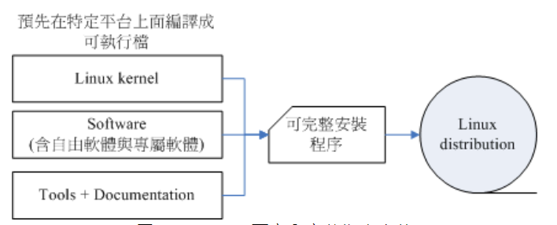

Linux 发行版包括：Red Hat、Fedora、Debian、Ubuntu、CentOS 等。

### （二）硬件设备

在 Linux 系统中，**每个硬件设备都被当成一个文件来对待**，各硬件对应的文件如下：

| 硬件               | 硬件在 Linux 中对应的文件 | 例子                                                                         |
| ------------------ | ------------------------- | ---------------------------------------------------------------------------- |
| IDE 硬盘           | /dev/hd[a-d]              | 硬盘 1 在主机中名称为 hdc，将 hdc 进行分区操作，分为：hdc1、hdc2、hdc3、hdc4 |
| SCSI/SATA/U 盘硬盘 | /dev/sd[a-p]              |                                                                              |
| 软盘               | /dev/fd[0-1]              |                                                                              |

### （三）特殊文件或目录

Linux 中有许多特殊文件或目录，含义如下：

| 文件                                               | 说明                                                                             |
| -------------------------------------------------- | -------------------------------------------------------------------------------- |
| ~/.bash_profile                                    | 用户个人的配置文件，login shell 会读取                                           |
| ~/.bashrc                                          | 用户个人的配置文件，nologin shell 会读取                                         |
| ~/.bash_history                                    | 记录着使用过的命令                                                               |
| /boot/\*                                           | 存储 Linux 核心文件                                                              |
| /dev/null                                          | 是一个特殊的文件，**所有输入到此文件的内容都会被立刻丢弃**，常常用于标准错误输出 |
| /etc/\*                                            | 系统主要的配置文件几乎都放置在这里                                               |
| /etc/at.allow                                      | 允许使用 at 命令的用户，优先级比 /etc/at.deny 高                                 |
| /etc/at.deny                                       | 不允许使用 at 命令的用户                                                         |
| /etc/cron.allow                                    | 允许使用 crontab 命令的用户，优先级比 /etc/cron.deny 高                          |
| /etc/cron.deny                                     | 不允许使用 crontab 命令的用户                                                    |
| /etc/crontab                                       | 存储着 crontab 定时任务的配置文件                                                |
| /etc/fstab                                         | Linux 启动时会依据该文件进行设备的检查和挂载操作                                 |
| /etc/group                                         | 记录所有群组信息                                                                 |
| /etc/init.d                                        | 记录各服务的启动脚本                                                             |
| /etc/passwd                                        | 记录所有用户信息                                                                 |
| /etc/profile                                       | 系统全局的配置文件，login shell 会读取                                           |
| /etc/rc.d/rc.local                                 | Linux 开机时会执行此文件，可以在此文件中写一些开机时执行的脚本                   |
| /etc/services                                      | 记录系统服务及其对应的端口号                                                     |
| /etc/shadow                                        | 记录所有用户的密码                                                               |
| /etc/shells                                        | 记录着该 Linux 支持的 shell                                                      |
| /etc/sudoers                                       | sudo 命令的相关配置                                                              |
| /etc/systemd/system/graphical.target.wants/\*      | 图形界面模式（run level 5），存储用户开机自启动服务                              |
| /etc/systemd/system/multi-user.target.wants/\*     | 纯文字模式（run level 3），存储用户开机自启动服务                                |
| /etc/yum.repos.d/\*                                | 存储 yum 的仓库配置文件                                                          |
| /media/\*                                          | 用于放置可移除的设备，包括：软盘、光盘、DVD 等暂时挂载的设备                     |
| /mnt/\*                                            | 以前的用途和 /media 相同，有了 /media 目录后就专用于暂时挂载某些额外的设备       |
| /usr/\*                                            | Unix Software Resource 缩写，用于存放软件及其配置等数据                          |
| /usr/lib/systemd/system/graphical.target.wants/\*  | 图形界面模式（run level 5），存储系统开机自启动服务                              |
| /usr/lib/systemd/system/multi-user.target.wants/\* | 纯文字模式（run level 3），存储系统开机自启动服务                                |
| /usr/local/src/\*                                  | 可以存放一些软件的安装包                                                         |
| /var/\*                                            | 记录某些软件运行时产生的数据，包括 cache、log gile 等文件                        |
| /var/cache/yum/\*                                  | 记录 YUM 的仓库缓存信息                                                          |
| /var/lib/\*                                        | 记录各服务产生的数据库                                                           |
| /var/lib/rpm/\*                                    | 记录 RPM 软件相关信息，用于进行软件管理操作                                      |
| /var/log/cron                                      | 记录着 crontab 执行的每一项工作                                                  |
| /var/run/\*                                        | 记录各服务对应进程的 PID                                                         |
| /var/spool/at/\*                                   | 记录着各用户正在生效的 at 定时任务                                               |
| /var/spool/cron/\*                                 | 记录着各用户正在生效的 crontab 定时任务                                          |
| /var/spool/mail/\*                                 | 存储各用户的邮件，是 /var/mail 的硬链接                                          |

### （四）启动流程

Linux 主机启动流程如下：

**1、加载 BIOS 的硬件资讯与进行自我测试，并依据配置取得第一个可启动的设备**

在主机通电后，会先加载 BIOS，通过 BIOS 程序去加载 CMOS 中的数据，并且藉由 CMOS 内的配置值取得主机的各项硬件配置，例如：启动设备的搜寻顺序、硬盘的大小和类型、系统时间即各设备的 I/O 地址等。

> BIOS（Basic Input Output System）是一套程序，这套程序写死在主机板上面的一个只读内存（Read Only Memory、ROM）芯片中，ROM 是一种非挥发性芯片，也就是没有通电时也能将数据记录下来。
>
> CMOS 是主板上的一个芯片，用于记录主板上重要参数，包括系统时间、CPU 电压和频率、各设备的 I/O 地址与 IRQ 等，由于这些数据的记录要花费电力，因此主机板上面才有电池。

在取得这些数据后，BIOS 还会进行启动自我测试（Power-on Self Test、POST），然后开始执行硬件检测的初始化，并配置 PnP（Plug and Play、即插即用）设备，之后再定义出可启动的设备顺序（例如：有两块硬盘，每个硬盘上第一磁区都有 MBR 区域，BIOS 需要根据配置指定一个可启动的 MBR）， 接下来就会开始进行启动设备的数据读取。

**2、读取并运行第一个启动设备内 MBR 的 boot Loader（亦即是 grub, spfdisk 等程序）**

读取并运行 MBR 中存储着的一个启动管理程序（Boot Loader），Boot Loader 用于识别操作系统的文件格式，并加载操作系统核心到主内存中运行。

> **不同的操作系统的 Boot Loader 也不同，如果向一台主机存储着两个操作系统（例如：Windows、Linux），那么 Boot Loader 该如何指定呢？**
>
> 其实每个硬盘分区（文件系统）都会保留一块启动磁区（boot sector）以便操作系统安装 boot loader，而通常操作系统都会安装一份 loader 到他根目录所在的硬盘分区的 boot sector 上，MBR、boot sector 即 boot loader 关系如下：
>
> 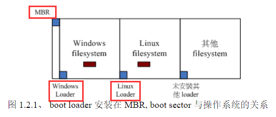
>
> 每个操作系统默认是会安装一套 boot loader 到他自己的文件系统中（即 boot sector），在安装 Linux 时，你可以选择将 boot loader 安装到 MBR 中，也可以选择不安装；在安装 Windows 时，会默认在 MBR 上安装一份 boot loader。因此 MBR 常常会被不同操作系统的 boot loader 所覆盖。
>
> Linux boot loader 的主要功能如下：
>
> - **提供菜单**：使用者可以选择不同的启动项目，这也是多重启动的重要功能！
> - **加载核心文件**：直接指向可启动的程序区段来开始操作系统。
> - **转交其他 loader**：将启动管理功能转交给其他 loader 负责。
>
> 由于具有菜单功能，因此我们可以选择不同的核心来启动。而由于具有控制权转交功能，因此我们可以载入其他 boot sector 内的 loader。由于 Windows 的 loader 不具有控制权转交的功能，因此不能使用 Windows 的 loader 来载入 Linux 的 Loader，**也就是为什么要先安装 Windows 再安装 Linux**。
>
> 菜单功能与控制权转交功能示意图如下：
>
> 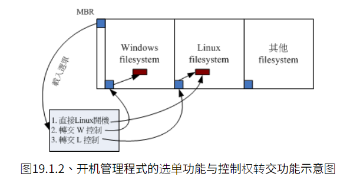
>
> 例如 MBR 使用 Linux 的 grub2 这个 boot loader，并且里面假设已经有了三个菜单项：
>
> - 菜单项一：`MBR(grub) --> kernel file --> booting`，MBR 中的 grub 直接指向 Linux kernel 文件并且直接加载后开机。
> - 菜单项二：`MBR(grub) --> boot sector(Windows loader) --> Windows kernel --> booting`，grub 载入 Windows 的 boot loader，Windows loader 接管开机流程。
> - 菜单项三：`MBR(grub) --> boot sector(grub) --> kernel file --> booting`，grub 载入 Linux 的 loader（grub），此时就会跳出另一个 grub 的菜单。

**3、依据 boot loader 的配置加载 Kernel ，Kernel 会开始检测硬件与加载驱动程序**

当我们通过 boot loader 开始读取核心文件后，Linux 就会将核心压缩到主内存中，并且利用核心的功能，开始检测与测试各个周边设备，包括：存储设备、CPU、网卡、声卡等。**此步骤 Linux 核心会以自己功能重新检测一次硬件，而不一定会使用 BIOS 检测到的硬件信息，也就是说，核心此时才开始接管 BIOS 后的工作。**

**4、在硬件驱动成功后，Kernel 会主动呼叫启动程序**

在 Linux 中，启动程序是核心唤起的第一个程序，它是所有进程的老祖宗，会去唤起所有系统所需的服务（不论是本机服务还是网络服务）。

根据 CentOS 版本不同，CentOS 7.x 之前使用的是 init 启动程序，之后使用的是 systemd 启动程序：

**（1）[init 启动程序](http://cn.linux.vbird.org/linux_basic/0510osloader.php#startup_init)**

init 中有 run level 运行级别的概念，用户可以通过对不同 run level 配置不同的开机启动服务，来实现自定义启动动作，run level 分为 7 个等级：

| 等级 | 说明                                                       |
| ---- | ---------------------------------------------------------- |
| 0    | halt，系统直接关机                                         |
| 1    | single user mode，单人维护模式。用在系统出问题时维护       |
| 2    | Multi-user、without NFS，类似于 run level 3，但无 NFS 服务 |
| 3    | Full multi-user mode，包含 NFS 网络功能的纯文字模式        |
| 4    | unused，系统保留功能                                       |
| 5    | X11，与 run level 3 类似，但加载使用 X Window，即图形界面  |
| 6    | reboot，重新启动                                           |

> 由于 run level 0、4、6 级别很特殊，因此你当然不能将默认的 run level 配置为这三个值，否则系统就会不断的自动关机或自动重启。

init 程序会读取 `/etc/inittab` 中的配置，执行以下流程：

1. 获取 run level 的级别。
2. 运行 `/etc/rc.d/rc.sysinit` 文件来准备软件运行的作业环境（如网络、时区等）。
3. 根据 run level 去对应的 `/etc/rc[0-6].d` 目录下执行服务脚本，**实现服务开机自启动**，例如 run level 为 5，则会执行下面的流程
   - 找到 `/etc/rc5.d` 目录。
   - 找到 `/etc/rc5.d/K*` 开头的文件，并执行 `etc/rc5.d/K* stop` 动作。
   - 找到 `/etc/rc5.d/S*` 开头的文件，并执行 `/etc/rc5.d/S* start` 动作。
4. 运行 `/etc/rc.d/rc.local` 文件，因此我们可以在此文件中写一些开机脚本。
5. 加载终端机（run level 3）或 X-Window 界面（run level 5），此时我们就可以进行登录了。

**（2）systemd 启动程序**

systemd 弃用了 run level 的概念，但为了相容于旧式的 system V 操作行为，所以也将 run level 与操作环境做个结合，命令对照关系如下：

| System V   | 文件（目录）       | Systemd                             | 文件（链接文件）                                                 |
| ---------- | ------------------ | ----------------------------------- | ---------------------------------------------------------------- |
| init 0     | `/etc/rc0.d/*`     | systemctl poweroff                  | `/usr/lib/systemd/system/runlevel0.target -> poweroff.target`    |
| init 1     | `/etc/rc1.d/*`     | systemctl rescue                    | `/usr/lib/systemd/system/runlevel1.target -> rescue.target`      |
| init [234] | `/etc/rc[234].d/*` | systemctl isolate multi-user.target | `/usr/lib/systemd/system/runlevel[234].target multi-user.target` |
| init 5     | `/etc/rc5.d/*`     | systemctl isolate graphical.target  | `/usr/lib/systemd/system/runlevel5.target graphical.target`      |
| init 6     | `/etc/rc6.d/*`     | systemctl reboot                    | `/usr/lib/systemd/system/runlevel6.target -> reboot.target`      |

systemd 程序会读取 `/etc/systemd/system/default.target`（链接文件，以链接到 graphical.target 文件为例）中的配置，执行流程如下：

- 执行 sysinit.target 初始化系统及 basic.target 准备操作系统环境。
- 启动 multi-user.target 下的服务：

  - 启动 `/etc/systemd/system/multi-user.target.wants/` 用户开机自启动服务。
  - 启动 `/etc/systemd/system/multi-user.target.wants/` 系统开机自启动服务。
  - 为了兼容 init 启动配置，systemd 会通过 rc-local.service 去执行 `/etc/rc.d/rc.local` 文件。
  - 启动 tty 界面与登录服务。

- 启动 graphical.target 下的服务（纯文字模式没有此步骤）：
  - 启动 `/etc/systemd/system/graphical.target.wants/` 用户开机自启动服务。
  - 启动 `/etc/systemd/system/graphical.target.wants/` 系统开机自启动服务。
  - 启动 graphical 需要的服务。

### （五）基本命令

#### 1、man

man 用于查看指定命令的说明文件，相当与查看该命令的说明书：

```shell
[root@www ~]# man [-f] 命令
```

| 选项 | 说明                             |
| ---- | -------------------------------- |
| -f   | 用于搜索指定包含参数名的说明文件 |

```shell
# 查看说明文件名中包含 date 的文件
[root@www ~]# man -f date
```

进入说明文件中后有一些快捷键：

| 按键                                      | 说明                                   |
| ----------------------------------------- | -------------------------------------- |
| Page Down、Pown Up、Home、End、上键、下键 | 用于翻页操作                           |
| /myString                                 | 用于搜索全部的、包含 myString 的字符串 |
| n，N                                      | n 用于搜索下一个；N 用于搜索上一个     |
| q                                         | 退出文件                               |

#### 2、shutdown

shutdown 用于关机操作，同时会向所有用户发送提示。

```shell
[root@www ~]# shutdown [-t 秒] [-hrck] 时间 [提示语]
```

| 选项      | 说明                                  |
| --------- | ------------------------------------- |
| 数字/时间 | 指定分钟后关机；指定时间关机          |
| -t 数字   | 指定秒数后关机                        |
| -h        | 等同于 halt，将系统的服务停掉后关机   |
| -r        | 等同于 reboot，将系统的服务停掉后重启 |
| -c        | 取消关机命令                          |
| -k        | 不是真正的关机，只是发送提示          |
| 提示语    | 向所有用户发送提示时的提示语          |

```shell
# 10 分钟后关机
[root@www ~]# shutdown 10

# 今天或明天（晚于 22:00 执行命令）22:00 关机
[root@www ~]# shutdown 22:00

# 立刻关机
[root@www ~]# shutdown now

# 发送 "我要关机了" 提示语
[root@www ~]# shutdown 10 "我要关机了"
```

> sync 是将数据同步写入硬盘中的命令，关机前建议使用 sync 命令先将数据同步到硬盘。

#### 3、\ 反斜杠

一般情况下，我们都是点击 Enter 键表示执行命令，当我们的命令太长时，就需要在命令末尾添加 `\` 反斜杠，然后点击 Enter 键表示换行。

```shell
cp /var/spool/mail/root /etc/crontab \
> /etc/fstab /root
```

#### 4、type

type 用于查看命令的相关说明。

```shell
[root@www ~]# type [-apt] 命令名称
```

| 选项     | 说明                                                                                                                                      |
| -------- | ----------------------------------------------------------------------------------------------------------------------------------------- |
| 命令名称 | 不加任何选项与参数时，type 会显示出是外部命令还是 bash 内建命令                                                                           |
| -a       | 会由 PATH 变量定义的路径中，将所有含指定名称的命令都列出来，包含 alias                                                                    |
| -p       | 如果后面接的指定名称的命令为外部命令时，才会显示完整文件名                                                                                |
| -t       | 会输出以下结果：<br/>file：表示为外部命令；<br/>alias：表示该命令为命令别名所配置的名称；<br/>builtin：表示该命令为 bash 内建的命令功能； |

#### 5、alias

alias 用于给命令起别名，使用别名可以简化部分命令操作。

```shell
# 1、查看所有别名
[root@www ~]# alias

# 定义别名：alias 别名="命令"
# 例如：常用的  ll 命令就是 `ls -l --color=auto` 命令的别名
[root@www ~]# alias ll='ls -l --color=auto'

# 删除别名
[root@www ~]# unalias ll
```

#### 6、[history](https://linux.vbird.org/linux_basic/centos7/0320bash.php#history)

Linux 会记录使用过的命令，使用 history 可以对历史命令进行操作。

> 使用过的命令记录在 `~/.bash_history` 文件中，记录的命令最大个数由 HISTSIZE 变量决定。

```shell
[root@www ~]# history [数字]
[root@www ~]# history [-c]
[root@www ~]# history [-awr] [文件]
```

| 选项 | 说明                                                                                              |
| ---- | ------------------------------------------------------------------------------------------------- |
| 数字 | 展示最近的指定个数的命令，缺省时展示目前内存中所有的 history 命令缓存                             |
| -c   | 清除所有的历史命令                                                                                |
| -a   | 将目前**内存中新增的** history 命令写入指定文件中，若没有指定文件，则默认写入 `~/.bash_history`   |
| -w   | 将目前 history 所有命令（包括新增的）写入指定文件中，若没有指定文件，则默认写入 `~/.bash_history` |
| -r   | 将 histfiles 的内容读到目前这个 shell 的 history 内存中                                           |

#### 7、locale

locale 展示当前 Linux 支持的编码格式。

```shell
[root@www ~]# locale  <== 后面不加任何选项与参数即可！
LANG=en_US                   <== 主语言的环境
LC_CTYPE="en_US"             <== 字符(文字)辨识的编码
LC_NUMERIC="en_US"           <== 数字系统的显示信息
LC_TIME="en_US"              <== 时间系统的显示数据
LC_COLLATE="en_US"           <== 字符串的比较与排序等
LC_MONETARY="en_US"          <== 币值格式的显示等
LC_MESSAGES="en_US"          <== 信息显示的内容，如菜单、错误信息等
LC_ALL=                      <== 整体语系的环境

# 展示当前Linux 支持的编码格式
[root@www ~]# locale -a
```

#### 8、ulimit

由于 Linux 是多用户、多任务操作系统，同一时刻可能有多个终端连接到 Linux，由于资源（CPU、内存、硬盘等）是有限的，为了防止资源很快被耗尽，可以通过 ulimit 命令限制用户的某些系统资源。

```shell
[root@www ~]# ulimit [-aHScfdltu] [配额]
```

| 选项 | 说明                                                                                                                                                                                                                                            |
| ---- | ----------------------------------------------------------------------------------------------------------------------------------------------------------------------------------------------------------------------------------------------- |
| -a   | 列出所有的限制额度                                                                                                                                                                                                                              |
| -H   | hard limit ，严格的配置，必定不能超过这个配置的数值                                                                                                                                                                                             |
| -S   | soft limit ，警告的配置，可以超过这个配置值，但是若超过则有警告信息。<br/>在配置上，通常 soft 会比 hard 小，举例来说，soft 可配置为 80 而 hard 配置为 100，那么你可以使用到 90 (因为没有超过 100)，但介于 80~100 之间时，系统会有警告信息通知你 |
| -c   | 限制每个核心文件的最大容量。<br/>当某些进程发生错误时，系统可能会将该进程在内存中的信息写成文件（除错用），这种文件就被称为核心文件（core file）。                                                                                              |
| -f   | 可以创建的最大文件容量（一般可能配置为 2GB），单位为 Kbytes                                                                                                                                                                                     |
| -d   | 可使用的最大内存容量                                                                                                                                                                                                                            |
| -l   | 可用于锁定（lock）的内存量                                                                                                                                                                                                                      |
| -t   | 可使用的最大 CPU 时间 (单位为秒)                                                                                                                                                                                                                |
| -u   | 单一用户可以使用的最大进程（process）数量                                                                                                                                                                                                       |

```shell
# 列出你目前身份(假设为root)的所有限制数据数值
[root@www ~]# ulimit -a
core file size          (blocks, -c) 0          <== 只要是 0 就代表没限制
data seg size           (kbytes, -d) unlimited
scheduling priority             (-e) 0
file size               (blocks, -f) unlimited  <== 可创建的单一文件的大小
pending signals                 (-i) 11774
max locked memory       (kbytes, -l) 32
max memory size         (kbytes, -m) unlimited
open files                      (-n) 1024       <== 同时可开启的文件数量
......

# 限制用户仅能创建 10MBytes 以下的容量的文件
[root@www ~]# ulimit -f 10240
```

#### 9、source

由于配置文件都是在登录时进行读取，当我们更改完配置文件后，需要重新登录才会让配置生效。为了避免麻烦，source 命令可以重新执行指定文件，实现将文件中的配置读入目前的 bash 环境中的目的。

```shell
# 假如我们更改了 ~/.bashrc 文件，让配置立即生效
[root@www ~]# source ~/.bashrc

# . 与 source 效果一致
[root@www ~]# . ~/.bashrc
```

#### 10、file

file 用于查看文件的基本信息，例如：是否属于 ASCII、data、binary（二进制）文件，且其中有没有使用动态函数库（share library）等信息。

```shell
[root@www ~]# file ~/.bashrc
/root/.bashrc: ASCII text  <== ASCII 的纯文字文件

[root@www ~]# file /usr/bin/passwd
/usr/bin/passwd: setuid ELF 32-bit LSB executable, Intel 80386, version 1 (SYSV), for GNU/Linux 2.6.9, dynamically linked (uses shared libs), for GNU/Linux 2.6.9, stripped <== 可执行文件，包括这个文件的 suid 权限、兼容于 Intel 386 等级的硬件平台、使用的是 Linux 核心 2.6.9 的动态函式库连结等等。
[root@www ~]# file /var/lib/mlocate/mlocate.db
/var/lib/mlocate/mlocate.db: data  <== data 文件
```

#### 11、runlevel

查看 run level 级别。

```shell
[root@www ~]# runlevel
N 5
# 左边代表前一个 runlevel ，右边代表目前的 runlevel。
# 由于之前并没有切换过 runlevel ，因此前一个 runlevel 不存在 (N)
```

#### 12、init

切换 run level。

```shell
[root@www ~]# init [0到6]
```

> 注意：与 run level 有关的启动其实是在 `/etc/rc.d/rc.sysinit` 运行完毕之后。也就是说，其实 run level 的不同仅是 `/etc/rc[0-6].d` 里面**启动的服务不同而已**。

## 三、硬盘管理

### （一）硬盘分区

以机械硬盘为例，机械硬盘由：**多个磁盘**、多个机械臂、多个磁盘读取头与主轴马达组成。

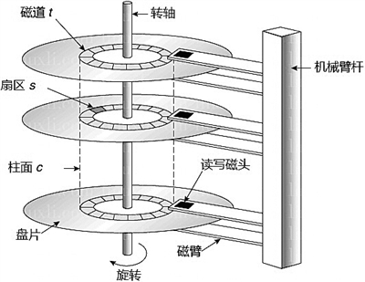

单个磁盘的单面示意图如下：

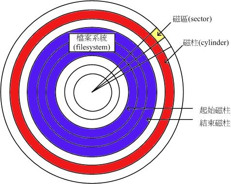

单个磁盘上有一圈一圈的形状，称为磁道，多个磁盘相同位置的磁道共同组成磁柱（cylinders）。一个磁道会被分割成多个小块，一个小块称为磁区（sectors、扇区），每个磁区位大小为 512bytes。磁盘的第一磁区记录着两个重要的信息：

- MBR（Master Boot Record、主要启动分区）：用于安装启动管理程序的地方，当系统在启动的时候会主动去读取这个区块的内容，这样系统才会知道你的程序放在哪里且该如何进行启动，占 446bytes。
- 分区表（partition table）：记录整个硬盘的分区（Window 中称为卷，例如：`C:` 系统卷/系统盘/系统分区），占 64bytes。

#### 1、分区表

以 Windows 为例，大部分情况下，我们刚买来的电脑中只有一个 C 盘，小白可能会将所有的数据都放入 C 盘，可能造成很大的问题：

- 所有文件都放在 C 盘，不好整理并且不好查找。
- 操作系统默认安装在 C 盘，当我们的操作系统出现问题时，对 C 盘的恢复操作会清除掉其中的所有数据！

分区操作可以在逻辑上对硬盘进行分割，保证每个分区的数据互不影响。在分区表的 64bytes 容量中，**总共分为四组记录区**，每组记录区记录了该分区的起始与结束的磁柱号码，分区表的逻辑结构如下：

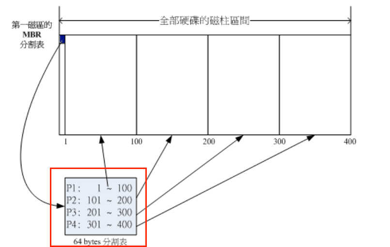

分区操作有以下优势：

- 数据的安全性：每个分区的数据是逻辑上分开的、物理上存储在不同磁柱的，因此重装 C 盘的系统并不会影响到 D 盘的数据。
- 系统的效能考量：由于分区将数据集中在某个磁柱的区段，例如上面第一分区位于磁柱 1~100 号，当读取第一分区的数据时，只会在 1~100 号的磁柱中搜索数据。由于数据集中了，将有助于数据读取的速度与效能。

从分区表的结构中，我们会发现一个问题，分区表只能记录四组数据，即只能记录四个分区的磁柱信息，是不是意味着最多只能将硬盘分为四个分区呢？答案当然不是的，因为分区有两种类型：主要分区（Primary）和扩展分区（Extend）。

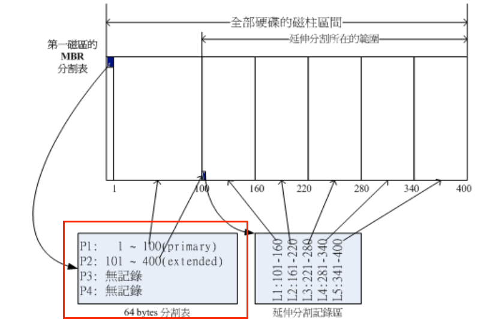

有以下特点：

- Extend 最多只能有一个，Extend + Primary 最多有四个。
- 可以对 Extend 再进行分区操作，分区表记录在 Extend 的磁区中，Extend 中分分区成为逻辑分区。
- Primary 和逻辑分区能够被格式化，Extend 无法格式化。
- 逻辑分区的最大数量根据操作系统而不同。

### （二）硬盘操作

#### 1、df

查看当前已挂载的硬盘分区空间使用空间、文件系统类型、挂载点等。

```shell
[root@www ~]# df [-ahT] [文件或目录]
```

| 选项       | 说明                                                                        |
| ---------- | --------------------------------------------------------------------------- |
| 文件或目录 | 查看指定文件所在 partition 硬盘分区的使用情况，缺省时则输出所有硬盘分区情况 |
| -a         | 列出所有的文件系统，包括系统特有的 /proc 等文件系统                         |
| -h         | 以人们较易阅读的 GBytes、MBytes、KBytes 等格式自行显示                      |
| -T         | 同时输出硬盘分区的文件系统类型                                              |

#### 2、du

查看指定文件大小。

```shell
[root@www ~]# du [-ahs] [文件或目录]
```

| 选项 | 说明                                                         |
| ---- | ------------------------------------------------------------ |
| 文件 | 查看指定文件所在硬盘分区的使用情况，缺省时表示当前所在的目录 |
| -a   | 列出所有的文件与目录容量                                     |
| -h   | 以人们较易阅读的 GBytes、MBytes、KBytes 等格式自行显示       |
| -s   | 只输出指定文件的总空间，而不将其子文件一起输出               |

#### 3、[磁盘分区挂载操作](https://linux.vbird.org/linux_basic/centos7/0230filesystem.php#disk)

- 对硬盘进行分割，以创建可用的 partition 硬盘分区。
- 对硬盘分区进行格式化，以创建系统可用的 filesystem。
  - **由于硬盘底层物理结构都是一样的，但是操作系统所配置的文件属性/权限并不相同不一样，需要将硬盘分区进行格式化，将分区格式化成操作系统可以识别的结构**。
  - 格式化并没有真正的删除掉数据，只是删除掉了查找数据的索引表，因此才会造成清空数据的情况。
- 若想要仔细一点，可以对刚创建好的 filesystem 进行检验。
- 在 Linux 系统上，需要创建挂载点并将 partition 进行挂载。

##### （1）lsblk

查看当前硬盘的分区情况。

```shell
[root@study ~]# lsblk [-ip] 设备名
```

| 选项 | 说明                                |
| ---- | ----------------------------------- |
| -i   | 各分区之间的连接以 ASCII 字元来连接 |
| -p   | 展示分区的完整文件名                |

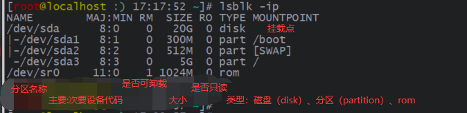

##### （2）parted

查看分区的文件系统类型。

```shell
[root@study ~]# parted 设备名称 print
```

##### （3）fdisk

对硬盘进行分区操作。

```shell
[root@www ~]# fdisk [-l] 硬盘对应的文件
```

| 选项           | 说明                                 |
| -------------- | ------------------------------------ |
| 硬盘对应的文件 | 对硬盘进行分区操作                   |
| -l             | 查看硬盘分区起始扇区、结束扇区等信息 |

以 SSD 硬盘为例：

```shell
[root@www ~]# fdisk /dev/sda
Command (m for help): m   <== 输入 m 后，就会看到底下这些命令介绍
Command action
   a   toggle a bootable flag
   b   edit bsd disklabel
   c   toggle the dos compatibility flag
   d   delete a partition            <== 删除一个partition
   l   list known partition types
   m   print this menu
   n   add a new partition           <== 新增一个partition
   o   create a new empty DOS partition table
   p   print the partition table     <== 在屏幕上显示分区表，和 `fdisk -l /dev/sda` 效果一致
   q   quit without saving changes   <== 不储存离开
   s   create a new empty Sun disklabel
   t   change a partition's system id
   u   change display/entry units
   v   verify the partition table
   w   write table to disk and exit  <== 将刚刚的动作写入分区表
   x   extra functionality (experts only)
```

点击 p 按键，查看分区表信息：

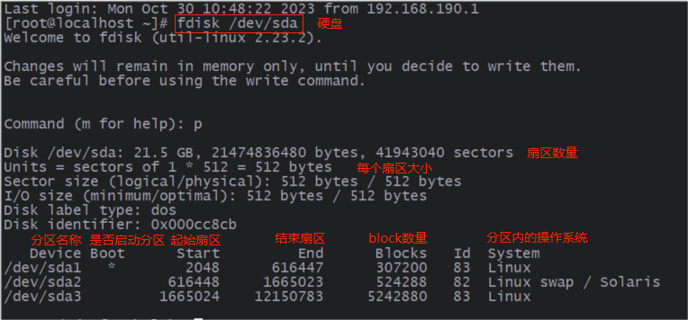

> 扇区是指硬盘的最小单位，512 bytes；block 是文件系统的最小单位，这里是 xfs 文件系统，单个 block 为 1024 bytes。

##### （4）partprobe

当分区操作执行完毕并保存后，需要 reboot 重启才会生效，也可以执行 partprobe 告知核心读取新的分区表，让分区操作生效。

```shell
[root@study ~]# partprobe -s  <== -s 输出信息
```

##### （5）mkfs

对硬盘分区进行格式化操作。

```shell
[root@www ~]# mkfs [-t] 硬盘分区对应的文件
```

| 选项               | 说明                                                                             |
| ------------------ | -------------------------------------------------------------------------------- |
| 硬盘分区对应的文件 | 对硬盘分区进行格式化操作                                                         |
| -t                 | 格式化成指定的文件系统，例如：ext2、ext3、xfs、vfat 等，默认格式成 ext2 文件系统 |

```shell
# 将 sda5 格式化为 ext3 文件系统
[root@www ~]# mkfs -t ext3 /dev/sda5

# 等同于
[root@www ~]# mkfs.ext3 /dev/sda5
```

> 实际上 mkfs 是个综合软件，mkfs 默认调用 mkfs.ext2 命令进行格式化，mkfs -t xfs 调用 mkfs.xfs 命令进行格式化，使用 mkfs 命令点击 tab 键进行命令补全，就可以看到当前 Linux 系统支持的文件系统格式化命令。

##### （6）fsck

用于检查和修复文件系统的错误。

```shell
[root@www ~]# fsck [-t 文件系统] [-ACay] 硬盘分区对应的文件
```

| 选项               | 说明                                                                                           |
| ------------------ | ---------------------------------------------------------------------------------------------- |
| 硬盘分区对应的文件 | 对硬盘分区进行校验操作                                                                         |
| -t                 | 对指定类型的文件系统进行校验操作，和 mkfs 一样，fsck 也只是个综合软件，默认调用 fsck.ext2 命令 |
| -A                 | 根据 `/etc/fstab` 的内容，将需要的分区扫描一次，通常启动过程中就会运行此命令                   |
| -C                 | 使用直方图显示校验进度                                                                         |
| -a                 | 自动修复检查到的有问题的扇区，所以你不用一直按 y。                                             |
| -y                 | 与 -a 类似，但是某些 filesystem 仅支持 -y 这个参数                                             |

```shell
# 对 sda5 分区的 ext3 文件系统进行校验
[root@www ~]# fsck -ACay -t ext3 /dev/sda5
```

当使用 fsck 检查文件系统后，若出现问题，有问题的数据会被放置在 `/lost+found` 目录下。

> 注意：运行 fsck 时，被检查的硬盘分区不可以挂载到系统上，即处于卸载状态。

##### （7）mount

mount 挂载是**利用一个目录当成进入点，将设备放置在该目录下，进入该目录就可以读写该分区的数据**。

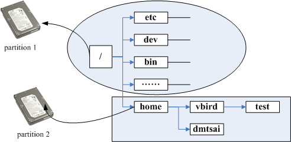

合理的挂载操作可以有效理由硬件资源，提高系统速率。挂载操作有以下建议：

- 一个文件系统不应该被重复挂载在不同的挂载点（目录）中。
- 一个目录不应该重复挂载多个文件系统，因为后面设备中的数据可能会覆盖前面的（只是会优先读后面的设备，前面的被覆盖的数据只是看不到而已，实际上还存在，卸载后面的设备就可以看到）。
- 要作为挂载点的目录，理论上应该都是空目录。

```shell
[root@www ~]# mount -a
[root@www ~]# mount [-t 文件系统] [-o 额外选项] [-n] 硬件对应的文件 挂载点
```

| 选项                  | 说明                                                                                                                                        |
| --------------------- | ------------------------------------------------------------------------------------------------------------------------------------------- |
| 空                    | 任何选项都不添加，就是直接输出挂载的信息                                                                                                    |
| -a                    | 依照配置文件 /etc/fstab 进行挂载操作                                                                                                        |
| 硬件对应的文件 挂载点 | 进行挂载操作                                                                                                                                |
| -t                    | 指定挂载设备的文件系统类型，例如：支持类型有：ext2、ext3、vfat、reiserfs、iso9660（光盘格式）、nfs、cifs、smbfs（此三种为网络文件系统类型） |
| -n                    | 在默认的情况下，系统会将实际挂载的情况实时写入 /etc/mtab 中，以便其他程序的运行，加上 -n 就不会写入                                         |
| -o                    | 后面可以接一些挂载时额外加上的参数，比方说账号、密码、读写权限等                                                                            |

```shell
# 输出当前所有挂载信息
[root@www ~]# mount

# 将 sda5 分区挂载到 `/mnt/sda5` 目录
[root@www ~]# mount /dev/sda5 /mnt/sda5
```

##### （8）umount

umount 用于卸载设备，就相当于 Windows 中**弹出 USB** 的操作。

```shell
[root@www ~]# umount [-fn] 挂载点路径或设备对应的文件
```

| 选项                       | 说明                                                                                                |
| -------------------------- | --------------------------------------------------------------------------------------------------- |
| 挂载点路径或硬件对应的文件 | 卸载指定挂载点的硬件，或指定硬件                                                                    |
| -f                         | 强制卸除！可用在类似网络文件系统 (NFS) 无法读取到的情况下                                           |
| -n                         | 在默认的情况下，系统会将实际挂载的情况实时写入 /etc/mtab 中，以利其他程序的运行，加上 -n 就不会写入 |

```shell
[root@www ~]# umount /dev/hdc6      <== 用设备文件名来卸除
[root@www ~]# umount /media/cdrom   <== 用挂载点来卸除
[root@www ~]# umount /mnt/flash     <== 因为挂载点比较好记忆！
[root@www ~]# umount /dev/fd0       <== 用设备文件名较好记！
[root@www ~]# umount /mnt/home      <== 一定要用挂载点
```

> 注意：如果正在使用已挂载的设备，umount 操作可能会失败。

### （三）[swap](https://linux.vbird.org/linux_basic/centos7/0230filesystem.php#swap)

Linux 中有种硬盘分区类型称为 swap（交换空间），swap 类似于 Windows 中的虚拟内存，通过将一部分硬盘空间虚拟成内存，当内存不够时，操作系统先把内存中暂时不用的数据存在 swap 中，腾出内存来让别的程序运行。虽然 swap 可以解决内存不足的问题，但由于其本质还是硬盘，因此运行速度慢、无法直接与 CPU 进行数据交互。

## 四、文件

### （一）文件权限

执行 `ls -l` 命令后有如下图：

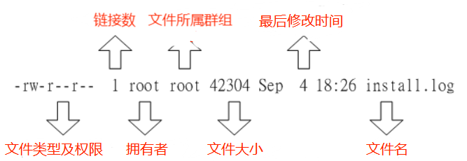

其中文件类型及权限具体如下：

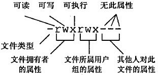

- 第一个字符表示文件类型，值有：
  - `-`：文件。
  - `d`：目录。
  - `l`：链接文件。
  - `b`：可供存储的接口设备。
  - `c`：串行端口设备，例如键盘、鼠标（一次性读取设备）。
- 接下来的字符中，三个为一组，均为【rwx】三个参数的组合：r 表示可读（read）；w 表示可写（write）；x 表示可执行（execute）；- 减号表示没有对应的权限。
  - 第一组为文件拥有者的权限。
  - 第二组为指定文件所属群组的权限。
  - 第三组为其他非本群组的权限。

### （二）权限操作

**权限是保证文件安全的一个重要条件，拥有对应权限才能执行对应的操作！**

#### 1、chgrp

修改文件所属群组。

```shell
[root@www ~]# chgrp [-R] 群组名 文件
```

| 选项        | 说明                                                       |
| ----------- | ---------------------------------------------------------- |
| 群组名 文件 | 将文件的所属群组改为指定的群组                             |
| -R          | 递归操作，将此命令的操作同时作用于此目录下的所有文件、目录 |

```shell
# 递归 test 目录及其下的所有文件，将所属群组改为 gnxt
[root@www ~]# chgrp -R gnxt test
```

#### 2、chown

修改文件拥有者。

```shell
[root@www ~]# chown [-R] 用户名[:群组名] 文件
```

| 选项                 | 说明                                                       |
| -------------------- | ---------------------------------------------------------- |
| 用户名[:群组名] 文件 | 将文件的拥有者修改为指定用户                               |
| -R                   | 递归操作，将此命令的操作同时作用于此目录下的所有文件、目录 |

```shell
# 将 test 的拥有者修改为 unxt
[root@www ~]# chown unxt test

# 将 test 的拥有者修改为 unxt，所属群组修改为 gnxt
[root@www ~]# chown unxt:gnxt test
```

#### 3、chmod

修改文件的权限，指的是同时修改【User、Group 即 Others】的权限。

```shell
[root@www ~]# chmod [-R] 权限 文件
```

| 选项      | 说明                                                       |
| --------- | ---------------------------------------------------------- |
| 权限 文件 | 修改文件的权限                                             |
| -R        | 递归操作，将此命令的操作同时作用于此目录下的所有文件、目录 |

##### （1）数字方式

修改权限是【r、w、x】分别对应着数字【4、2、1】，每组的权限是需要分别进行累加计算的。

```shell
# 例如：rwxrwx--- 分数是：
owner = rwx = 4+2+1 = 7
group = rwx = 4+2+1 = 7
others= --- = 0+0+0 = 0

# 将 test 文件权限改为 rwxrwx---
[root@www ~]# chmod 770 test
```

##### （2）符号方式

使用 u（user）、g（group）及 o（other）字符代表三种身份，使用 a 表示全部身份；使用 r（read）、w（write）及 x（execute）字符表示权限；使用 +（加入）、-（减去）及 =（赋值）设置权限。

```shell
# 将 test 文件权限改为 rwxrwx---
[root@www ~]# chmod ug=rwx,o= test

# 去除 test 所有身份的 x 权限
[root@www ~]# chmod a-x test  <== a 可以省略不写
```

### （三）查看文件

#### 1、cat

查看文件的内容。

```shell
[root@www ~]# cat [-AbEnTv] 文件

[root@www ~]# cat [>|>>] 文件  <== 通过重定向输出符，将键盘输入的数据写入文件
```

| 选项 | 说明                                                |
| ---- | --------------------------------------------------- |
| -A   | 相当于-vET 的整合选项，可列出一些特殊字符而不是空白 |
| -v   | 列出一些看不出来的特殊字符                          |
| -E   | 将换行符展示成 $                                    |
| -T   | 将【tab】按键展示成 ^I（大写的 i）                  |
| -b   | 列出行号，忽略空白行，即空白行没有行号              |
| -n   | 列出行号，空白行没有行号                            |

```shell
# 将键盘输入的数据【重定向输出】到 catfile 文件中
[root@www ~]# cat > catfile

[root@www ~]# cat >> catfile
```

#### 2、less

查看文件的内容，man 内部就是调用 less 来展示文件内容，不再赘述。

```shell
[root@www ~]# less [-N] 文件
```

| 选项 | 说明         |
| ---- | ------------ |
| 文件 | 展示文件内容 |
| -N   | 展示行号     |

#### 3、head

展示文件的前几行内容。

```shell
[root@www ~]# head [-n 数字] 文件
```

| 选项    | 说明                                 |
| ------- | ------------------------------------ |
| 文件    | 展示文件内容                         |
| -n 数字 | 展示文件指定行数的内容，默认是 10 行 |

```shell
# 展示前 20 行的内容
[root@www ~]# head -n 20 test
```

#### 4、tail

展示文件的后几行内容。

```shell
[root@www ~]# tail [-n 数字] [-f] 文件
```

| 选项    | 说明                                                                                                      |
| ------- | --------------------------------------------------------------------------------------------------------- |
| 文件    | 展示文件内容                                                                                              |
| -n 数字 | 展示文件指定行数的内容，默认是 10 行                                                                      |
| -f      | 持续监测指定文件的内容，输入 ctrl + c 退出。<br/>假如查看的文件持续更新，例如日志文件，那么 -f 就非常有用 |

```shell
# 展示后 20 行的内容
[root@www ~]# tail -n 20 test

# 展示 100 行以后的内容
[root@www ~]# tail -n +100 test
```

### （四）搜索文件

#### 1、whereis

从系统指定目录中查找文件，例如：`/usr/bin、/etc` 等目录。

```shell
[root@study ~]# whereis [-bmsu] 文件名
```

| 选项 | 说明                                    |
| ---- | --------------------------------------- |
| -l   | 列出 whereis 会去查询的几个主要目录     |
| -b   | 只找 binary 格式的文件                  |
| -m   | 只查找说明文件，也就是 man 路径下的文件 |
| -s   | 只查找 source 来源文件                  |
| -u   | 搜寻不在上述三个项目当中的其他文件      |

#### 2、find

扫描硬盘，查找文件。

```shell
[root@www ~]# find [PATH] [option] [action]
# [PATH] 表示要搜索的路径，默认值是当前路径
```

##### （1）时间选项

与时间有关的选项：共有-atime、-ctime 与 -mtime，以 -mtime 说明。

| 选项        | 说明                                                        |
| ----------- | ----------------------------------------------------------- |
| -mtime n    | n 为数字，意义为在 n 天之前的**一天之内**被更动过内容的文件 |
| -mtime +n   | 列出在 n 天之前（不含 n 天本身）被更动过内容的文件          |
| -mtime -n   | 列出在 n 天之内（含 n 天本身）被更动过内容的文件            |
| -newer 文件 | file 为一个存在的文件，列出比 file 还要新的文件             |

以 n = 4 为例，具体含义如下：

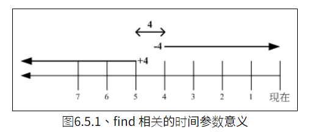

##### （2）账号与群组选项

查找属于指定账号或群组的文件。

| 选项            | 说明                                                                                               |
| --------------- | -------------------------------------------------------------------------------------------------- |
| -uid UID        | 查找属于指定 UID 对应账号的文件                                                                    |
| -gid GID        | 查找属于指定 GID 对应群组的文件                                                                    |
| -user 账号名称  | 查找属于指定账号的文件                                                                             |
| -group 群组名称 | 查找属于指定群组的文件                                                                             |
| -nouser         | 不属于任何账号的文件。<br/>例如：如果你将系统里面某个账号删除了，此账号拥有的文件就变成了 nouser。 |
| -nogroup        | 不属于任何群组的文件                                                                               |

##### （3）权限及名称选项

| 选项             | 参数                                                                                                                |
| ---------------- | ------------------------------------------------------------------------------------------------------------------- |
| -name 文件名     | 查找指定文件名的文件                                                                                                |
| -size [+\|-]SIZE | 查找比 SIZE 还要大(+)或小(-)的文件。SIZE 的单位有：c 代表 byte；k 代表 1024bytes                                    |
| -type TYPE       | 查找指定类型的文件。类型有：一般正规文件（f）、设备文件（b、c）、目录（d）、链接文件（l）、socket （s）及 FIFO（p） |
| -perm mode       | 查找权限**刚好等于**mode 的文件                                                                                     |
| -perm -mode      | 查找权限**必须包含**mode 的权限                                                                                     |
| -perm /mode      | 查找权限**包含任一**mode 的权限                                                                                     |

```shell
# 查找权限刚好等于 700，也就是 rwx------ 的文件
[root@www ~]# find / -perm 700

# 查找权限必须包含 500，也就是 r-x------ 的文件
# 可以将 - 看成任意匹配符 *，也就是 r*x******，
# 例如：rwx------、r-xrwx--- 都匹配，但是 rw------- 就不会匹配
[root@www ~]# find / -perm +500

# 查找权限包含任一 755，也就是 rwxr-xr-x 的文件
# 可以将文件权限中的 - 看成任意匹配符 *
# 例如：myfile 权限为 rwx------，就可以看成 rwx******，与 rwxr-xr-x 匹配
[root@www ~]# find / -perm /500
```

##### （4）额外选项

| 选项          | 参数                                                                                                  |
| ------------- | ----------------------------------------------------------------------------------------------------- |
| -exec command | -exec 后面可再接额外的命令来处理搜寻到的结果。<br/>注意：不支持命令别名，例如不能用 ll 代替 `ls -l`。 |
| -print        | 将结果打印到屏幕上，默认值                                                                            |

```shell
[root@study ~]# find /usr/bin /usr/sbin -perm /7000 -exec ls -l {} \;
# 其中 『{}』 表示 find 查找的结果
# 『;』表示 -exec 结束，但由于『;』是bash 下的特殊符号，需要添加『\』进行转义
```

### （五）压缩文件

#### 1、gzip

gzip 是应用最广的压缩命令，可以解开 compress、zip 及 gzip 等软件所压缩的文件，gzip 所创建的压缩文件名为 `*.gz*`。

> 注意：只能对单个文件进行压缩操作，不能压缩目录。

```shell
[root@www ~]# gzip [-cdtv] [-数字] 文件
```

| 选项  | 说明                                                                  |
| ----- | --------------------------------------------------------------------- |
| 文件  | 进行压缩操作                                                          |
| -c    | 输出压缩后的数据                                                      |
| -v    | 可以显示出原文件/压缩文件的压缩比等信息                               |
| -数字 | 压缩等级，-1 最快，但是压缩比最差、-9 最慢，但是压缩比最好，默认是 -6 |
| -d    | 进行解压缩操作                                                        |
| -t    | 检验压缩文件是否有错误                                                |

```shell
# 将 myFile 进行压缩，生成 myFile.gz 压缩文件，同时删除原文件
[root@www ~]# gzip myFile

# 以 9 的压缩等级进行压缩
[root@www ~]# gzip -9 myFile

# 将 myFile.gz 解压，同时删除原文件
[root@www ~]# gzip -d myFile.gz

# 可以通过 zcat 读取 compress/gzip 的压缩文件内容
[root@www ~]# zcat myFile.gz
```

#### 2、bzip2

bzip2 比 gzip 更优秀，提供更佳的压缩比，不过只能解压 bzip2 生成的压缩文件，bzip 所创建的压缩文件名为 `.bz2`。

> 注意：只能对单个文件进行压缩操作，不能压缩目录。

```shell
[root@www ~]# bzip2 [-cdkv] [-数字] 文件
```

| 选项  | 说明                                                                  |
| ----- | --------------------------------------------------------------------- |
| 文件  | 进行压缩操作                                                          |
| -c    | 输出压缩后的数据                                                      |
| -v    | 可以显示出原文件/压缩文件的压缩比等信息                               |
| -数字 | 压缩等级，-1 最快，但是压缩比最差、-9 最慢，但是压缩比最好，默认是 -6 |
| -d    | 进行解压缩操作                                                        |
| -k    | 直接压缩和解压缩时，会删除原文件，-k 可以保留原文件                   |

```shell
# 将 myFile 进行压缩，生成 myFile.bz2 压缩文件，同时删除原文件
[root@www ~]# bzip2 myFile

# 将 myFile.bz2 解压，同时删除原文件
[root@www ~]# bzip2 -d myFile.gz

# 可以通过 bzcat 读取 bzip2 的压缩文件内容
[root@www ~]# bzcat myFile.gz
```

#### 3、tar

gzip 和 bzip2 是用于压缩的命令，不过**它们通常只能针对一个文件来进行压缩和解压缩**，如此一来， 每次压缩与解压缩都要一大堆文件；单纯的 tar 命令只有打包功能，即**将很多文件集结成一个文件**。后面对 tar 和压缩命令进行整合，为使用者提供更加强大的压缩与打包功能。

```shell
[root@www ~]# tar [-j|-z] [cv] [-f tar文件] 原文件     <== 打包与压缩
[root@www ~]# tar [-j|-z] [tv] [-f tar文件]             <== 查看打包文件中的文件名
[root@www ~]# tar [-j|-z] [xv] [-f tar文件] [-C 目录]    <== 解压缩
```

| 选项 | 说明                                                                 |
| ---- | -------------------------------------------------------------------- |
| -v   | 输出 tar 命令处理过的文件名，建议使用 tar 时就带上这个选项           |
| -f   | tar 命令要处理的文件                                                 |
| -j   | 通过 bzip2 进行压缩/解压缩，文件名最好为：`*.tar.bz2`                |
| -z   | 通过 gzip 进行压缩/解压缩，文件名最好为：`*.tar.gz`                  |
| -c   | 将文件或目录打包                                                     |
| -t   | 输出打包后的文件中，包含的所有的文件名                               |
| -x   | 解打包或解压缩操作；<br/>注意：-c、-t、-x 不可同时出现在一串命令中。 |
| -C   | 将解打包或解压缩后的文件输出到指定路径下                             |

```shell
# 将 source 文件打包成 destination.tar
[root@www ~]# tar -cvf destination.tar source

# 将 source 文件打包并压缩成 destination.tar.gz
[root@www ~]# tar -czvf destination.tar.gz source

# 查看 destination.tar 打包文件中的所有文件名
[root@www ~]# tar -tvf destination.tar

# 将 destination.tar.gz 解压缩，并输出到 hello 目录下
[root@www ~]# tar -xzvf destination.tar.gz -C hello
```

### （六）操作文件

#### 1、cp

复制文件或目录。

```shell
[root@www ~]# cp [-adipr] 原文件 目标文件
[root@www ~]# cp [-adipr] 原文件1 [原文件2...] 目标目录名 # 将原文件复制到指定目录下
```

| 选项            | 说明                                                     |
| --------------- | -------------------------------------------------------- |
| 原文件 目标文件 | 进行复制操作                                             |
| -a              | 相当于 -pdr 的意思                                       |
| -d              | 若原文件为链接文件，则**只复制链接文件，而非真实的文件** |
| -i              | 若目标文件已存在，则先进行询问                           |
| -p              | 连同文件的属性、权限一起复制过去，而非使用默认属性       |
| -r              | 递归复制目录下面的所有文件                               |

```shell
# 复制文件，新文件名为 file1-backup
[root@www ~]# cp file1 file1-backup

# 将 file1、file2、dir1 都复制到 dir2 中
[root@www ~]# cp file1 file2 dir1 dir2`
```

#### 2、mv

移动文件或目录。

```shell
[root@www ~]# mv [-fiu] 原文件 目标文件
[root@www ~]# mv [-fiu] 原文件1 [原文件2...] 目标目录名 # 将原文件移动到指定目录下
```

| 选项            | 说明                                         |
| --------------- | -------------------------------------------- |
| 原文件 目标文件 | 进行复制操作                                 |
| -f              | 如果目标文件已经存在，不会询问而直接覆盖     |
| -i              | 若目标文件已存在，则先进行询问               |
| -u              | 若目标文件已经存在，且 source 比较新才会更新 |

```shell
# 移动文件，新文件名为 file1-backup
[root@www ~]# mv file1 file1-backup

# 将 file1、file2、dir1 都移动到 dir2 中
[root@www ~]# mv file1 file2 dir1 dir2
```

#### 3、rm

删除文件或目录。

```shell
[root@www ~]# rm [-fir] 文件或目录
```

| 选项       | 说明                     |
| ---------- | ------------------------ |
| 文件或目录 | 删除文件或目录           |
| -f         | 强制进行删除             |
| -i         | 在删除前先进行询问       |
| -r         | 递归删除目录下的所有文件 |

#### 4、touch

创建新文件。

```shell
touch 文件
```

#### 5、ln

每个文件都有一个唯一 inode，相当于文件的存储位置，Linux 通过 inode 定位每一个文件。通过 `ls -i 文件` 查看文件的 inode。

ln 指令可以为指定文件创建**链接文件**，链接文件有两种类型：

（1）硬链接

硬链接是一个指针（相当于为原文件起了一个别名），硬链接文件 inode 和原文件的 inode 相同。以 Java 为例：

```java
// 原文件
Object o1 = new Object();

// 硬链接，都是指向 new Object() 这个对象
Object o2 = o1;
```

> 注意：不可以给目录创建硬链接。

（2）软链接

软链接相当于在硬盘中文件了一个快捷方式，该快捷方式又指向了原文件的 inode，因此软链接文件 inode 和原文件 inode 不同。

```shell
[root@www ~]# ln [-s] 原文件 链接名
```

| 选项          | 说明                               |
| ------------- | ---------------------------------- |
| 原文件 链接名 | 为指定文件创建链接文件             |
| -s            | 创建软链接，缺省时时表示创建硬连接 |

#### 6、vim

vim 是文本编辑器，用于对文件内容进行编辑。vim 是 vi（Linux 自带的文本编辑器）的增强版，比 vi 的功能更加强大，例如：颜色显示、支持许多程序的语法等。

vim 有三种模式：

- 一般模式：点击 Esc 按键可以进入一般模式，然后进行光标移动、复制、粘贴、删除及搜索等功能。
- 编辑模式：一般模式下，点击 i、a、o 按键进入编辑模式。
- 指令列模式：一般模式下，点击 `:` 冒号进入指令列模式，可以进行退出、保存等操作。

**一般模式：**

| 按键                                         | 功能                                                                                                                                            |
| -------------------------------------------- | ----------------------------------------------------------------------------------------------------------------------------------------------- |
| **移动光标的方法**                           |                                                                                                                                                 |
| Page Up、Page Down、Home、End                | 向上翻页、向下翻页、移动到行头、移动到行尾                                                                                                      |
| 数字 + space 空格键                          | **行内**光标向右移动指定字符，<br/>例如：输入 20 后点击空格键，光标在行内向右移动 20 个字符                                                     |
| G                                            | 移动到文件的最后一行                                                                                                                            |
| 数字 + G                                     | 移动到指定行                                                                                                                                    |
| gg                                           | 移动到文件的第一行，相当于 1G                                                                                                                   |
| 数字 + Enter 按键                            | 从当前行开始，向下移动指定行                                                                                                                    |
| **搜索与替代**                               |                                                                                                                                                 |
| / + 搜索的字符串                             | 在文件内搜索指定的字符串                                                                                                                        |
| n 或 N                                       | n 表示查找下一个；N 表示查找上一个                                                                                                              |
| :起始行,结束行 s/搜索的字符串/替换的字符串/g | 在起始行和结束行之间查询搜索的字符串，并替换成指定的字符串，<br/>例如：在 100 到 200 行之间搜索 vbird 并替换成 VBIRD，`:100,200s/vbird/VBIRD/g` |
| :1,$s/搜索的字符串/替换的字符串/g            | 从第一行到最后一行查询搜索的字符串，并替换成指定的字符串                                                                                        |
| :1,$s/word1/word2/gc                         | 从第一行到最后一行查询搜索的字符串，并替换成指定的字符串，不过在每次替换前会给用户提示                                                          |
| **删除、复制与粘贴**                         |                                                                                                                                                 |
| delete 按键                                  | 向后删除一个字符                                                                                                                                |
| dd                                           | 删除光标所在行                                                                                                                                  |
| 数字 + dd                                    | 从光标所在行开始，向下删除指定行数                                                                                                              |
| yy                                           | 复制光标所在行                                                                                                                                  |
| 数字 + yy                                    | 从光标所在行开始，向下复制指定行数                                                                                                              |
| p 或 P                                       | p 表示将复制的数据**粘贴在光标下一行**；P 表示将复制的数据**粘贴在光标上一行**                                                                  |
| u                                            | 和 Windows 的 Ctrl + z 含义相同                                                                                                                 |
| Ctrl 按键 + r                                | 和 Windows 的 Ctrl + y 含义相同                                                                                                                 |
| .                                            | 重复上一次的**删除、粘贴**动作                                                                                                                  |

**编辑模式：**

| 按键 | 功能                                     |
| ---- | ---------------------------------------- |
| i    | 在当前光标处开始编辑                     |
| a    | 在当前光标的下一个字符处开始编辑         |
| o    | 在当前光标的下一行插入新的一行，开始编辑 |

**指令列模式：**

| 按键              | 功能                                                                                                                                                                  |
| ----------------- | --------------------------------------------------------------------------------------------------------------------------------------------------------------------- |
| :q                | 退出                                                                                                                                                                  |
| :q!               | 当编辑过文件，又不想进行保存，使用该命令强制退出且不保存                                                                                                              |
| :w                | 保存文件，等同于 Windows 的 Ctrl + s                                                                                                                                  |
| :wq               | 保存并退出                                                                                                                                                            |
| :w 目标文件       | **将此文件中的内容存储成另一个新文件**。<br/>注意：<br/>如果目标文件存在，则需要使用 `:w! 目标文件` 进行覆盖；<br/>此操作并不会保存当前文件，需要再次 `:w` 进行保存。 |
| :n1,n2 w 目标文件 | 将 n1 到 n2 的内容存储成另一个新文件                                                                                                                                  |
| :r 源文件         | 读取源文件中的内容，全部添加到光标所在行后面                                                                                                                          |
| :! Linux 命令     | 暂时离开 vim 编辑页面，执行 Linux 命令                                                                                                                                |
| :set nu           | 显示行号                                                                                                                                                              |
| **查看历史指令**  |                                                                                                                                                                       |
| q:                | 查看之前使用过的指令列                                                                                                                                                |
| q/                | 查询之前使用过的指令列                                                                                                                                                |

##### （1）暂存文件

当 vim 编辑操作过程中发生意外（例如宕机）导致文件还未保存就退出，此时会生成一个 swap 二进制暂存文件：

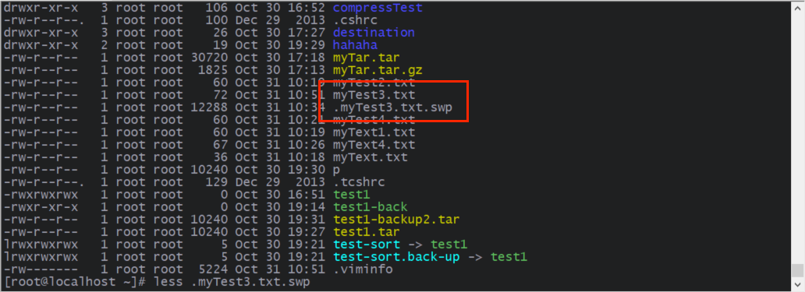

再次使用 vim 编辑时就会进入如下界面：

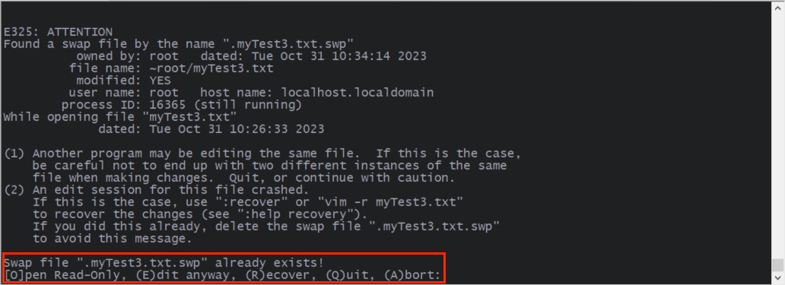

- [O]pen Read-Only：以只读的模式打开文件，虽然你也可以进行编辑操作，并且使用 `:wq!` 强制保存退出，但是最好不要！
- (E)dit anyway：以正常的方式打开你要编辑的那个文件， 并不会载入暂存文件的内容。
- (R)ecover：加载暂存文件中的内容，用于恢复之前未存储的工作。不过**当恢复完成后，需要手动删除 swap 暂存文件**！
- (D)elete it：删除 swap 暂存文件，然后再进行 vim 操作。
- (Q)uit：退出。
- (A)bort：退出。

##### （2）vim [额外功能](https://linux.vbird.org/linux_basic/centos7/0310vi.php#vim)

除了上面的功能外，vim 还提供多文件编辑、多窗口等功能。

## 五、目录

### （一）操作目录

#### 1、mkdir

mkdir 用于创建目录。

```shell
[root@www ~]# mkdir [-pm] 目录名
```

| 选项   | 说明                     |
| ------ | ------------------------ |
| 目录名 | 创建目录                 |
| -p     | 自动创建路径上没有的目录 |
| -m     | 配置目录的权限           |

```shell
# 级联创建 dir1、dir2、dir3，文件的权限的 711
[root@www ~]# mkdir -p -m 711 dir1/dir2/dir3`
```

#### 2、rmdir

rmdir 用于删除**空目录**。

```shell
[root@www ~]# rmdir [-p] 目录名
```

| 选项   | 说明               |
| ------ | ------------------ |
| 目录名 | 删除的空目录       |
| -p     | 自动级联删除空目录 |

```shell
# 级联删除 dir1、dir2、dir3
[root@www ~]# rmdir -p dir1/dir2/dir3
```

### （二）查看目录

#### 1、cd

cd 用于进入指定目录中，其中有一些特殊的路径：

```text
.         代表此层目录
..        代表上一层目录
-         代表前一个工作目录
~         代表『目前使用者身份』所在的家目录
```

#### 2、pwd

pwd 用于输出当前所在的路径。

```shell
[root@www ~]# pwd [-P]
```

| 选项 | 说明                                                         |
| ---- | ------------------------------------------------------------ |
| -P   | 如果当所在目录为软链接，使用 -P 可以获取它的真实目录所在路径 |

#### 3、ls

ls 用于展示指定目录下的所有文件。

```shell
[root@www ~]# ls [-afhlrRSt] [--full-time] 目录名
```

| 选项        | 说明                                                             |
| ----------- | ---------------------------------------------------------------- |
| 目录名      | 展示指定目录下的所有文件                                         |
| -a          | 展示全部的文件，连同隐藏文件（开头为 . 的文件）一起列出来        |
| -f          | 直接列出结果，而不进行排序 （**ls 默认会以文件名排序**）         |
| -h          | 将文件大小以人们较易阅读的 GBytes、MBytes、KBytes 等格式自行显示 |
| -l          | 以长数据串列出，包含文件的属性与权限等等数据                     |
| -r          | 将排序结果反向输出，例如：原本文件名由小到大，反向则为由大到小   |
| -R          | 递归输出下面所有的文件                                           |
| -S          | 以文件容量大小排序，而不是用文件名排序                           |
| -t          | 依时间排序，而不是用文件名                                       |
| --full-time | 以完整时间模式（包含年、月、日、时、分）输出                     |

## 六、Shell

在第一章节的第（五）小结中我们就说过，Linux 向内提供 Kernel 内核与硬件交互，向外提供调用接口与用户交互，这些调用接口——编程用的接口，一般以 C 函数的形式暴露给使用者，通过这些接口，用户可以自己实现某些功能。

例如：我想要对某个文件进行编辑，我是不是还得学习 Linux 提供的接口？还要进行编码？还要编译？还要执行？这一整套流程下来得花多少时间，而我仅仅只是实现文件编辑功能。但是并不是人人都是高手，我们想要的就是**有一个友好的交互界面，它能让我们仅仅就是动一动手指，点几下鼠标键盘就获取想要功能，而不用在意底层究竟调用了哪些接口、执行了哪些程序**。

**这个让我们与操作系统可以进行友好交互的界面就称为 Shell**，例如：Windows 系统的图形化界面，这就是一种 Shell，仅仅点击一下鼠标就可以打开记事本，对文件进行编辑；Linux 系统的命令行界面，这也是一种 Shell，通过输入 `vim myFile.txt` 便可以对文件进行编辑。

由于开发者、厂商、技术的不同，也诞生了许多 shell：

| shell         | 说明                                                |
| ------------- | --------------------------------------------------- |
| /bin/sh       | 已经被 /bin/bash 所取代                             |
| **/bin/bash** | Linux 默认的 shell                                  |
| /bin/ksh      | Kornshell 由 AT&T Bell lab. 发展出来的，兼容于 bash |
| /bin/zsh      | (基于 ksh 发展出来的，功能更强大的 shell            |
| /bin/csh      | 已经被 /bin/tcsh 所取代                             |
| /bin/tcsh     | 整合 C Shell ，提供更多的功能                       |

> 在 `/etc/shells` 可以查看当前 Linux 中支持的 shell，系统某些服务在运行过程中，也会检查该文件。

### （一）变量

#### 1、声明变量

**bash 中没有数据类型**，bash 中的变量可以保存一个数字、一个字符、一个字符串等等。**同时无需提前声明变量，给变量赋值会直接创建变量**。

```shell
# 声明一个变量 myVar，值为 helloWorld
[root@www ~]# myVar=helloWorld
```

#### 2、echo

通过 `echo $变量名` 或 `echo ${变量名}` 的方式访问变量，两者效果相同，不过加花括号的方式更加容易识别。

```shell
[root@www ~]# echo $myVar

[root@www ~]# echo ${myVar}
```

#### 3、readonly

使用 readonly 命令将变量定义为只读变量，**只读变量的值不能被改变**。

```shell
[root@www ~]# readonly myVar
```

#### 4、unset

使用 unset 命令可以删除变量，变量被删除后不能再次使用。unset 命令不能删除只读变量。

```shell
[root@www ~]# unset myVar
```

#### 5、env

env 命令可以**输出环境变量**。

```shell
# 列出部分环境变量
[root@www ~]# env
HOSTNAME=www.vbird.tsai    <== 这部主机的主机名
TERM=xterm                 <== 这个终端机使用的环境是什么类型
SHELL=/bin/bash            <== 目前这个环境下，使用的 Shell 是哪一个程序
HISTSIZE=1000              <== history 默认可记录 1000 少个历史命令
USER=root                  <== 使用者的名称
PATH=/usr/local/sbin:/usr/local/bin:/usr/sbin:/usr/bin:/root/bin                <== 是可执行文件命令搜寻路径
PWD=/root                  <== 目前用户所在的工作目录 (利用 pwd 取出！)
LANG=en_US                 <== 这个与语系有关，底下会再介绍
HOME=/root                 <== 这个用户的家目录
```

#### 6、set

输出**环境变量**及**当前连接中的自定义变量**。

```shell
# 列出部分结果
[root@www ~]# set
BASH=/bin/bash           <== bash 的主程序放置路径
BASH_VERSINFO=([0]="3" [1]="2" [2]="25" [3]="1" [4]="release"
[5]="i686-redhat-linux-gnu")      <== bash 的版本啊！
BASH_VERSION='3.2.25(1)-release'  <== 也是 bash 的版本啊！
COLORS=/etc/DIR_COLORS.xterm      <== 使用的颜色纪录文件
COLUMNS=115              <== 在目前的终端机环境下，使用的字段有几个字符长度
HISTFILE=/root/.bash_history      <== 历史命令记录的放置文件，是隐藏文件
HISTFILESIZE=1000        <== 存起来(与上个变量有关)的文件之命令的最大纪录笔数。
HISTSIZE=1000            <== 目前环境下，可记录的历史命令最大笔数。
HOSTTYPE=i686            <== 主机安装的软件主要类型。我们用的是 i686 兼容机器软件
IFS=$' \t\n'             <== 默认的分隔符
LINES=35                 <== 目前的终端机下的最大行数
MACHTYPE=i686-redhat-linux-gnu    <== 安装的机器类型
MAILCHECK=60             <== 与邮件有关。每 60 秒去扫瞄一次信箱有无新信！
OLDPWD=/home             <== 上个工作目录。我们可以用 cd - 来取用这个变量。
OSTYPE=linux-gnu         <== 操作系统的类型！
PPID=20025               <== 父进程的 PID (会在后续章节才介绍)
PS1='[\u@\h \W]\$ '
```

[PS1](https://zhuanlan.zhihu.com/p/340003720) 变量用于设置命令提示符的格式，效果如下：

```shell
NORMAL='\[\e[0m\]'
RED='\[\e[31;40m\]'
GREEN='\[\e[32;40m\]'
YELLOW='\[\e[33;40m\]'
if [ $UID -eq 0 ]; then
    UC="${RED}"
else
    UC="${GREEN}"
fi
IP="ifconfig ens32| sed -nr 's/.*inet (addr:)?(([0-9]*\.){3}[0-9]*).*/\2/p'"
SMILEY="${GREEN}:)${NORMAL}"
FROWNY="${RED}:(${NORMAL}"
SELECT="if [ \$? = 0 ]; then echo \"${SMILEY}\"; else echo \"${FROWNY}\"; fi"
export PS1="\[\e[37;40m\][${UC}\u${YELLOW}@\h \`${SELECT}\` \[\e[37;40m\]\t \[\e[36;40m\]\w\[\e[0m\]]\\$ "
```

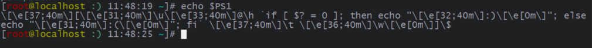

#### 7、export

自定义变量转变成环境变量：

- 自定义变量（局部变量）：仅在某个脚本内部有效的变量，它们不能被其他的程序和脚本访问。
- 环境变量（全局变量）： 环境变量是对当前 shell 会话内所有的程序或脚本都可见的变量。

**两者区别在于能否会被子进程所引用**：

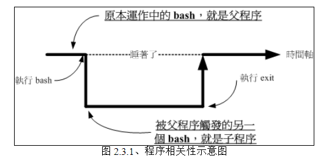

当我们在一个 bash 下运行另一个 bash，操作的环境接口会跑到第二个 bash 中（即子进程），那原本的 bash 就会暂停（整个命令运行的环境是实线的部分），若要回到原本的 bash 去， 就只有将第二个 bash 结束掉才行。其中，**子进程仅会继承父进程的环境变量， 子进程不会继承父进程的自定义变量**。也就是说子进程不能使用父进程的自定义变量，只有转变成环境变量，子进程才能继续使用。

```shell
# 只有 export 命令时，展示所有的环境变量，和 env 类似
[root@www ~]# export

# 将自定义变量转变成环境变量
[root@www ~]# export 变量名称
```

#### 8、read

读取键盘输入为变量赋值。

```shell
[root@www ~]# read [-t 数字] [-p "提示语"] 变量名
```

| 选项    | 说明                                                              |
| ------- | ----------------------------------------------------------------- |
| 变量名  | 指定变量名                                                        |
| -p      | 后面可以接提示语                                                  |
| -t 数字 | 若没有指定，会一直等待键盘输入操作，-t 用于指定 read 指令等待几秒 |

```shell
[root@www ~]# read atest
This is a test        <== 此时光标会等待你输入
[root@www ~]# echo $atest
This is a test

[root@www ~]# read -p "Please keyin your name: " -t 30 named
Please keyin your name: VBird Tsai   <== 注意看，会有提示语
[root@www ~]# echo $named
VBird Tsai
```

#### 9、declare

默认情况下，bash 变量有以下特点：

- 变量类型默认是字符串类型，所以若不指定变量类型，则 `value=1+2` 表示 value 是字符串 `"1+2"` 而不是数值 3。
- bash 环境的数值运算，默认最多仅能达到整数形态，所以 1 / 3 结果是 0。

declare 用于定义变量的类型。

> 注意：可以先给变量赋值，再使用 declare 定义变量类型，但是推荐声明变量类型后再赋值。

```shell
[root@www ~]# declare [-aixr] 变量名
```

| 选项 | 说明                                                 |
| ---- | ---------------------------------------------------- |
| -a   | 将变量定义为数组类型                                 |
| -i   | 定义为数字类型                                       |
| -x   | 将变量定义为环境变量，和 export 命令功能一样         |
| -r   | 将变量定义为 readonly 类型，和 readonly 命令功能一样 |

```shell
# 没有带任何选项及参数的 declare 命令的作用和 set 一样，获取环境变量及自定义变量
[root@www ~]# declare

[root@www ~]# declare -i var
[root@www ~]# var[1]="small min"
[root@www ~]# var[2]="big min"
[root@www ~]# var[3]="nice min"
[root@www ~]# echo "${var}"
small min
[root@www ~]# echo "${var[1]}, ${var[2]}, ${var[3]}"
small min, big min, nice min
```

### （二）环境变量

#### 1、PATH 环境变量

运行一个命令时，例如 ls，系统会依照 PATH 的配置去每个 PATH 定义的目录下面搜索名为 ls 的可执行文件。有以下特点：

- 先搜寻到的同名命令先被运行。
- 不同身份使用者默认的 PATH 不同，默认能够随意运行的命令也不同。
- PATH 是可以修改的。

```shell
[root@www ~]# echo $PATH
/usr/kerberos/sbin:/usr/kerberos/bin:/usr/local/sbin:/usr/local/bin:/sbin:/bin:/usr/sbin:/usr/bin:/root/bin

# 切换用户，查看 PATH 不同
[root@www ~]# su - vbird
[vbird@www ~]# echo $PATH
/usr/kerberos/bin:/usr/local/bin:/bin:/usr/bin:/home/vbird/bin
```

#### 2、bash 的环境配置文件

通过查看 `/etc/shells`，发现有个 nologin 的 shell，它与 login shell 的**区别在于是否登录**（login）。

- login shell：取得 bash 时需要完整的登录流程的，就称为 login shell，例如 bash。
- nologin shell：取得 bash 时不需要重复登录流程的，称为 nologin shell。例如：在原本的 bash 环境下再次下达 bash 这个命令，没有输入账号密码，那第二个 bash (子进程) 也是 non-login shell 。

shell 在启动时会读取一些配置文件，获取一堆有用的环境变量，而这些配置文件有可以分为：**系统整体的配置文件、用户个人偏好配置文件**。login shell 和 nologin shell 读取的配置文件也不一致。

（1）`/etc/profile` login shell 才会读

`/etc/profile` 是系统整体的配置文件，登录时 bash 会读取此配置文件，会初始化一些环境变量：

- PATH：PATH 环境变量。
- MAIL：依据账号配置好使用者的 mailbox 到 `/var/spool/mail/账号名`。
- USER：根据用户的账号配置此一变量内容。
- HOSTNAME：依据主机的 hostname 命令决定此一变量内容。
- HISTSIZE：history 记录的历史命令个数。

同时会去读取 `/etc/profile.d/*.sh` 的所有配置文件。

（2）`~/.bash_profile` login shell 才会读

读取完 `/etc/profile` 整体配置文件后，接下来会读取**登录用户的个人配置文件**，主要有三种：`~/.bash_profile、~/.bash_login 及 ~/.profile`。bash 会按照**顺序查找第一个找到的配置文件进行读取**。这里以 `~/.bash_profile` 为例，找到这个配置文件后就不会再去读取后两个文件了，`~/.bash_profile` 这个文件又会读取 `~/.bashrc` 的内容，因此**可以将用户个人的偏好配置写入 `~/.bashrc` 文件中**。

整个配置读取流程如下：


> 实线的的方向是主线流程，虚线的方向则是被调用的配置文件。

（3）`~/.bashrc` nologin shell 才会读

非登录时获取的 nologin shell 会去读取 `~/.bashrc`，`~/.bashrc` 代码中又会去调用读取 `/etc/bashrc` 文件，`/etc/bashrc` 做了以下操作：

> `/etc/bashrc` 是 CentOS 特有的（其实是 Red Hat 系统特有的），其他不同的发行版可能名称不同而已。

- 依据不同的 UID 规范出 umask 的值；
- 依据不同的 UID 规范出提示字符 (就是 PS1 变量)；
- 调用读取 /etc/profile.d/\*.sh 的配置。

### （三）通配符和特殊符号

Linux 提供通配符，用于在搜索中进行匹配：

| 符号  | 说明                                                                                                                                    |
| ----- | --------------------------------------------------------------------------------------------------------------------------------------- |
| \*    | 代表『 0 个到无穷多个』任意字符                                                                                                         |
| ?     | 代表『一定有一个』任意字符                                                                                                              |
| [ ]   | 同样代表『一定有一个在括号内』的字符(非任意字符)。例如 [abcd] 代表『一定有一个字符， 可能是 a, b, c, d 这四个任何一个』                 |
| [ - ] | 若有减号在中括号内时，代表『在编码顺序内的所有字符』。例如 [0-9] 代表 0 到 9 之间的所有数字，因为数字的语系编码是连续的！               |
| [^ ]  | 若中括号内的第一个字符为指数符号 (^) ，那表示『反向选择』，例如 `[^abc]` 代表 一定有一个字符，只要是非 a, b, c 的其他字符就接受的意思。 |

Linux 提供的特殊符号，具有特殊的作用，变量名称应该避免使用特殊符号：

| 符号  | 说明                                                                 |
| ----- | -------------------------------------------------------------------- |
| #     | 批注符号：这个最常被使用在 script 当中，视为说明。在后的数据均不运行 |
| \     | 跳脱符号：将『特殊字符或通配符』还原成一般字符                       |
| \|    | 管线 (pipe)：分隔两个管线命令的界定                                  |
| ;     | 连续命令下达分隔符：连续性命令的界定 (注意！与管线命令并不相同)      |
| ~     | 用户的家目录                                                         |
| $     | 取用变量前导符：亦即是变量之前需要加的变量取代值                     |
| &     | 工作控制 (job control)：将命令变成后台工作                           |
| !     | 逻辑运算意义上的『非』 not 的意思！                                  |
| /     | 目录符号：路径分隔的符号                                             |
| >, >> | 数据流重导向：输出导向，分别是『取代』与『累加』                     |
| <, << | 数据流重导向：输入导向                                               |
| ' '   | 单引号，不具有变量置换的功能                                         |
| " "   | 具有变量置换的功能！                                                 |
| `     | 两个『``』中间为可以先运行的命令，亦可使用 $( )                      |
| ( )   | 在中间为子 shell 的起始与结束                                        |
| { }   | 在中间为命令区块的组合！                                             |

#### 1、数据流重定向

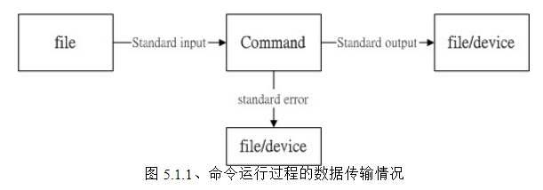

运行命令时通常会输入一些参数，这些参数称为**标准输入（Standard input）**，命令执行完成后会输出结果，称为**标准输出（Standard output）**，当命令运行出错时的输出结果称为**标准错误输出（Standard error）**。大部分情况下，标准输入都是直接从控制台输入，标准输出及标准错误输出都是输出到控制台。而有时候我们不想从控制台输入输出（例如：有些重要的输出我想保存在文件中），因此就需要数据流重定向。

**标准重定向有如下命令**：

| 符号      | 内容                                                                                                                        |
| --------- | --------------------------------------------------------------------------------------------------------------------------- |
| <         | 将原本需要由键盘输入的数据，改由文件内容来取代                                                                              |
| <<        | 自定义键盘输入结束符。例如：在原本键盘输入时，需要通过 Ctrl + d 结束输入（相当于 exit 正常退出），<< 可以自定义输入结束符号 |
| > 或 1>   | 以**覆盖**的方式将**正确的返回**输出到指定文件或设备上                                                                      |
| >> 或 1>> | 以**追加**的方式将**正确的返回**输出到指定文件或设备上                                                                      |
| 2>        | 以**覆盖**的方式将**错误的返回**输出到指定文件或设备上                                                                      |
| 2>>       | 以**覆盖**的方式将**错误的返回**输出到指定文件或设备上                                                                      |

```shell
# 通过 `cat > 文件` 的方式，将键盘输入的数据【重定向输出】到 catfile 文件中
[root@www ~]# cat > catfile
testing
cat file test
<== 这里按下 [ctrl]+d 来离开

# 通过【<】的方式，将【.bashrc】文件的内容【重定向输入】到 catfile 文件中
[root@www ~]# cat > catfile < ~/.bashrc

# 通过【<<】自定义键盘输入结束符为【eof】，当由键盘输入 eof 时，该次输入就结束
[root@www ~]# cat > catfile << "eof"
> This is a test.
> OK now stop
> eof  <== 输入这关键词，立刻就结束而不需要输入 [ctrl]+d

# 将【标准输出】和【标准错误输出】同时写入 list 文件
[root@www ~]# find /home - name .bashrc > list 2>&1
# 可以这样写
[root@www ~]# find /home -name .bashrc &> list
```

#### 2、逻辑运算符 && 与 ||

当我们想一次运行多个命令，例如：在关机的时候我希望可以先运行两次 sync 同步化写入硬盘后才 shutdown 计算机，可以在命令之间添加 `;` 分号间隔开。

```shell
[root@www ~]# sync; sync; shutdown -h now
```

但是有时候命令之间含有前后联系，例如：前一个命令执行成功后才执行下一个命令；或者前一个命令执行失败后才执行下一个命令，可以通过逻辑运算符 && 与 || 实现。

```shell
# cmd1 执行成功才会执行 cmd2
cmd1 && cmd2

# cmd2 执行失败才会执行 cmd2
cmd1 || cmd2
```

> 内部是通过回传值实现的，回传值是指：若前一个命令运行的结果为正确，在 Linux 底下会回传一个 `$? = 0` 的值，若执行失败，则 `$? = 0`。

#### 3、[管线命令](https://linux.vbird.org/linux_basic/centos7/0320bash.php#pipe)

上面的输出命令是将结果输出到指定**文件或设备**上，Linux 又提供管线命令，如下：

```shell
[root@www ~]# ls -al /etc | less
```

`|` 是界定符号，它能将上一个命令的标准输出作为下一个命令的标准输入，我们将**能够读取标准输入的命令称为管线命令**。

> 注意：
>
> - 管线命令只会处理标准输出（Standard output），对于标准错误输出（Standard error）则会忽略。
> - 管线命令必须能够接受输入参数，例如：ls、cp、mv 等不接收输入参数。

有如下常见的管线命令：

##### （1）grep

grep 是分析每行数据， 若当中包含我们所查找的字符串，就**将该行拿出来**。

```shell
[root@www ~]# grep [-acinv] "查找的字符串" [文件名]
```

| 选项 | 说明                                     |
| ---- | ---------------------------------------- |
| -a   | 将 binary 文件以 text 文件的方式搜寻数据 |
| -c   | 计算【查找的字符串】的个数               |
| -i   | 忽略大小写                               |
| -n   | 额外输出行号                             |
| -v   | 反向选择，即不包含【查找的字符串】的行   |

```shell
# 查找文件名为 myFile 的文件
[root@www ~]# ll | grep "myFile"
```

### （四）数据类型

#### 1、字符串

##### （1）单引号和双引号

在 bash 中，变量默认是字符串，字符串可以使用单引号表示，也可以用双引号表示，也可以不用引号（默认是双引号）。

- 单引号：单引号中不能识别变量、转义字符等，输入值是什么就是什么。
- 双引号：双引号中能识别变量、转义字符等，获取对应的值后返回。

##### （2）[变量内容的删除与替代](https://linux.vbird.org/linux_basic/centos7/0320bash.php#variable_other)

#### TODO：2、数组

## 七、账号和群组

### （一）基本概念

#### 1、UID 与 GID

每个登录的使用者至少都会取得两个 ID ：**一个是使用者 ID (User ID，简称 UID)、一个是群组 ID (Group ID，简称 GID)**。

> 建议设置好 UID 或 GID 后就不要再改动了，否则会带来不可预知的问题。

登录时账号的验证流程如下：

1. 先找寻 `/etc/passwd` 里面是否有你输入的帐号？如果没有则跳出；如果有的话则将该帐号对应的 UID 与 GID（在 `/etc/group` 中）读出来，并且该帐号的家目录与 shell 配置也一并读出。
2. 然后核对密码表，这时 Linux 会进入 `/etc/shadow` 里面找出对应的帐号与 UID，然后核对一下你刚刚输入的密码与里头的密码是否相符。
3. 核对成功则进入 Shell，否则跳出。

每一个文件也会有所谓的 UID 与拥有 GID，系统会依据 `/etc/passwd` 与 `/etc/group` 的内容，找到 UID / GID 对应的帐号与群组名称再显示出来，因此我们查看文件信息时显示的是账号名称与群组名称。

#### 2、相关文件

与账户有关的文件有三个：

##### （1）`/etc/passwd`

存储着账号信息，每一行代表一个账号，其中有很多默认的系统账号：

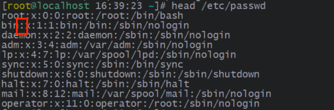

每一行中用 `:` 冒号进行分隔，总共有七项信息：

① **账号名称**

② **密码**：早期 Unix 系统的密码置于此为止，但由于该文件是所有程序都能够读取，为了防止密码泄露，就将此项的密码信息放到 `/etc/shadow` 中，现在使用 x 替代。

③ **UID**：每个账号都有**唯一的 UID**，规则如下：

| 范围         | 说明                                                                                                                                                                                                                                                                                                              |
| ------------ | ----------------------------------------------------------------------------------------------------------------------------------------------------------------------------------------------------------------------------------------------------------------------------------------------------------------- |
| 0            | 表示 root 系统管理员的账号                                                                                                                                                                                                                                                                                        |
| 1 ~ 999      | 由于系统上面启动的网路服务或背景服务希望使用较小的权限去运作，因此不希望使用 root 的身份去执行这些服务，所以我们就得要提供这些运作中程式的拥有者帐号才行，这些系统帐号通常是不可登录的。又可细分为以下两种：<br/>1 ~ 200：由 Linux distributions 自行建立的系统账号；<br/>201 ~ 999：由使用者自行定义的系统账号。 |
| 1000 ~ 60000 | 使用者定义的一般账号。                                                                                                                                                                                                                                                                                            |

④ **GID**

⑤ **账号描述**：可以用于描述账号的作用。

⑥ **家目录**：账号家目录的绝对路径。

⑦ **Shell**：指定 Shell 对应的文件。

##### （2）`/etc/shadow`

存储着账户密码信息。

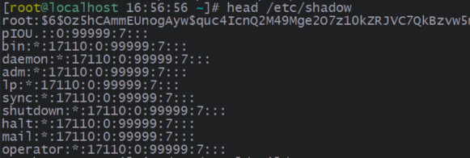

① **账号名称**

② **密码**：存储着通过 SHA 加密后的密码。可以通过在密码最前面加 `*` 或 `!` 等字符，使密码暂时失效，去除这些字符后密码又生效。

③ **最近一次更改密码的日期**：**记录从 1970 年 1 月 1 日到最近一次更改日期的天数**。

④ **多少天内不可修改密码**：从最近一次更改密码的日期开始算起，需要经过几天后才可以更改密码，0 就表示随时可以更改。

⑤ **多少天内必须修改密码**：从最近一次更改密码的日期开始算起，需要再多少天内再次变更密码才行，**否则此密码会过期，密码在过期后，当账号再登录系统时，系统会强制要求你必须重新设置密码才能登录继续使用**。99999（计算为 273 年）就相当于没有这个限制。

⑥ **密码过期前的警告天数**：在密码过期前指定天数，会警告账户密码还有几天过期。

⑦ **密码过多少天失效**：在密码过期后指定天数，密码会失效，该账号再也无法通过此密码登录。通知 root 账户帮你重新设置密码！

⑧ **账号失效日期**：此账号在规定日期后，将无法再使用，使用 1970 年 1 月 1 日以来的总日数计算。**通常应用在收费服务中**，即规定一个日期让改账号无法再使用。

⑨ **保留字段**

##### （3）`/etc/group`

存储着群组的信息。

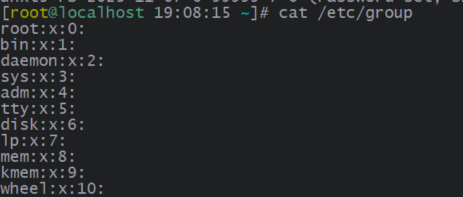

① **群组名称**

② **群组密码**：通常不需要设置，这个通常是给**群组管理员**使用的，目前很少有这个机会设置群组管理员。同样的，密码已经移动到 `/etc/gshadow` 去，因此这个栏位只会存在一个『x』而已；

③ **GID**

④ **群组支持的账号名称**

Linux 中群组分为两种：**初始群组、次要群组**。

- 初始群组：一个账号只能有一个初始群组，在 `/etc/passwd` 中的 GID 就表示该账号的初始群组 GID。
- 次要群组：一个账号可以有多个次要群组，**对于这些次要群组来说，该账号就称为支持的账号**。例如：myaccount 账号有 group1、group2 两个次要群组，对于 group1、group2 来说，myaccount 就是他们的支持的账号，在 `/etc/group` 文件中 group1、group2 的**群组支持的账号名称**项中就记录着 myaccount。

> **Linux 中一个群组中可以有多个用户，一个用户可以属于多个群组。**

##### （4）groups

展示指定账号的所属群组，也就是初始群组加上次要群组。

```shell
[root@www ~]# groups [账号名称]
```

##### （5）newgrp

有效群组的切换。

```shell
[root@www ~]# groups unxt5
unxt5 unxt1 unxt2 unxt4
```

groups 命令可以展示指定账号的所属群组，其中第一个群组（此处为 unxt5）就称为有效群组（默认就是初始群组）。创建文件时，会以该群组作为文件的所属群组。但我们想要创建文件时，以 unxt1 作为文件的所属群组，那该怎么办呢？newgrp 可以用来切换有效群组：

```shell
[root@www ~]# touch test1

# 1、切换有效群组
[root@www ~]# newgrp unxt1

# 2、查看指定账户的所属群组，会发现 unxt1 变成第一个了
[root@www ~]# groups unxt5
unxt1 unxt2 unxt4 unxt5

[root@www ~]# touch test2

[root@www ~]# ll
-rw-rw-r-- 1 unxt5 unxt5 0 Nov  7 19:29 test1  <== 切换前，unxt5 作为有效群组
-rw-r--r-- 1 unxt5 unxt1 0 Nov  7 19:29 test2  <== 切换后，unxt1 作为有效群组

# 3、退出
[root@www ~]# exit
```

这个指令可以变更目前使用者的有效群组， 而且是另外以一个 shell 来提供这个功能的。以上面为例，unxt5 这个使用者目前是以另一个 shell 登录的，而且新的 shell 给予 unxt5 有效 GID 为 unxt1 就是了。


**虽然使用者的环境配置（例如环境变数等等其他数据）不会有影响，但是使用者的『群组权限』将会重新被计算。**但是需要注意，由于是新取得一个 shell，因此如果你想要回到原本的环境中，请输入 exit 回到原本的 shell。

### （二）账号管理

登录 Linux 服务器需要账户和密码，Linux 提供以下账户管理命令。

#### 1、useradd

添加账号。

```shell
[root@www ~]# useradd [-u UID] [-g 初始群组] [-G 次要群组] -r [-m|-M] \
> [-d 家目录绝对路径] [-s shell] [-c 账号描述] 使用者帐号名

[root@www ~]# useradd -D  <== 查看 useradd 的默认值
```

| 选项                               | 说明                                                                |
| ---------------------------------- | ------------------------------------------------------------------- |
| -u UID                             | 设置指定的 UID 数值，建议符合 UID 的规范                            |
| - g 初始群组名                     | 设置初始群组，缺省时会创建与账号同名的群组，作为账号的初始群组      |
| -G 次要群组名 1[, 次要群组名 2...] | 设置次要群组                                                        |
| -r                                 | 将此账号设置为系统账号                                              |
| -M                                 | 不要创建账号的家目录，系统账号默认有 -M 选项                        |
| -m                                 | 自动创建账号的家目录，一般账号默认有 -m 选项                        |
| -d 家目录绝对路径                  | 设置账号的家目录（绝对路径）。<br/>注意：前提是有 -m 选项才会创建。 |
| -s shell                           | 设置指定 shell，默认值为 `/bin/bash`                                |
| -c 账号描述                        | 为账号添加账号描述                                                  |

```shell
# 新建一个 muUserName 账号，UID 为 1020，初始群组为 myInitGroup，次要群组为 group1,group2，家目录路径为 /home/newUserName
[root@www ~]# useradd -u 1020 -g myInitGroup -G group1,group2 -d /home/newUserName -c "新建 myUserName 账号" myUserName
```

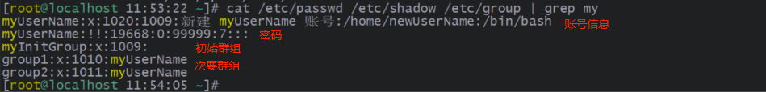

```shell
# 查看 useradd 选项的默认值
[root@www ~]# useradd -D
```

> 具体 useradd 默认值设置[参考](https://linux.vbird.org/linux_basic/centos7/0410accountmanager.php#users_adduser_env)。

#### 2、passwd

为账号设置密码。

```shell
[root@www ~]# passwd <== 所有用户都能通过此方式设置自己的密码

[root@www ~]# passwd [-l|-u|-S|-d] [--stdin] \  <== 只有 root 能通过此方式设置密码
> [-n 天数] [-x 天数] [-w 天数] [-i 天数] 账号名称
```

| 选项    | 说明                                                                                   |
| ------- | -------------------------------------------------------------------------------------- |
| --stdin | 获取标准输入的方式设置密码                                                             |
| -l      | 锁定密码，使密码变成 LK 状态，账号无法进行登录。刚创建账号时，该账号密码就是 LK 状态。 |
| -u      | 解锁密码，使密码变成 PS（密码设置完后的状态）或 NP 状态                                |
| -d      | 删除密码，使密码变成 NP 状态，账号不用输入密码就可登录                                 |
| -S      | 展示密码的相关信息，也就是 shdow 文件内的信息                                          |
| -n 天数 | 多久内不可修改密码                                                                     |
| -x 天数 | 多久内必须要改动密码                                                                   |
| -w 天数 | 密码过期前的警告天数                                                                   |
| -i 天数 | 密码失效天数                                                                           |

```shell
# 普通用户设置密码
[unxt@www ~]$ passwd

# root 通过键盘输入，为 unxt 账号设置密码
[root@www ~]# passwd --stdin unxt

# root 通过管道，为 unxt 账号设置密码
[root@www ~]# echo "123456" | passwd --stdin unxt

# 展示密码的相关信息
[root@www ~]# passwd -S unxt1
unxt1 PS 2023-11-07 0 0 7 0 (Password set, SHA512 crypt.)
```

#### 3、chage

chage 不能像 passwd 一样修改密码，但是可以修改密码的相关参数。

```shell
[root@www ~]# change [-ldEImMW] 账号名称
```

| 选项                | 说明                                                           |
| ------------------- | -------------------------------------------------------------- |
| -l（小写的 L）      | 列出该帐号的详细密码参数，会比 `passwd -S 账号名称` 更详细易懂 |
| -d 日期             | 修改最近一次更改密码的日期，格式为 YYYY-MM-DD                  |
| -m 天数             | 多久内不可修改密码                                             |
| -M 天数             | 多久内必须要改动密码                                           |
| -W 天数             | 密码过期前的警告天数                                           |
| -I（大写的 i） 天数 | 密码失效天数                                                   |
| -E 日期             | 修改账号失效日期，格式为 YYYY-MM-DD                            |

```shell
[root@www ~]# chage -l unxt1
Last password change                                    : Nov 07, 2023
Password expires                                        : Nov 07, 2023
Password inactive                                       : Nov 07, 2023
Account expires                                         : never
Minimum number of days between password change          : 0
Maximum number of days between password change          : 0
Number of days of warning before password expires       : 7

# 实现第一次登录后，强制用户更改密码
[root@www ~]# chage -d 0 unxt1  <== 此时此帐号的密码建立时间会被改为 1970/1/1，会有问题，因此需要更改密码
```

#### 4、usermod

修改账号及其相关信息。

```shell
[root@www ~]# usermod [-cdegGlsuLU] 账号名称
```

| 选项            | 说明                                                    |
| --------------- | ------------------------------------------------------- |
| -l 新的账号名称 | 修改账号名称                                            |
| -u newUID       | 修改 UID                                                |
| -g 新的初始群组 | 修改初始群组                                            |
| -G 新的次要群组 | 修改次要群组                                            |
| -a              | 与 -G 合用，可增加次要群组，而非设置                    |
| -c 新的账号描述 | 修改账号描述                                            |
| -d 新的家目录   | 修改家目录绝对路径                                      |
| -s newShell     | 修改 Shell                                              |
| -L              | 锁定密码，使密码变成 LK 状态，账号无法进行登录          |
| -U              | 解锁密码，使密码变成 PS（密码设置完后的状态）或 NP 状态 |
| -f 天数         | 密码失效天数                                            |
| -e 日期         | 修改账号失效日期，格式为 YYYY-MM-DD                     |

#### 5、userdel

删除账号及其相关信息，也就是删除 `/etc/passwd、/etc/shadow、/etc/group` 等文件中的相关信息。

```shell
[root@www ~]# userdel [-r] 账号名称
```

| 选项 | 说明                     |
| ---- | ------------------------ |
| -r   | 连同账号的家目录一起删除 |

一般来说，如果账号只是暂时不启用的话，只需要将**账号失效日期**设置为 0 就可以（root 仍然可以切换到此账号）。如果真的想删除账号及其相关信息，最好在 userdel 前查找并删除该账号的所有相关文件。

> 注意：如果是 useradd 默认创建的初始群组，且群组下只有该账号，则 userdel 删除账号时，也会删除该群组。

#### 6、查看用户登录信息

##### （1）id

查看指定用户的 uid、gid、groups 信息。

```shell
[root@www ~]# id
uid=0(root) gid=0(root) groups=0(root)

[root@www ~]# id unxt5
uid=1004(unxt5) gid=1004(unxt5) groups=1004(unxt5),1000(unxt1),1001(unxt2),1003(unxt4)
```

##### （2）who

查看当前有哪些用户连接到 Linux 服务器。

```shell
[root@www ~]# who
root     pts/0        2023-11-06 13:39 (192.168.190.1)
```

##### （3）w

比 who 强一点，查看当前登录的用户信息以及当前用户在做什么。

```shell
[root@www ~]# w
 14:50:51 up  7:23,  1 user,  load average: 0.00, 0.01, 0.05
USER     TTY      FROM             LOGIN@   IDLE   JCPU   PCPU WHAT
root     pts/0    192.168.190.1    13:39    3.00s  0.04s  0.00s w
```

##### （4）last

查看所有用户的所有登录和登出信息。

```shell
[root@www ~]#  last
root     pts/0        192.168.190.1    Mon Nov  6 13:39   still logged in
root     pts/3        192.168.190.1    Mon Nov  6 09:30 - 14:09  (04:38)
root     pts/1        192.168.190.1    Thu Nov  2 13:46 - 11:41 (3+21:55)
```

### （三）群组管理

**情景 1：**

假设有两组专题生在我的主机里面，第一个专题组别为 projectA，里面的成员有 class1, class2, class3 三个；第二个专题组别为 projectB，里面的成员有 class4, class5, class6。 这两个专题之间是有竞争性质的，但却要缴交同一份报告。每组的组员之间必须要能够互相修改对方的数据， 但是其他组的组员则不能看到本组自己的文件内容，此时该如何是好？

**情景 2：**

若仅仅为每个文件添加对应用户的权限，设想一下：class1 有个文件 helloLinux，class2 希望有文件的读写权限，那么需要为 class2 添加权限，这时候 class3 也需要有读写权限，那是不是也需要为 class3 添加读写权限？依次类推，添加权限变成一个极其麻烦的操作！

---

群组最有用的功能之一，就是当你在团队开发资源的时候。

#### 1、groupadd

创建群组。

```shell
[root@www ~]# groupadd [-g GID] [-r] 群组名称
```

| 选项   | 说明                   |
| ------ | ---------------------- |
| -g GID | 设置指定的 GID 数值    |
| -r     | 将此群组设置为系统群组 |

#### 2、groupmod

修改群组信息。

```shell
[root@www ~]# groupmod [-g GID] [-n 新群组名称] 群組名称
```

| 选项        | 说明                |
| ----------- | ------------------- |
| -g GID      | 设置指定的 GID 数值 |
| -n 新群组名 | 设置为新群组名      |

#### 3、groupdel

删除群组。

```shell
[root@www ~]# groupdel 群组名称
```

> 注意：如果该群组下有账号，无论是作为账号的初始群组还是次要群组，都无法删除。

#### 4、gpasswd

由于 root 账号需要处理很多事情，因此出现了**群组管理员**的角色，root 将权力下放给群组管理员，让他专门管理群组及账号。gpasswd 命令就是用于设置群组管理员。

```shell
# root 权限
[root@www ~]# gpasswd 群组名称  <== 给群组设置一个密码
[root@www ~]# gpasswd [-A 账号名称1,...] [-M 账号名称3,...] 群组名称
[root@www ~]# gpasswd [-rR] 群组名称

# 群组管理员权限
[someone@www ~]$ gpasswd [-ad] 账号名称 群组名称
```

| 选项              | 说明                                                                                                                  |
| ----------------- | --------------------------------------------------------------------------------------------------------------------- |
| -A 账号名称 1,... | 将指定账号设置为群组管理员。<br/>注意：**该操作不会改变账号的初始群组和次要群组**，只是账号对该群组账号有了管理权限。 |
| -M 账号名称 3,... | 将指定账号移入群组，也就是**该群组作为账号的次要群组**                                                                |
| -r                | 移除群组的密码                                                                                                        |
| -R                | 让群组的密码失效                                                                                                      |
| -a                | 将账号（账号没有限制，你设置可以将 root 移入）移入群组                                                                |
| -d                | 将账号（账号没有限制，你设置可以将 root 移出）移出群组                                                                |

### （四）账号切换

在 Linux 系统当中作身份的变换，可能有以下原因：

- 使用一般账号，保证系统安全。
- 用较低权限启动系统服务。
- 软件本身的限制，有些软件（例如 MySQL）禁止使用 root 账户运行。

#### 1、su

切换账号。

> root 账户切换成其他账户时，不需要输入密码。

```shell
[root@www ~]# su [-lm] [-c 指令] [账号名称]
```

| 选项    | 说明                                                                    |
| ------- | ----------------------------------------------------------------------- |
| -l 或 - | 以 login shell 的方式切换成指定账号。账号名称缺省时表示切换到 root 账号 |
| -m      | 忽略 -l 选项，以 nologin shell 的方式切换成指定账号                     |
| -c 指令 | 切换成指定账号，执行完命令后，就恢复到原本账号                          |

以 login shell 的方式切换时，**此 login shell 会加载切换后的账号对应的环境变量和各种配置文件**；如果以 nologin shell 的方式切换，**那么系统重加载的还是切换之前的账号的环境变量和各种配置**。

```shell
# 1、切换成 unxt 账号
[root@www ~]# su unxt

# 2、查看环境变量，会发现各种配置还是 root 账户的
[unxt@www ~]$ env
USER=unxt  <== 账号是 unxt
HOME=/home/unxt
PATH=/usr/local/sbin:/usr/local/bin:/usr/sbin:/usr/bin:/root/bin  <== shell 是 root
MAIL=/var/spool/mail/root  <== mail 是 root
PWD=/root

# 3、退出
[unxt@www ~]$ exit
```

```shell
# 1、切换成 unxt 账号
[root@www ~]# su -l unxt

# 2、查看环境变量，会发现各种配置变成 unxt 的了
[unxt@www ~]$ env
USER=unxt  <== 账号是 unxt
MAIL=/var/spool/mail/unxt
PATH=/usr/local/bin:/bin:/usr/bin:/usr/local/sbin:/usr/sbin:/home/unxt/.local/bin:/home/unxt/bin  <== shell 是 unxt
PWD=/home/unxt

# 3、退出
[unxt@www ~]$ exit
```

#### 2、sudo

一般情况下，我们都是使用一般账户登录 Linux 服务器，然而当我们想使用 root 权限的命令时，就需要 su 切换成 root 账号执行，这样很容易造成 root 密码泄露。sudo 可以让你以其他用户的身份执行命令（通常是使用 root 的身份来执行指令）。

```shell
[root@www ~]# sudo [-b] [-u 账号名称] 命令
```

| 选项        | 说明                                                         |
| ----------- | ------------------------------------------------------------ |
| -b          | 将后续命令放在后台运行                                       |
| -u 账号名称 | 以指定账号运行后面的命令，若无此项则代表以 root 身份运行命令 |

```shell
# 以 sshd 的身份在 /tmp 底下建立一个名为 mysshd 的文件
[root@study ~]# sudo -u sshd touch /tmp/mysshd
[root@study ~]# ll /tmp/mysshd
- rw-r--r--. 1 sshd sshd 0 Jul 21 23:37 /tmp/mysshd  <== 可以看到文件拥有者是 sshd
```

初始情况下，一般账户无法使用 sudo 命令，因为 sudo 的执行流程如下：

1. 当使用者执行 sudo 时，系统于 `/etc/sudoers` 文件中搜寻该使用者是否有执行 sudo 的权限。
2. 若使用者具有可执行 sudo 的权限后，便让使用者『输入使用者自己的密码』来确认。
   - 第一次输入密码后，后续不需要再输入密码。如果两次 sudo 操作的间隔超过 5 分钟，那就得要重新输入一次你的密码。
   - root 执行 sudo 时，不需要输入密码。
3. 若密码输入成功，便开始进行 sudo 后续接的指令。
4. 若欲切换的身份与执行者身份相同，那也不需要输入密码。

从上面可以知道用户想要执行 sudo 命令关键在于 `/etc/sudoers` 文件：

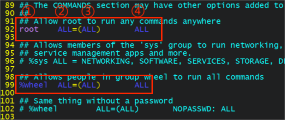

上面配置意义如下：

① **账号名称/群组名称**：指定账号可以使用 sudo 命令，例如 root。如果加上 `%` 百分号，则表示群组的意思，例如 %wheel，也就是说群组内的用户可以使用 sudo 命令。

② **可下达指令的主机名称**：这个账号可以通过 sudo 对某些主机下达命令的意思，ALL 表示全部。

③ **可切换的账号**：表示 sudo 可以切换成指定账号的身份来执行后续的命令。

④ **可下达的命令**：可用切换后的身份下达什么指令，**请务必使用绝对路径进行撰写**。

> 注意：`/etc/sudoers` 是 readonly 文件，最好使用 visudo 命令进行更改

```shell
# 修改 /etc/sudoers 文件
[root@study ~]# visudo
unxt1   ALL=(ALL)       ALL
unxt2   ALL=(ALL)       NOPASSWD: ALL  <== NOPASSWD 是指执行后续命令前，不需要输入密码
```

有时候我们可能觉得可下达的命令值为 ALL 风险太大，也可以添加限制：

```shell
# 『 ! 』代表『不可执行』的意思
[root@study ~]# visudo
myuser1 ALL=(root) !/usr/bin/passwd, /usr/bin/passwd [A-Za-z]*, !/usr/bin/passwd root
# 上面的配置意思是：可以执行『 passwd 任意字元』，但是『 passwd 』与『 passwd root 』这两个指令例外
```

`/etc/sudoers` 还支持别名的方式进行配置：

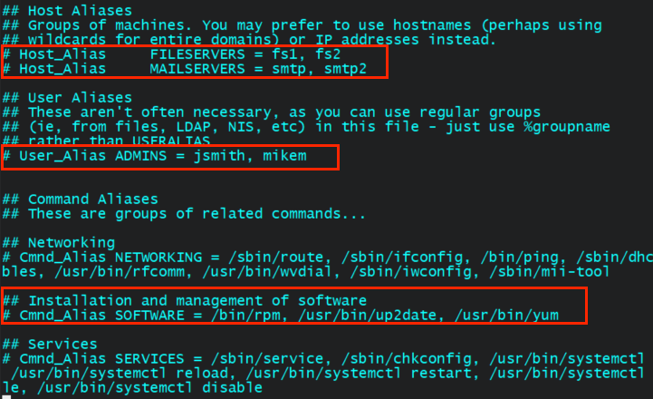

```shell
[root@study ~]# visudo
# 定义别名
User_Alias ADMPW = pro1, pro2, pro3, myuser1, myuser2
Cmnd_Alias ADMPWCOM = !/usr/bin/passwd, /usr/bin/passwd [A-Za-z]*, !/usr/bin/passwd root

# 通过别名方式配置
ADMPW ALL=(root) ADMPWCOM
```

### （五）用户通信

#### 1、write

向登录用户发送消息。

```shell
[root@study ~]# write 使用者帐号 [使用者所在终端界面]
```

> 注意：
>
> - write 只能向**登录的用户**发送消息，像 su 切换的账户不算。
> - write 发送消息会直接展示在接收者的命令提示符上，打断对方工作，慎用。

#### 2、mesg

mesg 拒绝接收 write 的消息。

> 注意：mesg 的功能对 root 传送来的讯息没有抵挡的能力。

```shell
[root@study ~]# mesg  <== 查看是否拒收

[root@study ~]# mesg -n  <== 设置为拒收
```

#### 3、wall

会向所有登录的用户广播消息。

```shell
[root@study ~]# wall "消息内容"
```

## 八、进程

### （一）定时任务调度器

很多时候我们希望程序并不是立刻运行，而是让它在指定时间运行（例如每周备份一次数据库），这时候定时任务调度器就很有用了。

#### 1、at

at 命令可以在**指定时间执行一次**设置的定时任务。

> 如果 Linux 发行版没有自带 at 命令，需要自己安装：
>
> ```shell
> yum install -y at
> ```
>
> 同时需要开启 atd 守护进程，atd 用于在后台执行 at 定时任务：
>
> ```shell
> [root@www ~]# systemctl restart atd   # 重新启动 atd 这个服务
> [root@www ~]# systemctl enable atd   # 让这个服务开机就自动启动
> [root@www ~]# systemctl status atd   # 查阅一下 atd 目前的状态
> ```
>
> 系统中有两个配置文件用于限定当用户是否可以使用 at 命令：
>
> - `/etc/at.allow`：**在此文件中**配置的账号**才可以使用** at 命令，一个账号写一行。
> - `/etc/at.deny`：**在此文件中**配置的账号**不可以使用** at 命令，一个账号写一行。
>
> `/etc/at.allow` 比 `/etc/at.deny` 优先级高，以上两个文件都没有，则只有 root 可以使用 at 命令。

```shell
[root@www ~]# at [-mldv] 时间格式
[root@www ~]# at -c 工作号码

# 时间格式：定义『什么时候要进行 at 这项工作』的时间
  HH:MM   ex> 04:00
    在今日的 HH:MM 时刻进行，若该时刻已超过，则明天的 HH:MM 进行此工作。
  HH:MM YYYY-MM-DD    ex> 04:00 2009-03-17
    强制规定在某年某月的某一天的特殊时刻进行该工作！
  HH:MM[am|pm] [Month] [Date]   ex> 04pm March 17
    强制在某年某月某日的某时刻进行！
  HH:MM[am|pm] + number [minutes|hours|days|weeks]    ex> now + 5 minutes   ex> 04pm + 3 days
    在某个时间点『再加几个时间后』才进行
```

| 选项 | 说明                                                                                                                       |
| ---- | -------------------------------------------------------------------------------------------------------------------------- |
| -m   | 当 at 的工作完成后，如果没有输出到控制台的信息，也以 email 通知使用者该工作已完成。在 `/var/spool/mail` 查看当前用户的邮件 |
| -l   | `at -l` 相当于 atq，列出目前系统上面的所有该使用者的 at 调度器                                                             |
| -d   | `at -d` 相当于 atrm，可以取消一个在 at 调度器中的工作                                                                      |
| -v   | 可以使用较明显的时间格式列出 at 调度器中的工作列表                                                                         |
| -c   | 可以列出后面接的该项工作的实际命令内容                                                                                     |

```shell
#  5minutes 后执行
[root@www ~]# at now +5 minutes
at> echo "hello world"  <== 添加工作任务
at> ll ~
at> touch helloworldat
at> ll ~
at> <EOT>
job 5 at Mon Nov  6 15:06:00 2023 <== 这里的 5 就是此 at 工作任务的唯一标志符

# 使用 -c 选项查看
[root@www ~]# at -c 5
```

> 注意：
>
> - **建议你最好使用绝对路径来下达你的命令**，比较不会有问题，**因为 at 在运行时，会跑到当时下达 at 命令的那个工作目录**。
> - 由于 at 是在后台运行，因此像 echo 这种输出控制台的信息，就会输出到 `/var/mail/` 下的当前用户邮箱中

（1）atq

查询所有未执行的 at 调度器。

```shell
[root@www ~]# atq
```

（2）atrm

移除指定的调度器。

```shell
[root@www ~]# atq 唯一标志符
```

#### 2、[crontab](https://linux.vbird.org/linux_basic/centos7/0430cron.php#cron)

at 命令只能在某一时刻执行一次，crontab 命令通过 crond **周期性地执行**定时任务。

> 系统中有两个配置文件用于限定当用户是否可以使用 crontab 命令：
>
> - `/etc/cron.allow`：**在此文件中**配置的账号**才可以使用** crontab 命令，一个账号写一行。
> - `/etc/cron.deny`：**在此文件中**配置的账号**不可以使用** crontab 命令，一个账号写一行。
>
> `/etc/cron.allow` 的优先级比 `/etc/cron.deny` 高，以上两个文件都没有，则只有 root 可以使用 crontab 命令。
>
> `/var/spool/cron/` 中记录着各用户正在生效的 crontab 工作任务。cron 执行的每一项工作都会被纪录到 `/var/log/cron` 这个登录文件，如果你的 Linux 不知道有否被植入木马时，也可以搜寻一下 `/var/log/cron` 这个登录文件。

```shell
[root@www ~]# crontab [-u username] [-l|-e|-r]
```

| 选项 | 说明                                                                                                                                                        |
| ---- | ----------------------------------------------------------------------------------------------------------------------------------------------------------- |
| -u   | 为指定用户设置定时任务，缺省时值就是当前用户。<br/>注意：只有 root 才能使用这个选项，可以帮其他用户创建、移除定时任务，也可以查看指定用户已创建的定时任务。 |
| -e   | 编辑 crontab 的工作内容                                                                                                                                     |
| -l   | 查询 crontab 的工作内容                                                                                                                                     |
| -r   | 移除所有的 crontab 的工作内容，若仅移除某些项，使用 -e 去编辑                                                                                               |

```shell
# root 用户为 unxt 用户创建一个工作任务
[root@www ~]# crontab -u unxt -e
#分 时 日 月 周 |<==============命令串========================>|
*/5 * * * * echo "hello world unxt" && date  <== 每 5 分钟执行一次，输出 hello world unxt 并打印时间

# 查看 unxt 用户的工作任务
[root@www ~]# crontab -u unxt -l

# root 用户为自己创建一个工作任务
[root@www ~]# crontab -e
*/5 * * * * echo "hello world root" && date  <== 输出 hello world root 并打印时间

# 查看自己的工作任务
[root@www ~]# crontab -l
```

定时时间配置如下：

| 特殊字符 | 说明                                                                                               |
| -------- | -------------------------------------------------------------------------------------------------- |
| \*(星号) | 代表任何时刻的意思。例如：`0 12 * * *` 就代表『 不论何月、何日的礼拜几的 12:00 』都运行后续命令    |
| ,(逗号)  | 代表分隔时段的意思。例如：`0 3,6 * * *` 就代表『 3:00 与 6:00 』都运行后续命令                     |
| -(减号)  | 代表一段时间范围内。例如：`20 8-12 * * *`就代表『 8 点到 12 点之间的每小时的 20 分 』              |
| /n(斜线) | 那个 n 代表数字，亦即是『每隔 n 单位间隔』的意思。例如：`*/5 * * * *` 就代表『 每五分钟进行一次 』 |

##### （1）配置文件

一般来说，crontab 默认有三个地方会有执行脚本的配置文件，他们分别是：

- `/var/spool/cron/*`：每个用户通过 crontab 命令创建定时任务时，都会在该目录下生成对应的文件，**主要用于根据个人需求来建立的定时任务**。
- `/etc/crontab`：如果你这个例行调度器是系统的重要工作，为了让自己管理方便，同时容易追踪，建议直接写入 `/etc/crontab` 较佳。
- `/etc/cron.d/*`：如果你是想要自己开发软件，那当然最好就是使用全新的定时任务配置文件，并且放置于该目录内即可。

> 其实以上的三个配置文件都可以定义定时任务，只是为了规范，才有了以上的区分。

**Linux 下 cron 会每分钟重新读取一遍以上配置文件中的内容，自动添加对应的定时任务**，但是有可能由于 crontab 是缓存到内存中，因此不会立刻执行，执行 `systemctl restart crond` 即可。

例如设置一个自动更新软件的定时任务：

```shell
[root@www ~]# echo '10 1 * * * root /usr/bin/yum -y --enablerepo=epel update' > /etc/cron.d/yumupdate
```

##### （2）[anacron](https://linux.vbird.org/linux_basic/centos7/0430cron.php#anacron_1)

当我们设置了 crontab 定时任务后，例如：每周六备份一次 MySQL 数据库数据，正常情况下每周六 crond 会执行一次备份命令，然而由于周六断电，导致 Linux 服务器错过了此次定时任务，那该怎么办？

Linux 提供 anacron 程序，可以在 Linux 恢复后，去**主动执行日、周、月级别的、未正常执行的 crontab 任务**。

### （二）进程管理

程序（program）就是一个或一组可执行文件（binarary file），被存储在硬盘或其他的数据存储设备中，也就是说**程序是静态的代码**。

进程（process）是程序的一次执行过程，是系统进行资源（CPU、内存等）分配和调度的一个基本单位。用户执行程序时，用户的权限与属性、程序与所需数据都会被加载到内存中成为一个个体，同时系统会给它一个 PID，我们就称这个个体为进程。可以说，**进程就是运行中的程序**。

#### 1、父进程与子进程


父进程是创建一个或多个子进程的进程。

子进程是由父进程创建的新进程，**并从其父进程继承某些属性**，子进程可以通过 PPID（Parent PID）找到父进程。

#### 2、[fork()](https://blog.csdn.net/LEON1741/article/details/78004107) 和 [exec()](https://blog.csdn.net/bit_jie/article/details/128775325) 函数

Linux 中创建进程有两种方式：

- 由操作系统直接创建。
- 用户在父进程中调用 fork()函数创建子进程。

为了减少开销，fork()函数创建的子进程与父进程**共享物理内存（代码段、堆栈段及数据段）**，除了 [PCB 进程控制器](https://blog.csdn.net/weixin_44580000/article/details/127227785)。如果两个进程都没有对内存做写操作，则两个进程仍然共享内存；如果有任一进程进行了写操作，那么在修改内存前，会复制一份内存数据给子进程用。

> Linux 中一个进程在内存中有三部分数据：
>
> - 代码段：存放源码（可运行代码）。
> - 堆栈段：存放方法的私有数据，例如：参数、返回地址、局部变量等。
> - 数据段：存放程序的全局变量、常数及动态数据分配的数据空间。
>
> 进程可以运行同一个源码，不同进程之间不能使用同一个堆栈段和数据段。

fork()程序只是创建子进程（相当于父进程的分支），执行的还是父进程的代码。exec()函数会对当前进程进行**进程程序替换**，废弃原有的代码段、堆栈段及数据段，并为进程分配新的代码段、堆栈段及数据段，唯一留下的只有 PID 进程号了（不过 exec 类函数中有的还允许继承环境变量之类的信息）。

至此，通过 fork 和 exec 就真正的创建了子程序，并且运行的是指定代码，具体流程如下：

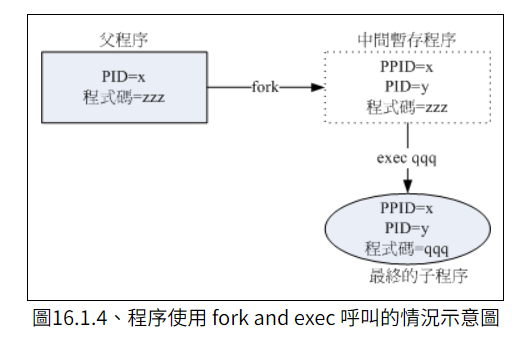

#### 3、工作管理（Job Control）

**情景 1**：

假设我们只有一个终端页面，很多时候，我们在命令提示符操作台中一次性只能输入并执行一个命令，当一个命令要执行很长时间时，我们就不得不等待它执行完毕后才能输入下一个命令，这对于系统资源以及我们的时间是极大的浪费。这时我们就会想，对于一个执行时间很长的命令，我们能不能把它放在一边让它自己继续运行，我们可以继续在命令提示符操作台中输入并执行其他命令，例如一边复制文件，一边进行数据查找。

---

**Linux 中可以控制与下达命令的环境就称为前台（foreground），可以自行运行的环境就称为后台（background），对这些前台/后台任务的管理就叫做工作管理（Job Control）。**

##### （1）&

将命令放在后台中执行。

```shell
[root@www ~]# 命令 &
```

在后台中运行的命令有以下特点：

- 用户无法通过 Ctrl + c 中断执行，也无法通过键盘传入参数。
- 在命令执行完毕后会直接将结果打印在控制台。

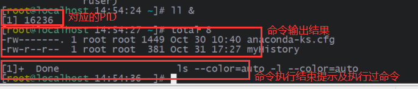

为了防止后台进程执行结束后的输出影响工作台，可以使用数据重定向流：

```shell
# 将结果重定向到 /tmp/log.txt 文件
[root@www ~]# ll > /tmp/log.txt 2>&1 &
```

##### （2）Ctrl + z

将命令放在后台中并暂停执行。

例如：当我们正在使用 vim 编辑文件，却发现有个文件不知道放在哪里，需要到 bash 环境写搜寻，此时就可以通过 Ctrl + z 按键将 vim 放在后台中暂停等待即可。

```shell
[root@study ~]# vim ~/.bashrc
# 在vim 的一般模式下，按下 Ctrl + z 这两个按键
[1]+ Stopped vim ~/.bashrc
[root@study ~]#      <== 获得前台控制权
```

##### （3）jobs

查看目前后台进程状态。

```shell
[root@study ~]# jobs  <== 查看后台所有进程状态
[root@study ~]# jobs [-lrs]
```

| 选项 | 说明                            |
| ---- | ------------------------------- |
| -l   | 额外展示后台进程的 PID          |
| -r   | 只展示后台正在执行（run）的进程 |
| -s   | 只展示后台暂停（stop）的进程    |

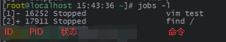

##### （4）fg

将后台进程放到前台**继续执行**，即让暂停的进程在前台继续执行，对于正在执行的进程则放到前台执行。

```shell
[root@study ~]# fg %ID  <== 这个数字就对应着 jobs 命令中展示的 ID，前面可以加 % 百分号，也可以不加
```

##### （5）bg

将后台进程放在后台**继续执行**，即让暂停的进程继续执行，对于正在执行的进程则没有影响。

```shell
[root@study ~]# bg %ID  <== 这个数字就对应着 jobs 命令中展示的 ID，前面可以加 % 百分号，也可以不加
```

##### （6）kill

向进程发送信号。

> 注意：kill 命令是向进程发送信号，不是杀死的意思，只是最常用于结束进程。

```shell
[root@study ~]# kill -l [信号编号]
[root@study ~]# kill -信号编号 %ID  <== 对应 jobs 的 ID，这里 % 必须添加
[root@study ~]# kill -信号编号 PID  <== 对应进程的 PID
```

| 选项                        | 参数                                                             |
| --------------------------- | ---------------------------------------------------------------- |
| -l [信号编号]               | 有信号编号参数时展示对应的含义，没有时展示所有的信号编号及其含义 |
| kill -信号编号 <%ID \| PID> | 向指定进程发送信号                                               |

```shell
# 查看信号编号及其含义
[root@study ~]# kill -l
 1) SIGHUP       2) SIGINT       3) SIGQUIT      4) SIGILL       5) SIGTRAP
 6) SIGABRT      7) SIGBUS       8) SIGFPE       9) SIGKILL     10) SIGUSR1
11) SIGSEGV     12) SIGUSR2     13) SIGPIPE     14) SIGALRM     15) SIGTERM
16) SIGSTKFLT   17) SIGCHLD     18) SIGCONT     19) SIGSTOP     20) SIGTSTP
21) SIGTTIN     22) SIGTTOU     23) SIGURG      24) SIGXCPU     25) SIGXFSZ
26) SIGVTALRM   27) SIGPROF     28) SIGWINCH    29) SIGIO       30) SIGPWR
31) SIGSYS      34) SIGRTMIN    35) SIGRTMIN+1  36) SIGRTMIN+2  37) SIGRTMIN+3
38) SIGRTMIN+4  39) SIGRTMIN+5  40) SIGRTMIN+6  41) SIGRTMIN+7  42) SIGRTMIN+8
43) SIGRTMIN+9  44) SIGRTMIN+10 45) SIGRTMIN+11 46) SIGRTMIN+12 47) SIGRTMIN+13
48) SIGRTMIN+14 49) SIGRTMIN+15 50) SIGRTMAX-14 51) SIGRTMAX-13 52) SIGRTMAX-12
53) SIGRTMAX-11 54) SIGRTMAX-10 55) SIGRTMAX-9  56) SIGRTMAX-8  57) SIGRTMAX-7
58) SIGRTMAX-6  59) SIGRTMAX-

# 查看指定信号编号含义
[root@study ~]# kill -l 9
KILL
```

常用的信号编号及其含义：

| 信号编号 | 说明                                                                                          |
| -------- | --------------------------------------------------------------------------------------------- |
| 1        | 重新读取一次参数的配置文件（类似 reload）                                                     |
| 2        | 与 Ctrl + c 一样的功能                                                                        |
| 9        | 表示无条件退出进程。由进程自行决定是否退出，这就是 `kill -9` 终止不了系统进程和守护进程的原因 |
| 15       | 表示正常停止一个进程                                                                          |

##### （7）nohup

当我们在 Linux 系统上执行一个长时间运行的命令或脚本时，我们通常会遇到一个问题，那就是在终端关闭或者退出后，该进程也会随之停止运行。在这种情况下，我们需要一种方式来让进程在后台运行，而不受终端关闭的影响。这时，nohup 命令就派上用场了。

nohup（no hang up，不挂断）可以让后续命令对应的进程**忽略所有挂断信号（SIGHUP），可以在你退出帐户/关闭终端之后继续运行相应的进程**。

```shell
[root@study ~]# nohup 命令    <== 在前台运行
[root@study ~]# nohup 命令 &  <== 在后台运行
```

由于我们的程式最后会输出一个讯息，但是 nohup 与终端机其实无关了，因此不会将命令结果输出到终端。在没有数据重定向流时，命令执行结果会被导向 `~/nohup.out` 文件。

#### 4、查看进程

##### （1）[ps](https://cloud.tencent.com/developer/article/1525283)

用于查看进程及其相关属性，由于其参数太多太复杂，就记两个常用的用法就行

```shell
# 查看当前 shell 相关的进程
[root@study ~]# ps -lf <== -l、-f 都是以指定格式输出属性

# 查看指定 PID 的进程
[root@study ~]# ps -lf -p 15934  <== -p 查看指定进程
```

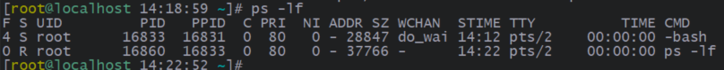

- F：进程的标志，主要有：
  - 1：程序的权限为 root。
  - 4：此子程序仅进行 fork 而没有实际执行（exec）。
- S：[进程的状态](https://blog.csdn.net/zty857016148/article/details/131473538)，主要有：
  - R（Running）：正在运行中。
  - S（Sleep）：睡眠状态，可以被唤醒。
  - D：睡眠状态，不可被唤醒，通常程序可能在等待 IO。
  - T（Stop）：暂停状态，可以通过信号来暂停或恢复进程的执行：-19 暂停；-18 继续。
  - Z（Zombie）：[僵尸状态](https://cloud.ofweek.com/news/2021-07/ART-178800-11000-30507901.html)。
  - X：终止状态。
- UID、PID、PPID：进程拥有者的 UID；进程的 PID；父进程的 PID。
- C：CPU 的使用率。
- PRI、NI：Priority、Nice 的缩写，代表此程序被 CPU 所执行的优先顺序，数值越小代表该程序越快被 CPU 执行。
- ADDR、SZ、WCHAN：都与内存有关，ARR 是指进程在内存的哪个部分，如果是 R 状态的进程，值一般为 `-`；SZ 表示进程占用的内存；WCHAN 表示进程是否运行中，如果是 R 状态的进程，值一般为 `-`。
- TTY：登录者的终端机，例如 tty1、tty2 ；若为远端登录则使用动态终端页面（pts/数字）。
- STIME：进程的启动时间
- TIME：运行进程花费的 CPU 时间。
- CMD：运行进程的指令。

> 孤儿进程：父进程终止，而子进程还在运行，那么这些子进程将成为孤儿进程。孤儿进程将被 init 进程所收养，并由 init 进程对他们完成状态收集工作。
>
> [僵尸状态](https://cloud.ofweek.com/news/2021-07/ART-178800-11000-30507901.html)：指已终止的进程，未被其父进程处理（可能忙于其他事情），导致程序的 PID、内核栈等信息无法被清除。
>
> 僵尸状态的进程无法被 kill 杀掉（因为它本来就已经终止了），解决方法之一：需要找到并杀掉它的父进程，这样僵尸进程会被 init 进程（是系统第一个进程，也是所有进程的祖宗）接管并处理，如果仍然不能处理只能进行 reboot 重启。僵尸进程主要是父进程设计有缺陷，导致它不能及时处理终止的子进程，应该对父进程进行排查。

```shell
# 查看当前 Linux 中所有的进程
[root@study ~]# ps -elf <== -e 查看所有的进程
```

##### （2）top

ps 是读取执行命令时的进程状态，top 可以**持续地监测并输出硬件及进程信息**。

```shell
[root@study ~]# top [-p PID1[, PID2...]] [-d 秒数] [-n 次数] [-b]
```

| 选项               | 说明                                                               |
| ------------------ | ------------------------------------------------------------------ |
| -p PID1[, PID2...] | 只展示指定 PID 进程的信息                                          |
| -d 秒数            | 设置 top 刷新间隔                                                  |
| -n 次数            | 设置 top 刷新几次就退出，没有 -n 选项就会一直在 top 界面           |
| -b                 | 以批次的方式执行 top，通常搭配数据重定向流，将批次的结果保存在文件 |

```shell
# 执行 top 命令，查看输出结果
[root@study ~]# top
```

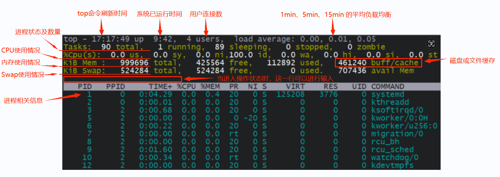

上面 CPU 的相关信息如下：

- us（user）：用户态的 CPU 时间比例。
- sy（system）：内核态的 CPU 时间比例。
- ni（nice）：运行低优先级进程的 CPU 时间比例。
- id（idle）：空闲 CPU 时间比例。
- **wa（iowait）**：处于 IO 等待的 CPU 时间比例。
- hi（hard interrupt）：处理硬中断的 CPU 时间比例。
- si（soft interrupt）：处理软中断的 CPU 时间比例。
- st（steal）：当前系统运行在虚拟机中的时候，被其他虚拟机占用的 CPU 时间比例。

执行命令后会进入 top 界面，它也像 vim 一样可以执行操作，在 top 执行过程当中可以使用的按键指令：

| 按键 | 说明                                               |
| ---- | -------------------------------------------------- |
| h    | 查看帮助文档                                       |
| P    | 以 CPU 的使用率从大到小排序                        |
| M    | 以内存的使用率从大到小排序                         |
| N    | 以 PID 从大到小排序，top 默认使用 PID 从小到大排序 |
| R    | 反序                                               |
| k    | 与 kill 作用一样，向指定 PID 的进程发送信号        |
| u    | 只展示指定用户的进程                               |
| s    | 设置 top 刷新间隔                                  |
| q    | 退出                                               |

##### （3）pstree

展示进程之间的父子关系。

```shell
[root@study ~]# pstree [-A|-U] [-up]
```

> 如果没有 pstree，使用 `yum -y install psmisc` 安装。

| 选项 | 说明                                                                           |
| ---- | ------------------------------------------------------------------------------ |
| -A   | 各程序树之间的连接以 ASCII 字元来连接                                          |
| -U   | 各程序树之间的连接以万国码的字元来连接。默认值，在某些终端界面下可能会有错误； |
| -p   | 展示每个进程的 PID                                                             |
| -u   | 展示每个进程的所属用户                                                         |

```shell
[root@study ~]# pstree -puA
```

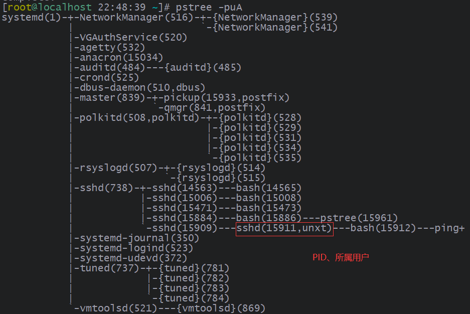

> 括号内即进程 PID 和所属用户，如果该进程的所属用户与父进程相同，就不会列出，但是如果与父进程不一样，那就会列出该进程的所属用户。

##### （4）nice

每个进程执行都需要抢占 CPU 资源（时间片），假如在一个 CPU 中，每个进程获取时间片几率相同（顺序轮询地执行），就如下情况：

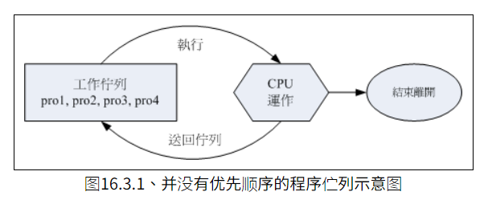

假如 pro1、por2 是重要且紧急的进程，pro3、pro4 是一般的进程，由于它们是顺序地执行（均等机会获取时间片），这样会导致 CPU 不会优先去执行重要的进程。

假如有优先级情况，优先级高的有更高机会获取时间片（即先执行），就如下情况：

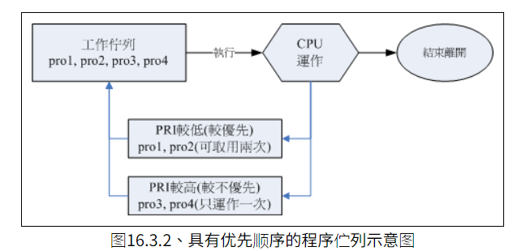

CPU 每次就有可能先去执行优先级高的进程，这样重要的进程就会先执行完成。

**Linux 给进程一个 PRI（priority、优先级），这个 PRI 值越小优先级越高。**不过 PRI 由核心动态调整，使用者无法直接调整 PRI 值，要想调整 PRI 值，就需要通过调整 NI（Nice）间接地调整 PRI 值。PRI 与 NI 的关系如下：

```txt
新PRI值 = 旧PRI值 + Nice

# 例如：旧 PRI 值为 50，设置 Nice 值为 5，新 PRI 值就为 55
新PRI值 = 50 + 5 = 55
```

Nice 值有以下特点：

- Nice 取值范围为 [-20, 19]。
- root 可以随意调整所有进程的 Nice 值，范围为 [-20, 19]。
- 一般用户仅可调整自己进程的 Nice 值，且范围仅为[0, 19]，避免一般用户抢占系统资源。
- 一般用户仅可将 Nice 值越调越高，例如本来 Nice 为 5 ，则未来仅能调整到大于 5。

Linux 提供 nice 命令去设置新的进程 Nice 值。

```shell
[root@study ~]# nice [-n 数字] 命令

# 例如：设置 ping 进程的 nice 值为 0
[root@study ~]#  nice -n 0 ping www.baidu.com >> /dev/null &
```

##### （5）renice

renice 设置已存在的进程 Nice 值。

```shell
[root@study ~]# renice [数字] PID
```

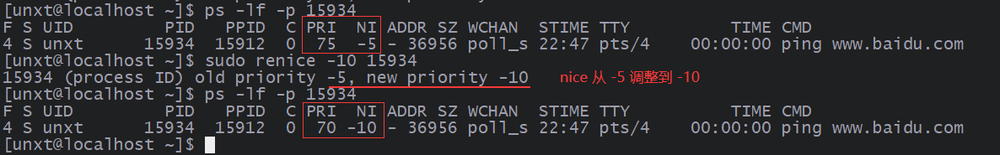

#### 5、查看系统资源

除了可以查看进程信息外，还可以看系统资源（CPU、内存等）信息。

##### （1）free

top 中可以查看内存信息，free 命令也可以查看内存信息。

```shell
[root@study ~]# free [-h] [-t] [-s 秒数] [-c 输出次数]
```

| 选项 | 说明                                                   |
| ---- | ------------------------------------------------------ |
| -h   | 以人们较易阅读的 GBytes、MBytes、KBytes 等格式自行显示 |
| -t   | 统计内存和 Swap 的总数据                               |
| -s   | 设置 free 刷新间隔，不间断的一直输出的意思             |
| -c   | 设置 free 刷新几次就退出，和 -s 选项同时使用           |

##### （2）uname

查看系统及核心的相关信息。

```shell
[root@study ~]# uname [-a]
```

| 选项 | 说明                       |
| ---- | -------------------------- |
| -a   | 所有相同的相关信息都会输出 |

```shell
[root@study ~]# uname -a
Linux localhost.localdomain 3.10.0-693.el7.x86_64 #1 SMP Tue Aug 22 21:09:27 UTC 2017 x86_64 x86_64 x86_64 GNU/Linux
# 核心名 Linux
# 主机名称 localhost.localdomain
# 核心版本 3.10.0-693.el7.x86_64
# 核心版本创建日期 Tue Aug 22 21:09:27 UTC 2017
# 适用硬件 x86_64
```

## 九、系统服务

不同于执行一次就结束的进程，Linux 中有许多**常驻在内存中的进程**，它们通常提供一些系统或网络功能，因此**这些常驻进程就称为服务**（Service），而 Service 的提供功能总是需要程序以后台的形式运行，所以实现这个 Service 的程序就称为 Daemon（守护进程）。

在 Linux 中，启动程序是核心唤起的第一个程序，它是所有进程的老祖宗，会去唤起所有系统所需的服务（不论是本机服务还是网络服务）。

### （一）init 启动程序

早期启动系统服务的管理机制是 System V 的 init 脚本程序的方式，init 有以下几个特点：

- 几乎所有的服务启动脚本都置于 `/etc/init.d` 目录下，基本上都是使用 bash shell script 所写成的脚本程序。
- 如果一个服务 A 依赖于另外一个服务 B，如果服务 B 没有先启动，则服务 A 就会启动失败，这就是服务的依赖性。init 在管理员自己手动处理这些服务时，是没有办法协助依赖服务的唤醒。
- 根据 daemon 启动与管理方式来区分：
  - stand alone：服务独立启动，该服务常驻于内存中，提供本级与用户的服务行为，启动速度快。
  - super alone：由 xinetd 或 inetd 这两个总管程序提供 socket 或 port 对应的管理。当没有用户请求某 socket 或 port 时，所需要的服务时不会被启动的；当有用户请求时，xinetd 总管才会去唤醒对应的服务程序，当该请求结束时，这个服务也会被结束掉。由于需要通过 xinetd 唤醒所需服务，因此启动有点延迟。

#### 1、service

service 命令会去 `/etc/init.d` 目录下查找指定名称的服务启动脚本进行执行。

```shell
[root@www ~]# service 服务启动脚本名称 输入参数
```

```shell
[root@www ~]# ll /etc/init.d
-rwxr-xr-x  1 root root  1369 Aug 10  2021 zookeeper
......

# 直接执行脚本
[root@www ~]# /etc/init.d/zookeeper start  <== start 是此脚本支持的输入参数
[root@www ~]# /etc/init.d/zookeeper stop

# 通过 service 命令执行，和上面相同的效果
[root@www ~]# service zookeeper start
[root@www ~]# service zookeeper stop
```

#### 2、chkconfig

管理系统服务，配置系统服务是否开机自启动。

```shell
[root@www ~]# chkconfig --list [服务名称]
[root@www ~]# chkconfig [--level [0123456]] 服务名称 [on|off]
[root@www ~]# chkconfig [--add|--del] 服务名称
```

将 nacos 设置为系统服务：

```shell
# 展示所有的系统服务
[root@www ~]# chkconfig --list
netconsole      0:off   1:off   2:off   3:off   4:off   5:off   6:off
network         0:off   1:off   2:on    3:on    4:on    5:on    6:off

# 1、展示指定名称的系统服务
[root@www ~]# chkconfig --list nacos
error reading information on service nacos: No such file or directory  <== 不存在

# 2、将 nacos 服务设置为系统服务，被 chkconfig 管理
[root@www ~]# chkconfig --add nacos

# 3、设置为开机自启动
[root@www ~]# chkconfig nacos on

[root@www ~]# chkconfig --list nacos
nacos           0:off   1:off   2:on    3:on    4:on    5:on    6:off  <== 已经添加了
```

要想 chkconfig 管理 nacos 服务，有以下要求：

- 必须放在 `/etc/init.d/` 目录下。
- 在脚本文件头部添加 `# chkconfig: 35 80 70` 注释，其中 35 表示将在 run level 3 及 5 启动；80 表示 80 顺序启动（越小表示越早启动）；70 表示 70 顺序结束（越小表示越早结束），这些都是可以自定义的。

### （二）systemd 启动程序

从 CentOS 7.x 之后，Red Hat 系列的 distribution 放弃沿用多年的 System V 开机启动服务的流程，改用 systemd 这个启动服务管理机制。systemd 有以下特点：

- systemd 将过去所谓的 daemon 执行脚本统称为一个服务单位（unit），这些文件都放置在以下目录中：
  - `/usr/lib/systemd/system/`：系统默认的启动脚本配置，有点类似于 `/etc/init.d` 下的文件。
  - `/run/systemd/system/`：系统执行过程中所产生的服务脚本，这些脚本的优先级要比上面高。
  - `/etc/systemd/system/`：用户可以根据需求建立执行脚本，类似于 `/etc/rc[0-5].d` 下的文件，这些脚本的优先级要比上面高。
- systemd 可以自定义服务依赖的检查，当有依赖的服务没有启动时，systemd 会自动帮你启动依赖的服务。
- 兼容 init 的脚本文件，也就是你仍然可以向上面一样管理服务，但是 systemd 的进阶功能（例如 systemctl 管理）就无法使用了。

#### 1、unit 类型

systemd 将 unit 分为多种不同的类型（主要是方便用户管理和记忆）：

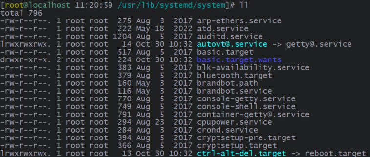

| 文件后缀名        | 说明                                                                                                                               |
| ----------------- | ---------------------------------------------------------------------------------------------------------------------------------- |
| .service          | 一般服务：主要是系统服务，包括服务器本身所需要的本机服务以及网络服务，是最常见的类型                                               |
| .socket           | 内部程序数据交换的 socket 服务：主要是 IPC（Inter-process communication）的传输信息 socket 文件（socket file）功能。               |
| .target           | 执行环境服务：是一群 unit 的集合，也就是执行其他 unit 服务的服务                                                                   |
| .mount/.automount | 文件系统挂载相关服务：例如来自网络的自动挂载、NFS 文件系统挂载等，与文件系统相关性较高的进程管理                                   |
| .path             | 监测特定文件或目录服务：某些服务需要检测某些特定的目录来提供队列服务，例如最常见的打印服务，就是通过检测打印队列目录来启动打印功能 |
| .timer            | 循环执行的服务：类似于 anacrontab，不过是由 systemd 主动提供，比 anacrontab 更有弹性                                               |

#### 2、[unit 文件结构](https://linux.vbird.org/linux_basic/centos7/0560daemons.php#systemd_cfg)

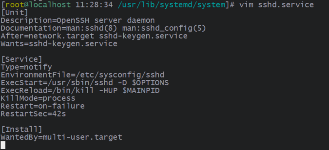

unit 脚本文件主要由三个部分组成：[Unit]、第二部分及 [Install]。

##### （1）[Unit]

| 字段                | 说明                                                                                                                                                            |
| ------------------- | --------------------------------------------------------------------------------------------------------------------------------------------------------------- |
| Description         | 该脚本文件的说明                                                                                                                                                |
| Document            | 该脚本文件的文档，例如上面就可以通过 `man sshd` 查看 sshd 的指导文档                                                                                            |
| Before / After      | 该服务启动在某个 service 之前/后，例如上面 `After=XXX.service` 就是在某个服务启动之后再启动本服务。之前设置服务的启动顺序，并没有强制的意思，与 Requires 有区别 |
| ConditionPathExists | 脚本执行条件                                                                                                                                                    |
| Wants / Requires    | 表示服务之间的依赖关系，Wants 表示**弱依赖**，即使依赖的服务终止也不会影响到本服务；Requires 表示**强依赖**，若依赖的服务终止，本服务也会终止                   |
| Conflicts           | 代表冲突的服务。如果 Conflicts 指定的服务启动，那此 unit 就不能启动；如果此 unit 启动，则 Conflicts 指定的服务就不能启动                                        |

##### （2）第二部分

第二部分包括 [Service]、[Socket]、[Timer] 等，不同类型的 unit 脚本文件使用不同的属性，其下也包含不同的字段，以 [Service] 为例：

| 字段            | 说明                                                                                                                                                                                                                                                                                              |
| --------------- | ------------------------------------------------------------------------------------------------------------------------------------------------------------------------------------------------------------------------------------------------------------------------------------------------- |
| Type            | 定义启动服务时的进程行为：<br/>simple：默认值，执行 ExecStart 命令，启动后常驻于内存；<br/>forking：以 fork 方式创建子进程，然后父进程立刻退出，据说效能更好；<br/>oneshot：服务在工作完毕后退出，不会常驻在内存中；<br/>dbus：当前服务通过 D-Bus 启动；<br/>idle：等待其他服务运行完毕后才运行。 |
| EnvironmentFile | 设置配置文件，unit 脚本就可以直接使用配置文件中的变量                                                                                                                                                                                                                                             |
| ExecStart       | 实际要执行的**启动**命令或脚本，使用 `systemctl start XXX` 执行该命令或脚本                                                                                                                                                                                                                       |
| ExecStartPre    | 启动当前服务之前执行的命令                                                                                                                                                                                                                                                                        |
| ExecStop        | 实际要执行的**停止**命令或脚本，使用 `systemctl stop XXX` 执行该命令或脚本                                                                                                                                                                                                                        |
| ExecReload      | 实际要**重新载入**的命令或脚本，使用 `systemctl reload XXX` 执行该命令或脚本                                                                                                                                                                                                                      |

##### （3）[install]

| 字段     | 说明                                                                                                                                                                                     |
| -------- | ---------------------------------------------------------------------------------------------------------------------------------------------------------------------------------------- |
| Wantedby | 当前服务使用 `systemctl enbale XXX` 设置开机自启动时，生成的软链接存放位置，一般值为 multi-user.target，也就是生成的软链接会存放在 `/etc/systemd/system/multi-user.target.wants/` 目录下 |
| Also     | 当前 unit 脚本文件被 enable 时，Also 后面的 unit 脚本也会进行 enable 操作                                                                                                                |
| Alias    | 当执行 `systemctl enable XXX` 命令时，在 `/etc/systemd/system` 下生成一个软链接，也就是别名的意思                                                                                        |

#### 3、systemctl

systemctl 相当于 service 与 chkconfig 的结合，负责管理 systemd 系统服务。

##### （1）操作

```shell
[root@study ~]# systemctl 操作命令 unit
```

| 操作命令 | 说明                                                                             |
| -------- | -------------------------------------------------------------------------------- |
| start    | 启动脚本文件，即 service 服务                                                    |
| stop     | 停止服务                                                                         |
| restart  | 重启服务，即 stop 再 start 的意思                                                |
| reload   | 不关闭服务的条件下，重新载入配置文件，让配置生效                                 |
| enable   | 开机自启动，同时会在 `/etc/systemd/system/` 下指定目录生成 unit 脚本文件的软链接 |
| disable  | 取消开机自启动，同时删除上面生成的软链接                                         |
| mask     | 将服务置为 mask 状态，无法通过 `systemctl start unit` 方式启动                   |
| unmask   | 取消 mask 状态                                                                   |
| status   | 查看服务的状态，例如：是否正在运行、是否开机自启动等                             |

```shell
# 1、查看 atd 服务
[root@study ~]# systemctl status atd

# 2、设置为开机自启动
[root@study ~]# systemctl enable atd

# 3、开启 atd 服务
[root@study ~]# systemctl start atd

# 4、查看 atd 服务
[root@study ~]# systemctl status atd
```

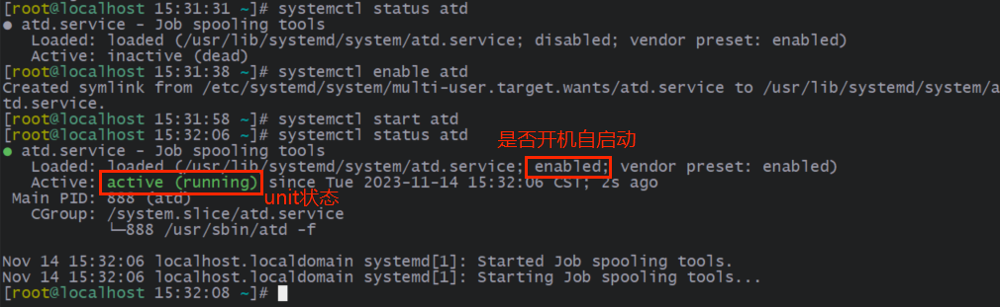

unit 有如下几种状态：

| 状态             | 说明                                                                          |
| ---------------- | ----------------------------------------------------------------------------- |
| active (running) | 服务正在运行                                                                  |
| active (exited)  | 仅运行一次就正常结束的服务，例如：开机或者是挂载时才会进行一次的 quotaon 功能 |
| active (waiting) | 服务正在运行，不过需要等待其他时间才能继续处理。例如：打印的队列相关服务      |
| inactive         | 服务没有运行                                                                  |

##### （2）查看

```shell
[root@study ~]# systemctl [list-units [--all]|list-unit-files] [--type=类型] unit
```

| 选项            | 说明                                                           |
| --------------- | -------------------------------------------------------------- |
| list-units      | 展示所有启动的 unit，加上 --all 选项才会展示未启动的，默认选项 |
| list-unit-files | 展示 `/usr/lib/systemd/system` 下的 unit 文件                  |
| --type=类型     | 展示的指定 unit 类型                                           |

```shell
# 展示已启动的、service 类型的 unit
[root@localhost 16:50:22 ~]# systemctl --type=service  <== 等同于 systemctl list-unit --type=service
  UNIT                               LOAD   ACTIVE SUB     DESCRIPTION
  atd.service                        loaded active running Job spooling tools
  auditd.service                     loaded active running Security Auditing Service
  ......
# UNIT：unit 名称
# LOAD：开机时是否会被载入，默认 systemctl 显示的是有载入的项目
# ACTIVE SUB：就是 unit 的状态
# DESCRIPTION：描述

# 展示 /usr/lib/systemd/system 下的 unit 文件
[root@localhost 16:50:22 ~]# systemctl list-unit-files
```

##### （3）切换

```shell
[root@study ~]# systemctl [get-default|set-default|isolate] [unit.target]
```

| 选项        | 说明                                                                                           |
| ----------- | ---------------------------------------------------------------------------------------------- |
| get-default | 获取当前 `/etc/systemd/system/default.target` 对应的链接文件，也就是启动时默认的 unit 服务     |
| set-default | 设置启动时默认的 unit 服务                                                                     |
| isolate     | 类似于 init 命令，用于切换运行级别，需要在 unit 脚本文件中添加 AllowIsolate=yes 字段才可以使用 |

```shell
# 查看默认的 default.target 的链接文件
[root@study ~]# systemctl get-default
graphical.target  <== 也就是图形界面

# 更改默认的 default.target
[root@study ~]# systemctl set-default multi-user.target
Removed symlink /etc/systemd/system/default.target.
Created symlink from /etc/systemd/system/default.target to /usr/lib/systemd/system/multi-user.target.

[root@study ~]# systemctl get-default
multi-user.target

# 切换当前 run level
[root@study ~]# systemctl isolate multi-user.target

[root@study ~]# systemctl isolate graphical.target
```

##### （4）依赖

```shell
[root@study ~]# systemctl list-dependencies [unit] [--reverse]
```

| 选项                     | 说明                                                   |
| ------------------------ | ------------------------------------------------------ |
| list-dependencies [unit] | 展示指定 unit 的依赖，unit 缺省时默认为 default.target |
| --reverse                | 反向追踪谁使用这个 unit                                |

##### （5）系统管理

```shell
[root@study ~]# systemctl 系统操作
```

| 系统操作  | 说明                                                                                                                                                                                   |
| --------- | -------------------------------------------------------------------------------------------------------------------------------------------------------------------------------------- |
| poweroff  | 关机                                                                                                                                                                                   |
| reboot    | 重启                                                                                                                                                                                   |
| suspend   | 暂停：**将系统的状态数据保存在内存中**，然后关闭大部分的系统硬件，并没有实际关机。当唤醒机器后，系统数据会从内存中恢复，然后重新驱动大部分关闭的硬件，然后正常运行。**唤醒的速度快。** |
| hibernate | 休眠（挂起）：**将系统的状态数据保存在硬盘中**，保存完毕后，将电脑关机。当唤醒机器后，系统会正常运行，然后将保存在硬盘中的系统状态数据恢复。**唤醒速度取决于硬盘速度。**               |
| rescue    | 强制进入救援模式                                                                                                                                                                       |
| emergency | 强制进入紧急救援模式                                                                                                                                                                   |

## 十、软件

### （一）软件编译

#### 1、gcc

gcc（GNU C Compiler）是 GNU 计划下的 C 语言编译器，工作流程如下：

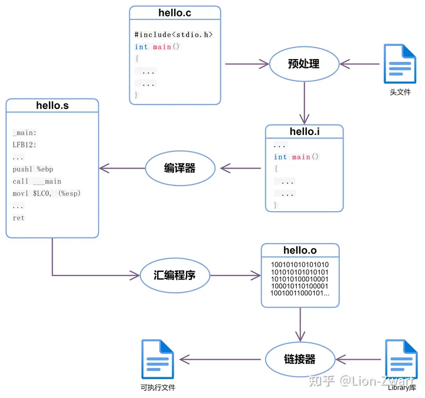

1. 预处理：将 .c 中的头文件展开、宏展开，生成的文件是 .i 临时文件。预处理操作过程不会进行语法检查。
2. 编译：进行语法检查等操作，最终生成汇编语言 .s 文件。
3. 汇编：将汇编文件转换成机器能识别的 .o 二进制文件。
4. 链接：由于源文件中可能包含对其它库的调用，链接将有关的目标文件彼此相链接，即在一个文件中引用的符号同该符号在另一个文件中的定义链接起来，最终生成 .out 或 .exe 可执行文件。

Linux 也提供 gcc 命令用于对 C 语言源文件进行编译：

```shell
[root@www ~]# gcc 源文件  <== 直接生成 C 语言文件的 .out 可执行文件，默认生成的可执行文件为 a.out
[root@www ~]# gcc -c 源文件 1 [源文件 2...]  <== 生成二进制文件
[root@www ~]# gcc -o 目标文件 二进制文件 1 [二进制文件 2...]  <== 生成可执行文件

```

| 选项                                       | 说明                                         |
| ------------------------------------------ | -------------------------------------------- |
| -c 源文件 1 [源文件 2...]                  | 生成 .o 二进制文件                           |
| -o 目标文件 二进制文件 1 [二进制文件 2...] | 生成指定文件的可执行文件                     |
| -Wall                                      | 产生更详细的编译过程信息                     |
| -O                                         | 在编译的时候，依据作业环境给予最佳化运行速度 |
| -I（大写的 i）                             | 后面接的是原始码内的 include 文件所在目录    |
| -l（小写的 L）                             | 添加某个函数库（library）                    |
| -L                                         | 添加的函数库所在目录                         |

```shell
[root@www ~]# gcc hello.c
[root@www ~]# ll hello.c a.out
-rwxr-xr-x 1 root root 4725 Jun  5 02:41 a.out   <== 此时会产生这个文件，文件名默认 a.out
-rw-r--r-- 1 root root   72 Jun  5 02:40 hello.c

# 生成 helloworld 可执行文件
[root@www ~]# gcc -o helloworld helloworld.o

# m 指的是 libm.so 函数库，其中 lib 与扩展名（.a 或 .so）可以省略
[root@www ~]# gcc sin.c -l m -L/usr/lib -I/usr/include
```

#### 2、make

像上面通过 gcc 进行编译的方式，当要编译的文件多起来时，就变得麻烦了：

```shell
# 1. 先进行原始文件的编译，最终会有四个 *.o 的文件名出现：
[root@www ~]# gcc -c main.c
[root@www ~]# gcc -c haha.c
[root@www ~]# gcc -c sin_value.c
[root@www ~]# gcc -c cos_value.c

# 2. 再进行连结成为可执行文件，并加入 libm 的数学函式，以产生 main 可执行文件：
[root@www ~]# gcc -o main main.o haha.o sin_value.o cos_value.o \
> -lm -L/usr/lib -L/lib

# 3. 本程序的运行结果，必须输入姓名、360 度角的角度值来计算：
[root@www ~]# ./main
```

如果改动了源码，又要重新编译一遍，很是麻烦。Linux 提供 make 巨集编译命令，先看一下操作：

```shell
# 1. 先编辑 makefile 这个配置文件，内容只要生成 main 这个可执行文件
[root@www ~]# vim makefile
main: main.o haha.o sin_value.o cos_value.o
  gcc -o main main.o haha.o sin_value.o cos_value.o -lm
# 注意：第二行的 gcc 之前是 <tab> 按键产生的缩进

# 2. 尝试使用 makefile 配置进行编译的行为：
[root@www ~]# rm -f main *.o   <== 先将之前的目标文件去除
[root@www ~]# make
cc    -c -o main.o main.c
cc    -c -o haha.o haha.c
cc    -c -o sin_value.o sin_value.c
cc    -c -o cos_value.o cos_value.c
gcc -o main main.o haha.o sin_value.o cos_value.o -lm
# 此时 make 会去读取 makefile 的内容，并根据内容直接去给他编译相关的文件
```

make 命令会在当前目录下查找 Makefile / makefile 文件，之后每次改动了源码，只需要执行 make 命令就行，有以下优点：

- 简化编译时所需要执行的命令。
- 若在编译完成后，修改了某个文件源码，make 只会针对被修改的文件进行编译，其他文件不会变动。

从上面的执行步骤可以看出，makefile 文件是执行 make 命令的关键，makefile 文件格式如下：

```shell
target名称1: （注意有空格）[目标文件1 [目标文件2 ...]]
  （注意前面是 tab 键的缩进）命令
target名称2: （注意有空格）[目标文件1 [目标文件2 ...]]
  （注意前面是 tab 键的缩进）命令

# 例如：
[root@www ~]# vi makefile
myMain: main.o haha.o sin_value.o cos_value.o
  gcc -o main main.o haha.o sin_value.o cos_value.o -lm
myClean:
  rm -f main main.o haha.o sin_value.o cos_value.o

# 执行：
[root@www ~]# make <== 不带 target 名称，则默认执行第一个 target 对应的命令

[root@www ~]# make myMain <== 执行指定 target 对应的命令

[root@www ~]# make myMain clean <== 执行多个 target 对应的命令
```

软件开发商一般都会提供一个检测脚本，通常脚本文件为 configure 或 config，执行后会进行以下检测操作：

- 是否有适合的编译器可以编译本软件的源码。
- 是否已经存在本软件所需要的函式库，或其他需要的相依软件。
- 操作系统平台是否适合本软件，包括 Linux 的核心版本。
- 核心的表头定义文件（header include）是否存在（驱动程序必须要的检测）。

在检测完毕后会创建 Makefile 文件，之后我们就可以通过 make 命令进行巨集编译了，整体流程如下：

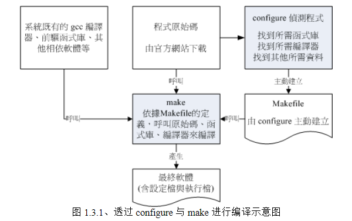

### （二）软件管理机制

**情景 1**：

上面通过厂商提供的软件源码包，我们自己需要监测操作系统与环境、配置编译参数、编译，整个流程十分复杂。

那有没有想过，如果我的 Linux 系统与厂商的系统一模一样，那么在厂商的系统上面编译出来的可执行文件，自然也就可以在我的系统上面运行。如果厂商提供这样的可执行文件，我们只需要直接下载可执行文件就可以直接运行。如果在安装的时候还可以加上一些与这些程序相关的信息，将它创建成为数据库，那不就可以进行安装、反安装、 升级与验证等等的相关功能？

**情景 2**：

继续上面想法的延伸，软件开发商先在固定的硬件平台与操作系统平台上面将需要安装或升级的软件编译好，然后将这个软件的所有相关文件打包成为一个特殊格式的文件，在这个软件文件内还包含了预先检测系统与依赖软件的脚本，并提供记载该软件提供的所有文件信息等，最终将这个软件文件发布。

用户端取得这个文件后，只要通过特定的命令来安装，那么该软件文件就会依照内部的脚本来检测依赖的前驱软件是否存在，若安装的环境符合需求，那就会开始安装，安装完成后还会将该软件信息写入软件管理机制中，以达成未来可以进行升级、移除等动作。

说白了，用户只想有个管理软件的东西，让用户能过简单的步骤，就可以管理（下载、更新、删除）和运行软件，什么监测环境、编译、依赖管理、软件放在哪里等操作，统统都不是用户考虑的。

---

根据上面的需求，Linux 中有两种主流的软件管理机制：

- **dpkg**：
  这个机制最早是由 Debian Linux 社群所开发出来的，通过 dpkg 的机制，Debian 提供的软件就能够简单的安装起来，同时还能提供安装后的软件信息，实在非常不错。**只要是衍生于 Debian 的其他 Linux distributions 大多使用 dpkg 这个机制来管理软件**，包括 B2D、Ubuntu 等等。
- **RPM**：
  这个机制最早是由 Red Hat 这家公司开发出来的，后来实在很好用，因此**很多 distributions 就使用这个机制来作为软件安装的管理方式**。包括 Fedora、CentOS、SuSE 等等知名的开发商都是用这咚咚。

#### 1、[RPM](https://linux.vbird.org/linux_basic/centos7/0520rpm_and_srpm.php#rpmmanager)

RPM（RedHat Package Manager）是以一种数据库记录的方式，来将你所需要的软件安装到你的 Linux 系统的一套软件管理机制。

RPM 先将你要安装的软件编译，再打包成 RPM 机制的包装文件（通常名称为 `*.rpm`）。当用户在自己 Linux 主机安装软件时，RPM 会检测当前 Linux 环境中是否有软件需要的依赖，如果没有则不安装；如果有则安装。**安装成功后会将该软件的信息整个写入 RPM 的数据库中，以便以后的查询、验证、更新与卸载**。

有以下优点：

- 由于软件已经经过编译，下载后就可以运行。
- 由于 RPM 记录着安装的软件信息，可以很方便地查询、验证、更新与卸载。
- 软件安装环境必须与打包时的环境一致或差不多。
- 需要满足软件的依赖属性需求，也就是安装前环境中必须有软件的依赖。
- 卸载时也需要特别小心，最底层的软件不可先移除，否则可能造成整个系统的问题。

由于 RPM 可以适用于不同的操作平台，但是不同的平台配置的参数还是有所差异，平台名称如下：

| 平台名称 | 适合平台说明                                                                                                                                                                            |
| -------- | --------------------------------------------------------------------------------------------------------------------------------------------------------------------------------------- |
| i386     | 几乎适用于所有的 x86 平台，不论是旧的 pentum 或者是新的 Intel Core 2 与 K8 系列的 CPU 等等，都可以正常的工作！那个 i 指的是 Intel 兼容的 CPU 的意思，至于 386 不用说，就是 CPU 的等级。 |
| x86_64   | 针对 64 位的 CPU 进行最佳化编译配置，包括 Intel 的 Core 2 以上等级 CPU ，以及 AMD 的 Athlon64 以后等级的 CPU ，都属于这一类型的硬件平台。                                               |
| noarch   | 就是没有任何硬件等级上的限制。一般来说，这种类型的 RPM 文件，里面应该没有 binary program 存在， 较常出现的就是属于 shell script 方面的软件。                                            |

##### （1）安装

```shell
[root@www ~]# rpm [-ivh] [--nodeps] [--force] [--test] [--prefix 新路径] RPM打包文件1 [RPM打包文件2...]
```

| 选项            | 说明                                                                                  |
| --------------- | ------------------------------------------------------------------------------------- |
| -i              | 安装软件                                                                              |
| -v              | 查看更细致的安装信息                                                                  |
| -h              | 以直方图的形式显示安装信息                                                            |
| --nodeps        | 忽略依赖属性，直接进行安装。<br/>注意：**不考虑依赖属性，可能导致软件无法正常使用**。 |
| --force         | 强制安装。不管是否已经安装软件，都重新安装。                                          |
| --test          | 测试安装。不会实际安装，只是检测一下依赖性。                                          |
| --prefix 新路径 | 不使用上面的系统默认路径，自定义软件的安装路径。                                      |

```shell
# 先进入 RPM 打包文件所在目录

# 安装 rp-pppoe-3.5-32.1.i386.rpm
[root@www ~]# rpm -ivh rp-pppoe-3.5-32.1.i386.rpm

# 一口气安装两个以上的软件时：
[root@www ~]# rpm -ivh a.i386.rpm b.i386.rpm

# 直接由网络上面的某个文件安装，以网址来安装：
[root@www ~]# rpm -ivh http://website.name/path/pkgname.rpm
```

通常情况下，RPM 包采用系统默认的安装路径，在安装完成后，所有安装文件会按照类别分散安装到下表所示的目录中：

| 安装路径        | 说明                       |
| :-------------- | :------------------------- |
| /etc/           | 配置文件安装目录           |
| /usr/bin/       | 可执行的命令安装目录       |
| /usr/lib/       | 程序所使用的函数库保存位置 |
| /usr/share/doc/ | 基本的软件使用手册保存位置 |
| /usr/share/man/ | man page 文件保存位置      |

同时该软件的相关信息会被写入 `/var/lib/rpm` 目录下的数据库文件中，之后的软件管理操作都是基于这些数据库文件。

##### （2）更新

```shell
[root@www ~]# rpm [-U|-F] [-vh] RPM打包文件
```

| 选项 | 说明                                                                           |
| ---- | ------------------------------------------------------------------------------ |
| -U   | **如果软件没有安装，则系统直接安装**；如果已经安装过旧版，则系统自动更新到新版 |
| -F   | **如果软件没有安装，则不会安装**；如果已经安装过旧版，则系统自动更新到新版     |

```shell
# 安装 24.3.4.14 版本的 erlang
[root@www ~]# rpm -ivh --nodeps erlang-24.3.4.14-1.el8.x86_64.rpm

# 更新到 25.3.2.7 版本
[root@www ~]# rpm -Fvh --nodeps erlang-25.3.2.7-1.el8.x86_64.rpm
```

##### （3）查询

```shell
[root@www ~]# rpm -qa                        <== 已安装软件
[root@www ~]# rpm -q[licdR] 已安装的软件名称   <== 已安装软件
[root@www ~]# rpm -qf 存在于系统上面的某个文件名  <== 已安装软件
[root@www ~]# rpm -qp[licdR] 未安装的某个文件  <== 在 RPM 打包文件中查询
```

| 选项       | 说明                                                                            |
| ---------- | ------------------------------------------------------------------------------- |
| -q         | 仅查询后面接的软件名称是否有安装                                                |
| -qa        | 列出所有的，已经安装在本机 Linux 系统上面的所有软件名称                         |
| -qi        | 列出该软件的详细资讯 (information)，包含开发商、版本与说明等                    |
| -ql        | 列出该软件所有的文件与目录所在完整文件名                                        |
| -qc        | 列出该软件的所有配置文件（找出在 /etc/ 底下的文件名而已）                       |
| -qd        | 列出该软件的所有说明文件（找出与 man 有关的文件而已）                           |
| -qR        | 列出与该软件有关的相依软件所含的文件 （Required 的意思）                        |
| -qf        | 由后面的文件，找出该文件属于哪一个已安装的软件                                  |
| -qp[icdlR] | 在 **RPM 打包**文件中进行操作，而**非已安装的软件**，icdlR 选项和上面作用一致。 |

```shell
# 查看已安装的 rabbitmq 的依赖
[root@www ~]# rpm -qR rabbitmq-server-3.10.10-1.el8.noarch

# 查看 RPM 打包文件中的 rabbitmq 的依赖
[root@www ~]# rpm -qpR rabbitmq-server-3.10.10-1.el8.noarch.rpm
```

##### （4）卸载

使用 -e 选项进行移除：

```shell
# 卸载 rabbitmq 软件
[root@www ~]# rpm -e rabbitmq-server-3.10.10-1.el8.noarch
```

> 注意：如果该软件被依赖，则不可以进行删除操作。

##### （5）重建数据库

由于 RPM 文件常常进行安装、移除、更新等操作，某些操作可能会导致 `/var/lib/rpm` 内的文件损坏，可以通过 --rebuilddb 选项重建数据库：

```shell
[root@www ~]# rpm --rebuilddb   <== 重建数据库
```

#### 2、SRPM

上面说了软件安装环境必须与打包时的环境一致，如果因为系统环境的问题，例如：在 CentOS 系统中打包的软件就不能直接安装到 SuSE 系统，不能安装 RPM 包装文件，但是又想通过 RPM 管理软件，那该怎么办？

于是有了 SRPM（Source RPM），**SRPM 所提供的软件内容并没有编译**，此外还提供了参数配置文件（configure 与 makefile），所以如果下载的是 SRPM 包装文件（通常名称为 `*.src.rpm` ），需要进行以下操作：

1. 先将该软件以 RPM 管理的方式编译，此时 SRPM 会被编译成 RPM 文件。由于我们可以自定义配置参数，因此就可以编译生成适合我们 Linux 环境的 RPM 文件。
2. 然后将编译完成的 RPM 文件安装到 Linux 系统中。

#### 3、YUM

前文提到 RPM 有所谓的属性依赖问题，那么有没有解决方法？想一想，如果我们在检测依赖时可以知道环境中有哪些缺少的依赖，并自动安装缺少的依赖，不就可以解决属性依赖的问题。

YUM（Yellow dog Updater, Modified）就是基于上面的思路实现的，**CentOS 将发布的 RPM 软件放置在 YUM 服务器内**，并将软件内的相关信息记录下来（header），最后将这些信息处理后生成软件依赖的清单列表，这些**列表数据与软件所在的位置就称为仓库（repository）**。

当用户通过 yum 命令下载软件时，用户端主机会主动获取 YUM 服务器中的清单列表，根据各软件的属性依赖制作出对应的解决方案，然后可以自动处理软件的相依属性问题，并安装所有依赖的软件：

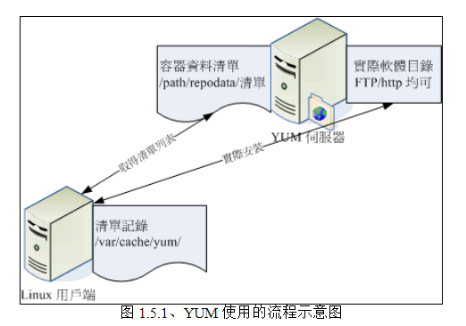

这种通过远程服务器解决属性依赖的机制称为**线上升级机制**。在应用上，基于 dpkg 管理机制就开发出 APT，RPM 则依开发商的不同，有 Red Hat 系统的 yum，SuSE 系统的 Yast Online Update (YOU)，Mandriva 的 urpmi 软件等。

##### （1）安装

```shell
[root@www ~]# yum install [-y] [--installroot=安装路径] 软件名
```

| 选项                   | 说明                                                       |
| ---------------------- | ---------------------------------------------------------- |
| -y                     | 当 yum 要等待使用者输入时，这个选项可以自动提供 yes 的回应 |
| --installroot=安装路径 | 将该软件安装在指定路径，而不使用默认路径                   |

```shell
# 安装 vim 软件
[root@www ~]# yum -y install vim
```

##### （2）更新

```shell
# 更新 vim 软件
[root@www ~]# yum -y update vim
```

##### （3）查询

```shell
[root@www ~]# yum [search|list|info|provides] [相关参数]
```

| 选项     | 说明                                                                  |
| -------- | --------------------------------------------------------------------- |
| search   | 搜寻某个软件名称或者是描述（description）的重要关键字                 |
| list     | 列出目前 yum 所管理的所有的软件名称与版本，有点类似 rpm -qa           |
| info     | 同上，不过有点类似 rpm -qai 的运行结果                                |
| provides | 由后面接的文件，找出该文件属于哪一个已安装的软件，类似 rpm -qf 的功能 |

```shell
# 查询 vim 软件
[root@www ~]# yum search vim

# 列出 yum 服务器上的所有软件
[root@www ~]# yum list

# 列出 yum 服务器上指定名称的、可安装的软件，例如查看 php 软件的情况
[root@www ~]# yum list php

# 列出可以更新的软件
[root@www ~]# yum list updates

# 列出所有安装的软件
[root@www ~]# yum list installed
```

##### （4）卸载

```shell
# 卸载 vim 软件
[root@www ~]# yum -y remove vim
```

##### （5）[配置文件](https://cloud.tencent.com/developer/article/1004756)

```shell
# 展示所有已配置的仓库
yum repolist all

# 展示所有已配置的、可用的仓库
yum repolist
```

yum 仓库配置文件位于 `/etc/yum.repos.d/` 目录下，名称为 `*.repo`（通常 CentOS-Base.repo 生效），当[自定义仓库配置](https://blog.csdn.net/qq_36393978/article/details/128074095)后，需要清理本机上的仓库缓存：

```shell
[root@www ~]# yum clean [packages|headers|all]
```

| 选项     | 说明                     |
| -------- | ------------------------ |
| packages | 将已下载的软件安装包删除 |
| headers  | 将下载的软件 header 删除 |
| all      | 将所有仓库数据都删除     |

```shell
# 清除仓库的所有数据
[root@www ~]# yum makecache

# 重新生成仓库的缓存数据
[root@www ~]# yum makecache
```

##### （6）群组管理

yum 命令除了可以对软件包进行查询、安装、升级和卸载外，还可完成对软件包组的查询、安装和卸载操作。

> 软件包组可以理解为：安装 360 安全大师软件时，同时也会推荐 360 浏览器、360 软件管家等，我们可以通过安装 360 软件群组的方式，一口气将上面软件全部安装。

```shell
[root@www ~]# yum [grouplist|groupinfo|groupinstall|groupremove] [软件群组名]
```

| 选项         | 说明                                                      |
| ------------ | --------------------------------------------------------- |
| grouplist    | 列出所有可使用的『套件组』，例如 Development Tools 之类的 |
| groupinfo    | 后面接 group_name，则可了解该 group 内含的所有套件名      |
| groupinstall | 可以安装一整组的套件群组                                  |
| groupremove  | 移除某个套件群组                                          |

## 十一、X Window

个人安装 Linux 系统作为日常使用时，在美编、排版、制图、多媒体应用上也是有其需求的，这些需求都需要用到图形界面（Graphical User Interface、GUI）的操作的，所以后来才有所谓的 X Window System。

X Window System 最早是由 MIT（Massachusetts Institute of Technology、麻省理工学院）提出并发布的，由 Xorg 基金会发布的 X11 就是在此基础上改良的，后续很多图形界面都是在 X11 基础上再次开发的。

### （一）主要组件

X Window System 是个非常大的架构，它是采用 C/S 架构，并且是能够跨网络和跨操作系统的，主要由 X Server 和 X Client 组成，架构如下：

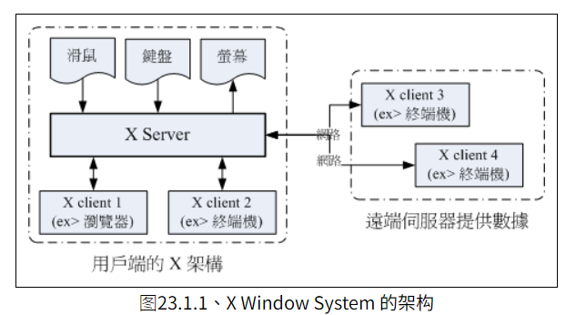

每部用户端主机都需要安装 X Server，而服务器端则是提供 X Client 软体， 以提供用户端绘图所需要的数据资料。采用 C/S 架构最大的好处是：X Client 不需要知道 X Server 的硬件设备与操作系统。因为 X Client 只是单纯地根据 X Server 端产生的动作生成图像资料而已，对于 X Server 怎么去展示图像资料，X Client 根本不需要知道。

> 注意：X Window System 中的 X Server 和 X Client 不同于一般网络架构的认知，X Server 是位于用户端，X Client 才是位于服务端。

#### 1、X Server

X Server 位于用户的主机，负责**管理输入/输出有关的硬件设备**，例如：键盘、鼠标、显示器及显卡等。

X Server 接收键盘、鼠标等输入设备的输入数据，并将这些数据发送给 X Client。X Server 本身并不知道这些输入动作会造成什么显示上的效果，只负责将这些动作告知 X Client，X Client 处理完后，再将结果返回给 X Server，X Server 再负责将图形绘制到屏幕上。

#### 2、X Client

X Client 负责处理 X Server 发送的输入动作，然后根据这个动作产生某个图像数据，最后将这个图像数据返回给 X Server，X Server 再根据 X Client 传来的图像数据将其绘制在屏幕上。

由于 X Client 的目的在产生图像数据，因此我们也称为 X Client 为 X Application（X 应用程式），常见的 X Client 有：xterm（终端界面）、xclock（时钟界面）等。

#### 3、X Window Manager

每个 X Client 并不知道其他 X Client 的存在，如果有两个以上的 X client 同时存在时，两者并不知道对方到底传了什么数据给 X Server， 因此 X Server 中多个 X Client 的图像常常会互相重叠。

为了解决这个问题，因此就有了 Window Manager（WM、窗口管理员），Window Manager 也是个 X Client，它主要负责全部的 X Client 的管理，还包括提供某些特殊的功能，例如：

- 提供许多的控制元素，包括工作列、背景桌面的设定等等。
- 管理虚拟桌面（virtual desktop）。
- 提供窗口控制参数，这包括窗口的大小、窗口的重叠显示、窗口的移动、窗口的最小化等等。

Window Manager 有许多种，每种 Window Manager 所使用的显示引擎都不太相同，所注重的方向也不一样， 因此我们才会说，在 Linux 底下，每套 Window Manager 都是独特存在的，不是换了桌面与显示效果而已，而是连显示引擎都不会一样，常见的 Window Manager 如下：

- [GNOME](http://www.gnome.org)（GNU Network Object Model Environment）
- [KDE](http://kde.org)（K Desktop Enviroment）
- [twm](http://xwinman.org/vtwm.php)（Tab Window Manager）
- [XFCE](http://www.xfce.org)（XForms Common Environment）

由于 Linux 越来越朝着 Desktop 桌面电脑方向发展，因此 Window Manager 的角色会越来越重要！目前我们 CentOS 默认提供的有 GNOME 与 KDE，这两个 Window Manager 上面还有提供非常多的 X Client 软件，包括输入法、浏览器、Office 等。

现在使用者想要接触 Linux 其实真的越来越简单了，如果不要架设服务器，那么 Linux 桌面的使用与 Windows 系统可以说是一模一样。

#### 4、Display Manager

Display Manager 最大的任务就是提供登录（login）的环境，并且载入使用者选择的 Window Manager 与语系等资料。

几乎所有大型的 Window Manager 都会提供 Display Manager，在 CentOS 上面我们主要利用的是 GNOME 的 gdm（GNOME Display Manager）这个程序来提供 tty7 的图形界面登录。

### （二）启动流程

启动 X Window System 是，必须要先启动管理硬件和绘图的 X Server，然后再加载 X Client。

> 现在基本上都是通过 Display Manager 提供的登录界面登录后获取 X Window System。

#### 1、startx

使用指定配置参数启动 X Window System。

```shell
[root@study ~]# startx [X client 参数] [-- X server 参数]
```

X Client 使用的配置：

1. 使用 startx 后面接的参数。
2. 若无参数，则找寻使用者家目录的文件，亦即 `~/.xinitrc`。
3. 若无上述两者，则以 `/etc/X11/xinit/xinitrc`。
4. 若无上述三者，则单纯执行 X 下的终端机软件 xterm，也就是在页面上会展示一个终端窗口。

X Server 使用的配置：

1. 使用 startx 后面接的参数。
2. 若无参数，则找寻使用者家目录的文件，亦即 `~/.xserverrc`。
3. 若无上述两者，则以 `/etc/X11/xinit/xserverrc`。
4. 若无上述三者，则单纯执行 X Server 执行 wenjian `/usr/bin/X`。

先获取上面的配置，根据上述的流程找到启动 X 时所需要的 X server / X client 的参数，接下来 startx 会去呼叫 xinit 这支程式来启动我们所需要的 X Window System。

##### （1）xserverrc 文件

X Server 先启动，由于 `~/.xinitrc` 与 `/etc/X11/xinit/xinitrc` 都不存在，最终会执行 `/usr/bin/X` 可执行文件，X 是 Xorg 的链接文件，Xorg 会去读取 `/etc/X11/xorg.conf` 配置文件。

##### （2）xinitrc 文件

由于 `~/.xserverrc` 不存在，最终会找到 `/etc/X11/xinit/xinitrc` 可执行文件，xinitrc 最终会载入 KDE 或者 GNOME

#### 2、xinit

startx 是个脚本文件命令，实际上是调用 xinit 实际启动 X。

```shell
[root@www ~]# xinit [client option] -- [server or display option]
```

单纯只是运行 xinit 的时候，系统的默认 X Client 与 X Server 的配置是这样的：

```shell
[root@www ~]# xinit

# 等同于
[root@www ~]# xinit xterm  -geometry  +1+1  -n  login  -display  :0 --  X  :0
```

而 startx 可以帮我们快速的找到这些配置参数而不必手动输入，因此**一般是使用 startx 而不是 xinit 命令**：

```shell
[root@www ~]# startx

# 由于部分配置文件不存在，startx 等同于
[root@www ~]# xinit /etc/X11/xinit/xinitrc -- /usr/bin/X
```

### （三）[display 与终端](https://www.cnblogs.com/lpfuture/p/6018363.html)

Linux 提供 tty1 ~ tty6 六个终端界面供用户使用，用户可以使用 **[Ctrl] + [Alt] + [F1]~[F6]** 的组合按钮进行切换，使用 ps 查看开启的终端进程：

```shell
[root@www ~]# ps -e | grep tty
```

> 注意：tty 进程只有使用时才会开启，平时只会开启 tty1 供用户登录。

在 X Server 中，一个 display 对应一个终端，通过 X 命令开启：

```shell
[root@www ~]# X :[display值] [参数]

# 展示在 0 号 display 上，retro 表示背景为斜纹
[root@www ~]# X :0 -retro
```

> X Window System 最有用的功能就是用户主机连接到服务器，通过远端的 X Client，将远端的界面展示在本机的 X Server 上，感兴趣可以自己深入了解。

---

## 跳过的章节（以后有机会使用时再补上）

[文件与目录的默认权限与隐藏权限](https://linux.vbird.org/linux_basic/centos7/0220filemanager.php#fileperm)

[认识 EXT2 文件系统](https://linux.vbird.org/linux_basic/centos7/0230filesystem.php)

[dump 备份和恢复文件系统](https://linux.vbird.org/linux_basic/centos7/0240tarcompress.php#dump_restore)

[mkisofs 和 cdrecord 光盘写入](https://linux.vbird.org/linux_basic/centos7/0240tarcompress.php#cd_record)

[dd 和 cpio 进行硬盘备份](https://linux.vbird.org/linux_basic/centos7/0240tarcompress.php#other)

[stty、set 终端机的快捷键配置](https://linux.vbird.org/linux_basic/centos7/0320bash.php#settings_set)

[ACL 的使用](https://linux.vbird.org/linux_basic/centos7/0410accountmanager.php#acl_talk)

[大量创建账号的方法](https://linux.vbird.org/linux_basic/centos7/0410accountmanager.php#manual)

[磁碟配额(Quota)与进阶档案系统管理](https://linux.vbird.org/linux_basic/centos7/0420quota.php)

[SUID 和 SGID](https://linux.vbird.org/linux_basic/centos7/0440processcontrol.php#special)

[SELinux 初探](https://linux.vbird.org/linux_basic/centos7/0440processcontrol.php#selinux)

[syslogd ：记录登录文件的服务](http://cn.linux.vbird.org/linux_basic/0570syslog_2.php#syslogd)

[Boot Loader: Grub2](https://linux.vbird.org/linux_basic/centos7/0510osloader.php#grub)

[开机过程的问题解决](https://linux.vbird.org/linux_basic/centos7/0510osloader.php#solution)

[动态函数库、静态函数库的管理](https://linux.vbird.org/linux_basic/centos7/0520source_code_and_tarball.php#library)

[Linux 核心编译与管理](https://linux.vbird.org/linux_basic/centos7/0540kernel.php)
