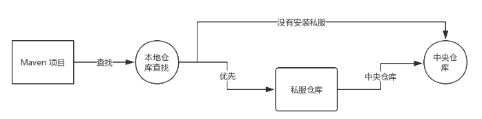

# Maven

> 基于《尚硅谷 Maven 教程》

## 一、基本概念

**情景 1**：

在学习 Maven 之前，我们肯定试过自己管理依赖：去对应的网站下载 jar 包，然后放入 lib 文件夹下，如果引入的 jar 包依赖其他的 jar 包，还得去下载对应的依赖。这个过程及其复杂且浪费时间，并且过多的依赖放在 lib 文件夹中，会造成我们的项目也及其臃肿。

于是，我们迫切需要一款能够管理 jar 包的工具。

---

Maven 是 Apache 基金会维护的一款专门为 Java 项目提供**构建和依赖管理**支持的工具。

- 依赖管理：对 jar 的统一管理，并且解决依赖的依赖问题。
- 项目管理：可以对项目进行编译、测试、打包、部署、上传到私服等操作。

### （一）Maven 仓库

在 Maven 中有**仓库**的概念，仓库用于存储 jar 包，分为三种：

- [中央仓库](https://mvnrepository.com/)：Maven 远程仓库，由 Apache 团队维护，包含了大部分的 jar 包。
- 私服仓库：Maven 远程仓库，一般由公司或私人搭建，处于局域网中，可以存放公司内部或私人开发的 jar 包。
- 本地仓库：Maven 本地仓库，在 Maven [安装配置](https://blog.csdn.net/huo920/article/details/82082403)后，通过 Maven 管理的依赖都会被放入本地仓库。

当我们在项目中添加完依赖的 Maven 坐标之后，Maven 会自动去查找依赖：



- Maven 在本地仓库查找是否有指定 jar 包，如果有就返回。
- 否则优先查找私服仓库，下载到本地仓库后返回；如果私服仓库没有找到，就从中央仓库下载到私服仓库，再从私服仓库下载到本地仓库。
- 如果没有私服仓库，则直接从中央仓库下载到本地仓库后返回。

### （二）Maven 坐标

Maven 使用 groupId、artifactId、version 三个坐标值，能够在 Maven 仓库中唯一定位到一个 jar 包。

- groupId：公司或组织的 ID。
- artifactId：一个项目或项目中一个模块的 ID。
- version：版本号，根据自己需要设定，不过命名也有含义：
  - SNAPSHOT：表示快照版本，正在迭代过程中，不稳定的版本。
  - RELEASE：表示正式版本。

Maven 坐标和 Maven 仓库中 jar 包的存储路径之间有对应关系，例如：

```xml
<groupId>javax.servlet</groupId>
<artifactId>servlet-api</artifactId>
<version>2.5</version>
```

对应 Maven 仓库中 jar 包的存储位置：`本地仓库根目录/javax/servlet/servlet-api/2.5/servlet-api-2.5.jar`。

### （三）Maven 项目

通过 Maven 管理的 Java Project 称为 Maven 项目，Maven 项目默认的目录结构如下：


## 二、[生命周期](https://segmentfault.com/a/1190000021364596)

### （一）概念

Maven 可以管理项目，**Maven 生命周期就是对项目管理构建过程的抽象**，包含三套**相互独立**的生命周期：

- Clean 生命周期：用于清理项目。
- Default 生命周期：用于构建项目。
- Site 生命周期：用于建立和发布项目站点。

Maven 生命周期有以下特点：

- 每个生命周期包含多个阶段，每个阶段就是一个 Maven 操作，用户和 Maven 最直接的交互就是调用这些生命周期。
- 这些阶段都是有序的，后面的阶段依赖于前面的阶段，**当执行某个阶段前，会先执行它前面的阶段**。

### （二）Clean 生命周期

clean 生命周期用于清理项目，它包含 3 个阶段：

| clean 生命周期阶段 | 说明                                                       |
| ------------------ | ---------------------------------------------------------- |
| pre-clean          | 执行一些 clean 前需要完成的工作                            |
| clean              | `mvn clean` 用于清理上一次构建生成的文件（即 target 目录） |
| post-clean         | 执行一些 clean 后需要完成的工作                            |

### （三）Site 生命周期

Site 生命周期的目的是建立和发布项目站点。Maven 能够基于 pom.xml 所包含的信息，自动生成一个友好的站点，方便团队交流和发布项目信息。包含以下 4 个阶段：

| site 生命周期阶段 | 说明                                     |
| ----------------- | ---------------------------------------- |
| pre-site          | 执行一些在生成项目站点之前需要完成的工作 |
| site              | 生成项目站点文档                         |
| post-site         | 执行一些在生成项目站点之后需要完成的工作 |
| site-deploy       | 将生成的项目站点发布到服务器上           |

### （四）Default 生命周期

Default 生命周期的目的是构建项目，它定义了真正构建时所需要完成的所有步骤，是所有生命周期中最核心的部分。主要包含以下阶段（[详细介绍](https://maven.apache.org/guides/introduction/introduction-to-the-lifecycle.html)）：

| default 生命周期阶段 | 说明                                                      |
| -------------------- | --------------------------------------------------------- |
| validate             | 验证项目是否正确并且所有必要信息都可用                    |
| compile              | 编译项目的源代码                                          |
| test-compile         | 编译测试源代码到测试目标目录                              |
| test                 | 使用合适的单元测试框架运行测试 , 测试代码不会被打包或部署 |
| package              | 将编译后的代码打包                                        |
| verify               | 运行任何检查以验证包是否有效并符合质量标准                |
| install              | 安装项目包到 Maven 本地仓库，供本地其他 Maven 项目使用    |
| deploy               | 将最终包复制到远程仓库，供其他开发人员和 Maven 项目使用   |

## 三、插件

Maven 的核心仅仅定义了抽象的生命周期，具体的实现交给插件完成。插件中的每个功能称作插件目标（Plugin Goal），每个插件中可能包含一个或者多个插件目标。

### （一）绑定

Maven **生命周期阶段**与**插件目标**相互绑定，以完成某个具体的操作。生命周期阶段与插件进行绑定后，可以通过 `mvn 阶段` 命令来执行和这个阶段绑定的插件目标。

#### 1、默认绑定

为了让用户几乎不用任何配置就能构建 Maven 项目，Maven 为一些主要的生命周期阶段绑定好了插件目标。

（1）**Clean 生命周期阶段**与插件目标的绑定关系：

| 生命周期阶段 | 插件目标                 |
| ------------ | ------------------------ |
| clean        | maven-clean-plugin:clean |

（2）**Default 生命周期阶段**与插件目标的绑定关系：

| default 生命周期阶段 | 插件目标                          |
| -------------------- | --------------------------------- |
| compile              | maven-compiler-plugin:compile     |
| test-compile         | maven-compiler-plugin:testCompile |
| test                 | maven-surefire-plugin:test        |
| package              | package                           |
| install              | maven-install-plugin:install      |
| deploy               | maven-deploy-plugin:deploy        |

（3）**Site 生命周期阶段**与插件目标的绑定关系：

| 生命周期阶段 | 插件目标                 |
| ------------ | ------------------------ |
| site         | maven-site-plugin:site   |
| site-deploy  | maven-site-plugin:deploy |

#### 2、自定义绑定

Maven 插件其本质还是 jar 包，我们我可以自己选择将某个插件目标绑定到生命周期的某个阶段上，使得 Maven 项目在构建过程中执行更多更富特色的任务。

```xml
<build>
    <plugins>
        <plugin>
            <groupId>org.apache.maven.plugins</groupId>
            <artifactId>maven-source-plugin</artifactId>
            <version>3.2.1</version>
            <executions>
                <execution>
                    <id>attach-sources</id>
                    <phase>verify</phase>
                    <goals>
                        <goal>jar-no-fork</goal>
                    </goals>
                </execution>
            </executions>
        </plugin>
    </plugins>
</build>
```

执行 `mvn verify` 命令时就会执行 jar-no-fork 这个插件目标。

### （二）Maven 命令

当我们通过命令调用生命周期阶段时，绑定的插件目标就会执行对应的任务：

#### 1、`mvn archetype:generate`

`mvn archetype:generate` 用于创建 Maven 项目（Project）。


> 注意：此命令可以在任意路径执行，下面的命令需要进入 Maven 项目路径下执行。

#### 2、`mvn dependency`

`mvn dependency` 可以查看当前项目的依赖信息。

```shell
# 以列表的形式展示
mvn dependency:list

# 以树状图的形式展示
mvn dependency:tree
```

#### 3、`mvn compile` 和 `mvn test-compile`

`mvn compile` 用于编译 main 目录下的程序，并将 main 的编译结果存在 `target/classes` 目录下。

`mvn test-compile` 用于编译 main 和 test 目录下的程序，并将 main 的编译结果存在 `target/classes` 目录下，test 的编译结果存在 `target/test-classes` 目录下。


#### 4、[`mvn test`](https://blog.csdn.net/u014454538/article/details/115286220)

`mvn test` 用于执行测试操作，默认使用的是 surefire 插件。surefire 插件在执行测试阶段的任务时，主动调用其他单元测试框架（如 Junit）来执行测试用例，测试报告存在 `target/surefire-reports` 目录下。

surefire 插件按照指定格式的类名来查找匹配的测试类，并执行内部的 @Test 方法：

```txt
<!-- 默认包含的测试类 -->
*/Test.java
*/TestCase.java

<!-- 默认排除的测试类 -->
*/AbstractTest.java
*/AbstractTestCase.java
```

我们也可以自定义配置，将 Test 目录中任意目录下的任意文件都看成测试类，在执行测试命令时都会默认检测所有文件：

```xml
<build>
    <plugins>
        <plugin>
            <groupId>org.apache.maven.plugins</groupId>
            <artifactId>maven-surefire-plugin</artifactId>
            <version>3.1.2</version>
            <configuration>
                <includes>
                    <!--<include>*\*\*\*Test.java</include>-->
                    <include>**\*</include>
                </includes>
            </configuration>
        </plugin>
    </plugins>
</build>
```

#### 5、`mvn package`

`mvn package` 用于将项目打包成 `<packaging>` 标签指定的类型，打包后的文件名称为 `${artifactId}-${version}`，存放在 target 目录下。

#### 6、`mvn install`

`mvn install` 用于将项目打包后的文件存入 Maven 本地仓库。

#### 7、`mvn deploy`

`mvn deploy` 用于将最终版本的包复制到远程仓库，使得其他的开发者或者工程可以共享。

## 四、POM 文件

POM（Project Object Model、项目对象模型）将 Java Project 的相关信息封装为对象模型，这样我们就可以用程序来操作和管理项目。POM 理念集中体现在 Maven 项目中的 pom.xml 配置文件文件中，pom.xml 中的标签说明如下：

### （一）POM 文件分类

#### 1、超级 POM

在通过 `mvn compile` 命令编译时，我们会发现编译后的文件默认存在 target 目录下，那为什么默认存在 target 目录下？我们能不能修改这个存储位置呢？其实这些配置在超级 POM（Super POM）文件中就定义过了。**超级 POM 是 Maven 的默认 POM，除非明显配置，否则所有 POM 都继承 Super POM。**

因此当没有 Maven 项目没有父项目时，POM 文件默认就继承了 Super POM，就相当于 Java 中的 Object 类。Super POM [详情请见](https://maven.apache.org/ref/3.0.4/maven-model-builder/super-pom.html)。

#### 2、父 POM

和 Java 类一样，POM 之间其实也是**单继承**的。如果我们给一个 POM 指定了父 POM，那么继承关系如下所示：


#### 3、有效 POM

在 POM 继承关系中，子 POM 可以覆盖父 POM 中的配置，如果子 POM 没有覆盖，那么父 POM 中的配置将会被继。按照这个规则，可以得到一个最终的 POM，Maven 实际运行过程中，执行构建操作就是按照这个最终生效的 POM 来运行的，**这个最终生效的 POM 就是有效 POM**。可以通过 Maven 命令查看有效 POM：

```shell
mvn help:effective-pom
```

### （二）基本标签

#### 1、`<project>`

主要是 Maven 的声明，表示对当前工程进行配置、管理。

```xml
<project xmlns="http://maven.apache.org/POM/4.0.0"
         xmlns:xsi="http://www.w3.org/2001/XMLSchema-instance"
         xsi:schemaLocation="http://maven.apache.org/POM/4.0.0 http://maven.apache.org/xsd/maven-4.0.0.xsd">
```

#### 2、`<modelVersion>`

表示当前 pom.xml 所采用的标签结构，从 Maven 2 开始值就固定是 4.0.0。

```xml
<modelVersion>4.0.0</modelVersion>
```

#### 3、`<packaging>`

通过 `mvn package` 命令对项目进行打包后生成的文件类型，有以下值：

- jar：生成 jar 包，说明是一个 Java 项目。
- war：生成 war 包，说明是一个 Java Web 项目。
- pom：说明此工程是用来管理其它工程的 Maven 项目。

```xml
<packaging>jar</packaging>
```

#### 4、`<properties>`

定义属性值，就相当于定义变量，在 POM 文件的其它地方就可以重复引用这些变量。

```xml
<properties>
    <mysql.version>5.1.49</mysql.version>
</properties>

<dependency>
    <groupId>mysql</groupId>
    <artifactId>mysql-connector-java</artifactId>
    <version>${mysql.version}</version>
</dependency>
```

#### 5、`<groupId>、<artifactId>、<version>`

Maven 项目的坐标

```xml
<!-- 如果子工程 groupId 和父工程一样，则可以省略 -->
<groupId>javax.servlet</groupId>
<artifactId>servlet-api</artifactId>
<!-- 如果子工程 version 和父工程一样，则可以省略 -->
<version>2.5</version>
```

#### 6、`<name>、<url>、<description>`

`<name>、<url>、<description>` 主要用于展示在 Maven 产生的文档中。

```xml
<!-- 项目的名称 -->
<name>maven-project</name>
<!-- 项目的 URL -->
<url>http://www.baidu.com</url>
<!-- 项目的描述 -->
<description>Demo project for Java</description>
```

### （三）多模块 Maven 项目

如果一个 Maven 项目很大、业务很多，我们可以将其拆分为多个子模块，这样每个模块只需负责自己的业务。例如：一个购物项目我们可以拆分为订单模块、账户模块、仓储模块，项目结构如下：


其中 Business 称为父模块，account、order、storage 称为子模块。

#### 1、`<parent>`

子模块中可以通过 `<parent>` 标签指定父模块的 Maven 坐标。

```xml
<parent>
    <artifactId>business</artifactId>
    <groupId>org.example</groupId>
    <version>1.0-SNAPSHOT</version>
</parent>
```

> 子模块可以继承父模块的 groupId、version、properties、dependencies、build 内部配置、dependencyManagement、pluginManagement 等。

#### 2、`<module>`

父模块通过 `<module>` 标签引入子模块，可以对子模块进行管理，例如：批量对子模块进行 install 安装、clean 清理等操作。

```XML
<modules>
    <module>order</module>
    <module>storage</module>
    <module>account</module>
</modules>
```

#### 3、`<dependencyManagement>`

`<dependencyManagement>` 标签用于统一管理子模块的 dependency 依赖版本，一般配置在父模块中，它并不会引入依赖，只是表示使用该依赖的 version 版本。当子模块通过 `<parent>` 标签继承父工程后，dependency 依赖不指定 `<version>` 的情况下，默认使用这里的 version 版本。

```XML
<!-- 父模块的 POM 文件 -->
<dependencyManagement>
    <dependencies>
        <dependency>
            <groupId>mysql</groupId>
            <artifactId>mysql-connector-java</artifactId>
            <version>${mysql.version}</version>
        </dependency>
    </dependencies>
</dependencyManagement>

<!-- 子模块的 POM 文件 -->
<dependency>
    <groupId>mysql</groupId>
    <artifactId>mysql-connector-java</artifactId>
</dependency>
```

### （四）dependency 依赖

#### 1、`<dependency>`

配置依赖的 Maven 坐标信息，配置后我们的 Maven 项目便会自动引入指定依赖。

```xml
<dependency>
    <groupId>mysql</groupId>
    <artifactId>mysql-connector-java</artifactId>
    <version>${mysql.version}</version>
</dependency>
```

#### 2、`<scope>`

为了避免依赖过于臃肿或者冲突，可以通过 `<scope>` 定义依赖的作用范围。

```xml
<dependency>
    <scope></scope>
</dependency>
```

|          | main 目录有效 | test 目录有效 | 编译时有效 | 测试时有效 | 运行时有效 | 打包时有效 | 例子                      |
| -------- | ------------- | ------------- | ---------- | ---------- | ---------- | ---------- | ------------------------- |
| compile  | √             | √             | √          | √          | √          | √          | spring-core               |
| test     | ×             | √             | ×          | √          | ×          | ×          | Junit                     |
| provided | √             | √             | √          | √          | ×          | ×          | servlet-api               |
| runtime  | ×             | √             | ×          | √          | √          | √          | JDBC 驱动实现             |
| system   | √             | √             | √          | √          | ×          | ×          | 本地 Maven 仓库之外的类库 |
| import   |               |               |            |            |            |            |                           |

- compile：默认值，依赖任何时候都有效。

- test：依赖只在测试时生效，并且不具有传递性。

- provided：依赖只在本地编译和测试时生效，并且不具有传递性。例如：服务器已提供 servlet-api 依赖，为了避免冲突，本地 servlet-api 并不会打到 war 包。

- runtime：依赖在测试、运行和打包时生效。

  - 例如：编译时只需要 JDBC 的 jar 包，而只有运行时才需要 JDBC 驱动实现（例如 mysql-connector-java 依赖）。

- system：system 与 provided 类似，不过依赖项不会从 Maven 仓库获取，而需要从本地文件系统提供，要配合 systemPath 属性一起使用。一般不推荐使用，尽量从 Maven 库中引用依赖。

- import：只能在 `<dependencyManagement>` 内的 `<dependency>` 中使用，从而引入指定依赖的 `<dependencyManagement>` 标签。

  - 例如：Father 父项目和 Son 子模块，我们可以在 Father 的 POM 文件中添加 `<parent>` 标签继承 spring-boot-starter-parent：

    ```xml
    <parent>
        <groupId>org.springframework.boot</groupId>
        <artifactId>spring-boot-starter-parent</artifactId>
        <version>2.0.1.BUILD-SNAPSHOT</version>
    </parent>
    ```

    这样我们就可以通过 spring-boot-starter-parent 项目内的 `<dependencyManagement>` 管理 Father 及 Son 项目中的依赖版本，**但是 Father 项目只能有一个 parent**，实际开发中，**用户很可能需要继承其他项目的 `<dependencyManagement>`**，这时就可以使用 import 来实现：

    ```xml
    <dependencyManagement>
            <dependencies>
                <!--spring boot 2.2.2-->
                <dependency>
                    <groupId>org.springframework.boot</groupId>
                    <artifactId>spring-boot-dependencies</artifactId>
                    <version>2.2.2.RELEASE</version>
                    <type>pom</type>
                    <scope>import</scope>
                </dependency>
                <!--spring cloud Hoxton.SR1-->
                <dependency>
                    <groupId>org.springframework.cloud</groupId>
                    <artifactId>spring-cloud-dependencies</artifactId>
                    <version>Hoxton.SR1</version>
                    <type>pom</type>
                    <scope>import</scope>
                </dependency>
        </dependencies>
    </dependencyManagement>
    ```

    此时，Father 就同时继承了 spring-boot-dependencies 和 spring-cloud-dependencies 的 `<dependencyManagement>`。

#### 3、`<exclusion>`

通过 Maven 管理依赖固然很方便，但是由于 Maven 会自动引入的**依赖的依赖**，而每个依赖的依赖版本可能发生版本不一致的情况，那么 Maven 项目以哪个版本的依赖为准呢？于是 Maven 提供版本仲裁机制：


当然我们可以手动通过 `<exclusion>` 标签排除指定依赖，让 Maven 项目只剩依赖的一个版本即可：

```xml
<dependency>
    <groupId>org.apache.curator</groupId>
    <artifactId>curator-framework</artifactId>
    <version>${curator-version}</version>
    <exclusions>
        <exclusion>
            <groupId>org.apache.zookeeper</groupId>
            <artifactId>zookeeper</artifactId>
        </exclusion>
    </exclusions>
</dependency>
<!-- Zookeeper 依赖 -->
<dependency>
    <groupId>org.apache.zookeeper</groupId>
    <artifactId>zookeeper</artifactId>
    <version>${zookeeper.version}</version>
</dependency>
```

#### 4、`<optional>`

通过 Maven 管理依赖时，Maven 会自动引入依赖的依赖，例如：A 依赖 B、B 依赖 C，当 A 引入 B 依赖时，也会自动引入依赖 C。

```xml
<!-- 项目 B -->
<dependency>
    <groupId>C</groupId>
    <artifactId>C</artifactId>
    <version>${version}</version>
</dependency>

<!-- 项目 A -->
<dependency>
    <groupId>B</groupId>
    <artifactId>B</artifactId>
    <version>${version}</version>
</dependency>
```

然而我们发现项目 A 中并没有使用依赖 C，如果把 C 引入未免也太多余了，并且如果项目 A 中有太多类似 C 这种没有用到的依赖，会导致最终打成的 jar/war 包过于臃肿。因此可以通过在项目 B 中将设置 `<optional>` 依赖可选，当值为 true 时，就表示该依赖不具有传递性。

```xml
<!-- 项目 B -->
<dependency>
    <groupId>C</groupId>
    <artifactId>C</artifactId>
    <version>${version}</version>
    <!-- 设置 optional 为 true -->
    <optional>true</optional>
</dependency>

<!-- 项目 A -->
<dependency>
    <groupId>B</groupId>
    <artifactId>B</artifactId>
    <version>${version}</version>
</dependency>
```

此时我们会发现在项目 A 中，只引入了依赖 B，并没有引入依赖 C。

#### 5、`<systemPath>`

当 `<scope>` 依赖范围值为 system 时，表示依赖项不会从 Maven 仓库获取，而需要从本地文件系统提供，通过 `<systemPath>` 指定路径。

```xml
<dependency>
    <groupId>sun.jdk</groupId>
    <artifactId>tools</artifactId>
    <version>1.5.0</version>
    <scope>system</scope>
    <systemPath>${java.home}/../lib/tools.jar</systemPath>
</dependency>
```

#### 6、`<type>`

表示依赖的类型（通常是依赖文件的扩展名），默认值为 jar。

```xml
<dependency>
    <groupId>mysql</groupId>
    <artifactId>mysql-connector-java</artifactId>
    <version>${mysql.version}</version>
    <type>jar</type>
</dependency>
```

### （五）`<build>` 构建配置

`<build>` 标签用于设置构建相关的配置，大致包含以下标签：

#### 1、约定的目录结构配置

在上面我们说过 Maven 项目有默认的结构，为什么是这个结构呢？为什么编译后文件存储在 target 目录呢？其实都是在 `<build>` 标签中进行配置，不过这些不用我们手动配置，在 Super POM 中已经默认配置。

```xml
<build>
    <!-- 源文件目录 -->
    <sourceDirectory>${project.basedir}\src\main\java</sourceDirectory>
    <resources>
      <resource>
        <directory>${project.basedir}\src\main\resources</directory>
      </resource>
    </resources>
    <testSourceDirectory>${project.basedir}\src\test\java</testSourceDirectory>
    <testResources>
      <testResource>
        <directory>${project.basedir}\src\test\resources</directory>
      </testResource>
    </testResources>

    <!-- 脚本源文件目录 -->
    <scriptSourceDirectory>${project.basedir}\src\main\scripts</scriptSourceDirectory>

    <!-- 目标文件目录 -->
    <directory>${project.basedir}\target</directory>
    <outputDirectory>${project.basedir}\target\classes</outputDirectory>
    <testOutputDirectory>${project.basedir}\target\test-classes</testOutputDirectory>
    <!-- 打包后生成的 jar/war 包名称 -->
    <finalName>${project.artifactId}-${project.version}</finalName>
</build>
```

##### （1）`<resource>`

`<resource>` 标签可以用于指定项目 resource 文件夹的位置。

```xml
<resources>
    <resource>
        <directory>${project.basedir}\src\main\resources</directory>
    </resource>
</resources>
<testResources>
    <testResource>
        <directory>${project.basedir}\src\test\resources</directory>
    </testResource>
</testResources>
```

`<resource>` 内部提供 `<include>` 和 `<exclude>` 标签，在编译的时候将指定资源文件**包含或排除**：

```xml
<resources>
    <resource>
        <directory>${project.basedir}\src\main\resources</directory>
        <includes>
            <!-- 编译时，将 resource 下的 properties 添加到 classpath 路径下 -->
            <include>*.properties</include>
        </includes>
        <excludes>
            <!-- 编译时，排除 happy.properties 这个资源文件，不将其添加到 classpath 路径下 -->
            <exclude>happy.properties</exclude>
        </excludes>
    </resource>
</resources>
```

`<resource>` 内部提供 `<filtering>` 标签，用于开启资源属性过滤功能，这样就可以在 Java 中使用 pom.xml 内 `<properties>` 的配置。

```xml
<properties>
    <jdbc.user>root</jdbc.user>
    <jdbc.password>root</jdbc.password>
    <jdbc.url>http://localhost:3306/db_good</jdbc.url>
    <jdbc.driver>com.mysql.jdbc.Driver</jdbc.driver>
</properties>
<build>
    <resources>
        <resource>
            <directory>${project.basedir}\src\main\resources</directory>
            <!-- 开启资源过滤功能，在 resources 的文件中就可以使用 properties -->
            <filtering>true</filtering>
        </resource>
    </resources>
</build>
```

在 resources 下的配置文件（例如 `src/main/resources/jdbc.properties`）中就可以使用 pom.xml 中的 `<properties>` 指定的属性：

```properties
jdbc.user=${jdbc.user}
jdbc.password=${jdbc.password}
jdbc.url=${jdbc.url}
jdbc.driver=${jdbc.driver}
```

#### 2、`<pluginManagement>`

和 `<dependencyManagement>` 标签类似，用于统一管理子模块的 plugin 插件的版本号。

> 这里省略了 `<groupId>org.apache.maven.plugins</groupId>`。

```xml
 <pluginManagement>
     <plugins>
         <plugin>
             <artifactId>maven-antrun-plugin</artifactId>
             <version>3.1.0</version>
         </plugin>
         <plugin>
             <artifactId>maven-assembly-plugin</artifactId>
             <version>3.6.0</version>
         </plugin>
         <plugin>
             <artifactId>maven-dependency-plugin</artifactId>
             <version>3.6.0</version>
         </plugin>
         <plugin>
             <artifactId>maven-release-plugin</artifactId>
             <version>3.0.1</version>
         </plugin>
     </plugins>
</pluginManagement>
```

#### 3、`<plugins>`

`<plugins>` 标签存放的是 Maven 项目可以使用的插件，Maven 提供一些默认插件，通过 `<execution>` 标签将插件目标与生命周期阶段进行绑定，这样执行指定生命周期阶段命令时，就会执行对应的插件目标。

```xml
 <plugin>
     <artifactId>maven-compiler-plugin</artifactId>
     <version>3.11.0</version>
     <executions>
         <execution>
             <id>default-compile</id>
             <!-- 生命周期阶段 -->
             <phase>compile</phase>
             <!-- 插件目标，一般情况下只会指定一个插件目标与生命周期阶段绑定 -->
             <goals>
                 <goal>compile</goal>
             </goals>
         </execution>
         <execution>
             <id>default-testCompile</id>
             <phase>test-compile</phase>
             <goals>
                 <goal>testCompile</goal>
             </goals>
         </execution>
     </executions>
</plugin>
```

我们还可以添加其他的 Maven 插件到当前项目中，这样就可以通过 Maven 命令执行指定插件目标，实现对应的功能，例如引入 spring-boot-maven-plugin 插件：

```xml
<build>
    <plugins>
        <plugin>
            <groupId>org.springframework.boot</groupId>
            <artifactId>spring-boot-maven-plugin</artifactId>
            <version>2.4.5</version>
        </plugin>
    </plugins>
</build>
```

执行下面命令，就可以将项目打包成可执行的 SpringBoot 项目 jar 包：

```shell
mvn clean package spring-cloud:repackage -Dmaven.test.skip=true
```

此外 `<plugin>` 内部还有一个 `<configuration>` 标签，可以对 plugin 插件进行一些配置：

```xml
<plugins>
    <plugin>
        <groupId>org.springframework.boot</groupId>
        <artifactId>spring-boot-maven-plugin</artifactId>
        <version>2.4.5</version>
        <configuration>
            <excludes>
                <exclude>
                    <groupId>org.projectlombok</groupId>
                    <artifactId>lombok</artifactId>
                </exclude>
            </excludes>
        </configuration>
    </plugin>
</plugins>
```

> 注意：`<configuration>` 标签内部的配置由插件本身决定的，并没有统一的格式。

### （六）profile 切换环境

在实际开发项目中，常常有几种环境，一般情况下最少有三种环境：**开发**、**测试**、**正式。**

各个环境之间的参数各不相同，比如 MySQL、Redis 等不同环境的 host 不一样，若每个环境都手动替换环境很容易出错，这里我们利用 Maven 的 profile 功能切换环境。

> 一般来说很少使用 profile 功能来切换环境，都是使用框架自己的功能来切换，例如 Nacos 配置中心。

**profile 有两种配置方式：**


- 在 Maven 软件的 setting.xml 配置文件中配置，全局生效。
- 在 Maven 项目的 pom.xml 配置文件中配置，局部生效。

#### 1、`<activation>`

`<activation>` 标签用于设置 profile 的激活条件。

```xml
<profile>
    <!-- profile 的唯一标志 -->
    <id>dev</id>
    <activation>
        <!-- profile 是否默认激活 -->
        <activeByDefault>false</activeByDefault>
        <jdk>1.5</jdk>
        <os>
            <name>Windows XP</name>
            <family>Windows</family>
            <arch>86</arch>
            <version>5.1.2600</version>
        </os>
        <property>
            <name>mavenVersion</name>
            <value>2.0.5</value>
        </property>
        <file>
            <exists>file2.properties</exists>
            <missing>file1.properties</missing>
        </file>
    </activation>
</profile>
```

> 注意：
>
> - Maven 3.2.2 之前：遇到第一个满足的条件即可激活——或。
> - Maven 3.2.2 开始：各条件都需要满足才可激活——且。

也可以通过 Maven 命令直接激活 profile：

```shell
# 列出所有激活的 profile，以及它们在哪里定义
mvn help:active-profiles

# 激活指定的 profile
mvn compile -P<profile的id>
```

内部还可以添加 build、modules、dependencies、dependencyManagement、properties 等标签，如果 profile 被激活，则这些标签内容会覆盖 pom.xml 中对应的标签内容。

#### 2、`<resource>`

`<profile>` 可以和 `<resource>` 标签结合，在该 profile 激活的时候，使用 `<properties>` 内的属性：

```xml
<properties>
    <jdbc.user>root</jdbc.user>
    <jdbc.password>root</jdbc.password>
    <jdbc.url>http://localhost:3306/db_good</jdbc.url>
    <jdbc.driver>com.mysql.jdbc.Driver</jdbc.driver>
</properties>
<profile>
    <id>dev</id>
    <build>
        <resources>
            <resource>
                <directory>${project.basedir}\src\main\resources</directory>
                <!-- 开启资源过滤功能，在 resources 的文件中就可以使用 properties -->
                <filtering>true</filtering>
            </resource>
        </resources>
    </build>
</profile>
```

## 五、Nexus 私服

Nexus 是一个强大的 Maven 仓库管理工具，使用 Nexus 可以方便的管理内部仓库（例如公司内部 jar 包的仓库）同时简化外部仓库的访问。

> Nexus [安装](https://download.sonatype.com/nexus/3/latest-unix.tar.gz)后直接 `nexus start` 就可以启动。

Nexus 内有几种仓库：

| 仓库名称        | 说明                                                                         |
| --------------- | ---------------------------------------------------------------------------- |
| maven-central   | Nexus 对 Maven 中央仓库的代理                                                |
| maven-public    | Nexus 默认创建，供开发人员下载使用的组仓库                                   |
| maven-release   | Nexus 默认创建，供开发人员部署自己 jar 包的宿主仓库，**要求 release 版本**   |
| maven-snapshots | Nexus 默认创建，供开发人员部署自己 jar 包的宿主仓库，**要求 snapshots 版本** |

### （一）通过 Nexus 下载依赖

在 setting.xml 中配置：

```xml
<mirror>
    <!-- 自定义 Nexus 仓库的 id，唯一 -->
    <id>nexus-mine</id>
    <mirrorOf>central</mirror>
    <name>Nexus mine</name>
    <url>http://192.168.190.134:8081/repository/maven-public</url>
</mirror>
```

如果禁止匿名访问，就还需要在 setting.xml 中配置账户密码：

```xml
<server>
    <id>nexus-mine</id>
    <username>admin</username>
    <password>admin</password>
</server>
```

> 注意：`<server>` 和 `<mirror>` 标签的 id 值需要一致。

### （二）将 jar 包部署到 Nexus

在 pom.xml 中配置：

```xml
<distributionManagement>
    <repository>
        <id>nexus-release</id>
        <name>Nexus Release</name>
        <url>http://192.168.190.134:8081/repository/maven-releases/</url>
    </repository>
    <snapshotRepository>
        <id>nexus-snapshots</id>
        <name>Nexus Snapshots</name>
        <url>http://192.168.190.134:8081/repository/maven-snapshots/</url>
    </snapshotRepository>
</distributionManagement>
```

如果禁止匿名访问，就还需要在 setting.xml 中配置账户密码：

```xml
<server>
    <id>nexus-release</id>
    <username>admin</username>
    <password>admin</password>
</server>
<server>
    <id>nexus-snapshots</id>
    <username>admin</username>
    <password>admin</password>
</server>
```

执行 `mvn deploy` 命令将项目部署到对应仓库。

### （三）引用其它仓库的依赖

在 setting.xml 添加的是 maven-public 仓库的访问配置，也可以在 pom.xml 中添加访问其他仓库的配置：

```xml
<repositories>
    <repository>
        <id>nexus-release</id>
        <name>Nexus Release</name>
        <url>http://192.168.190.134:8081/repository/maven-releases</url>
        <releases>
            <enabled>true</enabled>
        </releases>
        <snapshots>
            <enabled>true</enabled>
        </snapshots>
    </repository>
</repositories>
```

## 六、疑问

### （一）如何将外部的 jar 包导入到 Maven 仓库？

有时候我们可能会使用到某些冷门的、中央仓库没有提供的 jar 包，我们下载到本地后想通过 Maven 对这个 jar 包进行管理，可以执行下面的命令，将 jar 包添加到 Maven 仓库：

```shell
mvn install:install-file \
-Dfile=该jar包此时存储在本地的路径 \
-DgroudId=自定义该jar包的groupId \
-DartifactId=自定义该jar包的artifactId \
-Dversion=自定义该jar包的版本号 \
-Dpackaging=jar
```

例如将 outer.jar 添加到 Maven 仓库管理：

```shell
mvn install:install-file -Dfile=E:\outer.jar -DgroudId=com.example.study -DartifactId=my-outer -Dversion=1 -Dpackaging=jar
```

在 pom.xml 中使用：

```xml
<dependency>
    <groupId>com.example.study</groupId>
    <artifactId>my-outer</artifactId>
    <version>1</version>
</dependency>
```
