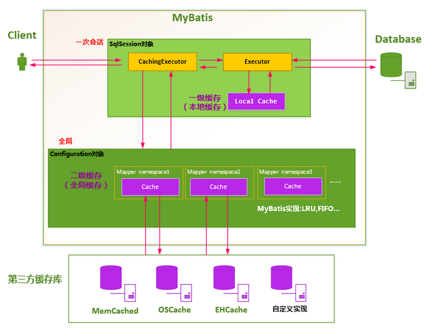

# MyBatis

> 基于《深入浅出 MyBatis 技术原理与实战》、[【官网】](https://mybatis.org/mybatis-3/zh_CN/index.html)

## 一、基本概念

[MyBatis](https://mybatis.org/mybatis-3/) 是一个优秀的半自动 ORM（Object Relation Mapping、对象关系映射）框架。

MyBatis 对 JDBC 操作数据库的过程进行封装，使开发者只需要关注 SQL 本身，而不需要花费精力去处理例如注册驱动、创建 connection、创建 statement、手动设置参数、结果集检索等 jdbc 繁杂的过程代码。

> 半自动 ORM 框架意思是：需要自己手动将**关系**型数据库 SQL 语句查询的结果和 POJO 类**对象映射**起来（需要手动指定 POJO 类去接收结果集）。
>
> 背景：MyBatis 本是 Apache 的一个开源项目——iBatis，2010 年迁移到 Google Code，并改名为 MyBatis，2013 年迁移到 github。

## 二、MyBatis 核心组件

MyBatis 中提供以下核心组件：


- SqlSessionFactoryBuilder：SqlSessionFactoryBuilder 使用构造器模式，通过 XML 配置文件或一个预先配置的 Configuration 实例来构建出 SqlSessionFactory 实例。
- SqlSessionFactory：SqlSessionFactory 使用工厂模式，用于创建 SqlSession 对象实例。
- SqlSession：SqlSession 类似于 JDBC 中的一个 Connection 连接，对外提供了用户和数据库之间交互需要的所有方法，隐藏了底层的细节。
- Mapper：Mapper 是 MyBatis 中用于定义 SQL 语句和数据操作的接口，它通过 Java 接口定义了对数据库的操作，可以将数据操作从具体的实现中解耦，提高代码的可维护性和可扩展性。

### （一）<font color="orange">SqlSessionFactory</font>

SqlSessionFactory 使用工厂模式，用于创建 SqlSession 对象实例。

> 注意：SqlSessionFactory 创建和销毁都比较重量级，因此建议使用单例模式。

MyBatis 中提供[两种构建 SqlSessionFactory 的方式](https://blog.csdn.net/zy12306/article/details/84260956)：

#### 1、基于 XML 配置文件

添加 mybatis-config.xml 配置文件：

```xml
<configuration>
    <!-- MySQL 数据库连接配置 -->
    <environments default="development">
        <environment id="development">
            <!-- 使用 JDBC 事务管理 -->
            <transactionManager type="JDBC"/>
            <!-- 数据库连接池 -->
            <dataSource type="POOLED">
                <property name="driver" value="com.mysql.jdbc.Driver"/>
                <property name="url"
                          value="jdbc:mysql://192.168.190.134:3306/study_notes?useUnicode=true&amp;characterEncoding=utf-8&amp;useSSL=false&amp;serverTimezone=Asia/Shanghai&amp;autoReconnect=true"/>
                <property name="username" value="root"/>
                <property name="password" value="W110514"/>
            </dataSource>
        </environment>
    </environments>

    <!-- 加载 Mapper 映射文件 -->
    <mappers>
        <!-- 加载单个 XML 映射文件 -->
        <mapper resource="mapper/UserDao.xml"/>
        <!-- 加载单个注解映射接口，如果没有使用 XML 方式，而是使用 @Select 这样的注解方式，就需要通过 class 属性加载 -->
        <mapper class="com.studynotes.demo01_base.dao.AnnotationUserDao"/>
    </mappers>
</configuration>
```

使用配置文件方式构建 SqlSessionFactory：

```java
@SneakyThrows
public static SqlSessionFactory getSqlSessionFactory() {
    Reader resourceAsReader = Resources.getResourceAsReader("mybatis-config.xml");

    // 构建 SqlSessionFactory
    sqlSessionFactory = new SqlSessionFactoryBuilder().build(resourceAsReader);
    return sqlSessionFactory;
}
```

#### 2、基于编码方式

通过一个预先配置的 Configuration 实例来构建出 SqlSessionFactory 实例：

```java
public static SqlSessionFactory getSqlSessionFactory2() {
    // 构建 Configuration
    Configuration configuration = new Configuration();

    // 使用 JDBC 事务管理
    TransactionFactory transactionFactory = new JdbcTransactionFactory();
    // 数据库连接池
    PooledDataSource dataSource = new PooledDataSource();
    dataSource.setDriver(CommonConstants.MYSQL_DRIVER);
    dataSource.setUrl(CommonConstants.MYSQL_URL);
    dataSource.setUsername(CommonConstants.MYSQL_USERNAME);
    dataSource.setPassword(CommonConstants.MYSQL_PASSWORD);
    // MySQL 数据库连接配置
    Environment environment = new Environment("development", transactionFactory, dataSource);
    configuration.setEnvironment(environment);

    // 加载单个注解映射接口
    configuration.addMapper(AnnotationUserDao.class);

    // 构建 SqlSessionFactory
    sqlSessionFactory = new SqlSessionFactoryBuilder().build(configuration);
    return sqlSessionFactory;
}
```

### （三）<font color="orange">SqlSession</font>

SqlSession 类似于 JDBC 中的一个 Connection 连接，有以下特点：

- SqlSession 的生命周期非常短，每次数据库操作都应该获取一个新的 SqlSession 对象。
- SqlSession 对象不是线程安全的，不能被共享，所以不能将 SqlSession 对象作为类的成员变量，需要时再创建。
- SqlSession 提供了对数据库的增删改查方法，以及获取 Mapper 映射器、提交事务、回滚事务、关闭连接等方法。

```java
@Test
public void test1() {
    SqlSessionFactory sqlSessionFactory = Demo01_SqlSessionFactory.getSqlSessionFactory1();
    SqlSession sqlSession = sqlSessionFactory.openSession();
    try {
        UserDao userDao = sqlSession.getMapper(UserDao.class);
        User user = userDao.queryById(1L);
        log.info("user:{}", user);
        // 提交事务，如果 openSession() 时传入 true，则会自动提交事务，不需要手动提交
        sqlSession.commit();
    } catch (Exception e) {
        e.printStackTrace();
        sqlSession.rollback();
    } finally {
        // 使用完需要将 SqlSession 连接关闭，放回连接池中
        sqlSession.close();
    }
}

@Test
public void test2() {
    SqlSessionFactory sqlSessionFactory = Demo01_SqlSessionFactory.getSqlSessionFactory2();
    // openSession(true) 自动提交事务
    try (SqlSession sqlSession = sqlSessionFactory.openSession(true)) {
        AnnotationUserDao userDao = sqlSession.getMapper(AnnotationUserDao.class);
        User user = userDao.queryById(1L);
        log.info("user:{}", user);
    }
}
```

### （四）Mapper

Mapper 是 MyBatis 中用于定义 SQL 语句和数据操作的接口，它通过 Java 接口定义了对数据库的操作，可以将数据操作从具体的实现中解耦，提高代码的可维护性和可扩展性。

我们可以通过自定义 Mapper 来实现自己的业务逻辑，有两种定义 Mapper 的方式：

#### 1、基于 XML 配置文件

MyBatis 提供动态 Mapper 方式，同时需要自定义 Java 接口和 XML 配置文件来实现。XML 配置文件有以下注意点：

- XML 配置文件名称和 Java 接口名称相同。
- `<mapper>` 标签的 namespace 属性 和 Java 接口全限定名相同
- 增删改查标签的 id 属性和接口中方法名相同。

添加 Java 接口，定义对数据库的操作：

```java
public interface UserDao {

    /**
     * 通过ID查询单条数据
     */
    User queryById(Long userId);
}
```

添加 XML 配置文件，定义需要执行的 SQL 语句：

```xml
<!-- namespace 属性 和 Java 接口全限定名相同 -->
<mapper namespace="com.studynotes.demo01_base.dao.UserDao">

    <resultMap type="com.studynotes.demo01_base.entity.User" id="UserMap">
        <result property="userId" column="user_id" jdbcType="INTEGER"/>
        <result property="userName" column="user_name" jdbcType="VARCHAR"/>
        <result property="age" column="age" jdbcType="INTEGER"/>
    </resultMap>

    <!-- 增删改查标签的 id 属性和接口中方法名相同 -->
    <select id="queryById" resultMap="UserMap">
        select user_id,
               user_name,
               age
        from study_notes.user
        where user_id = #{userId}
    </select>
</mapper>
```

修改 mybatis-config.xml 配置文件：

```xml
<!-- 加载 Mapper 映射文件 -->
<mappers>
    <!-- 加载单个 XML 映射文件 -->
    <mapper resource="mapper/UserDao.xml"/>
</mappers>
```

#### 2、[基于注解方式](https://mybatis.org/mybatis-3/zh_CN/java-api.html)

MyBatis 提供 @Select、@Delete、@Insert、@Update 等注解，作用等同于 Mapper 的 XML 配置文件中对应的标签，这种方式不需要 XML 配置文件。

> 基于注解的方式就**不需要添加 Mapper 的 XML 配置文件**，但是使用 XML 配置文件方式更加灵活、清晰，一般推荐使用 XML 配置文件方式。

```java
public interface AnnotationUserDao {

    /**
     * 通过ID查询单条数据，和 {@link UserDao#queryById(Long)} 效果一样，
     * UserDao 使用 XML 配置文件方式；AnnotationUserDao 使用注解方式
     *
     * @param userId 主键
     * @return 实例对象
     */
    @Select("select user_id as userId, user_name as userName, age\n" +
            "        from study_notes.user\n" +
            "        where user_id = #{userId}")
    User queryById(@Param("userId") Long userId);
}
```

修改 mybatis-config.xml 配置文件：

```xml
<!-- 加载 Mapper 映射文件 -->
<mappers>
    <!-- 加载单个注解映射接口，如果没有使用 XML 方式，而是使用 @Select 这样的注解方式，就需要通过 class 属性加载 -->
    <mapper class="com.studynotes.demo01_base.dao.AnnotationUserDao"/>
</mappers>
```

## 三、[MyBatis 配置文件参数](https://mybatis.org/mybatis-3/zh_CN/configuration.html)

MyBatis 的配置文件（即 mybatis-config.xml）中提供以下配置参数：

### （一）`<settings>`

MyBatis 的全局配置，主要有以下属性属性：

- autoMappingBehavior：自动映射，自动将结果集绑定 POJO 类。值有三种：
  - NONE：表示关闭自动映射。
  - PARTIAL：默认值，只会自动映射没有定义嵌套结果映射的字段，即八种基本类型。
  - FULL：会自动映射任何复杂的结果集（无论是否嵌套），性能较低。
- mapUnderscoreToCamelCase：默认 false，为 true 时可以自动将数据表中下划线式的列名对应 POJO 中驼峰式的属性名，例如：my_name 对应 myName。
- lazyLoadingEnabled：默认 false，为 true 表示开启延迟加载。
- aggressiveLazyLoading：默认为 false （在 3.4.1 及之前的版本中默认为 true），为 true 时，任一方法的调用都会加载该对象的所有延迟加载属性；为 false 时，每个延迟加载属性会按需加载。
- localCacheScope：本地缓存的模式，有两个值：
  - SESSION：默认值，开启一级缓存，缓存一个 SqlSession 中执行的所有查询。
  - STATEMENT：本地缓存仅用于此次查询语句，查询完成后便清空此 SqlSession 中的所有缓存。
- cacheEnabled：为 true 开启二级缓存。

```xml
<settings>
    <setting name="autoMappingBehavior" value="PARTIAL" />
    <setting name="mapUnderscoreToCamelCase" value="false" />
</settings>
```

### （二）`<typeAliases>`

当类的全限定名过长时，`<typeAliases>` 标签可以为其指定一个别名，在 MyBatis 上下文中使用（例如：ResultType 中）别名。

> 注意：别名不区分大小写。

#### 1、系统定义 TypeAlias

MyBatis 提供的别名，在 `org.apache.ibatis.type.TypeAliasRegistry` 中查看。

#### 2、自定义 TypeAlias

##### （1）基于 XML 配置文件

```xml
<!-- 为 Java 类设置别名 -->
<typeAliases>
    <!-- 第一种方式：为指定 Java 类设置别名 -->
    <typeAlias type="com.studynotes.demo04_config.entity.User" alias="user"/>
</typeAliases>
```

##### （2）基于 @Alias 注解

先配置自动扫描包，再在对应类上添加@Alias 注解。

```xml
<!-- 为 Java 类设置别名 -->
<typeAliases>
    <!-- 第二种方式：扫描指定包下被 @Alias 注解的 Java 类 -->
    <package name="com.studynotes.demo04_config.entity"/>
</typeAliases>
```

```java
@Alias("userAnnotation")
public class User {

}
```

### （三）`<typeHandlers>`

传参给 PreparedStatement 或从 SQL 结果获取返回值时，会使用 TypeHandler 对 Java 的 POJO 字段类型（javaType）和 JDBC 类型（jdbcType）进行映射。

#### 1、系统定义 TypeHandler

MyBatis 提供的 TypeHandler，在 `org.apache.ibatis.type.TypeHandlerRegistry` 查看。

#### 2、自定义 TypeHandler

当系统定义的 TypeHandler 不满足需求时，可以实现 TypeHandler 接口进行自定义：

```java
// 匹配指定的 Java 类型
@MappedTypes(String.class)
// 匹配指定的 JdbcType 枚举类型
@MappedJdbcTypes(JdbcType.VARCHAR)
@Slf4j
public class Demo03_TypeHandler implements TypeHandler<String> {

    @Override
    public void setParameter(PreparedStatement preparedStatement, int i, String s, JdbcType jdbcType) throws SQLException {
        log.info("使用我的 TypeHandler");
        preparedStatement.setString(i, s);
    }

    @Override
    public String getResult(ResultSet resultSet, String s) throws SQLException {
        log.info("使用我的 TypeHandler，ResultSet 通过列名获取字符串");
        return resultSet.getString(s);
    }

    @Override
    public String getResult(ResultSet resultSet, int i) throws SQLException {
        log.info("使用我的 TypeHandler，ResultSet 通过下标获取字符串");
        return resultSet.getString(i);
    }

    @Override
    public String getResult(CallableStatement callableStatement, int i) throws SQLException {
        log.info("使用我的 TypeHandler，CallableStatement 通过下标获取字符串");
        return callableStatement.getString(i);
    }
}
```

在 mybatis-config.xml 配置文件中的 `<typeHandlers>` 标签中进行全局配置：

（1）直接注册

```xml
<typeHandlers>
    <!-- 没有使用 @MappedTypes、@MappedJdbcTypes 注解时，需要在使用时添加 jdbcType 和 javaType 属性 -->
    <!-- <typeHandler jdbcType="VARCHAR" javaType="string" handler="com.studynotes.demo04_config.Demo03_TypeHandler" /> -->

    <!-- 使用 @MappedTypes、@MappedJdbcTypes 注解时，可以不用写 jdbcType 和 javaType  -->
    <typeHandler handler="com.studynotes.demo04_config.Demo03_TypeHandler" />
</typeHandlers>
```

（2）通过包扫描注册

```xml
<typeHandlers>
    <package name="com.studynotes.demo04_config" />
</typeHandlers>
```

配置完自定义的 TypeHandler 后，有两种使用方法：

> 注意：只有 jdbcType、javaType 和自定义 TypeHandler 的一致时才生效

（1）在 ResultMap 的列属性中使用

```xml
<!-- user 为 com.studynotes.demo04_config.entity.User 别名 -->
<resultMap type="user" id="UserMap">
    <result property="userId" column="user_id" jdbcType="INTEGER"/>
    <!-- 使用自定义类型处理器，处理 varchar 和 String 的转换 -->
    <result property="userName" column="user_name" typeHandler="com.studynotes.demo04_config.Demo03_TypeHandler"/>
    <result property="age" column="age" jdbcType="INTEGER"/>
</resultMap>
```

（2）在 SQL 语句的参数中使用

```xml
<select id="findRole" parameterType="string" resultMap="roleMap">
    select * from t_role
    where role_name like concat('%',
    #{roleName javaType=string, jdbcType=VARCHAR, typeHandler=com.studynotes.demo04_config.Demo03_TypeHandler}
    , '%')
</select>
```

#### 3、枚举类型 TypeHandler

MyBatis 内部提供两个转化枚举类型的 TypeHandler，可以将整型或字符串类型映射为枚举类型：

- EnumOridinalTypeHandler：将 jdbcType 的整型和枚举类型进行转化。

  > 注意：数据库中存储的是枚举类型对应的下标值，例如：枚举类 `SexEnum.values()` 返回枚举数组，枚举类 `SexEnum.MALE` 在数据库中存储的是此枚举类在枚举数据中对应的下标值。

- EnumTypeHandler：将 jdbcType 的字符串类型和枚举类型进行转化。

  > 注意：数据库中存储的是枚举类型对应的枚举名称，例如：枚举类 `SexEnum.MALE` 在数据库中存储的是字符串 `MALE`。

```java
// 枚举类例子：
public enum SexEnum {
    MALE(1, "male"), FEMALE(2, "female");

    // 注意：这里的 id、name 只是枚举类附带的信息，和数据库中存储的数据毫无任何关系
    private int id;

    private String name;

    SexEnum(int id, String name) {
        this.id = id;
        this.name = name;
    }
}
```

##### （1）EnumOridinalTypeHandler

注册 EnumOridinalTypeHandler 后就可以直接使用：

```xml
<typeHandlers>
    <typeHandler handler="org.apache.ibatis.type.EnumOridinalTypeHandler" javaType="com.stydunotes.mybatis.SexEnum"/>
</typeHandlers>
```

```xml
<resultMap type="com.studynotes.mybatis.Role" id="RoleMap">
    <result property="id" column="id" jdbcType="INTEGER"/>
    <result property="roleName" column="role_name" jdbcType="VARCHAR"/>
    <result property="age" column="age" jdbcType="TINYINT"/>
    <!-- 数据库表的 sex 列属性为 TINYINT，映射的 POJO 的 sex 字段类型为 SexEnum -->
    <result property="sex" column="sex" typeHandler="org.apache.ibatis.type.EnumOridinalTypeHandler"/>
</resultMap>
```

##### （2）EnumTypeHandler

```xml
<typeHandlers>
    <typeHandler handler="org.apache.ibatis.type.EnumTypeHandler" javaType="com.stydunotes.mybatis.SexEnum"/>
</typeHandlers>
```

```xml
<resultMap type="com.studynotes.mybatis.Role" id="RoleMap">
    <result property="id" column="id" jdbcType="INTEGER"/>
    <result property="roleName" column="role_name" jdbcType="VARCHAR"/>
    <result property="age" column="age" jdbcType="TINYINT"/>
    <!-- 数据库表的 sex 列属性为 CHAR，映射的 POJO 的 sex 字段类型为 SexEnum -->
    <result property="sex" column="sex" typeHandler="org.apache.ibatis.type.EnumOridinalTypeHandler"/>
</resultMap>
```

##### （3）自定义枚举类型 TypeHandler

自定义枚举类型 TypeHandler，和 EnumOridinalTypeHandler 一样的功能：

```java
// 枚举类例子：
public enum SexEnum {
    MALE(1, "male"), FEMALE(2, "female");

    // 注意：这里的 id、name 只是枚举类附带的信息，和数据库中存储的数据毫无任何关系
    private int id;

    private String name;

    SexEnum(int id, String name) {
        this.id = id;
        this.name = name;
    }

    public static SexEnum getSexEnum(int id) {
        if(id == 1) {
            return MALE;
        } else if (id == 2) {
            return FEMALE;
        }
        return null;
    }
}
```

```java
public class MyEnumTypeHandler implements TypeHandler<SexEnum> {

    @Override
    public void setParameter(PreparedStatement preparedStatement, int i, SexEnum sexEnum, JdbcType jdbcType) throws SQLException {
        preparedStatement.setInt(i, sexEnum.getId());
    }

    @Override
    public SexEnum getResult(ResultSet resultSet, String s) throws SQLException {
        int id = resultSet.getInt(s);
        return SexEnum.getSexEnum(id);
    }

    @Override
    public SexEnum getResult(ResultSet resultSet, int i) throws SQLException {
        int id = resultSet.getInt(i);
        return SexEnum.getSexEnum(id);
    }

    @Override
    public SexEnum getResult(CallableStatement callableStatement, int i) throws SQLException {
        int id = callableStatement.getInt(i);
        return SexEnum.getSexEnum(id);
    }
}
```

在 mybatis-config.xml 添加 MyEnumTypeHandler 配置：

```xml
<typeHandlers>
    <typeHandler handler="com.stydunotes.mybatis.MyEnumTypeHandler" javaType="com.stydunotes.mybatis.SexEnum"/>
</typeHandlers>
```

在 Mapper 的 XML 配置文件中使用：

```xml
<resultMap type="com.studynotes.mybatis.Role" id="RoleMap">
    <result property="id" column="id" jdbcType="INTEGER"/>
    <result property="roleName" column="role_name" jdbcType="VARCHAR"/>
    <result property="age" column="age" jdbcType="TINYINT"/>
    <!-- 数据库表的 sex 列属性为 TINYINT，映射的 POJO 的 sex 字段类型为 SexEnum -->
    <result property="sex" column="sex" typeHandler="org.apache.ibatis.type.EnumOridinalTypeHandler"/>
</resultMap>
```

### （四）`<objectFactory>`

每次 MyBatis 创建结果对象的新实例时，它都会使用一个对象工厂（ObjectFactory）实例来完成实例化工作。

#### 1、系统定义 ObjectFactory

系统默认提供并使用 `org.apache.ibatis.reflection.factory.DefaultObjectFactory`。

#### 2、自定义 ObjectFactory

默认的对象工厂需要做的仅仅是实例化目标类，要么通过默认无参构造方法，要么通过存在的参数映射来调用带有参数的构造方法。如果想覆盖对象工厂的默认行为，需要实现 ObjectFactory 接口，也可以继承 DefaulObjectFactory 类并扩展功能。

```java
@Slf4j
public class MyObjectFactory extends DefaultObjectFactory {
    @Override
    public <T> T create(Class<T> type) {
        log.info("自定义ObjectFactory的create()方法创建POJO类");
        return super.create(type);
    }

    @Override
    public void setProperties(Properties properties) {
        log.info("定制属性：{}", properties);
        super.setProperties(properties);
    }
}
```

在 mybatis-config.xml 添加 MyObjectFactory 配置：

```xml
<objectFactory type="com.stydunotes.mybatis.MyObjectFactory">
    <property name="name" value="MyObjectFactory" />
</objectFactory>
```

### （五）`<environments>`

MyBatis 中可以有多个配置环境，每个 environment 下分为两个部分：

- 数据库配置 dataSource。
- 数据库事务 transactionManager。

```xml
<!-- default 属性指定使用哪个 environment -->
<environments default="development">
    <!-- id 是 environment 的唯一标志 -->
    <environment id="development">
        <transactionManager type="JDBC">
            <!-- 关闭自动提交 -->
            <property name="autoCommit" value="false" />
        </transactionManager>
        <dataSource type="POOLED">
            <property name="driver" value="com.mysql.jdbc.Driver"/>
            <property name="url"
                      value="jdbc:mysql://192.168.190.134:3306/study_notes?useUnicode=true&amp;characterEncoding=utf-8&amp;useSSL=false&amp;serverTimezone=Asia/Shanghai&amp;autoReconnect=true"/>
            <property name="username" value="root"/>
            <property name="password" value="W110514"/>
        </dataSource>
    </environment>
</environments>
```

#### 1、`<transactionManager>`

transactionManager 配置的是数据库事务，其中 type 数据值有三种：

- JDBC：采用 JDBC 方式管理事务，在独立编码中使用。
- MANAGED：采用容器方式管理事务，在 JNDI 数据源中常用。
- 自定义：自定义数据库事务，适用于特殊应用。

> 如果你正在使用 Spring + MyBatis，则没有必要配置事务管理器，因为 Spring 模块会使用自带的管理器来覆盖前面的配置。

#### 2、`<dataSource>`

配置数据源连接的信息，type 属性提供对数据库连接方式的配置：

- UNPOLLED：非连接池，使用 MyBatis 提供的 UnpolledDataSource 实现，这个数据源的实现会每次请求时打开和关闭连接。

- POOLED：连接池，使用 MyBatis 提供的 PooledDataSource 实现，这种数据源的实现利用**池**的概念将 JDBC 连接对象组织起来，避免了创建新的连接实例时所必需的初始化和认证时间。

- 自定义数据库源实现，需要实现 DataSourceFactory 接口：

  ```java
  public class DbcpDataSourceFactory extends BasicDataSource implements DataSourceFactory {
  
      private Properties properties;
  
      @Override
      public void setProperties(Properties properties) {
          this.properties = properties;
      }
  
      @Override
      public DataSource getDataSource() {
          DataSource dataSource = null;
          try {
              // 获取 DBCP 的数据源
              dataSource = BasicDataSourceFactory.createDataSource(properties);
          } catch (Exception e) {
              e.printStackTrace();
          }
          return dataSource;
      }
  
      @Override
      public Logger getParentLogger() throws SQLFeatureNotSupportedException {
          return Logger.getLogger(DbcpDataSourceFactory.class.getName());
      }
  }
  ```

  在 mybatis-config.xml 中配置自定义数据库源实现：

  ```xml
  <dataSource type="com.studynotes.mybatis.DbcpDataSourceFactory">
      <property name="driver" value="com.mysql.jdbc.Driver"/>
      <property name="url"
                value="jdbc:mysql://192.168.190.134:3306/study_notes?useUnicode=true&amp;characterEncoding=utf-8&amp;useSSL=false&amp;serverTimezone=Asia/Shanghai&amp;autoReconnect=true"/>
      <property name="username" value="root"/>
      <property name="password" value="W110514"/>
  </dataSource>
  ```

### （六）`<mappers>`

加载 Mapper 映射文件。

1、基于 XML 配置文件实现的 Mapper：

```xml
<!-- XML 配置文件放在 classpath 下 -->
<mapper resource="mapper/UserDao.xml" />
```

2、基于 XML 配置文件实现的 Mapper：

```xml
<!-- 第一种方式：XML 配置文件和 Java 接口放在同一 package 中 -->
<mapper class="com.studynotes.demo04_config.dao.UserDao" />

<!-- 第二种方式：扫描指定包下所有 Dao 接口 -->
<package name="com.studynotes.demo04_config.dao"/>
```

IDEA maven 项目默认不会把 src 下除 java 文件外的文件打包到 classes 文件夹下，需要在 pom.xml 中增加配置如下：

```xml
<build>
    <resources>
        <resource>
            <directory>src/main/java</directory>
            <includes>
                <!-- 扫描所有 package 下的 xml 文件 -->
                <include>**/*.xml</include>
            </includes>
        </resource>
    </resources>
</build>
```

3、基于注解方式实现的 Mapper：

```xml
<!-- 第一种方式：引入指定 Dao 接口 -->
<mapper class="com.studynotes.demo04_config.dao.AnnotationUserDao" />

<!-- 第二种方式：扫描指定包下所有 Dao 接口 -->
<package name="com.studynotes.demo04_config.dao"/>
```

## 四、[Mapper 配置文件参数](https://mybatis.org/mybatis-3/zh_CN/sqlmap-xml.html)

Mapper 对应的 XML 配置文件中提供以下配置参数：

### （一）`<select>`

对应 SQL 的查询语句，可以传入各种类型形参，返回结果。

#### 1、主要属性

- id：`namespace + id` 是唯一的，对应动态 Mapper 中 Dao 的方法名。

- parameterType：表示 PreparStatement 中的参数的类型，也就是对应 Dao 方法中的形参类型。

- resultType：resultType 可以自动将结果集映射为指定的 POJO 类，MyBatis 支持自动绑定。

  > 返回一个结果时，resultType 对应 Dao 方法返回值类型；返回多个结果时，resultType 对应 Dao 方法返回值类型中集合的泛型。
  >
  > 例如：方法返回值为 `Role` 或 `List<Role>`，resultType 的值都是 com.studynotes.mybatis.Role。

- resultMap：resultMap 可以自动将结果对应 `<resultMap>` 自定义配置规则，是 `<resultMap>` 标签映射集的引用。

#### 2、传递多个参数方式

如果需要传递多个参数给 `<select>`，有以下方式：

##### （1）使用 Map 传递参数

设置 Dao 的形参类型为 Map 集合，同时 parameterType 中指定参数类型为 map（Map 的别名）。

```java
// 传递 roleName 和 note
List<Role> findRoleByMap(Map<String, String> params);
```

```xml
<select id="findRoleByMap" parameterType="map" resultMap="roleMap">
    select * from t_role where
    role_name like concat('%', #{roleName}, '%')
    and
    note like concat('%', #{note}, %)
</select>
```

##### （2）基于 @Param 注解

MyBatis 提供 @Param 注解用于将参数映射到 PreparStatement 中的参数，格式为：`@Param("PreparStatement 的参数名") 参数名`。

```java
// 传递 roleName 和 note
List<Role> findRoleByMap(@Param("roleName") String roleName, @Param("note") String note);
```

```xml
<!-- 这里就不用添加 parameterType 属性 -->
<select id="findRoleByMap" resultMap="roleMap">
    select * from t_role where
    role_name like concat('%', #{roleName}, '%')
    and
    note like concat('%', #{note}, %)
</select>
```

##### （3）使用 POJO 传递参数

将多个参数封装为 POJO 类，需要在 paremeterType 中指定参数类型为 POJO 类型。

```java
@Data
public class RoleParam {
    private String roleName;
    private String note;
}
```

```xml
<select id="findRoleByMap" parameterType="com.studynotes.mybatis.RoleParam" resultMap="roleMap">
    select * from t_role where
    role_name like concat('%', #{roleName}, '%')
    and
    note like concat('%', #{note}, %)
</select>
```

#### 3、SQL 中的参数配置

对于传入 SQL 语句中的参数，可以进行配置：

- 指定 javaType、jdbcType 类型，用以确定使用哪个 TypeHandler 处理。

  ```xml
  #{age, javaType=int, jdbcType=NUMBERIC}
  ```

- 指定 TypeHandler 处理。

  ```xml
  #{age, javaType=int, jdbcType=NUMBERIC, typeHandler=myTypeHandler}
  ```

- 对一些数值型的参数设置保存的精度。

  ```xml
  #{price, javaType=int, jdbcType=NUMBERIC, numericScale=2}
  ```

### （二）`<insert>`

#### 1、主要属性

- useGenerateKeys：若值为 true，当 POJO 类中没有为表主键赋值，而是由数据库自动生成主键值（例如 auto_increment 主键自增）时，MyBatis 使用 JDBC 的 getGeneratedKeys()方法来取出由数据库内部生成的主键。和 keyProperty 属性搭配使用，默认为 false。
- keyProperty：和 useGenerateKeys 搭配使用，MyBatis 会使用 getGeneratedKeys()方法的返回值或 insert 语句的 `<selectKey>` 子元素设置为 POJO 类指定属性值。如果生成列不止一个，可以用逗号分隔多个属性名称。

```xml
<!-- 将表自动生成的主键写入 userId 属性 -->
<insert id="insert" keyProperty="userId" useGeneratedKeys="true">
    insert into study_notes.user(user_name, age)
    values (#{userName}, #{age})
</insert>
```

```java
@Test
public void test() {
    SqlSessionFactory sqlSessionFactory = Demo01_MybatisConfig.getSqlSessionFactory();

    try (SqlSession sqlSession = sqlSessionFactory.openSession(true)) {
        UserDao mapper = sqlSession.getMapper(UserDao.class);
        User user = new User(null, "lisi", 20L);
        int count = mapper.insert(user);
        // 查看 userId 的值
        System.out.println("user: " + user + "插入成功，影响行数：" + count);
    }
}
```

#### 2、[`<selectKey>`](https://blog.csdn.net/kongkongyanan/article/details/86096657)

将查询值回填给 POJO 类指定属性，和 `<insert>、<update>` 搭配使用。主要有以下属性：

- keyProperty：使用查询语句的返回值设置 POJO 类指定属性。
- resultType：返回的结果类型，对应主键类型。
- order：回填查询值的时机，值有两种：
  - BEFORE：先将查询值回填给 POJO 类指定属性，再执行 insert、update 语句。
  - AFTER：先执行 insert、update 语句，再将查询值回填给 POJO 类指定属性。
- statementType：使用什么类型的 Statement，值有三种：
  - STATEMENT：使用 Statement 执行 SQL 语句，有 SQL 注入风险。
  - PREPARED：使用 PreparedStatement 执行 SQL 语句，会执行预编译，防止 SQL 注入，默认值。
  - CALLABLE：使用 CallableStatement 执行 SQL 语句，执行存储过程。

```xml
<insert id="insertRole" parameterType="role" useGenerateKeys="true" keyProperty="id">
    <!-- 若 t_role 中有数据，则取最大 id + 2 设置插入数据的主键值; 若 t_role 无数据，则取 1 为插入数据的主键值 -->
    <selectKey keyProperty="id" resultType="int" order="BEFORE">
        select if(max(id) is null, 1, max(id) + 2) as newId from t_role
    </selectKey>
    insert into t_role(id, role_name, note) values (#{id}, #{roleName}, #{note})
</insert>
```

### （三）`<update>`

### （四）`<delete>`

### （五）`<sql>`

定义可复用的 sql 语句，通过 `<include>` 调用。

```xml
<sql id="role_columns">
    #{prefix}.role_no, #{prefix}.role_name
</sql>
```

```xml
<!-- 传入表名，获取指定表名中的列 -->
<select id="getRole" parameterType="string" result="roleMap">
    select
    <include refid="role_columns">
        <property name="prefix" value="${tableName}"/>
    </include>
    from t_role
</select>
```

### （六）`<resultMap>`

可以用于配置映射规则（自定义 SQL 结果集到 POJO 类的映射）、级联的更新、定制 typeHandler 等。

#### 1、`<constructor>`

当 POJO 类没有无参构造时，需要指定 `<constructor>`，MyBatis 会使用此构造方法构造 POJO 类。

```java
public class Role {
    private Integer id;
    private String roleName;
    public Role(Integer id, String roleName) {
        this.id = id;
        this.roleName = roleName;
    }
}
```

```xml
<resultMap>
    <constructor>
        <!-- <idArg> 标记出作为 ID 的结果可以帮助提高整体性能 -->
        <idArg column="id" name="id" javaType="int" />
        <arg column="role_name" name="roleName" javaType="string" />
    </constructor>
</resultMap>
```

#### 2、`<result>`

注入到字段或 JavaBean 属性的普通结果。主要有以下属性：

- property：POJO 类属性名。
- colunm：数据库查询结果中的字段名。
- javaType：POJO 类属性类型。
- jdbcType：数据库字段类型。
- typeHandler：类型处理器，制定 jdbcType 和 javaType 转化规则。

#### 3、级联查询

当数据表有一对一、一对多和多对多关系时，resultMap 中也需要对结果集进行相应的映射。

##### （1）[`<association>`](https://www.jianshu.com/p/018c0f083501)

代表一对一关系，共有三种写法：

```java
@Data
@NoArgsConstructor
@AllArgsConstructor
// 为 User 类起别名
@Alias("userAnnotation")
public class User implements Serializable {
    private static final long serialVersionUID = 368250027921860843L;
    /**
     * 主键
     */
    private Long userId;
    /**
     * 姓名
     */
    private String userName;
    /**
     * 年龄
     */
    private Long age;

}

@Data
@NoArgsConstructor
@AllArgsConstructor
public class Card implements Serializable {
    private static final long serialVersionUID = -26079039350666183L;
    /**
     * 主键
     */
    private Long cardId;
    /**
     * 主键
     */
    private Long userId;
    /**
     * 身份证号
     */
    private String number;

}

/**
 * Description: 用户和身份证的一对一关系
 */
@Data
@ToString(callSuper = true)
@EqualsAndHashCode(callSuper = true)
public class UserAndCard extends User implements Serializable {

    private static final long serialVersionUID = 1L;

    private Card card;
}
```

① 直接把 RoleCard 定义在 `<association>` 中。

```xml
<!-- extends 继承 UserMap 的属性 -->
<resultMap type="com.studynotes.demo04_config.entity.UserAndCard" id="UserAndCardMap1" extends="UserMap">
    <association property="accounts" javaType="com.studynotes.demo04_config.entity.Card">
        <result property="cardId" column="card_id" jdbcType="INTEGER"/>
        <result property="userId" column="user_id" jdbcType="INTEGER"/>
        <result property="number" column="number" jdbcType="VARCHAR"/>
    </association>
</resultMap>

<select id="queryUserAndCardById1" resultMap="UserAndCardMap1">
    select u.user_id,
       u.user_name,
       u.age,
       c.card_id,
       c.user_id,
       c.number
    from study_notes.user u
         left join study_notes.card c on u.user_id = c.user_id
    where u.user_id = #{userId}
</select>
```

② 使用 resultMap 属性引用 `<resultMap>` 的 id。

```xml
<resultMap type="com.studynotes.demo04_config.entity.UserAndCard" id="UserAndCardMap1" extends="UserMap">
    <!-- 使用 resultMap 属性引用 -->
    <association property="card" javaType="com.studynotes.demo04_config.entity.Card" />
</resultMap>
<resultMap type="com.studynotes.demo04_config.entity.Card" id="CardMap">
    <result property="cardId" column="card_id" jdbcType="INTEGER"/>
    <result property="userId" column="user_id" jdbcType="INTEGER"/>
    <result property="number" column="number" jdbcType="VARCHAR"/>
</resultMap>
```

③ 使用 select 属性引用 `<select>` 的 id。

```xml
<resultMap type="com.studynotes.demo04_config.entity.UserAndCard" id="UserAndCardMap2" extends="UserMap">
    <!-- 对应 CardDao.xml 中的 queryCardByUserId -->
    <association property="card" column="user_id" select="com.studynotes.demo04_config.dao.CardDao.queryCardByUserId"/>
</resultMap>
<select id="queryUserAndCardById2" resultMap="UserAndCardMap2">
    select user_id,
    user_name,
    age
    from study_notes.user
    where user_id = #{userId}
</select>
```

```xml
<!-- 通过用户id查询卡 -->
<select id="queryCardByUserId" resultMap="CardMap">
    select card_id,
    user_id,
    number
    from study_notes.card
    where user_id = #{userId}
</select>
```

- select：对应 `<select>` 的 namespace + id 名。

- column：对应父查询中的列名或列的别名，同时也是传入子查询的参数名。若需要传入多个参数，则格式为 `column="{prop1=col1,prop2=col2}"`。

> MyBatis 有个特性，当只有一个值作为参数传递时，传入到 PreparStatement 中的参数名不必和 Dao 方法中的形参名一致。
>
> ```java
> Role getById(String aaaaa);
> ```
>
> ```xml
> <select id="findRoleCardDtoById" resultMap="RoleCardDtoMap">
>     <!-- 只有一个值时，参数名可以不一样 -->
>     select * from role where role.id = #{bbbbb}
> </select>
> ```
>
> 在这里 column 传递的参数名同理：
>
> ```xml
> <!-- 获取父查询结果的列 my_id 作为参数传递给子查询 -->
> <association property="roleCard" column="my_id" select="com.studynotes.mybatis.demo01.dao.RoleDtoDao.queryByRoleId"/>
> ```
>
> ```xml
> <!-- 这里的参数可以随便写，例如写：ccccc -->
> <select id="queryByRoleId" resultType="com.studynotes.mybatis.RoleCard">
>     select * from role_card where role_id = #{ccccc}
> </select>
> ```
>
> 但是如果需要传递多个参数，就需要使用如下写法：
>
> ```xml
> <!-- 获取父查询多个列作为参数传递给子查询 -->
> <association property="roleCard" column="{myId=my_id,roleName=role_name}" select="com.studynotes.mybatis.demo01.dao.RoleDtoDao.queryByRoleId"/>
> ```

##### （2）`<collection>`

代表一对多关系，共有三种写法：

```java
// Role 和 Phone 一对多关联，RoleCardDto 是关联的 POJO
@Data
public class RolePhoneDto implements Serializable {
    private Integer id;
    private String roleName;
    private List<RoleCard> phoneList;
}

@Data
public class Phone implements Serializable {
    private Integer id;
    private String phoneNumber;
}
```

① 直接把 Account 定义在 `<collection>` 中。

> 注意：一对多时，javaType 为 List 类型，`<collection>` 提供 ofType 属性的值为 List 的泛型，也就是多的一方的类型。

```xml
<!-- extends 继承 UserMap 的属性 -->
<resultMap type="com.studynotes.demo04_config.entity.UserAndAccount" id="UserAndAccountMap1" extends="UserMap">
    <collection property="accounts" javaType="list" ofType="com.studynotes.demo04_config.entity.UserAndAccount"/>
        <result property="accountId" column="account_id" jdbcType="INTEGER"/>
        <result property="userId" column="user_id" jdbcType="INTEGER"/>
        <result property="money" column="money" jdbcType="INTEGER"/>
    </collection>
</resultMap>

<select id="queryUserAndAccountById1" resultMap="UserAndAccountMap">
    select u.user_id,
       u.user_name,
       u.age,
       a.account_id,
       a.user_id,
       a.money
    from study_notes.user u
         left join study_notes.account a on u.user_id = a.user_id
    where u.user_id = #{userId}
</select>
```

② 使用 resultMap 属性引用 `<resultMap>` 的 id。

```xml
<resultMap type="com.studynotes.demo04_config.entity.UserAndAccount" id="UserAndAccountMap1" extends="UserMap">
    <!-- 使用 resultMap 属性引用 -->
    <collection property="accounts" javaType="list" resultMap="AccountMap"/>
</resultMap>
<resultMap type="com.studynotes.demo04_config.entity.Account" id="AccountMap">
    <result property="accountId" column="account_id" jdbcType="INTEGER"/>
    <result property="userId" column="user_id" jdbcType="INTEGER"/>
    <result property="money" column="money" jdbcType="INTEGER"/>
</resultMap>
```

③ 使用 select 属性引用 `<select>` 的 id。

```xml
<resultMap type="com.studynotes.demo04_config.entity.UserAndAccount" id="UserAndAccountMap2" extends="UserMap">
    <!-- 对应 AccountDao.xml 中的 queryAccountByUserId -->
    <collection property="accounts" column="user_id"
                select="com.studynotes.demo04_config.dao.AccountDao.queryAccountByUserId"/>
</resultMap>
<select id="queryUserAndAccountById2" resultMap="UserAndAccountMap2">
    select user_id,
    user_name,
    age
    from study_notes.user
    where user_id = #{userId}
</select>
```

```xml
<!-- 通过用户id查询账户 -->
<select id="queryAccountByUserId" resultMap="AccountMap">
    select account_id,
    user_id,
    money
    from study_notes.account
    where user_id = #{userId}
</select>
```

##### （3）`<discriminator>`

`<discriminator>` 鉴别器是获取结果集后，根据特定条件使用不同的 POJO。

> 鉴别器类似于 Java 中的 switch 语句，用于根据不同情景生成类的不同子类。

```java
/**
 * 数据表字段：
 * id int,
 * year CHAR(4),
 * color VARCHAR(10),
 * vehicle_type int,
 * door_count int,
 * box_size int,
 * all_wheel_drive int
 **/

@Data
public class Vehicle {
    private int id;
    private String year;
    private String color;
    private int vehicleType;
}

@Data
public class Car extends Vehicle {
    private int doorCount;
}

@Data
public class Truck extends Vehicle {
    private int boxSize;
}

@Data
public class Suv extends Vehicle {
    private int allWheelDrive;
}
```

第一种：直接进行配置。

```xml
<resultMap id="vehicleResult" type="Vehicle">
    <id property="id" column="id" />
    <result property="vin" column="vin"/>
    <result property="year" column="year"/>
    <result property="make" column="make"/>
    <result property="model" column="model"/>
    <result property="color" column="color"/>
    <!-- 根据 vehicle_type 值的不同，将结果集映射为的 Vehicle 不同实现类 -->
    <discriminator javaType="int" column="vehicle_type">
        <case value="1" resultType="carResult">
            <result property="doorCount" column="door_count" />
        </case>
        <case value="2" resultType="truckResult">
            <result property="boxSize" column="box_size" />
        </case>
        <case value="3" resultType="suvResult">
            <result property="allWheelDrive" column="all_wheel_drive" />
        </case>
  </discriminator>
</resultMap>
```

第二种：使用 resultMap 属性引用 `<resultMap>` 的 id，使用指定结果集映射获取结果。

> `<discriminator>` 根据 `<resultMap>` id 指定的结果集映射提供 extends 属性，用于表示继承某个 `<resultMap>`，当没有使用 extends 属性时，只会填充 `<resultMap>` 中包含的属性。

```xml
<resultMap id="vehicleResult" type="Vehicle">
    <id property="id" column="id" />
    <result property="vin" column="vin"/>
    <result property="year" column="year"/>
    <result property="make" column="make"/>
    <result property="model" column="model"/>
    <result property="color" column="color"/>
    <discriminator javaType="int" column="vehicle_type">
        <case value="1" resultMap="carResult"/>
        <case value="2" resultMap="truckResult"/>
        <case value="3" resultMap="suvResult"/>
    </discriminator>
</resultMap>

<!-- 使用 extends 属性继承 vehicleResult 的 resultMap 属性，自动填充 vin、year、make、model、color、door_count 字段 -->
<resultMap id="carResult" type="Car" extends="vehicleResult">
  <result property="doorCount" column="door_count" />
</resultMap>

<!-- 不使用 extends 属性继承时，只填充 box_size 字段 -->
<resultMap id="carResult" type="Truck">
  <result property="boxSize" column="box_size" />
</resultMap>
```

#### 4、级联延迟加载

当 SQL 语句中级联的表很多，查出所有级联的数据结果却又不使用时，很浪费性能。因此可以延迟加载级联查询的数据，当访问级联数据时 MyBatis 才会发送 SQL 语句，查出响应的级联数据。

> 注意：
>
> - 只有使用 select 属性引用 `<select>` 的 id 级联方式才有效，例如：`<association property="roleCard" column="id" select="com.studynotes.mybatis.demo01.dao.RoleDtoDao.queryByRoleId"/>`。
> - 使用表连接方式进行级联的话，就没有延迟加载的概念。

##### （1）全局配置

在 mybatis-config.xml 的 `<settings>` 中设置：

- lazyLoadingEnabled：为 true 开启全局延迟加载。

- aggressiveLazyLoading： 为 false 关闭按层级延迟加载。

  > 例如：学生级联（课程成绩和学生证）时，此时课程成绩和学生证在同一层级（在 resultMap 中标签也是同一层级）。若为 true，访问课程成绩时，同时也会对学生证加载；若为 false，则关闭按层级延迟加载，访问课程成绩时只加载课程成绩。

##### （2）局部配置

若不想进行全局配置，只想对某些级联查询开启/关闭延迟加载，可以在 association/collection 标签中添加 fetchType 属性。

- fetchType：lazy 表示开启延时加载；eager 表示关闭延时加载。

## 五、动态 SQL 标签

动态 SQL 是 MyBatis 的强大特性之一，可以用于动态地构建 SQL 语句，MyBatis 提供以下动态 SQL 标签：

### （一）`<if>`

提供 test 属性，当 test 属性值为 true 时，才会将包裹的 SQL 语句加入。

```xml
<select>
    select * from table_name where 1 = 1
    <if test = "id != null and id != ''">
        and id = #{id}
    </if>
</select>
```

### （二）`<choose>、<when>、<otherwise>`

组合起来类似于 if...else if...else 的功能。

```xml
<select>
    select * from table_name where 1 = 1
    <choose>
        <when test="id != null and id != ''">
            and id = #{id}
        </when>
        <when test="name != null and name != ''">
            and name like concat("", #{name}, "")
        </when>
        <otherwise>
            and age is not null
        </otherwise>
    </choose>
</select>
```

### （三）`<where>`

一般和 if 标签一起使用，相当于 where 1 = 1。

```xml
<select>
    select * from table_name
    <where>
        <if test = "id != null and id != ''">
            and id = #{id}
        </if>
    </where>
</select>
```

### （四）`<trim>`

用于替代 SQL 语句中指定的字符串，prefix 属性值替代 prefixOverrides 属性值，多个属性值用 `|` 隔开，例如：`AND |OR`。

```xml
<select>
    select * from table_name
    <trim prefix="where" prefixOverrides="and">
        <if test="id != null and id != ''">
            and id = #{id}
        </if>
    </trim>
</select>
```

### （五）`<set>`

`<set>` 会动态地在行首插入 SET 关键字，并会删掉额外的逗号。

```xml
<update id="updateAuthorIfNecessary">
    update Author
        <set>
            <if test="username != null">username=#{username},</if>
            <if test="password != null">password=#{password},</if>
            <if test="email != null">email=#{email},</if>
            <if test="bio != null">bio=#{bio}</if>
        </set>
    where id=#{id}
</update>
```

### （六）`<foreach>`

循环语句，item 属性为循环变量，index 属性为下标，collection 属性为参数，open 和 close 属性为以什么符号将这些元素包裹，separator 为各个元素的间隔符。

```xml
<select parameterType="list">
    select * from table_name where
    sex in
    <foreach item="sex" index="index" collection="sexLits" open="(" separator="," close=")">
        #{sex}
    </foreach>
</select>
```

### （七）`<script>`

要在带注解的映射器接口类中使用动态 SQL，可以使用 `<script>` 元素。

```java
@Update({"<script>",
    "update Author",
    "  <set>",
    "    <if test='username != null'>username=#{username},</if>",
    "    <if test='password != null'>password=#{password},</if>",
    "    <if test='email != null'>email=#{email},</if>",
    "    <if test='bio != null'>bio=#{bio}</if>",
    "  </set>",
    "where id=#{id}",
    "</script>"})
void updateAuthorValues(Author author);
```

### （八）`<bind>`

`<bind >`用于通过 OGNL 表达式自定义一个变量，并将其绑定到当前的上下文。

```xml
<!-- 使用 bind 对 name 进行处理 -->
<select id="selectBlogsLike" resultType="Blog">
    <bind name="pattern_name" value="'%' + name + '%'" />
    select * from table_name where name like #{pattern_name}
</select>

<!-- 不使用 bind 对 name 进行处理 -->
<select id="selectBlogsLike" resultType="Blog">
    select * from table_name where name like concat('%', #{name}, '%')
</select>
```

## 六、MyBatis 原理

### （一）[动态 Mapper 原理](https://blog.csdn.net/xiaokang123456kao/article/details/76228684)

MyBatis 提供动态 Mapper 方式，同时需要自定义 Java 接口和 XML 配置文件来实现。

例如：添加 UserDao 接口及对应的 UserDao.xml 配置文件，我们可以直接通过以下代码调用和执行。

```java
UserDao mapper = sqlSession.getMapper(UserDao.class);
User user = mapper.queryById(1L);
```

**原理如下：**

- 调用 SqlSession.getMapper()方法，MyBatis 通过动态代理方式生成对应接口的代理类。

  1. Configuration 中的 MapperRegistry 维护 `Map<Class<?>, MapperProxyFactory<?>> knownMappers` 属性，根据 Class 对象获取 MapperProxyFactory。

     > knownMappers 是通过 mybatis-config.xml 中 `<mappers>` 引入的映射器进行初始化的，根据 namespace 的值获取对应的 Class 对象作为 key，根据 Class 对象构建 MapperProxyFactory 作为 value，所以动态 Mapper 中 namespace 的值必须是 Dao 接口的全路径名。

  2. MapperProxyFactory 使用工厂模式创建 MapperProxy 实例，MapperProxy 记录着 Dao 接口信息，然后通过动态代理方式生成 Dao 接口的代理类。

- 调用 Dao 接口的方法时，Dao 接口的代理类调用了 MapperProxy.invoke()方法，最终会执行 MapperMethod.execute()方法。

  1. MapperMethod 封装了 MethodSignature（存储 Dao 接口的方法签名等信息）和 SqlCommand（Dao 接口的方法对应的 XML 配置文件中增删改查标签的 id，例如：`<select id="queryById">`）。

  2. execute()方法中根据 SqlCommand 的属性，最终会通过 iBatis 方式发送 SQL 并返回数据，从而实现动态 Mapper 功能。

---

iBatis 方式支持直接通过【**namespace + 增删改查标签 id**】获取对应的 Mapper XML 配置文件中的 Statement，执行 SQL。等同于下面的代码：

```java
User user = sqlSession.selectOne("com.studynotes.demo01_base.dao.UserDao.queryById", 1L);
```

MyBatis 是通过动态代理的方式，为我们拼接好【**namespace + 增删改查标签 id**】，再通过 SqlSession 去执行对应的 SQL 语句。**所以动态 Mapper 中：namespace 必须和 Dao 接口全路径名相同；增删改查标签的 id 值必须和 Dao 接口的方法名相同。**

### （二）[SqlSession 执行流程](https://www.cnblogs.com/jian0110/p/9452592.html)

SqlSession 接口的默认实现类为 DefaultSqlSession，以下面代码为例查看 SqlSession 的执行流程：

```java
User user = sqlSession.selectOne("com.studynotes.demo01_base.dao.UserDao.queryById", 1L);
```


- SqlSession 内部维护一个 Executor，Executor 内提供增删改查对应的方法。
- SimpleExecutor 实现类的 doQuery()方法中，通过 `configuration.newStatementHandler(Executor, MappedStatement, Object, RowBounds, ResultHandler, BoundSql)` 有参构造 StatementHandler。
  - Executor：当前执行 doQuery(..)方法的 Executor。
  - MappedStatement：用于封装 Mapper XML 配置文件中对应 id 的增删改查标签的对象，内部存储当前标签的所有属性信息，例如：id、resultMap、parameterMap 等。
  - Object：传入的参数。
  - RowBounds：存储 SQL 的分页参数（limit 和 offset）。
  - ResultHandler：处理结果集 ResultSet。
  - BoundSql：存储 SQL 语句等信息。
- 通过 StatementHandler 创建 Statement 实例对象（也就是 JDBC 的 Statement），访问数据库，执行 SQL 语句。

### （三）[MyBatis 缓存](https://tech.meituan.com/2018/01/19/mybatis-cache.html)

MyBatis 提供缓存机制，用于减少 MyBatis 重复查询数据库，提高性能。MyBatis 中的缓存又分为两种：一级缓存和二级缓存。



#### 1、一级缓存

我们有可能在一次数据库会话中，执行多次查询条件完全相同的 SQL，MyBatis 提供了一级缓存的方案优化这部分场景，如果是相同的 SQL 语句，会优先命中一级缓存，避免直接对数据库进行查询，提高性能。

**一级缓存有以下特点：**

- 一级缓存只在 SqlSession 生命周期内有效。
- 每个 `namespace + selectId` 的首次查询结果都会缓存，接下来**相同 `namespace + selectId` 和参数**的查询不会查询数据库，而是直接从缓存中获取。
- 如果 SqlSession 生命周期内执行了增删改 SQL 语句，则会清空此 SqlSession 中的一级缓存。

**一级缓存优缺点：**

- 可以减少对 MyBatis 的查询次数，提高性能。
- 一级缓存只在 SqlSession 生命周期内有效，在分布式或者多线程的环境下，若其他 SqlSession 进行了增删改操作，对于此 SqlSession 是不可知的，会造成脏数据。

在 mybatis-config.xml 的 `<settings>` 提供 localCacheScope（本地缓存的模式）配置，用于设置一级缓存是否开启，值有两种：

- SESSION：默认值，开启一级缓存，缓存一个 SqlSession 中执行的所有查询。
- STATEMENT：本地缓存仅用于此次查询语句，查询完成后便清空此 SqlSession 中的一级缓存。

**一级缓存原理：**


MyBatis 的 BaseExecutor 底层维护 `PerpetualCache localCache` 一级缓存，SqlSession 调用查询方法时，会通过【MappedStatement 增删改查标签信息、Parameter 参数、RowBounds 分页、SQL 语句】生成唯一的 CacheKey：

- 每次查询前都会先通过 CacheKey 查看 localCache 中是否有对应的值，如果有，则直接返回；否则，从数据库中查询后返回，并将结果存入 localCache 中。
- 当 `<select>` 标签的 flushCache 属性值为 true（默认值为 false），或者 localCacheScope 值为 STATEMENT，或者此 SqlSession 执行了增删改方法，或者此 SqlSession 执行回滚方法，则会清空 localCache 一级缓存。

#### 2、二级缓存

二级缓存比一级缓存作用域大，每个 namespace 都有对应的二级缓存，可以被多个 SqlSession 共享。

> 注意：调用 SqlSession.commit()二级缓存才生效。

**二级缓存有以下特点：**

- 一个 namespace 的二级缓存可以被多个 SqlSession 共享。

- 每个 `namespace + selectId` 的首次查询结果都会缓存，接下来**相同 `namespace + selectId` 和参数**的查询不会查询数据库，而是直接从缓存中获取。

- 如果 SqlSession 生命周期内执行了增删改 SQL 语句，则会清空此 namespace 中的二级缓存。

  > insert、update、delete 标签中提供 flushCache 属性，当值为 false（默认值为 true）时，该标签对应的操作不会清空 namespace 中的二级缓存。
  >
  > 注意：增删改标签中的 flushCache 属性对一级缓存无效，增删改操作一定会清空 SqlSession 中的一级缓存。

- 二级缓存是事务性的，当 SqlSession **提交或关闭**后，二级缓存才会更新。

**二级缓存优缺点：**

- 可以解决多个 SqlSession 中缓存不共享的问题。

- 每个 namespace 有单独的 Cache，一个 namespace 中的增删改对于另一个 namespace 是不可知的，因此对于级联（多表关联）查询时也可能读到脏数据。

  > 在 mapper 配置文件中添加 `<cache-ref namespace="其他namespaceId"/>` 声明和其他 namespace 使用同一个 Cache 空间和配置，就可以解决级联（多表关联）查询中更新不可知的问题。

**开启二级缓存需要满足以下两个条件：**

- 在 mybatis-config.xml 的 `<settings>` 提供 cacheEnabled 配置，用于全局性地设置二级缓存是否开启，默认为 true。

- 在 Mapper XML 配置文件中添加 `<cache/>` 声明此 namespace 使用二级缓存，属性如下：

  - type：Cache 使用的类型，默认是 PerpetualCache，也可以实现 Cache 接口，自定义 Cache。

    > PerpetualCache 最终会被装饰成 SynchronizedCache ，装饰链为：`PerpetualCache <- LruCache <- SerializedCache <- LoggingCache <- SynchronizedCache`。
    >
    > - PerpetualCache： 作为最基础的缓存类，底层实现比较简单，直接使用了 HashMap。
    > - LruCache：采用了 Lru 算法的 Cache 实现，移除最近最少使用的 Key/Value。
    > - SerializedCache：序列化功能，将值序列化后存到缓存中。该功能用于缓存返回一份实例的 Copy，用于保存线程安全。
    > - LoggingCache：日志功能，装饰类，用于记录缓存的命中率，如果开启了 DEBUG 模式，则会输出命中率日志。
    > - SynchronizedCache：同步 Cache，实现比较简单，直接使用 synchronized 修饰方法。
    >
    > 自定义的 Cache 也会根据成员变量不同，被上面的 Cache 类装饰。

  - flushInterval：刷新缓存时间，单位为 s，默认不刷新。

  - size：最多缓存对象的个数，默认值为 1024。

  - eviction：定义回收策略，常见的有 FIFO、LRU（默认值）。

  - readOnly：只读，意味着缓存数据只能读取不能修改。默认 false（即可读写），需要对应实体类能够序列化。

在 `<select>` 标签中有 useCache 和 flushCache 两个属性，用来更细化地控制二级缓存：

- useCache：默认值为 true，将会导致本条语句的结果被二级缓存缓存起来。
- flushCache：此查询操作是否清空二级缓存。

**二级缓存原理：**


当 cacheEnabled 为 ture 时，会使用装饰器模式，将创建的 BaseExecutor 装饰成 CacheExecutor，SqlSession 调用查询方法时，最终调用 Executor 的 query()方法。

> CacheExecutor 维护一个 `TransactionalCacheManager tcm`，TransactionalCacheManager 事务缓存管理器中维护一个 Map<<font color="red">Cache</font>, TransactionalCache>：
>
> - 键为 SynchronizedCache 类型（二级缓存），上面说了 SynchronizedCache 使用了装饰者模式，因此除了提供 PerpetualCache 缓存功能，还用于封装 Mapper XML 配置文件中的 `<cache />` 标签信息。**并且该 <font color="red">Cache</font> 以 `Map<String, Cache>` 的形式存储在 Configuration 上，String 为 nameSpace 名称，因此二级缓存可以被所有 SqlSession 共享。**
> - 值为 TransactionalCache 类型，也实现 Cache 接口，用于装饰上面的 <font color="red">Cache</font>。当 SqlSession 事务提交时，TransactionalCache 会将 entriesToAddOnCommit 中的缓存添加到 <font color="red">Cache</font> 中。**因此只有 SqlSession 事务提交时，才会更新二级缓存。**

1. 生成此次查询的 CacheKey，判断 `<select>` 标签的 useCache 属性是否为 true，为 true 才可以使用二级缓存。
2. 每次查询前都会先通过 CacheKey 查看 tcm 中是否有对应值，如果有，则直接返回；否则，从数据库中查询后返回，先将结果存入一级缓存中。
3. 当 SqlSession 执行提交或关闭后，二级缓存才更新；当增删改查标签的 flushCache 属性值为 true 时，则会清空 tcm 中 CacheKey 对应的二级缓存。

## 七、MyBatis 应用

现如今项目中已经很少单独使用 MyBatis，更多整合搭配 Spring 或 SpringBoot 架构中。

### （一）[Spring 中应用](https://www.jianshu.com/p/412051d41d73)

引入 mybatis-spring 依赖：

```xml
<!-- Druid 数据库连接池包 -->
<dependency>
    <groupId>com.alibaba</groupId>
    <artifactId>druid</artifactId>
    <version>1.2.8</version>
</dependency>
<!-- MyBatis 核心包 -->
<dependency>
    <groupId>org.mybatis</groupId>
    <artifactId>mybatis</artifactId>
    <version>3.2.4</version>
</dependency>
<!-- MyBatis/Spring 包 -->
<dependency>
    <groupId>org.mybatis</groupId>
    <artifactId>mybatis-spring</artifactId>
    <version>1.2.2</version>
</dependency>
<!-- MySQL 驱动包-->
<dependency>
    <groupId>mysql</groupId>
    <artifactId>mysql-connector-java</artifactId>
    <version>5.1.49</version>
</dependency>
```

修改 spring.xml 配置文件 ：

```xml
<!-- 解析配置 jdbc.properites -->
<context:property-placeholder location="classpath:jdbc.properties"/>
<!-- Druid 数据源 -->
<bean id="dataSource" class="com.alibaba.druid.pool.DruidDataSource">
    <property name="driverClassName" value="${jdbc.driverClassName}"/>
    <property name="url" value="${jdbc.url}"/>
    <property name="username" value="${jdbc.username}"/>
    <property name="password" value="${jdbc.password}"/>
</bean>

<!-- SqlSessionFactoryBean 将 Spring 和 Mybatis 整合 -->
<bean id="sqlSessionFactory" class="org.mybatis.spring.SqlSessionFactoryBean">
    <property name="dataSource" ref="dataSource"/>
    <!-- 加载 MyBatis 配置文件 -->
    <property name="configLocation" value="classpath:mybatis-config.xml"/>
    <!-- 加载 Mapper 映射文件 -->
    <property name="mapperLocations" value="classpath:/mapper/*.xml"/>
</bean>

<!-- 配置 MapperScanner -->
<!-- 第一种写法 -->
<bean class="org.mybatis.spring.mapper.MapperScannerConfigurer">
    <!-- 扫描包路径，生成包内所有接口的代理对象，并且注册到 Spring 容器 -->
    <property name="basePackage" value="com.studynotes.dao"/>
    <property name="sqlSessionFactoryBeanName" value="sqlSessionFactory"/>
</bean>

<!-- 第二种写法 -->
<mybatis:scan base-package="com.studynotes.dao" />
```

[MapperScannerConfigurer](https://www.cyningsun.com/08-17-2014/reading-mybatis-spring-source-code.html) 可以为指定包下的所有接口生成对应的代理类，并注册到 Spring 容器中，这样就可以直接使用 Dao 接口的 bean 对象。

#### 1、@Mapper

mybatis-spring 提供 @Mapper 注解，作用于接口上。可以为指定接口生成对应的代理类，并注册到 Spring 容器中。

```java
@Mapper
public interface UserDao {
    User queryById(Long userId);
}
```

#### 2、@MapperScan

mybatis-spring 提供 @MapperScan 注解，作用于配置类上。@Mapper 只能为指定接口生成对应的代理类，并注册到 Spring 容器中，@MapperScan 提供 value 属性，可以扫描指定包下的所有接口，生成对应的代理类并注册到 Spring 容器中。

> @MapperScan 注解扫描的包下的接口，可以不用添加 @Mapper 注解。

```java
@Configuration
@MapperScan(basePackages = "com.studynotes.mybatis")
public class MyBatisConfig {

}
```

### （二）[SpringBoot 中应用](https://segmentfault.com/a/1190000018559769)

引入 mybatis 相关依赖：

```xml
<!-- mysql-druid -->
<!-- https://mvnrepository.com/artifact/org.springframework.boot/spring-boot-starter-web -->
<dependency>
    <groupId>org.mybatis.spring.boot</groupId>
    <artifactId>mybatis-spring-boot-starter</artifactId>
</dependency>
<!-- https://mvnrepository.com/artifact/com.alibaba/druid-spring-boot-starter -->
<dependency>
    <groupId>com.alibaba</groupId>
    <artifactId>druid-spring-boot-starter</artifactId>
    <version>1.2.8</version>
</dependency>
<!-- https://mvnrepository.com/artifact/mysql/mysql-connector-java -->
<dependency>
    <groupId>mysql</groupId>
    <artifactId>mysql-connector-java</artifactId>
</dependency>
<dependency>
    <groupId>org.springframework.data</groupId>
    <artifactId>spring-data-commons</artifactId>
</dependency>
```

修改配置类，添加 @MapperScan 注解：

```java
@SpringBootApplication
@MapperScan("com.studynotes.demo01_base.dao")
public class MyBatisMain {

    public static void main(String[] args) {
        SpringApplication.run(MyBatisMain.class, args);
    }
}
```

修改 application.yml 配置文件：

```yml
spring:
  application:
    name: studynotes-mybatis
  # 数据源配置
  datasource:
    type: com.alibaba.druid.pool.DruidDataSource
    driver-class-name: org.gjt.mm.mysql.Driver
    url: jdbc:mysql://192.168.190.134:3306/study_notes?useUnicode=true&characterEncoding=utf-8&useSSL=false&serverTimezone=Asia/Shanghai&autoReconnect=true
    username: root
    password: W110514

mybatis:
  # 加载 Mapper 映射文件
  mapper-locations: classpath:mapper/*.xml
```

## 八、疑问

### （一）[`#{}` 和 `${}` 的区别](https://zhuanlan.zhihu.com/p/138855563)？

MyBatis 中通过 `#{}` 或 `${}` 向动态 SQL 语句中传递参数值，有以下区别：

1、`#{}`

```sql
# 原动态 SQL 语句
select * from study_notes.user where user_id = #{userId}
```

`#{}` 会在预编译期为 `#{}` 生成 `?` 占位符：

```sql
# 编译后 SQL 语句
select * from study_notes.user where user_id = ?
```

执行阶段会把传入的参数当成字符串，自动在传入数据前后添加一个 `'` 单引号：

```sql
# 执行时 SQL 语句
select * from study_notes.user where user_id = '1'
```

2、`${}`

```sql
# 原动态 SQL 语句
select * from study_notes.user where user_id = ${userId}
```

`${}` 会在预编译期就直接进行字符串拼接，将参数添加到动态 SQL 语句中，有注入攻击风险：

```sql
# 编译后 SQL 语句
select * from study_notes.user where user_id = 1
```

不过在没有注入攻击风险的动态 SQL 语句中，可以使用 `${}` 进行字符串拼接：

```sql
# 原动态 SQL 语句
select * from study_notes.${tableName}
```

### （二）JDBC 、mysql-connector-java、JDBC 连接池、MyBatis 的区别？

- JDBC：JDBC（Java Database Connectivity）是 Java 程序访问数据库的标准接口，我们可以通过 JDBC 接口提供的方法访问并操作数据库，具体的接口实现由各个数据库厂商实现。
- mysql-connector-java：mysql-connector-java 是 Oracle 提供的 JDBC 接口实现包，可以访问并操作 MySQL 数据库。
- JDBC 连接池：JDBC 每次访问数据库都要重新创建一个新的连接，操作完成后再关闭连接、释放资源，浪费时间和性能。因此提出**连接池**的概念，由连接池管理连接，用户从连接池中获取连接，操作完成后将连接放回连接池，性能较好，目前有 DBCP、C3p0、Druid 连接池。
- MyBatis：MyBatis 对 JDBC 操作数据库的过程进行封装，使开发者只需要关注 SQL 本身，而不需要花费精力去处理例如：注册驱动、创建 Connection、创建 Statement、手动设置参数、结果集检索等繁杂的代码。
