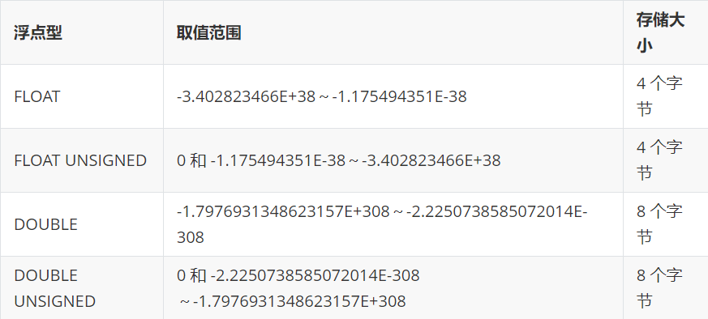

# MySQL

> 基于[【官网】](https://www.mysql.com/)、[MySQL 教程](http://c.biancheng.net/mysql/)、[MySQL](https://www.cdsy.xyz/computer/soft/database/mysql/index.html)、《MySQL 技术内幕 InnoDB 存储引擎》
>
> 以下版本为 MySQL 5.7.25

## 一、基本概念

数据库是指长期存储在计算机内的、有组织、可共享的数据集合。

关系型数据库是指采用了关系模型来组织数据的数据库。关系模型可以简单理解为二维表格模型，而一个关系型数据库就是由二维表及其之间的连续所组成的一个数据组织

数据库管理系统是位于用户和操作系统之间的数据管理软件，主要功能包括：数据定义、数据操作、数据库的运行管理、数据库的建立、使用和维护等功能。常见的数据库管理系统有：MySQL、Oracle、SQL Server 等，我们常说的 MySQL 数据库，其实就是 MySQL 数据库管理系统的简称。

### （一）[几种常用的数据库](https://www.cdsy.xyz/computer/soft/database/mysql/20210302/cd16146688078350.html)

#### 1、Oracle

Oracle 是甲骨文公司的一款关系型数据库管理系统，在数据库领域一直处于领先地位的产品，是目前世界上流行的关系型数据库之一，是一种高效率、可靠性好、适应高吞吐量的数据库方案。

优点：

- Oracle 可移植性好，能在所有主流平台上运行（包括 Windows），完全支持所有工业标准。采用完全开放策略，使客户可以选择最适合解决方案。以及对开发商的全力支持。
- 获得最高认证级别的 ISO 标准认证，安全性高。
- 完全向下兼容，因此被广泛应用，且风险低 。

缺点：

- Oracle 需要付费，并且价格比较昂贵。
- 对硬件要求高；管理维护麻烦；操作比较复杂。

#### 2、SQL Server

SQL Server 是 Microsoft（微软）公司推出的关系型数据库管理系统，主要应用于大型的管理系统中。

优点：

- 与微软的 Windows 系列操作系统的兼容性很好；高性能设计，可充分利用 WindowsNT 的优势；系统管理先进，支持 Windows 图形化管理工具，支持本地和远程的系统管理和配置。
- 强壮的事务处理功能，采用各种方法保证数据的完整性。
- 支持对称多处理器结构、存储过程、ODBC，并具有自主的 SQL 语言。

缺点：

- SQL Server 只能在 Windows 系统上运行，没有丝毫开放性。
- 没有获得任何安全证书。
- 多用户时性能不佳 。
- 只支持 C/S 模式，SQL Server C/S 结构只支持 Windows 客户用 ADO、DAO、OLEDB、ODBC 连接。

#### 3、MySQL

MySQL 是一种开放源代码的关系型数据库管理系统，由瑞典 MySQL AB 公司开发，属于 Oracle 旗下产品。因为其速度、可靠性和适应性而备受关注。MySQL 是流行的关系型数据库管理系统之一，在 WEB 应用方面，MySQL 是最好的应用软件之一。

优点：

- 性能卓越服务稳定，很少出现异常宕机。
- 开放源代码且无版权制约，自主性强、使用成本低。
- 历史悠久、社区及用户非常活跃，遇到问题，可以很快获取到帮助。
- 软件体积小，安装使用简单，并且易于维护，安装及维护成本低。
- 支持多种操作系统，提供多种 API 接口，支持多种开发语言。

缺点：

- MySQL 最大的缺点是其安全系统，主要是复杂而非标准，只有调用 mysqladmin 来重读用户权限才会发生改变。
- 不允许调试存储过程，开发和维护存储过程很难。
- 不支持热备份。
- MySQL 也有企业版，需要付费；社区版免费。

### （二）[MySQL 基础架构](https://www.cdsy.xyz/computer/soft/database/mysql/20210302/cd16146688138355.html)


- connection pool（连接池）：将用户连接、用户名、密码、权限校验、线程处理等需要缓存的需求缓存下来，下次可以直接使用连接池中的连接。
- SQL 层：SQL 层是 MySQL 的核心，MySQL 的核心服务都是在这一层实现：
  - Management Services&Utilities：MySQL 的系统管理和控制工具，包括备份恢复、MySQL 复制、集群等。
  - Caches&Buffers：查询缓存，如果缓存中有这个 SQL 查询语句，就可以直接通过查询语句去获取缓存中取数据。
  - Parser：查询解析器，在 SQL 命令传递到解析器时，会被解析器验证和解析，以便 MySQL 优化器可以识别数据结构或返回 SQL 语句错误。
  - Optimizer：查询优化器，在查询之前对查询进行优化，选择最优的 SQL 语句执行策略。
  - SQL Interface：SQL 接口，验证用户权限，验证通过后执行用户的 SQL 命令，返回用户需要查询的结果。
- Pluggable Storage Engines：存储引擎层，是 MySQL 数据库区别于其他数据库最核心的一点，也是 MySQL 最具特色的一个地方。负责 MySQL 中数据的更新和获取，和文件系统完成交互。
- File System：文件系统层，主要是将数据库的数据存储在操作系统的文件系统之上，并完成与存储引擎的交互。

### （三）三大范式

为了建立冗余度小、结构合理的数据库，设计数据库时必须遵循一定的规则。在关系型数据库中，这种规则就是范式。范式是符合某一种级别的关系模式的集合。关系型数据库中的关系必须满足一定的要求，即满足不同的范式。

目前关系型数据库有六种范式，且是逐层梯进（也就是后一个范式在满足前一个范式的基础上，有了新的规则）。一般来说，数据库满足三大范式就行：

- 第一范式：数据库表中所有字段值都是不可再分的最小数据单元。
- 第二范式：确保数据表中的每一列都和主键相关，而不能与主键的某一部分相关（主要针对联合组件而言，任何一个列不能只与联合主键 A 有关，而与联合主键 B 无关）。
- 第三范式：数据表中每一列都和主键直接相关，而不能是间接相关（也可以说是两个列之间没有依赖关系）。

## 二、数据类型

### （一）整数类型


以 `整数型` 或 `整数型(n)` 的形式为字段定义数据类型，例如：`int(11)`。n 表示的是显示宽度，类似于 Java 中的 printf() 输出固定宽度，不足的用空格补足，若设置 `int(11) zerofill`，不足的长度用 0 不足。若值超出显示宽度，则无视长度而显示整个值。

### （二）小数类型

小数型是指带有小数点的数据，分为两种：浮点型和定点型。异同点：

- 都可以写成 `类型` 或 `类型(M, D)` 的形式，M 表示数据总的长度（不包括小数点），D 表示小数点后的位数。若数据长度大于 M，则会报错；若小数点后的位数大于 D，则会四舍五入。
  - 例如：`my_score_field decimal(2, 0)`，存入值为 98.6 时，则四舍五入变成 99 存入；存入值为 99.6 时，则四舍五入变成 100，长度大于 2，会报错。
- 浮点数相对于定点数的优点是在长度一定的情况下，浮点数能够表示更大的范围；缺点是会引起精度问题，另外两个浮点数进行减法和比较运算时也容易出问题。不指定精度时，默认会按照实际的精度（由计算机硬件和操作系统决定）。
- 定点型实际上是以字符串形式存放，类似于 Java 的 BigDecimal，不会精度丢失。不指定精度时，默认为 `(10, 0)`。

#### 1、浮点型



#### 2、定点型


### （三）[日期类型](https://www.cnblogs.com/ivictor/p/5028368.html)


#### 1、datetime

- 取值范围为 `1000-01-01 00:00:00 到 9999-12-31 23:59:59`。
- 值原样输入，原样输出。

#### 2、timestamp

- 取值范围为 `1970-01-01 00:00:00 到 2038-01-19 03:14:07`，有可能是长度决定的。
- 值存入时，客户端插入的时间从当前时区转化为 UTC（世界标准时间）的时间戳进行存储。查询时，将其转化为客户端当前时区进行返回。
- 可以为 timestamp 类型字段添加 `DEFAULT CURRENT_TIMESTAMP UPDATE CURRENT_TIMESTAMP`，表示插入时默认值设为当前时间，更新时默认值设为当前时间。MySQL5.6.5 之后，也可以为 datetime 类型字段添加上面的配置。

### （四）字符串类型


#### 1、[char](https://blog.csdn.net/qq_39390545/article/details/109379218)

- char 是定长字符串，可以使用 `char(n)` 表示最多可以存放 n 个字符，不足 n 个字符时，会在右侧填充空格达到指定的长度，超出 n 个字符长度时会报错。
  - 默认最多存放 255 个字符，和编码格式无关，任何编码格式最大容量都是 255 个字符。
- char 类型会删除字符串中的末尾空格，之后使用空格对剩余空间填充，可能导致空间浪费。
- char 类型字段占用固定长度的空间，因此 MySQL 分配空间时，可以提前知道需要分配多少空间，不容易产生空间碎片，同时也方便比较和检索。这是一种空间换时间的策略。

#### 2、varchar

- varchar 是变长字符串，可以使用 `varchar(n)` 表示最多可以存放 n 个字符，超出 n 个字符长度时会报错。
  - 和 char 类型不同，varchar 是储存多少字符就占多少空间，不会使用空格进行填充。
  - MySQL5.0.3 版本之前 n 最大容量是 255 个字符，之后总占用空间改为 65535 字节。默认最多存放 65535 字节，其中 1~2 个字节储存字符串长度（最大长度小于等于 255 字节是占 1 个字节，否则占 2 个字节），如果字段 default null（即默认值为空），整条记录还需要 1 个字节保存默认值 null。n 和编码格式有关，例如：UTF-8 编码格式下，中文字符一般占 3 个字节（英文字符占 1 个字节，生僻字占 4 个字节），因此 n 最大值为 `21845 = 65535 / 3`，并且总占用空间不能超过 65535 个字节。
- varchar 类型对于不定长的字段很友好，例如：content 字段，有些占用 1000 个字符，有些占用 100 个字符，此时使用 varchar(1000) 更好。但是字段有固定长度或长度很短时，例如：身份证号码字段是固定长度，使用 char(18) 更好；储存 Y 和 N 的值时，字段长度很短，使用 char(1) 时占 1 个字节，使用 varchar(1) 时占 2 个字节。

#### 3、[text](https://blog.csdn.net/qq_42444778/article/details/113883552)

- text 是变长字符串，但是不能像 varchar 一样指定最大字符数。另外还有 tinytext、mediumtext 和 longtext 类型，只是最大占用空间不同。
- varchar 可以是索引的一部分，而 text 字段要求您指定前缀长度，该长度可以是索引的一部分。
- varchar 与表内联存储（至少对于 MyISAM 存储引擎而言），因此在大小合理时可能会更快。当然，快得多少取决于您的数据和硬件。text 存储在表外，原则上不会全部存储在表外，会有 768 字节和原始的行存储在一块，多于 768 的行会存在和行相同的 Page 或是其它 Page 上，该表具有指向实际存储位置的指针。
- 排序使用 text 列将需要使用基于磁盘的临时表作为 MEMORY（HEAP）存储引擎。

### （五）二进制类型


#### 1、bit

位字段类型，使用 `bit(n)` 表示最多可以存放多少比特位，n 默认值为 1，最大值为 64。存入的数据会自动转化为二进制形式存储，使用 0 在值左侧剩余空间填充。例如：bit(4) 时，传入值为 3，实际上就是以 0011 形式存储；bit(1) 时，可以存入 false（布尔类型）、0（会以 false 形式存储）、true、1（会以 true 形式存储）、null。

#### 2、binary 和 varbinary

二进制字符串类型，使用 `binary(n)` 表示最多可以存放多少字节，n 默认值为 1，最大值为 255。存入的字符串数据会自动转为十六进制形式存储，使用 ASCII 码中的 NUL（也就是二进制的 00000000，十六进制的 00）在值右侧剩余空间填充。例如：binary(4) 时，传入值为 'a'，实际上就是以 0x61000000 形式存储；传入值为 '我'，实际上就是以 0xE6889100 形式存储。

varbinary 最大值为 65535，和 binary 的区别就像 char 和 varchar 的区别一样。

#### 3、[blob](https://blog.csdn.net/m0_37899908/article/details/114907246)

二进制字符串类型，主要用于存储 Blob 对象（也就是图片等媒体文件对应的对象）。和 text 类型一样，都是以字符串形式储存，但是在 Java 客户端中以 Blob 对象形式获取及展示。

## 三、SQL 语句

SQL 是一种数据库查询和程序设计语言，用于存取数据以及查询、更新和管理关系数据库系统，包括以下几种类型：

### （一）书写规则

- 使用 `# 注释` 表示单行注释，使用 `/* 注释 */` 表示多行注释。
- 使用 `;` 表示当前语句结束。
- 大小写规则：

  - Windows 中 MySQL：

    - 默认将数据库名、表名与表的别名都转为小写后存储，查询时也会进行转化，因此大小写不敏感。
    - 关键字、函数名、列名与列的别名在所有的情况下均是忽略大小写。
    - 字段值默认字符集情况下是大小写不敏感的，因此在查询时条件值也是不区分大小写的，以下区分大小写：
      - 在定义字符串列时，在后面加关键字 `binary`。例如：`name varchar(10) binarary`。
      - 在查询时添加关键字 `binary`。例如：`where binary name = 'zhangsan'`。
      - 设置或修改数据库、表或字段的校对规则。例如：`alter table my_table modify name varchar(10) collate utf8_bin null;`

  - Linux 中 MySQL：
    - 数据库名和表名严格区分大小写。因为数据库、数据库表和视图都是以文件的形式存储在文件系统中，在 Linux 系统中大小写敏感。
    - 列名、列的别名、字段值规则与 Window 中一致。

### （二）DDL

DDL（Data Definition Language，数据库定义语言），用来创建或删除数据库及表等对象，主要包括以下几种命令：

#### 1、数据库

##### （1）show

查看该 MySQL 服务器上的所有数据库，其中包含 MySQL 默认自带的数据库。

```sql
show database [ like '数据库名称' ]
```

##### （2）create

创建新数据库，可以指定数据库默认字符集名和默认校对规则。

```sql
create database [ if not exists ] 数据库名
 [ [ default ] character set 字符集名 ]
 [ [ default ] collate 校对规则名 ]

 # 例如：
 create database if not exists test_mysql
 default character set utf8
 default collate utf8_general_ci;
```

##### （3）alter

修改数据库的默认字符集名和默认校对规则，有一些版本的 mysql 不能写数据库名。

```sql
alter database [ 数据库名 ]
[ [ default ] character set 字符集名 ]
[ [ default ] collate 校对规则名]
```

##### （4）drop

删除数据库，且删除所有表和数据，不能恢复。

```sql
drop database [ if exists ] 数据库名
```

##### （5）use

切换数据库，切换到指定数据库后，才可以对数据库下的表和数据进行操作。

```sql
use 数据库名
```

#### 2、数据库表

##### （1）create

```sql
# 列定义包括 `列名称 列类型 [ 列约束 ]`
create table 表名 (列1定义, [ 列2定义, 列3定义…… ])
```

##### （2）alter

修改表的相关信息。

```sql
alter table 表名 [修改选项]
```

[修改选项如下](https://blog.csdn.net/u010002184/article/details/79354136)：

- 表相关：

  ```sql
  rename to 新表名

  character set 新字符集名

  character set 新字符集名

  engine = 存储引擎名
  ```

- 列相关：

  ```sql
  add column 列定义 [ { before | after } 表中列名 ]

  # 修改列名称，也可以修改列定义
  change column 旧列名 新列名 列定义
  # 修改列定义
  modify column 列名 列定义

  drop column 列名
  ```

##### （3）约束

约束主要是对列的进一步描述，描述列的作用（主键、外键），列的默认值等等，可以使用多个约束来修饰同一个列，约束可以更好地保证数据的准确性和有效性，例如：年龄大于两三百就没有意义。

###### ① 主键约束（primary key）

主键虽然是表非必须的，但是有主键的表相当于有了身份证号的人，可以更快更方便的定位到一条数据。有以下特性：

- 每个表只能有一个主键。
  - 一个主键可以是一个列，也可以是多个列组成的联合主键。
  - 若没有主键时，innodb 存储引擎会默认添加一个隐藏的自增主键列。
- 联合主键（也就是多个列组成的一个主键）最好不要包含不必要的多余字段。
  - 例如：由身份证号、姓名组成的联合主键，这里面身份证号就可以确定数据的唯一性，再加上姓名就多此一举。
- 主键列的数据，非空且唯一。

**主键约束操作**：

- 定义列级约束

  ```sql
  # 直接设置主键
  列名 类型 primary key
  ```

- 定义表级约束

  ```sql
  # 设置联合组件
  [ constraint 主键名 ] primary key (列名1 [ , 列名2, 列名3…… ])
  ```

- 新增约束：若表原本没有主键，则可以新增主键。

  ```sql
  alter table 表名
  add [ constraint 主键名 ] # constraint 约束名默认为列名
  primary key (列名1 [ , 列名2, 列名3…… ])
  ```

- 删除约束

  ```sql
  alter table 表名 drop { primary key | constraint 主键名 }
  ```

  - 删除主键约束前要先删除自增长约束，因为自增长约束只能约束主键。
  - `drop constraint 主键名` 表示若新增约束时起了主键名（例如：constraint 主键名），则可以通过这种方式删除主键约束。对于 MySQL 来说，只能删除所有的主键约束；对于 SQL Server、Oracle 来说，还可以 `drop constraint 列名` 这种方式删除联合主键中的一个列的主键约束。

###### ② 主键自增长（auto_increment）

被主键自增长约束的列，用户可以不用再输入数据（要输入也可以），当插入一条数据时，会自动增长值。有以下特性：

- 自动增长约束的列只能是整数类型。
- 若自增长到达该列类型的最大值，则 auto_increment 失效，会报例如 "Duplicate entry '127' for key 'PRIMARY'" 的异常。
- 只能修饰主键或联合主键的一个列（一张表中只能一个列设置为自增长）。

**设置主键自增长**：

- 设置自增长的初始值。

  ```sql
  # 创建表时设置
  create table 表名 (……) auto_increment = 自增长初始值

  alter table 表名 auto_increment = 默认初始值
  ```

- 添加自增长，也可以通过这种方式删除自增长。

  ```sql
  # 添加自增长
  alter table 表名 modify column 列名 类型 auto_increment

  # 删除自增长
  alter table 表名 modify column 列名 类型
  ```

###### ③ 外键约束（foreign key）

外键约束主要是用于表示多个表之间的关系（一对一、一对多、多对多），在子表中的某些列添加外键约束。有以下特性：

- 子表的外键必须是父表的主键或联合主键（联合组建的全部列）。
- 外键中列的数据类型必须和父表的主键数据类型相同。
- 外键可以为空，表示这条数据和父表没有关联。

**设置外键约束**：

- 定义外键约束

  ```sql
  constraint 外键名
  foreign key ( 列名1 [ , 列名2, 列名3…… ] )
  references 父表名 ( 主键列1 [ , 主键列2, 主键列3…… ] )
  ```

- 添加外键约束

  ```sql
  alter table 表名
  add [ constraint 外键名 ]
  foreign key ( 列名1 [ , 列名2, 列名3…… ]  )
  references 父表名 ( 列名1 [ , 列名2, 列名3…… ]  )
  ```

- 删除外键约束

  ```sql
  alter table 表名 drop { foreign key | constraint 主键名 }
  ```

###### ④ 检查约束（check）

检查约束可以用来限定列的有效值，减少无用数据的输入。可以约束任何列，约束条件的写法和 where 后的查询条件类型，**不过 MySQL 不支持检查约束**。

**设置检查约束**：

- 定义检查约束

  ```sql
  check(约束条件)
  ```

- 新增检查约束

  ```sql
  alter table 表名
  add [ constraint 检查约束名 ]
  check ( 约束条件 )
  ```

- 删除检查约束

  ```sql
  alter table 表名 drop { check 列名 | constraint 检查约束名 }
  ```

###### ⑤ 唯一性约束（unique）

被唯一性约束的列，任意两条数据的该列值都不相等，避免数据的相同。可以对任何列进行约束（包括主键，但是约束主键无意义）。

**设置唯一性约束**：

- 定义唯一性约束

  ```sql
  列名 类型 unique
  ```

- 新增唯一性约束

  ```sql
  alter table 表名
  add [ constraint 唯一性约束名 ]
  unique ( 列名1 [ , 列名2 …… ] )
  ```

- 删除唯一性约束

  ```sql
  alter table 表名 drop { index 列名 | constraint 唯一约束名 }
  ```

###### ⑥ 非空约束（not null）

对被非空约束的列数据，不能插入 null 值，否则报错。可以对任何列进行约束（包括主键，但是约束主键无意义）。

**设置非空约束**：

- 定义非空约束

  ```sql
  列名 类型 not null
  ```

- 添加非空约束

  ```sql
  alter table 表名 modify column 列名 类型 not null
  ```

- 删除非空约束

  ```sql
  alter table 表名 modify column 列名 类型 null
  ```

###### ⑦ 默认值（default）

设置列的默认值，在没有值的时候自动插入默认值。可以修饰任何列。

**设置默认值**：

- 定义默认值

  ```sql
  列名 类型 default 默认值
  ```

- 设置或删除默认值

  ```sql
  alter table 表名 modify column 列名 类型 default { 默认值 | null }
  ```

##### （4）删除

###### ① drop

删除表（删除表结构和表中数据）

```sql
drop table [ if exists ] 表名1 [ 表名2, 表名3…… ]
```

若两表关联，直接删除父表会报错：

- 可以先删除子表，再删除父表。
- 也可以使用 `alter table 子表名 drop foreign key 外键名` 删除子表的外键约束，再删除父表。

###### ② truncate

删除表中的全部数据。

```sql
truncate table 表名
```

##### （5）查看

###### ① show

```sql
# 查看创建表的 SQL 语句
show create table 表名

# 查看表的基本属性：存储引擎、创建时间、行数等
show table status [ like '表名' ];
```

###### ② describe

查看表结构（表字段和属性）。

```sql
describe 表名
```

### （三）DML

DML（Data Manipulation Languange，数据库操作语言），用来维护表中的数据，主要有以下几种命令：

#### 1、insert

```sql
insert into 表名 [ (列名1 [,  列名2 , 列名3……]) ] values (第一条数据对应列的值) [, (第二条数据对应列的值) ……]
```

#### 2、update

```sql
update 表名 set 列名1 = '值1' [ , 列名2 = '值2' …… ]
[ where 子句 ] [ order by 子句 ] [ limit 子句 ]
```

#### 3、delete

```sql
delete from 表名 [ where 子句 ] [ order by 子句 ] [ limit 子句 ]
```

### （四）DQL

DQL（Data Query Language，数据库查询语言），用来查询表中的数据。

```sql
select
  [ distinct ]
  { * | 列名1 [, 列名2 ……] | 函数式 }
from
  表名1 [, 表名2 …… ]
where
  查询表达式
group by
  列名1 [ , 列名2 …… ]
having
  组合的条件表达式
order by
  列名1 { asc | desc } [ , 列名2 { asc | desc }…… ]
limit 偏移量, 行数
```

#### 1、distinct

distinct 是去重的作用，例如【select distinct name, age from test_table】中，若两条数据的 name 和 age 都相同，则只查出一条。

#### 2、[函数式](http://c.biancheng.net/mysql/function/)

mysql 提供许多函数方法调用。

> 像 count()这种聚合函数，都是对最终的 group by（多次分组后的结果）进行聚集。
>
> 聚合函数中也可以使用 distinct，例如：`select count(distinct 列名) from my_table` 表示先进行 distinct，再聚合。

#### 3、[from](https://www.cnblogs.com/Dovegege/p/9352187.html)

from 表示的是从那个数据表中查找数据，也可以从多个数据表中查找数据，因此涉及多表连接的问题。

##### （1）交叉连接

交叉连接是最简单的一种连接，但是连接后的表会非常大，浪费性能。

```sql
select * from 表名1, 表名2 [ , 表名3 …… ]
```

例如：`select * from tableA, tableB` 这样会产生交叉连接，返回表 A 中数据数乘表 B 中数据数的笛卡尔积条数据（也就是两张表数据相乘）。

##### （2）内连接

内连接和交叉连接的性能差不多。若不加 on 条件，则和交叉连接结果一样；若加 on 条件，则和交叉连接加上 where 连接条件结果一样。

> 交叉连接中是先连接两表，再 where 条件；内连接中是先 on 条件，再连接两表，内连接也会让两表产生笛卡尔积。

```sql
select * from 表名1 [ inner ] join 表名2 [ on 条件 ]
```

##### （3）外连接

外连接和内连接不同的是，即使没有符合查询条件的匹配行，也会返回一个表的全集。

###### ① 左外连接

以表 1 为基表，表 2 为参考表。左外连接查询时，查出表 1 中的所有数据和表 2 中匹配条件的数据进行连接，若表 1 中的数据没有在表 2 中有匹配行，则返回结果中，表 2 的字段值为 null。

> 查出的表 1 中所有的数据和表 2 中匹配条件的数据进行连接，是表 1 中的一条数据和表 2 中匹配条件的每条数据进行连接。

```sql
select * from 表名1 left [ outer ] join 表名2 on 子句
```

###### ② 右外连接

以表 2 为基表，表 1 为参考表，其他和左外连接差不多。

```sql
select * from 表名1 right [ outer ] join 表名2 on 子句
```

###### ③ 全外连接

MySQL 没有全外连接，Oracle 有。

#### 4、where

##### （1）运算符

###### ① 算术运算符

```sql
+、-、*、/、%
```

就是加、减、乘、除和取模，可以使用在查询列中使用，也可以在 where 中使用。

###### ② [比较运算符](http://c.biancheng.net/view/7191.html)

```sql
# 在这里和 null 比较，返回值都是 null（也相当于false）
=、!=、<=、>=、>、<

is null、is not null
# 左闭右闭
between and
# 只要左侧值为 null，返回值都是 null（也相当于false）
in、not in
```

###### ③ [逻辑运算符](http://c.biancheng.net/view/7188.html)

```sql
# 有一个操作数为 null 时，返回值都是 null（也相当于false）
# 0（或可以转为 0 的值，例如：''、'0'、'00'、'0.0'） 视为 false，非 0（除了 null）视为 true

not 或 !     逻辑非
and 或 &&    逻辑与
or  或 ||    逻辑或
xor          逻辑异或
```

###### ④ [位运算符](http://c.biancheng.net/view/7195.html)

```sql
|  位或
&  位与
^  位异或
~  位取反
<<   位左移
>>   位右移
```

##### （2）模糊匹配

模糊查询引入通配符概念：`%` 表示可以匹配 0 个至多个字符，`_` 表示匹配 1 个字符。

```sql
列名 like '字符串'
```

##### （3）正则表达式匹配

```sql
列名 regexp '正则表达式'
```

#### 5、[group by](http://c.biancheng.net/view/7408.html)

可以对多个列进行分组，相同值的数据分在一组，按照字段顺序从左到右依次在上一个分组基础上进一步分组。

```sql
# 按 age 分组，name 列只有字典排序的第一个值
select age, name from test_table group by age;

# group_concat() 可以将 age 分组后，name 列的所有值拼接起来
select age, name from test_table group by age;
```

> 注意：MySQL 5.8 之后的版本要求 group by 后的分组列名，必须写在 select 中

```sql
# MySQL 5.7
select name from test_table group by age;

# MySQL 5.8 之后 age 必须放在 select 中
select age, name from test_table group by age;
```

#### 6、having

having 是对分组后的列进行过滤，和 where 基本类似。

> 区别：having 中可以使用聚合函数；where 中不可以使用聚合函数，因为 where 是在 group by 之前筛选数据的。

```sql
# 按 first_name 分组后，每个分组中 age 平均值大于 10
select first_name, avg(age) avg_age
from select_test
group by first_name having avg_age > 10;
```

#### 7、order by

可以对多个字段排序，按照字段的字典顺序从左到右依次排序。有{ asc | desc }两种排序方式，缺省值是 asc。

```sql
# 先按照 age 排序，再按照 first_name 排序
select * from select_test order by age, first_name;
```

#### 8、limit

查询从 offset 起的 rows 条数据。

```sql
# offset 默认为 0
limit [ offset, ] rows
```

#### 9、子查询

子查询指将一个查询语句嵌套在另一个查询语句中。子查询可以在 SELECT、UPDATE 和 DELETE 语句中使用，而且可以进行多层嵌套。在实际开发时，子查询经常出现在 WHERE 子句中。

```sql
# 操作符可以是比较运算符和 IN、NOT IN、EXISTS、NOT EXISTS 等关键字。
# exists 表示存在
where <表达式> <操作符> (子查询)
```

### （五）[DCL](http://c.biancheng.net/mysql/100/)

DCL（Data Control Language，数据库控制语言），用来控制用户权限和管理事务。

MySQL 内自带一个名为 mysql 的数据库，mysql 数据库中存储的都是用户权限表。用户登录以后，MySQL 会根据这些权限表的内容为每个用户赋予相应的权限。

[user 表](http://c.biancheng.net/view/7249.html)是 MySQL 中最重要的一个权限表，用来记录允许连接到服务器的账号信息。user 表中的字段大致可以分为 4 类，分别是用户列、权限列、安全列和资源控制列。

#### 1、创建用户

##### （1）create

使用 **CREATE USER** 语句来创建 MySQL 用户，并设置相应的密码。

```sql
create user '用户名'[@'主机名'] identified by [ password ] '密码'
```

主机名表示用户连接 MySQL 时所在的主机名，用户名和主机名作为 user 表的联合主键，不指定主机名时，默认值为 `%`，表示对所有主机开放权限。

###### ① password

password 关键字表示使用哈希值设置密码，该参数可选。

```sql
# 没有 password 关键字时
create user 'user_test' identified by 'mima';

# 有 password 关键字时，需要先获取密码的 hash 值
select password('mima'); # *98703F7A543944FD3818077669F74D60616DB2C8
create user 'user_test' identified by password '*98703F7A543944FD3818077669F74D60616DB2C8';
```

###### ② identified by password

`identified by password` 密码加密方式后续会被废弃，改为：

```sql
create user '用户名'[@'主机名'] identified with <plugin> by '密码'
```

MySQL 8 之前 plugin 默认值是 mysql_native_password：

```sql
create user 'user_test' identified with mysql_native_password by '*98703F7A543944FD3818077669F74D60616DB2C8';
```

MySQL 8 之后 plugin 默认值是 caching_sha2_password。很多连接工具，例如：nivacat12，仍然使用默认的 mysql_native_password，所以在连接的时候会报错，需要将密码的 plugin 修改为 mysql_native_password：

```sql
alter user 'user_test' identified with mysql_native_password by '*98703F7A543944FD3818077669F74D60616DB2C8';
```

##### （2）grant

新创建的用户拥有的权限很少，只能执行不需要权限的操作。例如：登录 MySQL、使用 SHOW 语句查询所有存储引擎和字符集的列表等。使用 grant 新建用户时，还可以给用户赋权限。

```sql
grant 权限1 [, 权限2 ...] on 数据库名.表名 to '用户名'[@'主机名'] identified by [ password ] '密码'
```

`数据库名.表名` 表示用户权限的作用范围，即只能在指定数据库和表上使用自己的权限，也可以使用 `*.*` 表示可以作用在所有数据库的所有表。

```sql
grant select, update on *.* to 'user_test' identified by password '*98703F7A543944FD3818077669F74D60616DB2C8';
```

#### 2、修改用户

##### （1）重命名

重命名用户。

```sql
rename user '旧用户名'[@'旧主机名'] to '新用户名'[@'新主机名']
```

##### （2）修改密码

① 当前用户登录后修改自己的密码：

```sql
set password = password('密码')
# password('密码') 方式废弃了，使用下面这种方式
set password = '密码'
```

② 在 MySQL 中，只有 root 用户可以通过更新 mysql 数据库来更改密码，root 用户修改其他用户密码：

```sql
set password for '用户名'[@'主机名'] = '密码'
```

③ 使用 update 语句修改用户密码：

```sql
update mysql.user set authentication_string = '密码' where user = '用户名' and host = '主机名'
# 老版本不是 authentication_string，而是 password 字段
update mysql.user set password = '密码' where user = '用户名' and host = '主机名'
```

④ 使用 grant 语句修改用户密码，必须要有 grant 权限：

```sql
# grant usage 表示只修改账户的密码而不影响账户当前的权限
grant usage on *.* to '用户名'[@'主机名'] identified by [ password ] '密码'
```

#### 3、删除用户

```sql
drop user '用户名'[@'主机名']
```

#### 4、查看用户权限

```sql
show grants for '用户名'[@'主机名']
```

#### 5、用户授权

```sql
grant 权限1 [, 权限2 ...] [ 列名1 [, 列名2 ...] ] on 数据库名.表名
to '用户名1'[@'主机名1'] [ identified by [ password ] '密码1' ] [, '用户名2'[@'主机名2'] [ identified by [ password ] '密码2' ]]
[ with grant option ]
```

- 当添加列名时，表示权限具体作用在哪些列上。
- grant option 表示被授权的用户可以将这些权限赋予给别的用户。

#### 6、取消授权

```sql
revoke 权限1 [, 权限2 ...] [ 列名1 [, 列名2 ...] ] on 数据库名.表名
from '用户名1'[@'主机名1'] [, '用户名2'[@'主机名2'] ...]

# 取消用户的所有权限
revoke all privileges, grant option
from '用户名1'[@'主机名1'] [, '用户名2'[@'主机名2'] ...]
```

> 注意：要使用 revoke 语句，必须拥有 mysql 数据库的全局 create user 权限或 update 权限。

## 四、[视图](https://www.cnblogs.com/geaozhang/p/6792369.html)

视图是一种虚拟存在的表，是一个逻辑表，本身并不包含数据和结构。数据库只存储视图的定义，作为一个 select 语句保存在数据字典中。

> 视图本质是一个 select 语句。

通过视图，可以展现基表（可以是真正的表，也可以是视图）的部分数据；视图中的数据来自定义视图的 select 查询语句中使用的表，可以通过视图对这部分数据增删改查。

优缺点：

- 简化查询操作：对于用户来说，只需要查询视图就可以获取想要的数据，而不用关心更深一层的查询语句。
- 数据安全：使用视图的用户只能访问允许查询的结果集。
- 视图中不包含数据，所有每次使用视图时，都必须执行查询操作，若视图逻辑复杂，则影响性能。

### （一）DDL 操作

#### 1、create

```sql
# or replace 表示替代存在的视图
create or replace
  [ algorithm = { undefined | merge | temptable } ]
  [ definer = { '用户'@'登录主机' | current_user } ]
  [ sql security { definer | invoker } ]
view 视图名 [ ( 新列名1 [ , 新列名2 …… ] ) ]
as <select 查询语句>
  [ with [ cascade | local ] check option ]
```

##### （1）[algorithm](https://blog.csdn.net/qq_32080545/article/details/98530552)

select 查询视图时的算法，值有：

- undefined：缺省值，MySQL 自动选择使用的算法。
- merge：将引用视图的语句的文本与视图定义合并起来，使得视图定义的某一部分取代语句的对应部分。
- temptable：视图的结果将被置于临时表中，然后使用它执行语句。优缺点：
  - MySQL 需要创建一个临时表，然后将视图的结果放在临时表中，再使用这个临时表进行相应的操作，效率低。
  - 使用 temptable 算法生成的视图本质是个临时表，无法执行 update 语句。
  - temptable 算法创建临时表之后、并在完成语句处理之前，能够释放基表上的锁定。与 MERGE 算法相比，锁定释放的速度更快，这样，使用视图的其他客户端不会被屏蔽过长时间。

##### （2）definer

谁是视图的创建者或定义者，可以指定用户【'用户'@'登录主机'】，缺省的话默认是 current_user，也就是当前创建视图的用户。

##### （3）sql security

指视图在储存过程中执行查询时的验证方式。值有：

- `sql security definer`：缺省值。创建视图时，创建者（默认当前用户）必须对视图所访问的表具有 select 权限。将来其他用户无论有没有该视图所访问表的 select 权限，都可以查询视图数据（也就是以创建者的身份访问）。
- `sql security invoker`：查询视图数据时，用户必须对视图所访问的表具有 select 权限。

##### （4）with check option 约束

对视图进行增改操作时，增改的操作不能违反视图的 select 查询语句的 where 条件（以及表本身列约束）。值有：

- `with cascade check option`：缺省值，也可以简写为 `with check option`，表示需要检查嵌套视图及其底层视图的 where 条件。
- `with local check option`：只检查视图本身。

#### 2、alter

```sql
alter view 视图名 as <select 查询语句>

# 也可以直接像上面一样 or replace 或删除后重建
```

#### 3、drop

```sql
drop view 视图名
```

#### 4、查看

```sql
# 查看创建视图的 SQL 语句
show create view 视图名

# 查看表结构（表字段和属性）
describe 视图名
```

### （二）DML 操作

可以像正常操作基表一样操作视图数据，但是有下列条件，视图不能进行维护（增删改）操作：

- 聚合函数 sum()、min()、max()、count() 等。
- distinct 关键字。
- group by 子句。
- having 子句。
- union 或 union all 运算符。
- 位于选择列表中的子查询。
- from 子句中的不可更新视图或包含多个表。
- where 子句中的子查询，引用 from 子句中的表。
- algorithm 选项为 temptable（使用临时表总会使视图成为不可更新的）的时候。

## 五、[存储过程 / 存储函数 / 触发器](http://c.biancheng.net/view/7234.html)

### （一）存储过程

**存储过程是一组为了完成特定功能的 SQL 语句集合。**使用存储过程的目的是将常用或复杂的工作预先用 SQL 语句写好并用一个指定名称存储起来，这个过程经编译和优化后存储在数据库服务器中，因此称为存储过程。当以后需要数据库提供与已定义好的存储过程的功能相同的服务时，只需调用存储过程即可自动完成。

优缺点：

- 将重复性很高的一些操作，封装到一个存储过程中，简化了对这些 SQL 的调用。
- 统一接口，确保数据的安全。
- 相对于 Oracle 数据库来说，MySQL 的存储过程相对功能较弱，使用较少。

#### 1、[create](https://www.jb51.net/article/233280.htm)

> 注意：创建存储过程时，必须具有 create routine 权限。

```sql
create procedure 存储过程名 (存储参数)
begin
    存储过程体
end
```

调用存储过程：

```sql
call 存储过程(存储参数)
```

##### （1）存储参数

```sql
[in | out | inout 参数名 数据类型 [, ...]]
```

###### ① in 输入参数

表示调用者向存储过程传入值（传入值可以是字面量或变量）。

> 注意：传入的变量就算在存储过程中被修改，其实际值也不会变。

```sql
create procedure in_param_procedure(in p_in int)
begin
    select p_in;
    set p_in = 2; # 修改传入的变量值
    select p_in;
end;

# 1、传入字面量直接调用
call in_param_procedure(1);
# 2、设置并使用全局变量
set @p_in = 3;
call in_param_procedure(@p_in);
# 3、p_in 在存储过程中被修改，但并不影响 @p_id 的值，因为前者为局部变量、后者为全局变量。
select @p_in;
```

###### ② out 输出参数

表示过程向调用者传出值(可以返回多个值)（传出值只能是变量）。

> 注意：
>
> - 因为 out 是向调用者输出参数，不接收输入的参数，所以存储过程里的输出参数值为 null。
> - 在存储过程中更改了输出参数，会输出参数值会改变。

```sql
create procedure outParamProcedure(out p_out int)
begin
    select p_out; # 因为 out 是向调用者输出参数，不接收输入的参数，所以存储过程里的 p_out 为 null
    set p_out = 2;
    begin
        select p_out;
    end;
end;

# 1、直接调用会报错，必须传入变量
call outParamProcedure(1);
# 2、设置并使用全局变量
set @p_out = 1;
call outParamProcedure(@p_out);
# 3、调用存储过程，输出参数值会改变
select @p_out;
```

###### ③ inout 输入输出参数

既表示调用者向过程传入值，又表示过程向调用者传出值（值只能是变量）。

##### （2）存储过程体

存储过程体包含了在调用过程中必须执行的语句，例如：DML、DDL 语句，if-then-else 和 while-do 语句、声明变量的 declare 语句等。

```sql
# 过程体以 begin 开始，end 结束。可嵌套
BEGIN
　　BEGIN
　　　　BEGIN
　　　　　　statements;
　　　　END
　　END
END
```

###### ① delimiter

在 MySQL 中，服务器处理 SQL 语句默认是以分号作为语句结束标志的。然而，在创建存储过程时，存储过程体可能包含有多条 SQL 语句，这些 SQL 语句如果仍以分号作为语句结束符，那么 MySQL 服务器在处理时会以遇到的第一条 SQL 语句结尾处的分号作为整个程序的结束符，而不再去处理存储过程体中后面的 SQL 语句，这样显然不行。

为解决以上问题，通常使用 **delimiter** 命令将结束命令修改为其他字符。

```sql
delimiter $$ // 将结束符定义为 $$
create procedure my_procedure ()
begin
    select 'my_procedure'
end $$
delimiter ; // 将结束符定义为 ;
```

#### 2、查看

##### （1）查看创建的 SQL 语句

```sql
show create procedure 存储过程名
```

##### （2）查看所在表

存储过程的数据存放在 `imformation_scheme.routines` 表中，可以直接进行查询。

```sql
select * from imformation_scheme.routines where routine_name = 存储过程名
```

#### 3、alter

```sql
alter procedure 存储过程名 [特征...]
```

特征指定了存储过程的特性，可能的取值有：

- contains sql 表示子程序包含 SQL 语句，但不包含读或写数据的语句。
- no sql 表示子程序中不包含 SQL 语句。
- reads sql data 表示子程序中包含读数据的语句。
- modifies sql data 表示子程序中包含写数据的语句。
- sql security { definer | invoker } 指明谁有权限来执行。
- comment 'string' 表示注释信息。

#### 4、drop

```sql
drop procedure [if exists] 存储过程名
```

### （二）存储函数

存储函数和存储过程一样，都是在数据库中定义一些 SQL 语句的集合。**存储函数可以通过 return 语句返回函数值，主要用于计算并返回一个值。而存储过程没有直接返回值，主要用于执行操作。**

```sql
create function 存储函数名 (存储参数)
returns 返回值类型
begin
  存储函数体
  return 返回值
end
```

存储函数的删改查和存储过程差不多，只是将 procedure 换成 function。调用存储函数也有点不一样：

```sql
select 存储函数名(存储参数)
```

### （三）变量

可以直接在 MySQL、存储过程或存储函数中定义变量：

```sql
declare 变量名 变量类型 [default 默认值]

# 调用时须在变量前面加上 @，
select @变量名

# 为变量赋值
set @变量名 = 值
```

### （四）[流程控制语句](http://c.biancheng.net/view/7853.html)

#### 1、if 语句

用来进行条件判断，根据是否满足条件（可包含多个条件），来执行不同的语句，是流程控制中最常用的判断语句。其语法的基本形式如下：

```sql
if search_condition then statement_list
    [elseif search_condition then statement_list]...
    [else statement_list]
end if
```

> 注意：MySQL 中的 if()函数和 if 语句没有半点关联。

#### 2、case 语句

也是用来进行条件判断的，它提供了多个条件进行选择，可以实现比 if 语句更复杂的条件判断。

```sql
case 变量
    when 值1 then statement_list
    [when 值2 then statement_list]...
    [else statement_list]
end case
```

#### 3、loop 语句

可以使某些特定的语句重复执行。与 if 和 case 语句相比，loop 只实现了一个简单的循环，并不进行条件判断。

> loop 语句本身没有停止循环的语句，必须在 loop 内使用 leave 语句才能停止循环，跳出循环过程。类似于 Java 的 break。

```sql
[begin_label:] loop
    statement_list
end loop [end_label]
```

begin_label 参数和 end_label 参数分别表示循环开始和结束的标志，这两个标志必须相同，而且都可以省略。

#### 4、repeat 语句

repeat 是有条件控制的循环语句，每次语句执行完毕后，会对 until 后的条件表达式进行判断，如果表达式返回值为 true，则循环结束，否则重复执行循环中的语句。

```sql
[begin_label:] repeat
    statement_list
    until search_condition
end repeat [end_label]
```

#### 5、while

while 也是有条件控制的循环语句。WHILE 语句和 REPEAT 语句不同的是，WHILE 语句是当满足条件时，执行循环内的语句，否则退出循环。

```sql
[begin_label:] while search_condition do
    statement_list
end while [end_label]
```

#### 6、leave

使用 leave 语句可以停止循环，跳出循环过程。类似于 Java 的 break。

```sql
leave begin_label
```

#### 7、iterate

iterate 是**再次循环**的意思，用来跳出本次循环，直接进入下一次循环。类似于 Java 的 continue。

```sql
iterate begin_label
```

### （五）[触发器](http://c.biancheng.net/view/7243.html)

MySQL 的触发器和存储过程一样，都是嵌入到 MySQL 中的一段程序，是 MySQL 中管理数据的有力工具。

不同的是执行存储过程要显示地通过 call 来调用，而触发器的执行不需要使用 call 语句来调用，也不需要手工启动，而是通过对数据表的相关操作来自动触发执行。

优缺点：

- 触发器的执行是自动的，当对触发器相关表的数据做出相应的修改后立即执行。
- 使用触发器实现的业务逻辑在出现问题时很难进行定位，特别是涉及到多个触发器的情况下，会使后期维护变得困难。
- 大量使用触发器容易导致代码结构被打乱，增加了程序的复杂性。
- 如果需要变动的数据量较大时，触发器的执行效率会非常低。

#### 1、create

```sql
create 触发器名称 < before | after >
<insert | update | delete>
on 表名 for each row
begin
statement_list
end;
```

- before | after：触发器被触发的时刻，表示触发器是在激活它的语句之前或之后触发。若希望验证新数据是否满足条件，则使用 before 选项；若希望在激活触发器的语句执行之后完成几个或更多的改变，则通常使用 after 选项。
- insert | update | delete：增删改操作会触发触发器的执行，用于指定具体哪个操作。
- for each row：指行级触发，对于受触发事件影响的每一行都要激活触发器的动作。例如，使用 INSERT 语句向某个表中插入多行数据时，触发器会对每一行数据的插入都执行相应的触发器动作。

> 注意：每个表都支持 INSERT、UPDATE 和 DELETE 的 BEFORE 与 AFTER，因此每个表最多支持 6 个触发器。每个表的每个事件每次只允许有一个触发器。单一触发器不能与多个事件或多个表关联。

#### 2、查看

1、show

```sql
show triggers [ like '表名' ]
```

2、triggers 表

在 MySQL 中，所有触发器的信息都存在 information_schema 数据库的 triggers 表中，可以通过查询命令 SELECT 来查看。

```sql
select * from information_schema.triggers where trigger_name= '触发器名';
```

#### 3、drop

```sql
drop triggers [ if exists ] [数据库名] <触发器名>
```

## 六、存储引擎

数据库存储引擎是数据库底层软件组件，是对数据库文件的一种存取机制：如何实现存储数据，如何为存储的数据建立索引，如何维护、查询数据等技术的不同实现。

### （一）存储引擎分类

不同的存储引擎提供不同的存储机制、索引技巧、锁定水平等功能，使用不同的存储引擎还可以获得特定的功能。MySQL 提供多个不同的存储引擎：

```sql
# 查看所有存储引擎
show engines

# 查看当前表的存储引擎
show table status like '表名';

# 修改表的存储引擎
alter table 表名 engine = 存储引擎名;
```

- MyISAM：基于 ISAM 存储引擎，拥有较高的插入、查询速度。
- InnoDB：支持事务（ACID），支持行锁和外键。
- Memory：硬盘中只储存表结构文件，将数据存储在内存中（系统断电会丢失数据），查询速度快。
- Archive：数据被插入后不可再修改，且不支持索引，用于数据存档。

### （二）[MyISAM 和 InnoDB 区别](https://www.zhihu.com/question/20596402)

- MyISAM 不支持事务；InnoDB 支持事务。
- MyISAM 不支持外键；InnoDB 支持外键。
- MyISAM 是非聚集索引；InnoDB 是聚集索引。因此 MyISAM 的插入（聚集索引需要维护的 b+树更复杂）和搜索（若查询辅助索引，聚集索引需要查两次）速度更快。
- MyISAM 最小锁粒度是表锁；InnoDB 最小锁粒度是行锁。

### （三）[底层实现](http://blog.codinglabs.org/articles/theory-of-mysql-index.html)

索引的底层实现是存储引擎决定的，不同的存储引擎对索引有不同的实现方式，最常见的 MyISAM 和 InnoDB 的索引实现方式都是基于 b+ 树的数据结构。

#### 1、MyISAM

MyISAM 使用的是非聚集索引的 b+ 树的数据结构，主键索引的叶子节点只存储主键值和数据的地址，其他字段的数据另外存储。

##### （1）主键索引

以主键为键值的索引结构，叶子节点存储着主键值和数据的地址，默认创建主键索引。


##### （2）辅助索引

以非主键列为键值的索引结构，叶子节点存储着非主键列的值（说明键值可以重复）和数据的地址。


#### 2、InnoDB

MyISAM 使用的是非聚集索引的 b+ 树的数据结构，主键索引的叶子节点存储主键值和其他字段的数据。

##### （1）主键索引

以主键为键值的索引结构，叶子节点存储着主键值和完整的数据，InnoDB 的数据文件也是一个索引文件，默认创建主键索引。


##### （2）辅助索引

以非主键列为键值的索引结构，叶子节点存储着非主键列的值（说明可以重复）和主键的值。因此辅助索引需要检索两遍：第一遍检索辅助索引的键值获取主键值，第二遍通过主键值检索主键索引。


## 七、[索引](https://www.jianshu.com/p/0d6c828d3c70)

索引是一种特殊的数据库结构，可以用来增加查询数据库表数据的效率。

索引就相当于一本新华字典的目录，可以快速的查找到某个字的位置。这个目录不是单一的，可以以拼音为目录（以主键为索引，InnoDB 默认以主键为索引），也可以以笔画为目录（以其他字段为辅助索引）。因此一张表可以构建多个不同的索引。

### （一）数据库访问数据的方式

#### 1、全表扫描

从头到尾的扫描表中的数据，直到找到符合条件的目标数据，搜索效率低。

#### 2、索引访问

通过搜索索引列，获取对应值的数据，搜索效率高。优缺点：

- 提高索引列的查询效率。
- 创建和维护索引耗费时间，并且随着数据量的增加所耗费的时间增加；维护数据时，索引也需要动态维护，影响性能。过多的索引反而会降低 MySQL 的性能。
- 索引相当于用空间换时间，需要占用一定的磁盘空间。

### （二）索引种类

#### 1、单列索引

只对一个列上的值创建的索引。

##### （1）普通索引

MySQL 基本索引类型，没什么限制，允许在定义索引的列中插入重复值和空值，纯粹为了查询数据快一点。

> 注意：可以对同一列创建多个索引。

```sql
# 1、创建 table 时添加
create table my_table (
    id primary key,
    normal_column int,
    index normal_index (normal_column) # 为 normal_column 列添加名为 normal_index 的索引
);

# 2、创建索引
create index normal_index on my_table (normal_column);
```

##### （2）唯一索引

当某些列添加了唯一约束时，同时也默认会创建一个唯一索引；反之同理。若删除某些列的全部的唯一索引，也同时会删除唯一约束；反之同理。索引列中的值必须是唯一的，但是允许为空值。

```sql
# 1、创建表时添加唯一约束
create table my_table (
    id primary key,
    unique_column int unique
);

# 2、修改列，添加唯一约束
alter table my_table add constraint unique_index unique (unique_column);

# 3、创建唯一约束
create unique index unique_index on index_test (unique_column);
```

##### （3）主键索引

当某些列（单个主键或联合主键）设置为主键时，同时也会创建主键索引。主键索引索引不允许列有空值或重复值。

```sql
# 1、创建表时添加主键约束
create table my_table (
    id int auto_increment,
    primary key(id)
);

# 2、添加主键约束
alter table my_table
add constraint primary_index # constraint 约束名默认为列名
primary key (id)
```

#### 2、组合索引

为多个列建立一个索引。

```sql
# 1、创建表时创建组合索引
create table my_table (
    id int auto_increment primary key,
    name varchar(10),
    age int,
    index (id, name, age)
);

# 2、创建索引
create index id_name_age_index on my_table (id, nage, age);
```

使用时遵循最左匹配原则，也就是在查询条件中，以最左边的为起点任何连续的索引都能匹配上。例如：为 id、name、age 创建组合索引 (id, name, age)，可以使用 (id, name, age) 或 (id, name) 或 (id) 进行索引，也就是查询条件必须满足前面三个中的一个才会进行索引查询。

因为 MySQL 创建联合索引时，首先会对最左字段排序，也就是第一个字段，然后再在保证第一个字段有序的情况下，再排序第二个字段，以此类推。所以联合字段最左列（也就是以（第一列）、（第一列，第二列），（第一列，第二列，第三列）...... 等等的形式都叫做最左列）是绝对有序的，其他形式的字段无序。

> 注意：最左匹配遇到范围查询（>、<、between、like）就会停止索引匹配。

#### 3、[全文索引](https://xiaorui.cc/archives/2754)

为指定字段创建全文索引（倒排索引），通过全文索引查询时，功能和语法类似于 Lucene。

- MySQL 5.6 以前的版本，只有 MyISAM 存储引擎支持全文索引；MySQL 5.6 及之后的版本，MyISAM 和 InnoDB 存储引擎均支持全文索引。
- 只有字段的数据类型为 char、varchar、text 及其系列才可以建全文索引。
- 创建全文索引后，会对指定的字段值进行分词处理。查询速度会比 like 模糊查询快，但是精度可能随着分词效果不同而降低。

```sql
create fulltext index fulltext_index on my_table (name);
```

例如："wangwu" 和 "wang wu"，使用 like 模糊查询 `like 'wang*'` 可以查到两条数据，使用全文检索 `match (name) against ('wang*')` 只能查到 "wang wu"。

```sql
select * from my_table where name like 'wang*';

select * from my_table where match(name) against ('wang*');
```

#### 4、空间索引

空间索引是对空间数据类型的字段建立的索引，MySQL 的空间数据类型有：geometry、point、linestring 和 polygon。

```sql
creat spatial index spatial_index on my_table (geo_column);
```

### （三）DDL 语句

#### 1、create

```sql
# 1、直接创建索引
create [ unique | fulltext | spatial ]
index 索引名
on 表名
  (列名1 [(长度)] [ asc | desc ]
  [, 列名2 [(长度)] [ asc | desc ]] ……)

# 2、修改表添加索引
alter table 表名
add [ unique | fulltext | spatial ]
index 索引名
  (列名1 [(长度)] [ asc | desc ]
  [, 列名2 [(长度)] [ asc | desc ]] ……)
```

- 创建不同种类的索引，不指定 `unique | fulltext | spatial`，则默认是普通索引或主键索引（作用在主键上）；
- 长度是使用列中数据的前多少个长度的字符作为索引的键；
- `asc | desc` 索引键值的排序。

#### 2、drop

```sql
drop index 索引名 on 表名
```

#### 3、show

```sql
show index from 表名
```

返回的表中重要的列：

- key_name：索引名
- column_name：作用在哪些列上。
- seq_in_index：表示列在组合索引中的位置。
- collation：索引排序方式。

#### 4、explain

分析 select 语句查询时使用的索引信息。

```sql
explain <select 语句>
```

先了解以下几个概念，主要是以 InnoDB 存储引擎为条件：

##### （1）回表查询

通过辅助索引获取到主键值，再通过主键去主键索引上查询要找的字段值，需要检索两遍索引。

例如：通过 age 字段的索引获取整条数据的值，此时会先在 age 对应的辅助索引上查询 age 为 20 时的主键值，再通过主键值去查询主键索引。

```sql
select * from my_table where age = 20;
```

##### （2）索引覆盖

只需要检索一遍索引就能查询到要找的字段值。

例如：通过 age 字段的索引获取 id 和 age 的字段值，此时会在 age 对应的辅助索引上查询 age 为 20 时的叶子节点，叶子节点就包含了 id 和 age 值，不需要额外查找。

```sql
select id, age from my_table where age = 20;
```

若此时还需要获取 name 的字段值，又会变成回表查询，因为此辅助索引上并没有记录 name 字段值：

```sql
select id, name, age from my_table where age = 20;
```

此时只需要创建一个（age, name）的组合索引，其中记录着（age, name, id）的字段值，就不会产生回表查询。

##### （3）[索引下推](https://www.jianshu.com/p/9927a2307329)

所有 SQL 的 where 条件，均可归纳为三大类：

- index key：用于确定 SQL 查询在索引中的连续范围（起始范围 + 结束范围）的查询条件，被称之为 Index Key。由于一个范围，至少包含一个起始与一个终止，因此 Index Key 也被拆分为 Index First Key 和 Index Last Key，分别用于定位索引查找的起始，以及索引查询的终止条件。也就是说根据索引来确定扫描的范围。
- index filter：在使用 index key 确定了起始范围和介绍范围之后，在此范围之内，还有一些记录不符合 where 条件，如果这些条件可以使用索引进行过滤，那么就是 index filter。也就是说用索引来进行 where 条件过滤。
- table filter：where 中的条件不能使用索引进行处理的，只能访问 table，进行条件过滤了。

也就是说各种各样的 where 条件，在进行处理时分成了上面三种情况：一种条件会使用索引确定扫描的范围；一种条件可以在索引中进行过滤；一种必须回表进行过滤。

索引下推（Index Condition Pushdown，简称 ICP），是 MySQL5.6 版本的新特性，它能减少回表查询次数，提高查询效率。索引下推的**下推**其实就是指将部分上层（服务器层）负责的事情，交给下层（存储引擎层）去处理：

- 在 MySQL5.6 之前，最左匹配在遇到 index key 查询条件后，就会停止索引匹配（此时不区分 index filter 和 table filte，也就是不会用 index filter 中的条件进行索引过滤），回表查询完整记录返回给服务层，再进行过滤（index filter 和 table filter）。
- 在 MySQL5.6 及之后，最左匹配在遇到 index key 查询条件后，此时会区分 index filter 和 table filter，继续使用 index filter 进行索引过滤（此步骤减少了回表和返回给服务层的数据，这就叫索引下推），回表查询完整记录返回给服务层，再进行过滤（table filter）。

[索引下推使用条件](https://www.cnblogs.com/three-fighter/p/15246577.html)：

- 只能用于 `range`、`ref`、`eq_ref`、`ref_or_null` 访问方法。
- 只能用于 InnoDB 和 MyISAM 存储引擎及其分区表。
  - 对 InnoDB 存储引擎来说，索引下推只适用于二级索引（也叫辅助索引），因为主键索引不存在回表查询一说。
- 引用了子查询的条件不能下推。
- 引用了存储函数的条件不能下推，因为存储引擎无法调用存储函数。

##### （4）explain 分析结果


结果的字段含义如下：

- id：主键。
- select_type：查询的类型。
- table：查询的表。
- partitions：匹配的分区。
- type：访问类型。
- possible_key：可能使用的索引。
- key：实际使用的索引。
- key_len：索引字段的长度。
- ref：列和索引的比较。
- rows：查询时结果的行数（估算的行数）。
- filtered：rows 占总行数的比例。
- extra：执行情况的描述和说明。

###### ① type

type 表示**使用有索引的列进行查询时**（因为对没有索引的列进行查询，type 都为 all），在表中找到所需行的方式。按性能从差到好，具体值如下：

- all：全表扫描，遍历全表以找到匹配的行。可能产生全表索引的条件：
  - where 的查询条件中不包含有索引的列。
  - `in | not in`：不考虑只有一个值的情况，因为 MySQL 可能会优化成等式。
    - 若 in 中的数据连续，则可以改成 between-and 的形式。
  - `!= | <>`：不等于操作符也会限制索引，引起全表扫描。
    - 可以将这种转换成其他方式进行查询，例如：<、<=、>、>=、between。
  - `like`：like 查询本身效率低，应该尽量避免查询条件使用 like。若以通配符 `% | _` 开头的模糊查询，会造成全表扫描。
    - 对于右模糊查询，即 `like '...%...%'`，还是会使用索引的，因此尽量不要以通配符开头。
  - `or`：or 连接条件，也会造成全表扫描。
    - 使用 union 连接两个查询条件的结果。
- index：全索引扫描，遍历整个索引以找到匹配的键值，基本发生在组合索引中。
  - 例如：组合索引 (name, age)，`select name from my_table where age = 20`，未能使用最左匹配，但是查找的 name 字段存储在索引上，发生全索引扫描。
- range：表示 where 条件中使用了索引字段，并且是范围匹配（>、<、between、like、is not null）。
  - 例如：`select * from my_table where id > 1`。
- ref：表示 where 条件中使用了索引字段，并且是等式匹配（=、is null）。
  - 例如：`select * from my_table where name = 'zhangsan'`。
- eq_ref：在多表连接中，使用具有 unique 约束的字段（primary key 或 unique key）作为关联条件，并且基表有且仅有一条数据，参考表的 type 才会表现 eq_ref。
  - 例如：表 a 有且仅有一条数据，和表 b 进行连接。`select * from a left join b on a.id = b.id`，表 a 为基表，参考表 b 的 type 就是 eq_ref。如果反过来，`select * from a right join b on a.id = b.id`，表 b 为基表，参考表 a 的 type 就是 all。
- const：当 MySQL 对查询某部分进行优化，并转化为一个常量时，使用这些类型访问。主要针对具有 unique 约束的字段。
  - 例如：表中主键为联合主键 (id1, id2)，`select * from my_table where id1 = 1 and id2 = 2`，此时匹配了主键全部列。若只匹配联合主键中的某一个列，则为 ref 类型。
- system：system 是 const 类型的特例，当查询的表只有一行的情况下，使用 system。
- null：MySQL 在优化过程中分解语句，执行时甚至不用访问表或索引，例如：where 条件中包含 null 的（除了 is null、is not null 外，但是 is null 对于有非空约束的列，显然直接返回，因此也是 null）。
  - 例如：`select * from my_table where id is null`，主键 id 不可能为 null，因此直接返回。

> [注意](https://cloud.tencent.com/developer/article/1638038)：
>
> MySQL 会使用成本最小的方式进行查询，由 MySQL **选择使用哪个索引**或**根本不使用索引直接全文扫描**，因此可能导致 explain 中 type 值并不是预想中的值。成本计算主要包含两个方面：
>
> - IO 成本: 即从磁盘把数据加载到内存的成本，默认情况下，读取数据页的 IO 成本是 1，MySQL 是以页的形式读取数据的，即当用到某个数据时，并不会只读取这个数据，而会把这个数据相邻的数据也一起读到内存中，这就是有名的程序局部性原理，所以 MySQL 每次会读取一整页，一页的成本就是 1。所以 IO 的成本主要和页的大小有关。
> - CPU 成本：将数据读入内存后，还要检测数据是否满足条件和排序等 CPU 操作的成本，显然它与行数有关，默认情况下，检测记录的成本是 0.2。
>
> 由此可以看出 MySQL 认为的最优跟我们认为不一样，我们可以认为执行时间短的是最优的，但 MySQL 认为的成本小未必意味着执行时间短。

###### ② extra

执行情况的说明和描述。值有很多，如下：

- Using index：索引覆盖，where 条件只查询了索引，对索引中的数据进行过滤。
- Using where：回表查询，where 中的条件对拿到的表数据进行过滤。
- Using where; Using index：既使用了索引，也将索引查询到的键值进行回表查询。
- Using index condition：进行索引下推操作。
- Select tables optimized away：where 条件经过 MySQL 优化后，数据可以从表信息中获取。

## 八、日志

MySQL 中 data 目录下的日志文件记录了影响 MySQL 数据库的各种类型活动。

### （一）error log

错误日志记录着 MySQL 服务器启动、运行和关闭过程中，所有的错误信息、一些警告信息或正确的信息。

```sql
# 查看error_log文件的存放位置
show variables like 'log_err'
```

### （二）slow log

运行时间大于某个阈值的 SQL 查询语句都记录到慢查询日志中，慢查询日志可以帮助用户定位可能存在问题的 SQL 查询语句，从而进行 SQL 语句层面的优化。

```sql
# 查看慢查询日志文件所在位置
show variables like 'slow_query_log_file'

# 查看慢查询日志是否开启，默认关闭
show variables like 'slow_query_log'

# 是否开启慢查询日志
set slow_query_log = { off | on }

# 查看慢查询设置的阈值
show variables like 'long_query_time'

# 设置慢查询阈值
set long_query_time = 阈值
```

### （三）[log](https://www.cnblogs.com/kerrycode/p/7130403.html)

log 日志记录了所有对 MySQL 数据库请求（包括客户端连接与断开，数据库的增删改查 SQL 语句）的信息，无论是否得到正确的执行。

```sql
# 查看查询日志的保存位置
show variables like 'general_log_file'

# 查看查询日志是否打开，默认关闭
show variables like 'general_log'

# 设置查询日志是否打开，打开后才会记录对MySQL的请求，但是对性能有影响
set global general_log = { off | on  }

# 查看log的输出方式，默认为 log_output 表示输出到文件，也可以输出到mysql的general_log表中
# general_log、 general_log_file、 log_output
show variables like 'log_output'
```

### （四）[binary log](https://blog.csdn.net/king_kgh/article/details/74800513)

简称 binlog，以**二进制的形式**记录着对 MySQL 数据库执行更改的所有操作。binlog 文件具有[恢复数据](https://blog.csdn.net/king_kgh/article/details/74890381)、主从复制和审计的作用。

> 注意：是增删改的 SQL 语句，非查询的 SQL 语句。

```ini
# 在配置文件中开启 binlog，并设置文件位置
log-bin=/var/lib/mysql/mysql-bin

# binlog 日志格式
binlog_format = MIXED
```

通过 SQL 查看 binlog 相关信息：

```sql
# 查看 binlog 是否开启、储存位置等
show variables like '%log_bin%'

# 查看 binlog 日志文件
show binlog events [in '日志文件名'] [from pos点] [limit [偏移量,] 数量];
```

binlog 文件中数据的[三种存储模式](https://www.cnblogs.com/baizhanshi/p/10512399.html)：

- Statement：存储增删改语句及执行的相关信息。优缺点：
  - 不需要记录每一行数据的前后变化，减少日志量。
  - 由于记录的只是执行语句，为了这些语句能在 salve（也就是 MySQL 的备份服务器）上正确运行，因此还必须记录每条语句在执行时候的一些相关信息，以保证所有语句能在 slave 得到和在 master 端执行时候相同的结果。
  - MySQL 的复制，像一些特定函数功能，slave 可与 master 上要保持一致会有很多相关问题，例如：sleep()函数、last_insert_id()，以及 user-defined functions(udf)会出现问题。
- Row：存储增删改前后的数据。优缺点：
  - 不用记录 SQL 语句执行时的上下文信息，仅记录每一行更改前后的信息。因此不会出现某些函数无法执行的问题。
  - 由于记录的是每一行前后的记录，当一条 SQL 语句造成表中大量数据被更改的时候，会产生大量日志。
- Mixedlevel：相当于 Statement 和 Row 的混合，在特定情况下选择用两种模式的一种。
  - 根据具体的场景自动最优地选择 Statement 或 Row 中的一种，一般的复制使用 Statement 模式保存 binlog，对于 Statement 模式无法复制的操作使用 Row 模式保存 binlog。

### （五）[redo log 和 undo log](https://juejin.cn/post/6860252224930070536)

#### 1、redo log

当进行事务时，将事务中修改数据的 SQL 语句存储到 redo log 的缓冲文件中（此时在内存中），当执行 commit 时，会将内存中的 redo log 持久化到（刷盘到）磁盘中。若发生宕机时，也会自动通过 redo log 恢复数据。

redo log 存在的意义是降低对数据页刷盘（将数据持久化到硬盘）的需求。因为有 redo log 兜底，不实时地对数据页刷盘，也可以保证数据的持久性。

#### 2、undo log

undo log 中记录着数据的逻辑变化，也就是你 insert 一条，则 undo log 中记录着该条数据的 delete 语句。若事务出现错误或执行 rollback，则可以利用 undo log 的备份数据恢复到事务开始之前的状态。

#### 3、[工作原理](https://www.cnblogs.com/chenpingzhao/p/5003881.html)

- MySQL 先把磁盘中的数据加载到内存中，当只修改一个页中的一个数据时，不会立刻将内存中的数据存储到（刷盘到）磁盘中，而是将此次操作记录在 redo log 中。
- 当 redo log 占满时会触发一次 flush，将内存中的数据存入磁盘。
- 若 flush 时若系统宕机，则导致内存中的数据丢失，也没有存储到磁盘中。
- 当重启系统时，系统找出故障发生前已提交的事务，将 redo log 中的数据写入数据库，保证了持久性；找出故障发生时未提交的事务，将 undo log 中的数据写入到数据库，保证原子性。

## 九、事务

事务是包含了一组数据库命令的命令集，具有以下[特征](https://www.cnblogs.com/CuiHongYu/p/10845354.html)：原子性、一致性、隔离性和持久性。可以通过 information_scheme 下的 InnoDB_trx 表查看当前运行的事务信息。

使用 begin 表示手动开启一个事务，使用 commit 提交事务，MySQL 才将数据表中的资料提交到数据库中。如果执行 rollback 命令或发生异常时，数据将会被回滚。如果不提交事务，而终止 MySQL 会话，数据库将会自动执行回滚操作。

```sql
begin;
  sql_statement
{ commit | rollback };
```

MySQL 默认开启事务自动提交模式，即除非显式的开启事务，否则每条 SOL 语句都会被当做一个单独的事务自动执行。

```sql
# 查看表自动提交
show variables like 'autocommit';

# 0 表示关闭；1 表示开启
set autocommit = 0 | 1;
```

### （一）原子性

事务是不可分割的最小执行单位，事务包含的命令集要不全部执行成功，要不全部执行失败。实现原理是 undo log。

### （二）一致性

当事务完成时，数据必须处于一致状态。例如：银行转账，一个账户余额减少，另一个账户余额尚未修改，此时余额的总额处于不一致状态（其实这个一致状态是实现由用户自己定义）；事务提交后，余额总额处于一致状态。

### （三）持久性

事务一旦提交，不管接下来系统是否发生故障，事务对数据库的任何数据的变动都会永久保留。实现原理是 redo log。

### （四）隔离性

多个事务间是彼此隔离，互不影响。例如：**多个事务并发操作一条数据时**，若一个事务在操作该条数据，其他事务只有等待该事务提交或回滚后才能依次操作。

#### 1、事务并发可能出现的问题

##### （1）脏读

一个事务（未提交）读到另一个未提交事务修改过的数据。

##### （2）不可重复读

一个事务中对某条数据的多次读取结果都不一样（读到其他已提交事务**修改过的数据**）。

##### （3）幻读

一个事务执行读取操作，多次统计数据的总量结果不一样（读到其他已提交事务**新增的数据**）。

#### 2、数据库的隔离级别

为了解决事务并发可能出现的问题，提供的解决策略。让事务之间相互隔离，互不影响。事务隔离级别越高，对性能影响越大。

```sql
# 查看事务隔离级别
show variables like 'transaction_isolation'

# 设置事务隔离级别
set { global | session } transaction isolation level
{ read uncommited | read commited | repeatable read | serializable }
```

> 注意：设置完全局的隔离级别后，需要关闭会话后再重开，才生效。

##### （1）读未提交（read-uncommitted）

顾名思义，读未提交的隔离级别，可以让事务 a 读到事务 b 未提交的数据。可能发生脏读、不可重复读和幻读。

##### （2）读已提交（read-commited）

事务 a 只能读到事务 b 已提交的数据。解决了脏读问题，可能会发生不可重复读和幻读。

##### （3）可重复读（repeatable-read）

Mysql 默认的隔离级别。事务 a 只有在提交后，才能读到事务 b 已提交修改后的数据。解决了脏读和不可重复读问题，可能会发生幻读。

##### （4）串行化（serializable）

给每个 SQL 语句**隐式加锁**，使事务串行化操作，解决脏读、不可重复读和幻读问题。

> 会给每个 SQL 语句（DML、DQL）加上读写锁，Select 都是当前读，不会使用 MySQL 的 MVCC。

#### 3、实现原理

##### （1）一致性锁定读

读取一条数据时，需要加 S 锁，需要等待该数据上的 X 锁释放。MySQL 根据不同的隔离级别，自动决定是否加锁，若需要显式地加锁：

- select … for update：显示加 X 锁，事务提交时自动解锁。
- select … lock in share mode：显示加 S 锁，事务提交时自动解锁。

一致性锁定读也叫**当前读**，在执行 `update、insert、delete、select … for update、select … lock in share mode` 显式地方式加锁时，读取（或插入）的数据是最新的数据。

> 注意：在 repeatable-read 隔离级别下，可以显示地在查询时加 X 锁或 S 锁，达到不可重复读的效果。

##### （2）[一致性非锁定读](https://zhuanlan.zhihu.com/p/52977862)

一致性非锁定读也叫快照读，执行 select 时，读取的数据是快照数据。因此读取一条数据时不需要加 S 锁，不需要等待该数据上的 X 锁释放。**是 InnoDB 上 repeatable read 隔离级别默认的 select 读取方式**。

快照读是由 **MVCC**（Multi-Version Concurrency Control，多版本并发控制）实现。有以下优点：

- 由于读的是记录的快照数据，所以不需要等待该数据释放 X 锁。
- 由于快照数据不会被修改，所以不需要加 S 锁。

###### ① [Read View](https://juejin.cn/post/6844903908146413576)

MVCC 机制依赖于 [Read View](https://dev.mysql.com/doc/refman/5.7/en/glossary.html#glos_read_view)，Read View 是数据库内部的一个快照，主要包含 4 个比较重要的内容：


- m_ids：表示在生成 Read View 时当前系统中活跃的读写事务的事务 id 列表。
- min_trx_id：表示在生成 Read View 时当前系统中活跃的读写事务中最小的事务 id，也就是 m_ids 中的最小值。
- max_trx_id：表示生成 Read View 时系统中**应该分配给下一个事务的 id 值**。
- creator_trx_id：**表示生成 Read View 时的事务的事务 id**。

Read View 工作原理如下：

在使用 InnoDB 存储引擎表中有一个 trx_id 隐藏列，每次一个事务对某条聚簇索引记录进行改动时，都会把该事务的事务 id 赋值给 trx_id 隐藏列。当前事务对某条记录一次快照读就会创建一个 Read View。

- 当**记录被访问版本**的 trx_id 等于 creator_trx_id，意味着当前事务在访问它自己修改过的记录，所以该版本记录可以被当前事务访问。
- 当记录被访问版本的 **trx_id 小于 min_trx_id**，表明生成该版本记录的事务在**当前事务生成 Read View 前就已经提交**，所以该版本记录**可以被当前事务访问**。
- 当记录被访问版本的 **trx_id 大于 max_trx_id**，表明生成该版本记录的事务在**当前事务生成 Read View 后才开启**，所以该版本记录**不可以被当前事务访问**。
- 当记录被访问版本的 **trx_ix 在 min_trx_id 和 max_trx_id 之间**，需要再判断 trx_id 是否在 m_ids 中：如果在，表明创建 Read View 时生成该版本记录的事务还是活跃的，该版本不可以被访问；如果不在，表明创建 Read View 时生成该版本的事务已经被提交，该版本可以被访问。

如果某个版本的数据对当前事务不可见的话，当前事务就**可以通过 undo 读取之前的行版本信息**，顺着版本链找到上一个版本的数据，继续按照上边的步骤判断可见性，依此类推，直到版本链中的最老的一个版本。如果最老的一个版本也不可见的话，那么就意味着该条记录对该事务完全不可见，查询结果就不包含该记录。


## 十、锁

MySQL 提供锁机制用于管理对共享资源的并发访问，提供数据的完整性和一致性。information_schema 数据库下的 innodb_locks 和 innodb_lock_waits 表可以查看锁信息。根据不同划分标准，有不同的锁：

### （一）颗粒度


按照锁的颗粒度大小划分，可分为：

#### 1、表锁

对数据表进行锁定，锁定粒度很大，同时发生锁冲突的概率也会较高，数据访问的并发度低。不过好处在于对锁的使用开销小，加锁会很快。InnoDB、MyISAM 和 BDB 引擎都有应用。

#### 2、页锁

对整个页（也就是 B+树的一个节点）加锁，页锁的开销介于表锁和行锁之间，会出现死锁。锁定粒度介于表锁和行锁之间，并发度一般。应用于 BDB 引擎。

#### 3、行锁

对一条记录进行加锁，锁定力度小，发生锁冲突概率低，可以实现的并发度高，但是对于锁的开销比较大，加锁会比较慢，容易出现死锁情况。应用于 InnoDB 引擎。

### （二）共享性

#### 1、共享锁


共享锁也叫读锁或 S 锁，共享锁锁定的资源可以被其他用户读取，但不能修改。在进行 select 的时候，会将对象进行共享锁锁定，当数据读取完毕之后，就会释放共享锁，这样就可以保证数据在读取时不被修改。

对表设置共享锁：

```sql
# 对表添加读锁
lock tables my_table read;

# 释放表锁
unlock table;

# 对记录添加读锁
select * from lock_test where id = 1 lock in share mode;
```

#### 2、独占锁

独占锁也叫独占锁、写锁或 X 锁。独占锁锁定的数据只允许进行锁定操作的事务使用，其他事务无法对已锁定的数据进行查询或修改。

```sql
# 对表添加写锁
lock tables my_table write;

# 释放表锁
unlock table

# 对记录添加写锁
select * from lock_test where id = 1 for update;
```

#### 3、[意向锁](https://juejin.cn/post/6844903666332368909)

InnoDB 支持**多颗粒度锁**，它允许行级锁与表级锁共存。意向锁是 InnoDB 存储引擎中的一种表锁，由 InnoDB 自己维护，用户无法手动操作意向锁。有以下两个特点：

- 当我们想要在更细颗粒度（行锁）上加锁，首先会给更粗颗粒度（表锁）上加意向锁。
  - 例如：给某条加 X 锁，那么需要依次对表上加意向锁 IX，最后给对应行加 X 锁。
- 其中任何一个部分导致等待，则都需要等待该粗粒度锁（表锁）释放。
  - 接上一个例子：表上的锁和即将加在表上的意向锁不兼容，则需要等待表上的锁释放才能加意向锁。

意向锁根据共享性又细分为：

- 意向共享锁：表示想要读表中记录的数据，给这行加 S 锁前，先要尝试给该表加的锁，叫意向共享锁（IS 锁）。
- 意向独占锁：表示想要写表中记录的数据，给这行加 X 锁前，先要尝试给该表加的锁，叫意向独占锁（IX 锁）。

兼容情况如下：

> 注意：意向锁是表锁，因此是和表锁进行兼容比较，而不会和行级的共享 / 排他锁发生互斥。


意向锁的作用就是在事务添加**表锁**前，告诉该事务：表中的某一行是否加了锁、加了哪种锁，而不用该事务去检查表中的每一行是否有锁。例如：事务 a 在表中某一行加了 X 锁，事务 b 想在表上加 X 锁。若没有意向锁，则事务 b 需要检查每一条记录，是否加了 X 锁，影响效率。

### （三）[行锁的三种模式](https://juejin.cn/post/6844903997090824200)

#### 1、行锁（Record Lock）

是基于表索引加锁的，是加到索引记录上的锁。若查询条件中有使用到索引，则会通过索引查找到相应的列，加记录锁；若查询条件中没有使用到索引，则会全表查询，加表锁。

#### 2、[间隙锁（Gap Lock）](https://dev.mysql.com/doc/refman/8.0/en/innodb-locking.html#innodb-gap-locks)

间隙锁是在索引记录之间的间隙上的锁，或者是在第一条索引记录之前或最后一条索引记录之后的间隙上的锁。间隙锁是性能和并发性之间权衡的一部分，并且**只在 rr 模式下生效**。

> 注意：不同事务可以在间隙上持有冲突锁。例如，事务 A 可以在一个间隙上持有一个共享间隙锁（间隙 S 锁），而事务 B 在同一间隙上持有一个独占间隙锁（间隙 X 锁）。允许冲突间隙锁的原因是，如果从索引中清除记录，则必须合并不同事务在记录上持有的间隙锁。

#### 3、临键锁（Next-key Lock）

临键锁是结合了间隙锁和记录锁的一种锁，会锁定一个范围，并且锁定记录本身，InnoDB 对行的查询都是采用 Next-key Lock。

> 由于临键锁的存在，在 rr 模式下就解决了幻读的问题。

```sql
insert into my_table (id, account, money)
values (1, 'zs', 1),
       (5, 'ls', 6),
       (7, 'ww', 6),
       (11, 'zl', 9);

# 唯一索引 id 间隙锁范围 (-infinite, 1] (1, 5] (5, 7] (7, 11] （11, +infinite)
# 辅助索引 money 间隙锁范围 (-infinite, 1] (1, 6] (6, 9] (9, +infinite)
```

##### （1）唯一索引

唯一索引使用临键锁的情况：

① 产生记录锁

```sql
begin;

# 事务1，查询 id = 5 的数据并加锁，此时临键锁降级为记录锁
select * from my_table where id = 5 for update;

# 事务2，插入 id = 4 的数据
insert into my_table values (4, 'test4', 4); # 正常执行

# 事务3，插入 id = 6 的数据
insert into my_table values (6, 'test6', 6); # 正常执行

commit;
```

若对**一条存在的记录的唯一索引**添加写锁时，InnoDB 存储引擎会对 Next-key Lock 进行优化，将其降级为 Record Lock。

② 产生临键锁

```sql
begin;

# 事务1，查询 id = 8 的数据并加锁，此时临键锁升级为临键锁，锁住 id 的 (7, 11) 区间
select * from my_table where id = 8 for update;

# 事务2，插入 id = 9 的数据
insert into my_table values (9, 'test9', 9); # 阻塞

# 事务3，插入 id = 6 的数据
insert into my_table values (6, 'test6', 6); # 正常执行

# 事务4，修改 id = 11 的数据
update my_table set account = 'zls' where id = 11; # 正常执行

commit;
```

若对**一条不存在的记录的唯一索引**添加写锁时，InnoDB 存储引擎会对 Next-key Lock 升级为 Next-Key Lock。

③ 产生临键锁

```sql
begin;

# 事务1，查询 id 在 [5, 9] 区间的数据并加锁，此时临键锁升级为临键锁，锁住 id 为 [5]，(5, 7]，(7, 11) 区间
select * from transaction_test where id between 5 and 9 for update;

# 事务2，插入 id = 4 的数据
insert into my_table values (4, 'test4', 4); # 正常执行

# 事务3，插入 id = 6 的数据
insert into my_table values (6, 'test6', 6); # 阻塞

# 事务4，修改 id = 7 的数据
update transaction_test set account = 'wws' where id = 7; # 阻塞

commit;
```

若对**一段区间的记录的唯一索引**添加写锁时，InnoDB 存储引擎会对 Next-key Lock 升级为 Next-Key Lock。

##### （2）普通索引

普通索引使用临键锁的情况：

① 产生临键锁

```sql
begin;

# 事务1，查询 money = 4 的数据并加锁，此时临键锁升级为临键锁，锁住 money 的 (1, 6) 区间
select * from transaction_test where money = 4 for update;

# 事务2，插入 money = 4 的数据
insert into my_table values (4, 'test4', 4); # 阻塞

# 事务3，插入 money = 8 的数据
insert into my_table values (8, 'test8', 8); # 正常执行

commit;
```

若对**一条不存在的记录的普通索引**添加写锁时，InnoDB 存储引擎会对 Next-key Lock 升级为 Next-Key Lock。

② 产生临键锁

```sql
begin;

# 事务1，查询 money = 6 的数据并加锁，此时临键锁升级为临键锁，锁住 money 的 (1, 6] 和 (6, 9) 区间
select * from transaction_test where money = 6 for update;

# 事务2，插入 money = 4 的数据
insert into my_table values (4, 'test4', 4); # 阻塞

# 事务3，插入 money = 8 的数据
insert into my_table values (8, 'test8', 8); # 阻塞

commit;
```

若对**一条存在的记录的普通索引**添加写锁时，InnoDB 存储引擎会对 Next-key Lock 升级为 Next-Key Lock。

> 注意：对于普通索引，此时不仅会锁定值为 6 时所在的区间 (1, 6]，也会锁定下一个键值所在的区间 (6, 9)。

### （四）加锁机制

#### 1、乐观锁

认为数据不会被外加修改，不会对数据加锁。使用版本控制，读取快照数据，MVCC 就是使用乐观锁。

#### 2、悲观锁

认为数据每次都会被外界修改，因此每次读或写都会给数据加锁。MySQL 显示的加锁就是悲观锁，serializable 隔离级别就是悲观锁。

### （五）死锁

死锁只会发生在 InnoDB 存储引擎上，MyISAM 存储引擎是不会出现死锁情况的。

> MyISAM 不会出现死锁的原因：
>
> - MyISAM 不支持事务，每条 SQL 语句都是独立的执行，一次性获取锁，一次性释放锁，不会产生第一条语句到第二条语句还没有释放的情况。
> - MyISAM 只支持表锁，也就是说同一时间只会有一个 Session 获取表的独占锁，然后操作表上的数据，此时也不会产生死锁的情况。

解决死锁的办法：

- 尽量使用相同的顺序访问表上的数据，可以降低死锁发生的概率。
- 在容易发生死锁的地方，先使用 `select ... for update` 尝试获取独占锁。
- 设置超时时间（innodb_lock_wait_time），在锁超时候会报错。

## 十一、

## 疑问

### （一）[既然 varchar 长度可变，那能不能定到最大？](https://blog.csdn.net/qq_39390545/article/details/109379218)

既然 varchar(5) 和 varchar(1000) 储存【"你好"】所占磁盘空间一样大，那么使用更短的列有什么优势？

MySQL 在没拿到存储引擎的数据之前，并不会知道我这一行拿出来的数据到底有多长，因此只能先在内存中分配 varchar 指定的最大长度，这样对于实际上较短的数据，造成内存空间上的浪费。

### （二）[为什么 char 类型比 varchar 查询效率高？](https://www.jianshu.com/p/a1aa86e17bf7)


因为我们在创建 char 类型的列时，已经告诉 MySQL 列的长度，MySQL 在查询时，只需要按部就班地寻找就行。而查询 varchar 类型的列时，需要先读取开头的数据长度，再获取对应长度的数据，因此要比 char 类型多读很多次磁盘来获取字段的真实长度。

### （三）[count(1)、count(\*) 和 count(列名) 有什么区别？](https://blog.csdn.net/FeiChangWuRao/article/details/89493516)

#### 1、count(1)

count(1) 会将里面的参数和表中的每一行关联（无论是否为 null），然后按行进行累加，得到最终的所有行数。

```sql
# 例如：
select count(1) from my_table;
# 就相当于
select 1 from my_table;
# 1 和表中每一行相关联，结果如下：
1
1
1
```

其中参数 1 只是与表中每一行相关联，可以换成任意参数值（列名和星号除外），例如：count(-1)、count('this is a count') 等，都是和 count(1) 效果一致的。

#### 2、count(\*)

count(\*) 并不会把全部字段取出来，而是专门做了优化：不取值，按行累加。

后面 MySQL 可能又做了[优化](https://blog.51cto.com/u_2853725/1421865)：

- 在 MyISAM 存储引擎中，将表中的总行数直接记录在表信息中，通过 count(1) 或者 count(\*) 获取总行数时直接获取；
- 在 InnoDB 存储引擎中，使用全索引查询，获取总的行数。

```sql
explain select count(*) from my_table;

explain select count(1) from my_table;
```


从此之后 count(1) 和 count(\*) 就根本没区别了，不过在语义上更推荐使用 count(\*)，表示获取总行数而不管是否为空值。

#### 3、count(列名)

获取该列上值为非空的总行数，当该列上有索引时，会使用索引，否则会引起全表扫描。可以使用 count(distinct 列名) 去除重复值。

### （四）[层次模型、网状模型和关系模型的区别](https://blog.csdn.net/gengkui9897/article/details/89295649)

#### 1、层次模型

用树状（层次）结构来组织数据的数据模型称为层次模型，类似于树状图表示实体之间的关系。优缺点：

- 只能表示一对多和一对一的关系。
- 只能通过根节点查询节点。

#### 2、网状模型

用有向图表示实体和实体之间的联系的数据结构模型称为网状数据模型，实体之间关系类似于网状图。优缺点：

- 允许多个结点没有双亲结点。
- 允许结点有多个双亲结点。
- 允许两个结点之间有多种联系（一对一、一对多、多对多）。
- **网状模型可以更直接地描述现实世界。**
- 层次模型实际上是网状模型的一个特例。

#### 3、关系模型

使用表格表示实体和实体之间关系的数据模型称为关系模型，使用表格存储实体之间的关系。优缺点：

> 网状模型可以更直接地描述现实世界，只是因为实现和操作网状模型太复杂，所以选择容易实现和操作，并且可以很好的描述关系的关系模型。

- 无论是实体还是关系都被映射成一张二维表。
- 两个节点直接只有一种联系（一对一、或一对多、或多对多）。

### （五）[一条 SQL 查询语句的执行过程](https://blog.csdn.net/lan_kang/article/details/113933132)

- 先尝试查看缓存是否执行过此条 SQL 语句，若执行过则直接从缓存中取值。
  - 大多数时候不建议使用缓存，因为只要一个表更新，这个表上的所有缓存数据就会被清空了。对于那些经常更新的表来说，缓存命中率很低。MYSQL8 版本直接将查询缓存的整块功能删掉了。
- 若没有缓存，则解析器先解析此条 SQL 语句，查看是否有权限、是否有问题。
- 若没有问题，则查询优化器使用最优的查询策略（例如选择哪个索引）。
- 调用 SQL 接口执行 SQL 语句。

### （六）主键约束和 `not null unique` 的区别

主键约束和 `not null unique` 表面上作用是一样的，但是本质不同，主键约束还会另外默认添加索引。

### （七）MySQL 的 check 检查约束不生效的原因和解决办法

MySQL 的 check 会被解析但是会被忽略，主要是为了兼容 SQL 语法。

### （八）[delete、drop 和 truncate 的区别](http://c.biancheng.net/view/7646.html)

- delete 是 DML 型语句，在事务中可以进行回滚操作；truncate 是 DDL 型语句，不支持事务。
- delete 是逐条删除数据；truncate 则直接删除原来的表，再重新创建一个一模一样的新表，因此删除速度快。
- delete 删除数据后，不会重置自增字段的计数器；truncate 删除表数据后，会重置自增字段的计数器。
- drop 是删除数据和表结构，delete 和 truncate 是删除数据。

### （九）为什么 MyISAM 可以不要主键，InnoDB 必须要主键

InnoDB 默认维护一个以主键（没有主键时，默认生成一个用户看不到的自增主键）为键值，以每条数据为 data 域的主键索引，一个数据表就是一个索引；InnoDB 的辅助索引中 data 域存储着主键的值。若没有主键（指定的或自动生成的主键），则无法构建主键索引和辅助索引。

MyISAM 没有默认维护的索引；MyISAM 的主键索引是以主键为键值，以每条数据的地址为 data 域的主键索引；MyISAM 的辅助索引中 data 域为每条数据的地址。从上面可以看出，主键索引和辅助索引没有关联。若没有主键，虽然无法构建主键索引，但是可以构建辅助索引，一样可以查找数据。

### （十）[select 查询语句中每个命令的执行顺序](https://blog.csdn.net/qq_39390545/article/details/105893049)

### （十一）[InnoDB 中 rr 隔离级别能否防止幻读](https://github.com/Yhzhtk/note/issues/42#issuecomment-424079787)

MySQL 的 rr 和 SQL 标准的 rr 不同，SQL 标准的 rr 存在幻读问题，InnoDB 使用 MVCC 和 Next-Key Lock 解决了幻读问题（出自《MySQL 技术内幕 InnoDB 存储引擎》）。

- select 没有加锁时，使用的是 MVCC 快照读，当前事务开启后，读取不到之后开启的事务进行操作。
- select 加读写锁后，使用的是当前读，会加上 Next-Key Lock，其他事务不能对锁定区间进行操作。

由此可见，rr 模式下就解决了幻读的问题。

若将隔离级别设置为 serializable，select 会隐式地加 lock in shard mode 读锁，通过 Next-Key Lock 也会锁定区间，不过性能不高。
