# Nacos

> 基于[【官网】](https://nacos.io/zh-cn/)
>
> 以下 Nacos Server 版本为 Nacos 2.1.1

## 一、基本概念

Nacos（Dynamic **Na**ming and **Co**nfiguration **S**ervice）是一个更易于构建云原生应用的动态服务发现、配置管理和服务管理平台。

> Nacos 相当于 Eureka/Consule + Config + Bus，此外还提供 Web 控制台。

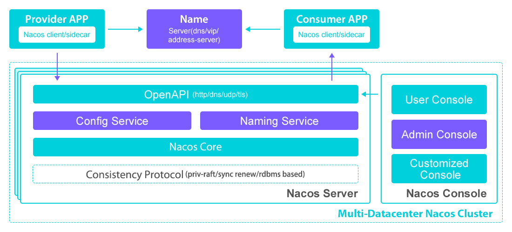

## 二、Nacos 使用

### （一）[搭建 Nacos Server 集群](https://fugary.com/?p=269)

在使用 Nacos 之前，需要先下载 Nacos 并启动 Nacos Server。Nacos 有单机模式和集群模式，直接进行 Nacos 集群搭建。

（1）使用 `域名 + SLB` 模式：


- 外部通过域名进行访问，可读性好，并且换 IP 方便。
- 内部通过内网 SLB（Server Load Balance，不可暴露到公网，以免带来安全风险）访问 Ncoas Server，避免通过直连 Nacos Server。

（2）Nacos 内置 Derby 数据库，但是更[推荐外置数据库](https://github.com/alibaba/nacos/issues/9800)（例如：MySQL）：

- 依赖 Jraft：Jraft 选主异常时不可读写，外置数据库可以做主从切换来保持稳定性，但是 Jraft 超过半数就会有问题。
- 磁盘压力：通常外置数据库可以统一做高性能磁盘，而 Nacos 只有少量持久化数据和日志，不需要高性能的磁盘，如果走 Derby 集群模式，需要性能较高的磁盘，且集群多大就需要多少个高性能磁盘，成本较高。
- 查询数据不便：Derby 只能通过 Nacos 暴露的一个执行 SQL 的接口执行一些操作或查看落地数据。

最终使用 Nginx 1.24.0、Nacos 2.1.1、MySQL 5.7.28 搭建集群：

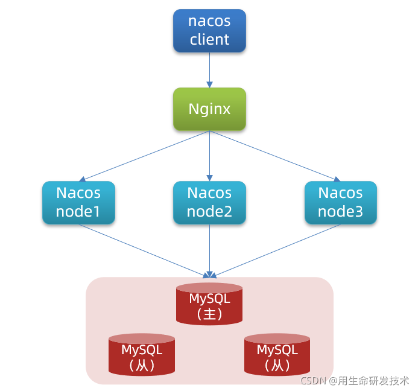

> 注意：
>
> - 在 Nacos 中默认基于 HTTP 的端口号是 8848 ，Nacos 2.0 增加了 gRPC，而 gRPC 有两个地方，一个是和客户端通信，一个是集群节点之间的通信。 Nacos 中 gRPC 的端口号都是基于 HTTP 端口进行一定的漂移，客户端通信端口是漂移 1000，即默认为：`8848 + 1000 = 9848`，而集群之间的通信端口漂移 1001，即默认为：`8848 + 1001 = 9849`。**因此搭建单机集群时注意集群节点的端口号最好间隔开来，例如：8851、8861、8871**。
> - Nacos 2.0 增加了 gRPC 通信方式，**使用 VIP（Virtual IP）/nginx 请求时，需要配置成 TCP 转发，不能配置 http2 转发，否则连接会被 nginx 断开。**解决方式查看：[issue 7556](https://github.com/alibaba/nacos/issues/7556)。

### （二）服务注册发现

Nacos 可以服务注册发现中心使用。

#### 1、使用配置

（1）引入依赖

```xml
<!-- Nacos 服务发现依赖 -->
<dependency>
    <groupId>com.alibaba.cloud</groupId>
    <artifactId>spring-cloud-starter-alibaba-nacos-discovery</artifactId>
    <version>2.2.5.RELEASE</version>
</dependency>
```

假如使用 Nacos 2021.1 依赖，Nacos 2021.1 依赖中没有自带 Ribbon 整合，需要自己引入负载均衡依赖：

```xml
<dependency>
    <groupId>com.alibaba.cloud</groupId>
    <artifactId>spring-cloud-starter-alibaba-nacos-discovery</artifactId>
    <version>2021.1</version>
</dependency>

<dependency>
    <groupId>org.springframework.cloud</groupId>
    <artifactId>spring-cloud-starter-loadbalancer</artifactId>
</dependency>
```

（2）编写配置

```yml
spring:
  application:
    name: nacos-payment-provider
  cloud:
    nacos:
      discovery:
        server-addr: 192.168.190.134:8848 # Nacos Server 地址，多个可以用逗号隔开，

management:
  endpoints:
    web:
      exposure:
        include: "*"
```

（3）启动 Nacos 集群，就可以进行服务注册发现。

#### 2、[ephemeral](https://www.joshua317.com/article/186)

Nacos 通过 `spring.cloud.nacos.discovery.ephemeral` 配置服务实例类型：true（默认值）为临时实例；false 为持久化实例。

> 注意：
>
> - **issue 10920**：Nacos 2.x 后，一个服务名下的服务只能**全部为临时实例**或**全部为持久化实例**。
>
> - 临时实例在服务下线后便会自动删除，持久化实例在服务下线后需要手动注销：
>
>   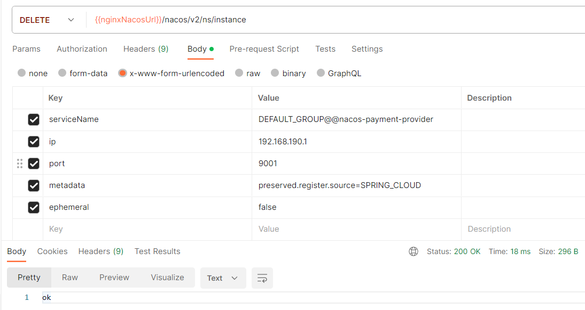

临时实例与持久化实例的区别：**主要体现在服务器对实例的处理上**。

（1）临时实例

临时实例向 Nacos 注册，Nacos 不会对其进行持久化存储，在客户端下线后便会自动删除。

客户端**通过心跳上报方式**告知服务端 Nacos 健康状态，默认心跳间隔 5 秒，nacos 会在超过 15 秒未收到心跳后将实例设置为不健康状态，超过 30 秒将实例删除。

对于临时实例，健康检查失败，则直接可以从列表中删除。这种特性就比较适合那些需要应对流量突增的场景，服务可以进行弹性扩容。当流量过去之后，服务停掉即可自动注销了。

（2）持久化实例

持久化实例向 Nacos 注册，Nacos 会对其进行持久化处理，在客户端下线后需要手动注销实例。

Nacos **主动探知客户端**健康状态，默认间隔为 20 秒，健康检查失败后实例会被标记为不健康，不会被删除。

对于持久化实例，健康检查失败，会被标记成不健康状态。它的好处是运维可以实时看到实例的健康状态，便于后续的警告、扩容等一些列措施。

#### 3、[保护阈值](https://www.joshua317.com/article/186)

在持久化服务中，实例有健康和不健康之分，在正常情况下，Nacos 只会返回健康实例。但是网络总是不可靠的，例如：服务 A 有 100 个实例，98 个都处在不健康状态，流量洪峰的到来可能会直接打垮剩余的 2 个服务，进一步产生雪崩效应。

保护阈值（`保护阈值 = 健康实例数 / 总实例数`）意义在于**健康实例数小于保护阈值**时，保护阈值会被触发（状态为 true），Nacos 会把所有服务实例（健康和不健康）信息都返回给消费者，消费者可能访问到不健康的实例，请求失败，但这样也⽐造成雪崩要好。**牺牲了⼀些请求，保证了整个系统的可⽤**。

### （三）配置中心

Nacos 可以作为服务配置中心使用，相当于 Config + Bus。

#### 1、使用配置

（1）引入依赖

```xml
<!-- Nacos 配置中心 -->
<dependency>
    <groupId>com.alibaba.cloud</groupId>
    <artifactId>spring-cloud-starter-alibaba-nacos-config</artifactId>
    <version>2.2.5.RELEASE</version>
</dependency>
```

（2）编写配置

```yml
spring:
  application:
    name: nacos-config-client
  profiles:
    active: dev
  cloud:
    nacos:
      discovery:
        server-addr: 192.168.190.134:8848
      config:
        server-addr: 192.168.190.134:8848
        file-extension: yml # 指定 yml 文件
```

（3）启动集群就可以获取到配置

#### 2、dataId

Nacos 通过 dataId 确定要读取的配置文件，dataId 格式为：

```text
${profile}-${spring.profile.active}-${file-extension}
```

- `prefix`：通过 `spring.cloud.nacos.config.prefix` 配置指定，默认为 `spring.application.name` 配置值。
- `spring.profile.active`：通过 `spring.profile.active` 配置指定，当该配置值不存在时，dataId 格式就是 `${profile}-${file-extension}`。
- `file-extension`：通过 `spring.cloud.nacos.config.file-extension` 配置指定，目前值只能为 properties、yml、yaml。


### （四）[namespace、group](https://blog.csdn.net/qq_35971751/article/details/122617835)

**情景 1**：

在实际开发中：公司可能有很多部门，每个部门可能有很多微服务子项目，每个项目又有 dev、test、prod 等相应的开发环境。假如只有一个 Nacos 集群，所有的服务和配置都放在此集群下面，那么就会导致 Console 页面乱糟糟的，也不好管理。

---

Nacos 提供 namespace（命名空间隔离）和 group（组隔离）对服务和配置**进行更细化的管理**。

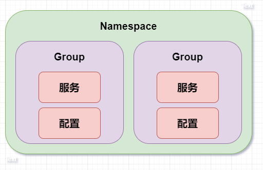

namespace 需要先在 Nacos Server 中创建（默认为 public）：

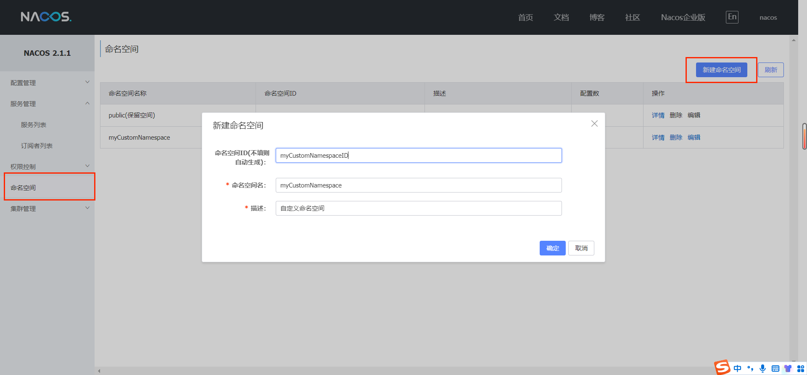

group 是逻辑概念，只需要在服务或配置中指定就可以（默认为 DEFAULT_GROUP）：

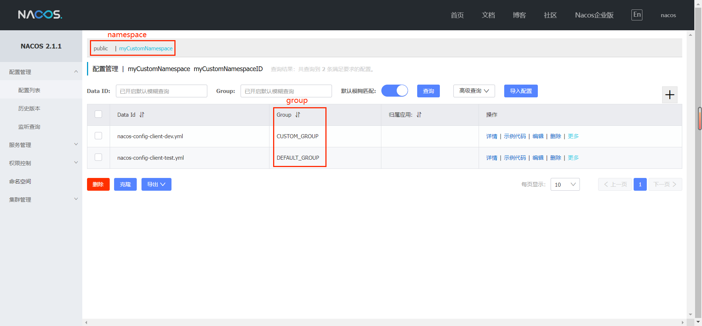

#### 1、配置中心

在创建配置文件时，需要先指定 namespace（默认为 public），再指定 group 名称（默认为 DEFAULT_GROUP）和 dataId 名称。

修改微服务的 bootstrap.yml 配置文件：

```yml
spring:
  application:
    name: nacos-config-client
  profiles:
    active: dev
  cloud:
    nacos:
      config:
        server-addr: 192.168.190.134:8848
        file-extension: yml # 指定yaml文件
        namespace: myCustomNamespaceID # 命名空间 namespace ID，读取此 namespace 下的配置
        group: CUSTOM_GROUP # 组名
        extension-configs: # 指定配置文件的格式
          - data-id: nacos-config-client-test.yml # 指定配置文件名
            group: DEFAULT_GROUP # 组名
            refresh: true # 是否自动刷新
```

就可以读取 `myCustomNamespace → CUSTOM_GROUP → nacos-config-client-dev.yml` 配置文件。此外还可以通过 extension-configs 配置获取同一 namespace 下其他 group 内指定 dataId 的配置文件。优先级为：远程覆盖本地的，group 覆盖 extension-configs 配置。

#### 2、服务注册发现

**情景 1**：

有服务 A 和 B，这个两个服务需要通过注册中心相互调用，此时我本地调试时已经注册到 Nacos 中。假如同事小明也在本地调试服务 A 和 B（没有修改配置文件），也会注册到 Nacos 中。

此时注册中心有：服务 A（我注册的 A1 实例，小明注册的 A2 实例），服务 B（我注册的 B1 实例，小明注册的 B2 实例）。

- 不做处理：我本地调试时，Ribbon 负责均衡可能就会调用到小明注册的服务实例。
- 修改 bootstrap.yml 中的 namespace：每个人员都需要创建一个 namespace。
- 修改服务名（spring.application.name）：同时需要修改 Ribbon 负载均衡时的服务名，工作量更大了。

能不能对一个服务下的服务实例再进行分组管理，例如：服务 A（分组 1：我注册的 A1 实例，分组 2：小明注册的 A2 实例），服务 B（分组 1：我注册的 B1 实例，分组 2：小明注册的 B2 实例），调试时我只调用分组 1 下的实例。

---

在服务注册发现中又另外提供了 cluster（集群隔离）的概念，可以对一个服务的实例再进行细化管理：

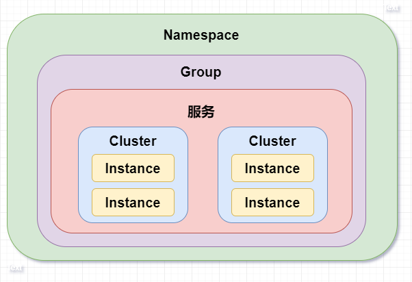

cluster 是逻辑概念，只需要在配置文件中指定就可以。

（1）修改微服务提供者的 application.yml 配置文件：

```yml
spring:
  application:
    name: nacos-payment-provider
  cloud:
    nacos:
      discovery:
        server-addr: 192.168.190.134:8848
        cluster-name: one # 将此服务实例分配到 one 集群分组
```

此时 nacos-payment-provider 服务下的实例分布如下：

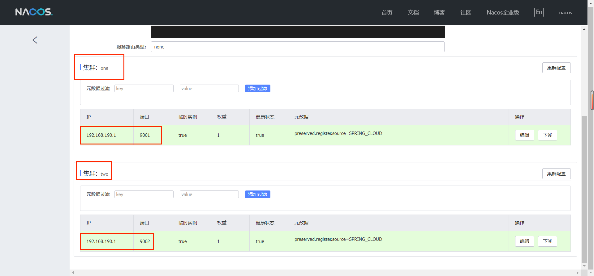

（2）修改微服务消费者的 application.yml 配置文件：

```yml
spring:
  application:
    name: nacos-order-consumer
  cloud:
    nacos:
      discovery:
        server-addr: 192.168.190.134:8848
        cluster-name: one # 只调用 one 集群分组的服务实例

nacos-payment-provider:
  ribbon:
    NFLoadBalancerRuleClassName: com.alibaba.cloud.nacos.ribbon.NacosRule # 指定 Ribbon 负载均衡策略
```

## 三、原理

### （一）AP 和 CP

[CAP 原则](https://blog.csdn.net/yeyazhishang/article/details/80758354)：是指在一个分布式系统中，Consistency（一致性）、 Availability（可用性）、Partition tolerance（分区容错性），最多只能同时三个特性中的两个，三者不可兼得。

- C（Consistency，一致性）：所有节点在同一时间的数据完全一致。
- A（Availability，可用性）：保证每个请求在一定时间内得到正确的响应。
- P（Partition Tolerance，分区容错性）：在分布式系统中，遇到某节点或网络分区故障的时候，仍然能够对外提供满足一致性或可用性的服务。

在分布式系统中，必须满足 P：

- 如果要保证一致性（C），即所有节点的数据随时随刻都是一致的，而要保证数据一致性，就需要**让全部节点数据同步完成后才可以对外提供服务**。

  在 **CP** 的情况下，两个服务节点间网络异常时，为保证一致性，仍然会在**写入数据时等待同步完成或者直至超时**，进而牺牲了可用性（A）。

- 如果要保证可用性（A），即只要不是服务宕机所有请求都可得到正确的响应，而要保证可用性，就需要**让客户端连接的节点在一定时间内响应**。

  在 **AP** 的情况下，两个服务节点间网络异常时，为保证可用性，**若有限时间内数据同步没有完成，则不会等待，导致节点间数据不一致**，进而牺牲了一致性（C）。

Nacos 支持 AP（默认值） 和 CP 原则：

- 对于临时服务，采用 AP 原则保证注册中心的可用性，使用 Distro 协议。
- 对于持久化服务，采用 CP 原则保证注册中心各节点的一致性，采用 Jraft 协议。

> 注意：[issue 3045](https://github.com/alibaba/nacos/issues/3045)，Nacos 2.x 就不支持 `{{nginxNacosUrl}}/nacos/v1/ns/operator/switches?entry=serverMode&value=AP` 这种请求了，而是直接通过 ephemeral（true 为 AP，false 为 CP）指定服务的 CAP 模式。

### （二）[Distro 协议](https://www.51cto.com/article/707999.html)

Distro 协议是 Nacos 对于临时实例数据开发的一致性协议。

**Distro 协议有以下特点**：

- 平等机制：Nacos 的每个节点是平等的，都可以处理写请求。
- 异步复制机制：Nacos 把变更的数据异步复制到其他节点。
- 健康检查机制：每个点的数据不是实时一致的，定期检查节点状态保持数据一致性。
- 本地读机制：每个节点独立处理处理读请求，及时从本地发出响应。
- 新节点同步机制：临时数据都是存储在内存缓存中，节点在启动时从其他节点进行全量数据同步。
- 路由转发机制：对写请求进行路由计算，找到指定的节点，如果是当前节点，则自己处理；否则，转发给其他节点。

**Distro 写请求机制流程**：

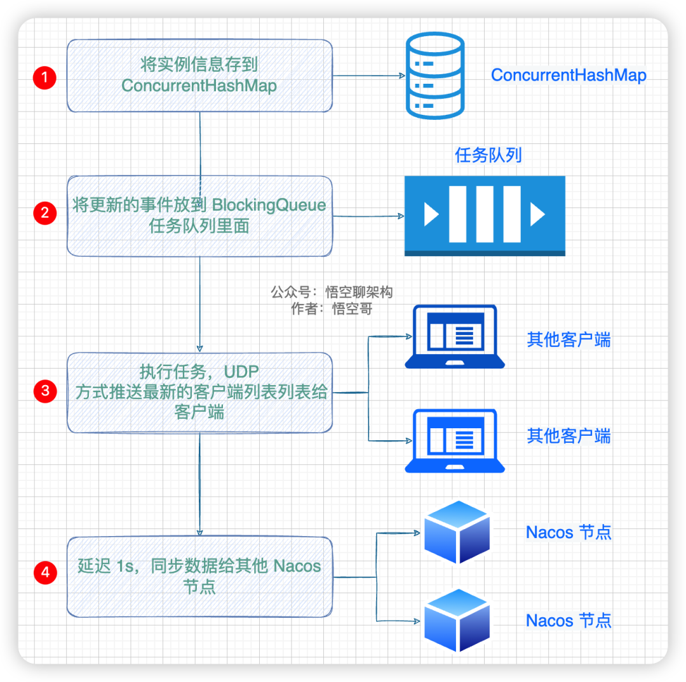

### （三）[Raft 协议](https://www.cnblogs.com/crazymakercircle/p/14343154.html)

> [Jraft](https://github.com/sofastack/sofa-jraft) 协议基于 Raft 协议，使用 Java 语言进行实现，并对其进行一些改进，直接看 Raft 协议的原理。
>
> 推荐结合 [Raft Visualization](https://raft.github.io/) 一起使用、理解。

#### 1、Raft 角色

在 Raft 协议中节点有三种角色：

（1）领导者（Leader）

一个集群只有一个 Leader 节点，Leader 负责协调集群中的其他节点。有以下作用：

- 处理写请求、管理日志复制。
- 不断地发送心跳信息，与其它节点保持联系。

（2）Follower（跟随者）

一个集群中有多个 Follower 节点，有以下作用：

- 不断地发送心跳信息，与 Leader 节点保持联系。
- 将客户端的写请求转发给 Leader 节点。

（3）Candidate（候选人）

当 Follower 节点在超时时间内没有收到 Leader 节点的心跳信息后，会转变成 Candidate 节点，具有成为 Leader 节点的潜力。Candidate 节点会向其它节点发送投票信息，如果赢得超过半数节点的投票，就晋升为 Leader 节点。

#### 2、领导选举

当集群刚启动或 Leader 节点断联时，会产生领导选举。不过要先了解以下两个名词：

（1）随机超时时间

每个节点（Follower 和 Candidate）内都有一个计时器，用于生成一个**随机超时时间**：

- Follower 节点：当 Follower 节点随机超时时间内没有收到 Leader 节点的心跳信息，便会转变成 Candidate 节点，同时 Term 任期自增。
- Candidate 节点：当 Candidate 节点随机超时时间内没有收到 Leader 节点的心跳信息，Term 任期自增。

（2）Term 任期

Term 是一个自增的整数，当节点随机超时时间没有收到 Leader 节点的心跳信息，则将自身的 Term 任期自增加 1。

> 和 ZAB 中 epoch 不同的是，epoch 是先被选举为 Leader 节点，再将 epoch + 1；Term 是只要超过随机超时时间没有收到 Leader 节点心跳信息，就会 Term + 1。

**领导选举过程如下**：

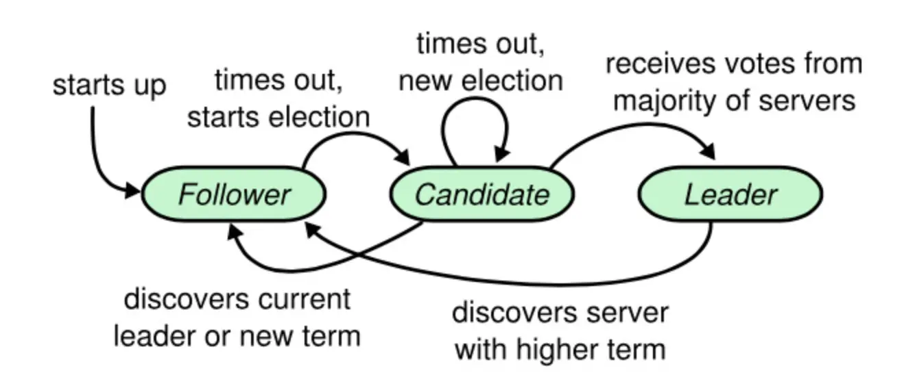

（1）当集群刚启动或 Leader 节点断联时，节点都是 Follower 节点，内部有着随机超时时间。

（2）当 Follower 或 Candidate 节点超过超时时间没有收到 Leader 的心跳时，此时 Follower 节点会转变成 Candidate 节点，此时 Candidate 会做如下操作：

1. 生成新的随机超时时间，将 Term 任期加 1，先向自己投 1 票，再向其它节点发起选举，每个节点每轮只能投 1 票，**且先来先得**。
2. 其它节点收到 Candidate 选举投票时会进行以下操作：
   - 如果接收到的 **Term 大于自己的 Term** 并且**日志比自己的日志新**，就认可当前收到的投票，表示选举该节点，同时更新本身的 Term 值。
     - 如果**日志 Term 大于自己最后一条日志条目的 Term**，则说明新。
     - 如果**日志 Term 等于自己最后一条日志条目的 Term**，则比较日志条目索引：
       - 如果**日志索引大于等于自己最后一条日志条目的日志索引**，则说明新。
   - 否则，就拒绝此次投票，不做任何更改。
3. 当 Candidate 节点收到超过半数以上节点的投票时，就转变成 Leader 节点。

由于**超时时间随机生成**，因此大多数情况下，只有 1 个 Follower 节点**最先超时**转变成 Candidate 节点，然后发起投票流程。

> 这一点也和 ZAB 选举不一样，ZAB 是每个节点第一轮都会进行广播选票。
>
> 随机超时时间可以减少发起选举的节点数，降低选票瓜分的可能，减少网络流量。

假如很不幸，多个节点的随机超时时间相同，导致多个 Follower 节点转变成 Candidate 节点并同时发起投票，但是由于**节点间网络速度不一致**，只有 1 个 Candidate 节点先获取半数以上投票，转变成 Leader 节点。

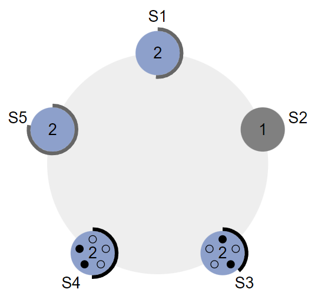

假如更不幸，多个 Candidate 平分选票，就会导致这轮选举失败。所有节点继续等待新的随机超时时间超时，进行下一轮选举，重复步骤（2）。

#### 3、[日志复制](https://juejin.cn/post/7080138285753827336#heading-7)

当集群选出 Leader 节点后，Leader 节点就开始为集群服务，进行日志复制，先了解一下 Raft 中日志的结构：

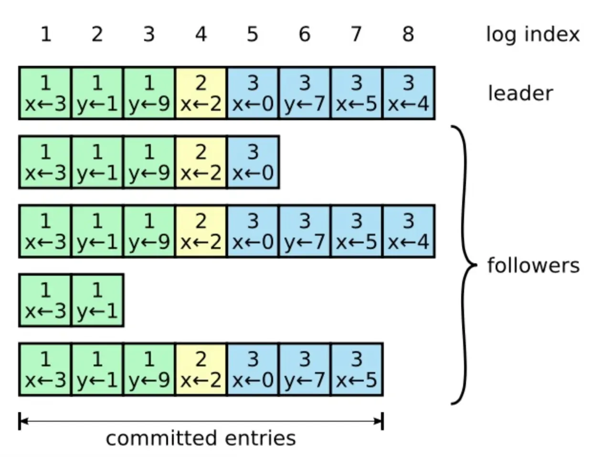

日志由日志条目组成，每一个日志条目包含三种属性：LogIndex（日志索引）、Term（任期）、Command（指令，可以理解为写请求）。有以下特点：

- 如果在不同的日志中的**两个条目拥有相同的索引和任期号**，那么他们**存储了相同的指令**。
- 如果在不同的日志中的**两个条目拥有相同的索引和任期号**，那么他们**之前的所有日志条目也全部相同**。

**日志复制流程**：

0. Client 发起写请求，如果是 Follower 节点接收到该请求，那么它会将该请求转发给 Leader 节点处理。

1. Leader 将此写请求转化为一个日志条目，Leader 节点更新日志，并进行消息发送，通知 Follower 节点也更新日志。

2. Follower 接收到日志条目后，会与自身最后一条日志条目进行比较，进行如下操作：

   - 如果接收到的日志条目中 **Term 大于自己的 Term** 并且 **LogIndex 等于自己最后一个日志条目 LogIndex + 1**，则日志更新成功。

   - 否则，说明两者日志不一致，日志更新失败。Leader 将 LogIndex 递减并重发日志条目，直到与 leader 日志一致。

     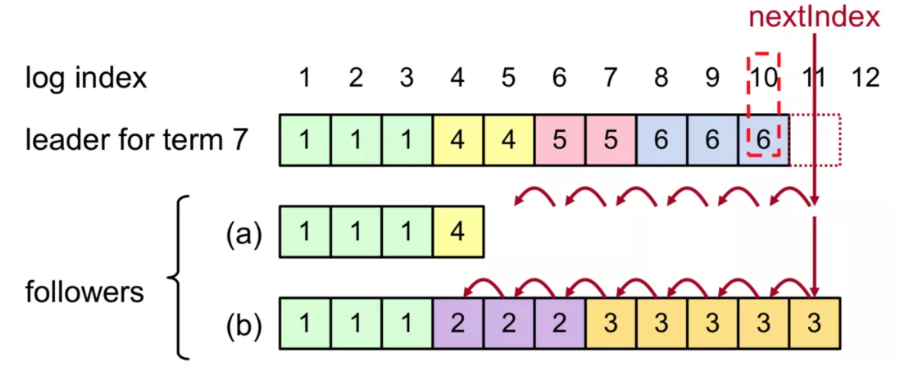

     也就是找到两者日志最后相同的日志条目，从那里开始进行日志复制（**每次只发送一个日志条目**）。

3. 当收到过半的日志复制成功的响应后，Leader 会进行提交操作：

   - 将日志数据更新到本地。
   - 通知 Follower 进行提交操作，将日志数据更新到本地，更新成功后也会返回更新成功的响应。
   - 返回写请求成功响应给 Client。
