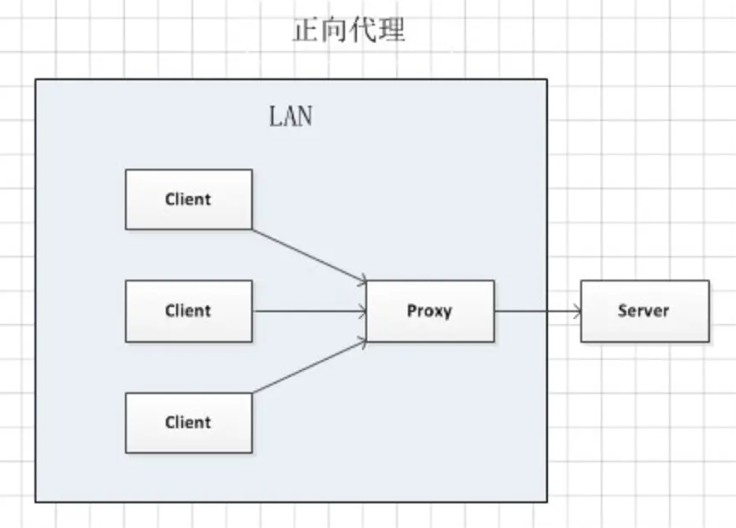
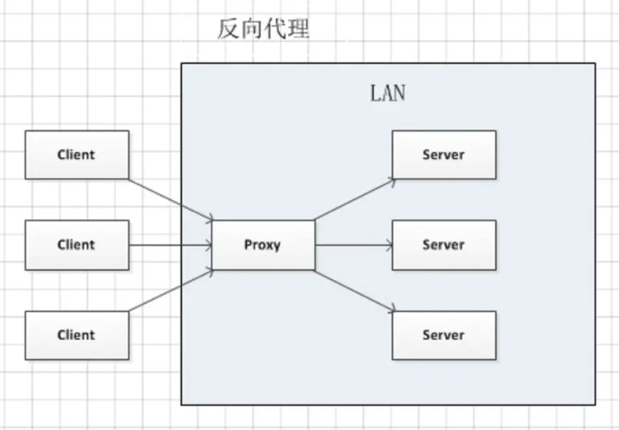
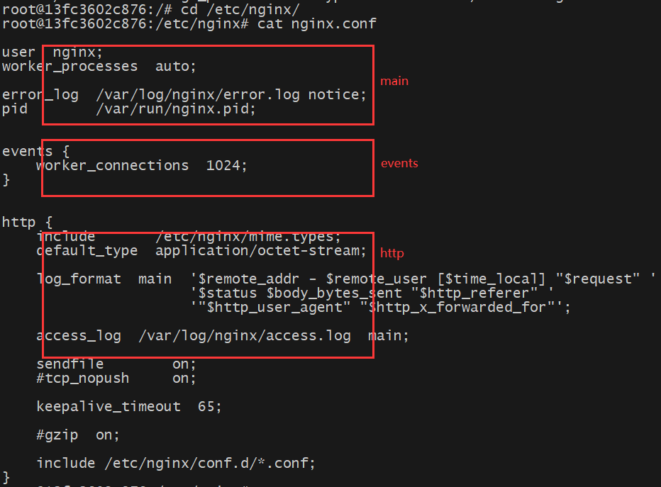
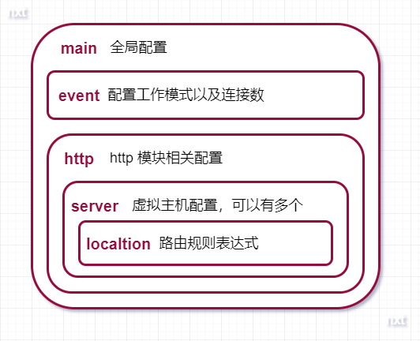

# Nginx

> 基于《Nginx 高性能 Web 服务器详解》
>
> 以下版本为 Docker nginx:1.26

## 一、基本概念

Nginx 是开源的轻量级 Web 服务器、反向代理服务器，以及负载均衡器和 HTTP 缓存器，其特点是高并发、高性能和低内存。

Nginx 专为性能优化而开发，性能是其最重要的考量，实现上非常注重效率，能经受高负载的考验，最大能支持 50000 个并发连接数。 Nginx 还支持热部署，它的使用特别容易，几乎可以做到 7x24 小时不间断运行。 Nginx 的网站用户有：百度、淘宝、京东、腾讯、新浪、网易等。

### （一）正向代理和反向代理

#### 1、正向代理

正向代理（forward proxy）是一个位于客户端和目标服务器之间的服务器（代理服务器），为了从目标服务器取得内容，客户端向代理服务器发送一个请求并指定目标服务器，然后代理服务器向目标服务器转交请求并将获得的内容返回给客户端。



**正向代理的作用：**

- **突破访问限制**：通过代理服务器，可以突破自身 IP 访问限制，访问国外网站，教育网等。
- **提高访问速度**：通常代理服务器都设置一个较大的硬盘缓冲区，会将部分请求的响应保存到缓冲区中，当代理服务器接收到相同请求时， 则直接由缓冲区中取出信息，传给用户，以提高访问速度。
- **隐藏客户端真实 IP**：客户端也可以通过这种方法隐藏自己的 IP，免受攻击。

#### 2、反向代理

反向代理（reverse proxy）是指以**代理服务器来接受 Internet 上的连接请求，然后将请求转发给内部网络上的服务器**，并将从服务器上得到的结果返回给 Internet 上请求连接的客户端，此时代理服务器对外就表现为一个反向代理服务器。



**反向代理的用途：**

- **隐藏服务器真实 IP**。
- **负载均衡**：反向代理服务器可以做负载均衡，根据所有真实服务器的负载情况，将客户端请求分发到不同的真实服务器上。
- **提高访问速度**：反向代理服务器可以对于静态内容及短时间内有大量访问请求的动态内容提供缓存服务，提高访问速度。
- **提供安全保障**：反向代理服务器可以作为应用层防火墙，为网站提供对基于 Web 的攻击行为（例如 DoS/DDoS）的防护，更容易排查恶意软件等。还可以为后端服务器统一提供加密和 SSL 加速（如 SSL 终端代理），提供 HTTP 访问认证等。

---

**相同点：**

- **客户端无法直接访问服务端**，需要通过中间人（代理服务器），将客户端的请求转发给服务端。

**不同点：**

- **正向代理一般是客户端架设的**，比如在自己的机器上安装一个代理软件；**而反向代理一般是服务器架设的**，比如在自己的机器集群中部署一个反向代理服务器。
- **正向代理是代理服务器代表客户端**，去访问服务端；**反向代理是代理服务器代表服务端**，接收客户端的请求，转发给真实的服务端。
- 正向代理主要是用来解决访问限制问题；而反向代理则是提供负载均衡、安全防护等作用。二者均能提高访问速度。

### （二）Nginx 目录结构

Nginx 安装完成后，目录结构及作用如下：

```shell
[root@www ~]# tree /usr/local/nginx
/usr/local/nginx
├── client_body_temp                 # POST 大文件暂存目录
├── conf                             # Nginx所有配置文件的目录
│   ├── fastcgi.conf                 # fastcgi相关参数的配置文件
│   ├── fastcgi.conf.default         # fastcgi.conf的原始备份文件
│   ├── fastcgi_params               # fastcgi的参数文件
│   ├── fastcgi_params.default
│   ├── koi-utf
│   ├── koi-win
│   ├── mime.types                   # 文件扩展名与文件类型映射表
│   ├── mime.types.default
│   ├── nginx.conf                   # Nginx默认的主配置文件，日常使用和修改的文件
│   ├── nginx.conf.default
│   ├── scgi_params                  # scgi相关参数文件
│   ├── scgi_params.default
│   ├── uwsgi_params                 # uwsgi相关参数文件
│   ├── uwsgi_params.default
│   └── win-utf
├── fastcgi_temp                     # fastcgi临时数据目录
├── html                             # Nginx默认站点目录
│   ├── 50x.html                     # 错误页面优雅替代显示文件，例如出现502错误时会调用此页面
│   └── index.html                   # 默认的首页文件
├── logs                             # Nginx日志目录
│   ├── access.log                   # 访问日志文件
│   ├── error.log                    # 错误日志文件
│   └── nginx.pid                    # pid文件，Nginx进程启动后，会把所有进程的ID号写到此文件
├── proxy_temp                       # 临时目录
├── sbin                             # Nginx 可执行文件目录
│   └── nginx                        # Nginx 二进制可执行程序
├── scgi_temp                        # 临时目录
└── uwsgi_temp                       # 临时目录
```

## 二、配置文件

Nginx 最重要的是 nginx.conf 配置文件，大致结构如下：





### （一）main 全局块

全局块是默认配置文件从开始到 events 块之间的一部分内容，主要设置一些影响 Nginx 服务器整体运行的配置，这些配置的作用域是 Nginx 服务器全局。

#### 1、user

指定可以运行 Nginx 服务的用户和用户组，只能在全局块配置。

```properties
user [user] [group];

# 默认值，即所有用户、用户组都可以运行
# user nobody nobody;
```

> 注意：user 配置在 Windows 上不生效，如果你制定具体用户和用户组会报小面警告。

#### 2、worker_processes

指定 Nginx 的 worker 工作进程数，worker 工作进程用于接收客户端请求并进行响应，只能在全局块配置。

```properties
# 默认值为 auto，即根据 CPU 自动进行调整
worker_processes number | auto;
```

#### 3、pid

指定 pid 文件存放的路径，只能在全局块配置。

```properties
pid logs/nginx.pid;
```

#### 4、error_log

指定错误日志的路径和日志级别，只有大于等于该日志级别的日志才会被记录，可以在全局块、http 块、server 块以及 location 块中配置。

```properties
error_log [path] [debug | info | notice | warn | error | crit | alert | emerg];
```

### （二）events 块

events 块涉及的配置主要是 Nginx 服务器与用户的网络连接。

#### 1、accept_mutex

当某一时刻只有一个网络连接到来时，多个睡眠进程会被同时叫醒，但只有一个进程可获得连接。如果每次唤醒的进程数目太多，会影响一部分系统性能。在 Nginx 服务器的多进程下，就有可能出现这样的问题。on 开启的时候，将会对多个 Nginx 进程接收连接进行序列化，防止多个进程对连接的争抢，只能在 events 块中进行配置。

```properties
 # 默认值为 on
 accept_mutex on | off;
```

#### 2、multi_accept

如果 multi_accept 值为 false，Nginx 一个工作进程只能同时接受一个新的连接；否则，一个工作进程可以同时接受所有的新连接，只能在 events 块配置。

> 注意：如果 Nginx 使用 kqueue 连接方法，那么 multi_accept 会被忽略，因为这个方法会报告在等待被接受的新连接的数量。

```properties
# 默认值为 off
multi_accept on | off;
```

#### 3、use

指定使用哪种网络 IO 模型，只能在 events 块配置。

```properties
use [select | poll | kqueue | epoll | rtsig | /dev/poll | eventport];
```

其中 select 和 poll 都是标准的工作模式，kqueue 和 epoll 是高效的工作模式，不同的是 epoll 用在 Linux 平台上，而 kqueue 用在 BSD 系统中。对于 Linux 系统，epoll 工作模式是首选。

#### 4、worker_connections

设置允许每一个工作进程同时开启的最大连接数，当工作进程接受的连接数超过这个值时，将不再接收连接，当所有的工作进程都接收满时，连接进入 logback，logback 满后连接被拒绝，只能在 events 块配置。

> 注意：这个值不能超过超过系统支持打开的最大文件数，也不能超过单个进程支持打开的最大文件数，具体[参考](https://cloud.tencent.com/developer/article/1114773)。

```properties
# 默认值为 1024
worker_connections number;
```

### （三）http 块

http 块是 Nginx 服务器配置中的重要部分，代理、缓存和日志定义等绝大多数的功能和第三方模块的配置都可以放在这个模块中。http 块中可以包含自己的全局块（即 http 块开始到 server 块的部分，对其下的 server 块有效），也可以包含 server 块，server 块中又可以进一步包含 location 块。

#### 1、include

include 用于引入其他的 Nginx 配置文件，可以放在配置文件的任何地方，这些引入的配置文件也需要符合规范。

```properties
# 引入 mime 映射文件
include mime.types;
# 引入指定目录下所有以 .conf 文件
include /etc/nginx/conf.d/*.conf;
```

#### 2、default_type

常用的浏览器中，可以显示的内容有 HTML、XML、GIF 及 Flash 等种类繁多的文本、媒体等资源，浏览器为区分这些资源，需要使用 MIME Type。换言之，MIME Type 是网络资源的媒体类型。

Nginx 服务器作为 Web 服务器，必须能够识别前端请求的资源类型。当 Web 服务器收到静态的资源文件请求时，依据请求文件的后缀名在服务器的 MIME 配置文件中找到对应的 MIME Type，再根据 MIME Type 设置 HTTP Response 的 Content-Type，然后客户端（例如浏览器）根据 Content-Type 的值处理文件（例如下载、展示、播放等操作）。

```properties
# 引入 mime 映射文件
include mime.types;
# 默认的 MIME 类型为二进制
default_type application/octet-stream;
```

mime.types 中有一个 types 块，用于设置文件后缀名与 MIME Type 的映射关系。如果 Web 程序没设置，Nginx 也没找到文件后缀名对应的 MIME Type 的话，就使用默认的 Type。

#### 3、access_log

access.log 用于记录 Nginx 服务器提供服务过程应答前端请求的日志，access_log 指定 access.log 记录的位置及日志格式。

```properties
access_log path [format [buffer=size]];

# 关闭 access.log
# access_log off;

# 1、log_format 用于自定义日志格式
# log_format myFormat '$remote_addr–$remote_user [$time_local] $request $status $body_bytes_sent $http_referer $http_user_agent $http_x_forwarded_for';
# 2、指定 access.log 日志的位置和格式，combined 为日志格式的默认值
# access_log log/access.log myFormat;
```

#### 4、sendfile

是否开启 sendfile 零拷贝功能，可以在 http 块、server 块或者 location 块中进行配置。

```properties
# 默认为 false
sendfile on | off;
```

#### 5、sendfile_max_chunk

设置 sendfile 最大数据量，可以在 http 块、server 块或 location 块中配置。

```properties
# 默认为 0，即不设上限
sendfile_max_chunk size;

# sendfile_max_chunk 128k;
```

#### 6、keepalive_timeout

配置连接超时时间，可以在 http 块、server 块或 location 块中配置。Nginx 服务器与用户建立会话连接后，可以保持这些连接打开一段时间，timeout 默认值为 75s，header_timeout 表示在 Response 响应头中 Keep-Alive 属性（`Keep-Alive:timeout=header_timeout`）的超时时间。

```properties
keepalive_timeout timeout [header_timeout];
```

#### 7、keepalive_requests

配置单连接请求数上限，可以在 http 块、server 块或 location 块中配置。 Nginx 服务器端和用户端建立会话连接后，用户端通过此连接发送请求，keepalive_requests 用于限制用户通过某一连接向 Nginx 服务器发送请求的次数。

```properties
# 默认为 100
keepalive_requests number;
```

### （四）server 块

server 块和**虚拟主机**的概念有密切联系。

虚拟主机，又称虚拟服务器、主机空间或是网页空间，它是一种技术，该技术是为了节省互联网服务器硬件成本而出现的。这里的**主机**或空间是由实体的服务器延伸而来，硬件系统可以基于服务器群，或者单个服务器等。虚拟主机技术主要应用于 HTTP、FTP 及 EMAIL 等多项服务，将一台服务器的某项或者全部服务内容逻辑划分为多个服务单位，对外表现为多个服务器，从而充分利用服务器硬件资源。从用户角度来看，一台虚拟主机和一台独立的硬件主机是完全一样的。

在使用 Nginx 服务器提供 Web 服务时，利用虚拟主机的技术就可以避免为每一个要运行的网站提供单独的 Nginx 服务器，也无需为每个网站对应运行一组 Nginx 进程。虚拟主机技术使得 Nginx 服务器可以在同一台服务器上只运行一组 Nginx 进程，就可以运行多个网站。

在前面提到过，每一个 http 块都可以包含多个 server 块，而每个 server 块就相当于一台虚拟主机，它内部可有多台主机联合提供服务，一起对外提供在逻辑上关系密切的一组服务（或网站）。和 http 块相同，server 块也可以包含自己的全局块，同时可以包含多个 location 块。

#### 1、listen

listen 表示当前 server 块监听指定 IP 或端口的请求，只能在 server 块中进行配置。

```properties
listen [address[:port] | port] [default_server] [ssl] [http2 | spdy] [proxy_protocol] [setfib=number] [fastopen=number] [backlog=number] [rcvbuf=size] [sndbuf=size] [accept_filter=filter] [deferred] [bind] [ipv6only=on|off] [reuseport] [so_keepalive=on|off|[keepidle]:[keepintvl]:[keepcnt]];
```

**属性如下：**

- address：监听的 IP 地址（请求来源的 IP 地址），如果是 IPv6 的地址，需要使用中括号 `[]` 括起来，比如 `[fe80::1]` 等。
- port：端口号，如果只定义了 IP 地址没有定义端口号，就使用 80 端口。**这边需要做个说明：要是你压根没配置 listen ，那么那么如果 Nginx 以超级用户权限运行，则使用 `*:80`，否则使用 `*:8000`**。多个虚拟主机可以同时监听同一个端口，但是 server_name 需要设置成不一样；
- default_server：假如通过 Host 没匹配到对应的虚拟主机，则通过 default_server 这台虚拟主机处理，具体的可以[参考](https://segmentfault.com/a/1190000015681272)。
- ssl：标识符，设置会话连接使用 SSL 模式进行，此标识符和 Nginx 服务器提供的 HTTPS 服务有关。
- setfib=number：Nginx-0.8.44 中使用这个变量为监听 socket 关联路由表，目前只对 FreeBSD 起作用，不常用。
- backlog=number：设置 listen()监听函数最多允许多少网络连接同时处于挂起状态，在 FreeBSD 中默认为-1，其他平台默认为 511。
- rcvbuf=size：设置监听 socket 接收缓存区大小。
- sndbuf-size：设置监听 socket 发送缓存区大小。
- accept_filter=filter，设置监听端口对请求的过滤，被过滤的内容不能被接收和处理。只在 FreeBSD 和 NetBSD 5.0+平台下有效。filter 可以设置为 dataready 或 httpready，感兴趣的读者可以参阅 Nginx 的官方文档。
- deferred：标识符，将 accept()设置为 Deferred 模式。
- bind：标识符，使用独立的 bind()函数处理此 address:port；一般情况下，对于端口相同而 IP 地址不同的多个连接，Nginx 服务器将只使用一个监听命令，并使用 bind()函数处理端口相同的所有连接。

```properties
# 只监听来自127.0.0.1这个IP，请求8000端口的请求
listen 127.0.0.1:8000;

# 和上面效果一样
listen localhost:8000;

# 只监听来自127.0.0.1这个IP，请求80端口的请求（不指定端口，默认80）
listen 127.0.0.1;

# 监听来自所有IP，请求8000端口的请求
listen 8000;

# 和上面效果一样
listen *:8000;
```

#### 2、server_name

用于配置虚拟主机的名称，当客户端使用 `name:port` 访问 Nginx 时，会匹配对应 name 的虚拟主机，只能在 server 块中进行配置。

> 我们可以修改 host 文件，映射域名到 Nginx 服务器所在主机 IP 进行测试。

```properties
server_name name [name2 name3 ...];
```

对于 name 来说，可以只有一个名称，也可以由多个名称并列，之间用空格隔开。每个名字就是一个域名，由两段或者三段组成，之间由点号 `.` 隔开，例如：

```properties
server_name myserver.com www.myserver.com;
```

在该例中，此虚拟主机的名称设置为 `myserver.com` 或 `www.myserver.com`。Nginx 服务器规定，第一个名称作为此虚拟主机的主要名称。

在 name 中可以使用通配符 `*`，但通配符只能用在由三段字符串组成的名称的首段或尾段，或者由两段字符串组成的名称的尾段，例如：

```properties
server_name myserver.* *.myserver.com;
```

另外 name 还支持正则表达式的形式，并使用波浪号“~”作为正则表达式字符串的开始标记，例如：

```properties
server name ~^www\d+\.myserver\.com$;
```

在该例中，此虚拟主机的名称设置使用了正则表达式（使用 `~` 标记），正则表达式的含义是：以 www 开头（使用 `^` 标记），紧跟一个或多个 0~9 的数字（`d+`），再紧跟 `.myserver.com`（使用 `\.` 转义 `.`），最后以 `$` 结束正则表达式。
比如对通过 `www1.myserver.com` 访问 Nginx 服务器的请求就可以使用此主机处理，而通过 `www.myserver.com` 的就不可以。

由于 server_name 配置支持使用通配符和正则表达式两种配置名称的方式，因此可能会出现一个名称被多个虚拟主机的 server_name 匹配成功，优先级如下：

1. 准确匹配 server_name。
2. 通配符在开始时匹配 server_name 成功。
3. 通配符在结尾时匹配 server_name 成功。
4. 正则表达式匹配 server_name 成功。
5. 如果处于同一优先级，排在前面的优先处理请求。

除了使用 name 域名的方式配置 server_name，也可以设置为 IP 的形式：

```properties
server_name address;

# 监听客户端发送的 192.168.1.31:80 请求
server_name 192.168.1.31;
```

### （五）location 块

每个 server 块中可以包含多个 location 块，location 块的主要作用是：基于 Nginx 服务器接收到的 URI（例如：`www.myserver.com/uri-string`）的 URI 部分（`/uri-string`）进行匹配。

#### 1、location

在 Nginx 的官方文档中定义的 location 的语法结构为：

```properties
location [= | ~ | ~* | ^~] uri {
  ...;
}
```

**uri 变量**是用于与 URI 匹配的字符串，可以是不含正则表达的字符串（`/uri-string`，**下文以标准 uri 表示**），也可以是包含有正则表达的字符串（`.php$` 表示以 `.php` 结尾的 url，**下文以正则 uri 表示**）。

其中方括号里的部分，是可选项，用来改变 URI 与 uri 变量的匹配方式。在介绍四种标识的含义之前，我们需要先了解不添加此选项时，Nginx 服务器是如何在 server 块中搜索并使用 location 块的 uri 变量和 URI 匹配的。

在不添加此选项时，Nginx 服务器首先在 server 块的多个 location 块中搜索是否有标准 uri 和 URI 匹配，如果有多个可以匹配，就记录匹配度（**前缀匹配**）最高的一个。然后服务器再用 location 块中的正则 uri 和 URI 匹配，当第一个正则 uri 匹配成功，结束搜索，并使用这个 location 块处理此请求；如果正则匹配全部失败，就使用刚才记录的匹配度最高的 location 块处理此请求。

了解了上面的内容，就可以解释可选项中各个标识的含义了：

- `=`：用于标准 uri 前，要求 URI 与 uri 变量严格匹配。如果已经匹配成功，就停止继续向下搜索并立即处理此请求。
- `^～`：用于标准 uri 前，要求 Nginx 服务器找到 URI 匹配度最高的标准 uri 变量后，立即使用此 location 处理请求，而不再使用正则 uri 做匹配。
- `～`：用于表示 uri 变量包含正则表达式，并且区分大小写。
- `～*`：用于表示 uri 变量包含正则表达式，并且不区分大小写。

> 注意：
>
> - 注意如果 uri 变量包含正则表达式，就必须要使用 `～`或者 `～*` 标识。
> - 在浏览器传送 URL 时对一部分字符进行编码，例如：空格被编码为 `%20`、问号被编码为 `%3f` 等。`～` 有一个特点是，它对 URI 中的这些符号将会进行编码处理。比如，如果 location 块收到的 URI 为 `/html/%20/data`，则当 Nginx 服务器搜索到配置为 `～ /html/ /data` 的 location 时，可以匹配成功。

接下来整理一下 location 路径的匹配规则, 以下优先级按照从高到底排序:

- `location = /xxx`：路径精确匹配。
- `location ^~ /xxx`：路径前缀匹配。
- `location ~ xxx`：路径正则匹配。
- `location ~* xxx`：路径正则匹配，不区分大小写，与正则匹配的优先级相同。
- `location /xxx`：路径前缀匹配。
- `location /`：通用匹配，当其他都没有匹配的时候，会匹配这个。

#### 2、root

Web 服务器接收到网络请求之后，首先要在服务器端指定目录中寻找请求资源。在 Nginx 服务器中，root 就是用来配置这个根目录的，可以在 http 块、server 块或者 location 块中进行配置，由于使用 Nginx 服务器多数情况下要配置多个 location 块对不同的请求分别做出处理，因此通常在 location 块中进行设置。

```properties
root path;
```

path 为 Nginx 服务器接收到请求以后查找资源的根目录路径，可以包含 Nginx 中大部分预设的[变量](https://nginx.org/en/docs/varindex.html)，只有 $document_root 和 $realpath_root 不可以使用。

```properties
location /data/ {
    root /locationtest1;
}
```

当 location 块接收到 `/data/index.htm` 的请求时，将在 `/locationtest1/data/` 目录下找到 index.htm 响应请求。

#### 3、alias

在 location 块中，除了使用 root 指明请求处理根目录，还可以使用 alias 改变 location 接收到的 **URI 的请求路径**。

```properties
alias path;
```

path 为修改后的根路径，此变量中也可以包含除了 $document_root 和 $realpath_root 之外的其他 Nginx 预设变量。

```properties
location ~ ^/data/(.+\.(html|htm))$ {
    alias /locationtest1/other/$1;
}
```

当 location 块接收到 `/data/index.htm` 的请求时，根据 alias 的配置，Nginx 服务器将到 `/locationtest1/other` 目录下找到 index.htm 并响应请求（$1 表示路径中正则表达式匹配的第一个参数，这里匹配到 index.htm）。可以看到，通过 alias 的配置，根路径已经从 `/data` 更改为 `/locationtestl/other` 了。

**可以看出 root 和 alias 的区别：**

- root 对路径的处理：root 路径 ＋ location 路径。
- alias 对路径的处理：使用 alias 路径替换 location 路径。

#### 4、index

用于设置请求的默认首页，有两个作用：用户在发出请求访问网站时，请求地址可以不写首页名称；根据其请求内容而设置不同的首页。

```pro
index file;
```

file 变量可以包括多个文件名，其间使用空格分隔，也可以包含其他变量，默认值为 index.html。

```properties
location ~ ^/data/(.+)/web/ $ {
    index index.$1.html index.myl.html index.html;
}
```

当 location 块接收到 `/data/locationtest/web/` 时，匹配成功，它首先将预置变量 $1 置为 locationtest，然后在 `/data/locationtest/web/` 路径下按照 index 的配置次序依次寻找 index.locationtest.html、index.my1.html 和 index.html 页面，首先找到哪个页面，就使用哪个页面响应请求。

#### 5、error_page

如果用户端尝试査看网页时遇到问题，服务器会将 HTTP 错误响应给 Web 浏览器。如果无法显示网页，Web 浏览器会显示网站发送的实际错误网页或 Web 浏览器内置的友好错误消息。Nginx 服务器支持自定义错误网页的显示内容，可以通过这一功能在网站发生错误时为用户提供人性化的错误显示页面。

```properties
error_page code ... [=[response]] uri
```

- code：要处理的 HTTP 错误代码，可以有多个。
- [=[response]]：将 code 指定的错误代码转化为新的错误代码 response。
- uri：错误页面的路径或者网站地址。如果设置为路径，则是以 Nginx 服务器安装路径下的 **html 目录为根路径**的相对路径；如果设置为网址，则 Nginx 服务器会直接访问该网址获取错误页面，并返回给用户端。

```shell
# 1、遇到 404 错误时，响应 html/404.html 页面
error_page 404 /404.html
localtion /404.html {
    root html;
}

# 2、遇到 410 错误时，响应 301 状态码及 html/empty.gif 文件
error_page 410 =301 /empty.gif;

# 3、遇到 403 错误时，响应 http://somewebsite.com/forbidden.html 页面
error_page 403 http://somewebsite.com/forbidden.html;
```

#### 6、proxy_pass

用于将请求转发到其他服务器上，可以实现反向代理、负载均衡、缓存、防盗链等功能。

```properties
proxy_pass url;
```

url 为转发请求的目标地址，可以是完整的 URL 或者 URI，也可以是变量。

#### 7、proxy_set_header

用于设置转发请求的 HTTP 头部信息。

```properties
proxy_set_header 头属性 头属性值;

# 例如
location /api/ {
    proxy_pass http://127.0.0.1:8000;
    proxy_set_header Host $host;
    proxy_set_header X-Real-IP $remote_addr;
    proxy_set_header X-Forwarded-For $proxy_add_x_forwarded_for;
}
```

### （六）upstream

upstream 块和 server 块同一级别，用于定义需要负载均衡的服务器地址及一些配置（例如权重）。

```properties
# 自定义负载均衡服务名
upstream myUpstreamName {
    # weight 越大，优先级越高；
    server 192.168.0.1 weight=8;
    # down 表示当前服务器下线
    server 192.168.0.2 weight=2 down;
    # backup 表示其他服务器都下线时，使用 backup 服务器
    server 192.168.0.3 weight=2 backup;
}

server {
    listen 80;
    server_name localhost;

    location / {
        # 通过反向代理，将请求转发给负载均衡服务
        proxy_pass http://myUpstreamName;
    }
}
```
