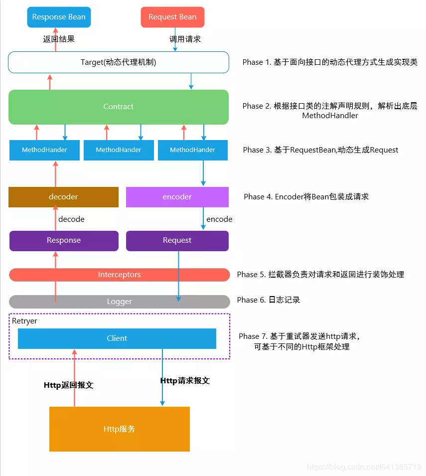
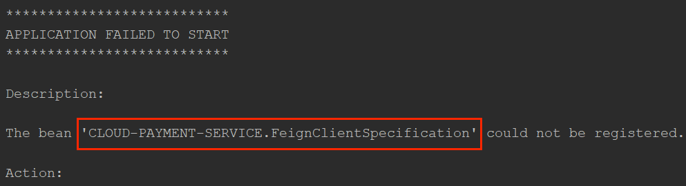
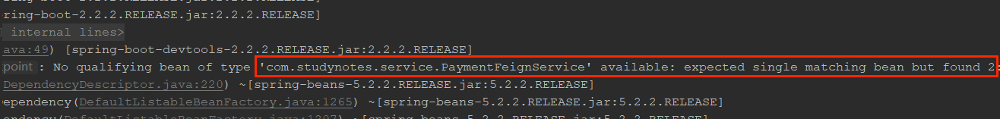

# OpenFeign

> 基于[【官网】](https://cloud.spring.io/spring-cloud-static/Hoxton.SR1/reference/htmlsingle/#spring-cloud-openfeign)

## 一、基本概念

[Feign](https://github.com/OpenFeign/feign) 是 Netflix 开发的开源项目，**是一个声明式、模板化的 HTTP 请求调用轻量级框架**，其灵感来自 Retrofit、JAXRS-2.0 以及 WebSocket。Feign 可帮助我们更加便捷、优雅地调用 HTTP API。

OpenFeign（spring-cloud-openfeign）对 Feign 进行了增强，使其支持 Spring MVC 注解，另外还整合了 Ribbon 和 Nacos，从而使得 Feign 的使用更加方便。

## 二、[Feign 基本使用](https://juejin.cn/post/7054849260247842853)

以 RestTemplate 为例，RestTemplate 对 HTTP 请求封装处理，形成一套模板化的调用方法：

```java
@GetMapping("/payment/get/{id}")
public CommonResult<Payment> get(@PathVariable("id") Long id) {
    String url = "http://localhost:8001";
    return restTemplate.getForObject(url + "/payment/get/" + id, CommonResult.class);
}
```

但是在实际开发中，由于服务依赖的调用可能不止一处，往往一个接口会被多处调用，所以通常都会针对每个微服务自行封装一些客户端类来包装这些依赖服务的调用。

Feign 在此基础上做进一步封装，由它来帮助我们定义和实现依赖服务接口的定义，我们只需要定义一个接口，并且通过注解的形式定义好请求模板，就可以像使用本地接口一样，使用 HTTP 请求。

```java
/**
 * Description: 使用原生的 Feign 进行服务调用
 */
public interface PaymentOriginalFeignService {

    @RequestLine("GET /payment/get/{id}")
    CommonResult<Payment> queryById(@Param("id") Long id);
}
```

```java
@GetMapping("/payment/originalFeign/get/{id}")
public CommonResult<Payment> originalFeignGet(@PathVariable("id") Long id) {
    String url = "http://localhost:8001";
    PaymentOriginalFeignService service = Feign.builder()
        .encoder(new JacksonEncoder())
        .decoder(new JacksonDecoder())
        .target(PaymentOriginalFeignService.class, url);

    return service.queryById(id);
}
```

### （一）执行流程



### （二）[相关注解](https://github.com/OpenFeign/feign#interface-annotations)

Feign 提供的注解如下：

| 注解         | 目标       | 用法                                                                                                                                               |
| ------------ | ---------- | -------------------------------------------------------------------------------------------------------------------------------------------------- |
| @RequestLine | 方法       | 定义请求 的 `HttpMethod`。用大括号括起来的 `Expression` 使用它们对应的带注释的参数来解析。                                                         |
| @Param       | 参数       | 定义一个模板变量，其值将用于解析相应的模板 `Expression`，按作为注释值提供的名称提供                                                                |
| @Headers     | 方法、接口 | 定义一个请求头模板，其中可以使用大括号括起来的表达式，将使用 @Param 注解的参数解析，标注在方法上只针对某个请求，标注在类上，表示作用的所有的请求上 |
| @QueryMap    | 参数       | 定义`Map`名称-值对或 POJO，以扩展为查询字符串。                                                                                                    |
| @HeaderMap   | 参数       | 定义一个`Map`名称-值对，展开成 请求头                                                                                                              |
| @Body        | 方法       | 类似于一个 URI 模板，他使用 @Param 注解的参数来解析模板中的表达式                                                                                  |

## 三、OpenFeign 基本使用

Openfeign 对 Feign 进行了封装，使其支持了 Spring MVC 标准注解和 HttpMessageConverters。

```java
@SpringBootApplication
// 开启 Feign 的功能
@EnableFeignClients
// 启动类
public class OrderFeignMain80 {

    public static void main(String[] args) {
        SpringApplication.run(OrderFeignMain80.class, args);
    }
}
```

```java
@FeignClient(value = "CLOUD-PAYMENT-SERVICE", path = "/payment")
public interface PaymentFeignService {

    @GetMapping("/get/{id}")
    CommonResult<Payment> queryById(@PathVariable("id") Long id);

    @GetMapping("/create")
    CommonResult<Payment> create(@RequestBody Payment payment);
}
```

```java
@Resource
private PaymentFeignService paymentFeignService;

@GetMapping("/payment/get/{id}")
public CommonResult<Payment> get(@PathVariable("id") Long id) {
    return paymentFeignService.queryById(id);
}
```

OpenFeign 也可以与负载均衡器（例如：Ribbon）和服务注册发现中心（例如：Eureka）组合使用，实现高可用性。当然这都是可以配置的：

```yml
# 禁止 Ribbon，就会使用 LoadBanlancer
spring.cloud.loadbalancer.ribbon.enabled: false
# 使用 Eureka 作为服务注册发现中心
eureka:
  client:
    # 不注册进eureka服务中心，不需要 @EnableEurekaClient
    register-with-eureka: false
    service-url:
      defaultZone: http://eureka7001.com:7001/eureka/,http://eureka7002.com:7002/eureka/
# 使用 Okhttp 发送请求
feign.okhttp.enabled: true
```

### （一）@EnableFeignClients

@EnableFeignClients 是 OpenFeign 提供的注解，作用于类，用于开启 OpenFeign 功能，有以下属性：

- value：basePackages 属性的别名。
- basePackages：扫描指定包及子包中的 @FeignClients 注解的接口。
- basePackageClasses：指定一些类，EnableFeignClients 会扫描这些类所在的包及子包中的@FeignClients 注解的接口，这些类除了被该属性引用外，没有其他用途。
- clients：只扫描 clients 中指定的 @FeignClient 注解的接口，不进行包扫描。
- defaultConfiguration：全局自定义 @Configuration 配置类，覆盖 FeignClientsConfiguration 中的默认配置。

> value、basePackages、basePackageClasses 并集扫描。

[原理](https://andyboke.blog.csdn.net/article/details/86680622)：

- 当程序启动时，@EnableFeignClients 会初始化配置，同时进行包扫描，扫描所有 @FeignClients 的注解的接口，并将这些信息注入 Spring 容器中。
- 通过动态代理的方式为这些接口生成代理类，对接口中的方法进行增强。
- 调用 @FeignClients 注解接口的方法时，进行以下操作：
  - 创建一个 RequetTemplate 对象，该对象封装了 HTTP 请求需要的全部信息，例如：请求参数名、请求方法等信息。
  - 然后由 RequestTemplate 生成 Request，然后把 Request 交给 Client 去处理，这里指的 Client 可以是 JDK 原生的 URLConnection、Apache 的 Http Client 、也可以是 Okhttp。
  - 最后 Client 被封装到负载均衡客户端（例如：使用 Ribbon 的 LoadbalancerFeignClient），服务调用时提供负载均衡功能。

### （二）[@FeignClient](https://blog.csdn.net/shadow_zed/article/details/125282456)

OpenFeign 提供的注解，作用于接口，声明该接口是 OpenFeign 客户端，让 @EnableFeignClients 能扫描到。有以下属性：

1、value、name

指定服务名称，用于进行服务发现。

2、serviceId

已废弃，使用 name 即可。

3、contextId

当我们向某一个服务请求时，由于接口很多，我们不想将所有的调用接口都定义在一个类中，此时我们可能会这样写：

```java
package com.studynotes.service;

@FeignClient(value = "CLOUD-PAYMENT-SERVICE")
public interface PaymentFeignService1 {

    @GetMapping("/payment/get/{id}")
    CommonResult<Payment> queryById(@PathVariable("id") Long id);
}
```

```java
package com.studynotes.service;

@FeignClient(value = "CLOUD-PAYMENT-SERVICE")
public interface PaymentFeignService2 {

    @GetMapping("/payment/create")
    CommonResult<Payment> create(@RequestBody Payment payment);
}
```

value 值相同表示我们想让两个接口都向 CLOUD-PAYMENT-SERVICE 服务进行请求，然而这**会造成项目启动失败**：



因为底层会使用 `name值 + ".FeignClientSpecification"` 作为 Bean 名称，Spring 容器不允许相同的 Bean 名称存在，因此启动失败。@FeignClient 提供 contextId 属性，底层就会使用 `contextId值 + ".FeignClientSpecification` 作为 Bean 名称，从而避免冲突。

4、url

用于配置指定服务的地址，相当于直接请求这个服务，不会使用负载均衡器，一般在调试时使用。

> 注意：以前版本使用 url 时不需要指定 name 值，现在 name 值时必需的。

5、path

定义当前 FeignClient 的统一前缀，等同于作用于类上的 @RequestMapping 的效果。

6、configuration

为该 @FeignClient 指定配置类，可以覆盖 FeignClientsConfiguration 默认配置。

> 注意：配置类可以不加 @Configuration 注解，如果加了，要注意不能被包扫描到，否则会覆盖默认配置，对所有 @FeignClient 生效（和 @RibbonClient 一样）。

7、decode404

当发生调用服务接口不存在（404 错误）时，如果该字段为 true，会调用 decoder 进行解码，否则抛出 FeignException 异常。

解码也就是会返回固定的数据格式，将其封装成调用接口的返回值：

```json
{
  "error": "Not Found",
  "message": "No message available",
  "path": "/user/get11",
  "status": 404,
  "timestamp": "2020-01-05T09:18:13.154+0000"
}
```

8、fallback

定义服务降级的处理类，发生服务降级时，会调用对应接口的容错逻辑。

> 注意：
>
> - fallback 指定的类必须实现 @FeignClient 标记的接口。
>
> - 开启以下配置：
>
>   ```yml
>   feign:
>     circuitbreaker:
>       enabled: true
>   # 注意：feign的fallback， ↑ 新版用这种方式开启。↓ 旧版用这个
>   #  hystrix:
>   #    enabled: true
>   ```

9、fallbackFactory

实现 FallbackFactory 工厂，用于生成 fallback 类实例，通过这个属性我们可以实现每个接口通用的容错逻辑，减少重复的代码。

10、[primary](https://blog.51cto.com/u_15065852/2603544)

我们进行如下的服务调用：

```java
@FeignClient(value = "CLOUD-PAYMENT-SERVICE"， primary = false)
public interface PaymentFeignService {

    @GetMapping("/payment/get/{id}")
    CommonResult<Payment> queryById(@PathVariable("id") Long id);
}
```

默认情况下 OpenFeign 会为 @FeignClient 注解的接口动态代理生成代理类，此时该 PaymentFeignService 接口只有一个实现类，正常注入 Spring 容器。然而当我们使用 fallback 属性时，需要一个处理类，该处理类会实现 PaymentFeignService 接口，并注入 Spring 容器：

```java
@Component
public class PaymentFeigonServiceFallBack implements PaymentFeignService {

    @Override
    public CommonResult<Payment> queryById(Long id) {
        return new CommonResult<>(444, "服务降级返回,---PaymentFeigonService", new Payment(id, "errorSerial"));
    }
}
```

此时就会有一个问题 PaymentFeignService 有两个实现类，Spring 无法知道我们想用该接口的哪个实现类实例，此时就会报错：



primary 作用就相当于 @Primary 注解，为 true（默认值） 时赋予 PaymentFeignService 自动生成的代理类更高优先级，这样就不会报错。

当然，有时候也可以设置为 false，那就是觉得 OpenFeign 为我们生成的代理类不够用，可以自己实现 PaymentFeignService 接口，并添加 @Primary 注解，这样 OpenFeign 就会优先使用自定义实现进行服务调用。

11、qualifier

紧接 primary 的例子，使用 PaymentFeignService 自定义实现时，OpenFeign 自动生成的代理类就被覆盖了、用不了了，此时就可以使用 qualifier 为其指定一个 Bean 名称：

```java
@FeignClient(value = "CLOUD-PAYMENT-SERVICE", path = "/payment", qualifier = "hahahaha")
```

使用时指定 Bean 名称就可以使用：

```java
@Resource(name = "hahahaha")
private PaymentFeignService paymentFeignService;
```

> 注意：@FeignClient 接口的 Bean 名称优先级：qualifier > contextId > name。

### （三）自定义配置

FeignClientsConfiguration 是 OpenFeign 的默认配置类，默认提供以下配置（Bean 名称就是类名）：

| Bean 类型     | 说明                   | 默认实现类                                                                                                                                                                                                                                    |
| ------------- | ---------------------- | --------------------------------------------------------------------------------------------------------------------------------------------------------------------------------------------------------------------------------------------- |
| Decoder       | 解码器                 | org.springframework.cloud.openfeign.support.ResponseEntityDecoder                                                                                                                                                                             |
| Encoder       | 编码期                 | org.springframework.cloud.openfeign.support.SpringEncoder                                                                                                                                                                                     |
| Logger        | 日志类                 | feign.slf4j.Slf4jLogger                                                                                                                                                                                                                       |
| Contract      | 契约类                 | org.springframework.cloud.openfeign.support.SpringMvcContract                                                                                                                                                                                 |
| Feign.Builder | Feign 的构造类         | feign.hystrix.HystrixFeign.Builder                                                                                                                                                                                                            |
| Client        | Feign 的负载均衡客户端 | 如果有 Ribbon 时，就使用 LoadBalancerFeignClient；否则（没有 Ribbon，或者 `spring.cloud.loadbalancer.ribbon.enabled: false`）如果有 LoadBalancer 时，使用 FeignBlockingLoadBalancerClient；Ribbon 和 LoadBalancer 都没有时，使用默认的 Client |

OpenFeign 默认不提供以下 bean，但仍然从应用程序上下文中查找这些类型的 Bean 以创建 Feign 客户端：

- `feign.Logger.Level`：日志隔离级别。
  - NONE：不显示任何日志。
  - BASIC：仅记录请求方法、URL、响应状态及执行时间。
  - HEADERS：除了 BASIC 中定义的信息外，还有请求和响应的头信息。
  - FULL：除了 HEADERS 中定义的信息之外，还有请求和响应的正文及元数据。
- `Retryer`：请求重试。
- `ErrorDecoder`：请求异常解析，对端返回的非正常状态码例如 40x、50x 等状态码，响应将会被该解析器解析。
- `Request.Options`：超时时间设置，用于设置 connectTimeout（连接超时时间）和 readTimeout（请求超时时间）。
- `Collection<RequestInterceptor>`：请求拦截器，根据 Bean 注入的顺序执行。
- `SetterFactory`
- `QueryMapEncoder`：对生成的查询参数映射进行操作。

#### 1、注解方式

可以自定义配置类：

```java
@Configuration
public class MySelfFeign {

    @Bean
    public Contract feignContract() {
        return new feign.Contract.Default();
    }
}
```

上面是将 Contract 契约类改为 Feign 的默认契约，这样只能使用 Feign 自带的注解了，也就是不可以使用 Spring MVC 的注解（例如：@RequestMapping），
而是使用原生 Feign 提供的注解（例如：@RequestLine、@Param） 。

> 注意：
>
> - 配置类可以不加 @Configuration 注解，如果加了，要注意不能被包扫描到，否则会覆盖默认配置，对所有 @FeignClient 生效（和 @RibbonClient 一样）。
> - 相同类型 Bean 就会覆盖默认配置，不是相同名称的 Bean。

#### 2、配置文件

为全局 @FeignClient 设置默认配置：

```yml
feign:
  client:
    config:
      default:
        connectTimeout: 5000
        readTimeout: 5000
        loggerLevel: full
        errorDecoder: com.example.SimpleErrorDecoder
        retryer: com.example.SimpleRetryer
        requestInterceptors:
          - com.example.FooRequestInterceptor
          - com.example.BarRequestInterceptor
        decode404: false
        encoder: com.example.SimpleEncoder
        decoder: com.example.SimpleDecoder
        contract: com.example.SimpleContract
```

也可以为指定服务设置默认配置：

```yml
feign:
  client:
    config:
      feignName: # @FeignClient 的 name 值
        connectTimeout: 5000
```
