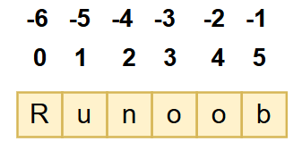
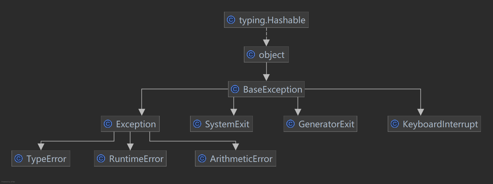
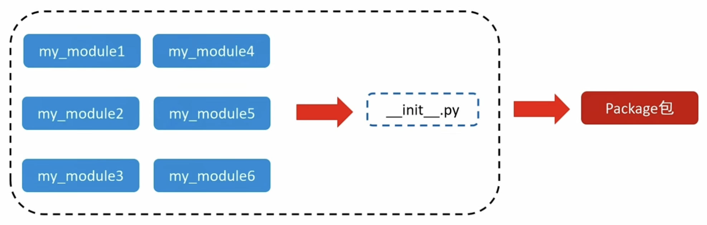
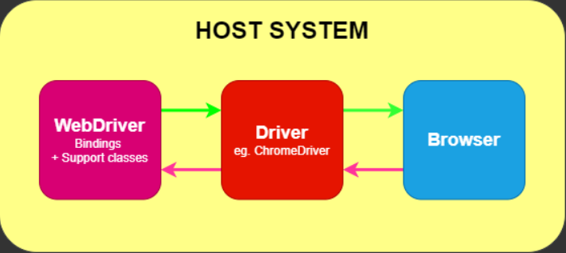
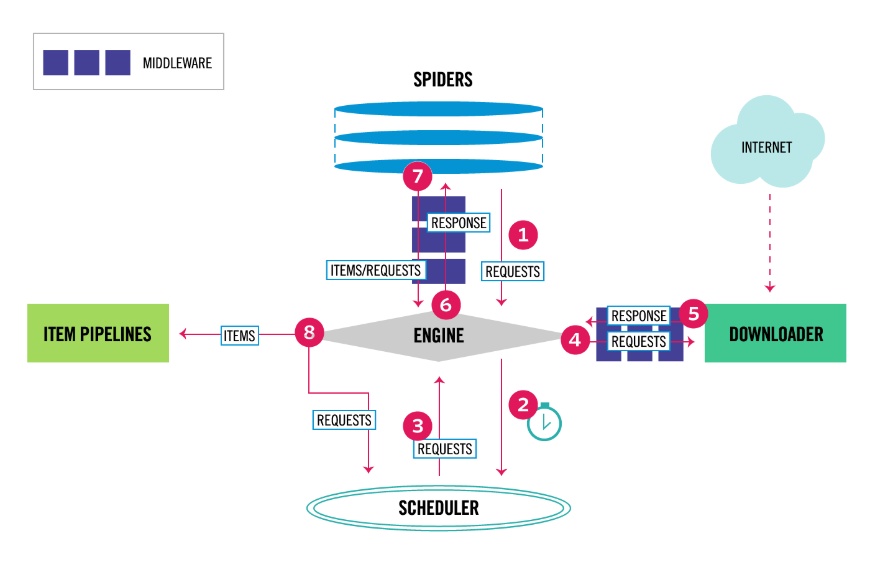

# Python

> 基于 【[官网](https://docs.python.org/zh-cn/3/)】、ChatGPT、《[Python 3 教程](https://www.runoob.com/python3/python3-tutorial.html)》、《[Python 教程](https://gairuo.com/p/python-tutorial)》、《流程的 Python》
>
> 以下版本为 Python 3.10

## 一、基本概念

> **背景：**
>
> Python 语言发明者是一位荷兰程序员，名叫 Guido van Rossum（人称龟叔、也称之为 Python 之父），龟叔之所以设计 Python，是当时市面上已有的编程语言，要么语法复杂、学习成本太高，要么功能不够强大。
>
> - 1989 年圣诞节：Guido von Rossum 开始写 Python 语言的编译器。
> - 1991 年 2 月：第一个 Python 解释器（用于对 Python 源码进行编译，将编译后的代码交给计算机执行）诞生，它是用 C 语言实现的，可以调用 C 语言的库函数。
> - 1994 年 1 月：Python 1.0 正式发布。
> - 2000 年 10 月 16 日：Python 2.0 发布，与此同时，Python 的整个开发过程更加透明，社区对开发进度的影响逐渐扩大，生态圈开始慢慢形成。
> - 2008 年 12 月 3 日：Python 3.0 发布，**它并不完全兼容之前的 Python 代码**，不过因为目前还有不少公司在项目和运维中使用 Python 2.x 版本，所以 Python 3.x 的很多新特性后来也被移植到 Python 2.6/2.7 版本中。
>
> 官方的 Python 解释器是用 C 语言实现的，也是使用最为广泛的 Python 解释器，通常称之为 CPython。除此之外，Python 解释器还有 Java 语言实现的 Jython、C# 语言实现的 IronPython 以及 PyPy、Brython、Pyston 等版本。

**Python 的优缺点：**

- 优点：
  - 简单明了，学习曲线低，比很多编程语言都容易上手。
  - 开放源代码，拥有强大的社区和生态圈，尤其是在数据分析和机器学习领域。
  - 解释型语言，天生具有平台可移植性，代码可以工作于不同的操作系统。
  - 对两种主流的编程范式（面向对象编程和函数式编程）都提供了支持。
- 缺点：
  - 执行效率稍低，还不如 Java。
  - 代码无法加密，由于是解释型语言，在运行时通过解释器翻译成机器代码。
  - 在开发时可以选择的框架太多（如 Web 框架就有 100 多个），有选择的地方就有错误。

**Python 的应用领域：**

- Web 应用后端开发：如 YouTube 、
  Quora、Reddit、Instagram、Netflix 等顶级流量的大站，都构建在 Python 之上。
- 网络数据采集（爬虫）：使用 Python 收集和爬取互联网信息。
- 数据分析。
- 机器学习：不管是机器学习还是深度学习，最常用的工具和框架都可以使用 Python 调用，如 Numpy、TensorFlow 等。
- 云基础设施建设、自动化测试、游戏开发等。

**书写规范：**

- Python 源文件通常以 .py 为扩展名（规范），但这不是必须的。
- Python 程序由一条条语句构成，默认情况是顺序执行，每条语句后不用以 `;` 结束（如果写上也不会报错，只是规范）。
- Python 语言区分大小写。
- 变量名由字母（广义的 Unicode 字符，不包括特殊字符）、数字和下划线构成，不能以数字开头。
- 变量名不要跟关键字（有特殊含义的单词，后面会讲到）和系统保留字（如函数、模块等的名字）冲突。
- 变量名用小写字母拼写，多个单词用下划线连接。

## 二、基本语法

### （一）注释

单行注释：使用一对井号 `#` 包裹着的内容。

```python
# 我是单行注释
```

多行注释：使用一对三个双引号 `"""` 或三个单引号 `'''` 包裹着的内容。

```python
"""
  我是多行注释
"""
```

### （二）数据类型

Python 中常用的有以下数据类型：

| 类型   | 说明                                                                                                                                                                      |
| ------ | ------------------------------------------------------------------------------------------------------------------------------------------------------------------------- |
| 整型   | Python 2.x 中有 int 和 long 两种类型的整数，但区分的意义不大，Python 3.x 中整数只有 int 这一种。<br/>支持二进制（如 `0b100`，换算成十进制是 4）、八进制、十进制和十六进制 |
| 浮点型 | 如 13.14、-13.14                                                                                                                                                          |
| 复数   | 如 4+3j，以 j 结尾表示复数                                                                                                                                                |
| 布尔型 | 布尔表示现实生活中的逻辑，True 表示真，False 表示假                                                                                                                       |
| 字符串 | 描述文本的数据类型，由任意数量的字符组成。如 "hello world!"                                                                                                               |
| 列表   | 有序的可变序列。如 ['red', 'green', 'blue']                                                                                                                               |
| 元组   | 有序的不可变序列。如 ('red', 'green', 'blue')                                                                                                                             |
| 集合   | 无序不重复序列。如 {'red', 'green', 'blue'}                                                                                                                               |
| 字典   | 无序 Key-Value 集合。如 {key1 : value1, key2 : value2, key3 : value3}                                                                                                     |

> 注意：**Python 是动态类型语言**，变量不需要显示声明类型。根据变量引用的对象，Python 解释器自动确定数据类型。

**使用 type() 函数可以查看当前变量的类型：**

```python
name = "hello world!"

print(type(name)) # <class 'str'>
```

Python 提供 str()、int()、float() 等[类型转换函数](https://www.runoob.com/python3/python3-type-conversion.html)，对数据类型进行转换：

```python
num = 1

print(type(num))
print(type(str(num))) # 转成字符串类型后，输出变量类型
```

#### 1、字符串

**字符串在 Python 中有三种写法：**

```python
# 1、单引号定义
name1 = '我是单引号'

# 2、双引号定义
name2 = "我是双引号"

# 3、三个双引号定义
name3 = """
  我是可以换行的三个双引号
"""
```

> 注意：三个双引号定义法和多行注释的写法一样，支持换行操作。使用变量接收它，它就是字符串；不使用变量接受它，它就是多行注释。

当字符串内容中出现单引号或双引号时，有以下三种写法：

```python
# 1、内容中有双引号时，使用单引号定义
name1 = '内容中的"双引号"'

# 2、内容中有单引号时，使用双引号定义
name2 = "内容中的'单引号'"

# 3、使用反斜杠 \ 进行转义
name3 = "内容中的\"双引号\"和\'单引号\'"
```

字符串可以使用加号 `+` 进行拼接：

```python
name1 = "hello"
name2 = "world"

print(name1 + " " + name2)
```

> 注意：字符串只可以和字符串类型进行拼接，和非字符串类型拼接会抛异常。

**对字符串进行格式化：**

```python
name = "Allen"
age = 20
weight = 62.625

# 使用 % 后接变量，替代字符串中的 %s 占位符
desc = "姓名：%s，年龄：%d，体重：%.2f" % (name, age, weight)
print(desc) # 姓名：Allen，年龄：20，体重：62.62
```

> 注意：使用多个变量时，变量要括号括起来，并按照顺序填入。

字符串格式化时提供以下占位符：

| 占位符 | 说明                                                          |
| ------ | ------------------------------------------------------------- |
| %s     | 将变量转换成字符串，取代占位符                                |
| %d     | 将内容转换成整数，取代占位符。                                |
| %f     | 将内容转换成浮点型，取代占位符。默认是 %.6f，保留小数点后六位 |

我们可以使用辅助符号 `m.n` 来控制数据的宽度和精度：

- m：控制宽度，值是数字（很少使用），用于设置的宽度小于数字自身长度，则不生效。
- .n：控制小数点精度，要求是数字，会进行小数的四舍五入示例:

%5d：表示将整数的宽度控制在 5 位，如数字 11，被设置为 `%5d`，就会变成 `   11`，用三个空格补足宽度。

%5.2f：表示将宽度控制为 5，将小数点精度设置为 2，**小数点和小数部分也算入宽度计算**。例如：对 11.345 设置了 `%7.2f` 后，结果是 `  11.35`，因为小数部分限制 2 位精度后，四舍五入为 `.35`；`%.2f` 表示不限制宽度，只设置小数点精度为 2，11.345 设置 `%.2f` 后，结果是 `11.35`。

如果没有精度控制的需求，可以使用 `f"内容{变量}"` 进行快速格式化：

```Python
name = "Allen"
age = 20
weight = 62.625

desc = f"姓名：{name}，年龄：{age}，体重：{weight}"
print(desc) # 姓名：Allen，年龄：20，体重：62.625
```

**字符串操作符：**

Python 不支持字符类型，单个字符在 Python 中也是作为一个字符串使用。可以通过 `[]` 的方式获取字符串内部的单个字符或子串：



```python
string = "0123456789"

print(string[3]) # 3
# 通过 [起始下标:结束下标] 获取子串，左闭右开
print(string[1:4]) # 123
```

假设 a 值为 Hello，b 值为 Python，字符串类型提供以下操作符：

| 操作符                | 描述                                                                 | 实例                     |
| :-------------------- | :------------------------------------------------------------------- | :----------------------- |
| +                     | 字符串连接                                                           | `a + b` 输出 HelloPython |
| \*                    | 重复输出字符串                                                       | `a * 2` 输出 HelloHello  |
| []                    | 通过索引获取字符串中字符                                             | a[1] 输出 e              |
| [ 起始下标:结束下标 ] | 截取字符串中的一部分，遵循**左闭右开**原则                           | a[1:4] 输出 ell          |
| in                    | 成员运算符 - 如果字符串中包含给定的字符返回 True                     | `'H' not in a` 输出 True |
| not in                | 成员运算符 - 如果字符串中不包含给定的字符返回 True                   | `'M' not in a` 输出 True |
| r                     | 原始字符串，所有的字符串都是直接按照字面的意思来使用，不识别转义字符 | `r"hel\"lo"`             |
| f                     | 格式字符串                                                           | `f"{a} {b}"`             |

```python
print("hel\\\"lo") # hel\"lo

print(r"hel\\\"lo") # hel\\\"lo

# print("hel\\"lo") # 报错，字符串定义时必须遵守规范，\\" 不能转义双引号
```

#### 2、列表

Python 中的列表是**有序的可变序列**。

（1）列表的创建：

```python
# 1、使用方括号 [] 创建
my_list = ['Google', 'Runoob', 1997, 2000, 2003, 2004, 2008, 2016]

# 2、使用 list() 函数创建
my_list = list(['Google', 'Runoob', 1997, 2000, 2003, 2004, 2008, 2016])

# 3、创建空列表
my_list = []

# 4、嵌套列表
my_list = [['Google', 'Runoob'], (1997, 2000, 2003, 2004, 2008, 2016)]
```

（2）列表的索引和切片：

```python
# 1、获取指定索引的元素
print(my_list) # ['Google', 'Runoob', 1997, 2000, 2003, 2004, 2008, 2016]

print(my_list[0]) # 'Google'

print(my_list[-1]) # 2016

# print(my_list[8]) # index out of range 异常

# 2、通过切片获取部分元素
print(my_list[1:-2]) # ['Runoob', 1997, 2000, 2003, 2004]
```

（3）列表的操作：

```python
# 1、直接修改元素
my_list[1] = 'RunoobTest'

# 2、删除元素
del my_list[1] # 删除下标为 1 的元素

# 3、删除列表及其定义
del my_list
print(my_list) # 删除后无法访问到该变量
```

> 注意：del 只删除变量及定义，后续再访问该变量时，会显示变量未定义，并不会删除变量引用的对象。

假设 list1 值为 `[1,2,3]`，list2 值为 `[4,5,6]`，列表类型提供以下操作符：

| 操作符 | 描述                                             | 实例                                 |
| ------ | ------------------------------------------------ | ------------------------------------ |
| +      | 列表连接                                         | `list1 + list2` 输出 `[1,2,3,4,5,6]` |
| \*     | 重复输出列表                                     | `list1 * 2` 输出 `[1,2,3,1,2,3]`     |
| in     | 成员运算符 - 如果列表中包含给定的元素返回 True   | `1 in list1` 输出 True               |
| not in | 成员运算符 - 如果列表中不包含给定的元素返回 True | `4 not in list1` 输出 Ture           |

Python 内置函数：

| 函数                       | 描述                                       | 实例                           |
| -------------------------- | ------------------------------------------ | ------------------------------ |
| len(list)                  | 获取列表的长度                             | `len(list1)` 输出 3            |
| max(list)                  | 获取列表元素最大值。列表内元素类型必须相同 | `max(list2)` 输出 6            |
| min(list)                  | 获取列表元素最小值。列表内元素类型必须相同 | `min(list2)` 输出 4            |
| list(list \| tuple \| set) | 将列表、元组、集合转换为列表               | `list((1,2,3))` 输出 `[1,2,3]` |

列表内置方法：

| 方法                       | 描述                                                                   |
| -------------------------- | ---------------------------------------------------------------------- |
| my_list.append(obj)        | 在列表末尾添加元素                                                     |
| my_list.insert(index, obj) | 在列表指定下标插入元素，index 最大有效值为 min(len(my_list), index)    |
| my_list.extend(list)       | 将 list 所有元素添加到列表末尾                                         |
| my_list.remove(obj)        | 删除第一个匹配的元素，如果没匹配到则抛异常                             |
| my_list.pop([index])       | 删除并返回指定索引的元素（默认是最后一个元素）                         |
| my_list.clear()            | 清空列表中的所有元素                                                   |
| my_list.index(obj)         | 获取第一个匹配的元素索引，如果没匹配到则抛异常                         |
| my_list.count(obj)         | 统计某个元素在列表中出现的次数                                         |
| my_list.sort()             | 原地对列表进行排序（默认升序），也可以传递 `reverse=True` 进行降序排序 |
| my_list.reverse()          | 原地反转列表                                                           |
| my_list.copy()             | 获取列表的浅拷贝                                                       |

（4）列表的比较：列表之间的比较是元素逐一进行比较的，遵循字典序规则（从小到大）。

```python
list1 = [1, 2, 3]
list2 = [1, 2, 4]
print(list1 < list2)  # 输出 True，因为 3 < 4
```

#### 3、元组

Python 中的元组是**有序的不可变序列**。

（1）元组的创建：

```python
# 1、使用小括号 () 创建
my_tuple = ('Google', 'Runoob', 1997, 2000, 2003, 2004, 2008, 2016)

# 2、使用 tuple() 函数创建
my_tuple = tuple((1, 2, 3, 4))

# 3、当元组中只有一个元素时，需要在元素后面添加逗号 `,`，否则括号会被当作运算符使用
my_tuple = (1,)

# 4、创建空元组
my_tuple = ()

# 5、嵌套元组
my_tuple = (['Google', 'Runoob'], (1997, 2000, 2003, 2004, 2008, 2016))
```

（2）元组的索引和切片：

```python
# 1、获取指定索引的元素
print(my_tuple) # ('Google', 'Runoob', 1997, 2000, 2003, 2004, 2008, 2016)

print(my_tuple[0]) # 'Google'

print(my_tuple[-1]) # 2016

# 2、通过切片获取部分元素
print(my_tuple[1:-2]) # ['Runoob', 1997, 2000, 2003, 2004]
```

（3）元组的操作：

```python
# 1、元组不可以修改，不能修改元素
# my_tuple[1] = 'RunoobTest'

# 2、元组不可以修改，不能删除元素
# del my_tuple[1] # 删除下标为 1 的元素

# 3、删除元组及其定义
del my_tuple
print(my_tuple) # 删除后无法访问到该变量
```

假设 tuple1 值为 `[1,2,3]`，tuple2 值为 `[4,5,6]`，元组类型提供以下操作符：

| 操作符 | 描述                                             | 实例                                   |
| ------ | ------------------------------------------------ | -------------------------------------- |
| +      | 元组连接                                         | `tuple1 + tuple2` 输出 `[1,2,3,4,5,6]` |
| \*     | 重复输出元组                                     | `tuple1 * 2` 输出 `[1,2,3,1,2,3]`      |
| in     | 成员运算符 - 如果元组中包含给定的元素返回 True   | `1 in tuple1` 输出 True                |
| not in | 成员运算符 - 如果元组中不包含给定的元素返回 True | `4 not in tuple1` 输出 Ture            |

Python 内置函数：

| 函数                        | 描述                                       | 实例                            |
| --------------------------- | ------------------------------------------ | ------------------------------- |
| len(tuple)                  | 获取元组的长度                             | `len(tuple1)` 输出 3            |
| max(tuple)                  | 获取元组元素最大值。元组内元素类型必须相同 | `max(tuple2)` 输出 6            |
| min(tuple)                  | 获取元组元素最小值。元组内元素类型必须相同 | `min(tuple2)` 输出 4            |
| tuple(list \| tuple \| set) | 将列表、元组、集合转换为元组               | `tuple((1,2,3))` 输出 `(1,2,3)` |

元组内置方法：

| 方法                | 描述                                           |
| ------------------- | ---------------------------------------------- |
| my_tuple.index(obj) | 获取第一个匹配的元素索引，如果没匹配到则抛异常 |
| my_tuple.count(obj) | 统计某个元素在元组中出现的次数                 |

（4）元组的比较：元组之间的比较是元素逐一进行比较的，遵循字典序规则。

```python
tuple1 = (1, 2, 3)
tuple2 = (1, 2, 4)
print(tuple1 < tuple2)  # 输出 True，因为 3 < 4
```

#### 4、集合

Python 中的集合是**无序不重复序列**。

（1）集合的创建：

```python
# 1、使用大括号 {} 创建
my_set = ['Google', 'Runoob', 1997, 2000, 2003, 2004, 2008, 2016]

# 2、使用 set() 函数创建
my_set = set({'Google', 'Runoob', 1997, 2000, 2003, 2004, 2008, 2016})

# 3、空集合必须通过 set() 创建，因为 {} 表示空字典
my_set = set()

# 4、通过字符串创建字符集合
my_set = set('abracadabra') # {'d', 'a', 'r', 'b', 'c'}

# 5、不能嵌套集合、元组、列表
# my_set = {{'Google', 'Runoob'}, [1997, 2000, 2003, 2004, 2008, 2016]}
```

> 由于集合的元素是无序的，无法进行比较或通过索引下标进行访问。

（2）集合的操作：

```python
print(my_set)

# 1、不能通过索引访问
# my_set[1] = 'RunoobTest'

# 2、不能通过索引访问
# del my_set[1] # 删除下标为 1 的元素

# 3、删除集合及其定义
del my_set
print(my_set) # 删除后无法访问到该变量
```

假设 set1 值为 `{1,2,3}`，set2 值为 `{3,4,5,6}`，集合类型提供以下操作符：

| 操作符 | 描述                                                                     | 实例                             |
| ------ | ------------------------------------------------------------------------ | -------------------------------- |
| -      | 获取两个集合的差集，即 set1 中包含但 set2 中不包含的元素集合             | `set1 - set2` 输出 `{1,2}`       |
| \|     | 获取两个集合的并集                                                       | set1 \| set2 输出`{1,2,3,4,5,6}` |
| &      | 获取两个集合的交集                                                       | `set1 & set2` 输出 `{3}`         |
| ^      | 获取两个集合的补集（对称差集），即不同时出现在 set1 和 set2 中的元素集合 | `set1 ^ set2` 输出 `1,2,4,5,6`   |
| <      | 判断是否是子集，即 set1 是否是 set 2 的子集                              | `set1 < set2` 输出 False         |
| <=     | 判断是否是子集或者相等                                                   |                                  |
| >      | 判断是否是超集，即 set1 是否是 set2 的超集                               | `set1 > set2` 输出 False         |
| >=     | 判断是否是超集或者相等                                                   |                                  |
| in     | 成员运算符 - 如果集合中包含给定的元素返回 True                           | `1 in set1` 输出 True            |
| not in | 成员运算符 - 如果集合中不包含给定的元素返回 True                         | `4 not in set1` 输出 Ture        |

Python 内置函数：

| 函数                       | 描述                                       | 实例                          |
| -------------------------- | ------------------------------------------ | ----------------------------- |
| len(set)                   | 获取集合的长度                             | `len(set1)` 输出 3            |
| max(set)                   | 获取集合元素最大值。集合内元素类型必须相同 | `max(set2)` 输出 6            |
| min(set)                   | 获取集合元素最小值。集合内元素类型必须相同 | `min(set2)` 输出 4            |
| set(list \| tuple \| set ) | 将列表、元组、集合转换为集合               | `set((1,2,3))` 输出 `{1,2,3}` |

集合内置方法：

| 方法                             | 描述                                                                      |
| -------------------------------- | ------------------------------------------------------------------------- |
| my_set.add(obj)                  | 向集合中添加单个元素，如果该元素已存在，则不会添加                        |
| my_set.remove(obj)               | 删除指定元素，如果元素不存在，则抛异常                                    |
| my_set.discard(obj)              | 删除指定元素，如果元素不存在，不抛异常                                    |
| my_set.pop()                     | 随机删除一个元素                                                          |
| my_set.clear()                   | 清空集合中的所有元素                                                      |
| my_set.copy()                    | 获取集合的浅拷贝                                                          |
| my_set.difference(set)           | 获取两个集合的差集，即 my_set 中包含但 set 中不包含的元素集合             |
| my_set.union(set)                | 获取两个集合的并集                                                        |
| my_set.intersection(set)         | 获取两个集合的交集                                                        |
| my_set.symmetric_difference(set) | 获取两个集合的补集（对称差集），即不同时出现在 my_set 和 set 中的元素集合 |
| my_set.issubset(set)             | 判断是否是子集或者相等                                                    |
| my_set.issuperset(set)           | 判断是否是超集或者相等                                                    |
| my_set.isdisjoint(set)           | 判断两个集合是否**没有**交集                                              |

#### 5、字典

Python 中的字典是**无序 Key-Value 集合**。

（1）字典的创建：

```python
# 1、使用花括号 {} 创建字典
my_dict = {'name': 'runoob', 'likes': 123, 'url': 'www.runoob.com'}

# 2、使用 dict() 构造函数创建字典
my_dict = dict(name='runoob', likes=123, url='www.runoob.com')

# 3、创建空字典：
my_dict = {}
```

（2）字典的操作：

```python
print(my_dict)

# 1、获取字典中键对应的值
print(my_dict['name']) # 键不存在时抛异常

# 2、修改键对应的值
my_dict['name'] = 'runoobTest'

# 3、添加键值
my_dict['gender'] = "Female"

# 4、删除键值
del my_dict['name']

# 5、删除整个字典
del my_dict # 删除后无法访问到该变量
```

字典内置方法：

| 方法                             | 描述                                                                               |
| -------------------------------- | ---------------------------------------------------------------------------------- |
| my_dict.get(key[, default])      | 获取键对应的值，键不存在时返回 default 值（不传递时为 None），不会抛异常           |
| my_dict.setdefault(key, default) | 如果键存在，则返回对应的值；如果键不存在，则添加键值对并返回 default               |
| my_dict.update(dict)             | 将 dict 合并到当前字典。如果键已经存在，则更新其值；如果键不存在，则添加新的键值对 |
| my_dict.pop(key)                 | 删除指定键值，返回键对应的值                                                       |
| my_dict.popitem()                | 随机删除键值，并以元组的形式返回键值                                               |
| my_dict.clear()                  | 清空字典中的所有键值                                                               |
| my_dict.my_list.copy()           | 获取字典的浅拷贝                                                                   |
| my_dict.keys()                   | 以数组的形式返回字典所有的键                                                       |
| my_dict.values()                 | 以数组的形式返回字典所有的值                                                       |
| my_dict.items()                  | 以数组的形式返回字典所有的键值（元组的形式）                                       |

### （三）运算符

Python 中目前主要有以下运算符：

| 运算符                                   | 描述                                                                                                   |
| ---------------------------------------- | ------------------------------------------------------------------------------------------------------ |
| `+` `-` `*` `/` `%`                      | 加、减、乘、除、模                                                                                     |
| `//`                                     | 整除取整。例如 `5 // 2`，值是 2                                                                        |
| `**`                                     | 指数。例如 `2**3` 就是 2³，值是 8                                                                      |
| `=` `+=` `-=` `*=` `/=` `%=` `//=` `**=` | 直接赋值、进行运算后再赋值                                                                             |
| `<<` `>>`                                | 左移、右移                                                                                             |
| `&` \| `^` `~`                           | 按位与、按位或、按位异或、按位取反                                                                     |
| `+` `-`                                  | 正号、负号                                                                                             |
| `<=` `<` `>` `>=`                        | 小于等于、小于、大于、大于等于                                                                         |
| `==` `!=`                                | 等于、不等于                                                                                           |
| `not` `or` `and`                         | 逻辑运算符                                                                                             |
| `in` `not in`                            | 成员运算符，判断左侧值是否是右侧值中的成员，**包括字符串、列表、元组**。例如：`"a" in "cbabc"` 为 True |
| `is` `is not`                            | 身份运算符，用于比较两个变量是否指向同一个内存地址。例如：a 是 20，b 是 30，`a is b` 为 False          |

### （四）控制语句

#### 1、if 条件判断

在 **if** 条件判断中，每个条件后面要使用冒号 `:`，表示接下来是满足条件后要执行的语句块。使用缩进来划分语句块，相同缩进数的语句在一起组成一个语句块。

```shell
# if 判断
if <condition>:
  # 语句;

# if...else... 判断
if <condition>:
  # 语句1;
else
  # 语句2;

# if...else if... 判断
if <condition>:
   # 语句1;
elif <condition>:
   # 语句2;
else
   # 语句3;
```

#### 2、case 条件语句

Python 3.10 增加了 **match...case** 的条件判断，match 后的对象会依次与 case 后的内容进行匹配，如果匹配成功，则执行匹配到的表达式，否则直接跳过。星号 `*` 作用就是表达式没有匹配到任何值时，默认执行的分支。

```python
match 表达式:
  case 值1:
    # 语句1
    ;;
  case 值2:
    # 语句2
    ;;
  case _:
    # 语句3
```

#### 3、for 循环语句

Python **for** 循环可以遍历任何可迭代对象，如一个列表或者一个字符串，还可以后接 else 子句用于在循环结束后执行一段代码。

```python
for 元素 in 可迭代对象:
    # 循环主体
else:
    # 循环结束后执行的代码
```

> 注意：
>
> - else 子句中可以使用 for 中定义的变量。
> - 当使用 break 跳出循环时，不会执行 else 子句。

Python 提供一种独特的数据处理方式——**推导式**，可以从一个数据序列构建另一个新的数据序列的结构体。Python 支持以下数据结构的推导式：

（1）列表推导式，返回列表类型：

```python
[表达式 for 元素 in 可迭代对象]

# 使用 if 条件语句对元素进行判断
[表达式 for 元素 in 可迭代对象 if 判断]

# 例如：
list0 = [s.upper() for s in 'hello world' if s != 'h']
print(list0) # ['E', 'L', 'L', 'O', ' ', 'W', 'O', 'R', 'L', 'D']
```

（2）元组推导式，返回元组类型：

Python 没有元组推导式，元组推导式实际上是通过**生成器表达式**来实现的，需要使用 tuple() 函数创建。

```python
tuple(表达式 for 元素 in 可迭代对象)

# 使用 if 条件语句对元素进行判断
tuple(表达式 for 元素 in 可迭代对象 if 判断)
```

（3）集合推导式，返回集合类型：

```python
{表达式 for 元素 in 可迭代对象}

# 使用 if 条件语句对元素进行判断
{表达式 for 元素 in 可迭代对象 if 判断}
```

（4）字典推导式，返回字典类型：

```python
{键表达式:值表达式 for 元素 in 可迭代对象}

# 使用 if 条件语句对元素进行判断
{键表达式:值表达式 for 元素 in 可迭代对象 if 判断}

# 例如：
dict0 = {"name": "zhangsan", "age": 23}
dict0 = {key: dict0[key] + 'Test' for key in dict0 if key == 'name'}
print(dict0) # {'name': 'zhangsanTest'}
```

#### 4、while 循环语句

**while** 和 if 一样后面使用条件判断表达式，只要条件为真，就会执行循环语句，和 for 循环一样，可以后接 else 子句用于在循环结束后执行一段代码，

```python
while <condition>:
    # 循环主体
else:
    # 循环结束后执行的代码
```

### （五）函数

Python 中默认预定义了许多函数，例如 print()，我们也可以自定义函数：

- 函数代码块以 **def** 关键词开头，后接函数标识符名称和圆括号 **()**。
- 任何传入参数和自变量必须放在圆括号中间，圆括号之间可以用于定义参数。
- 函数内容以冒号 `:` 起始，并且缩进。
- `return 表达式` 结束函数，选择性地返回一个值给调用方，不带表达式的 return 相当于返回 None。

```python
def 函数名(形参1,形参2,形参3......):
    # 语句
    return 表达式

# 调用函数
函数名(实参1,实参2,实参3......)
```

在定义函数时，我们也可以为函数添加注释，方便理解函数及参数的作用：

```python
def 函数名(形参1,形参2,形参3......):
    """
    函数作用说明
    :param 形参1: 形参1说明
    :param 形参2: 形参2说明
    :param 形参3: 形参3说明
    :return: 返回值说明
    """
    # 语句
    return 表达式
```

#### 1、参数

默认情况下，函数定义了几个形参，调用函数时就需要传入几个实参，这些形参就称为**必需参数**：

```python
def test(a, b):
    print("test", a, b)

test("hello", "world") # test hello world
```

此外，Python 还有**关键字参数**的概念，即在传参时添加形参名，就允许实参的传递顺序不需要和形参声明顺序一致，因为 Python 解释器能够用参数名匹配参数值：

```python
def test(a, b):
    print("test", a, b)

# 传参时添加形参名
test(b="world", a="hello") # test hello world
```

在定义函数时，也可以为函数的形参设置默认值，这些形参就称为**默认参数**：

> 注意：在设置形参时，默认参数必须放在非默认参数后面。

```python
# 默认参数必须放在非默认参数后面
def test(a, b="world"):
    print("test", a, b)

test("hello") # test hello world
```

如果需要一个函数能处理比当初声明时更多的参数，这些参数叫做**不定长参数**：

- 在不定长参数前添加星号 `*`，**则传入的实参则会以元组的数据类型存储**：

  ```python
  def test(a, *b):
      print("test", a, b)

  test("hello", 1, 2, 3, 4, 5, 6) # test hello (1, 2, 3, 4, 5, 6)
  ```

- 在不定长参数前添加两个星号 `**`，**则传入的实参则会以字典的数据类型存储**：

  ```python
    def test(a, **b):
        print("test", a, b)

    # 使用关键字参数传参
    test("hello", b=2, c=3, d=4) # test hello {'b': 2, 'c': 3, 'd': 4}
  ```

Python 中使用星号 `*`，**用来说明 `*` 后面的形参必须使用关键字参数的形式传值**。Python3.8 中新增了一个**强制位置参数**——正斜杠 `/`，**用来说明 `/` 前面的形参不能使用关键字参数的形式传值**，即实参必须按照形参的顺序传值。

> 注意：两个符号都仅仅只是说明，并不需要多传入参数。

```python
def f(a, b, /, c, d, *, e, f):
    print(a, b, c, d, e, f)

# f(10, b=20, c=30, d=40, e=50, f=60)   # b 不能使用关键字参数的形式
# f(10, 20, 30, 40, 50, f=60)           # e 必须使用关键字参数的形式
f(10, 20, 30, 40, e=50, f=60) # 10 20 30 40 50 60
```

#### 2、匿名函数

Python 使用 **lambda** 关键字来创建匿名函数。匿名函数是一种小型、匿名的、内联函数，它可以具有任意数量的参数，但只能有一个表达式。

**lambda 函数特点：**

- 匿名函数不需要使用 **def** 关键字定义完整函数。
- lambda 函数是匿名的，它们没有函数名称，只能通过赋值给变量或作为参数传递给其他函数来使用。
- lambda 函数常用于编写简单的、单行的函数，通常只包含一行代码。

```python
# 参数可以包含零个或多个参数，但必须在冒号 `:` 前指定
lambda [参数]: 语句

# 例如：
# 0 个参数
f = lambda: "Hello, world!"
print(f())  # Hello, world!

# 1 个参数
x = lambda a : a + 10
print(x(5)) # 15

# 多个参数
x = lambda a, b : a * b
print(x(5, 6)) # 30
```

#### 3、return 返回值

我们可以使用 **return** 为函数设置返回值：

```python
def 函数(形参......):
    # 语句
    return [表达式]
```

当函数不使用 return 进行返回时，默认返回 **None 字面量**，用于表示空值：

```python
def a():
    print("a")

def b():
    print("b")
    return

def c():
    print("c")
    return None

# 以上三种写法返回值都是 None
print(a()) # None

print(b()) # None

print(c()) # None
```

如果函数有多个返回值，可以使用元组、列表、集合、字典的形式进行返回：

```python
def test():
    return 1, True, "hello"

tup = test()
print(tup) # (1, True, 'hello')
```

#### 4、global 全局变量

在函数外部定义的变量就称为**全局变量**，全局变量在当前 Python 文件中的任何位置都可以直接使用：

```python
name1 = "张三"

def test():
    print(name1, name2)

name2 = "李四"

test() # 张三 李四
print(name1, name2) # 张三 李四
```

在函数内部定义的变量就称为**局部变量**，局部变量只能在函数体内部使用：

```python
def test():
    name1 = "张三"
    name2 = "李四"
    print(name1, name2)

test() # 张三 李四
# print(name1, name2) # 无法通过编译
```

如果我们同时定义了相同变量名的局部变量和全局变量，则局部变量优先级更高：

```python
name = "张三"

def test():
    name = "李四"
    print(name)

test() # "李四"
print(name) # "张三"
```

通过上面的代码我们可以发现，当我们在函数内部对 name 赋值时，name 是作为局部变量，并没有对全局变量 name 重新赋值，即我们在函数内部定义了一个和全局变量同名的局部变量 name。如果**我们想在函数内部对全局变量重新赋值**，就需要使用 **global** 关键字声明 name 是**全局变量**：

```python
name = "张三"

def test():
    global name # 声明 name 是全局变量
    name = "李四"
    print(name)
    global age
    age = 23

test() # "李四"
print(name) # "李四"，可以看到 name 已经被修改了
print(age) # 23，直接使用函数内部定义的全局变量
```

#### 5、嵌套函数和闭包

Python 允许创建嵌套函数，即在函数里面定义函数：

```python
def 父函数():
    # 语句
    def 子函数():
        # 语句
        def 孙子函数():
            # 语句
            ......
```

> 注意：
>
> - 嵌套函数作用域在父函数内，在使用嵌套函数前，需要先定义嵌套函数。
> - 嵌套函数内部可以访问父函数（及以上）作用域内的变量。

```python
def father_function():
    variable = "父函数变量"
    print(variable) # 父函数变量

    def son_function():
        print(variable) # 父函数变量

    son_function()

father_function()
```

闭包是计算机上的一个概念，由于各种资料上对闭包（Closure）的定义非常晦涩难懂，这里就不再引入[原义](<https://zh.wikipedia.org/zh-cn/%E9%97%AD%E5%8C%85_(%E8%AE%A1%E7%AE%97%E6%9C%BA%E7%A7%91%E5%AD%A6)>)。我们可以简单认为：闭包是**某个嵌套函数及其父类（及以上）作用域内变量**的集合，在上面代码中，我们可以认为 son_function() 函数和 variable 变量组成了闭包。

**闭包的用途有：**嵌套函数可以读取父函数内部的变量，并且可以将这些变量一直保存在内存中。例如：

```python
def father_function():
    variable = "父函数变量"

    def son_function():
        return variable

    return son_function

# 获取 son_function 函数
son = father_function()
print(son()) # 执行 son_function 函数，输出：父函数变量
print(son()) # 执行 son_function 函数，输出：父函数变量
```

father_function() 返回值是 son_function()
嵌套函数，我们使用 son 变量接收该返回值，每次调用 son() 函数就可以获取 father_function() 函数中的 variable 变量，而 variable 变量和 son 变量生命周期一致。

#### 6、nonlocal 非全局变量

和 global 的作用类似，不过 nonlocal 只在嵌套函数内使用。如果想在嵌套函数内想要修改父类（及以上）函数作用域内的变量，就需要使用 **nonlocal** 关键字：

```python
def father_function():
    variable = "父函数变量"

    def son_function():
        nonlocal variable
        variable = variable + "modify"
        print(variable)

    son_function()

father_function()
```

#### 7、装饰器

Python 的装饰器（Decorator）是一个函数，它允许你在不修改函数本身的情况下，向函数添加额外的功能或行为。装饰器是 Python 中非常强大且常用的特性，通常用来增强已有函数的功能（代码复用、日志记录、权限验证、性能监控等）。

先看看直接使用函数对另一个函数进行增强的场景：

```python
def my_decorator(func):
    def wrapper():
        print("Before function call")
        func()  # 调用原始函数
        print("After function call")

    return wrapper

def say_hello():
    print("Hello!")

# 获取 wrapper 函数并执行
wrapper = my_decorator(say_hello)
wrapper()

# Output:
#
# Before function call
# Hello!
# After function call
```

装饰器的核心是**高阶函数，也就是参数或返回值都是函数类型**。自定义函数 my_decorator() 接收一个函数 func 作为参数，并返回一个新的函数 wrapper（习惯叫法），这个 wrapper 函数在调用原始函数 func 前后可以执行额外的代码，这个 my_decorator 函数就被称为装饰器。

Python 提供 `@装饰器名` 形式的装饰器语法糖，两者效果相同：

```python
def my_decorator(func):
    def wrapper():
        print("Before function call")
        func()  # 调用原始函数
        print("After function call")

    return wrapper

@my_decorator
def say_hello():
    print("Hello!")

say_hello()
```

如果被装饰的函数带参数或者有返回值，装饰器中的 wrapper 也应该带参数和返回值：

```python
def my_decorator(func):
    def wrapper(name):
        print("Before function call")
        result = func(name)  # 调用原始函数
        print("After function call")
        return result

    return wrapper

@my_decorator
def say_hello(name):
    return "Hello World!"


print(say_hello("zhangsan"))

# Output:
#
# Before function call
# Hello World!
# After function call
```

装饰器也可以接收参数：

```python
def repeat(times):
    def decorator(func):
        def wrapper(*args, **kwargs):
            for _ in range(times):
                func(*args, **kwargs)

        return wrapper

    return decorator

@repeat(3)  # 使得 say_hello 被调用 3 次
def say_hello():
    print("Hello!")

say_hello()

# Output:
#
# Hello!
# Hello!
# Hello!
```

##### （1）内置装饰器

Python 内置了几个常用的装饰器，主要用于常见的功能，例如方法绑定、静态方法定义、类方法定义等。以下是一些常见的内置装饰器：

① @staticmethod

@staticmethod 用于定义一个静态方法。静态方法不需要访问类的实例（即不需要 self 参数），也不需要访问类本身（即不需要 cls 参数）。它就像一个普通的函数，只是它被放在类的命名空间中。

```python
class MyClass:
    @staticmethod
    def greet(name):
        print(f"Hello, {name}!")

MyClass.greet("Alice") # Hello, Alice!
```

② @classmethod

@classmethod 用于定义类方法。类方法的第一个参数是 cls，它指向类本身而不是类的实例。类方法可以访问类的属性和方法，但不能访问实例的属性和方法。

```python
class MyClass:
    @classmethod
    def print_class_name(cls):
        print(f"This is the class: {cls.__name__}")

MyClass.print_class_name() # This is the class: MyClass
```

③ @property

@property 是用于将一个方法转换为只读属性。它允许你像访问属性一样调用方法，并且能够控制该属性的读取和写入行为。@property 装饰器通常用于封装数据，以便外部代码不直接访问对象的内部状态，而是通过方法来控制。

```python
class Circle:
    def __init__(self, radius):
        self._radius = radius

    @property
    def radius(self):
        return self._radius

    @property
    def area(self):
        return 3.14 * (self._radius ** 2)

circle = Circle(5)
print(circle.radius)  # 调用 radius 方法，像属性一样，输出：5
print(circle.area)    # 调用 area 方法，像属性一样，输出：78.5
```

### （六）类

Python 中通过类（Class）和对象（Object）来实现面向对象的编程。类是对象的抽象，而对象则是类的实例。Python 使用 **class** 关键字定义类，格式如下：

```python
class 类名:
    # 语句
```

Python 的类由变量和方法组成，变量可分为类变量和实力变量，方法可分为实例方法、类方法、静态方法。

#### 1、变量

在 Python 的 class 类中，变量（也可称属性）又分为两种：

- 类变量：在 class 内、方法外部定义的变量就称为类变量，类变量可以直接通过 `类名.变量名` 引用。
- 实例变量：在 class 方法内使用 `self.变量名` 形式定义的变量就称为实例变量，实例变量通过 `实例名.变量名` 引用。

```python
global_variable = "我是全局变量"


def function1():
    local_variable = "我是局部变量"
    print(local_variable)


class MyClass:
    class_variable = "我是类变量"

    def __init__(self):
        self.instance_variable = None

    def function2(self):
        self.instance_variable = "我是实例变量"

print(global_variable)  # 我是全局变量

function1()  # 我是局部变量

print(MyClass.class_variable)  # 我是类变量

my_class = MyClass()
# print(my_class.instance_variable) # 直接使用未定义的变量会抛异常
my_class.function2()
print(my_class.instance_variable)  # 我是实例变量
```

> 注意：
>
> - 实例可以直接调用类变量，但是更推荐使用 `类名.变量名` 的方式调用。
> - 推荐（可以不用）预先在 `__init__` 构造方法中定义实例变量，因为如果不先调用 function2 方法，直接使用未定义的实例变量会抛异常。

Python 允许对象动态地添加、修改和删除实例变量，使其具有极大的灵活性：

```python
# 动态添加类变量
MyClass.age0 = 30
print(MyClass.age0) # 30

# 动态添加实例变量
my_class.age1 = 30
print(my_class.age1) # 30

# 修改实例变量
my_class.age1 = 31
print(my_class.age1) # 31

# 删除实例变量
del my_class.age1
print(my_class.age1) # 删除后无法访问到该变量
```

##### （1）特殊内置属性

Python 中为变量、模块、函数、类、对象内置了许多特殊属性，以下面代码为例：

```python
# test.py

"""模块注释"""

"""变量注释"""
name = "张三"


def function1():
    """函数注释"""
    pass

class MyClass:
    """类注释"""

    age = 30

    def __init__(self):
        self.address = None

    def function2(self):
        self.address = "北京"
```

① `__class__`：等同于 type() 函数，用于获取变量、函数、类、对象的类型。

```python
print(name.__class__) # <class 'str'>
print(type(name)) # <class 'str'>

print(function1.__class__) # <class 'function'>
print(type(function1)) # <class 'function'>

print(MyClass.__class__) # <class 'type'>
print(type(MyClass)) # <class 'type'>

my_class = MyClass()
print(my_class.__class__) # <class '__main__.MyClass'>，如果在其他模块中引用时，输出为：<class 'test.MyClass'>
print(type(my_class)) # <class '__main__.MyClass'> 或 <class 'test.MyClass'>
```

② `__doc__`：用于获取模块、函数、类的文档注释。

```python
print(__doc__) # 模块注释

print(function1.__doc__) # 函数注释

print(MyClass.__doc__) # 类注释
```

③ `__dict__`：用于获取类的类属性或实例的实例属性，以字典类型展示。

```python
print(MyClass.__dict__) # {'__module__': '__main__', '__doc__': '类注释', 'age': 30, '__init__': ......后面省略......

my_class = MyClass()
print(my_class.__dict__) # {'address': None}

my_class.function2()
print(my_class.__dict__) # {'address': '北京'}
```

④ `__module__`：获取函数或类所在的模块名。

```python
print(function1.__module__) # __main__

print(MyClass.__module__) # __main__
```

如果直接 run 执行 test.py 文件，`__module__` 输出值为 `__main__`，如果 test.py 被其他文件引入；`__module__` 的输出值为 `test`。

⑤ `__name__`：获取模块名、函数名或类名。

```python
print(__name__) # __main__

print(function1.__name__) # function1

print(MyClass.__name__) # MyClass
```

`__name__` 和 `__module__` 一样，如果直接 run 执行 test.py 文件，`__name__` 输出值为 `__main__`；如果 test.py 被其他文件引入，`__name__` 的输出值为 `test`。

```python
def main():
    print("This is the main function.")

if __name__ == "__main__":
    main()
```

上面的代码作用是：确保这部分代码仅在模块被直接执行时才会运行，而不会在模块被导入时运行，和 Java 类的 main() 方法类似。

⑥ `__bases__`：以元组的形式输出当前类的所有直接父类。

```python
class A:
    pass

class B:
    pass

class C(A, B):
    pass

print(C.__bases__)  # 输出: (<class '__main__.A'>, <class '__main__.B'>)
```

⑦ `__slots__`：限制类的实例可用的属性，即类必须有且仅有的自定义属性，不可以动态添加，同时会使 `__dict__` 等属性失效，节省内存。

```python
class Point:
    __slots__ = ['x', 'y']  # 只允许 'x' 和 'y' 两个属性

    def __init__(self, x, y):
        self.x = x
        self.y = y

# 创建 Point 实例
p = Point(1, 2)

# 访问和修改属性
print(p.x, p.y)  # 输出 1 2

# 尝试添加一个新的属性会引发 AttributeError
p.z = 3  # 会抛出 AttributeError: 'Point' object has no attribute 'z'
```

`__slot__` 在继承中的问题：

- 父类有，子类无：子类实例继承父类 `__slots__` 中的属性，同时自己的 `__dict__` 也可以用来动态拓展属性。

  ```python
  class Parent(object):
      __slots__ = ['x']

  class Child(Parent):
      pass

  c = Child()
  c.x, c.y = 1, 2
  print(c.__slots__)  # 输出：['x']
  print(c.__dict__)  # 输出：{'y': 2}
  ```

- 父类无，子类有：子类继承父类 `__dict__` 可动态拓展属性，自身 `__slots__` 中属性不变。

  ```python
  class Parent(object):
      pass

  class Child(Parent):
      __slots__ = ['x']

  c = Child()
  c.x, c.y = 1, 2
  print(c.__slots__)  # 输出：['x']
  print(c.__dict__)  # 输出：{y: 2}
  ```

- 父类有，子类有：子类 `__slots__` 会合并覆盖父类 `__slots__`。

  ```python
  class Parent(object):
      __slots__ = ['x']

  class Child(Parent):
      __slots__ = ['y']

  c = Child()
  print(c.__slots__)  # 输出：['y']
  c.x, c.y = 1, 2
  print(c.x, c.y)  # 输出：1 2
  ```

- 多父类继承：若只有一个父类有非空 `__slots__`，其他父类无或 `__slots__` 为空，则情况同上面单继承类似；若多个父类有非空 `__slots__`，则会报错。

  ```python
  class Parent(object):
      __slots__ = ['x']

  class ParentA(object):
      __slots__ = ['y']

  class Child(Parent, ParentA):  # 报错：TypeError: multiple bases have instance lay-out conflict
      pass
  ```

##### （2）访问权限

Python 中没有专门的权限修饰符去定义变量的访问权限，而是**通过变量名不同前缀给变量添加访问权限**：

- public（公共权限）：默认就是 public 变量，在任何位置都可以直接访问。
- protected（受保护权限）：在变量前添加单下划线 `_` 时，变量具有 protected 权限。Python 的 protected 权限只是一个规范，是建议该变量在当前类或子类中使用，如果在其他地方使用，也不会报错。
- private（私有权限）：在变量前添加双下划线 `__` 时，变量具有 private 权限。private 变量只能在类内部使用，在子类及其他地方使用时会抛异常。

> 注意：
>
> - 编码期在外部访问 private 变量时不会显示异常，但是编译期就会抛 AttributeError 异常。
> - **Python 中的内置特殊属性一般使用 `__variableName__` 头尾双下划线的形式定义**，我们应该避免使用这种形式。如果我们也使用头尾双下划线的形式，Python 则认为该变量是 public 变量。
> - 当变量名和 Python 关键字冲突时，可以在尾部添加单下划线 `_` 来避免冲突。

```python
class Father:
    name = "张三"
    _age = 30
    __address = "北京"

    def describe(self):
        print(f"姓名：{Father.name}，年龄：{Father._age}，地址：{Father.__address}")


class Son(Father):

    def describe(self):
        print(f"姓名：{Son.name}，年龄：{Son._age}，地址：{Son.__address}")

Father().describe() # 姓名：张三，年龄：30，地址：北京

# Son().describe() # 子类也不能访问 private 变量，抛 AttributeError 异常

print(Son.name) # 张三

print(Son._age) # 30，但是不推荐在外部访问 protected 权限

# print(Father.__address) # 不具备 private 访问权限，抛 AttributeError 异常
```

Python 的 private 私有变量通过名称改写（name mangling）机制，变为 `_ClassName__variableName`，这使得外部代码不能直接访问这些变量，从而起到限制访问权限的作用。

```python
# print(Father.__address) # 不能直接访问 private 变量

# 通过名称改写机制访问（不推荐）
print(Father._Father__address) # 北京

# 通过 `__dict__` 内置变量查看 Father 类的属性
print(Father.__dict__) # {......'_Father__address': '北京'.......}
```

##### （3）操作属性的内置函数

在 Python 中，有几个内置函数可以用来操作和管理对象的属性。这些函数可以让我们动态地检查和修改对象的属性，以及获取有关对象属性的信息。

- `setattr(object, name, value)`：设置对象属性。
- `getattr(object, name[, default])`：获取对象属性。
- `delattr(object, name)`：删除对象属性，如果属性不存在则抛异常。
- `hasattr(obj, name)`：可以获取是否有指定的属性。
- `vars([object])`：获取指定对象的属性，等同于 `object.__dict__`。如果没有提供对象参数，则返回当前作用域的符号表（变量和函数名组成的字典）。

```python
my_class = MyClass()

setattr(my_class, "test", 10)

print(getattr(my_class, "test"))

# 等同于 del my_class.test，如果
delattr(my_class, "test")

print(hasattr(my_class, "test"))

# 获取当前模块的作用域符号表
# print(__dict__) # 抛异常
print(vars())
```

#### 2、方法

在 Python 的 class 类中，方法又分为三种：

- 实例方法：实例方法是与具体实例关联的方法，第一个参数通常是 self，表示实例本身。
- 类方法：类方法是与类关联的方法，第一个参数通常是 cls，表示类本身。类方法使用 @classmethod 装饰器定义，可以用于修改类属性、创建工厂方法以及实现多态。
- 静态方法（Static Methods）：静态方法是与类关联的方法，但不绑定任何实例或类。静态方法使用 @staticmethod 装饰器定义，用于实现不依赖于类实例或类属性的方法。

> 注意：
>
> - 在 class 类外部定义的函数称为函数，在 class 类内部定义的函数称为方法。
> - 实例方法与普通的函数只有一个特别的区别——**第一个参数必须是当前类的实例**，习惯上参数名称是 self（self 不是 Python 的关键字，只是习惯叫法）。

```python
class MyClass:

    class_var = "类变量"

    def __init__(self):
        self.instance_var = "实例变量"

    def instance_method(self):
        print("实例方法", self.class_var)

    @classmethod
    def class_method(cls):
        print("类方法", cls.class_var)

    @staticmethod
    def static_method():
        print("静态方法")

my_class = MyClass()

my_class.instance_method()  # 实例方法 类变量
# MyClass.instance_method() # 类不能调用实例方法

my_class.class_method()  # 类方法 类变量
MyClass.class_method()  # 类方法 类变量

my_class.static_method()  # 静态方法
MyClass.static_method()  # 静态方法
```

##### （1）特殊内置方法

Python 的特殊方法（也称**魔术方法、魔术方法**）是由 Python 解释器调用的，一般情况下，我们不需要直接调用它，它们由内置函数和操作符调用。比如：很多对象在实现特殊方法 `__len__()` 后，我们只需使用 `len(x)` 即可调用。

① `__new__(cls[, ......])`：用于创建并返回一个新的实例对象。

使用 `类名()` 创建对象的时候，解释器首先会调用 `__new__()` 方法为对象分配空间。`__new__()` 是一个静态方法（因为是特例所以不需要显式地使用 @staticmethod 声明），它会将所请求实例所属的类作为第一个参数，剩余参数会传递给 `__init__()` 构造方法，`__new__()` 的返回值应为新对象实例（通常是 cls 的实例）。

`__new__()` 最常用的有两种写法：

```python
def __new__(cls):
    # 自己的逻辑
    return object.__new__(cls) # object.__new__(cls) 会实例化 cls 对象

def __new__(cls):
    # 自己的逻辑
    return super().__new__(cls) # 调用父类的 __new__() 方法
```

`__new__()` 最常见的应用是实现单例模式：

```python
class Singleton:
    _instance = None

    def __new__(cls, *args, **kwargs):
        if cls._instance is None:
            cls._instance = super(Singleton, cls).__new__(cls)
        return cls._instance

# 测试
s1 = Singleton()
s2 = Singleton()
print(s1 is s2)  # 输出: True，s1 和 s2 是同一个实例
```

② `__init__(self[, ......])`：用于初始化实例对象，在 `__new__()` 之后执行。

```python
class Date:
    def __init__(self, year, month, day):
        self.year = year
        self.month = month
        self.day = day

date = Date(2022, 7, 1)

date.year
```

③ `__eq__(self, other)`：使用 `==` 操作符来比较两个对象时，Python 会自动调用这两个对象的 `__eq__()` 方法来判断它们是否相等，返回值是布尔型。

```python
class Point:
    def __init__(self, x, y):
        self.x = x
        self.y = y

    def __eq__(self, other):
        if isinstance(other, Point):
            return self.x == other.x and self.y == other.y
        return False

# 测试
p1 = Point(1, 2)
p2 = Point(1, 2)
p3 = Point(2, 3)

print(p1 == p2)  # 输出: True
print(p1 == p3)  # 输出: False
```

④ `__hash__(self)`：用于返回对象的哈希值，返回值是整数型。

Python3 中，在 set、frozenset、dict 这三种数据结构中，都要求键值 key 是可 hash 的（即需要实现 `__hash__()` 方法），因为要保证 key 的唯一性，哈希值越稳定，查找和插入就越高效。

set、frozenset、dict 都基于哈希表实现。哈希表的工作原理是使用哈希值来决定一个对象在表中的位置，Python 先通过 `__hash__()` 返回值判断是否发生哈希冲突（即落在表的同一个位置），如果 `__hash__()` 相同，则再通过 `__eq__()` 判断对象是否相同，如果相同，则说明两个对象相等，set 会丢弃新值，dict 会更新值。

`__eq__()` 和 `__hash__()` 应该保持一致：如果两个对象通过 `__eq__()` 比较相等（`a == b` 返回 `True`），那么它们的哈希值（通过 `__hash__()` 计算）也应该相同。

```python
class Test:

    def __init__(self, name):
        self.name = name

    def __eq__(self, other):
        return True

    def __hash__(self):
        return 1

a = Test("a")
b = Test("b")

mySet = {a, b}
mySet.add(b)
myDict = {a: b, b: a}

print(mySet)
print(myDict)

for key in mySet:
    print(key.name) # a

for key in myDict:
    print(key.name, myDict[key].name) # a a
```

⑤ `__repr__(self)`：当你调用 `repr(obj)` 时，Python 会调用该对象的 `__repr__()` 方法获取返回的字符串。

```python
class MyClass:
    def __repr__(self):
        return "MyClass(x=10)"

obj = MyClass()
print(repr(obj))  # MyClass(x=10)
```

⑥ `__str__(self)`：当你调用 `str(obj)` 或 `print(obj)` 时，Python 会调用该对象的 `__str__()` 方法获取返回的字符串。

如果没有实现 `__str__()` 方法，则会调用 `__repr__()` 方法，如果都没有实现，则默认输出类似 `<__main__.Test object at 0x0000020EC223E5C0>` 这种结果。

```python
class MyClass:
    def __str__(self):
        return "This is an instance of MyClass."

obj = MyClass()
print(obj)       # This is an instance of MyClass.
```

`__repr__()` 和 `__str__()` 主要区别：

- `__repr__()` 应该返回一个尽可能准确、详细的字符串用于描述这个对象，最好是这样的字符串能让你用它**重新创建**这个对象。通常 `__repr__` 返回的字符串应该是一个合法的 Python 表达式，比如可以通过 eval() 函数重新创建对象。
- `__str__` 返回的字符串应该是**简单、易懂**的，让普通人一看就知道这个对象是什么。

⑦ `__call__(self)`：允许一个对象可以像函数一样被调用，可以定义任意行参，实现该方法的类的对象称为**可调用对象**。当以 `obj()` 函数形式调用 obj 对象时，Python 会调用 `__call__()` 方法。

```python
class Counter:
    def __init__(self):
        self.count = 0

    def __call__(self, a=1):
        self.count += a
        print(f"Counter value: {self.count}")

counter = Counter()
# 以函数的形式调用 counter 对象，会自动调用 `__call__()` 方法
counter(3)  # 3
counter()  # 4
```

`__call__()` 常用于实现装饰器模式：

```python
class Decorator:
    def __init__(self, func):
        self.func = func

    def __call__(self, *args, **kwargs):
        print("Before function call")
        result = self.func(*args, **kwargs)
        print("After function call")
        return result

@Decorator
def greet(name):
    print(f"Hello, {name}")

greet("Alice")
# Output:
# Before function call
# Hello, Alice
# After function call
```

#### 3、继承

在 Python 中，类的继承是面向对象编程的重要特性。通过继承，子类可以继承父类的属性和方法，从而重用代码并扩展功能。

##### （1）基本继承

Python 中通过类名直接继承父类来实现继承，子类可以访问父类的非私有属性和方法。

```python
class Animal:
    def __init__(self, name):
        self.name = name

    def speak(self):
        raise NotImplementedError("Subclass must implement abstract method")

class Dog(Animal):
    def speak(self):
        return f"{self.name} says Woof!"

class Cat(Animal):
    def speak(self):
        return f"{self.name} says Meow!"

# 创建子类对象
dog = Dog("Buddy")
cat = Cat("Whiskers")

print(dog.speak())  # Buddy says Woof!
print(cat.speak())  # Whiskers says Meow!
```

子类也会继承父类的 `__init__()` 构造方法，但可以选择覆盖（重写）它，或者通过 `super()` 来调用父类的构造方法。

```python
# 1、覆盖构造方法：
class Dog(Animal):
    def __init__(self, name, breed):
        # 直接覆盖父类的构造方法
        self.name = name
        self.breed = breed

# 2、使用 `super()` 调用父类构造方法：
class Dog(Animal):
    def __init__(self, name, breed):
        # 调用父类的构造方法
        super().__init__(name)  # 调用 Animal 类的 __init__ 方法
        self.breed = breed
```

> 注意：
>
> - 当子类重写 `__init__()` 构造方法时，Python 不像 Java 一样默认在第一行添加 `super()` 调用父类构造方法，需要显式地在子类中使用 `super().__init__(name)` 对父类进行初始化。
> - `super().__init__(name)` 初始化方法推荐（可以不用）放在子类构造方法的第一行。

##### （2）方法重写

子类可以重写父类的方法来提供不同的实现，如果你不想重写父类的方法，可以直接调用它们。

```python
class Animal:
    def speak(self):
        return "Some sound"

class Dog(Animal):
    def speak(self):
        return "Woof!"

class Cat(Animal):
    def speak(self):
        return "Meow!"

dog = Dog()
print(dog.speak())  # 输出: Woof!

cat = Cat()
print(cat.speak())  # 输出: Meow
```

##### （3）多重继承

Python 支持多重继承，意味着一个子类可以继承多个父类。多重继承有时可能会引发复杂的调用顺序问题（如钻石继承问题），但 Python 使用 C3 线性化算法来解决这一问题。

```python
class Animal:
    def speak(self):
        return "Animal sound"

class Pet:
    def play(self):
        return "Playing"

class Dog(Animal, Pet):
    pass

dog = Dog()
print(dog.speak())  # 输出: Animal sound
print(dog.play())   # 输出: Playing
```

##### （4）super()

在开始 super() 前需要先了解 **MRO（Method Resolution Order，方法解析顺序）**的概念：MRO 是一种用于确定在多重继承中，当多个父类存在时，如何确定一个方法的调用顺序的机制。

**Python 支持多继承**，一个类可能存在多个父类，并且这些父类可能都实现了相同的方法。Python 就需要一种机制来确定方法的查找顺序，这就是 MRO 的作用。

MRO 的解析顺序是由类的继承关系和 **C3 线性化算法**决定的，顺序为：

- 子类会先查找它直接继承的父类，如果存在多个，则从左到右的先后顺序排序。
- 如果父类也有父类（爷类），则按照步骤 1 进行先后顺序排序，直到查找到 object 停止。
- 根据最后的排序结果，从后往前进行调用。

Python 的类中提供 mro() 方法和 `__mro__` 属性查看类的 MRO 顺序：

```python
class A:
    def method(self):
        print("Method in class A")

class B(A):
    def method(self):
        super().method()
        print("Method in class B")

class C(A):
    def method(self):
        super().method()
        print("Method in class C")

class D(B, C):
    def method(self):
        super().method()
        print("Method in class D")

print(D.mro()) # [<class '__main__.D'>, <class '__main__.B'>, <class '__main__.C'>, <class '__main__.A'>, <class 'object'>]

# 或者使用 D.__mro__ 也可以查看 MRO
print(D.__mro__) # [<class '__main__.D'>, <class '__main__.B'>, <class '__main__.C'>, <class '__main__.A'>, <class 'object'>]

D().method()
# Method in class A
# Method in class C
# Method in class B
# Method in class D
```

`super()` 查找当前类的父类，调用父类的方法，并返回父类的结果。你可以将 `super()` 理解为一种**动态绑定**，它帮助你避免硬编码父类的名字，从而让代码更具可维护性。

super() 方法有三种写法：

- `super()`：不带参数时，等同于 `super(当前类, 第一个参数 self（即当前类或子类实例）)`。
- `super(class, instance)`：class 是当前类或基类，instance 是当前类或基类实例。
  - instance 有两个作用：获取实例的类的 MRO 顺序；当通过 super 调用实例方法时，传递给 self 形参。
  - class 有两个作用：获取 class 在 MRO 中下一个类作为 super 的返回值；当通过 super 调用类方法时，传递给 cls 形参。
- `super(class, subclass)`：class 是当前类或基类，subclass 是 class 的子类。和上面的不同是 `super(class, subclass)` 只能调用类方法。

```python
class A:
    def method(self):
        print("Method in class A")

class B(A):
    def method(self):
        super().method()
        print("Method in class B")

class C(A):
    def method(self):
        super().method()
        print("Method in class C")

class D(B, C):
    def method(self):
        # 在这里进行了改动
        super(B, self).method()
        print("Method in class D")

print(D.mro()) # [<class '__main__.D'>, <class '__main__.B'>, <class '__main__.C'>, <class '__main__.A'>, <class 'object'>]

D().method()
# Method in class A
# Method in class C
# Method in class D
```

`super(B, self)` 的意思是，以 self 的类（即 D）的 MRO 顺序为基础，获取 B 下一个类（即 C）作为返回值。

##### （5）issubclass() 和 isinstance()

Python 提供了两个函数来检查类和对象的关系：

- `issubclass(subclass, class)`：检查 `subclass` 是否是 `class` 的子类。
- `isinstance(object, class)`：检查 `object` 是否是 `class` 类的实例或子类的实例。

```python
print(issubclass(Dog, Animal))  # True
print(isinstance(dog, Animal))  # True
```

#### 4、元类

在 Python 中，**类本身也是对象**，你可以将类作为参数传递，甚至创建类的实例。而**元类**就是定义类行为的类，**允许你动态地修改或定制类的创建过程**。通过元类，我们可以在类创建时插入额外的行为，例如修改类的属性、方法，甚至在类实例化时进行干预。

##### （1）type

在 Python 中，type 是一个非常特殊的对象，它既是一个类（元类），又是一个函数。

① 作为函数：在 Python 中，每个对象都有一个类型，你可以使用 type()函数来查看一个对象的类型。

```python
a = 10
b = "Hello"
class MyClass: pass

print(type(a))  # <class 'int'>
print(type(b))  # <class 'str'>
print(type(MyClass))  # <class 'type'>
```

② 作为元类：在 Python 中，所有的类都由元类创建，而 type 是 Python 的默认元类。**type 是类的类，它可以创建类本身。**

```python
# 使用 type 动态创建类
MyClass = type('MyClass', (object,), {'x': 10, 'say_hello': lambda self: f"Hello, x={self.x}"})

# 创建类的实例
obj = MyClass()

# 访问属性和方法
print(obj.x)  # 输出: 10
print(obj.say_hello())  # 输出: Hello, x=10
```

第一个参数是类的名称（`'MyClass'`）；第二个参数是继承的基类元组（这里是 `object`）；第三个参数是一个字典，包含类的属性和方法（在这个例子中是 `x` 和 `say_hello()` 方法）。

**type 和 object 的关系：在 Python 中，所有的对象（包括类）都由类来描述，而类本身也是一个对象，且是由元类创建的。type 是一个特殊的类，所有的元类都继承自 type。**

```python
# 查看 type 和 object 之间的关系
print(type(object))  # <class 'type'>
print(type(type))    # <class 'type'>
```

##### （2）自定义元类

通常我们用 type 来创建类，也可以通过继承 type，自定义一个元类来控制类的创建：

```python
# 自定义元类
class MyMeta(type):
    def __new__(cls, name, bases, dct):
        # 在类创建之前，可以修改类的属性或方法
        print(f"Creating class {name}")
        # 调用父类的 __new__ 方法来创建类
        return super().__new__(cls, name, bases, dct)

# 使用自定义元类创建类
class MyClass(metaclass=MyMeta):
    pass

print(type(MyClass))
# 输出：
# Creating class MyClass
# <class '__main__.MyMeta'>
```

MyClass 使用 `metaclass=MyMeta` 来指定它的元类为 MyMeta。MyMeta 继承自 type，并重写了 `__new__()` 方法。**`__new__()` 方法是元类控制类创建的地方，在类创建时，元类的 `__new__()` 方法会被调用。**

#### 5、枚举

Python 通过继承 `enum.Enum` 实现枚举：

```python
from enum import Enum

class Day(Enum):
    MONDAY = 1
    TUESDAY = 2
    WEDNESDAY = 3
    THURSDAY = 4
    FRIDAY = 5
    SATURDAY = 6
    SUNDAY = 7

    # 自定义方法
    def speak(self):
        return self.value
```

访问方式：

```python
# 通过成员名访问
print(Day.MONDAY)           # Day.MONDAY
print(Day.MONDAY.name)      # 'MONDAY'   (成员名称)
print(Day.MONDAY.value)     # 1         (成员值)

# 通过名称访问成员
print(Day['MONDAY'])        # Day.MONDAY

# 通过值访问成员
print(Day(1))               # Day.MONDAY

# 枚举类支持迭代的方式访问成员
for day in Day:
    print(day)
```

### （七）异常

Python 代码运行过程中发生异常时，通过 **try-except** 语句捕捉并处理异常：

```python
try:
    # 语句
except 异常类型1[,异常类型2,异常类型3......]:
    # 发生异常时执行的代码
except 异常类型4:
    # 发生异常时执行的代码
else:
    # 没有异常时执行的代码
finally:
    # 离开 try-except/else 前执行的代码
```

- 其中 except、else、finally 都可以缺省。
- try-except 中可以有多个 except 捕捉不同的异常，一个 except 也可以捕捉多个不同的异常。**需要按照异常的类型从子类到父类排序。**

#### 1、异常类

Python 中 BaseException 是所有异常类的基类，有以下派生类：

- SystemExit：SystemExit 异常是由调用 `sys.exit()` 函数或者在顶层代码中执行 `raise SystemExit()` 语句而引发的，通常用于通知 Python 解释器退出程序。SystemExit 异常通常被 Python 解释器视为一种正常的程序终止方式，一般情况下，不会显示 SystemExit 异常的回溯信息，而是直接退出程序。
- GeneratorExit：当一个生成器对象被销毁时，会抛出一个 GeneratorExit 异常，如果该异常没有被显式捕获，生成器对象也不会把该异常向主程序抛出，因为 GeneratorExit 异常定义的初衷，是方便开发者在生成器对象调用结束后定义一些收尾的工作，如释放资源等。
- KeyboardInterrupt：当用户按下 Ctrl + c 键退出程序时，会抛出 KeyboardInterrupt 异常，可以通过捕获这个异常，实现优雅地退出程序。
- Exception：程序抛出的异常大部分都继承自 Exception 类，一般来说我们自定义的异常也推荐继承自 Exception。



#### 2、raise 抛出异常

Python 中使用 **raise** 关键字显式地抛出异常，该异常必须是一个异常的实例或异常的类（也就是 Exception 的子类）。抛出异常时，代码块中后面的代码不再执行：

```python
raise [Exception子类 [(args)]]
```

可以自定义 Exception 异常实现类，再通过 raise 抛出异常：

```python
class MyError(Exception):
    """ 自定义异常 """
    def __init__(self, value):
        self.value = value

    def __str__(self):
        return repr(self.value)

try:
    raise MyError(2 * 2)
except MyError as e:
    print('My exception occurred, value:', e.value)
    # 如果在 except 中继续抛出该异常，则可以直接使用 raise 关键字
    raise
```

#### 3、with 预定义清理

**with** 关键字是 Python 中用于简化资源管理和提高代码可读性的语法结构。它主要用于**上下文管理器**，即通过简化代码管理资源的获取和释放，比如文件操作、数据库连接、网络连接等资源的自动释放。**with** 确保资源使用完毕后会自动清理，从而避免因错误或异常导致的资源泄漏问题。

```python
# 使用 with 语句打开文件，不需要显式地关闭文件
with open('example.txt', 'w') as file:
    file.write("Hello, World!")
# 文件在退出 with 语句块时自动关闭，无需显式调用 file.close()
```

##### （1）实现原理

当使用 with 语句时，Python 会通过以下步骤执行：

1. 调用 `__enter__()` 方法：with 语句会在代码块开始前，调用上下文管理器对象的 `__enter__()` 方法。这个方法的返回值会被赋值给 as 关键字后面的变量。
2. 执行 `with` 代码块：在 with 语句代码块内部执行具体的操作。
3. 调用 `__exit__()` 方法：当 with 代码块执行完毕后（无论是否有异常发生），Python 会自动调用上下文管理器的 `__exit__()` 方法进行清理工作（如关闭文件、释放锁等）。`__exit__()` 方法可以捕捉 with 代码块中的异常，如果捕捉到异常，`__exit__()` 可以决定是否处理异常或者将其重新抛出。如果上下文管理器的 `__exit__()` 方法返回 `True`，异常会被抑制（即不会被抛出）；如果返回 `False` 或者不返回任何值，异常会被重新抛出。

Python 提供了几个常用的内建上下文管理器：

- 文件操作：`open()` 用于打开文件。
- 数据库连接：`sqlite3.connect()` 用于建立数据库连接。
- 锁：`threading.Lock()` 用于多线程中的锁。

##### （2）自定义上下文管理器

你可以通过定义一个类，并实现 `__enter__()` 和 `__exit__()` 方法来创建自定义的上下文管理器：

```python
class MyContextManager:
    def __enter__(self):
        print("Entering the context")
        return self  # 可以返回任何对象，通常是资源对象

    def __exit__(self, exc_type, exc_value, traceback):
        print("Exiting the context")
        # exc_type, exc_value 和 traceback 用来处理异常
        if exc_type:
            print(f"An exception occurred: {exc_value}")
        return True  # 如果返回 True，异常将被抑制，返回 False 会导致异常传播

# 使用自定义的上下文管理器
with MyContextManager() as cm:
    print("Inside the context")
    # 可以抛出异常来测试异常处理
    # raise ValueError("Something went wrong")
```

输出：

```python
Entering the context
Inside the context
Exiting the context
```

取消注释 `raise ValueError("Something went wrong")`，输出：

```python
Entering the context
Inside the context
Exiting the context
An exception occurred: Something went wrong
```

取消注释 `raise ValueError("Something went wrong")` 并且 `__exit__()` 返回 False，输出：

```python
Entering the context
Inside the context
Exiting the context
An exception occurred: Something went wrong
# 异常继续抛出到控制台上
Traceback (most recent call last): ......
```

### （八）模块

在 Python 中，模块指的是一个包含 Python 定义和语句的文件。模块可以是一个文件，也可以是一个文件夹（包）。每个模块都是一个独立的命名空间，避免了不同模块之间的命名冲突。

#### 1、模块

模块（Module）就是 `.py 文件`，内部定义了变量、函数或类，需要的时候就可以导入这些模块。

**模块导入的语法如下：**

```python
[from 模块] import [模块 ｜ 变量 ｜ 函数 ｜ 类 ｜ *] [as 别名]
```

**常用的组合形式如下：**

```python
# 1、导入模块
import 模块
# `模块.变量`

# 2、导入模块内的部分内容
from 模块 import 变量、函数、类
# `变量`

# 3、导入模块内的全部内容
from 模块 import *
# `变量`

# 4、为模块起别名
import 模块 as 别名
# `别名.变量`

# 5、为变量、函数、类起别名
from 模块 import 功能名 as 别名
# `别名`
```

使用 `from module import *` 导入模块时，Python 会导入模块中的所有公有（非以双下划线开头的）函数、类和变量，如果模块中有多个函数、类或变量同名，或者不同的模块有同名的成员，可能会引发命名冲突，导入时如果发生同名情况，**后导入的同名函数或变量会覆盖之前导入的。**

```python
# module1.py
def test():
  print("module1")

# module2.py
def test():
  print("module2")

# main.py
from module1 import *
from module2 import *

test() # module2
```

##### （1）`__all__`

模块文件中有个内置变量 `__all__`，当使用 `from 模块 import *` 导入全部内容时，用于指定导入的内容：

```python
# module.py
__all__ = ["test_A"] # 只能导入 test_A 函数

def test_A():
  print("testA")

def test_B():
  print("testB")


# main.py
from module import *

test_A() # testA
# test_B() # 报错，因为 module.py 中使用 __all__ 只能导入 test_A 函数
```

##### （2）`sys.path`

当你导入一个模块时，Python 会在多个地方查找该模块。这些地方包括：

- 当前目录。
- 系统路径（`sys.path`），这通常包括标准库路径、第三方包安装路径等。

可以通过 `sys.path` 查看 Python 查找模块时的搜索路径：

```python
import sys
print(sys.path)
```

你可以在 `sys.path` 中添加新的目录，从而让 Python 在该目录中查找模块：

```python
import sys
sys.path.append('/path/to/your/directory')  # 将目录添加到模块搜索路径

import my_custom_module  # 导入你在该目录中的模块
```

上面方式的目录被添加到 `sys.path` 的末尾，优先级较低。可以将目录插入到列表的开头，让目录在搜索时具有更高优先级：

```python
import sys
sys.path.insert(0, '/path/to/your/directory')  # 将目录插入到搜索路径的首位

import my_custom_module
```

上面两种方式只能将目录临时添加到 `sys.path`，可以修改环境变量将目录永久添加到搜索路径：

- **Linux/macOS**： 编辑 `~/.bashrc` 或 `~/.zshrc` 文件，添加以下内容：

  ```shell
  export PYTHONPATH=$PYTHONPATH:/path/to/your/directory
  ```

  使配置生效：

  ```shell
  source ~/.bashrc
  ```

- **Windows**： 在系统环境变量中添加或编辑 `PYTHONPATH` 变量，将你的目录路径加入到其中，多个路径使用分号 (`;`) 分隔。

Python 会在启动时加载 `sitecustomize.py` 和 `usercustomize.py` 文件，你可以在这些文件中添加路径：

> `sitecustomize.py` 或 `usercustomize.py` 的位置通常位于 `site-packages` 中，使用以下方式查看 `site-packages` 路径：
>
> ```python
> import site
> print(site.getsitepackages())  # 返回一个列表，包含所有 `site-packages` 的路径
> ```
>
> 如果文件不存在，可以手动创建。

```python
import sys
sys.path.append('/path/to/your/directory')
```

#### 2、包

从物理上看，包（Package）就是一个文件夹，在该文件夹下包含了一个 `__init__.py` 文件，该文件夹可用于包含多个模块文件。从逻辑上看，包的本质依然是模块。



> 包中的 `__init__.py` 可以是一个空文件，作用只是声明当前目录是一个包，也可以使用 `__all__` 变量用于指定可以导入的模块。

**常用的组合形式如下：**

```python
# 1、导入模块
import 包名.模块
# `包名.模块.变量`

# 2、导入包内的部分模块
from 包名 import 模块
# `模块.变量`

# 3、导入包内模块的部分内容
from 包名.模块 import 变量、函数、类
# `变量`
```

#### 3、库

在 Python 中，库（Library）可以是单个模块，也可以是包含多个模块和子包的完整项目（目录结构）。库通过**模块**和**包**的形式存在，开发者可以用 `import` 或 `from ... import` 来加载使用。

库可以分为以下几类：

- 标准库：就是下载安装的 Python 里那些自带的模块。
- 第三方库：就是由其他的第三方机构，发布的具有特定功能的模块。
- 自定义库：开发者根据自己的需要编写的模块或包。

##### （1）pip

Python 内置 pip（Pip Instanll Packages）包管理工具，用于安装、管理和卸载 Python 的第三方库或模块。

```shell
# 安装包
pip install <package_name>

# 使用镜像安装包
pip install <package_name> -i https://pypi.tuna.tsinghua.edu.cn/simple

# 卸载包
pip uninstall <package_name>

# 查看所有已经安装的包
pip list

# 查看包的详细信息
pip show <package_name>
```

**永久配置镜像：**

1. 创建配置文件：

   - **Linux/macOS**：`~/.pip/pip.conf`
   - **Windows**：`%APPDATA%\pip\pip.ini`

2. 写入以下内容：

   ```conf
   [global]
   index-url = https://pypi.tuna.tsinghua.edu.cn/simple
   ```

##### （2）`requirements.txt`

`requirements.txt` 在 Python 项目中用于**列出项目的所有依赖包及其版本信息**，它通常用于方便地管理和安装项目所需要的 Python 库和依赖项。通过这个文件，其他开发者或服务器可以轻松地安装与项目兼容的依赖项。

`requirements.txt` 中**每一行指定一个库及其版本**，例如：

```txt
requests==2.26.0
flask>=2.0.1
numpy<=1.21.0
```

**指定版本的方式：**

- `==`：指定确切版本（例如：`requests==2.26.0`）。
- `>=`：指定最小版本（例如：`flask>=2.0.1`）。
- `<=`：指定最大版本（例如：`numpy<=1.21.0`）。
- `~=`：指定兼容版本，即小版本兼容（例如：`Django~=3.2.7`，只会安装 3.2.x 小版本，不包括 3.3.x 这种）。

生成当前虚拟环境中已安装的库及版本的命令：

```shell
pip freeze > requirements.txt
```

安装 `requirements.txt` 中所有库和版本的命令：

```shell
pip install -r requirements.txt
```

### （九）其他概念

#### 1、拆包

**拆包（unpacking）指的是将一个容器（如列表、元组等）中的元素提取到多个变量中。**

列表、元组、集合的拆包方式都一样：

> 注意：由于集合是无序的，因此拆包的结果是不确定的。

```python
my_list = [5, 4, 3, 2, 1]
a, b, c, d, e = my_list  # 拆包
print(a, b, c, d, e)  # 5 4 3 2 1

my_tuple = (5, 4, 3, 2, 1)
a, b, c, d, e = my_tuple
print(a, b, c, d, e)  # 5 4 3 2 1

my_set = {5, 4, 3, 2, 1}
a, b, c, d, e = my_set
print(a, b, c, d, e)  # 顺序不确定
```

使用 `*` 运算符来拆包列表中的一部分到一个变量中，剩余的部分会存储在一个**新的列表**中：

```python
my_list = [5, 4, 3, 2, 1]
a, *b, c = my_list  # 拆包
print(a, b, c)  # 5 [4, 3, 2] 1

my_tuple = (5, 4, 3, 2, 1)
a, *b, c = my_tuple
print(a, b, c)  # 5 [4, 3, 2] 1

my_set = {5, 4, 3, 2, 1}
a, *b, c = my_set
print(a, b, c)  # 顺序不确定
```

字典的拆包与其他容器略有不同，是拆包字典的**键**：

```python
my_dict = {'c': 3, 'b': 2, 'a': 1}

key1, key2, key3 = my_dict  # 只拆包键
print(key1, key2, key3) # c b a
```

#### 2、函数拆包

**函数参数的拆包指的是通过不同的方式将传入的参数解包成多个独立的值。**有以下几种拆包方式：

（1）**位置参数拆包**：当函数接收一个容器（如列表、元组、集合、字典）作为参数时，你可以直接在函数定义时使用 `*` 操作符拆包来提取容器中的元素。

```python
def func(a, b, c):
    print(a, b, c)


args = [1, 2, 3]
func(*args)  # 1 2 3

kwargs = {'c': 3, 'b': 2, 'a': 1}
func(*kwargs)  # c b a
```

（2）**关键字参数拆包**：也可以解包一个字典并将其中的键值对作为函数的关键字参数传递。

```python
def func(a, b, c):
    print(a, b, c)

# 使用字典拆包关键字参数
kwargs = {'c': 3, 'b': 2, 'a': 1}
func(**kwargs)  # 1 2 3
```

（3）**`*args` 和 `**kwargs` 拆包**：在函数定义时，`\*args`和`\*\*kwargs` 是用来处理可变数量的位置参数和关键字参数，也可以将它们拆包成具体的值。

```python
def func(a, b, *args, **kwargs):
    print(a, b)  # 位置参数
    print(args)  # 可变位置参数
    print(kwargs)  # 可变关键字参数


lst = [3, 4, 5, 6, 7]
dct = {'x': 10, 'y': 20}

# 将列表解包并传递给位置参数 a 和 b，剩余的作为 *args 传递
func(*lst, **dct)

# 输出：
"""
3 4
(5, 6, 7)
{'x': 10, 'y': 20}
"""
```

#### 3、新式类和经典类

Python 中类分两种：经典类和新式类 。新式类是从 Python2.2 版本引进来的，可以将之前的类叫做经典类或者旧式类。

在 Python2.x 中，默认都是经典类，只有显式继承了 object 才是新式类，即：

```python
# 经典类写法
class Person():
    pass

# 经典类写法
class Person:
    pass

# 新式类写法，显式地继承 object
class Person(object):
    pass
```

在 Python 3.x 之后的版本取消了经典类，所有的类默认都派生自内置类型 object（不用显式地继承），即所有的类都是新式类：

```python
# 以下三种写法相同
class Person():
    pass

class Person:
    pass

class Person(object):
    pass
```

**经典类和新式类有以下区别：**

- 经典类的类和类型是不同的，新式类是相同的：

  ```python
  class ClassA:
      pass

  class ClassB:
    pass

  a = ClassA()
  b = ClassB()

  print(a.__class__) #  经典类类为 <class '__main__.ClassA'>；新式类类为 <class '__main__.ClassA'>
  print(type(a)) #  经典类类型为 <type 'instance'>；新式类类型为 <class '__main__.ClassA'>

  print(b.__class__) #  经典类类为 <class '__main__.ClassB'>；新式类类为 <class '__main__.ClassB'>
  print(type(b)) #  经典类类型为 <type 'instance'>；新式类类型为 <class '__main__.ClassB'>
  ```

- 经典类不继承自 object 类，新式类默认都继承自 object 类。

- 由于 Python 类可以继承多个父类，经典类的 MRO（Method Resolution Order、方法解析顺序）算法是采用深度优先搜索，新式类的 MRO 算法采用 C3 线性化算法搜索：

  ```python
  class A: pass
  class B(A): pass
  class C(A): pass
  class D(C, B): pass

  if __name__ == '__main__':
      import inspect
      print(inspect.getmro(D))

  # 经典类深度优先，执行顺序为 D > C > A > B
  # 新式类广度优先，执行顺序为 D > C > B > A > object
  ```

- 新式类相同父类只执行一次构造方法，经典类重复执行多次。

#### 4、迭代器和生成器

在 Python 中，**迭代器**（Iterator）和**生成器**（Generator）是非常重要的概念，它们使得 Python 能够高效地处理集合数据。

##### （1）迭代器

迭代器是实现了 `__iter__()` 和 `__next__()` 内置方法的对象，可以通过 for 循环遍历的对象就是一个迭代器。

- `__iter__()`：返回迭代器对象本身（通常是自己）。
- `__next__()`：返回集合中的下一个元素。如果没有元素可返回，`__next__()` 通过抛出 StopIteration 异常，表示迭代结束。

```python
class MyIterator:
    def __init__(self, start, end):
        self.current = start  # 迭代器的当前值
        self.end = end

    def __iter__(self):
        return self  # 返回迭代器对象本身

    def __next__(self):
        if self.current >= self.end:
            raise StopIteration  # 抛出 StopIteration 异常表示结束
        self.current += 1
        return self.current - 1

# for 遍历迭代器对象
my_iter = MyIterator(0, 5)
for value in my_iter:
    print(value)
```

使用 iter() 内置函数遍历迭代器对象：

```python
it = iter(MyIterator(0, 5)) # iter() 内置函数调用对象 __iter__ 方法
while True:
    try:
        print(next(it)) # next() 内置函数调用对象 __next__ 方法
    except StopIteration:
        break
```

##### （2）生成器

**yield** 关键字所在的函数就称为生成器，生成器本质上是**默认实现了迭代器协议（`__iter__()` 和 `__next__()`）的函数**。

生成器其实是迭代器的一种特殊实现，使用上和迭代器一样，区别是它的执行是**惰性求值**：当调用生成器函数时，并不会执行函数体中的代码，而是返回一个生成器对象，每次调用生成器对象的 `__next()__` 方法时，函数会从上次暂停的地方继续执行，直到遇到 yield 或者 return 时暂停，返回 yield 后面的值并保存函数的状态，直到下一次调用。

> 注意：在生成器里面的 return 是一个结束标志，相当于抛出一个 StopIteration 的异常。

```python
def my_generator(start, end):
    current = start
    while current < end:
        yield current  # 返回当前值，并暂停执行
        current += 1
    return "hello generator"  # 等同于 raise StopIteration("hello generator")

gen = my_generator(0, 5)
try:
    while True:
        print(next(gen))
except StopIteration as e:
    print(e.value)  # hello generator
```

除了定义生成器函数，还可以使用**生成器表达式**来创建生成器。生成器表达式类似于列表推导式，但它返回的是一个生成器对象：

```python
(表达式 for 元素 in 可迭代对象)

# 使用 if 条件语句对元素进行判断
(表达式 for 元素 in 可迭代对象 if 判断)
```

```python
gen = (x * x for x in range(5))  # 创建一个生成器表达式
print(type(gen)) # <class 'generator'>

for i in gen:
    print(i)
```

##### （3）yield from

**yield from** 主要用于简化嵌套生成器的代码，yield from 所在的函数也是一个生成器（称为委托生成器），使用 `yield from 可迭代对象` 的方式从可迭代对象中遍历获取值。

yield from 可以从迭代器中依次获取值，相当于 yield 迭代器中的每个元素：

```python
def generator():
    yield [1, 2, 3, 4]

def proxy_generator():
    yield from [1, 2, 3, 4]

gen = generator()
print(next(gen)) # [1, 2, 3, 4]

p_gen = proxy_generator()
print(next(p_gen)) # 1
```

原来情况下，对于多个生成器，如果我们需要顺序输出 yield 结果并且获取返回值，有以下的方式：

```python
def gen1():
    yield 1
    yield 2
    yield 3
    return "hello"

def gen2():
    yield 4
    yield 5
    yield 6
    return "world"

result = None

g1 = gen1()
try:
    while True:
        print(next(g1))
except StopIteration as e:
    result = e.value

g2 = gen2()
try:
    while True:
        print(next(g2))
except StopIteration as e:
    result += e.value

print(result) # helloworld
```

yield from 可以简化嵌套生成器，返回委托生成器的 return 值：

```python
def combined_gen():
    str1 = yield from gen1()  # 委托给 gen1
    str2 = yield from gen2()  # 委托给 gen2
    print(str1 + str2) # helloworld

# 使用 combined_gen() 获取值
for value in combined_gen():
    print(value)
```

#### 5、类型提示

类型提示是 Python 3.5 引入的一项功能，只用于给函数、变量和类声明添加类型信息，增强代码的可读性和可维护性，不会改变 Python 的动态特性。

##### （1）基本语法

在变量后使用 `: 类型名` 来指定变量类型：

```python
x: int = 42  # x 是一个整数
name: str = "Alice"  # name 是一个字符串
flag: bool = True  # flag 是一个布尔值
```

在函数后使用 `-> 类型名` 来指定函数返回值的类型：

```python
def add(x: int, y: int) -> int: # add 函数返回值是 int 类型
    return x + y
```

##### （2）typing

Python 的 typing 模块扩展了类型提示的能力，支持复杂的数据结构和自定义类型。

| **类型**                                     | **描述**                                                          |
| -------------------------------------------- | ----------------------------------------------------------------- |
| `List[Type]`                                 | 列表类型，列表中元素类型为 `Type`                                 |
| `Tuple[Type, ...]`                           | 元组类型，可以指定固定长度的元组中每个元素的类型                  |
| `Dict[KeyType, ValueType]`                   | 字典类型，同时指定键和值的类型                                    |
| `Set[Type]`                                  | 集合类型，集合中元素类型为 `Type`                                 |
| `Union[Type1, Type2, ...]`                   | 联合类型，表示可以是多种类型之一                                  |
| `Optional[Type]`                             | 可选类型，等价于 `Union[Type, None]`，表示可以为指定类型或 `None` |
| `Any`                                        | 任意类型，不限制类型                                              |
| `Callable[[Arg1Type, Arg2Type], ReturnType]` | 可调用对象，如函数，参数和返回值类型都可以指定                    |
| `TypeVar`                                    | 类型变量，用于泛型                                                |

字典类型：

```python
from typing import Dict

def count_items(data: Dict[str, int]) -> int:
    return sum(data.values())
```

可调用对象：

```python
from typing import Callable

def apply_function(x: int, func: Callable[[int], int]) -> int:
    return func(x)
```

可以为复杂类型创建别名：

```python
from typing import List, Tuple

Coordinate = Tuple[float, float] # 为 Tuple 起别名

def calculate_distance(point1: Coordinate, point2: Coordinate) -> float:
    return ((point1[0] - point2[0])**2 + (point1[1] - point2[1])**2)**0.5
```

泛型：

```python
from typing import TypeVar, List

T = TypeVar('T')  # 声明一个泛型类型变量

def get_first_item(items: List[T]) -> T:
    return items[0]
```

##### （3）mypy

Python 的类型提示并不会在运行时强制检查类型，但可以使用工具进行静态检查，mypy 是一个流行的静态类型检查工具。

安装 mypy 库：

```shell
pip install mypy
```

运行检查：

```shell
mypy script.py
```

#### 6、weakref

weakref 是 Python 标准库的模块，提供对对象的**弱引用（weak reference）**的支持。

> 当对象只有弱引用时，被弱引用关联的对象只能生存到下一次垃圾回收之前，无论内存是否足够。
>
> 弱引用通常用于缓存、回调、事件监听器等场景，尤其是当你希望对象能在没有引用时自动被清理，而不阻止其被垃圾回收时。

**主要方法：**

（1）`ref(obj, callback)`：创建弱引用对象，返回 weakref 类型可调用对象。通过 `()` 调用可调用对象时，返回 obj 原始对象，如果 obj 原始对象已经被回收，则返回 None。

- obj：obj 是需要创建弱引用对象的对象，不能传入 weakref 类型。
- callback：callback 是回调方法，参数是 obj 对象。当 obj 被回收时，会调用 callback 回调方法。

```python
import weakref

class MyClass:
    def __init__(self, name):
        self.name = name

# 回调函数
def on_delete(obj):
    print(f"Object {obj} has been deleted")

obj = MyClass("Python Object")
weak_ref = weakref.ref(obj, on_delete)

# 删除原始对象
del obj  # 输出: Object <__main__.MyClass object at ...> has been deleted
```

（2）`proxy(obj)`：创建弱引用对象，返回 weakproxy 代理对象。通过该代理对象可以直接调用原始对象的属性或方法，如果 obj 原始对象已经被回收，则抛出 ReferenceError 异常。

```python
import weakref

class MyClass:
    def __init__(self, name):
        self.name = name

    def greet(self):
        return f"Hello, {self.name}!"

# 创建一个对象
obj = MyClass("Python")

# 创建一个弱代理
proxy = weakref.proxy(obj)

print(type(proxy))
# 通过代理对象访问属性和方法
print(proxy.name)  # 输出: Python
print(proxy.greet())  # 输出: Hello, Python!

# 删除原始对象
del obj

# 原始对象被回收，访问代理对象会抛出 ReferenceError
try:
    print(proxy.name)  # 会抛出 ReferenceError
except ReferenceError as e:
    print(e)  # 输出: weakly-referenced object no longer exists
```

（3）`finalize(obj, callback, *args, **kwargs)`：当 obj 被回收时，会调用 callback 回调方法，`*args, **kwargs` 是传递给回调函数的参数。

```python
import weakref


class MyClass:
    def __del__(self):
        print(f"{self} has been deleted")


obj = MyClass()
finalizer = weakref.finalize(obj, lambda *args: print(f"Object {args}  has been cleaned up"), obj)

# 删除强引用
del obj  # 输出: Object has been cleaned up
```

#### 7、垃圾回收机制

在 Python 中，**垃圾回收算法以引用计数为主，标记-清除和分代收集两种机制为辅**。

##### （1）引用计数

每个对象有一个整型的引用计数（Reference Counting）属性，用于记录对象被引用的次数。如果一个变量引用了该对象，引用计数 +1（弱引用除外）；如果删除引用，引用计数 -1。

可以通过 sys 模块的 getrefcount() 函数获取指定对象的引用计数器的值：

```python
import weakref
import sys

class MyClass:
    pass

obj = MyClass()

print(sys.getrefcount(obj))  # 2
weak_ref = weakref.ref(obj)  # 弱引用不会使引用计数增加
print(sys.getrefcount(obj))  # 2
```

obj 变量引用 `MyClass()` 对象实例时，对象的引用计数 +1，`sys.getrefcount(obj)` 也会给对象创建一个临时引用，引用计时 +1，因此输出 2。

**优缺点：**

- 优点：引用计数逻辑实现简单，只需要操作计数属性，当计数属性为 0 时便可自动销毁该对象并释放内存。
- 缺点：当出现循环引用时，即 A 引用 B、B 引用 A（`A ↔ B`），此外并没有任何其他变量引用这两个对象，这两个对象的引用计数始终为 1，通过引用计数法无法回收 A、B 对象。

##### （2）标记-清除

标记-清除（Mark-and-Sweep）算法便是循环引用的解决方案，有两个步骤：

- 标记阶段：从自己的 GC Roots 节点（可以是全局静态变量、局部变量或临时变量等）开始向下搜索，搜索走过的的路径叫做引用链，标记引用链上的对象为**可达**，当一个对象没有任何引用链与 GC Roots 相连，此对象不可达，表示此对象不可用，将会被判定为可回收的对象。
- 清除阶段：遍历所有对象，如果发现某个对象没有标记为可达，则回收该对象。

**优缺点：**

- 优点：可以解决循环引用导致对象无法回收的问题。
- 缺点：**清除非活动的对象前它必须顺序扫描整个堆内存，哪怕只剩下小部分活动对象也要扫描所有对象**，而且会暂停整个应用程序，等待标记清除结束后才会恢复应用程序的运行。

##### （3）分代收集

分代收集（Generational Garbage Collection）是用来**优化垃圾回收的效率**，并且它在标记-清除的基础上进行优化，可以避免对整个堆进行扫描。

**分代收集中内存区域在逻辑上分为三块：**

- 第 0 代（Young Generation）：新创建的对象都分配在第 0 代。第 0 代是一个相对较小的区域，垃圾回收器通常会在第 0 代回收周期内快速检查和清理大量的新创建对象。
- 第 1 代（Middle Generation）：第 0 代中的经过一次回收后存活下来的对象会晋升到第 1 代。第 1 代内存空间比第 0 代大，对象存活时间较长、回收周期较长。
- 第 2 代（Old Generation）：第 1 代中的经过一次回收后存活下来的对象会晋升到第 2 代。第 2 代内存空间最大、对象存活时间最长、回收周期最长。

**执行流程：**

- 如果对象的引用计数为零，Python 会立即回收它，**不需要触发任何额外的垃圾回收机制**。
- 在分代收集中，垃圾回收器会跟踪每代自上一次回收后对象分配和释放的数量，当分配数量减去释放数量的结果值大于阈值（使用 [gc](https://docs.python.org/zh-cn/3.7/library/gc.html) 模块进行配置）时，使用标记-清除算法进行垃圾回收。

## 三、多线程和多进程

### （一）threading

Python 内置 **threading** 标准库，提供了创建和管理线程的基础功能。

#### 1、Thread

Python 通过创建 `threading.Thread` 对象并传入目标函数来实现多线程：

```Python
import threading
import time

def print_numbers():
    for i in range(5):
        print(f"线程 {threading.current_thread().name}: {i}")
        time.sleep(1)

# 创建线程对象，传入 target 目标函数
thread = threading.Thread(target=print_numbers, name="WorkerThread")

# 启动线程
thread.start()

# 主线程继续执行
print("主线程继续运行...")

# 等待线程结束
thread.join()
print("线程已结束。")
```

也可以通过继承 `threading.Thread` 类，实现 run()方法来自定义线程行为：

```python
import threading
import time

class MyThread(threading.Thread):
    def run(self):
        for i in range(5):
            print(f"自定义线程 {self.name}: {i}")
            time.sleep(1)

# 创建并启动线程
thread = MyThread(name="CustomThread")
thread.start()

# 等待线程结束
thread.join()
print("自定义线程已结束。")
```

**主要方法：**

- `__init__(self, group=None, target=None, name=None, args=(), kwargs={}, daemon=None)`：Thread 的构造方法。
  - group：设置线程所在分组（用得少）。
  - target：要执行的目标函数，线程启动后执行的函数。
  - name：线程名，Python 默认会使用类似 `Thread-1` 这种名字。
  - args、kwargs：传递给 target 函数的参数。
  - daemon：是否设置为守护线程，默认是 False。
- `start()`：启动线程，调用 run() 方法。
- `is_alive()`：检查线程是否还在运行。
- `setDaemon()`：设置线程为守护线程。
- `join()`：join() 会让执行 join() 的父线程 A 等待，会让调用 join() 的线程 B 执行完后，再去执行父线程 A，看起来就像线程 B 加入了线程 A 一样。

#### 2、Lock

**`threading.Lock` 锁**用于保证共享变量安全。

**主要方法：**

- `acquire(blocking, timeout)`：尝试获取锁，获取成功后返回 True。
  - blocking 用于设置当前线程获取锁失败时，是否会阻塞等待（默认为 True）；timeout 用于设置当前线程获取锁失败时，等待的时间（单位是 s），如果超时则返回 False。
  - blocking 为 False 时，不可以再设置 timeout。
- `release()`：释放锁，唤醒阻塞等待的线程重新尝试竞争锁。

```python
import threading

lock = threading.Lock()

lock.acquire()
print("我获取锁")
lock.release()
```

使用 with 语句自动管理锁：

```python
import threading

lock = threading.Lock()

with lock:
    print("我获取锁")
```

**`threading.Lock` 是不可重入互斥锁，Python 也提供 `threading.RLock` 可重入互斥锁：**

```python
import threading

rlock = threading.RLock()

def task():
    with rlock:
        print("第一次获得锁")
        with rlock:
            print("第二次获得锁")

thread = threading.Thread(target=task)
thread.start()
thread.join()
```

#### 3、Semaphore

**`threading.Semaphore` 信号量**用于控制同一时刻最多允许多少个线程同时访问共享资源。

**主要方法：**

- `__init__(self, value)`：Semaphore 的构造方法，用于指定信号量的数量。
- `acquire(blocking, timeout)`：尝试获取信号量，当没有可使用的信号量时，会阻塞等待。
- `release()`：释放信号量，唤醒阻塞等待的线程重新尝试竞争信号量。

```python
import threading
import time

sem = threading.Semaphore(3) # 创建 3 个信号量

def task(thread_id):
    sem.acquire()  # 获取信号量
    print(f"线程 {thread_id} 获得信号量，开始执行任务")
    time.sleep(2)
    sem.release()  # 释放信号量

threads = []
for i in range(6):
    t = threading.Thread(target=task, args=(i,))
    threads.append(t)
    t.start()

for t in threads:
    t.join()
```

#### 4、Barrier

**`threading.Barrier` 屏障**用于阻塞一组线程，直到所有线程都到达指定的屏障点，然后一起继续执行。

**主要方法：**

- `__init__(self, value)`：Barrier 的构造方法，用于指定需要到达屏障的线程数量。
- `wait(timeout)`：等待其他线程到达屏障，当 value 数量个线程达到屏障时，这些线程才会继续往下执行，并重置屏障（即重复前面的步骤），否则会阻塞等待（默认无限期等待）。
  - timeout 用于设置当前线程等待的时间（单位是 s），等待超时就会抛出 TimeoutError 异常，其他线程也会收到 BrokenBarrierError 异常，表示屏障已被打破。
- `abort()`：中断屏障前所有等待的线程，这些线程抛出 BrokenBarrierError 异常。
- `reset()`：重置 Barrier 屏障，让屏障重新生效。

```python
import threading

barrier = threading.Barrier(3)

def task(thread_id):
    print(f"线程 {thread_id} 准备好了，等待其他线程到达屏障...")
    barrier.wait()  # 等待其他线程到达屏障
    print(f"所有线程到达屏障，{thread_id} 线程开始执行任务！")

threads = []
for i in range(3):
    thread = threading.Thread(target=task, args=(i,))
    threads.append(thread)
    thread.start()

for t in threads:
    t.join()
```

#### 5、Condition

**`threading.Condition` 条件变量**用于线程间的条件等待和通知机制，适合更复杂的同步场景。

**主要方法：**

- `__init__(self, lock)`：Condition 的构造方法，lock 用于指定 Condition 内部使用的锁类型，通常是 `threading.Lock` 或 `threading.RLock`（默认值）。
- `acquire(blocking, timeout)`：尝试获取锁。
- `release()`：释放锁。
- `wait(timeout)`：使当前线程释放锁（**前提必须是先获取锁**），并放入条件队列队尾。
  - timeout 用于设置等待的时间（单位是 s），如果超时则返回 False。
- `notify()`：唤醒并移除条件队列队头阻塞的线程。
- `notify_all()`：唤醒条件队列中所有阻塞的线程。

```python
import threading
import time

# 共享资源
data_ready = False
condition = threading.Condition()

def producer():
    global data_ready
    print("生产者：准备数据")
    time.sleep(2)
    with condition: # 获取锁
        data_ready = True
        print("生产者：数据已准备好")
        condition.notify_all()  # 唤醒消费者

def consumer():
    with condition: # 获取锁
        while not data_ready:
            print("消费者：等待数据")
            condition.wait()  # 等待数据
        print(f"消费者 {threading.current_thread().name}：数据已准备，开始消费")

consumers = []
for i in range(5):
    consumer_thread = threading.Thread(target=consumer, name=f'consumer_thread_{i}')
    consumers.append(consumer_thread)
    consumer.start()
producer_thread = threading.Thread(target=producer)
producer_thread.start()

producer_thread.join()
for consumer in consumers:
    consumer.join()
```

#### 6、Event

**`threading.Event` 事件**用于线程间的通知机制，支持一个线程通知另一个线程。

**主要方法：**

- `wait(timeout)`：如果事件的标志是 True，则返回 True，线程继续执行；如果事件的标志是 False，线程会阻塞，直到标志变为 True 或者等待超时。
  - timeout 用于设置等待的时间（单位是 s），如果超时则返回 False。
- `set()`：设置事件的内部标志为 True，唤醒所有正在等待 Event 的线程。
- `is_set()`：返回事件的当前标志状态（True 或者 False）。
- `clear()`：清除事件的内部标志，设置为 False。一旦标志被清除，等待事件的线程会继续阻塞，直到事件被重新设置。

```python
import threading
import time

event = threading.Event()

def worker(name):
    print(f"{name}：准备开始工作，等待事件")
    event.wait()  # 等待事件被设置为True
    print(f"{name}：事件发生，开始工作")

def trigger_event():
    print("触发事件")
    time.sleep(2)
    event.set()  # 设置事件为True，通知所有等待的线程

worker1 = threading.Thread(target=worker, args=("线程1",))
worker2 = threading.Thread(target=worker, args=("线程2",))
trigger_thread = threading.Thread(target=trigger_event)

worker1.start()
worker2.start()
trigger_thread.start()

worker1.join()
worker2.join()
trigger_thread.join()
```

#### 7、Timer

**`threading.Timer` 定时器**用于实现一个简单的定时器。Timer 类继承自 Thread 类，实际上是一个定时器线程，启动后会等待指定的时间（以秒为单位），然后执行传入的函数。

**主要方法：**

- `__init(self, interval, function, args=None, kwargs=None)__`：Timer 定时器的构造方法。
  - interval：等待 interval 秒后执行。
  - function：执行的函数，args 和 kwargs 是传给 function 的参数。
- `start()`：启动定时器。
- `cancel()`：取消定时器，在定时器执行前取消才有效。

```python
import threading

def print_message(message):
    print(message)

# 设置一个 3 秒钟后执行 print_message() 函数
timer = threading.Timer(3.0, print_message, args=["Hello after 3 seconds!"])
timer.start()
```

> 注意：
>
> - Timer 是通过线程来执行任务的，因此需要特别注意线程的同步问题。
> - Timer 使用的是系统的定时器，实际的精度可能会受到系统调度的影响。在高精度要求的场景下，Timer 可能无法保证准确的定时执行。

### （二）multiprocessing

Python 中的 **multiprocessing** 多进程模块提供了通过多进程并行执行任务的能力。与多线程相比，多进程能够充分利用多核 CPU，适用于 CPU 密集型的任务，因为每个进程都有独立的内存空间，不受全局解释器锁（GIL）的限制。

#### 1、Process

Python 通过创建 `multiprocessing.Process` 对象并传入目标函数来实现多线程：

```python
import multiprocessing
import time

# 定义一个任务函数
def worker(num):
    print(f"Worker {num} starting")
    time.sleep(2)
    print(f"Worker {num} finished")

process = multiprocessing.Process(target=worker, args=(1,))

process.start()
process.join()
```

**主要方法：**（进程使用方法和线程基本类似，下面列举不一样的）

- `terminate()`：用于强制终止一个正在运行的进程。它会向进程发送一个信号，通常是一个系统级别的终止信号，由进程自己决定终止的时机，因此进程仍然有机会执行一些清理操作，例如释放资源、保存数据等。
- `kill()`：用于强制终止一个正在运行的进程，会直接杀死进程。

### （三）concurrent.futures

`concurrent.futures` 模块是 Python 提供的一个高级并发编程模块，旨在简化线程和进程的管理，并且支持异步执行。

#### 1、Future

`concurrent.futures.Future` 类是 Python 中用来表示异步计算结果的一个类，它通常是 ThreadPoolExecutor 或 ProcessPoolExecutor 中提交任务的结果，基本不用手动创建对象。

**主要方法：**

- `result(timeout=None)`：获取任务的结果。如果任务已经完成，它会立即返回结果；如果任务尚未完成，会阻塞当前线程直到任务完成或者超时。
  - timeout 用于设置等待的时间，如果超时则抛出 TimeoutError 异常。
  - 如果任务执行期间抛出了异常，result() 方法会重新抛出该异常。
- `exception(timeout=None)`：获取任务执行期间抛出的异常。如果任务没有抛出异常，则返回 None；如果任务尚未完成，会阻塞当前线程直到任务完成或者超时。
- `done()`：直接返回一个布尔值，表示任务是否完成。无论任务是正常完成还是因为异常或被取消，它都会返回 True；如果还在执行中，返回 False。
- `cancel()`：试图取消任务。如果任务尚未开始执行（即尚未被调度到线程或进程），则取消成功，返回 True；如果任务已经开始执行，返回 False，无法取消。
- `cancelled()`：返回一个布尔值，表示任务是否已经被取消。如果任务已经被取消，返回 True；否则返回 False。

#### 2、ThreadPoolExecutor

`concurrent.futures.ThreadPoolExecutor` 是位于 Python 标准库 `concurrent.futures` 模块中的类，ThreadPoolExecutor 允许你创建一个线程池，并将任务提交给线程池中的线程去执行，而不需要手动管理线程的创建和销毁。**它通过池化线程来避免频繁地创建和销毁线程，减少了开销。**

**主要方法：**

- `__init__(self, max_workers, thread_name_prefix, initializer, initargs)`：ThreadPoolExecutor 的构造方法。
  - max_workers：线程池中的最大线程数，默认为系统的 CPU 核心数。如果任务是 CPU 密集型的，可以选择较小的线程数；如果是 IO 密集型的任务，可以选择较大的线程数。
  - thread_name_prefix：设置生成线程的名称前缀。如果设置 `thread_name_prefix='worker'`，线程的名称会是类似 `worker_0`, `worker_1` 这样的格式。
  - initializer：initializer 是一个可调用对象（通常是函数），它会在每个线程的初始化过程中执行一次，通常用来做线程级的初始化工作。
  - initargs：initargs 是一个元组，用于作为实参传递给 initializer。
- `submit(func, *args, **kwargs)`：将 func 函数提交给线程池执行，可以传递参数 args 和 kwargs 给 func，返回 Future 对象。
- `map(func, *iterables, timeout=None, chunksize=1)`：批量并发执行任务。
  - func：func 是一个可调用对象（通常是函数），用于处理的可迭代对象的每个元素。
  - iterables：一个或多个可迭代对象，每个可迭代对象的每个元素都会作为参数传递给 func 函数。
  - timeout：map() 方法阻塞等待的最长时间，超时就会抛出 TimeoutError 异常。
  - chunksize：指定了每个线程一次性处理的输入数据的大小。默认值是 1，表示每个线程只处理一个元素。
- `shutdown(wait=True)`：关闭线程池。默认情况下，shutdown() 会等待所有任务完成后再关闭线程池，如果 wait 设置为 False，则会立即关闭线程池。

```python
from concurrent.futures import ThreadPoolExecutor

# 定义线程初始化函数
def thread_initializer(arg1, arg2):
    print(f"Initializing thread with argument: {arg1}, {arg2}")

# 定义一个简单的任务函数
def task_function(n):
    print(f"Task {n} is being processed.")
    return f"Result of task {n}"

# 创建一个线程池，最大线程数为 3，with 结束后默认调用 shutdown() 方法
with ThreadPoolExecutor(max_workers=3, initializer=thread_initializer, initargs=("my_arg1", "my_arg2")) as executor:
    futures = [executor.submit(task_function, i) for i in range(5)]  # submit 提交多个任务到线程池
    for future in futures:
        print(future.result())

    results = executor.map(task_function, range(5))  # map 提交多个任务到线程池
    for result in results:
        print(result)
```

#### 3、ProcessPoolExecutor

ProcessPoolExecutor 允许你创建一个进程池，并将任务提交给进程池中的进程去执行，而不需要手动管理进程的创建和销毁。**它通过池化进程来避免频繁地创建和销毁进程，减少了开销。**相比于 `multiprocessing.Pool` 来说，ProcessPoolExecutor 提供了更高级、更简洁的接口。

> ProcessPoolExecutor 和 ThreadPoolExecutor 在使用上基本一致，不再赘述。

### （四）GIL

GIL（Global Interpreter Lock、全局解释器锁）是 CPython（Python 的官方实现）中一个独特的线程管理机制，**用来确保同一时刻只有一个线程可以执行 Python 字节码**。它的本质是一个互斥锁，主要用于保护 Python 解释器的全局状态（如内存管理、对象引用计数等），避免多线程同时操作时发生数据竞争或不一致的问题。

> **背景：**
>
> Python 设计者在设计解释器时，可能没有想到 CPU 的性能提升会这么快（2000 年）转为多核心方向发展，所以在当时的场景下（单核 CPU 为主），设计一个全局锁是那个时代保护多线程资源一致性最简单经济的设计方案。
>
> 而随着多核心时代来临，当大家试图去拆分和去除 GIL 的时候，发现大量库的代码和开发者已经重度依赖 GIL（默认认为 Pythonn 内部对象是线程安全的，无需在开发时额外加锁），所以这个去除 GIL 的任务变得复杂且难以实现。

**作用和必要性：**

- 保护内存管理和引用计数：Python 使用引用计数（Reference Counting）来管理内存。当一个对象的引用计数归零时，Python 会自动回收它的内存。
  如果多个线程同时修改对象的引用计数（例如，一个线程增加引用，而另一个线程减少引用），可能会导致计数错误，从而引发内存泄漏或错误回收。
  GIL 确保了修改引用计数的线程安全性。
- 简化实现：
  - GIL 简化了 CPython 的实现。因为有 GIL 的保护，Python 开发者不需要为每一个内置对象（如列表、字典等）实现复杂的多线程同步机制。
  - GIL 减少了锁的数量和复杂性，提升了单线程程序的性能。
- 跨平台支持：GIL 的存在使得 CPython 在实现多线程支持时无需依赖底层操作系统的线程同步机制，增强了跨平台能力。

**缺点：**

- 阻碍多线程并行性能：
  - 多核 CPU 的浪费：GIL 限制了 Python 的多线程程序同时使用多个 CPU 核心的能力。即使系统有多个核心，Python 的多线程程序也只能在一个核心上执行，这使得多线程的性能提升有限。
  - CPU 密集型任务的性能瓶颈：对于计算密集型任务（如大规模矩阵运算、加密算法、图像处理等），多线程因争夺 GIL 而无法有效利用多核优势，导致程序性能甚至可能比单线程更低。
- 线程调度开销：
  - GIL 并不是一旦被线程获取就永远持有，Python 的线程切换会定期释放 GIL，让其他线程有机会执行。这种频繁的锁释放和竞争带来了额外的性能开销。
  - 线程调度的效率取决于任务类型（I/O 密集型或 CPU 密集型）以及具体的任务分布。
- 不公平性：GIL 的调度机制有时可能会导致线程饥饿，特别是某些线程频繁占用 GIL 而不释放时。

当然，也不是说 Python 的多线程完全没用，**在 I/O 密集型程序中（如网络请求、文件操作等），线程大部分时间都在等待外部资源完成**（例如，等待网络响应或磁盘操作）。此时，线程会主动释放 GIL，因此即使有 GIL 存在，性能影响也不大：

```python
import threading
import requests

def fetch_url(url):
    response = requests.get(url)
    print(f"{url}: {response.status_code}")

urls = ["https://example.com"] * 10
threads = [threading.Thread(target=fetch_url, args=(url,)) for url in urls]

for thread in threads:
    thread.start()

for thread in threads:
    thread.join()
```

既然 GIL 的存在会导致这么多问题，我们可以通过**下面几种方式避免 GIL**：

- 使用异步编程：对于 I/O 密集型任务，可以使用 `asyncio` 模块，以事件驱动的方式管理任务，而不是依赖线程。
- 多进程代替多线程：对于 CPU 密集型任务，可以使用 `multiprocessing` 模块。每个进程拥有独立的 Python 解释器和 GIL，可以在多个 CPU 核心上并行运行。
- 选择没有 GIL 的 Python 解释器：例如使用 Jython（基于 Java 虚拟机的 Python 实现）。

## 四、异步

Python 的异步编程允许程序在执行 I/O 操作时（如网络请求、文件读取等）不阻塞主线程，从而提高程序的效率，尤其是面对大量并发任务时。**异步编程的核心思想是通过非阻塞的方式执行任务，并且允许程序在等待 I/O 操作时继续执行其他任务。**

### （一）核心概念

在 Python 异步编程中，核心概念是：**协程（Coroutines）、任务（Tasks）和事件循环（Event Loop）**。

#### 1、协程

协程（Coroutine）是一种**用户态的轻量级线程**，一个线程可以拥有多个协程。

**协程与线程的区别：**

- 线程（Thread）：
  - 线程是操作系统调度的基本单位。
  - 每个线程有自己的**寄存器上下文**和**调用栈**，它们由操作系统内核管理，用于存储局部变量、函数调用等信息。
  - 线程在操作系统的多任务调度下并行运行，可以在不同的 CPU 核心执行。
- 协程（Coroutine）：
  - 协程不是计算机提供，而是由用户创建并管理。
  - 协程没有自己的**寄存器上下文**和**调用栈**，一个线程上的协程共享该线程的寄存器上下文和栈。
  - 协程不是由操作系统进行调度（运行、暂停或恢复），而是由用户程序自己进行管理（例如 Python 的事件循环机制）。

**协程的优缺点：**

- 优点：
  - 轻量级，低开销，适合高并发和 I/O 密集型任务。
  - 避免线程切换的开销。
  - 避免阻塞，提高效率：协程能够在遇到 I/O 操作（例如网络请求、磁盘读写等）时挂起，并允许事件循环调度其他协程任务执行，而不会阻塞线程。这样即使存在很多阻塞操作，程序仍然能够高效地并发执行任务。
- 缺点：
  - 没有真正的并行，无法利用多核资源：协程的本质是个单线程，不能有效地利用多核 CPU，协程需要和进程配合才能运行在多 CPU 上。
  - 不适用于 CPU 密集型任务：**协程的设计目的是通过避免阻塞操作来提高 I/O 密集型任务的效率**，但对于 CPU 密集型 任务（例如复杂的数学计算、图像处理、数据分析等），协程并没有直接的优势。

#### 2、任务

任务（Task）是事件循环调度和执行的基本单位。

一般情况下，Python 中的协程函数（通过 async 定义的函数）会自动包装成任务对象，被添加到事件循环中，由事件循环调度执行。

#### 3、事件循环

事件循环（Event Loop）提供了一种机制，**使得一个线程或进程可以同时管理多个任务，而不需要等待每个任务完成**。它让程序能够执行非阻塞的 I/O 操作、任务调度，并以此来避免传统同步程序中的线程和进程阻塞。

事件循环的原理非常简单，它是一个反复执行的循环，不断地检查是否有事件（任务、IO 操作、回调等）需要处理，并执行这些事件。**事件循环会遵循以下几个步骤：**

1. 初始化事件循环：事件循环启动时，它会创建一个事件队列。
2. 任务调度：同步代码会直接执行，异步任务会被添加到事件队列中。
3. 任务执行：循环从任务队列中取出任务并执行，当遇到 await 时，当前任务会暂停，去执行 await 任务；await 任务执行完成后，会恢复当前任务并继续执行。如果当前任务有相关的回调函数，这些回调也会被放入队列，当前任务执行完成后会执行回调函数。
4. 事件循环会一直运行，直到没有剩余的任务可执行时才退出。

### （二）asyncio

在 Python 中，异步编程通常是通过 **asyncio** 模块来实现的，结合 `async/await` 语法使得异步编程更加简洁和易于理解。

#### 1、async/await

- **async**：Python 协程是一个使用 async 关键字定义的函数，协程函数返回一个**协程对象**，它在调用时并不会立刻执行，而是进入挂起状态，需要通过 await 或事件循环来执行。
- **await**：await 关键字只能在协程函数中使用，用于等待一个**可等待对象**，协程在这里会被挂起，把控制权交回事件循环，直到可等待对象执行完成，协程才会恢复执行。
  - 可等待对象（Awaitable）是实现了 `__await__()` 方法的对象，包括：协程函数、`asyncio.Future`、`asyncio.Task`。

> Python 的协程本质上是通过生成器（generator）和 asyncio 事件循环来实现的，事件循环负责管理所有协程的执行。
>
> 协程是 Python 生成器（generator）的扩展，生成器使用 yield 来暂停和恢复执行，协程使用 await 来实现类似的暂停与恢复。协程使用了生成器的 send 和 throw 方法来实现状态的保存和恢复，而这一切都在一个线程内完成。

```python
import asyncio

async def my_coroutine():
    print("任务开始")
    await asyncio.sleep(1)  # 异步等待 1 秒
    print("任务结束")
```

#### 2、主要函数

asyncio 有以下主要函数：

##### （1）run()

`run(Coroutine)` 函数负责创建事件循环、启动并运行接收的协程（主协程），并在主协程完成后关闭事件循环。

```python
import asyncio

async def main():
    print("Hello, world!")

asyncio.run(main())
```

##### （2）get_running_loop()

`get_running_loop()` 在协程或回调函数中使用，用于获取正在运行的事件循环对象，没有正在运行的事件循环则会引发 RuntimeError。

```python
import asyncio

async def main():
    loop = asyncio.get_running_loop()
    print(loop)

asyncio.run(main())
```

##### （3）sleep()

`sleep(delay)` 是一个协程函数，用于挂起当前协程，不会阻塞事件循环，允许其他任务在等待期间继续执行。

```python
await asyncio.sleep(1)  # 等待 1 秒
```

**`asyncio.sleep()` 和 `time.sleep()` 的区别：**

- `asyncio.sleep()` 是一个协程函数，一般和 await 搭配使用，会让当前协程挂起指定的时间，事件循环可以调度并执行其他协程，直到这个协程被恢复。
- `time.sleep()` 会让当前线程阻塞等待指定的时间。

##### （4）create_task()

`create_task(Coroutine)` 用于将协程对象封装成一个 Task 对象，添加到事件循环中，由事件循环调度执行。

```python
import asyncio
import time

async def my_coroutine():
    print("开始任务")
    time.sleep(5)
    print("任务完成")
    return "返回结果"

async def main():
    task = asyncio.create_task(my_coroutine())  # 创建任务并调度执行
    print("主协程")
    print(await task)

asyncio.run(main())

# 输出：
"""
主协程
开始任务
任务完成
返回结果
"""
```

##### （5）gather()

`asyncio.gather(*coros_or_futures, return_exceptions=False)` 接收并同时执行（仍然是在一个线程上执行，不过相对协程来说是并发执行）多个协程或 `asyncio.Future` 对象，返回结果数组。如果某一个协程发生异常，`return_exceptions=False` 时，会抛出异常并取消后续任务的执行；`return_exceptions=True` 时，会返回该异常，后续任务正常执行。

```python
import asyncio
import threading
import time

async def task1():
    print("Task 1 is starting...")
    print(threading.current_thread().name)
    print("Task 1 is completed.")
    return 1

async def task2():
    print("Task 2 is starting...")
    raise Exception("抛异常2")
    print(threading.current_thread().name)
    print("Task 2 is completed.")
    return 2

async def task3():
    print("Task 3 is starting...")
    print(threading.current_thread().name)
    print("Task 3 is completed.")
    return 3

async def main():
    print("主进程")
    print(await asyncio.gather(task1(), task2(), task3(), return_exceptions=True))  # [1, Exception('抛异常2'), 3]

# 启动事件循环
asyncio.run(main())
```

##### （6）wait()

`wait(tasks, timeout=None, return_when=ALL_COMPLETED)` 和 gather() 方法一样，也是用于同时执行多个协程或 `asyncio.Future` 对象，并返回结果，但用法更多样。

**传入值：**

- timeout：表示等待的最大时间（单位：秒），如果超时，`asyncio.wait` 会直接返回并继续执行。
- return_when：指定何时返回结果，有三个值：
  - ALL_COMPLETED（默认）：等待所有的任务都完成。
  - FIRST_COMPLETED：等待第一个任务完成。
  - FIRST_EXCEPTION：等待第一个任务完成或抛出异常。

**返回一个二元元组 `(done, pending)`：**

- done：一个集合，包含所有已经完成的任务（即完成或抛出异常的任务）。
- pending：一个集合，包含还未完成的任务。

```python
done, pending = await asyncio.wait([task1(), task2(), task3()], return_when="ALL_COMPLETED")
```

#### 3、[Future](https://docs.python.org/zh-cn/3/library/asyncio-future.html)

`asyncio.Future` 表示一个异步操作的最终结果，通常用于协程之间的同步。

**主要方法：**

- `set_result(result)`：将 Future 标记为**完成**并设置结果。如果 Future 已经完成则抛出一个 InvalidStateError 错误。
- `set_exception(exception)`：将 Future 标记为**完成**并设置一个异常。如果 Future 已经完成则抛出一个 InvalidStateError 错误。
  - 如果 Future 状态为完成 ，并由 set_result() 方法设置一个结果，则返回这个结果。
  - 如果 Future 状态为完成 ，并由 set_exception() 方法设置一个异常，那么这个方法会引发异常。
  - 如果 Future 已取消，方法会引发一个 CancelledError 异常。
  - 如果 Future 的结果还不可用，此方法会引发一个 InvalidStateError 异常。
- `exception()`：返回 Future 已设置的异常。
  - 只有 Future 在完成时才返回异常（如果没有设置异常返回 None）。
  - 如果 Future 已取消，方法会引发一个 CancelledError 异常。
  - 如果 Future 的结果还不可用，此方法会引发一个 InvalidStateError 异常。
- `done()`：如果 Future 标记为完成则返回 True 。如果 Future 为取消或调用 set_result() 设置了结果或调用 set_exception() 设置了异常，那么它就是完成。
- `cancel()`：取消 Future 并调度回调函数。如果 Future 已经完成或取消，返回 False；否则将 Future 状态改为取消并在调度回调函数后返回 True。
- `cancelled()`：如果 Future 已取消则返回 True。
- `add_done_callback(callback)`：添加一个回调函数，该回调函数参数是当前 Future 对象，在 Future 完成或取消时执行回调函数。
  - 注册的回调函数不会立即调用，而是被 `loop.call_soon()` 调度。

```python
import asyncio

async def set_after(fut, delay, value):
    await asyncio.sleep(delay)
    fut.set_result(value)

async def main():
    loop = asyncio.get_running_loop()
    fut = loop.create_future() # 使用事件循环对象实例化 Future 对象
    loop.create_task(set_after(fut, 1, '... world'))

    print('hello ...')

    # 等待直到 *fut* 得出结果 (1 秒) 并打印它。
    print(await fut)

asyncio.run(main())
```

#### 4、Task

`asyncio.Task` 继承自 `asyncio.Future`，Task 对象被用来在事件循环中运行协程。如果一个协程在 await 等待可等待对象，Task 对象会挂起该协程的执行并等待该可等待对象执行完成。

> Task 继承自 Future，主要方法基本一致，不再赘述。

## 五、IO

### （一）文件 IO

文件 I/O（输入/输出）操作是指程序与文件之间进行数据交换的过程。Python 提供了非常丰富的文件 I/O 操作接口，用于处理文本文件、二进制文件以及其他一些特定类型的文件。

#### 1、open()

`open(file, mode, encoding)` 打开指定文件并返回文件对象，有以下参数：

- file：要操作的文件路径。
- mode：文件打开模式，指定如何访问文件。
  - 操作（必须有且仅有下面一种）：
    - r：读取模式（默认值），文件必须存在，从文件头部进行读取；如果文件不存在，则抛 FileNotFoundError 异常。
    - w：写入模式，如果文件存在，则清空文件内容并写入内容；如果文件不存在，则创建一个新文件并写入内容。
    - a：追加模式，如果文件存在，从文件尾部进行追加；如果文件不存在，则创建一个新文件并写入内容。
  - 读写的内容模式（必须有且仅有下面一种）：
    - t：文本模式（默认值，即 `r` 等同于 `rt`），以字符串进行读写。
    - b：二进制模式，通常用于处理非文本文件（如图像、音频），以字节进行读写。
  - +：可以进行读写，有下面的组合方式：
    - r+、rb+：从文件头部开始读写。
    - w+、wb+：清空文件，从文件头部开始读写。
    - a+、ab+：从文件尾部开始读写。
- encoding：指定文件的编码格式，默认值是当前操作系统的默认编码。

```python
# 打开文件
file = open('E:\\example.txt', 'r+', encoding='utf-8')

# 关闭文件，释放资源
file.close()
```

使用 with 预定义清理：

```python
with open('E:\\example.txt', 'r+', encoding='utf-8') as file:
    pass
```

#### 2、读取文件

在文件打开后，可以使用多种方式读取文件的内容。

##### （1）read()

`read(num)` 会读取整个文件的内容并返回一个字符串。num 用于设置读取的字符或字节数（包括换行符），不设置时读取全部内容。如果文件非常大，可能会导致内存占用过多，最好避免读取非常大的文件。

```python
with open('E:\\example.txt', 'r+', encoding='utf-8') as file:
    content = file.read()
    print(content)
```

##### （2）readline()

`readline(limit)` 读取文件的一行内容，返回一个字符串（包括行末的换行符 `\n`）。limit 用于设置当前行读取的字符或字节数（包括换行符），不设置时读取一行。如果文件很大，逐行读取比一次性读取所有内容更有效。

```python
with open('E:\\example.txt', 'r+', encoding='utf-8') as file:
    line = file.readline()
    while line:
        print(line.strip())  # 去除换行符
        line = file.readline()
```

##### （3）readlines()

`readlines(hint)` 读取文件的所有行，并返回一个字符串列表，其中每个元素是文件的一行。hint 用于设置读取的字符或字节数（包括换行符，最小读取一行），不设置时读取全部行。适合文件内容不太大的情况。

```python
with open('E:\\example.txt', 'r+', encoding='utf-8') as file:
    lines = file.readlines()
    for line in lines:
        print(line.strip())  # 去除换行符
```

#### 3、写入文件

在打开文件后，你可以写入数据。文件模式必须是写入（`'w'`）、追加（`'a'`）或其他允许写入的模式。

##### （1）write()

write() 用于写入字符串。如果文件以 `'w'` 模式打开，它会覆盖文件中的内容；如果以 `'a'` 模式打开，它会将内容添加到文件末尾。

```python
with open('E:\\example.txt', 'w', encoding='utf-8') as file:
    file.write("Hello, World!\n")
    file.write("This is a new line.\n")
```

##### （2）writelines()

writelines() 适用于一次写入多个字符串（列表、元组等）。

> 注意：它不会自动添加换行符，必须显式地在字符串中添加换行符。

```python
with open('E:\\example.txt', 'w', encoding='utf-8') as file:
    lines = ["Hello, World!\n", "This is another line.\n"]
    file.writelines(lines)
```

#### 4、其它操作

##### （1）seek()

`seek(offset, whence)` 设置文件指针的位置。tell() 返回当前文件指针的位置。

- offset：行内偏移量，指定从哪里开始移动文件指针，可正可负。
- whence：文件指针的起始位置。0 - 文件头（默认值）；1 - 当前位置；2 - 文件尾。

```python
with open('E:\\example.txt', 'r+', encoding='utf-8') as file:
    file.seek(10)  # 将文件指针移动到第10个字节
    print(file.tell())  # 打印当前文件指针位置
    content = file.read(5)  # 读取 5 个字节
    print(content)
```

##### （2）`os.path.exists()`

检查文件是否存在。

```python
import os

if os.path.exists('E:\\example.txt'):
    print("文件存在")
else:
    print("文件不存在")
```

##### （3）`os.remove()`

删除文件。

```python
import os

if os.path.exists('E:\\example.txt'):
    os.remove('E:\\example.txt')
    print("文件已删除")
else:
    print("文件不存在")
```

### （二）网络 IO

Python 提供了多种用于网络编程的库，主要通过 **socket** 模块进行网络通信。socket 模块是 Python 中用于网络编程的标准库，它提供了操作网络接口（如 TCP/IP 协议）所需的基本功能。

**主要方法：**

- `socket.socket(family, type)`：创建一个套接字。**Socket（套接字）** 是用于实现网络通信的一种接口，它是操作系统提供的通信机制，可以用来进行不同主机之间的通信。
  - family：指定套接字使用的地址簇（即协议族），常见的地址簇有：
    - `socket.AF_INET`：IPv4 协议（使用 IPv4 地址族）。
    - `socket.AF_INET6`：IPv6 协议（使用 IPv6 地址族）。
    - `socket.AF_UNIX`：本地通信，基于 Unix 域套接字进行进程间通信。
  - type：套接字的类型，常见的套接字类型有：
    - `socket.SOCK_STREAM`：流式套接字，表示面向连接的 TCP 协议，适用于需要可靠传输的应用程序（如 HTTP、FTP）。
    - `socket.SOCK_DGRAM`：数据报套接字，表示无连接的 UDP 协议，适用于无需建立连接、实时性较强的应用（如 DNS 查询、视频流）。
    - `socket.SOCK_RAW`：原始套接字，通常用于网络层协议的实现（通常需要管理员权限），如 ICMP（ping 命令使用的协议）。
- `connect(ip, port)`：客户端连接到指定 IP 端口的服务器。
- `bind(ip, port)`：服务器将套接字绑定到指定的地址和端口，监听该地址端口的请求。
- `listen(backlog)`：用来将套接字（服务器）设置为监听模式，作用是告诉操作系统，服务器准备好接受客户端的连接。
  - backlog: 一个整数，指定操作系统在连接请求被拒绝之前，操作系统允许的最大未完成连接数，表示服务器在处理连接请求之前能排队等待多少个客户端的连接。
- `accept()`：阻塞服务器，等待客户端连接。当客户端成功连接到服务器时，`accept()` 会返回一个新的套接字对象用于与客户端进行通信。
- `send(bytes_data)`：向对方发送字节类型数据。该方法是阻塞的，直到数据被发送完毕为止。
- `recv(bufsize)`：接收数据。该方法是阻塞的，直到接收到数据或连接关闭为止。如果客户端关闭连接，`recv()` 会返回空字节串（`b''`）。
  - bufsize：指定接收的最大字节数。该值通常设置为合适的大小，如 1024 字节或 4096 字节。如果数据量超过 `bufsize`，可以多次调用 `recv()` 来接收更多数据。
- `close()`：关闭套接字。

#### 1、TCP 套接字通信

TCP（传输控制协议）是面向连接的协议，确保数据可靠的传输。

**TCP 服务器端：**

```python
import socket

def start_server():
    # 创建 TCP 套接字
    server_socket = socket.socket(socket.AF_INET, socket.SOCK_STREAM)

    # 绑定 IP 地址和端口
    host = '127.0.0.1'  # 本地地址
    port = 12345         # 端口号
    server_socket.bind((host, port))

    # 开始监听客户端的连接
    server_socket.listen(1)
    print(f"Server listening on {host}:{port}")

    # 等待客户端连接
    client_socket, client_address = server_socket.accept()
    print(f"Connection from {client_address}")

    # 接收客户端发送的数据
    data = client_socket.recv(1024)
    print(f"Received from client: {data.decode()}")

    # 发送数据到客户端
    client_socket.sendall(b"Hello from server")

    # 关闭连接
    client_socket.close()
    server_socket.close()

if __name__ == '__main__':
    start_server()
```

**TCP 客户端：**

```python
import socket

def start_client():
    # 创建 TCP 套接字
    client_socket = socket.socket(socket.AF_INET, socket.SOCK_STREAM)

    # 连接到服务器
    host = '127.0.0.1'  # 服务器 IP 地址
    port = 12345         # 服务器端口号
    client_socket.connect((host, port))

    # 发送数据到服务器
    client_socket.sendall(b"Hello, Server!")

    # 接收服务器的响应
    data = client_socket.recv(1024)
    print(f"Received from server: {data.decode()}")

    # 关闭连接
    client_socket.close()

if __name__ == '__main__':
    start_client()
```

#### 2、UDP 套接字通信

UDP（用户数据报协议）是无连接的协议，它提供较低延迟和较小开销，但不保证数据的可靠性。在 UDP 中，客户端和服务器无需建立连接，直接通过套接字发送数据。

**UDP 服务器：**UDP 服务器并不需要 `listen()` 和 `accept()`，它只需绑定端口并接收来自客户端的消息。

```python
import socket

def start_udp_server():
    # 创建 UDP 套接字
    server_socket = socket.socket(socket.AF_INET, socket.SOCK_DGRAM)

    # 绑定 IP 地址和端口
    host = '127.0.0.1'
    port = 12345
    server_socket.bind((host, port))

    print(f"UDP server listening on {host}:{port}")

    # 接收客户端的消息
    data, client_address = server_socket.recvfrom(1024)
    print(f"Received from {client_address}: {data.decode()}")

    # 发送响应到客户端
    server_socket.sendto(b"Hello from UDP server", client_address)

    # 关闭套接字
    server_socket.close()

if __name__ == '__main__':
    start_udp_server()
```

**UDP 客户端：**UDP 客户端只需通过 sendto() 方法向服务器发送数据，并通过 recvfrom() 接收响应。

```python
import socket

def start_udp_client():
    # 创建 UDP 套接字
    client_socket = socket.socket(socket.AF_INET, socket.SOCK_DGRAM)

    # 发送数据到 UDP 服务器
    host = '127.0.0.1'
    port = 12345
    client_socket.sendto(b"Hello, UDP Server!", (host, port))

    # 接收来自服务器的响应
    data, server_address = client_socket.recvfrom(1024)
    print(f"Received from server: {data.decode()}")

    # 关闭套接字
    client_socket.close()

if __name__ == '__main__':
    start_udp_client()
```

## 六、爬虫

> **请注意爬虫带来的法律风险！！！**

Python 爬虫（Crawler）是一种自动化程序，用于从网页或网站上提取信息。**爬虫的工作原理即步骤：**

1. 发送 HTTP 请求：模拟浏览器发送 HTTP 请求，获取网页数据。
2. 解析网页内容：使用 HTML 解析工具提取有用信息。
3. 存储数据：将提取的信息保存到文件或数据库中。
4. 处理数据：对抓取到的数据进行清洗、分析等操作。

Python 提供了丰富的工具和库，使得开发爬虫变得相对简单。

**编写爬虫时需要遵守以下原则：**

- 遵守 `robots.txt`：有些网站会在根目录下添加 `robots.txt` 文件，这是网站声明哪些内容允许被爬虫抓取，哪些不允许。
- 尊重网站负载：避免对网站造成过多负担，不要频繁发送请求。
- 数据使用合法：抓取的数据不能用于违法或不道德的用途。

### （一）[requests](https://pypi.org/project/requests/)

requests 是 Python 中用于发送 HTTP 请求的第三方库。

requests 库基于 Python 的 urllib 和 `http.client` 实现，它简化了 HTTP 请求的发送过程，提供了比标准库 urllib 更加直观和易用的 API，并且能够自动处理许多复杂的 HTTP 细节，使得 Python 开发者能够更加专注于应用逻辑而不是底层细节。

requests 是第三方库，必须通过 pip 安装：

```shell
pip install requests
```

#### 1、主要函数

requests 有以下主要函数：

- `get(url, params=None, **kwargs)`：发送 GET 请求，是个阻塞方法。
  - url：url 地址。
  - params：GET 请求的 query 参数。
  - kwargs：GET 请求中的一些参数，包括：
    - headers：HTTP 请求头，字典类型。
    - cookies：发送给服务器 Cookie，字典类型。
    - auth：用于 HTTP 基本认证，元组 `(用户名，密码)`。
    - timeout：等待服务器响应的超时时间（单位：秒），可以是一个数字或一个元组 `(连接超时, 读取超时)`。
    - allow_redirects：是否允许重定向，默认 Ture。
    - proxies：代理服务器设置，字典类型。
    - stream：是否延迟下载响应内容，通常用于处理大文件。默认 False，设置为 True 时，requests 会延迟下载响应内容，直到你使用 `response.content` 或 `response.iter_content()` 等方法显式请求内容。
    - verify：是否验证服务器 SSL 证书，默认为 True。
    - cert：设置客户端证书。如果服务器需要 SSL 客户端认证，你可以使用此参数提供证书和私钥文件。
- `post(url, data=None, json=None, **kwargs)`：发送 POST 请求，是个阻塞方法。
  - url：url 地址。
  - data：用于传递 form 表单数据或键值对。
  - json：用于发送 JSON 数据。
  - kwargs：POST 请求中的一些参数，和 get() 方法中的 kwargs 参数基本一样。
    - files：参数用于发送文件。它的值应该是一个字典，其中键是表单字段名，值是文件对象。requests 会将文件数据作为 `multipart/form-data` 类型发送。

```python
import requests

url = 'https://httpbin.org/post'
json_data = {'name': 'John', 'age': 30}

response = requests.post(url, json=json_data)
print(response.json())  # 返回 JSON 格式的数据
```

#### 2、Session

`requests.Session` 用于开启 Session 会话，在此 Session 会话上的请求可以共享 Cookie，保持会话的连续性。

```python
import requests

# 创建 Session 对象
session = requests.Session()

# 第一次请求，设置 cookies
response1 = session.get('https://httpbin.org/cookies/set/sessioncookie/123456')
print(response1.cookies)

# 使用相同 session 发送请求，自动携带 cookies
response2 = session.get('https://httpbin.org/cookies')
print(response2.json())  # 可以看到 sessioncookie 的值

session.close()  # 关闭 session
```

#### （1）连接池

**连接池（Connection Pool）**是一种资源管理技术，它用于在多个请求之间复用已建立的连接，而不是每次请求时都重新建立新连接，这样可以大幅度减少连接建立和关闭的开销，提升请求的性能。

在 HTTP 请求中，每次向服务器发出请求时，都会通过 TCP/IP 协议与服务器建立连接，如果不复用连接，每次请求都需要重新建立连接、进行三次握手、等待服务器响应等操作，这是非常低效的。通过连接池，多个 HTTP 请求可以复用已建立的连接，从而避免重复建立连接的开销。

在 requests 库中，**连接池**是通过 `requests.Session` 对象来管理的。当你使用 Session 发起多个请求时，Session 会复用在同一会话期间建立的连接。例如：如果你连续向同一个服务器发起多个请求，Session 会尝试复用第一次请求建立的 TCP 连接，而不是每次都重新建立连接。

**连接池中连接的生命周期：**

- 在 Session 发起请求时，如果连接池中没有可复用的连接，requests 会创建新的连接并将其加入连接池。对同一主机的后续请求会尽可能复用连接池中的连接，这减少了重复建立连接的时间。
- 连接在请求结束后会被回收，默认情况下，requests 会将连接返回连接池以供后续请求复用。
- 如果响应结束，且没有显式地调用 `response.close()` 关闭连接，连接会在响应对象的生命周期结束时被自动释放，并返回连接池中，等待下一个请求复用；如果显式关闭连接或者连接不再使用而过期（默认 10 min），连接池中的连接最终会被关闭。

使用 `requests.adapters.HTTPAdapter` 可以定制连接池的行为：

```python
from requests import *
from requests import adapters

session = session()

retry_strategy = adapters.Retry(
    total=3,  # 重试次数
    backoff_factor=1,  # 每次重试的间隔时间
    status_forcelist=[500, 502, 503, 504]  # 针对这些状态码重试
)
adapter = adapters.HTTPAdapter(
    pool_connections=10,  # 同一主机最大连接数
    pool_maxsize=100,  # 总连接池最大连接数
    pool_block=True,  # 如果连接池满了，是否阻塞等待
    max_retries=retry_strategy # 重试策略
)
session.mount('http://', adapter)
session.mount('https://', adapter)

response = session.get('https://example.com')
session.close() # 关闭连接池，释放资源
```

#### 3、Response

`requests.models.Response` 是 HTTP 请求的返回值类型，包含了从服务器返回的所有信息，如状态码、响应内容、响应头、Cookies 等。通过 Response 对象，用户可以访问和处理请求的结果。

**主要属性：**

- status_code：响应的状态码。
- headers：响应的响应头，包括 Content-Type（响应类型）等。
- cookies：服务器返回的 Cookie，是一个 RequestsCookieJar 对象。requests 会在同一个进程中自动存储和处理 cookies，并在后续的请求中自动将这些 cookies 发送回服务器，不需要显式使用 Session 对象。
- url：实际请求的 URL。由于重定向或 URL 修改，返回的 URL 可能和最初的请求 URL 不同。
- text：返回服务器响应的内容（即响应体），它是一个字符串。如果服务器返回的是 HTML、JSON 或其他文本数据，text 可以直接获取其内容。
- content：返回响应体的字节数据。如果响应的内容是二进制数据（例如图片、音频、视频等），你可以使用 content 来获取原始的二进制数据。
- json()：如果响应体是 JSON 格式，json() 方法可以自动将其解析为 Python 字典对象；如果响应不是有效的 JSON 格式，调用此方法会抛出 ValueError 异常。
- encoding：设置响应体的编码方式。如果服务器返回的 `Content-Type` 头中指定了编码格式（如 `charset=utf-8`），requests 会自动设置这个值；如果没有指定编码，你可以手动指定。
- elapsed：返回一个 timedelta 对象，表示请求从发起到响应返回所花费的时间。
- links：links 属性是一个字典，包含了与响应相关的链接信息（如果有的话）。例如，在分页的 API 响应中，可能会包含 next、prev 等链接。

**主要方法：**

- `raise_for_status()`：如果响应的状态码表示错误（如 4xx 或 5xx 错误），它会抛出 `HTTPError` 异常；否则，它不做任何处理。
- `iter_content(chunk_size)`：按块获取响应体内容，适用于处理大文件或二进制数据，一般与 `stream=true` 一起使用。你可以指定每块的 chunk_size 大小（单位是字节），下载大文件时，可以通过逐块读取内容来避免内存溢出。
- `iter_lines(decode_unicode)`：逐行读取响应体，通常用于读取大文本文件。可以通过设置 `decode_unicode=True` 来自动解码为 Unicode 字符串。
- `close()`：关闭当前响应对象使用的底层连接，释放资源。

```python
import requests

try:
    response = requests.get('https://www.example.com/largefile.txt', stream=True)
    response.raise_for_status()  # 抛出 HTTP 错误
    for line in response.iter_lines(decode_unicode=True):
        if line:
            print(line)
except requests.exceptions.Timeout:
    print('请求超时')
except requests.exceptions.HTTPError as err:
    print(f'HTTP 错误: {err}')
except requests.exceptions.RequestException as e:
    print(f'请求失败: {e}')
```

下载大文件时，使用**流式响应（`stream=True`）**， 逐步地获取和处理大文件或大量数据，而不是将所有数据一次性加载到内存中：

```python
import requests

response = requests.get('https://example.com/largefile', stream=True) # 使用 stream=True 进行流式请求

# 检查响应状态
if response.status_code == 200:
    # 打开文件用于写入
    with open('largefile', 'wb') as f:
        # 按块读取响应内容（默认每块8KB）
        for chunk in response.iter_content(chunk_size=8192):  # 每次读取 8KB
            if chunk:
                f.write(chunk)  # 写入文件
else:
    print("请求失败")

response.close() # 流式响应需要显式地关闭连接，释放资源
```

### （二）[aiohttp](https://docs.aiohttp.org/en/stable)

aiohttp 是一个用于 Python 的**异步 HTTP 客户端和服务器框架**，基于 asyncio 库。它能够处理大量的并发请求，并且比传统的阻塞式 HTTP 客户端（如 requests）更高效。

安装 aiohttp 库：

```python
pip install aiohttp
```

先看看使用 request 阻塞式请求：

```python
import time

import requests
import asyncio

async def delayGet(delay):
    # get 是阻塞方法，每个请求延时 delay 秒
    with requests.Session() as session:
        response = session.get(f'https://httpbin.org/delay/{delay}')
        print(response.text)

async def main():
    # get 会导致线程阻塞
    await asyncio.gather(delayGet(2), delayGet(2), delayGet(2))

if __name__ == '__main__':
    time_start = time.time()
    asyncio.run(main())
    print(f"Time taken: {time.time() - time_start}")  # 最终耗时会大于 6 秒
```

使用 aiohttp 进行异步请求：

```python
import time

import aiohttp
import asyncio

async def delayGet(delay):
    # get 是异步方法，每个请求延时 delay 秒
    async with aiohttp.ClientSession() as session:
        async with session.get(f'https://httpbin.org/delay/{delay}') as response:
            print(await response.text())

async def main():
    # 异步方法可以并发执行
    await asyncio.gather(delayGet(2), delayGet(2), delayGet(2))

if __name__ == '__main__':
    time_start = time.time()
    asyncio.run(main())
    print(f"Time taken: {time.time() - time_start}") # 耗时会明显小于 requests 库
```

#### 1、[ClientSession](https://docs.aiohttp.org/en/stable/client_reference.html#client-session)

ClientSession 表示一个 HTTP 客户端会话（Session），它用于管理与远程服务器的连接，并处理 HTTP 请求和响应。通过 ClientSession，可以发送 GET、POST 等请求，并且它会自动处理连接池、请求头、cookies 等。

**主要属性：**

- closed：Session 是否已经关闭。
- connector：获取 Session 的连接器。
- cookie_jar：获取 Session 的 Cookie，AbstractCookieJar 类型，只读。
- timeout：获取 Session 的超时时间，ClientTimeout 类型。
- headers：获取 Session 的全局请求头。

**主要方法：**

（1）`__init__(self, ...)`：ClientSession 的构造方法，用于配置并构建 ClientSession 对象。

- base_url：基础 URL，发送请求时，base_url 和请求中的 url 连接构成 URL 地址。

  ```python
  session = aiohttp.ClientSession(base_url="http://example.com/foo/")

  await session.request("GET", "bar")
  # request for http://example.com/foo/bar

  await session.request("GET", "/bar")
  # request for http://example.com/bar
  ```

- connector：用于设置连接器，BaseConnector 类型。

- headers：用于设置默认请求头，在单独请求中可以进行覆盖，字典类型。

  ```python
  headers = {
      'User-Agent': 'aiohttp-client',
      'Accept': 'application/json',
  }
  session = aiohttp.ClientSession(headers=headers)
  ```

- timeout：用于设置超时相关配置，ClientTimeout 类型，ClientTimeout 中有以下属性：

  - total：总超时时间，单位是秒。
  - connect：从连接池获取连接的超时时间。
  - sock_connect：Socket 连接的超时时间。
  - sock_connect：Socket 读取的超时时间。

  ```python
  timeout = aiohttp.ClientTimeout(total=60, connect=10, sock_connect=30, sock_read=30)
  session = aiohttp.ClientSession(timeout=timeout)
  ```

（2）`request(method)`：是一个异步方法，用于异步执行 HTTP 请求，返回 ClientResponse 对象。method 用于指定 HTTP 请求方法，也可以使用 get()、post() 等方法进行请求，剩下的和 requests 中请求方法中的参数类似。

```python
import time

import aiohttp
import asyncio

async def main():
    start = time.time()
    session = aiohttp.ClientSession()

    # response = await session.request("get", "https://httpbin.org/delay/2")
    response = await session.get("https://httpbin.org/delay/2")  # 直接使用 get() 方法

    print(await response.text())
    print("耗时：", time.time() - start)

    # 释放资源
    await response.release()
    await session.close()

asyncio.run(main())
```

`session.get()` 和 `response.text()` 都是异步方法，需要使用 await 等待异步执行完成后才能获取结果。

（3）`close()`：关闭底层连接器，释放资源。

#### 2、ClientResponse

ClientResponse 表示从服务器收到的 HTTP 响应。

**主要属性：**

- status：响应状态。
- method：请求方法。
- url：请求的 url 值。
- content：content 是一个 StreamReader 对象，用于异步读取 HTTP 响应的**原始内容**。它提供了一种流式读取响应体的方式，适用于处理大文件或需要按块读取响应数据的情况。
- cookies：响应头中 `Set-Cookie` 字段中的 Cookie。在发起请求时，它会自动将之前存储的 cookies 附加到请求中，允许你在多个请求之间共享 Cookie。
- headers：响应头。

**主要方法：**

- `text()`：是一个异步方法，以 str 形式返回响应体内容。
- `read()`：是一个异步方法，以 bytes 形式返回响应体内容。
- `json()`：是一个异步方法，如果响应体是 JSON 格式，json() 方法可以自动将其解析为 Python 字典对象；如果响应不是有效的 JSON 格式，调用此方法会抛出 JSONDecodeError 异常。
- `release()`：**释放**连接到连接池，使其可以被复用。
- `close()`：关闭连接，释放资源。

#### 3、async with

在执行完代码后，需要手动调用 close() 或 release() 方法来确保资源被正确释放，否则可能导致资源泄露（例如未关闭的网络连接或文件描述符），而 **async with** 是一种更优雅的管理和关闭资源的方式。

async with 实际上是在背后使用了**异步上下文管理器**（Asynchronous Context Manager）。上下文管理器是实现了 `__enter__()` 和 `__exit__()` 方法的对象；而异步上下文管理器则实现了 `__aenter__()` 和 `__aexit__()` 方法。

当使用 async with 语句时，Python 会通过以下步骤执行：

1. 调用 `__aenter__()` 方法：async with 语句会在代码块开始前，调用异步上下文管理器对象的 `__aenter__()` 方法。`__aenter__()` 是异步的，通常用于资源初始化和异步操作，这个方法的返回值会被赋值给 as 关键字后面的变量。
2. 执行 `async with` 代码块：在 async with 语句代码块内部执行具体的操作。
3. 调用 `__aexit__()` 方法：当 async with 代码块执行完毕后（无论是否有异常发生），Python 会自动调用异步上下文管理器的 `__aexit__()` 方法。`__aexit__()` 是异步的，会进行一些清理工作（例如调用 close() 或 release() 方法）。

```python
import time

import aiohttp
import asyncio

async def main():
    start = time.time()
    async with aiohttp.ClientSession() as session:
        async with session.get("https://httpbin.org/delay/2") as response:
            print(await response.text())
            print("耗时：", time.time() - start)

asyncio.run(main())
```

#### 4、TCPConnector

TCPConnector 继承自 BaseConnector，负责管理 aiohttp 的连接池。

**主要属性：**

- limit：连接池的最大连接数（默认值是 100）。如果达到最大连接数时，新的请求会被阻塞，直到有可用连接。
- limit_per_host：限制每个目标主机的最大连接数，默认值为 None，表示对每个主机没有单独的连接限制。假如你要请求多个域名或服务，可以限制每个服务的连接数。

```python
connector = aiohttp.TCPConnector(
    limit=10,  # 设置最大连接数
    limit_per_host=5,  # 设置每个主机的最大连接数
)

session = aiohttp.ClientSession(connector=connector)
```

### （三）[beautifulsoup4](https://beautiful-soup-4.readthedocs.io/en/latest/)

beautifulsoup4 库用于从 HTML 或 XML 文档中提取数据，它通常用于网页抓取（Web Scraping）任务，因为它提供了简洁的 API，**能够高效地解析和操作网页中的 DOM（文档对象模型）**。

安装 bs4 库：

```shell
pip install beautifulsoup4
```

#### 1、BeautifulSoup

`bs4.BeautifulSoup` 主要用于解析 HTML 或 XML 文档，并将其转换为一个可以方便操作的树形结构，这个树形结构使得你能够更容易地在文档中查找、修改和提取数据。

**主要方法：**

（1）`__init__(self, markup="", features=None, from_encoding=None)`：BeautifulSoup 的构造方法。

- markup：待解析的 HTML 或 XML 文本，str 或 bytes 类型。
- features：显式地指定解析器的类型，例如：`'html.parser'`、`'lxml'`（用于解析 XML 文本）、`'html5lib'` 等，如果没有指定，BeautifulSoup 会自动选择一个最合适的解析器。
- from_encoding：设置 markup 的编码格式。

```python
from bs4 import BeautifulSoup

html = """
<html>
    <head><title>Sample Page</title></head>
    <body>
        <div id="content">
            This is div content
            <h1>Welcome to the content section</h1>
            <p>This is a paragraph inside the content div.</p>
        </div>
        <div id="footer">
            <p>This is the footer section.</p>
        </div>
    </body>
</html>
"""

# 解析整个网页
soup = BeautifulSoup(html, 'html.parser')
```

（2）`find_all(self, name=None, attrs={}, recursive=True, string=None,                 limit=None, **kwargs)`：获取符合条件的所有匹配的标签（Tag 类型），或者使用 find() 获取第一个匹配的标签。

- name：查找的标签名。
- attrs：标签中必须包含的属性和属性值，字典类型。
- recursive：是否递归查询子元素。默认为 True 时，查找当前标签及递归查询所有子孙标签；为 False 时，只查找当前标签的直接子标签。
- string：标签的文本内容必须是指定值。
- limit：限制匹配的标签数量。
- kwargs：和 attrs 作用一样，标签中必须包含的属性和属性值。

```python
# 从 body 标签下查找 id 为 content 的 div 标签
body_tag = soup.find('body')
direct_children = body_tag.find_all("div", {"id": "content"}, recursive=False)
print(direct_children)
```

（3）`select(selector)`：通过 CSS 选择器获取符合条件的所有匹配的标签，或者使用 select_one() 获取第一个匹配的标签。

```python
# 查找 id 为 "main" 的标签
soup.select('#main')
```

#### 2、Tag

`bs4.element.Tag` 表示一个 HTML 或 XML 标签，它是解析后的树形结构中的一个节点，它提供了丰富的属性和方法来操作和查询 HTML 或 XML 文档中的标签。BeautifulSoup 也继承自 Tag 类。

**主要属性：**

- name：获取标签的名称。
- attrs：获取标签的所有属性，字典类型。
- string：获取当前标签内的文本内容，如果标签下还有子标签，即便有文本内容也返回 None。
- text：递归获取当前标签及子孙标签内的文本内容。
- parent：获取当前标签的父标签。
- children：获取当前标签的所有直接子标签，可迭代类型。
- descendants：获取当前标签的所有子孙标签，可迭代类型。

**主要方法：**

- `find_all()`、`select()`：从当前标签开始，查找符合规则的标签。
- `append(tag)`：将 tag 标签追加到当前标签内容末尾。
- `insert(position, tag)`：将新的 tag 标签添加到当前标签 position 下标的位置。
- `decompose()`：删除当前标签、标签内的文本内容、子孙标签。
- `unwrap()`：删除当前标签，标签内的文本内容和子孙标签会被放到父标签中。

```python
soup = BeautifulSoup(html, 'html.parser')

body_tag = soup.find('body')
direct_children = body_tag.find("div", {"id": "content"}, recursive=False)

# 新建一个标签 p，添加到 body 标签下
new_p = soup.new_tag('p')
new_p.string = "I'm a new P"
body_tag.insert(0, new_p)

print(body_tag)
```

## 七、Selenium

Selenium 是一系列工具和库的综合项目，这些工具和库支持 web 浏览器的自动化，它支持多种编程语言（如 Python、Java、C# 等）。有以下应用：

- 自动化测试：Selenium 支持任何场景的浏览器自动化操作。
- 重复性任务：有时候你需要往网站记录日志或者下载一些东西，或者提交一个表单，你可以在预设的时间创建一个 Selenium 脚本去执行一个服务。
- 网页爬虫：目前大部分网站都使用动态加载方式加载数据，使用 requests 等请求库发送请求时，返回的并不是一个有所需爬取数据的 HTML 页面，通过 Selenium 可以直接从浏览器页面中抓取数据。

安装 Selenium 库：

```shell
pip install selenium
```

### （一）WebDriver 驱动

WebDriver 是 Selenium 核心的自动化驱动工具，支持与浏览器的直接交互，它可以模拟用户在浏览器中的操作（如点击、输入、滚动等）。

#### 1、驱动程序

WebDriver 作为一个 W3C 标准，它定义了一个语言中立的 API 和协议，**用于控制 web 浏览器的行为**。每个浏览器都有一个特定的 WebDriver 实现，称为**驱动程序**。驱动程序是负责委派给浏览器的组件，并处理与 Selenium 和浏览器之间的通信。

> Selenium 的 WebDriver 最初是自己编写的接口，随着 WebDriver 的普及，Selenium 团队和其他自动化工具的开发者推动了 **WebDriver 协议的标准化**，最终 WebDriver 变成了 W3C 标准的一部分。

WebDriver 通过驱动程序向浏览器传递命令， 然后通过相同的路径接收信息。

每次启动一个 WebDriver 实例时，都会与浏览器建立一个新的会话，WebDriver 使用 HTTP 协议与浏览器通信，所有操作都是通过该会话发送的命令。WebDriver 将命令发送到浏览器，浏览器执行操作后返回结果。例如，点击一个按钮或输入一个文本框，WebDriver 会发送命令，浏览器会执行该命令并返回操作结果（例如页面内容或元素状态）。



原本情况下，我们需要自行下载驱动程序（例如 Chrome 的[驱动程序](https://developer.chrome.com/docs/chromedriver?hl=zh-cn)），然后手动设置驱动程序路径：

```python
from selenium import webdriver
from selenium.webdriver.chrome.service import Service

driver = webdriver.Chrome(service=Service(executable_path="chromedriver"))
```

自 Selenium 4.6 起，Selenium 中附带 Selenium Manager。Selenium Manager 是 Selenium 项目的官方驱动程序管理器，可为 Selenium 提供自动化驱动程序和浏览器管理：

- 自动化驱动管理：当 Selenium 所需的驱动程序不可用时，Selenium Manager 会自动发现、下载和缓存这些驱动程序（默认下载位置是 `~/.cache/selenium/`），我们不需要再手动下载管理驱动程序。
- 自动化浏览器管理：自 Selenium 4.11 起，当本地系统中未安装由 Selenium 驱动的浏览器（Chrome、Firefox 和 Edge）时，Selenium Manager 会自动发现、下载和缓存这些浏览器。

```python
from selenium import webdriver

driver = webdriver.Chrome()
```

#### 2、WebDriver

WebDriver 类用于驱动浏览器进行自动化操作，`selenium.webdriver` 包下有许多主流浏览器（如 Chrome、Safari、IE、Firefox）的 WebDriver 实现类（如 ChromiumDriver）。

**主要属性：**

- title：获取当前页面标题，即 `<title>` 标签的值。
- current_url：获取当前页面的 URL。
- page_source：获取当前页面的 HTML 源码。

**主要方法：**

- `__init__(options)`：WebDriver 的构造方法。
  - options：用于对驱动实例进行配置，Options 类型。
- `get(url)`：启动浏览器并加载指定的网页，会阻塞当前线程，直到页面完全加载。
- `find_element(by, value)`：返回匹配的第一个元素，WebElement 类型。
  - by：匹配元素的策略，字符串类型，有以下值：
    - `"id"`：通过 id 属性定位。
    - `"xpath"`：通过 xpath 表达式定位。
    - `"link text"`：通过链接标签包含的内容定位。
    - `"partial link text"`：通过链接标签包含的部分内容定位。
    - `"name"`：通过 name 属性定位。
    - `"tag name"`：通过标签名定位。
    - `"class name"`：通过 class 属性定位。
    - `"css selector"`：通过 CSS 选择器定位。
  - value：上述匹配方式对应的匹配值。
- `find_elements(by, value)`：返回匹配的所有元素，WebElement 列表类型。
- `execute_script(script, *args)`：执行 JavaScript 代码，并返回执行结果。
- `quit()`：关闭所有窗口，并结束 WebDriver 会话。
- `close()`：关闭当前窗口，仅结束当前窗口的 WebDriver 会话。

```python
from selenium import webdriver
from selenium.webdriver.common.by import By

driver = webdriver.Chrome() # 初始化 WebDriver 驱动实例
driver.get("https://www.selenium.dev/selenium/web/web-form.html")
print(driver.title)

text_box = driver.find_element(by=By.NAME, value="my-text")  # 获取 my-text 输入框
text_box.send_keys("Selenium")  # 模仿输入值

submit_button = driver.find_element(by=By.CSS_SELECTOR, value="button")  # 获取 submit 按钮
submit_button.click()  # 模仿点击按钮

driver.quit()  # 退出
```

##### （1）等待

浏览器渲染页面的时候需要时间，如果没有渲染完成就对元素进行定位将找不到到该元素，所以需要加延时进行等待。WebDriver 有两种等待方式：

① **隐式等待**：WebDriver 提供 `implicitly_wait(time_to_wait)` 隐式等待方法，隐式等待会在每次查找元素时，等待指定的时间（秒）直到元素出现；如果超时仍未找到元素，会抛出 NoSuchElementException。

② **显式等待**：与隐式等待不同，显式等待是针对某一个元素或条件进行的等待，等待时间是可控的，只有在满足特定条件后才会继续执行，显式等待使用 WebDriverWait 类实现。

**主要方法：**

- `__init__(driver, timeout)`：WebDriverWait 的构造方法。

  - driver：WebDriver 或 WebElement 对象。
  - timeout：最长等待时间，超时会抛 TimeoutException 异常。
  - poll_frequency：每次调用 method 回调方法的频率间隔，默认 0.5 秒。

- `until(method)`：阻塞等待，直到满足指定条件或超时。method 是等待条件的回调方法，有以下条件：

  - `element_to_be_clickable(locator)`：等待元素可点击。
  - `visibility_of_element_located(locator)`：等待元素可见。
  - `presence_of_element_located(locator)`：等待元素出现在 DOM 中。
  - `text_to_be_present_in_element(locator, text)`：等待元素的文本内容包含指定的文本。
  - `alert_is_present()`：等待页面上的 alert 弹窗出现。
  - `invisibility_of_element_located(locator)`：等待元素不可见。

  locator 表示一个定位参数，即需要等待的元素，是一个元组类型 `(by, value)`。

```python
from selenium import webdriver
from selenium.webdriver.common.by import By
from selenium.webdriver.support.ui import WebDriverWait
from selenium.webdriver.support import expected_conditions as EC

# 初始化 WebDriver
driver = webdriver.Chrome()

# 打开网页
driver.get("https://www.example.com")

# 设置最大等待时间
wait = WebDriverWait(driver, 10)  # 最长等待时间为10秒

# 等待某个元素可点击
element = wait.until(EC.element_to_be_clickable((By.ID, "some-button")))

# 点击元素
element.click()

# 关闭浏览器
driver.quit()
```

#### 3、[Options](https://www.selenium.dev/zh-cn/documentation/webdriver/drivers/options/)

Options 用于对 WebDriver 进行配置，`selenium.webdriver` 包下有许多主流浏览器（如 Chrome、Safari、IE、Firefox）的 Options 实现类（如 ChromiumOptions）。

> 内部属性官网说的很详细，不再赘述。

```python
from selenium import webdriver
from selenium.webdriver.common.by import By

options = webdriver.ChromeOptions()
assert options.capabilities['browserName'] == 'chrome'
options.add_experimental_option("detach", True)  # 执行完毕后不关闭浏览器

driver = webdriver.Chrome(options=options)  # 初始化 WebDriver 驱动实例
driver.get("https://www.selenium.dev/selenium/web/web-form.html")
print(driver.title)

text_box = driver.find_element(by=By.NAME, value="my-text")  # 获取 my-text 输入框
text_box.send_keys("Selenium")  # 模仿输入值

submit_button = driver.find_element(by=By.CSS_SELECTOR, value="button")  # 获取 submit 按钮
submit_button.click()  # 模仿点击按钮

# driver.quit()  # 退出
```

### （二）Selenium IDE

Selenium IDE（Integrated Development Environment、集成开发环境）是一个记录和回放用户操作的浏览器扩展程序，其适用于谷歌 Chrome、Mozilla 火狐以及微软 Edge 浏览器。

它可以记录并回放我们对页面的一些操作（如点击、输入），也可以将这些操作导出为 Python、Java 等语言的代码，进行进一步处理。

## 八、[Scrapy](https://docs.scrapy.org/en/latest/)

Scrapy 是一个用于抓取网站数据的 Python 爬虫框架，功能强大、灵活且高效，特别**适合大规模爬虫开发**。

安装 Scrapy 库：

```python
# 当前版本 Scrapy 2.12.0
pip install scrapy
```

### （一）scrapy 命令

Scrapy 是由 `scrapy` 命令行工具控制，`scrapy` 提供了一系列命令用于管理和运行爬虫，进行调试、数据导出等操作。

#### 1、`scrapy startproject`

创建 Scrapy 项目，会生成一套标准的目录结构。

```shell
scrapy startproject <project_name> [project_dir]
```

| 选项         | 说明                                                                       |
| ------------ | -------------------------------------------------------------------------- |
| project_name | Scrapy 项目名                                                              |
| project_dir  | Scrapy 项目所在的目录名，当 project_dir 不指定时，默认和 project_name 同名 |

创建后的 Scrapy 目录结构如下：

```text
project_dir
    scrapy.cfg             # Scrapy 项目的配置文件
    project_name/
        __init__.py        # 标识 myproject 目录是个 Python 包
        items.py           # 定义一个或多个数据结构
        middlewares.py     # 定义中间件
        pipelines.py       # 定义一个或多个数据管道
        settings.py        # 项目的配置文件
        spiders/           # 存放 Spider 爬虫的目录
            __init__.py    # 标识 spiders 目录是个 Python 包
```

#### 2、`scrapy genspider`

基于 Scrapy 提供的模板在 spiders 目录下生成一个的 Spider 爬虫文件。

```shell
scrapy genspider -l

scrapy genspider <spider_name> <domain_or_url>  [-t template]
```

| 选项          | 说明                                                                                                               |
| ------------- | ------------------------------------------------------------------------------------------------------------------ |
| -l            | 列出所有爬虫模板，模本有：basic（默认值）、crawl、csvfeed、xmlfeed                                                 |
| spider_name   | 生成的 Python 文件文件及 Spider 爬虫名称（对应爬虫文件下，类的 name 属性），spider_name 在 Spider 项目中中全局唯一 |
| domain_or_url | 爬虫将要抓取的域名或网站的基础 URL（对应爬虫文件下，类的 start_urls 属性）                                         |
| -t template   | 使用指定的模版生成 Spider 文件                                                                                     |

例如通过以下命令生成一个基本的 Spider 爬虫模板文件：

```shell
scrapy genspider mydomain mydomain.com
```

```python
import scrapy

class MydomainSpider(scrapy.Spider):
    name = "mydomain"
    allowed_domains = ["mydomain.com"]
    start_urls = ["https://mydomain.com"]

    def parse(self, response):
        pass
```

#### 3、`scrapy crawl`

启动 Spider 爬虫。

```shell
scrapy crawl <spider_name> -o <output_file> -s <setting_name>=<value> -a <arg2>=<value2>
```

| 选项                        | 说明                                                     |
| --------------------------- | -------------------------------------------------------- |
| spider_name                 | 启动指定 name 的 Spider 爬虫                             |
| `-o <output_file>`          | 将抓取的数据输出到文件中（只支持 JSON、CSV、XML 等格式） |
| `-s <setting_name>=<value>` | 覆盖 Scrapy 项目下 settings.py 中的配置                  |
| `-a <arg2>=<value2>`        | 传递自定义参数给 Spider 实现类的 `__init__()` 方法       |

#### 4、`scrapy runspider`

直接运行一个 Spider 爬虫文件，而不需要创建完整的 Scrapy 项目结构。

> 对于小的爬虫项目来说，只创建一个 Spider 爬虫文件时，使用该命令比较便捷。

```shell
scrapy runspider <file_name>
```

#### 5、`scrapy shell`

打开一个交互式 Shell 环境，对网页进行调试和数据提取。

```shell
scrapy shell <url>
```

例如：

```shell
scrapy shell "http://quotes.toscrape.com/"
```

进入 Shell 交互界面，页面的内容会被加载为 response 对象，可以直接使用这个对象来处理和提取页面数据：

```shell
# 查看网页的原始 HTML 内容
print(response.text)

# 使用 CSS 选择器提取内容
response.css('span.text::text').getall()
```

### （二）Scrapy 结构

Scrapy 组件结构和执行流程如下：



**主要组件：**

- Scrapy Engine（Scrapy 引擎）：引擎负责控制系统所有组件之间的数据流，并在某些操作发生时触发事件。
- Scheduler（调度器）：接收 Engine 传递的 Request 并进行排队，决定后续 Request 的顺序。
- Downloader（下载器）：负责发送请求并抓取网页。
- Spiders（爬虫）：负责编写具体需要爬取的 URL 及处理爬取到的网页。
- Item Pipeline（管道）：负责接收所有 Spider 返回的 Item，并进行下一步处理。
- Middleware（中间件）：位于 Engine 和组件之间，负责处理之间传递的数据流。

**执行流程：**

1. Engine 接收 Spiders 传递的 Request 请求。
2. Engine 将 Request 传递给 Scheduler，并获请求取下一个 Request。
3. Scheduler 返回 Request 给 Engine。
4. Engine 将 Request 传递给 Downloader 前，Downloader Middleware 对 Request 进行处理。
5. Downloader 发送请求并获取响应后，将 Response 传递给 Engine 前，Downloader Middleware 对 Response 进行处理。
6. Engine 将 Response 传递给 Spiders 前，Spider Middleware 对 Response 进行处理。
7. Spiders 提取 Response 需要的数据，返回 Item 或 Request 给 Engine 前，Spider Middleware 对返回值进行处理。
8. Engine 会先将 Item 发送给 Item Pipeline 进行处理；再将 Request 发送给 Scheduler 进行排队，最后又会从步骤 3 开始重复执行。

### （三）Spiders

Spiders 爬虫是 Scrapy 框架中最核心的部分之一，**它负责指定需要抓取数据的网站并进行数据提取**。Scrapy 中提供 Spider 及相关子类用于实现 Spiders 爬虫功能。

#### 1、Spider

`scrapy.spiders.Spider`（别名 `scrapy.Spider`）是最基础的爬虫类，可以实现最简单的爬虫功能。

> 下文中有许多类都是别名，只讲使用时常用的用法，例如：`scrapy.linkextractors.lxmlhtml.LxmlLinkExtractor` 别名 `scrapy.linkextractors.LinkExtractor`，不再探讨具体类所在包。

**主要属性：**

- name：用于标识爬虫的名字，Scrapy 项目中全局唯一。通过 `scrapy crawl <name>` 命令启动该爬虫。
- allowed_domains：用于限制爬虫只能抓取指定域名的页面，当请求的域名不包含 allowed_domains 中的域名时，会忽略该请求，避免爬虫爬取到不相关的域名。
- start_urls：定义爬虫的初始 URL，即从这些 URL 开始爬取。
- settings：可以获取 `settings.py` 文件中的配置。

**主要方法：**

- `__init__(self, name, **kwargs)`：Spider 的构造方法。
  - name：用于设置当前 Spider 实例的 name。
  - kwargs：用于接收 `scrapy crawl <name> -a` 命令传入的 `-a` 选项的参数。
- `start_requests()`：该方法会将 start_urls 封装为 Request 类型的迭代器，可以进行重写，自定义 Request 请求并返回。
- `parse(response, **kwargs)`：当爬虫请求成功并响应时的默认回调方法，会将响应作为 response（Response 类型）参数传递。返回值可以是 Item、`scrapy.Request` 或以上两种类型的迭代器，如果是 Item，则可以传递给管道或者文件；如果是 Request，则会继续发送 Request 请求。

```python
import scrapy
from scrapy.http import Response


class QuotesSpider(scrapy.Spider):
    name = "quotes"

    # start_urls = ['http://quotes.toscrape.com']

    def start_requests(self):
        # 使用 meta 传递额外参数 page_number
        for i in range(1, 6):
            url = f"http://quotes.toscrape.com/page/{i}/"
            yield scrapy.Request(url, callback=self.parse, meta={'page_number': i})

    def parse(self, response: Response, **kwargs):
        # 获取传递的 page_number
        page_number = response.meta.get('page_number')

        # 现在可以根据 page_number 做一些处理
        print(f"Parsing page number: {page_number}")

        # 提取页面上的数据
        for quote in response.xpath('//div[@class="quote"]'):
            yield {
                'text': quote.xpath('span[@class="text"]/text()').get(),
                'author': quote.xpath('span/small[@class="author"]/text()').get(),
            }

        # 假设你要抓取下一页
        next_page = response.css('li.next a::attr(href)').get()
        if next_page:
            yield response.follow(next_page, callback=self.parse, meta={'page_number': page_number + 1})
```

> 在 parse() 方法中通常使用 yield 返回结果，避免 return 导致方法直接中断。

##### （1）Request

`scrapy.Request` 对象表示一个 HTTP 请求。在 Scrapy 中，爬虫通过发送 Request 来获取服务器的响应。

**主要方法：**

- `__init(self)__`：Request 的构造方法，有以下属性：
  - url：目标 URL。
  - callback：请求成功并响应时的回调函数，默认是 parse() 方法。
  - method：HTTP 方法，默认为 GET。
  - headers：HTTP 请求头。
  - body：HTTP 请求体。
  - cookies：请求中携带的 Cookie。
  - meta：用于在请求之间传递额外的信息，字典类型。meta 中有一些特殊的键名是 Scrapy 内置的，[参考](https://docs.scrapy.org/en/latest/topics/request-response.html#request-meta-special-keys)。
  - cb_kwargs：传递给回调函数的参数，字典类型。

```python
import scrapy

class MySpiderSpider(scrapy.Spider):
    name = "my_spider"
    allowed_domains = ["toscrape.com"]

    def start_requests(self):
        start_urls = ["http://quotes.toscrape.com/"]
        for url in start_urls:
            # 创建 Request 对象
            yield scrapy.Request(url=url, cb_kwargs={"test": 11111})

    def parse(self, response, **kwargs):
        print("当前 URL：", response.url, kwargs)
```

Request 有以下子类：

- FormRequest：用于发送表单相关的请求。
- JsonRequest：用于发送内容为 JSON 的请求。

##### （2）Response

`scrapy.http.Response` 对象是 Request 的返回结果，表示从服务器收到的 HTTP 响应。Scrapy 会自动为每个请求创建一个 Response 对象，并将其传递给相应的回调函数。

**主要属性：**

- url：响应的 URL。
- status：HTTP 状态码。
- headers：响应头。
- body：响应体。
- text：响应体的文本形式，自动解码并 pretty。
- meta：包含 Request 传递过来的 meta 数据。

TextResponse 继承自 Response 类，提供以下**主要方法：**

- `xpath(query)`：通过 XPath 语法选择元素。
- `css(query)`：通过 CSS 选择器选择元素。
- `follow(url)`：和 `scrapy.Request()` 一样用于构建 Request 对象，区别是该方法的 url 可以是字符串或 Link 类型。

```python
def parse(self, response):
    next_page = response.xpath('//a[@class="next"]/@href').get()
    if next_page:
        yield response.follow(next_page, callback=self.parse, meta={'page': 2})
```

#### 2、CrawlSpider

`scrapy.spiders.CrawlSpider` 继承自 Spider 类，**用于在网站中自动跟随特定的链接并进行抓取**。

CrawlSpider 在爬虫中扮演着自动化爬取链接的角色。它使用 Rule 和 LinkExtractor 来定义要爬取的页面和跟随的链接。每次抓取一个页面时，它会根据定义的规则提取页面中的链接，并自动将这些链接作为新的请求提交给 Scrapy 进行抓取。

##### （1）LinkExtractor

`scrapy.linkextractors.LinkExtractor` 用于自动识别并提取 HTML 中的 `<a>` 标签的 `href` 属性值。

**主要方法：**

- `__init(self)__`：LinkExtractor 的构造方法，用于配置 LinkExtractor 的提取规则，有以下参数：
  - allow：正则表达式，匹配的链接才会被提取。
  - deny：正则表达式，不匹配的链接才会被提取。
  - allow_domains：字符串或字符串可迭代对象，提取包含 allow_domains 的链接。
  - deny_domains：字符串或字符串可迭代对象，排除包含 deny_domains 的链接。
  - restrict_xpaths：指定 XPath 表达式，用来限制链接提取的区域，只会从匹配 XPath 的部分提取链接。
  - tags：指定要提取链接的 HTML 标签类型（例如 `a`、`link`）。
  - attrs：指定要提取链接的 HTML 属性（默认为 `href`）。
- `extract_links(response)`：从 Response 提取符合规则的链接，返回 Link 列表。

```python
from scrapy.linkextractors import LinkExtractor

link_extractor = LinkExtractor()
links = link_extractor.extract_links(response)
```

##### （2）Rule

`scrapy.spiders.Rule` 在 CrawlSpider 中使用，用于定义如何提取页面中的链接以及如何处理这些链接。

**主要方法：**

- `__init__(self, link_extractor, callback, follow)`：Rule 的构造方法，有以下参数：
  - link_extractor：LinkExtractor 类型，定义如何从 Response 中提取链接。
  - callback：回调函数名，Scrapy 会自动请求提取的链接，请求成功并响应时会执行 callback 对应的方法。
  - follow：第一次请求完 Rule 提取的链接后，是否继续抓取响应中的链接。

---

了解 LinkExtractor 和 Rule 用法后，CrawlSpider 使用起来就很简单：

```python
import scrapy
from scrapy.linkextractors import LinkExtractor
from scrapy.spiders import CrawlSpider, Rule

class MyCrawlSpider(CrawlSpider):
    name = "my_crawl_spider"
    start_urls = ["http://quotes.toscrape.com/"]  # 初始 URL

    rules = (Rule(LinkExtractor(allow=r"/page/", restrict_css="li.next"), callback="parse_item", follow=True),)

    def parse_item(self, response: scrapy.http.Response):
        print("当前 URL：", response.url)
```

- 从 `http://quotes.toscrape.com/` 开始爬取，自动抓取 `<li class="next">` 标签下的 a 标签链接。
- 请求抓取的链接，成功响应后执行 `parse_item()` 回调方法。
- 由于 `follow=True`，会从响应的页面中继续自动抓取 `<li class="next">` 标签下的 a 标签链接，重复步骤二。

### （四）Selector

Selector 选择器是 Scrapy 的一个核心工具，**用于处理从网页（HTML/XML）抓取到的数据**，相较于 BeautifulSoup 来说，Selector 性能刚好。

Scrapy 提供 `scrapy.Selector` 类，用于实现选择器功能。

**主要方法：**

- `__init__(self, text, response)`：Selector 的构造方法，有以下参数：
  - text：表示要解析的内容（例如 HTML、XML）。
  - response：TextResponse 类型，Selector 会提取 `response.text` 内容，会覆盖 text。
- `xpath(query)`：通过 XPath 语法选择元素，返回 `scrapy.selector.SelectorList` 类型。
- `css(query)`：通过 CSS 选择器选择元素，返回 `scrapy.selector.SelectorList` 类型。
- `get()`：获取第一个匹配的元素。
- `getall()`：获取全部匹配的元素。
- `re(regex)`：通过正则表达式获取全部匹配的内容。
- `re_first(regex)`：通过正则表达式获取第一个匹配的内容。

SelectorList 相当于 Selector 迭代器对象，也可以使用以上所有方法选择元素。

**常用 XPath 表达式：**

- `[@attr=value]`：选择具有指定属性值的元素。
- `/@attribute`：获取 attribute 的属性值。
- `/text()`：获取当前标签的文本内容，不包含子标签。

**常用 CSS 选择器语法：**

- `tag[attr=value]`：选择具有指定属性值的元素。
- `::attr(attribute)`：获取 attribute 的属性值。
- `::text`：获取当前标签的文本内容，不包含子标签。

```python
def parse(self, response, **kwargs):
    # 获取匹配元素的 href 属性值
    texts = response.css('div.quote .tags .tag::attr(href)').getall()
    print(texts)
```

### （五）Items

Items 是 Scrapy 项目中用来表示和组织抓取到的数据的核心组件。Scrapy 抓取的目的就是从非结构化来源（例如网页）中提取结构化数据，**Items 提供了更清晰的数据结构，有利于大型爬虫项目中数据的组织和管理**。

#### 1、Item

`scrapy.Item` 是 Scrapy 提供的类，我们需要继承该类，通过自定义属性，将爬虫从网页中抓取到的数据组织成一个结构化的对象，方便后续的数据处理、清洗、存储等工作。

> Scrapy 通过 itemadapter 库支持以下对象作为 Item：字典、Item 对象、dataclass 对象、attrs 对象。以上四种对象类型都会被看做 Item，当 Spider 返回以上对象时，Scrapy 可以自动化识别并将其传递给 Pipeline 或文件。
>
> ```python
> from itemadapter import is_item
>
> is_item({"hello": 111}) # True
> ```
>
> itemadapter 库提供 is_item() 方法用于判断对象是否是 Item。

**主要方法：**

- `copy()`：获取当前对象的浅拷贝。
- `deepcopy()`：获取当前对象的深拷贝。

自定义 Item 实现类：

```python
import scrapy

class Product(scrapy.Item):
    name = scrapy.Field()
    price = scrapy.Field()
    tags = scrapy.Field()
    last_updated = scrapy.Field(serializer=str, time="%Y-%m-%d %H:%M:%S")
```

Item 实现类的属性在定义时，必须使用 `fieldName = scrapy.Field()` 的格式，我们可以在 Field 类构造方法中传递参数，作为属性的元数据。

Item 的操作方式和字典类似：

```python
product = Product(name="car", price=1000) # 初始化时传入值
product['tags'] = "book" # 修改属性值

print(product) # {'name': 'car', 'price': 1000, 'tags': 'book'}

print(product['name'], type(product['name'])) # car <class 'str'>

print(product.keys()) # dict_keys(['name', 'price', 'tags'])

print(product.items()) # ItemsView({'name': 'car', 'price': 1000, 'tags': 'book'})

# fields 属性可以获取定义时的元数据
print(product.fields) # {'last_updated': {'serializer': <class 'str'>, 'time': '%Y-%m-%d %H:%M:%S'}, 'name': {}, 'price': {}, 'tags': {}}
```

> 注意：
>
> - 如果访问 Item 实现类中未赋值或未定义的属性，会抛 KeyError 异常，获取 key() 和 items() 输出时，也不包含未赋值的属性。
> - 属性的类型是赋值的类型，不是 `scrapy.Field` 类型，例如上面的 name 属性类型为 `<class 'str'>`。

#### 2、[ItemLoader](https://itemloaders.readthedocs.io/en/latest/index.html)

在 Scrapy 爬虫中，爬取到的原始数据往往需要经过清理、格式化或转换之后才能满足业务需求。如果直接使用 Item 来手动处理这些数据，代码可能会显得繁琐且难以维护。

`scrapy.loader.ItemLoader` 是 Scrapy 提供的工具类，用于方便地加载、清洗和填充数据到 Item 中。**有以下优点：**

- 自动化处理数据：支持对字段值进行批量的清洗、格式化和转换。
- 统一管理字段提取和清洗逻辑：避免在爬虫代码中混杂大量的数据处理代码。
- 提高代码可读性：通过 ItemLoader，数据提取和清理逻辑可以集中管理。

**主要方法：**

- `__init__(self, item, selector, response, **context)`：ItemLoader 的构造方法，有以下参数：
  - item：Item 实例。
  - selector：Selector 类型，表示要解析的内容。
  - response：Response 类型，表示要解析的内容，会覆盖 Selector。
  - context：ItemLoader 的上下文。
- `add_css(field_name, css)`：通过 CSS 选择器选择元素，结果会被 ItemLoader 收集，用于赋给 field_name 字段。
- `add_xpath(field_name, xpath)`：通过 XPath 语法选择元素，结果会被 ItemLoader 收集，用于赋给 field_name 字段。
- `add_value(field_name, value)`：value 值会被 ItemLoader 收集，用于赋给 field_name 字段。
- `get_collected_values(field_name)`：返回上面收集的结果。
- `get_output_value(field_name)`：上面收集的结果经过 output_processor 处理后返回。
- `load_item()`：将 output_processor 处理后的结果填充给 item 对象对应的字段。
- `get_css(css)`：通过 CSS 选择器选择元素并返回。
- `get_xpath(xpath)`：通过 XPath 语法选择元素并返回。

```python
html = """
<div class="up-title">出动数据</div>
<div class="content">
  <div class="one-card">
    <span class="text">出动队伍</span>
  </div>
  <div class="one-card">
    <span class="text">出动车辆</span>
  </div>
  <div class="one-card">
    <span class="text">出动人员</span>
  </div>
</div>
"""

loader = ItemLoader(item=product, selector=Selector(text=html))
loader.add_css("name", ".content .one-card .text::text")
loader.add_value("name", "Desktop PC 1")

# 获取收集的值
print(loader.get_collected_values("name"))

loader.load_item()
print(product)
```

##### （1）输入输出处理器

ItemLoader 为每个字段维护一个输入输出处理器，用于处理填充给字段的值，执行流程如下：

- 每次调用 `add_css()`、`add_xpath()` 或 `add_value()` 方法获取的值后，都会调用该字段的输入处理器进行处理，处理后返回的结果由 ItemLoader 收集管理，此时结果还没有填充到字段。
- 当调用 `load_item()` 后，会调用该字段的输出处理器进行处理，处理后返回的结果填充到字段。

ItemLoader 提供三种方式为 Item 字段添加输入输出处理器，优先级由高到低：

- 在 ItemLoader 中添加 `Item字段_in` 或 `Item字段_out` 属性的方式，例如：为 Product 的 name 字段添加输入处理器 `loader.name_in = name_input_processor`。
- 在 Item 字段的元数据中添加 input_processor 或 output_processor 的方式，例如：`name = scrapy.Field(output_processor=name_output_processor)`
- ItemLoader 中提供 default_input_processor 和 default_output_processor 属性，可以添加默认处理器。

输入输出处理器本质是个函数或可调用对象，有两个参数：

- 第一个参数 value：列表类型，ItemLoader 会将获取的值转为列表类型，传给输入处理器；调用 `load_item()` 时，会收集所有的值转为列表类型，传给输入处理器。
- 第二个参数 loader_context：ItemLoader 的 context 上下文。

```python
import scrapy
from scrapy import Selector
from scrapy.loader import ItemLoader

def name_input_processor(value, loader_context=None):
    print("自定义输入处理器：", value, loader_context)
    return value

def name_output_processor(value, loader_context=None):
    print("自定义输出处理器：", value, loader_context)
    return value

class Product(scrapy.Item):
    # 元数据中添加输出处理器
    name = scrapy.Field(output_processor=name_output_processor)
    price = scrapy.Field()
    tags = scrapy.Field()
    last_updated = scrapy.Field(serializer=str, time="%Y-%m-%d %H:%M:%S")


product = Product(name="car", price=1000)
product['tags'] = "book"

html = """
<div class="up-title">出动数据</div>
<div class="content">
  <div class="one-card">
    <span class="text">出动队伍</span>
  </div>
  <div class="one-card">
    <span class="text">出动车辆</span>
  </div>
  <div class="one-card">
    <span class="text">出动人员</span>
  </div>
</div>
"""

loader = ItemLoader(item=product, selector=Selector(text=html))
# 添加 Item 字段的输入处理器
loader.name_in = name_input_processor
loader.add_css("name", ".content .one-card .text::text")
loader.add_value("name", "Desktop PC 1")

loader.load_item()
print(product)
```

Scrapy 也提供了内置的输入输出处理器，在 `itemloaders.processors` 包下：

- TakeFirst：获取第一个值，TakeFirst 用于获取 value 中的第一个值。
- Join：将结果进行拼接后返回。
- Compose：可以传入多个处理函数，Compose 会将 value 按照顺序地传给每个函数处理。
- MapCompose：和 Compose 很类似，不同点在于，MapCompose 会遍历 value，将其中每个元素值按照顺序地传给每个函数处理。

##### （2）上下文

ItemLoader 的 context 上下文是一个字典类型，用于在 ItemLoader 的输入输出处理器中共享数据。

```python
loader = ItemLoader(product)
# 1、直接修改 context 属性
loader.context["hello"] = "world"

# 2、通过构造方法传入
loader = ItemLoader(product, hello="world")
```

#### 3、Item Pipeline

**Pipeline 管道是一个处理爬取数据（Item）的组件**，在 Spider 爬取到数据后，Pipeline 对数据进行后续处理（例如清洗、验证、存储等操作）。

Pipeline 本质是一个类，可以定义以下**主要方法**，Scrapy 会自动识别并执行：

- `process_item(self, item, spider)`：对 spider 返回的 Item 进行处理，如果继续返回 Item，则会继续传递给下一个 Pipeline 类；如果不写 return，则传递 None 给下一个 Pipeline 类；如果抛出 DropItem 异常，则管道操作终止。**Pipeline 类必须有该方法。**
- `open_spider(self, spider)`：当 `scrapy crawl spider` 开启爬虫时执行，通常用于初始化资源。
- `close_spider(self, spider)`：当 spider 关闭时执行，通常用于清理资源。
- `from_crawler(cls, crawler)`：是一个静态方法，需要添加 `@classmethod` 装饰器，用于创建 Pipeline 对象。
  - cls 表示当前类，返回值是当前类对象实例（`cls(*args, **kwargs)`）。
  - crawler 用于获取 Scrapy 的上下文信息，例如配置、信号或组件（如中间件、扩展、管道等）。

```python
class MyScrapyPipeline:

    def open_spider(self, spider):
        print('Spider 开启')

    def process_item(self, item, spider):
        print("管道输出", item, type(item))
        # return item

    def close_spider(self, spider):
        print('Spider 关闭')
```

定义 Pipeline 类后，还需要在 `settings.py` 中进行配置，Pipeline 才能生效：

```python
ITEM_PIPELINES = {
   "My_Scrapy.pipelines.MyScrapyPipeline": 300
}
```

我们可以定义并配置多个 Pipeline 类，使用 `[0, 1000]` 内的数字用于指定 Pipeline 的优先级，数字越小，优先级越高。

### （六）Middleware

**Middleware（中间件）是一个 Scrapy 引擎和组件（Downloader、Spider 等）之间数据流的处理器**，可以对输入输出数据进行统一处理。Scrapy 有以下几种 Middleware：

#### 1、Downloader Middleware

Downloader Middleware（下载器中间件）作用于 Scrapy 引擎 和 下载器 之间的通信，**用于处理 Request 请求 Response 响应**。

请求和响应处理流程如下：

1. 爬虫通过 `yield scrapy.Request()` 发送请求。
2. Scrapy 引擎将请求交给 Downloader Middleware，Downloader Middleware 可以修改请求（如添加代理、修改 headers）。
3. 修改后的请求交给下载器，下载页面后返回响应。
4. 响应传递回 Downloader Middleware，Downloader Middleware 可以修改响应。
5. 修改后的响应交给 Scrapy 引擎，引擎再传递给爬虫进行处理。

Downloader Middleware 本质是一个类，可以定义以下**主要方法**，Scrapy 会自动识别并执行：

- `process_request(request, spider)`：在请求被发送到下载器之前调用。
  - 返回 None：继续处理请求。
  - 返回 Response 对象：直接返回该响应，跳过下载器。
  - 返回 Request 对象：中断当前请求并执行新请求。
  - 抛出 IgnoreRequest 异常：调用 request 的 errback 函数（`request .errback`）；如果没有代码处理引发的异常，则忽略该异常，并且不记录其日志忽略该请求。
- `process_response(request, response, spider)`：在下载器返回响应后调用。
  - 返回 Response 对象：继续处理响应。
  - 返回 Request 对象：中断当前响应并重新发送请求。
  - 抛出 IgnoreRequest 异常：忽略该请求。
- `process_exception(request, exception, spider)`：当请求处理过程中抛出异常时调用。
  - 返回 None：继续处理异常。
  - 返回 Response 对象：忽略异常并继续处理返回的响应。
  - 返回 Request 对象：重新发送请求。
  - 抛出 IgnoreRequest 异常：忽略该请求。
- `from_crawler(cls, crawler)`：是一个静态方法，需要添加 `@classmethod` 装饰器，用于创建 Downloader Middleware 对象。

```python
class CustomUserAgentMiddleware:

    def process_request(self, request, spider):
        request.headers['User-Agent'] = 'MyCustomUserAgent/1.0'
```

定义 Downloader Middleware 类后，还需要在 `settings.py` 中进行配置，Downloader Middleware 才能生效：

```python
DOWNLOADER_MIDDLEWARES = {
    "myproject.middlewares.CustomUserAgentMiddleware": 543
}
```

Scrapy 中有 Downloader Middleware 的默认配置——[DOWNLOADER_MIDDLEWARES_BASE](https://docs.scrapy.org/en/latest/topics/settings.html#std-setting-DOWNLOADER_MIDDLEWARES_BASE)，DOWNLOADER_MIDDLEWARES 配置和 DOWNLOADER_MIDDLEWARES_BASE 进行合并、共同生效：

```python
DOWNLOADER_MIDDLEWARES = {
    "myproject.middlewares.CustomUserAgentMiddleware": 543,
    # 将内置 Downloader Middleware 设置为 None 时使其失效
    "scrapy.downloadermiddlewares.useragent.UserAgentMiddleware": None,
}
```

#### 2、Spider Middleware

Spider Middleware（爬虫中间件）作用于 Scrapy 引擎 和 爬虫（Spider） 之间的通信，用于处理爬虫生成的结果和 Scrapy 引擎传递的输入数据。

响应和返回处理流程如下：

1. Scrapy 引擎将 Response 传递给 Spider 前，Spider Middleware 可以修改 Response。
2. Spider 返回新的 Request 或 Item，Spider Middleware 可以拦截这些返回值并进行处理。

Spider Middleware 本质是一个类，可以定义以下**主要方法**，Scrapy 会自动识别并执行：

- `process_spider_input(response, spider)`：在传入 Spider 之前处理 Response。
  - 返回 None：继续处理。
  - 抛出异常：忽略该请求。
- `process_spider_output(response, result, spider)`：处理 Spider 返回的结果（Request 或 Item），必须返回一个生成器或可迭代对象。
- `process_spider_exception(response, exception, spider)`：当 Spider 或 `process_spider_output()`中出现异常时调用。
- `from_crawler(cls, crawler)`：是一个静态方法，需要添加 `@classmethod` 装饰器，用于创建 Spider Middleware 对象。

```python
class CustomSpiderMiddleware:
    def process_spider_output(self, response, result, spider):
        for item_or_request in result:
            if isinstance(item_or_request, scrapy.Item):
                item_or_request['extra_info'] = 'Added by middleware'
            yield item_or_request
```

定义 Spider Middleware 类后，还需要在 `settings.py` 中进行配置，Spider Middleware 才能生效：

```python
SPIDER_MIDDLEWARES = {
    'myproject.middlewares.CustomSpiderMiddleware': 543,
}
```

Scrapy 中有 Spider Middleware 的默认配置——[SPIDER_MIDDLEWARES_BASE](https://docs.scrapy.org/en/latest/topics/settings.html#std-setting-SPIDER_MIDDLEWARES_BASE)，SPIDER_MIDDLEWARES 配置和 SPIDER_MIDDLEWARES_BASE 进行合并、共同生效：

```python
SPIDER_MIDDLEWARES = {
    "myproject.middlewares.CustomSpiderMiddleware": 543,
    # 将内置 Spider Middleware 设置为 None 时使其失效
    "scrapy.spidermiddlewares.referer.RefererMiddleware": None,
}
```

### （七）配置

Scrapy 项目中有两个配置文件 `scrapy.cfg` 和 `settings.py`。

#### 1、`scrapy.cfg`

`scrapy.cfg` 是 Scrapy 项目的配置文件，位于项目根目录下，它主要用于配置项目的一些全局设置，比如项目名称、日志级别、爬虫运行的参数等。通常不用更改该文件配置，但有时在多项目管理或特定的部署环境中有用。

```ini
[settings]
default = myproject.settings

[deploy]
project = myproject
url = http://localhost:6800/
```

- settings：用于指定项目的 `setting.py` 配置文件位置。
- deploy：用于部署的配置项。默认情况下，scrapy 会把爬虫发布到 Scrapyd 服务器，这部分内容一般用于集成 Scrapyd 或其他分布式部署工具。

#### 2、[`settings.py`](https://docs.scrapy.org/en/latest/topics/settings.html)

Scrapy 通过 `settings.py` 文件来管理项目的设置，包括爬取速度、并发请求等，执行 scrapy 命令时，Scrapy 会读取 `settings.py` 的配置。

**常用的配置：**

```python
BOT_NAME = "My_Scrapy" # 项目的名称，会用在输出日志中

SPIDER_MODULES = ["My_Scrapy.spiders"] # Spider 文件所在路径
NEWSPIDER_MODULE = "My_Scrapy.spiders" # 新建的 Spider 文件所在路径

ROBOTSTXT_OBEY = True # 是否遵守 robots.txt 文件

CONCURRENT_REQUESTS = 16  # 最大并发请求数（默认 16）
CONCURRENT_REQUESTS_PER_DOMAIN = 8  # 每个域名的最大并发请求数
CONCURRENT_REQUESTS_PER_IP = 8  # 每个 IP 的最大并发请求数

DOWNLOAD_DELAY = 2  # 每个请求的延迟时间（单位：秒）
RANDOMIZE_DOWNLOAD_DELAY = True  # 是否随机化延迟时间

DOWNLOAD_TIMEOUT = 180  # 下载超时时间（默认 180 秒）

USER_AGENT = 'myproject (+http://www.example.com)'  # 请求头中的默认 User-Agent

LOG_LEVEL = 'INFO'  # 日志级别，可选：CRITICAL、ERROR、WARNING、INFO、DEBUG
LOG_FILE = 'scrapy.log'  # 日志输出文件（默认输出到控制台）

# 默认请求头
DEFAULT_REQUEST_HEADERS = {
    'Accept': 'text/html,application/xhtml+xml,application/xml;q=0.9,*/*;q=0.8',
    'Accept-Language': 'en',
}

# Pipeline 管道配置
ITEM_PIPELINES = {
   "My_Scrapy.pipelines.MyScrapyPipeline": 300,
}

FEED_EXPORT_ENCODING = "utf-8" # 导出到文件时的编码格式

MY_CUSTOM_SETTING = 'custom_value' # 可以自定义配置，通过 Spider 的 settings 属性获取
```

### （八）思考

作为网站管理员如何反爬虫？作为爬虫开发者如何规避反爬虫？

#### 1、反爬虫手段

- 使用验证码：在关键页面或操作中添加验证码。
  - 原理：要求用户完成图片识别或其他验证任务，爬虫通常难以通过。
  - 效果：能有效阻止自动化脚本，但会影响用户体验。
- 分析 `User-Agent`：检查请求头中的 `User-Agent` 字段，过滤常见爬虫标识。
  - 原理：爬虫工具通常会发送默认的 `User-Agent`（如 Scrapy、Python 等）。
  - 效果：简单有效，但爬虫可以伪装 User-Agent。
- 限制 IP 地址：统计访问频率，限制访问频率过高的 IP 地址。
  - 原理：人类访问通常有间隔，过于频繁的请求可能是爬虫。
  - 效果：对单个 IP 有效，但爬虫可以使用代理池规避。
- 动态加载内容：使用 JavaScript 动态加载关键数据。
  - 原理：爬虫需要处理 JavaScript，增加技术难度。
  - 效果: 增加爬取门槛，但现代爬虫工具可运行 JavaScript。
- 检测行为模式：分析用户行为，如点击路径、鼠标移动、键盘输入等。
  - 原理：爬虫通常没有交互行为。
  - 效果：对无交互爬虫有效，但模拟交互可规避。但也可以添加用户看不见，爬虫可以爬到的交互区域，只要操作了就判定为爬虫。
- 加密关键数据：用加密算法对数据进行加密，在客户端解密。
  - 原理：爬虫需要逆向解密逻辑，增加复杂性。
  - 效果：提高爬虫开发成本，但可被逆向破解。

#### 2、规避反爬虫

- 破解验证码：使用 OCR 技术或第三方服务（如 Anti-Captcha）。
- 修改 User-Agent：模拟浏览器的 User-Agent。
- 使用代理池：使用代理 IP 轮换请求，避免因频繁访问被封。
- 动态调整爬取速度：设置随机延迟和并发限制，模拟人类访问。
- 模拟浏览器行为：使用 Selenium 进行操作，同时也可以解决动态加载内容的问题。
