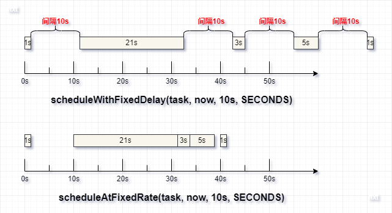

# Quartz

## 一、基本概念

Quartz 是 OpenSymphony 开源组织在 Job scheduling 领域又一个开源项目，完全由 Java 开发，可以用来实现定时任务。

> 定时任务是**指定某个时刻，重复性地执行的任务**。定时任务可以让任务自动地执行，而用户则不用手动的操作来执行任务。

有以下特点：

- Quartz 是开源且具有丰富特性的**任务调度库**，能够集成于任何的 Java 应用，小到独立的应用，大至电子商业系统。
- Quartz 能够创建简单或复杂的调度。
- 任务 Job 被定义为标准的 Java 组件，能够执行任何你想要实现的功能。
- Quartz 调度框架包含许多企业级的特性，如：JTA 事务、集群的支持。

## 二、Java 类

### （一）Timer

Java 提供 `java.util.Timer` 定时器，用于实现定时任务的功能。

```java
public class Demo {
    @Test
    void test() {
        Timer timer = new Timer();
        Timertask task = new TimerTask() {
            @Override
            public void run() {
                System.out.println("执行定时任务");
            }
        };
        Date date = new Date();
        long period = 10000;
        // task 是指 TimerTask 定时任务；date 表示从指定时间开始执行；period 表示每隔 period 执行一次 task
        timer.schedule(task, date, period);
    }
}
```

Timer 类中提供一些重要的方法：


- schedule(task, date, period)：schedule 会保证**任务的间隔**是按照定义的 period 参数执行。如果任务执行时间小于 period，则会隔 period 时间后执行下一个任务；如果某一次执行时间大于 period，则会在执行完此次任务后，立刻执行下一次任务，同时保证后续调度间隔都是 period。
- scheduleAtFixedRate(task, date, period)：scheduleAtFixedRate 会保证**任务的速率**按照定义的 period 参数执行。如果任务执行时间大于 period，执行任务期间错过了几次任务，会立马连续执行错过的这几次任务。
- cancal()：终止此定时器，丢弃所有当前已安排的任务。

在 Timer 定时器执行过程中有几个重要的类：

- TimerTask：用于定义定时任务。
- TimerThread：当 `new Timer()` 创建定时器时，会创建一个 TimerThread 线程，所有加入该 Timer 的 TimerTask 都由该线程执行。
- TaskQueue：Timer 中维护一个 TaskQueue，用于存储维护其中的 TimerTask。内部是一个小顶堆，每次执行时，都会获取执行时间最早的任务。

Timer 可以简单地实现定时任务，但是有以下缺点：

- 任务调度是基于绝对时间的，对系统时间敏感。
- 只有一个线程执行定时任务，如果任务执行时间过长，则会影响后续任务的执行时间。
- 任务执行时抛出异常会导致 Timer 定时器终止。

### （二）[ScheduledThreadPoolExecutor](https://juejin.cn/post/7035415187783942152)

JDK 1.5 后提供 `java.util.concurrent.ScheduledThreadPoolExecutor` 线程池，用于实现定时任务的功能。

```java
public class Demo {
    @Test
    void test() {
        ScheduledThreadPoolExecutor schedule = new ScheduledThreadPoolExecutor(10);
        Runnable task = new Runnable() {
            @Override
            public void run() {
                System.out.println("执行定时任务");
            }
        };
        long initialDelay = 0;
        long delay = 10000;
        // task 是指 TimerTask 定时任务；initialDelay 表示延迟指定时间执行；delay 表示每隔 delay 执行一次 task
        schedule.scheduleWithFixedDelay(task, initialDelay, TimeUnit.SECONDS);
    }
}
```

ScheduledThreadPoolExecutor 类中提供一些重要的方法：



- schedule(task, delay, unit)：可以让任务延迟 delay 时间执行，任务只执行一次。
- scheduleWithFixedDelay(task, initialDelay, delay, unit)：scheduleWithFixedDelay 会保证**任务的间隔**是按照定义的 delay 参数执行。
  - Timer.schedule() 中 period 是指两次任务开始执行的时间间隔。
  - scheduleWithFixedDelay() 中 delay 是指此次任务距上次任务执行完成的时间间隔。
- scheduleAtFixedRate(task, delay, period, unit)：scheduleAtFixedRate 会保证**任务的速率**按照定义的 delay 参数执行。

在 ScheduledThreadPoolExecutor 执行过程中有一些重要的类及参数：

- ScheduledFutureTask：会将 Runnable 或 Callable 类型的定时任务封装为 ScheduledFutureTask 类型。
- DelayWorkQueue：ScheduledThreadPoolExecutor 中维护一个 DelayWorkQueue，用于存储维护其中的 ScheduledFutureTask。内部是一个小顶堆，每次执行时，都会获取执行时间最早的任务。
- corePoolSize：ScheduledThreadPoolExecutor 继承 ThreadPoolExecutor，通过有参构造指定 corePoolSize 大小，由于其 workQueue 是 DelayWorkQueue 无界队列，因此一般情况下任务都是由核心线程执行（除非 DelayWorkQueue 满了才会创建非核心线程）。

和 Timer 相比，ScheduledThreadPoolExecutor 有以下优点：

- 任务调度是基于相对时间的（相对于上次任务执行完成的时间），对系统时间不敏感。
- 通过线程池执行定时任务，多线程情况下任务执行互不干扰。
- 单个任务执行抛出异常不会影响其他线程执行任务。

### （三）[@Scheduled](https://juejin.cn/post/6844903924936212494)

@Scheduled 是 Spring 提供的注解，内部是通过 ScheduledThreadPoolExecutor 实现定时任务功能。

@Scheduled 提供如下属性：

- initialDelay：表示延迟指定时间执行。
- fixedDelay：**任务的间隔**按照指定的 fixedDelay 参数执行。fixedDelay 是指此次任务距上次**任务执行完成**的时间间隔。
- fixedRate：**任务的速率**按照指定的 fixedRate 参数执行。fixedRate 是指此次任务距上次**任务开始执行**的时间间隔，如果任务执行时间大于 fixedRate，执行任务期间错过了几次任务，会立马连续执行错过的这几次任务。
- [cron](https://blog.csdn.net/qq_35860138/article/details/82738215)：按照 cron 表达式执行任务。如果任务执行时间过长，执行任务期间错过几次任务，**cron 不会执行错过的这几次任务**。

> 注意：必须添加 @EnableScheduling 注解，用于开启定时任务功能。

```java
@Slf4j
@Component
public class Demo {
    @Scheduled(fixedDelay = 10000)
    void fixedDelay() {
        log.info("任务 {} 第 {} 次执行", "fixedDelay", ++count);
        try {
            if (count == 2)
                Thread.sleep(21000);
        } catch (InterruptedException e) {
            e.printStackTrace();
        }
        log.info("执行完了");
    }
}
```

在内部 ScheduledThreadPoolExecutor 是通过 `Executors.newSingleThreadScheduledExecutor()` 创建，即 corePoolSize 为 1，如果想自定义 ScheduledThreadPoolExecutor：

```java
@Configuration
// 开启定时任务功能
@EnableScheduling
public class MyConfig {

    /**
     * Description: 配置 ScheduledThreadPoolExecutor，设置核心线程数为 16
     */
    @Bean
    public ScheduledThreadPoolExecutor scheduledThreadPoolExecutor() {
        return new ScheduledThreadPoolExecutor(16);
    }
}
```

## 三、Quartz 体系结构

Quartz 的体系结构如下：


### （一）Job 任务

#### 1、Job

Job 接口用于实现具体的业务逻辑，内部只有一个 `void execute(jobExecutionContext context)` 抽象方法。

```java
@Slf4j
public class MyJob implements Job {

    @Override
    public void execute(JobExecutionContext jobExecutionContext) {
        log.info("Job 任务 {} 执行", this);
    }
}
```

JobExecutionContext 是调度上下文，内部包含 Job 实例、JobDetail、Trigger、Scheduler 等信息。

#### 2、JobDetail

JobDetail 对 Job 进行封装，JobDetail 中有一些重要属性：JobKey、JobDataMap 等。

```java
// 通过 Builder 模式构建
JobDetail jobDetail = JobBuilder.newJob(jobClass)
    // name + group 必须唯一
    .withIdentity(new JobKey("myJob", "jobGroup"))
    // 添加 JobDataMap
    .usingJobData(detailDataMap)
    .build();
```

> JobDetail 定义的是任务数据，而真正的业务逻辑是在 Job 中。这是因为任务是有可能并发执行，如果 Scheduler 直接使用 Job，就会存在对同一个 Job 实例并发访问的问题。**而 JobDetail & Job 方式，Sheduler 每次执行 Job 任务，都会根据 JobDetail 创建一个新的 Job 实例，这样就可以规避并发访问的问题。**

（1）JobKey 是 JobDetail 的标志，通过 name + group 唯一指定，每个 JobDetail 的 JobKey 都是唯一的。

> group 的默认值为 DEFAULT。

（2）JobDataMap 用于在 Job 实例和 JobDetail 之间传递数据：

```java
public void test() {
    // 1、创建 JobDetail，将 Job 封装成 JobDetail
    JobDataMap detailDataMap = new JobDataMap();
    detailDataMap.put("jobDetail", "jobDataMap测试");
    detailDataMap.put("mergeName", "jobName");

    JobDetail jobDetail = JobBuilder.newJob(Demo01_DataJob.class)
        .withIdentity("myJob", "jobGroup")
        .usingJobData(detailDataMap) // 添加 JobDataMap
        .build();

    // 2、创建 Trigger
    JobDataMap triggerDataMap = new JobDataMap();
    triggerDataMap.put("trigger", "triggerDataMap测试");
    triggerDataMap.put("mergeName", "triggerName");

    Trigger trigger = TriggerBuilder.newTrigger()
        .withIdentity("myTrigger", "triggerGroup")
        .usingJobData(triggerDataMap) // 添加 JobDataMap
        .startNow()
        .endAt(new Date(new Date().getTime() + 5000))
        .withSchedule(SimpleScheduleBuilder.simpleSchedule().withIntervalInSeconds(1).repeatForever())
        .build();

    // 3、创建 Scheduler，将 JobDetail 和 Trigger 关联起来，并执行
    Scheduler scheduler = StdSchedulerFactory.getDefaultScheduler();
    scheduler.scheduleJob(jobDetail, trigger);
    scheduler.start();
}
```

通过 JobExecutionContext 获取 JobDetail 的 JobDataMap：

```java
@Override
public void execute(JobExecutionContext context) {

    log.info("JobDetail dataMap: {}", getString(context.getJobDetail().getJobDataMap()));
    log.info("Trigger dataMap: {}", getString(context.getTrigger().getJobDataMap()));

    // 获取合并后的 JobDataMap，Trigger 覆盖 JobDetail 中 JobDataMap 相同的键
    log.info("获取合并后的 JobDataMap: {}", getString(context.getMergedJobDataMap()));
}
```

也可以通过 setter 方法注入属性的方式，获取合并后的 JobDataMap 中指定键对应的值：

```java
@Slf4j
public class Demo implements Job {

    private String jobDetail;

    private String trigger;

    private String mergeName;

    @Override
    public void execute(JobExecutionContext context) {
        log.info("JobDetail = {}", jobDetail); // JobDetail = jobDataMap测试
        log.info("Trigger = {}", trigger); // Trigger = triggerDataMap测试
        log.info("mergeName = {}", mergeName); // mergeName = triggerName
    }

    public void setJobDetail(String jobDetail) {
        this.jobDetail = jobDetail;
    }

    public void setTrigger(String trigger) {
        this.trigger = trigger;
    }

    public void setMergeName(String mergeName) {
        this.mergeName = mergeName;
    }
}
```

#### 3、原型模式

在 Quartz 中大量地使用了原型模式，每次任务调度都会生成新的对象实例。

> Job、JobDetail（及 JobDataMap）、Trigger（及 JobDataMap）都采用原型模式；Scheduler 是单例的。

```java
@Slf4j
public class Demo01_PrototypeJob implements Job {

    private static Job prevJob;

    private static JobDetail prevJobDetail;

    private static JobDataMap prevDetailDataMap;

    private static Trigger prevTrigger;

    private static JobDataMap prevTriggerDataMap;

    private static Scheduler prevScheduler;

    private int count;

    public void setCount(int count) {
        this.count = count;
    }

    @Override
    public void execute(JobExecutionContext context) {
        System.out.println("prevJob == context.getJobInstance()？" + (prevJob == context.getJobInstance())); // false
        log.info("Job 实例：{}", context.getJobInstance());
        prevJob = context.getJobInstance();

        System.out.println("prevJobDetail == context.getJobDetail()？" + (prevJobDetail == context.getJobDetail())); // false
        log.info("JobDetail：{}；hashcode：{}", context.getJobDetail(), System.identityHashCode(context.getJobDetail()));
        prevJobDetail = context.getJobDetail();

        System.out.println("prevDetailDataMap == context.getJobDetail().getJobDataMap()？" + (prevDetailDataMap == context.getJobDetail().getJobDataMap())); // false
        log.info("detailDataMap：{}", System.identityHashCode(context.getJobDetail().getJobDataMap()));
        prevDetailDataMap = context.getJobDetail().getJobDataMap();

        System.out.println("prevTrigger == context.getTrigger()？" + (prevTrigger == context.getTrigger())); // false
        log.info("Trigger：{}；hashcode：{}", context.getTrigger(), System.identityHashCode(context.getTrigger()));
        prevTrigger = context.getTrigger();

        System.out.println("prevTriggerDataMap == context.getTrigger().getJobDataMap()？" + (prevTriggerDataMap == context.getTrigger().getJobDataMap())); // false
        log.info("triggerDataMap：{}", System.identityHashCode(context.getTrigger().getJobDataMap()));
        prevTriggerDataMap = context.getTrigger().getJobDataMap();

        System.out.println("prevScheduler == context.getScheduler()？" + (prevScheduler == context.getScheduler())); // true
        log.info("Scheduler：{}；hashcode：{}", context.getScheduler(), System.identityHashCode(context.getScheduler()));
        prevScheduler = context.getScheduler();
    }
}
```

#### 4、@PersistJobDataAfterExecution

由于 JobDetail 中的 JobDataMap 是原型模式，因此每次执行任务时，都会创建一个新的 JobDataMap 对象，而不是使用上一次执行任务时的 JobDataMap 对象，这样就会导致每次对 JobDataMap 的更改都不会生效。

为了解决这个问题，Quartz 提供了 @PersistJobDataAfterExecution 注解，在每次执行完 Job 任务后，都会更新 JobDetail 原型（即我们代码中定义的 JobDetail）中 JobDataMap 的数据，这样就可以在 Job 实例之间传递数据了。

> 注意：@PersistJobDataAfterExecution 只针对 JobDetail 的 JobDataMap 有效。

```java
@PersistJobDataAfterExecution
@Slf4j
public class Demo02_PersistDataJob implements Job {

    @Override
    public void execute(JobExecutionContext context) {
        JobDataMap detailDataMap = context.getJobDetail().getJobDataMap();
        detailDataMap.put("count", detailDataMap.getInt("count") + 1);
        System.out.println("count：" + detailDataMap.getInt("count"));
    }
}
```

#### 5、@DisallowConcurrentExecution

每次任务调度都会根据 JobDetail 生成新的 Job 实例，**该 Job 实例在不同线程上按 Trigger 计划并发执行**，@DisallowConcurrentExecution 可以禁止**同一个 JobDetail** 生成的 Job 实例并发执行，即同一个 Job 任务都会等待上一个任务执行完毕后，才会执行。

```java
@Slf4j
@DisallowConcurrentExecution
@PersistJobDataAfterExecution
public class Demo03_DisallowConcurrentJob implements Job {

    @Override
    public void execute(JobExecutionContext context) {
        JobDataMap detailMap = context.getJobDetail().getJobDataMap();
        int count = detailMap.getInt("count");
        count++;
        detailMap.put("count", count);
        log.info("Job 任务 {} 第 {} 次执行", this, count);
        try {
            if (count == 2) {
                Thread.sleep(5000);
            }
            log.info("执行完了");
        } catch (InterruptedException e) {
            e.printStackTrace();
        }
    }
}
```

### （二）Trigger 触发器

Trigger 触发器用于设置定时任务的开始时间、结束时间、触发执行的规则，Trigger 中有一些重要的属性：startTime（触发器开始时间）、endTime（触发器结束时间）、TriggerKey、scheduleBuilder、priority 等。

```java
// 5s 后开始，10s 后结束
Date now = new Date();
Date startTime = new Date(now.getTime() + 5000);
Date endTime = new Date(now.getTime() + 10000);

// 创建一个 SimpleScheduleBuilder，执行间隔为 1s
ScheduleBuilder<SimpleTrigger> scheduleBuilder = SimpleScheduleBuilder.simpleSchedule().withIntervalInSeconds(1).repeatForever();

return TriggerBuilder.newTrigger()
    .withIdentity("myTrigger", "triggerGroup")
    .startAt(startTime)
    .endAt(endTime)
    .withSchedule(scheduleBuilder)
    .build();
```

#### 1、TriggerKey

TriggerKey 是 Trigger 的标志，通过 name + group 唯一指定，每个 Trigger 的 TriggerKey 都是唯一的。

> group 的默认值为 DEFAULT。

#### 2、ScheduleBuilder

Trigger 也是通过 **Builder 模式构建**，Quartz 提供四种 ScheduleBuilder：[SimpleScheduleBuilder](https://www.cnblogs.com/vic-tory/p/13168723.html)、[CronScheduleBuilder](https://www.cnblogs.com/vic-tory/p/13228757.html)、[DailyTimeIntervalScheuldeBuilder](https://www.cnblogs.com/vic-tory/p/13190671.html)、[CalendarIntervalScheduleBuilder](https://www.cnblogs.com/vic-tory/p/13168866.html)，分别可以创建 SimpleTrigger、CronTrigger、DailyTimerIntervalTrigger、CanlendarIntervalTrigger。

> 最常用的就是 CronTrigger，自己测试时可以使用 SimpleScheduleBuilder。

#### 3、priority

**同一时间多个 Trigger 同时触发**且**工作线程数小于 Trigger 数量时**，数字大的优先级高。

```java
@Test
@SneakyThrows
public void test() {
    JobDetail jobDetail = JobBuilder.newJob(Demo02_PriorityJob.class)
        .withIdentity("myJob", "jobGroup")
        .build();

    Date now = new Date();
    Trigger trigger5 = getTrigger(now, 5, "trigger5", jobDetail);
    Trigger trigger1 = getTrigger(now, 1, "trigger1", jobDetail);
    Trigger trigger10 = getTrigger(now, 10, "trigger10", jobDetail);

    Properties properties = new Properties();
    // 工作线程为 1，优先级高的 Trigger 先执行
    properties.setProperty("org.quartz.threadPool.threadCount", "1");
    Scheduler scheduler = new StdSchedulerFactory(properties).getScheduler();

    HashSet<Trigger> triggers = new HashSet<>();
    triggers.add(trigger1);
    triggers.add(trigger5);
    triggers.add(trigger10);
    scheduler.scheduleJob(jobDetail, triggers, true);
    scheduler.start();
}
```

#### 4、[misfire 策略](https://www.cnblogs.com/vic-tory/p/13305214.html)

Job 定时任务并不一定完全按照 Trigger 设定的触发时间执行，可能会遇到以下问题：

- Job 达到触发时间时，所有线程都被其他 Job 占用，没有可用线程。
- Job 使用了@DisallowConcurrentExecution 注解，当到达下一个 Job 执行点的时候，上一个任务还没有完成。
- 在 Job 需要触发的时间点，Scheduler 停止了（可能是意外停止的）。
- Job 指定了过去的开始执行时间，例如：当前时间是 8:00:00，指定 startTime 开始时间为 7:00:00。

Job 到达触发时间时还没有被执行，并且延迟时间超过了 misfireThreshold 阈值，那么这些错过的任务该怎么办呢？执行还是不执行？该如何执行？Quartz 的 Trigger 提供 misfire 策略去执行这些错过的任务。

**CronTrigger 提供以下 misfire 策略：**

- MISFIRE_INSTRUCTION_FIRE_ONCE_NOW：默认值，立刻执行第一次错过的任务，后续任务按计划执行。
- MISFIRE_INSTRUCTION_IGNORE_MISFIRE_POLICY：立刻并发执行所有错过的任务，后续任务按计划执行。
- MISFIRE_INSTRUCTION_DO_NOTHING：对错过的任务不做任何处理，后续任务按计划执行。

> Trigger 接口中定义了 MISFIRE_INSTRUCTION_SMART_POLICY 智能策略（默认值），会根据不同 Trigger 实现类使用对应的具体 misfire 策略。以 CronTrigger 为例，MISFIRE_INSTRUCTION_SMART_POLICY 对应着 CronTrigger 的 MISFIRE_INSTRUCTION_FIRE_ONCE_NOW：
>
> 

#### 5、Calendar

Quartz 的 Calender 专门用于屏蔽一个时间区间，使 Trigger 在这个区间中不被触发。Quartz 包括了多种类型的 Calender：

| Calender 名称   | 类                                       | 用法                                                                  |
| :-------------- | :--------------------------------------- | :-------------------------------------------------------------------- |
| BaseCalender    | org.quartz.impl.calendar.BaseCalender    | 为高级的 Calender 实现了基本的功能，实现了 `org.quartz.Calender` 接口 |
| DailyCalendar   | org.quartz.impl.calendar.DailyCalendar   | 排除一天中的指定时间，例如：可用于排除营业时间                        |
| WeeklyCalendar  | org.quartz.impl.calendar.WeeklyCalendar  | 排除星期中的一天或多天，例如：可用于排除周末                          |
| MonthlyCalendar | org.quartz.impl.calendar.MonthlyCalendar | 排除月份中的数天，例如：可用于排除每月的最后一天                      |
| AnnualCalendar  | org.quartz.impl.calendar.AnnualCalendar  | 排除年中一天或多天                                                    |
| HolidayCalendar | org.quartz.impl.calendar.HolidayCalendar | 专门用于排除节假日                                                    |
| CronCalendar    | org.quartz.impl.calendar.CronCalendar    | 排除 Cron 表达式中的时间                                              |

```java
@Test
@SneakyThrows
public void test() {
    // 创建一个 Quartz 的 Calendar 实例，指定排除的日期
    AnnualCalendar holidays = new AnnualCalendar();
    ArrayList<Calendar> daysExcluded = new ArrayList<>();

    Calendar newTearsDay = new GregorianCalendar(2024, Calendar.JANUARY, 1);
    daysExcluded.add(newTearsDay);
    Calendar labourDay = new GregorianCalendar(2024, Calendar.MAY, 1);
    daysExcluded.add(labourDay);
    Calendar nationalDay = new GregorianCalendar(2024, Calendar.OCTOBER, 1);
    daysExcluded.add(nationalDay);
    Calendar today = new GregorianCalendar(2024, Calendar.JANUARY, 10);
    daysExcluded.add(today);
    holidays.setDaysExcluded(daysExcluded);

    Scheduler scheduler = StdSchedulerFactory.getDefaultScheduler();
    // 添加到 Scheduler 中
    scheduler.addCalendar("holidays", holidays, true, true);

    Trigger trigger = TriggerBuilder.newTrigger()
        .withIdentity("myTrigger", "triggerGroup")
        .startNow()
        .withSchedule(SimpleScheduleBuilder.simpleSchedule().withIntervalInSeconds(1).repeatForever())
        // Trigger 使用指定的 Calendar
        .modifiedByCalendar("holidays")
        .build();
}
```

### （三）Scheduler 调度器

Scheduler 调度器会根据 Trigger 触发器的条件，去执行 Job 实例任务。

> 一个 Trigger 只能关联一个 JobDetail，一个 JobDetail 可以关联多个 Trigger。

#### 1、SchedulerFactory

Quartz 通过 SchedulerFactory 工厂模式创建 Scheduler，提供 DirectSchedulerFactory 和 StdSchedulerFactory 实现类。

##### （1）DirectoSchedulerFactory

DirectoSchedulerFactory 创建 Scheduler 时，需要自己设置 Scheduler 的线程池和存储方式等对象属性。

```java
DirectSchedulerFactory schedulerFactory = DirectSchedulerFactory.getInstance();
schedulerFactory.createScheduler(new SimpleThreadPool(10, Thread.NORM_PRIORITY), new RAMJobStore());
Scheduler scheduler = schedulerFactory.getScheduler();
```

##### （2）StdSchedulerFactory

StdSchedulerFactory 通过声明的方式来创建 Scheduler 实例，默认提供 `org/quartz/quartz.properties` 配置文件，StdSchedulerFactory 通过读取配置文件为 Scheduler 设置属性值。我们也可以在 classpath 下添加 quartz.properties 配置文件，覆盖默认的配置文件。

```java
Scheduler scheduler = StdSchedulerFactory.getDefaultScheduler();
```

#### 2、Scheduler 操作

Scheduler 提供以下操作：

> start()、standBy()、pauseAll()、shutdown() 都是原子操作。

##### （1）start()

通过 start()方法启动 Scheduler 调度器。

##### （2）standby() 和 pauseAll()

standby() 和 pauseAll() 都是临时暂停的方法，调用后会暂停执行任务。两者区别是：

- standby()：暂停后通过 start()方法恢复执行任务，但是**在暂停期间 misfire 的任务就会被忽略**。
- pauseAll()：暂停后通过 resumeAll()方法恢复执行任务，**恢复后会立刻按照 misfire 策略执行错过的任务**。

##### （3）shutdown()

通过 shutdown()方法终止 Scheduler 调度器。

#### 3、存储和持久化

Quartz 提供存储和持久化机制，用于存储和持久化 JobDetail、Trigger、Calendar 等数据，提供 JobStore 接口，主要有以下两种实现：

##### （1）RAMJobStrore

`org.quartz.simple.RAMJobStore` 是 StdSchedulerFactory 默认的 JobStore 方式。RAMJobStore 基于内存，也是数据访问性能最佳的 JobStore，但是由于数据存储在内存中，所以会在重启后丢失。在 quartz.properties 中配置：

```properties
org.quartz.jobStore.class=org.quartz.simpl.RAMJobStore
```

##### （2）JDBCJobStore

JDBCJobStore 通过关系型数据库存储相关数据。其优点是数据持久化，同时为分布式 Quartz 提供了可能性。JDBCJobStore 支持大部分关系型数据库包括： Oracle、PostgreSQL、MySQL、MS SQLServer、HSQLDB、DB2 等。在 quartz.properties 中配置：

```properties
# 表创建完成后，需要决定应用需要的事务类型。Quartz来管理事务的话，使用 JobStoreTX；如果希望应用容器来管理事务（比如JBoss或者Tomcat），可以使用 JobStoreCMT
org.quartz.jobStore.class=org.quartz.impl.jdbcjobstore.JobStoreTX

# Quartz 指定 DriverDelegate 来与给定数据库进行通信。所有的 DriverDelegate 类都继承自 org.quartz.impl.jdbcjobstore.StdDriverDelegate 类，Mysql可以直接使用 StdDriverDelegate。
org.quartz.jobStore.driverDelegateClass=org.quartz.impl.jdbcjobstore.StdDriverDelegate

# --------------------配置数据源--------------------
# 指定数据源
org.quartz.jobStore.dataSource=myDS
org.quartz.dataSource.myDS.driver=com.mysql.jdbc.Driver
org.quartz.dataSource.myDS.URL=jdbc:mysql://192.168.190.134:3306/quartz?useUnicode=true&characterEncoding=utf-8&useSSL=false
org.quartz.dataSource.myDS.user=admin
org.quartz.dataSource.myDS.password=myPassword
# 一个可选的 SQL 查询字串，数据源用它来检测并替换失败/断开的连接
org.quartz.dataSource.NAME.validationQuary= SELECT 1
```

> 数据库脚本在 `org.quartz.impl.jdbcjobstore` 路径下。

#### 4、[配置](https://www.quartz-scheduler.org/documentation/quartz-2.3.0/configuration/)

StdSchedulerFactory 默认读取 `org/quartz/quartz.properties` 配置文件，我们可以在 classpath 下添加 quartz.properties 覆盖默认配置文件。配置主要分为四种：

- ThreadPool：线程池配置，例如：线程池实现类，默认为 SimpleThreadPool。
- Listener：全局 JobListener、TriggerListener 监听器配置。
- JobStore：Quartz 的存储和持久化配置，如果是 JDBCJobStore，还需要配置数据库资源。
- RMI：Quartz 服务端和客户端配置。我们可以创建一个项目作为 Quartz 服务端，用于提供 Scheduler；Quartz 客户端通过调用服务端的 Scheduler 执行本地的定时任务。

### （四）Listener 监听器

Quartz 的监听器用于——**当调度中你所关注事件发生时，能够及时获取该事件的通知**。Quartz 监听器主要有：JobListener、TriggerListener、SchedulerListener。

此外，监听器可以分为全局和非全局：全局监听器能够接收到所有的 Job/Trigger 的事件通知；非全局监听器只能接收到在其上注册的 Job 或 Trigger 的事件，不在其上注册的 Job 或 Trigger 则无法进行监听。

> Quartz 1.x 和 2.x 监听器添加及绑定方式有较大区别，以下为 Quartz 2.x 版本。

#### 1、[JobListener](https://www.cnblogs.com/deityjian/p/11680784.html)

JobListener 用于监听 Job 的执行事件，有以下方法：

```java
/**
 * Description: 获取 JobListener 的名称
 */
String getName();

/**
 * Description: Job 执行之前调用
 */
void jobToBeExecuted(JobExecutionContext context);

/**
 * Description: Job 将要执行，但是被 TriggerListener 否决了时调用
 */
void jobExecutionVetoed(JobExecutionContext context);

/**
 * Description: Job 执行之后调用
 */
void jobWasExecuted(JobExecutionContext context, JobExecutionException jobException);
```

Scheduler 提供 ListenerManager，用于管理监听器：

```java
ListenerManager listenerManager = scheduler.getListenerManager();
// 只有一个参数时，表示添加全局监听器
listenerManager.addJobListener(new MyJobListener());
// 监听指定 JobKey 的 Job
KeyMatcher<JobKey> keyMatcher = KeyMatcher.keyEquals(new JobKey("myJob", "jobGroup"));
listenerManager.addJobListener(new MyJobListener(), keyMatcher)
```

#### 2、[TriggerListener](https://www.cnblogs.com/deityjian/p/11681108.html)

TriggerListener 用于监听 Trigger 的触发事件，有以下方法：

```java
/**
 * Description: 获取 TriggerListener 的名称
 */
String getName();

/**
 * Description: 与该 TriggerListener 相关的 Trigger 被触发，对应 Job 的 execute() 方法执行之前调用
 */
void triggerFired(Trigger trigger, JobExecutionContext context);

/**
 * Description: 与该 TriggerListener 相关的 Trigger 被触发，对应 Job 的 execute() 方法执行之前调用，
 * 该方法返回 true，Job 的 execute() 方法不会被执行
 */
boolean vetoJobExecution(Trigger trigger, JobExecutionContext context);

/**
 * Description: 与该 TriggerListener 相关的 Trigger misfire 时调用
 */
void triggerMisfired(Trigger trigger);

/**
 * Description: 与该 TriggerListener 相关的 Trigger 被触发，对应 Job 的 execute() 方法执行之后调用
 */
void triggerComplete(Trigger trigger, JobExecutionContext context, CompletedExecutionInstruction triggerInstructionCode);
```

添加到 Scheduler：

```java
ListenerManager listenerManager = scheduler.getListenerManager();
// 只有一个参数时，表示添加全局监听器
listenerManager.addTriggerListener(new MyTriggerListener());
// 监听指定 TriggerKey 的 Trigger
KeyMatcher<TriggerKey> keyMatcher = KeyMatcher.keyEquals(new TriggerKey("myTrigger", "triggerGroup"));
listenerManager.addTriggerListener(new MyTriggerListener(), keyMatcher)
```

#### 3、[SchedulerListener](https://www.cnblogs.com/deityjian/p/11681136.html)

SchedulerListener 用于监听 Scheduler 生命周期的事件，主要有以下方法：

```java
/**
 * Description: Scheduler 被启动前调用
 */
void schedulerStarting();

/**
 * Description: Scheduler 被启动后调用
 */
void schedulerStarted();

/**
 * Description: Scheduler clear 后调用
 */
void schedulingDataCleared();

/**
 * Description: Scheduler 被 shutdown 前调用
 */
void schedulerShuttingdown();

/**
 * Description: Scheduler 被 shutdown 后调用
 */
void schedulerShutdown();
```

添加到 Scheduler：

```java
ListenerManager listenerManager = scheduler.getListenerManager();
listenerManager.addSchedulerListener(new MySchedulerListener());
```

## 四、其它应用

### （一）SpringBoot 整合 Quartz

1、引入依赖

```xml
<dependency>
    <groupId>org.springframework.boot</groupId>
    <artifactId>spring-boot-starter-quartz</artifactId>
    <version>2.4.5</version>
</dependency>
```

2、自定义 Job

```java
@Slf4j
public class MyJob implements Job {

    private int count;

    public void setCount(int count) {
        this.count = count;
    }

    @Override
    public void execute(JobExecutionContext jobExecutionContext) {
        log.info("Job${} 任务 {} 第 {} 次执行", jobExecutionContext.getJobDetail().getKey(), this, ++count);
    }
}
```

3、设置 Quartz 配置类

```java
@Configuration
public class QuartzConfig {
    @Bean
    public JobDetail myJobDetail1() {
        return JobBuilder.newJob(MyJob.class)
                .withIdentity("myJob1", "jobGroup")
                .usingJobData("count", 1)
                // 没有 Trigger 关联的话是否应该存储
                .storeDurably(true)
                .build();
    }

    @Bean
    public Trigger myTrigger1() {
        return TriggerBuilder.newTrigger()
                .withIdentity("myTrigger1", "triggerGroup")
                // 关联指定 JobDetail
                .forJob(myJobDetail1())
                .startNow()
                .withSchedule(CronScheduleBuilder.cronSchedule("0/5 * * * * ?"))
                .build();
    }
}
```

4、配置 application.yml 配置

```yml
spring:
  quartz:
    scheduler-name: MyScheduler # 调度器名称
    job-store-type: jdbc # 持久化到数据库，数据库脚本在 `org.quartz.impl.jdbcjobstore` 路径下
    overwrite-existing-jobs: true # 覆盖已存在的任务
    wait-for-jobs-to-complete-on-shutdown: true # 等待所有任务执行完毕再关闭
    properties: # 提供 properties 属性，用于覆盖 quartz.properties 中的属性值
      org:
        quartz:
          threadPool:
            threadCount: 25 # 线程池大小
            threadNamePrefix: quartz-thread- # 线程名称前缀
```

### （二）Quartz 集群

单节点的定时任务服务无法集群化，难以满足企业发展要求。Quartz 支持集群，满足了高可用、可扩展性强的企业级部署需要。

> Quartz 集群最重要的前提是：每个 Quartz 服务节点的 JobStore 必须为 JDBCJobStore，即采用数据库存储和持久化 Quartz 数据，这样数据才能同步。
>
> 按照 SpringBoot 整合 Quartz 篇章中的配置即可。

Quartz 集群有以下特点：

- 同一时刻，一个 Trigger 触发的 JobDetail 只会在一个 Quartz 服务节点上运行，不会出现触发器 triggerA 触发的 jobDetailA 任务同时在多个节点上运行的情况。
- 支持失效转移：如果某个 Quartz 服务节点宕机，任务可以快速地转移到其他节点运行。

> 注意：
>
> - 目前不支持指派工作任务在指定节点上运行。
> - 要保证 Quartz 服务节点间时间同步，即保证同一 Trigger 在不同节点上触发时间相同。
>   - 例如：simpleTriggerA 是 startNow 立刻启动，但是有些节点项目启动快，有些节点项目启动慢，导致 simpleTriggerA 在不同节点上启动时间不一样，最终会导致 simpleTriggerA 不是按照预期时间触发。
