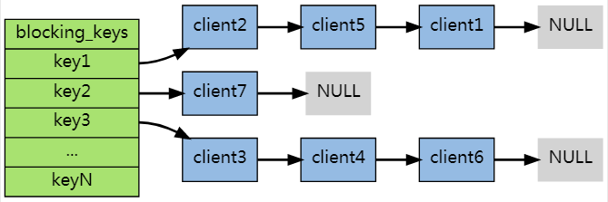
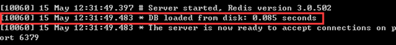

# Redis

> 基于[【官网】](https://redis.io/)、[Redis 数据库学习教程](http://c.biancheng.net/redis/)、[Redis 命令参考](http://doc.redisfans.com/index.html)、[Redis 命令参考](http://redisdoc.com/index.html)
>
> 以下版本为 Redis 6.2.4
>
> 虽然 Redis 大小写不敏感，但是便于区分，使用大写表示 Redis 命令，小写表示参数。

## 一、基本概念

Redis 是用 C 语言开发的一个开源的高性能键值对（key-value）数据库，它通过提供多种键值数据类型来适应不同场景下的存储需求。

> Redis 发展历史：
>
> 2008 年，意大利的一家创业公司 Merzia 推出了一款基于 MySQL 的网站实时统计系统 LLOOGG，然而没过多久该公司的创始人 Salvatore Sanfilippo 便对 MySQL 的性能感到失望，于是他决定亲自为 LLOOGG 量身定做一个数据库，并于 2009 年开发完成，这个数据库就是 Redis。 不过 Salvatore Sanfilippo 并不满足只将 Redis 用于 LLOOGG 这一款产品，而是希望更多的人使用它，于是在同一年 Salvatore Sanfilippo 将 Redis 开源发布，并开始和 Redis 的另一名主要的代码贡献者 Pieter Noordhuis 一起继续着 Redis 的开发，直到今天。
>
> Salvatore Sanfilippo 自己也没有想到，短短的几年时间，Redis 就拥有了庞大的用户群体。Hacker News 在 2012 年发布了一份数据库的使用情况调查，结果显示有近 12%的公司在使用 Redis。国内如新浪微博、街旁网、知乎网，国外如 GitHub、Stack Overflow、Flickr 等都是 Redis 的用户。
>
> VMware 公司从 2010 年开始赞助 Redis 的开发，Salvatore Sanfilippo 和 Pieter Noordhuis 也分别在 3 月和 5 月加入 VMware，全职开发 Redis。

### （一）NoSQL

NoSQL 泛指非关系型的数据库，也可以称作 Not-Only SQL，它可以作为关系型数据库的良好补充。随着互联网 web2.0 网站的兴起，非关系型的数据库现在成了一个极其热门的新领域，非关系数据库产品的发展非常迅速。而传统的关系数据库在应付 web2.0 网站，特别是超大规模和高并发的 SNS 类型的 web2.0 纯动态网站已经显得力不从心，暴露了很多难以克服的问题，例如：

- **High performance - 对数据库高并发读写的需求：**web2.0 网站要根据用户个性化信息来实时生成动态页面和提供动态信息，所以基本上无法使用动态页面静态化技术，**因此数据库并发负载非常高，往往要达到每秒上万次读写请求**。关系数据库应付上万次 SQL 查询还勉强顶得住，但是应付上万次 SQL 写数据请求，硬盘 IO 就已经无法承受了。其实对于普通的 BBS 网站，往往也存在对高并发写请求的需求，例如网站的实时统计在线用户状态，记录热门帖子的点击次数，投票计数等，因此这是一个相当普遍的需求。
- **Huge Storage - 对海量数据的高效率存储和访问的需求：**类似 Facebook，Twitter，Friendfeed 这样的 SNS 网站，每天用户产生海量的用户动态，以 Friendfeed 为例，一个月就达到了 2.5 亿条用户动态，对于关系数据库来说，在一张 2.5 亿条记录的表里面进行 SQL 查询，效率是极其低下乃至不可忍受的。再例如大型 web 网站的用户登录系统，例如腾讯、盛大，动辄数以亿计的帐号，关系数据库也很难应付。
- **High Scalability && High Availability- 对数据库的高可扩展性和高可用性的需求：** 在基于 web 的架构当中，数据库是最难进行横向扩展的，当一个应用系统的用户量和访问量与日俱增的时候，你的数据库却没有办法像 web server 和 app server 那样简单的通过添加更多的硬件和服务节点来扩展性能和负载能力。对于很多需要提供 24 小时不间断服务的网站来说，对数据库系统进行升级和扩展是非常痛苦的事情，往往需要停机维护和数据迁移。

**NoSQL 数据库的产生就是为了解决大规模数据集和多种数据种类带来的挑战，尤其是大数据应用难题。**

### （二）NoSQL 分类


根据存储的数据类型，NoSQL 可以分为以下几类：

| 数据库            | 相关产品                                                  | 典型应用场景                                                         | 数据模型                                          | 优点                                         | 缺点                                                     |
| ----------------- | --------------------------------------------------------- | -------------------------------------------------------------------- | ------------------------------------------------- | -------------------------------------------- | -------------------------------------------------------- |
| 键值（key-value） | Tokyo Cabinet / Tyrant、**Redis**、 Voldemort、Oracle BDB | 内容缓存，主要用于处理大量数据的高访问负载，也用于一些日志系统等等。 | Key 指向 Value 的键值对，通常用 hash table 来实现 | 查找速度快                                   | 数据无结构化，通常只被当作字符串或者二进制数据           |
| 列存储数据库      | Cassandra、HBase、Riak                                    | 分布式的文件系统                                                     | 以列簇式存储，将同一列数据存在一起                | 查找速度快，可扩展性强，更容易进行分布式扩展 | 功能相对局限                                             |
| 文档型数据库      | CouchDB、MongoDB                                          | Web 应用（与 Key-Value 类似，Value 是结构化的）                      | 一系列键值对                                      | 数据结构要求不严格                           | 查询性能不高，而且缺乏统一的查询语法                     |
| 图形(Graph)数据库 | Neo4J、InfoGrid、Infinite Graph                           | 社交网络                                                             | 图结构                                            | 利用图结构相关算法                           | 需要对整个图做计算才能得出结果，不容易做分布式的集群方案 |

Redis 应用场景：

- 缓存（数据查询、短连接、新闻内容、商品内容等等）。
- 分布式集群架构中的 session 分离。
- 聊天室的在线好友列表。
- 任务队列。（秒杀、抢购、12306 等等）
- 应用排行榜。
- 网站访问统计。
- 数据过期处理（可以精确到毫秒）

Redis 优缺点：

- 存取速度快，官方称读取速度会达到 30 万次每秒，写速度在 10 万次每秒最有，具体限制于硬件。
- 对持久化支持不够良好，所以 Redis 一般不作为数据的主数据库存储，**一般配合传统的关系型数据库使用**。

## 二、Redis 数据类型

### （一）基本命令

#### 1、KEYS

```shell
KEYS pattern
```

获取所有符合 pattern 规则的键名，其中 pattern 规则为：

```shell
KEYS *  // 匹配数据库中所有 key。
KEYS h?llo // 匹配 hello、hallo 和 hxllo 等。
KEYS h*llo // 匹配 hllo 和 heeeeello 等。
KEYS h[ae]llo // 匹配 hello 和 hallo，但不匹配 hillo 。
```

#### 2、SCAN

使用 `KEYS pattern` 会一次性查出所有符合规则的键，带来性能问题，SCAN 可以通过游标的方式查出指定数量的键名。

```shell
SCAN cursor [MATCH pattern] [COUNT count]
```

SCAN 命令每次被调用之后，都会向用户返回一个新的游标，用户在下次迭代时需要使用这个新游标作为 SCAN 命令的游标参数，以此来延续之前的迭代过程。以 0 作为游标开始一次新的迭代，一直调用 SCAN 命令，直到命令返回游标 0 。

#### 3、EXISTS

```shell
EXISTS key
```

查看键是否存在，返回 1 表示存在，0 表示不存在。

#### 4、TYPE

```shell
TYPE key
```

返回键对应存储值的类型。

> 注意：hyperloglog 和 bitmap 类型都是返回 string。

#### 5、SELECT

```shell
SELECT index
```

切换到指定的数据库，Redis 服务器中划分了 16 个数据库，索引下标从 0 开始，每个数据库中的键值对独立不互相冲突。

#### 6、DEL

```shell
DEL key [key ...]
```

删除一个多或多个键值对。

#### 7、FLUSHDB

```shell
FLUSHDB
```

删除当前数据库中的所有键值对。

### （二）String

String 类型是 Redis 最基本的数据结构，相当于 Java 中 `Map<String, String>` 的结构，Redis 通过键获取值。

#### 1、SET

```shell
SET key value [EX seconds | PX milliseconds] [NX | XX]
```

设置键值对。EX 设置秒过期时间，PX 设置毫秒过期时间；NX 表示键不存在才设置，XX 表示键存在才设置。

#### 2、GET

```shell
GET key
```

获取键对应的值。

#### 3、SETRANGE

```shell
SETRANGE key offsetIndex value
```

从原字符串 offset 索引下标处，设置新值覆盖旧值，对于不存在的索引下标，补上 `\x00`。

```shell
SET name test // 此时值为 test

SETRANGE name 6 test // 此时值为 test\x00\x00test
```

#### 4、GETRANGE

```shell
GETRANGE key startIndex endIndex
```

获取键名对应字符串中 `[startIndex, endIndex]` 区间的子串，其中 startIndex 和 endIndex 可以为负数，表示从右往左数几位：

```shell
// name 值为 abcdefg
GETRANGE name -3 -1 // efg
```

#### 5、MSET

```shell
MSET key value [key value ...]
```

同时设置多个键值对。

#### 6、MGET

```shell
MGET key [key ...]
```

同时获取多个键的值。

#### 7、数值类型

若值可以转型为数值类型（整型或浮点型），可以使用以下命令进行计算。

##### （1）INCR

```shell
INCR key
```

在原值（原值要是整数，否则报错）上加 1，返回新的字符串数值。

##### （2）DECR

```shell
DECR key
```

在原值上减 1，返回新的字符串数值。

##### （2）INCRBY

```shell
INCRBY key long
```

在原值（原值要是整数，否则报错）上加上指定的整数值，返回新的字符串数值。

##### （4）DECRBY

```shell
INCRBY key long
```

在原值上减去指定的整数值，返回新的字符串数值。

##### （5）INCRBYFLOAT

```shell
INCRBYFLOAT key float
```

在原值（可以是整型和浮点型）加上指定的值（可以是整型和浮点型），返回新的字符串数值。

### （二）Hash

Hash 类型相当于 Java 中 `HashMap<String, HashMap<String, String>>` 的结构，值的属性键值对最多为 2^32-1 个，因为使用了 hash，所以键和对象的属性键是无序。

#### 1、HMSET

```shell
HMSET key field value [field value ...]
```

设置键值对，存储对应的属性和属性值，若键存在且属性名已存在，则会进行覆盖。

#### 2、HMGET

```shell
HMGET key field [field ...]
```

获取键名下对应的属性名的值。

#### 3、HEXISTS

```shell
HEXISTS key field
```

判断对应键下的属性是否存在。

#### 4、HGETALL

```shell
HGETALL key
```

获取键名下所有的属性名和属性值。

### （三）List

List 类型相当于 Java 中 `Map<String, LinkedList<String>>` 的结构，底层是双向链表的结构，具有**有序、不唯一、增删快和读写慢**的特性，链表长度最大为 2^32-1。

List 的底层存储结构，其实是一个被称为快速链表（quicklist）的结构。当列表中存储的元素较少时，Redis 会使用一块连续的内存来存储这些元素，这个连续的结构被称为 ziplist（压缩列表），它将所有的元素紧挨着一起存储。

> ziplist 是 Redis 为节省内存而开发的，它是由一系列特殊编码的连续内存块组成的顺序型数据结构，一个压缩列表了可以包含任意多个节点，每个节点都可以保存一个字符数组或者整数值。

而当数据量较大时，Redis 列表就会是用 quicklist（快速链表）存储元素。Redis 之所以采用两种方法相结合的方式来存储元素。这是因为单独使用普通链表存储元素时，所需的空间较大，会造成存储空间的浪费。因此采用了链表和压缩列表相结合的方式，也就是 quicklist + ziplist，结构如下图：


#### 1、LPUSH

```shell
LPUSH key value [value ...]
```

依次将值从左端插入表（也就是**表头**），也就是说，越后面的值会排在越前面：

```shell
LPUSH name a b c d e f g

LRANGE name 0 -1 // gfedcba
```

#### 2、LPOP

```shell
LPOP key
```

删除表最左端的节点，并返回值。

#### 3、RPUSH

```shell
RPUSH key value [value ...]
```

依次将值从右端插入表（也就是**表尾**），越后面的值会排在越后面。

#### 4、RPOP

```shell
RPOP key
```

删除表最右端的节点，并返回值。

#### 5、LRANGE

```shell
LRANGE key startIndex endIndex
```

获取对应 key 中 `[startIndex, endIndex]` 区间内的元素，startIndex 和 endIndex 可以为负数，表示从表尾到表头：

```shell
LRANGE name 0 -1 // -1表示表尾倒数第一个元素，gfedcba
```

#### 6、RPOPLPUSH

```shell
RPOPLPUSH source destination
```

从 source 源列表 RPOP 操作取出表尾元素，然后 LPUSH 操作插入到 destination 列表表头，**这是一个原子操作**。

#### 7、[阻塞命令](http://focus-1.wiki/redis/redis-list-blpop/)

Redis 在多个客户端操作同一 List 类型的 key 时，提供了阻塞命令。当一个目标 key 不存在或者列表值为空时，**执行该命令的客户端就会被阻塞**，阻塞一个客户端需要执行以下步骤：

1. 将客户端的状态设为**正在阻塞**，并记录阻塞这个客户端的各个键，以及阻塞的最长时限（timeout）等数据。
2. 将客户端的信息记录到 `server.db[i]->blocking_keys` 中（其中 `i` 为客户端所使用的数据库号码）。
3. 继续维持客户端和服务器之间的网络连接，但不再向客户端传送任何信息，造成客户端阻塞。

`server.db[i]->blocking_keys` 是一个字典，字典的键是那些造成客户端阻塞的键，而字典的值是一个链表，链表里保存了所有因为这个键而被阻塞的客户端 （被同一个键所阻塞的客户端可能不止一个，同一个客户端也可能被不同的键阻塞）：



当客户端被阻塞之后，**脱离阻塞状态有以下三种方法**：

- 被动脱离：有其他客户端为造成阻塞的键推入了新元素。
- 主动脱离：到达执行阻塞原语时设定的最大阻塞时间。
- 强制脱离：客户端强制终止和服务器的连接，或者服务器停机。

**先阻塞先服务（FBFS）策略**：

当程序添加一个新的被阻塞客户端到 `server.blocking_keys` 字典的链表中时，它将该客户端放在链表的最后；而当 Redis 取消客户端的阻塞时，它从链表的最前面开始取消阻塞： 这个链表形成了一个 FIFO 队列，最先被阻塞的客户端总是最先脱离阻塞状态，Redis 文档称这种模式为先阻塞先服务（FBFS，first-block-first-serve）。

##### （1）BLPOP

```shell
BLPOP key [key ...] timeout
```

操作对应键名下，删除链表最左端（表头）的节点，并返回值。若 key 不存在或列表没有元素时，会阻塞当前客户端直到链表 push 了一个元素或等待超时（单位为秒）为止。timeout 单位为秒，值为 0 时表示不会超时，一直阻塞。

若 key 有多个时，则依次从左往右执行 LPOP 命令，直到有一个列表不为空时返回，返回值为 key 和 LPOP 值。若所有的 key 对应的列表都为空，则阻塞当前客户端。

```shell
blpop nullList name 5
1) "name"
2) "f"
```

##### （2）BRPOP

```shell
BRPOP key [key ...] timeout
```

##### （3）BRPOPLPUSH

```shell
BRPOPLPUSH source destination timeout
```

### （四）Set

Set 类型相当于 java 中的 `Map<String, HashSet<String>>` 结构，具有无序、唯一、读写快和增删慢的特性，HashSet 长度最多为 2^32-1 个。

#### 1、SADD

```shell
SADD key member [member ...]
```

将一个或多个值加入 key 对应的 Set 中，已存在的值会被忽略。

#### 2、SCARD

```shell
SCARD key
```

获取 Set 中的元素个数。

#### 3、SDIFF

```shell
SDIFF key [key ...]
```

返回第一个集合与其他集合的差集：

```shell
// set1: a b c d
// set2: c e
// set3: d f

SDIFF set1 set2 set3
1) "b"
2) "a"
```

#### 4、SINTER

```shell
SINTER key [key ...]
```

返回所有集合的交集。

#### 5、SUNION

```shell
SUNION key [key ...]
```

返回所有集合的并集。

#### 6、SMEMBERS

```shell
SMEMBERS key
```

返回集合中的所有元素。

#### 7、SRANDMEMBER

```shell
SRANDMEMBER key [count]
```

从指定键名下 Set 集合中随机返回元素：

- 当 count 缺省时，随机返回一个元素。
- 当 `count < 0` 时，返回 count 个元素，其中返回的元素可以重复出现多次；当 `count >= 0` 时，返回 count（最多为集合的 size）个元素。

### （五）Zset

Zset（也叫 SortedSet 在 Set 类型的基础上，添加了分数的概念，也就是一个元素对应一个分数（**double 浮点数**），通过对分数和字典序进行排序（默认从小到大），达到有顺序的目的。

#### 1、ZADD

```shell
ZADD key score member [score member ...]
```

将一个或多个带有分数的值加入 key 对应的 Zset 中，若分数相同，则值再按照字典序排序；若值已经存在，则会用该值最新的分数替换原分数。

#### 2、ZCOUNT

```shell
ZCOUNT key minScore maxScore
```

返回分数落在 `[minScore, maxScore]` 区间的元素个数，若想表示开区间，可以在前面加 `(`，例如：`ZCOUNT testKey (200 (500`。

#### 3、ZLEXCOUNT

```shell
ZLEXCOUNT key minMember maxMember
```

返回元素值落在 [minMember, maxMember] 内的元素个数，这里最大值和最小值必须在前面加上 `[` 或 `(` 表示开闭区间，否则报错。另外，最大值和最小值可以用 `-` 和 `+` 表示，`-` 表示负无穷，`+` 表示正无穷。

ZLEXCOUNT 适用在 Zset 内元素的分数一样时，会按照字典排序（也就是 a 到 z，1 到 10 这样的），获取落在对应元素字典区间内的个数。但是若分数不一致，Zset 集合会优先分数排序，再进行字典排序。

```shell
// 1 a 1 ab 1 ac 1 ad 2 c 3 b

// 从 Zset 头部开始，获取落在 [a, c) 区间的元素，直到遇见不符合的停止
ZLEXCOUNT zset [a (c
"4" // 这里遇到 c 则停止了，b 虽然符合，但是没有获取到

ZLEXCOUNT zset [a [c
"6"
```

#### 4、ZRANGE

```shell
ZRANGE key startIndex endIndex [WITHSCORES]
```

获取 Zset 落在 `[startIndex, endIndex]` 区间内的元素，若添加 WITHSCORES 参数，则连同分数一起返回。

#### 5、ZINTERSTORE

```shell
ZINTERSTORE destination numkeys key [key ...] [WEIGHTS weight [weight ...]] [AGGREGATE SUM | MIN | MAX]
```

求多个 Zset 的交集，并存储到或完全覆盖目标集合。其中注意几点：

- numkeys 表示 key 的个数，必须和 key 的个数一致。
- WEIGHTS 表示对集合中分数的加权，后面的 weight 加权个数必须和 key 的个数一致。
- AGGREGATE 表示对集合中相同元素的分数取值，默认是 SUM。

### （六）Hyperloglog

Hyperloglog 类型称为基数数据类型，与其说是一种类型，不如说是一种算法，用于计算并存储一个集合中去重后的基数值。主要用于给一个有重复元素的数据集合（一般是很大的数据集合）评估需要的空间单元数（会存在误差），例如：网站用户月活量，或者网站页面的 UV(网站独立访客)数据等。

> 基数值**可以理解为集合去重后集合的长度**，并不存储元素，实际上 HyperLogLog 是通过一种[概率统计算法](https://blockchain.iethpay.com/hyperloglog-theory.html)计算并存储结果值（并不真的只是一个集合长度的数值）。

#### 1、PFADD

```shell
PFADD key element [element]
```

添加指定元素到 Hyperloglog 中，若没有此元素，则可以添加成功并返回 1；若有此元素，则添加失败，并返回 0。

#### 2、PFCOUNT

```shell
PFCOUNT key [key ...]
```

返回 Hyperloglog 的基数值，若有多个 key，则相当于是集合取并集去重后的基数值。

```shell
PFADD hyper1 1 2 3 3 4 5 6

PFADD hyper2 3 8 9 5

PFCOUNT hyper1 hyper2
"8" // 返回值为 8
```

#### 3、PFMERGE

```shell
PFMERGE destination key [key ...]
```

将 destination（若存在）和其他 key 的基数值合并后存储在 destination 中，相当于把 destination 集合（若存在）和其他集合取并集去重后的基数值，存储在 destination 中。

### （七）Bitmap

Bitmap 类型使用位（bit）存储信息，用 0 或 1 来表示某个元素的状态，Bitmap 最长为 2^32 位。若只是想记录某个元素的状态，而不是元素本身，可以使用 Bitmap 节省空间。


Bitmap 是自动扩展的，如果设置了某个偏移位置超出了现有的内容范围，位数组就会以字节为单位自动进行扩充。Bitmap 是**以 ASCII 码的字符串形式**存储在 Redis 中，可以通过 `GET bitmapKey` 查看。

#### 1、SETBIT

```shell
SETBIT key offset <0 | 1>
```

设置指定 offset 偏移量上的位的值为 0 或 1，这个 offset 大于 0 小于 2^32 就行，会自动在前面未设置的下标设置默认值 0。

```shell
> SETBIT bitmap 1 1
"0"
> GET bitmap
"@" // 存储 ASCII 码字符串
```

#### 2、GETBIT

```shell
GETBIT key offset
```

获取指定 offset 上的位的值。

#### 3、BITCOUNT

```shell
BITCOUNT key [startIndex endIndex]
```

获取 `[startIndex, endIndex]` 字节区间内位为 1 的个数。

> 注意：这里是以字节作为计量单位，不是 offset 偏移量。
>
> Redis 7.0.0 提供了 `BYTE | BIT` 选项，使用 BIT 时，表示以位为单位。

#### 4、BITPOS

```shell
BITPOS key <0 | 1> [startIndex [endIndex]]
```

获取 `[startIndex, endIndex]` 区间，第一个值为指定值的位的 offset。

#### 5、BITOP

```shell
BITOP <AND | OR | XOR | NOT> destination key [key ...]
```

对一个或多个 Bitmap 进行位操作，将结果保存到目标键名上。

> 注意：NOT 操作时，只允许一个源键。

## 三、事务命令

Redis 中也提供了简单的事务功能，有以下特点：

- 事务中的命令按顺序执行。
- 事务在执行的过程中不会被其他客户端发送的命令打断。
- Redis 事务的严谨性并没有 mysql 那么强，不支持回滚。

使用事务时经过 3 个过程：MULTI 开启事务、Redis 命令进入队列、EXEC / DISCARD 命令执行或取消事务中的命令队列。

#### 1、MULTI

```shell
MULTI
```

开启事务，之后的 Redis 命令都会被添加到命令队列中。有以下特点：

（1）遇见命令运行期报错时，不会事务回滚：


这里 HMSET 命令去操作字符串类型的值，就会发生运行时报错，但不会影响正常的命令执行，也不会回滚。

（2）遇见命令编译期报错时，整个命令队列都不会执行。


这里故意写错 HMSETS 命令，执行 EXEC 命令时报错，命令队列中的命令都不会执行。

#### 2、EXEC

```shell
EXEC
```

依次按顺序执行命令队列中的命令。

#### 3、DISCARD

```shell
DISCARD
```

取消事务，也就是放弃执行并清空命令队列中的命令。

#### 4、[WATCH](http://doc.redisfans.com/topic/transaction.html#watch)

```shell
WATCH key [key ...]
```

在事务开始前，监听指定的 key，**若在 EXEC 事务执行之前监听的键变动了，则事务失效，不会执行了，客户端需要重新执行一遍这个事务**。


> 注意：如果你使用 WATCH 监视了一个带过期时间的键，那么即使这个键过期了，事务仍然可以正常执行。

#### 5、UNWATCH

```shell
UNWATCH
```

取消监听所有被监听的键。UNWATCH 可以放在 MULTI 中执行，但是毫无意义。因为监听的键值在事务执行前被修改，事务会检查当前键的版本（类似于乐观锁），还是会回滚。

> EXEC / DISCARD 和 UNWATCH 作用一样。

## 四、[Pipeline](https://blog.csdn.net/suifeng629/article/details/95756074)

正常的情况下，客户端发送一个命令请求，等待服务器端回复一个响应，有多少个命令，就会有多少个连接并响应，虽然 redis 处理命令很快，但是大部分时间都用在请求和响应这个往返时间了。

Pipeline 是一种通信协议，需要在客户端中支持。使用 Pipeline 技术，可以不用等待服务器响应，一直发送请求，服务器再进行响应，减少了请求和响应时间。这个一直发送请求的过程是相对客户端来说：

例如：一万条命令请求，Java 只知道一直发送命令，但是这些命令只是存储在一个 buffer 缓存里，并没有真正的发送到服务器，等到 buffer 有一定大小（8k）或主动发送时才会进行请求。而服务器端也不是一直进行响应，而是将维护一个队列，将响应存储在队列中，最后进行全部响应给客户端。

```java
@Test
public void pipeLine() {
    JedisPoolConfig poolCfg = new JedisPoolConfig();
    // 最大空闲数
    poolCfg.setMaxIdle(50);
    // 最大连接数
    poolCfg.setMaxTotal(100);
    // 最大等待毫秒数
    poolCfg.setMaxWaitMillis(20000);
    // 使用配置创建连接池
    JedisPool pool = new JedisPool(poolCfg, "192.168.190.128");
    // 从连接池中获取单个连接
    Jedis jedis = pool.getResource();

    long start = System.currentTimeMillis();

    // 开启流水线
    Pipeline pipeline = jedis.pipelined();
    for (int i = 0; i < 100; i++) {
        int j = i + 1;
        pipeline.set("pipeline_key" + j, "pipeline_value" + j);
        pipeline.get("pipeline_key" + j);
    }
    // 将存储的命令一次性发送给服务器：
    pipeline.sync();
    // 返回结果的方法：
    // List result = pipeline.syncAndReturnAll();
    // System.out.println(result);

    long end = System.currentTimeMillis();
    System.out.println(end - start);
    try {
        pipeline.close();
    } catch (Exception e) {
        e.printStackTrace();
    }
}
```

> 注意，发送的请求命令不要太多，有两个问题：
>
> - 服务器响应的时候会维护队列，如果过长的话，存储队列也是需要内存的；
> - 如果使用 syncAndReturnAll()方法获取结果，并用一个 List 集合存储，会导致客户端 List 存储的大小超出规定大小。

## 五、超时命令和垃圾回收策略

Redis 在运行时，是将键值对存储到内存中，但是内存大小是有限的，若没有定期删除键值对，则最终会占满内存。需要对键设置过期时间，Redis 才会对键值对进行清除。

### （一）超时命令

#### 1、PERSIST

```shell
PERSIST key
```

持久化键，移除键的超时时间。

#### 2、TTL

```shell
TTL key
```

查看键的超时时间，以秒为单位。-1 表示没有超时时间，也就是持久化；-2 表示键不存在或已过期。

#### 3、PTTL

```shell
PTTL key
```

查看键的超时时间，以毫秒为单位。

#### 4、EXPIRE

```shell
EXPIRE key seconds
```

设置过期时间，以秒为单位，表示 seconds 秒后过去。若过值 `<= 0`，则表示立即过期。

#### 5、PEXPIRE

```shell
PEXPIRE key milliseconds
```

设置过期时间，以毫秒为单位。

#### 6、EXPIREAT

```shell
EXPIREAT key timestamp
```

设置过期时间点，表示在什么时间点过期，这个过期时间点是 unix 时间戳，也就是 1970/01/01 00:00:00 到指定时间点的秒数。

#### 7、PEXPIREAT

```shell
EXPIREAT key milliseconds-timestamp
```

设置过期时间点，以毫秒为单位，也就是 1970/01/01 00:00:00 到指定时间点的毫秒数。

### （二）垃圾回收

Redis 垃圾回收机制只针对过期的键值对，不会处理持久化的键值对。键值对过期后不会立刻被清除，采用的是定期删除和惰性删除策略：

- 定期删除：Redis 默认每隔 100ms 随机抽样检查一批键值对，清除已经过期的键值对。
  - 抽样检查是防止键值对太多，每次检查浪费过多资源去检查。
- 惰性删除：定期检查不会检查所有键值对，所以使用惰性删除策略。当获取某个键时，Redis 会先检查该键是否过期，如果过期则会删除。

### （三）驱逐策略

当执行例如：SET、LPUSH 等需要内存的操作，而内存的剩余空间又不够时，Redis 提供以下内存淘汰策略（通过 redis.conf 配合文件中的 `maxmemory-policy` 参数配置），直到内存足够：

- noeviction：默认值。当内存不够时，新写入操作会报错。
- allkeys-lru：在所有键中，使用 LRU 算法进行删除。
- allkeys-random：在所有键中，随机删除键。
- volatile-lru：在设置了过期时间的键中，使用 LRU（最近最少使用）算法进行删除。
- volatile-random：在设置了过期时间的键中，随机删除键。
- volatile-ttl：在设置了过期时间的键中，删除 ttl 最小的键，也就是最先过期的键。

若所有键都没有设置过期时间，则 volatile-lru、volatile-random 和 volatile-ttl 配置失效，新写入操作会报错。

## 六、[发布订阅](http://c.biancheng.net/redis/pubsub.html)

Redis 提供发布订阅命令：消费者客户端订阅渠道（channel），发送者客户端通过这个渠道发布消息，订阅的消费者客户端可以获取发布的消息，发布订阅的原理就是观察者模式。

#### 1、SUBSCRIBE

```shell
SUBSCRIBE channel [channel ...]
```

当前客户端订阅一个或多个 channel，等待获取发布的消息。

#### 2、PUBLISH

```shell
PUBLISH channel message
```

向指定渠道中发送消息。

> 注意：应该是先订阅，再发布消息。

#### 3、UNSUBSCRIBE

```shell
UNSUBSCRIBE [channel [channel ...]]
```

当前客户端取消订阅指定的 channel，不指定值时表示取消订阅所有的 channel。

## 七、[备份策略](https://www.cnblogs.com/kismetv/p/9137897.html)

Redis 是内存型数据库，是对内存中的键值对进行操作，为了避免宕机导致数据全部丢失，需要将内存中的 Redis 数据持久化到硬盘中，当下次 Redis 重启时，利用持久化文件实现数据恢复。Redis 提供两种持久化策略：

### （一）RDB 持久化

RDB（Redis Database Backup）就是将**Redis 内存中的键值对数据持久化到硬盘中**，服务器启动时再从文件中还原到内存中，是 Redis 的默认备份策略。

RDB 持久化可以通过手动触发或自动触发：

#### 1、手动触发

##### （1）SAVE

```shell
SAVE
```

SAVE 命令可以为当前内存中的键值对数据生成 RDB 文件，**会阻塞 Redis 服务器进程，直到持久化完成，阻塞期间不会响应客户端请求**。

> 注意：由于 SAVE 命令会阻塞服务器进程，线上环境要杜绝 SAVE 的使用。

##### （2）BGSAVE

```shell
BGSAVE
```

BGSAVE 命令会创建一个子进程（此过程会阻塞服务器进程），根据父进程内存快照生成 RDB 文件，因此比 SAVE 性能更好，推荐使用。

#### 2、自动触发

在 redis.conf 配置文件中，有一个 `save m n` 配置：

```conf
save 900 1 # 即900秒内至少有1个key发生变化
save 300 10 # 在300秒内至少10个key发生变化。
save 60 10000 # 在60秒之内至少有10000个可以发生变化
```

上三个中的任一要求，都会执行 BGSAVE 持久化。

#### 3、压缩

Redis 默认开启 LZF 算法对 RDB 进行压缩，虽然消耗 CPU 资源，但是可以大大减少 RDB 文件的体积，可以在配置中关闭：

```conf
rdbcompression no
```

#### 4、启动时加载

RDB 文件的载入工作是在服务器启动时自动执行的，并没有专门的命令。但是由于 AOF 的优先级更高，因此当 AOF 开启时，Redis 会优先载入 AOF 文件来恢复数据；只有当 AOF 关闭时，才会在 Redis 服务器启动时检测 RDB 文件，并自动载入。服务器载入 RDB 文件期间处于阻塞状态，直到载入完成为止。



Redis 载入 RDB 文件时，会对 RDB 文件进行校验，如果文件损坏，则日志中会打印错误，Redis 启动失败。

#### 5、相关配置

- `save m n`：Redis 的默认配置，表示在 m 秒内 n 个键值改动了，就会触发 BGSAVE。
- `stop-writes-on-bgsave-error yes`：当 bgsave 出现错误时，Redis 是否停止执行写命令；设置为 yes，则当硬盘出现问题时，可以及时发现，避免数据的大量丢失；设置为 no，则 Redis 无视 bgsave 的错误继续执行写命令，当对 Redis 服务器的系统（尤其是硬盘）使用了监控时，该选项考虑设置为 no。
- `rdbcompression yes`：是否开启 RDB 文件压缩。
- `dbfilename dump.rdb`：RDB 文件名。
- `dir ./`：定义备份文件所在目录（AOF 和 RDB 都适用）。

### （二）AOF 持久化

AOF（Append Only File）是将**Redis 每次执行的写命令持久化到硬盘中**，服务器启动时再从文件中还原到内存中。

Redis 服务器默认开启 RDB，关闭 AOF。要开启 AOF 持久化策略，则需要在配置文件中添加 `appendonly yes` 配置。

#### 1、执行流程

由于需要记录 Redis 的每条写命令，因此 AOF 不需要主动触发，下面介绍 AOF 的执行流程：

- 命令追加（append）：将 Redis 的写命令追加到缓冲区 aof_buf；
- 文件写入（write）和文件同步（sync）：根据不同的同步策略将 aof_buf 中的内容同步到硬盘；
- 文件重写（rewrite）：定期重写 AOF 文件，达到压缩的目的。

##### （1）命令追加

Redis 先将写命令追加到缓冲区，而不是直接写入文件，主要是为了避免每次有写命令都直接写入硬盘，导致硬盘 IO 成为 Redis 负载的瓶颈。

##### （2）文件写入和文件同步

Redis 提供了多种 AOF 缓存区的同步文件策略，使用 appendfsync 配置控制，有以下三个参数：

- everysec：默认值，每秒将 aof_buf 的内容同步到硬盘中。
- no：不对 AOF 文件做 fsync 同步，同步由操作系统负责，通常同步周期为 30 秒。这种情况下，文件同步的时间不可控，且缓冲区中堆积的数据会很多，数据安全性无法保证。
- always：命令写入 aof_buf 后立即调用系统 fsync 操作同步到 AOF 文件，消耗性能。

##### （3）文件重写

随着时间流逝，Redis 服务器执行的写命令越来越多，AOF 文件也会越来越大；过大的 AOF 文件不仅会影响服务器的正常运行，也会导致数据恢复需要的时间过长。

文件重写是指定期重写 AOF 文件，减小 AOF 文件的体积。需要注意的是，**AOF 重写是把 Redis 进程内的数据转化为写命令，同步到新的 AOF 文件，并覆盖旧的 AOF 文件；不会对旧的 AOF 文件进行任何读取、写入操作!**

文件重写分为手动触发和自动触发：

① 手动触发

调用 BGREWRITEAOF 命令，内部执行流程和 BGSAVE 类似

② 自动触发

Redis 提供 `auto-aof-rewrite-min-size` 和 `auto-aof-rewrite-percentage` 配置，用于控制重写的自动触发，只有两个条件都满足时，才会触发重写。

- `auto-aof-rewrite-min-size`：触发重写时的 AOF 文件最小体积，默认值为 64mb。
- `auto-aof-rewrite-percentage`：默认值为 100，要求本次文件大小比上次重写时要增加 1（100%）倍。

#### 2、启动时加载

当 AOF 开启时，Redis 启动时会优先载入 AOF 文件来恢复数据；只有当 AOF 关闭时，才会载入 RDB 文件恢复数据。


**当 AOF 开启，但 AOF 文件不存在时，即使 RDB 文件存在也不会加载。**

#### 3、相关配置

- `appendonly no`：是否开启 AOF。
- `appendfilename appendonly.aof`：AOF 文件名。
- `appendfsync everysec`：AOF 的同步策略。
- `no-appendfsync-on-rewrite no`：是否在重写期间禁用 fsync 同步；如果是 yes，可以减轻文件重写时，CPU 还要负责备份的负担（不用备份），但是可能会丢失重写期间的数据。
- `auto-aof-rewrite-percentage 100`：文件重写触发条件之一。
- `auto-aof-rewrite-min-size 64mb`：文件重写触发提交之一。
- `aof-load-truncated yes` ：如果 AOF 文件结尾损坏，Redis 启动时是否仍载入 AOF 文件。

### （三）区别和优缺点

RDB 持久化：

- RDB 备份的是内存中的键值对。
- 体积小；恢复速度快；对性能影响小。
- 不能实时持久化，若能接受宕机时一定时间的数据丢失，可以使用；兼容性差，老版本的 Redis 不兼容新版本的 RDB 文件。

AOF 持久化：

- AOF 备份的是写命令。
- 支持秒级持久化；兼容性好。
- 体积大；恢复速度慢；对性能影响大。

## 八、分布式缓存

### （一）主从复制

备份策略可以保证即使 Redis 重启也不会丢失数据，但是若 Redis 服务器的备份文件损坏，还是可能导致数据丢失。并且现实中读多写少，若将读写请求集中在一台 Redis 服务器上，单个服务器压力大，因此需要将读服务器和写服务器进行分离，可以缓解单台服务器的压力。

在多台 Redis 服务器中，只有一台主服务器（Master），主服务器提供读写操作（也可以外部控制读请求不发送到主服务器）；存在多台从服务器（Slave），负责同步主服务器的数据和写指令，不让外部程序直接写数据，外部程序可以随机从一台从服务器中读取数据。主服务器在写入数据后，立刻将写入指令发送到从服务器，使数据同步。

> 从这里可以知道，主服务器将是整个系统的限制，若主服务器内存小、性能差，将会影响到从服务器性能，具体的外部程序如何读取哪一台从服务器读数据是另外设计的。

#### 1、从服务器配置

有以下方式添加从服务器：

##### （1）配置文件

```conf
slaveof ip port
```

在 redis.conf 中添加此配置，指向主服务器 ip 和 port。配置后重启服务器，就会开始主从复制。使用 `INFO replication` 查看当前节点信息：


##### （2）SLAVEOF

```shell
SLAVEOF ip port
```

从服务器中直接执行命令，也会进行主从复制。若从服务器执行 `SLAVE no one` 命令后，就不再接收主服务器的写指令，并且可以进行读写操作。

#### 2、主从复制策略

##### （1）完整复制


1. 启动主从服务器，从服务器调用配置或调用命令，向主服务器发送 sync 同步命令。
2. 主服务器接收到同步命令后，会执行 BGSAVE 命令备份数据，同时会将 BGSAVE 期间接收的写命令写入缓冲区中。
3. BGSAVE 命令执行完后，主服务器开始向从服务器发送 RDB 备份文件，**从服务器会丢弃当前自身的所有数据**，将接收的快照文件覆盖本身的 RDB 备份并还原到内存。
4. 主服务器发送完备份文件后，会将缓冲区的写命令也发送给从服务器，从服务器解析完备份文件后，接收缓冲区的写命令。
5. 缓冲区的写命令发送完后，当主服务器执行完一条写命令后，会同步向从服务器发送写命令。
   - 由于网络时延，可能导致主从服务器数据不是实时一致性，而是最终一致性。

##### （2）部分复制

若从服务器掉线后再重连，即使主服务器数据没有改变或改变很少，但是每次 sync 同步指令都会造成从服务器丢弃自己的所有数据，再进行同步，会造成很多性能浪费，**因此在 2.8 版本后引入了部分复制**。


1. 启动主从服务器，从服务器调用配置或调用命令，向主服务器发送 psync 命令。
2. 从服务器会提供自己的 runid（机器标识）和 offset（数据偏移量），主机验证 runid 和 offset 是否有效：
   1. 若 runid 未通过验证，则表示从服务器上一次未连接过本主服务器，进行完整复制。例如：从服务器第一次连接、重启后连接（重启会丢失 runid）。
   2. 若 runnid 验证通过，根据 offset 同步部分数据。例如：从服务器掉线后重连。

### （二）[哨兵模式](https://www.cnblogs.com/kevingrace/p/9004460.html)

Sentinel(哨兵)是用于监控 Redis 集群中 Master 状态的工具，是 Redis 的高可用性解决方案，Sentinel 哨兵模式已经被集成在 Redis2.4 之后的版本中。Sentinel 本身是一个独立运行的 Redis 进程，可以监视所有的服务器和其他 Sentinel 的运行情况，当主服务器意外下线时，Sentinel 选出新的主服务器用于继续处理请求。


**Sentinel 的工作原理**：

1. 每个 Sentinel 每秒都会向它所知的 Master、Slave 及其他 Sentinel（以下称为实例）发送一个 PING 命令。

2. 正常情况下，实例接收到 PING 命令后会返回一个 PONG 命令表示收到。若实例最后一次有效回复的时间超时，则该实例会被 Sentinel 标记为**主观下线**。

3. 若是被标记为主观下线的实例是 Master，则正在监视该 Master 的所有 Sentinel 要以每秒一次的频率确认 Master 进入了主观下线状态。

   1. 当足够数量的 Sentinel 在指定的时间范围内确认 Master 进入主观下线状态，则该 Master 会被标记为**客观下线**。

      一般情况下，每个 Sentinel 会以每 10 秒 1 次的频率向它已知的所有 Master、Slave 发送 INFO 命令；若 Master 被标记为客观下线状态，则 Sentinel 会以每秒 1 次的频率向该 Master 的 Slave 发送 INFO 命令。

   2. 当没有足够数量的 Sentinel 任务 Master 已主观下线，Master 的客观下线状态就会被移除。 若 Master 重新向 Sentinel 的 PING 命令返回有效回复，Master 的主观下线状态就会被移除。

> 注意：只有 Master 客观下线时 Sentinel 会进行协商后进行故障转移，Slave 和 Sentinel 下线时不会协商。

**故障迁移**：

当 Master 被标记为客观下线后，Sentinel 之间会选举出一个领导者，此领导者会进行故障迁移，它会将失效 Master 的一个 Slave 升级为新的 Master，并让其他 Slave 作为该新 Master 的从服务器；当客户端试图连接失效的主服务器时，集群也会向客户端返回新主服务器的地址，使得集群可以使用新主服务器代替失效服务器。

### （三）集群模式

主从模式只是保证了 Redis 的高可用性，但由于只有 Master 节点提供写操作，性能较低，并且由于每个 Redis 节点上的数据都一致，无法突破单节点的内存限制。

Redis Cluster 模式是 Redis 的一个分布式实现，3.0 版本开始正式提供。Cluster 集群中有主从复制（Master 和 Slave）的概念，每个 Master 节点都可以进行写操作，保证高性能，并且不同键值对数据可以分布在不同 Master 节点，每个节点只承载集群中的部分数据，可以突破单个节点的内存限制。


> Redis Bus（Redis 总线）用于在不同节点间的通信，通信端口等于普通命令端口加上 10000。

#### 1、[哈希槽（Hash Slot）](https://pdai.tech/md/db/nosql-redis/db-redis-x-cluster.html#%E5%93%88%E5%B8%8C%E6%A7%BD-hash-slot)

Redis Cluster 没有使用一致性哈希，而是引入了哈希槽的概念。Cluster 中有 16384（即 2^14）个哈希槽，每个 Master 节点分配一部分哈希槽，每个 key 通过 CRC16 校验后对 16383 取模来决定放置哪个槽。

> 一致性哈希的节点分布基于圆环，无法手动控制数据分布；哈希槽可以手动设置每个节点的 slot，对于某些性能不好的节点（例如内存小），就可以少分配一些 slot，从而让数据少分配到该节点上。

Redis 提供 [Hash tags](https://redis.io/docs/latest/operate/oss_and_stack/reference/cluster-spec/) 的概念，用于将多个（相关的）key 分配到相同的哈希槽中，规则如下，如果满足如下规则，`{`  和 `}`  之间的字符将用来计算 HASH_SLOT，以保证这样 key 保存在同一个 slot 中。

- 如果 key 包含 `{` 字符；
- 并且如果 `{` 之后有 `}` 字符；
- 并且如果在第一个 `{` 和第一个 `}` 之间包含一个或多个字符。

例如：

- `{user1000}.following` 和 `{user1000}.followers` 这两个 key 会被分配到相同的 slot 中，因为只有 `user1000` 会被用来计算 HASH_SLOT 值。
- `foo{}{bar}` 这个 key 不会启用 Hash tag，因为第一个 `{` 和第一个 `}` 之间没有字符。
- `foo{{bar}}` 这个 key 会使用 `{bar` 计算 HASH_SLOT 值，因为 `{bar` 位于第一个 `{` 和第一个 `}` 之间。
- `foo{bar}{zap}` 这个 key 会使用 `bar` 计算 HASH_SLOT 值，因为 `bar` 位于第一个 `{` 和第一个 `}` 之间。

#### 2、扩容&缩容

**扩容**：当集群出现容量限制或者其他一些原因需要扩容时，Redis Cluster 提供了比较优雅的集群扩容方案。

- 将新节点加入到集群中，新添加的节点在集群中默认都是 Master 节点。
- 确定哪些槽需要被迁移到目标节点，然后获取槽中 key，将槽中的 key 全部迁移到目标节点，然后向集群所有主节点广播槽（数据）全部迁移到了目标节点。

**缩容**：缩容的大致过程与扩容一致。

- 判断下线的节点是否是 Master 节点，已经该节点上是否有 slot。
- 若主节点上有 slot，需要将 slot 分配给集群中的其他 Master 节点，slot 迁移完成之后，需要向其他节点广播该节点准备下线（cluster forget nodeId）。
- 最后需要将该下线 Master 节点的 Slave 节点指向其他主节点，当然最好是先将从节点下线。

## 九、其他概念

### （一）[缓存雪崩](https://www.jianshu.com/p/b266f8a8fd2b)

部分情况下为了性能考虑，会将数据存储在 Redis 中，业务端优先请求 Redis，若数据不存在，则再去请求数据库。

若内存中的键大量地同时过期，新的数据又没有同步到 Redis 中，会导致请求等待或直接请求到数据库（在高并发环境下，对数据库所在服务器的 CPU 和内存造成巨大压力），这就被称为**缓存雪崩**。

**解决方式**：

1、加锁

业务端的请求加锁，只有获取到锁的业务端才可以发送请求。

缺点：需要解决分布式环境的并发问题，有可能还要解决分布式锁的问题；线程还会被阻塞，用户体验很差。

2、避免键大量地同时过期

给键值对的过期时间加上一个随机值，避免集体失效。

### （二）缓存穿透

业务端请求的数据在数据库中不存在，在缓存中当然也不存在，此时用户相当于进行了两次无用的查询，这就叫**缓存穿透**。

**解决方式**：

在数据库前加一个布隆过滤器（Bloom Filter），[原理](https://juejin.cn/post/6844903982209449991)：


对集合中的元素进行 k 次不同的 hash 操作，将 k 次 hash 的结果映射成位图（bitmap，可以理解值只为 0 或 1 的整型数组）中的 k 个点，将对应结果置为 1；当要判断一个元素是否在集合中时，再次执行 k 次 hash 操作，会有如下结果：

- 若结果映射的 k 个点值都是 1，元素很可能在但**不一定在集合中**。
- 若结果映射的 k 个点至少有一个为 0，则表示元素**一定不在集合中**。

在实际应用中，布隆过滤器可以存储数据库表主键（布隆过滤器中主键的更新策略自己实现），判断键是否存在查询数据库，减少不存在的键的查询。但是因为布隆过滤器本身的局限，会有以下问题：

- 存在误判，可能要查到的元素并没有在容器中，但是 hash 之后得到的 k 个位置上值都是 1。如果 bloom filter 中存储的是黑名单，那么可以通过建立一个白名单来存储可能会误判的元素。
- 删除困难。一个放入容器的元素映射到 bit 数组的 k 个位置上是 1，删除的时候不能简单的直接置为 0，可能会影响其他元素的判断。

### （三）[单线程](https://worktile.com/blog/pingcode-51/)

Redis 是基于内存操作的，不会产生线程阻塞的情况，CPU 不是 Redis 的瓶颈，Redis 的瓶颈最有可能是机器内存的大小或者网络带宽。既然单线程容易实现，而且 CPU 不会成为瓶颈，那就顺理成章地采用单线程的方案了。

> 注意：这里说的单线程是指，Redis 只有一条线程来处理多个客户端的请求。一个正式的 Redis 服务器运行的时候肯定不止一个线程的。

**优点**：

- 避免了不必要的上下文切换和竞争条件，也不存在多进程或者多线程导致的切换而消耗 CPU。
- 不用去考虑各种锁的问题，不存在加锁释放锁操作，没有因为可能出现死锁而导致的性能消耗。

## 十、疑问

### （一）为什么数据库不能通过不断的添加服务器节点来实现扩展呢

简单来说在分布式系统中，数据库难以同时满足 CAP 三个条件，不断的加节点，只会让数据库更加不稳定。

[CAP 概念](https://blog.csdn.net/qq_32352777/article/details/86557113)：

- C（consistency）：一致性，所有服务器节点在增删改后，数据一致，当然也只是保证最终一致性。
- A（availability）：可用性，服务器一致可用，不会出现连接超时的情况。
- P（partition tolerance）：分区容忍性，在分布式系统中，遇见节点或网络故障时，仍能通过一致性或可用性服务。

### （二）Redis 的 Java API（Jedis）为什么要设置序列化器

通过 Jedis 对 Redis 的数据存取过程中，需要进行序列化和反序列化，不同的序列化器对 Jedis 中数据转化的结果不一样。例如：

- GenericJackson2JsonRedisSerializer：将 `"value值"` 转换为 `"\"value值"\"`。
- JdkSerializationRedisSerializer：将 `"value值"` 使用 Jdk 对象序列化，将 value 值转换为 `"\xac\xed\x00\x05t\x00\x06value值`，序列化后的值有类信息、版本号等，相当于看做了一个对象，存储到 Redis。
- StringRedisSerializer：将 `"value值"` 转换为 `"value值"` 。

### （三）为什么 Redis 会这么快

- 完全基于内存，绝大部分请求是纯粹的内存操作，非常快速。
- 数据结构简单，对数据操作也简单。
- 采用单线程，避免了不必要的上下文切换和竞争条件。
- 使用多路 I/O 复用模型，非阻塞 IO，可以让单个线程高效的处理多个连接请求。
