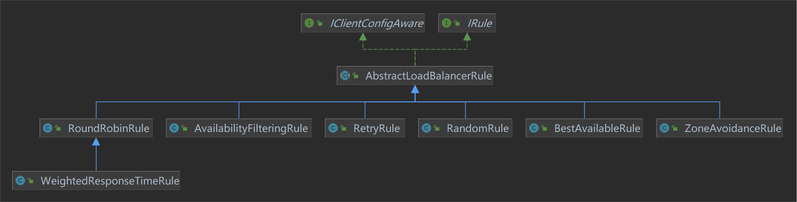

# Ribbon

> 基于[【官网】](https://docs.spring.io/spring-cloud-netflix/docs/2.2.9.RELEASE/reference/html/#spring-cloud-ribbon)、《尚硅谷 SpringCloud 框架开发教程》

## 一、基本概念

Ribbon 是 Netflix 发布的开源项目，主要功能是**提供客户端的软件负载均衡算法和服务调用**。

Ribbon 的主要功能包括：

- 负载均衡：Ribbon 可以根据配置的负载均衡策略（如轮询、随机、权重等）将请求分发到不同的服务提供者实例上，实现请求的均衡分配。
- 故障转移：当某个服务提供者实例不可用时，Ribbon 可以自动将请求转发到其他可用的实例上，从而实现故障转移和容错机制。
- 容错机制：Ribbon 具备一定的容错机制，可以根据配置的规则和策略来处理服务不可用或出现异常的情况，例如：连接超时时进行重试等，以确保系统的稳定性和可靠性。

### （一）负载均衡

**负责均衡（Load Balancing，LB）**是指在计算机网络中将工作负载（如请求、数据包等）按照一定的**策略**分配到多个服务器或处理单元上，以实现资源的最优利用、提高系统的性能和可靠性。负载均衡可以确保各个服务器在处理请求时负载均衡，避免某些服务器过载而导致性能下降或服务不可用；或者某些服务器空闲导致资源浪费。

负载均衡可以应用于各种场景，例如：网络流量分发、网站访问、应用程序服务、数据库查询等。

### （二）负责均衡方案

目前主流的负载均衡方案分为以下两种：

#### 1、服务端负载均衡


服务端负载均衡（也称为集中式 LB）是指负载均衡器位于服务端，服务消费者（客户端）只知道服务端负载均衡向外暴露的地址，并向该地址发送请求，由服务端负载均衡**转发给真正的服务提供者**。常见的服务端负载均衡有软件：Nginx、LV5；有硬件：F5 等。

#### 2、客户端负载均衡


客户端负载均衡（也称为进程内 LB）是指由客户端自身维护服务提供者的地址列表，自己通过负载均衡策略选择服务提供者的地址，直接将请求发送给对应的服务提供者。常见的客户端负载均衡有：Ribbon、LoadBalancer。

## 二、Ribbon 使用

Eureka 通常和 Ribbon 搭配使用：

1. Ribbon 先选择一个负载较少的 EurekaServer ，获取所有注册的服务信息列表。
2. 根据用户指定的策略，选择一个服务地址，使用 RestTemplate 发送请求。

这里我们直接引入依赖：

```xml
<!-- 集成 Eureka、Ribbon -->
<dependency>
    <groupId>org.springframework.cloud</groupId>
    <artifactId>spring-cloud-starter-netflix-eureka-client</artifactId>
</dependency>

<!-- RestTemplate 依赖 -->
<dependency>
    <groupId>org.springframework.boot</groupId>
    <artifactId>spring-boot-starter-web</artifactId>
</dependency>
```

### （一）负载均衡策略

Ribbon 提供 IRule 负责均衡策略接口，具体实现类如下：



- RoundRobinRule：轮询。
  - WeightedResponseTimeRule：响应速度越快，服务实例选择权重越大，越容易被选中。
- RandomRule：随机。
- RetryRule：接收一个 IRule 实现类（默认为 RoundRobinRule），使用该 IRule 实现类策略获取服务。如果获取服务失败，则在指定时间（500 ms）内会进行重试。
- BestAvailableRule：会先过滤掉失效的服务，然后选择一个并发量最小的服务。如果都处于失效状态，默认采用 RoundRobinRule 策略。
- AvailabilityFilteringRule：会先过滤掉失效的和并发量大的服务，然后选择一个并发量较小的服务。
- ZoneAvoidanceRule：默认策略，以区域可用的服务器为基础进行服务器的选择，选择时使用 RoundRobinRule 策略。使用 Zone 对服务器进行分类，这个 Zone 可以理解为一个机房、一个机架等。

### （二）[@LoadBalanced](https://blog.csdn.net/meser88/article/details/121493730)

@LoadBalanced 是一个用于 RestTemplate、WebClient、Feign 等 HTTP 客户端的注解，用于声明这个客户端具有负载均衡的能力。

```java
@Bean
@LoadBalanced
// 赋予 RestTemplate 负载均衡能力，需要通过服务名进行请求
public RestTemplate restTemplate() {
    return new RestTemplate();
}

// 通过服务名，而不是具体的 HTTP 地址进行请求
private static final String PAYMENT_URL = "http://CLOUD-PAYMENT-SERVICE";
// private static final String PAYMENT_URL = "http://localhost:8001";

@GetMapping("/payment/get/{id}")
public CommonResult<Payment> get(@PathVariable("id") Long id) {
    return restTemplate.getForObject(PAYMENT_URL + "/payment/get/" + id, CommonResult.class);
}
```

原理（以 Ribbon 为例）：

- LoadBalancerAutoConfiguration 会去获取 @LoadBalanced 注解的 RestTemplate bean 类。
- LoadBalancerInterceptor 去获取 Ribbon 策略实例。
- Ribbon 策略实例再通过服务名获取到服务实例地址，用这个地址替换掉 RestTemplate 请求时 HTTP 中的服务名，再进行请求。

### （三）实现负载均衡策略

了解了负载均衡策略实现原理，也可以手写一个：

```java
public interface LoadBalancer {

    /**
     * Description: 从所有的服务实例中选择一个服务实例
     *
     * @param serviceInstances 所有的服务实例
     * @return org.springframework.cloud.client.ServiceInstance
     */
    ServiceInstance instances(List<ServiceInstance> serviceInstances);
}

/**
 * Description: 自定义负载均衡算法实现类，根据访问次数获取服务实例
 */
@Component
public class MyLB implements LoadBalancer {

    private final AtomicInteger atomicInteger = new AtomicInteger(0);

    /**
     * Description: 获取并增加访问次数
     *
     * @return int
     */
    public final int getAndIncrement() {
        int current;
        int next;
        do {
            current = this.atomicInteger.get();
            next = current >= Integer.MAX_VALUE ? 0 : current + 1;
        } while (!this.atomicInteger.compareAndSet(current, next)); // CAS
        System.out.println("*****第几次访问，次数next: " + next);
        return next;
    }

    /**
     * Description: 从所有的服务实例中选择一个服务实例
     *
     * @param serviceInstances 所有的服务实例
     * @return org.springframework.cloud.client.ServiceInstance
     */
    @Override
    public ServiceInstance instances(List<ServiceInstance> serviceInstances) {
        // 获取当前服务实例的下标
        int index = getAndIncrement() % serviceInstances.size();
        return serviceInstances.get(index);
    }
}

@Configuration
public class ApplicationContextConfig {
    /**
     * Description:
     * 为了测试自定义的负载均衡算法，没有 @LoadBalanced 注解，也就是没有 Ribbon 负载均衡能力
     */
    @Bean("restTemplate2")
    public RestTemplate getRestTemplate2() {
        return new RestTemplate();
    }
}
```

```java
@RestController
@RequestMapping("/consumer")
public class OrderController {

    @Resource
    private MyLB myLB;

    @Resource(name = "restTemplate2")
    private RestTemplate restTemplate2;

    @GetMapping("/payment/lb")
    public String getPaymentLB() {
        List<ServiceInstance> serviceInstances = discoveryClient.getInstances("CLOUD-PAYMENT-SERVICE");
        if (serviceInstances == null || serviceInstances.size() <= 0) {
            return null;
        }
        ServiceInstance serviceInstance = myLB.instances(serviceInstances);
        URI uri = serviceInstance.getUri();
        // 使用未加 @LoadBalanced 注解的 RestTemplate
        return restTemplate2.getForObject(uri + "/payment/lb", String.class);
    }
}
```

### （四）自定义配置

Ribbon 中有一个默认配置类 RibbonClientConfiguration，用于设置某些默认值：

| Bean 类型                  | 说明                               | Bean 名称               | 默认实现类                                                              |
| -------------------------- | ---------------------------------- | ----------------------- | ----------------------------------------------------------------------- |
| IClientConfig              | Ribbon 的客户端配置                | ribbonClientConfig      | com.netflix.client.config.DefaultClientConfigImpl                       |
| IRule                      | 负载均衡策略                       | ribbonRule              | com.netflix.loadbalancer.ZoneVoidanceRule                               |
| IPing                      | 实例检查策略，检查服务实例是否可用 | ribbonPing              | com.netflix.loadbalancer.NoOpPing                                       |
| ILoadBalancer              | 负载均衡器                         | ribbonLoadBalancer      | com.netflix.loadbalancer.ZoneAwareLoadBalancer                          |
| `ServerList<Server>`       | 服务实例清单维护机制               | ribbonServerList        | com.netflix.loadbalancer.ConfigurationBasedServerList                   |
| `ServerListFilter<Server>` | 服务实例清单过滤机制               | ribbonServerListFilter  | org.springframework.cloud.netflix.ribbon.ZonePreferenceServerListFilter |
| ServerListUpdater          | 服务实例清单更新器                 | ribbonServerListUpdater | com.netflix.loadbalancer.PollingServerListUpdater                       |

#### 1、[注解方式](https://blog.51cto.com/u_16012040/6142497)

Ribbon 提供 @RibbonClient 注解，用于为指定的服务设置自定义配置，其中有两个属性：

- name：服务注册发现中心的服务名。
- configuration：自定义的配置类。

```java
@Configuration
protected static class FooConfiguration {
    @Bean
    public ZonePreferenceServerListFilter serverListFilter() {
        ZonePreferenceServerListFilter filter = new ZonePreferenceServerListFilter();
        filter.setZone("myTestZone");
        return filter;
    }

    @Bean
    public IPing ribbonPing() {
        return new PingUrl();
    }

    @Bean
    public IRule myRule() {
        return new RoundRobinRule(); // 定义为随机
    }
}
```

```java
package com.atguigu.springcloud;

@SpringBootApplication
// 声明自己是 eureka 客户端
@EnableEurekaClient
// 指定自定义的配置
@RibbonClient(name = "CLOUD-PAYMENT-SERVICE", configuration = com.atguigu.myrule.FooConfiguration.class)
public class OrderMain80 {

    public static void main(String[] args) {
        SpringApplication.run(OrderMain80.class, args);
    }
}
```

可以注意到：启动类 OrderMain80 位于 `com.atguigu.springcloud` 包，而自定义配置类 FooConfiguration 位于 `com.atguigu.myrule` 包，为什么 FooConfiguration 不放在 `com.atguigu.springcloud` 包下呢？

项目启动时 @ComponentScan 会扫描同包及包下的**相同类型的 Bean**，会覆盖掉默认配置，而我们只想单独为 CLOUD-PAYMENT-SERVICE 服务设置一个 FooConfiguration 配置。如果放在 `com.atguigu.springcloud` 包下，则会覆盖掉默认的配置，相当于会对所有的服务生效。

> 注意：是相同类型的 Bean，不是相同名称的 Bean。

此外 Ribbon 还提供 @RibbonClients 注解，用于为多个服务设置自定义配置：

```java
@RibbonClients(defaultConfiguration = RibbonClientConfiguration.class, value = {@RibbonClient(name = "CLOUD-PAYMENT-SERVICE", configuration = MySelfRule.class)})
```

#### 2、[配置文件](https://blog.51cto.com/u_16012040/6142505)

也可以通过配置文件方式进行配置，配置格式如下：

```yml
注册发现中心服务名:
  ribbon:
    配置名称1: 对应的配置实现类1
    配置名称2: 对应的配置实现类2
    ...
```

配置名称值有：NFLoadBalancerClassName、NFLoadBalancerRuleClassName、NFLoadBalancerPingClassName、NIWSServerListClassName、NIWSServerListFilterClassName。就是对应着 Ribbon 的默认配置文件 RibbonClientConfiguration 中的 ILoadBalancer、IRule、IPing、ServerList 以及 ServerListFilter 的实现类名称，我们只需要将需要的实现类的类全路径放置在后面即可，如下面的例子：

```yml
CLOUD-PAYMENT-SERVICE:
  ribbon:
    NIWSServerListClassName: com.netflix.loadbalancer.ConfigurationBasedServerList
    NFLoadBalancerRuleClassName: com.netflix.loadbalancer.WeightedResponseTimeRule
```

优先级：配置文件 > @RibbonClient 注解 > RibbonClientConfiguration 默认配置。

### （五）[停更说明](https://github.com/Netflix/ribbon)

Ribbon 已处于维护阶段，也就是不再主动更新。


