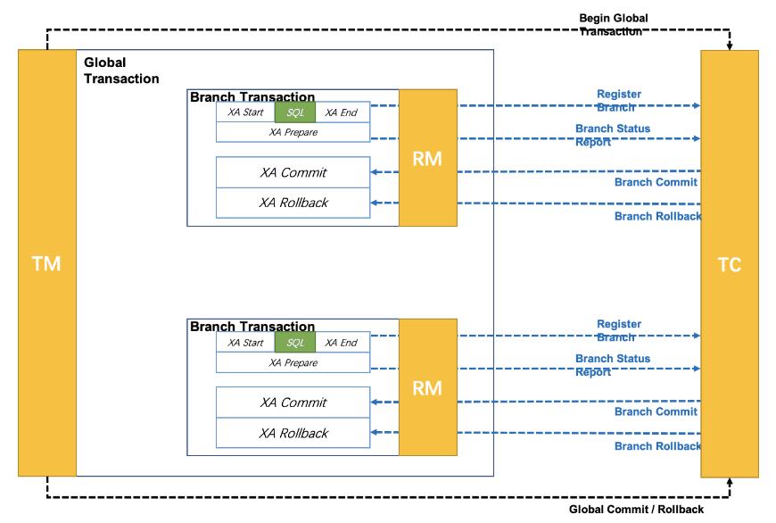

# Seata

> 基于[《官网》](https://seata.io/zh-cn/)、[分布式事务](https://www.cnblogs.com/crazymakercircle/p/13917517.html)
>
> 以下 Seata Server 版本为 Seata 2.0.0

## 一、基本概念

**背景 1**：

单体应用被拆分成微服务应用，原来的单个模块被拆分成多个独立的应用，分别使用独立的数据源，业务操作需要调用多个服务来完成。此时每个服务内部的数据一致性由**本地事务**来保证，但是**全局的数据一致性问题没法保证**。

例如：用户购买商品的 Business 服务会去调用以下三个服务：

- Storage 仓储服务：对给定的商品扣除仓储数量。
- Order 订单服务：生产一条订单。
- Account 账户服务：从用户账户中扣除余额。

每个服务都使用独立的数据源，每个服务只能保证自己本地数据源的事务，在 Business 服务看来，调用这三个服务是独立的步骤，并没有关联，可能会发生 Order 执行失败、Storage、Account 执行成功的情况，因此**我们必须要解决分布式场景下事务的问题**。


---

Seata 是一款**开源的分布式事务解决方案**，致力于提供高性能和简单易用的分布式事务服务。Seata 将为用户提供了 AT、TCC、Saga 和 XA 事务模式，为用户打造一站式的分布式解决方案。

### （一）重要知识点

- **本地事务**：当事务（一般是指数据库的事务）由 RM 进行本地管理时被称作本地事务。本地事务的优点就是支持严格的 ACID 特性，高效、可靠，状态可以只在 RM 中维护，而且应用编程模型简单。但是本地事务不具备分布式事务的处理能力，隔离的最小单位受限于资源管理器。
- **全局事务**：当事务由 TM 进行全局管理时被称作全局事务。

Seata 中有三个重要的角色，TM 和 RM 是作为 Seata 的客户端与业务系统集成在一起，TC 作为 Seata 的服务端独立部署。以上面的场景为例：


- **TC（Transaction Coordinator、事务协调器）**：维护全局事务和分支事务的运行状态，负责协调并驱动全局事务的提交或回滚。
- **TM（Transaction Manager、事务管理器）**：定义全局事务的范围，负责开启一个全局事务，并最终发起全局事务提交或回滚的决议。
- **RM（Resource Manager、资源管理器）**：管理分支事务，与 TC 交谈以注册分支事务和报告分支事务状态，并驱动分支事务（本地事务）提交或回滚。

### （二）CAP 定理

> CAP 定理是由加州大学伯克利分校 Eric Brewer 教授提出来的，麻省理工学院的 Seth Gilbert 和 Nancy Lynch 从理论上证明了 CAP 理论。

#### 1、CAP 组成

CAP 定理是分布式领域的公认定理，由以下三部分组成：

（1）C（Consistency、一致性）：分布式系统中的**任何节点在任何时间，数据都是完全一致的**，不能存在中间态。

> **一致性又可细分为：强一致性、弱一致性、最终一致性。**
>
> - 强一致性：CAP 中的 C 指的就是强一致性。
> - 最终一致性：允许存在中间状态，只要经过一段时间后，数据最终是一致的。
> - 弱一致性：允许存在部分数据不一致。

（2）A（Availability、可用性）：对于用户的每一个操作请求总是能够**在有限的时间内返回正确结果**。

（3）P（Partition Tolerance、分区容忍度）：**分布式系统在遇到任何网络分区故障时，仍然需要能够保证对外提供满足一致性和可用性的服务**，除非是整个网络环境都发生了故障。

#### 2、CAP 应用

分布式系统最基本就需要满足 P 特性，因为分布式系统中的子节点分布在不同网络中，子节点可能由于某些原因不能对外提供服务，但是整体的分布式系统对外部来说，仍然必须是可用的。

- 如果要保证一致性（C），即所有节点的数据随时随刻都是一致的，而要保证数据一致性，就需要**让全部节点数据同步完成后才可以对外提供服务**。

  在 **CP** 的情况下，两个服务节点间网络异常时，为保证一致性，仍然会在**写入数据时等待同步完成或者直至超时**，进而牺牲了可用性（A）。

- 如果要保证可用性（A），即只要不是服务宕机所有请求都可得到正确的响应，而要保证可用性，就需要**让客户端连接的节点在一定时间内响应**。

  在 **AP** 的情况下，两个服务节点间网络异常时，为保证可用性，**若有限时间内数据同步没有完成，则不会等待，导致节点间数据不一致**，进而牺牲了一致性（C）。


随着分布式系统的规模越来越大，节点故障、网络故障是常态，为了保证用户的流畅使用，一般是优先满足 AP 特性。但是涉及到钱财这种必须保证数据强一致性的场景，就要优先满足 CP 特性。

### （三）BASE 定理

BASE 理论是对 CAP 理论中 AP 方案的延伸，核心思想是：**即使无法做到强一致性（Strong Consistency，CAP 的 C 就是强一致性），但应用可以采用适合的方式达到最终一致性（Eventual Consitency）**。

> BASE 理论是对 CAP 中一致性和可用性权衡的结果，其来源于对大规模互联网系统分布式实践的总结， 是基于 CAP 定理逐步演化而来的。

BASE 是 Basically Available（基本可用）、Soft state（软状态）和 Eventually consistent（最终一致性）三个短语的缩写：

- Basically Available（基本可用）：指分布式系统在出现不可预知的故障的时候，允许损失部分可用性（即允许响应时间变长、允许服务降级），但不等于系统不可用。
- Soft state（软状态）：指允许系统中的数据存在中间状态，并认为该中间状态的存在不会影响系统的整体可用性，即允许不同节点之间的数据副本进行同步的过程存在延时。
- Eventually consistent（最终一致性）：强调系统中所有的数据副本，在经过一段时间的同步后，最终能够达到一个一致的状态。其本质是需要系统保证最终数据能够达到一致，而不需要实时保证系统数据的强一致性。

## 二、分布式事务

分布式事务是指事务的参与者、支持事务的服务器、资源服务器以及事务管理器分别位于不同的分布式系统的不同节点之上。

> 简单的说，在分布式系统上一次大的操作由不同的小操作组成，这些小的操作分布在不同的服务节点上，且属于不同的应用，会操作不同资源（例如数据库），分布式事务需要保证这些小操作要么全部成功，要么全部失败。

上面的 Business 场景就是分布式一致性问题，**分布式一致性的根本原因在于数据的分布式操作，引起的本地事务无法保障数据的原子性**。

分布式一致性问题的解决思路有两种，一种是分布式事务，一种是尽量通过业务流程避免分布式事务。分布式事务是直接解决问题，而业务规避其实通过解决出问题的地方（解决提问题的人）。

> 其实在真实业务场景中，如果业务规避不是很麻烦的前提，最优雅的解决方案就是业务规避。

分布式事务实现方案从类型上分为：**刚性事务、柔性事务**。

### （一）刚性事务

**刚性事务要使分布式事务，达到像本地式事务一样，具备数据强一致性，满足 CP 方案。**

刚性事务的特点：强一致性、通常无业务改造、原生支持回滚/隔离性、低并发、适合短事务。

刚性事务的具体实现有：XA 协议（2PC/3PC、JTA、JTS）、Seata 等。

#### 1、DTP 模型和 XA 规范

X/Open **DTP（Distributed Transaction Process）** 是由 X/OPEN 基金会提出的分布式事务模型，其中有三个角色：


- AP（Application、应用程序）：应用（即业务服务）负责请求 TM 发起全局事务。
- TM（Transaction Manager、事务管理器）：接收 AP 的请求，负责开启一个全局事务、管理分支事务状态、协调 RM 的处理、全局事务的提交或回滚。
- RM（Resource Manager、资源管理器）：向 TM 报告分支事务状态，并驱动分支事务（本地事务）提交或回滚。

> 在分布式系统中，从理论上讲，两台机器理论上无法达到一致的状态，需要引入事务管理器进行协调。
>
> 事务管理器控制着全局事务，管理事务生命周期，并协调资源；资源管理器负责控制和管理实际资源（例如数据库）。

XA 规范（XA Specification）是 X/OPEN 基金会提出的分布式事务处理规范。XA 则规范了 TM 与 RM 之间的通信接口，在 TM 与每个 RM 之间形成一个双向通信桥梁，从而在多个数据库资源场景下保证全局事务四个特性。

> 目前知名的数据库，如 Oracle、DB2、MySQL（仅 InnoDB 引擎支持 XA 协议）等，都是实现了 XA 接口的，都可以作为 RM。

#### 2、2PC

2PC（Two-Phase Commit、二阶段提交）是 XA 规范的具体实现，顾名思义，2PC 将全局事务分为两个阶段处理：

（1）**阶段一（准备阶段）：执行分支事务**

- 事务询问：协调者 Coordinator 向所有参与者 Participant 发送请求，询问是否可以执行提交操作，并开始等待各参与者进行响应。
- 执行分支事务：各 Participant 执行事务**预提交操作（执行完事务但还未 commit）**，并将 undo 和 redo 操作记入本机事务日志。
- 各 Participant 向 Coordinator 发送事务响应，成功返回 yes，失败则返回 no。

（2）**阶段二（提交阶段）：执行全局事务提交或者全局事务回滚**

① 所有 Participant 都返回 yes，则表示所有分支事务执行成功，那么执行全局事务提交：


- 向所有 Participant 发送 commit 请求。
- 提交分支事务：Participant 收到 commit 请求后，**会正式执行事务 commit 操作，完成 commit 之后释放事务期间占用的资源（例如锁）**。
- 各 Participant 向 Coordinator 发送 ack 响应。
- 全局事务提交：Coordinator 在收到所有参与者的 ack 后，完成全局事务提交。

② 部分 Participant 返回 no，或者 Coordinator 等待超时（例如：某些原因断开连接导致发送的 yes 丢失），那么执行全局事务回滚：


- 向所有 Participant 发送 rollback 请求。
- 回滚分支事务：Participant 收到 rollback 请求后，**会执行事务 rollback 操作，完成 rollback 之后释放事务期间占用的资源（例如锁）**。
- 各 Participant 向 Coordinator 发送 ack 响应。
- 全局事务回滚：Coordinator 在收到所有参与者的 ack 后，完成全局事务回滚。

---

通过 2PC 的执行流程，我们可以发现 2PC 的优点：

- 实现原理简单，只需要添加 Coordinator 管理全局事务就行。
- 对业务侵扰小，原本的业务该怎么样就怎么样，并不需要改动。

但同时 2PC 也有很多缺点：

① 使用数据源（例如数据库）的事务来实现本地事务，因此**数据源必须支持事务和 XA 规范**。

② **单点故障导致高可用（HA）问题：**

协调者 Coordinator 是个单点，一旦出现问题，各个参与者 Participant 都无法完成事务操作，也无法释放事务占用的资源，导致 Participant 处于阻塞状态。即便重新选举一个 Coordinator，在选举期间 Participant 也是阻塞的。

③ **同步阻塞导致性能问题：**

执行过程中，所有 Participant 都是事务阻塞型的。各个 Participant 都在等待其他参与者响应，无法进行其他操作。所有分支的资源锁定时间，由最长的分支事务决定。

> 当参与者锁定公共资源时，处于事务之外的其他第三方访问者，也不得不处于阻塞状态，**存在长事务风险。**

④ **丢失消息导致的数据不一致问题：**

在二阶段中 Coordinator 向所有 Participant 发送 commit 请求，假如由于网络原因，部分节点收到请求并执行事务 commit，部分节点未收到请求导致无法执行事务提交，于是整个分布式系统便出现数据不一致问题。

⑤ **过于保守：**

2PC 协议没有设计较为完善的容错机制，**任意一个节点的失败都会导致整个事务的失败**。

#### 3、3PC

3PC 是 2PC 的改进版，3PC 协议将 2PC 协议的一阶段一分为二，从而形成了三个阶段：


（1）**阶段一（询问阶段）：询问分支事务**

- Coordinator 向所有 Participant 发送 canCommit 请求，询问是否可以执行事务提交。
- 各个参与者进行响应，参与者认为可以顺利执行事务，则返回 yes，否则返回 no。

（2）**阶段二（准备阶段）：执行或中断分支事务**

① 所有 Participant 都返回 yes：

- 协调者 Coordinator 向所有参与者 Participant 发送预提交 Precommit 请求。
- 执行分支事务：各 Participant 执行事务**预提交操作（执行完事务但还未 commit）**，并将 undo 和 redo 操作记入本机事务日志。
- 各 Participant 向 Coordinator 发送事务响应，成功返回 yes，失败则返回 no。

② 部分 Participant 返回 no，或者 Coordinator 等待超时（例如：某些原因断开连接导致发送的 yes 丢失）：

- 协调者 Coordinator 向所有参与者 Participant 发送事务中断 Abort 请求。
- 中断分支事务：**Participant 无论是收到 Abort 请求还是等待超时，都会中断事务**。

（3）**阶段三（提交阶段）：执行全局事务提交或者全局事务回滚**

和 2PC 的阶段二基本一致，不再赘述。

---

**3PC 在协调者和参与者中都引入了超时机制，避免了参与者在长时间无法与协调者节点通讯（例如协调者挂掉了）的情况下，无法释放资源的问题；并且把 2PC 的阶段一分成了两步：询问然后再预提交（锁资源）。**

在阶段三阶段，如果 Participant 由于网络等原因，没有收到 Coordinator 的 commit 或 rollback 请求，**那么它有理由相信——成功提交的几率很大，然后自动进行 commit 从而进行释放资源**。但是这也可能带来一个问题，假如 Coordinator 发送的是 rollback 请求，此节点自动执行事务 commit，而其他节点执行 rollback，还是会导致数据不一致的问题。


### （二）柔性事务

**柔性事务指的是，不要求强一致性，而是要求最终一致性，允许有中间状态，满足 BASE 理论。**

柔性事务的特点：最终一致性、有业务改造、实现补偿接口、实现资源锁定接口、高并发、适合长事务。

> 在高并发的场景下，刚性事务在数据库性能和处理能力上都暴露出了瓶颈。

柔性事务主要分为**通知型**和**补偿型**：

- 通知型事务是**异步事务**。具体实现有：异步确保型、最大努力通知型。

  > 通知型事务的主流实现是通过 MQ（消息队列）来通知其他事务参与者自己事务的执行状态，引入 MQ 组件，有效的将事务参与者进行解耦，各参与者都可以异步执行。

- 补偿型事务是**同步事务**，具体实现有：TCC、Saga。

  > 补偿模式使用一个额外的协调服务来协调各个需要保证一致性的业务服务，协调服务按顺序调用各个业务微服务，如果某个业务服务调用异常（包括业务异常和技术异常）就取消之前所有已经调用成功的业务服务。

#### 1、TCC

TCC（Try-Confirm-Cancel）提出了一种新的事务模型，基于业务层面的事务定义，锁粒度完全由业务自己控制，目的是解决复杂业务中，跨表跨库等大颗粒度资源锁定的问题。包括三部分：


- **主业务服务**：主业务服务为整个**业务活动的发起方**，负责发起并完成整个业务活动。
- **从业务服务**：从业务服务是整个**业务活动的参与方**，负责提供 TCC 业务操作（实现初步操作(Try)、确认操作(Confirm)、取消操作(Cancel)三个接口），供主业务服务调用。
- **业务活动管理器**：业务活动管理器**管理控制整个业务活动**，包括：记录维护 TCC 全局事务的事务状态和每个从业务服务的分支事务状态；在业务活动提交时调用所有从业务服务的 Confirm 操作；在业务活动取消时调用所有从业务服务的 Cancel 操作。

> 这里提到 Confirm/Cancel 执行的本地事务是**补偿型事务**，补偿是一个独立的支持 ACID 特性的本地事务，用于在逻辑上取消服务提供者上一个 ACID 事务造成的影响。

TCC 把事务运行过程分成 Try、Confirm / Cancel 两个阶段，**每个阶段的逻辑由业务代码控制，避免了长事务，可以获取更高的性能**。TTC 执行流程如下：


- 主业务服务向业务活动管理器注册并启动全局事务。
- 主业务服务调用从业务服务的 Try 接口，尝试执行业务，完成所有业务的检查，实现一致性；预留必须的业务资源，实现准隔离性。
- TCC 模型认为对于业务系统中一个特定的业务逻辑，其对外提供服务时，必须接受一些不确定性，**即对业务逻辑初步操作的调用仅是一个临时性操作，调用它的主业务服务保留了后续的取消权**：
  - 如果主业务服务认为全局事务应该回滚（部分从业务服务超时或执行失败），它会要求业务管理器取消之前的临时性操作，这就对应从业务服务的 **Cancel 操作，取消执行业务，释放 Try 阶段预留的业务资源**。
  - 如果主业务服务认为全局事务应该提交时（全部从业务服务执行成功），它会放弃之前临时性操作的取消权，这对应从业务服务的 **Confirm 操作，执行业务，释放 Try 阶段预留的业务资源**。

> 注意：TCC 中会添加事务日志，如果 Confirm 或者 Cancel 阶段出错，则会进行重试，所以这两个阶段需要支持**幂等**；如果重试失败，则需要人工介入进行恢复和处理等。

---

TCC 相较于 XA 模型，相同点在于 TCC 中的 Try 就相当于一阶段提交，一阶段成功就执行二阶段 Confirm，一阶段失败就执行二阶段 Cancel；区别在于**它不依赖资源管理器(RM)对分布式事务的支持，而是通过对业务逻辑的分解来实现分布式事务**。

> XA 是资源层面的分布式事务，数据源需要支持 XA 协议和事务，强一致性，在全局事务提交前会一直锁住资源，高并发下性能较差。
>
> TCC 是业务层面的分布式事务，最终一致性，不会一直锁住资源，性能较好。但是对服务的侵入性较大，每个服务都要实现 try、confirm 和 cancel 接口，开发成本高，今后维护改造的成本也高。由于事务管理器要记录事务日志，必定会损耗一定的性能，并使得整个 TCC 事务时间拉长。

还是以上面 Business 服务为例：

- 订单服务：
  - try：支付状态设置为创建中。
  - confirm：设置为已完结。
  - cancel：设置为已取消。
- 仓储服务：多加一个**锁定库存**的字段记录，用于记录业务处理中的状态。
  - try：总库存 -1，锁定库存 +1。例如：**先检查是否有足够的库存，预留此次业务的库存。**假设有 100 件库存，现在锁定 1 件库存，对于其他业务来说只剩 99 件可用。
  - confirm：锁定库存 -1。例如：支付成功，锁定库存 -1。
  - cancel：总库存 +1，锁定库存 -1。例如：对 try 阶段操作进行业务回滚。假设支付失败，则将 99 改回 100 件可用，锁定的库存 -1。
- 账户服务：多加一个冻结金额的字段记录，用于记录业务处理中状态。
  - try：余额 -1，冻结余额 +1。
  - confirm：冻结金额 -1。
  - cancel：余额 +1，冻结金额 -1。

> 注意：以上 Confirm/Cancel 需要支持幂等性，为了方便描述因此不是很严谨。

业务活动管理器负责对以上三个服务进行管理：

- 假如所有服务 try 执行成功，则触发所有服务的 Confirm 方法。
- 假如有任何一个服务 try 执行失败，则触发所有服务的 Cancel 方法。

#### 2、[Saga](https://cloud.tencent.com/developer/article/1839642)

Saga 分布式处理模式是一种**长事务的解决方案，适合于业务流程长、业务流程多的场景**。

> 1987 年普林斯顿大学的 Hector Garcia-Molina 和 Kenneth Salem 发表了一篇 Paper Sagas，讲述的是如何处理长活事务（Long Live Transaction）。

**Saga 模型是把一个分布式事务拆分为多个本地事务，每个本地事务都有相应的执行模块和补偿模块**，当 Saga 事务中任意一个本地事务出错时，可以通过调用相关的补偿方法恢复之前的事务，达到事务最终一致性。

Saga 模型由三部分组成：

- **LLT**（Long Live Transaction）：由一个个本地事务组成的事务链**。**
- **本地事务**：是一个真实执行的事务，事务链由一个个子事务（本地事务）组成，LLT = T1+T2+T3+...+Ti。
- **补偿**：每个本地事务 Ti 有对应的补偿 Ci。

> 注意：
>
> - Saga 只允许**两个层次的嵌套**，顶级的 Saga 和简单子事务，即简单子事务下不能再有子事务。
> - 每个子事务应该是独立的原子行为。

当正常执行 Sage 事务时，会依次执行其中每个本地事务；如果发生异常，Saga 提供两种恢复策略：

- **向前恢复**（Forward Recovery）：**即重试失败的事务，适用于必须要成功的场景**，该情况下不需要 Ci。执行顺序：T1,T2,...,Tj（失败）,Tj（重试）,...,Ti。

- **向后恢复**（Backward Recovery）：**撤销掉之前所有成功子事务。**如果任意本地子事务失败，则补偿已完成的事务。如异常情况的执行顺序 T1,T2,T3,..Ti,Ci,...C3,C2,C1。

  

我们把 **Sage 执行或回滚事务的顺序称为 Sage 的协调逻辑**，协调逻辑又分为两种模式：

**（1）编排（Choreography）**

参与者（子事务）之间负责彼此的排序、决策和调用，是一种去中心化的模式。

参与者之间通过消息机制进行沟通，通过监听器的方式监听其他参与者发出的消息，从而执行后续的业务逻辑。


**（2）控制（Orchestration）**

通过一个额外的 Saga 控制器负责参与者的排序、决策和调用。控制器按照逻辑顺序调用参数着，从参与者那里接收到反馈（失败或成功）以后，控制器发起恢复策略或继续调用下一个参与者。


---

TCC 面临的问题：对业务侵入性大，每个业务服务都需要添加 try、confirm、cancel 的接口实现，并且需要修改之前的业务流程，如果调用的是不遵守 TCC 模式的第三方业务，那么将导致开发成本变高。如果子事务多，那么需要进行更多的开发。

**Saga 和 TCC 相同点在于——无法保证隔离性**，即全局事务执行过程中，其它全局事务能看到未全局提交的修改。

Saga 和 TCC 相比是缺少 Try 流程，导致补偿动作实现比较麻烦，但是没有 Try 流程也带来很多优点：**业务实现简单**，Saga 只需要提供一个 Cancel 补偿动作就行，不需要修改原本的业务逻辑；减少节点间的通信次数。

> 例如：一个业务是发送邮件，在 TCC 模式下，先保存草稿（Try）再发送（Confirm），撤销的话直接删除草稿（Cancel）就行了。而 Saga 则就直接发送邮件了（Ti），如果要撤销则得再发送一份邮件说明撤销（Ci），实现起来有一些麻烦。

### （三）总体的方案对比


| 属性       | 2PC | TCC | Saga |
| ---------- | --- | --- | ---- |
| 事务一致性 | 强  | 弱  | 弱   |
| 复杂性     | 中  | 高  | 中   |
| 业务侵入性 | 小  | 大  | 小   |
| 使用局限性 | 大  | 大  | 中   |
| 性能       | 低  | 中  | 高   |
| 维护成本   | 低  | 高  | 中   |

## 三、Seata 安装配置

> 由于 Seata 版本差异大，安装配置也很麻烦，因此这里特地介绍 [Seata 2.0.0](https://github.com/apache/incubator-seata/releases/tag/v2.0.0) 的安装配置。

### （一）[事务存储模式](https://seata.io/zh-cn/blog/seata-quick-start#21-%E4%B8%8B%E8%BD%BD-seata-%E8%BD%AF%E4%BB%B6%E5%8C%85)

因为 TC（即 Seata Server）需要进行全局事务和分支事务的记录，所以需要对应的存储。TC 有两类存储模式（store.mode）：file、db（redis、raft）。

> 目前 TC 已提供四种存储模式：file、db、redis、raft。
>
> - file 模式为单机模式，全局事务会话信息内存中读写并持久化本地文件 root.data，性能较高。
> - db 模式为高可用模式，全局事务会话信息通过 db 共享，相对性能差点。
> - redis 模式为高可用模式，Seata-Server 1.3 及以上版本支持，性能较高，存在事务信息丢失风险。

#### 1、file 模式

file 适合单机模式（即单个 Seata Server），Seata Service 全局事务会话信息在内存中读写，并持久化到本地文件 `bin/sessionStore/root.data`，性能较高。部署单机 TC Server 如下图所示：


#### 2、db 模式

db 适合集群模式（即多个 Seata Server 组成集群），多个 Seata Server 通过 db 数据库，实现全局事务会话信息的共享，相对性能差点。部署集群 TC Server 如下图所示：


### （二）config 和 registry

Seata 的 RM（TM 也是一个特殊的 RM）和 TC 都需要添加两个特殊的配置文件：registry.conf 和 file.conf，参数配置及含义在[官网](https://seata.io/zh-cn/docs/user/configurations#server%E7%AB%AF)中有说明。

> Seata Server 1.5.0 之后，使用 application.yml 取代了 registry.conf 和 file.conf。

file.conf 中配置着事务存储模式、TC 和 RM 通信方式等；registry.conf 中存储 config、registry 两个配置，用于指定配置中心和注册中心。

#### 1、config

config 参数用于指定 Seata Server 的配置中心，TC 有两类配置模式（config.type）：file、nacos（apollo、zk、consul、etcd3）。

- file：file 表示使用本地配置文件中的配置，`config.file.name = file.conf` 表示指定本地 file.conf 作为配置文件，。
- nacos：使用 nacos 作为配置中心（如何配置后面说明），Seata Server 读取配置中心的配置，此时 file.conf 可以去掉。

#### 2、registry

registry 参数用于指定 Seata Server 的配置中心，TC 有两类配置模式（registry.type）：file、nacos （eureka、redis、zk、consul、etcd3、sofa）。

- file：file 模式表示不使用注册中心。
  - registry 为 file 模式时，在 RM 的 file.conf 配置文件中，需要添加 `service.default.grouplist` 的配置，用于指定 TC 服务列表地址。
- nacos：使用 nacos 作为注册中心（如何配置后面说明），将 TC 注册到 nacos 中，RM 从 nacos 中获取 TC 服务列表地址。

### （三）[事务分组](https://seata.io/zh-cn/docs/user/txgroup/transaction-group)

上面说到，我们可以指定 Nacos 作为注册中心，将 TC 注册到 nacos 中，而 Seata 又提出事务分组的概念，即按照微服务需要，对 Seata Server 集群进行逻辑分组，RM 连接到 Seata Server 集群的指定分组中，而不是直接连接到 Seata Server 集群。

#### 1、配置

（1）**在 Seata Server 端**，以 Nacos 为例，registry.conf 中 registry 的配置为：

```conf
registry {
  # file 、nacos 、eureka、redis、zk、consul、etcd3、sofa
  type = "file"

  nacos {
    application = "seata-server" # Seata Server 服务名
    serverAddr = "192.168.190.134:8848" # Nacos 地址
    namespace = "seata" # namespace 名称
    group = "SEATA_GROUP" # group 名称
    cluster = "Shanghai" # cluster 名称
    username = "nacos" # Nacos 用户名
    password = "nacos" # Nacos 密码
  }
}
```

对于 Seata 来说，相同 application、serverAddr、namespace、group 的 Seata Server 便在一个集群中，使用 cluster 对 Seata Server 集群进行分组，相同 cluster 的 Seata Server 就是一个事务分组。

（2）**在 RM 端（即应用端）**，进行以下配置：

① 修改 file.conf 文件或配置中心的配置：

```properties
# my_Shanghai_tx_group 是自己定义的名称
# 值为事务分组的名称，即 cluster 名称
service.vgroupMapping.my_Shanghai_tx_group=Shanghai
```

② 修改 application.yml 配置：

```yml
spring:
  cloud:
    alibaba:
      seata:
        tx-service-group: my_Shanghai_tx_group # 连接到 service.vgroupMapping.my_Shanghai_tx_group 对应的事务分组，即 Shanghai
```

应用端通过 service.vgroupMapping.my_Shanghai_tx_group 对应的 cluster 值和 registry.conf 中 registry 的配置，获取 TC 服务列表地址，然后进行连接。

> 如果没有配置 `spring.cloud.alibaba.seata.tx-service-group`，默认值为 `${spring.application.name}-fescar-service-group`。

#### 2、作用

这里多了一层获取事务分组到映射集群的配置。这样设计后，事务分组可以作为资源的逻辑隔离单位，出现某集群故障时可以快速 failover，只切换对应分组，可以把故障缩减到服务级别，但前提也是你有足够 Server 集群。

假如一个 Seata Server 集群分成了 Shanghai 和 Guangzhou 两个事务分组（在地理位置上处于两个机房），每个分组中有若干个 Seata Server 节点，初始时所有微服务连接到 Guangzhou，如下所示：

```properties
seata.tx-service-group=projectA
seata.service.vgroup-mapping.projectA=Guangzhou
```


如果此时 Guangzhou 事务分组整个宕机，我们只需要将配置中的 Guangzhou 修改为 Shanghai，就完成对整个微服务的 TC 集群动态切换：

```properties
seata.service.vgroup-mapping.projectA=Shanghai
```


### （四）安装配置

> TC 和 RM 中使用的所有配置都可以在[官网](https://github.com/apache/incubator-seata/tree/master/script)中找到。

#### 1、前期准备

> Linux 7.4、MySQL 5.7.28、Nacos 2.1.1、Seata 2.0.0

（1）在 MySQL 中创建 seata 数据库，执行 [SQL 脚本](https://github.com/apache/incubator-seata/blob/master/script/server/db/mysql.sql)。

（2）在 Nacos 中添加 seata 命名空间。

（3）使用 Nacos 作为配置中心，将 `script/config-center/config.txt`（老版本为 `conf/nacos-config`）中的配置添加到 Nacos：

```properties
#For details about configuration items, see https://seata.io/zh-cn/docs/user/configurations.html
#Transport configuration, for client and server
transport.type=TCP
transport.server=NIO
transport.heartbeat=true
transport.enableTmClientBatchSendRequest=false
transport.enableRmClientBatchSendRequest=true
transport.enableTcServerBatchSendResponse=false
transport.rpcRmRequestTimeout=30000
transport.rpcTmRequestTimeout=30000
transport.rpcTcRequestTimeout=30000
transport.threadFactory.bossThreadPrefix=NettyBoss
transport.threadFactory.workerThreadPrefix=NettyServerNIOWorker
transport.threadFactory.serverExecutorThreadPrefix=NettyServerBizHandler
transport.threadFactory.shareBossWorker=false
transport.threadFactory.clientSelectorThreadPrefix=NettyClientSelector
transport.threadFactory.clientSelectorThreadSize=1
transport.threadFactory.clientWorkerThreadPrefix=NettyClientWorkerThread
transport.threadFactory.bossThreadSize=1
transport.threadFactory.workerThreadSize=default
transport.shutdown.wait=3
transport.serialization=seata
transport.compressor=none

#Transaction routing rules configuration, only for the client
# TODO: 自定义事务分组名称
service.vgroupMapping.seata_test_tx_group=default
#If you use a registry, you can ignore it
#service.default.grouplist=192.168.190.134:8091
service.enableDegrade=false
service.disableGlobalTransaction=false

client.metadataMaxAgeMs=30000
#Transaction rule configuration, only for the client
client.rm.asyncCommitBufferLimit=10000
client.rm.lock.retryInterval=10
client.rm.lock.retryTimes=30
client.rm.lock.retryPolicyBranchRollbackOnConflict=true
client.rm.reportRetryCount=5
client.rm.tableMetaCheckEnable=true
client.rm.tableMetaCheckerInterval=60000
client.rm.sqlParserType=druid
client.rm.reportSuccessEnable=false
client.rm.sagaBranchRegisterEnable=false
client.rm.sagaJsonParser=fastjson
client.rm.tccActionInterceptorOrder=-2147482648
client.rm.sqlParserType=druid
client.tm.commitRetryCount=5
client.tm.rollbackRetryCount=5
client.tm.defaultGlobalTransactionTimeout=60000
client.tm.degradeCheck=false
client.tm.degradeCheckAllowTimes=10
client.tm.degradeCheckPeriod=2000
client.tm.interceptorOrder=-2147482648
client.undo.dataValidation=true
client.undo.logSerialization=jackson
client.undo.onlyCareUpdateColumns=true
server.undo.logSaveDays=7
server.undo.logDeletePeriod=86400000
client.undo.logTable=undo_log
client.undo.compress.enable=true
client.undo.compress.type=zip
client.undo.compress.threshold=64k
#For TCC transaction mode
tcc.fence.logTableName=tcc_fence_log
tcc.fence.cleanPeriod=1h
# You can choose from the following options: fastjson, jackson, gson
tcc.contextJsonParserType=fastjson

#Log rule configuration, for client and server
log.exceptionRate=100

#Transaction storage configuration, only for the server. The file, db, and redis configuration values are optional.
# TODO: 使用 db 实现全局事务会话信息的共享
store.mode=db
store.lock.mode=db
store.session.mode=db
#Used for password encryption
#store.publicKey=

#If `store.mode,store.lock.mode,store.session.mode` are not equal to `file`, you can remove the configuration block.
store.file.dir=file_store/data
store.file.maxBranchSessionSize=16384
store.file.maxGlobalSessionSize=512
store.file.fileWriteBufferCacheSize=16384
store.file.flushDiskMode=async
store.file.sessionReloadReadSize=100

#These configurations are required if the `store mode` is `db`. If `store.mode,store.lock.mode,store.session.mode` are not equal to `db`, you can remove the configuration block.
store.db.datasource=druid
store.db.dbType=mysql
store.db.driverClassName=com.mysql.jdbc.Driver
# TODO: seata 数据库
store.db.url=jdbc:mysql://192.168.190.134:3306/seata?useUnicode=true&rewriteBatchedStatements=true
# TODO: 用户名称
store.db.user=root
# TODO: 用户密码
store.db.password=xxxxxx
store.db.minConn=5
store.db.maxConn=30
store.db.globalTable=global_table
store.db.branchTable=branch_table
store.db.distributedLockTable=distributed_lock
store.db.queryLimit=100
store.db.lockTable=lock_table
store.db.maxWait=5000

#These configurations are required if the `store mode` is `redis`. If `store.mode,store.lock.mode,store.session.mode` are not equal to `redis`, you can remove the configuration block.
store.redis.mode=single
store.redis.type=pipeline
store.redis.single.host=127.0.0.1
store.redis.single.port=6379
store.redis.sentinel.masterName=
store.redis.sentinel.sentinelHosts=
store.redis.sentinel.sentinelPassword=
store.redis.maxConn=10
store.redis.minConn=1
store.redis.maxTotal=100
store.redis.database=0
store.redis.password=
store.redis.queryLimit=100

#Transaction rule configuration, only for the server
server.recovery.committingRetryPeriod=1000
server.recovery.asynCommittingRetryPeriod=1000
server.recovery.rollbackingRetryPeriod=1000
server.recovery.timeoutRetryPeriod=1000
server.maxCommitRetryTimeout=-1
server.maxRollbackRetryTimeout=-1
server.rollbackRetryTimeoutUnlockEnable=false
server.distributedLockExpireTime=10000
server.session.branchAsyncQueueSize=5000
server.session.enableBranchAsyncRemove=false
server.enableParallelRequestHandle=true
server.enableParallelHandleBranch=false

server.raft.cluster=127.0.0.1:7091,127.0.0.1:7092,127.0.0.1:7093
server.raft.snapshotInterval=600
server.raft.applyBatch=32
server.raft.maxAppendBufferSize=262144
server.raft.maxReplicatorInflightMsgs=256
server.raft.disruptorBufferSize=16384
server.raft.electionTimeoutMs=2000
server.raft.reporterEnabled=false
server.raft.reporterInitialDelay=60
server.raft.serialization=jackson
server.raft.compressor=none
server.raft.sync=true

#Metrics configuration, only for the server
metrics.enabled=false
metrics.registryType=compact
metrics.exporterList=prometheus
metrics.exporterPrometheusPort=9898
```

有两种添加配置方式：

① 一种是执行 `script/config-center/nacos/nacos-config.sh` 脚本文件。

```shell
sh nacos-config.sh -h 192.168.190.134 -p 8848 -g SEATA_GROUP -t seata -u nacos -w nacos
```

效果如下：


**② 通过上面那种方式我们会发现，每一个配置项都有一个 dataId，看起来十分冗杂，我们可以把上面的配置，做成一个文件，放在 Nacos 中。**

namespace 为 seata、group 为 SEATA_GROUP、dataId 为 seataServer.properties，效果如下：


不过我们要在 TC 和 RM 的配置文件中添加 `seata.config.nacos.data-id=seataServer.properties` 用于指定配置文件的 dataId。

#### 2、TC 配置

将 Seata Server 解压缩后，修改 application.yml 文件：

```yml
server:
  port: 7091

spring:
  application:
    name: seata-server

logging:
  config: classpath:logback-spring.xml
  file:
    path: ${log.home:${user.home}/logs/seata}
  extend:
    logstash-appender:
      destination: 192.168.190.134:5044
    kafka-appender:
      bootstrap-servers: 192.168.190.134:9092
      topic: logback_to_logstash

console:
  user:
    username: seata # Seata 控制台登录时的用户名，通过 7091 端口登录
    password: seata # Seata 控制台登录时的密码
seata:
  config:
    # support: nacos, consul, apollo, zk, etcd3
    type: nacos
    nacos:
      server-addr: 192.168.190.134:8848
      namespace: seata
      group: SEATA_GROUP
      username: nacos
      password: nacos
      context-path:
      ##if use MSE Nacos with auth, mutex with username/password attribute
      #access-key:
      #secret-key:
      data-id: seataServer.properties # 配置文件的 data-id
  registry:
    # support: nacos, eureka, redis, zk, consul, etcd3, sofa
    type: nacos
    preferred-networks: 30.240.*
    nacos:
      application: seata-server
      server-addr: 192.168.190.134:8848
      group: SEATA_GROUP
      namespace: seata
      cluster: default
      username: nacos
      password: nacos
      context-path:
      ##if use MSE Nacos with auth, mutex with username/password attribute
      #access-key:
      #secret-key:
  # 由于使用 Nacos 作为配置中心，已经配置过了
  # store:
  # support: file 、 db 、 redis 、 raft
  # mode: db
  #
  #  server:
  #    service-port: 8091 #If not configured, the default is '${server.port} + 1000'
  security:
    secretKey: SeataSecretKey0c382ef121d778043159209298fd40bf3850a017
    tokenValidityInMilliseconds: 1800000
    ignore:
      urls: /,/**/*.css,/**/*.js,/**/*.html,/**/*.map,/**/*.svg,/**/*.png,/**/*.jpeg,/**/*.ico,/api/v1/auth/login,/metadata/v1/**
```

#### 3、RM 配置

添加依赖：

```xml
<dependencies>
    <!-- nacos 服务发现依赖 -->
    <dependency>
        <groupId>com.alibaba.cloud</groupId>
        <artifactId>spring-cloud-starter-alibaba-nacos-discovery</artifactId>
        <version>2021.1</version>
    </dependency>

    <!-- Nacos 配置中心 -->
    <dependency>
        <groupId>com.alibaba.cloud</groupId>
        <artifactId>spring-cloud-starter-alibaba-nacos-config</artifactId>
        <version>2021.1</version>
    </dependency>

    <!--seata-->
    <dependency>
        <groupId>com.alibaba.cloud</groupId>
        <artifactId>spring-cloud-starter-alibaba-seata</artifactId>
        <exclusions>
            <exclusion>
                <artifactId>seata-all</artifactId>
                <groupId>io.seata</groupId>
            </exclusion>
        </exclusions>
    </dependency>
    <dependency>
        <groupId>io.seata</groupId>
        <artifactId>seata-all</artifactId>
        <version>2.0.0</version>
    </dependency>
</dependencies>
```

修改 application.yml：

```yml
spring:
  application:
    name: seata-order-service
  cloud:
    alibaba:
      seata:
        tx-service-group: seata_test_tx_group # 连接到指定事务分组，对应 service.vgroupMapping.default_tx_group 中的 default_tx_group 名称
    nacos:
      discovery:
        server-addr: 192.168.190.134:8848
```

在 resources 目录下添加 registry.conf 文件：

```conf
registry {
  type = "nacos"

  nacos {
    application = "seata-server"
    serverAddr = "192.168.190.134:8848"
    group = "SEATA_GROUP"
    namespace = "seata"
    username = "nacos"
    password = "nacos"
    #contextPath = ""
    ##if use MSE Nacos with auth, mutex with username/password attribute
    #accessKey = ""
    #secretKey = ""
    ##if use Nacos naming meta-data for SLB service registry, specify nacos address pattern rules here
    #slbPattern = ""
  }
}

config {
  type = "nacos"

  nacos {
    serverAddr = "192.168.190.134:8848"
    namespace = "seata"
    group = "SEATA_GROUP"
    username = "nacos"
    password = "nacos"
    #contextPath = ""
    ##if use MSE Nacos with auth, mutex with username/password attribute
    #accessKey = ""
    #secretKey = ""
    dataId = "seataServer.properties"
  }
}
```

## 四、Seata 中的分布式事务

Seata 会有 4 种分布式事务解决方案，分别是 AT 模式、TCC 模式、Saga 模式和 XA 模式。


> 同一个 TM 中的不同 RM 可以使用不同的模式——XA、AT、TCC。

### （一）AT 模式

AT 模式是指 **Automatic (Branch) Transaction Mode** 自动化分支事务，是 2PC 二阶段提交协议的演变，不同点在于——**Seata AT 模式不会一直锁表**。

**Seata AT 模型如下：**


#### 1、执行流程

AT 是 2PC 二阶段提交协议的演变，AT 也将全局事务分为两个阶段处理：

**（1）一阶段：业务数据和回滚日志记录在同一个本地事务中提交，释放本地锁和连接资源。**


- Seata 拦截业务 SQL，对 SQL 语义进行解析，找到业务 SQL 要更新的业务数据。
- 在业务数据被更新前，将其保存成 **before image 前置快照**；执行业务 SQL 更新业务数据；在业务数据被更新后，将其保存成 **after image 后置快照**。
- 尝试获取全局锁：查询 lock_table 是否有该记录的全局锁，如果没有，则生成一条该数据的全局锁记录，获取全局锁成功，能进行下一步事务提交操作；如果有，则获取全局锁失败，进行重试。
- 提交本地事务，存储 undo/redo log（即 before image 和 after image，需要在业务服务中额外添加一张 **undo_log 表**与存储这些数据），释放本地锁及占用的资源。

**（2）二阶段：执行全局事务提交或者全局事务回滚。**

① 所有分支事务提交成功：由于全部业务逻辑都在**一阶段提交完成**，所以在二阶段只需**异步**地将保存的快照数据清理就行。


② 部分分支事务执行失败或超时：二阶段需要执行回滚逻辑。


- 对比 after image 和数据库中的数据是否一致。
- 如果一致，则通过 before image 生成并执行回滚语句，将数据还原，并删除中间数据。
- 如果不一致，说明出现脏写（即数据被修改过），再根据不同策略处理（例如转人工处理）。

---

> 还是以上面 Business 服务为例：
>
> Business 向 TC（即 Seata Server）注册全局事务，并产生一个全局事务标识 XID，Business 作为 TM 管理管理事务。
>
> 一阶段：
>
> - 调用 Order 服务，将 XID 传给 Order 订单服务。
>   - 执行生成订单的业务逻辑，不过在一阶段本地事务提交前，RM 会向 TC 注册分支事务；本地事务提交后，将本地事务提交的结果上报给 TC。
> - 调用 Account 服务，将 XID 传给 Account 账户服务。
>   - 执行扣除余额的业务逻辑，注册分支事务及上报事务结果。
> - 调用 Storage 服务，将 XID 传给 Storage 库存服务。
>   - 执行扣除扣除的业务逻辑，注册分支事务及上报事务结果。
>
> 所有业务执行完成后，TM 结束分布式事务，事务一阶段结束（TM 通知 TC 提交/回滚分布式事务）。
>
> 二阶段：TC 汇总分支事务信息，决定分布式事务提交或回滚。
>
> - 所有分支事务提交成功：
>   - TC 发送事务提交请求给 RM，RM 把请求放入一个异步任务的队列中，马上返回提交成功的结果给 TC。
>   - 异步任务阶段的分支提交请求，将异步和批量地删除相应的中间数据。
> - 部分分支事务执行失败或超时：
>   - TC 发送事务回滚请求给 RM，RM 收到 TC 的回滚请求，开启一个本地事务。
>   - 通过 XID 和 Branch ID 获取对应的 UNDO LOG 记录。
>   - 进行数据校验，对比 after image 在的数据与当前数据进行比较，如果不同，说明数据被当前全局事务之外的动作做了修改。这种情况，需要根据配置策略来做处理。
>   - 如果相同，则根据 before image 和业务 SQL 的相关信息生成并执行回滚的语句。
>   - 提交本地事务，并把本地事务的执行结果（即分支事务的回滚结果）上报给 TC。

#### 2、写隔离

在 Seata AT 模式中，每条数据都有两种锁：**本地锁（即行锁）和全局锁**。Seata 的写隔离流程如下：

```txt
分支事务1-开始
|
V 获取 本地锁
|
V 获取 全局锁    分支事务2-开始
|               |
V 释放 本地锁    V 获取 本地锁
|               |
V 释放 全局锁    V 获取 全局锁
                |
                V 释放 本地锁
                |
                V 释放 全局锁
```

- 先获取到**本地锁**，就可以修改本地数据了，只是还不能本地事务提交。
- 一阶段本地事务提交前，需要确保先拿到**全局锁**：拿不到全局锁 ，不能提交本地事务；拿到全局锁，就可以提交本地事务，释放本地锁。
- 当分布式事务提交，释放全局锁。

本地锁获取之前，不会去争抢全局锁；全局锁获取之前，不会释放本地锁。在分布式事务中，全局锁可以保证分布式修改中的写数据隔离。

---

> 以一个示例来说：两个全局事务 tx1 和 tx2，分别对 a 表的 m 字段进行更新操作，m 的初始值 1000。
>
> - tx1 先开始，开启本地事务，拿到本地锁，更新操作 m = 1000 - 100 = 900。本地事务提交前，先拿到该记录的**全局锁**，本地提交释放本地锁。
> - tx2 后开始，开启本地事务，拿到本地锁，更新操作 m = 900 - 100 = 800。本地事务提交前，尝试拿该记录的**全局锁**，tx1 全局提交前，该记录的全局锁被 tx1 持有，tx2 需要重试等待**全局锁**。
>
> 
>
> 如果 tx1 二阶段全局提交，释放**全局锁**，tx2 拿到**全局锁**提交本地事务；如果 tx1 的二阶段全局回滚，则 tx1 需要重新获取该数据的本地锁，进行反向补偿的更新操作，实现分支的回滚。
>
> 
>
> 此时，如果 tx2 仍在等待该数据的**全局锁**，同时持有本地锁，则 tx1 的分支回滚会失败。分支的回滚会一直重试，直到 tx2 的**全局锁**等锁超时，放弃**全局锁**并回滚本地事务释放本地锁，tx1 的分支回滚最终成功。
>
> 因为整个过程**全局锁**在 tx1 结束前一直是被 tx1 持有的，所以不会发生**脏写**的问题。

#### 3、读隔离

在数据库本地事务隔离级别**读已提交（Read Committed）**或以上的基础上，Seata AT 模式的默认全局隔离级别是**读未提交（Read Uncommitted）**。

如果应用在特定场景下，必需要求全局的**读已提交**，目前 Seata 的方式是通过 SELECT FOR UPDATE 语句的代理。


SELECT FOR UPDATE 语句的执行会申请**全局锁** ，如果**全局锁**被其他事务持有，则释放本地锁（回滚 SELECT FOR UPDATE 语句的本地执行）并重试。这个过程中，查询是阻塞的，直到**全局锁**拿到，即读取的相关数据是**已提交**的，才返回。

> 注意：出于总体性能上的考虑，Seata 目前的方案并没有对所有 SELECT 语句都进行代理，仅针对 FOR UPDATE 的 SELECT 语句。

#### 4、重要注解

##### （1）@EnableAutoDataSourceProxy

Seata 通过 [DataSourceProxy](https://www.cnblogs.com/crazymakercircle/p/15313951.html#autoid-h2-5-13-0) 代理原本的 DataSource，对 SQL 进行解析，生成数据的 before image、after image 快照，存入 undo_log 表，实现 AT 模式；另外 Seata 1.2 以后还提供 DataSourceProxyXA 代理原本的 DataSource，实现 XA 模式。

```java
/**
 * Description: 使用 Seata 对数据源进行代理
 */
@Configuration
public class DataSourceProxyConfig {

    @Value("${mybatis.mapper-locations}")
    private String mapperLocations;

    @Bean
    @ConfigurationProperties(prefix = "spring.datasource")
    public DataSource druidDataSource() {
        return new DruidDataSource();
    }

    @Bean
    public DataSourceProxy dataSourceProxy(DataSource dataSource) {
        return new DataSourceProxy(dataSource);
    }

    @Bean
    public SqlSessionFactory sqlSessionFactoryBean(DataSourceProxy dataSourceProxy) throws Exception {
        SqlSessionFactoryBean sqlSessionFactoryBean = new SqlSessionFactoryBean();
        sqlSessionFactoryBean.setDataSource(dataSourceProxy);
        sqlSessionFactoryBean.setMapperLocations(new PathMatchingResourcePatternResolver().getResources(mapperLocations));
        sqlSessionFactoryBean.setTransactionFactory(new SpringManagedTransactionFactory());
        return sqlSessionFactoryBean.getObject();
    }
}
```

在 Seata 1.1.0 之后，Seata 提供 @EnableAutoDataSourceProxy 注解，用来显式地开启数据源自动代理功能。

> 默认开启 DataSourceProxy 代理，即不用写 @EnableAutoDataSourceProxy 注解，高版本的 seata-spring-boot-starter 也可以通过 `seata.enableAutoDataSourceProxy=false` 关闭代理。

@EnableAutoDataSourceProxy 中有 dataSourceProxyMode 属性，用于指定数据源代理模式，默认值为 AT。

##### （2）@GlobalTransactional

@GlobalTransactional 是 Seata 提供的注解，用于标识一个全局事务。

> 带有 @GlobalTransactional 或 @GlobalLock 注解的方法会被代理，交给 GlobalTransactionalInterceptor 处理。

注解上提供的属性：

- timeoutMills：全局事务超时时间，TM 检测到分支事务超时或 TC 检测到 TM 未做二阶段上报超时后，发起对分支事务的回滚。
- name：设置全局事务的名称，默认值为方法签名。
- [rollbackFor](https://www.jianshu.com/p/c5988db897fc)：遇见指定异常时进行回滚，默认只在遇见 RuntimeException 和 Error 时回滚。
- noRollbackFor：遇见指定异常时不仅回滚。
- propagation：事务传播行为。
- lockRetryTimes：获取全局锁失败后的重试次数。
- lockRetryInterval：每次重试之间的间隔。

##### （3）[@GlobalLock](https://blog.csdn.net/qq_37284798/article/details/134060903)

@GlobalLock 是 Seata 提供的注解，**事务方法加上了@GlobalLock，在事务提交的时候就会尝试获取全局锁**，获取全局锁才能进行事务提交。

> 有的方法它可能并不需要 @GlobalTransactional 的事务管理，但是我们又希望它对数据的修改能够加入到 Seata 机制当中，那么这时候就需要 @GlobalLock 了。

注解上提供两个属性：

- lockRetryTimes：获取全局锁失败后的重试次数。
- lockRetryInterval：每次重试之间的间隔。

```java
@GlobalLock(lockRetryInternal = 100, lockRetryTimes = 100)
@Transactional
public Object GlobalLock() {
    AccountTbl accountTbl = accountTblMapper.selectById(11111111);
    AccountTbl accountTbl1 = accountTbl.setMoney(accountTbl.getMoney() - 1);
    accountTblMapper.updateById(accountTbl1);
    return "成功执行！！！";
}
```

> 注意：查询方法需要添加**读隔离**（SELECT FOR UPDATE）：
>
> ```xml
> <select id="selectById" parameterType="integer" resultType="com.hnmqet.demo01.entity.AccountTbl">
> SELECT id,user_id,money FROM account_tbl WHERE id=#{id} FOR UPDATE
> </select>
> ```
>
> 只有添加了 FOR UPDATE，Seata 才会进行创建重试的执行器，**这样事务失败时，会释放本地锁**，等待一定时间再重试。**如果不添加，则会一直占有本地锁**，如果全局事务回滚需要本地锁，则全局事务就只能等 @GlobalLock 事务超时失败才能拿到本地锁释放全局锁，造成 @GlobalLock 永远获取不到全局锁。

#### 5、应用

AT 模式对业务侵入性小，我们基本不需要对业务代码做什么修改，但是**数据源需要支持本地 ACID 事务**。

（1）添加 @EnableAutoDataSourceProxy 注解，开启 Seata 对数据源的代理（DataSourceProxy），默认为 AT 模式。

```java
@SpringBootApplication
@EnableFeignClients
@MapperScan({"com.atguigu.springcloud.dao"})
// 开启 Seata 对数据源的代理
@EnableAutoDataSourceProxy
public class SeataOrderMain2001 {

    public static void main(String[] args) {
        SpringApplication.run(SeataOrderMain2001.class, args);
    }
}
```

（2）需要为每个服务对应的数据源添加 [undo_log 表](https://github.com/apache/incubator-seata/tree/develop/script/client/at/db)，用于存储 before image、after image 等中间数据。

（3）添加 @GlobalTransactional 注解，开启全局事务。

```java
@GlobalTransactional
public void purchaseByAT(TOrder order) {
    log.info("------->下单开始");

    // 1. 创建订单
    log.info("------->开始新建订单");
    tOrderService.createOrder(order);

    // 2. 调用库存服务扣减库存
    log.info("------->订单微服务开始调用库存，做扣减Count");
    tStorageService.decreaseStorage(order.getProductId(), order.getCount());

    // 3. 调用账户服务扣减账户余额
    log.info("------->订单微服务开始调用账户，做扣减Money");
    tAccountService.decreaseMoney(order.getUserId(), BigDecimal.valueOf(order.getMoney()));

    // 4. 修改订单状态
    log.info("------->修改订单状态开始");
    tOrderService.updateStatus(order.getId(), 1);

    log.info("------->下单结束");
}
```

### （二）XA 模式

XA 规范 是 X/Open 组织定义的分布式事务处理（DTP，Distributed Transaction Processing）标准。Seata XA 模式是利用事务资源（数据库、消息服务等）对 XA 协议的支持，以 XA 协议的机制来管理分支事务的一种事务模式。

> XA 模式是从 Seata 1.2 版本支持的事务模式。



#### [1、执行流程](https://seata.io/zh-cn/docs/dev/mode/xa-mode)

Seata XA 模式的执行流程参考上面的 2PC 执行流程，不再赘述。

#### 2、应用

XA 模式对业务侵入性小，我们基本不需要对业务代码做什么修改，但是**数据源需要支持本地 ACID 事务，并且需要支持 XA 协议**。

> XA 和 AT 模式切换很方便，主要是数据源代理的不同，并且 XA 模式不需要 undo_log 表。

（1）添加 @EnableAutoDataSourceProxy 注解，开启 Seata 对数据源的代理（DataSourceProxyXA），**修改为 XA 模式**。

```java
@SpringBootApplication
@EnableFeignClients
@MapperScan({"com.atguigu.springcloud.dao"})
// 开启 Seata 对数据源的代理
@EnableAutoDataSourceProxy(dataSourceProxyMode = "XA")
public class SeataOrderMain2001 {

    public static void main(String[] args) {
        SpringApplication.run(SeataOrderMain2001.class, args);
    }
}
```

（2）XA 模式下，不需要添加 undo_log 表。

（3）和上面一样，添加 @GlobalTransactional 注解，开启全局事务。

```java
@GlobalTransactional
public void purchaseByAT(TOrder order) {
    ......
}
```

### （三）TCC 模式

TCC 模式是 Seata 支持的一种**由业务方细粒度控制的侵入式分布式事务解决方案**，其分布式事务模型直接作用于服务层，不依赖底层数据库，可以灵活选择业务资源的锁定粒度，减少资源锁持有时间，可扩展性好。TCC 模式是高性能分布式事务解决方案，适用于核心系统等对性能有很高要求的场景。


#### 1、[执行流程](https://seata.io/zh-cn/docs/dev/mode/tcc-mode)

Seata TCC 模式的执行流程参考上面的 TCC 执行流程，不再赘述。

#### 2、[应用](https://seata.io/zh-cn/docs/user/mode/tcc)

**TCC 完全不依赖底层数据库**，能够实现跨数据库、跨应用资源管理，可以提供给业务方更细粒度的控制。**对业务代码具有侵入性**，需要业务端自行实现 Try、Confirm、Cancel 三个操作。

（1）以 TOrderService.createOrder(order) 方法为例，原本的代码如下：

```java
@Override
public void createOrder(TOrder order) {
    log.info("------->开始新建订单");
    this.tOrderDao.createOrder(order);
    log.info("------->新建订单结束");
}
```

（2）在 TCC 模式下对上面代码进行重写，自行实现 Try、Confirm、Cancel 三个操作：

创建一个接口：

```java
@LocalTCC
public interface CreateOrderTccAction {

    /**
     * Description: 一阶段方法，用于执行业务操作（try）
     *
     * @param actionContext TCC 事务上下文
     * @param order         订单
     * @return void
     */
    @TwoPhaseBusinessAction(name = "createOrderTccAction.prepareCreateOrder", commitMethod = "commit",
            rollbackMethod = "rollback")
    void prepareCreateOrder(TOrder order, BusinessActionContext actionContext);

    /**
     * Description: 二阶段方法，用于提交事务（commit）
     *
     * @param actionContext TCC 事务上下文
     * @return boolean
     */
    boolean commit(BusinessActionContext actionContext);

    /**
     * Description: 二阶段方法，用于回滚事务（rollback）
     *
     * @param actionContext TCC 事务上下文
     * @return boolean
     */
    boolean rollback(BusinessActionContext actionContext);
}
```

@LocalTCC 注解添加在接口上，表示该接口是一个 TCC 模式下的接口：

- @TwoPhaseBusinessAction 注解 try 方法，其中 name 属性为当前 tcc 方法的 bean 名称（全局唯一），commitMethod 属性为 confirm 方法的名称，rollbackMethod 属性为 cancel 方法的名称；
- @BusinessActionContextParameter 注解可以将参数传递到二阶段（commitMethod/rollbackMethod）的方法，BusinessActionContext 便是指 TCC 事务上下文。

在接口的实现类中实现业务逻辑：

```java
@Component("createOrderTccAction")
@Slf4j
public class CreateOrderTccActionImpl implements CreateOrderTccAction {

    @Resource
    private TOrderDao tOrderDao;

    @Override
    public void prepareCreateOrder(@BusinessActionContextParameter(paramName = "order") TOrder order,
                                   BusinessActionContext actionContext) {
        this.tOrderDao.createOrder(order);
        log.info("------->创建订单结束：TCC 一阶段 try 方法执行成功");
    }

    @Override
    public boolean commit(BusinessActionContext actionContext) {
        TOrder order = actionContext.getActionContext("order", TOrder.class);
        // 修改订单状态为已完结
        assert order != null;
        this.tOrderDao.updateStatus(order.getId(), 1);
        log.info("------->创建订单结束：TCC 二阶段 commit 方法执行成功");
        return true;
    }

    @Override
    public boolean rollback(BusinessActionContext actionContext) {
        TOrder order = actionContext.getActionContext("order", TOrder.class);
        // 修改订单状态为已取消
        assert order != null;
        this.tOrderDao.updateStatus(order.getId(), 0);
        log.info("------->创建订单结束：TCC 二阶段 rollback 方法执行成功");
        return true;
    }
}
```

```java
public void tccCreateOrder(TOrder order) {
    log.info("------->开始新建订单");
    this.createOrderTccAction.prepareCreateOrder(order, null);
    log.info("------->新建订单结束");
}
```

（3）添加 @GlobalTransactional 注解，开启全局事务。

```java
@Override
@GlobalTransactional
public void purchaseByTCC(TOrder order) {
    log.info("------->下单开始");

    // 1. 创建订单
    log.info("------->开始新建订单");
    tOrderService.tccCreateOrder(order);

    // 2. 调用库存服务扣减库存
    log.info("------->订单微服务开始调用库存，做扣减Count");
    tStorageService.decreaseStorage(order.getProductId(), order.getCount());

    // 3. 调用账户服务扣减账户余额
    log.info("------->订单微服务开始调用账户，做扣减Money");
    tAccountService.decreaseMoney(order.getUserId(), BigDecimal.valueOf(order.getMoney()));

    log.info("------->下单结束");
}
```

> 注意：
>
> - TCC 二阶段 confirm/cancel 方法必须能执行成功（返回 true），如果执行失败（抛异常或返回 false），则会重复执行，**因此 confirm/cancel 方法必须保证幂等性**。
> - 当某分支事务的 Try 阶段阻塞时，可能导致全局事务超时而触发二阶段的 Cancel 操作。在未执行 Try 操作时，就不能执行 Cancel 回滚操作，这就是**空回滚**。
> - 对于已经空回滚的业务，如果 Try 阶段阻塞后又可以继续执行，就永远不可能 Confirm/Cancel，这就是**业务悬挂**。应当阻止执行空回滚后的 Try 操作，避免悬挂。

### （四）[Saga](https://seata.io/zh-cn/docs/user/mode/saga)

Saga 模式是 SEATA 提供的**长事务解决方案**，在 Saga 模式中，业务流程中每个参与者都提交本地事务，当出现某一个参与者失败则补偿前面已经成功的参与者，一阶段正向服务和二阶段补偿服务都由业务开发实现。


#### 1、执行流程

Seata Saga 模式的执行流程参考上面的 Saga 执行流程，不再赘述。

#### 2、[应用](https://www.bilibili.com/video/BV1zU4y1M7HH/?vd_source=d6d2c2b168b508a29d40baa86b2d14d0)

Saga 模式适用场景：

- 业务流程多、业务流程长。
- 参与者包含其它公司或遗留系统服务，无法提供 TCC 模式要求的三个接口。

（1）添加状态机配置类：

```java
@Configuration
public class StateMachineEngineConfig {

    @Resource
    private DataSource dataSource;

    @Value("${spring.application.name}")
    private String applicationId;

    @Value("${spring.cloud.alibaba.seata.tx-service-group}")
    private String txServiceGroup;

    /**
     * Description: 线程池
     */
    @Bean
    public ThreadPoolExecutor getThreadPoolExecutor() {
        ThreadPoolTaskExecutor executor = new ThreadPoolTaskExecutor();
        executor.setCorePoolSize(16);
        executor.setMaxPoolSize(16);
        executor.setQueueCapacity(1000);
        executor.setRejectedExecutionHandler(new ThreadPoolExecutor.CallerRunsPolicy());
        executor.setThreadNamePrefix("SAGA_ASYNC_EXEC_"); // 线程前缀名
        executor.initialize();
        return executor.getThreadPoolExecutor();
    }

    /**
     * Description: 数据库状态机配置
     */
    @Bean
    public DbStateMachineConfig dbStateMachineConfig() {
        DbStateMachineConfig stateMachineConfig = new DbStateMachineConfig();
        stateMachineConfig.setDataSource(dataSource);
        stateMachineConfig.setResources(new String[]{"classpath:saga/*.json"});
        stateMachineConfig.setEnableAsync(true);
        stateMachineConfig.setThreadPoolExecutor(getThreadPoolExecutor());
        stateMachineConfig.setApplicationId(applicationId);
        stateMachineConfig.setTxServiceGroup(txServiceGroup);
        return stateMachineConfig;
    }

    @Bean
    public ProcessCtrlStateMachineEngine stateMachineEngine() {
        ProcessCtrlStateMachineEngine stateMachineEngine = new ProcessCtrlStateMachineEngine();
        stateMachineEngine.setStateMachineConfig(dbStateMachineConfig());
        return stateMachineEngine;
    }

    @Bean
    public StateMachineEngineHolder stateMachineEngineHolder() {
        StateMachineEngineHolder stateMachineEngineHolder = new StateMachineEngineHolder();
        stateMachineEngineHolder.setStateMachineEngine(stateMachineEngine());
        return stateMachineEngineHolder;
    }
}
```

（2）添加 Saga 状态机所需的[相关表](https://github.com/apache/incubator-seata/tree/develop/script/client/saga/db)。

> 注意：只需要将表添加到 TM（可以理解为消费者）对应的数据源。

（3）使用 Saga 状态机设计器设计业务流程，将对应的数据保存为 JSON 文件，存储到 DbStateMachineConfig 指定的位置：


```json
{
  "nodes": [
    {
      "color": "red",
      "id": "d6d40f5c",
      "label": "下单业务失败",
      "shape": "flow-circle",
      "size": "72*72",
      "stateId": "Fail",
      "stateProps": {
        "ErrorCode": "666",
        "Message": "下单业务失败"
      },
      "stateType": "Fail",
      "type": "node",
      "x": 738.8333282470703,
      "y": 536.6666641235352,
      "index": 20
    },
    {
      "color": "#722ED1",
      "id": "99eda994",
      "label": "创建订单补偿",
      "shape": "flow-capsule",
      "size": "110*48",
      "stateId": "CreateOrderCompensation",
      "stateProps": {
        "Input": ["$.[order]"],
        "ServiceMethod": "createOrderCompensation",
        "ServiceName": "tOrderService"
      },
      "stateType": "Compensation",
      "type": "node",
      "x": -20.833343505859375,
      "y": 536.6666641235352,
      "index": 24
    },
    {
      "color": "red",
      "id": "bf4f0b7e",
      "label": "CreateOrderCatch",
      "shape": "flow-circle",
      "size": "39*39",
      "stateId": "CreateOrderCatch",
      "stateType": "Catch",
      "type": "node",
      "x": 276.10527099609374,
      "y": 536.6666641235352,
      "index": 25
    },
    {
      "color": "red",
      "id": "28bf46d3",
      "label": "创建订单补偿触发",
      "shape": "flow-capsule",
      "size": "110*48",
      "stateId": "CreateOrderCompensationTrigger",
      "stateType": "CompensationTrigger",
      "type": "node",
      "x": 506.1666564941406,
      "y": 536.6666641235352,
      "index": 26
    },
    {
      "color": "#FA8C16",
      "id": "db4c4a01",
      "index": 29,
      "label": "Start",
      "shape": "flow-circle",
      "size": "72*72",
      "stateId": "purchaseBySaga",
      "stateProps": {
        "Next": "ReduceGoods",
        "StateMachine": {
          "Comment": "开始下单",
          "Name": "purchaseBySaga",
          "Version": "0.0.1"
        }
      },
      "stateType": "Start",
      "type": "node",
      "x": 219.10527099609374,
      "y": 415.22110877990724
    },
    {
      "color": "#05A465",
      "id": "d4e7e04e",
      "index": 34,
      "label": "下单业务成功",
      "shape": "flow-circle",
      "size": "72*72",
      "stateId": "Succeed",
      "stateProps": {
        "Type": "Succeed"
      },
      "stateType": "Succeed",
      "type": "node",
      "x": 219.10527099609374,
      "y": 818.8333358764648
    },
    {
      "color": "#13C2C2",
      "id": "35113d56",
      "index": 35,
      "label": "创建订单判断",
      "shape": "flow-rhombus",
      "size": "80*72",
      "stateId": "CreateOrderState",
      "stateProps": {},
      "stateType": "Choice",
      "type": "node",
      "x": 219.10527099609374,
      "y": 669.6666641235352
    },
    {
      "color": "#1890FF",
      "id": "101b97df",
      "index": 36,
      "label": "创建订单",
      "shape": "flow-rect",
      "size": "110*48",
      "stateId": "CreateOrder",
      "stateProps": {
        "CompensateState": "CreateOrderCompensation",
        "Input": ["$.[order]"],
        "Next": "CreateOrderState",
        "Output": {
          "CreateOrderResult": "$.#root"
        },
        "ServiceMethod": "createOrder",
        "ServiceName": "tOrderService",
        "Status": {
          "#root == false": "FA",
          "#root==true": "SU",
          "$Exception{java.lang.Throwable}": "UN"
        },
        "Type": "ServiceTask"
      },
      "stateType": "ServiceTask",
      "type": "node",
      "x": 219.10527099609374,
      "y": 536.6666641235352
    }
  ],
  "edges": [
    {
      "id": "26d69c8e",
      "shape": "flow-polyline-round",
      "source": "101b97df",
      "sourceAnchor": 3,
      "style": {
        "endArrow": false,
        "lineDash": "4"
      },
      "target": "99eda994",
      "targetAnchor": 1,
      "type": "Compensation",
      "index": 11
    },
    {
      "id": "8983c877",
      "label": "",
      "shape": "flow-polyline-round",
      "source": "bf4f0b7e",
      "sourceAnchor": 1,
      "stateProps": {
        "Exceptions": ["java.lang.Throwable"],
        "Next": "CreateOrderCompensationTrigger"
      },
      "target": "28bf46d3",
      "targetAnchor": 3,
      "index": 12
    },
    {
      "id": "2e639684",
      "shape": "flow-polyline-round",
      "source": "101b97df",
      "sourceAnchor": 2,
      "target": "35113d56",
      "targetAnchor": 0,
      "index": 14
    },
    {
      "id": "b9bf4a83",
      "label": "",
      "shape": "flow-polyline-round",
      "source": "35113d56",
      "sourceAnchor": 2,
      "stateProps": {
        "Expression": "[CreateOrderResult]==true",
        "Next": "Succeed"
      },
      "target": "d4e7e04e",
      "targetAnchor": 0,
      "index": 15
    },
    {
      "id": "541f04ee",
      "label": "",
      "shape": "flow-polyline-round",
      "source": "35113d56",
      "sourceAnchor": 1,
      "stateProps": {
        "Expression": "[CreateOrderResult]==false",
        "Next": "CreateOrderCompensationTrigger"
      },
      "target": "28bf46d3",
      "targetAnchor": 2,
      "index": 16
    },
    {
      "source": "db4c4a01",
      "sourceAnchor": 2,
      "target": "101b97df",
      "targetAnchor": 0,
      "id": "0faa311f",
      "shape": "flow-polyline-round"
    },
    {
      "source": "28bf46d3",
      "sourceAnchor": 1,
      "target": "d6d40f5c",
      "targetAnchor": 3,
      "id": "128b348e",
      "shape": "flow-polyline-round"
    }
  ]
}
```

（4）添加状态机中节点对应的接口及实现类：

```java
@Service("tOrderService")
@Slf4j
public class TOrderServiceImpl implements TOrderService {
    @Resource
    private TOrderDao tOrderDao;

    /**
     * Description: 创建订单
     *
     * @param order 订单
     */
    @Override
    public boolean createOrder(TOrder order) {
        log.info("------->开始新建订单");
        this.tOrderDao.createOrder(order);
        log.info("------->新建订单结束");
        // throw new RuntimeException("模拟异常");
        return true;
    }

    /**
     * Description: Saga 模式下，创建订单的补偿接口
     *
     * @param order 订单
     */
    @Override
    public void createOrderCompensation(TOrder order) {
        log.info("测试补偿接口是否调用");
    }
}
```

> 注意：ServiceName、ServiceMethod、Input、Output 必须与接口的 beanName、方法名、形参、返回值对应。

（5）启动状态机：

```java
@Resource
private StateMachineEngine stateMachineEngine;

/**
 * Description:
 * <p>
 * 1、测试正常情况时，状态机的执行流程
 * 2、在{@link TOrderServiceImpl#createOrder} 添加 RuntimeException 或将返回值改为 false，查看状态机的执行流程，查看补偿接口是否调用
 *
 * @param order 订单
 */
@Override
public void purchaseBySaga(TOrder order) {
    Map<String, Object> startParams = new HashMap<>();
    String businessKey = String.valueOf(System.currentTimeMillis());
    startParams.put("businessKey", businessKey);
    startParams.put("order", order);
    // purchaseBySaga 对应状态机 Start 的 name
    StateMachineInstance instance = stateMachineEngine.startWithBusinessKey("purchaseBySaga", null, businessKey,
                                                                            startParams);

    if (ExecutionStatus.SU.equals(instance.getStatus())) {
        log.info("执行成功，返回结果：{}", instance.getEndParams());
    } else {
        log.info("执行失败，返回结果：{}", instance.getEndParams());
    }
}
```

> 注意：Saga 模式和 TCC 模式一样，都需要注意接口的幂等性、空回滚、业务悬挂的问题，不过 Seata 1.5.1 已经提供空回滚、业务悬挂的[解决方案](https://seata.io/zh-cn/blog/seata-tcc-fence/)。
