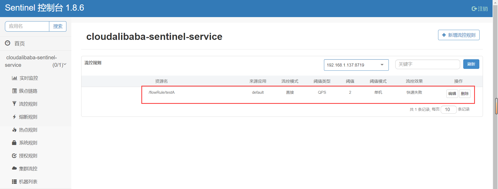

# Sentinel

> 基于[【官网】](https://sentinelguard.io/zh-cn/)、[sentinel （史上最全+入门教程）](https://www.cnblogs.com/crazymakercircle/p/14285001.html)
>
> Sentinel Dashboard 控制台版本：1.8.6
>
> Sentinel Core 依赖版本：1.8.6（sentinel-core 1.8.1 版本修改了部分包名，如果出现兼容问题，需要自己引入相关版本的依赖）
>
> ```xml
> <dependecies>
>     <!--SpringCloud ailibaba sentinel -->
>     <dependency>
>         <groupId>com.alibaba.cloud</groupId>
>         <artifactId>spring-cloud-starter-alibaba-sentinel</artifactId>
>         <version>2021.1</version>
>         <exclusions>
>             <exclusion>
>             <groupId>com.alibaba.csp</groupId>
>             <artifactId>sentinel-core</artifactId>
>             </exclusion>
>         </exclusions>
>     </dependency>
>
>     <!-- Sentinel core -->
>     <dependency>
>         <groupId>com.alibaba.csp</groupId>
>         <artifactId>sentinel-core</artifactId>
>         <version>${sentinel.version}</version>
>     </dependency>
>
>     <!-- Sentinel 项目和 Console 控制台通信依赖-->
>     <dependency>
>         <groupId>com.alibaba.csp</groupId>
>         <artifactId>sentinel-transport-simple-http</artifactId>
>         <version>${sentinel.version}</version>
>     </dependency>
> </dependecies>
> ```

## 一、基本概念

Sentinel 是面向分布式、多语言异构化服务架构的**流量治理组件**，主要以流量为切入点，从流量路由、流量控制、流量整形、熔断降级、系统自适应过载保护、热点流量防护等多个维度来帮助开发者保障微服务的稳定性。

Sentinel 具有以下特征:

- **丰富的应用场景**：Sentinel 承接了阿里巴巴近 10 年的双十一大促流量的核心场景，例如秒杀（即突发流量控制在系统容量可以承受的范围）、消息削峰填谷、集群流量控制、实时熔断下游不可用应用等。
- **完备的实时监控**：Sentinel 同时提供实时的监控功能。您可以在控制台中看到接入应用的单台机器秒级数据，甚至 500 台以下规模的集群的汇总运行情况。
- **广泛的开源生态**：Sentinel 提供开箱即用的与其它开源框架/库的整合模块，例如与 Spring Cloud、Apache Dubbo、gRPC、Quarkus 的整合。您只需要引入相应的依赖并进行简单的配置即可快速地接入 Sentinel。同时 Sentinel 提供 Java/Go/C++ 等多语言的原生实现。
- **完善的 SPI 扩展机制**：Sentinel 提供简单易用、完善的 SPI 扩展接口。您可以通过实现扩展接口来快速地定制逻辑。例如定制规则管理、适配动态数据源等。

Sentinel 的主要特性：


**和 Hystrix 区别如下**：

|                | Sentinel                                                   | Hystrix                 |
| -------------- | ---------------------------------------------------------- | ----------------------- |
| 隔离策略       | 信号量隔离（并发线程数限流）                               | 线程池隔离/信号量隔离   |
| 熔断降级策略   | 基于响应时间、异常比率、异常数                             | 基于异常比率            |
| 实时统计实现   | 滑动窗口（LeapArray）                                      | 滑动窗口（基于 RxJava） |
| 动态规则配置   | 支持多种数据源                                             | 支持多种数据源          |
| 扩展性         | 多个扩展点                                                 | 插件的形式              |
| 基于注解的支持 | 支持                                                       | 支持                    |
| 限流           | 基于 QPS，支持基于调用关系的限流                           | 有限的支持              |
| 流量整形       | 支持预热模式、匀速器模式、预热排队模式                     | 不支持                  |
| 系统自适应保护 | 支持（根据系统硬件自动进行服务降级）                       | 不支持                  |
| 控制台         | 提供开箱即用的控制台，可配置规则、查看秒级监控、机器发现等 | 简单的监控查看          |

> Sentinel 提供详细的[从 Hystrix 迁移到 Sentinel](https://sentinelguard.io/zh-cn/blog/guideline-migrate-from-hystrix-to-sentinel.html)方案。

## 二、[资源与规则](https://sentinelguard.io/zh-cn/docs/basic-api-resource-rule.html)

资源是 Sentinel 的关键概念，它可以是 Java 应用程序中的任何内容，例如，由应用程序提供的服务、由应用程序调用的其它应用提供的服务、RPC 接口方法，甚至可以是一段代码。围绕资源的实时状态设定的规则，可以包括流量控制规则、熔断降级规则以及系统保护规则（所有规则可以动态实时调整）。

使用 Sentinel 来进行资源保护，主要分为几个步骤：

1. 定义资源
2. 定义规则
3. 检验规则是否生效

### （一）定义资源

Sentinel 提供很多种定义资源的方式，介绍主要几种：

#### 1、SphU.entry()

通过 SphU.entry() 抛出异常的方式定义资源，并且在 try-with-resources 语句中保护资源：

> 可以对不同的代码块设置同一个资源名。

```java
public String defineResource() {
    for(int i = 0; i < 10; i++) {
        // 1、设置资源名
        try (Entry entry = SphU.entry("defineResource")) {
            // 2、被保护的业务逻辑
            return "defineResource" + i;
        } catch (BlockException e) {
            // 3、如果被保护的资源被限流了，就会抛出 BlockException
            e.printStackTrace();
            return "defineResource BlockException";
        }
    }
}
```

#### 2、[@SentinelResource](https://blog.csdn.net/apple_52109766/article/details/126695131)

通过 @SentinelResource 注解方式定义资源：

```java
@SentinelResource(value = "defineResourceByAnnotation", blockHandler = "myBlockHandler", fallback = "myFallback")
public String defineResourceByAnnotation() {
    // 被保护的业务逻辑
    int i = 1 / 0;
    return "defineResourceByAnnotation";
}

public String myBlockHandler(BlockException e) {
    e.printStackTrace();
    return "defineResourceByAnnotation BlockException";
}

public String myFallback() {
    return "defineResourceByAnnotation Fallback";
}
```

@SentinelResource 是 Sentinel 提供的注解，用于定义资源，并提供多种属性：

- value：用于设置资源的名称，**必填**。
- entryType：资源的调用方向，EntryType 类型，默认值为 EntryType.OUT。
- blockHandler：blockHandler 用于处理服务限流后抛出的 BlockException 异常，**相当于服务限流后的后续处理逻辑**。有以下几个注意点：
  - 必须是 public 修饰符。
  - 必须和原方法在同一个类中。
  - 返回值类型、参数类型必须与原方法一致，并且参数最后加一个额外的、BlockException 类型的参数。
- blockHandlerClass：若 blockHandler 和原方法不在同一个类，则需要使用 blockHandlerClass 指定 blockHandler 所在类。有以下几个注意点：
  - 必须和 blockHandler 搭配使用。
  - 该类中的 blockHandler 方法必须是 public static 修饰符。
- fallback：fallback 用于处理服务抛出的异常（包括 BlockException），有以下注意点：
  - 必须是 public 修饰符。
  - 必须和原方法在同一个类中。
  - 返回值类型、参数类型必须与原方法一致，或者参数最后加一个额外的、Throwable 类型的参数用于接收对应的异常。
- fallbackClass：若 fallback 和原方法不在同一个类，则需要使用 fallbackClass 指定 fallback 所在类。有以下几个注意点：
  - 必须与 fallback 或 defaultFallback 属性配合使用。
  - 该类中的 fallback 方法必须是 public static 修饰符。
- defaultFallback：默认的 fallback 方法名称。
- exceptionsToIgnore：用于指定哪些异常被排除掉，不会计入异常统计中，也不会进入 fallback 逻辑中，而是会原样抛出。

> 注意：
>
> - 注解不支持 private 方法。
> - fallback **只会处理业务本身抛出的异常**，例如 NPE 等异常；blockHandler 只会处理 BlockException 相关异常。有规则情况下，没有配置 blockHandler，则会调用 BlockRequestHandler（默认为 DefaultBlockRequestHandler）处理 BlockException，因此 fallback 不会去处理 BlockException，而 blockHandler 只会处理 BlockException。

### （二）定义规则

sentinel-core 提供 `com.alibaba.csp.sentinel.slots.block.Rule` 接口，用于定义规则，规则作用于资源上就可以实现熔断限流的逻辑。Rule 提供以下几种实现类用于实现不同规则：FlowRule（流量控制规则）、DegradeRule（熔断降级规则）、AuthorityRule（授权规则）、SystemRule（系统规则）

> Sentinel 的原则非常简单：根据对应资源配置的规则来为资源执行相应的限流/降级/负载保护策略。

#### 1、[流量控制规则（FlowRule）](https://sentinelguard.io/zh-cn/docs/flow-control.html)

流量控制原理是监控应用流量的 QPS 或并发线程数等指标，当达到指定阈值时对流量进行控制，避免系统被瞬时的流量高峰冲垮，保障应用高可用性。

> `FlowSlot` 会根据预设的规则，结合 `NodeSelectorSlot`、`ClusterNodeBuilderSlot`、`StatistcSlot` 统计出来的实时信息进行流量控制。

FlowRule 中有以下几个主要属性：

##### （1）基本属性

- resource：资源名，即规则作用的资源。
- count：限流阈值。
- grade：限流阈值类型，有两种：
  - FLOW_GRADE_QPS：当调用该 API 的 QPS（每秒请求数）到达阈值时，进行限流。
  - FLOW_GRADE_THREAD：当调用该 API 的线程数到达阈值时，进行限流。
- limitApp：针对资源的请求来源（origin）进行限流，默认为 default（不区分调用来源）。
  - 调用方信息通过 `ContextUtil.enter(resourceName, origin)` 方法中的 `origin` 参数传入。

##### （2）**controlBehavior**（流控效果）

发生流量控制后的效果，有以下三种：

① CONTROL_BEHAVIOR_DEFAULT：快速失败，也就是直接失败，抛 FlowException（BlockException 实现类）异常。

② CONTROL_BEHAVIOR_WARM_UP：预热，根据 codeFactor（冷加载因子，默认值是 3，也可以通过 `spring.cloud.sentinel.flow.cold-factor` 修改）的值，从 `count \ codeFactor` 开始，经过预热时长（warmUpPeriodSec），才到达设置的 QPS 阈值。

通过**冷启动**，让通过的流量缓慢增加，在一定时间内逐渐增加到阈值上限，给冷系统一个预热的时间，避免冷系统被突如其来的流量压垮。

> 注意：超出的流量仍然会抛出 BlockException 异常。


③ CONTROL_BEHAVIOR_RATE_LIMITER：匀速排队，即匀速通过，对应的是漏桶算法。当请求大于阈值后，请求会被排队，按照匀速通过的速率（1000 / count 毫秒间隔，例如：这里 count 是 2，则每 500ms 通过一个请求）通过，而不是直接拒绝。当排队时间大于 maxQueueingTimeMs 后，请求会被拒绝，抛出 BlockException 异常。


> 注意：grade 必须设置为 FLOW_GRADE_QPS，否则无效。

这种方式主要用于处理**脉冲式**的流量，想象一下这样的场景，在某一秒有大量的请求到来，而接下来的几秒则处于空闲状态，我们希望系统能够在接下来的空闲期间逐渐处理这些请求，而不是在第一秒直接拒绝多余的请求。


##### （3）**strategy**（流控模式）

流量控制模式，有三种：

① STRATEGY_DIRECT：直接策略，当 API 达到限流条件时，直接限流。

② STRATEGY_RELATE：关联策略，当 refResource 关联资源达到阈值，就限流自己。

当两个资源之间具有资源争抢或者依赖关系的时候，这两个资源便具有了关联。

比如对数据库同一个字段的读操作和写操作存在争抢，读的速度过高会影响写得速度，写的速度过高会影响读的速度。如果放任读写操作争抢资源，则争抢本身带来的开销会降低整体的吞吐量，可使用关联限流来避免具有关联关系的资源之间过度的争抢。

③ STRATEGY_CHAIN：只记录指定链路上的流量（指定资源从**入口资源**进来的流量，如果达到阈值，就进行限流），API 级别的针对来源。

> 注意：**入口资源指的是 API 接口，Sentinel 将 API 接口看作为资源**，因此入口资源值就是 API 接口的地址，例如：`/resource/entrance1`。

`NodeSelectorSlot` 记录了资源之间的调用链路，这些资源通过调用关系，相互之间构成一棵调用树。这棵树的根节点是一个名字为 `machine-root` 的虚拟节点，调用链的入口都是这个虚节点的子节点。

```text
                  machine-root
                    /       \
                   /         \
             Entrance1     Entrance2
                 /             \
                /               \
       DefaultNode(nodeA)   DefaultNode(nodeA)
```

上图中来自入口 `Entrance1` 和 `Entrance2` 的请求都调用到了资源 `NodeA`，Sentinel 允许只根据某个入口的统计信息对资源限流。比如我们可以设置 `FlowRule.strategy` 为 `RuleConstant.CHAIN`，同时设置 `FlowRule.ref_identity` 为 `Entrance1` 来表示只有从入口 `Entrance1` 的调用才会记录到 `NodeA` 的限流统计当中，而对来自 `Entrance2` 的调用漠不关心。


#### 2、熔断降级规则（DegradeRule）

熔断降级会在调用链路中某个资源出现不稳定状态时（例如：调用超时或异常比例升高），对这个资源的调用进行限制，让请求快速失败，避免影响到其它的资源而导致级联错误。

> 注意：Sentinel 1.8.0 之后对熔断降级规则做了较大的改动，并添加了 Half-Open（半开）的状态：1.8.0 之前是**窗口期过后关闭断路器**；1.8.0 之后有 Half-Open 状态，若接下来的一个请求响应时间小于设置的慢调用 RT 则结束熔断（关闭断路器），若大于设置的慢调用 RT 则会再次被熔断。

##### （1）基本属性

- resource：资源名，即规则作用的资源。
- statIntervalMs：统计时长，即统计异常资源的单位区间，默认为 1000ms。
- minRequestAmount：熔断触发的最小请求数，**触发熔断的必要条件之一**，默认值为 5。
- timeWindow：时间窗口，也就是经过 timeWindow 后断路器变为 Half-Open 状态，单位为 s。

##### （2）grade（熔断策略）

① SLOW_REQUEST_RATIO：慢调用比例

设置一个请求的最大响应时间 RT（Response Timeout，对应 DegradeRule 的 count 属性），**响应时间超出 RT 的请求称为慢调用**。当单位统计时长（statIntervalMs）内请求数大于设置的最小请求数（minRequestAmount），且慢调用比例大于阈值（slowRatioThreshold），**熔断器开启**，在接下来的时间窗口（timeWindow）内，对这个资源的调用都会自动地熔断，抛出 DegradeException（BlockException 实现类）异常。

经过 timeWindow 时间后，熔断器进入 Half-Open 状态，若接下来的一个请求响应时间小于 RT，则关闭熔断器；否则再次熔断。

> 注意：Sentinel 默认统计的 RT 上限是 4900 ms，超出此阈值的都会算作 4900 ms，若需要变更此上限可以通过启动配置项 `-Dcsp.sentinel.statistic.max.rt=xxx` 来配置。

② ERROR_RATIO：异常比例

当单位统计时长（statIntervalMs）内请求数大于设置的最小请求数（minRequestAmount），且异常比例大于阈值（count，取值为 `[0.0, 1.0]`），熔断器开启。之后熔断器步骤和上面一致，不再赘述。

③ ERROR_COUNT：异常数。

当单位统计时长（statIntervalMs）内请求数大于设置的最小请求数（minRequestAmount），且异常数大于阈值（count），熔断器开启。之后熔断器步骤和上面一致，不再赘述。

##### （3）熔断器事件监听器

Sentinel 支持注册自定义的事件监听器监听熔断器状态变换事件：

```java
EventObserverRegistry.getInstance().addStateChangeObserver("logging",
    (prevState, newState, rule, snapshotValue) -> {
        if (newState == State.OPEN) {
            // 变换至 OPEN state 时会携带触发时的值
            System.err.println(String.format("%s -> OPEN at %d, snapshotValue=%.2f", prevState.name(),
                TimeUtil.currentTimeMillis(), snapshotValue));
        } else {
            System.err.println(String.format("%s -> %s at %d", prevState.name(), newState.name(),
                TimeUtil.currentTimeMillis()));
        }
    });
```

#### 3、授权规则（黑白名单 AuthorityRule）

授权规则也称黑白名单规则，黑白名单根据资源的请求来源（origin）限制资源是否通过，若配置白名单则只有请求来源位于白名单内时才可通过；若配置黑名单则请求来源位于黑名单时不通过，其余的请求通过。

> 注意：调用方信息通过 `ContextUtil.enter(resourceName, origin)` 方法中的 `origin` 参数传入，若资源中没有设置来源名，则 AuthorityRule 不生效。

##### （1）基本属性

- resource：资源名，即规则作用的资源。
- limitApp：对应的黑名单/白名单，不同 origin 用 `,` 分隔，如 `appA,appB`。
- strategy：限制模式
  - AUTHORITY_WHITE：白名单模式，默认值。
  - AUTHORITY_BLACK：黑名单模式。

#### 4、系统规则（SystemRule）

**背景 1**：

系统保护的目的：

- 保证系统不被拖垮。
- 在系统稳定的前提下，保持系统的吞吐量。

长期以来，系统保护的思路是根据硬指标，即系统的负载（load1）来做系统过载保护。当系统负载高于某个阈值，就禁止或者减少流量的进入；当 load 开始好转，则恢复流量的进入。这个思路给我们带来了不可避免的两个问题：

- 延迟性：如果根据 load 的情况来调节流量的通过率，那么就始终有延迟性。也就意味着通过率的任何调整，都会过一段时间才能看到效果。当前通过率是使 load 恶化的一个动作，那么也至少要过 1 秒之后才能观测到，然后再次进行调整；反之同理。
- 恢复慢：由于下游应用不可靠，导致 RT 很高，从而 load 到了一个很高的点。过了一段时间之后下游应用恢复了，应用 RT 也相应减少。这个时候，其实应该大幅度增大流量的通过率；但是由于这个时候 load 仍然很高，通过率的恢复仍然不高。

从上面的问题可以看出，是由于流量导致 load 变动，然而我们总是通过监控 load 来调整流量，由于统计具有滞后性，这就导致：

```text
流量进来 -> load 升高达到阈值 -> 降低或禁止流量 -> load 降低，吞吐量降低 -> 升高流量 -> load 升高达到阈值 -> 降低或禁止流量 ....
```

这样做的结果是无论我们怎么调参数，调比例，都是按照果来调节因，都无法取得良好的效果。

Sentinel 在系统自适应保护的做法是：用 load1 判断是否开启流量控制，而具体的流量通过率由处理请求的能力，即 RT 以及当前系统正在处理的请求速率决定。

---

系统规则是应用整体维度的，而不是资源维度的，并且**仅对入口流量生效**。

> 入口流量指的是进入应用的流量（`EntryType.IN`），比如 Web 服务或 Dubbo 服务端接收的请求，都属于入口流量。

系统规则支持以下的阈值类型（多选且同时生效）：

- Load（仅对 Linux/Unix-like 机器生效）：当系统 load1 超过阈值，且系统当前的并发线程数超过系统容量时才会触发系统保护。系统容量由系统的 `maxQps * minRt` 计算得出。设定参考值一般是 `CPU cores * 2.5`。
- CPU usage（1.5.0+ 版本）：当系统 CPU 使用率超过阈值即触发系统保护（取值范围 0.0-1.0）。
- RT：当单台机器上**所有入口流量的平均 RT 达到阈值**即触发系统保护，单位是毫秒。
- 线程数：当单台机器上所有入口流量的并发线程数达到阈值即触发系统保护。
- 入口 QPS：当单台机器上所有入口流量的 QPS 达到阈值即触发系统保护。

#### 5、热点参数限流（ParamFlowRule）

热点即经常访问的数据。很多时候我们希望统计某个热点数据中访问频次最高的 Top K 数据，并对其访问进行限制。比如：

- 商品 ID 为参数，统计一段时间内最常购买的商品 ID 并进行限制。
- 用户 ID 为参数，针对一段时间内频繁访问的用户 ID 进行限制。

热点参数限流会统计传入参数中的热点参数，并根据配置的限流阈值与模式，对包含热点参数的资源调用进行限流。热点参数限流可以看做是一种特殊的流量控制，仅对包含热点参数的资源调用生效。

> Sentinel 利用 LRU 策略统计最近最常访问的热点参数，结合令牌桶算法来进行参数级别的流控。

SphU 类提供 entry()重载方法来传入参数，以便 Sentinel 进行统计：

```java
/**
 * @param name 资源名
 * @param type 流量类型（入站、出站、内部），在 SyetemRule 中有用
 * @param count 表示本资源占用的 Token 次数，即算作几次调用，例如：值为 1，表示此次调用统计为 1；值 为 2，表示此次调用统计为 2
 * @param args 需要被统计的参数
 */
entry(String name, EntryType type, int count, Object... args) throws BlockException;

/**
 * @param method 资源名将从传入的 Method 对象解析，格式为 `类名:方法签名`，如com.alibaba.csp.sentinel.demo.DemoService:foo(java.lang.String)。
 */
entry(Method method, EntryType type, int count, Object... args) throws BlockException;
```

##### （1）基本属性

- resource：资源名，即规则作用的资源。
- count：限流阈值。
  - 注意：限流阈值是指单个参数的阈值，例如：`entry("resource", EntryType.IN, 1, "hello")` 和 `entry("resource", EntryType.IN, 1, "world")` 虽然是同一个资源名，但是参数值不同，是分别进行统计互不影响的。
- burstCount：突发数量。当参数到达阈值后，为了应对突发的流量，可以使用 burstCount 属性。burstCount 使用的是令牌桶算法，当流量到达阈值后，允许突发流量获取到令牌，获取的令牌的请求可以继续执行。
  - 注意：令牌的数量就是 burstCount 值，不会自动补充，令牌消耗完后就没有了。
- grade：限流模式。
- durationInSec：统计窗口时间长度，也就是在这个时间窗口内，热点参数到达阈值就会被限流，默认值为 1s。
- controlBehavior：流控效果，支持快速失败和匀速排队模式。
- maxQueueingTimeMs：最大排队等待时长，仅在匀速排队模式生效。
- paramIdx：热点参数的索引，必填，对应 `SphU.entry(xxx, args)` 中的 arg 数组的索引位置，即对第几个参数进行限流。
- paramFlowItemList：参数例外项，可以针对指定的参数值单独设置限流阈值，不受前面 count 阈值的限制。**仅支持基本类型和字符串类型**。

## 三、控制台操作

Sentinel 除了提供 sentinel-core 核心库用硬编码的方式定义规则，也提供 Sentinel Dashboard **用可视化方式定义规则**（推荐 Dashboard）。

Sentinel Dashboard 基于 SpringBoot 开发，安装启动过程省略，[启动项配置](https://sentinelguard.io/zh-cn/docs/dashboard.html)参数在官方文档中有。

（1）这里我使用 SpringCloudAlibaba 应用，配置如下：

```yml
spring:
  application:
    name: cloudalibaba-sentinel-service
  cloud:
    sentinel:
      transport:
        dashboard: 192.168.190.134:8080 # 配置 Sentinel 控制台地址及端口号
        port: 8719 # Sentinel 控制台和客户端通信的端口号，不配置的话默认是 8719，如果被占用了会自动往上加 1 找一个未被占用的端口
        client-ip: 192.168.1.153 # 配置 Sentinel 客户端 IP（也就是本机 IP），不配置可能会识别成 Sentinel 控制台所在的 IP，导致错误
      web-context-unify: false # 开启 STRATEGY_CHAIN 链路流控模式，详见 issue #1213

management:
  endpoints:
    web:
      exposure:
        include: "*" # 暴露所有端点，否则 Sentinel 控制台无法监控到 /actuator/sentinel 端点
```

（2）启动项目，同时发送请求后，页面如下：

> 注意：只有第一次请求之后，才会在 Dashboard 控制台显示。


项目名称通过 yml 配置文件中 `spring.application.name` 指定，也可以过启动参数 `-Dproject.name=xxx` 指定。


资源之间的调用关系会构成一条链路，簇点链路中就记录着这条链路。sentinel_default_context 是 Sentinel 中默认 Context 的 name。Sentinel 会将每个 API 接口看成入口资源，资源名就是 API 接口名称，例如：`/flowRule/testA`。

> 这里出现两个 `/flowRule/testA` 是因为开启了 `web-context-unify` 配置，没有影响，可以看成同一个资源。


来源信息（origin）一般是在**入口处**传入的（如 HTTP 入口或 Dubbo 服务入口），因此在链路中间再通过 `ContextUtil.enter(xxx, origin)` 传入可能不会生效。这里**针对来源**指的是**调用接口的微服务名称**。


这里的热点规则中限流模式只支持 QPS 模式。

## 四、[工作原理](https://github.com/alibaba/Sentinel/wiki/Sentinel-%E6%A0%B8%E5%BF%83%E7%B1%BB%E8%A7%A3%E6%9E%90)


从上面官方给的图中，可以看到几个关键的东西：

### （一）Context

Context 代表调用链路上下文，贯穿一次调用链路中的所有 Entry，主要用于存储 name（Context 的 name，默认值为 sentinel_default_context）、origin（资源的调用来源），Sentinel 会根据 Context 生成对应的 Node，统计阶段根据这些 Node 记录不同维度的信息。

### （二）Entry

每一次资源调用都会创建一个 Entry。Entry 包含了资源名、curNode（当前统计节点）、originNode（来源统计节点）等信息。

> 注意：当前 Entry 会接到传入 Context 的调用链路上（`setUpEntryFor`），资源调用结束时需要 `entry.exit()`，exit 操作会过一遍 slot chain exit，恢复调用栈，exit context 然后清空 entry 中的 context 防止重复调用。

### （三）[Slot](https://github.com/alibaba/Sentinel/wiki/Sentinel%E5%B7%A5%E4%BD%9C%E4%B8%BB%E6%B5%81%E7%A8%8B)

从上图看出，有很多以 Slot 结尾的类组成一条链路，外部请求（例如 `Entry entry = SphU.entry(KEY)`）会依次经过每个 Slot 后再执行具体业务。它们实现 ProcessorSlot 接口，其中提供了两个抽象方法 entry() 和 exit()：entry()方法表示请求进入的方法；exit()方法表示响应退出的方法。

有以下具体 Slot 实现类：

- NodeSelectorSlot：负责收集资源的路径，并将这些资源的调用路径以树状结构存储，用于根据调用路径来限流降级（例如 FlotRule 的 strategy 值为 STRATEGY_CHAIN，从指定链路上限流）。
- ClusterBuilderSlot：用于初始化 resoure、origin 对应的 ClusterNode，用于接下来的 StatisticSlot 中进行统计操作。
- LogSlot：负责处理 BlockException 异常，将异常信息输出到 `sentinel-block.log`。
- StatisticSlot：用于统计不同维度（resource 资源、system 系统、cluster 集群、origin 来源）的 thread count、QPS、RT 等信息。
- AuthoritySlot：根据 AuthorityRule 来做黑白名单控制。
- SystemSlot：根据 SystemRule 控制总的入口流量。
- FlowSlot：根据 FlowFule 进行流量控制。
- DegradeSlot：根据 DegradeRule 做熔断降级。

Sentinel 使用**责任链模式**将不同的 Slot 按照顺序串联在一起，从而将不同的功能（限流、降级、系统保护）组合在一起，同时通过 SPI 技术实现 Slot 的可配置化，在 sentinel-core 的 `/META-INF/services/com.alibaba.csp.sentinel.slotchain.ProcessorSlot` 中查看。因此在本地项目中也可以通过 SPI 将自定义的 Slot 加入到 Slot 责任链中，具体查看[示例](https://github.com/alibaba/Sentinel/blob/master/sentinel-demo/sentinel-demo-slot-spi/src/main/java/com/alibaba/csp/sentinel/demo/slot/DemoSlot.java)。

### （四）Node


Sentinel 提供 Node 节点用于记录 QPS、RT 等信息，其下实现类有：

1、[StatisticNode](https://blog.51cto.com/morris131/6453063)：统计节点，实现统计 QPS、RT 等信息功能，内部使用滑动窗口实现。

2、DefaultNode：链路节点，用于统计调用链路上某个资源的数据，维持树状结构，根据 Resource name 生成。

重新来分析上面的原理图，DefaultNode 组成的树状结构就如下图：


3、EntranceNode：入口节点，继承 DefaultNode。根据 Context name 生成的 EntryNode，Root 节点是 Sentinel 自动生成的。

4、ClusterNode：簇点，用于区分每个资源全局的数据（不区分调用链路）：resource 资源在所有链路中的统计信息；origin 来源在所有链路的统计信息。

上图中官方给的图例不典型，以下图为例：


名称为 DefaultNode2 的资源在 EntranceNodeOne 和 EntranceNodeTwo 两条链路中，它对应的 ClusterNode 就记录两条链路累加的统计信息。

## 五、应用

### （一）Ribbon

Sentinel 可以与 Ribbon 搭配，当 Ribbon 请求超时后，Sentinel 通过 fallback 实现服务降级。此外，Sentinel 也可以通过配置规则，再设置 blockHandler 属性，实现服务限流的业务逻辑。

```java
@GetMapping("/consumer/fallback/{id}")
@SentinelResource(value = "fallback", fallback = "handleFallback", blockHandler = "handleBlockHandler")
public CommonResult<Payment> fallback(@PathVariable Long id) {
    return handleRequest(id);
}

public CommonResult<Payment> handleFallback(@PathVariable Long id, Throwable e) {
    Payment payment = new Payment(id, null);
    return new CommonResult<>(444, "兜底异常 handleFallback, exception 内容:  " + e.getMessage(), payment);
}

public CommonResult<Payment> handleBlockHandler(@PathVariable Long id, Throwable e) {
    Payment payment = new Payment(id, null);
    return new CommonResult<>(445, "兜底异常 handleBlockHandler, exception 内容:  " + e.getMessage(), payment);
}
```

```yml
ribbon:
  http:
    client:
      enabled: true # 开启 Ribbon 超时重试机制
  ReadTimeout: 6000
  ConectTimeout: 6000
```

### （二）Feign

在 Feign 篇章中，Feign 引入 Hystrix 依赖，搭配 Hystrix 实现服务降级：

```yml
feign:
  circuitbreaker:
    enabled: true
# 注意：开启 Feign 服务降级， ↑ 新版用这种方式开启。↓ 旧版用这个
#  hystrix:
#    enabled: true
```

Feign 也可以搭配 Sentinel 实现服务降级：

```yml
# 激活 Sentinel 对 Feign 的支持
feign:
  sentinel:
    enabled: true
```

```java
@FeignClient(value = "nacos-payment-provider", fallback = PaymentFallbackService.class)
public interface PaymentService {

    @GetMapping(value = "/paymentSQL/{id}")
    CommonResult<Payment> paymentSQL(@PathVariable("id") Long id);
}
```

> 注意：fallback 只能处理业务本身的异常，实现服务降级功能，对于 BlockException 异常，fallback 不会处理哦。

### （三）[Nacos](https://github.com/alibaba/Sentinel/wiki/%E5%8A%A8%E6%80%81%E8%A7%84%E5%88%99%E6%89%A9%E5%B1%95)

我们通过 Sentinel 的 Dashboard 控制台添加规则时，这些规则是存储在内存中的，每次服务重启都需要重新配置。

于是 Sentinel 提出了动态规则扩展的概念，即规则存储在文件、数据库或者配置中心当中。Sentinel 提供的 ReadableDataSource 接口给予我们对接任意配置源的能力，相比直接通过 API 修改规则，实现 ReadableDataSource 接口是更加可靠的做法。ReadableDataSource 接口常见的实现方式有：

- **AutoRefreshDataSource（拉模式）**：客户端主动向某个规则管理中心定期轮询拉取规则，然后注册到规则管理器中（例如 FlowRuleManager）。这样做的方式是简单，缺点是无法及时获取变更。Sentinel 已支持的数据源扩展：Consul、Eureka。
- **AbstractDataSource（推模式）**：客户端通过注册监听器的方式时刻监听变化，规则中心统一推送，然后将规则注册到规则管理器中。这种方式有更好的实时性和一致性保证。Sentinel 已支持的数据源扩展：Zookeeper、Redis、Nacos、Apollo、etcd。

以 Nacos 为例，引入 Nacos 数据源依赖即可使用动态规则扩展：

```xml
<!-- Nacos 动态规则扩展数据源依赖 -->
<dependency>
    <groupId>com.alibaba.csp</groupId>
    <artifactId>sentinel-datasource-nacos</artifactId>
</dependency>
```

修改 yml 配置文件，格式如下：

```yml
spring:
  application:
    name: cloudalibaba-sentinel-service
  cloud:
    sentinel:
      datasource:
        myFlowRule1: # 自定义数据源名称，任意
          nacos:
            server-addr: 192.168.190.134:8848 # Nacos Server 地址，多个可以用逗号隔开
            namespace: myCustomNamespaceID # 命名空间 namespace ID，读取此 namespace 下的配置
            group-id: CUSTOM_GROUP # 组名
            data-id: ${spring.application.name}-flow-rules # 指定配置文件名
            data-type: json # 指定配置文件类型
            rule-type: flow # 指定规则类型，在 com.alibaba.cloud.sentinel.datasource.RuleType 中查看支持的类型
            # username: xxxxxx # Nacos 账号
            # password: xxxxxx # Nacos 密码
```

在 Nacos 中添加配置，以 FlowRule 的配置为例：

```json
// namespace：myCustomNamespaceID
// group-id：CUSTOM_GROUP
// data-id：cloudalibaba-sentinel-service-flow-rules
// 配置格式：json
[
  {
    "resource": "/flowRule/testA",
    "limitApp": "default",
    "grade": 1,
    "count": 2,
    "strategy": 0,
    "controlBehavior": 0,
    "clusterMode": false
  }
]
```

重启服务后，就可以在 Sentinel 控制台中看到我们在 Nacos 配置的规则：



### （四）[Gateway](https://github.com/alibaba/Sentinel/wiki/%E7%BD%91%E5%85%B3%E9%99%90%E6%B5%81)

在 Gateway 篇章中，我们用 Hystrix 实现服务降级功能，用基于 Redis 的令牌桶算法实现服务限流功能。

从 1.6.0 版本开始，Sentinel 提供了 Spring Cloud Gateway 的适配模块：

> 官方给出了两种 Gateyway 搭配方式：
>
> 第一种是只引入下面的依赖，然后需要自己进行一系列的配置：
>
> ```xml
> <dependencies>
>  <dependency>
>         <groupId>org.springframework.cloud</groupId>
>         <artifactId>spring-cloud-starter-gateway</artifactId>
>     </dependency>
>
>     <dependency>
>         <groupId>com.alibaba.csp</groupId>
>         <artifactId>sentinel-spring-cloud-gateway-adapter</artifactId>
>     </dependency>
> </dependencies>
> ```
>
> 第二种使用 Spring Cloud Alibaba Sentinel，就无需自己做一系列配置，下面讲的是第二种方式。

```xml
<dependencies>
    <!--gateway-->
    <dependency>
        <groupId>org.springframework.cloud</groupId>
        <artifactId>spring-cloud-starter-gateway</artifactId>
    </dependency>

    <!-- 引入sentinel进行服务降级熔断 -->
    <dependency>
        <groupId>com.alibaba.cloud</groupId>
        <artifactId>spring-cloud-starter-alibaba-sentinel</artifactId>
    </dependency>

    <!-- gateway网关整合sentinel进行限流降级 -->
    <dependency>
        <groupId>com.alibaba.cloud</groupId>
        <artifactId>spring-cloud-alibaba-sentinel-gateway</artifactId>
    </dependency>
</dependencies>
```

```yml
spring:
  application:
    name: cloud-gateway
  cloud:
    sentinel:
      filter:
        enabled: false # false 表示不开启 URL 粒度的限流功能
      transport:
        dashboard: 192.168.190.134:8080 # 配置 Sentinel 控制台地址及端口号
        port: 8719 # Sentinel 控制台和客户端通信的端口号，不配置的话默认是 8719，如果被占用了会自动往上加 1 找一个未被占用的端口
        client-ip: 192.168.1.137 # 配置 Sentinel 客户端 IP（也就是本机 IP），不配置可能会识别成 Sentinel 控制台所在的 IP，导致错误
    gateway:
      routes:
        - id: payment_routh
          uri: lb://CLOUD-PAYMENT-SERVICE # lb://服务注册中心的微服务名称，这种方式开启负载均衡
          predicates:
            - Path=/payment/**
            - Query=timeout,true
```

> 注意：
>
> - Sentinel 网关流控默认的粒度是 route 维度以及自定义 API 分组维度，默认**不支持 URL 粒度**。若通过 Spring Cloud Alibaba 接入，请将 `spring.cloud.sentinel.filter.enabled` 配置项置为 false（若在网关流控控制台上看到了 URL 资源，就是此配置项没有置为 false）。
>
>   
>
> - 若使用 Spring Cloud Alibaba Sentinel 数据源模块，需要注意网关流控规则数据源类型是 `gw-flow`，若将网关流控规则数据源指定为 flow 则不生效。

#### 1、规则

Sentinel 1.6.0 引入了 Sentinel API Gateway Adapter Common 模块，此模块中包含**网关限流的规则**和**自定义 API 的实体和管理逻辑**。

##### （1）网关限流规则（GatewayFlowRule）

网关限流规则，可以针对不同 route 或自定义的 API 分组进行限流。

**基本属性**：

- resource：资源名，即规则作用的资源。可以是网关中的 route id 或者用户自定义的 API 分组名称。
- resourceMode：规则作用的类型，也就是上面 resource 指的是 route id 还是用户自定义的 API 分组名称。
  - RESOURCE_MODE_ROUTE_ID：route，默认值。
  - RESOURCE_MODE_CUSTOM_API_NAME：用户自定义的 API 分组名称。
- count：限流阈值。
- intervalSec：统计窗口时间长度，也就是在这个时间窗口内，请求到达阈值就会被限流，默认值为 1s。
- controlBehavior：流控效果，目前支持两种：
  - CONTROL_BEHAVIOR_DEFAULT：快速失败。
  - CONTROL_BEHAVIOR_RATE_LIMITER：匀速排队。
- burst：突发数量，CONTROL_BEHAVIOR_DEFAULT 流控效果生效。
- maxQueueingTimeoutMs：匀速排队模式下的最长排队时间，CONTROL_BEHAVIOR_RATE_LIMITER 流控效果生效。
- paramItem：参数限流配置。若不提供，则代表不针对参数进行限流，该网关规则将会被转换成普通 FlowRule 流控规则；否则会转换成 ParamFlowRule 热点规则。其中的字段：
  - parseStrategy：统计哪个参数作为限流的依据，目前 1.6.3 版本已支持五种（这些常量都在 SentinelGatewayConstants 中）：
    - PARAM_PARSE_STRATEGY_CLIENT_IP：来源 IP。
    - PARAM_PARSE_STRATEGY_HOST：Host。
    - PARAM_PARSE_STRATEGY_HEADER：Header 中的属性。
    - PARAM_PARSE_STRATEGY_URL_PARAM：URL 参数。
    - PARAM_PARSE_STRATEGY_COOKIE：Cookie 中的属性。
  - fieldName：当 parseStrategy 类型为 Header、URL 参数、Cookie 时，需要指定具体的属性名称。
  - pattern：参数匹配值，只有匹配该模式的请求属性值会纳入统计和流控；若为空则统计该请求属性的所有值。（1.6.2 版本开始支持）
  - matchStrategy：对于上面的 pattern 参数匹配值，以哪种策略进行匹配。（1.6.2 版本开始支持）
    - PARAM_MATCH_STRATEGY_EXACT：精确匹配。
    - PARAM_MATCH_STRATEGY_CONTAINS：子串匹配。
    - PARAM_MATCH_STRATEGY_REGEX：正则匹配。

我们可以通过硬编码的方式创建 GatewayFlowRule 规则，再通过 GatewayRuleManager 手动载入；也可以通过 Sentinel Dashboard 控制台设置；现在又有动态规则扩展数据源（例如 Nacos）的方式。

##### （2）API 分组（ApiDefinition）

API 分组可以将对匹配到的请求进行划分，并将上面的设置的网关限流规则（resourceMode 为 API 分组类型），统一作用到 API 分组的请求中。

```java
@PostConstruct
private void initCustomizedApis() {
    Set<ApiDefinition> definitions = new HashSet<>();
    ApiDefinition api1 = new ApiDefinition("some_customized_api")
        .setPredicateItems(new HashSet<ApiPredicateItem>() {{
            add(new ApiPathPredicateItem().setPattern("/product/foo/**")
                .setMatchStrategy(SentinelGatewayConstants.URL_MATCH_STRATEGY_PREFIX));
        }});
    definitions.add(api1);
    GatewayApiDefinitionManager.loadApiDefinitions(definitions);
}
```

```yml
spring:
  cloud:
    gateway:
      enabled: true
      routes:
        - id: product_route
          uri: lb://product
          predicates:
            - Path=/product/**
```

当访问网关的 URL 为 `http://localhost:8090/product/foo/22` 的时候，对应的统计会加到 product_route 和 some_customized_api 这两个资源上面。

#### 2、[重要类](https://blog.csdn.net/C18298182575/article/details/102580788)

sentinel-gateway 依赖包中提供许多类，我们可以直接使用，也可以自定义覆盖。

##### （1）[SentinelGatewayFilter](https://cloud.tencent.com/developer/article/1460985)

SentinelGatewayFilter 实现 GatewayFilter、GlobalFilter 过滤器接口，它可以将 Route 封装为资源，Sentinel 就可以对这些资源进行监控和控制，实现限流、熔断等功能。

##### （2）SentinelGatewayBlockExceptionHandler

SentinelGatewayBlockExceptionHandler 实现 WebExceptionHandler 接口，是服务限流、降级时的 BlockException 的异常处理类。我们也可以自定义 WebExceptionHandler 接口实现类并作为 Bean 注入 Spring 容器，实现自己的异常处理逻辑。

##### （3）BlockRequestHandler

在 SentinelGatewayBlockExceptionHandler 中，会调用 BlockRequestHandler 接口实现类，BlockRequestHandler 接口用于处理异常响应信息，Sentinel 默认提供 DefaultBlockRequestHandler 实现类，也就是我们在响应中看到的 `Blocked by Sentinel: xxxxxx` 信息。

如果只是单纯地想设置自己的响应信息，我们也可以自定义 BlockRequestHandler 接口实现类：

```java
public class OpenBlockRequestHandler implements BlockRequestHandler {

    @Override
    public Mono<ServerResponse> handleRequest(ServerWebExchange exchange, Throwable ex) {
        // JSON result by default.
        return ServerResponse.status(HttpStatus.OK)
                .contentType(MediaType.APPLICATION_JSON)
                .body(fromObject(buildErrorResult(ex)));
    }

    private CommonResult<String> buildErrorResult(Throwable ex) {
        return new CommonResult<>(444, "OpenBlockRequestHandler：请求过于频繁，请稍后重试", null);
    }
}
```

```java
/**
 * Description: Description: 自定义异常响应类，代替默认的 DefaultBlockRequestHandler
 */
@PostConstruct
public void doInit() {
    GatewayCallbackManager.setBlockHandler(new OpenBlockRequestHandler());
}
```


不过 Sentinel 除了实现 BlockRequestHandler 的方式自定义异常响应，也可以通过配置文件的方式设置：

```yml
spring:
  cloud:
    sentinel:
      scg: # 自定义异常响应
        fallback:
          mode: response # 值有两种：一种是 response，返回文字提示信息；一种是redirect，重定向跳转
          response-status: 200 # 响应的状态
          content-type: "application/json" # content-type
          response-body: '{"code": 200, "message": "请求失败，稍后重试！"}' # 响应体
          # redirect: http://www.baidu.com # 重定向的 URL，mode 值为 redirect 时生效
```
