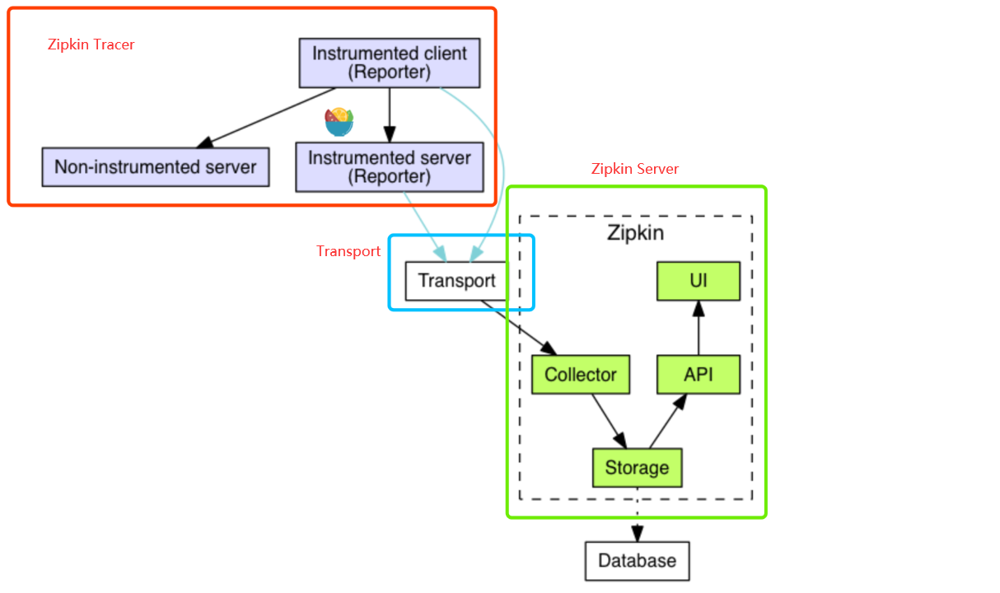
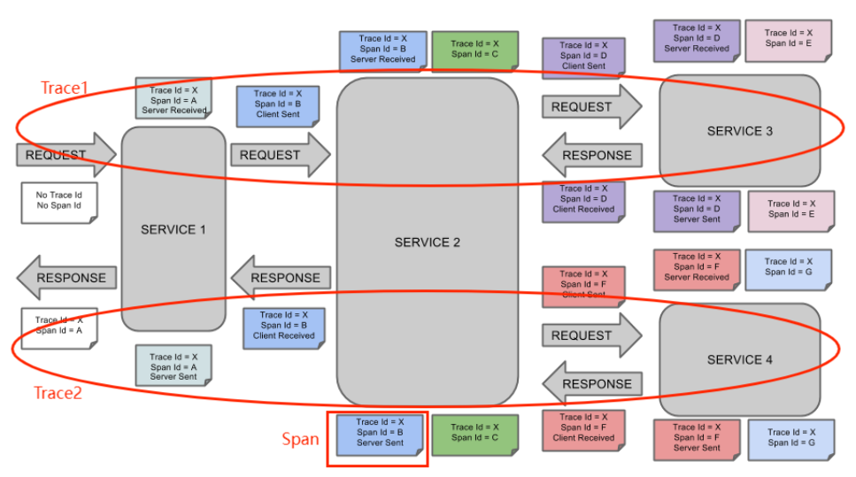
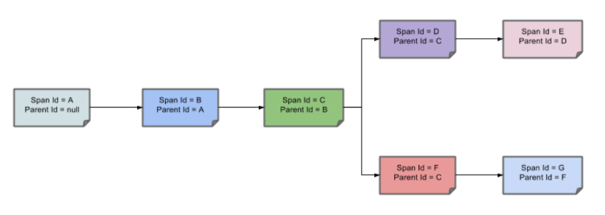
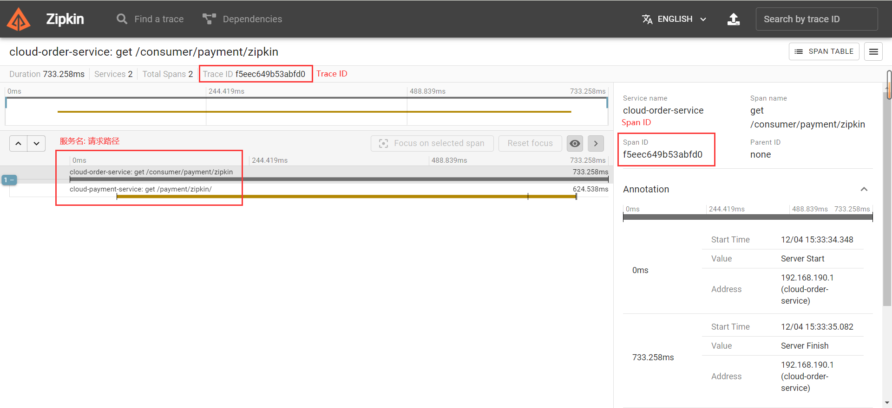
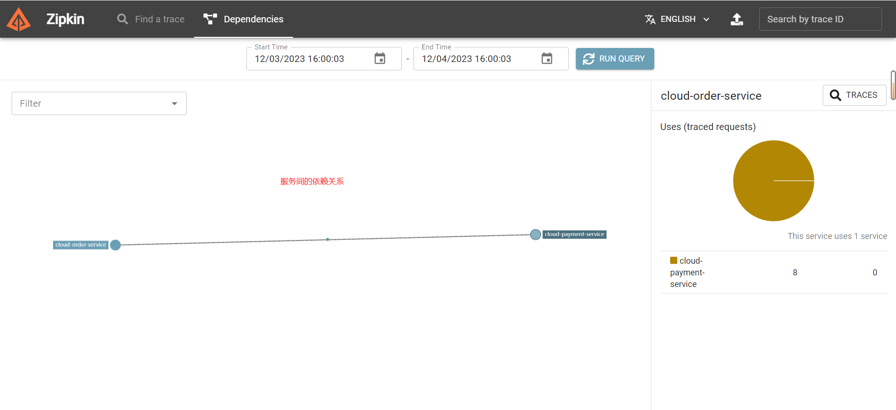

# Sleuth

> 基于[【官网】](https://spring.io/projects/spring-cloud-sleuth)、《尚硅谷 SpringCloud 框架开发教程》、[Zipkin 实现原理与源码解析](https://www.iocoder.cn/Zipkin/good-collection/)

## 一、基本概念

**背景 1**：

在微服务框架中，一个由客户端发起的请求在后端系统中会**经过多个不同的服务节点调用来协调产生最后的请求结果**，每一个客户端请求都会形成一条复杂的分布式服务调用链路，链路中的任何一环出现高延时或错误都会引起整个请求最后的失败。

当系统出现故障或异常时，需要快速确定问题的源头。**分布式链路追踪能够帮助您识别故障点，追踪请求在哪个环节出现问题，从而更快地排除故障。**

---

SpringCloud Sleuth 是由 SpringCloud 官方推出，为 SpringCloud 实现分布式链路追踪功能，它在设计上借鉴了 [Dapper](https://research.google/pubs/pub36356/)、[Zipkin](https://github.com/openzipkin/zipkin)、[HTrace](https://htrace.incubator.apache.org/)。

### （一）Zipkin 架构

Zipkin 是一款开源的分布式实时数据追踪系统，由 Twitter 开发并开源。在微服务架构下，它用于帮助收集排查潜在问题的时序数据，同时管理数据收集和数据查询。

> 除了 Zipkin 之外，还有几款优秀的 APM（Application Performance Management、应用性能管理）工具：Pinpoint、SkyWalking、Elastic。
>
> APM 是指通过**监控和管理应用程序的运行状态，分析应用程序的性能瓶颈，优化应用程序的性能和可用性，提高用户体验和满意度**的一系列活动。APM 可以帮助开发者和运维人员快速定位和解决应用程序的问题，提高应用程序的质量和效率。



- Zipkin Tracer：负责从应用中**收集调用链路数据，发送给 Zipkin Server 服务**。
- Transport：链路数据的传输方式，例如：HTTP、Kafka、RabbitMQ 等。

> 实际上，我们可以直接把 SpringCloud Sleuth 理解成**对 Zipkin 的封装**，提供以上两种功能。

- Zipkin Server：负责接收 Tracer 发送的链路数据，将其聚合处理并进行存储。用户可以通过 UI 界面进行链路数据的查询，从而获取服务延迟、调用链路、服务依赖等信息。

> Zipkin Server 是 Zipkin 单独提供的 Server 端 jar 包，我们简单地安装运行即可。

### （二）重要知识点

- Span（跨度）：基本工作单元，一次链路调用就创建一个 Span，通过一个 64 位 ID（即 Span ID）标识它。Span 内中存储着：描述信息、时间戳（用于统计 Duration）、parent-id（即上一个 Span 的 ID）、Tags（即请求方式、请求路径、客户端 IP）等。
- Trace（跟踪）：类似于树结构的 Span 集合，标识一条调用链路，存在唯一标识 Trace ID（一般是链路中第一个 Span 的 ID）。

Span 和 Trace 在系统中的样子如下：



Span 之间的依赖关系如下：



## 二、Sleuth 使用

### （一）安装配置

1、SpringCloud 项目添加 Sleuth 依赖

```xml
<!-- 包含了sleuth + zipkin -->
<dependency>
    <groupId>org.springframework.cloud</groupId>
    <artifactId>spring-cloud-sleuth-zipkin</artifactId>
</dependency>
```

2、修改 yml 配置文件

```yml
spring:
  zipkin:
    base-url: http://192.168.190.134:9411 # 配置 Zipkin Server 地址
  sleuth:
    sampler:
      probability: 1 # 采样率值介于 0 到 1 之间，1 则表示全部采集，0.1 则表示 10 个请求中只采集 1 一个
```

3、安装运行 Zipkin 服务器

```shell
 nohup java -jar zipkin-server-3.0.0-rc0-exec.jar &
```

> SpringBoot 2.0 之后，使用 @EnableZipkinServer 创建自定义的 Zipkin 服务器已经被废弃。详情见 [ISSUE#912](https://github.com/spring-cloud/spring-cloud-sleuth/issues/912)。

### （二）使用 Zipkin 查看

只需要进行上面的配置，之后我们的请求链路就可以直接在 Zipkin 提供的界面中查看：




