# Spring

> 基于《Spring 揭秘》

## 一、基本概念

Spring 是于 2003 年兴起的一个轻量级的 Java 开发框架，由 Rod Johnson 在其著作《Expert One-On-One J2EE Development and Design》中阐述的部分理念和原型衍生而来。有以下特点：

- Spring 是为了解决企业应用开发的复杂性而创建的。Spring 框架的主要优势之一就是其分层架构，分层架构允许使用者选择使用哪一个组件，同时为 J2EE 应用程序开发提供集成的框架。
- Spring 使用基本的 JavaBean 来完成以前只可能由 EJB 完成的事情。然而，Spring 的用途不仅限于服务器端的开发。从简单性、可测试性和松耦合的角度而言，任何 Java 应用都可以从 Spring 中受益。
- Spring 的核心是控制反转（IoC）和面向切面（AOP）。简单来说，Spring 是一个分层的 JavaSE/EEfull-stack（一站式）轻量级开源框架。
- Spring 可以集成其他框架，方便解耦，简化开发。

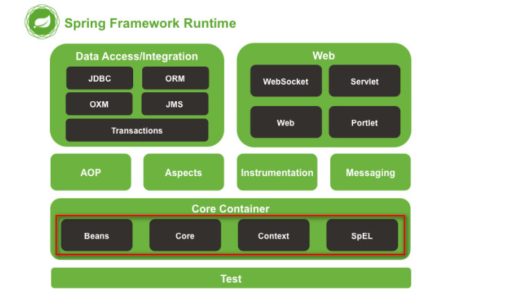

## 二、IoC 和 DI

### （一）IoC

IoC（inverse of control、控制反转）是指把创建 Bean 对象的权利交给 Spring，实现程序的解耦。有以下优点：

- 对象的生命周期被 Spring 容器管理，不再仅是超出作用域就被销毁。
- 是 Spring 主动管理 Bean 后，让用户来调用，而不是用户主动实例化。

普通类注册到 Spring 容器中成为 Bean 有两种方式：

#### 1、`<bean>` 标签

通过 `<bean>` 标签，Spring 可以识别配置好的类及相关属性配置，为类创建 Bean 对象并注册到 Spring 容器。

##### （1）`<bean>` 标签属性

- lazy-init：Bean 的加载方式是不是懒加载。

- scope：bean 的作用域，有以下值：

  - singleton：Bean 的创建方式为单例模式，在同一个容器中只被创建一次，由容器管理，Bean 的生命周期和 Spring 的 IoC 容器一致。

    > 单例模式和 singleton 单例属性有区别的，单例模式指的是在同一个 ClassLoader 中只有一个实例。

  - prototype：Bean 的创建方式为原型模式，每次都会生成一个新的对象实例给请求方，不由容器管理，由请求方负责该实例的生命周期。

    > 可以应用于不能共享一个 Bean 的场景，例如：Stuct2。

  ***

  - request：每次 HTTP 请求都创建一个 Bean 实例，将 Bean 储存在 ServletRequest 上下文中，请求结束后销毁。

  - session：同一个 Session 共享一个 Bean 实例，将 Bean 存储在 HttpSession 中。

  - application：多服务器间的 Session，给每个 Global Session 建一个 Bean 实例，将 Bean 存储在 ServletContext 中。

    > 注意：request、session 和 globalsession 只适用于 Web 应用程序。

- parent：继承 parent 指定的 `<bean/>` 的属性和依赖注入值。

  > 自己类的属性名和 parent 类的属性名同名时才会继承。

- autowire：指定 Bean 之间的依赖关系，也就是依赖注入如何确定所注入的值。

  - no：自动绑定，由自己配置 `<property/>`。

  - byName：按照类中声明的实例变量的名称，和 XML 中 Bean 定义的 beanName 的值进行匹配。

    > byName 的查找方式最快。

  - byType：根据类中声明的实例变量的类型，和 XML 中 Bean 定义的类型进行匹配，若有多个 Bean 匹配，则报错。

  - constructor：根据类的构造方法的类型，和 XML 中 Bean 定义的类型进行匹配，若有多个匹配，则报错。

- depends-on：depends-on 表示在此 Bean 类被实例化之前，会先实例化 depends-on 指定 id 的 Bean 类。

  > 有时我们需要依赖某个 Bean 类并要其先加载，但是又没有使用依赖注入方式，可以使用 depends-on 让其先加载。

##### （2）`<bean>` 的子标签

根据构造函数注入、属性 setter 方法注入在配置文件中 `<property/>` 和 `<constructor-arg/>` 注入的值的类型不同，子标签又分为九种：

① `<value/>`

基本类型

```xml
<constructor-arg>
    <value>111111</value>
</constructor-arg>
<property name="attributeName">
    <value>222222</value>
</property>
```

② `<idref/>`

String 类型，注入当前 Bean 对象注入所依赖的 Bean 对象的名称的字符串，而不是引用此名称 id 对应的 bean。

> 和 `<value/>` 区别是，会通过 Bean 对象名称监测当前依赖的 Bean 对象是否存在

```xml
<property name="newsListenerBeanName">
    <value>djNewsListener</value>
</property>

<!-- 等同于 -->
<property name="newsListenerBeanName">
    <idref bean="djNewsListener"/>
</property>
```

③ `<ref/>`

引用类型，`<ref/>` 标签又有三个属性：

- local：只能指定当前 `<bean/>` 对象所在的 XML 文件中定义的 bean。
- parent：指定位于当前容器（BeanFactory）的父容器中定义的对象引用。
- bean：包括以上条件。

```xml
<constructor-arg>
    <ref local="djNewsPersister"/>
</constructor-arg>

<constructor-arg>
    <ref parent="djNewsPersister"/>
</constructor-arg>

<constructor-arg>
    <ref bean="djNewsPersister"/>
</constructor-arg>
```

④ `<list/>`

List 类型或 Array 类型

```xml
<property name="param1">
    <list>
        <value> something</value>
        <ref bean="someBeanName"/>
        <bean class="..."/>
    </list>
</property>

<property name="param2">
    <list>
        <value>stringValue1</value>
        <value>stringValue2</value>
    </list>
</property>
```

⑤ `<set/>`

Set 类型

```xml
<property name="valueSet">
    <set>
        <value> something</value>
        <ref bean="someBeanName"/>
        <bean class="..."/>
        <list>...</list>
    </set>
</property>
```

⑥ `<map/>`

Map 类型

```xml
<property name="mapping">
    <map>
        <!-- key用作基本类型 -->
        <entry key="strValueKey">
            <value>something</value>
        </entry>
        <entry>
            <key>objectKey</key>
            <ref bean="someObject"/>
        </entry>
        <!-- key-ref用作引用类型 -->
        <entry key-ref="listKey">
            <list>
            </list>
        </entry>
    </map>
</property>
```

⑦ `<props/>`

对应 java.util.Proerties 的对象依赖（Properties 只能指定 String 类型的键和值），内部嵌套 `<prop/>` 标签。

```xml
<property name="valueSet">
    <props>
        <prop key="author">fujohnwang@gmail.com</prop>
        <prop key="support">support@spring21.cn</prop>
    </props>
</property>
```

⑧ `<null/>`

给引用类型赋值为 null

```xml
<property name="param1">
    <null/>
</property>

<property name="param2">
    <null/>
</property>
```

⑨ `<bean/>`

若想要对象实例只被当前 Bean 引用，则使用内部 `<bean/>`，可以不用写 id

```xml
<bean id="djNewsProvider" class="..FXNewsProvider"> 10
    <constructor-arg index="0">
        <bean class="..impl.DowJonesNewsListener"/>
    </constructor-arg> 11
    <constructor-arg index="1">
        <ref bean="djNewsPersister"/>
    </constructor-arg> 12
</bean>
```

##### （3）`<beans>` 标签

`<beans>` 可以配置全局属性，用于覆盖内部嵌套的 `<bean/>` 的默认属性。

#### 2、注解方式

@Component 类似于使用 `<bean/>` 进行配置。

> `<bean>` 下的属性也有对应的注解表示。

@Repository、@Service、@Controller 相当于 @Component 在 MVC 框架下的细化，和 @Component 功能一致。

> 使用 `<context:component-scan base-package="包路径">`，扫描相关包下的 @Component 及其他三个注解。

### （二）DI

DI（Dependency injection、依赖注入）是指通过配置文件或注解动态的为 Bean 的属性赋值。

#### 1、~~配置文件方式~~

##### （1）构造函数注入

```java
// 有参构造函数注入样例代码：
// 编写Java的类，提供构造方法
public class Car {
    private String name;
    private double money;

    public Car(String name, double money) {
        this.name = name;
        this.money = money;
    }

    @Override
    public String toString() {
        return "Car [name=" + name + ", money=" + money + "]";
    }
}
```

```xml
<!-- 编写配置文件 -->
<bean id="car" class="com.itheima.demo4.Car">
    <constructor-arg name="name" value="大奔"/>
    <constructor-arg name="money" value="100"/>
</bean>
```

##### （2）属性 setter 方法注入

```java
// 属性 setter 方法注入样例代码：
// 编写 Java 的类，提供属性和对应的 set 方法即可
public class Car {
    private String name;
    private double money;

    public void setName(String name) {
        this.name = name;
    }

    public void setMoney(double money) {
        this.money = money;
    }
}
```

```xml
<!-- 编写配置文件 -->
<bean id="car" class="com.itheima.demo4.Car">
    <property name="name" value="大奔"/>
    <property name="money" value="100"/>
</bean>
```

#### 2、注解方式

##### （1）@Autowired

通过 byType 查看属性类型，确定注入的值。因为应用的位置不同，分为以下几种：

① 成员变量

```java
public class FXNewsProvider {
    @Autowired
    private IFXNewsListener newsListener;
    @Autowired
    private IFXNewsPersister newPersistener;
}
```

> 注意：放在成员变量时，IDEA 可能会报警告，因为 Bean 可能不存在导致启动失败，IDEA 推荐放在构造方法上。

② 构造方法

```java
public class FXNewsProvider {
    private IFXNewsListener newsListener;
    private IFXNewsPersister newPersistener;

    @Autowired
    public FXNewsProvider(IFXNewsListener newsListner, IFXNewsPersister newsPersister) {
        this.newsListener = newsListner;
        this.newPersistener = newsPersister;
    }
}
```

③ 成员方法

```java
public class FXNewsProvider {
    private IFXNewsListener newsListener;
    private IFXNewsPersister newPersistener;

    @Autowired
    public void setUp(IFXNewsListener newsListener, IFXNewsPersister newPersistener) {
        this.newsListener = newsListener;
        this.newPersistener = newPersistener;
    }
}
```

##### （2）@Qualifier

通过 byName 查看 Bean 的 id，确定注入的值。可以和 @Autowired 同时使用，起到限定范围的作用。分为以下几种：

① 成员变量

```java
public class FXNewsProvider {
    @Autowired
    @Qualifier("reutersNewsListner")
    private IFXNewsListener newsListener;
}
```

② 构造方法

```java
public class FXNewsProvider {
    @Autowired
    public FXNewsProvider(@Qualifier("reutersNewsListner") IFXNewsListener newsListener, IFXNewsPersister newPersistener) {
        this.newsListener = newsListener;
        this.newPersistener = newPersistener;
    }
}
```

③ 成员方法

```java
public class FXNewsProvider {
    @Autowired
    public void setUp(@Qualifier("reutersNewsListner") IFXNewsListener newsListener, IFXNewsPersister newPersistener) {
        this.newsListener = newsListener;
        this.newPersistener = newPersistener;
    }
}
```

##### （3）@Resource

@Resource 是 Java 提供的注解，相当于 @Autowired 和 @Qualifier 同时使用。

可以使用 type 或 name 属性，使用在属性或 set 方法上，不可以使用在构造方法上

① 成员变量

```java
public class FXNewsProvider {
    @Resource(name = "reutersNewsListner")
    private IFXNewsListener newsListener;
}
```

② set 成员方法

```java
public class FXNewsProvider {
    private IFXNewsListener newsListener;

    public void setNewsListener(@Resource(name = "reutersNewsListner") IFXNewsListener newsListener) {
        this.newsListener = newsListener;
    }
}
```

## 三、AOP

AOP（Aspect oriented programming、面向切面编程）是 OOP 的一种补充。利用 AOP 可以对业务逻辑的每个部分进行隔离，实现解耦。

在现实中，我们可能要对散落在各处业务中的某类代码进行增强补充，但是若对每个业务中的某类代码都进行增强，工作量可能巨大，甚至可能会遗漏。AOP 提供了解决方案，就是横向的方式，当每个业务执行某类代码时，都会使用 AOP 将增强代码织入到某类代码中，实现增强效果。

AOP 是一种理念，将代码横向抽取成一个独立的模块，再织入到目标方法中。不同语言有不同实现方式，例如 Java 有 AspectJ 和 Spring AOP；C 有 AspectC。

应用：异常检查、安全检查和缓存中。

### （一）[AOP 分类](https://juejin.im/post/5c01533de51d451b80257752)

AspectJ 融合了 AspectWerkz 框架后，同时支持静态 AOP 和动态 AOP

#### 1、静态 AOP

在编译期，通过特定的编译器（例如：AspectJ 使用 ajc 编译器），将实现后的 Aspect 以字节码的形式编译并织入到系统的静态类中（修改 .class 文件），以达到融合 Aspect 和 Class 的目的。

- 直接修改 .class 文件，不会对系统性能有影响。
- 灵活度低，若需求改变，需要重新修改 Aspect 再编译。

#### 2、动态 AOP

AOP（例如：Spring AOP）的织入过程在系统运行开始之后进行。

- 织入信息采用外部 XML 文件保存，灵活性强。
- 需要在运行期进行类加载，影响系统性能。

### （二）AOP 术语

#### 1、Joinpoint（连接点）

AOP 对识别业务类，并能织入逻辑代码进行的地方（也就是业务类执行到哪些地方（Joinpoint）时，会进行代码织入）。

> Spring AOP 仅提供在方法上进行代码织入。

#### 2、Pointcut（切点）

对那些 Joinpoint 进行拦截（也就是具体的描述哪些 Joinpoint 会进行代码织入）。

格式为 `execution([修饰符] 返回值类型 包名.类名.方法名(参数))`：

> 例如：`pointcut="execution(public \* com.itheima.demo3.CustomerDaoImpl.save(..))"/`，当此类符合规则的 save 方法被调用时，进行代码织入。

- 修饰符可以省略不写，不是必须要出现的。
- 返回值类型是不能省略不写的：根据你的方法来编写返回值；可以使用 `*` 代替。
- 包名例如：`com.itheima.demo3.BookDaoImpl`，首先 com 是不能省略不写的，但是可以使用 `*` 代替；中间的包名可以使用 `*` 号代替；如果想省略中间的包名可以使用 `..`。
- 类名也可以使用 `*` 号代替；也有类似的写法：`*DaoImpl` 进行通配符匹配。
- 方法也可以使用 `*` 号代替。
- 参数如果是一个参数可以使用 `*` 号代替，如果想代表任意参数使用 `..`，多个参数也可以使用 `.., String, \*, ..` 混合表示。

> 最精简的格式如下：【execution(\* \*(..))】，表示匹配所有包下的、所有类的、所有方法。

#### 3、[Advice（通知）](https://zhuanlan.zhihu.com/p/25891989)

什么时候对 Pointcut 起作用（也就是拦截到定义好的 Pointcut，定义织入的代码执行的时机）。

##### （1）before（前置通知）

在 Pointcut 执行之前执行，可以对方法的参数进行校验。

##### （2）after-returning（后置通知）

在 Pointcut 正常执行后执行，不能改变目标方法的返回值。

##### （3）after-throwing（异常抛出通知）

在 Pointcut 抛出异常后执行，可以包装异常信息。

##### （4）after（最终通知）

在 Pointcut 执行后（正常执行和抛异常）执行，可以进行释放资源操作。

##### （5）around（环绕通知）

相当于 before 加 after，可以改变传入参数和返回值，around 修饰的织入方法需要传入 ProceedingJoinPoint 参数。

> 都是作用在方法上，执行顺序一般为 around、before、around、after-throwing、after、after-returning

#### 4、[Introduction（引入）](https://my.oschina.net/u/2377110/blog/1532127)

Introduction 是一种特殊的通知，作用在类上，允许我们向现有的类添加新方法或属性。

#### 5、Weaving（织入）

把增强方法应用到目标对象，来创建新的代理对象的过程。

#### 6、Proxy（代理）

一个类被 AOP 织入增强后，就产生一个结果代理类。

#### 7、Aspect（切面）

切面由切点和增强/通知组成，它既包括了横切逻辑的定义、也包括了连接点的定义。

### （三）Java 中 AOP 实现原理

#### 1、动态代理

使用 Java 提供的动态代理机制，生成对应的代理对象，将横切逻辑织入到相应的代理类中（使用反射），以动态代理类为载体工作。

> Spring AOP 默认使用这种方式。

```java
// 动态代理代码样例：
public class Demo05 {
    public static void main(String[] args) throws IllegalAccessException, InstantiationException {
        UserServiceImpl userServiceImpl = new UserServiceImpl();
        ClassLoader classLoader = userServiceImpl.getClass().getClassLoader();
        // 获取被代理类的所有接口的 Class
        Class[] interfaces = userServiceImpl.getClass().getInterfaces();
        InvocationHandler logHandler = new LogHandler(userServiceImpl);
        UserService proxy = (UserService) Proxy.newProxyInstance(classLoader, interfaces, logHandler);
        proxy.select();
        proxy.update();
    }
}

interface UserService {
    void select();
    void update();
}

class UserServiceImpl implements UserService {
    public void select() {
        System.out.println("查询 selectById");
    }

    public void update() {
        System.out.println("更新 update");
    }
}

class LogHandler implements InvocationHandler {
    Object target; // 被代理的对象，实际的方法执行者
    public LogHandler(Object target) {
        this.target = target;
    }

    @Override
    public Object invoke(Object proxy, Method method, Object[] args) throws Throwable {
        before();
        Object result = method.invoke(target, args);
        after();
        return result;
    }

    // 调用 invoke 方法之前执行
    private void before() {
        System.out.println(String.format("log start time [%s] ", new Date()));
    }

    // 调用 invoke 方法之后执行
    private void after() {
        System.out.println(String.format("log end time [%s] ", new Date()));
    }
}
```

##### （1）[实现原理](https://juejin.im/post/5c1ca8df6fb9a049b347f55c)

- 使用 InvocationHandler 织入增强逻辑代码，使用 Proxy 生成代理类。
- Proxy 创建代理对象过程中，JDK 会通过根据传入的参数信息动态地在内存中创建和 .class 文件等同的字节码。
- 根据相应的字节码转换成对应的 class 类，此 class 类被 final 修饰，类属性是目标类方法反射后的 Method。
- 调用 newInstance()创建代理实例。调用实例方法时，相当于调用了 InvocationHandler 的 `invoke(当前代理对象，目标类方法反射后的 Method，方法参数)` 方法。

#### 2、动态字节码增强

使用 CGLIB 等 Java 工具库，在程序运行过程中，动态构建对应类的相应子类 .class 文件，将横切逻辑加入到子类中，以子类为载体工作。

> Spring AOP 无法使用动态代理时（当被代理类没有实现接口时，无法使用动态代理），使用 CGLIB 动态字节码增强。

```java
// CGLIB 代码样例：
public class Demo06 {
    public static void main(String[] args) {
        Enhancer enhancer = new Enhancer();
        enhancer.setSuperclass(UserDao.class); // 设置超类，cglib 是通过继承来实现的
        enhancer.setCallback(new LogInterceptor());
        UserDao proxy = (UserDao) enhancer.create();
        proxy.select();
        proxy.update();
    }
}

class UserDao {
    public void select() {
        System.out.println("UserDao 查询 selectById");
    }

    public void update() {
        System.out.println("UserDao 更新 update");
    }
}

class LogInterceptor implements MethodInterceptor {
    @Override
    public Object intercept(Object object, Method method, Object[] objects, MethodProxy methodProxy) throws Throwable {
        before();
        // 注意这里是调用 invokeSuper 而不是 invoke，否则死循环；
        // methodProxy.invokesuper 执行的是原始类的方法，method.invoke 执行的是子类的方法
        Object result = methodProxy.invokeSuper(object, objects);
        after();
        return result;
    }

    private void before() {
        System.out.println(String.format("log start time [%s] ", new Date()));
    }

    private void after() {
        System.out.println(String.format("log end time [%s] ", new Date()));
    }
}
```

##### （1）[实现原理](https://blog.csdn.net/yhl_jxy/article/details/80633194)

- 使用 MethodInterceptor 织入增强逻辑代码，使用 Enhancer 生成子类。
- 使用 Enhancer 生成目标类的子类过程中，在内存中创建 .class 文件，并进行实例化，此类继承自目标类。
- 调用子类方法时，相当于调用了 MethodInterceptor 的 `intercept(当前代理对象，目标类方法反射后的 Method, 方法参数, 要触发父类的方法对象)` 方法。
- 对目标对象进行继承扩展，让其生成相应的子类，子类再重写父类方法，织入增强逻辑代码，扩展父类行为。

#### 3、自定义类加载器

使用自定义类加载器加载类，将横切逻辑织入到重写方法中，以加载后的类为载体进行工作。

> Aspect 的 Aspect Werkz 使用自定义加载器实现。

### （四） [AOP 配置](https://blog.csdn.net/Luck_ZZ/article/details/100047014)

Spring AOP 早期提供了相应接口（例如：Pointcut、Advice 等），用户可以使用接口相关的实现类，编写现实中的相关业务。后来提供了配置方式和注解方式简化代码。

#### 1、注解方式

Spring AOP 集成 AspectJ（使用 AspectJ 的类库进行 Pointcut 解析和匹配，底层仍然是由 Spring AOP 自己实现），形成 @AspectJ。@AspectJ 代表一种定义 Aspect 的风格，使用注解标注这些定义成 Aspect 的 POJO 类，Spring AOP 根据注解，将被标注类注册到系统。

> 自动代理配置：使用 `<aop:aspectj-autoproxy/>` 配置开启基于注解的 AOP 功能。

##### （1）@Aspect

用于声明切面类。

##### （2）@Order

设置该类在 Spring 容器中的加载顺序，数值越小优先级越高。

##### （3）@Pointcut

用于声明 Pointcut，位于方法上，方法可以被 Advice 引用。有以下属性：

- execution：指定增强代码在哪些 Joinpoint 织入，值为 Pointcut 的格式，例如：

  ```java
  @Pointcut("execution(* * (..))")
  public void test() {}

  @Before("test()")
  public Object before() {
      System.out.println("前置通知")
  }
  ```

- within：匹配指定类下所有的方法，例如：

  ```java
  // 用于匹配包及子包下的 CustomerDaoImpl 类的所有方法
  @Pointcut("within(com.itheima..CustomerDaoImpl)")
  public void test() {}

  // 相当于
  @Pointcut("execution(* com.itheima..CustomerDaoImpl.*(..))")
  public void test() {}
  ```

- @annotation：匹配被指定注解注释的方法，例如：

  ```java
  // 匹配被 @RedisLockAnnotation 的方法
  @Pointcut("@annotation(com.annotation.RedisLockAnnotation)")
  public void test() {}

  // 将注解作为参数传入，可以获取注解的属性值
  @Before("test() && @annotation(abcdef)")
  public Object before(RedisLockAnnotation abcdef) {
      System.out.println("前置通知" + abcdef.value)
  }
  ```

##### （4）Advice 注解

###### ① @Before

可以使用逻辑运算符，将多个 Pointcut 关联起来（其他的 Advice 也一样）。

```java
@Before("updatePointCut() || updateBatchPointCut()")
public Object beforeUpdate() throws Throwable {
    System.out.println("前置通知")
}
```

###### ② @AfterReturning

```java
// 将返回值作为参数传入，可以获取返回值值
@AfterReturning(returning = "rvt", pointcut = "execution(* lee.*.*(..))"  )
public void log(Object rvt){
    System.out.println("获取目标方法返回值" + rvt);
    // rvt会自动向下转型
    if (rvt!= null) ystem.out.println("返回值的类型是 " + rvt.getClass());
}
```

> 注意：
>
> - 目标方法返回值为 `void` 时@AfterReturning 不起作用。
> - Aspect 并不能改变目标方法的返回值。因为在执行切面方法的时候，目标方法已经执行结束，并且返回了。

###### ③ @AfterThrowing

```java
@AfterThrowing(throwing = "ex", value = "execution(* lee.*.*(..))")
public void doSomething(Throwable ex){
    System.out.println("目标方法中抛出的异常 " + ex);
    System.out.println("异常打印完毕");
}
```

> 注意：@AfterThrowing 不会像 catch 语句那样完全处理异常，它一然会传播到上一级调用者。

###### ④ @After

###### ⑤ @Around

###### ⑥ @DeclareParents

#### 2、配置方式

```xml
<!-- 注册bean -->
<bean id="customerDao" class="com.itheima.demo3.CustomerDaoImpl"/>

<aop:config>
    <!-- 定义切入点 -->
    <aop:pointcut id="mypoint" expression="execution(public * com.itheima.demo3.CustomerDaoImpl.delete(..))"/>
    <!-- 引入切面类 -->
    <aop:aspect ref="customerDao">
        <!-- 定义Advice：切面类的方法和切入点的表达式 -->
        <aop:before method="log" pointcut="execution(public * com.itheima.demo3.CustomerDaoImpl.save(..))"/>
        <!-- 引入切入点 -->
        <aop:after-returning method="afterReturningAdvice" pointcut-ref="mypoint" returning="res" />
    </aop:aspect>
</aop:config>
```

## 四、事务

### （一）[事务相关接口](https://juejin.cn/post/6844903608224333838)

#### 1、PlatformTransactionManager

平台事务管理器。Spring 并不直接管理事务，而是提供 PlatformTransactionManager 接口及实现类，将事务管理的职责委托给 JDBC、Hibernate 或 JTA 等持久化框架来实现。具体实现类如下：

- DataSourceTransactionManager：使用 Spring JDBC 或者 iBatis 进行持久化数据时使用。
- HibernateTransactionManager：使用 Hibernate3.0 进行持久化数据时使用。
- JpaTransactionManager：使用 JPA 进行数据持久化时使用。
- JtaTransactionManager：使用一个 JTA 实现来管理事务，在一个事务跨越多个资源时使用。

#### 2、TransactionDefinition

事务定义类。定义一些事务的基本属性：隔离级别、传播行为、回滚规则、是否只读和事务超时。

##### （1）隔离级别

事务的隔离级别，用于解决事务并发时出现的：脏读、不可重复度和幻读情况。

- TransactionDefinition.ISOLATION_DEFAULT：使用后端数据库默认的隔离级别。MySQL 默认为 rr，Oracle 默认为 rc。
- TransactionDefinition.ISOLATION_READ_UNCOMMITTED：读未提交。事务过程中读到其他事务未提交的数据，可能导致脏读、不可重复度和幻读。
- TransactionDefinition.ISOLATION_READ_COMMITTED：读已提交。事务过程中读到其他事务已提交的数据，可能导致不可重复度和幻读。
- TransactionDefinition.ISOLATION_REPEATABLE_READ：可重复读。事务过程中，其他事务修改数据不会对本事务有影响，可能导致幻读。
- TransactionDefinition.ISOLATION_SERIALIZABLE：序列化。事务过程中，其他事务增删数据不会对本事务有影响。

##### （2）[传播行为](https://blog.csdn.net/weixin_39625809/article/details/80707695)

在一个事务方法中执行另一个事务方法时，必须指定事务应该如何传播。

> 例如：methodA()事务方法中执行 methodB()事务方法时，methodB 是继续在调用者 methodA 的事务中运行呢，还是为自己开启一个新事务运行，这就是由 methodB 的事务传播行为决定的。

- 支持当前事务的情况：

  - TransactionDefinition.PROPAGATION_REQUIRED：如果当前存在事务，则加入该事务；如果当前没有事务，则创建一个新事务。

  - TransactionDefinition.PROPAGATION_SUPPORTS：如果当前存在事务，则加入该事务；如果当前没有事务，则以非事务的方式继续运行。

  - TransactionDefinition.PROPAGATION_MANDATORY：如果当前存在事务，则加入改事务；如果当前没有事务，则抛出异常。

- 不支持当前事务的情况：

  - TransactionDefinition.PROPAGATION_REQUIRES_NEW：始终以事务方式运行。如果当前存在事务，则把当前事务挂起；如果当前没有事务，则创建一个新事务。

    > 需要使用 JtaTransactionManager 作为事务管理器。
    >
    > 在这里 methodA()和 methodB()是两个独立的事务：
    >
    > - 当 methodA()事务方法执行到 methodB()事务方法时，若 methodA()事务仍在执行，则会挂起 methodA()事务，开启 methodB()事务。methodB()事务的回滚或提交对 methodA()事务没有影响。
    > - 当 methodB()事务执行完后，若 methodA()事务处于挂起状态，则会恢复 methodA()事务。同理，methodA()事务的回滚或提交对 methodB()事务没有影响。

  - TransactionDefinition.PROPAGATION_NOT_SUPPORTED：始终以非事务方式运行。如果当前存在事务，则把当前事务挂起；如果当前没有事务，则以非事务方式运行。

  - TransactionDefinition.PROPAGATION_NEVER：以非事务方式运行。如果当前存在事务，则抛出异常；如果当前没有事务，则以非事务方式运行。

- 其他情况：

  - [TransactionDefinition.PROPAGATION_NESTED](https://zhuanlan.zhihu.com/p/148504094)：如果当前存在事务，则创建一个事务作为当前事务的嵌套事务来运行；如果当前没有事务，则该值等价于 PROPAGATION_REQUIRED（也就是开启一个事务）。

    > 前面的六种事务传播行为是 Spring 从 EJB 中引入的，他们共享相同的概念。而 PROPAGATION_NESTED 是 Spring 所特有的。
    >
    > - 以 PROPAGATION_NESTED 启动的事务内嵌于外部事务中（如果存在外部事务的话），此时，内嵌事务并不是一个独立的事务，它依赖于外部事务的存在，嵌套的子事务不能单独提交，只有通过外部的事务提交，才能引起内部事务的提交。
    > - 如果外部事务异常，则内部事务必然回滚，这就是和 PROPAGATION_REQUIRES_NEW 的不同。
    > - 如果内部事务异常，外部事务可以选择捕获异常从而不进行回滚（当然不捕获异常就会回滚），这就是和 PROPAGATION_REQUIRED 的不同。

##### （3）回滚规则

回滚规则定义了哪些异常会导致事务回滚，而哪些不会。

默认情况下，事务只有遇到运行期异常时才会回滚，而在遇到检查型异常时不会回滚。但是可以声明回滚规则，在遇到特定的检查型异常时回滚，在遇到运行期异常时不回滚。

##### （4）是否只读

是否对事务性资源（例如：数据源、JMS 资源等）进行只读操作，可以提高事务处理的性能。

##### （5）事务超时

一个事务所允许执行的最长时间，如果超过该时间限制但事务还没有完成，则自动回滚事务。

#### 3、TransactionStatus

TransactionStatus 用于记录事务的状态，该接口提供一组方法用于获取或判断事务的相应状态信息。

```java
public interface TransactionStatus{
    boolean isNewTransaction(); // 是否是新的事务
    boolean hasSavepoint(); // 是否有恢复点
    void setRollbackOnly();  // 设置为只回滚
    boolean isRollbackOnly(); // 是否为只回滚
    boolean isCompleted; // 是否已完成
}
```

> 上述对象之间的关系：
>
> PlatformTransactionManager 平台事务管理器真正管理事务对象，根据事务定义的信息 TransactionDefinition 进行事务管理，在管理事务中产生一些状态，将状态记录到 TransactionStatus 中。

### （二）[事务配置](https://juejin.cn/post/6844903608694079501)

实现声明式事务的三种方式：

#### 1、编程式事务管理

显示地在业务代码中注入 TransactionTemplate 进行事务管理。

```java
// 业务代码
public class OrdersService {
    // 注入Dao层对象
    private OrdersDao ordersDao;

    public void setOrdersDao(OrdersDao ordersDao) {
        this.ordersDao = ordersDao;
    }

    // 注入TransactionTemplate对象
    private TransactionTemplate transactionTemplate;

    public void setTransactionTemplate(TransactionTemplate transactionTemplate) {
        this.transactionTemplate = transactionTemplate;
    }

    public void accountMoney() {
        // 使用TransactionTemplate进行书屋管理
        transactionTemplate.execute(new TransactionCallback<Object>() {
            @Override
            public Object doInTransaction(TransactionStatus status) {
                Object result = null;
                try {
                    // 小马多1000
                    ordersDao.addMoney();
                    // 加入出现异常如下面int
                    // i=10/0;
                    int i = 10 / 0;
                    // 小王少1000
                    ordersDao.reduceMoney();
                } catch (Exception e) {
                    // 出现异常后进行事务回滚
                    status.setRollbackOnly();
                    result = false;
                    System.out.println("Transfer Error!");
                }
                return result;
            }
        });
    }
}
```

```xml
<!-- 第一步：配置事务管理器 -->
<bean id="dataSourceTransactionManager" class="org.springframework.jdbc.datasource.DataSourceTransactionManager">
    <!-- 注入dataSource -->
    <property name="dataSource" ref="dataSource"></property>
</bean>

<!-- 第二步：配置事务管理器模板 -->
<bean id="transactionTemplate" class="org.springframework.transaction.support.TransactionTemplate">
    <!-- 注入真正进行事务管理的事务管理器,name必须为 transactionManager否则无法注入 -->
    <property name="transactionManager" ref="dataSourceTransactionManager"></property>
</bean>

<!-- 第三步：对象生成及属性注入 -->
<bean id="ordersService" class="cn.itcast.service.OrdersService">
    <property name="ordersDao" ref="ordersDao"></property>
    <!-- 注入事务管理的模板 -->
    <property name="transactionTemplate" ref="transactionTemplate"></property>
    <!-- 在这里可以配置TransactionDefinition的一些属性 -->
</bean>
```

#### 2、注解式事务管理

使用 @Transactional 直接进行事务管理。

```java
@Transactional(propagation = Propagation.REQUIRED, isolation = Isolation.DEFAULT, readOnly = false, timeout = -1)
public class OrdersService {
    private OrdersDao ordersDao;

    public void setOrdersDao(OrdersDao ordersDao) {
        this.ordersDao = ordersDao;
    }

    public void accountMoney() {
        // 小马多1000
        ordersDao.addMoney();
        // 加入出现异常如下面int
        // i=10/0; // 事务管理配置后异常已经解决
        int i = 10 / 0;
        // 小王少1000
        ordersDao.reduceMoney();
    }
}
```

```xml
<!-- 第一步：配置事务管理器 (和配置文件方式一样)-->
<bean id="dataSourceTransactionManager" class="org.springframework.jdbc.datasource.DataSourceTransactionManager">
    <!-- 注入dataSource -->
    <property name="dataSource" ref="dataSource"></property>
</bean>

<!-- 第二步： 开启事务注解 -->
<tx:annotation-driven transaction-manager="dataSourceTransactionManager" />

<!-- 第三步 在方法所在类上加注解 -->

<!-- 第四步：对象生成及属性注入 -->
<bean id="ordersService" class="cn.itcast.service.OrdersService">
    <property name="ordersDao" ref="ordersDao"></property>
</bean>
```

[@Transactional 不生效场景](https://baijiahao.baidu.com/s?id=1661565712893820457)

#### 3、基于 AspectJ 的事务管理

使用 `<tx>` 对 TransactionDefinition 进行配置，与 Spring AOP 紧密结合，使得事务管理更加灵活。

```java
public class OrdersService {
    private OrdersDao ordersDao;

    public void setOrdersDao(OrdersDao ordersDao) {
        this.ordersDao = ordersDao;
    }

    public void accountMoney() {
        // 小马多1000
        ordersDao.addMoney();
        // 加入出现异常如下面int
        // i=10/0; // 事务管理配置后异常已经解决
        int i = 10 / 0;
        // 小王少1000
        ordersDao.reduceMoney();
    }
}
```

```xml
<!-- 第一步：配置事务管理器 -->
<bean id="dataSourceTransactionManager" class="org.springframework.jdbc.datasource.DataSourceTransactionManager">
    <!-- 注入dataSource -->
    <property name="dataSource" ref="dataSource"></property>
</bean>

<!-- 第二步：配置事务增强 -->
<tx:advice id="txadvice" transaction-manager="dataSourceTransactionManager">
    <!-- 做事务操作 -->
    <tx:attributes>
        <!-- 设置进行事务操作的方法匹配规则 -->
        <!-- name：表示此事务作用于哪些方法 -->
        <!-- propagation：事务传播行为；isolation：事务隔离级别；read-only：是否只读；rollback-for：发生那些异常时回滚；timeout：事务过期时间 -->
        <tx:method name="account*" propagation="REQUIRED" isolation="DEFAULT" read-only="false" rollback-for="" timeout="-1" />
    </tx:attributes>
 </tx:advice>

<!-- 第三步：配置切面，切面即把增强用在方法的过程 -->
<aop:config>
    <!-- 切入点 -->
    <aop:pointcut expression="execution(* cn.itcast.service.OrdersService.*(..))" id="pointcut1" />
    <!-- 切面 -->
    <aop:advisor advice-ref="txadvice" pointcut-ref="pointcut1" />
</aop:config>

<!-- 第四步：对象生成及属性注入 -->
<bean id="ordersService" class="cn.itcast.service.OrdersService">
    <property name="ordersDao" ref="ordersDao"></property>
</bean>
```

> [注意](https://blog.csdn.net/u011983531/article/details/70504281)：这里 `<aop:advisor>` 大多用于事务管理；`<aop:aspect>` 主要用于 AOP 中的切面。

## 五、Spring 原理

### （一）[BeanFactory 和 ApplicationContext](https://www.jianshu.com/p/fd8e441b98c8)

Spring 容器用于存储管理 Bean 类，Spring 提供了两种容器类型：

#### 1、<font color="orange">BeanFactory</font>

BeanFactory 是基础类型 IoC 容器接口，提供完整的 IoC 服务支持。BeanFactory 可以读取 Bean 配置文档、管理 Bean 的加载（懒加载）和实例化、控制 Bean 的生命周期、维护 Bean 之间的依赖关系。

BeanFactory 容器启动速度快（懒加载的原因），所需的资源有限，但功能也有限。

BeanFactory 接口提供以下实现类：

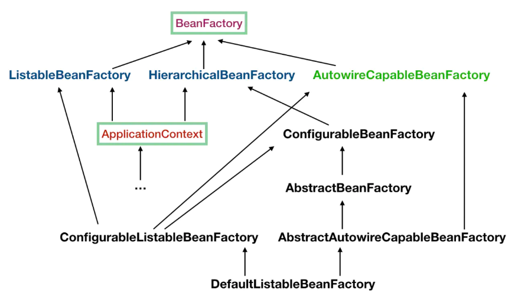

- ListableBeanFactory：可以获取多个 bean（传入一个类的 Class 对象，可以获取本身及其子类的 Bean 实例）。

  - ConfigurableListableBeanFactory：ConfigurableListableBeanFactory 直接或间接的继承第二层的三个接口。

- HierarchicalBeanFactory：可以在应用中起多个 BeanFactory，然后将各个 BeanFactory 设置为父子关系。
- AutowireCapableBeanFactory：自动装配 Bean，ApplicationContext 虽然没有继承 AutowireCapableBeanFactory，但是 ApplicationContext 使用了组合的思想，在其中定义了 getAutowireCapableBeanFactory()方法。

通过 BeanFactory 注册并管理 Bean 类：

```java
public static void main(String[] args) {
    // 1、读取 XML 配置文件，通过 BeanFactory 创建 Bean
    BeanFactory beanFactory1 = new XmlBeanFactory(new ClassPathResource("spring.xml"));
    Demo01_MyBean bean = (Demo01_MyBean) beanFactory1.getBean("demo01_myBean");
    System.out.println(bean);

    // 2、直接通过 BeanFactory 注册 Bean
    DefaultListableBeanFactory beanFactory2 = new DefaultListableBeanFactory();
    AbstractBeanDefinition beanDefinition = new RootBeanDefinition(Demo02_MyBean.class);
    beanFactory2.registerBeanDefinition("demo02_myBean", beanDefinition);
    Demo02_MyBean bean2 = (Demo02_MyBean) beanFactory2.getBean("demo02_myBean");
    System.out.println(bean2);
}
```

#### 2、<font color="orange">ApplicationContext</font>

ApplicationContext 在 BeanFactory 的基础上构建，是相对比较高级的容器实现。除了拥有 BeanFactory 的所有功能，ApplicationContext 还提供其其他高级特性，例如：事件发布、国际化信息支持等。

ApplicationContext 所管理的 Bean 对象，在该容器启动后，默认全部初始化并绑定完成，因此启动时间较长，所需功能有限，但提供更多的功能。

ApplicationContext 提供以下实现类：

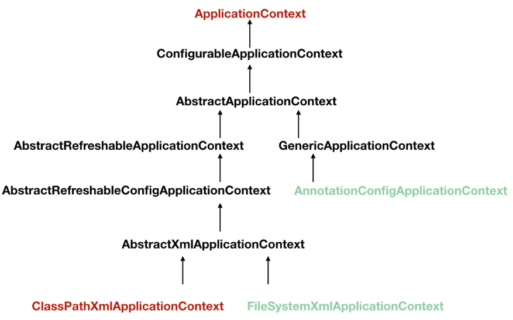

[ClassPathXmlApplicationContext 和 FileSystemXmlApplicationContext](http://www.blogjava.net/alinglau36/archive/2009/05/26/278050.html) 是 ApplicationContext 的派生类，用于读取指定位置的配置文件，有以下区别：

- ClassPathXmlApplicationContext 是从 classpath 路径下获取配置文件。
- FileSystemXmlApplicationContext 是从文件系统中获取配置文件。

```java
public static void main(String[] args) {
    ApplicationContext applicationContext1 = new ClassPathXmlApplicationContext("spring.xml");
    Demo01_MyBean bean1 = (Demo01_MyBean) applicationContext1.getBean("demo01_myBean");
    System.out.println(bean1);

    ApplicationContext applicationContext2 = new FileSystemXmlApplicationContext("classpath:spring.xml");
    Demo01_MyBean bean2 = (Demo01_MyBean) applicationContext2.getBean("demo01_myBean");
    System.out.println(bean2);
}
```

#### 3、区别

- ApplicationContext 是 BeanFactory 的派生类。

  > 注意：虽然 Application 间接的继承 BeanFactory，但是在操作过程中还是使用组合的思想，在内部持有一个实例化的 BeanFactory（DefaultListableBeanFactory），以后所有的 BeanFactory 相关操作委托给这个实例处理。

- BeanFactory 采取延迟加载，调用 getBean()方法时才进行 Bean 的实例化，可能会造成 Bean 使用时抛运行异常；ApplicationContext 在容器启动时，一次性加载所有 bean，可能导致加载过慢并且占空间。

  > 可以通过设置 `<bean lazy-init="true">`，让 ApplicationContext 对某个 Bean 实行懒加载。若当前 Bean 被非懒加载的 Bean 依赖，则懒加载失效。

- BeanFactory 通常以编程的方式被创建；[ApplicationContext 还能以声明的方式创建](https://blog.51cto.com/lsieun/1828581)，例如使用 ContextLoader。

- BeanFactory 和 ApplicationContext 都支持 BeanPostProcessor、BeanFactoryPostProcessor 的使用，区别：BeanFactory 需要手动将其注册为 Bean（例如调用 BeanFactory 的 set 方法），而 ApplicationContext 则是自动注册（只需要进行配置）。

### （二）[ApplicationContext 启动过程](https://www.cnblogs.com/lifullmoon/p/14453083.html)

ApplicationContext 启动的大部分工作都是由 AbstractApplicationContext.refresh() 完成。

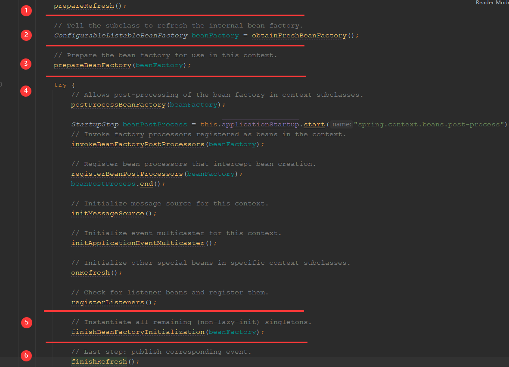

#### 1、启动前的准备工作

记录容器启动时间、对 Environment 环境进行校验。

#### 2、BeanFactory 创建阶段

初始化 BeanFactory，由它加载 BeanDefinition 元信息。

- 如果已存在 BeanFactory，则销毁 BeanFactory 及其中的 Bean。
- 创建 BeanFactory（默认为 DefaultListableBeanFactory）实例，对 BeanFactory 设置一些基本配置，例如：是否允许同名 Bean 的覆盖、是否允许懒加载。
- 加载 BeanDefinition 元信息，并将其注册到 BeanFactory（**以【beanName, BeanDefinition】形式存储**）。由子类实现，**主要为注解和 XML 的区别**：
  - [AbstractXmlApplicationContext](https://www.cnblogs.com/lifullmoon/p/14437305.html)：读取指定的 XML 文件，解析 `import、alias、bean、beans` 标签，**生成 BeanDefinition 对象并将其注册到 BeanFactory**。
  - [AnnotationConfigWebApplicationContext](https://www.cnblogs.com/lifullmoon/p/14451788.html)：扫描指定包下的 Class 类，**判断类是否带有 @Component 注解或其派生注解，再判断该类不是内部类是一个具体类**（不是接口也不是抽象类，如果是抽象类则需要带有 @Lookup 注解），**解析生成 BeanDefinition 对象并将其注册到 BeanFactory**。

#### 3、[BeanFactory 准备阶段](https://www.cnblogs.com/warehouse/p/9387668.html)

主要是为 BeanFactory 设置一些属性。

- 设置 ClassLoader、添加 SPEL 语言支持、添加 Spring 自带的属性编辑器。

- 添加 ApplicationContextAwareProcessor。

  - ApplicationContextAwareProcessor 作用：实现 BeanPostProcessor 接口，Bean 初始化之后，如果 Bean 是 Aware 类型，则调用其对应的 set 方法，让 Bean 获取相关资源。例如：在 ApplicationContextAware 的实现类初始化后，ApplicationContextAwareProcessor 调用它的 setApplicationContext()方法，让这个 Bean 获取 ApplicationContext。

- [设置 Aware 忽略依赖](https://www.jianshu.com/p/3c7e0608ff1f)：即在 default-autowire 自动依赖注入开启的情况下，忽略掉自动通过 Aware 的 setter 方法依赖注入属性，而是通过手动调用 setter 方式设置属性（例如在 ApplicationContextAwareProcessor 中手动调用 Aware 的 setter）。

- 设置几个依赖注入的特殊规则，如下：

  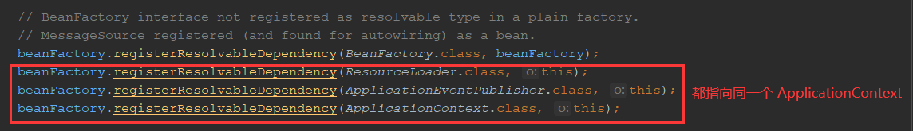

  例如：当我们依赖注入为 ResourceLoader、ApplicationContext 类型属性时，值都是同一个 ApplicationContext。

- 添加 ApplicationListenerDetector。

  - ApplicationListenerDetector 作用：实现 BeanPostProcessor 接口，Bean 初始化之后，如果 Bean 是 ApplicationListener 类型且为单例模式，则将其添加到 ApplicationContext 的 **applicationListeners 属性**。

- 将一些重要的 Beans 注册进 Spring 容器。

  - 将 Environment 注册进 Spring 容器。
  - 将 SystemProperties（Java System Properties）注册进 Spring 容器。

#### 4、BeanFactory 后置处理

**在此之前 BeansFactory 中只有 BeanDefinition，还没有实例化任何 Bean。**

- 对 BeansFactory 进行一些后置处理，例如：添加 BeanPostProcessor，**扩展点**。
- **实例化 BeanFactoryPostProcessor 类型的 Bean（即后面的 Bean 实例化过程）**，调用 postProcessBeanFactory() 方法，可以操作 BeansFactory。例如：BeanDefinitionRegistryPostProcessor 解析 @Bean 等注解定义的 Bean。
- **实例化 BeanFactoryPostProcessor 类型的 Bean（即后面的 Bean 实例化过程）**，添加到 BeanFactory 中。
- 初始化 MessageSource 国际化支持。
- 初始化 ApplicationEventMulticaster（默认为 SimpleApplicationEventMulticaster）事件广播器。
- onRefresh()方法在 AbstractApplicationContext 是空实现，**扩展点**。
- 将 ApplicationListener 监听器添加到 ApplicationEventMulticaster 事件广播器中，**并发布早期事件**。有两个注意点：
  - 早期事件是指 ApplicationContext 还没有初始化完，就通过 publishEvent()方法发布的事件。
  - 监听器有两种：
    - 一种是直接通过 ApplicationContext.addApplicationListener() 方式添加到 Spring 容器，这种可以直接调用 onApplicationEvent()方法监听事件。
    - 一种是通过成为 Bean 注册进 Spring 容器（在此步骤还没有实例化 Bean），如果**监听到对应事件**，则会**实例化该事件监听器（即后面的 Bean 实例化过程）**，再调用 onApplicationEvent()方法事件监听事件。例如：广播器发布 EventA 早期事件，BeanFactory 中有两个事件监听器的 BeanDefinition（EventAListener、EventBListener），则此时只会实例化 EventAListener 去监听事件。

#### 5、[实例化 Bean](https://www.cnblogs.com/lifullmoon/p/14452795.html)

BeanFactory 对 Bean 进行实例化并注入依赖。

- 初始化 ConversionService、LoadTimeWeaverAware（AOP 相关）等类型的 Bean。
- 冻结 BeanFactory：停止 Bean 定义、解析、加载和注册。
- **对 Bean 进行实例化并注入依赖。**

对 Bean 进行实例化并注入依赖过程如下：

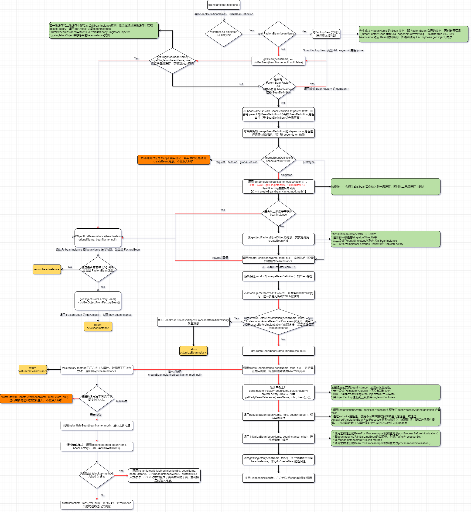

Bean 的实例化过程很复杂，重点关注三个地方：

- FactoryBean 在实例化过程中的作用。
- 三级缓存处理循环依赖。
- Bean 的生命周期。

#### 6、结束扫尾阶段

- 清除 ApplicationContext 中的缓存。
- 发布 ContextRefreshedEvent 事件：ContextRefreshedEvent 意味着 ApplicationContext 已启动完成。

### （三）启动过程中的重要接口

#### 1、BeanDefinition 相关接口

在 BeanFactory 创建阶段，使用了很多 BeanDefinition 相关接口。

（1）<font color="orange">BeanDefinition</font>

用于存储配置文件中 `<bean>` 标签对应 Bean 类的配置信息、class 类、id 名和 name 名等信息。

> Bean 类表示注册进 Spring 容器的类； BeanDefinition 接口，用于存储 Bean 类在配置文件中的配置。

（2）BeanDefinitionHolder

其实就是用于存储 Bean 的 id 名、name 名、BeanDefinition，方便将信息注册到 BeanDefinitionRegistry 的 Map 中。

（3）[BeanDefinitionRegistry](https://www.jianshu.com/p/54afb6bbeb10)

用于进行 BeanDefinition 的注册，其实内部就是维持一个 Map，用于存储 Bean 类的 id 名和对应和 BeanDefinition。

DefaultListableBeanFactory 实现了 BeanDefinitionRegistry，内部维护一个 `BeanDefinitionMap<string，BeanDefinition>`，用于存储 beanName 及其对应的 BeanDefinition。

（4）[BeanDefinitionsParserDelegate](https://juejin.cn/post/6844903694039793672#heading-4)

用于解析 XML 文件：

- 解析标签是否是 default namespace（`<import>、<alias>、<bean>、<beans>`）。
- 解析标签的属性和属性值。

#### 2、资源接口

（1）<font color="orange">Resource</font>

普通的 URL 资源定位符只基于 HTTP、FTP、File 等协议的资源定位功能，Resource 在基于以上功能外，还提供在字节流、以文件形式、文件系统、Java 的 classpath 中的资源定位功能，并统一进行封装。

通过 get 方法返回 InputStream，内部都是对传入的资源进行封装，统一返回 InputStream，消除各种来源资源的差异性。

- ByteArrayResource：将字节数组提供的数据作为资源进行封装。
- ClassPathResource：从 classpath 中加载具体资源并进行封装，使用指定的类加载器和类 class 对象对资源进行加载（getResourceAsStream()）。
- FileSystemResource：对文件系统中的文件进行封装。
- UrlResource：内部委派 URL 类进行具体的资源操作。
- InputStreamResource：对 InputStream 进行封装。

（2）ResourceLoader

用于获取对应的 Resource 对象。DefaultResourceLoader 是 ResourceLoader 的默认实现，通过 getResource()获取对应 Resource。

（3）MessageSource

国际化支持，配置不同国家语言，让 Spring 可以编译不同国家的配置文件。

#### 3、容器级生命周期接口

容器初始化 Bean 时，容器对外暴露的扩展点，可以进行动态修改。

（1）[<font color="orange">BeanFactoryPostProcessor</font>](https://www.jianshu.com/p/b45efc018bcc)

BeanFactoryPostProcessor 是 BeanFactory 的后置处理接口，提供 postProcessBeanFactory()方法，参数为 ConfigurableListableBeanFactory 类型。**可以在 BeanFactory 创建准备完成后，Bean 实例化之前，对 BeanFactory 进行操作。**例如：修改 BeanDefinition 属性。

> 若不止一个 BeanFactoryPostProcessor 实现类，还需要实现 Order 接口，设置实现类的执行顺序。

（2）[<font color="orange">BeanPostProcessor</font>](https://www.jianshu.com/p/f80b77d65d39)

**可以在 Bean 实例化、依赖注入之后、显式地初始化之前（即注册到 Spring 容器之前），对 Bean 进行操作，完成一些定制的初始化操作。**提供 postProcessBeforeInitialization()方法和 postProcessAfterInitialization()方法，分别对 Bean 进行前置/后置处理。

InstantiationAwareBeanPostProcessor 也是一个重要的接口，继承 BeanPostProcessor 接口，额外提供三个方法：

- postProcessBeforeInstantiation：在实例化之前执行，可以通过该方法自己创建并返回 Bean 实例（即返回值不为 null），跳过 Spring 系统的 Bean 实例化过程。

- postProcessAfterInstantiation：在实例化之后、依赖注入之前执行，可以通过该方法自己对 Bean 实例进行操作，返回值表示是否继续执行依赖注入。

  > 注意：如果返回值为 false，表示跳过依赖注入，跳过后续 InstantiationAwareBeanPostProcessor 的 postProcessAfterInstantiation()方法，跳过之后所有的 postProcessProperties()方法，跳过 Spring 的依赖注入。

- postProcessProperties：在实例化之后、依赖注入（Spring 已经准备好了注入的属性值）之前执行，可以修改 Bean 的依赖注入值。

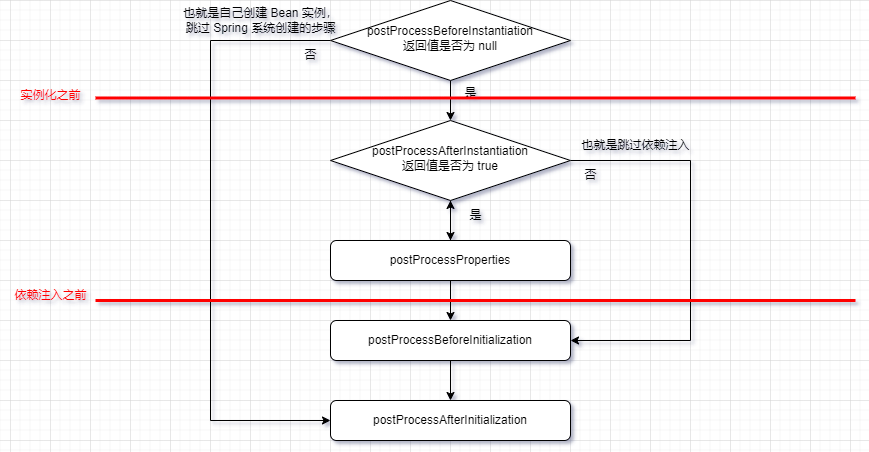

#### 4、Bean 级生命周期接口

（1）<font color="orange">Aware</font>

用于获取 Spring 容器提供的类的实例对象，提供以下接口：

- BeanNameAware：内部提供 setBeanName()方法，获取当前 Bean 的 name（也就是配置文件中的 id 属性）。
- BeanfactoryAware：内部提供 setBeanFactory()方法，获取当前容器的 BeanFactory。
- BeanClassLoaderAware：内部提供 setBeanClassLoader()方法，获取当前容器的 ClassLoader。
- ResourceLoaderAware：ApplicationContext 继承 ResourceLoader，可以获取到 ResourceLoader 类型的 ApplicationContext 实例。
- ApplicationEventPublisherAware：ApplicationContext 继承 ApplicationEventPublisher，可以获取到 ApplicationEventPublisher 类型的 ApplicationContext 实例。
- MessageSourceAware：ApplicationContext 继承 MessageSource，可以获取 MessageSource 类型的 ApplicationContext 实例。
- <font color="orange">ApplicationContextAware</font>：获取到当前 ApplicationContext 实例。

（2）<font color="orange">FactoryBean</font>

FactoryBean 是 Spring 容器提供的一种可以扩展容器实例化逻辑的接口，其实现类本身就是作为 Bean，需要注册进 BeanFactory 中，**用来生产 Bean 实例**。在实例化 Bean 的过程中，FactoryBean 会作为 Bean 注册进 BeanFactory 中，最后会调用 getObject()返回自定义的实例。

以下面例子为例：

```java
@Component
public class MyFactoryBean implements FactoryBean {


    @Override
    public Object getObject() throws Exception {
        return new A();
    }

    @Override
    public Class<?> getObjectType() {
        return A.class;
    }
}

class A {}
```

首先会在 Spring 容器中注册 MyFactoryBean 类型的 Bean，beanName 为 **&myFactoryBean**；然后调用 getObject()方法，在 Spring 容器中注册 A 类型的 Bean，beanName 为 myFactoryBean。

> 注意：beanName 对应的 Bean 类型为 getObject() 的返回类型；FactoryBean 的 beanName 为【& + beanName】。

（3）[<font color="orange">InitializingBean</font>](https://blog.csdn.net/nrsc272420199/article/details/95033223)

在 BeanPostProcessor 的 before 和 after 方法之间执行，先执行 InitializingBean 的 afterPropertiesSet()方法，后执行配置文件中的 init-method 方法。

> @PostConstruct 是 Java 定义的注解，使用在成员方法上，和 init-method 起类似作用。
>
> 三者之间执行顺序为：@PostConstruct、InitializingBean、init-method。

（4）[<font color="orange">DisposableBean</font>](https://zhuanlan.zhihu.com/p/54215879)

在执行完上面操作后，会将 DisposableBean 的实现类注册到 BeanFactory 中，不会马上执行。只有当对象实例不再被使用的时候才会执行相关的自定义销毁逻辑，也就是 Spring 容器关闭的时候执行，后执行配置文件中的 destory-method 方法。

本来 BeanFactory 和 ApplicationContext 不会自动调用 destory-method 方法，需要在合适的时机手动调用 destroySingletons()，但是 AbstractApplicationContext 中的钩子方法，实现了自动调用 destory-method 方法。

> @PreDestory 是 Java 定义的注解，使用在成员方法上，和 destory-method 起到类似的作用。
>
> 三者之间执行顺序为：@PreDestroy、DisposableBean、destroy-method。

#### 5、事件监听发布接口

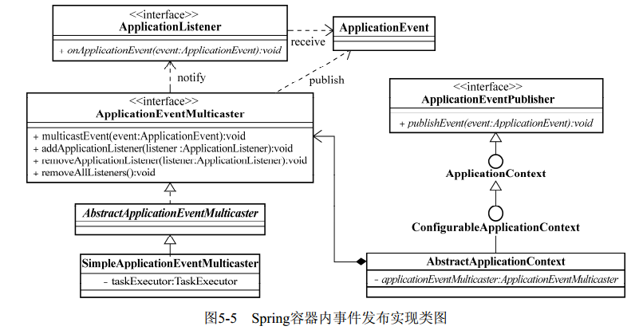

（1）<font color="orange">EventObject</font>

表示监听事件。ApplicationEvent 是 Spring 容器内自定义事件类型，继承自 EventObject，它是一个抽象类，需要根据情况提供相应的子类以区分不同情况。

（2）<font color="orange">EventListener</font>

接收并监听具体的事件，并提供相应的处理方法。Spring 提供 ApplicationListener 接口，继承自 EventListener，ApplicationContext 内使用的自定义事件监听器接口。

（3）事件发布接口

① <font color="orange">ApplicationEventPublisher</font>

ApplicationEventPublisher 通过调用 publicEvent(ApplicationEvent)方法，**通知监听对应事件的监听器**，从而调用执行监听器的 onApplicationEvent()方法。

ApplicationContext 继承自 ApplicationEventPublisher，但是它不会亲自去实现事件的发布和事件监听器的注册，而是内部维护一个 ApplicationEventMulticaster 实现类，由此接口的实现类去实现相应的功能。

> 内部维持一个监听器容器，对监听器进行注册管理。

② <font color="orange">ApplicationEventMulticaster</font>

ApplicationEventMulticaster 实现类用于实现**事件的发布**和**事件监听器的注册**。

AbstractApplicationEventMulticaster 是该接口的抽象实现类，实现事件监听器的管理功能。出于灵活性和扩展性的考虑，事件的发布功能委托给子类实现，Spring 提供 SimpleApplicationEventMulticaster 默认实现类。

### （四）[三级缓存解决循环依赖](https://www.cnblogs.com/lifullmoon/p/14422101.html#28-beanfactory-%E6%98%AF%E5%A6%82%E4%BD%95%E5%A4%84%E7%90%86%E5%BE%AA%E7%8E%AF%E4%BE%9D%E8%B5%96)

Spring 依赖有两种：

#### 1、depends-on 依赖

depends-on 属性的依赖是一种隐式的依赖，保证当前 Bean 类 depends-on 的 Bean 类**先于自己实例化，并不存在强关联关系**。在 doGetBean()中，用递归判断是否循环 depends-on 依赖，如果出现循环依赖，则抛出异常。

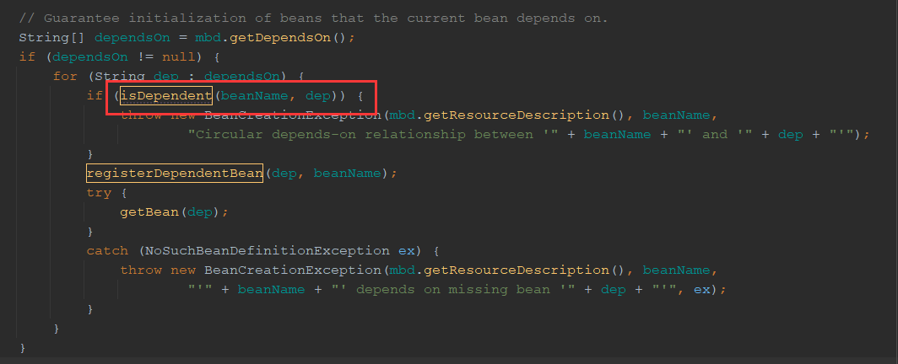

#### 2、注入依赖

注入依赖是显式的声明某种依赖关系，Spring 中提供三级缓存解决注入时循环依赖的问题：

- singletonObjects（一级缓存）：存储所有已经初始化（已实例化、已注入依赖）的**单例 Bean**。
- earlySingletonObjects（二级缓存）：存储从三级缓存中获取到的正在初始化（已实例化、正在进行依赖注入）的 Bean。
- singletonFactories（三级缓存）：存储正在初始化的 Bean 对应的 ObjectFactory 实现类。

> 注意：注意：Spring 只对 singleton 的属性注入的循环依赖提供了三级缓存解决方法；**对于构造注入和 prototype 没有提供解决方法，会抛异常**。

A 和 B 发生循环依赖时，执行步骤如下：

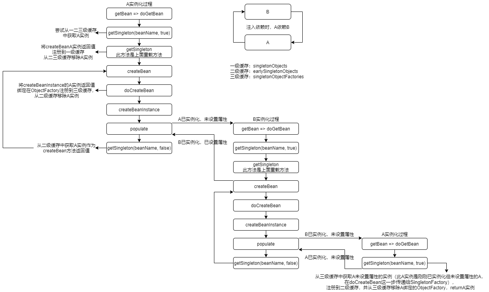

1. 尝试按顺序从一、二、三级缓存中获取 A 实例，若任一缓存获取得到 A 实例则返回；否则继续。
2. A 初始化前，生成一个 ObjectFactory 实现类存入三级缓存中，同时调用 ObjectFactory.getObject()方法进行初始化。
3. **A 进行初始化时，发现依赖 B 未初始化，此时执行 B 的初始化流程**，和步骤 1、2 一样。
4. **B 进行初始化时，发现依赖 A，**先按顺序去一、二、三级缓存中获取 A 实例，发现三级缓存中有 A 对应的 ObjectFactory，则调用 ObjectFactory.getObject()方法**获取步骤 3 中正在初始化的 A 实例，并将其存入二级缓存**，删除三级缓存中的 A 对应的 ObjectFactory。
5. **B 初始化完成**，存入一级缓存，删除二、三级缓存中 B 对应的缓存，**将实例注入 A 实例**。
6. **A 初始化完成**，删除二、三级缓存中 A 对应的缓存。

> 要理解下面两个问题，先看 doCreateBean()方法中的这段代码：
>
> 
>
> 在上面步骤 2 中，三级缓存中存储着 A 对应的 ObjectFactory；步骤 3 中 A 进行初始化时，会调用 addSingletonFactory()方法，**将原本的 ObjectFactory 替换成新的 ObjectFactory**（即 `() -> getEarlyBeanReference(beanName, mbd, bean)`；**步骤 4 中 B 调用 ObjectFactory.getObject()方法其实是新的 ObjectFactory**。
>
> getEarlyBeanReference() 方法主要作用是：当某个类进行 AOP 增强时，就会去生成此类的代理实例；否则，返回正常实例。
>
> > 注意：此步骤中的 Bean 在实例化后、依赖注入前。
>
> **（1）为什么需要二级缓存？**
>
> 例如：假如没有二级缓存，在循环依赖中一个 Bean 可能被多个 Bean 依赖，A → B（B 也依赖 A）→ C → A，根据上面的执行流程，会调用两次 A 的 ObjectFactory.getObject()方法，会重复代理，可能出现问题。
>
> 而且直接从二级缓存中获取初始化中的 A 实例，性能也会更好。
>
> **（2）[为什么不直接调用这个 ObjectFactory.getObject()方法放入二级缓存中，而是需要三级缓存？](https://juejin.cn/post/7099745254743474212)**
>
> 先了解 Spring 的一个设计原则：**AOP 代理的对象最好是成熟态（即实例化后、依赖注入后）**。
>
> **三级缓存的目的是为了延迟代理对象的创建**，正常情况下，Spring 会在依赖注入之后进行代理；发生循环依赖时，才会提前（实例化后、依赖注入前）生成代理实例。如果没有三级缓存，不管有没有发生循环依赖，A 每次都必须生成代理实例。
>
> > 也就是说：**有了三级缓存：正常情况下遵循设计原则，发生循环依赖时，不得不违背设计原则；没有三级缓存，任何时候都违背设计原则。**

### （五）Bean 的生命周期

在 Bean 实例化、依赖注入之后，会执行以下 Bean 生命周期方法，从而扩展 Bean 实例：

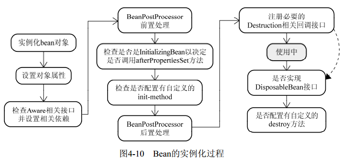

（1）执行 BeanFactory 准备阶段添加的 ApplicationContextAwareProcessor，它会检查 Aware 相关 Bean 实例并调用 setter 方法。

（2）执行 BeanPostProcessor 的 postProcessBeforeInitialization()前置处理方法。

（3）检查 Bean 是否是 InitializingBean 类型，如果是，则调用 afterPropertiesSet()方法。

（4）检查是否配置 init-method 方法，如果有，则执行。

（5）执行 BeanPostProcessor 的 postProcessAfterInitialization()后置处理方法。

（6）在 Bean 实例化阶段会注册 Destruction 相关回调接口，当 ApplicationContext 关闭/销毁时，会通过钩子函数调用这些销毁方法。

- 检查 Bean 是否是 DisposableBean 类型，如果是，则调用 destroySingletons()方法。
- 检查是否配置 destroy-method，如果有，则执行。

### （六）获取 Bean 的不同实例

由于 Bean 被 Spring 容器拥有并创建实例，当 Bean 为单例时，若我们仍想获取非单例的 Bean 时，有以下几种方式：

#### 1、工厂方法注入

虽然对象可以通过声明接口来避免对特点接口实现类的过度耦合，但是实例化时仍需要指定具体实现类。当需要依赖第三方库实例时，不能注册第三方库 Bean，需要引入工厂方法模式。

Spring 提供一个工厂类来实例化具体的接口实现类，也是依赖注入的另外一种方式。

（1）静态工厂方法属性 factory-method

工厂类的获取实例化对象的方法为静态方法，factory-method 属性指定静态方法

```java
// 静态工厂方法代码样例
public class StaticBarInterfaceFactory {
    // 需要注册的第三方库类
    public static BarInterface getInstance() {
        return new BarInterfaceImpl();
    }
}
```

```xml
<!-- 配置文件 -->
<bean id="bar" class="...StaticBarInterfaceFactory" factory-method="getInstance"/>

<bean id="foo" class="...Foo">
    <property name="barInterface">
        <ref bean="bar"/>
    </property>
</bean>
```

（2）实例工厂方法属性 factory-bean 和 factory-method

工厂类的获取实例对象的方法为非静态方法，需要先实例化工厂类，再使用指定的非静态方法，需要另外的 `<bean factory-bean="工厂类 Bean 的 id"` 指定工厂类实例。

```java
// 实例工厂方法代码样例
public class NonStaticBarInterfaceFactory {
    public BarInterface getInstance() {
        return new BarInterfaceImpl();
    }
}
```

```xml
<!-- 配置文件 -->
<bean id="barFactory" class="...NonStaticBarInterfaceFactory"/>
<bean id="bar" factory-bean="barFactory" factory-method="getInstance"/>

<bean id="foo" class="...Foo">
    <property name="barInterface">
        <ref bean="bar"/>
    </property>
</bean>
```

> 区别很明显：实例工厂方法属性的方法非 static，需要先注册工厂类，再使用指定的非静态方法。

#### 2、[方法注入](https://www.jianshu.com/p/e27df48a6c7c)

当生命周期长（单例）的 Bean，持有生命周期短（原型）的 Bean，生命周期短的 Bean 不会被销毁，BeanFactory 不会生产新的生命周期短的 Bean，每次获取都会获取到同一个 Bean。

长生命周期的 Bean 依赖短生命周期 Bean 的问题代码样例：

```java
public class MockNewsPersister implements IFXNewsPersister {

    private FXNewsBean newsBean;

    public void persistNews(FXNewsBean bean) {
        persistNewes();
    }

    public void persistNews() {
        System.out.println("persist bean:" + getNewsBean());
    }

    public FXNewsBean getNewsBean() {
        return newsBean;
    }

    // 由于依赖注入的 Bean 一直被持有，不会被销毁，BeanFactory 也不会生产新的 Bean 实例
    public void setNewsBean(FXNewsBean newsBean) {
        this.newsBean = newsBean;
    }
}
```

```xml
<!-- 改为原型模式 -->
<bean id="newsBean" class="..domain.FXNewsBean" singleton="false"/>

<bean id="mockPersister" class="..impl.MockNewsPersister">
    <property name="newsBean">
        <ref bean="newsBean"/>
    </property>
</bean>
```

[方法注入的格式和原理](https://yq.aliyun.com/articles/760100)：

- 获取生命周期短的方法格式如下：`<public|protected> [abstract] <return-type> theMethodName(no-arguments);`。
- 容器创建长生命周期类时，通过 CGLib 动态代理实现，调用指定方法时，生成生命周期长类的子类，我们拿到的也是这个子类的 Bean，此子类 Bean 生命周期短。

```xml
<!-- 方法注入的配置 -->
<bean id="newsBean" class="..domain.FXNewsBean" singleton="false"/>

<bean id="mockPersister" class="..impl.MockNewsPersister">
    <!-- 指定方法名和 Bean -->
    <lookup-method name="getNewsBean" bean="newsBean"/>
</bean>
```

#### 3、FactoryBean

实现 FactoryBean 接口，并重写 getObject()方法。

```java
// FactoryBean代码样例
// FactoryBean接口提供以下三个方法
public class NextDayDateFactoryBean implements FactoryBean {
    public Object getObject() throws Exception {
        return new DateTime().plusDays(1);
    }

    public Class getObjectType() {
        return DateTime.class;
    }
    // 改为原型模式
    public boolean isSingleton() {
        return false;
    }
}
```

```xml
<!-- 注册FactoryBean实现类 -->
<bean id="nextDayDate" class="...NextDayDateFactoryBean"/>

<bean id="nextDayDateDisplayer" class="...NextDayDateDisplayer">
    <property name="dateOfNextDay">
        <ref bean="nextDayDate"/>
    </property>
</bean>
```

> 注意：依赖注入后，产生的不是 FactoryBean 对象，而是 getObject()返回的对象。

#### 4、BeanFactoryAware

BeanFactoryAware 的实现类获取到 BeanFactory，调用 getBean(string)每次都可以获取新的 bean。

```java
// BeanFactoryAware样例代码
public class MockNewsPersister implements IFXNewsPersister, BeanFactoryAware {
    private BeanFactory beanFactory;
    private FXNewsBean newsBean;

    public void setBeanFactory(BeanFactory bf) throws BeansException {
        this.beanFactory = bf;
    }

    public void persistNews(FXNewsBean bean) {
        persistNews();
    }

    public void persistNews() {
        System.out.println("persist bean:" + getNewsBean());
    }

    // 通过BeanFactory获取注册的bean
    public FXNewsBean getNewsBean() {
        return beanFactory.getBean("newsBean");
    }
}
```

```xml
<!-- 改为原型模式 -->
<bean id="newsBean" class="..domain.FXNewsBean" singleton="false"/>

<bean id="mockPersister" class="..impl.MockNewsPersister"/>
```

## 六、疑问

### （一）bean 类是什么

Spring 的 Bean 类可以理解为：可以被 Spring 控制创建时机和管理生命周期的类。不论是 Spring 自身的类，还是用户自定义的类，只要可以被 Spring 识别并注册到 Spring 容器中，都叫 Bean 类。

### （二）BeanFactoryPostProcessor 和 BeanPostProcessor 的区别

- BeanFactoryPostProcessor 是在 Bean 实例化之前，主要是对 BeanDefinition 的修改，修改从配置文件读取的类似于 `<bean/>的属性和<property/>` 关于 Bean 的配置信息，例如：lazy-init、depends-on 等。
- BeanPostProcessor 是在 Bean 实例化之后，显示的 getBean()之前，对 Bean 本身属性的修改

### （三）@Resource、@PostConstruct、@PreDestroy 等 Java 自定义的注解为什么不起作用

Java 自定义的注解需要手动配置到配置文件中才能使用：

- `<bean class="org.springframework.context.annotation.CommonAnnotationBeanPostProcessor"/>`。
- `<context:annotation-config/>` 激活注解的相关功能。

### （四）[动态代理中类为什么需要实现接口](https://www.javazhiyin.com/31257.html)

动态代理过程中会生成当前类的代理类$Proxy，继承Proxy。若需要代理类与被代理类相关联，需要继承同一父类或实现同一接口，而代理类$Proxy 已继承 Proxy，只能实现同一接口。因此被代理类需要实现接口，运行期生成$Proxy过程中，会让$Proxy 自动实现同一接口。

### （五）[为什么 CGLIB 使用 invoke 会栈溢出](https://juejin.im/post/6844904054779281415)

简单总结是，调用 invoke 方法会调用 CGLIB 生成的子类的方法，子类方法又会再一次调用本身的这个方法，循环调用此方法发生栈溢出；调用 invokeSuper 调用原始类的方法。

### （六） 通过 @Bean 注解定义在方法上面注入一个 Spring Bean，每次调用该方法所属的 Bean 的这个方法，得到的是同一个对象吗？

```java
@Configuration
public class MyConfiguration {

    @Bean
    public A a() {
        return new A();
    }

    @PostConstruct
    public void init() {
        System.out.println("MyConfiguration init");
        A a1 = a();
        A a2 = a();
        System.out.println("a1 == a2: " + (a1 == a2)); // true
    }
}
```

上面调用两次 a()方法，按照传统观念来说，应该 new 两次，生成两个 A 对象，但是却从结果发现 **a1 == a2**。

其实 @Configuration 注解的类被 CGLIB 增强，会设置一个拦截器专门对 @Bean 方法进行拦截处理，通过依赖查找的方式从 IoC 容器中获取 Bean 对象，**如果是单例 Bean，那么每次都是返回同一个对象**。
