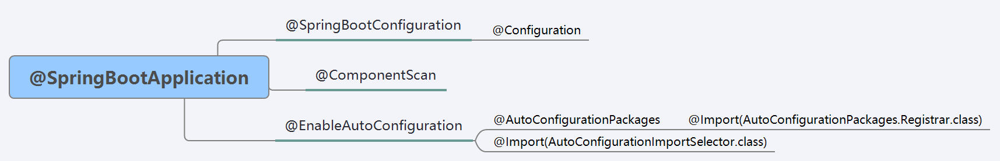

# SpringAnnotation

> 用于记录使用过程中出现的所有注解。

## 一、Spring 注解

### （一）@Component

被 @Component 标注的类，在 Spring 开启 ComponentsScan 的时候，会自动注册为 Spring 的 bean。内有 value 属性，用于设置 Bean 的 id。例如：`@Component(value="myInterface")`。

@Component 是 Spring 的元注解，被它标注的注解有类似的功能：

- @Controller
  - @RestController
- @Service
- @Repository

#### 1、[@PreConstruct](https://www.iteye.com/blog/sexycoding-1046993)

主要作用于被 @Component 及相关注解所在的类的成员方法上，是 Spring Bean 生命周期中，bean 被调用之前执行的方法。是 jsr 提供的注解。

> 执行顺序：@PostConstruct、InitializingBean、init-method

#### 2、@PreDestory

主要作用于被 @Component 及相关注解所在的类的成员方法上，是 Spring Bean 生命周期中，bean 被销毁时执行的方法。是 jsr 提供的注解。

> 执行顺序：@PreDestroy、DisposableBean、destroy-method

### （二）[@Import](https://blog.csdn.net/tuoni123/article/details/80213050)

主要作用在 Bean 类上，将指定的类注册到 Spring IoC 容器中。

```java
// 注册 class A 时，同时 @Import(B.class) 注册 class B
@Import(B.class)
@Component
class A {
    A() {}
}
```

也可以让被 import 的类（例如：上个例子的 class B）实现 ImportantBeanDefinitionRegistrar 或 ImportSelector，实现两个接口可以实现更自由的 Bean 注册。

### （三）@ComponentScan

默认扫描当前包及子包，也可以使用 `@ComponentScan(com.note.study)` 的形式指定扫描的包。将指定包下的 @Component 注解的类注册到 Spring。

### （四）@Autowired

用于注入 Spring Bean 实例，使用的是 byType 的形式。

若 @Autowired 注解在接口类型属性上，会自动寻找此接口的实现类。若此接口没有实现类或实现类没有被 Spring 管理或有多个实现类，则会报错。

提供 required 属性，默认为 true。设置 `@Autowired(required = false)`，没有找到对应的 Bean 时，不会报错，而是将此属性设置为 null。

#### 1、@Qualifier

也是用于注入 Spring Bean 实例，使用的是 byName 的形式，需要传入 Spring Bean 的 id 值。修饰成员变量时，不能单独使用，要和 @Autowired 同时使用，注解必须要添加 value 属性。

```java
@Autowired
@Qualifier(value="myInterface")
private MyInterface myInterface;
```

> 使用 byName 查找 Bean 的形式会比 byType 快。

#### 2、@Resource

相当于 @Autowired 和 @Qualifier 同时使用，是 jsr 提供的注解。

在不传入值时，会先根据当前变量的名字，通过 byName 获取 bean；若传入 name 值时，根据 byName 获取 bean；若以上都没有获取到值，则进行 byType 的形式。

#### 3、@Inject

相当于 @Autowired 注解，通过 byType 注入，不过没有 required 属性，是 JSR 提供的注解。

可以和 @Named 配合使用，和 @Autowired + @Qualifier 一样的作用。

```java
@Inject
@Named(value="myInterface")
private MyInterface myInterface;
```

### （五）[@Value](https://blog.csdn.net/hry2015/article/details/72353994)

用于注入其他类型属性值（和 @Autowired 注入 Bean 实例不同）。

#### 1、注入属性类型

##### （1）普通字符串

- 普通字符串。
- 文件资源或 URL 资源地址。

##### （2）表达式结果

通过使用【"#{SpEl 表达式}"】，将表达式结果注入为属性值。

① 注入非 String 类型属性值

```java
@Value("#{98.5}")
float score;

@Value("#{ T(java.lang.Math).random() \* 100.0 }")
double randomNumber;
```

② 注入其他 Bean 属性值

```java
@Value("#{beanInject.another}")
String fromAnotherBean;
```

③ 操作系统属性

```java
@Value("#{systemProperties['os.name']}")
String systemPropertiesName;
```

④ [获取配置文件的值](https://blog.csdn.net/weixin_42551921/article/details/105503458)

```java
@Value("#{${test.map}}")
Map<String, Object> testMap;
```

##### （3）配置文件属性

通过使用【"${配置文件属性}"】，将配置文件属性值注入为属性值

> 注意：@Value 的参数值只能是 String 类型，但是可以通过#{}或${}获取其他类型的属性值。

#### 2、[@PropertySource](https://blog.csdn.net/qq_37312838/article/details/108237678)

将指定的配置文件（properties）加载到 Spring 的 Environmen 中。value 值为的【file:】或【classpath:】地址。

- 配合 @Value 使用，将配置文件属性值注入为属性值。
- 配合 @ConfigurationProperties 使用。

### （六）[@ConfigurationProperties](https://blog.csdn.net/superfjj/article/details/104258460)

将配置文件属性值注入到该类所有对应的属性上，若不使用 @PropertySource 注解指定配置文件，则默认读取 `classpath:application.properties` 配置文件。

```java
// 读取 application.yml 中前缀为 elasticsearch 的属性值
@Component
@PropertySource(value = "classpath:application.yml")
@ConfigurationProperties(prefix = "elasticsearch")
public class EsProperties {
    private String servers;
    private String username;
    private String password;
}
```

#### 1、[@EnableConfigurationProperties](https://segmentfault.com/a/1190000018987185?utm_source=tag-newest)

当被 @ConfigurationProperties 注解的类没有注册为 Bean 时，@EnableConfigurationProperties 会将 value 中指定的、被 @ConfigurationProperties 注解的配置类，注册为 bean。

> 注意：
>
> - @EnableConfigurationProperties 所在的类需要为 Bean 类。
> - @PropertySource 默认不支持读取 yaml 文件，需要自定义 [yaml 解析工厂](https://blog.csdn.net/qq_40837310/article/details/106587158)，并且添加到@PropertySource 的 factory 属性。

#### 2、[@ConfigurationPropertiesScan](https://cloud.tencent.com/developer/article/1657058)

使用 @EnableConfigurationProperties 一个一个地注册配置类，可能导致工作量增多。可以直接在 SpringBoot 启动类中，使用 @ConfigurationPropertiesScan 扫描指定包下的被 @ConfigurationProperties 注解的类，将其注册为 bean。

```java
@SpringBootApplication
// 扫描 config 包下被 @ConfigurationProperties 注解的配置类
@ConfigurationPropertiesScan("com.my.config")
public class ConfigPropApp {
    public static void main(String[] args) {
        SpringApplication.run(ConfigPropApp.class,args);
    }
}
```

#### 3、[@NestedConfigurationProperty](https://blog.csdn.net/u013541707/article/details/113193128)

@ConfigurationProperties 只能将简单的数据类型（例如：String、Integer）注入到配置类的属性，对于复杂数据类型（例如：自定义对象），可以使用 @NestedConfigurationProperty 将其注入到指定属性中。另外，使用了这个注解的属性的类型，代表是不在本文件中，而是在其他地方。

```properties
spring.datasources.test.username=admin
spring.datasources.test.password=123456
spring.datasources.test.url=url
spring.datasources.test.driver=com.mysql
spring.datasources.duration=5
```

```java
@Data
@ConfigurationProperties(value = "spring.datasources", ignoreInvalidFields = true, ignoreUnknownFields = false)
@Component
public class DataSourceProperties {
    @NestedConfigurationProperty
    private DataSource test;

    /**
     * 不写单位默认按照毫秒
     */
    @DurationUnit(ChronoUnit.DAYS)
    private Duration duration;
}

// 在另外一个 Java 文件中
@Data
public class DataSource {
    private String url;
    private String username;
    private String password;
    private String driver;
}
```

#### 4、[@ConfigurationPropertiesBindling](https://cloud.tencent.com/developer/article/1809381)

SpringBoot 提供的自定义配置文件转换器注解，可以将配置文件中的配置值转换成其他类型。

```yaml
# 一个人有多条狗，狗有自己的品种和名字
person:
  dogs:
    husky: '{"name":"erha","age":3}'
    corgi: '{"name":"pipi","age":4}'
```

```java
@Data
@ConfigurationProperties(prefix = PersonApplicationConfig.PREFIX)
public class PersonApplicationConfig {

    public static final String PREFIX = "person";

    @NestedConfigurationProperty
    private Map<String, Dog> dogs;

    @Data
    public class Dog {
        private String name;

        private Integer age;
    }
}

// 必须注册为 Bean
@Component
@ConfigurationPropertiesBinding
public class DogConvert implements Converter<String, PersonApplicationConfig.Dog> {
    @Override
    public PersonApplicationConfig.Dog convert(String source) {
        // 将字符串转化为 Dog 类
        return JSONObject.parseObject(source, PersonApplicationConfig.Dog.class);
    }
}
```

### （七）[@Configuration](https://www.lagou.com/lgeduarticle/45996.html)

被 @Configuration 注解的类称为配置类，相当于 XML 配置文件。配置文件中使用 `<context:annotation-config/>`，注解生效。

[原理](https://blog.csdn.net/sundacheng1989/article/details/92783515)：

- 被 @Configuration 注解的类，其实生成 CGLIB 代理类实例，对 @Bean 修饰的方法进行增强。
- 获取被 @Bean 注解的方法返回的 Spring Bean 实例时，会先查看 Spring 容器中是否有此 Bean 实例，若没有，则创建；若有，则返回。

#### 1、[@EnableAutoConfiguration](https://blog.csdn.net/zxc123e/article/details/80222967)

将符合条件（若有 @Condition 注解）的配置类（@Configuration 注解的类）都注册为 bean，主要是用来实现自动配置。

### （八）[@Bean](https://blog.csdn.net/qq_33036061/article/details/100831244?utm_medium=distribute.pc_relevant.none-task-blog-baidujs_title-0&spm=1001.2101.3001.4242)

通过是放在@Configuration 注解的类的方法上，相当于 `<bean>` 标签，方法的返回值是 Spring bean。

- id 属性默认是方法名，也可以使用 name 属性配置。
- initMethod 和 destoryMethod 属性，可以指定创建和销毁时调用的方法。
- 若是注解的方法带参数时，参数取值有两种：
  - 若参数类型 Bean 在 Spring IoC 容器中只有一个，则 byType 取值。
  - 若参数类型 Bean 有多个，则按照参数变量名对应的 Bean id 取值，也可以给参数添加@Qualifier 指定 Bean id。

#### 1、@Scope

@Scope 可以修饰：@Component、@Configuration（作用该类及下所有 @Bean）、@Bean。主要有以下值：

- singleton
- prototype
- request
- session

#### 2、@Lazy

@Lazy 可以修饰：@Component、@Configuration（作用在该类及下所有 @Bean）、@Bean，表示该 Spring Bean 懒加载。

#### 3、@DependsOn

@DependsOn 可以修饰：@Component、@Configuration（作用在该类及下所有 @Bean）、@Bean，表示先加载依赖的类。

> 注意：这个依赖不是注入依赖，而只是想让 DependsOn 的类先被加载。

#### 4、[@Primary](https://blog.csdn.net/niugang0920/article/details/116275748)

当有多个相同类型的 Bean 时，使用 @Primary 来赋予 Bean 更高的优先级，用于修饰 @Bean、@Component。

若 Spring 中有多个相同类型的 bean，直接使用 @Autowired 或 @Resource 并且没有指定 Bean 的 name 时，Spring 会抛出 NoUniqueBeanDefinitionException 的异常。使用 @Primary 可以在没有指定 Bean 的 name 时，优先选择被 @Primary 注解的 bean，相当于设置为此类型默认的 bean。

```java
@SpringTest
@Configuration
public class PrimaryConfig {

    @Bean
    public Employee zhangSanEmployee() {
        return new Employee("张三");
    }

    @Bean
    // 此 Bean 的优先级更高
    @Primary
    public Employee liSiEmployee() {
        return new Employee("李四");
    }

    @Test
    public void test1() {
        AnnotationConfigApplicationContext context
            = new AnnotationConfigApplicationContext(PrimaryConfig.class);

        Employee employee = context.getBean(Employee.class);
        System.out.println(employee); //Employee(name=李四)
    }
}
```

### （九）[@Async](https://www.cnblogs.com/huanzi-qch/p/11231041.html)

用于异步调用的注解，作用在方法或类上（作用在类上时，表示类中的所有方法是异步的），这些方法在执行的时候，将会在独立的线程中执行。内有 value 属性，可以指定线程池。

[@Async 处理异常的方式](https://blog.csdn.net/asdfsadfasdfsa/article/details/85252287)

> 注意：
>
> - 异步方法必须是 public，返回值是 void 或 Future。
> - 需要在启动类或配置类上添加 @EnableSync 来开启异步。
> - @Async 注解的类被 Spring 管理，也就是类还要另外添加 @Component 等相关注解。

### （十）[@Validated](https://cloud.tencent.com/developer/article/1776567)

可以放在类、属性和方法上，表示开启了验证功能，具体的验证功能由 [@Max、@Min](https://blog.csdn.net/zhenwei1994/article/details/81460419) 等标签控制。

> @Validated 和 @Valid 最主要的区别是 @Validated 提供分组验证的功能。

```java
// 两个空接口，用于表示两个分组
public interface BasicInfo {
}

public interface AdvanceInfo {
}

@Data
public class UserAccount {
    @NotNull(groups = BasicInfo.class)
    // group 属性用于指定分组
    @Size(min = 4, max = 15, groups = BasicInfo.class)
    private String password;

    @NotBlank(groups = BasicInfo.class)
    private String name;

    @Min(value = 18, message = "Age should not be less than 18", groups = AdvanceInfo.class)
    private int age;

    @NotBlank(groups = AdvanceInfo.class)
    private String phone;
}
```

```java
@RequestMapping(value = "/saveBasicInfoStep1", method = RequestMethod.POST)
public String saveBasicInfoStep1(
  // 使用时表明只对在 BasicInfo 分组中的字段进行验证
  @Validated(BasicInfo.class)
  @ModelAttribute("useraccount") UserAccount useraccount,
  BindingResult result, ModelMap model) {
    if (result.hasErrors()) {
        return "error";
    }
    return "success";
}
```

### （十一）[@EventListener](https://blog.csdn.net/baidu_19473529/article/details/97646739)

应用在方法上，被注解的方法会在事件发布接口实现类调用 publicEvent(ApplicationEvent)方法时执行。

```java
@Slf4j
public class MyApplicationEvent extends ApplicationEvent {
    public MyApplicationEvent(Object source) {
        // ApplicationEvent 没有无参构造
        super(source);
        log.info("I am ApplicationEvent");
    }
}

@Slf4j
@Component
public class Demo07_EventListener {

    // @EventListener 注解也可以传入多个 ApplicationEvent 类，表示同时监听多个事件
    @EventListener
    public void executeEventListener(MyApplicationEvent event) {
        log.info("发布的事件为：{}", event);
    }

}

// 实现 ApplicationContextAware 获取 ApplicationContext
@SpringBootTest
public class Demo09_EventListenerTest implements ApplicationContextAware {

    // ApplicationContext 也继承 ApplicationEventPublisher
    private ApplicationContext context;

    @Override
    public void setApplicationContext(ApplicationContext applicationContext) throws BeansException {
        this.context = applicationContext;
    }

    @Test
    void eventListenerTest () {
        // 发布事件
        context.publishEvent(new MyApplicationEvent(this));
    }
}
```

## 二、SpringWeb 注解

### （一）@RequsetMapping

用于将 url 请求映射到特定的处理请求的方法，可以同时作用在类和方法上。内有 value 属性，设置请求路径。

- 作用在类上时，请求时要在方法级别的前加上类的 requestMapping。
- 默认情况下，RequestMapping 可以接收 GET 和 POST 请求。

注解提供了 method 属性（属性值为 RequestMethod 枚举类的属性），只能接收指定的请求方式。

#### 1、@PostMapping

作用在方法上，只能接收 POST 请求，相当于 @RequestMapping(RequestMethod.POST)，内有 value 属性。

#### 2、GetMapping

作用在方法上，只能接收 GET 请求，相当于 @RequestMapping(RequestMethod.GET)，内有 value 属性。

### （二）@RequestParam

用于将 GET 请求的参数绑定到方法中的参数上，作用在方法的形参上。内有 value 属性，表示请求的参数名。

若方法中的形参和请求的参数同名时，则默认直接绑定；若方法中的形参和请求的参数不同名时，则使用@RequestParam 注解。

```java
// 请求 myTestUrl?name=myName
// 1、若方法中的形参和请求的参数同名时，则直接将请求中的 name 值绑定给 myName。当然也可以使用 @RequestParam
public String handlerRequest(String name) {

}

// 请求 myTestUrl?name=myName
// 2、若方法中的形参和请求的参数不同名时，例如将 name 绑定为形参 myName
public String handlerRequest (@RequestParam(value = "name") String myName) {

}
```

内部还有 required 属性，默认情况下为 true，表示该参数必须要传。

### （三）[@PathVariable](http://www.360doc.com/content/19/1208/14/19913882_878267525.shtml)

用于将请求路径中的参数绑定到方法中的参数上，作用在方法的形参上。内有 value 属性，表示要绑定的请求路径中的 url 变量

> 注意：和上面 @RequestParam 的区别是，@PathVariable 是将【请求路径中的参数】，非【请求的参数】，绑定给形参。例如：`/myTestUrl/myName`，将 name 放在请求路径中，而不是放在 `?` 后。

```java
// @PathVariable 注解示例
// 例如：【/myTestUrl/myName/29】
@RequestMapping(value="/myTestUrl/{name}/{age}")
public String handler(@PathVariable(value="name") String myName, @PathVariable(value="age") int myAge) {

}
```

### （四）[@RequestBody](https://blog.csdn.net/justry_deng/article/details/80972817/)

用于接收前端请求体中的 json 字符串或 XML 数据，作用在方法的形参上。将 json 字符串其赋值给字符串类型的形参，或封装到对象形参中。

> 注意：
>
> - GET 请求中，Spring MVC 会自动直接会将 url 中的数据封装给对象的对应键。数据不在请求体中，不能使用 @RequestBody 注解封装数据。
> - 调用 POJO 类的 setter 方法，将对应键名赋值给类属性；若没有对应属性名，则不会赋值。

### （五）@ResponseBody

将 controller 的方法返回的对象通过适当的转换器转换为指定的格式之后，写入到 response 对象的 body 区，通常用来返回 JSON 数据或者是 XML 数据，作用在类或方法上。

### （六）@RestController

相当于 @Controller + @ResponseBody，类中所有的方法返回值，转换为 json 或 XML 写入响应体中。作用在类上。

## 三、SpringBoot 注解

### （一）[@SpringBootTest](https://www.cnblogs.com/myitnews/p/12330297.html)

@SpringBootTest 可以启动 Spring 容器，让测试代码相当于运行于 Spring 环境上

> 注意：在 SpringBoot 2.0.4 的测试类需要添加 `@RunnWith(SpringRunner.class)` 注解设置额运行环境，在 2.5.2 不需要。

### （二）@Conditional

@Conditional 是 Spring 提供的注解，是条件注解，表示满足某种条件才会执行下一个操作。一般和 @Bean 同用，当 Spring 容器中存在指定的 Condition 实现类，且实现类的 matches()方法返回 true，才会注册 @Bean 所在方法的 bean。

```java
@Component
public class Demo01_MagicCondition implements Condition {
    /**
     * Description: 测试在application.properties中存在magic配置且为true时，注册 @Bean所在的方法的bean
     *
     * @param context  Spring中的上下文相关信息，例如：BeanDefinetionRegistry、Environment等
     * @param metadata 可以获取指定类上的注解信息
     */
    @Override
    public boolean matches(ConditionContext context, AnnotatedTypeMetadata metadata) {
        // 从application.properties判断是否有magic，并且magic为true
        Environment env = context.getEnvironment();
        if (!env.containsProperty("magic")) {
            return false;
        }
        return "true".equals(env.getProperty("magic"));
    }
}

@Configuration
public class Demo02_MagicConditionConfig {

    // @Conditional 注解，当 Spring 容器中存在指定的 Condition 实现类的 Bean，且实现类的matches()方法返回true，才会注册 @Bean 注解所在方法的 Bean
    @Conditional(Demo01_MagicCondition.class)
    @Bean
    public CustomBean customBean() {
        return new CustomBean();
    }

    public class CustomBean {

    }
}
```

SpringBoot 提供了许多 @Conditionalxxxxxx 注解，用于对 @Conditional 进行扩展，提供更多的功能：

#### 1、[@ConditionalOnMissingBean](https://blog.csdn.net/xcy1193068639/article/details/81517456)

用于判断 value 值对应的类型，是否在 Spring IoC 容器中有一个或多个 bean，若没有则会注册 bean。

#### 2、[@ConditionalOnProperty](https://blog.csdn.net/sqlgao22/article/details/96476754)

用于判断配置文件中是否有指定的键值。有三个属性：

- prefix：配置文件中的前缀。
- name：配置的键名。
- havingValue：指定键名对应的键值，两个值相同时为 true。

```java
@Configuration
public class FilterConfig {
    // myValue 和 myName 对应的值相同时，注册 Bean
    @ConditionalOnProperty(prefix = "myPrefixName", name = "myName", havingValue = "myValue")
    @Bean
    public SmsService getSmsService() {
        ...
    }
}
```

### （三）@SpringBootApplication

@SpringBootApplication 注解上有三个关键注解：@SpringBootConfiguration、@ComponentScan、@EnableAutoConfiguration。



#### 1、@SpringBootConfiguration

@SpringBootConfiguration 是 SpringBoot 提供的注解，它上面添加了 @Configuration，表示该注解所在的类是个配置类。

#### 2、@ComponentScan

用于扫描指定包下的 @Component（包括 @Service、@Controller 等） 注解所在的类，将其注册进 Spring 容器内成为 Bean 类。

#### 3、@EnableAutoConfiguration

@EnableAutoConfiguration 是 SpringBoot 提供的注解，它上面有了两个关键的注解 @AutoConfigurationPackage 和 @Import(AutoConfigurationImportSelector.class)。

##### （1）@AutoConfigurationPackage

@AutoConfigurationPackage 是 SpringBoot 提供的注解，它上面添加了 @Import(AutoConfigurationPackages.Registrar.class)，它主要是将注解所在类的 package 包，映射成一个 Bean 类注册进 Spring 容器中。

##### （2）@Import(AutoConfigurationImportSelector.class)

@Import(AutoConfigurationImportSelector.class) 注解会将 AutoConfigurationImportSelector 类注册进 Spring 容器，[AutoConfigurationImportSelector](https://www.cnblogs.com/zfcq/p/16751351.html) 执行以下操作：

- 通过 ClassLoader.getResources() 查找 classpath 以及依赖中的 `META-INF/spring.factories` 文件，获取 key 为 `org.springframework.boot.autoconfigure.EnableAutoConfiguration` 对应的 value 值，即众多**自动配置类的类名**。
- 根据 @EnableAutoConfiguration 注解中的 exclude 和 excludeName 属性值，**过滤掉指定的自动配置类**。
- 根据 @Conditional 相关注解，**过滤掉不满足 @Conditional 条件的自动配置类**。
- 最后存储这些自动配置类的类名，以供之后的操作。

## 四、SpringCloud

### （一）@EnableEurekaServer 和 @EnableEurekaClient

@EnableEurekaServer 作用于启动类上，声明当前项目是 Eureka 服务注册发现中心的 Server 端。

@EnableEurekaClient 作用于启动类上，声明当前项目是 Eureka 服务注册发现中心的 Client 端，并将当前服务注册到 Eureka，当然也可以取消注册：

```yml
eureka:
  client:
    register-with-eureka: false # 是否注册进 eureka 服务注册中心，默认 true
```

### （二）[@EnableDiscoveryClient](https://www.cnblogs.com/lm970585581/p/13066729.html)

@EnableDiscoveryClient 用于将当前服务注册到服务注册发现中心，和 @EnableEurekaClient 的功能一致，区别是：

- @EnableEurekaClient 只适用于 Eureka 。
- @EnableDiscoveryClient 适用于实现了 spring-cloud-commons 提供的 ServiceRegistry 接口的服务注册发现中心，例如：Eureka、ZooKeeper、Consul、Nacos 等。

在新版本的 [SpringCloud](https://cloud.spring.io/spring-cloud-static/Hoxton.SR1/reference/htmlsingle/#discovery-client) 中，@EnableDiscoveryClient 已经不是必需的，只要 classpath 中存在 DiscoveryClient 的实现就可以保证将应用注册到注册中心了，当然也可以取消注册：

```yml
spring:
  cloud:
    discovery:
      enabled: false
```

### （三）[@LoadBalanced](https://blog.csdn.net/meser88/article/details/121493730)

@LoadBalanced 是一个用于 RestTemplate、WebClient、Feign 等 HTTP 客户端的注解，用于声明这个客户端具有负载均衡的能力。

```java
@Bean
@LoadBalanced
// 赋予 RestTemplate 负载均衡能力，需要通过服务名进行请求
public RestTemplate restTemplate() {
    return new RestTemplate();
}

// 通过服务名，而不是具体的 HTTP 地址进行请求
private static final String PAYMENT_URL = "http://CLOUD-PAYMENT-SERVICE";
// private static final String PAYMENT_URL = "http://localhost:8001";

@GetMapping("/payment/get/{id}")
public CommonResult<Payment> get(@PathVariable("id") Long id) {
    return restTemplate.getForObject(PAYMENT_URL + "/payment/get/" + id, CommonResult.class);
}
```

原理（以 Ribbon 为例）：

- LoadBalancerAutoConfiguration 会去获取 @LoadBalanced 注解的 RestTemplate bean 类。
- LoadBalancerInterceptor 去获取 Ribbon 策略实例。
- Ribbon 策略实例再通过服务名获取到服务实例地址，用这个地址替换掉 RestTemplate 请求时 HTTP 中的服务名，再进行请求。

### （四）@RibbonClients 和 @RibbonClient

Ribbon 提供 @RibbonClient 注解，用于为指定的服务设置自定义配置，其中有两个属性：

- name：服务注册发现中心的服务名。
- configuration：自定义的配置类。

```java
@Configuration
protected static class FooConfiguration {
    @Bean
    public ZonePreferenceServerListFilter serverListFilter() {
        ZonePreferenceServerListFilter filter = new ZonePreferenceServerListFilter();
        filter.setZone("myTestZone");
        return filter;
    }

    @Bean
    public IPing ribbonPing() {
        return new PingUrl();
    }

    @Bean
    public IRule myRule() {
        return new RoundRobinRule(); // 定义为随机
    }
}
```

```java
package com.atguigu.springcloud;

@SpringBootApplication
// 声明自己是 eureka 客户端
@EnableEurekaClient
// 指定自定义的配置
@RibbonClient(name = "CLOUD-PAYMENT-SERVICE", configuration = com.atguigu.myrule.FooConfiguration.class)
public class OrderMain80 {

    public static void main(String[] args) {
        SpringApplication.run(OrderMain80.class, args);
    }
}
```

可以注意到：启动类 OrderMain80 位于 `com.atguigu.springcloud` 包，而自定义配置类 FooConfiguration 位于 `com.atguigu.myrule` 包，为什么 FooConfiguration 不放在 `com.atguigu.springcloud` 包下呢？

项目启动时 @ComponentScan 会扫描同包及包下的**相同类型的 Bean**，会覆盖掉默认配置，而我们只想单独为 CLOUD-PAYMENT-SERVICE 服务设置一个 FooConfiguration 配置。如果放在 `com.atguigu.springcloud` 包下，则会覆盖掉默认的配置，相当于会对所有的服务生效。

> 注意：是相同类型的 Bean，不是相同名称的 Bean。

此外 Ribbon 还提供 @RibbonClients 注解，defaultConfiguration 属性用于配置全局自定义配置；value 属性用于为多个服务设置自定义配置：

```java
@RibbonClients(defaultConfiguration = RibbonClientConfiguration.class, value = {@RibbonClient(name = "CLOUD-PAYMENT-SERVICE", configuration = MySelfRule.class)})
```

### （五）@LoadBalancerClients 和 @LoadBalancerClient

@LoadBalancerClients 和 @LoadBalancerClient 是 spring-cloud-loadbalancer 提供的注解，和 @RibbonClients 和 @RibbonClient 效果一致、用法一致。

### （六）@EnableFeignClients 和 @FeignClient

#### 1、@EnableFeignClients

@EnableFeignClients 是 OpenFeign 提供的注解，作用于类，用于开启 OpenFeign 功能，有以下属性：

- value：basePackages 属性的别名。
- basePackages：扫描指定包及子包中的 @FeignClients 注解的接口。
- basePackageClasses：指定一些类，EnableFeignClients 会扫描这些类所在的包及子包中的@FeignClients 注解的接口，这些类除了被该属性引用外，没有其他用途。
- clients：只扫描 clients 中指定的 @FeignClient 注解的接口，不进行包扫描。
- defaultConfiguration：全局自定义 @Configuration 配置类，覆盖 FeignClientsConfiguration 中的默认配置。

> value、basePackages、basePackageClasses 并集扫描。

[原理](https://andyboke.blog.csdn.net/article/details/86680622)：

- 当程序启动时，@EnableFeignClients 会初始化配置，同时进行包扫描，扫描所有 @FeignClients 的注解的接口，并将这些信息注册进 Spring 容器中。
- 通过动态代理的方式为这些接口生成代理类，对接口中的方法进行增强。
- 调用 @FeignClients 注解接口的方法时，进行以下操作：
  - 创建一个 RequetTemplate 对象，该对象封装了 HTTP 请求需要的全部信息，例如：请求参数名、请求方法等信息。
  - 然后由 RequestTemplate 生成 Request，然后把 Request 交给 Client 去处理，这里指的 Client 可以是 JDK 原生的 URLConnection、Apache 的 Http Client 、也可以是 Okhttp。
  - 最后 Client 被封装到负载均衡客户端（例如：使用 Ribbon 的 LoadbalancerFeignClient），服务调用时提供负载均衡功能。

#### 2、[@FeignClient](https://blog.csdn.net/shadow_zed/article/details/125282456)

OpenFeign 提供的注解，作用于接口，声明该接口是 OpenFeign 客户端，让 @EnableFeignClients 能扫描到。有以下属性：

1、value、name

指定服务名称，用于进行服务发现。

2、serviceId

已废弃，使用 name 即可。

3、contextId

当我们向某一个服务请求时，由于接口很多，我们不想将所有的调用接口都定义在一个类中，此时我们可能会这样写：

```java
package com.studynotes.service;

@FeignClient(value = "CLOUD-PAYMENT-SERVICE")
public interface PaymentFeignService1 {

    @GetMapping("/payment/get/{id}")
    CommonResult<Payment> queryById(@PathVariable("id") Long id);
}
```

```java
package com.studynotes.service;

@FeignClient(value = "CLOUD-PAYMENT-SERVICE")
public interface PaymentFeignService2 {

    @GetMapping("/payment/create")
    CommonResult<Payment> create(@RequestBody Payment payment);
}
```

value 值相同表示我们想让两个接口都向 CLOUD-PAYMENT-SERVICE 服务进行请求，然而这**会造成项目启动失败**：


因为底层会使用 `name值 + ".FeignClientSpecification"` 作为 Bean 名称，Spring 容器不允许相同的 Bean 名称存在，因此启动失败。@FeignClient 提供 contextId 属性，底层就会使用 `contextId值 + ".FeignClientSpecification` 作为 Bean 名称，从而避免冲突。

4、url

用于配置指定服务的地址，相当于直接请求这个服务，不会使用负载均衡器，一般在调试时使用。

> 注意：以前版本使用 url 时不需要指定 name 值，现在 name 值时必需的。

5、path

定义当前 FeignClient 的统一前缀，等同于作用于类上的 @RequestMapping 的效果。

6、configuration

为该 @FeignClient 指定配置类，可以覆盖 FeignClientsConfiguration 默认配置。

> 注意：配置类可以不加 @Configuration 注解，如果加了，要注意不能被包扫描到，否则会覆盖默认配置，对所有 @FeignClient 生效（和 @RibbonClient 一样）。

7、decode404

当发生调用服务接口不存在（404 错误）时，如果该字段为 true，会调用 decoder 进行解码，否则抛出 FeignException 异常。

解码也就是会返回固定的数据格式，将其封装成调用接口的返回值：

```json
{
  "error": "Not Found",
  "message": "No message available",
  "path": "/user/get11",
  "status": 404,
  "timestamp": "2020-01-05T09:18:13.154+0000"
}
```

8、fallback

定义服务降级的处理类，发生服务降级时，会调用对应接口的容错逻辑。

> 注意：
>
> - fallback 指定的类必须实现 @FeignClient 标记的接口。
>
> - 开启以下配置：
>
>   ```yml
>   feign:
>     circuitbreaker:
>       enabled: true
>   # 注意：feign的fallback， ↑ 新版用这种方式开启。↓ 旧版用这个
>   #  hystrix:
>   #    enabled: true
>   ```

9、fallbackFactory

实现 FallbackFactory 工厂，用于生成 fallback 类实例，通过这个属性我们可以实现每个接口通用的容错逻辑，减少重复的代码。

10、[primary](https://blog.51cto.com/u_15065852/2603544)

我们进行如下的服务调用：

```java
@FeignClient(value = "CLOUD-PAYMENT-SERVICE"， primary = false)
public interface PaymentFeignService {

    @GetMapping("/payment/get/{id}")
    CommonResult<Payment> queryById(@PathVariable("id") Long id);
}
```

默认情况下 OpenFeign 会为 @FeignClient 注解的接口动态代理生成代理类，此时该 PaymentFeignService 接口只有一个实现类，正常注册进 Spring 容器。然而当我们使用 fallback 属性时，需要一个处理类，该处理类会实现 PaymentFeignService 接口，并注册进 Spring 容器：

```java
@Component
public class PaymentFeigonServiceFallBack implements PaymentFeignService {

    @Override
    public CommonResult<Payment> queryById(Long id) {
        return new CommonResult<>(444, "服务降级返回,---PaymentFeigonService", new Payment(id, "errorSerial"));
    }
}
```

此时就会有一个问题 PaymentFeignService 有两个实现类，Spring 无法知道我们想用该接口的哪个实现类实例，此时就会报错：


primary 作用就相当于 @Primary 注解，为 true（默认值） 时赋予 PaymentFeignService 自动生成的代理类更高优先级，这样就不会报错。

当然，有时候也可以设置为 false，那就是觉得 OpenFeign 为我们生成的代理类不够用，可以自己实现 PaymentFeignService 接口，并添加 @Primary 注解，这样 OpenFeign 就会优先使用自定义实现进行服务调用。

11、qualifier

紧接 primary 的例子，使用 PaymentFeignService 自定义实现时，OpenFeign 自动生成的代理类就被覆盖了、用不了了，此时就可以使用 qualifier 为其指定一个 Bean 名称：

```java
@FeignClient(value = "CLOUD-PAYMENT-SERVICE", path = "/payment", qualifier = "hahahaha")
```

使用时指定 Bean 名称就可以使用：

```java
@Resource(name = "hahahaha")
private PaymentFeignService paymentFeignService;
```

> 注意：@FeignClient 接口的 Bean 名称优先级：qualifier > contextId > name。

### （七）@EnableHystrix 和 [@EnableCircuitBreaker](https://blog.csdn.net/u012129558/article/details/83821272)

@EnableHystrix 是 Hystrix 提供的注解，查看源码其上添加了 @EnableCircuitBreaker 注解，@EnableCircuitBreaker 是 SpringCloud 提供的注解，两者效果相同——都是开启断路器，推荐使用 @EnableCircuitBreaker。

在 Hystrix 中 @EnableCircuitBreaker 会对 @HystrixCommand 注解所在的方法进行 AOP 增强，实现上面编程方式一样的功能。

### （八）@HystrixCommond 和 @HystrixProperty

@HystrixCommond 和 @HystrixProperty 都是 Hystrix 提供的注解。

@HystrixProperty 作用于方法上，用于指定 Command 配置，有 name 和 value 属性，分别用于指定配置名和配置值，具体[查看](https://www.cnblogs.com/cangqinglang/p/11708556.html)。

@HystrixCommond 作用在方法上，SpringCloud 会对@HystrixCommond 所在的方法进行 AOP 增强，根据参数生成对应的 Command 类，调用对应的命令执行方法，有如下属性：

- groupKey、commandKey、threadPoolKey
- fallbackMethod：用于指定 fallback 容错方法名，**指定的 fallback 方法的参数需要和原本的方法一致，否则会报错**。
- commandProperties：也就是 Command 的配置，值为 @HystrixProperty 注解数组。
- threadPoolProperties：也就是 HystrixThreadPool 的配置，值为 @HystrixProperty 注解数组。
- ignoreExceptions：忽略的异常，默认 Hystrix 在执行方法时捕获到异常时执行回退，并统计失败率以修改熔断器的状态，而被忽略的异常则会直接抛到外层，不会执行回退方法，也不会影响熔断器的状态。
- ObservableExecutionMode：当 Hystrix 命令被包装成 RxJava 的 Observer 异步执行时，此配置指定了 Observable 被执行的模式，默认是 `ObservableExecutionMode.EAGER`，等同于 observe；`ObservableExecutionMode.LAZY` 时等同于 toObservable。

### （九）@DefaultProperties

@DefaultProperties 是 Hystrix 提供的注解，在 @HystrixCommand 所在的类上使用 @DefaultProperties 注解来给整个类的 Hystrix 方法设置一个默认值，属性和 @HystrixCommond 差不多。

### （十）@EnableConfigServer

@EnableConfigServer 是 SpringCloud Config 提供的注解，作用于类上，用来开启 Config Server 服务端功能，让应用可以从 Git、SVN 或本地文件中读取配置信息。

### （十一）[@RefreshScope](https://blog.csdn.net/m0_71777195/article/details/126319418)

@RefreshScope 是 SpringCloud 提供的注解，用来实现 Config、Nacos 更改配置服务器下的配置文件时，动态刷新 Bean 中依赖的配置属性。

```java
@RestController
@RefreshScope // 支持 Config、Nacos 的动态刷新功能
public class ConfigController {

    @Value("${config.info}")
    private String configInfo;

    @GetMapping("/configInfo")
    public String getConfigInfo() {
        return configInfo;
    }
}
```

## 五、Lombok 注解

### （一）[@EqualsAndHashCode](https://www.cnblogs.com/xxl910/p/12877776.html)

此注解会自动生成 equals(object)和 hashCode(object)方法，默认使用非 static，非 transient 的属性。

- exclude 属性，表示 equals 和 hashCode 时，不会比较哪些属性。

- of 属性，表示 equals 和 hashCode 时，仅会比较哪些属性。

- callSuper 属性，默认为 false，表示 equals 和 hashCode 时，仅针对该类的属性，而不调用父类的 equals 和 hashCode；为 true 时，表示对调用父类的属性进行 equals 和 hashCode。

  > 注意：
  >
  > - 为 false 时，IDEA 会报警告。
  > - callSuper=true 时，必须有父类，否则报错。

### （二）@ToString

和 @EqualsAndHashCode 类似，是生成 toString()方法。

### （三）[@Builder](https://blog.csdn.net/u012846445/article/details/109715515)

@Builder 使用创建者模式创建一个对象，比 setter 方式更简单一点。

```java
@Builder
@ToString
public class User {
    // 使用 builder 创建对象时的默认值
    @Builder.Default
    private final String id = UUID.randomUUID().toString();
    private String username;
    private String password;
    @Builder.Default
    private long insertTime = System.currentTimeMillis();

    @Test
    void test() {
        User user = User.builder()
            .password("admin")
            .username("admin")
            .build();
        System.out.println(user);
    }
}
```

### （四）[@NoArgsConstructor](https://blog.csdn.net/qq_39249094/article/details/120987277)

作用于类，生成一个无参构造方法。

### （五）[@AllArgsConstructor](https://blog.csdn.net/qq_39249094/article/details/120860162)

作用于类，生成一个有参构造方法，参数为所有实例变量。

### （六）@Data

作用于类，为类的所有字段生成 getter、setter 方法。

## 六、Junit 注解

[Junit4 的包是 org.junit，Junit5 的包是 org.junit.jupiter](https://zhuanlan.zhihu.com/p/144763642)，这里主要介绍的是 Junit5 的注解。

### （一）@BeforeAll

- 若运行类中的所有的测试方法，则此方法只会执行一次。
- 注解所在的方法必须是 static 方法。

### （二）@BeforeEach

每次执行测试方法前都会执行此方法。

### （三）@Test

用于表示此方法是测试方法。

#### 1、@ParameterizedTest

Junit5 用于指定此测试是传参测试，可以在@CsvValue 中传入自定义参数进行测试，

```java
// @CsvValue 中传入自定义参数
@ParameterizedTest
@CsvSource({"0,1", "1,2"})
void myTest(int a, int b) {
    System.out.println(a + b);
}
```

也可以使用 @MethodSource 指定自定义参数方法，@MethodSource 的 value 属性默认为该注解所在方法的重载方法，也可以指定方法名。

> 注意：@MethodSource 指定方法的为 static 且无参方法。

```java
// @MethodSource 指定自定义参数方法
@ParameterizedTest
@MethodSource("sumRange")
void myTest(int a, int b) {
    System.out.println(a + b);
}

static List<Arguments> sumRange() {
    List<Arguments> arguments = new ArrayList<>();
    arguments.add(Arguments.arguments(0, 1));
    arguments.add(Arguments.arguments(1, 2));
    return arguments;
}
```

### （四）@AfterEach

### （五）@AfterAll

### （六）@DisplayName

用于修改此测试方法在控制台中展示的名称。

例如：@DisplayName("我的名称")


### （七）@RunWith

@RunnWith 是一个运行器，让测试代码运行于指定环境。value 有如下值：

- SpringJunit4ClassRunner.class：Junit4 中用于表示运行在 Spring 环境中，就可以使用 IoC 和 DI 的功能。

  - SpringRunner.class：SpringRunner 继承 SpringJunit4ClassRunner，相当于 SpringJunit4ClassRunner 的别名。

- Junit：表示运行在 Junit 的环境。

## 六、[Jackson 注解](https://www.cnblogs.com/cnjavahome/p/8393178.html)

### （一）@JsonAlias

由于 POJO 类中的属性和 json 的键名相等时，才能赋值。@JsonAlias 作用在属性上，可以接收 json 中其他键名的值

```java
// 可以接收 json 中键名为 name，name1，name2 的值，返回给前端的值为 name
@JsonAlias({"name1", "name2"})
private String name;
```

### （二）@JsonProperty

作用于属性上，和 @JsonAlias 不同，接收的键是 value 指定值，返回给前端的键也是指定的值

```java
// 接收 json 中键名为 Name 的键值，返回给前端的 json 的键为 NAME
@JsonProperty("NAME")
private String name;
```

#### 1、[@JsonField](https://www.cnblogs.com/jtxw/p/15571660.html)

@JsonField 和 @JsonProperty 功能类似，也用于控制字段的序列化。提供以下属性：

- ordinal：序列化字段的顺序，默认为 0。
- name：和 @JsonProperty 的 value 属性一样。
- format：用在 Date 属性上，自动格式化日期。例如：`format="yyyy-MM-dd HH:mm:ss"`。
- serialize：是否能将此字段序列化，默认是 true。
- deserialize：字段是否能进行反序列化，默认是 true。

和 @JsonProperty 的区别：

- @JsonProperty 位于 jackson 包里面，配合 ObjectMapper 对象可以和 JSON 字符串进行转换。
- @JsonField 位于 fastjson 包里面，配合 JSON 对象可以和 JSON 字符串进行转换。

### （三）[@JsonFormat](https://blog.csdn.net/a1035434631/article/details/109740122)

作用于属性上，用于将数据库中获取的 Date 类型的数据 format 成 String 类型，响应给前台；或者接收前台 String 类型的数据 parse 成 Date 类型

- pattern 属性，用于设置日期的格式。
- timezone 属性，用于设置当前所在时区（因为 Date 是 GMT 时区的时间戳）

```java
@JsonFormat(pattern = "yyyy-MM-dd HH:mm:ss", timezone = "GMT+8")
private Date startTime;
```

#### 1、@DateTimeFormat

作用于属性上，用于接收前台 String 类型的数据 parse 成 Date 类型。

- pattern 属性，用于设置自定义的日期格式。
- ISO 属性，用于设置默认的日期格式。默认是当前的时区，例如：传入【2020-01-01 20:00:00】，默认是 UTC+8 的时间，而不是 GMT 的时间。

### （四）@JsonIgnore

作用在属性或 getter、setter 方法上，表示返回给前台时或接收前台数据时，忽略某些属性。

> 注意：[对于对象序列化为 Json 字符串，以及 Json 字符串反序列化为对象都会有影响](https://blog.csdn.net/LLittleF/article/details/101347003?utm_medium=distribute.pc_relevant.none-task-blog-2~default~BlogCommendFromMachineLearnPai2~default-2.control&dist_request_id=&depth_1-utm_source=distribute.pc_relevant.none-task-blog-2~default~BlogCommendFromMachineLearnPai2~default-2.control)。

### （五）@JsonIgnoreProperties

主要作用在类上，用于表示返回给前端时，忽略掉某些属性（也就是不展示给前端看）。value 属性，表示忽略的一个或多个的属性名。
