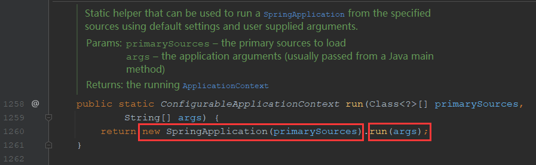
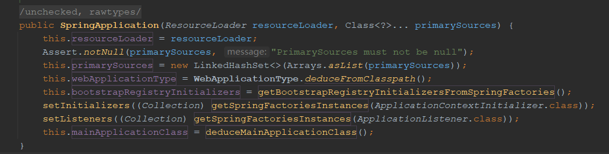
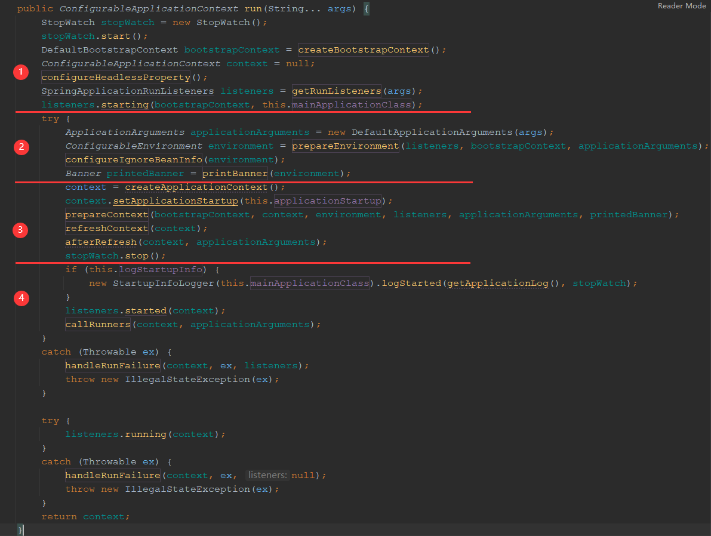
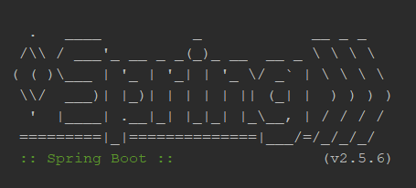
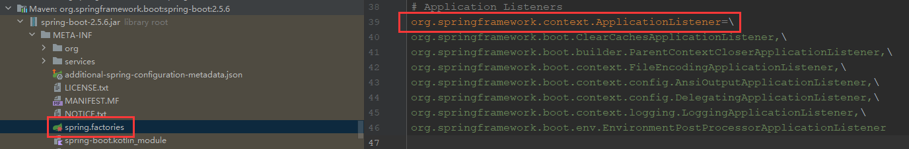
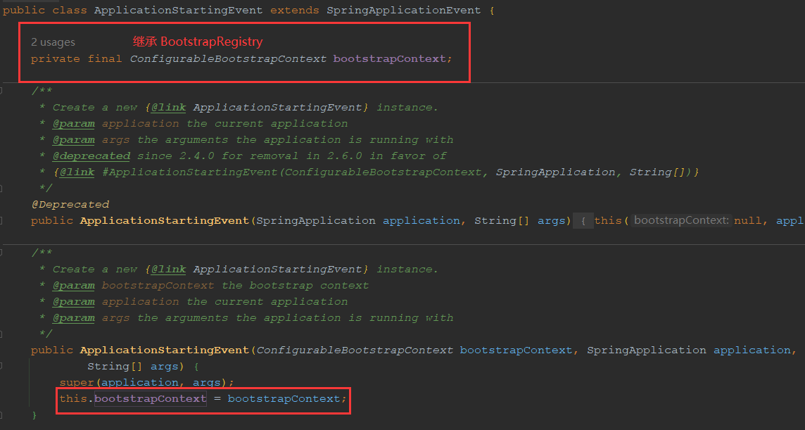
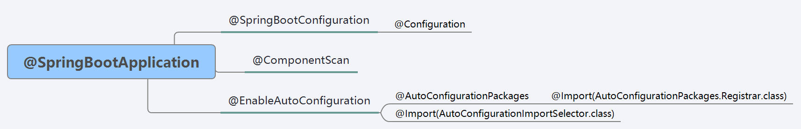
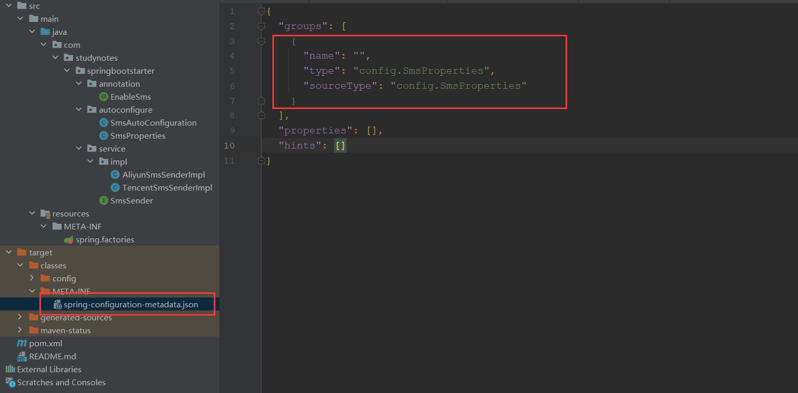
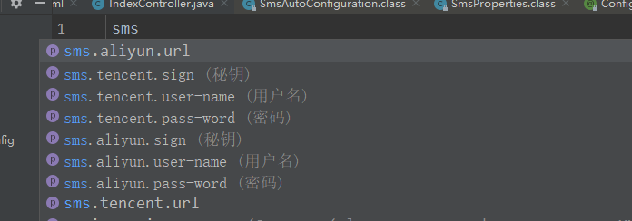
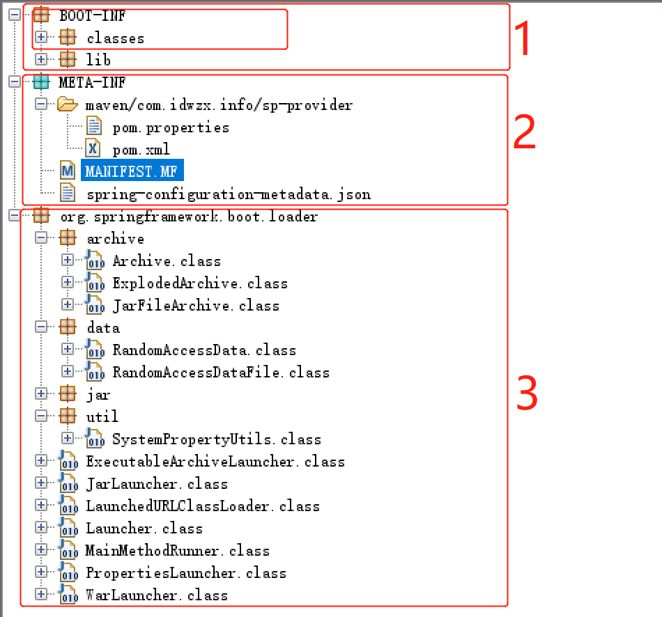

# SpringBoot

> 基于[【官网】](https://spring.io/projects/spring-boot#learn)

## 一、基本概念

**背景 1**：

现在行业之中，Spring 已经作为了绝对的 Java 架构，但是如果要想在 Spring 之中整合 RabbitMQ、Kafka 等功能，需要编写一堆堆的 XML 配置。在这样的一个大的历史背景下，很多人开始寻求更加简便的开发，而遗憾的是这种简便的开发没有被 JDK 所支持、没有被 JavaEE 所支持，因为这些只是平台，平台能够提供的只是最原始的技术支持。

这一时刻终于由于 Spring 框架的升级而得到了新生，SpringBoot 的出现，改变了所有 Java 开发的困境。

---

SpringBoot 的最终奉行的宗旨——**约定大于配置**：开发者只需在必要的地方进行少量的配置；在没有规定配置的地方，采用默认配置，以力求最简配置为核心思想。

**有以下优点**：

- SpringBoot 通过废除掉大部分复杂的开发，废除掉大部分的配置，让开发变得更简单纯粹。
- SpringBoot 整合了大部分的框架，就像 Maven 整合了所有的 jar 一样，使用方便。
- SpringBoot 中使用的大量注解还是之前 Spring 所提供的注解，开发者几乎可以零适应进行完整过渡。
- 相较于 Spring 项目来说，SpringBoot 项目开发快速、配置简单、使用方便。

## 二、SpringBoot 原理

### （一）[SpringApplication 启动过程](https://www.cnblogs.com/lifullmoon/p/14957434.html)

在 SpringBoot 项目中，我们总是会设置一个启动类，代码如下：

```java
@SpringBootApplication
public class MyBootstrapClass {
   public static void main(String[] args) {
       SpringApplication.run(MyBootstrapClass.class, args);
   }
}
```

可以看见启动类中 main()方法很简单，直接就是 `SpringApplication.run(MyBootstrapClass.class, args)`，那么这个 SpringApplication 中又是如何运行的呢？直接进入源码查看：



可以将其分为两部分查看：

#### 1、创建 SpringApplication 实例

通过 `new SpringApplication(primarySources)` 创建 SpringApplication 实例，主要做一些准备工作：



- 将主要来源的 Class 对象设置到一个集合里面，默认就只有一个启动类。
- 获取 SpringBoot 应用程序类型，值有：

  - None：非 Web 程序。
  - SERVLET：Web 应用程序。
  - REACTIVE：响应式程序。

- 设置 BootstrapRegistryInitializer 启动注册初始化器。
- 设置 ApplicationContextInitializer 容器初始化器。
- 设置 ApplicationListener 监听器。
- 获取应用程序的启动类。

#### 2、run()方法

创建好 SpringApplication 实例后，便去执行 run()方法：



##### （1）启动前的准备

- 创建并启动 StopWatch 计时器，统计应用启动时长。
- 创建一个 DefaultBootstrapContext（BootstrapRegistry 实现类），并执行所有 BootstrapRegistryInitializer 的 initialize()方法进行，**扩展点**。
- 设置 SpringApplicationRunListeners 运行监听器集合，即通过 Spring Factories 机制获取并实例化配置的 SpringApplicationRunListener 所有实现类（默认为 EventPublishingRunListener）。
  - EventPublishingRunListener 中维护着一个 SimpleApplicationEventMulticaster 事件广播器，用于向 ApplicationListener 事件监听器发送事件。
- 广播 ApplicationStartingEvent 事件：ApplicationStartingEvent 事件标志着 SpringApplication 的启动，并且此时 ApplicationContext 还没有初始化，这是一个早期事件。

##### （2）准备 Environment 环境

- 将 args 启动参数封装为 ApplicationArguments 对象。

- 设置 ConfigurableEnvironment 环境（为了方便阅读，以下简称为 Environment）：

  - 为 Environment 设置默认值，读取 ApplicationArguments 中的 args 配置。
  - 广播 ApplicationEnvironmentPreparedEvent 事件：ApplicationEnvironmentPreparedEvent 事件标志着环境已准备好，**SpringBoot 中有提供两个关键的环境事件监听器**：
    - BootstrapApplicationListener：加载 bootstrap.yml（或 properties 文件）配置并添加到 Environment 中。
    - ConfigFileApplicationListener（已废弃，替换为 EnvironmentPostProcessorApplicationListener）：加载 application.yml（或 properties 文件）配置并添加到 Environment 中。

- 打印 Banner（默认为 SpringBootBanner）启动图标，也就是 SpringBoot 启动的那个大大的标志。

  

##### （3）创建并启动 ApplicationContext 容器

- 根据不同的应用程序环境创建不同的 ConfigurableApplicationContext 实现类（为了方便阅读，以下简称为 ApplicationContext），例如 AnnotationConfigServletWebServerApplicationContext。
- 准备 ApplicationContext 容器：
  - 设置 ApplicationContext 的 Environment 环境变量 。
  - 执行所有 ApplicationContextInitializer 的 initialize(ApplicationContext)方法，从而实现自定义容器的逻辑，**扩展点**。
  - 发布 ApplicationContextInitializedEvent 事件：ApplicationContextInitializedEvent 事件标志着容器已初始化完成。
  - 对 ApplicationContext 中的 BeanFactory 设置一些基本配置，例如：是否允许同名 Bean 的覆盖、是否允许懒加载。
  - 将一些重要的 Bean 注册进 Spring 容器：
    - 将 ApplicationArguments 注册进 Spring 容器。
    - 将 Banner 注册进 Spring 容器。
    - 将启动类注册进到 Spring 容器，在 refresh() 中就会对此类上的注解进行解析，**后续通过该类进行自动配置**。
  - 发布 ApplicationPreparedEvent 事件：ApplicationPreparedEvent 事件标志着容器已准备好。
- 执行 ApplicationContext.refresh() 方法，即启动容器。

  - 其中会执行 ServletWebServerApplicationContext.onRefresh()方法，创建并启动一个 Tomcat 服务器。

- afterRefresh()方法在 SpringApplication 中是空实现，我们可以实现自定义逻辑，**扩展点**。

##### （4）容器启动后工作

- 打印日志。
- 发布 ApplicationStartedEvent 事件：ApplicationStartedEvent 事件标志容器已启动。
- 执行 Runner。
- 如果发生异常，则在 catch 中处理异常

### （二）启动过程中的重要接口

#### 1、Spring Factories 机制

SpringBoot 中有一种非常解耦的机制——Spring Factories，这种扩展机制实际上是仿照 Java 中的 SPI 扩展机制来实现的，**SpringBoot 在启动过程中就大量使用了这种机制**。

spring-core 包里定义了 SpringFactoriesLoader 类，它可以检索当前应用及依赖的所有 `META-INF/spring.factories` 文件，并获取指定接口的配置的功能。以 spring-boot 包下的 `META-INF/spring.factories` 文件为例，结构如下：



获取 ApplicationListener 接口对应的配置：

```java
public static void main(String[] args) {
    ClassLoader classLoader = ClassUtils.getDefaultClassLoader();
    // 从 META-INF/spring.factories 中加载所有的 ApplicationListener
    List<String> list = SpringFactoriesLoader.loadFactoryNames(ApplicationListener.class, classLoader);
    list.forEach(System.out::println);
}
```

#### 2、[BootstrapRegistryInitializer](https://blog.csdn.net/u012855229/article/details/134515191)

BootstrapRegistryInitializer 是 SpringBoot 2.4.5 提供的接口，只定义了一个 initialize()方法，参数为 BootstrapRegistry（默认实现类为 DefaultBootstrapContext）类型。

BootstrapRegistry 是一个简单的对象注册表，用于注册存储 Class 类对象及其实例。因此我们可以自己实现 BootstrapRegistryInitializer 接口，将对象注册到 BootstrapRegistry 中。

SpringBoot 在启动过程中：

- 通过 Spring Factories 机制获取并实例化配置的 BootstrapRegistryInitializer 实现类，执行 initialize()方法，将 Class 类对象及其实例注册到 BootstrapRegistry 中。

- 将 BootstrapRegistry 添加到各个 ApplicationEvent 中传递给 ApplicationListener，ApplicationListener 可以使用注册在 BootstrapRegistry 上面的对象。

**因此 BootstrapRegistryInitializer 可以在 ApplicationContext 可用之前设置需要共享的实例**。例如：



#### 3、ApplicationContextInitializer

ApplicationContextInitializer 是 Spring 提供的接口，只定义了一个 initialize()方法，参数为 ConfigurableApplicationContext 类型。

SpringBoot 在启动过程中：

- 通过 Spring Factories 机制获取并实例化配置的 ApplicationContextInitializer 实现类，执行 initialize()方法，**可以自定义对 ConfigurableApplicationContext 的操作，例如提前注册 Bean**。
- 然后再执行 ConfigurableApplicationContext.refresh()方法。

#### 4、ApplicationListener

ApplicationListener 是 Spring 提供的接口，只定义了一个 onApplicationEvent()方法，参数为 ApplicationEvent 类型。

SpringBoot 在启动过程中：

- 通过 Spring Factories 机制获取并实例化配置的 ApplicationListener 实现类。
- SpringBoot 启动过程中会通过 ApplicationEventMulticaster 广播多个事件（例如标志 SpringApplication 启动的 ApplicationStartingEvent 事件）。
- **ApplicationListener 实例监听到对应的事件后便会执行 onApplicationEvent()方法，实现自定义业务。**

#### 5、[Runner 机制](https://www.cnblogs.com/luchangjiang/p/10487212.html)

CommandLineRunner 和 ApplicationRunner 是 SpringBoot 提供的扩展机制——Runner 机制，Runner 机制用于在 SpringBoot **启动完成后**会自动去执行一些一次性的初始化工作，例如：加载资源文件、执行其它外部程序。

```java
@Component
@Order(1) // 设置该类在spring容器中的加载顺序，数字小优先级高
public class MyCommandLineRunner implements CommandLineRunner {
    @Override
    public void run(String... args) throws Exception {
        System.out.println("MyCommandLineRunner");
        for (String arg : args) {
            System.out.println(arg);
        }
    }
}

@Component
@Order(2)
public class MyApplicationRunner implements ApplicationRunner {
    @Override
    public void run(ApplicationArguments args) throws Exception {
        System.out.println("MyApplicationRunner");
        System.out.println(args.getOptionNames());
        System.out.println(args.getNonOptionArgs());
    }
}
```

在 SpringBoot **启动完成后**会自动去执行 CommandLineRunner 和 ApplicationRunner 接口的实现类，唯一的区别是 run()方法接收的参数不同：

- CommandLineRunner 中 `String... args` 就是启动类中 main 函数接收的命令行参数。
- ApplicationRunner 中 ApplicationArguments 会对 SpringBoot 程序的启动参数进行解析和分类。

### （三）@SpringBootApplication

我们每个 SpringBoot 项目的启动类上都会添加 @SpringBootApplication 注解，@SpringBootApplication 注解上有三个关键注解：@SpringBootConfiguration、@ComponentScan、@EnableAutoConfiguration。



#### 1、@SpringBootConfiguration

@SpringBootConfiguration 是 SpringBoot 提供的注解，它上面添加了 @Configuration，表示该注解所在的类是个配置类。

#### 2、@ComponentScan

用于扫描指定包下的 @Component（包括 @Service、@Controller 等） 注解所在的类，将其注册进 Spring 容器内成为 Bean 类。

#### 3、@EnableAutoConfiguration

@EnableAutoConfiguration 是 SpringBoot 提供的注解，它上面有了两个关键的注解 @AutoConfigurationPackage 和 @Import(AutoConfigurationImportSelector.class)。

（1）@AutoConfigurationPackage

@AutoConfigurationPackage 是 SpringBoot 提供的注解，它上面添加了 @Import(AutoConfigurationPackages.Registrar.class)，它主要是将注解所在类的 package 包，映射成一个 Bean 类注册进 Spring 容器中。

（2）@Import(AutoConfigurationImportSelector.class)

@Import(AutoConfigurationImportSelector.class) 注解会将 AutoConfigurationImportSelector 类注册进 Spring 容器，[AutoConfigurationImportSelector](https://www.cnblogs.com/zfcq/p/16751351.html) 执行以下操作：

- 通过 ClassLoader.getResources() 查找 classpath 以及依赖中的 `META-INF/spring.factories` 文件，获取 key 为 `org.springframework.boot.autoconfigure.EnableAutoConfiguration` 对应的 value 值，即众多**自动配置类的类名**。
- 根据 @EnableAutoConfiguration 注解中的 exclude 和 excludeName 属性值，**过滤掉指定的自动配置类**。
- 根据 @Conditional 相关注解，**过滤掉不满足 @Conditional 条件的自动配置类**。
- 最后存储这些自动配置类的类名并进行封装，以供之后的操作。

> SpringBoot 之后会将这些自动配置类作为 Bean 尝试注册进 Spring 容器中，注入的时候 Spring 会通过 @Conditional 注解判断是否符合条件，因为并不是所有的自动配置类都满足条件。

### （四）[Starter](https://developer.aliyun.com/article/893073)

在上面 @SpringBootApplication 注解中，解释了为什么不用手动注册 Bean，就可以使用依赖中的对应类的 Bean。但是你肯定有个疑问：为什么仅仅通过 yml 等配置文件，我们的就可以将配置值传递给这些自动配置的 Bean？

究其原因就是**各种 Starter 依赖包**，这些 Starter 依赖包在内部实现了将配置值注入 Bean 中，我们只需要按照规范设置配置，就可以达到开箱即用的目的。自定义 Starter 项目，查看 Starter 运行原理。

1、创建 Starter 项目

SpringBoot Starter 项目命名是有规范的：

- 官方的 `Starter` 的命名格式为 `spring-boot-starter-{xxxx}`，比如`spring-boot-starter-activemq`
- 第三方我们自己的命名格式为 `{xxxx}-spring-boot-starter`，比如`mybatis-spring-boot-starter`。

2、添加依赖

```xml
<dependencies>
    <!-- SpringBoot 依赖 -->
    <dependency>
        <groupId>org.springframework.boot</groupId>
        <artifactId>spring-boot-starter</artifactId>
    </dependency>

    <!-- SpringBoot Lombok 依赖 -->
    <dependency>
        <groupId>org.projectlombok</groupId>
        <artifactId>lombok</artifactId>
    </dependency>

    <dependency>
        <groupId>org.springframework.boot</groupId>
        <artifactId>spring-boot-configuration-processor</artifactId>
        <optional>true</optional>
    </dependency>
</dependencies>
```

重点关注一下 `spring-boot-configuration-processor`，添加这个依赖后，项目编译后会生成如下文件：



当我们在配置文件输入 sms 我们的 IDEA 会提示这个 `sms` 有哪些属性可以配置，以及每个属性的注释都有提示：



3、编写配置文件类

编写配置文件类，用于读取 yml 等配置文件中的配置。

```java
@Data
@ConfigurationProperties(prefix = "sms")
public class SmsProperties {

    private SmsMessage aliyun;

    private SmsMessage tencent;

    @Data
    public static class SmsMessage {

        /**
         * 用户名
         */
        private String username;

        /**
         * 密码
         */
        private String password;

        /**
         * 秘钥
         */
        private String sign;

        /**
         * URL
         */
        private String url;
    }
}
```

4、编写自动配置类

我们可以在自动配置类中使用 @Bean 注解注册 Bean。

```java
@Configuration
@EnableConfigurationProperties(value = SmsProperties.class)
public class SmsAutoConfiguration {

    /**
     *  阿里云发送短信的实现类
     * @param smsProperties
     * @return
     */
    @Bean
    public AliyunSmsSenderImpl aliYunSmsSender(SmsProperties smsProperties){
        return new AliyunSmsSenderImpl(smsProperties.getAliyun());
    }
    /**
     * 腾讯云发送短信的实现类
     * @param smsProperties
     * @return
     */
    @Bean
    public TencentSmsSenderImpl tencentSmsSender(SmsProperties smsProperties){
        return new TencentSmsSenderImpl(smsProperties.getTencent());
    }
}
```

5、自动配置类生效方式

我们 Starter 项目一般是打包成 jar 包，添加到 Maven 仓库，然后被其他项目引用。为了让我们的自动配置类生效（即注册进 Spring 容器），有以下两种方式：

（1）Spring Factories 机制

通过 Spring Factories 机制，SpringBoot 可以将我们的自动配置类注册进 Spring 容器：

```factories
# 自动配置的第一种方式：通过 Spring Factories 机制，加载我们的自动配置类
org.springframework.boot.autoconfigure.EnableAutoConfiguration=\
com.studynotes.springbootstarter.autoconfigure.SmsAutoConfiguration
```

（2）注解方式

通过自定义注解，使用时只需要在启动类上加上该注解即可。

```java
@Target({ElementType.TYPE})
@Retention(RetentionPolicy.RUNTIME)
@Documented
// 导入 SmsAutoConfiguration 自动配置类
@Import({SmsAutoConfiguration.class})
public @interface EnableSms {
}
```

### （五）[SpringBoot 的 jar 包的启动原理](https://www.cnblogs.com/lifullmoon/p/14953064.html)

SpringBoot 提供了 Maven 插件 [`spring-boot-maven-plugin`](https://docs.spring.io/spring-boot/docs/current/reference/html/build-tool-plugins.html#build-tool-plugins-maven-plugin)，可以很方便的将我们的 SpringBoot 项目打成 jar 包或者 war 包。考虑到部署的便利性，我们绝大多数的场景下，都会选择打成 jar 包，这样一来，我们就无需将项目部署于 Tomcat、Jetty 等 Servlet 容器中。

SpringBoot 项目 package 打包生成的 jar 包结构如下：



1、`BOOT-INF` 目录

保存我们自己 SpringBoot 项目编译后的所有文件，其中 classes 目录下面就是编译后的 .class 文件，包括项目中的配置文件等；lib 目录下就是我们引入的依赖。

2、`META-INF` 目录

保存着 Maven 信息和 `MANIFEST.MF` 文件，`MANIFEST.MF` 文件提供 jar 包的元数据，具体内容如下：

```mf
Manifest-Version: 1.0
Spring-Boot-Classpath-Index: BOOT-INF/classpath.idx
Implementation-Title: springboot
Implementation-Version: 0.0.1-SNAPSHOT
Spring-Boot-Layers-Index: BOOT-INF/layers.idx
Start-Class: com.studynotes.springboot.SpringbootApplication # 自己 SpringBoot 项目中的启动类
Spring-Boot-Classes: BOOT-INF/classes/ # 自己 SpringBoot 项目编译后的文件
Spring-Boot-Lib: BOOT-INF/lib/ # 自己 SpringBoot 所引入的第三方依赖
Build-Jdk-Spec: 1.8
Spring-Boot-Version: 2.5.6
Created-By: Maven Jar Plugin 3.2.0
Main-Class: org.springframework.boot.loader.JarLauncher # spring-boot-loader 中的启动类
```

参考 [Oracle 官方](https://docs.oracle.com/javase/8/docs/technotes/guides/jar/jar.html)对该文件的说明：

- `Main-Class`：Java 规定的 jar 包的启动类，这里设置为 `spring-boot-loader` 项目的 [JarLauncher](https://github.com/liu844869663/spring-boot/blob/2.2.x/spring-boot-project/spring-boot-tools/spring-boot-loader/src/main/java/org/springframework/boot/loader/JarLauncher.java) 类，进行 Spring Boot 应用的启动。
- `Start-Class`：Spring Boot 规定的主启动类，这里通过 `spring-boot-maven-plugin` 插件打包时，会设置为我们定义的 Application 启动类。

> **为什么不直接将我们的 Application 启动类设置为 `Main-Class` 启动呢？**
>
> 因为通过 `spring-boot-maven-plugin` 插件打包后的 jar 包，我们的 .class 文件在 `BOOT-INF/classes/` 目录下，在 Java 默认的 jar 包加载规则下找不到我们的 Application 启动类，也就需要通过 JarLauncher 启动加载。
>
> 当然，还有一个原因，Java 规定可执行器的 jar 包禁止嵌套其它 jar 包，在 `BOOT-INF/lib` 目录下有我们 Spring Boot 应用依赖的所有第三方 jar 包，因此`spring-boot-loader` 项目自定义实现了 ClassLoader 实现类 [LaunchedURLClassLoader](https://github.com/liu844869663/spring-boot/blob/2.2.x/spring-boot-project/spring-boot-tools/spring-boot-loader/src/main/java/org/springframework/boot/loader/LaunchedURLClassLoader.java)，支持加载 `BOOT-INF/classes` 目录下的 .class 文件，以及 `BOOT-INF/lib` 目录下的 jar 包。

3、`org.springframework.boot.loader` 目录

SpringBoot 的 `spring-boot-loader` 工具模块，它就是 `java -jar xxx.jar` 启动 SpringBoot 项目的秘密所在，上面的 `Main-Class` 指定的就是该工具模块中的一个类。

---

**启动流程入如下**：

- 通过 `java -jar` 启动应用时，根据 `Main-Class` 配置会调用 `org.springframework.boot.loader.JarLauncher` 的 main()方法，其中会创建一个自定义的 ClassLoader 类加载器。
- 通过类加载器从 `BOOT-INF` 目录下加载我们 SpringBoot 项目的 Class 类对象，及依赖的第三方 jar 包中的 Class 类对象。
- 根据 `Start-Class`，通过反射的方式调用我们 SpringBoot 项目启动类的 main()方法，最终启动项目。

## 三、配置属性

### （一）[spring.profiles.active](https://www.jb51.net/article/149973.htm)

默认情况下，SpringBoot 只会加载 application.properties 或 application.yml 配置文件。但是除此之外项目还分为开发、生产环境，在不同环境中需要不同的配置文件，同一目录下的配置文件如下：

> application.properties 和 application.yml 同时存在时，application.properties 中同名的属性会覆盖 application.yml 中的同名属性。

```txt
application.yml
// 开发环境
application-dev.yml
// 生产环境
application-prod.yml
```

SpringBoot 提供 `spring.profile.active` 属性用于加载或切换其他配置文件，加载的配置文件名为 `application-${spring.profile.active}.${application配置文件的后缀}`，例如：

```yml
spring:
  profile:
    active: dev # 多个配置文件使用逗号隔开
```

在加载 application.yml 配置文件后，也会加载 application-dev.yml 中的配置，并且 `spring.profile.active` 指定的配置文件优先级更高。

### （二）`${}`

在 yml 配置文件中，可以通过 `${}` 的方式获取指定配置值（从配置文件或 args 参数中）：

```yml
user:
  home: /root

logging:
  file:
    path: ${user.home}/logs # 相当于 /root/logs
```

另外还有一种特殊的写法 `${key:value}`，获取 key 配置对应的配置值，如果 key 配置不存在，则默认取 value 值：

```yml
logging:
  file:
    path: ${user.home:/root}/logs # 相当于 /root/logs
```
