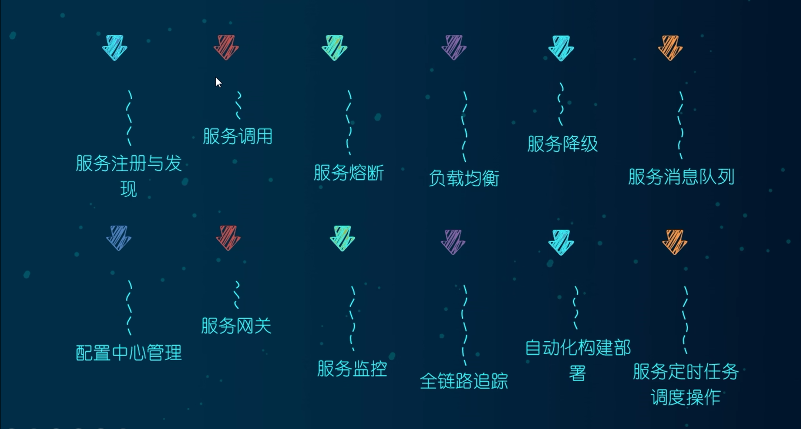
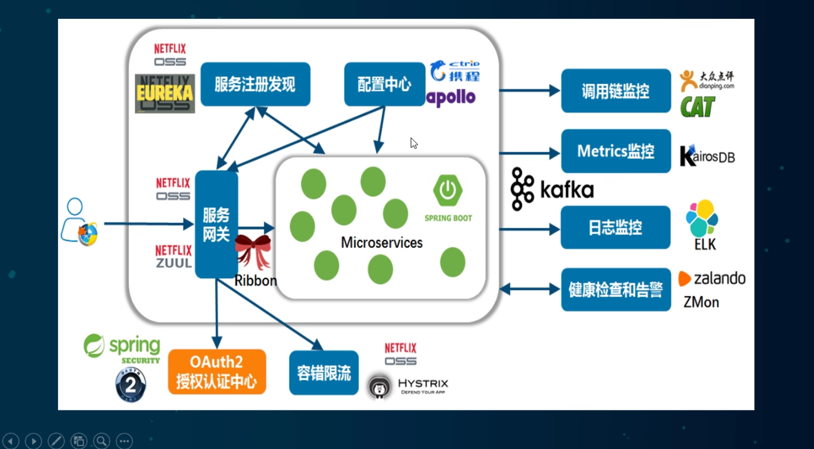
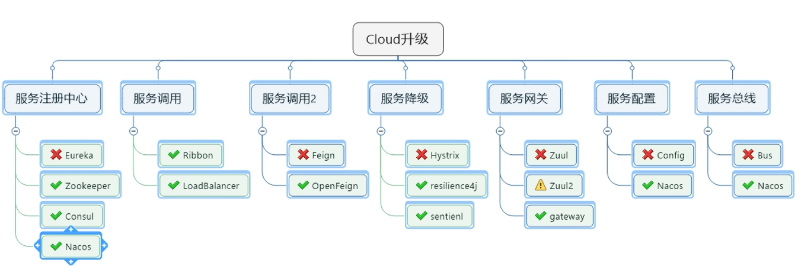
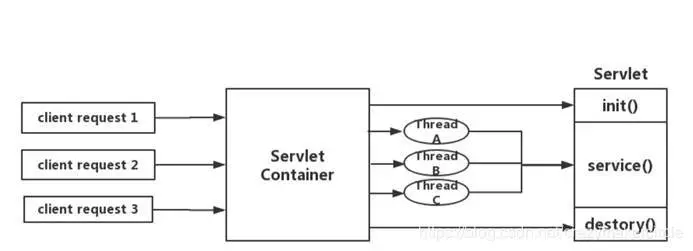

# SpringCloud

> 基于[【官网】](https://spring.io/projects/spring-cloud)、《尚硅谷 SpringCloud 框架开发教程》

## 一、基本概念

SpringCloud 是**分布式微服务架构的一站式解决方案**，是多种微服务架构落地技术的集合体，俗称微服务全家桶。

> 微服务架构是一种架构模式，它提倡将单一应用程序划分成一组小的服务，服务之间互相协调、相互配合，为用户提供最终价值。每个服务运行在其独立的进程中，服务与服务间**采用轻量级的通信机制**相互协作（通常是基于 HTTP 协议的 RESTful API）。

**分布式架构包括的技术**：

**SpringCloud 主流技术栈**：

由于技术迭代及部分组件停止更新等原因，SpringCloud 对部分组件进行替换：

> SpringCloud 是一个由许多子项目组成的综合项目，各子项目有不同的发布节奏。为了管理 SpringCloud 与各子项目的版本依赖关系，发布了一个清单，其中包括了某个 SpringCloud 版本对应的子项目版本。
>
> 为了避免 SpringCloud 版本号与子项目版本号混淆，**SpringCloud 版本采用了英国伦敦地铁站的名称来命名**，并由地铁站名称字母 A~Z 依次类推的形式发布迭代版本，例如：第 1 个版本是 Angel，第 2 个版本时 Brixton。当 SpringCloud 的发布内容积累到临界点或者一个重大 bug 被解决后，会发布一个 service release 版本（简称 SRX 版本），例如：Greenwich.SR2 就是 SpringCloud 发布的 Greenwich 版本的第 2 个 SRX 版本。
>
> 然而自 Hoxton.SR12 版本发布后，SpringCloud 又改为了由时间命名的版本，例如：2020.0.0 版本，就是 SpringCloud 发布的 2020 版本的第 1 个小版本。

## 二、[服务注册发现中心](https://www.cnblogs.com/hanease/p/16996975.html)

### （一）Eureka

Eureka 是 Netflix 公司使用 Java 语言开发的、采用 CS 的设计架构的服务注册发现中心。

> Eureka 2.0 现有的开源工作已停止，作为 2.x 分支上现有工作存储库的一部分发布的代码库和工件被认为使用时需要您自担风险。
>
> Eureka 1.x 是 Netflix 服务发现系统的核心部分，并且仍然是一个活跃的项目。

### （二）ZooKeeper

ZooKeeper 最早是 Yahoo 开发的，**为分布式应用所设计的高可用、高性能的、一致的开源协调服务**，后捐赠给 Apache 基金会。开源后在 ZooKeeper 基础上，提供服务注册发现功能。

### （三）Consul

Consul 是**一套开源的分布式服务发现与配置管理系统**，由 HashiCorp 公司用 Go 语言开发。Consul 提供了微服务系统中的服务治理、配置中心、控制总线等功能，这些功能中的每一个都可以根据需要单独使用，也可以一起使用以构建全方位的服务网格。

### （四）注册中心对比

| 特点\注册中心    | Eureka                                                       | ZooKeeper                                  | Consul                           | Nacos                    |
| ---------------- | ------------------------------------------------------------ | ------------------------------------------ | -------------------------------- | ------------------------ |
| 服务健康检查     | 需要显式地配置健康检查支持                                   | 在失去了和服务进程的连接时，展示任务不健康 | 可以展示服务状态、内存使用情况等 | 传输层和应用层的健康检查 |
| 多数据中心       | ——                                                           | ——                                         | 支持                             | 支持                     |
| kv 存储服务      | ——                                                           | 支持                                       | 支持                             | 支持                     |
| 一致性协议       | ——（采用 Peer-To-Peer 对等通信）                             | Zab 协议                                   | Raft 协议                        | Raft 协议                |
| CAP 定理         | AP                                                           | CP                                         | CP                               | AP 和 CP                 |
| 负载均衡         | 通过 Ribbon                                                  | ——                                         | 通过 Fabio                       | 通过 Ribbon              |
| 访问协议         | HTTP                                                         | TCP（ZkClient）                            | HTTP / DNS                       | HTTP / DNS               |
| watch 支持       | long polling（通过长轮询的方式来实现变化的感知）             | 支持                                       | long polling                     | long polling             |
| 自身集群的监控   | 支持 metrics（运维者可以搜集并报警这些度量信息达到监控目的） | ——                                         | 支持 metrics                     | 自带的 Console           |
| 安全             | ——                                                           | ACL                                        | ACL / HTTPS                      | ACL                      |
| SpringCloud 集成 | 支持                                                         | 支持                                       | 支持                             | 支持                     |

> 多数据中心（Multi-Data Center，简称 MDC）是指**在一个分布式系统中同时运行多个数据中心**。每个数据中心都是一个独立的物理或逻辑实体，包含了一组服务器和网络基础设施，通常位于不同的地理位置。多数据中心的设计旨在提高系统的可用性、容错性和性能。

## 三、负载均衡

### （一）Ribbon

Ribbon 是 Netflix 发布的开源项目，主要功能是**提供客户端的软件负载均衡算法和服务调用**。

### （二）[LoadBalancer](https://docs.spring.io/spring-cloud-commons/docs/3.1.5/reference/html/#spring-cloud-loadbalancer)

由于 Ribbon 停止更新，SpringCloud 发布 spring-cloud-loadbalancer 开源项目用于替代 Ribbon。除了 Ribbon 提供的功能外，LoadBalancer 还有以下特性：

- Ribbon 只支持 RestTemplate 远程调用方式；LoadBalancer 支持 RestTemplate、WebClient、WebFlux 远程调用方式。
- 提供缓存，Ribbon 每次负责均衡时都需要实时获取服务列表，而 LoadBalancer 提供服务列表缓存。
- 健康检查。

在使用上 LoadBalancer 和 Ribbon 基本没有太大的区别，除了一些配置及使用 @LoadBalancerClient 注解替代 @RibbonClient。

在早期版本 SpringCloud 使用 Ribbon 作为默认的负载均衡器；新版本的 SpringCloud 使用 LoadBalancer 作为默认的负载均衡器。如果 Ribbon 和 LoadBalancer 同时存在，有两种方式让 SpringCloud 使用指定的负载均衡器：

- 在 `pom.xml` 依赖中去除另一方负载均衡器的依赖。
- 使用 `spring.cloud.loadbalancer.ribbon.enabled=false` 禁用 Ribbon（可能旧版本的 SpringCloud 没有此配置），或者使用 `spring.cloud.loadbalancer.enabled=false` 禁用 LoadBalancer 。

## 四、服务降级

### （一）Hystrix

Hystrix 是 Netflix 公司开发的、用于处理分布式系统的**延迟和容错**的开源库。在分布式系统中，许多依赖（服务）不可避免的会调用失败，比如：超时、异常等，**Hystrix 能够保证在某个依赖出问题的情况下，不会导致整体服务失败，避免级联故障，以提高分布式系统的容错能力**。

## 五、服务网关

### （一）Zuul

Zuul 是 Netflix 公司开发的**开源网关组件**，可以**实现路由转发的功能**。

**Zuul 1.0 是基于 Servlet 之上的一个阻塞式 IO 模型**：

Servlet 由 Servlet Container 进行生命周期管理。Container 启动时构造 Servlet 对象并调用 init()进行初始化；Container 关闭时调用 destory()销毁 Servlet；Container 运行时接受请求，并为每个请求分配一个线程（一般从线程池中获取空闲线程）然后调用 service()。

当请求进入 Servlet Container 时，Servlet Container 就会为其绑定一个线程，在并发不高的场景下这种模型是适用的，但是一旦并发上升，线程数量就会上涨，而线程资源代价是昂贵的（上线文切换，内存消耗大）严重影响请求的处理时间。在一些简单的业务场景下，不希望为每个请求分配一个线程，只需要一个或几个线程就能应对极大并发的请求，这种业务场景下 Servlet 模型没有优势。

### （二）Gateway

SpringCloud 在 1.x 版本中采用 Zuul 网关，但随着 Zuul 1.0 进入维护阶段，并且 Zuul 2.0 也迟迟没有正式落地，因此 SpringCloud 自己推出了 Gateway 网关组件替代 Zuul，虽然后面 Zuul 2.0 版本已经上线，但是新版的 SpringCloud 也没有整合 Zuul 2.0 的计划。

Gateway 是 SpringCloud 的一个全新项目，该项目是基于 Spring 5.0、Spring Boot 2.0 和 Project Reactor 等技术开发的网关，它旨在为微服务架构提供一种简单有效的统一的 API 路由管理方式。

**Gateway 和 Zuul 的区别**：

- Zuul：
  - Zuul 1.x 是一个基于阻塞 IO 模型的网关，请求线程被阻塞到工作线程完成。
  - Zuul 1.x 不支持任何长连接（例如 WebSocket）。
  - Zuul 2.x 基于 Netty 非阻塞和支持长连接，虽然较于 1.x 性能有很多提升，但是 SpringCloud 目前没有整合的计划。
- Gateway：
  - Gateway 基于 Spring 5.0、Spring Boot 2.0 和 Project Reactor，使用非阻塞 IO 模型。
  - 支持 WebSocket，并且与 Spring 紧密集成，拥有更好的开发体验。

## 六、服务配置和服务总线

### （一）Config

Config 是 SpringCloud 提供的**集中式的配置管理中心**，用来实现微服务系统中服务配置的统一管理。

### （二）Bus

SpringCloud Bus 能管理和传播分布式系统键的消息，就像一个分布式执行器，可用于广播状态更改、事件推送等，也可以当作微服务间的通信通道，用来实现微服务架构中的服务总线功能。

SpringCloud Bus 配合 SpringCloud Config 使用可以实现配置的自动刷新配置。

## 七、分布式请求链路跟踪

### （一）Sleuth

**分布式链路追踪能够帮助您识别故障点，追踪请求在哪个环节出现问题，从而更快地排除故障。**

SpringCloud Sleuth 是由 SpringCloud 官方推出，为 SpringCloud 实现分布式链路追踪功能，它在设计上借鉴了 [Dapper](https://research.google/pubs/pub36356/)、[Zipkin](https://github.com/openzipkin/zipkin)、[HTrace](https://htrace.incubator.apache.org/)。
