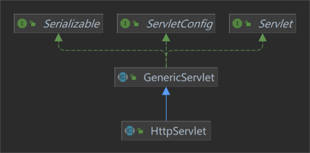
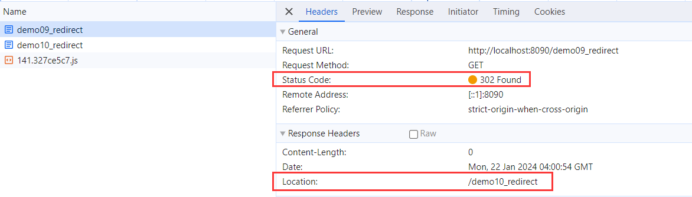
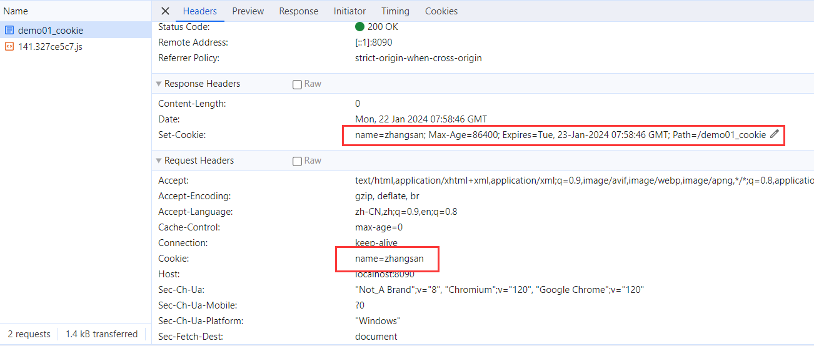
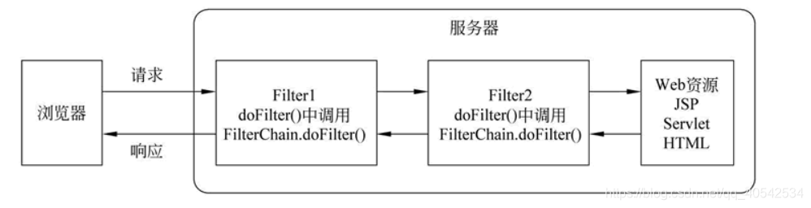
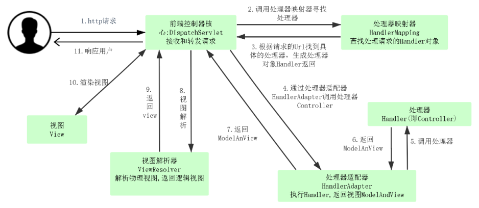

# SpringMVC

## 一、基本概念

Java Web 是用 Java 技术来解决相关 Web 互联网领域的技术栈。Web 包括：Web 服务端和 Web 客户端两部分。Java 在客户端的应用有 Java Applet，不过使用得很少，通常是使用 HTML、JS 等技术；Java 在服务器端的应用非常的丰富，比如 Servlet，JSP、第三方框架（例如 SpringMVC）等等。

## 二、Servlet

Java Web 中有三大组件：Servlet 程序、Filter 过滤器、Listener 监听器。

### （一）Servlet

Servlet（Server Applet、服务端小程序）是使用 Java 语言编写的服务端程序，运行在服务端，由服务端服务器（例如 Tomcat）调用执行。

#### 1、HttpServlet

**javax.servlet 包提供 Servlet 接口用于实现 Servlet 功能：**

> 不要搞混，Servlet 接口是实现 Servlet 功能的规范，我们自己去实现 Servlet 接口，从而实现 Servlet 功能。



- GenericServlet 是 Servlet 接口的抽象实现类，默认实现了 Servlet 接口中的大部分方法。
- HttpServlet 抽象类继承 GenericServlet 抽象类，用于处理 HTTP 请求，重写了 service()方法，可以根据请求方式（例如 GET、POST）调用不同的方法（例如 doGet()、doPost()）。

**Servlet 执行过程如下：**

- Tomcat 服务器接收请求后，会分别创建一个 Request 和 Response 对象，Request 用于封装请求信息（例如：请求参数、请求头、请求体），Response 用于封装响应信息（此时还是空对象，Servlet 处理完业务后可以封装响应信息）。
- Tomcat **分配线程**让 Servlet 来处理这个请求：
  - 根据请求路径找到对应的 Servlet 实例，如果没有，则加载和初始化 Servlet 实例（**单例**），并调用 init()方法。
  - 然后去调用 Servlet 实例的 service()方法，可以通过 Request 获取请求信息，在业务处理完毕后，通过 Response 写入响应数据并返回。
  - 在 Tomcat 关闭时，会将服务器中的 Servlet 销毁，销毁前调用 Servlet 实例的 destroy()方法。

```java
@WebServlet("/demo01_httpServlet")
public class Demo01_HttpServlet extends HttpServlet {

    /**
     * Description: 第一次访问时，会创建 Demo01_HttpServlet 实例（单例），调用 init 方法，且只会调用一次
     */
    @Override
    public void init() {
        System.out.println("Demo01_HttpServlet init：" + this);
    }

    /**
     * Description: 每次访问时，都会调用 service 方法
     */
    @Override
    public void service(HttpServletRequest request, HttpServletResponse response) {
        System.out.println("Demo01_HttpServlet service：" + this);
    }

    /**
     * Description: 服务器关闭时，会调用 destroy 方法，且只会调用一次
     */
    @Override
    public void destroy() {
        System.out.println("Demo01_HttpServlet destroy：" + this);
    }
}
```

#### 2、@WebServlet

例如：向 `localhost:8090/demo01_httpServlet` 发送请求时，会找到 `/demo01_httpServlet` 对应的 Demo01_HttpServlet 去处理请求。原本我们需要在 web.xml 中添加如下配置：

```xml
<servlet>
    <servlet-name>demo01_HttpServlet</servlet-name>
    <servlet-class>com.demo01_servlet.Demo01_HttpServlet</servlet-class>
</servlet>
<!-- 为请求中的 URL 地址和 Servlet 建立映射关系 -->
<servlet-mapping>
    <servlet-name>demo01_HttpServlet</servlet-name>
    <url-pattern>/demo01_httpServlet</url-pattern>
</servlet-mapping>
```

@WebServlet 是 Java Servlet 中提供的注解，用于为请求中的 URL 地址和 Servlet 建立映射关系，就不需要再在 web.xml 中进行配置。

#### 3、HttpServletRequest

HttpServletRequest 用于封装 HTTP 的请求信息。

```java
@WebServlet("/demo03_httpServletRequest")
public class Demo03_HttpServletRequest extends HttpServlet {

    @Override
    public void service(HttpServletRequest request, HttpServletResponse response) {
        System.out.println("Demo03_HttpServletRequest service：" + this);

        // 获取请求方式
        System.out.println("请求方式：" + request.getMethod());

        // 获取请求路径
        System.out.println("请求路径：" + request.getRequestURI());

        // 获取请求参数
        System.out.println("请求参数：" + request.getQueryString());

        // 获取请求头
        System.out.println("请求头：" + request.getHeader("User-Agent"));
    }
}
```

##### （1）请求转发

**请求转发是一种服务器的行为**，当客户端请求到达后，服务器进行转发。

> 例如：客户端请求接口 A，接口 A 处理完业务后，将该请求转发给接口 B，最后由 B 将响应返回给客户端。

```java
@WebServlet("/demo04_forward")
public class Demo04_Forward extends HttpServlet {

    @Override
    public void service(HttpServletRequest request, HttpServletResponse response) throws IOException, ServletException {
        System.out.println("Demo04_Forward service：" + this);

        // 请求转发，将该请求转发给 demo05_forward
        request.getRequestDispatcher("/demo05_forward").forward(request, response);
        // 请求转发后，由 Demo05_Forward 进行响应，这里虽然执行了，但没有任何效果
        response.getWriter().println("Demo04_Forward");
    }
}
```

##### （2）Request 作用域

Request 对象中的数据在一次请求中有效，通过请求转发的 Request 仍然在一次请求内，我们可以通过 Request + 请求转发的方式，在多个接口中共享数据。

```java
@WebServlet("/demo06_requestScope")
public class Demo06_RequestScope extends HttpServlet {

    @Override
    public void service(HttpServletRequest request, HttpServletResponse response) throws ServletException, IOException {
        System.out.println("Demo06_RequestScope service：" + this);

        // setAttribute() 方法设置请求域对象
        request.setAttribute("name", "requestScope");
        request.getRequestDispatcher("/demo07_requestScope").forward(request, response);
    }
}
```

#### 4、HttpServletResponse

HttpServletResponse 用于封装 HTTP 的响应信息。HttpServletResponse 有两种响应方式，向客户端返回数据：

- getWriter()：获取字符输出流，只能写入字符。
- getOutputStream()：获取字节输出流，可以写入字节数据。

> 注意：两者不能同时使用。

```java
@WebServlet("/demo08_httpServletResponse")
public class Demo08_HttpServletResponse extends HttpServlet {

    @Override
    public void service(HttpServletRequest request, HttpServletResponse response) throws IOException {
        System.out.println("Demo08_HttpServletResponse service：" + this);
        response.getWriter().println("Demo08_HttpServletResponse"); // 前台页面显示：Demo08_HttpServletResponse
    }
}
```

##### （1）重定向

**重定向是一种服务器指导客户端行为**，客户端发出第一个请求后，被服务端接收处理后，服务端会响应给客户端一个新的地址，当客户端接收到响应后，会立刻根据新的地址再进行一次请求，由新的地址去接受请求并响应。

```java
@WebServlet("/demo09_redirect")
public class Demo09_Redirect extends HttpServlet {

    @Override
    public void service(HttpServletRequest request, HttpServletResponse response) throws IOException {
        System.out.println("Demo09_Redirect service：" + this);
        response.sendRedirect("/demo10_redirect"); // 重定向
    }
}
```

重定向的请求状态码为 302，响应为 /demo10_redirec（即新地址），客户端获取到新地址后，会立刻请求新地址。



**重定向和请求转发区别：**

| 请求转发（request.getRequestDispatcher(url).forward(request, response)） | 重定向（response.sendRedirect(url)） |
| ------------------------------------------------------------------------ | ------------------------------------ |
| 一次请求                                                                 | 两次请求                             |
| 服务端行为                                                               | 服务端指导客户端行为                 |
| 地址栏不变                                                               | 地址栏变为重定向的地址               |
| 只能在服务端内部转发                                                     | 可以重定向到任何地址                 |

#### 5、Cookie

Cookie 是浏览器提供的一种技术，**用于存储服务端保存在客户端的数据**，每次客户端发送请求时，会将 Cookie 放在请求中一起发送给服务端，客户端返回响应时，也会将 Cookie 放在响应中一起返回给客户端，并保存在客户端。有以下具体应用：

- 保存用户登录状态：HTTP 是无状态协议，服务端认为每次 HTTP 请求都是一次新的请求，即服务端不会记住每次 HTTP 请求。对于需要登录才能操作的页面来说，登录前后请求是一样的，此时服务端可以更新客户端的 Cookie，添加登录用户信息，这样服务端就可以根据请求中的 Cookie 是否有用户信息判断是否登录。
- 保存用户首选项：当用户下次访问网站是，服务端就可以检索以前保存的信息。

```java
@WebServlet("/demo01_cookie")
public class Demo01_Cookie extends HttpServlet {

    @Override
    public void service(HttpServletRequest request, HttpServletResponse response) throws ServletException, IOException {
        // 获取 Cookie
        Cookie[] cookies = request.getCookies();
        if (cookies == null) {
            System.out.println("没有 Cookie");
        } else {
            for (Cookie c : cookies) {
                System.out.println(c.getName() + " : " + c.getValue());
            }
        }

        // 创建 Cookie 对象
        Cookie cookie = new Cookie("name", "zhangsan");
        // 设置 Cookie 的有效期为 1 天
        cookie.setMaxAge(60 * 60 * 24);
        // 设置 Cookie 的有效路径
        cookie.setPath("/demo01_cookie");
        // 将 Cookie 添加到响应中
        response.addCookie(cookie);
    }
}
```

可以看到请求和响应中都携带了 Cookie（如果初次访问 Cookie 则为 null）：



> 注意：
>
> - Cookie 只保存在当前浏览器中，例如：Cookie 则保存在 Chrome 中，换 Edge 浏览器发送请求，则没有该 Cookie 信息。
> - Cookie 中的数据可以被更改，不安全，一般不存储重要信息。
> - Cookie 不能存储中文，通过实在需要存储中文，可以转成字节码存储。
> - 相同 Cookie 中相同键的值会被覆盖。
> - 浏览器中存储的 Cookie 数量和大小是有上限的。

##### （1）setMaxAge()

setMaxAge() 方法用于设置 Cookie 有效时间，单位为秒。有以下值：

- 负整数：表示 Cookie 只存储在浏览器内存中，当浏览器关闭后，Cookie 则会消失。
- 正整数：浏览器将 Cookie 保存在硬盘中，直到过期。
- 0：表示立刻删除该 Cookie，假如浏览器中保存着该 Cookie，则可以将有效时间设置为 0，进行删除。

##### （2）setPath()

setPath()方法用于设置 Cookie 的有效路径，不同的路径用于区分同一个应用下的不同 Cookie，浏览器通过 Cookie 的路径决定访问权限。

例如：localhost:8090 服务端，demo01_cookie 接口返回 Cookie A，路径为 `/demo01_cookie`，demo01_httpServlet 接口返回 Cookie B，路径为 `/demo01_httpServlet`。这两个 Cookie 不是同一个 Cookie，在 `localhost:8090/demo01_cookie` 路径中，控制台只能看到 Cookie A 的数据，发送给服务端的请求中也只包含 Cookie A；在 `localhost:8090/demo01_httpServlet` 路径中，控制台只能看到 Cookie B 的数据，发送给服务端的请求中也只包含 Cookie B。

默认不设置有效路径，则 localhost:8090 下所有的路径都能看到该 Cookie。

方法作用.png>)

#### 6、Session

Session 和 Cookie 的作用有点类似，都是为了存储用户相关的状态信息，是一种会话跟踪技术。Session

```java
@WebServlet("/demo12_session")
public class Demo12_Session extends HttpServlet {

    @Override
    public void service(HttpServletRequest request, HttpServletResponse response) {
        // 获取 Session
        HttpSession session = request.getSession();
        // 设置 Session 的有效期为 1 天
        session.setMaxInactiveInterval(60 * 60 * 24);
        // 获取 Session 的 ID
        String id = session.getId();
        System.out.println("Session ID：" + id);
        // 设置 Session 的属性，在该 Session 会话内就可以通过 Session 获取该属性
        session.setAttribute("name", "lisi");
    }
}
```

**Session 和 Cookie 的区别：**

| Session                                      | Cookie           |
| -------------------------------------------- | ---------------- |
| 存储在服务器                                 | 存储在本地浏览器 |
| 存储在服务器的数据会更加的安全，不容易被窃取 | 容易被获取并更改 |
| 可以存储对象                                 | 只能存储字符串   |

##### （1）JSESSIONID

每个 Session 都有一个唯一标志 sessionId，每当一次请求到达服务端时，如果开启了会话（**即访问了 HttpSession，才会进行下面的判断**），服务端第一步会查看请求携带的 Cookie 中是否有 JSESSIONID 的键值对：

- 如果没有，则认为这是一次新的会话，会创建一个新的 HttpSession 对象，并设置一个唯一标志 sessionId，同时以 JSESSIONID 为键，sessionId 的值为值，添加到 Cookie 中，返回响应给客户端。
- 如果有，则获取 JSESSIONID 对应的值，再去查找服务端是否有 sessionId 为 JSESSIONID 对应的值的 HttpSession 对象：

  - 如果没有，则认为这是一次新的会话，会创建一个新的 HttpSession 对象，并设置一个唯一标志 sessionId，同时以 JSESSIONID 为键，sessionId 的值为值，添加到 Cookie 中，返回响应给客户端。
  - 如果有，则返回 JSESSIONID 对应的 HttpSession 对象。

> 注意：JSESSIONID 只存储在浏览器内存中，当浏览器关闭后，JSESSIONID 则会消失；HttpSession 存储在服务端内存中，当服务端关闭后，HttpSession 则会小时。因此每次重启浏览器或服务端，再次访问 Session 时就相当于一次新的会话。

##### （2）Session 作用域

Session 的作用就是为了标识一次会话，在一次会话期间的所有请求都可以访问同一个 HttpSession 对象，我们可以通过 HttpSession，在一次会话的所有请求中共享数据。

```java
@WebServlet("/demo13_session")
public class Demo13_Session extends HttpServlet {

    @Override
    public void service(HttpServletRequest request, HttpServletResponse response) {
        // 获取 Session
        HttpSession session = request.getSession();
        // 获取 Session 的属性
        Object name = session.getAttribute("name");
        System.out.println("Session 的属性：" + name);
    }
}
```

Session 生命周期为，当客户端第一次访问 Session 时，创建 HttpSession 对象，Session 在以下情况下会被销毁：

- Tomcat 中 Session 默认的存活时间为 30 min，在距离上次访问 30 min 后，Session 被销毁；只要过期前访问了 Session，则会重新计时。也可以通过 HttpSession.invalidate()方法让 Session 立刻失效。
- 关闭浏览器或服务器，则 Session 被销毁。

#### 7、ServletContext

ServletContext 是 Web 应用的上下文，当 WEB 容器启动时，会创建对应的 ServletContext 对象，ServletContext 与 WEB 应用有相同的生命周期。

ServletContext 有两个作用：

- 用于在整个 Web 应用中共享数据。
- 该对象存储当前应用程序的相关信息。

```java
@WebServlet("/demo13_servletContext")
public class Demo13_ServletContext extends HttpServlet {

    @Override
    public void service(HttpServletRequest request, HttpServletResponse response) {
        // ServletContext 对象的获取方式：
        // 1、获取 ServletContext 对象
        ServletContext servletContext = getServletContext();
        // 2、通过 request 对象获取 ServletContext 对象
        servletContext = request.getServletContext();
        // 3、通过 Session 对象获取 ServletContext 对象
        servletContext = request.getSession().getServletContext();

        // 获取 ServletContext 的初始化参数
        String initParameter = servletContext.getInitParameter("name");
        System.out.println("ServletContext 的初始化参数：" + initParameter);
        // 获取 ServletContext 的真实路径
        String realPath = servletContext.getRealPath("/demo13_servletContext");
        System.out.println("ServletContext 的真实路径：" + realPath);
        // 设置 ServletContext 的属性，在该应用内就可以通过 ServletContext 获取该属性
        servletContext.setAttribute("name", "zhangsan");
    }
}
```

---

Servlet 中的三大域对象：

- Request：在一次请求中有效。
- Session：在一次会话中有效。
- ServletContext：在整个应用程序中有效。

### （二）Filter

Filter（过滤器）可以对**请求和响应**进行拦截，处理后再交给下一个 Filter 或 Servlet。有以下具体应用：

- 参数验证和转换：可以拦截用户提交的数据，并对数据格式进行验证、修正或转换。
- 访问控制和认证：可以拦截请求并检查用户是否有访问特定资源的权限。
- 日志记录：可以拦截请求并输出相应的日志信息，用于系统运行时的监测与故障排除。
- 资源压缩和解密： 可以拦截响应并对其进行压缩或解密，以提高数据传输效率和安全性。

**javax.servlet 包提供 Filter 接口用于实现过滤器功能。**

```java
/**
 * 注解 @WebFilter("/myFilter") 表示对路径为 /myFilter 的请求进行过滤
 */
@WebFilter("/myFilter")
public class Demo02_Filter implements Filter {

    /**
     * Description: 服务器启动时，会调用 init 方法，且只会调用一次
     */
    @Override
    public void init(FilterConfig filterConfig) throws ServletException {
        System.out.println("初始化过滤器");
    }

    /**
     * Description: 对请求进行过滤
     */
    @Override
    public void doFilter(ServletRequest request, ServletResponse response, FilterChain filterChain) throws IOException, ServletException {
        System.out.println("进入过滤器1");
        request.setAttribute("name", "zhangsan");
        // 调用 filterChain.doFilter() 方法，才会继续执行后续的 Filter 或 Servlet
        filterChain.doFilter(request, response);
        response.getWriter().write(" hello filter");
        System.out.println("离开过滤器1");
    }

    /**
     * Description: 服务器关闭时，会调用 destroy 方法，且只会调用一次
     */
    @Override
    public void destroy() {
        System.out.println("销毁过滤器");
    }
}
```

**当一个请求被多个过滤器匹配时，这些过滤器会组成过滤器链，执行流程如下：**

- 客户端发送请求。
- Filter1 调用 doFilter()方法，执行 filterChain.doFilter() 前面的代码。
- Filter2 调用 doFilter()方法，执行 filterChain.doFilter() 前面的代码。
- 找到对应的 Servlet，执行完业务后，返回响应。
- Filter2 执行 filterChain.doFilter() 后面的代码。
- Filter1 执行 filterChain.doFilter() 后面的代码。
- 将响应返回客户端。



#### 1、@WebFilter

例如：对路径为 `localhost:8090/myFilter` 的请求进行过滤，原本我们需要在 web.xml 中添加如下配置：

```xml
<filter>
   <filter-name>demo02_Filter</filter-name>
   <filter-class>com.demo02_filter.Demo02_Filter</filter-class>
</filter>
<!-- 对路径为 localhost:8090/myFilter 的请求进行过滤 -->
<filter-mapping>
   <filter-name>demo02_Filter</filter-name>
   <url-pattern>/myFilter</url-pattern>
</filter-mapping>
```

@WebFilter 是 Java Servlet 中提供的注解，就不需要再在 web.xml 中进行配置。

> [注意](https://cloud.tencent.com/developer/article/1513212)：在 web.xml 中配置 Filter，会按照配置顺序执行 Filter，现在使用 @WebFilter 注解配置 Filter 的方式，是根据 Filter 实现类的名称的字符串比较结果决定的，如 Demo03_Filter 的执行顺序在 Demo02_Filter 之后。

### （三）[Listener](https://blog.csdn.net/hbtj_1216/article/details/83015670)

Listener 监听器用于监听指定对象的行为，并触发响应。

**javax.servlet 包中提供八种监听器剪口，用于实现监听器功能：**

- ServletContextListener：监听 ServletContext 的创建和销毁，ServletContext 在 Web 应用启动时创建、关闭时销毁。
- HttpSessionListener：监听 HttpSession 的创建和销毁，第一次访问时创建，关闭浏览器或服务器时销毁。
- ServletRequestListener：监听 ServletRequest 的创建和销毁，每次用户发送请求时创建，执行完业务后销毁。
- ServletContextAttributeListener：监听 ServletContext 的属性变化。
- HttpSessionAttributeListener：监听 HttpSession 的属性变化。
- ServletRequestAttributeListener：监听 ServletRequest 的属性变化。
- HttpSessionActivationListener：实现了 HttpSessionActivationListener 接口的 JavaBean 对象可以感知自己被序列化和反序列化的事件。
- HttpSessionBindingListener：实现了 HttpSessionBindingListener 接口的 JavaBean 对象可以感知自己被绑定到 Session 中和从 Session 中删除的事件。

```java
@WebListener
public class Demo01_ServletContextListener implements ServletContextListener {

    @Override
    public void contextInitialized(ServletContextEvent sce) {
        System.out.println("ServletContext 对象被创建了");
    }

    @Override
    public void contextDestroyed(ServletContextEvent sce) {
        System.out.println("ServletContext 对象被销毁了");
    }
}
```

#### 1、@WebListener

例如：让自定义 ServletContextListener 的监听器实现类生效，原本我们需要在 web.xml 中添加如下配置：

```xml
<listener>
    <listener-class>com.demo03_listener.Demo01_ServletContextListener</listener-class>
</listener>
```

@WebListener 是 Java Servlet 中提供的注解，就不需要再在 web.xml 中进行配置。

## 二、SpringMVC

SpringMVC 是 Spring 提供的一个基于 MVC 设计模式的轻量级 Web 开发框架，它对 Servlet 进行了封装（本质上相当于 Servlet），使得开发者可以更容易地编写和管理 Web 应用。

**有以下优点：**

- Spring 家族原生产品，与 IoC 容器等技术设施无缝对接。
- 基于原生的 Servlet，通过功能强大的前端控制器 DispatcherServlet 对请求和响应进行统一处理。
- 内部组件化程度高，可插拔式组件即插即用，例如：可以使用 JSP（视图层） + SpringMVC（控制层） + MyBatis（模型层） 技术实现 Web 应用，也可以使用 Thymeleaf + SpringMVC + Hibernate 实现，甚至可以前后端分离，前端使用 Vue 架构，后端使用 SpringMVC + MyBatis。
- 性能卓越，适合大型互联网项目要求。

### （一）MVC 概念

MVC 是一种 Web 软件架构的思想，将软件按照 Model、View、Controller 进行划分。

- M（Model、模型层）：模型层一般用于与数据库进行交互，并且处理数据。例如：使用 MyBatis 根据请求查询数据。
- V（View、视图层）：视图层用于与用户进行交互，展示或者接收数据。例如：使用 HTML + JS 展示页面。
- C（Controller、控制层）：控制层接收视图层请求，将数据传递给模型层进行业务处理后，把模型层处理后的数据返回响应给视图层。例如：使用 Servlet 或 SpringMVC 接收请求并返回响应。

### （二）[SpringMVC 原理](https://www.cnblogs.com/lifullmoon/p/14123963.html)



**SpringMVC 中的几个重要类和接口：**

- DispatcherServlet：DispatcherServlet 是一个 Servlet 实现类，**用于接收请求和返回响应，并且控制其它组件执行**。
- [HandlerMapping](https://blog.csdn.net/foxException/article/details/109337576)：**HandlerMapping 用于存储 URL 请求路径及其对应的处理器。**
- HandlerMapping 有几个实现类，可以通过不同方式设置 URL 和处理器的映射，最常见的是 RequestMappingHandlerMapping，即通过 @RequestMapping 注解方式设置 URL 和处理器映射。
- [HandlerAdapter](https://www.cnblogs.com/lifullmoon/p/14137467.html)：**HandlerAdapter 用于调用处理器执行业务逻辑。**HandlerAdapter 有以下几种实现类：
  - HttpRequestHandlerAdapter：处理器实现 HttpRequestHandler 接口，则使用 HttpRequestHandlerAdapter 调用处理器。
  - SimpleControllerHandlerAdapter：处理器实现 Controller 接口，则使用 HttpRequestHandlerAdapter 调用处理器。
  - RequestMappingHandlerAdapter：处理器使用 @RequestMapping 注解，则使用 RequestMappingHandlerAdapter 调用处理器。
- ModelAndView：ModelAndView 是处理器的返回值，用于存储模型数据和页面路径。
- ViewResolver：ViewResolver 负责处理解析返回的 ModelAndView 数据，生成 View 视图。
- View：View 中存储着处理器请求转发的页面路径、Request、Response 等数据，SpringMVC 根据该路径跳转到最终的页面，将模型数据填充到页面中并返回。

**SpringMVC 执行流程：**

1. DispatcherServlet 接收客户端发生的请求。
2. 根据 URL 路径从 HandlerMapping 中获取对应的处理器。
3. 获取处理器对应的 HandlerAdapter，由 HandlerAdapter 调用处理器执行业务逻辑。
4. 将处理器返回的 ModelAndView 对象传给 ViewResolver 视图解析器，解析生成 View 视图。
5. 通过 View 视图渲染生成最终的页面并返回。

### （三）@RequestMapping

@RequestMapping 是 SpringMVC 提供的注解，用于将 URL 请求映射到特定的处理请求的方法，可以同时作用在类和方法上。内有 value 属性，设置请求路径。

- 作用在类上时，请求时要在方法级别的前加上类的 requestMapping。
- 默认情况下，RequestMapping 可以接收 GET 和 POST 请求。

注解提供了 method 属性（属性值为 RequestMethod 枚举类的属性），只能接收指定的请求方式。

#### 1、@PostMapping

作用在方法上，只能接收 POST 请求，相当于 @RequestMapping(RequestMethod.POST)，内有 value 属性。

#### 2、GetMapping

作用在方法上，只能接收 GET 请求，相当于 @RequestMapping(RequestMethod.GET)，内有 value 属性。

---

被 @RequestMapping 注解的方法称为处理器，用于处理对应的 URL 请求。URL 请求路径及其对应的 HandlerMethod 处理器的映射关系存储在 RequestMappingHandlerMapping 中，HandlerMethod 内部封装着请求路径对应业务方法相关属性，例如：方法所在类、方法名、方法参数等，由 RequestMappingHandlerAdapter 去调用执行。

### （四）参数绑定

通过 @RequestMapping 注解的方法，SpringMVC 的会 RequestMappingHandlerAdapter 自动将请求中的参数绑定传递给注解所在方法的形参。

#### 1、默认参数绑定

在形参中添加如下类型的参数，RequestMappingHandlerAdapter 会默认识别并进行赋值：

- HttpServletRequest：Request 请求。
- HttpServletResponse：Response 响应。
- ModelAndView：用于存储模型和页面路径，绑定时对象内属性都为空。

例如：访问 `http://localhost:8090/demo01_bingding/defaultBinding?name=张三`

```java
@GetMapping("/defaultBinding")
public String defaultBinding(String name, HttpServletRequest request, HttpServletResponse response,
                             ModelAndView modelAndView) {
    log.info("name = " + name); // name = 张三
    log.info("request = " + request);
    log.info("response = " + response);
    log.info("modelAndView = " + modelAndView); // ModelAndView [view=[null]; model=null]

    return "Hello World!";
}
```

#### 2、简单参数绑定

当 **URL 请求路径中的参数**和处理器形参名称一致时，会将请求参数与形参进行绑定。形参支持以下类型：

- 整形：Integer、int。
- 字符串：String。
- 单精度：Float、float。
- 双精度：Double、double。
- 布尔型：Boolean、boolean。

> 推荐使用包装类型，因为如果 URL 请求路径中参数不存在的话，会传递 null 值给形参，当形参时基本数据类型时会抛异常。

例如：访问 `http://localhost:8090/demo01_bingding/simpleBinding?name=张三&age=20`

```java
@GetMapping("/simpleBinding")
public String simpleBinding(String name) {
    log.info("name = " + name);

    return "Hello World!";
}
```

##### （1）@RequestParam

@RequestParam 是 SpringMVC 提供的注解，用于将 **URL 请求路径的参数**绑定到方法中的参数上，作用在方法的形参上。内有 value 属性，表示请求路径中的参数名。

若方法中的形参和请求的参数同名时，则默认直接绑定；若方法中的形参和请求的参数不同名时，则使用@RequestParam 注解。

```java
// 请求 myTestUrl?name=zhangsan
// 1、若方法中的形参和请求的参数同名时，则直接将请求中的 name 值绑定给 myName。当然也可以使用 @RequestParam
public String handlerRequest(String name) {
    log.info("name = " + name); // zhangsan

    return "Hello World!";
}

// 请求 myTestUrl?name=zhangsan
// 2、若方法中的形参和请求的参数不同名时，例如将 name 绑定为形参 myName
public String handlerRequest (@RequestParam(value = "name") String myName) {
    log.info("name = " + name); // zhangsan

    return "Hello World!";
}
```

内部还有 required 属性，默认情况下为 true，表示该参数必须要传。

##### （2）@PathVariable

@PathVariable 是 SpringMVC 提供的注解，用于将 **URL 请求路径**绑定到方法中的参数上，作用在方法的形参上。内有 value 属性，表示请求路径中的参数名。

> 注意：和上面 @RequestParam 的区别是，@PathVariable 是将 **URL 请求路径**（非 URL 请求路径的参数，即 `?` 后面的值）绑定给形参。

```java
// 例如：`/myTestUrl/zhangsan/29`，会将 zhangsan 作为实参传递给 myName，将 29 作为实参传递给 myAge
@RequestMapping(value="/myTestUrl/{name}/{age}")
public String handler(@PathVariable(value="name") String myName, @PathVariable(value="age") int myAge) {
    log.info("name = " + name); // zhangsan
    log.info("age = " + age); // 29

    return "Hello World!";
}
```

#### 3、POJO 类型绑定

如果 URL 请求路径中的参数过多时，可以使用 POJO 类型进行绑定，当 **URL 请求路径中的参数**和 POJO 类中的属性名称一致时，会将请求参数与 POJO 类中的属性进行绑定。

例如：访问 `http://localhost:8090/demo01_bingding/pojoBinding?name=张三&age=20`

```java
@GetMapping("/pojoBinding")
public String pojoBinding(User user) {
    log.info("name = " + user.getName());
    log.info("age = " + user.getAge());

    return "Hello World!";
}
```

#### 4、@RequestBody

@RequestBody 是 SpringMVC 提供的注解，作用在方法的形参上。用于接收 body 请求体中的 JSON 字符串或 XML 数据，将其绑定给 String 或 POJO 类型的形参。

> 注意：
>
> - GET 请求中，Spring MVC 会自动直接会将 URL 请求路径中的参数封装给对象的对应属性。数据不在请求体中，不能使用 @RequestBody 注解封装数据。
> - 会调用 POJO 类的 setter 方法，将对应键名赋值给类属性；若没有对应属性名，则不会赋值。

### （五）返回值

处理器的返回值写法有以下几种方式：

#### 1、ModelAndView

ModelAndView 用于存储模型数据和页面路径。模型数据用于向 Request 域对象添加数据；页面路径用于设置执行完处理器业务后，**请求转发的页面路径**，即最终展示在浏览器中的页面路径。

```java
@RequestMapping("/loginPage")
public ModelAndView LoginPage(HttpServletRequest request){
    ModelAndView modelAndView = new ModelAndView();

    modelAndView.addObject("name", "zhangsan");
    // 等同于
    // request.setAttribute("name", "zhangsan");

    modelAndView.setViewName("login"); // 会跳转到 login 页面
    return modelAndView;
}
```

#### 2、String

处理器也可以返回 String 类型，用于指定**请求转发的页面路径**，即最终展示在浏览器中的页面路径。

> 如果 @RequestMapping 注解所在方法返回值不是 ModelAndView 类型，SpringMVC 底层提供一系列的 HandlerMethodReturnValueHandler 接口实现类，用于将处理器返回值封装为 ModelAndView 类型。例如：ViewNameMethodReturnValueHandler 用于**将 String 类型封装为 ModelAndView 类型，其实和上面 `modelAndView.setViewName("login")` 一样的效果**。

```java
@RequestMapping("/loginPage")
public String LoginPage(HttpServletRequest request){
    request.setAttribute("name", "zhangsan");

    return "login"; // 会跳转到 login 页面
}
```

除了使用 Request 请求转发和 Response 重定向，也可以通过在 String 返回值中添加前缀实现：

```java
// 请求转发为【forward: + 路径】，默认就是请求转发
return "forward:路径";

// 进行重定向为【redirect: + 路径】
return "redirect:路径";
```

> 你可能已经发现了，为什么跳转的是 index 页面，而不是 index.html 或 index.jsp 页面呢？因为我们还没有配置 ViewResolver，在 SpringMVC 配置文件中配置：
>
> ```java
> @Configuration
> @EnableWebMvc
> @ComponentScan(basePackages = "com.studynotes")
> public class SpringMvcConfig implements WebMvcConfigurer {
>     /**
>      * Description: 配置视图解析器
>      */
>     @Override
>     public void configureViewResolvers(ViewResolverRegistry registry) {
>         // JSP 视图解析器
>         InternalResourceViewResolver irvr = new InternalResourceViewResolver();
>         // JstlView 表示 JSP 模板页面需要使用 JSTL 标签库
>         irvr.setViewClass(JstlView.class);
>         // 页面跳转路径的前缀和后缀
>         irvr.setPrefix("/WEB-INF/views/");
>         irvr.setSuffix(".jsp");
>
>         registry.viewResolver(irvr);
>     }
> }
> ```
>
> 添加以上配置后，ViewResolver 就会将 index 路径解析成 `WEB-INF/views/login.jsp` 路径，会自动跳转到该页面。

#### 3、@ResponseBody

但是在现在项目中，我们更多的使用的是前后端分离的架构，如果我们需要将 String 或其它类型返回前端，SpringMVC 底层默认将其封装为 ModelAndView 类型的做法显然是不符合预期的，我们可以在方法上额外添加 @ResponseBody 注解。

> 注意：如果显式地返回 ModelAndView 类型，还是会进行页面解析和跳转。

@ResponseBody 是 SpringMVC 提供的注解，作用在类或方法上。用于将方法返回的数据通过适当的转换器转换为指定的格式之后，写入到 Response 对象的 body 区，通常用来返回 JSON 数据或者是 XML 数据。

```java
@RequestMapping("/loginPage")
@ResponseBody
public String LoginPage(HttpServletRequest request){
    request.setAttribute("name", "zhangsan");

    return "login"; // 返回 login 字符串给前端
}
```

##### （1）RestController

相当于 @Controller + @ResponseBody，作用在类上。类中所有 @RequestMapping 注解方法返回值，转换为 JSON 或 XML 写入响应体中。

### （六）异常处理器

SpringMVC 提供异常处理器，用于处理 Controller 层抛出的异常，有两种实现方式：

#### 1、HandlerExceptionResolver

实现 SpringMVC 提供 HandlerExceptionResolver 接口：

```java
@Component
@Slf4j
public class Demo02_HandlerExceptionResolver implements HandlerExceptionResolver {

    @Override
    public ModelAndView resolveException(HttpServletRequest request, HttpServletResponse response, Object handler,
                                         Exception ex) {
        log.error("处理器信息：" + handler);
        log.error("异常信息：", ex);

        ModelAndView modelAndView = new ModelAndView();
        modelAndView.setViewName("error"); // 设置异常处理后跳转的页面
        return modelAndView;
    }
}
```

#### 2、@ControllerAdvice

SpringMVC 提供 @ControllerAdvice 注解，作用于类上。对应 Controller 进行增强，用于对 Controller 做一些统一的操作，一般是用于全局的异常处理，和 @ExceptionHandler 注解搭配使用。

SpringMVC 提供 @ExceptionHandler ，在 Controller 层抛出指定异常时执行对应的方法。

```java
@ControllerAdvice
public class Demo03_HandlerExceptionResolver {

    @ExceptionHandler(RuntimeException.class)
    public String exceptionHandler(RuntimeException e) {
        System.out.println("异常信息：" + e.getMessage());
        return "error"; // 设置异常处理后跳转的页面
    }
}
```

exceptionHandler 本质上是个处理器，可以绑定 HttpServletRequest 和 HttpServletResponse 参数，另外 SpringMVC 也会将其返回值封装为 ModelAndView，需要添加 @ResponseBody 注解。

##### （1）RestControllerAdvice

相当于 @ControllerAdvice+ @ResponseBody，作用在类上。类中所有 @ExceptionHandler 注解方法返回值，转换为 JSON 或 XML 写入响应体中。

### （七）拦截器

SpringMVC 的拦截器类似于 Servlet 中的 Filter 过滤器，可以对处理器进行前置和后置处理。通过实现 HandlerInterceptor 接口自定义拦截器，HandlerInterceptor 接口中提供三个方法：

- preHandle：处理器执行之前执行，如果返回 false 将跳过处理器、拦截器 postHandle 方法、视图渲染等，直接执行拦截器 afterCompletion 方法。
- postHandle：处理器执行后，视图渲染前执行，如果处理器抛出异常，将跳过该方法直接执行拦截器 afterCompletion 方法。
- afterCompletion：视图渲染后执行，不管处理器是否抛出异常，该方法都将执行。

```java
public class Demo01_MyInterceptor implements HandlerInterceptor {

    @Override
    public boolean preHandle(HttpServletRequest request, HttpServletResponse response, Object handler) throws Exception {

        System.out.println("preHandle");
        return true;
    }

    @Override
    public void postHandle(HttpServletRequest request, HttpServletResponse response, Object handler,
                           ModelAndView modelAndView) throws Exception {
        System.out.println("postHandle");
    }

    @Override
    public void afterCompletion(HttpServletRequest request, HttpServletResponse response, Object handler,
                                Exception ex) throws Exception {
        System.out.println("afterCompletion");
    }
}
```

在 SpringMVC 配置文件中配置：

```java
@Configuration
public class SpringMvcConfig implements WebMvcConfigurer {

    /**
     * Description: 添加拦截器
     */
    @Override
    public void addInterceptors(InterceptorRegistry registry) {
        Demo02_MyInterceptor myInterceptor = new Demo02_MyInterceptor();
        // 匹配所有路径，除了 /demo01_binding/ 下的路径
        registry.addInterceptor(myInterceptor).addPathPatterns("/**").excludePathPatterns("/demo01_binding/*");
    }
}
```

---

如果一个 URL 请求被多个拦截器匹配，则这些拦截器生成拦截器链，执行流程如下：

```txt
HandlerInterceptor1..preHandle..

HandlerInterceptor2..preHandle..

Handler 执行业务

HandlerInterceptor2..postHandle..

HandlerInterceptor1..postHandle..

HandlerInterceptor2..afterCompletion..

HandlerInterceptor1..afterCompletion..
```

HandlerInterceptor1 的 preHandler()方法返回 false，HandlerInterceptor2 返回 true，执行流程如下：

```txt
HandlerInterceptor1..preHandle..
```

HandlerInterceptor1 的 preHandler()方法返回 true，HandlerInterceptor2 返回 false，执行流程如下：

```txt
HandlerInterceptor1..preHandle..

HandlerInterceptor2..preHandle..

HandlerInterceptor1..afterCompletion..
```

**在拦截器链中执行流程中，可以得出以下结论：**

- preHandle 按拦截器定义顺序调用；postHandler 按拦截器定义逆序调用；afterCompletion 按拦截器定义逆序调用。
- postHandler 在拦截器链内所有拦截器返成功调用，afterCompletion 只有上一个拦截器的 preHandle 返回 true 才调用。

### （八）消失的 web.xml

在 Spring + SpringMVC 项目中，我们需要添加 `/webapp/WEB-INF/web.xml` 配置文件，用来配置 DispatcherServlet（加载 Spring 配置文件）、Servlet 映射、Filter 过滤器、Listener 监听器等。

在 Servlet 3.0 中，容器启动时查找 ServletContainerInitializer 接口的实现类用于设置 Servlet 容器，Spring 提供了 SpringServletContainerInitializer 实现类。它又会去委托 WebApplicationInitializer 的实现类来进行配置，Spring 3.2 添加了 AbstractContextLoaderInitializer 抽象类用于实现该接口。**因此我们可以通过实现 AbstractContextLoaderInitializer 抽象类，用于配置 Servlet 容器，从而取代 web.xml 配置文件。**

```java
public class WebXml extends AbstractAnnotationConfigDispatcherServletInitializer {

    /**
     * Description: 指定 Spring 配置类
     */
    @Override
    protected Class<?>[] getRootConfigClasses() {
        return new Class[]{SpringMVCMain.class};
    }

    /**
     * Description: 指定 SpringMVC 配置类
     */
    @Override
    protected Class<?>[] getServletConfigClasses() {
        return new Class[]{SpringMvcConfig.class};
    }

    /**
     * Description: 指定 DispatcherServlet 的映射路径
     */
    @Override
    protected String[] getServletMappings() {
        return new String[]{"/test"};
    }
}
```

我们还可以实现 WebMvcConfigurer 接口，作为 SpringMVC 配置类，用于取代 spring-mvc.xml 配置文件：

```java
@Configuration
@EnableWebMvc
@ComponentScan(basePackages = "com.studynotes")
public class SpringMvcConfig implements WebMvcConfigurer {

    /**
     * Description: 添加拦截器
     */
    @Override
    public void addInterceptors(InterceptorRegistry registry) {
        Demo02_MyInterceptor myInterceptor1 = new Demo02_MyInterceptor();
        Demo03_MyInterceptor myInterceptor2 = new Demo03_MyInterceptor();
        // 匹配所有路径，除了 /demo01_binding/ 下的路径
        registry.addInterceptor(myInterceptor1).addPathPatterns("/**").excludePathPatterns("/demo01_binding/*");
        registry.addInterceptor(myInterceptor2).addPathPatterns("/**").excludePathPatterns("/demo01_binding/*");
    }

    /**
     * Description: 配置视图解析器
     */
    @Override
    public void configureViewResolvers(ViewResolverRegistry registry) {
        // JSP 视图解析器
        InternalResourceViewResolver irvr = new InternalResourceViewResolver();
        // JstlView 表示 JSP 模板页面需要使用 JSTL 标签库
        irvr.setViewClass(JstlView.class);
        // 页面跳转路径的前缀和后缀
        irvr.setPrefix("/WEB-INF/views/");
        irvr.setSuffix(".jsp");

        registry.viewResolver(irvr);
    }
}
```

- @EnableWebMvc 注解等同于 `<mvc:annotation-driven/>` 配置，用于将 HandlerMapping、HandlerAdapter、ExceptionResolver 等接口实现类注册进 Spring 容器。
- @ComponentScan 注解等同于 `<context:component-scan base-package="com.studynotes">` 配置，用于扫描指定包下的 @Component、@Controller 等注解所在的类，并注册进 Spring 容器。
