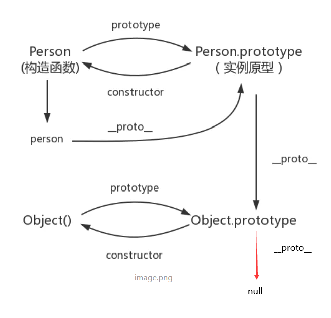

# Vue

> 基于[【官网】](https://cn.vuejs.org/)
>
> 以下版本为：Vue 2.x、Vue-router 3.x、Vuex 3.x、ES6、Node.js 12.13.1、Babel 7.x、Webpack 5

## 一、基本概念

Vue 是一套用于构建用户界面的渐进式 JavaScript 框架。

> [Vue 渐进式框架的理解](https://blog.csdn.net/qq_37600506/article/details/107211439)：
>
> 渐进式代表的含义是：主张最少。可以让开发人员选取 vue 中的部分功能结合自己的组件和模块进行开发，而不是强推给开发者除了需要的功能以外还附加需要理解的知识。
>
> 每个框架都不可避免会有自己的一些特点，从而会对使用者有一定的要求，这些要求就是主张，主张有强有弱，它的强势程度会影响在业务开发中的使用方式：
>
> - Angular：它两个版本都是强主张的，如果你用它：必须使用它的模块机制、必须使用它的依赖注入、必须使用它的特殊形式定义组件（这一点每个视图框架都有，难以避免）。所以 Angular 是带有比较强的排它性的，如果你的应用不是从头开始，而是要不断考虑是否跟其他东西集成，这些主张会带来一些困扰。
> - React：它也有一定程度的主张，它的主张主要是函数式编程的理念，比如说：你需要知道什么是副作用、什么是纯函数、如何隔离副作用。它的侵入性看似没有 Angular 那么强，主要因为它是软性侵入。
> - Vue：Vue 可能有些方面是不如 React，不如 Angular，但它是渐进的，没有强主张，你可以在原有大系统的上面，把一两个组件改用它实现，当 JQuery 用；也可以整个用它全家桶开发，当 Angular 用；还可以用它的视图，搭配你自己设计的整个下层用。你可以在底层数据逻辑的地方用 OO 和设计模式的那套理念，也可以函数式，都可以，它只是个轻量视图而已，只做了自己该做的事，没有做不该做的事，仅此而已。

### （一）[MVVM](https://segmentfault.com/a/1190000006599500)

MVVM（Model-View-ViewMode、双向数据绑定）把前端的视图层，分为了三部分：Model（保持的是每个页面中的单独数据），View（每个页面中 HTML 结构） ，VM ViewModel（View 和 Model 之间的调度者）。

双向数据绑定是指：把 Model 绑定到 View，当我们用 JavaScript 代码更新 Model 时，View 就会自动更新；如果更新了 View，Model 的数据也自动被更新。

Vue 的 MVVM 为了让开发更加方便，提供了数据的双向绑定的功能。通过框架提供的指令，开发者只需要关心数据的业务逻辑，不再关心 DOM 是如何渲染数据到页面上，或是从页面上获取到 DOM。

> 以前学 JS、JQ 的时候，在函数中需要经常书写代码获取到 DOM 对象并赋值，现在只需要用提供的 `{{ }}` 等指令就可以直接在页面上显示数据，简化开发。

#### 1、实现方式

- 发布订阅模式（backbone.js）：通过 sub、pub 的方式实现数据和视图的绑定监听，更新数据的方式通常时 `vm.set('property', value)`。

  > 我们更希望直接通过 `vm.property = value` 方式更新数据，同时自动更新视图。

- 脏值监测（angular.js）：设置 setnterval()定时轮询，对比数据是否有变更来决定是否更新视图。

  > 当然 Angular 不会使用定时轮询，只有指定事件触发时进行脏值监测：
  >
  > - DOM 事件，例如：用户输入文本、点击按钮等。
  > - XHR 响应事件（也就是 ajax 响应）。
  > - 浏览器 Location 变更事件。
  > - Timer 时间（$timeout/$interval）。
  > - 执行$digest()或$apply()。

- 数据劫持（vue.js）：Vue 采用数据劫持结合发布订阅模式，通过 `Object.defineProperty()` 来劫持各属性的 setter、getter，在数据变动时发布消息给订阅者，触发相应的监听回调。

  > [Object.defineProperty()](https://developer.mozilla.org/zh-CN/docs/Web/JavaScript/Reference/Global_Objects/Object/defineProperty)介绍：此函数可以更加详细地设置对象的属性的描述（就像 mysql 中设置字段约束一样），例如：能否删除、能否修改、设置 setter/getter 函数（在每次设置属性值或获取属性值时调用）等。

#### 2、Vue 的 MVVM 实现原理


##### （1）[数据监听器 Observe](https://segmentfault.com/a/1190000008377887)

对数据对象（`data {}` 中的对象）的所有属性进行监听，如有变动可拿到最新值并通知订阅者。

实现方式：使用 `Object.defineProperty()` 循环递归给对象的每个属性添加 getter/setter。在 getter 中，将获取属性值的 Watcher 存入 Watcher 数组；在 setter 中，当修改属性值时触发 setter，获取对应的 Watcher 数组，调用 Watcher 的 notify()函数。

##### （2）指令解析器 Compile

循环递归扫描和解析 el 对应标签的每个子标签的 Vue 指令（包括事件指令和普通指令，例如：`@click、v-text、{{}}` 等），为该节点上的每一个 Vue 指令对应的变量或函数进行初始化（初始化时执行一次更新函数），同时实例化一个 Watcher，Watcher 中绑定一个更新函数（用于更新 Html 标签的文本、属性或函数）。

##### （3）Watcher

Watcher 作为 Observe 和 Compile 的桥梁，能够订阅并收个每个属性变动的通知，执行 Vue 指令对应 Watcher 绑定的更新函数，从而更新视图。

> 注意：在 Compile 中初始化 Watcher 时，会触发 Watcher 的 get()函数，get()函数中会对象指定属性赋值，从而触发属性的 getter，将 Watcher 存入 Watcher 数组。

##### （4）MVVM

MVVM 作为数据绑定的入口，整合 Observe、Compile 和 Watcher。通过 Observer 来监听数据变化；通过 Compile 来解析编译 Vue 指令；通过 Watcher 搭起 Observer 和 Compile 之间的通信桥梁，达到 `数据变更 -> 视图更新` 和 `视图交互变化（input）-> 数据变更` 的双向绑定效果。

实现方式：调用 observe()函数，并给对象添加监听器 `__ob__` 属性；调用 `new Compile()`，解析 el 节点。

> `__ob__` 是 Object 的 Observe 的构造函数，主要用来表示当前对象是否被 Vue 监听。

## 二、Vue

### （一）组件选项

在 JavaScript 中的基本结构，其中传入 Vue 的对象参数叫做组件选项：

```js
// 组件选项为 {el: '#app', data: {}, ......} 等
let myVue = new Vue({el: '#app', data: {}, ......})
```

#### 1、el

提供一个在页面上已存在的 DOM 元素作为 Vue 实例挂载目标，一般都是用 Css 选择器作为 Vue 实例控制作用的区域。

> [注意](https://segmentfault.com/q/1010000012520601/)：
>
> - 提供的元素只能作为挂载点。不同于 Vue 1.x，所有的挂载元素会被 Vue 生成的 DOM 替换。因此不推荐挂载 root 实例到 `<html>` 或者 `<body>` 上。
> - 如果 render 函数和 template 属性都不存在，挂载 DOM 元素的 HTML 会被提取出来用作模板，此时，必须使用 Runtime + Compiler 构建的 Vue 库。

#### 2、data

存储数据。Vue 会监听数据的改变，只要数据以发生改变，就会自动同步到页面，所以 data 中的数据总是最新的。

#### 3、methods

定义当前 Vue 实例所有可用的方法。

```html
<!-- methods 中方法的两种调用方式 -->

<!-- 传入参数，调用方法并获取返回值 -->
<div @click="myMethods(myParam)" />

<!-- 只调用方法，不获取返回值 -->
<div @click="myMethods" />
```

#### 4、filters

过滤器是调用函数前先处理一遍数据再渲染到前端，可以链式编程。

> 注意：过滤器中不能使用 `this` 关键字，若需使用什么，需要通过自定义参数传入。

##### （1）全局过滤器

所有被 Vue 实例挂载的目标都可以使用。

```vue
<script>
   //第一个参数是固定获取管道前的参数（这里是指name），后面的参数是自定义传入的参数
Vue.fliter("过滤器名称"，function(data, .......){
  return  "对data进行操作，再返回";
});

var myVue = new vue({
  el:"#app",
  data:{
    name = "名字"
  }
});
</script>

<div id="app">
  <p>{{name | "过滤器名称（自定义传入的参数）"}}</p>
</div>
```

##### （2）私有过滤器

当私有过滤器和全局过滤器同名时，优先使用私有过滤器。

```vue
<script>
var myVue = new Vue(
  el: "#app",
  data: {
    name = "名字"
  },
  //定义私有过滤器
  filters: {
    "过滤器名称" : function (data,......) {
      return "对data进行操作，再返回";
    }
  }
);
</script>

<div id="app">
  <p>{{name | "过滤器名称（自定义传入的参数）"}}</p>
</div>
```

##### （3）默认过滤器

Vue 有默认自带的过滤器。

```vue
<script>
new Vue({ el: "", data: { msg: "abc" } });
</script>
<p>
  //1.首字母大写: capitalize 
  {{ msg | capitalize}}  
  //2.全部大写: uppercase 
  {{ msg | uppercase  }} 
  //3.全部小写:lowercase 
  {{ msg | lowercase  }} 
</p>
```

#### 5、watch

可以监听到 data 中指定数据的变化，然后触发 watch 中对应的处理函数。

```vue
<script>
var vm = new Vue({
  el: "#app",
  data: {
    firstName: "jack",
    lastName: "chen",
    fullName: "jack - chen",
  },
  watch: {
    // 第一个参数是新数据，第二个参数是旧数据
    firstName: function (newVal, oldVal) {
      this.fullName = newVal + " - " + this.lastName;
    },
    lastName: function (newVal, oldVal) {
      this.fullName = this.firstName + " - " + newVal;
    },
  },
});
</script>
```

> 注意：watch 中对应的处理函数名称和 data 中要监听的数据键一致。

监听属性中还提供两个属性：

- immediate：刚初始化 Vue 实例时，便会执行监听属性函数。
- deep：当监听属性对象中的属性修改时，也会执行监听属性函数。

```vue
<script>
var vm = new Vue({
  ......
  watch: {
    'myObject': {
      handler(val) {
        console.log(val)
      },
      immediate: true,
      deep: true
    }
  }
});
</script>
```

#### 6、computed

在 computed 中可以定义一些属性，这些属性叫做计算属性，计算属性的本质就是一个方法，不过在使用的时候把它当作属性而不是方法来使用。

```vue
<div id="app">
  <input type="text" v-model="firstName">
  <input type="text" v-model="lastName">
  <!-- 点击按钮重新为 计算属性 fullName 赋值 -->
  <input type="button" value="修改fullName" @click="changeName">
  <span>{{ fullName }}</span>
</div>

<script>
var vm = new Vue({
  el: "#app",
  data: {
    firstName: "jack",
    lastName: "chen",
  },
  methods: {
    changeName() {
      this.fullName = "TOM - chen2";
    },
  },
  computed: {
    fullName: {
      // getter计算并返回结果
      get: function () {
        return this.firstName + " - " + this.lastName;
      },
      // setter也可以通过结果值改变去修改所用到的数据
      set: function (newVal) {
        var parts = newVal.split(" - ");
        this.firstName = parts[0];
        this.lastName = parts[1];
      },
    },
  },
});
</script>
```

> 注意：
>
> - 计算属性调用的时候不能当作方法去调用，而是当作普通的 data 中的数据去调用。
> - 只要计算属性这个方法中所用到的任何数据改变，就会重新计算属性方法的返回值。
> - 计算属性的求值结果会被缓存起来，只要使用到的数据未改变，计算属性调用的时候就是一直使用这个缓存起来的值。
> - 计算属性中只有 Date.now()这个值时不会更新，因为 Date.now()不是响应式依赖：

一般来说计算属性调用的时候不能当作方法去调用，而是当作普通的 data 中的数据去调用。但是若想给计算属性传参，可以当作方法去调用，不过需要使用 JavaScript 闭包的概念。

> [JavaScript 闭包](https://blog.csdn.net/cauchy6317/article/details/81167572)：闭包是指有权访问另一个函数作用域中的变量的函数。在一个函数里面嵌套另一个函数，内部函数对其外部函数是私有的，内部函数可以访问所有外部函数变量，此时内部函数就是一个闭包。

```vue
<div id="app">
  <!-- myType 相当于一个函数 -->
  <span>{{ myType(1) }}</span>
  <span>{{ myType(2) }}</span>
  <span>{{ myType(3) }}</span>
</div>

<script>
var vm = new Vue({
  ......
  computed: {
    // 当第一次初始化 myType 时，`myType = function(type) { return list.filter((x) => x.type === type) }`，此时的 myType 函数其实是一个闭包，可以访问 list 变量
    myType: {
      let list = this.list
      return function(type) {
        return list.filter((x) => x.type === type)
      }
    }
  }
});
</script>
```

#### 7、components

组件的出现，就是为了拆分 Vue 实例的代码量的，能够让我们以不同的组件，来划分不同的功能模块，将来我们需要什么样的功能，就可以去调用对应的组件即可。

##### （1）自定义全局组件

① 使用 `Vue.extend()` 配合 `Vue.component()` 方法：

```vue
<script>
var login = Vue.extend({ template: "<h1>登录</h1>" });

// 也可以使用这种写法
// var login= { template: '<h1>登录</h1>' };

Vue.component("login", login);
</script>
```

② 使用 `Vue.component()` 方法：

```vue
Vue.component('register', { template: '
<h1>注册</h1>
' });
```

③ 将模板标签定义到 script 标签外：

```vue
<template id="tmpl">
  <div><a href="#">登录</a> | <a href="#">注册</a></div>
</template>

<script>
//同时，需要使用 Vue.component() 来定义组件：
Vue.component("account", { template: "#tmpl" });
</script>
```

##### （2）自定义私有组件

```vue
<script>
var app = new Vue({
  el: "#app",
  components: {
    "my-component": {
      template: "<div>这是一个局部的自定义组件，只能在当前Vue实例中使用</div>",
      data: function () {
        return {};
      },
    },
  },
});
</script>

//调用方法
<div id="app">
  <mycomponent></mycomponent>
  <my-component></my-component>
</div>
```

> 注意：
>
> - 若组件命名的时候是驼峰的书写形式 `myLogin1`，在使用时可以写成 `<my-login1 />`。
> - `<template>` 中有且仅有一个根标签。
> - 当 Vue 实例作为组件被多个页面共用时，data 属性也会被多个页面共用，若一个页面更改 data 中的数据，其他页面也可以看到更改后的 data。Vue 实例提供 `data()` 函数，获取 data()函数的返回值作为 data 存储数据，这样 Vue 实例被多个页面共用时，data()函数的返回值都是新的对象，就不会有数据共享问题。
> - 使用 DOM 作为模版时 (例如，将 el 选项挂载到一个已存在的元素上)，你会受到 HTML 的一些限制，因为 Vue 只有在浏览器解析和标准化 HTML 后才能获取模板内容。尤其像这些元素 `<ul>、<ol>、<table>、<select>` 限制了能被它包裹的元素，而一些像 `<option>` 这样的元素只能出现在某些其它元素内部。所以使用受限制的元素时会导致一些问题，此时可以用限制元素的 `is` 属性,例如：`<tr is="my-component">` ，相当于用 `<tr>` 包裹这个组件。

##### （3）组件切换

通过 transition 切换组件可以实现使用不同的组件切换时的动画效果：

```vue
<!-- transition 标签的 mode 属性控制组件切换顺序 -->
<transition mode="in-out">  
    <!-- 使用Vue的component标签 -->
    <component :is="'组件名称的字符串'或者data中的键" />
</transition>
```

##### （4）父子组件

components 属性相当于 vue 下的一个子组件，默认无法访问到父组件中的 data 上的数据和 methods 中的方法。

① 三种传递数据方式：

- 子组件通过 prop 属性获取父组件值

```vue
//要先在父组件vue区域中引用子组件
<div id="app">
   <my-com v-bind:子组件自定义的属性名称="父组件data的键" />
</div>

<script>
var app = new Vue({
  el: "#app",
  data: {},
  components: {
    myCom: {
      template: "<div>{{ 子组件自定义的属性名称 }}</div>",
      props: {
        子组件自定义的属性名称: {
          type: "类型", // 也可以为数组 [类型1, 类型2],
          default: "默认值", // 父组件不传时的默认值
          required: true, // 是否必须要父组件传值
        },
      },
    },
  },
});
</script>
```

- `this.$refs.子组件ref名称` 来获取子组件 DOM，可以直接获取组件的 data 数据和 methods 方法；子组件可以通过 `this.$parent` 获取父组件的 DOM。
- 通过 localStorage 本地缓存存储数据，父子组件都可以把数据放在里面，进行传递。

② 传递方法：

```vue
<div id="app">
   <my-com v-on:子组件自定义的属性名称="父组件方法的名称" />
</div>

<script>
var app = new Vue({
  el: "#app",
  data: {},
  components: {
    myCom: {
      template: "<div>{{ 子组件自定义的属性名称 }}</div>",
      methods: {
        sonMethod() {
          // 若父组件的方法有形参，从第二个参数开始都可以传实参，可以用这个特性让父获取子的data
          this.$emit("子组件自定义的属性名称", args......)
        }
      }
    }
  }
});
</script>
```

当父类给子类传递回调方法时，除了想获取子组件实参外，还想传入自己的参数。有[三种解决方式](https://github.com/vuejs/vue/issues/5735)：

```vue
<!-- 当子组件只传入一个参数时，使用$event表示子组件的参数 -->
<my-com @sonMthods="parentMethod($enent, parentArgs......)" />

<!-- 当子组件传入多个参数时，使用arguments关键字表示子组件的参数数组 -->
<my-com @sonMthods="parentMethod(arguments, parentArgs......)" />

<!-- 使用箭头函数获取 -->
<my-com
  @sonMthods="(sonAtgs......) => parentMethod(sonAtgs......, parentArgs......)"
/>
```

#### 8、directive

Vue 也允许注册自定义指令。

> 注意，在 Vue2.0 里面，代码复用的主要形式和抽象是组件，然而有的情况下，你仍然需要对纯 DOM 元素进行底层操作，这时候就会用到自定义指令。

##### （1）全局自定义指令

```vue
<script>
//自定义v-focus指令
Vue.directive("focus", {
  // 钩子函数
});
</script>

<input v-focus />
```

##### （2）私有自定义指令

```vue
<script>
//自定义v-focus指令
var myVue = new vue(){
  el : ...,
  data : ...,
  directives : {
    focus : {
    // 钩子函数
    }
  }
};
</script>

<input v-focus />
```

##### （3）自定义指令的钩子函数

钩子函数是指由系统消息触发的函数。

① 有以下钩子函数：

- bind：只调用一次，指令第一次绑定到元素时调用，用这个钩子函数可以定义一个在绑定时执行一次的初始化动作，但是元素还没有重新插入到 DOM 中，和行为相关的操作不会生效。
- inserted：只调用一次，被绑定元素插入父节点时调用（父节点存在即可调用，不必存在于 document 中）。
- update：被绑定元素所在的模板更新时调用，而不论绑定值是否变化。通过比较更新前后的绑定值，可以忽略不必要的模板更新。
- componentUpdated：被绑定元素所在模板完成一次更新周期时调用。
- unbind：只调用一次， 指令与元素解绑时调用（也就是绑定的 DOM 销毁时调用，例如：`v-if="false"时销毁`）。

② 钩子函数参数有：

- el: 指令所绑定的元素，可以用来直接操作 DOM 。
- binding: 一个对象，包含以下属性：
  - name: 指令名，不包括 v- 前缀。
  - value: 指令的绑定值， 例如： v-my-directive=”1 + 1”, value 的值是 2。
  - oldValue: 指令绑定的前一个值，仅在 update 和 componentUpdated 钩子中可用。无论值是否改变都可用。
  - expression: 绑定值的字符串形式。 例如 v-my-directive=”1 + 1” ，expression 的值是 “1 + 1”。
  - arg: 传给指令的参数。例如 v-my-directive:foo， arg 的值是 “foo”；v-my-directive:foo.bar，arg 的值是 “foo”。
  - modifiers: 一个包含修饰符的对象。 例如： v-my-directive.foo.bar, 修饰符对象 modifiers 的值是 { foo: true, bar: true }；v-my-directive:foo.bar，修饰符对象 modifiers 的值是 { bar: true }
- vnode: Vue 编译生成的虚拟节点，查阅 VNode API 了解更多详情。
- oldVnode: 上一个虚拟节点，仅在 update 和 componentUpdated 钩子中可用。

> 注意：
>
> - 除了 el 之外，其它参数都应该是只读的，尽量不要修改他们。如果需要在钩子之间共享数据，建议通过元素的 dataset 来进行。
>
> - 定义的时候不需要加 `v-` 前缀，调用的时候需要。
> - 和行为有关的操作，会在内存中保存一下，没有插入到 dom 中就会失效，应该使用 inserted 函数；和样式相关的操作，只要通过指令绑定给了元素，不管这个元素有没有被插入到页面中去，这个元素肯定有了一个内联的样式，将来元素肯定会显示到页面中，浏览器的渲染引擎必然会解析样式，应用给这个元素，所以可以使用 binding 钩子函数。

### （二）[Vue 生命周期](https://segmentfault.com/a/1190000011381906?utm_source=tag-newest)

从 Vue 实例创建、运行、到销毁期间，总是伴随着各种各样的事件，这些事件，统称为生命周期。


#### 1、创建期间的函数

- beforeCreate：实例刚在内存中被创建出来，此时还没有初始化好 data 和 methods 属性。

- created：实例已经在内存中创建好，此时 data 和 methods 已经创建，此时还没有开始编译模板，已经可以调用 data 和 methods。

- beforeMount：此时已经完成了模板的编译，但是还没有挂载到页面中，也就是页面中 vue 指令还不能获取到 data 和 methods。

- mounted：此时已经将编译好的模板挂载到了页面指定的容器中显示。

  > 只有在这之后才能操作 DOM 节点。

#### 2、运行期间的函数

- beforeUpdate：更新 template 的 vue 指令数据，并且保存在内存中。状态更新之前执行此函数， 此时 data 中的状态值是最新的，但是界面上显示的数据还是旧的，因为此时还没有开始重新渲染 DOM 节点。
- updated：将内存中的 template 挂载到 html 页面的节点，此时 data 中的状态值和界面上显示的数据，都已经完成了更新，界面已经被重新渲染好。

#### 3、销毁期间的函数

- beforeDestroy：实例销毁之前调用。

  > 在这一步，实例仍然完全可用。

- destroyed：Vue 实例指示的所有东西都会解绑定，所有的事件监听器会被移除，所有的子实例也会被销毁。

#### 4、`<keep-alive>`

`<keep-alive>` 用于离开前组件，跳转到属于同一个 `<keep-alive>` 的另一个组件时，会缓存前组件而不销毁。

跳转到属于同一个`<keep-alive>`的另一个组件，会执行 deactivated()函数；若又从另外一个组件跳回来，则执行 activated()函数；当组件销毁时，执行 destroyed()函数（所以这两个函数不能同时执行）。

> 在 2.2.0 及更高版本中，activated()和 deactivated()会在 `<keep-alive>` 树内所有的嵌套组件中触发。

#### 5、执行顺序

执行顺序：beforeCreated、watch（immediate 时）、created、beforeMount、mounted、activated、beforeUpdate、updated、deactivated/（beforeDestory、destroyed）。

> 注意：computed 中的函数只有在被调用时才会执行，所以不管在生命周期中那里调用都会执行，不过要注意在 beforeCreated 中调用时，若使用了 data 的数据，则此时的数据还没有初始化。

### （三）事件修饰符和键盘修饰符

#### 1、事件修饰符

用于修饰事件该如何进行，Vue 的事件修饰符可以链式编程。

- 事件.stop：可以阻止冒泡( 当一个元素接收到事件的时候 会把他接收到的事件传给自己的父级，一直到 window 。注意这里传递的仅仅是事件，并不传递所绑定的事件函数，所以如果父级没有绑定事件函数，就算传递了事件也不会有什么表现，但事件确实传递了，就算子中没有事件，但是对子进行事件操作的时候还是会触发父级的相关事件。）

- 事件.prevent：阻止默认事件，也就是每个阻止每个事件的发生。

- 事件.capture：添加事件监听器时使用事件捕获模式（由外向里触发事件）。

- 事件.self：只当事件在该元素本身（不是子元素冒泡而来的事件）触发时触发回调。

- 事件.once：事件只触发一次。

#### 2、键盘修饰符

修饰键盘敲击某个按键后触发的事件。

```vue
<!--按下enter键后触发事件-->
<a href="#" @keyup.enter="method">
<!--按下f2键后触发事件-->
<a href="#" @keyup.113="method">
<!--自定义f2按键修饰符-->
<a href="#" @keyup.myF2="method">
<script>
  //自定义全局按键修饰符
  Vue.config.keyCodes.myF2=113
</script>
```

[js 里面的键盘事件对应的键码](http://www.cnblogs.com/wuhua1/p/6686237.html)

### （四）vue 中样式

#### 1、使用 class 批量样式

（1）数组：

```vue
<h1 :class="['red', 'thin', italic]">这是一个邪恶的H1</h1>
```

（2）数组中使用三元表达式：

```vue
<h1
  :class="['red', 'thin', isActive ? 'active' : 'deactive']"
>这是一个邪恶的H1</h1>
```

（3）数组中嵌套对象：

```vue
<h1 :class="['red', 'thin', { active: isactive }]">这是一个邪恶的H1</h1>
```

（4）直接使用对象：

```vue
<h1 :class="{"red": true, "italic": true, "active": true, "thin": true}">这是一个邪恶的H1</h1>
```

#### 2、使用内联样式

（1）直接使用对象：

```vue
<h1 :style="{ color: 'red', 'font-size': '40px' }">这是一个善良的H1</h1>
```

（2）在 data 上定义：

在元素中，通过属性绑定的形式，将样式对象应用到元素中。

```vue
<script>
var myVue = new vue(){
  el : ...,
  data: {
    h1StyleObj: { color: 'red', 'font-size': '40px', 'font-weight': '200' }
  }
};
</script>

<h1 :style="h1StyleObj">这是一个善良的H1</h1>
```

（3）数组方式引用：

在元素中，通过属性绑定的形式，将样式对象应用到元素中。

```vue
<script>
var myVue = new vue(){
  el : ...,
  data: {
    h1StyleObj: { color: 'red', 'font-size': '40px', 'font-weight': '200' },
    h1StyleObj2: { fontStyle: 'italic' }
  }
};
</script>

<h1 :style="[h1StyleObj, h1StyleObj2]">这是一个善良的H1</h1>
```

### （五）[Vue 的过渡和动画](https://cn.vuejs.org/v2/guide/transitions.html)

动画能够提高用户的体验，帮助用户更好的理解页面中的功能。Vue 提供了 `transition` 的封装组件，在下列情形中，可以给任何元素和组件添加进入/离开过渡：

- 条件渲染 (使用 `v-if`)
- 条件展示 (使用 `v-show`)
- 动态组件
- 组件根节点

#### 1、普通标签的三种过渡方式

（1）过渡类名：

```vue
//HTML结构
<div id="app">
  <input type="button" value="动起来" @click="myAnimate">
  <!-- 使用 transition 将需要过渡的元素包裹起来 -->
  <transition name="fade">
    <div v-show="isshow">动画哦</div>
  </transition>
</div>

<script>
//VM 实例
var vm = new Vue({
  el: '#app',
  data: {
    isshow: false
  },
  methods: {
    myAnimate() {
      this.isshow = !this.isshow;
    }
  }
});
</script>


//定义两组类样式
<style>
/* 定义进入和离开时候的过渡状态 */
.fade-enter-active,
.fade-leave-active {
  transition: all 0.2s ease;
  position: absolute;
}

/* 定义进入过渡的开始状态和离开过渡的结束状态 */
.fade-enter,
.fade-leave-to {
  opacity: 0;
  transform: translateX(100px);
}
</style>
```

（2）使用第三方 CSS 动画库：

```vue
//导入动画类库：
<link rel="stylesheet" type="text/css" href="./lib/animate.css">

//定义 transition 及属性：
<transition enter-active-class="fadeInRight" leave-active-class="fadeOutRight" :duration="{ enter: 500, leave: 800 }">
  <div class="animated" v-show="isshow">动画哦</div>
</transition>
```

（3）使用动画钩子函数：

```vue
//定义 transition 组件以及三个钩子函数：
<div id="app">
  <input type="button" value="切换动画" @click="isshow = !isshow">
  <transition @before-enter="beforeEnter" @enter="enter" @after-enter="afterEnter">
    <div v-if="isshow" class="show">OK</div>
  </transition>
</div>

<script>
//VM 实例
var vm = new Vue({
  el: '#app',
  data: {
    isshow: false
  },
  methods: {
    //定义三个 methods 钩子方法：
    // 动画进入之前的回调
    beforeEnter(el) {
      el.style.transform = 'translateX(500px)';
    },
    // 动画进入完成时候的回调
    enter(el, done) {
      el.offsetWidth;
      el.style.transform = 'translateX(0px)';
      done();
    },
    // 动画进入完成之后的回调
    afterEnter(el) {
      this.isshow = !this.isshow;
    }
  }
});
</script>


//定义动画过渡时长和样式：
<style>
.show{
  transition: all 0.4s ease;
}
</style>
```

> 注意：
>
> - 可以在 `<transition>` 标签中增加 name 属性自定义进场和出场标签类名称。
> - 如果只想实现半场动画（只想进场或者出场），使用 JavaScript 的进场和出场钩子函数。

#### 2、`v-for` 的列表过渡

```vue
<style>
// 定义过渡样式
.list-enter,
.list-leave-to {
  opacity: 0;
  transform: translateY(10px);
}

.list-enter-active,
.list-leave-active {
  transition: all 0.3s ease;
}
</style>

// 定义DOM结构，其中，需要使用 transition-group 组件把v-for循环的列表包裹起来：
<div id="app">
  <input type="text" v-model="txt" @keyup.enter="add">

  <transition-group tag="ul" appear name="list">
    <li v-for="(item, i) in list" :key="i">{{item}}</li>
  </transition-group>
</div>

<script>
var vm = new Vue({
  el: "#app",
  data: {
    txt: "",
    list: [1, 2, 3, 4],
  },
  methods: {
    add() {
      this.list.push(this.txt);
      this.txt = "";
    },
  },
});
</script>
```

> 注意：
>
> - 实现列表动画的时候被 v-for 渲染的需要使用 `<transitionGroup>` 包裹。
>
> - 如果要为 v-for 循环创建的元素设置动画，必须为每一个元素设置 ：key
>
> - `<transition-group>` 中 tag 属性值让 `<transition>` 标签在 HTML 界面显示成某个标签，默认为 `<span>`，appear 属性让列表实现淡入。

`<transition-group>` 组件还有一个特殊之处。不仅可以进入和离开动画，还可以改变定位。要使用这个新功能只需了解 `v-move` 特性，它会在元素的改变定位的过程中应用。`v-move` 和 `v-leave-active` 结合使用，能够让列表的过渡更加平缓柔和：

```vue
<style>
.v-move {
  transition: all 0.8s ease;
}
.v-leave-active {
  position: absolute;
}
</style>
```

### （六）[Slot 插槽](https://cn.vuejs.org/v2/guide/components-slots.html)

Slot 插槽是 Vue 提出来的一个概念，正如名字一样，插槽用于决定将所携带的内容，插入到指定的某个位置，从而使模板分块，具有模块化的特质和更大的重用性。

> 插槽显不显示、怎样显示是由父组件来控制的，而插槽在哪里显示就由子组件来进行控制。

```vue
<!-- 父组件 -->
<template>
  <div>
    <h1>我是父组件</h1>
    <son>
      <template>
        <span>这是插槽信息</span>
      </template>
    </son>
  </div>
</template>

<!-- 子组件 Son -->
<template>
  <div>
    <h2>我是子组件 Son</h1>
    <!-- 插槽 -->
    <slot></slot>
  </div>
</template>
```

#### 1、默认内容

可以在子组件插槽中添加默认内容，父组件不使用子组件插槽时，会展示插槽中的默认内容。

```vue
<!-- 父组件 -->
<template>
  <div>
    <h1>我是父组件</h1>
    <son></son>
  </div>
</template>

<!-- 子组件 Son -->
<template>
  <div>
    <h2>我是子组件 Son</h1>
    <!-- 子组件插槽中的默认内容 -->
    <slot>默认插槽内容</slot>
  </div>
</template>
```

#### 2、具名插槽

有时候子组件需要多个插槽，此时就需要为插槽取名，未取名的插槽默认名字为 default。

父组件 `<template>` 包裹要传入子组件插槽的内容，使用 `slot=子组件插槽名字` 将内容放入相应具名插槽中。

> Vue2.6 提供 `v-slot:子组件插槽名字` 用于代替 `slot=子组件插槽名字`，不过 v-slot 只能放在 `<template>` 上，slot 可以放在任意标签上。`v-slot:子组件插槽名字` 可以缩写为 `#子组件插槽名字`。
>
> 推荐使用 `<template>` 包裹传入子组件插槽的内容，任何没有被包裹在带有 v-slot 的 `<template>` 中的内容都会被视为默认插槽的内容。

```vue
<!-- 父组件 -->
<template>
  <son>
    <template slot="header">
      <h1>Here might be a page title</h1>
    </template>

    <template v-slot:default>
      <p>A paragraph for the main content</p>
      <p>And another one</p>
    </template>
    <!-- 和上面效果相同 -->
    <!--
    <p>A paragraph for the main content.</p>
    <p>And another one</p>-->

    <!--
    <template #default>
      <p>A paragraph for the main content</p>
      <p>And another one</p>
    </template>-->

    <template slot="footer">
      <p>Here's some contact info</p>
    </template>
  </son>
</template>

<!-- 子组件 -->
<template>
  <div>
    <slot name="header"></slot>
    <slot></slot>
    <slot name="footer"></slot>
  </div>
</template>
```

#### 3、作用域插槽

可以将子组件中 data 数据作为 `<slot>` 元素的一个 attribute 绑定上去，绑定在 `<slot>` 元素上的 attribute 被称为插槽 prop，父组件传入子组件插槽的内容中可以使用此 prop，使用 `v-slot:子组件插槽名字="自定义prop名字"` 获取 prop。

> Vue2.6 之前使用 slot-scope 获取 prop，不过已经废弃。`v-slot:子组件插槽名字="自定义prop名字"` 相当于 slot 和 slot-scope 两个属性的结合。

```vue
<!-- 父组件 -->
<template>
  <son>
    <template #default="mySlotProp">
      <span>{{ mySlotProp.myName }}</h1>
        <span>{{ mySlotProp.myAge }}</h1>
        <span>{{ mySlotProp.myData }}</h1>
    </template>

    <!-- 使用解构函数获取，和上面效果相同 -->
    <!--
    <template #default="{myName, myAge, myData}">
      <span>{{ myName }}</h1>
        <span>{{ myAge }}</h1>
        <span>{{ myData }}</h1>
    </template>-->

   <!-- Vue2.6 之前的写法 -->
   <!--
    <template slot="default" slot-scope="{myName, myAge, myData}">
      <span>{{ myName }}</h1>
        <span>{{ myAge }}</h1>
        <span>{{ myData }}</h1>
    </template>-->
  </son>
</template>

<!-- 子组件 -->
<template>
  <div>
    <slot :myName="myName" :myAge="myAge" :myData="myData"></slot>
  </div>
</template>
```

### （七）[provide / inject](https://cn.vuejs.org/guide/components/provide-inject.html)

#### 1、prop 逐级透传问题

通常情况下，父组件向子组件传值时会使用 props 属性。但是有一些多层级嵌套的组件，形成了一颗巨大的组件树，而某个深层的子组件需要一个较远的祖先组件中的部分数据。在这种情况下，如果仅使用 props 则必须将其沿着组件链逐级传递下去，这会非常麻烦：


若此时 `<Root>` 组件需要向 `<DeepChild>` 组件传值，虽然这里的 `<Footer>` 组件可能根本不关心这些 props，但为了使 `<DeepChild>` 能访问到它们，仍然需要定义并向下传递。如果组件链路非常长，可能会影响到更多这条路上的组件，这一问题被称为**prop 逐级透传**。

`provide` 和 `inject` 可以帮助我们解决这一问题。一个父组件相对于其所有的后代组件，会作为**依赖提供者**。任何后代的组件树，无论层级有多深，都可以**注入**由父组件提供给整条链路的依赖。也就是说在父组件中添加 provide 属性，就可以在任一后代组件中使用 inject 属性获取 provide 提供的数据。


#### 2、provide 属性

对于 provide 上的每一个属性，后代组件会用**其键名为注入名**查找**期望注入的值**，属性的值就是要提供的数据。

```js
// 方式1
export default {
  provide: {
    // 这种形式访问不到 this
    // message: this.message
    message: 'hello!'
  }
}

// 方式2：
export default {
  data() {
    return {
      message: 'hello!'
    }
  },
  provide() {
    // 使用函数的形式，可以访问到 `this`
    return {
      message: this.message
    }
  }
}
```

##### （1）provide()函数

除了在一个组件中提供依赖，我们还可以在整个应用层面（也就是 main.js 或 App.vue 中添加）提供依赖。

```js
import { createApp } from "vue";

const app = createApp({});

app.provide(/* 注入名 */ "message", /* 值 */ "hello!");
```

在应用级别提供的数据在该应用内的所有组件中都可以注入，当然也可以在组件中使用 provide()函数：

```js
// test.js 文件
import { provide } from "vue";

provide("message", "hello");
```

#### 3、inject 属性

要注入上层组件 provide 提供的数据，需使用 inject 属性来声明：

```js
export default {
  // provide 中提供的 message 注入到 inject 的 message 中
  inject: ["message"],
  data() {
    return {
      // 注入会在组件自身的状态之前被解析，因此你可以在 data() 中访问到注入的属性
      fullMessage: this.message,
    };
  },
};
```

当以数组形式使用 `inject`，注入的属性会以同名的 key 暴露到组件实例上；当以对象形式使用 `inject`，可以为 `inject` 中的注入的属性提供别名和默认值。

```js
export default {
  // 当声明注入的默认值时，必须使用对象形式
  inject: {
    message: {
      from: "message", // 当与原注入名同名时，这个属性是可选的
      default: "default value",
    },
    user: {
      // 需要独立数据的，请使用工厂函数
      default: () => ({ name: "John" }),
    },
  },
};
```

> 注意：
>
> - 默认情况下，`inject` 假设传入的注入名会被**某个祖先链上的组件提供**。如果该注入名的确没有任何组件提供，则会抛出一个运行时警告。
> - `inject` 会沿祖先链向上寻找 `provide` 提供的注入属性，只要找到就停止。

##### （1）inject()函数

Vue 也提供函数的方式注入值：

```js
import { inject } from "vue";
import { fooSymbol } from "./injectionSymbols";

// 注入值的默认方式
const foo = inject("foo");

// 注入响应式的值
const count = inject("count");

// 注入一个值，若为空则使用提供的默认值
const bar = inject("foo", "default value");

// 注入一个值，若为空则使用提供的工厂函数
const baz = inject("foo", () => new Map());

// 注入时为了表明提供的默认值是个函数，需要传入第三个参数
const fn = inject("function", () => {}, false);
```

#### 4、[非响应式](https://zhuanlan.zhihu.com/p/184967263)

`provide`和`inject`绑定并不是可响应的。这是刻意为之的。然而，如果你传入了一个可监听的对象，那么其对象的 property 还是可响应的。

```js
// Father.js
export default {
  components: {
    Son
  },
  data() {
    return {
      message: 'hello', //
      messageObject: {
        prop: 'helloObject'
      }
    }
  },
  provide() {
    return {
      message: this.message,
      messageObject: this.messageObject
    }
  }
}

// Son.js
export default {
  inject: ['message', 'messageObject']
}
```

分别修改 message 值和 messageObject 属性值，可以在子组件中看到 message 值并未改变，而 messageObject 的属性值改变了。可以看出对于基本类型是非响应式的，子组件无法获取响应后的值。有两种解决方案：

（1）把值转为箭头函数

```js
// Father.js
provide() {
  return {
    message: () => this.message
  }
}

// Son.js
export default {
  inject: ['message'],
  data() {
    return {
      fullMessage: message() // 子类获取的 message 是一个函数，需要调用才能获取值
    }
  }
}
```

由于不是响应式，这个函数将会被调用多次，下面是更好的解决方法。

（2）传入 Vue 实例

更好一些的解决方案是把`provide`所在的 Vue 实例给传递下去：

```js
// Father.js
provide() {
  return {
    message: this // 传入 this
  }
}

// Son.js
export default {
  inject: ['message'],
  data() {
    return {
      fullMessage: message.message // 子类获取 message 属性
    }
  }
}
```

### （八）render 渲染

#### 1、虚拟 DOM

虚拟 DOM（Virtual Document Object Model，简称 VDOM）是一种编程概念，意为将目标所需的 UI 通过数据结构**虚拟**地表示出来，保存在内存中，然后将真实的 DOM 与之保存同步。

虚拟 DOM 在 Vue 文件中通常以 `<template>`标签、template 属性等形式表现：

```js
const vnode = {
  type: "div",
  props: {
    id: "hello",
  },
  children: [
    /* 更多 vnode */
  ],
};
```

这里所说的 vnode 即一个纯 JavaScript 的对象 (一个虚拟节点)，它代表着一个 `<div>` 元素。它包含我们创建实际元素所需的所有信息。它还包含更多的子节点，这使它成为虚拟 DOM 树的根节点。

#### 2、[渲染过程](https://cn.vuejs.org/guide/extras/rendering-mechanism.html)


Vue 组件挂载时会发生以下几件事：

- 编译（Complied）：Vue 模板被编译成渲染函数——即用来返回虚拟 DOM 树的函数。
- 挂载（Mounted）：运行时渲染器调用渲染函数，遍历返回的虚拟 DOM 树，并基于它创建实际的 DOM 树。
- 更新：当一个依赖（可以理解为 data 中的数据）发生变化后，副作用（可以理解为回调函数）会重新运行，这时候会创建一个更新后的虚拟 DOM 树。运行时渲染器遍历这棵新树，将它与旧树进行比较，找出它们之间的区别，然后将必要的更新应用到真实 DOM。

#### 3、模板和渲染函数

Vue 模板（也就是 template）会被预编译成虚拟 DOM 渲染函数（render()函数）。Vue 也提供 render()函数使我们不用模板编译，直接手写渲染函数。**在处理高动态的逻辑时，渲染函数相比于模板更加灵活，因此可以完全地使用 JavaScript 来构建想要的 vnode**。区别：

- 模板（template）：
  - 模板更贴近实际的 HTML。这使得我们能够更方便地重用一些已有的 HTML 代码片段，能够带来更好的可访问性体验、能更方便地使用 CSS 应用样式，并且更容易使设计师理解和修改。
  - 由于其确定的语法，更容易对模板做静态分析。这使得 Vue 的模板编译器能够应用许多编译时优化来提升虚拟 DOM 的性能表现。
- 渲染函数（render）：
  - 渲染函数一般只会在需要处理高度动态渲染逻辑的可重用组件中使用。

#### 4、[渲染函数](https://v2.cn.vuejs.org/v2/guide/render-function.html)

##### （1）render()

Vue 提供 render() 来声明渲染函数，render 有一个 h()函数作为形参，返回值为字符串、vnode 或 vnode 数组：

```js
export default {
  data() {
    return {
      returnType: 'string'
      msg: 'hello'
    }
  },

  render(h) {
    switch(this.type){
      // 1、返回字符串
      case 'string':
        return this.msg
      // 2、返回单个 vnode
      case 'vnode':
        return h('div', this.msg)
      // 3、返回 vondoe 数组
      case 'vnodeList':
        return  Array.from({ length: 20 }).map(() => h('div', this.msg))
    }
  }
}
```

> 注意：
>
> - render()函数和 template 模板同时存在时，template 模板不生效。
> - **Vue2 和 Vue3 的 render()函数还是有区别的，这里主要讲的是 Vue2 的 render()，穿插和 Vue3 的不同，注意查找对应的 API**。

##### （2）创建 vnode

① [使用 JSX 来创建 vnode](https://github.com/vuejs/jsx-vue2)

```jsx
// 使用大括号 {} 来嵌入变量值
const vnode = <div id={dynamicId}>hello, {userName}</div>;
```

JSX 是 JavaScript 的一个类似 XML 的扩展，可以像写 HTML 一样创建 vnode，可读性更好。虽然最早由 React 引入，但实际上 JSX 语法并没有定义运行时语义，并且能被编译成各种不同的输出形式。

> 注意：
>
> - Vue 的 JSX 编写代码方式与 React 中 JSX 的编写代码方式不同，因此不能在 Vue 应用中使用 React 的 JSX 代码。
> - 在 TypeScript 中使用 JSX 时，需要在 tsconfig.json 中配置 `"jsx": "preserve"`。

**在 JSX 中，可以正常地在标签中添加属性，也可以使用扩展运算符导入对象。**

```jsx
const vnode = <input type="email" />;

// 使用扩展运算符导入对象
const obj = {
  type: "email",
  placeholder: "Enter your email",
};
// ... 三个点表示扩展运算符
const vnode = <input {...{ attrs: obj }} />;
```

② Vue3 中提供一个 [h()函数](https://cn.vuejs.org/guide/extras/render-function.html#creating-vnodes)用于创建 vnode：

```js
import { h } from "vue";

const vnode = h(
  "div", // type
  { id: "foo", class: "bar" }, // props
  [
    /* children */
  ]
);
```

h() 是 hyperscript 的简称——意思是**能生成 HTML 的 JavaScript**。这个名字来源于许多虚拟 DOM 实现默认形成的约定。一个更准确的名称应该是 createVnode()，但当你需要多次使用渲染函数时，一个简短的名字会更省力。

> 注意：vnode 对象必须唯一，也就是说一个 js 对象只能对应一个 vnode。
>
> ```js
> function render() {
>   const p = h("p", "hi");
>   return h("div", [
>     // 一个 js 变量对应两个 vnode 是无效的
>     p,
>     p,
>   ]);
> }
> ```
>
> 可以使用一个工厂函数来生成多个 vnode：
>
> ```js
> function render() {
>   return h(
>     "div",
>     Array.from({ length: 20 }).map(() => {
>       return h("p", "hi");
>     })
>   );
> }
> ```

##### （3）createVnode() 函数参数

createVnode()函数（一般写作 h()函数，简短省力，下面都写作 h()函数）有三个参数：

- 第一个参数（必填）：可以为 `String | Object | Function`

  - String：表示的是 HTML 标签名，也可以是子组件的名称。

  - Object：是 Vue 对象的组件选项对象。

    ```js
    render (h) {
      let myVue = {
        // 这里的 slot 是必需的
        template: '<div class="detail"><slot></slot></div>',
        created () {
          console.log(this)
        }
      }
      return h(
        myVue,
        {lass: { 'item-details': true }}
      )
    }
    ```

  - Function：返回一个含有标签名或者组件选项对象的 async 函数。

- 第二个参数（选填）：包括 HTML 的 attribute、JS 对象的 property 以及 Vue 的部分组件选项。

  ```js
  {
    // 与 `v-bind:class` 的 API 相同，
    // 接受一个字符串、对象或字符串和对象组成的数组
    class: {
      'my-class-name': true,
      bar: false
    },
    // 与 `v-bind:style` 的 API 相同，
    // 接受一个字符串、对象，或对象组成的数组
    style: {
      color: 'red',
      fontSize: '14px'
    },
    // 普通的 HTML attribute
    attrs: {
      id: 'my-id'
    },
    // 若本身是一个组件，props 表示传给组件的数据，对应组件中的 props
    props: {
      myProp: 'bar'
    },
    // DOM property
    domProps: {
      innerHTML: 'baz'
    },
    // 事件监听器在 `on` 内，
    // 但不再支持如 `v-on:keyup.enter` 这样的修饰器。
    // 需要在处理函数中手动检查 keyCode；也可以使用 withMofifiers 函数
    on: {
      // 与 @click 等价
      click: this.clickHandler
    },
    // 仅用于组件，用于监听原生事件，而不是组件内部使用
    // `vm.$emit` 触发的事件。
    nativeOn: {
      click: this.nativeClickHandler
    },
    // 自定义指令。注意，你无法对 `binding` 中的 `oldValue`
    // 赋值，因为 Vue 已经自动为你进行了同步。
    directives: [
      {
        name: 'my-custom-directive',
        value: '2',
        expression: '1 + 1',
        arg: 'foo',
        modifiers: {
          bar: true
        }
      }
    ],
    // 若第一个参数表示的是一个组件，scopedSlots 表示传递给组件的插槽，作用域插槽的格式为：
    // { name: props => VNode | Array<VNode> }
    scopedSlots: {
      default: (props) => h('span', props.text)
    },
    // 如果组件是其它组件的子组件，需为插槽指定名称
    slot: 'name-of-slot',
    // 其它特殊顶层 property
    key: 'myKey',
    ref: 'myRef',
    // 如果你在渲染函数中给多个元素都应用了相同的 ref 名，
    // 那么 `$refs.myRef` 会变成一个数组。
    refInFor: true
  }
  ```

- 第三个参数（选填）：表示子 vnode，可以为字符串或数组（包含字符串类型和 vnode 类型）。

  ```js
  import Foo from "./Foo.vue";
  import Bar from "./Bar.jsx";

  function render() {
    return h("div", [h(Foo), h(Bar)]);
  }
  ```

重点讲一下 slot 在 render 中的代码编写方式：

###### ① slot 插槽

Vue 提供一个称为 `$slots / $scopedSlots` 的组件实例，在子组件中，用于访问父组件传递给子组件的 slot 插槽或作用域插槽。

```vue
<!-- 父组件 Father.vue -->
<div>
  <son>
    <div :slot="'notExistSlot'">I'm a slot，I'm undefined in Son's Components</div>
    <div>I'm default slot</div>
  </son>
</div>

<!-- 子组件 Son.vue -->
let son = new Vue({
  name: 'son',
  template: '<div></div>'
  mounted() {
    console.log('我是子组件，下面输出父组件给我的 slot：', this.$slots)
  }
})
```

从以下输出结果中可以看出两点信息：

- 子组件中不存在 `<slot/>` 时，父组件传递给子组件的插槽也可以被 `$slots` 获取，只是不展示。
- 父组件中没有命名的插槽统一看作 default 插槽。
- `this.$slots` 的返回结果是以 slot 名为键名，以 vnode 为键值的对象；若父组件没有传递插槽，则返回值为空对象。


a. 在 createVnode()函数中使用插槽

言归正传，我们想为某个子组件 vnode 定义 slot 插槽，可以使用以下方式：

```vue
<script>
function render(h) {
  return h("div", [
    // 定义普通插槽
    this.$slots.default,
    // 定义作用域插槽
    this.$scopedSlots.paramsSlot({
      test: this.myTest,
    }),
  ]);
}
</script>

// 相当于 Son.vue 中
<template>
  <div>
    <slot />
    <slot name="paramsSlot" :test="myTest" />
  </div>
</template>
```

当我们想在父组件中传递 slot 插槽给子组件，可以使用以下方式：

```js
function render(h) {
  return h("Son", {
    scopedSlots: {
      default: function () {
        return h("span", "default");
      },
      paramsSlot: function (props) {
        return h("span", props.text);
      },
    },
  });
}
```

b. 在 JSX 中使用插槽

在 JSX 中定义插槽就简单一点：

```jsx
const vnode =
<div>
  // 可以直接使用标签，也可以使用 $slots
  <slot />
  {this.$slots.default1()}
  <slot name="paramsSlot" :test="myTest" />
  {this.$slots.paramsSlot1({ test: this.myTest })}
</div>
```

在 JSX 中使用插槽也很方便：

```jsx
let obj =
const vnode =
<son>
  // 具名插槽
  <div slot="default">默认值</div>
</son>

// 使用 scopedSlots 传递作用域插槽
const scopedSlots = {
  default: () => <div>默认值</div>,
  paramsSlot1: (props) => <div>{props}</div>
}
<son scopedSlots={scopedSlots}></son>
// 也可以使用扩展操作符
<son {...{scopedSlots}}></son>
```

## 三、[Vue-Router](https://router.vuejs.org/zh/introduction.html)

网络原理中，路由指的是根据上一接口的数据包中的 IP 地址，查询路由表转发到另一个接口，它决定的是一个端到端的网络路径。
使用 Vue 构建项目，Vue 本身就可以通过组合组件来组成应用程序，当引入 `Vue-Router` 后，我们需要处理的是将组件（components）映射到路径（routes），然后在需要的地方进行使用渲染。

- 后端路由：对于普通的网站，所有的超链接都是 URL 地址，所有的 URL 地址都对应服务器上对应的资源，这个对应关系叫做路由。
- 前端路由：对于单页面应用程序来说，主要通过[URL 中的 hash(#号)](http://www.cnblogs.com/joyho/articles/4430148.html)及之后的路径，来实现不同页面之间的切换。同时，hash 有一个特点：HTTP 请求中不会包含 hash 相关的内容；所以，单页面程序中的页面跳转主要用 hash 实现。

> 以下使用的是 Vue3、Vue-Router4 版本。

### （一）路由基本写法

```vue
<template>
  <div id="app">
    <h1>Hello App!</h1>
    <p>
      <!-- <a href="#/login">登录</a> -->
      <!-- <a href="#/register">注册</a> -->
    </p>
    <p>
      <!-- 使用 router-link 组件来导航，默认渲染为一个 a 标签，效果和上面定义的a标签相同 -->
      <router-link to="/">Go to Home</router-link>
      <router-link to="/about">Go to About</router-link>
    </p>

    <!-- url 匹配到的组件将渲染在这里 -->
    <router-view></router-view>
  </div>
</template>

<script>
// 1、定义路由组件
const Home = { template: "<div>Home</div>" };
const About = { template: "<div>About</div>" };

// 2、定义一些路径对象，每个 url 都需要映射到一个组件。
const routes = [
  { path: "/", component: Home },
  { path: "/about", component: About },
];

// 3、创建路由实例并传递 `routes` 配置
const router = VueRouter.createRouter({
  // 内部提供了 history 模式的实现。为了简单起见，我们在这里使用 hash 模式（也就是上面提到的#号）
  history: VueRouter.createWebHashHistory(),
  routes,
});

// 4、创建 Vue 实例
var vm = new Vue({
  el: "#app",
  // 将路由对象，注册到 Vue 实例上
  router,
  data: {},
  computed: {
    username() {
      return this.$route.params.username;
    },
  },
  methods: {
    goToDashboard() {
      if (isAuthenticated) {
        this.$router.push("/dashboard");
      } else {
        this.$router.push("/login");
      }
    },
  },
});
</script>
```

#### 1、`VueRouter.createRouter()`

用于创建路由实例，并配置 routes 数组（路由到组件的映射关系）。

> Vue-Router3 中使用 `new VueRouter({......})` 或 `new Router({......})` 创建路由实例。

一般将路由实例注册到全局 Vue 实例上，可以通过 `this.$router` 获取路由实例，通过 `this.$route` 获取 routes 数组中当前路由所在对象的信息。

#### 2、scrollBehavior

当切换到新路由时，想要页面滚到顶部，或者是保持原先的滚动位置，就像重新加载页面那样。 scrollBehavior 属性让你可以自定义路由切换时页面如何滚动，提供三个参数：

- to：路径对象，即将进入的目标。
- from：路径对象，即将离开的位置。
- savedPosition：只有当这是一个 `popstate` 导航时才可用（由浏览器的后退/前进按钮触发）。

```js
const router = createRouter({
  history: createWebHashHistory(),
  routes: [...],
  scrollBehavior (to, from, savedPosition) {
    // return 期望滚动到哪个的位置
  }
})
```

滚动函数提供几种返回值：

- 绝对位置

```js
const router = createRouter({
  scrollBehavior(to, from, savedPosition) {
    // 始终滚动到顶部
    return { top: 0 };
  },
});
```

- 相对位置

通过 `el` 传递一个 CSS 选择器或一个 DOM 元素。在这种情况下，`top` 和 `left` 将被视为该元素的相对偏移量。

```js
const router = createRouter({
  scrollBehavior(to, from, savedPosition) {
    // 始终在元素 #main 上方滚动 10px
    return {
      // 也可以这么写
      // el: document.getElementById('main'),
      el: "#main",
      top: -10,
    };
  },
});
```

- 锚点

滚动到锚点。

```js
const router = createRouter({
  scrollBehavior(to, from, savedPosition) {
    if (to.hash) {
      return {
        el: to.hash,
      };
    }
  },
});
```

- 延迟滚动

需要返回一个 Promise。

```js
const router = createRouter({
  scrollBehavior(to, from, savedPosition) {
    return new Promise((resolve, reject) => {
      setTimeout(() => {
        resolve({ left: 0, top: 0 });
      }, 500);
    });
  },
});
```

#### 2、`<router-link>`

使用 `<router-link>` 组件来导航，默认渲染为一个 `<a>`，效果和上面定义的 a 标签相同。to 属性表示跳转的链接。

```vue
<!-- Vue-Router4 使用 slot 渲染为其他标签 -->
<router-link to="/about" custom v-slot="{ navigate }">
  <span @click="navigate" @keypress.enter="navigate" role="link">About Us</span>
</router-link>

<!-- Vue-Router3 使用 tag 渲染为其他标签，event 为事件 -->
<router-link to="/about" tag="span" event="dblclick">About Us</router-link>
```

#### 3、`<router-view>`

用于显示与 url 对应的组件，可以放在任何地方，实现 `<frame>` 一样的的布局。

name 属性用于给 `<router-view>` 视图命名，默认值为 default。一个视图对应一个组件（component），多个视图需要对应多个组件（components）。

```vue
<template>
  <div class="container">
    <router-view class="view left-sidebar" name="LeftSidebar"></router-view>
    <router-view class="view main-content"></router-view>
    <router-view class="view right-sidebar" name="RightSidebar"></router-view>
  </div>
</template>

<script>
const routes = [
  // 需要使用 components 属性，键值对应视图的 name 名称
  { path: "/", components: { LeftSidebar, default: Home, RightSidebar } },
];
</script>
```

#### 4、路由样式

`<router-link>` 在前端默认渲染为 `<a>`，并且 `class="router-link-exat-active router-link-active"`，若想修改该标签默认的类名，则需在 router 对象中配置 linkActiveClass 属性，可以覆盖默认 class 类名。

```vue
<template>
  <div>
    <router-link to="/" tag="div">....</router-link>
    <!-- 修改前在前端渲染效果 -->
    <!-- <a href="/" class="router-link-exat-active router-link-active"></a> -->
    <!-- 修改后在前端渲染效果 -->
    <!-- <div class="myactive">....</div> -->
  </div>
</template>

<script>
const router = VueRouter.createRouter({
  linkActiveClass: "myactive",
});
</script>
```

### （二）路径对象

路径对象就是 routes 数组中的一个元素。

#### 1、name 命名路径

除了 path 属性之外，路径对象还提供 name 属性，有以下优点：

- 没有硬编码的 URL
- params 的自动编码/解码（也就是说会将动态路由匹配的 params 属性，放入 url 中）。
- 防止你在 url 中出现打字错误。
- 绕过路径排序（如显示一个）

```vue
<template>
  <!-- 第一种写法，这里生成的 url 是 `/url/erina` -->
  <router-link :to="{ name: 'user', params: { username: 'erina' } }" />

  <!-- 第二种写法 -->
  <router-link to="/url/erina" />
</template>

<script>
const routes = [
  {
    path: "/user/:username",
    name: "user",
    component: User,
  },
];

var vm = new Vue({
  ......
  methods: {
    test() {
      // 第三种写法
      router.push({ name: "user", params: { username: "erina" } });
    },
  },
});
</script>
```

#### 2、redirect 重定向

路径对象也提供 redirect 属性进行重定向，有三种取值：

##### （1）path 字符串

```js
// 由 `/home` 重定向到 `/`
const routes = [{ path: "/home", redirect: "/" }];
```

##### （2）路径对象

```js
// 由 `/home` 重定向到 name 为 homepage 的路径对象
const routes = [{ path: "/home", redirect: { name: "homepage" } }];

// 由 `/home` 重定向到 `/home/page`
const routes = [{ path: "/home", redirect: { path: "/home/page" } }];
```

##### （3）函数

```js
const routes = [
  {
    // /search/screens -> /search?q=screens
    path: "/search/:searchText",
    redirect: (to) => {
      // 方法接收目标路径对象作为参数
      // return 重定向的字符串路径/路径对象
      return { path: "/search", query: { q: to.params.searchText } };
    },
  },
];
```

> 注意：
>
> - 导航守卫并没有应用在跳转路由上，而仅仅应用在重定向后的目标上。在上面的例子中，在 `/home` 路由中添加 beforeEnter 守卫不会有任何效果。
> - 在写 redirect 的时候，可以省略 component 属性，因为它从来没有被直接访问过，所以没有组件要渲染。唯一的例外是嵌套路由：如果一个路径对象记录有 children 和 redirect 属性，它也应该有 component 属性。

#### 3、alias 别名

可以为当前 path 起一个或多个别名，别名可以为相对路径或绝对路径。

```js
// `/` 或 `home` 都指向同一个组件
const routes = [{ path: "/", component: Homepage, alias: "/home" }];

const routes = [
  {
    path: "/users",
    component: UsersLayout,
    children: [
      // 为这 3 个 URL 呈现 UserList
      // - /users
      // - /users/list
      // - /people
      { path: "", component: UserList, alias: ["/people", "list"] },
    ],
  },
];

const routes = [
  {
    path: "/users/:id",
    component: UsersByIdLayout,
    children: [
      // 为这 3 个 URL 呈现 UserDetails
      // - /users/24
      // - /users/24/profile
      // - /24
      { path: "profile", component: UserDetails, alias: ["/:id", ""] },
    ],
  },
];
```

#### 4、children 嵌套路由

一些页面由多层嵌套组件组成，当一个路由跳转到另一个路由时，只想切换页面中的某些组件时，可以使用 children 属性声明嵌套路由，在路由对应组件中添加 `<router-view>` 作为嵌套视图。


```vue
<template>
  <!-- UserSettings.vue -->
  <div>
    <h1>User Settings</h1>
    <NavBar />
    <!-- 嵌套视图 -->
    <router-view />
    <router-view name="helper" />
  </div>
</template>

<script>
const routes = [
  {
    path: "/settings",
    // 你也可以在顶级路由就配置命名视图
    component: UserSettings,
    // 嵌套路由
    children: [
      {
        path: "emails",
        // UserEmailsSubscriptions 被渲染到 UserSettings 的 `<router-view>` 内部
        component: UserEmailsSubscriptions,
      },
      {
        path: "profile",
        // 由 `/settings/emails` 跳转到 `/settings/profile` 时，将 UserSettings 组件替换为 UserProfile 组件，同时渲染 `name=helper` 的 UserProfilePreview 组件。
        components: {
          default: UserProfile,
          helper: UserProfilePreview,
        },
      },
      {
        // 不拼接父路由（`/settings/rootProfile`），直接为：`/rootProfile`
        path: "/rootRrofile",
        components: {
          default: UserProfile,
          helper: UserProfilePreview,
        },
      },
    ],
  },
];
</script>
```

> 注意：
>
> - 不以 `/` 开头的嵌套路由需要拼接父路由访问。
> - 以 `/` 开头的嵌套路径被视为从根路径开始，但是仍然可以利用组件嵌套，而不必拼接父路由。

#### 5、meta 元信息

路径对象提供 meta 属性，可以将任意信息附加到路由上。

```js
const routes = [{
  path: ':id',
  component: PostsDetail
  // 任何人都可以阅读文章
  meta: { requiresAuth: false }
}]

router.beforeEach((to, from) => {
  // `this.$route.meta` 会获取当前路由对象及直接子路由对象的 meta 字段的并集
})
```

### （三）路由传参方式

在路由规则中定义参数，可以将 url 地址中 hash 的参数传给组件使用。

#### 1、query 方式传参

不需要修改路由中的 path， 通过 `this.$route.query` 就可以获取到参数。

```vue
<template>
  <router-link to="/login?name=zs&age=12">
</template>

<script>
//在组件的属性中都可以使用
var register = Vue.extend({
  template: '<h1>注册组件 --- {{this.$route.query.name}}</h1>'
});
</script>
```

#### 2、params 方式传参

需要修改 path 进行匹配， 通过 `this.$route.params` 就可以获取到参数。

```vue
<template>
  <router-link to="/login/zs/12">
</template>

<script>
var register = Vue.extend({
  template: '<h1>注册组件 --- {{this.$route.params.name}}</h1>'
});

const route = [{path: "/login/:name/:age", component: login}]
</script>
```

### （四）动态路由匹配

当需要将给定匹配模式的路由映射到同一个组件，同时将路由中匹配的值以键值对存储到 `this.$route.params` 中，需要使用动态路由匹配。路径参数用冒号 `:` 表示，当一个路由被匹配时，它的 params 的值将在每个组件中以 `this.$route.params` 的形式暴露出来。

> 例如：我们可能有一个 User 组件，它应该对所有用户进行渲染，但用户 ID 不同。在 Vue-Router 中，我们可以在路径中使用一个动态字段来实现，我们称之为路径参数。

```vue
<script>
const routes = [
  // 匹配 `/user/myId对应的值`，会以键值对 { myId: myId对应的值 } 的形式存储到 `this.$route.params` 中
  // 使用 `this.$route.params.myId` 获取对应的值
  { path: "/users/:myId", component: User },

  // `/user/` 或 `/user` 匹配不到此路由
];
</script>
```

#### 1、监听路径对象的改变

由 `/settings/emails` 跳转到 `/settings/profile` 时，相同的组件实例被重复使用，意味着组件的生命周期钩子函数不会被调用。此时可以监听 `this.$route` 或其中的属性，用于对路由变化做出响应。

```vue
<script>
var vm = new Vue({
  watch: {
    $route: function (newVal, oldVal) {
      // 对路由变化做出响应...
    },
  },
});
</script>
```

也可以使用 beforeRouteUpdate()路由守卫对路由变化做出响应。

```vue
<script>
var vm = new Vue({
  async beforeRouteUpdate(to, from) {
    // 对路由变化做出响应...
  },
});
</script>
```

#### 2、路由匹配语法

##### （1）指定开头路由

匹配以指定开头的路由参数，格式为 `指定开头:路由参数`，将指定开头后的值赋给路由参数。

```vue
<script>
const routes = [
  // 匹配以`/myHead`开头的路由，例如：`/myHeadBodyValue`，然后以键值对 { isBody: BodyValue }存储到 `this.$route.params` 中
  { path: "/myHead:isBody" },
];
</script>
```

##### （2）自定义正则

在动态路由中，可以使用正则表达式限定匹配的路由，格式为：`:路由参数(正则表达式)`。

```vue
<script>
const routes = [
  // 仅匹配数字，例如：`/12`、`/123`；不能匹配其他内容，例如：`/user`、`/isString`等
  { path: "/:orderId(\\d+)" },
  // 匹配其他任何内容
  { path: "/:productName" },
];
</script>
```

##### （3）可重复的参数

需要匹配多个部分路由，使用 `*`（0 个或多个）、`+`（1 个或多个）或 `?`（0 个或 1 个）放在路由参数或正则表达式后。

```vue
<script>
const routes = [
  // 匹配 `/one`、`/one/two`、`/one/two/three`等
  { path: "/:chapters+" },
  // 匹配 `/`、`/one`、`/one/two`、`/one/two/three`等
  { path: "/:chapters*" },
  // 匹配 `/1`、`/1/2`等
  { path: "/:chapters(\\d+)+" },
  // 匹配 `/`、`/1`、`/1/2`等
  { path: "/:chapters(\\d+)*" },
];
</script>
```

### （五）编程式导航

除了使用 `<router-link>` 创建 `<a>` 导航链接，还可以通过 Vue-Router 的实例方法，通过编写代码来实现。

#### 1、push()

想要导航到不同的 URL，可以使用 `this.$router.push()` 函数。这个函数会向 `window.history` 栈添加一个新的记录，所以当用户点击浏览器后退按钮时，会回到之前的 URL。

> 当你点击 `<router-link>` 时，内部会调用这个函数，所以点击 `<router-link :to="...">` 相当于调用 `this.$router.push(...)`。
>
> `router.push()` 和所有其他导航方法都会返回一个 Promise，让我们可以等到导航完成后才知道是成功还是失败。

```js
// 字符串路径
router.push("/users/eduardo");

// 路径对象
router.push({ path: "/users/eduardo" });

// 1、命名的路径对象，并加上参数，让路由建立 url，
// 当 path 为动态路由时，使用 `name` 和 `params` 从自动 URL 编码中获益
router.push({ name: "user", params: { username: "eduardo" } });

// 2、`params` 不能与 `path` 一起使用
router.push({ path: "/user", params: { username } });

// 带查询参数，结果是 /register?plan=private
router.push({ path: "/register", query: { plan: "private" } });

// 带 hash，结果是 /about#team
router.push({ path: "/about", hash: "#team" });
```

#### 2、replace()

它的作用类似于 `router.push`，唯一不同的是，它在导航时不会向 `window.history` 添加新记录，也就是使用后退键时不会回到上一个 url。

#### 3、go()

采用一个整数作为参数，表示在历史堆栈中前进或后退多少步，类似于 `window.history.go(n)`。

```js
// 向前移动一条记录，与 router.forward() 相同
router.go(1);

// 返回一条记录，与router.back() 相同
router.go(-1);

// 如果没有那么多记录，静默失败
router.go(-100);
```

### （六）路由组件传参

组件中使用 `this.$route` 获取 params 时，会让组件与路由紧密耦合，这限制了组件的灵活性，因为它只能用于特定的 url。虽然这不一定是件坏事，但我们可以通过 props 属性来解除这种行为，通过 props 属性可以直接将路径对象的 params 对象传递给组件的 props。

#### 1、布尔模式

当 props 为 true 时，`this.route.params` 将被设置为组件的 props。

```js
const User = {
  // 这里 id 为 this.$route.params.id
  props: ["id"],
  template: "<div>User {{ id }}</div>",
};

const routes = [{ path: "/user/:id", component: User, props: true }];
```

#### 2、命名视图

对于有命名视图的路由，必须为每个命名视图定义 props 配置。

```js
const routes = [
  {
    path: "/user/:id",
    components: { default: User, sidebar: Sidebar },
    // 分别为每个命名视图单独设置 props
    props: { default: true, sidebar: false },
  },
];
```

#### 3、对象模式

当 props 是一个对象时，将原样设置为组件的 props。

```js
const routes = [
  {
    path: "/promotion/from-newsletter",
    component: Promotion,
    props: { newsletterPopup: false, myName: "test" },
  },
];

const User = {
  // 这里直接获取值
  props: ["newsletterPopup", "myName"],
  template: "<div>User {{ id + myName}}</div>",
};
```

#### 4、函数模式

创建一个返回组件 props 的函数。

```js
const routes = [
  {
    path: "/search",
    component: SearchUser,
    // 返回值作为组件的 props
    props: (route) => ({ query: route.query.q }),
  },
];
```

### （七）导航守卫

导航守卫（导航钩子）类似于生命周期钩子，包含路由进入前，进入后，更新时，退出前等几个周期，主要用于控制导航的前进后退或跳转等。

根据作用范围不同，分为：全局导航守卫、私有导航守卫、组件导航守卫。

#### 1、全局导航守卫

##### （1）`router.beforeEach()`

全局前置路由守卫，进入路由之前执行。可用于登录验证、全局路由 loading 等。包含三个参数：

- to：路径对象，即将进入的目标。

- from：路径对象，即将离开的位置。

- next：相当于一个 `new Promise((resolve) => { resolve() })` 中的 resolve，必须执行保证进入下一步，对于不同的参数用不同的效果：

  - next()：不传入参数，进入管道中的下一个钩子函数或目标 url。
  - next(false)：中断当前的导航，如果浏览器中的 url 改变了，那么会重置到 from 路径对象对应的 url 地址。
  - next(path 路径或路径对象)：跳转到指定的 url 地址或路由对象对应的 url 地址。

  > next 一般只能被执行一次，可以出现执行多次的情况，但是只能在所有的逻辑路径不重叠的情况下，否则钩子函数永远不会被解析或报错。

```js
router.beforeEach((to, from, next) => {
  if (to.name !== "Login" && !isAuthenticated) next({ name: "Login" });
  else next();
});
```

##### （2）`router.beforeResolve()`

全局解析守卫，在 beforeRouteEnter()之后执行。可用于获取数据或执行其他操作。

##### （3）`router.afterEach()`

全局后置钩子，在 `router.beforeResolve()` 之后执行，也就是已经跳转到目标路由后执行。可用于分析、更改页面标题、声明页面等辅助功能以及许多其他事情。

> 没有 next，也不会改变导航本身。

```js
router.afterEach((to, from) => {
  sendToAnalytics(to.fullPath);
});
```

#### 2、私有导航守卫

##### （1）beforeEnter()

只属于某个路径对象的导航守卫，在进入此路径对象对应的路由时触发。

> 只有进入路由时触发，不会在 params、query 或 hash 改变时触发。

```js
const routes = [
  // `/users/2` 进入到 `/users/3`，或者从 `/users/2#info` 进入到 `/users/2#projects` 不触发
  {
    path: "/users/:id",
    component: UserDetails,
    beforeEnter: (to, from) => {
      // reject the navigation
      return false;
    },
  },
];

// 也可以接收一个或多个函数
const routes = [
  {
    path: "/users/:id",
    component: UserDetails,
    beforeEnter: [removeQueryParams, removeHash],
  },
  {
    path: "/about",
    component: UserDetails,
    beforeEnter: [removeQueryParams],
  },
];
```

#### 3、组件导航守卫

在组件中使用的导航守卫。

##### （1）beforeRouteEnter()

进入路由对应的组件前触发。

> 注意：
>
> - 由于是在创建组件（beforeCreate()）前触发，因此不能获取组件实例 `this` 。可以传一个回调函数给 next 来访问组件实例，此回调函数在 beforeMount()之后调用。
> - 只有 beforeRouteEnter()的 next 才能传回调函数。

```js
beforeRouteEnter (to, from, next) {
  next(vm => {
    // 通过 vm 访问组件实例
  })
}
```

##### （2）beforeRouteUpdate()

当前路由改变，但是组件被复用时调用。例如：动态路由匹配。

```js
const routes = [
  // `/users/2` 进入到 `/users/3` 时触发
  {
    path: "/users/:id",
    component: UserDetails,
  },
];
```

##### （3）beforeRouteLeave

在导航离开渲染该组件的对应路由时调用，也就是在 beforeDestroy()之前执行。

#### 4、[路由导航解析流程](https://www.jb51.net/article/144337.htm)

- 触发进入其他路由。
- 调用要离开路由的组件守卫 beforeRouteLeave()。
- 调用局前置守卫 `router.beforeEach()`。
- 在重用的组件里调用 beforeRouteUpdate()。
- 调用路由独享守卫 beforeEnter()。
- 解析异步路由组件。
- 在将要进入的路由组件中调用 beforeRouteEnter()。
- 调用全局解析守卫 `router.beforeResolve()`。
- 导航被确认。
- 调用全局后置钩子的 `router.afterEach()`钩子。
- 触发 DOM 更新。
- 执行 beforeRouteEnter()守卫中传给 next 的回调函数。

## 四、[Vuex](https://vuex.vuejs.org/zh/)

Vuex 是专为 Vue 开发的状态管理模式。它采用集中式存储管理应用的所有组件的状态，并以相应的规则保证状态以一种可预测的方式发生变化。

Vuex 充当一个全局变量的角色来存储值，用于解决兄弟组件传值，或一些不相关的组件之间传值的问题。全局变量存储值的方式：

- 另外建 js 文件，使用 js 文件中全局变量保存。

- 使用 Vue 的 mixin 将数据混合插入到组件或页面中。

- 使用 Vuex，更加方便管理全局变量

  > 优缺点：
  >
  > - Vuex 的状态存储是响应式，也就是 Vuex 状态的改变会影响到组件中的数据及页面。
  > - 只有显示调用 commit 方法才能改变 store 中的状态，这样的目的是更加明确地表示用于改变此状态。

### （一）使用 Vuex

```js
import Vue from 'vue'
import Vuex from 'vuex'

// 创建Vuex
Vue.use(Vuex)
const store = new Vuex.Store({ ... })

// 引入Vuex，一般放在 main.js 函数上
new Vue({store: store})
```

### （二）属性

#### 1、state

相当于 Vue 的 data 属性，保存着定义的状态（数据），在根节点注册后，可以 `this.$store.state.变量名` 全局使用。

```js
let store = createStore({
  state() {
    return {
      count: 0,
    };
  },
});
```

##### （1）mapState

mapState 是一个辅助函数，主要用于生成局部组件中的计算属性，函数中可以直接使用 state 或 state 中的参数，返回值是一个对象，简化调用时的代码。

> 在 Vue 中 computed 属性中，若调用很多 state 中的数据，会导致代码很多很冗余，使用 mapState 函数 state 可以减少代码冗余（其实就是少写了 `this.$store.`）。

```js
import { mapState } from "vuex";

export default {
  computed: mapState({
    count: (state) => state.count,

    // 传字符串参数 'count' 等同于 `state => state.count`
    countAlias: "count",

    countPlusLocalState(state) {
      return state.count + this.localCount;
    },
  }),
};
```

当映射的计算属性的名称与 state 的子节点名称相同时，我们也可以给 `mapState` 传一个字符串数组：

```js
computed: mapState([
  // 映射 this.count 为 store.state.count
  "count",
]);
```

#### 2、getter

相当于 Vue 的 computed 属性，通过 `state.变量` 获取 state 中的变量的 computed 值，可以 `this.$store.getter.变量名` 全局使用。

```js
const store = createStore({
  state: {
    todos: [
      { id: 1, text: "...", done: true },
      { id: 2, text: "...", done: false },
    ],
  },
  getters: {
    doneTodos(state) {
      return state.todos.filter((todo) => todo.done);
    },
  },
});
```

##### （1）mapGetters

mapGetters 辅助函数仅仅是将 store 中的 getter 映射到局部组件的计算属性，简化调用时的代码。

```js
import { mapGetters } from "vuex";

export default {
  // ...
  computed: {
    // 使用对象展开运算符将 getter 混入 computed 对象中
    ...mapGetters(["doneTodosCount"]),
    ...mapGetters({
      // 将 doneTodos 映射为组件中 computed 的 doneCount
      doneCount: "doneTodos",
    }),
  },
};
```

#### 3、mutations

相当于 Vue 的 methods 属性，mutations 定义的方法中第一个参数默认为 state，可以 `this.$store.commit('方法名', 参数1, 参数2, ...)` 全局使用，这是修改 state 中数据的唯一方式。

```js
let store = createStore({
  mutations: {
    increment (state, n) {
      state.count += n
    }
  }
}

this.$store.commit('increment', 3) // 3
```

> 注意：
>
> - mutations 中定义的方法中的参数：第一个参数是 Vuex 的 state 属性，必填；后面的参数为调用时传入时的参数。
> - 为了方便状态可预测式的发生变化，mutations 中定义的方法必须是同步函数。

##### （1）mapMutations

mapMutations 辅助函数仅仅是将 store 中的 mutations 映射到局部组件的方法，简化调用时的代码。

```js
import { mapMutations } from "vuex";

export default {
  // ...
  methods: {
    ...mapMutations([
      // 将 `this.increment()` 映射为 `this.$store.commit('increment')`
      "increment",

      // 将 `this.incrementBy(amount)` 映射为 `this.$store.commit('incrementBy', amount)`
      "incrementBy",
    ]),
    ...mapMutations({
      // 将 `this.add()` 映射为 `this.$store.commit('increment')`
      add: "increment",
    }),
  },
};
```

#### 4、actions

和 mutations 属性有点类似，可以在 actions 中定义方法，方法中第一个参数默认为 context，可以 `this.$store.dispatch('方法名', 参数1, 参数2, ...)` 全局使用。

> actions 和 mutations 的异同点：
>
> - actions 中的 context 参数是一个与 store 实例具有相同方法和属性的对象，可以 `context.dispatch` 分发一个 actions、`context.commit` 提交一个 mutations、`context.state` 获取 state 或 `context.getters` 获取 getters；mutations 的 state 参数是 Vuex 的 state 属性。
> - actions 可以是一个异步函数；mutations 必须是同步函数。

```js
let store = createStore({
  actions: {
    incrementAsync({ commit }) {
      setTimeout(() => {
        commit("increment");
      }, 1000);
    },
  },
});

this.$store.dispath("incrementAsync");
```

> 注意：
>
> - actions 中也是通过 commit 一个 mutations 来修改 state 中的数据，而不是直接修改。
> - actions 有返回值，可以返回 Promise 对象实现 Promise 的链式调用。

##### （1）mapActions

```js
import { mapActions } from "vuex";

export default {
  // ...
  methods: {
    ...mapActions([
      // 将 `this.increment()` 映射为 `this.$store.dispatch('increment')`
      "increment",

      // 将 `this.incrementBy(amount)` 映射为 `this.$store.dispatch('incrementBy', amount)`
      "incrementBy",
    ]),
    ...mapActions({
      // 将 `this.add()` 映射为 `this.$store.dispatch('increment')`
      add: "increment",
    }),
  },
};
```

#### 5、module

Vuex 也提供模块化，可以将 store 分割成模块，每个模块拥有自己的 state、getters、mutations、actions 以及子模块：

```js
const moduleA = {
  state: () => ({ ... }),
  mutations: { ... },
  actions: { ... },
  getters: { ... }
}

const store = createStore({
  modules: {
    a: moduleA,
  }
})
```

##### （1）模块的局部状态

对于模块内部的 mutation 和 getter，接收的第一个参数是模块的局部状态对象。

```js
const moduleA = {
  state: () => ({
    count: 0,
  }),
  mutations: {
    increment(state) {
      // 这里的 `state` 对象是模块的局部状态
      state.count++;
    },
  },
  getters: {
    doubleCount(state) {
      return state.count * 2;
    },
  },
};
```

同样，对于模块内部的 action，局部状态通过 `context.state` 暴露出来，根节点状态则为 `context.rootState`：

```js
const moduleA = {
  // ...
  actions: {
    // rootState 是父节点的 state
    incrementIfOddOnRootSum({ state, commit, rootState }) {
      if ((state.count + rootState.count) % 2 === 1) {
        commit("increment");
      }
    },
  },
};
```

对于模块内部的 getter，根节点状态会作为第三个参数暴露出来：

```js
const moduleA = {
  // ...
  getters: {
    sumWithRootCount(state, getters, rootState) {
      return state.count + rootState.count;
    },
  },
};
```

##### （2）命名空间

默认情况下，模块内部 actions、mutations 和 getters 是注册在全局命名空间（使得多个模块能对同一个 actions 或 mutations 做出响应）。

> 注意：
>
> - 在不同且无命名的模块中，若 getters 中的属性命名相同会导致错误。
> - 在不同且无命名的模块中，若 actions 或 mutations 的方法名相同，调用同名的方法，每个模块会对该方法按定义的先后顺序依次执行。
> - 模块内的 state 已经是嵌套的，无命名空间也没问题。
> - getters 中方法有四个参数：state、getters、rootState 和 rootGetters；actions 中方法的第一个参数为 context 对象，除了包含当前 store 的所有属性（commit、dispatch、getters 和 state）还包含根节点的 rootState 和 rootGetters 属性。

通过添加 `namespaced: true` 的方式使其成为带命名空间的模块。当模块被注册后，它的所有 getters、actions 及 mutations 都会自动根据模块注册的路径调整命名。

```js
const store = createStore({
  modules: {
    account: {
      namespaced: true,

      state: () => ({ ... }),  // 模块内的状态已经是嵌套的了，使用 `namespaced` 属性不会对其产生影响
      getters: {
        isAdmin () { ... } // -> getters['account/isAdmin']
      },
      // 嵌套模块
      modules: {
        // 继承父模块的命名空间
        myPage: {
          state: () => ({ ... }),
          getters: {
            profile () { ... } // -> getters['account/profile']
          }
        },

        // 进一步嵌套命名空间
        posts: {
          namespaced: true,

          state: () => ({ ... }),
          getters: {
            popular () { ... } // -> getters['account/posts/popular']
          }
        }
      }
    }
  }
})
```

① 带命名空间的模块访问全局内容

若想访问全局（也就是根节点）的 state 和 getters，可以直接使用 rootState 和 rootGetters，但是若需要在模块内分发全局命名空间的 actions 或提交 mutations，将 `{root: true}` 作为第三参数传给 actions 或提交 mutations 的方法。

```js
modules: {
  foo: {
    namespaced: true,

    getters: {
      // 在这个模块的 getter 中，`getters` 被局部化了
      // 你可以使用 getter 的第四个参数来调用 `rootGetters`
      someGetter (state, getters, rootState, rootGetters) {
        getters.someOtherGetter // -> 'foo/someOtherGetter'
        rootGetters.someOtherGetter // -> 'someOtherGetter'
        rootGetters['bar/someOtherGetter'] // -> 'bar/someOtherGetter'
      },
      someOtherGetter: state => { ... }
    },

    actions: {
      // 在这个模块中， dispatch 和 commit 也被局部化了
      // 他们可以接受 `root` 属性以访问根 dispatch 或 commit
      someAction ({ dispatch, commit, getters, rootGetters }) {
        getters.someGetter // -> 'foo/someGetter'
        rootGetters.someGetter // -> 'someGetter'
        rootGetters['bar/someGetter'] // -> 'bar/someGetter'

        dispatch('someOtherAction') // -> 'foo/someOtherAction'
        dispatch('someOtherAction', null, { root: true }) // -> 'someOtherAction'

        commit('someMutation') // -> 'foo/someMutation'
        commit('someMutation', null, { root: true }) // -> 'someMutation'
      },
      someOtherAction (ctx, payload) { ... }
    }
  }
}
```

② 带命名空间的模块注册全局 actions

当模块 `namespaced: true` 时，actions 必须添加当前命名空间前缀才可以访问，可以在 actions 中使用 `root: true` 属性，将 actions 注册到根节点上。

```js
{
  actions: {
    someOtherAction ({dispatch}) {
      dispatch('someAction') // 根节点可以直接访问
    }
  },
  modules: {
    foo: {
      namespaced: true,

      actions: {
        someAction: {
          root: true,
          handler (namespacedContext, payload) {  } // namespacedContext 还是当前模块的 context
        }
      }
    }
  }
}
```

③ 带命名空间的绑定函数

当使用 mapSate、mapGetters、mapActions 和 mapMutations 这些函数来绑定带命名空间的模块时，会很繁琐：

```js
computed: {
  ...mapState({
    a: state => state.some.nested.module.a,
    b: state => state.some.nested.module.b
  }),
  ...mapGetters([
    'some/nested/module/someGetter', // -> this['some/nested/module/someGetter']
    'some/nested/module/someOtherGetter', // -> this['some/nested/module/someOtherGetter']
  ])
},
methods: {
  ...mapActions([
    'some/nested/module/foo', // -> this['some/nested/module/foo']()
    'some/nested/module/bar' // -> this['some/nested/module/bar']()
  ])
}
```

可以将模块的空间名称字符串作为第一个参数传递给上述函数，这样所有绑定都会自动将该模块作为上下文。于是上面的例子可以简化为：

```js
computed: {
  ...mapState('some/nested/module', {
    a: state => state.a,
    b: state => state.b
  }),
  ...mapGetters('some/nested/module', [
    'someGetter', // -> this.someGetter
    'someOtherGetter', // -> this.someOtherGetter
  ])
},
methods: {
  ...mapActions('some/nested/module', [
    'foo', // -> this.foo()
    'bar' // -> this.bar()
  ])
}
```

可以通过使用 createNamespacedHelpers 创建基于某个命名空间辅助函数。它返回一个对象，对象里有新的绑定在给定命名空间值上的组件绑定辅助函数：

```js
import { createNamespacedHelpers } from "vuex";

const { mapState, mapActions } = createNamespacedHelpers("some/nested/module");

export default {
  computed: {
    // 在 `some/nested/module` 中查找
    ...mapState({
      a: (state) => state.a,
      b: (state) => state.b,
    }),
  },
  methods: {
    // 在 `some/nested/module` 中查找
    ...mapActions(["foo", "bar"]),
  },
};
```

##### （3）动态注册

模块除了静态写在 js 文件中进行注册，Vuex 也提供一些函数来动态注册模块：

```js
import { createStore } from "vuex";
import myModule from "./myModule";

const store = createStore({
  /* 选项 */
});

// 注册模块 `myModule`
store.registerModule("myModule", myModule);

// 注册嵌套模块 `nested/myModule`
store.registerModule(["nested", "myModule"], myModule);

// 卸载模块，不可卸载静态模块
store.unregisterModule("myModule");

store.unregisterModule(["nested", "myModule"]);

// 判断模块是否已经被注册到store
store.hasModule("myModule");
```

> 注意：嵌套模块应该以数组形式传递给动态注册函数，而不是以路径字符串的形式。

##### （4）模块重用

当一个模块被多次重用时，state 也应该像 data 一样声明为一个函数，防止模块间数据相互污染的问题。

## 五、[Axios](http://www.axios-js.com/zh-cn/docs/)

Axios 是一个基于 Promise 的 HTTP 库，可以用在浏览器和 Node.js 中。

其他的异步请求：

- [Ajax](https://developer.mozilla.org/zh-CN/docs/Web/Guide/AJAX/Getting_Started)：原生 ajax 的代码多而且复杂。
- [JQuery Ajax](https://blog.csdn.net/weixin_41432849/article/details/81988058?utm_medium=distribute.pc_relevant_t0.none-task-blog-BlogCommendFromMachineLearnPai2-1.control&dist_request_id=8f95bb80-b167-4861-9d15-4a180da5abd7&depth_1-utm_source=distribute.pc_relevant_t0.none-task-blog-BlogCommendFromMachineLearnPai2-1.control)：JQuery 的 Ajax 是对原生 Ajax 做了一层封装，简化了 Ajax 开发。还是有 Ajax 的其他问题，比如：多个异步请求同步调用，会产生回调地狱。
- [Fetch](https://developer.mozilla.org/zh-CN/docs/Web/API/Fetch_API/Using_Fetch)：Fetch 不同于使用 XMLHttpRequest 实现的 Ajax，Fetch 是更理想的异步请求实现方式。
- [Vue-Resource](https://www.cnblogs.com/chenhuichao/p/9261645.html)：Vue-Resource 在 Vue2.0 后不再更新，建议使用 Axios。

## 六、JavaScript

### （一）[原型和原型链](https://blog.csdn.net/weixin_42614080/article/details/93413476)

#### 1、原型

JavaScript 使用原型模式深克隆创建对象，创建的对象实例可以拥有原型实例的属性和方法。

在 JavaScript 中，每个对象类型（其实本质还是一个 function 函数）都有 prototype 属性，表示该对象类型的原型实例，new 出来的对象实例都是拷贝了这个原型实例。


```js
// 定义并创建对象
function Person() {}
var person = new Person();

// 获取实例原型
console.log(Person.prototype, person.__proto__);

// 设置原型属性或方法
Person.prototype.myPrototype = "自定义属性";
```

#### 2、原型链

在 ES6 之前，JS 没有 class 的概念，无法通过继承来获取另一个对象类型的属性和方法，JS 使用原型链主要解决了对象类型之间的继承关系，相当于产生了继承的作用。

实例原型也有 `__proto__` 属性，默认是指向 `Object.prototype`，而 `Object.prototype.__proto__` 指向 null。修改实例原型的 `__proto__` 属性，就可以继承其他原型实例的属性和方法，从而建立起原型链。



```js
function Father() {}
function Son() {}

// 修改 `Son 的实例原型` 的实例原型为 `Father 的实例原型`
Son.prototype.__proto__ = Father.prototype;
```

从 new 出来的对象获取属性时，会先检查是否拥有该属性，若没有再递归检查其原型实例（实例的 `__proto__` 属性）中是否有该属性，若有，便会返回值。

### （二）[event loop](https://www.jianshu.com/p/c7a0dc9fccd3)

事件循环机制是 JavaScript 身为单线程的函数执行机制，主要是为了解决异步函数造成的阻塞问题。

> JavaScript 是单线程的，意味着只有一个主线程来处理所有的任务。所以，所有任务都需要排队执行，上一个任务结束，才会执行下一个。如果上一个任务耗时很长，那么下一个任务也要一直等着。

任务可以分为两种：

- **同步任务**：在主线程上排队执行的任务。只有上一个任务执行完，才能执行下一个任务；
- **异步任务**：不进入主线程、而进入任务队列（task queue）的任务。只有任务队列通知主线程某个异步任务可以执行了，该任务才会进入主线程执行。异步任务主要有两种：
  - micro task（微任务），包括：process.nextTick，Promise（这里指浏览器实现的原生 Promise），Object.observe，MutationObserver。
  - macro task（宏任务），包括：setTimeout、setInterval 等。


执行顺序：

- 所有同步任务都在 JavaScript 线程上执行，形成一个执行栈。

- 当遇到一个异步任务时，JS 线程并不会等待执行结果，而是将异步任务交由浏览器线程执行并等待结果，并将异步任务回调函数放入任务队列中。

- 当执行栈中的任务全部执行完毕后，将任务队列中的异步任务回调函数放入到执行栈中执行，重复步骤 1。

  > 其中任务队列分为微任务队列和宏任务队列。执行栈执行完后，会先将微任务队列中回调函数执行完（重复步骤 1）；再执行宏任务队列。

### （三）[全局对象](https://developer.mozilla.org/en-US/docs/Glossary/Global_object)

在 JavaScript 中，默认会定义一个全局对象，该全局对象是一个永远存在于**全局作用域**的对象。根据不同的 JavaScript 环境，全局对象的变量名也不一样：

- 在 Web 浏览器中，使用 window 作为全局对象，大部分 Web 上的 JavaScript 代码都使用 [window](https://developer.mozilla.org/en-US/docs/Web/API/Window) 变量名。
- 在 Node.js 下运行的 JavaScript 使用 global 作为全局变量。

> 无论当前环境如何，globalThis 全局属性都可以访问全局对象。

可以将数据绑定在全局对象上，实现全局可用的功能；也可以通过全局对象获取 innerHeight、console、setTimeout() 等属性或方法。

> 获取全局对象的属性或方法时，可以省略不写全局变量，例如 `window.innerHeight` 和 `innerHeight` 效果一样。

window 全局对象有以下重要的属性：

- window：在 JavaScript 中，全局变量始终保留对自身的应用，例如 `window.widow === window`。
- navigator：navigator 表示浏览器对象，用于存储浏览器的属性。navigator 的信息可以很容易地被用户修改，所以 JavaScript 读取的值不一定是正确的。
- screen：screen 表示屏幕（整个电脑屏幕，而不是浏览器）对象，用于存储屏幕信息。
- location：location 表示当前页面的 URL 对象，用于存储 URL 信息。使用 `location.href` 可以获取 URL 路径，调用 `location.reload()` 重新加载页面。
- document：document 表示当前页面的对象，由于 HTML 在浏览器中以 DOM 形式表示为树形结构，`document`对象就是整个 DOM 树的根节点。
- history：history 表示当前页面的浏览历史，JavaScript 可以调用 history 对象的 `back()` 或 `forward()`，相当于用户点击了浏览器的后退或前进按钮。history 属于历史遗留对象，不推荐使用。

## 七、[ES6](https://es6.ruanyifeng.com/#docs/intro)

ES6（ECMAScript6）是 JavaScript 语言的标准，JavaScript 语言是对 ECMAScript 标准的一种实现，在 2015 年已经发布，提供以下新特性：

### （一）变量声明

#### 1、var

var 是 JavaScript 中声明变量的关键字，有以下特性：

- 使用 var 声明的变量，无论在函数中的哪里声明，都被视为声明在函数的顶部。此时又可延伸出两种特性：

  - 在编码时，可以在声明变量之前使用该变量而不报错，值为 `undefined`。

    > ES6 自动使用严格模式，变量必须先声明后使用。

  - 在函数内部任何地方，一个变量名只能 var 声明一次，不能存在同名变量。

- 全局变量视为在全局的顶部。

#### 2、let

let 是 ES6 中提供的关键字，也用于声明变量，变量作用范围为当前代码块及其内的递归子代码块。有以下特性：

- 只能在声明变量之后使用该变量。
- 在子代码块中可以重新声明父代码块的变量。

```js
// 在变量声明之前使用会报错
console.log(a);
let a = 2;

{
  let b = 1;
  {
    // 在子代码块中重新声明父代码块的变量
    let b = 2;
  }
}
```

[let 声明的变量被闭包引用时](https://segmentfault.com/a/1190000015228029)，闭包记录的除了闭包变量还有块级作用域变量。

#### 3、const

const 用于声明常量，和 let 作用域类似，不过声明的常量不可变。

### （二）函数扩展

#### 1、参数默认值

为函数形参提供默认值，当不给形参传参时，会使用此默认值。

```js
function myTest1(first = 0, second) {......}
// 不给first传参，first使用默认值0
myTest1(undefined, 2)

// 在不给second传参时，second默认使用first的值
function myTest2(first = 0, second = first) {......}

// 函数作为默认值
function myTest3(first = 0, second = myFunction()) {......}
```

#### 2、可变参数

形参作为一个数组，可以获取 0 或多个实参。

```js
function myTest(...myArgs) {......}
```

#### 3、arguments

arguments 是一个关键字， 是调用函数时传入的参数组成的数组，在该函数中使用
​。

> 注意：arguments 是函数被调用时实参值，不包含参数默认值。

```js
function myTest(first = 0, second) {
  console.log(arguments);
}
myTest(1, 2); // [1, 2]

// 只有一个实参 2
myTest(undefined, 2); // [2]
```

#### 4、箭头函数

箭头函数是对匿名函数的快捷写法，并且没有自己的 this，arguments，super 和 new.target。这些函数表达式更适用于那些本来需要匿名函数的地方，并且它们不能用作构造函数。

```js
(参数1, 参数2, …, 参数N) => { ...... }

// 相当于：(参数1, 参数2, …, 参数N) =>{ return 表达式; }
(参数1, 参数2, …, 参数N) => 表达式（单一）

// 没有参数的函数应该写成一对圆括号。
() => { ...... }
```

箭头函数不会创建自己的 this,它只会从自己的作用域链的上一层继承 this（这也是箭头函数最常用的用法）。

```js
function Person() {
  this.age = 0;

  setInterval(() => {
    // 这个函数里面的this指的是Person对象
    this.age++;
  }, 1000);
}

var p = new Person();
```

#### 5、立即调用函数

其实是一个匿名函数在创建后，便立即调用了。

```js
let person = (function (name) {
  return {
    getName: function () {
      return name;
    },
  };
})("Nicholas");

// person不再表示这个匿名函数，而是此匿名函数的返回值
console.log(person);
```

### （三）对象扩展

#### 1、变量作为属性名

```js
var lastName = "last name";

// 使用变量作为属性名
var person = {
  [lastName]: "myLast",
};

console.log(person[lastName]);
```

#### 2、属性名排序

在 es6 中，遍历对象的键时，键是按照 ASCII 码表的顺序排序的。

#### 3、更强大的原型

```js
// 使用 myPrototype 作为原型实例创建 myObject 对象实例
var myObject = Object.create(myProtptype);

// 获取myObject对象实例的原型实例
Object.getPrototypeOf(myObject);

// 将 myObject 对象实例的原型实例替换为 myPrototype2
Object.setPrototypeOf(myObject, myPrototype2);
```

#### 4、引入 super

this 指向函数所在的当前对象，super 指向当前对象的原型对象。

> 注意：super 只能用在对象的方法之中，用在其他地方会报错。

```js
// 报错
const obj = {
  foo: () => super.foo,
};

// 报错
const obj = {
  foo: function () {
    return super.foo;
  },
};

// 正确
// 虽然这种简写法和上面效果一致，但是只有对象方法的简写法可以让 JavaScript 引擎确认，定义的是对象的方法。
const obj = {
  foo() {
    return super.foo;
  },
};
```

`super.foo` 等同于 `Object.getPrototypeOf(this).foo`（属性）或 `Object.getPrototypeOf(this).foo.call(this)`（方法）。

```js
const proto = {
  x: "hello",
  foo() {
    console.log(this.x);
  },
};

const obj = {
  x: "world",
  foo() {
    super.foo();
  },
};

Object.setPrototypeOf(obj, proto);

obj.foo(); // "world"
```

上面代码中，`super.foo` 指向原型对象 `proto` 的 `foo` 方法，但是绑定的 `this` 却还是当前对象 `obj`，因此输出的就是 `world`。

### （四）对象解构

对象解构可以方便对象属性或数组元素的提取。

> 虽然对象解构可以玩出很多花样，但是对象解构的作用是减少代码，应该尽量简单易懂，少点花里胡哨。

#### 1、基本用法

```js
let node = {
  type: "Identifier",
  name: "foo",
  inner: {
    age: 20,
  },
};

// 以前的写法
// let type = node.type
// let name = node.name
// let age = node.inner.age

// 变量名和属性名相等
let {
  type,
  name,
  inner: { age },
} = node;
console.log(type, name, age); // "Identifier", "foo", 20

let colors = ["red", "green", "blue"];

// 以前的写法
// let firstColor = colors[0];

// 变量名下标位置和元素下标位置对应
let [firstColor] = colors;

console.log(firstColor); // red
```

#### 2、默认值

默认值生效的条件是：对象的属性值严格等于 `undefined`。

```js
let { a, b = 2, c = 3, d = 4 } = { a: 1, b: null, c: undefined };
console.log(a, b, c, d); // 1, null, 3, 4
```

#### 3、其他变量名

当想变量名和属性名不相等时：

```js
let node = {
  type: "Identifier",
  name: "foo",
};

// 变量名和属性名不相等
let { type: myType, name: myName } = node;
console.log(myType, myName);
```

### （五）Set 和 Map

#### 1、Set

ES6 引入 Set，可以让我们对数组进行去重。

```js
// 传入数组初始化 Set
let mySet = new Set([1, 2, 3, 4, 4]);
console.log(mySet); // [1, 2, 3, 4]

// 对于全等的元素，不会存入 set
mySet.add(4);

// Set 中是否存在某个值
mySet.has(4);

// 删除某个元素
mySet.delete(4);

// 清空 Set
mySet.clear();

mySet.size;
```

#### 2、Map

JavaScript 的 Object 对象本质上是键值对的集合，但是只能使用字符串作为键，Map 可以使用各种数据类型作为键。

```js
// 传入数组初始化 Set
const myMap = new Map([
  ["name", "张三"],
  ["title", "Author"],
]);
console.log(myMap); // {name: '张三', title: 'Auther'}

// 以其他类型作为键
let array = ["1"];
myMap.set(array, "isArray");

// 获取键对应的值
myMap.get(array);

myMap.has(array);
myMap.delete(array);
myMap.clear();
myMap.size;
```

### （六）class

在 ES6 中产生了 class 类的概念，class 可以看作是 ES6 的语法糖，很好的解决了原型的复杂代码。

原型写法：

```js
function Point(x, y) {
  this.x = x;
  this.y = y;
}

Point.prototype.toString = function () {
  return "(" + this.x + ", " + this.y + ")";
};

var p = new Point(1, 2);
```

class 写法：

```js
class Point {
  constructor(x, y) {
    this.x = x;
    this.y = y;
  }

  toString() {
    return "(" + this.x + ", " + this.y + ")";
  }
}

var p = new Point(1, 2);
```

#### 1、constructor()

constructor()是类的默认方法，通过 `new` 命令生成对象实例时，自动调用该方法。一个类必须有 constructor()方法，如果没有显式定义，一个空的 constructor()方法会被默认添加。

constructor()默认返回实例对象（即 `this`），完全可以指定返回另外一个对象。

```js
class Foo {
  constructor() {
    return Object.create(null);
  }
}

new Foo() instanceof Foo; // false
```

#### 2、get 和 set

在类的内部可以使用 get 和 set 关键字，对某个属性设置存值函数和取值函数，拦截该属性的存取行为。

```js
class MyClass {
  constructor() {
    // ...
  }
  get prop() {
    return "getter";
  }
  set prop(value) {
    console.log("setter: " + value);
  }
}

let inst = new MyClass();

inst.prop = 123; // setter: 123
inst.prop; // 'getter'
```

#### 3、静态方法

若 class 的方法被 `static` 修饰，则表示该方法不会被实例继承，并且只能通过类来调用

```js
class Foo {
  static classMethod() {
    return "hello";
  }
}

Foo.classMethod(); // 'hello'

var foo = new Foo();
foo.classMethod(); // TypeError: foo.classMethod is not a function
```

如果静态方法包含 `this` 关键字，这个 `this` 指的是类，而不是实例。

```js
class Foo {
  static bar() {
    this.baz();
  }
  // 静态方法可以和非静态方法重名
  static baz() {
    console.log("hello");
  }
  baz() {
    console.log("world");
  }
}

Foo.bar(); // hello
```

父类的静态方法，可以被子类继承，也可以通过 super 调用。

```js
class Foo {
  static classMethod() {
    return "hello";
  }
}

class Bar extends Foo {
  static classMethod1() {
    return super.classMethod() + ", too";
  }
}

Bar.classMethod(); // 'hello'
Bar.classMethod(); // 'hello, too'
```

#### 4、属性和静态属性

将对象实例的属性定义在 class 上，就可以在对象中直接使用，相当于原型的属性。

```js
class Foo {
  bar = "hello";
  baz = "world";
}
```

静态属性也可以定义在 class 上，只能通过类来调用。

```js
class Foo {
  static bar = "hello";
  static baz = "world";
}

Foo.bar; // 'hello'
```

#### 5、继承

ES6 提供 extends 实现继承，让子类继承父类的属性和方法，实现原型链的功能。

在子类的 constructor()中需要先执行 super()用于先实例化父类，得到与父类同样的实例属性和方法，然后再对其进行加工，添加子类自己的实例属性和方法。如果不调用 super()方法，子类就得不到自己的 `this` 对象。

> super()要放在子类构造的顶部，只有调用 super()之后，才可以使用 `this` 关键字。这是因为子类实例的构建，必须先完成父类的继承，只有 `super()` 方法才能让子类实例继承父类。

```js
class Point {
  constructor(x, y) {
    this.x = x;
    this.y = y;
  }
}

class ColorPoint extends Point {
  constructor(x, y, color) {
    // 调用父类的constructor(x, y)，
    super(x, y);
    this.color = color;
  }
}
```

`Object.getPrototypeOf()` 方法可以用来从子类上获取父类。

```js
class Point {
  /*...*/
}
class ColorPoint extends Point {
  /*...*/
}

Object.getPrototypeOf(ColorPoint) === Point; // true
```

### （七）Module 模块化

模块化是用于将一个大程序拆分成互相依赖的小文件，再用简单的方法拼装起来。

一个模块就是一个独立的文件，该文件内部的所有变量外部无法直接获取。若外部能够读取模块内部的某个变量，必须先输出该变量，外部再获取该变量。

JavaScript 的两种模块加载方案：

#### 1、ESM

ES6 模块功能（简称 ESM）主要由两个命令构成：export 和 import。export 命令用于规定模块的对外接口，import 命令用于获取其他模块提供的功能。

##### （1）export 输出

export 可以输出变量、函数或类（class）。

```js
// ------------------module.js文件------------------

var a = 1;
// 输出变量，也可以使用as为变量起一个或多个别名
export { a, a as num1, a as num2 };

export var b = 2;

export var c = {
  foo: 3,
};

export function d() {
  console.log(4);
}
```

export 命令规定的是对外的接口，必须与模块内部的变量建立一一对应关系，只可以直接导出或使用`{}`（按需导出）的形式导出。

```js
// 错误
export 1

// 错误
var a = 1
export a

// 正确
export var a = 1

// 正确
var a = 1
// 这里对外的接口是a，与模块内部变量a有一一对应的关系
export { a }
```

##### （2）import 导入

import 可以用于加载并执行其他模块。

```js
// ------------------main.js文件------------------

// 导入export输出的变量，也可以使用as为变量起别名
import { a, b, c as object1 } './module.js'

// 不输入任何值，只执行module.js模块
import './module.js'
```

import 输入的变量都是只读的，因为它的本质是输入接口。不允许对输入的变量值进行更改，但若输入的变量是对象，可以更改此对象的属性值。

```js
import { c } './module.js'

// 错误
c = {}

// 合法但不推荐
c.foo = 31
```

> 注意：改写输入对象中的属性，其他模块也可以读取到改写后的值。这种写法很难查错，建议凡是输入的变量，都当作完全只读或定义为常量，不要轻易改变它的属性。

由于 import 是静态执行，所以不能使用只有在运行时才能得到结果的语法结构，例如：表达式、变量。

```js
// 报错
import { 'f' + 'oo' } from 'my_module';

// 报错
let module = 'my_module';
import { foo } from module;

// 报错
if (x === 1) {
  import { foo } from 'module1';
} else {
  import { foo } from 'module2';
}
```

除了指定加载某个输出值，还可以使用整体加载，即用星号（`*`）指定一个对象，所有输出值都加载在这个对象上面。

```js
import * as module from "./module.js";

console.log("c: ", module.c);

// 错误
module.c = {};
```

##### （3）export default

export default 用于指定默认输出，相当于输出变量名为 default 的变量、函数（具名函数和匿名函数）或类（class）。

```js
// ------------------module1.js文件------------------

// 相当于 export var default = 1
export default 1

var a = 1
// 相当于 export { a as default }
export default a

// 错误
// export default var a = 1

function b() {
  console.log(2)
}
export default b

export default function() {
  console.log(3)
}
```

> 注意：
>
> - 在一个模块中，只允许 export default 向外暴露一次，export 可以暴露多次。
> - 可以同时使用 export default 和 export 向外暴露成员。

import 导入 export default 指定的默认输出时，不需要放在 `{}` 中，并且可以指定成任意变量名。

```js
// ------------------main.js文件------------------

import myDefault from "./module1.js";

import { default as myDefault } from "./module1.js";

import myDefault, { test } from "./module1.js";
```

##### （4）import()

ES 后面又引入 import()函数，支持动态加载模块，可以在需要的时候再加载某个模块。

import()函数传入模块路径或变量，返回值为 Promise 对象，加载模块成功后，模块会作为一个对象，当作 `then` 方法的参数。

```js
if(condition) {
    let path = './module.js'
    import(path).then(object => {
      console.log(object)
    })
} else {
    ...
}
```

#### 2、CommonJS

CommonJS 使用 module.exports 或 exports 向外暴露数据，使用 `require(文件路径)` 获取暴露的数据。

> [注意](https://blog.csdn.net/Luckyzhoufangbing/article/details/108409312)：
>
> - require() 方法最终获取的是 module.exports 暴露的数据，exports 相当于对 module.exports 的补充。
> - 初始时 module.exports 和 exports 指向同一个对象，若重新给 module.exports 赋值，则指向不同的内存区域，exports 的存在没意义，因此推荐只使用 module.exports。
> - module.exports 可以向外暴露数字、字符串、函数、对象等；exports 只能修改初始时对象的属性。

```js
// ----------- a.js -----------
// 此时 modules.exports 已经指向新的对象，和 exports 断开联系，暴露的是新的对象
modules.exports = {
  i : 1
}

exports.i= 2

// ----------- b.js -----------
const aData = require(./a.js) // { i: 1 }
```

```js
// ----------- a.js -----------
exports.i= 2

// ----------- a.json -----------
// 当加载 json 文件时，和上面效果一致
{
  i:2
}

// ----------- b.js -----------
const aData = require(./a.js) // { i: 2 }
const aData = require(./a.json) // { i: 2 }
```

#### 3、ESM 和 CommonJS 的区别

- ES6 的 export 输出的接口其实是引用，其对应的值是动态绑定关系，即通过该接口，可以取到模块内部实时的值。

  ```js
  export var foo = "bar";
  setTimeout(() => (foo = "baz"), 500); // 500ms后，foo的值变成'baz'
  ```

  CommonJS 输出的是值的拷贝，不存在动态更新。

  ```js
  // ------------------commonJs.js文件------------------
  var num = 0;
  module.exports = {
    num: num,
    add: function () {
      num++;
    },
    get: function () {
      return num;
    },
  };
  ```

  ```js
  // ------------------main.js文件------------------
  const lib1 = require("./commonJs");
  const lib2 = require("./commonJs");

  console.log(lib1.num); // 0
  lib1.num = 10;
  // 导入同一模块，使用的都是同一块拷贝
  console.log(lib2.num); // 10

  lib1.add();
  console.log(lib1.get()); // 1
  lib2.add();
  console.log(lib2.get()); // 2
  ```

- ES6 模块是编译时输出接口，也就是编译的时候就已经确定引入具体模块的具体内容；CommonJS 模块是运行时加载。不过后面 ESM 提供 import()函数，也可以运行时加载。
- ES6 模块的 import 命令是异步加载，有一个独立的模块依赖的解析阶段；CommonJS 模块的 require()是同步加载模块。

**关于 import 和 export 疑惑的解答**：

[Vue 中 import from 的来源：省略后缀与加载文件夹](https://blog.csdn.net/fyyyr/article/details/83657828)

[vue 中 import 与@import 的区别](https://blog.csdn.net/qq_34543438/article/details/77894237)

### （八）[Promise](https://developer.mozilla.org/zh-CN/docs/Web/JavaScript/Reference/Global_Objects/Promise)

Promise 对象表示异步操作的状态以及该异步操作的结果值。

Promise 用于代表异步操作未来返回的结果值，被代理的值在异步操作结束前是未知的。同时可以为异步操作的成功和失败分别绑定相应的处理方法（handlers），当异步操作结束时，将返回值交由 handlers 处理。

> 注意：Promise 也可以表示同步操作的状态及结果值，不过没什么意义，因此下面都只讨论异步操作。

#### 1、创建 Promise 对象

```js
new Promise(function(resolve, reject) {...} /* executor */ );
```

Promise 构造函数接收一个回调函数（executor 函数）作为参数，Promise 构造函数执行时立即调用 executor 函数。executor 函数有 resolve 和 reject 两个回调函数作为参数（由 JavaScript 引擎提供，不用自己部署），resolve / reject 回调函数被调用时，会将 Promise 的状态变为 fulfilled（完成）/ rejected（失败）。

> 注意：
>
> - executor 函数是同步函数，内部同步代码顺序执行。
> - resolve / reject 回调函数接收的参数将传递给 then()函数中的两个回调函数，executor 函数的返回值被忽略。

#### 2、Promise 状态描述

Promise 有以下几种状态:

- pending：Promise 的初始状态，既不是成功，也不是失败状态。若不调用 resolve/reject 回调函数，或者不抛异常，Promise 会一直处于这个状态。
- fulfilled：表示异步操作成功，调用 resolve() 函数会让 Promise 变为 fulfilled 状态。
- rejected：表示异步操作失败，调用 reject()函数或抛异常时，会让 Promise 变为 rejected 状态。

#### 3、Promise 对象函数

##### （1）[then(onFulfilled, onRejected)](https://developer.mozilla.org/zh-CN/docs/Web/JavaScript/Reference/Global_Objects/Promise/then)

then()函数在 Promise 原型（Promise.prototype.then(onFulfilled, onRejected) ）上，因此每个 Promise 对象都可以直接使用。

```js
new Promise((resolve, reject) => {
  // do something
  //
  // resolve(someValue); // fulfilled
  // 或
  // reject("failure reason"); // rejected
}).then(onFulfilled, onRejected);
```

then()函数中参数是可选的，接收 onFulfilled 和 onRejected 两个回调函数作为参数，返回一个新的 Promise 对象。

当 Promise 对象状态变为 fulfilled 时，会执行 onFulfilled 回调函数；当 Promise 对象状态变为 rejected 时，会执行 onRejected 回调函数；当 Promise 对象状态仍处于 pending 时，则都不执行。

then()函数会将 onFulfilled /onRejected 回调函数的返回值封装为 Promise 对象，并将 onFulfilled / onRejected 回调函数的返回值作为 resolve / reject 回调函数的参数传递，具体的返回值依据以下规则返回：

- 若回调函数没有返回值，则返回的 Promise 状态变为 fulfilled，且 resolve 回调函数参数为 undefined。
- 若回调函数有返回值：

  - 若返回基础数据类型或对象，则返回的 Promise 状态变为 fulfilled，且 resolve 回调函数参数为此返回值
  - 若返回 Promise 对象，根据此 Promise（以下称为 promiseObj）状态不同，有以下三种情况：
    - 若 promiseObj 状态为 fulfilled，则返回的 Promise 状态也变为 fulfilled，且 resolve 回调函数参数为 promiseObj 中 resolve 的参数。
    - 若 promiseObj 状态为 rejected，则返回的 Promise 状态也变为 rejected，且 reject 回调函数参数为 promiseObj 中 reject 的参数或异常。
    - 若 promiseObj 状态为 pending，则返回 Promise 的状态也是未定的，并且它的终态与 promiseObj 的终态相同。同时，它变为终态时调用的回调函数参数与 promiseObj 回调函数的参数是相同的。

- 若回调函数抛异常，则返回的 Promise 状态变为 rejected，且 reject 回调函数参数为抛出的异常。

```js
var p = new Promise((resolve, reject) => {
  resolve("foo");
});

// 'bar' 不是函数，会在内部被替换为 (x) => x
p.then("bar").then((value) => {
  console.log(value); // 'foo'
});
```

> 注意：如果调用 then()函数的 Promise 的状态由 pending 变为 fulfilled / rejected，但是 then()函数中没有关于这种状态的回调函数或提供非函数作为参数，那么 then()函数没有任何操作也不会报错，返回的 Promise 状态与原 Promise 状态一致，且回调函数参数为原 Promise 中 resolve / reject 回调函数的参数。

##### （2）catch(onRejected)

catch()函数在 Promise 原型（Promise.prototype.catch(onRejected) ）上，因此每个 Promise 对象都可以直接使用。

catch(onRejected)相当于 then(undefined, onRejected)，只有 Promise 状态为 rejected 才会执行。

##### （3）finally(onFinally)

finally()函数在 Promise 原型（Promise.prototype.finally(onFinally) ）上，因此每个 Promise 对象都可以直接使用。

```js
var p = new Promise((resolve, reject) => {
  resolve("foo");
});

let q = p.finally((res) => {
  console.log(res); // undefined
  return "bar";
});

console.log("fReturn", q); // foo
```

finally()函数主要用于执行和状态无关的操作，有以下特性：

- 不管 Promise 对象最后状态如何，都会执行。
- finally()是无参函数，不接收 Promise 中 resolve / reject 回调函数的参数。
- finally()返回 Promise 对象，返回的 Promise 状态与原 Promise 状态一致，且回调函数参数为原 Promise 中 resolve / reject 回调函数的参数。

##### （4）Promise.resolve(value)

```js
Promise.resolve(value);

// 相当于
new Promise((resolve) => resolve(value));
```

返回一个状态为 fulfilled 的 Promise 对象，resolve 回调函数参数为传入的 value 值。

> 注意：如果参数是 Promise 实例，那么 Promise.resolve 将不做任何修改、原封不动地返回这个实例。

##### （5）Promise.reject(value)

```js
Promise.resolve(value);

// 相当于
new Promise((resolve, reject) => reject(value));
```

返回一个状态为 rejected 的 Promise 对象，reject 回调函数参数为传入的 value 值。

##### （6）Promise.all(Array)

Promise.all()函数接受一个 Promise 对象数组作为参数（若数组元素不是 Promise 对象，则调用 Promise.resolve 转为 Promise 对象），返回一个新的 Promise 对象。有以下特性：

- 只要数组中**任意一个 Promise 对象状态变为 rejected**或**数组中所有 Promise 对象状态变为 fulfilled**才会返回。
- 只有数组中所有 Promise 对象状态变为 fulfilled，返回的 Promise 状态才会变为 fulfilled，且 resolve 回调函数参数为数组中所有 Promise 对象返回值组成的数组。
- 只要数组中有一个 Promise 对象状态变为 rejected，返回的 Promise 状态就会变为 rejected，且 reject 回调函数参数为数组中第一个状态为 rejected 的 Promise 对象的 reject 参数或异常。

> 注意：Promise.all()函数的参数可以不是数组，但必须有 Iterator 接口，这里为了方便理解统一使用数组。

##### （7）Promise.race(Array)

Promise.race()函数接受一个 Promise 对象数组作为参数，返回一个新的 Promise 对象。有以下特性：

- 只要数组中任意一个 Promise 对象执行完成就会返回。
- 返回的 Promise 对象的状态和值由第一个执行完成的 Promise 对象决定。

##### （8）Promise.any(Array)

Promise.any()函数接受一个 Promise 对象数组作为参数，返回一个新的 Promise 对象。有以下特性：

- 只要数组中**任意一个 Promise 对象状态变为 fulfilled**或**数组中所有 Promise 对象状态变为 rejected**才会返回。
- 只有数组中所有 Promise 对象状态变为 rejected，返回的 Promise 状态才会变为 rejected，且 reject 回调函数参数是一个 AggregateError 对象，里面包含数组中所有 Promise 对象返回的异常结果。
- 只要数组中有一个 Promise 对象状态变为 fulfilled，返回的 Promise 状态就会变为 fulfilled，且 resolve 回调函数参数为数组中第一个状态为 fulfilled 的 Promise 对象的返回值。

#### 4、[Promise 的使用](https://developer.mozilla.org/zh-CN/docs/Web/JavaScript/Guide/Using_promises)

##### （1）Promise 链式调用

```js
new Promise((resolve, reject) => {
  resolve();
})
  .then(onFulfilled1)
  .then(onFulfilled2)
  .catch(onRejected)
  .finally(onFinally);
```

连续执行两个或者多个异步操作是一个常见的需求，在上一个操作执行成功之后，开始下一个的操作，并带着上一步操作所返回的结果。链式调用有以下约定：

- 在本轮 Javascript event loop（事件循环）运行完成之前，onFulfilled / onRejected 回调函数是不会被调用的。
- 即使 Promise 对象执行完成（成功或失败），在这之后通过 then()添加的回调函数也会被调用。
- 通过多次调用 then()，可以添加多个回调函数，它们会按照插入顺序一个接一个独立执行。


##### （2）Promise 拒绝事件

当 Promise 状态变为 rejected 时，会有两个事件的其中一个被派发到全局作用域（通常而言，就是 window；如果是在 web worker 中使用的话，就是 Worker 或者其他 worker-based 接口）。这两个事件如下所示：

- rejectionhandled：当 Promise 状态变为 rejected 并且在 onRejected 回调函数处理该 rejection 之后会派发此事件。
- unhandledrejection：当 Promise 状态变为 rejected，但没有提供 onRejected 回调函数来处理该 rejection 时，会派发此事件。

以上两种情况中，PromiseRejectionEvent 事件都有两个属性：

- promise 属性：该属性指向此 Promise。
- reason 属性：该属性用来说明 Promise 的 rejection 原因（reject 参数或异常）。

我们可以通过以上事件为 Promise 失败时提供补偿处理，也有利于调试 Promise 相关的问题。在每一个上下文中，该处理都是全局的，因此不管源码如何，所有的错误都会在同一个 handler 中被捕捉处理。

```js
window.addEventListener(
  "unhandledrejection",
  (event) => {
    /* 你可以在这里添加一些代码，以便检查
     event.promise 中的 promise 和
     event.reason 中的 rejection 原因 */
    // 调用event的preventDefault()方法是为了告诉JavaScript引擎当 Promise 状态变为 rejected 时不要执行默认操作，
    // 默认操作一般会包含把错误打印到控制台。
    event.preventDefault();
  },
  false
);
```

> 注意：在添加拒绝事件监听器前，应该优先为 rejected 的 Promise 添加 onRejected 回调函数，来确认这不是代码中的 bug。

##### （3）时序

then()函数中的回调函数参数被放在一个微任务队列，而不是立即执行，这意味着它是在 JavaScript 事件队列的所有事件运行时结束了，事件队列被清空之后，才开始执行。

```js
let promise = new Promise(function(resolve, reject) {
  // 注意：Promise构造函数中 execution()是同步函数，因此最早执行
  console.log('Promise');
  resolve();
});

promise.then(function() {
  console.log('resolved.');
});

console.log('Hi!');

const wait = ms => new Promise(resolve => setTimeout(resolve, ms));

wait().then(() => console.log(4));
Promise.resolve().then(() => console.log(2)).then(() => console.log(3));
console.log(1);

//执行结果：
> "Promise"
> "Hi!"
> 1
> "resolved."
> 2
> 3
> 4
```

##### （4）嵌套

嵌套 Promise 是一种可以限制 catch()函数的作用域的控制结构写法。明确来说，嵌套的 catch()函数仅捕捉在其之前同时还必须是其作用域的 failureres，而捕捉不到在其链式以外或者其嵌套域以外的 error。如果使用正确，那么可以实现高精度的错误修复。

```js
promise()
  .then((result) =>
    innerPromise()
      .then((innerResult) => innerOnFulfilled(innerResult))
      .catch((e) => {
        // catch 的是 `rejected 状态的 innerPromise` 或 `抛异常的 innerOnFulfilled()函数`
        console.log(e);
      })
  )
  .then(() => onFulfilled())
  .catch((e) =>
    // catch 的是 `rejected 状态的 promise` 或 `抛异常的 onFulfilled()函数`
    console.log(e)
  );
```

> 注意：简便的 Promise 链式编程最好保持扁平化，不要嵌套 Promise，因为嵌套经常会是粗心导致的。

### （九）async / await

在 async / await 之前，我们有三种方式写异步代码：以 Promise 为主的链式回调、以 Promise 为主的嵌套回调和使用[Generators](https://es6.ruanyifeng.com/#docs/generator)，但是这三种写起来都不够优雅，ES6 做了优化改进，async / await 应运而生。

```js
async function functionName(...params) { ... }
```

async / await 是 ES6 的语法糖，相比较 Promise 对象 then 函数的嵌套，与 Generator 执行的繁琐，async / await 的目的是简化使用多个 promise 时的同步行为，并对一组 Promises 执行某些操作。async / await 具有以下特点：

- async / await 更加语义化：async 是**异步**的简写，async function 用于声明函数是异步的；await，可以认为是 async wait 的简写， 用于等待一个异步函数执行完成。

- async / await 是一个用同步思维解决异步问题的方案（等结果出来之后，代码才会继续往下执行）。

- 可以通过多层 async function 的同步写法代替传统的 callback 嵌套。

async / await 的使用规则：

- await 只能放在 async 声明的异步函数中（否则会抛出语法错误），该指令会暂停 async 异步函数的执行，并等待 await 修饰的代码（可以是 Promise 对象、函数 / 表达式（执行完成后的结果值）、对象、基本类型）执行完成。
  - await 修饰的代码正常处理，其回调的 resolve 函数参数作为 await 表达式的值，继续执行 async 异步函数；
  - 若 Promise 处理异常(rejected)，await 表达式会把异常原因抛出，需要使用 try catch 捕捉异常。另外，如果 await 操作符后的表达式的值不是一个 Promise，则返回该值本身。然后继续执行异步函数，并返回结果。
- async 异步函数的返回值是一个 Promise 对象，若 async 异步函数抛异常，则返回的 Promise 状态为 rejected。

> 注意：
>
> - await 修饰的代码以及 async 异步函数的返回值，与 onFulfilled / onRejected 回调函数返回值规则一致。
> - async / await 只能保证在当前 async 异步函数内执行是同步的，在外部调用者看来是个 Promise，仍然会是异步执行。因此哪里需要同步顺序执行，就需要在哪里加 async 和 await。

#### 1、原理

被 async 修饰的函数相当于一个 Promise 对象。

```js
async function() {
    doSomething1()
    await doSomething2()
    doSomething3()
    return doSomething4()
}

// 相当于
new Promise(resolve => {
    doSomething1()
    resolve()
}).then(() => {
    return doSomeThing2()
}).then(() => {
    doSomething3()
    return doSomeThing4()
})
```

#### 2、[错误处理](https://www.jianshu.com/p/1e75bd387aa0)

在 async 异步函数里，await 后面的 Promise 无论是变为 rejected 状态还是抛异常，都会被默默吞掉，有以下解决方式：

放入`try...catch...`中，catch 能够捕捉到 Promise 对象 rejected 的数据或者抛出的异常：

```js
function timeout(ms) {
  return new Promise((resolve, reject) => {
    setTimeout(() => {
      // reject模拟出错，返回error
      reject("error");
    }, ms);
  });
}

async function asyncPrint(ms) {
  try {
    console.log("start");
    await timeout(ms); // 这里返回了错误
    console.log("end"); // 所以这句代码不会被执行了
  } catch (err) {
    console.log(err); // 这里捕捉到错误error
  }
}

asyncPrint(1000);
```

如果不用 `try...catch...` 的话，也可以像下面这样处理错误：

```js
async function asyncPrint(ms) {
  console.log('start');
  await timeout(ms)
  console.log('end');  // 这句代码不会被执行了
}

asyncPrint(1000).catch(err => {
    console.log(err)； // 从这里捕捉到错误
});
```

如果你不想让错误中断后面代码的执行，可以提前截留住错误：

```js
async function asyncPrint(ms) {
  console.log("start");
  await timeout(ms).catch((err) => {
    // 注意要用catch
    console.log(err);
  });
  console.log("end"); //这句代码会被执行
}

asyncPrint(1000);
```

#### 3、[return await 与 return](https://jakearchibald.com/2017/await-vs-return-vs-return-await/)

return 的例子：

```js
// 可能抛异常的函数
async function waitAndMaybeReject() {
  // Wait one second
  await new Promise((r) => setTimeout(r, 1000));
  // Toss a coin
  const isHeads = Boolean(Math.round(Math.random()));

  if (isHeads) return "yay";
  throw Error("Boo!");
}

async function foo() {
  try {
    return waitAndMaybeReject();
  } catch (e) {
    return "caught";
  }
}

foo();
// yay
或;
// Error('Boo!')的相关信息
```

return await 的例子：

```js
async function foo() {
  try {
    return await waitAndMaybeReject();
  } catch (e) {
    return "caught";
  }
}

foo();
// yay
或;
// caught
```

- return await 相当于两个步骤：先 await 获取异步结果后再 return，若 await 后的 Promise 对象变为 rejected 状态，catch 可以捕捉到异常；return 是直接返回当前 Promise 对象，不会等待异步结果，若 await 后的 Promise 对象变为 rejected 状态，需要由外部调用者去 catch 异常。
- return await 只有放在 `try...catch...` 才能看出效果；若不在，且使用了 eslint 规则，反而会报警告。

## 八、Vue 进阶

以下简略的学习一下搭建 Vue 项目时所需的知识点：

### （一）Node.js

Node.js 是一个基于 Chrome V8 引擎和 JavaScript 语言的开源 Web 服务器项目，**用于构建高性能、可扩展的网络应用程序**。

传统的方式运行 JavaScript，我们必须在 HTML 页面中引入 JavaScript，由浏览器加载该 HTML 页面，才可以运行 JavaScript 代码：

```html
<html>
  <head>
    <script>
      alert("Hello, world");
    </script>
  </head>
  <body>
    ...
  </body>
</html>
```

现在我们在服务器上安装配置了 Node.js 环境后，就可以在 Node.js 环境中运行 JavaScript 代码：

```js
"use strict";

console.log("Hello, world.");
```

```shell
[root@www ~]# node hello.js
Hello, world.
```

Node.js 的出现极大地推动了 JavaScript 的发展，使开发人员能够使用 JavaScript 在服务器上构建完整的应用程序（例如：[Node.js 连接 MySQL](https://www.runoob.com/nodejs/nodejs-mysql.html)），将其从仅限于浏览器端的脚本语言扩展到了服务器端开发领域。

#### 1、[npm](https://docs.npmjs.com/cli/v10)

**npm（ Node Package Manager） 是 Node.js 平台的默认包管理工具，用于管理（安装、卸载、发布）项目依赖。**

> 在 Node.js 上开发时，会引用很多别人写的 JavaScript 代码，如果我们要使用别人写的某个包，每次都要去官网下载、解压，有时候这个包还有其他依赖，我们还需要下载对应依赖，非常繁琐冗余。于是一个集中管理的工具应运而生，大家都把自己开发的模块打包后放到 npm 官网上，如果要使用，直接通过 npm 安装就可以直接用，不用管代码存在哪，应该从哪下载。

npm 常见的使用场景有以下几种：

- 允许用户从 npm 服务器下载别人编写的第三方包到本地使用。
- 允许用户从 npm 服务器下载并安装别人编写的命令行程序到本地使用。
- 允许用户将自己编写的包或命令行程序上传到 npm 服务器供别人使用。

##### （1）[npm 命令](https://docs.npmjs.com/cli/v10/commands/npm)

npm 提供许多命令用于管理依赖包：

- npm init：用于创建 package.json 配置文件。
- npm install：用于安装 package.json 中指定的依赖包。
- npm ci：与用户清理并重新下载所有的依赖包。
- npm run <脚本名>：运行在 package.json 的 scripts 脚本属性中定义的脚本。
- npm <命令>：可以调用并执行本地或远程 npm 包提供的命令。

##### （2）[package.json](https://docs.npmjs.com/cli/v10/configuring-npm/package-json)

package.json 是位于 Web 项目根目录下的配置文件，类似于 Maven 的 pom.xml，作用是记录项目有关的配置信息（版本号、依赖等），同时它也是 npm 命令的入口文件。

> [package-lock.json](https://dev.nodejs.cn/learn/the-package-lock-json-file/) 在 npm 下载依赖包时自动生成，记录着 package.json 内依赖的更详细信息，包括：具体版本号、包下载地址、依赖的其他包及具体版本号等。该文件旨在跟踪被安装的每个软件包的确切版本，以便产品可以以相同的方式被 100％ 复制。因为按照上面版本号的书写规则（例如 `>= 1.0.0`），如果我们的项目是开源的，其他拉取开源代码的人在安装依赖包时，并不知道你本地依赖的实际版本，可能导致启动失败，通过 package-lock.json 就可以知道你实际使用的依赖包版本。

package.json 中有以下重要属性：

① version

version 用于设置项目的版本号，package.json 中的 version 版本号属性设置规范为 `x.y.z`：

- 第一个数字是主版本。
- 第二个数字是次版本。
- 第三个数字是补丁版本。

当发布新的版本时，不仅仅是随心所欲地增加数字，还要遵循以下规则：

- 当进行不兼容的 API 更改时，则升级主版本。
- 当以向后兼容的方式添加功能时，则升级次版本。
- 当进行向后兼容的缺陷修复时，则升级补丁版本。

每个 npm 软件包都必须遵守该约定，因为 npm 设置了一些书写规则，可用于在 package.json 文件中选择要将软件包更新（`npm update`）到的版本，规则如下：

- `^`： 只会**执行不更改最左边非零数字的更新**。例如：如果写入的是 `^0.13.0`，则当执行 `npm update` 更新依赖时，可以更新到 `0.13.1`、`0.13.2` 等，但不能更新到 `0.14.0` 或更高版本；如果写入的是 `^1.13.0`，则更新依赖时，可以更新到 `1.13.1`、`1.14.0` 等，但不能更新到 `2.0.0` 或更高版本。
- `~`：只会执行补丁版本的更新。例如：如果写入的是 `^0.13.0`，则更新依赖时，可以更新到 `0.13.1`、`0.13.2` 等，但不能更新到 `0.14.0` 或更高版本。
- `=`：只接受指定版本，`=` 也可以省略。
- `>`：接收高于指定版本的任何版本。
- `>`、`>=`、`<`、`<=` 与上面同理。
- `-`：接收指定范围内的版本。例如 `2.1.0 - 2.6.2`。
- `||`：组合集合。例如 `1.0.0 || >=1.1.0 <1.2.0`，即使用 1.0.0 或从 1.1.0 开始但低于 1.2.0 的版本。
- `latest`：使用可用的最新版本。

② dependencies 和 devDependencies

当执行 `npm install` 时，npm 默认会根据 package.json 的这两个属性下载依赖包。

devDependencies 就相当于 Maven 中 dependency 的 optional 属性，只在本地开发环境中使用，当打成包部署到线上环境时，便不会带入 devDependencies 内的依赖。

> 有些自动构建工程 build 脚本会加上 --production 参数的时候，不会拉取 devDependencies 的包，导致 build 流程异常，这时候建议放在 dependencies 中。

##### （3）[.npmrc](https://juejin.cn/post/6983522411647860766)

.npmrc（npm running configuration）是 npm 运行时配置文件，用于设置下载依赖包的仓库地址、依赖包的本地存储路径等。

```properties
# 设置 Registry 包仓库下载地址
registry=https://registry.npmmirror.com
# 项目的包默认存储在项目根目录下的 node_modules 文件夹中
prefix=node_modules
```

npm 按照优先级从高到低（优先级高的配置覆盖优先级低的），依次使用以下 .npmrc 配置文件中的配置：

- 项目根目录下的 .npmrc 文件。
- 用户家目录下的 .npmrc 文件。
- 全局配置文件 `$PREFIX/etc/npmrc`，使用 `npm config get prefix` 获取 `$PREFIX` 值。

#### 2、[全局对象](https://nodejs.org/api/globals.html#globals_global)

在 Node.js 下运行的 JavaScript 使用 global 作为全局变量。global 有以下重要属性：

- global：在 JavaScript 中，全局变量始终保留对自身的应用，例如 `global.global=== global`。新版本的 Node.js 废弃了 global 属性，使用 [globalThis](https://developer.mozilla.org/en-US/docs/Web/JavaScript/Reference/Global_Objects/globalThis) 属性。
- [process](https://nodejs.org/api/process.html#process)：process 对象提供有关当前 Node.js 进程的信息和控制。process 又提供 env 属性，用于表示当前进程的用户环境。

#### 3、[path](https://nodejs.org/docs/latest/api/path.html)

path 是 Node.js 提供用于处理文件和目录路径的 API，需要手动引入 `const path = require('node:path')`，提供以下函数：

##### （1）resolve()

`path.resolve([...paths])` 方法接收一组路径片段作为参数，并尝试将它们解析为一个绝对路径。

```js
const path = require("path");

// path.resolve() 用于返回绝对路径，可以有多个参数
console.log(path.resolve(__dirname, "../"));
/* 相当于 
 cd $__dirname
 cd ../
 pwd
 */
```

解析过程遵循以下规则：

- 如果参数列表中的第一个路径片段不是以 `/` 开始的绝对路径，那么当前工作目录（`process.cwd()`）会被作为起始路径。
- 后续的路径片段按照从左到右的顺序进行拼接。如果某个片段以 `/` 开始，那么它会被视为相对于根目录的路径，前面所有片段将被忽略。
- 最终返回的路径是规范化后的绝对路径，其中包含适当的斜杠分隔符（`/`），且没有多余的`.` 或 `..` 符号。

##### （2）join()

`path.join([...paths])` 接收一组路径片段作为参数，但它不关心路径的绝对性，仅负责将这些片段使用适当的斜杠分隔符拼接成一个路径字符串。

```js
const path = require("path");

console.log(path.join("assets", "images", "logo.png"));
// assets/images/logo.png
```

拼接过程遵守以下规则：

- 会添加额外的分隔符，即使输入的路径片段以 `/` 结尾或开始。
- 会自动使用当前操作系统所对应的路径分隔符（Windows 上是 `\`，Unix-like 系统上是 `/`），确保跨平台代码的一致性。
- 不会处理路径中的 `.` 或 `..` 符号，只是简单地拼接。

##### （3）posix.join()

`path.posix.join([...paths])` 是专门为遵循 POSIX 规范的路径操作设计的方法，它与 `path.join([...paths])` 功能类似，也是将路径片段拼接成一个字符串，但始终使用正斜杠 `/` 作为分隔符，无论运行环境为何。

#### 4、child_process

child_process 是 Node.js 提供用于创建子进程的 API。Node.js 由于是单线程模型，child_process 可以创建多进程，主进程可以与这些子进程进行通信，等到子进程运行结束以后，主进程再用回调函数读取子进程的运行结果。

##### （1）execSync()

以同步的形式执行 shell 命令或者跟软件交互。

```js
// 获取当前目录
console.log(execSync("pwd").toString().trim());
```

### （二）[Babel](https://www.jiangruitao.com/babel/)

ES6 是 2015 年发布的下一代 JavaScript 语言标准，它引入新的语法和 API，但这些新特性只被最新版本的浏览器支持，为了让 ES6 的代码能在低版本的浏览器中运行，就需要将这些新特性转化为浏览器能识别的低级语法，此时 Babel 便应运而生。**Babel 是一个工具集，主要用于将 ES6 版本的 JavaScript 代码转为 ES5 等向后兼容的 JavaScript 代码，从而可以运行在低版本浏览器或其它环境中。**

#### 1、[配置文件](https://babeljs.io/docs/config-files#apiversion)

Babel 在执行编译转化过程中，会从配置文件中读取配置，Babel 的配置文件有两类命名方式：

- 项目维度（Project-wide）的配置文件：项目维度的配置文件一般命名为 `babel.config.js`。当通过 Babel 进行代码转换时，会搜索当前执行命令所在目录中是否有 `babel.config.js` 配置文件，如果有，则将其作为全局配置，作用在所有的文件。
- 相对文件（File-relative）的配置文件：相对文件的配置文件一般命名为 `.babelrc`。当通过 Babel 进行代码转换时，会搜索当前执行命令所在目录及上级目录（直到遇到 `babel.config.js` 停止搜索）中最近的一个 `.babelrc` 配置文件（合并且覆盖 `babel.config.js` 配置），作用在执行命令所在目录及子目录下的 JS 文件。例如：`.babelrc` 位于 /a/aa 目录中，在 /a/aa 目录中执行 Babel 转化命令，只会转换 /a/aa 目录及子目录下的文件，假如引用了 /a/ab 目录下的文件，`/a/aa/.babelrc` 配置并不能作用到 /a/ab 目录下的 JS 文件。

Babel 的配置文件中有两个重要的属性：plugins（插件）和 presets（预设）：

##### （1）plugins

plugins 告诉 Babel 要使用哪些插件，这些插件可以控制 Babel 如何转化代码。

例如：使用 `@babel/plugin-transform-arrow-functions` 插件将箭头函数转化为普通函数：

```json
{
  "plugins": ["@babel/plugin-transform-arrow-functions"]
}
```

转化前后的代码对比：

```js
// test.js
const fn = () => {};

// test-compiled.js
("use strict");
const fn = function () {};
```

然而每个版本的 ES 都带来许多新特性，为每个新特性分别引入对应的插件会让配置文件显得极其臃肿，因此 Babel 提供 presets 属性。

##### （2）presets

preset 预设是一组插件或预设的集合，Babel 官方已经对常用的环境做了一些预设包，例如：

- babel-preset-es2015：包含 `@babel/plugin-transform-arrow-functions` 等插件，可以将 ES6 的代码转化成 ES5 语法。
- babel-preset-es2016：可以将 ES7 的代码编译为 ES6。
- babel-preset-es2017：可以将 ES8 的代码编译为 ES7。
- babel-preset-latest：支持现有所有 ECMAScript 版本的新特性。
- babel-preset-env：支持现有所有 ECMAScript 版本的新特性。babel-preset-env 的优点在于，**它会根据目标环境选择不支持的新特性来转译**，例如：大部分现代浏览器已经支持 ES6 的 generators 函数，但如果你使用 babel-preset-es2015，generator 函数还是会被转译成复杂的 ES5 代码。

> 注意：
>
> - Babel 6 和 Babel 7 之间 npm 包名称不同，例如：Babel 6 中 babel-core 包在 Babel 7 中名称为 @babel/core，本质上还是同一个包。
> - babel-preset-latest、[@babel/preset-es2017](https://babeljs.io/docs/babel-preset-es2017) 这些预设已经废弃，建议使用 @babel/preset-env。

---

如果使用的 plugin 或 preset 名称中带有 `babel-plugin-`、`babel-preset-`、`@babel/plugin-`、`@babel/preset-` 前缀，可以省略前缀：

```json
{
  "presets": [
    // 等同于 @babel/preset-env
    [
      "env",
      {
        "modules": false,
        "targets": {
          "browsers": ["> 1%", "last 2 versions", "not ie <= 8"]
        }
      }
    ]
  ],
  // 等同于 babel-plugin-transform-decorators-legacy
  "plugins": ["transform-decorators-legacy"]
}
```

plugins 插件数组和 presets 预设数组是有顺序要求的，如果两个插件或预设都要处理同一个代码片段，那么会根据插件和预设的顺序来执行，规则如下：

- 插件比预设先执行。
- 插件执行顺序是插件数组从前向后执行。
- 预设执行顺序是预设数组从后向前执行。

#### 2、[@babel/preset-env](https://babeljs.io/docs/babel-preset-env)

由于 @babel/preset-env 预设功能强大，现在基本上都使用该预设，@babel/preset-env 提供以下重要属性：

（1）targets

设置 @babel/preset-env 的目标环境，@babel/preset-env 根据目标环境选择不支持的新特性来转译。

例如设置目标环境是 Chrome 60：

```json
{
  "presets": [
    [
      "@babel/preset-env",
      {
        "targets": {
          "browsers": ["chrome 60"]
        }
      }
    ]
  ]
}
```

转化前后的代码对比，会发现并没有变化，因为 Chrome 60 已经实现了箭头函数语法，所以不会转换成 ES5 的函数定义语法：

```js
// test.js
var fn = (num) => num + 2;

// test-compiled.js
("use strict");
var fn = (num) => num + 2;
```

把 `chrome 60` 改为 `chrome 38`，会发现转换后的代码是 ES5 的函数定义语法，因为 Chrome 38 不支持箭头函数语法：

```js
// test.js
var fn = (num) => num + 2;

("use strict");
var fn = function fn(num) {
  return num + 2;
};
```

[browserlist](https://cloud.tencent.com/developer/tools/blog-entry?target=https%3A%2F%2Fgithub.com%2Fbrowserslist%2Fbrowserslist&source=article&objectId=1612197) 是具体的可配置列表，可以根据你自己项目的兼容性要求来配置。

（2）useBuiltIns

@babel/preset-env 只会转换语法，例如：将箭头函数转化为普通函数、将 const 转化为 var，如果想要转化新的 API，例如 Map、Set，则需要引入 polyfill 相关包，polyfill 相关包会在目标环境中补齐缺失的 API。

> 从 Babel 7.4 开始，官方不推荐再使用 @babel/polyfill 了，因为 @babel/polyfill 本身其实就是两个 npm 包的集合：core-js 与 regenerator-runtime，官方推荐直接使用这两个 npm 包。

useBuiltIns 属性就是控制 @babel/preset-env 使用何种方式帮我们导入 polyfill，有以下值：

- false：默认值，不引入 polyfill。
- entry：@babel/preset-env 会在打包后，按照你所设置的 targets 目标环境在入口处引入所有 polyfill 包，不管需不需要。这种方式引入更多包，覆盖面积更广，但是打包体积更大。
- useage：参考 targets 目标环境和代码中所使用到的 API 来按需加入 polyfill 包。这种方式打包后的体积更小，但是打包忽略 node_modules 时，如果第三方包未转译则会出现兼容问题。

（3）corejs

当 useBuiltIns 属性值为 entry 或 usage 时生效，设置使用的 core-js 版本，默认值为 2.0：

```json
"useBuiltIns": "entry",
"corejs": {
  "version": "3", // 使用core-js@3
  "proposals": true // 引入提案版本
}
```

（4）modules

设置是否把 ES6 的模块化语法改成其它模块化语法，值有 amd、umd、systemjs、commonjs、cjs、auto（默认值）、false。

我们常见的模块化语法有两种：

- ES6 的模块法语法用的是 import 与 export；
- CommonJS 模块化语法是 require 与 module.exports。

当值为 auto 的时候，会发现我们代码里的 import 都被转化成 require 了，设置为 false 就不会转化了。ES6 模块化语法的好处是：在使用 Webpack 一类的打包工具，可以进行静态分析，从而可以做 tree shaking 等优化措施。

#### 3、[@babel/plugin-transform-runtime](https://www.jiangruitao.com/babel/transform-runtime/)

@babel/plugin-transform-runtime 有三大作用：

- 自动移除语法转换后内联的辅助函数（inline Babel helpers），使用 @babel/runtime/helpers 里的辅助函数来替代，这样就减少了我们手动引入的麻烦。
- 当代码里使用了 core-js 的 API，自动引入 @babel/runtime-corejs3/core-js-stable/，以此来替代全局引入的 core-js/stable。
- 当代码里使用了 Generator/async 函数，自动引入 @babel/runtime/regenerator，以此来替代全局引入的 regenerator-runtime/runtime。

（1）提供辅助函数并自动引入

@babel/preset-env 在做语法转换的时候，默认会注入一些函数声明，以便语法转换后使用：

```js
class Person {
  sayname() {
    return "name";
  }
}
var john = new Person();
console.log(john);
```

```js
"use strict";
function _classCallCheck(instance, Constructor) {
  if (!(instance instanceof Constructor)) {
    throw new TypeError("Cannot call a class as a function");
  }
}
function _defineProperties(target, props) {
  for (var i = 0; i < props.length; i++) {
    var descriptor = props[i];
    descriptor.enumerable = descriptor.enumerable || false;
    descriptor.configurable = true;
    if ("value" in descriptor) descriptor.writable = true;
    Object.defineProperty(target, descriptor.key, descriptor);
  }
}
function _createClass(Constructor, protoProps, staticProps) {
  if (protoProps) _defineProperties(Constructor.prototype, protoProps);
  if (staticProps) _defineProperties(Constructor, staticProps);
  return Constructor;
}
var Person = /*#__PURE__*/ (function () {
  function Person() {
    _classCallCheck(this, Person);
  }
  _createClass(Person, [
    {
      key: "sayname",
      value: function sayname() {
        return "name";
      },
    },
  ]);
  return Person;
})();
var john = new Person();
console.log(john);
```

但这样做存在一个问题：在我们正常的前端工程开发的时候，少则几十个 js 文件，多则上千个，如果每个文件里都使用了 class 类语法，那会导致每个转换后的文件上部都会注入这些相同的函数声明，这会导致我们用构建工具打包出来的包非常大。

解决方式是：把这些函数声明都放在一个 npm 包里，需要使用的时候直接从这个包里引入到我们的文件里。这样即使上千个文件，也会从相同的包里引用这些函数。通过 Webpack 这一类的构建工具打包的时候，我们只会把使用到的 npm 包里的函数引入一次，这样就做到了复用，减少了体积。

@babel/runtime 就是上面说的这个 npm 包，@babel/runtime 把所有语法转换会用到的辅助函数都集成在了一起。不过 @babel/runtime 只是提供了这些函数声明，@babel/preset-env 在做语法转换的时候并不会自动引入这些函数，Babel 插件 @babel/plugin-transform-runtime 就来帮我们解决这个问题。

（2）避免全局污染

polyfill 是通过向全局对象和内置对象的 prototype 上添加方法来实现的。比如运行环境中不支持 Array.prototype.find()方法，引入 polyfill， 我们就可以使用 ES6 方法来编写了，但是缺点就是会造成全局空间污染。

可以引入 @babel/runtime-corejs3 和 @babel/plugin-transform-runtime 包，@babel/runtime-corejs3 除了包含 Babel 做语法转换的辅助函数，也包含了 core-js 的 API 转换函数，@babel/plugin-transform-runtime 会使用 @babel/runtime-corejs3 内的辅助函数和 API 转换函数，避免 polyfill 对全局空间的污染。

> 其实，API 转换主要是给开发 JS 库或 npm 包等的人用的，我们的前端工程一般仍然使用 polyfill 补齐 API。
>
> 如果开发 JS 库的人使用 polyfill 补齐 API，我们前端工程也使用 polyfill 补齐 API，但 JS 库的 polyfill 版本或内容与我们前端工程的不一致，那么我们引入该 JS 库后很可能会导致我们的前端工程出问题。所以，开发 JS 库或 npm 包等的人会用到 API 转换功能。

（3）相关配置

```json
{
  "plugins": [
    [
      "@babel/plugin-transform-runtime",
      {
        // 是否要自动引入辅助函数包
        "helpers": true,
        // 是否做 API 转换以避免污染全局环境
        "corejs": false,
        "regenerator": true,
        // 是否使用 ES6 的模块化用法
        "useESModules": false,
        "absoluteRuntime": false,
        "version": "7.0.0-beta.0"
      }
    ]
  ]
}
```

### （三）[Webpack](https://www.jiangruitao.com/webpack/)

开发时，我们会使用前端框架（React、Vue）、ES6 模块化语法、Less/Sass 等 CSS 预处理器等语法进行开发。这样的代码要想在浏览器运行，必须经过编译成浏览器能识别的 JS、CSS 等语法才能运行，因此需要打包工具进行这个编译过程。

Webpack 是一个基于 Node.js 开发的模块打包器（bundler），用于对前端工程进行打包，除此之外，打包工具还能压缩代码、做兼容性处理、提升代码性能等。在 Webpack 看来，前端的所有资源文件（js、json、css、image......）都会作为模块处理，它将根据模块的依赖关系进行静态分析，找出模块之间的依赖关系，按照一定的规则把这些模块组织合并为一个 JS 文件。

Webpack 有以下核心概念：

- entry（入口）：entry 用于设置 Webpack 资源入口，指示 Webpack 是从哪个 JS 文件开始打包的，然后根据这个 JS 文件依赖的文件，把相关联的文件模块打包到一个 JS 文件。
- output（出口）：output 用于设置打包后的文件输出目录及输出文件名称等信息。
- loader（加载器）：Webpack 本身只能处理 js、json 等资源，其他资源 Webpack 需要借助各种 loader 才能解析。
- plugin（插件）：plugin 用于扩展 Webpack 的功能。例如 CssMinimizerWebpackPlugin 用于压缩 CSS，可以减小打包后文件的体积。
- mode（模式）：Webpack 提供两种模式：development（开发模式）、production（生产模式。默认值）。主要用于区分开发和生产模式下的配置，不同模式下使用不同配置，提高代码性能。此外，在 production 模式下，Webpack 默认会对 JS 代码进行压缩。

使用 `npx Webpack` 命令进行打包时，Webpack 默认会读取当前目录下的 webpack.config.js 配置文件中的配置，有以下核心配置：

#### 1、entry

```js
module.exports = {
  context: path.resolve(__dirname),
  entry: "./src/main.js",
};
```

（1）context 是指上下文路径，默认值是执行命令时所在目录的绝对路径。

（2）entry 用于设置 Webpack 资源入口，值是相对于 context 的路径。entry 有如下输入值：

① 字符串：表示打包的入口 JS 文件。

② 数组：它表示的含义是数组最后一个文件是资源的入口文件，数组其余文件会预先构建到入口文件。

```js
module.exports = {
  entry: ["core-js/stable", "regenerator-runtime/runtime", "./a.js"],
};

// 相当于

// a.js
import "core-js/stable";
import "regenerator-runtime/runtime";

// webpack.config.js
module.exports = {
  entry: "./a.js",
};
```

③ 对象：入口 entry 是对象形式的又称之为多入口配置。

```js
var path = require("path");
module.exports = {
  entry: {
    app: ["core-js/stable", "regenerator-runtime/runtime", "./a.js"],
    vendor: "./vendor",
  },
  output: {
    path: path.resolve(__dirname, ""),
    filename: "[name].js",
  },
  mode: "none",
};
```

上方的配置分别从两个入口文件打包，每个入口文件各自寻找自己依赖的文件模块打包成一个 JS 文件，最终得到两个 JS 文件。

④ 函数形式：Webpack 取函数返回值作为入口配置，返回值是上述三种之一即可。

#### 2、output

output 是打包后的资源出口配置项，有以下子属性：

（1）path：打包后资源所在目录。

（2）filename：打包后文件名，默认值为 bundle.js。filename 支持类似变量的方式生成动态文件名：

① hash：是一串 hash 值。

```js
var path = require("path");
module.exports = {
  entry: "./a.js",
  output: {
    path: path.resolve(__dirname, ""),
    filename: "[hash]-bundle.js",
  },
  mode: "none",
};
```

输出文件名为 hash 值，例如 `eaf163aa8342f012d6ee-bundle.js`。

② name：name 表示的是 chunk 的名称。chunk 简单理解的话就是打包过程中，一个资源入口代表一个 chunk，一个异步模块资源也代表一个 chunk。

当 entry 值为字符串或数组时，name 值为 main：

```js
filename: "[name].js";
// main.js
```

当 entry 值为对象时，会生成多个资源出口文件，name 值就是对象中对应的键名：

```js
filename: "[name].js";
// app.js
// vendor.js
```

### （四）[Vue-Cli](https://cli.vuejs.org/zh/guide/index.html)

Vue CLI（Command Line Interface，命令行接口） 是 Vue 提供的用于快速构建 Vue 前端项目的脚手架，用于自动生成 Vue + Webpack 的项目模板。

## 九、疑问

### （一）MVC 和 MVVM 的关系


- MVC：是后端分层的概念，Model 层、View 层和 Controller 层。
- MVVM：是前端视图层的概念，主要关注于视图层分离。

### （二）[为什么 JavaScript 是单线程的](https://juejin.cn/post/6844903849837215758)？

JavaScript 是作为浏览器的脚本语言，主要是实现用户与浏览器的交互，以及操作 DOM。这决定了它只能是单线程，否则会带来很复杂的并发问题。

> 例如：如果 JavaScript 被设计成多线程，此时 DOM 作为共享变量，一个线程要修改一个 DOM 元素，另一个线程要删除这个 DOM 元素，会造成并发安全问题。

### （三）[为什么 assign、JSON.parse(JSON.stringify())克隆对象后，不能 watch 到对象内部属性变化](https://segmentfault.com/q/1010000009292870)

详情请看 vue 的双向绑定原理，assign 等克隆方法不会复制 getter 和 setter，因此不能 watch 到内部属性变化。

### （四）[lodash 中 debounce 防抖函数和 throttle 节流函数区别](https://juejin.cn/post/6844903535125987335)

debounce 只会执行最后一次；throttle 是每隔一段时间执行一次。

### （五）[跨域请求](https://blog.csdn.net/ppxin/article/details/94717173)

跨域请求表示当前域访问其他域的资源（跨域请求时可以发去的），但是浏览器检测到请求的结果和当前域名不一致后，会阻塞请求结果。使用`Access-Control-Allow-Origin`，表示服务器返回的资源可以被哪些域名所访问。

### （六）Base64 编码是什么？

Base64 编码是将资源（图片、文本等）转化为字符串替换到标签的 src 路径下，有以下优缺点：

- 减少前端的请求次数，因为浏览器会自动解析字符串转化为图片，不需要再请求服务器。
- 字符串可能会比图片占用空间大。因此一般只讲小图片转化为 base64，否则初次加载花费时间更长。
