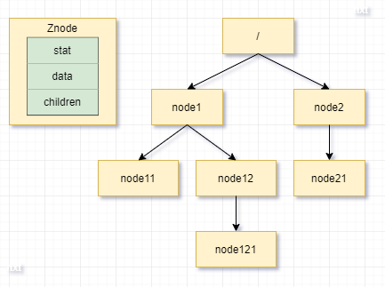
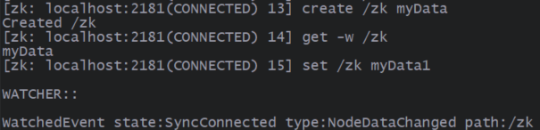
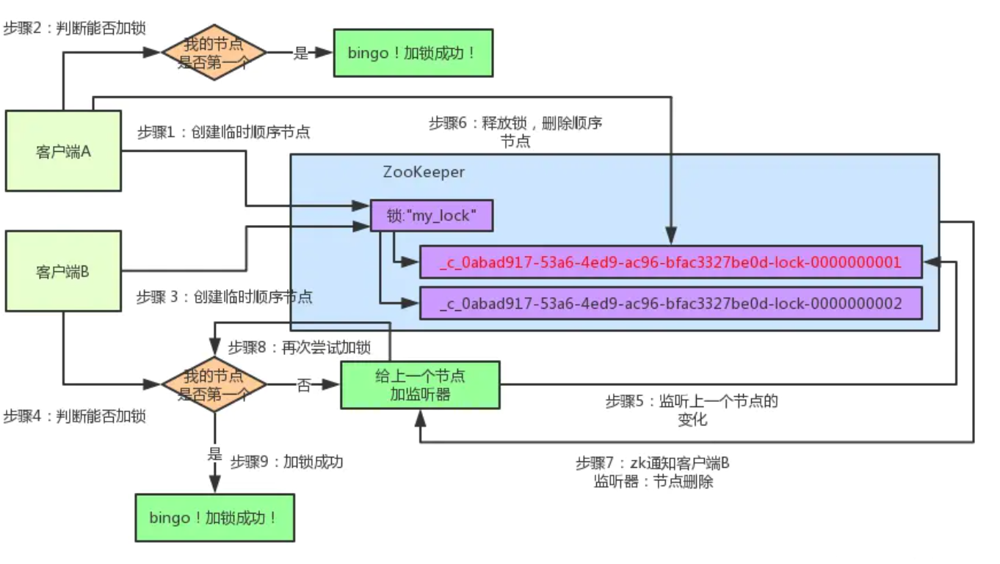
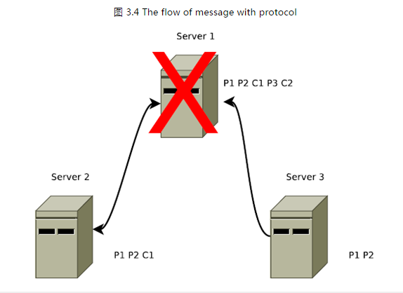
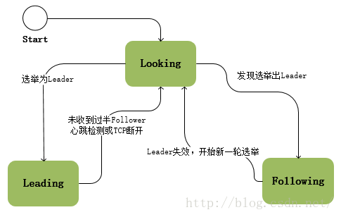
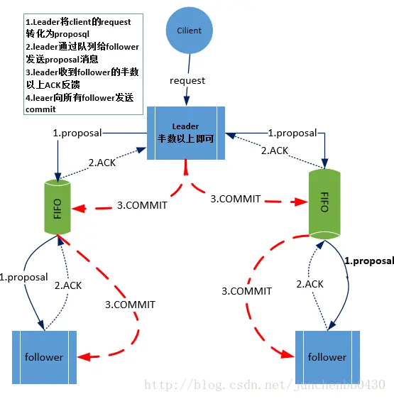
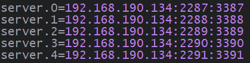
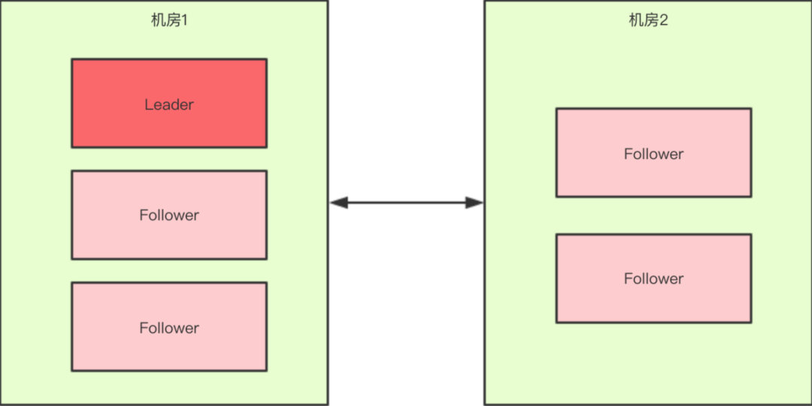

# ZooKeeper

> 基于 [ZooKeeper 学习——crazyYong](https://www.cnblogs.com/crazylqy/p/7490120.html)
>
> 以下版本为 ZooKeeper 3.6.3

## 一、基本概念

**背景 1**：


在一个系统中，会有多个应用（也就是系统的每个具体的功能），每个应用不在同一台物理机器上，这些应用通过网络进行交互，共同为用户提供服务，对用户来说这个系统的架构是透明的，他感觉不到这个系统是一个什么样的架构。那么我们就可以把这种系统称作一个**分布式系统**。

**背景 2**：

在分布式系统中，可能会有几个应用进程（位于不同物理机器上）都要**竞争同一个共享资源**，但是我们不希望它们同时进行操作，此时，我们可能会想到多个应用进程按照一定顺序操作这个共享资源，但是要知道一个前提——**网络总是不可靠的**，例如：

- A、B 顺序调用一个服务，但是网络延迟，可能导致 B 先调用服务。
- 对一个服务的调用调用失败并不一定是失败的，也有可能执行成功，但是在响应结果时失败。

**背景 3**：

这时候就需要一个**协调器**，这个协调器就相当于一个**锁**，让这些**进程同步有序地访问资源**。在分布式系统中的锁就叫**分布式锁**，通过分布式锁让多个进程同步地、有序地、安全地访问某个共享资源的技术，防止造成脏数据的技术就叫**分布式协调技术**。

分布式协调远比在同一台机器上对多个进程的调度要难得多，而且如果为每一个分布式应用都开发一个独立的协调程序。一方面，协调程序的反复编写浪费，且难以形成通用、伸缩性好的协调器；另一方面，协调程序开销比较大，会影响系统原有的性能。所以急需一种高可靠、高可用的通用协调机制来用以协调分布式应用。

目前，在分布式协调技术方面做得比较好的就是 **Google 的 Chubby** 和 **Apache 的 ZooKeeper**，由于 Chubby 不是开源的，所以 ZooKeeper 成为分布式协调技术的首选。

---

ZooKeeper 是一种为分布式应用所设计的**高可用、高性能的、一致的开源协调服务**，它提供了一项基本服务：**分布式锁服务**。由于 ZooKeeper 的开源特性，后来我们的开发者在分布式锁的基础上，摸索了出了其他的使用方法：**配置维护、组服务、分布式消息队列**、**分布式通知/协调**等。

## 二、ZooKeeper 操作

### （一）Znode

ZooKeeper 逻辑上是按照树型结构进行数据存储的，每个节点称为 ZNode。



与文件系统的目录树类似，Znode 并不是通过名称引用获取，而是通过**路径引用**获取，例如：想获取 node121 节点，需要像 Linux 一样，从根路径 `/` 出发，`/node1/node12/node121` 的方式获取。

> 注意：没另外说明时，子节点都是指当前节点的直接子节点。

#### 1、Znode 结构

每个 Znode 由三部分组成：

- stat：状态信息，用于存储版本、权限等信息。
- data：Znode 存储的数据。
  - Znode 节点存储的数据是**原子性的操作**，也就是说读操作将获取与节点相关的所有数据，写操作也将替换掉节点的所有数据。
- children：该 Znode 下的子节点。

stat 有如下属性：

| 属性名         | 描述                                                            |
| -------------- | --------------------------------------------------------------- |
| cZxid          | 创建节点时对应的 Zxid                                           |
| mZxid          | 修改节点时对应的 Zxid                                           |
| ctime          | 创建节点的时间                                                  |
| mtime          | 修改节点的时间                                                  |
| dataVersion    | 当前节点的版本号，修改操作会使 version 单调递增                 |
| cversion       | 增删子节点操作会使 cversion 单调递增                            |
| aclVersion     | acl 修改操作会使 aclVersion 单调递增                            |
| ephemeralOwner | 如果此节点为临时节点，那么值为节点拥有者的会话 ID；否则，值为 0 |
| dataLength     | 数据字节长度                                                    |
| numChildren    | 子节点个数                                                      |

> Zxid：使当前 Znode 节点状态改变的每一个操作都将使该节点接收到一个 Zxid 格式的时间戳，并且这个时间戳全局有序。也就是说，每个对节点的改变都将产生一个唯一的 Zxid，如果 Zxid1 的值小于 Zxid2 的值，那么 Zxid1 所对应的事件发生在 Zxid2 所对应的事件之前。

#### 2、Znode 类型

ZooKeeper 中的节点有两种：

- 临时节点：该节点的生命周期依赖于创建它们的会话（Session），一旦会话结束，临时节点将被自动删除（当然可以也可以手动删除）。虽然每个临时的 Znode 都会绑定到一个客户端会话，但他们对所有的客户端还是可见的。
  - ZooKeeper 的临时节点不允许拥有子节点。
- 持久节点：该节点的生命周期不依赖于会话，只能通过手动删除。

> 注意：节点类型在创建时即被确定，并且不能改变。

当创建 Znode 的时候，用户可以设置让 ZooKeeper 自动在路径结尾添加一个递增的计数，这个计数值是由一个单调递增的计数器来生成的，并且**对于此节点的父节点来说是唯一的**。它的格式为 `%10d`（10 位数字，没有数值的数位用 0 补充，例如：0000000001）。当计数值大于 232-1 时，计数器将溢出。

因此 Znode 总共分为 4 种类型：**临时节点、临时顺序节点、持久节点、持久顺序节点**。

#### 3、Watcher 监视器

由于 ZooKeeper 位于分布式环境下，ZooKeeper 是通过消息以网络的形式发送给分布式应用程序，所以需要一个通知机制——**Watcher 通知机制**。客户端在 Znode 上设置 Watcher（监视器），当节点状态发生更改时（Znode 的增删改）将会触发 Watcher 所对应的操作。

> 注意：
>
> - 为了减少网络流量，当 Watcher 被触发时，ZooKeeper 将会向客户端发送且仅发送一条通知，也就是 Watcher 触发一次后会被移除。不过 addWatch 命令例外。
> - 每个客户端添加的 Watcher 都是独立的，由当前客户端维护、监听。例如：client1 在 /node1 上添加了 Watcher，client2 更改此节点的数据，会触发 client1 上的 Watcher，但是 client2 没有此监听事件，要想有更改的监听事件，client2 也需要在/node1 上添加 Watcher。

### （二）[命令](https://zookeeper.apache.org/doc/r3.6.4/zookeeperCLI.html)

#### 1、连接

创建 ZooKeeper 客户端，连接至指定服务器。

```shell
./bin/zkCli.sh -server IP地址:端口
```

#### 2、create

创建一个 Znode 节点。

```shell
create [-s] [-e] [-c] [-t 数值] <path> [data数据] [acl权限]
```

| 参数值           | 描述                                                                                            |
| ---------------- | ----------------------------------------------------------------------------------------------- |
| -s               | 有序节点                                                                                        |
| -e               | 临时节点，默认是持久节点                                                                        |
| -c               | 容器节点，当前节点最后一个子节点被删除时，此节点也会被删除                                      |
| -t 数值          | 节点指定时间后删除，单位为 ms。必须在配置文件中添加配置 `zookeeper.extendedTypesEnabled = true` |
| path             | 节点路径，从 `/` 开始                                                                           |
| data             | 存储的数据                                                                                      |
| acl 权限控制方案 | acl 权限控制方案                                                                                |

#### 3、get

获取节点上的数据。

```shell
get [-s] [-w] <path>
```

| 参数值 | 描述                                                                                                                   |
| ------ | ---------------------------------------------------------------------------------------------------------------------- |
| -s     | 获取 stat 状态信息                                                                                                     |
| -w     | 添加一个 Watcher 监听器，如果 set 修改节点数据，会产生 NodeDataChanged 事件；当删除当前节点时，会产生 NodeDeleted 事件 |



必须设置监听器输出为 on，才会在终端输出 Watchers 监听事件信息：

```shell
printwatches on
```

#### 4、set

设置节点上的数据。

```shell
set [-s] [-v version] <path> data
```

- -s：查看更改后的 stat 信息。
- -v：CAS 判断版本信息后修改。

| 参数值 | 描述                   |
| ------ | ---------------------- |
| -s     | 获取 stat 状态信息     |
| -v     | CAS 判断版本信息后修改 |

#### 5、delete

删除节点。

```shell
delete [-v version版本号] <path>
```

若当前节点下有子节点，则不可以 delete 命令删除。ZooKeeper 提供 deleteall 命令用于**递归删除**指定节点及其下的所有节点。

```shell
deleteall <path>
```

#### 6、ls

列出当前节点下所有子节点路径。

```shell
ls [-s] [-w] [-R] <path>
```

- -s：查看其 stat 信息。
- -R：递归列出其所有子节点信息。
- -w：添加一个 watch 监听器，当子节点数量变动时，会产生 NodeChildrenChanged 事件。

| 参数值 | 描述                                                                                                                |
| ------ | ------------------------------------------------------------------------------------------------------------------- |
| -s     | 查看当前节点 stat 信息                                                                                              |
| -R     | 递归列出其所有子节点路径                                                                                            |
| -w     | 添加一个 Watcher 监听器，当增删子节点时，会产生 NodeChildrenChanged 事件；当删除当前节点时，会产生 NodeDeleted 事件 |

#### 7、[ACL 操作](https://blog.csdn.net/feixiang2039/article/details/79810102)

每一个节点都拥有自己的 ACL（Access Control List，访问控制列表），这个列表规定了用户的权限，即限定了特定用户对目标节点可以执行的操作。ACL 具有以下特点：

- ZooKeeper 的权限控制是基于每个 Znode 节点的，需要对每个节点设置权限。
- 每个 Znode 支持设置多种权限控制方案和多个权限。
- 子节点不会继承父节点的权限，客户端无权访问某节点，但可能可以访问它的子节点。

ACL 权限如下：

| ACL 权限 | ACL 简写 | 允许的操作                  |
| -------- | -------- | --------------------------- |
| CREATE   | c        | 创建子节点                  |
| READ     | r        | 获取节点的数据和它的子节点  |
| WRITE    | w        | 设置节点的数据              |
| DELETE   | d        | 删除子节点 （仅下一级节点） |
| ADMIN    | a        | 设置 ACL 权限               |

（1）getAcl

查看节点的 ACL 权限。

```shell
getAcl [-s] <path>
```

（2）setAcl

设置节点的 ACL 权限。

```shell
setAcl [-s] [-v version版本号] [-R] path acl权限控制方案
```

ZooKeeper 内置了一些权限控制方案，可以用以下方案为每个节点设置权限：

| 方案   | 描述                                     |
| ------ | ---------------------------------------- |
| world  | 只有一个用户：anyone，代表所有人（默认） |
| ip     | 使用 IP 地址认证                         |
| auth   | 使用已添加认证的用户认证                 |
| digest | 使用 `用户名:密码` 方式认证              |

① world：默认值，只有一种固定的写法 `world:anyone`，表示任何人。

```shell
setAcl <path> world:anyone:权限
```

② ip：可以是具体 IP 也可以是 IP/bit 格式，即 IP 转换为二进制，匹配前 bit 位，例如：`192.168.0.0/16` 匹配 `192.168.*.*`，表示指定 ip 才有的权限。

```shell
setAcl <path> ip:ip地址:权限
```

#### 8、[addWatch](https://blog.csdn.net/qq_42697271/article/details/125544017)

早期版本的 ZooKeeper 通过 `ls、get、stat` 的 -w 参数添加 Watcher，只能为已有的节点添加，并且只会触发一次，后续如果要继续监听事件的话，就需要再次使用该指令再次添加 Watcher。**两次监听之间必然会有时差，这就会导致会有某些事件未被捕捉到**。

为了解决上述问题，ZooKeeper 在 3.6.0 版本以后添加 addWatch 命令，用于添加持久的 Watcher。它能保证被触发之后仍然还有监听效果，可以继续监听 Znode 上的变更。

```shell
addWatch [-m model模式] <path>
```

model 模式有两个值：

- PERSISTENT_RECURSIVE：默认值，添加**持久化递归 Watcher**，递归就是此 Watcher 会递归监听其下的所有子节点，此监听器监听的事件有：
  - NodeCreated：**节点或子节点**创建的事件。
  - NodeDataChanged：**节点或子节点**数据修改的事件。
  - NodeDeleted：**节点或子节点**删除的事件。
  - PersistentWatchRemoved：节点 Watcher 被移除的事件。
- PERSISTENT：添加**持久化 Watcher**，此监听器监听的事件有：
  - NodeCreated：节点创建的事件。
  - NodeDataChanged：节点数据修改的事件。
  - NodeDeleted：节点删除的事件。
  - NodeChildrenChanged：增删子节点的事件。
  - PersistentWatchRemoved：节点 Watcher 被移除的事件。

removewatches 用于删除持久的 Watcher，会触发 PersistentWatchRemoved 事件：

```shell
removewatches <path>
```

> 注意：
>
> - 同一个客户端对同一个 Znode 节点添加 Watcher，后面添加的会覆盖前面的，只有最后一个 Watcher 生效。
> - removewatches 用于删除持久的 Watcher，若没有持久的 Watcher 则会报错。

## 三、ZooKeeper 应用

### （一）[ZooKeeper 分布式锁](https://www.cnblogs.com/crazymakercircle/p/14504520.html)

ZooKeeper 提供一项最基本应用——**分布式锁服务**，用于实现分布式协调技术，保证分布式应用有序地访问共享资源。

ZooKeeper 实现分布式的两个前提：

- 节点唯一：当某个节点被创建后，再次创建 path 路径的节点操作则会失败，满足锁的互斥条件。
- 有序节点：ZooKeeper 提供有序节点，对于父节点唯一。
- 监听机制：客户端可以在 Znode 上添加 Watcher 监听器，用于监听节点状态的变化。

> 以下 ZooKeeper 分布式锁先不考虑多线程环境。

#### 1、ZooKeeper 分布式锁实现

（1）实现 1

1. client1、client2 同时去创建 lock 路径的**持久节点**，当 client1 成功创建节点后（相当于获取了锁），client2 再去创建节点就会失败（相当于获取锁失败），此时 client2 需要在 lock 节点上添加 Watcher 监听器，用于监听节点删除事件。
2. 当有 client3 去创建 lock 持久节点时，因为 lock 节点已存在，所以创建节点失败，此时 client3 也需要在 lock 节点上添加 Watcher 监听器，用于监听节点删除事件。
3. 当 client1 主动删除 lock 节点后（就相当于释放锁），触发 client2、client3 的监听事件，client2、client3 重复步骤 1。

（2）实现 2

上面的分布式锁相当于非公平互斥锁，实现很简单，但是会有如下问题：

- 当创建 lock 节点的客户端应用宕机后，lock 持久节点不能被删除，导致其他线程不能获取锁。
- 当 lock 节点删除后，大量客户端的 Watcher 监听器被触发，产生羊群效应。

> 羊群效应（Herd Effect）表面上是指：一只头羊动起来，其他的羊也会不假思索地一哄而上，比喻从众心理。在这里是指可能有 1000 个客户端同时在 lock 节点上添加监听器， 当 lock 节点删除时，会导致大量的 Watcher 通知被发送到客户端，客户端不得不先处理这些监听事件，导致在通知期间的其它操作延迟，也有可能发送类似死锁的情况。

解决上面问题有两种办法：

- 创建**临时节点**而不是**持久节点**，这样当持有 lock 节点的客户端应用宕机后，临时节点也会被删除，其他线程可以重新获取锁。
- 创建**顺序节点**而不是**普通节点**，每个客户端获取锁时都会在 lock 节点下创建一个顺序节点：
  - 当前拥有顺序最小节点的客户端获取锁，其他客户端等待。
  - 后一个节点只监听前一个节点的删除事件，防止羊群效应。

优化后的分布式锁实现过程如下：



1. client1、client2 同时去创建 lock 路径的**临时顺序节点**。
2. 此时 client1、client2 需要判断自己创建的 lock 顺序节点是否是第一个，如果是，则代表获取锁成功；否则获取锁失败。
3. client1 创建的 lock 顺序节点是第一个，获取锁成功；client2 获取锁失败，需要在前一个节点上添加 Watcher 监听器，用于监听节点删除事件。
4. client1 释放锁时，删除 lock 临时顺序节点，此时触发 client2 的 Watcher 监听器，重复步骤 2。

**优缺点**：

- ZooKeeper 分布式锁能有效的解决分布式协调问题，使用起来也较为简单。
- 创建和删除节点的操作都是由 Leader 节点执行，并且需要同步到 Follower 节点上，这样频繁的网络通信和操作，在高性能、高并发的场景下性能不高。

#### 2、分布式锁的实现方案

在目前分布式锁实现方案中，比较成熟、主流的方案有两种：

- 基于 Redis 的分布式锁。
- 基于 ZooKeeper 的分布式锁。

两种锁分别适用的场景为：

- ZooKeeper 分布式锁遵循 CP 的设计理念，适用于高可靠（高可用）而并发量不是太大的场景。
- Redis 分布式锁遵循 AP 的设计理念，适用于并发量很大、性能要求很高的、而可靠性问题可以通过其他方案去弥补的场景。

### （二）[其他应用](https://www.cnblogs.com/crazymakercircle/p/14339702.html)

由于 ZooKeeper 中 Znode 本身机制及 Watcher 监听器，还有以下应用：

- **实现数据的发布和订阅**：可以把一些可能变化的配置数据放入 zookeeper 服务器，客户端可以订阅并监听这个配置，一旦配置更新，就可以重新获取配置。
- **命名服务** ：有时分布式系统需要一些命名，比如提供 RPC 服务地址的名称、全局唯一不能重复的主键等，利用 zookeeper 节点不重名的特点可以进行命名服务。
- **master 选举**：有时分布式系统中存在多台服务器，必须选出一台 master 来执行特定的计算任务，master 挂掉后，自动重新选出一台服务器担任 master 执行任务。这种情况可以使用 zookeeper 来实现，多个客户端创建同一个临时节点，只有一个可以成功，成功的节点就是 master，其他客户端监听该节点，一旦被删除，说明 master 宕机，重新开始新的选举。
- **负载均衡**：在消息队列的集群中，消息生产者需要比较均衡地将消息投递到不同的消息代理上，这里就涉及到负载均衡的使用。
- **分布式队列** ：客户端提交的任务信息可以保存到 zookeeper 中，利用 zookeeper 有序节点的特性，实现一个先进先出的队列，zookeeper 可以记录任务提交的拓扑信息并保持任务的有序调度。
- **分布式协调和通知** ：可以实现不同机器之间心跳监测（临时有序节点是否存在）、数据通信（向节点写入数据并监听变化）等场景。
- **集群元数据管理** ：每个集群的机器可以向 zookeeper 添加一个临时有序节点，只要节点存在表示机器存活。利用这个特点可以完成集群服务器的监控。还可以将主机的状态信息写入 zookeeper 的节点，监控中心订阅这些节点的数据来获得主机的实时信息。

## 四、[Curator](https://kaiwu.lagou.com/course/courseInfo.htm?courseId=393#/detail/pc?id=4467)

**背景 1**：

由于 ZooKeeper 原生 Java API 只提供了最简单的连接及节点操作，许多功能没有提供，例如：没有自动重连功能、没有级联删除功能、操作节点前需要先判断是否存在，于是 Netflix 发起了 Curator 项目，后面捐献给 Apache 基金会。

---

Apache Curator 是 Apache 基金会提供的一款 ZooKeeper 客户端，它提供了一套易用性和可读性非常强的 Fluent 风格的客户端 API ，可以帮助我们快速搭建稳定可靠的 ZooKeeper 客户端程序。

Curator 提供的 jar 包及对应功能如下：


> 注意：引入的 Curator 和 ZooKeeper 版本。

### （一）基本操作

```java
public static final String HOST = "192.168.190.134:2181";

public static final String HOST2 = "192.168.190.134:2182,192.168.190.134:2183";

private static final int TIMEOUT = 30000;

public static final String PATH = "/curator";

public static final CuratorFramework CLIENT;

static {
    // 重试策略。连接不上ZooKeeper集群会重试三次，间隔会递增
    RetryPolicy retryPolicy = new ExponentialBackoffRetry(TIMEOUT, 3);
    // 创建Curator客户端，连接ZooKeeper
    CLIENT = CuratorFrameworkFactory.newClient(HOST, retryPolicy);
    CLIENT.start();
}

/**
 * Description: 创建节点
 */
@Test
public void create() throws Exception {
    // 创建ZNode节点、节点类型、节点路径、节点数据，返回节点路径
    // 注意：创建节点时，其父节点必须存在，例如：直接创建【/curator/test】则报错
    String znodePath =
        CLIENT.create().withMode(CreateMode.PERSISTENT).withACL(ZooDefs.Ids.OPEN_ACL_UNSAFE).forPath(PATH, "myData".getBytes());
    log.info("ZNode路径：{}", znodePath);
}

/**
 * Description: 检查节点是否存在
 */
@Test
public void check() throws Exception {
    Stat stat = CLIENT.checkExists().forPath(PATH);
    log.info("stat: {}", stat);
}

/**
 * Description: 设置、获取ZNode中的数据
 */
@Test
public void getData() throws Exception {
    Stat stat = CLIENT.setData().forPath(PATH, "new Data".getBytes());

    byte[] data = CLIENT.getData().forPath(PATH);
    System.out.println(new String(data));
}

/**
 * Description: 创建、获取和删除ZNode节点
 */
@Test
public void createDelete() throws Exception {
    for (int i = 0; i < 3; i++) {
        // 创建多个临时顺序节点
        CLIENT.create().withMode(CreateMode.EPHEMERAL_SEQUENTIAL).forPath(PATH + "/child-");
    }

    // 获取所有节点，添加数据
    List<String> childrenPathList = CLIENT.getChildren().forPath(PATH);
    System.out.println(childrenPathList);
    childrenPathList.forEach(childPath -> {
        try {
            CLIENT.setData().forPath(PATH + "/" + childPath, ("new Data" + childPath).getBytes());
        } catch (Exception e) {
            e.printStackTrace();
        }
    });

    // 删除本节点及子节点
    CLIENT.delete().deletingChildrenIfNeeded().forPath(PATH);
}
```

### （二）事务

ZooKeeper 支持事务，Curator 提供具体事务操作的 API。

```java
@Test
public void transaction() throws Exception {
    // 定义几个基本操作
    CuratorOp createOp = CLIENT.transactionOp().create().forPath(PATH + "/one_path", "some data".getBytes());

    CuratorOp setDataOp = CLIENT.transactionOp().setData().forPath(PATH, "other data".getBytes());

    // 【/curator】节点下有子节点，会删除失败
    CuratorOp deleteOp = CLIENT.transactionOp().delete().forPath(PATH);

    // 事务执行结果
    // 删除【/curator】节点失败，导致事务回滚，其他的操作也失败
    List<CuratorTransactionResult> results = CLIENT.transaction().forOperations(createOp, setDataOp, deleteOp);

    // 遍历输出结果
    for (CuratorTransactionResult result : results) {
        System.out.println("执行结果是： " + result.getForPath() + "--" + result.getType());
    }
}
```

### （三）Background

Curator 提供 Background 异步操作。

```java
@Test
@SneakyThrows
void test() {
    // 异步操作直接返回，stat 为 null，若想获取值，则需要添加监听器
    Stat stat = CLIENT.setData().inBackground().forPath(PATH, "new Data".getBytes());
    System.out.println(stat);
}
```

### （四）Listener

Curator 提供的 Listener 监听器，不同 Listener 监听不同的事件。

```java
@Test
@SneakyThrows
void testCuratorListener() {
    // 添加 ConnectionStateListener 监听器
    CLIENT.getConnectionStateListenable().addListener(new MyConnectionStateListener());
    // 添加 CuratorListener 监听器
    CLIENT.getCuratorListenable().addListener(new MyCuratorListener());

    Stat stat1 = CLIENT.setData().forPath(PATH, "new Data1".getBytes());
    System.out.println("stat1：" + stat1);

    // Background 执行完后触发 CuratorListener 回调
    Stat stat2 = CLIENT.setData().inBackground().forPath(PATH, "new Data2".getBytes());
    System.out.println("stat2：" + stat2);

    System.in.read();
}


/**
 * Description: 监听 Curator 的 Background 操作
 */
static class MyCuratorListener implements CuratorListener {
    @Override
    public void eventReceived(CuratorFramework curatorFramework, CuratorEvent curatorEvent) throws Exception {
        switch (curatorEvent.getType()) {
            case CREATE:
                System.out.println("CREATE:" + curatorEvent.getPath());
                break;
            case DELETE:
                System.out.println("DELETE:" + curatorEvent.getPath());
                break;
            case EXISTS:
                System.out.println("EXISTS:" + curatorEvent.getPath());
                break;
            case GET_DATA:
                System.out.println("GET_DATA:" + curatorEvent.getPath() + "," + new String(curatorEvent.getData()));
                break;
            case SET_DATA:
                System.out.println("SET_DATA:" + new String(curatorEvent.getData()));
                break;
            case CHILDREN:
                System.out.println("CHILDREN:" + curatorEvent.getPath());
                break;
            default:
        }
    }

}

/**
 * Description: 监听 Curator 连接状态
 */
static class MyConnectionStateListener implements ConnectionStateListener {
    @Override
    public void stateChanged(CuratorFramework curatorFramework, ConnectionState connectionState) {
        switch (connectionState) {
                // 第一次成功连接到ZooKeeper之后会进入该状态。
                // 对于每个CuratorFramework对象，此状态仅出现一次
            case CONNECTED:
                break;
                // ZooKeeper的连接丢失
            case SUSPENDED:
                break;
                // 丢失的连接被重新建立
            case RECONNECTED:
                break;
                // 当Curator认为会话已经过期时，则进入此状态
            case LOST:
                break;
                // 连接进入只读模式
            case READ_ONLY:
                break;
        }
    }
}
```

### （五）Watcher

在 Curator 客户端中，我们可以使用 usingWatcher() 方法添加 Watcher，能够添加 Watcher 的有 checkExists()、getData()以及 getChildren() 三个方法。

```java
@Test
@SneakyThrows
void test() {
    List<String> children = CLIENT.getChildren().usingWatcher(new MyWatcher()).forPath(PATH);
    System.out.println(children);

    CLIENT.create().forPath(PATH + "/test");
    System.in.read();
}

@Test
@SneakyThrows
void test1() {
    // 添加永久监听器
    CLIENT.watchers().add().withMode(AddWatchMode.PERSISTENT).usingWatcher(new MyWatcher()).forPath(PATH + "/test1");
    CLIENT.create().forPath(PATH + "/test1");
}

/**
 * Description: Watcher 只触发一次
 */
static class MyWatcher implements CuratorWatcher {

    @Override
    public void process(WatchedEvent event) throws Exception {
        System.out.println(event.getType() + "," + event.getPath());
    }
}
```

### （六）Cache

Apache Curator 引入了 Cache 来实现对 ZooKeeper 服务端事件的监听。Cache 是 Curator 中对事件监听的包装，其对事件的监听其实可以近似看作是一个本地缓存视图和远程 ZooKeeper 视图的对比过程。同时，**Curator 能够自动为开发人员处理反复注册监听**，从而大大简化了代码的复杂程度。

- NodeCache：对指定节点的【增删改】操作进行监听。
- PathChildrenCache：对指定节点的一级子节点的【增删】进行监听。
- TreeCache：对指定节点及其子节点进行监听，也就是上面两个结合。

```java
/**
 * Description: 对指定节点的【增删改】操作进行监听
 * 注意：该节点不存在时也可以添加nodeCache；
 */
@Test
public void nodeCacheTest() throws Exception {
    NodeCache nodeCache = new NodeCache(CLIENT, PATH);

    // 启动缓存，默认为false。设置为true时，NodeCache在第一次启动时立刻从Zookeeper上读取对应节点的数据，并保存在NodeCache中
    nodeCache.start(true);

    // 返回当前节点的视图（可以理解将ZNode的数据及部分信息封装成ChildData对象），节点不存在时为null
    ChildData childData = nodeCache.getCurrentData();
    if (childData != null) {
        log.info("当前节点：{}，数据{}", childData.getPath(), new String(childData.getData()));
    }

    // 添加监听器（此监听器仅监听状态改变，没有表明是哪个状态改变）

    nodeCache.getListenable().addListener(() -> {
        String data = new String(nodeCache.getCurrentData().getData());
        System.out.println("NodeCache节点路径：" + nodeCache.getCurrentData().getPath() + "，节点数据为：" + data);
    });
}

/**
 * Description: 对指定节点的一级子节点的【增删】进行监听
 */
@Test
public void pathChildrenCache() throws Exception {
    // 这里true也表示缓存节点数据
    PathChildrenCache pathChildrenCache = new PathChildrenCache(CLIENT, "/curator", true);

    // 指定初始化的模式
    // NORMAL：普通异步初始化
    // BUILD_INITIAL_CACHE：同步初始化
    // POST_INITIALIZED_EVENT：异步初始化，初始化后会触发事件
    pathChildrenCache.start(PathChildrenCache.StartMode.BUILD_INITIAL_CACHE);

    // 获取子节点的视图列表，当节点不存在或子节点不存时，List为empty
    // 注意：当初始化模式为异步时，这里List为empty
    List<ChildData> childDataList = pathChildrenCache.getCurrentData();
    System.out.println("获取子节点列表：");
    childDataList.forEach(childData -> {
        log.info("当前子节点：{}，数据{}", childData.getPath(), new String(childData.getData()));
    });

    // 添加Watcher
    pathChildrenCache.getListenable().addListener((client, event) -> {
        switch (event.getType()) {
                // 当初始化模式为POST_INITIALIZED_EVENT时，触发此事件
            case INITIALIZED:
                System.out.println("PathChildrenCache:子节点初始化成功...");
                break;
            case CHILD_ADDED:
                String path = event.getData().getPath();
                System.out.println("PathChildrenCache添加子节点:" + event.getData().getPath());
                System.out.println("PathChildrenCache子节点数据:" + new String(event.getData().getData()));
                break;
            case CHILD_UPDATED:
                System.out.println("PathChildrenCache修改子节点路径:" + event.getData().getPath());
                System.out.println("PathChildrenCache修改子节点数据:" + new String(event.getData().getData()));
                break;
            case CHILD_REMOVED:
                System.out.println("PathChildrenCache删除子节点:" + event.getData().getPath());
                break;
            default:

        }
    });

    System.in.read();
}

/**
 * Description: 对指定节点及其子节点进行监听，也就是上面两个结合
 */
@Test
public void treeCache() throws Exception {
    // 这里true也表示缓存节点数据
    TreeCache treeCache = TreeCache.newBuilder(CLIENT, "/curator").setCacheData(true).build();

    // 注意：添加Watcher的步骤放在start()前后无所谓
    treeCache.getListenable().addListener((client, event) -> {
        if (event.getData() != null) {
            System.out.println("TreeCache,type=" + event.getType() + " path=" + event.getData().getPath());
        } else {
            System.out.println("TreeCache,type=" + event.getType());
        }
    });

    treeCache.start();

    System.in.read();
}
```

### （七）curator-x-discovery

curator-x-discovery 扩展包是一个服务发现的解决方案，通过 curator-x-discovery 包，可以自定义实现**服务注册与发现**。

其中有一些关键类：

- ServiceInstance：也就是服务实例的抽象，对应着 ZooKeeper 上的 Znode 节点。
- ServiceDiscovery：实现服务注册和发现功能。也就是 ServiceInstance 的注册到 ZooKeeper 上，以及从 ZooKeeper 获取 ServiceInstance。
  - 提供通过 name 获取 ServiceInstance 的方法。
  - 提供获取所有 ServiceInstance 的方法。
- ServiceCache：实现服务发现功能。如果程序中会频繁地查询 ServiceInstance 对象，我们可以添加 ServiceCache 缓存，ServiceCache 会在内存中缓存 ServiceInstance 实例的列表，并且添加相应的 Watcher 来同步更新缓存。另外，ServiceCache 上还可以添加 Listener 来监听缓存变化。
  - 提供获取所有 ServiceInstance 的方法。
- ServiceProvider：实现服务发现功能。
  - 其中通过不同策略获取 ServiceInstance 的方法：
    - RoundRobinStrategy：轮询策略。
    - RandomStrategy：随机策略。
    - StickyStrategy：粘性策略，总是选择相同地一个。
  - 提供获取所有 ServiceInstance 的方法。

```java
private static final String ROOT = "/myCurator";

@SneakyThrows
public static void main(String[] args) {
    Demo07_Registry registry = new Demo07_Registry();

    ServiceInfo serviceInfo1 = new ServiceInfo(ROOT, "192.168.190.132", 8004);
    registry.registryRemote(serviceInfo1);
    ServiceInfo serviceInfo2 = new ServiceInfo(ROOT, "192.168.190.133", 8005);
    registry.registryRemote(serviceInfo2);

    Thread.sleep(5000);

    List<ServiceInfo> serviceInfoList1 = registry.queryServiceCache();
    serviceInfoList1.forEach(System.out::println);

    List<ServiceInfo> serviceInfoList2 = registry.queryServiceDiscovery(ROOT);
    serviceInfoList2.forEach(System.out::println);

    List<ServiceInfo> serviceInfoList3 = registry.queryServiceProvider(new RoundRobinStrategy<>());
    serviceInfoList3.forEach(System.out::println);

    System.in.read();
}

// curator-x-discovery 扩展包的入口类
private final ServiceDiscovery<ServiceInfo> serviceDiscovery;

// ServiceCache 由于缓存 ServiceInstance
private final ServiceCache<ServiceInfo> serviceCache;

private static final CuratorFramework CLIENT = Demo01_CuratorApi.CLIENT;

public Demo07_Registry() throws Exception {
    // 阻塞直到连接上 ZooKeeper
    CLIENT.blockUntilConnected();

    // 序列化器
    InstanceSerializer<ServiceInfo> serializer = new JsonInstanceSerializer<>(ServiceInfo.class);

    // 初始化并启动 ServiceDiscovery
    serviceDiscovery = ServiceDiscoveryBuilder
        .builder(ServiceInfo.class)
        .client(CLIENT)
        .basePath(ROOT)
        .watchInstances(true) // 监听 ServiceInstance 的变化
        .serializer(serializer)
        .build();
    serviceDiscovery.start();

    // 初始化并启动 ServiceCache，监听 ROOT 节点（没有时创建）的变化，用于更新 ServiceCache
    serviceCache = serviceDiscovery.serviceCacheBuilder().name(ROOT).build();
    serviceCache.start();
}

/**
 * Description: 服务注册
 *
 * @param serviceInfo serviceInfo
 */
public void registryRemote(ServiceInfo serviceInfo) throws Exception {
    // 将 ServerInfo 对象转换成 ServiceInstance 对象
    ServiceInstance<ServiceInfo> serviceInstance = ServiceInstance.<ServiceInfo>builder()
        .name(serviceInfo.getName()) // name 就是 ROOT 节点下的子节点
        .id(UUID.randomUUID().toString()) // id 就是 name 节点下的子节点
        .address(serviceInfo.getHost())
        .port(serviceInfo.getPort())
        .payload(serviceInfo)
        .build();

    // 注册到 ZooKeeper 中
    serviceDiscovery.registerService(serviceInstance);
}

/**
 * Description: 通过 ServiceCache 获取全部的 ServiceInstance 对象
 *
 * @return java.util.List<com.studynotes.curator.demo02.Demo01_Registry.ServiceInfo>
 */
public List<ServiceInfo> queryServiceCache() {
    // 查询 ServiceCache 获取全部的 ServiceInstance 对象
    List<ServiceInstance<ServiceInfo>> serviceInstanceList = serviceCache.getInstances();
    return serviceInstanceList.stream().map(ServiceInstance::getPayload).collect(Collectors.toList());
}

/**
 * Description: 通过 ServiceDiscovery 获取指定 name （也就是 name 节点下的子节点）的 ServiceInstance 对象
 *
 * @param name ServiceInstance 的 name 属性
 */
public List<ServiceInfo> queryServiceDiscovery(String name) throws Exception {
    return serviceDiscovery.queryForInstances(name).stream().map(ServiceInstance::getPayload).collect(Collectors.toList());
}

/**
 * Description: 通过 ServiceProvider 获取 ServiceInstance 对象
 *
 * @param strategy 策略模式，通过不同的策略获取 ServiceInstance 对象
 */
public List<ServiceInfo> queryServiceProvider(ProviderStrategy<ServiceInfo> strategy) throws Exception {
    // 初始化并启动 ServiceProvider，获取 ROOT 节点（没有时创建）下的子节点
    ServiceProvider<ServiceInfo> serviceProvider =
        serviceDiscovery.serviceProviderBuilder().providerStrategy(strategy).serviceName(ROOT).build();
    serviceProvider.start();

    int i = 100;
    List<ServiceInfo> serviceInfoList = new ArrayList<>();
    while (i-- > 0) {
        // 从 ServiceProvider 中获取 ServiceInstance 对象
        ServiceInstance<ServiceInfo> serviceInstance = serviceProvider.getInstance();
        if (serviceInstance != null) {
            System.out.println(serviceInstance.getPayload());
            serviceInfoList.add(serviceInstance.getPayload());
        }
    }
    return serviceInfoList;
}


@Data
@AllArgsConstructor
@NoArgsConstructor
private static class ServiceInfo {

    private String name;

    private String host;

    private int port;
}
```

### （八）分布式锁

Curator 中提供的分布式锁：

- InterProcessMutex：可重入互斥锁。
- InterProcessSemaphoreMutex：不可重入互斥锁。
- InterProcessReadWriteLock：读写锁。

```java
 private static final String ZK_LOCK_PATH = "/curator/lock";

@Test
public void zookeeperLockTest() {
    Thread t1 = new Thread(this::doWithLock, "t1");
    Thread t2 = new Thread(this::doWithLock, "t2");

    t1.start();
    t2.start();

    try {
        System.in.read();
    } catch (IOException e) {
        e.printStackTrace();
    }
}

private void doWithLock() {
    String threadName = Thread.currentThread().getName();
    InterProcessMutex lock = new InterProcessMutex(CLIENT, ZK_LOCK_PATH);
    System.out.println(threadName + " is running");
    try {
        lock.acquire();
        System.out.println(threadName + " hold lock");
        Thread.sleep(5000L);
        System.out.println(threadName + " release lock");
    } catch (Exception e) {
        e.printStackTrace();
    } finally {
        try {
            lock.release();
        } catch (Exception e) {
            e.printStackTrace();
        }
    }
}
```

## 五、[ZooKeeper 原理](https://www.cnblogs.com/crazymakercircle/p/14339702.html)

### （一）ZooKeeper 角色

在 ZooKeeper 集群中，ZooKeeper 服务器节点分为三种角色：


1、领导者（Leader）

一个 ZooKeeper 集群只有一个 Leader 节点，Leader 负责协调集群中的其他节点。有以下作用：

- 接收读写请求，进行读写操作。
  - Leader 可以接受 Client 请求，也接收其他 Server 转发的写请求，负责更新系统状态。
  - 由于 Leader 是 ZooKeeper 集群性能瓶颈，从性能的角度考虑，**Leader 可以选择不接受客户端的连接**，将 leaderServes 配置设置为 true。
- 负责进行投票的发起和决议。
- 在 ZAB 崩溃恢复之后，消息广播之前，进行集群中的数据同步。

2、跟随者（Follower）

一个集群中有多个 Follower 节点，有以下作用：

- 接收读写请求，读请求本地处理后返回；写请求转发给 Leader 节点，写入成功后响应。
- 在写操作和选主过程中参与投票。

3、观察者（Observer）

**情景 1**：

当我们想扩展 ZooKeeper 集群、提高集群性能时，就需要向集群中添加更多的 ZooKeeper 节点，**然而客户端写入请求需要 ZooKeeper 集群中一半以上节点成功写入才返回**，这意味着越多的节点导致写操作越慢，降低集群写吞吐量。

---

对于以上问题，ZooKeeper 在 3.3.0 引入 Observer 角色，有以下特点：

- Observer 可以像 Follower 节点一样，接收客户端读写请求，请求本地处理后返回；写请求转发给 Leader 节点，写入成功后响应。
- **Observer 不参与任何的投票操作**。
  - 例如：在写操作过程中，不会参与投票操作（也就是服务器不关心 Observer 是否写入成功），仅仅是在最后和其他 Server 一起得到投票结果。

**优点**：

- 加入更多 Observer 节点，提高集群伸缩性，同时不影响吞吐率。
- Observer 不参与投票，所以它们不是 ZooKeeper 整体的关键部分。因此，它们可能会失败或与集群断开连接，而不会损害 ZooKeeper 服务的可用性。

### （二）Zab 协议

Client 会随机的连接到 ZooKeeper 集群中的一个节点。

> 注意：ZooKeeper 集群会有很多节点， 客户端在建立连接时，会随机挑选一个节点。

ZK 集群对客户端的请求，可分为以下两种：

- 读请求：客户端直接从当前节点（其建立连接的节点）中读取数据；

- 写请求：要想保持集群各个节点状态一致，这里就涉及到了分布式事务。 客户端就会向 Leader 提交事务，Leader 接收到事务提交，会广播该事务，只要超过半数节点写入成功，该事务就会被提交。

ZooKeeper 的核心是原子广播，这个机制保证了各个 Server 之间的同步。实现这个机制的协议叫做 Zab 协议（**ZooKeeper Atomic Broadcast** ，ZooKeeper 原子广播），**ZooKeeper 是通过 Zab 协议来保证分布式事务的最终一致性**。

Zab 协议又分为两种模式：**恢复模式**和**广播模式**。

#### 1、恢复模式

当**集群重启**或**Leader 掉线**时，Zab 协议进入崩溃恢复模式，选举产生新的 Leader。Zab 的崩溃恢复开始起作用时，为了防止数据不一致，有如下两个确保：



**Zab 协议需要确保已经在 Leader 提交的事务最终被所有服务器提交**：

例如：事务 Server1（Leader 角色）提交了事务 P1、P2，这也就说明 P1、P2 已经被所有服务器（其实是一半以上）提交。

**Zab 协议需要确保丢弃只在 Leader 服务器上被提交的事务**：

例如：Server1 提交了事务 P3，但是其他 Follower 没有提交，则当 Leader 服务器重新加入集群时，会丢失 P3。

##### （1）节点状态

每个 Server 在工作过程中有三种状态：

- Looking：系统刚启动时或者 Leader 崩溃后正处于选举状态，当前 Server 不知道 Leader 是谁，正在搜寻。
- Leading：当前 Server 即为选举出来的 Leader。
- Following：Leader 已经选举出来，当前 Server 作为 Follower 与之同步。

在 ZooKeeper 的整个生命周期中，每个节点都可能会在 Looking、Following、Leading 状态间不断转换：



##### （2）Zab 选主

Zab 默认采用 TCP 版本的 FastLeaderElection 选举算法：

① 若集群重启，所有 Server 初始状态为 Looking；若由于 Leader 掉线导致的重新选主，则将所有 Server 状态变为 Looking。

② 第一轮先选自己，选票为【clock(1)，looking、Zxid、myid】。

- clock 表示第几轮选举，重启时为 0，选举时加 1。如果其他节点选票的 clock 大，更新自己的 clock。
- Zxid 表示当前节点的最大事务 id。
- myid 表示 Server 的 id。

③ 进行第一轮广播选票，同时也会收到其他 Server 广播的选票，进行处理：

- 如果接收到的投票 Zxid 大于自己的 Zxid，就认可当前收到的投票，则更新自己选票的相应值为该节点值，表示选举该节点。
- 如果接收到的投票 Zxid 小于自己的 Zxid，那么就坚持的投票，不做任何变更。
- 如果接收到的投票 Zxid 等于自己的 Zxid，再对比 myid：
  - 比自己大，就认可当前收到的投票，表示选举该节点；如果比自己小，那就坚持自己的投票，不做变更。

④ 进行第二轮广播选票，将步骤 ③ 中处理后的结果进行广播，集群中每台机器都会再次收到其他机器的投票，然后开始统计，如果一台机器收到超过了半数的相同投票，那么这个投票对应的 myid 机器即为 Leader。

**简单来说，通常哪台服务器上的数据越新、myid 值越大，那么越有可能成为 Leader。**

##### （3）状态更改

上面的 Zab 选主步骤会选出一个准 Leader 节点，其他 Follower 节点继续以下操作：

① Follower 和准 Leader 进行通信，获取准 Leader 生成新的 epoch，更新自身的 acceptedEpoch。

Zxid 由 64 位数字组成，其中高 32 为表示为 epoch。当产生新 Leader 的时候，就获取此 Leader 上最大的 Zxid，从里面读出 epoch+1，作为一个新 epoch，并将低 32 位置 0（保证 id 绝对自增）。

**也就是说，每代新 Leader 的 epoch 值自增**。

② Follower 同步 Leader 中的数据，当 quorum（指集群中半数以上的节点）都同步完成，准 Leader 才会成为真正的 Leader。

③ 到了这个阶段，**ZooKeeper 集群才能正式对外提供事务服务**，并且 Leader 可以进行消息广播。如果有新的节点加入，该 Follower 节点自动进入恢复模式，同时进行步骤 ①② 一样的操作。

#### 2、广播模式

当新的 Leader 出来了，并且已有过半机器完成同步之后，ZAB 协议将退出恢复模式，**进入消息广播模式**。



广播模式用于同步 Server 之间的数据，保持数据的最终一致性，有以下步骤：

0. Client 发起写请求，如果是 Follower 节点接收到该请求，那么它会将该请求转发给 Leader 节点处理。
1. Leader 将此写请求转化为一个事务 Proposal（提议），并为其设置 Zxid 值。Leader 为每个 Follower 节点分配分配一个单独的队列，然后将需要广播的 Proposal 依次放到队列中取，并且根据 FIFO 策略进行消息发送。
2. Follower 接收到 Proposal 后，**会丢弃 epoch 或 Zxid 小于当前值的 Proposal**，会首先将其以事务日志的方式写入本地磁盘中，写入成功后向 Leader 反馈一个 Ack 响应消息。
3. Leader 接收到超过**半数以上** Follower 的 Ack 响应消息后，即认为消息发送成功，向所有 Follower 广播 commit 消息，同时自身也会完成事务提交。Follower 接收到 commit 消息后，会将上一条事务提交。

在消息广播阶段：

* 当Leader节点在超时世界呢你能正常收到来自Follower的心跳，那Follower节点会一直与该节点保持连接。
* 若超时时间内Leader没有接收到来自过半Follower节点的心跳或TCP连接断开，那么Leader会结束当前周期的领导，切换到Looking状态，所有Follower节点也会放弃该Leader节点，切换到Looking状态，然后**开始新一轮选举**。

## 六、疑问

### （一） 为什么 ZooKeeper 集群的数目，一般为奇数个？

Leader 选举算法采用了 Paxos 协议，Paxos 核心思想：当多数 Server 写成功，则任务数据写成功如果有 3 个 Server，则 2 个写成功即可；如果有 4 或 5 个 Server，则 3 个写成功即可。

Server 数目一般为奇数，如果有 3 个 Server，则至少 2 个 Server 正常运行，也就是最多允许 1 个 Server 挂掉；如果有 4 个 Server，则同样至少 2 个 Server 正常运行，最多允许 1 个 Server 挂掉。

由此，我们看出 3 台服务器和 4 台服务器的的容灾能力是一样的，所以为了节省服务器资源，一般我们采用奇数个数，作为服务器部署个数。

> 注意：判断集群是否挂掉时，是根据配置文件中的配置的最大节点数决定的，掉线节点数小于最大节点数一半时，集群正常工作。
>
> 例如：配置文件中配置 5 个节点，总共 3 个节点掉线时，此集群失效，不再对外提供服务。
>
> 

### （二）[各节点又不是强一致性，而是最终一致性，怎么保证获取到最新数据](https://stackoverflow.com/questions/41492819/can-observer-nodes-in-zookeeper-respond-with-stale-results)？

ZooKeeper 不能保证集合中的每个服务器始终完全是最新的，因此如果需要获取到最新的数据，需要执行 sync()方法，让 Server 先同步 Leader 中的数据。

### （三）[脑裂问题是什么？ZooKeeper 如何解决？](https://cloud.tencent.com/developer/article/1758883)

脑裂问题（Split Brain）是指由于网络问题，导致 master 节点失联，当集群重新选举出一个 master 节点后，旧的 master 节点又重新连接上集群，造成一个集群中有两个 master 节点，就类似于有两个大脑。在这种前提下，每个消费者连接的 master 节点不一致，导致在同一时刻获取的状态也不一致。

脑裂问题有两种情景：

**情景 1**：



机房 1 中有 3 台 Server、机房 2 中有 2 台 Server，中间有条网线连接，共同组成了 5 台 Server 的集群。如果中间网线断了，此时集群就会分成两个小集群：

- 机房 1 中 Leader 正常运行，只是会感觉少了 2 个节点，客户端正常和 Leader 交互。
- 机房 2 中联系不到 Leader，会进行重新选举，选举出一个新 Leader，客户端向新的 Leader 交互。

当中间网线修好后，两个小集群又会组成原来的集群，但是此时会发现，有两个 Leader 节点，那么该以哪个 Leader 中的数据为准呢？此时就产生了脑裂的问题。

**现实是不会发生上面的情况，因为有过半机制，也就是只有集群中一半以上的 Server 正常运行时，集群才能正常向外通过服务**。上面的情况中，机房 1 集群中有 3（3 > Math.ceil(5 / 2)）个节点，可以正常运行；机房 2 集群只有 2（2 < Math.ceil(5 / 2)）个节点，不能正常运行，也不会进行选举操作。

**情景 2**：

由于网络原因，Leader 节点和其他节点失联，集群选举出新的 Leader 后，旧的 Leader 又重新连接上集群，旧的 Leader 仍然认为自己是 Leader，像其他 Follower 发出写请求。那么该以哪个 Leader 中的数据为准呢？此时就又产生了脑裂的问题。

然而事实是，在选举出新的 Leader 后，会更新 Follower 中的 epoch 字段，Follower 会拒绝 epoch 小于当前值的事务。

那有没有 Follower 不知道新的 Leader 存在呢，有可能，但肯定不是大多数，否则新 Leader 无法产生。ZooKeeper 的写也遵循 quorum 机制，因此，得不到大多数支持的写是无效的，旧 Leader 即使各种认为自己是 Leader，依然没有什么作用。
